# Data Science with Python: NumPy, pandas, Matplotlib, Seaborn and Statistics

The data toolkit every data analyst, data scientist and AI/ML engineer uses, explained from zero, in **levels**: **Basic** (NumPy arrays) → **Easy** (pandas tables: loading, selecting, cleaning) → **Moderate** (grouping, merging, reshaping, time series, big data with Polars and DuckDB; charts with Matplotlib and Seaborn) → **Advanced** (statistics, A/B testing, a full EDA, preparing data for machine learning) → **Interview Prep**. **Each part uses only what earlier parts taught.**

Every section has the same shape: a **picture** where it helps, **theory** in plain words, **Python** you can run, and **practice** with hidden answers and links. Every example was run with NumPy 2.4, pandas 3.0, Matplotlib 3.11, Seaborn 0.13 and SciPy 1.17: results under **Output** are real, and every chart image was produced by the code next to it.

Each part ends with a ✅ **checkpoint**. After these notes, continue with `machine-learning.md`. The SQL notes (`sql-postgresql.md`) teach the database side of the same work.

## Table of Contents

**[Part 1 — Basic: NumPy, Fast Arrays of Numbers](#part-1--basic-numpy-fast-arrays-of-numbers)**

1. [How to Use These Notes (and Set Up Your Data Toolkit)](#1-how-to-use-these-notes-and-set-up-your-data-toolkit)
2. [NumPy Arrays: Creating and Inspecting](#2-numpy-arrays-creating-and-inspecting)
3. [NumPy Indexing, Slicing and Boolean Masks](#3-numpy-indexing-slicing-and-boolean-masks)
4. [Vectorised Maths, Aggregations and Broadcasting](#4-vectorised-maths-aggregations-and-broadcasting)
5. [Reshaping, Stacking and Linear Algebra Basics](#5-reshaping-stacking-and-linear-algebra-basics)

**[Part 2 — Easy: pandas, Working with Tables](#part-2--easy-pandas-working-with-tables)**

6. [pandas Series and DataFrames](#6-pandas-series-and-dataframes)
7. [Reading and Writing Data: CSV, Excel, JSON, Parquet and SQL](#7-reading-and-writing-data-csv-excel-json-parquet-and-sql)
8. [Selecting and Filtering: [], loc, iloc and query](#8-selecting-and-filtering--loc-iloc-and-query)
9. [Cleaning Data: Missing Values, Duplicates, Types and Text](#9-cleaning-data-missing-values-duplicates-types-and-text)
10. [Transforming Data: New Columns, apply, map, binning and assign](#10-transforming-data-new-columns-apply-map-binning-and-assign)

**[Part 3 — Moderate: Analysing Data with pandas](#part-3--moderate-analysing-data-with-pandas)**

11. [Grouping and Summarising: groupby and agg](#11-grouping-and-summarising-groupby-and-agg)
12. [Combining Tables: merge, join and concat](#12-combining-tables-merge-join-and-concat)
13. [Reshaping: pivot_table, melt, crosstab and explode](#13-reshaping-pivot_table-melt-crosstab-and-explode)
14. [Dates and Time Series: resample, rolling and shift](#14-dates-and-time-series-resample-rolling-and-shift)
15. [Bigger and Faster: Memory, Arrow, Polars and DuckDB](#15-bigger-and-faster-memory-arrow-polars-and-duckdb)

**[Part 4 — Moderate: Charts with Matplotlib and Seaborn](#part-4--moderate-charts-with-matplotlib-and-seaborn)**

16. [Your First Charts with Matplotlib](#16-your-first-charts-with-matplotlib)
17. [Matplotlib in Depth: Layouts, Styling and Annotations](#17-matplotlib-in-depth-layouts-styling-and-annotations)
18. [Statistical Charts with Seaborn](#18-statistical-charts-with-seaborn)
19. [Choosing the Right Chart (and Not Misleading)](#19-choosing-the-right-chart-and-not-misleading)

**[Part 5 — Advanced: Statistics and Getting Data Ready for ML](#part-5--advanced-statistics-and-getting-data-ready-for-ml)**

20. [Describing Data: Averages, Spread, Outliers and Correlation](#20-describing-data-averages-spread-outliers-and-correlation)
21. [Probability, Distributions, Sampling and Confidence Intervals](#21-probability-distributions-sampling-and-confidence-intervals)
22. [Hypothesis Tests and A/B Testing](#22-hypothesis-tests-and-ab-testing)
23. [A Complete Exploratory Data Analysis (EDA)](#23-a-complete-exploratory-data-analysis-eda)
24. [Preparing Data for Machine Learning: Feature Engineering Basics](#24-preparing-data-for-machine-learning-feature-engineering-basics)

**[Part 6 — Interview Prep: Revision](#part-6--interview-prep-revision)**

25. [Interview Problems: pandas and NumPy](#25-interview-problems-pandas-and-numpy)
26. [Data Science Cheat Sheet](#26-data-science-cheat-sheet)
27. [Most Asked Data Science Theory Questions](#27-most-asked-data-science-theory-questions)

---

# Part 1 — Basic: NumPy, Fast Arrays of Numbers

> **Goal:** Set up your toolkit, then create, select, calculate with and reshape NumPy arrays: the foundation of every data and AI library.  
> **You need:** Basic Python: variables, lists, dicts, loops and functions (Parts 1–3 of `dsa-python.md`, or `python.md`).

---

## 1. How to Use These Notes (and Set Up Your Data Toolkit)

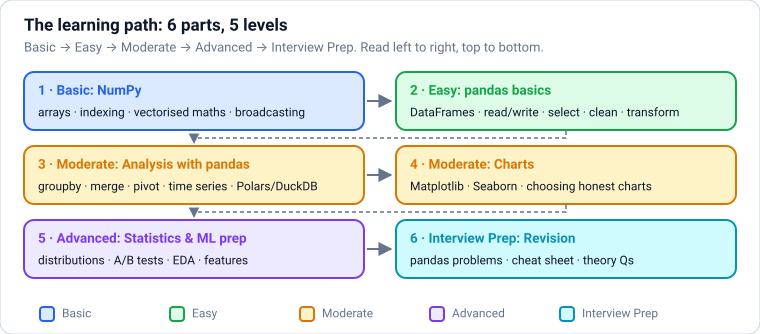

### Theory

> **In simple words:** data science means **turning raw data into answers**: cleaning it, exploring it, summarising it, drawing it, and testing ideas with statistics. In Python, four libraries do most of the work: **NumPy** (fast arrays of numbers), **pandas** (tables), **Matplotlib** (charts) and **Seaborn** (statistical charts built on Matplotlib).

**The data workflow** (you'll repeat this loop in every project):

1. **Ask** a clear question: "Which products sell best in which cities?"
2. **Get the data**: files (CSV, Excel, Parquet), databases (SQL, see `sql-postgresql.md`), APIs.
3. **Clean it**: missing values, wrong types, duplicates, typos. This is often most of the work.
4. **Explore it** (EDA, exploratory data analysis): summaries, groupings and charts to find patterns and problems.
5. **Model it** (optional): statistics or machine learning (the `machine-learning.md` notes).
6. **Communicate**: a chart, a table, a dashboard, a decision.

**How these notes are organised:**

| Part | Level | You learn |
|---|---|---|
| 1 | Basic | NumPy: arrays, indexing, vectorised maths, broadcasting, reshaping, linear algebra basics |
| 2 | Easy | pandas: Series and DataFrames, reading and writing data, selecting, cleaning, transforming |
| 3 | Moderate | pandas analysis: groupby, merging, reshaping, time series, performance, Polars and DuckDB |
| 4 | Moderate | Charts: Matplotlib, Seaborn, choosing the right chart |
| 5 | Advanced | Statistics for data science: descriptive stats, distributions, hypothesis tests and A/B tests, a full EDA, preparing features for ML |
| 6 | Interview Prep | Cheat sheet and interview questions |

Every example was run with **NumPy 2.4, pandas 3.0, Matplotlib 3.11, Seaborn 0.13 and SciPy 1.17**; results under **Output** are real, and every chart image was produced by the code next to it. You need basic Python first (lists, dicts, loops, functions: Parts 1–3 of `dsa-python.md` or `python.md`).

**Set up (pick one):**

- **Google Colab** (colab.research.google.com): free notebooks in the browser with everything installed. The easiest start.
- **Local, with `uv`** (the fast, modern Python package manager): `uv venv`, then `uv pip install numpy pandas matplotlib seaborn scipy scikit-learn jupyterlab pyarrow`, then `jupyter lab`.
- **Local, with pip:** `python -m venv .venv`, activate it, then `pip install ...` the same list.
- **VS Code** opens `.ipynb` notebooks directly with the Jupyter extension.

**Jupyter notebooks** mix code cells, their output and notes in one document, which suits exploration. The last expression in a cell is displayed automatically (a DataFrame shows as a formatted table). For code that runs repeatedly (pipelines, apps), move it into `.py` files and functions.

**Conventional import names** (everyone uses them, so do too):

```text
import numpy as np
import pandas as pd
import matplotlib.pyplot as plt
import seaborn as sns
```

### Practice

1. Open a notebook (Colab or local) and run `import numpy as np, pandas as pd; print(np.__version__, pd.__version__)`.
2. Pick a small dataset you care about (your expenses, a sports season, weather in your city) to practise on alongside these notes.

---

## 2. NumPy Arrays: Creating and Inspecting

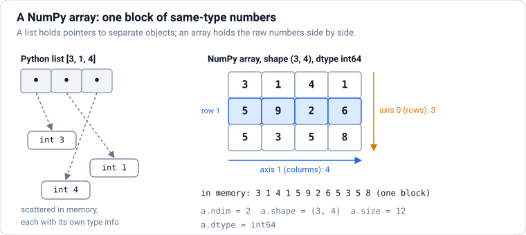

### Theory

> **In simple words:** a NumPy **array** is like a Python list of numbers, but **all the numbers have the same type and sit side by side in memory**. That lets NumPy do maths on millions of numbers at C speed, in one line, without a Python loop.

**Why not just use lists?** A Python list stores pointers to separate number objects scattered in memory, and a loop handles them one at a time. An array stores raw numbers in one block (like the arrays in the DSA notes), and operations run in optimised compiled code. Summing a million numbers is typically **10–100× faster** with NumPy. pandas, scikit-learn, PyTorch and almost every data library are built on arrays.

**Key properties of an array `a`:**

| Attribute | Meaning | Example |
|---|---|---|
| `a.ndim` | Number of dimensions (axes) | 1 for a vector, 2 for a table/matrix |
| `a.shape` | Size along each axis | `(3, 4)`: 3 rows, 4 columns |
| `a.size` | Total number of elements | 12 |
| `a.dtype` | The element type | `int64`, `float64`, `bool` |

**Creating arrays:**

| Code | Makes |
|---|---|
| `np.array([1, 2, 3])` | From a list (a list of lists makes a 2D array) |
| `np.zeros((2, 3))`, `np.ones(5)`, `np.full((2, 2), 7)` | Filled with 0s / 1s / a value |
| `np.arange(0, 10, 2)` | Like `range`: 0, 2, 4, 6, 8 |
| `np.linspace(0, 1, 5)` | 5 evenly spaced numbers from 0 to 1, **including** 1 |
| `np.eye(3)` | The 3 × 3 identity matrix |
| `rng = np.random.default_rng(42)` then `rng.random(3)`, `rng.integers(1, 7, 10)`, `rng.normal(0, 1, 5)` | Random numbers from a seeded generator (repeatable) |

**dtypes** decide memory and precision: `int64` and `float64` (the defaults), `float32` (half the memory; common in deep learning), `bool`, and `int8`/`uint8` (images). Mixing types upcasts: `np.array([1, 2.5])` becomes `float64`. Convert with `a.astype(np.float32)`.

**Random numbers, the modern way:** create a **Generator** with `np.random.default_rng(seed)` and call its methods. The seed makes results repeatable, which matters for experiments. (Old code uses `np.random.seed()` and `np.random.rand()`; prefer the Generator.)

### Python

```python
import numpy as np

a = np.array([3, 1, 4, 1, 5])
m = np.array([[1, 2, 3],
              [4, 5, 6]])
print(a, a.dtype, a.shape)
print(m.ndim, m.shape, m.size)
print(np.arange(0, 10, 2), np.linspace(0, 1, 5))
print(np.zeros((2, 3)))
print(np.array([1, 2.5]).dtype, np.array([1, 2, 3]).astype(np.float32).dtype)
```

**Output:**

```text
[3 1 4 1 5] int64 (5,)
2 (2, 3) 6
[0 2 4 6 8] [0.   0.25 0.5  0.75 1.  ]
[[0. 0. 0.]
 [0. 0. 0.]]
float64 float32
```

```python
rng = np.random.default_rng(42)               # seeded: the same numbers every run
print(rng.integers(1, 7, size=10))            # 10 dice rolls
print(rng.normal(loc=170, scale=10, size=3).round(1))   # 3 heights from a normal distribution

import time
nums = list(range(1_000_000))
arr = np.arange(1_000_000)
t0 = time.perf_counter(); total_list = sum(x * 2 for x in nums); t1 = time.perf_counter()
total_arr = (arr * 2).sum(); t2 = time.perf_counter()
print(total_list == total_arr, (t1 - t0) > (t2 - t1))    # same answer; NumPy is faster
```

**Output:**

```text
[1 5 4 3 3 6 1 5 2 1]
[157.  171.3 166.8]
True True
```

**Common mistakes:**

- ❌ Growing an array in a loop with `np.append` (it copies the whole array each time: O(n²)). ✅ Build a list and convert once, or pre-allocate with `np.zeros(n)`.
- ❌ Expecting `np.array([1, 2, "3"])` to be numeric (it becomes an array of strings).
- ❌ Using the old global `np.random.seed`; prefer a `default_rng` Generator passed around explicitly.

### Practice

1. Create a 3 × 4 array of the numbers 1 to 12, and print its shape, size and dtype.
2. Simulate 1,000 coin flips (0 or 1) with a seeded generator and print the fraction of heads.

<details>
<summary><b>Answer</b></summary>

```python
grid = np.arange(1, 13).reshape(3, 4)
print(grid, grid.shape, grid.size, grid.dtype)
flips = np.random.default_rng(0).integers(0, 2, size=1000)
print(flips.mean())
```

**Output:**

```text
[[ 1  2  3  4]
 [ 5  6  7  8]
 [ 9 10 11 12]] (3, 4) 12 int64
0.537
```

(`reshape` is covered in Section [5](#5-reshaping-stacking-and-linear-algebra-basics); `mean` of 0/1 values is the fraction of 1s.)

</details>

**Learn more:** [NumPy: the absolute basics for beginners](https://numpy.org/doc/stable/user/absolute_beginners.html)

---

## 3. NumPy Indexing, Slicing and Boolean Masks

### Theory

> **In simple words:** you pick parts of an array the same way as a list (`a[2]`, `a[1:4]`), but with one position **per axis**: `m[row, col]`. And you can filter with a condition: `a[a > 3]` keeps only the values greater than 3.

**Indexing by position:**

| Code | Picks |
|---|---|
| `a[0]`, `a[-1]` | First / last element |
| `a[1:4]`, `a[::2]`, `a[::-1]` | A slice, every 2nd element, reversed |
| `m[1, 2]` | Row 1, column 2 (one element) |
| `m[0]` or `m[0, :]` | The whole first row |
| `m[:, 1]` | The whole second column |
| `m[:2, 1:]` | First two rows, columns 1 onwards |

**Boolean masks: filtering by condition.** `a > 3` produces an array of `True`/`False`, one per element. Using it as an index keeps the `True` positions. Combine conditions with `&` (and), `|` (or) and `~` (not), **with brackets** around each condition: `a[(a > 1) & (a < 5)]`. (Python's `and`/`or` don't work on arrays.)

**Fancy indexing:** index with a list of positions: `a[[0, 2, 4]]`.

**Views vs copies (important!).** A **slice** returns a **view**: a window onto the same memory. Changing the view changes the original. Boolean and fancy indexing return **copies**. When you need an independent copy of a slice, call `.copy()`.

**Changing values by condition:** `a[a < 0] = 0` sets every negative value to 0. `np.where(cond, x, y)` builds a new array choosing `x` where the condition is true and `y` elsewhere, like `CASE` in SQL.

### Python

```python
import numpy as np

m = np.arange(1, 13).reshape(3, 4)     # 3 rows, 4 columns
print(m)
print(m[1, 2], m[0], m[:, 1], sep="\n")
print(m[:2, 1:])
```

**Output:**

```text
[[ 1  2  3  4]
 [ 5  6  7  8]
 [ 9 10 11 12]]
7
[1 2 3 4]
[ 2  6 10]
[[2 3 4]
 [6 7 8]]
```

```python
scores = np.array([45, 82, 67, 91, 38, 74])
passed = scores >= 50
print(passed)
print(scores[passed], scores[(scores > 60) & (scores < 90)], scores[[0, -1]])
print(np.where(scores >= 50, "pass", "fail"))

view = scores[:3]
view[0] = 100                          # a slice is a VIEW: this changes scores too
print(scores)
safe = scores[:3].copy()
safe[0] = -1                           # a copy is independent
print(scores[0], safe[0])

temps = np.array([12.5, -3.0, 7.1, -0.5])
temps[temps < 0] = 0                   # clip negatives to zero
print(temps)
```

**Output:**

```text
[False  True  True  True False  True]
[82 67 91 74] [82 67 74] [45 74]
['fail' 'pass' 'pass' 'pass' 'fail' 'pass']
[100  82  67  91  38  74]
100 -1
[12.5  0.   7.1  0. ]
```

**Common mistakes:**

- ❌ `a[a > 1 and a < 5]` (a `ValueError`: "truth value of an array is ambiguous"). ✅ `a[(a > 1) & (a < 5)]`.
- ❌ Modifying a slice and being surprised the original changed.
- ❌ Writing `m[0][1]` instead of `m[0, 1]` (it works, but makes a temporary row first).

### Practice

1. From `m = np.arange(1, 13).reshape(3, 4)`, take the last column and the bottom-right 2 × 2 block.
2. From `rng.integers(0, 100, 20)`, keep the even numbers greater than 50.

<details>
<summary><b>Answer</b></summary>

```python
m = np.arange(1, 13).reshape(3, 4)
print(m[:, -1], m[-2:, -2:], sep="\n")
x = np.random.default_rng(1).integers(0, 100, 20)
print(x[(x % 2 == 0) & (x > 50)])
```

**Output:**

```text
[ 4  8 12]
[[ 7  8]
 [11 12]]
[82 94 86 82 64 54]
```

</details>

**Learn more:** [NumPy: indexing on ndarrays](https://numpy.org/doc/stable/user/basics.indexing.html)

---

## 4. Vectorised Maths, Aggregations and Broadcasting

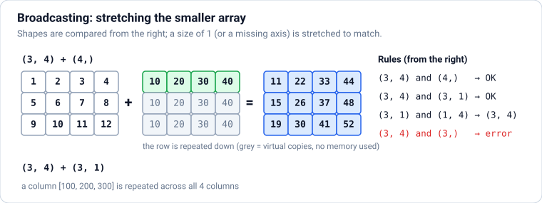

### Theory

> **In simple words:** in NumPy you write maths on **whole arrays** at once (`prices * 1.18`) instead of looping over elements. This is called **vectorisation**. **Broadcasting** is the rule that lets arrays of different shapes work together, like adding one row of numbers to every row of a table.

**Element-wise operations:** `+ - * / // % **`, comparisons, and "universal functions" (**ufuncs**) such as `np.sqrt`, `np.exp`, `np.log`, `np.abs`, `np.round`, `np.maximum(a, b)` all work element by element and return a new array.

**Aggregations** squash an array into fewer numbers: `sum`, `mean`, `median`, `std`, `min`, `max`, `argmin`/`argmax` (the **position** of the min/max), `cumsum` (running totals), `percentile`. On a 2D array, the **axis** says which direction to squash:

- `axis=0` → collapse the rows → one result **per column** ("down the columns").
- `axis=1` → collapse the columns → one result **per row** ("across the rows").
- No axis → one number for the whole array.

**Broadcasting rules.** Compare the shapes from the **right**. Two sizes are compatible if they're **equal**, or **one of them is 1** (that axis is stretched to match). Missing leading dimensions count as 1.

| Shapes | Works? | Result |
|---|---|---|
| `(3, 4)` + `(4,)` | ✅ The row is added to each of the 3 rows | `(3, 4)` |
| `(3, 4)` + `(3, 1)` | ✅ The column is added to each of the 4 columns | `(3, 4)` |
| `(3, 1)` + `(1, 4)` | ✅ Both stretch: every pair | `(3, 4)` |
| `(3, 4)` + `(3,)` | ❌ 4 vs 3 | Error: reshape to `(3, 1)` first |

A classic use: **standardising** columns: `(X - X.mean(axis=0)) / X.std(axis=0)` subtracts each column's mean from that column, for every row at once.

**Missing values** in floats are `np.nan` (not a number). Any maths with `nan` gives `nan`, so use `np.nansum`, `np.nanmean`, etc., or filter with `~np.isnan(a)`.

### Python

```python
import numpy as np

prices = np.array([60.0, 15.5, 1200.0, 350.0])
qty = np.array([5, 10, 1, 2])
print(prices * qty, (prices * qty).sum())          # revenue per line, and total
print(np.round(prices * 1.18, 2), np.sqrt([4, 9, 16]))

sales = np.array([[10, 20, 30],     # rows = stores, columns = months
                  [ 5, 15, 25],
                  [ 8, 12, 40]])
print(sales.sum(), sales.sum(axis=0), sales.sum(axis=1))   # total, per month, per store
print(sales.mean(axis=0).round(2), sales.argmax(axis=1), sales.cumsum(axis=1)[0])
```

**Output:**

```text
[ 300.  155. 1200.  700.] 2355.0
[  70.8    18.29 1416.    413.  ] [2. 3. 4.]
165 [23 47 95] [60 45 60]
[ 7.67 15.67 31.67] [2 2 2] [10 30 60]
```

```python
body = np.array([[170, 65], [182, 80], [158, 52]])   # columns: height, weight
col_means = body.mean(axis=0)                        # shape (2,)
print(col_means, (body - col_means).round(1))        # broadcast (3,2) - (2,)

standardised = (body - body.mean(axis=0)) / body.std(axis=0)
print(standardised.round(2), np.allclose(standardised.mean(axis=0), 0))   # each column now has mean 0

row = np.array([1, 2, 3])
col = np.array([[10], [20]])
print(row + col)                                           # (2,1) + (3,) → (2,3)

data = np.array([2.0, np.nan, 4.0])
print(data.mean(), np.nanmean(data))
```

**Output:**

```text
[170.          65.66666667] [[  0.   -0.7]
 [ 12.   14.3]
 [-12.  -13.7]]
[[ 0.   -0.06]
 [ 1.22  1.25]
 [-1.22 -1.19]] True
[[11 12 13]
 [21 22 23]]
nan 3.0
```

**Common mistakes:**

- ❌ Looping over elements in Python when a vectorised expression exists.
- ❌ Mixing up `axis=0` and `axis=1`. Remember: the axis you name is the one that **disappears**.
- ❌ Broadcasting a `(3,)` array against `(3, 4)` expecting per-row behaviour: use `a[:, None]` (shape `(3, 1)`).
- ❌ `mean` on data with `nan` without `nanmean`.

### Practice

1. Given exam scores `s` of shape (5 students, 3 subjects), find each student's average and each subject's top score.
2. Convert a `(3,)` array of temperatures in Celsius to Fahrenheit (`F = C × 9/5 + 32`) without a loop.

<details>
<summary><b>Answer</b></summary>

```python
s = np.random.default_rng(7).integers(40, 100, size=(5, 3))
print(s.mean(axis=1).round(1), s.max(axis=0))
c = np.array([0, 25, 100])
print(c * 9 / 5 + 32)
```

**Output:**

```text
[84.7 84.3 62.  69.  67.7] [96 77 92]
[ 32.  77. 212.]
```

</details>

**Learn more:** [NumPy: broadcasting](https://numpy.org/doc/stable/user/basics.broadcasting.html)

---

## 5. Reshaping, Stacking and Linear Algebra Basics

### Theory

> **In simple words:** the same numbers can be arranged in different shapes (a row of 12, or 3 rows of 4). Reshaping changes the arrangement without changing the numbers. Linear algebra (matrix multiplication and friends) is the maths underneath machine learning, and NumPy does it in one operator: `@`.

**Changing shape:**

| Code | Does |
|---|---|
| `a.reshape(3, 4)` | Rearrange into 3 × 4 (the total size must match); `-1` means "work it out": `a.reshape(-1, 2)` |
| `a.ravel()` / `a.flatten()` | Back to 1D (`flatten` always copies) |
| `a.T` | Transpose: rows ↔ columns |
| `a[:, None]` or `np.expand_dims(a, 1)` | Add an axis: `(3,)` → `(3, 1)` |
| `np.squeeze(a)` | Remove axes of size 1 |

**Combining:** `np.concatenate([a, b], axis=0)` joins along an existing axis; `np.vstack` stacks rows, `np.hstack` stacks side by side, `np.stack` creates a new axis.

**Linear algebra essentials:**

- **Dot product** of two vectors: multiply pairs and add: `a @ b` (or `np.dot`). It measures how aligned two vectors are; cosine similarity (used for embeddings in AI) is a normalised dot product.
- **Matrix multiplication** `A @ B`: row i of A dotted with column j of B gives entry (i, j). Shapes must line up: `(m, n) @ (n, p)` → `(m, p)`. **This is the core operation of neural networks**: a layer computes `inputs @ weights + bias`.
- `*` is **element-wise**, not matrix multiplication (a very common bug).
- `np.linalg`: `inv` (inverse), `det` (determinant), `solve` (solve `Ax = b`, better than using the inverse), `norm` (length of a vector), `eig` (eigenvalues, used by PCA), `svd`.

**Why ML engineers care:** a dataset is a matrix `X` of shape (samples, features). Linear regression's prediction is `X @ w + b`; PCA uses eigenvectors of the covariance matrix; embeddings are compared with dot products. The `machine-learning.md` notes build on exactly these operations.

### Python

```python
import numpy as np

a = np.arange(12)
print(a.reshape(3, 4), a.reshape(-1, 6).shape, a.reshape(3, 4).T.shape, sep="\n")
print(np.array([1, 2, 3])[:, None].shape)

x = np.array([[1, 2], [3, 4]])
y = np.array([[5, 6], [7, 8]])
print(np.vstack([x, y]).shape, np.hstack([x, y]).shape, np.stack([x, y]).shape)
```

**Output:**

```text
[[ 0  1  2  3]
 [ 4  5  6  7]
 [ 8  9 10 11]]
(2, 6)
(4, 3)
(3, 1)
(4, 2) (2, 4) (2, 2, 2)
```

```python
u, v = np.array([1, 2, 3]), np.array([4, 5, 6])
print(u @ v, np.linalg.norm(u).round(3))                   # 1·4 + 2·5 + 3·6 = 32
cos = (u @ v) / (np.linalg.norm(u) * np.linalg.norm(v))
print(round(float(cos), 4))                                # cosine similarity

A = np.array([[2, 1], [1, 3]])
B = np.array([[1, 0], [2, 1]])
print(A @ B)       # matrix product
print(A * B)       # element-wise: a different thing!

# solve 2x + y = 5, x + 3y = 10
print(np.linalg.solve(A, np.array([5, 10])))

# one "neural network layer": 4 samples × 3 features  @  3 × 2 weights  + bias
X = np.array([[1.0, 0.5, 2.0], [0.0, 1.0, 1.0], [2.0, 2.0, 0.0], [1.0, 1.0, 1.0]])
W = np.array([[0.1, -0.2], [0.4, 0.3], [-0.5, 0.2]])
b = np.array([0.01, 0.02])
print((X @ W + b).round(2), (X @ W + b).shape)
```

**Output:**

```text
32 3.742
0.9746
[[4 1]
 [7 3]]
[[2 0]
 [2 3]]
[1. 3.]
[[-0.69  0.37]
 [-0.09  0.52]
 [ 1.01  0.22]
 [ 0.01  0.32]] (4, 2)
```

**Common mistakes:**

- ❌ `A * B` when you meant `A @ B`.
- ❌ Shape mismatches in `@`: check `(m, n) @ (n, p)`; print `.shape` often.
- ❌ Computing `inv(A) @ b` instead of `np.linalg.solve(A, b)` (slower and less accurate).
- ❌ Reshaping to a size that doesn't divide evenly.

### Practice

1. Turn `np.arange(24)` into shape `(2, 3, 4)`, then into `(6, 4)`.
2. Compute the cosine similarity between `[1, 0, 1]` and `[0, 1, 1]`.

<details>
<summary><b>Answer</b></summary>

```python
t = np.arange(24).reshape(2, 3, 4)
print(t.shape, t.reshape(6, 4).shape)
p, q = np.array([1, 0, 1]), np.array([0, 1, 1])
print(round(float(p @ q / (np.linalg.norm(p) * np.linalg.norm(q))), 3))
```

**Output:**

```text
(2, 3, 4) (6, 4)
0.5
```

</details>

---

### ✅ Part 1 checkpoint

Without looking, can you:

- [ ] Create arrays with `array`, `arange`, `linspace`, `zeros` and a seeded random Generator, and read their `shape` and `dtype`?
- [ ] Index rows, columns and blocks of a 2D array, and filter with a boolean mask using `&` and `|`?
- [ ] Explain views vs copies?
- [ ] Aggregate along `axis=0` and `axis=1`, and predict whether two shapes broadcast?
- [ ] Reshape arrays, and explain the difference between `*` and `@`?

**Learn more:** [NumPy: linear algebra](https://numpy.org/doc/stable/reference/routines.linalg.html) · [3Blue1Brown: Essence of linear algebra (videos)](https://www.3blue1brown.com/topics/linear-algebra)

---

# Part 2 — Easy: pandas, Working with Tables

> **Goal:** Load data into DataFrames, inspect it, select what you need, clean it and create new columns.  
> **You need:** Part 1.

---

## 6. pandas Series and DataFrames

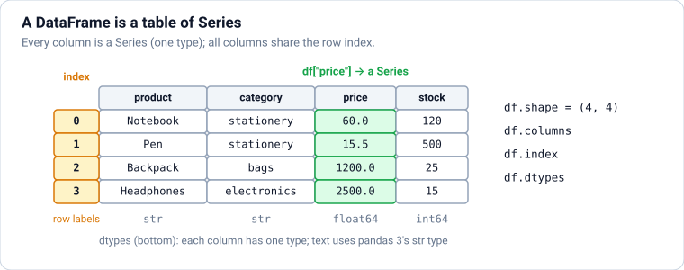

### Theory

> **In simple words:** pandas gives Python a **table** type, the **DataFrame**: rows and named columns, like a spreadsheet or a SQL table, but controlled from code. Each column is a **Series**: a labelled NumPy-style array of one type.

**Series:** a one-dimensional array with an **index** (labels for each position): `pd.Series([10, 20, 30], index=["a", "b", "c"])`. Maths and comparisons work element by element, as in NumPy, and values are matched **by label**, not by position.

**DataFrame:** a set of Series (columns) that share one index (the row labels). Create one from a dict of columns, a list of dicts (one per row), a NumPy array, or by reading a file (next section).

**First things to run on any DataFrame `df`:**

| Code | Tells you |
|---|---|
| `df.head()`, `df.tail(3)`, `df.sample(5)` | A few rows |
| `df.shape` | (rows, columns) |
| `df.columns`, `df.index` | Column names, row labels |
| `df.dtypes` | The type of each column |
| `df.info()` | Types, non-null counts and memory in one view |
| `df.describe()` | Count, mean, std, min, quartiles and max of numeric columns |
| `df["col"].value_counts()` | How often each value appears |
| `df["col"].unique()`, `.nunique()` | Distinct values / how many |

**Column types (dtypes) in pandas 3:** `int64`, `float64`, `bool`, `datetime64`, `category`, and **`str`**, the new default type for text (pandas 3.0 replaced the old catch-all `object` type for strings with a real string type, faster and clearer). Missing values show as `NaN` (numbers) or `NaN`/`<NA>` depending on the type.

**The index** labels rows. By default it's 0, 1, 2, …; you can make a column the index (`df.set_index("order_id")`) for fast lookups by that key, and move it back with `reset_index()`.

**pandas 3 and copy-on-write.** In pandas 3.0, every operation behaves as if it returns a **new** object: changing a subset never silently changes the original DataFrame. That removed a long-standing source of bugs (and the famous `SettingWithCopyWarning`). The rule: **assign results back** (`df = df.dropna()`), and modify columns with `df.loc[...] = ...` or `df["col"] = ...`.

### Python

```python
import pandas as pd

s = pd.Series([2500, 1200, 60], index=["Headphones", "Backpack", "Notebook"], name="price")
print(s, s["Backpack"], s[s > 100].index.tolist(), sep="\n")

df = pd.DataFrame({
    "product": ["Notebook", "Pen", "Backpack", "Headphones", "Mug"],
    "category": ["stationery", "stationery", "bags", "electronics", "kitchen"],
    "price": [60.0, 15.5, 1200.0, 2500.0, 250.0],
    "stock": [120, 500, 25, 15, 80],
})
print(df)
print(df.shape, df.columns.tolist())
print(df.dtypes)
```

**Output:**

```text
Headphones    2500
Backpack      1200
Notebook        60
Name: price, dtype: int64
1200
['Headphones', 'Backpack']
      product     category   price  stock
0    Notebook   stationery    60.0    120
1         Pen   stationery    15.5    500
2    Backpack         bags  1200.0     25
3  Headphones  electronics  2500.0     15
4         Mug      kitchen   250.0     80
(5, 4) ['product', 'category', 'price', 'stock']
product         str
category        str
price       float64
stock         int64
dtype: object
```

```python
print(df.describe().round(1))
print(df["category"].value_counts())
print(df.set_index("product").loc["Mug", "price"])
```

**Output:**

```text
        price  stock
count     5.0    5.0
mean    805.1  148.0
std    1062.5  201.3
min      15.5   15.0
25%      60.0   25.0
50%     250.0   80.0
75%    1200.0  120.0
max    2500.0  500.0
category
stationery     2
bags           1
electronics    1
kitchen        1
Name: count, dtype: int64
250.0
```

**Common mistakes:**

- ❌ Looping over rows (`for i, row in df.iterrows()`) for work pandas can do on whole columns.
- ❌ Forgetting to assign results: `df.dropna()` returns a new DataFrame; `df` itself is unchanged.
- ❌ Chained assignment like `df[df.price > 100]["stock"] = 0`: in pandas 3 it never changes `df`. ✅ `df.loc[df["price"] > 100, "stock"] = 0`.

### Practice

1. Build a DataFrame of 4 students with `name`, `maths` and `science` columns, then print its shape and the average of each subject.

<details>
<summary><b>Answer</b></summary>

```python
students = pd.DataFrame({"name": ["Asha", "Ravi", "Meera", "Arjun"],
                         "maths": [88, 72, 95, 60], "science": [79, 85, 91, 70]})
print(students.shape, students[["maths", "science"]].mean().tolist())
```

**Output:**

```text
(4, 3) [78.75, 81.25]
```

</details>

**Learn more:** [pandas: 10 minutes to pandas](https://pandas.pydata.org/docs/user_guide/10min.html)

---

## 7. Reading and Writing Data: CSV, Excel, JSON, Parquet and SQL

### Theory

> **In simple words:** real data lives in files and databases. pandas has a `read_…` function for each format that turns it into a DataFrame, and a matching `to_…` method that writes a DataFrame back out.

| Format | Read | Write | Notes |
|---|---|---|---|
| CSV | `pd.read_csv(path)` | `df.to_csv(path, index=False)` | Plain text; universal, but slow and loses types |
| Excel | `pd.read_excel(path, sheet_name=...)` | `df.to_excel(path, index=False)` | Needs `openpyxl` |
| JSON | `pd.read_json(path)` | `df.to_json(path, orient="records")` | APIs and logs (`lines=True` for one JSON object per line) |
| **Parquet** | `pd.read_parquet(path)` | `df.to_parquet(path)` | **Columnar, compressed, keeps types**: the modern standard for analytics (needs `pyarrow`) |
| SQL | `pd.read_sql(query, connection)` | `df.to_sql(name, connection)` | Any database via SQLAlchemy (see `sql-postgresql.md`) |
| Clipboard, HTML tables, Feather, … | `read_clipboard`, `read_html`, … | | |

**Useful `read_csv` options:** `sep=";"`, `usecols=[...]` (load only some columns), `dtype={"id": "int32"}`, `parse_dates=["date"]` (turn text into real dates), `na_values=["-", "n/a"]` (extra markers for missing values), `nrows=1000` (peek at a huge file), `chunksize=100_000` (process a huge file in pieces), `encoding="utf-8"`.

**Why Parquet?** A CSV stores everything as text, so every read re-parses numbers and dates, and types can be lost (a ZIP code "01234" becomes 1234). Parquet stores each column separately, compressed, **with its type**: files are often 5–10× smaller and much faster to read, and you can read only the columns you need. Data lakes, Spark, DuckDB and Polars all use it.

**Reading from a database** keeps the heavy lifting in SQL: filter and aggregate in the query, then load the (smaller) result into pandas.

### Python

```python
import io
import pandas as pd

csv_text = """order_id,date,customer,city,product,category,qty,price
1,2025-01-05,Asha,Pune,Notebook,stationery,5,60
2,2025-01-06,Ravi,Mumbai,Headphones,electronics,1,2500
3,2025-02-10,Asha,Pune,Backpack,bags,1,1200
4,2025-02-11,Meera,Pune,Keyboard,electronics,1,1800
5,2025-03-02,Zoya,Mumbai,Water bottle,kitchen,2,350
6,2025-03-15,Kabir,Bengaluru,Desk lamp,electronics,1,900
7,2025-03-20,Asha,Pune,Headphones,electronics,1,2500
8,2025-04-01,Isha,Delhi,Mug,kitchen,4,250
9,2025-04-18,Ravi,Mumbai,Notebook,stationery,10,60
10,2025-05-05,Zoya,Mumbai,Keyboard,electronics,1,1800
"""
orders = pd.read_csv(io.StringIO(csv_text), parse_dates=["date"])   # a file path works the same way
print(orders.head(3))
print(orders.dtypes)
```

**Output:**

```text
   order_id       date customer    city     product     category  qty  price
0         1 2025-01-05     Asha    Pune    Notebook   stationery    5     60
1         2 2025-01-06     Ravi  Mumbai  Headphones  electronics    1   2500
2         3 2025-02-10     Asha    Pune    Backpack         bags    1   1200
order_id             int64
date        datetime64[us]
customer               str
city                   str
product                str
category               str
qty                  int64
price                int64
dtype: object
```

(`io.StringIO` makes the text behave like a file, so the example is self-contained; normally you'd write `pd.read_csv("orders.csv", parse_dates=["date"])`.)

```python
import os, sqlite3, tempfile

folder = tempfile.mkdtemp()
orders.to_csv(os.path.join(folder, "orders.csv"), index=False)
orders.to_parquet(os.path.join(folder, "orders.parquet"))
back = pd.read_parquet(os.path.join(folder, "orders.parquet"), columns=["order_id", "date"])
print(back.dtypes)                         # the date type survived; CSV would need parse_dates again
print(os.path.getsize(os.path.join(folder, "orders.csv")) > 0)

con = sqlite3.connect(":memory:")          # a throwaway SQL database (PostgreSQL works the same via SQLAlchemy)
orders.to_sql("orders", con, index=False)
query = "SELECT city, SUM(qty * price) AS revenue FROM orders GROUP BY city ORDER BY revenue DESC"
print(pd.read_sql(query, con))

print(orders.head(2).to_json(orient="records", date_format="iso"))
```

**Output:**

```text
order_id             int64
date        datetime64[us]
dtype: object
True
        city  revenue
0       Pune     5800
1     Mumbai     5600
2      Delhi     1000
3  Bengaluru      900
[{"order_id":1,"date":"2025-01-05T00:00:00.000","customer":"Asha","city":"Pune","product":"Notebook","category":"stationery","qty":5,"price":60},{"order_id":2,"date":"2025-01-06T00:00:00.000","customer":"Ravi","city":"Mumbai","product":"Headphones","category":"electronics","qty":1,"price":2500}]
```

**Common mistakes:**

- ❌ Writing CSVs with the index (`to_csv` without `index=False`) and getting a mystery `Unnamed: 0` column when reading back.
- ❌ Loading a whole 10 GB CSV to use three columns. ✅ `usecols`, `chunksize`, or convert it to Parquet once.
- ❌ Forgetting `parse_dates`, so dates stay as text and can't be sorted or resampled correctly.
- ❌ Pulling entire database tables into pandas to filter them. ✅ Filter in SQL.

### Practice

1. Read the CSV above with only the `customer` and `qty` columns. How many rows and columns did you load, and what is the total quantity?

<details>
<summary><b>Answer</b></summary>

```python
small = pd.read_csv(io.StringIO(csv_text), usecols=["customer", "qty"])
print(small.shape, small["qty"].sum())
```

**Output:**

```text
(10, 2) 27
```

</details>

**Learn more:** [pandas: IO tools](https://pandas.pydata.org/docs/user_guide/io.html)

---

## 8. Selecting and Filtering: [], loc, iloc and query

### Theory

> **In simple words:** you choose **columns** with `df["col"]` or `df[["a", "b"]]`, and **rows and columns together** with `.loc` (by **label** or condition) or `.iloc` (by **position**). Filtering rows by a condition is the pandas version of SQL's `WHERE`.

| Code | Selects | SQL equivalent |
|---|---|---|
| `df["price"]` | One column (a Series) | `SELECT price` |
| `df[["product", "price"]]` | Several columns (a DataFrame) | `SELECT product, price` |
| `df[df["price"] > 1000]` | Rows matching a condition | `WHERE price > 1000` |
| `df.loc[mask, ["product", "price"]]` | Rows by condition **and** chosen columns | `SELECT ... WHERE ...` |
| `df.loc[5]` / `df.loc[2:4]` | Rows by **index label** (label slices **include** the end) | |
| `df.iloc[0]` / `df.iloc[:3, 1:4]` | By **position** (end excluded, like Python) | `LIMIT` |
| `df.query("price > 1000 and city == 'Pune'")` | Rows via a readable expression string | `WHERE ...` |

**Conditions** combine with `&`, `|` and `~` and need brackets, exactly as in NumPy: `df[(df["city"] == "Pune") & (df["qty"] > 1)]`. Handy helpers: `.isin([...])` (SQL `IN`), `.between(a, b)`, `.str.contains("x")`, `.isna()` / `.notna()`.

**`.loc` for changing values:** `df.loc[df["stock"] == 0, "status"] = "sold out"` sets a column for the matching rows. This is the safe way to update part of a DataFrame (Section [6](#6-pandas-series-and-dataframes)).

**Sorting:** `df.sort_values("price", ascending=False)`, several keys with `sort_values(["city", "price"], ascending=[True, False])`, and `df.nlargest(3, "price")` for top-N.

### Python

```python
import io
import pandas as pd

csv_text = """order_id,date,customer,city,product,category,qty,price
1,2025-01-05,Asha,Pune,Notebook,stationery,5,60
2,2025-01-06,Ravi,Mumbai,Headphones,electronics,1,2500
3,2025-02-10,Asha,Pune,Backpack,bags,1,1200
4,2025-02-11,Meera,Pune,Keyboard,electronics,1,1800
5,2025-03-02,Zoya,Mumbai,Water bottle,kitchen,2,350
6,2025-03-15,Kabir,Bengaluru,Desk lamp,electronics,1,900
7,2025-03-20,Asha,Pune,Headphones,electronics,1,2500
8,2025-04-01,Isha,Delhi,Mug,kitchen,4,250
9,2025-04-18,Ravi,Mumbai,Notebook,stationery,10,60
10,2025-05-05,Zoya,Mumbai,Keyboard,electronics,1,1800
"""
orders = pd.read_csv(io.StringIO(csv_text), parse_dates=["date"])

print(orders[["customer", "product", "price"]].head(3))
print(orders[(orders["city"] == "Pune") & (orders["price"] > 100)][["order_id", "product"]])
print(orders.loc[orders["category"].isin(["kitchen", "bags"]), ["product", "qty"]])
```

**Output:**

```text
  customer     product  price
0     Asha    Notebook     60
1     Ravi  Headphones   2500
2     Asha    Backpack   1200
   order_id     product
2         3    Backpack
3         4    Keyboard
6         7  Headphones
        product  qty
2      Backpack    1
4  Water bottle    2
7           Mug    4
```

```python
print(orders.iloc[0, 2], orders.iloc[-2:, :3], sep="\n")
print(orders.query("qty >= 4 and city != 'Delhi'")[["customer", "qty"]])
print(orders.nlargest(3, "price")[["product", "price"]])
print(orders.sort_values(["city", "price"], ascending=[True, False])[["city", "product", "price"]].head(4))

orders.loc[orders["qty"] >= 5, "bulk"] = True          # new column: True for matching rows, NaN (missing) for the rest
print(orders["bulk"].value_counts(dropna=False))
```

**Output:**

```text
Asha
   order_id       date customer
8         9 2025-04-18     Ravi
9        10 2025-05-05     Zoya
  customer  qty
0     Asha    5
8     Ravi   10
      product  price
1  Headphones   2500
6  Headphones   2500
3    Keyboard   1800
        city     product  price
5  Bengaluru   Desk lamp    900
7      Delhi         Mug    250
1     Mumbai  Headphones   2500
9     Mumbai    Keyboard   1800
bulk
NaN     8
True    2
Name: count, dtype: int64
```

**Common mistakes:**

- ❌ `df["a", "b"]` (that looks for one column named with a tuple). ✅ `df[["a", "b"]]`.
- ❌ Mixing labels and positions: `df.loc[0:2]` includes label 2; `df.iloc[0:2]` stops before position 2.
- ❌ `and` / `or` in conditions. ✅ `&` / `|` with brackets (or `query`, which accepts `and`/`or`).

### Practice

1. Select electronics orders with `qty == 1`, showing customer and price, sorted by price.

<details>
<summary><b>Answer</b></summary>

```python
print(orders.loc[(orders["category"] == "electronics") & (orders["qty"] == 1), ["customer", "price"]].sort_values("price"))
```

**Output:**

```text
  customer  price
5    Kabir    900
3    Meera   1800
9     Zoya   1800
1     Ravi   2500
6     Asha   2500
```

</details>

**Learn more:** [pandas: indexing and selecting data](https://pandas.pydata.org/docs/user_guide/indexing.html)

---

## 9. Cleaning Data: Missing Values, Duplicates, Types and Text

### Theory

> **In simple words:** real data is messy: blanks, typos, the same city spelled three ways, numbers stored as text like "₹1,200", duplicate rows. Cleaning fixes these so your results are correct. It's often **most** of a data project, and it's where many wrong conclusions start.

**A cleaning checklist:**

1. **Look first:** `df.info()`, `df.isna().sum()` (missing per column), `df.duplicated().sum()`, `df["col"].unique()` for categories.
2. **Fix column names:** `df.columns = df.columns.str.strip().str.lower().str.replace(" ", "_")`.
3. **Fix types:** numbers stored as text → strip symbols, then `pd.to_numeric(..., errors="coerce")` (bad values become NaN instead of crashing); dates → `pd.to_datetime(..., errors="coerce")`; repeated labels → `astype("category")`.
4. **Normalise text:** `.str.strip()`, `.str.lower()` / `.str.title()`, `.str.replace(...)`; map variants to one spelling with `.replace({"Bombay": "Mumbai"})`.
5. **Handle missing values**, deliberately:
   - **drop** rows (`dropna(subset=[...])`) when few rows are affected and they can't be recovered;
   - **fill** with a sensible value (`fillna(0)` for "no sales", the median for a skewed numeric column, "Unknown" for a category, `ffill` for time series);
   - **keep** them as missing and let later steps handle it. Filling with the mean hides uncertainty, and can bias results.
6. **Remove duplicates:** `drop_duplicates()` (all columns) or `drop_duplicates(subset=["order_id"], keep="first")`.
7. **Check ranges and rules:** negative quantities, ages of 200, dates in the future. `df[~df["qty"].between(1, 1000)]` finds suspicious rows.
8. **Write down** each decision (in code comments or the notebook), so the analysis can be reviewed and repeated.

**The `.str` accessor** applies string methods to a whole column: `.str.lower()`, `.str.contains("x")`, `.str.split(",")`, `.str.extract(r"(\d+)")` (regular expressions), `.str.len()`.

### Python

```python
import io
import pandas as pd

messy = pd.read_csv(io.StringIO("""Order ID, Customer ,City,Amount,Order Date
1,Asha, pune ,"₹1,200",2025-01-05
2,Ravi,Mumbai,₹2500,2025-01-06
2,Ravi,Mumbai,₹2500,2025-01-06
3,Meera,PUNE,n/a,2025-02-11
4,Arjun,Bombay,₹900,not a date
5,,Delhi,₹250,2025-04-01
"""))
print(messy)
print(messy.dtypes)
```

**Output:**

```text
   Order ID  Customer     City  Amount  Order Date
0         1       Asha   pune   ₹1,200  2025-01-05
1         2       Ravi  Mumbai   ₹2500  2025-01-06
2         2       Ravi  Mumbai   ₹2500  2025-01-06
3         3      Meera    PUNE     NaN  2025-02-11
4         4      Arjun  Bombay    ₹900  not a date
5         5        NaN   Delhi    ₹250  2025-04-01
Order ID      int64
 Customer       str
City            str
Amount          str
Order Date      str
dtype: object
```

```python
df = messy.copy()
df.columns = df.columns.str.strip().str.lower().str.replace(" ", "_")
df["city"] = df["city"].str.strip().str.title().replace({"Bombay": "Mumbai"})
df["amount"] = pd.to_numeric(df["amount"].str.replace("₹", "").str.replace(",", ""), errors="coerce")
df["order_date"] = pd.to_datetime(df["order_date"], errors="coerce")
df = df.drop_duplicates()
print(df.isna().sum())

df["customer"] = df["customer"].fillna("Unknown")
df["amount"] = df["amount"].fillna(df["amount"].median())      # a documented choice
print(df)
print(df.dtypes)
```

**Output:**

```text
order_id      0
customer      1
city          0
amount        1
order_date    1
dtype: int64
   order_id customer    city  amount order_date
0         1     Asha    Pune  1200.0 2025-01-05
1         2     Ravi  Mumbai  2500.0 2025-01-06
3         3    Meera    Pune  1050.0 2025-02-11
4         4    Arjun  Mumbai   900.0        NaT
5         5  Unknown   Delhi   250.0 2025-04-01
order_id               int64
customer                 str
city                     str
amount               float64
order_date    datetime64[us]
dtype: object
```

**Common mistakes:**

- ❌ Dropping every row with any missing value without checking how many you lose (and which kind).
- ❌ `astype(float)` on dirty text (it crashes on the first bad value). ✅ `pd.to_numeric(..., errors="coerce")`, then inspect the NaNs it created.
- ❌ Filling missing values **before** splitting data for machine learning, which leaks information from the test set (the ML notes explain why).
- ❌ Cleaning by hand in Excel, so nobody can repeat it. Keep every step in code.

### Practice

1. In `pd.Series([" Pune", "pune", "PUNE ", "Delhi"])`, how many distinct cities are there before and after cleaning?

<details>
<summary><b>Answer</b></summary>

```python
cities = pd.Series([" Pune", "pune", "PUNE ", "Delhi"])
print(cities.nunique(), cities.str.strip().str.title().nunique())
```

**Output:**

```text
4 2
```

</details>

**Learn more:** [pandas: working with missing data](https://pandas.pydata.org/docs/user_guide/missing_data.html) · [pandas: working with text data](https://pandas.pydata.org/docs/user_guide/text.html)

---

## 10. Transforming Data: New Columns, apply, map, binning and assign

### Theory

> **In simple words:** transforming means making **new columns** from existing ones: revenue = quantity × price, a month from a date, a "size band" from a number. Prefer whole-column (vectorised) operations; reach for `apply` only when nothing vectorised exists.

**Ways to create or change columns, fastest first:**

| Approach | Example | Speed |
|---|---|---|
| Vectorised arithmetic | `df["revenue"] = df["qty"] * df["price"]` | Fastest |
| `.dt` / `.str` accessors | `df["month"] = df["date"].dt.month` | Fast |
| `np.where` / `np.select` | `np.where(df["qty"] > 3, "bulk", "single")` | Fast |
| `.map(dict)` on a Series | `df["region"] = df["city"].map({"Pune": "West"})` | Fast |
| `pd.cut` / `pd.qcut` | Numbers → bins or quantile bands | Fast |
| `.apply(func)` on a Series | Any Python function per value | Slow on big data (a Python loop) |
| `df.apply(func, axis=1)` | Function per **row** | Slowest; avoid for big data |

**`assign` and method chaining.** `df.assign(revenue=lambda d: d.qty * d.price)` returns a new DataFrame with the column added, so steps chain into one readable pipeline:

```text
result = (orders
          .assign(revenue=lambda d: d.qty * d.price)
          .query("revenue > 1000")
          .sort_values("revenue", ascending=False))
```

**Binning:** `pd.cut(df["price"], bins=[0, 500, 2000, float("inf")], labels=["budget", "mid", "premium"])` puts values into ranges you choose; `pd.qcut(x, 4)` makes 4 groups with **equal numbers** of rows (quartiles).

**Dates** (`.dt`): `.dt.year`, `.dt.month`, `.dt.day_name()`, `.dt.to_period("M")` (year-month), and arithmetic like `df["date"] + pd.Timedelta(days=7)`.

**Renaming and removing:** `df.rename(columns={"qty": "quantity"})`, `df.drop(columns=["tmp"])`.

### Python

```python
import io
import numpy as np
import pandas as pd

orders = pd.read_csv(io.StringIO("""order_id,date,customer,city,product,category,qty,price
1,2025-01-05,Asha,Pune,Notebook,stationery,5,60
2,2025-01-06,Ravi,Mumbai,Headphones,electronics,1,2500
3,2025-02-10,Asha,Pune,Backpack,bags,1,1200
4,2025-02-11,Meera,Pune,Keyboard,electronics,1,1800
5,2025-03-02,Zoya,Mumbai,Water bottle,kitchen,2,350
6,2025-03-15,Kabir,Bengaluru,Desk lamp,electronics,1,900
"""), parse_dates=["date"])

result = (orders
          .assign(revenue=lambda d: d["qty"] * d["price"],
                  month=lambda d: d["date"].dt.month_name().str[:3],
                  weekday=lambda d: d["date"].dt.day_name(),
                  region=lambda d: d["city"].map({"Pune": "West", "Mumbai": "West", "Bengaluru": "South"}),
                  tier=lambda d: pd.cut(d["price"], bins=[0, 500, 2000, np.inf], labels=["budget", "mid", "premium"]),
                  size=lambda d: np.where(d["qty"] >= 2, "multi", "single"))
          .drop(columns=["date", "category"]))
print(result[["product", "revenue", "month", "weekday", "region", "tier", "size"]])
```

**Output:**

```text
        product  revenue month   weekday region     tier    size
0      Notebook      300   Jan    Sunday   West   budget   multi
1    Headphones     2500   Jan    Monday   West  premium  single
2      Backpack     1200   Feb    Monday   West      mid  single
3      Keyboard     1800   Feb   Tuesday   West      mid  single
4  Water bottle      700   Mar    Sunday   West   budget   multi
5     Desk lamp      900   Mar  Saturday  South      mid  single
```

```python
import time

big = pd.DataFrame({"qty": np.random.default_rng(0).integers(1, 10, 200_000),
                    "price": np.random.default_rng(1).uniform(10, 3000, 200_000)})
t0 = time.perf_counter(); v = big["qty"] * big["price"]; t1 = time.perf_counter()
a = big.apply(lambda row: row["qty"] * row["price"], axis=1); t2 = time.perf_counter()
print("same answer:", np.allclose(v, a))
print("apply at least 50x slower:", (t2 - t1) > 50 * (t1 - t0))
```

**Output:**

```text
same answer: True
apply at least 50x slower: True
```

(The exact speed-up depends on the machine; it's typically hundreds to thousands of times.)

**Tip:** when a DataFrame is too wide, pandas prints `...` in place of the middle columns. Print fewer columns, or run `pd.set_option("display.max_columns", None)` once to show them all.

**Common mistakes:**

- ❌ `df.apply(..., axis=1)` for simple arithmetic.
- ❌ `map` with a dict that misses some keys: those rows become NaN silently. Check `isna()` afterwards.
- ❌ Modifying a DataFrame while looping over it.

### Practice

1. Add a column `discounted` that's 10% off the price for electronics and the full price otherwise.

<details>
<summary><b>Answer</b></summary>

```python
orders["discounted"] = np.where(orders["category"] == "electronics", orders["price"] * 0.9, orders["price"])
print(orders[["product", "price", "discounted"]])
```

**Output:**

```text
        product  price  discounted
0      Notebook     60        60.0
1    Headphones   2500      2250.0
2      Backpack   1200      1200.0
3      Keyboard   1800      1620.0
4  Water bottle    350       350.0
5     Desk lamp    900       810.0
```

</details>

---

### ✅ Part 2 checkpoint

Without looking, can you:

- [ ] Create a DataFrame, and inspect it with `head`, `info`, `describe` and `value_counts`?
- [ ] Read and write CSV and Parquet, and load a SQL query result into pandas?
- [ ] Select with `[]`, `.loc`, `.iloc` and `query`, and combine conditions with `&` and `|`?
- [ ] Clean names, types, text, missing values and duplicates, and justify each choice?
- [ ] Build new columns with vectorised operations, `map`, `cut` and `assign` chains?

**Learn more:** [pandas: user guide](https://pandas.pydata.org/docs/user_guide/index.html) · [Modern pandas, method chaining](https://tomaugspurger.net/posts/method-chaining/)

---

# Part 3 — Moderate: Analysing Data with pandas

> **Goal:** Summarise by group, combine tables, reshape, work with dates and time series, and handle bigger data with Arrow, Polars and DuckDB.  
> **You need:** Parts 1–2. (Knowing SQL from `sql-postgresql.md` helps you see the parallels, but isn't required.)

---

## 11. Grouping and Summarising: groupby and agg

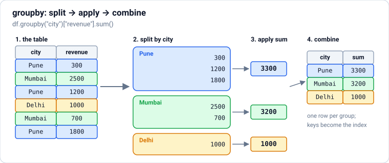

### Theory

> **In simple words:** `groupby` answers questions like "total sales **per city**" or "average price **per category**". It works in three steps, called **split–apply–combine**: **split** the rows into groups by a key, **apply** a calculation to each group, and **combine** the answers into a new table. It's the pandas version of SQL's `GROUP BY`.

**The basic pattern:** `df.groupby("key")["column"].function()`.

| Code | Answers | SQL equivalent |
|---|---|---|
| `df.groupby("city")["qty"].sum()` | Total quantity per city | `SELECT city, SUM(qty) ... GROUP BY city` |
| `df.groupby("city").size()` | Rows per city | `COUNT(*)` |
| `df.groupby(["city", "category"])["price"].mean()` | Average per (city, category) pair | `GROUP BY city, category` |
| `df.groupby("city").agg(orders=("order_id", "count"), revenue=("revenue", "sum"))` | Several named results at once | `SELECT COUNT(order_id) AS orders, SUM(revenue) AS revenue` |
| `df.groupby("city").filter(lambda g: len(g) >= 3)` | Only the rows of groups with 3 or more rows | `HAVING COUNT(*) >= 3` |

**Common aggregation functions:** `sum`, `mean`, `median`, `min`, `max`, `count` (non-missing values), `size` (all rows), `nunique` (distinct values), `std`, `first`, `last`.

**`agg` with named results** (called *named aggregation*) is the clearest way to compute several summaries: `new_name=("column", "function")`. The result has exactly the columns you named.

**`transform`: a group value on every row.** `agg` returns **one row per group**. `transform` returns a result **the same length as the original**, so you can put a group-level number next to each row, for example each order's share of its city's revenue:

```text
df["city_total"] = df.groupby("city")["revenue"].transform("sum")
df["share"] = df["revenue"] / df["city_total"]
```

This is the pandas version of a SQL **window function** (`SUM(revenue) OVER (PARTITION BY city)`).

**The result's index.** After `groupby`, the group keys become the **index** of the result. Use `.reset_index()` (or `groupby(..., as_index=False)`) to turn them back into ordinary columns, which is usually what you want before saving or merging.

**Other handy group methods:** `cumsum()` (running total inside each group), `rank()`, `shift()` (previous row in the group), `head(2)` (first 2 rows of each group), and `idxmax()` (label of the top row).

### Python

```python
import io
import pandas as pd

csv_text = """order_id,date,customer,city,product,category,qty,price
1,2025-01-05,Asha,Pune,Notebook,stationery,5,60
2,2025-01-06,Ravi,Mumbai,Headphones,electronics,1,2500
3,2025-02-10,Asha,Pune,Backpack,bags,1,1200
4,2025-02-11,Meera,Pune,Keyboard,electronics,1,1800
5,2025-03-02,Zoya,Mumbai,Water bottle,kitchen,2,350
6,2025-03-15,Kabir,Bengaluru,Desk lamp,electronics,1,900
7,2025-03-20,Asha,Pune,Headphones,electronics,1,2500
8,2025-04-01,Isha,Delhi,Mug,kitchen,4,250
9,2025-04-18,Ravi,Mumbai,Notebook,stationery,10,60
10,2025-05-05,Zoya,Mumbai,Keyboard,electronics,1,1800
"""
orders = pd.read_csv(io.StringIO(csv_text), parse_dates=["date"])
orders["revenue"] = orders["qty"] * orders["price"]

print(orders.groupby("city")["revenue"].sum().sort_values(ascending=False))
print(orders.groupby("city").size())
print(orders.groupby(["city", "category"])["revenue"].sum().head(4))
```

**Output:**

```text
city
Pune         5800
Mumbai       5600
Delhi        1000
Bengaluru     900
Name: revenue, dtype: int64
city
Bengaluru    1
Delhi        1
Mumbai       4
Pune         4
dtype: int64
city       category   
Bengaluru  electronics     900
Delhi      kitchen        1000
Mumbai     electronics    4300
           kitchen         700
Name: revenue, dtype: int64
```

```python
summary = (orders.groupby("city")
           .agg(orders=("order_id", "count"),
                customers=("customer", "nunique"),
                revenue=("revenue", "sum"),
                biggest_order=("revenue", "max"))
           .sort_values("revenue", ascending=False)
           .reset_index())
print(summary)

busy = orders.groupby("city").filter(lambda g: len(g) >= 3)      # like SQL HAVING
print(busy["city"].unique().tolist())
```

**Output:**

```text
        city  orders  customers  revenue  biggest_order
0       Pune       4          2     5800           2500
1     Mumbai       4          2     5600           2500
2      Delhi       1          1     1000           1000
3  Bengaluru       1          1      900            900
['Pune', 'Mumbai']
```

```python
orders["city_total"] = orders.groupby("city")["revenue"].transform("sum")
orders["share_pct"] = (100 * orders["revenue"] / orders["city_total"]).round(1)
orders["running_qty"] = orders.groupby("customer")["qty"].cumsum()
print(orders[["customer", "city", "revenue", "city_total", "share_pct", "running_qty"]].head(6))

top_per_city = orders.loc[orders.groupby("city")["revenue"].idxmax(), ["city", "product", "revenue"]]
print(top_per_city)
```

**Output:**

```text
  customer       city  revenue  city_total  share_pct  running_qty
0     Asha       Pune      300        5800        5.2            5
1     Ravi     Mumbai     2500        5600       44.6            1
2     Asha       Pune     1200        5800       20.7            6
3    Meera       Pune     1800        5800       31.0            1
4     Zoya     Mumbai      700        5600       12.5            2
5    Kabir  Bengaluru      900         900      100.0            1
        city     product  revenue
5  Bengaluru   Desk lamp      900
7      Delhi         Mug     1000
1     Mumbai  Headphones     2500
6       Pune  Headphones     2500
```

**Common mistakes:**

- ❌ Forgetting `.reset_index()`, then being surprised that `city` isn't a column any more.
- ❌ Using `count` when you mean `size`: `count` skips missing values, `size` counts every row.
- ❌ Looping `for city in df["city"].unique(): ...` to build a summary by hand. One `groupby` does it faster and more clearly.
- ❌ `apply` with a custom Python function when a built-in name (`"sum"`, `"mean"`, `"nunique"`) would do; built-ins are much faster.

### Practice

1. For each customer, find the number of orders and their total revenue, sorted by revenue (highest first).
2. Add a column showing how each order's price compares with the **average price of its category** (price minus the category average).

<details>
<summary><b>Answer</b></summary>

```python
per_customer = (orders.groupby("customer")
                .agg(orders=("order_id", "count"), revenue=("revenue", "sum"))
                .sort_values("revenue", ascending=False))
print(per_customer)

orders["vs_category_avg"] = orders["price"] - orders.groupby("category")["price"].transform("mean")
print(orders[["product", "category", "price", "vs_category_avg"]].head(4))
```

**Output:**

```text
          orders  revenue
customer                 
Asha           3     4000
Ravi           2     3100
Zoya           2     2500
Meera          1     1800
Isha           1     1000
Kabir          1      900
      product     category  price  vs_category_avg
0    Notebook   stationery     60              0.0
1  Headphones  electronics   2500            600.0
2    Backpack         bags   1200              0.0
3    Keyboard  electronics   1800           -100.0
```

</details>

**Learn more:** [pandas: group by (split-apply-combine)](https://pandas.pydata.org/docs/user_guide/groupby.html)

---

## 12. Combining Tables: merge, join and concat

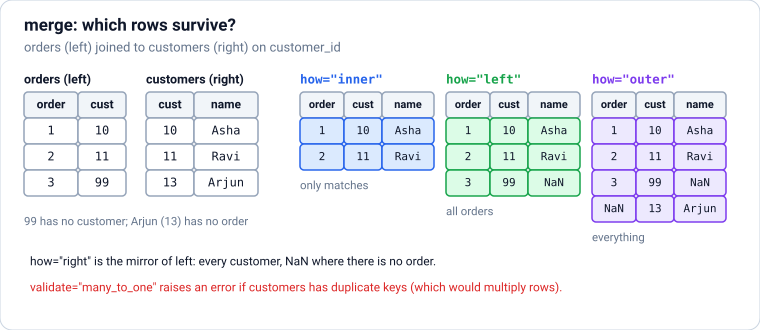

### Theory

> **In simple words:** data is usually split across several tables: orders in one, customers in another, products in a third. **`merge`** lines rows up by a shared key (like `customer_id`), exactly like a SQL `JOIN`. **`concat`** simply stacks tables on top of each other (or side by side).

**`pd.merge(left, right, on="key", how=...)`**: the `how` decides which rows survive.

| `how=` | Keeps | SQL |
|---|---|---|
| `"inner"` (default) | Only keys found in **both** tables | `INNER JOIN` |
| `"left"` | **Every** row of the left table; missing matches become NaN | `LEFT JOIN` |
| `"right"` | Every row of the right table | `RIGHT JOIN` |
| `"outer"` | Every key from **either** table | `FULL OUTER JOIN` |
| `"cross"` | Every combination of rows | `CROSS JOIN` |

**Keys with different names:** `pd.merge(orders, customers, left_on="cust_id", right_on="id")`. Several keys: `on=["city", "date"]`.

**Two safety options every professional uses:**

- `validate="many_to_one"` (or `"one_to_one"`, `"one_to_many"`) makes pandas **raise an error** if the keys aren't as unique as you expect. This catches the most common merge bug: a duplicate key in a lookup table silently **multiplies** your rows.
- `indicator=True` adds a `_merge` column saying `both`, `left_only` or `right_only`, so you can see exactly which rows didn't match.

**Columns with the same name** in both tables (other than the key) get suffixes `_x` and `_y`; choose clearer ones with `suffixes=("_order", "_customer")`.

**`pd.concat([df1, df2])`** stacks rows (for example, January's file and February's file), matching columns by name. Add `ignore_index=True` to renumber the rows. `pd.concat([a, b], axis=1)` puts tables side by side by index.

**Anti-join** (rows in one table with **no** match in the other, like customers who never ordered): merge with `how="left", indicator=True`, then keep `_merge == "left_only"`. A shorter way for a single key: `df[~df["id"].isin(other["id"])]`.

### Python

```python
import pandas as pd

orders = pd.DataFrame({"order_id": [1, 2, 3, 4, 5],
                       "customer_id": [10, 11, 10, 12, 99],      # 99 isn't a known customer
                       "product_id": ["P1", "P2", "P3", "P1", "P2"],
                       "qty": [5, 1, 1, 2, 1]})
customers = pd.DataFrame({"customer_id": [10, 11, 12, 13],
                          "name": ["Asha", "Ravi", "Meera", "Arjun"],
                          "city": ["Pune", "Mumbai", "Pune", "Delhi"]})
products = pd.DataFrame({"product_id": ["P1", "P2", "P3"],
                         "product": ["Notebook", "Headphones", "Backpack"],
                         "price": [60, 2500, 1200]})

inner = pd.merge(orders, customers, on="customer_id")                     # order 5 disappears
left = pd.merge(orders, customers, on="customer_id", how="left")          # order 5 kept, name is NaN
print(len(inner), len(left))
print(left[["order_id", "customer_id", "name"]])
```

**Output:**

```text
4 5
   order_id  customer_id   name
0         1           10   Asha
1         2           11   Ravi
2         3           10   Asha
3         4           12  Meera
4         5           99    NaN
```

```python
full = (orders
        .merge(customers, on="customer_id", how="left", validate="many_to_one")
        .merge(products, on="product_id", how="left", validate="many_to_one")
        .assign(revenue=lambda d: d["qty"] * d["price"]))
print(full[["order_id", "name", "product", "qty", "revenue"]])

check = pd.merge(customers, orders, on="customer_id", how="outer", indicator=True)
print(check[["customer_id", "name", "order_id", "_merge"]])
print("never ordered:", check.loc[check["_merge"] == "left_only", "name"].tolist())
```

**Output:**

```text
   order_id   name     product  qty  revenue
0         1   Asha    Notebook    5      300
1         2   Ravi  Headphones    1     2500
2         3   Asha    Backpack    1     1200
3         4  Meera    Notebook    2      120
4         5    NaN  Headphones    1     2500
   customer_id   name  order_id      _merge
0           10   Asha       1.0        both
1           10   Asha       3.0        both
2           11   Ravi       2.0        both
3           12  Meera       4.0        both
4           13  Arjun       NaN   left_only
5           99    NaN       5.0  right_only
never ordered: ['Arjun']
```

```python
bad_lookup = pd.concat([customers, pd.DataFrame({"customer_id": [10], "name": ["Asha K"], "city": ["Pune"]})])
print(len(pd.merge(orders, bad_lookup, on="customer_id")))    # customer 10 matches twice: 4 matched orders became 6 rows
try:
    pd.merge(orders, bad_lookup, on="customer_id", validate="many_to_one")
except pd.errors.MergeError as e:
    print("caught:", str(e).splitlines()[0])

jan = pd.DataFrame({"order_id": [1, 2], "qty": [5, 1]})
feb = pd.DataFrame({"order_id": [3, 4], "qty": [1, 2]})
print(pd.concat([jan, feb], ignore_index=True))
```

**Output:**

```text
6
caught: Merge keys are not unique in right dataset; not a many-to-one merge
   order_id  qty
0         1    5
1         2    1
2         3    1
3         4    2
```

**Common mistakes:**

- ❌ Merging without `validate`, so a duplicated key quietly multiplies rows (and totals).
- ❌ Keys with different types: `customer_id` as `int64` in one table and `str` in the other. Nothing matches (or pandas raises an error). Convert first.
- ❌ Using `inner` by default and silently losing rows that didn't match. Check the row count before and after every merge.
- ❌ Growing a DataFrame with `concat` inside a loop (slow: it copies everything each time). ✅ Collect the pieces in a list, then `pd.concat(pieces)` once.

### Practice

1. Using the tables above, find the total quantity ordered per **city** (unknown customers should appear as `"Unknown"`).

<details>
<summary><b>Answer</b></summary>

```python
per_city = (orders.merge(customers, on="customer_id", how="left")
            .assign(city=lambda d: d["city"].fillna("Unknown"))
            .groupby("city")["qty"].sum())
print(per_city)
```

**Output:**

```text
city
Mumbai     1
Pune       8
Unknown    1
Name: qty, dtype: int64
```

</details>

**Learn more:** [pandas: merge, join, concatenate](https://pandas.pydata.org/docs/user_guide/merging.html)

---

## 13. Reshaping: pivot_table, melt, crosstab and explode

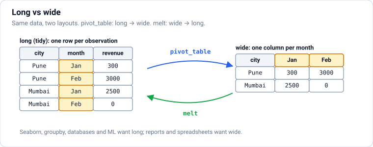

### Theory

> **In simple words:** the same data can be laid out **long** (one row per observation: city, month, sales) or **wide** (one row per city, one column per month). Reports and spreadsheets like **wide**; plotting libraries, databases and machine learning like **long**. Reshaping converts between the two.

**Tidy data** is the long layout with three rules: each **variable** is a column, each **observation** is a row, and each **value** is a cell. Most pandas, Seaborn and SQL tools expect tidy data, so when a dataset is awkward to work with, the fix is often to reshape it into this form first.

| Function | Turns | Example |
|---|---|---|
| `pivot_table(index=, columns=, values=, aggfunc=)` | Long → **wide**, aggregating duplicates | Revenue with cities as rows and months as columns |
| `pivot(index=, columns=, values=)` | Long → wide when every (row, column) pair is unique | Errors if there are duplicates |
| `melt(id_vars=, var_name=, value_name=)` | Wide → **long** | Month columns become one `month` column |
| `pd.crosstab(a, b)` | Counts of each combination of two columns | Orders per city and category |
| `stack()` / `unstack()` | Move a level between the row index and the columns | After a two-key `groupby` |
| `explode("col")` | A column of **lists** → one row per list item | Tags, skills, items in a basket |

**`pivot_table` options:** `aggfunc="sum"` (or `"mean"`, `"count"`, or a list), `fill_value=0` for empty cells, and `margins=True` to add an **All** row and column with totals.

**`groupby` versus `pivot_table`:** `df.groupby(["city", "month"])["revenue"].sum().unstack()` and `df.pivot_table(index="city", columns="month", values="revenue", aggfunc="sum")` give the same table. Use whichever reads more clearly.

### Python

```python
import io
import pandas as pd

csv_text = """order_id,date,customer,city,product,category,qty,price
1,2025-01-05,Asha,Pune,Notebook,stationery,5,60
2,2025-01-06,Ravi,Mumbai,Headphones,electronics,1,2500
3,2025-02-10,Asha,Pune,Backpack,bags,1,1200
4,2025-02-11,Meera,Pune,Keyboard,electronics,1,1800
5,2025-03-02,Zoya,Mumbai,Water bottle,kitchen,2,350
6,2025-03-15,Kabir,Bengaluru,Desk lamp,electronics,1,900
7,2025-03-20,Asha,Pune,Headphones,electronics,1,2500
8,2025-04-01,Isha,Delhi,Mug,kitchen,4,250
9,2025-04-18,Ravi,Mumbai,Notebook,stationery,10,60
10,2025-05-05,Zoya,Mumbai,Keyboard,electronics,1,1800
"""
orders = pd.read_csv(io.StringIO(csv_text), parse_dates=["date"])
orders["revenue"] = orders["qty"] * orders["price"]
orders["month"] = orders["date"].dt.to_period("M").astype(str)

wide = orders.pivot_table(index="city", columns="month", values="revenue",
                          aggfunc="sum", fill_value=0, margins=True, margins_name="Total")
print(wide)
print(pd.crosstab(orders["city"], orders["category"]))
```

**Output:**

```text
month      2025-01  2025-02  2025-03  2025-04  2025-05  Total
city                                                         
Bengaluru        0        0      900        0        0    900
Delhi            0        0        0     1000        0   1000
Mumbai        2500        0      700      600     1800   5600
Pune           300     3000     2500        0        0   5800
Total         2800     3000     4100     1600     1800  13300
category   bags  electronics  kitchen  stationery
city                                             
Bengaluru     0            1        0           0
Delhi         0            0        1           0
Mumbai        0            2        1           1
Pune          1            2        0           1
```

```python
report = pd.DataFrame({"city": ["Pune", "Mumbai"], "Jan": [300, 2500], "Feb": [3000, 0], "Mar": [2500, 700]})
long = report.melt(id_vars="city", var_name="month", value_name="revenue")
print(long)
print(long.pivot(index="city", columns="month", values="revenue")[["Jan", "Feb", "Mar"]])

baskets = pd.DataFrame({"order_id": [1, 2], "items": [["pen", "notebook"], ["mug"]]})
print(baskets.explode("items", ignore_index=True))
```

**Output:**

```text
     city month  revenue
0    Pune   Jan      300
1  Mumbai   Jan     2500
2    Pune   Feb     3000
3  Mumbai   Feb        0
4    Pune   Mar     2500
5  Mumbai   Mar      700
month    Jan   Feb   Mar
city                    
Mumbai  2500     0   700
Pune     300  3000  2500
   order_id     items
0         1       pen
1         1  notebook
2         2       mug
```

**Common mistakes:**

- ❌ `pivot` on data with duplicate (row, column) pairs: it raises `ValueError`. ✅ `pivot_table` with an `aggfunc`.
- ❌ Keeping data wide for analysis ("Jan", "Feb", … columns), which makes filtering by month or plotting over time awkward. ✅ `melt` to long first.
- ❌ Forgetting `fill_value=0` and then summing a table full of NaN.

### Practice

1. Make a table with categories as rows, cities as columns and the **number of units** (`qty`) as values, with totals.

<details>
<summary><b>Answer</b></summary>

```python
print(orders.pivot_table(index="category", columns="city", values="qty",
                         aggfunc="sum", fill_value=0, margins=True, margins_name="Total"))
```

**Output:**

```text
city         Bengaluru  Delhi  Mumbai  Pune  Total
category                                          
bags                 0      0       0     1      1
electronics          1      0       2     2      5
kitchen              0      4       2     0      6
stationery           0      0      10     5     15
Total                1      4      14     8     27
```

</details>

**Learn more:** [pandas: reshaping and pivot tables](https://pandas.pydata.org/docs/user_guide/reshaping.html) · [Hadley Wickham, Tidy Data (paper)](https://vita.had.co.nz/papers/tidy-data.pdf)

---

## 14. Dates and Time Series: resample, rolling and shift

### Theory

> **In simple words:** a **time series** is data recorded over time: daily sales, hourly temperature, a share price every minute. pandas has special tools to group by time periods (**resample**), smooth noisy data (**rolling** averages), compare with the past (**shift**, **pct_change**), and handle time zones.

**Dates in pandas.** `pd.to_datetime(...)` turns text into real timestamps (the `datetime64` type). With a date column you can:

- pull out parts with `.dt.year`, `.dt.month`, `.dt.day_name()`, `.dt.dayofweek` (Monday = 0 … Sunday = 6), `.dt.hour` (on a date **index**, drop the `.dt`: `df.index.dayofweek`);
- do arithmetic: `df["date"] + pd.Timedelta(days=30)`, or `(end - start).dt.days`;
- filter by range: `df[(df["date"] >= "2025-03-01") & (df["date"] < "2025-04-01")]`;
- build date sequences: `pd.date_range("2025-01-01", periods=90, freq="D")`.

**Put dates in the index** (`df.set_index("date")`) to unlock the time-series methods below, and to slice with `df.loc["2025-03"]` (all of March).

| Method | Does | Example question |
|---|---|---|
| `resample("W").sum()` | Groups rows into time buckets | Weekly sales |
| `rolling(7).mean()` | Average of the last 7 rows, sliding along | Smooth out daily noise |
| `shift(1)` | Moves values down one row (yesterday's value on today's row) | Compare with yesterday |
| `diff()` | Value minus the previous value | Daily change |
| `pct_change()` | Percentage change from the previous value | Growth rate |
| `expanding().max()` | Running statistic from the start | Best day so far |
| `ffill()` | Fills gaps with the last known value | Missing sensor readings |

**Frequency codes** for `resample` and `date_range`: `"D"` day, `"W"` week, `"ME"` month end, `"MS"` month start, `"QE"` quarter end, `"YE"` year end, `"h"` hour, `"min"` minute. (pandas 3 uses `"ME"`, `"QE"` and `"YE"`; the old single letters `"M"`, `"Q"` and `"Y"` were removed.)

**Time zones.** Store times in **UTC**; convert to local time only for display. `ts.dt.tz_localize("UTC")` marks naive times as UTC, and `.dt.tz_convert("Asia/Kolkata")` shows them in India time.

**Rules for time-series analysis:**

- Always **sort by time** first.
- Never shuffle time-series data when splitting for machine learning: train on the past, test on the future (the ML notes cover this).
- Check for **missing periods** (a day with no rows is different from a day with zero sales): `resample(...).sum()` fills them with 0; `asfreq("D")` shows them as NaN.

### Python

```python
import numpy as np
import pandas as pd

rng = np.random.default_rng(7)
days = pd.date_range("2025-01-01", periods=90, freq="D")   # 1 Jan to 31 Mar
trend = np.linspace(100, 160, 90)                       # sales slowly rise
weekly = np.where(days.dayofweek >= 5, 40, 0)           # weekends sell more
sales = pd.DataFrame({"date": days, "units": (trend + weekly + rng.normal(0, 10, 90)).round()})
sales = sales.set_index("date")
print(sales.head(3))

print(sales.resample("ME")["units"].sum())
print(sales.loc["2025-02-10":"2025-02-12"])
```

**Output:**

```text
            units
date             
2025-01-01  100.0
2025-01-02  104.0
2025-01-03   99.0
date
2025-01-31    3593.0
2025-02-28    3981.0
2025-03-31    5020.0
Freq: ME, Name: units, dtype: float64
            units
date             
2025-02-10  128.0
2025-02-11  128.0
2025-02-12  116.0
```

```python
sales["avg_7d"] = sales["units"].rolling(7).mean().round(1)
sales["yesterday"] = sales["units"].shift(1)
sales["change"] = sales["units"].diff()
sales["growth_pct"] = (100 * sales["units"].pct_change()).round(1)
print(sales.iloc[5:10])

weekly_totals = sales["units"].resample("W").sum()
print(weekly_totals.head(3))                     # the first bucket is a partial week (1–5 Jan)
print("best week ended on:", weekly_totals.idxmax().date())
```

**Output:**

```text
            units  avg_7d  yesterday  change  growth_pct
date                                                    
2025-01-06   93.0     NaN      138.0   -45.0       -32.6
2025-01-07  105.0   110.3       93.0    12.0        12.9
2025-01-08  118.0   112.9      105.0    13.0        12.4
2025-01-09  100.0   112.3      118.0   -18.0       -15.3
2025-01-10  100.0   112.4      100.0     0.0         0.0
date
2025-01-05    574.0
2025-01-12    819.0
2025-01-19    811.0
Freq: W-SUN, Name: units, dtype: float64
best week ended on: 2025-03-30
```

```python
logins = pd.Series(pd.to_datetime(["2025-03-10 04:30", "2025-03-10 18:45"]))
utc = logins.dt.tz_localize("UTC")
print(utc.dt.tz_convert("Asia/Kolkata"))

signups = pd.Series([3, 5], index=pd.to_datetime(["2025-03-01", "2025-03-04"]))
print(signups.asfreq("D"))                      # missing days appear as NaN
```

**Output:**

```text
0   2025-03-10 10:00:00+05:30
1   2025-03-11 00:15:00+05:30
dtype: datetime64[us, Asia/Kolkata]
2025-03-01    3.0
2025-03-02    NaN
2025-03-03    NaN
2025-03-04    5.0
Freq: D, dtype: float64
```

**Common mistakes:**

- ❌ Dates stored as text, so sorting puts "10/1/2025" before "2/1/2025".
- ❌ Computing a 7-day average with `rolling(7)` on data that has **missing days**; the window then covers more than 7 days. ✅ `resample("D")` first, or use a time-based window: `rolling("7D")`.
- ❌ Mixing time zones, or storing local times without a zone. ✅ UTC everywhere, convert for display.
- ❌ Using future information by accident, for example a centred rolling average as an input to a forecast.

### Practice

1. From `sales`, find the average units sold on **weekends** versus **weekdays**.

<details>
<summary><b>Answer</b></summary>

```python
is_weekend = sales.index.dayofweek >= 5
print(sales.groupby(np.where(is_weekend, "weekend", "weekday"))["units"].mean().round(1))
```

**Output:**

```text
weekday    127.8
weekend    169.8
Name: units, dtype: float64
```

</details>

**Learn more:** [pandas: time series](https://pandas.pydata.org/docs/user_guide/timeseries.html) · [Forecasting: Principles and Practice (free book)](https://otexts.com/fpp3/)

---

## 15. Bigger and Faster: Memory, Arrow, Polars and DuckDB

### Theory

> **In simple words:** pandas keeps the whole table in memory and mostly uses one CPU core. That's fine up to a few gigabytes. For bigger data, first make pandas lighter (better types, fewer columns, Parquet), and when that isn't enough, switch to tools built for speed: **Polars** (a fast DataFrame library) and **DuckDB** (a fast SQL database that runs inside your Python program).

**Step 1: make pandas lighter.**

| Trick | Why it helps |
|---|---|
| Load only needed columns (`usecols=`, `columns=`) | Less to read and store |
| Smaller number types (`int32`, `float32`, `pd.to_numeric(..., downcast="integer")`) | Half the memory of 64-bit types |
| `category` type for repeated text (city, status) | Stores each distinct value once plus small integer codes |
| Parquet instead of CSV | Typed, compressed and columnar: faster to read |
| Vectorised operations, never row loops | Runs in compiled code |
| Process in chunks (`read_csv(..., chunksize=...)`) | Never holds the whole file at once |

Check memory with `df.memory_usage(deep=True)` or `df.info(memory_usage="deep")`.

**Apache Arrow** is a standard way to lay out columns of data in memory. pandas 3 uses Arrow for its new `str` type, Parquet files are read through Arrow, and Polars and DuckDB are built on the same idea, so data can move between these tools with little or no copying.

**Polars** is a DataFrame library written in Rust. It uses **all CPU cores**, and its **lazy** mode (`pl.scan_parquet(...)` or `df.lazy()`) plans the whole query before running it, skipping unneeded columns and rows, as a database does. Its style is built on **expressions**:

```text
(pl.scan_parquet("orders.parquet")
   .filter(pl.col("qty") > 1)
   .group_by("city")
   .agg(pl.col("revenue").sum())
   .collect())
```

**DuckDB** is an **in-process analytical database**: `pip install duckdb`, no server. It runs SQL directly on pandas DataFrames, Polars DataFrames, CSV and Parquet files (even on cloud storage), and it's very fast for aggregations and joins on data larger than memory.

**Which tool when (a common 2026 setup):**

| Situation | Good choice |
|---|---|
| Up to a few GB, exploring in a notebook, other libraries expect pandas | **pandas** |
| Larger data or slow pandas pipelines, and you like DataFrame code | **Polars** |
| You think in SQL, or query Parquet/CSV files directly, or join big tables | **DuckDB** |
| Data far bigger than one machine (terabytes), a company data platform | Spark / Databricks, BigQuery, Snowflake |
| Shared, always-changing application data | A real database such as PostgreSQL (`sql-postgresql.md`) |

These work together: DuckDB can query a pandas DataFrame and return the result as a Polars one, and `polars_df.to_pandas()` / `pl.from_pandas(df)` convert between them.

### Python

```python
import numpy as np
import pandas as pd

rng = np.random.default_rng(0)
n = 1_000_000
big = pd.DataFrame({"city": rng.choice(["Pune", "Mumbai", "Delhi", "Bengaluru"], n),
                    "qty": rng.integers(1, 10, n),
                    "price": rng.uniform(10, 3000, n).round(2)})

before = big.memory_usage(deep=True).sum() / 1e6
light = big.assign(city=big["city"].astype("category"),
                   qty=big["qty"].astype("int8"),
                   price=big["price"].astype("float32"))
after = light.memory_usage(deep=True).sum() / 1e6
print(f"{before:.0f} MB -> {after:.0f} MB")
print(light.dtypes)
```

**Output:**

```text
30 MB -> 6 MB
city     category
qty          int8
price     float32
dtype: object
```

```python
import duckdb
import polars as pl

big["revenue"] = big["qty"] * big["price"]

pandas_result = (big.groupby("city")["revenue"].sum() / 1e6).round(1).sort_index()   # in millions

polars_result = (pl.from_pandas(big)
                 .lazy()
                 .group_by("city")
                 .agg((pl.col("revenue").sum() / 1e6).round(1).alias("revenue_m"))
                 .sort("city")
                 .collect())

duck_result = duckdb.sql("""
    SELECT city, ROUND(SUM(revenue) / 1e6, 1) AS revenue_m
    FROM big                       -- DuckDB finds the pandas DataFrame named big
    GROUP BY city ORDER BY city
""").df()

print(polars_result)
print(duck_result)
print(np.allclose(pandas_result.values, polars_result["revenue_m"].to_numpy()),
      np.allclose(pandas_result.values, duck_result["revenue_m"].to_numpy()))
```

**Output:**

```text
shape: (4, 2)
┌───────────┬───────────┐
│ city      ┆ revenue_m │
│ ---       ┆ ---       │
│ str       ┆ f64       │
╞═══════════╪═══════════╡
│ Bengaluru ┆ 1886.5    │
│ Delhi     ┆ 1876.5    │
│ Mumbai    ┆ 1885.2    │
│ Pune      ┆ 1875.5    │
└───────────┴───────────┘
        city  revenue_m
0  Bengaluru     1886.5
1      Delhi     1876.5
2     Mumbai     1885.2
3       Pune     1875.5
True True
```

```python
import os, tempfile

folder = tempfile.mkdtemp()
path = os.path.join(folder, "big.parquet")
big.to_parquet(path)
print(duckdb.sql(f"SELECT COUNT(*) AS orders, ROUND(AVG(price), 1) AS avg_price FROM '{path}' WHERE city = 'Pune'"))
print(pl.scan_parquet(path).filter(pl.col("qty") >= 9).select(pl.len()).collect().item())   # reads only the qty column
```

**Output:**

```text
┌────────┬───────────┐
│ orders │ avg_price │
│ int64  │  double   │
├────────┼───────────┤
│ 249579 │    1503.3 │
└────────┴───────────┘

111459
```

**Common mistakes:**

- ❌ Reaching for Spark for a 2 GB file. A laptop with pandas, Polars or DuckDB handles it in seconds.
- ❌ Converting between pandas and Polars back and forth inside a loop. Convert once at the edges.
- ❌ Using `float32` for money or IDs where precision matters. Save memory where it's safe.
- ❌ Optimising before measuring. Time it first (`%timeit` in Jupyter, `time.perf_counter()` in scripts).

### Practice

1. With DuckDB, find the city with the highest **average** order revenue in `big`.

<details>
<summary><b>Answer</b></summary>

```python
print(duckdb.sql("SELECT city, ROUND(AVG(revenue), 1) AS avg_revenue FROM big GROUP BY city ORDER BY avg_revenue DESC LIMIT 1").fetchone())
```

**Output:**

```text
('Mumbai', 7540.7)
```

(The data is random, so the averages are all close; with a fixed seed the answer is the same on every run.)

</details>

---

### ✅ Part 3 checkpoint

Without looking, can you:

- [ ] Summarise data per group with `groupby` + `agg`, and put group values on every row with `transform`?
- [ ] Merge tables with the right `how=`, and protect merges with `validate` and `indicator`?
- [ ] Reshape between long and wide with `pivot_table` and `melt`?
- [ ] Resample a time series, compute a rolling average, and compare with the previous period?
- [ ] Cut a DataFrame's memory use, and explain when to use Polars or DuckDB instead of pandas?

**Learn more:** [Polars user guide](https://docs.pola.rs/user-guide/) · [DuckDB: Python API](https://duckdb.org/docs/stable/clients/python/overview) · [Apache Arrow: overview](https://arrow.apache.org/overview/)

---

# Part 4 — Moderate: Charts with Matplotlib and Seaborn

> **Goal:** Draw clear, honest charts: Matplotlib basics and details, Seaborn's statistical charts, and choosing the right chart.  
> **You need:** Parts 1–3.

---

## 16. Your First Charts with Matplotlib

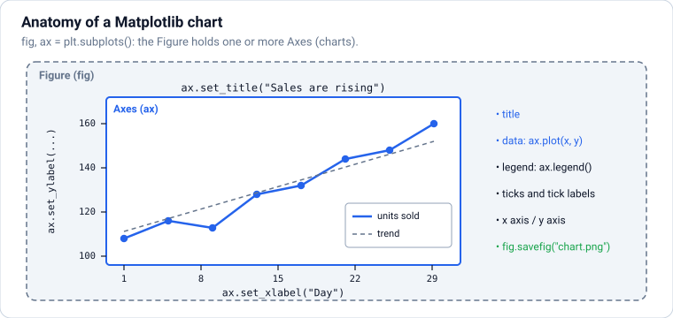

### Theory

> **In simple words:** a chart shows in one second what a table takes a minute to read. **Matplotlib** is Python's main charting library: almost every other plotting tool (Seaborn, pandas' `.plot()`) is built on it. You create a **figure** (the whole picture), put one or more **axes** (individual charts) on it, draw on the axes, then show or save the figure.

**The two words to know:**

- **Figure** (`fig`): the whole image or window. It can hold several charts.
- **Axes** (`ax`): **one chart** with its own x-axis, y-axis, title and data. (Not the same as "axis"; an Axes has two axis objects.)

**The recommended style** creates both at once and calls methods on `ax`:

```text
fig, ax = plt.subplots(figsize=(6, 4))     # width, height in inches
ax.plot(x, y)                              # draw
ax.set_title("..."); ax.set_xlabel("..."); ax.set_ylabel("...")
fig.savefig("chart.png", dpi=150, bbox_inches="tight")
plt.show()                                 # scripts: open a window (notebooks show charts automatically)
```

(You'll also see `plt.plot(...)`, `plt.title(...)` in tutorials. That "pyplot" style draws on "the current chart" and is fine for quick one-offs; the `ax` style is clearer as soon as you have more than one chart, so these notes use it.)

**The four charts you'll use most:**

| Chart | Method | Shows | Example |
|---|---|---|---|
| **Line** | `ax.plot(x, y)` | A trend over an ordered x (usually time) | Daily sales |
| **Bar** | `ax.bar(labels, values)` (`ax.barh` for horizontal) | Comparing amounts between categories | Revenue per city |
| **Scatter** | `ax.scatter(x, y)` | The relationship between two numbers | Price vs units sold |
| **Histogram** | `ax.hist(values, bins=20)` | The **distribution** (shape) of one number | Spread of order values |

**Making a chart readable:** a title that states the point, axis labels **with units**, a legend when there's more than one series (`label="..."` on each draw call, then `ax.legend()`), and no unnecessary decoration.

**pandas shortcut:** DataFrames and Series have `.plot()`, which calls Matplotlib for you: `df.plot(x="date", y="units", ax=ax)`, `s.plot.bar(ax=ax)`, `df["price"].plot.hist(bins=20)`.

### Python

```python
import matplotlib.pyplot as plt
import numpy as np

days = np.arange(1, 31)
units = 100 + 2 * days + np.random.default_rng(1).normal(0, 8, 30).round()

fig, ax = plt.subplots(figsize=(6, 3.5))
ax.plot(days, units, marker="o", markersize=3, label="units sold")
ax.plot(days, 100 + 2 * days, linestyle="--", color="gray", label="trend")
ax.set_title("Sales are rising by about 2 units a day")
ax.set_xlabel("Day of month")
ax.set_ylabel("Units sold")
ax.legend()
fig.savefig("first-line-chart.png", dpi=100, bbox_inches="tight")
print(type(fig).__name__, type(ax).__name__)
```

**Output:**

```text
Figure Axes
```

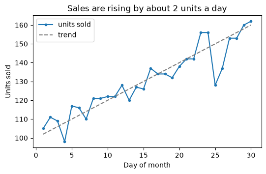

```python
rng = np.random.default_rng(3)
cities = ["Pune", "Mumbai", "Delhi", "Bengaluru"]
revenue = [5800, 5600, 1000, 900]
price = rng.uniform(50, 3000, 80)
units_sold = (400 - 0.1 * price + rng.normal(0, 30, 80)).clip(0)
order_values = rng.lognormal(mean=6.5, sigma=0.6, size=500)

fig, axes = plt.subplots(2, 2, figsize=(9, 6.5))     # a 2 × 2 grid; axes is a 2D array
axes[0, 0].plot(days, units)
axes[0, 0].set_title("Line: trend over time")
axes[0, 1].bar(cities, revenue, color="tab:orange")
axes[0, 1].set_title("Bar: compare categories")
axes[1, 0].scatter(price, units_sold, alpha=0.6)
axes[1, 0].set_title("Scatter: relationship")
axes[1, 0].set_xlabel("Price (₹)")
axes[1, 1].hist(order_values, bins=30, color="tab:green", edgecolor="white")
axes[1, 1].set_title("Histogram: distribution")
axes[1, 1].set_xlabel("Order value (₹)")
fig.tight_layout()                                    # stop titles and labels overlapping
fig.savefig("four-basic-charts.png", dpi=100, bbox_inches="tight")
print(axes.shape)
```

**Output:**

```text
(2, 2)
```

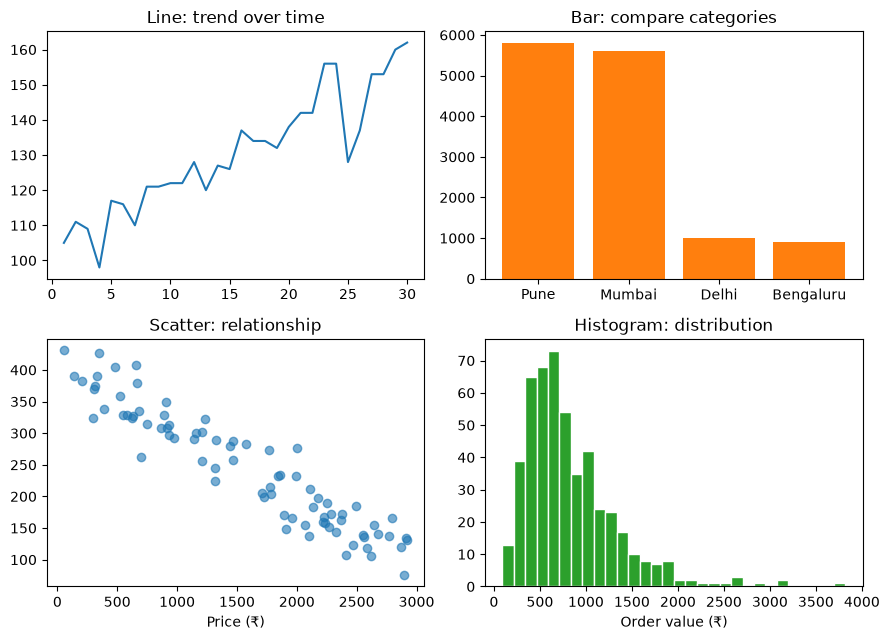

**Common mistakes:**

- ❌ No axis labels or units, so nobody knows what the numbers mean.
- ❌ A line chart for categories that have no order (cities). ✅ A bar chart.
- ❌ Forgetting `tight_layout()` (or `layout="constrained"` in `plt.subplots`) and getting overlapping labels.
- ❌ Creating hundreds of figures in a loop without `plt.close(fig)`, which eats memory.

### Practice

1. Draw a horizontal bar chart of `revenue` per city, sorted so the biggest bar is on top, and save it.

<details>
<summary><b>Answer</b></summary>

```python
order = np.argsort(revenue)                           # smallest first: barh draws from the bottom up
fig, ax = plt.subplots(figsize=(5, 3))
ax.barh([cities[i] for i in order], [revenue[i] for i in order])
ax.set_xlabel("Revenue (₹)")
ax.set_title("Pune and Mumbai lead revenue")
plt.close(fig)
print([cities[i] for i in order])
```

**Output:**

```text
['Bengaluru', 'Delhi', 'Mumbai', 'Pune']
```

</details>

**Learn more:** [Matplotlib: quick start guide](https://matplotlib.org/stable/users/explain/quick_start.html) · [Matplotlib: plot types gallery](https://matplotlib.org/stable/plot_types/index.html)

---

## 17. Matplotlib in Depth: Layouts, Styling and Annotations

### Theory

> **In simple words:** the basic charts get you 80% of the way. This section covers the remaining 20% that makes charts clear and professional: arranging several charts, choosing colours well, adding notes that point at the interesting part, formatting numbers on the axes, and saving at the right quality.

**Layouts.**

- `plt.subplots(2, 3, figsize=..., sharex=True)`: a grid of charts that share an x-axis scale.
- `layout="constrained"` in `plt.subplots(...)`: automatic spacing (the modern replacement for `tight_layout()`).
- `fig.subplot_mosaic("AAB;CCB")`: named, uneven layouts (chart A spans two columns, B spans two rows).
- `ax.twinx()`: a second y-axis on the right, for two measures with different units. Use sparingly; it's easy to mislead with two scales.

**Colours.**

- Use a **colour-blind-friendly** palette. Matplotlib's default (`tab10`) is decent; `ax.plot(..., color="tab:blue")` picks from it.
- For values on a scale, use a **perceptually uniform colormap** such as `viridis` (the default), `cividis` or `magma`. Avoid `jet`/rainbow: it creates fake boundaries and fails for colour-blind readers.
- For values above and below a midpoint (profit/loss, correlation), use a **diverging** colormap such as `RdBu` or `coolwarm`, centred on zero.
- Highlight: draw everything in grey and the one thing that matters in a strong colour.

**Annotations** direct the eye: `ax.annotate("Diwali sale", xy=(x, y), xytext=(x2, y2), arrowprops=dict(arrowstyle="->"))`, `ax.axhline(target, ls="--")` for a target line, `ax.axvspan(start, end, alpha=0.2)` to shade a period, and `ax.fill_between(x, low, high, alpha=0.3)` for a range (such as a forecast's uncertainty).

**Axes and ticks.**

- `ax.set_xlim(...)`, `ax.set_ylim(0, None)`: control the range.
- `ax.set_yscale("log")`: for data spanning many orders of magnitude (users from 10 to 10 million).
- `ax.yaxis.set_major_formatter(...)`: format tick labels, for example `PercentFormatter()` or `StrMethodFormatter("₹{x:,.0f}")`.
- `ax.spines[["top", "right"]].set_visible(False)`: remove the box lines you don't need.

**Other useful plot types:** `ax.errorbar` (values with error bars), `ax.boxplot`, `ax.imshow(matrix)` (a grid of numbers as colours, also images), `ax.pie` (only for 2–4 parts of a whole), `ax.stackplot`.

**Styles and saving.** `plt.style.use("seaborn-v0_8-whitegrid")` (or `"ggplot"`, `"fivethirtyeight"`) changes the look of everything; `plt.rcParams["font.size"] = 11` sets defaults. Save as **PNG** at `dpi=150`–`300` for documents and slides, or as **SVG/PDF** (vector: sharp at any size) for print and the web.

### Python

```python
import matplotlib.pyplot as plt
import numpy as np
from matplotlib.ticker import StrMethodFormatter

rng = np.random.default_rng(5)
days = np.arange(1, 91)
sales = 20000 + 150 * days + rng.normal(0, 2500, 90)
sales[60:67] += 15000                                     # a one-week festival sale
forecast_days = np.arange(91, 121)
forecast = 20000 + 150 * forecast_days
spread = np.linspace(2000, 8000, 30)                      # uncertainty grows further ahead

fig, ax = plt.subplots(figsize=(8, 4), layout="constrained")
ax.plot(days, sales, color="tab:blue", label="Actual")
ax.plot(forecast_days, forecast, color="tab:blue", ls="--", label="Forecast")
ax.fill_between(forecast_days, forecast - spread, forecast + spread, color="tab:blue", alpha=0.2, label="Likely range")
ax.axhline(30000, color="gray", ls=":", lw=1)
ax.text(2, 30500, "Target ₹30k/day", color="gray")
ax.axvspan(61, 67, color="tab:orange", alpha=0.15)
ax.annotate("Festival sale", xy=(67, sales[63]), xytext=(78, 44000),
            arrowprops=dict(arrowstyle="->", color="black"))
ax.yaxis.set_major_formatter(StrMethodFormatter("₹{x:,.0f}"))
ax.spines[["top", "right"]].set_visible(False)
ax.set(title="Daily revenue: steady growth, one festival spike", xlabel="Day", ylabel="Revenue")
ax.legend(loc="upper left", frameon=False)
fig.savefig("annotated-forecast.png", dpi=100)
plt.close(fig)
print("peak day:", int(days[np.argmax(sales)]))
```

**Output:**

```text
peak day: 65
```

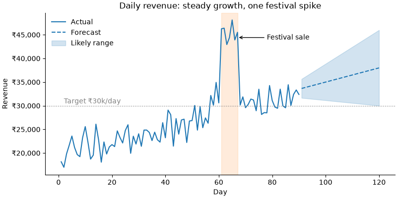

```python
fig, axd = plt.subplot_mosaic("AAB;CCB", figsize=(9, 5), layout="constrained")
months = ["Jan", "Feb", "Mar", "Apr", "May", "Jun"]
orders = np.array([120, 135, 160, 150, 190, 230])
avg_value = np.array([840, 820, 870, 910, 880, 950])

axd["A"].bar(months, orders, color="lightgray")
axd["A"].bar(months[-1], orders[-1], color="tab:red")             # highlight the one bar that matters
axd["A"].set_title("Orders: June was the best month")
right = axd["A"].twinx()                                           # second y-axis, different units
right.plot(months, avg_value, color="tab:blue", marker="o")
right.set_ylabel("Avg order value (₹)", color="tab:blue")

corr = np.corrcoef(rng.normal(size=(5, 50)))
im = axd["B"].imshow(corr, cmap="RdBu", vmin=-1, vmax=1)          # diverging colours centred on 0
axd["B"].set_title("Correlation matrix")
fig.colorbar(im, ax=axd["B"], shrink=0.7)

users = np.array([50, 400, 3_000, 25_000, 180_000, 1_400_000])
axd["C"].plot(months, users, marker="o")
axd["C"].set_yscale("log")                                         # equal steps = equal multiples
axd["C"].set_title("Users (log scale): roughly 8× growth each month")
fig.savefig("mosaic-layout.png", dpi=100)
plt.close(fig)
print(sorted(axd))
```

**Output:**

```text
['A', 'B', 'C']
```

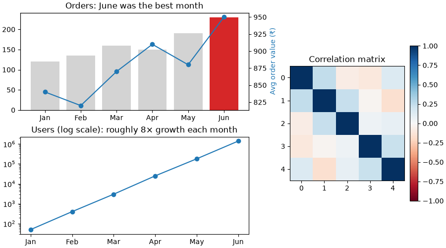

**Common mistakes:**

- ❌ Rainbow (`jet`) colormaps and red-green pairs. ✅ `viridis`, `cividis`, or blue-orange.
- ❌ Two y-axes that make unrelated lines look connected. Prefer two charts stacked with `sharex=True`.
- ❌ Saving at the default low resolution for a report, giving blurry charts. ✅ `dpi=200` or SVG.
- ❌ Every chart in a different style. Set a style once at the top of the notebook.

### Practice

1. Plot `sales` again, but shade the weekend days (days where `day % 7` is 5 or 6) and format the y-axis in thousands (`₹20k`).

<details>
<summary><b>Answer</b></summary>

```python
fig, ax = plt.subplots(figsize=(8, 3), layout="constrained")
ax.plot(days, sales)
for d in days[(days % 7 == 5) | (days % 7 == 6)]:
    ax.axvspan(d - 0.5, d + 0.5, color="gray", alpha=0.15, lw=0)
ax.yaxis.set_major_formatter(lambda y, pos: f"₹{y / 1000:.0f}k")   # a function (value, position) → label
plt.close(fig)
print(len(days[(days % 7 == 5) | (days % 7 == 6)]), "weekend days shaded")
```

**Output:**

```text
26 weekend days shaded
```

</details>

**Learn more:** [Matplotlib: arranging axes](https://matplotlib.org/stable/users/explain/axes/arranging_axes.html) · [Matplotlib: choosing colormaps](https://matplotlib.org/stable/users/explain/colors/colormaps.html) · [Matplotlib: annotations](https://matplotlib.org/stable/users/explain/text/annotations.html)

---

## 18. Statistical Charts with Seaborn

### Theory

> **In simple words:** **Seaborn** is built on Matplotlib and speaks **DataFrames**. You pass a DataFrame and column names (`x="city", y="order_value", hue="channel"`), and it groups, averages, colours and labels for you. Charts that take 15 lines in Matplotlib take one line in Seaborn.

**The key idea:** give Seaborn **long (tidy)** data (Section [13](#13-reshaping-pivot_table-melt-crosstab-and-explode)) and map columns to visual roles:

| Argument | Role |
|---|---|
| `data=df` | The DataFrame |
| `x=`, `y=` | Columns on each axis |
| `hue=` | Column that sets the **colour** (a second grouping) |
| `size=`, `style=` | Columns that set marker size or shape |
| `col=`, `row=` | Columns that split the chart into a grid of small charts (**facets**) |

**Chart families:**

| Question | Axes-level function (one chart) | Figure-level (supports `col=`/`row=` facets) |
|---|---|---|
| How is one number distributed? | `histplot`, `kdeplot`, `ecdfplot` | `displot` |
| How do groups compare? | `boxplot`, `violinplot`, `barplot`, `pointplot`, `stripplot` | `catplot` |
| How do two numbers relate? | `scatterplot`, `lineplot`, `regplot` (with a fitted line) | `relplot`, `lmplot` |
| Which variables relate to which? | `heatmap` of `df.corr()` | `pairplot`, `jointplot` |

**Axes-level** functions draw on one Matplotlib `ax` (pass `ax=ax`), so you can combine them with everything from the Matplotlib sections. **Figure-level** functions create their own figure (a `FacetGrid`) and are the quickest way to compare the same chart across groups.

**Box plots in one picture:** the box spans the middle 50% of values (from the 25th to the 75th percentile, the **IQR**), the line inside is the **median**, the whiskers reach the furthest points within 1.5 × IQR, and dots beyond them are possible **outliers**. A **violin plot** shows the full shape of the distribution instead of a box.

**Bar plots show an average, with an error bar.** `sns.barplot` draws the **mean** of each group, and a black line showing its **95% confidence interval** (how uncertain that mean is; Section [21](#21-probability-distributions-sampling-and-confidence-intervals) explains it). Use `errorbar=None` to hide it, or `estimator="sum"` for totals.

**Themes:** `sns.set_theme(style="whitegrid", context="notebook")` once at the top; `context="talk"` makes everything bigger for slides. Seaborn's default palette is colour-blind-aware; `palette="colorblind"` makes sure.

(Seaborn 0.12+ also has a newer **objects interface**, `seaborn.objects as so`, where charts are built up in layers: `so.Plot(df, x=..., y=...).add(so.Dot())`. The functions above remain the most common style.)

### Python

```python
import matplotlib.pyplot as plt
import numpy as np
import pandas as pd
import seaborn as sns

rng = np.random.default_rng(11)
n = 400
shop = pd.DataFrame({
    "city": rng.choice(["Pune", "Mumbai", "Delhi", "Bengaluru"], n, p=[0.3, 0.3, 0.2, 0.2]),
    "channel": rng.choice(["app", "web"], n, p=[0.6, 0.4]),
    "items": rng.integers(1, 8, n),
})
shop["order_value"] = (shop["items"] * rng.uniform(150, 450, n)
                       * np.where(shop["channel"] == "app", 1.15, 1.0)).round()
shop["delivery_days"] = (rng.gamma(2, 1.2, n) + np.where(shop["city"] == "Delhi", 1.0, 0.0)).round(1)
shop["rating"] = (5 - 0.4 * shop["delivery_days"] + rng.normal(0, 0.5, n)).clip(1, 5).round(1)
print(shop.head(3))

sns.set_theme(style="whitegrid")
fig, axes = plt.subplots(2, 2, figsize=(10, 7.5), layout="constrained")
sns.histplot(data=shop, x="order_value", hue="channel", kde=True,
             stat="density", common_norm=False, ax=axes[0, 0])   # compare shapes, not counts
axes[0, 0].set_title("App orders tend to be larger")
sns.boxplot(data=shop, x="city", y="delivery_days", ax=axes[0, 1])
axes[0, 1].set_title("Delhi deliveries take longer")
sns.barplot(data=shop, x="city", y="order_value", hue="channel", ax=axes[1, 0])
axes[1, 0].set_title("Mean order value (with 95% CI)")
sns.regplot(data=shop, x="delivery_days", y="rating", scatter_kws={"alpha": 0.3}, ax=axes[1, 1])
axes[1, 1].set_title("Slower delivery → lower ratings")
fig.savefig("seaborn-four.png", dpi=100)
plt.close(fig)
```

**Output:**

```text
     city channel  items  order_value  delivery_days  rating
0    Pune     app      7       3221.0            1.3     4.4
1  Mumbai     web      1        157.0            4.1     3.9
2   Delhi     app      4        771.0            1.6     3.4
```

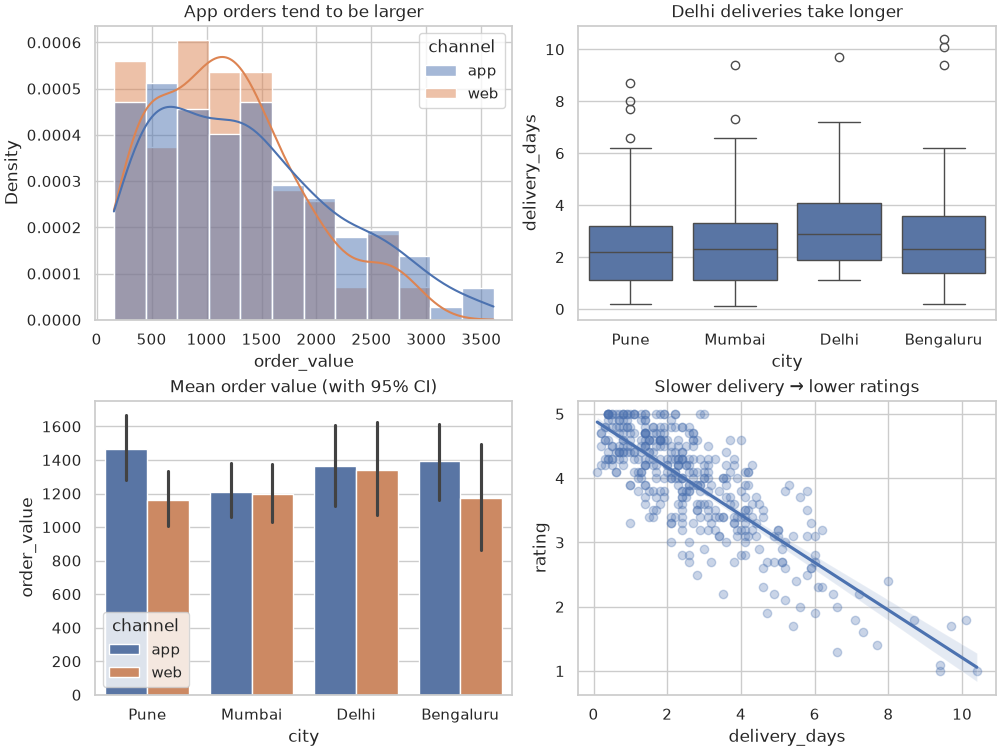

```python
fig, ax = plt.subplots(figsize=(5, 4), layout="constrained")
corr = shop[["items", "order_value", "delivery_days", "rating"]].corr().round(2)
sns.heatmap(corr, annot=True, cmap="RdBu", vmin=-1, vmax=1, ax=ax)
ax.set_title("Correlation between numeric columns")
fig.savefig("seaborn-heatmap.png", dpi=100)
plt.close(fig)
print(corr)

grid = sns.relplot(data=shop, x="items", y="order_value", col="channel", hue="city",
                   height=3.2, aspect=1.1, alpha=0.7)          # one chart per channel (facets)
grid.savefig("seaborn-facets.png", dpi=100)
plt.close(grid.figure)
print(type(grid).__name__)
```

**Output:**

```text
               items  order_value  delivery_days  rating
items           1.00         0.83           0.03   -0.02
order_value     0.83         1.00          -0.03    0.01
delivery_days   0.03        -0.03           1.00   -0.81
rating         -0.02         0.01          -0.81    1.00
FacetGrid
```

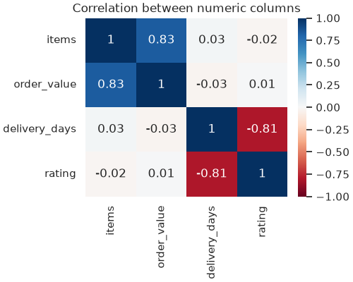

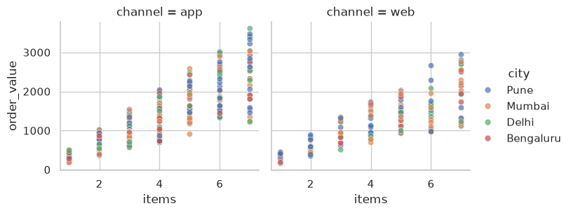

**Common mistakes:**

- ❌ Passing wide data (a column per group) when Seaborn expects long data. ✅ `melt` first.
- ❌ Reading a bar plot's height as a total: `barplot` shows the **mean** unless you set `estimator`.
- ❌ A heatmap of correlations with a non-diverging colormap, making −0.8 look "small". ✅ `cmap="RdBu"`, `vmin=-1, vmax=1`.
- ❌ Comparing histograms of groups with very different sizes using raw counts. ✅ `stat="density", common_norm=False`.
- ❌ Trying to use `ax=` with figure-level functions (`relplot`, `catplot`, `displot`). They make their own figure.

### Practice

1. Make a violin plot of `rating` for each city, split by channel.

<details>
<summary><b>Answer</b></summary>

```python
fig, ax = plt.subplots(figsize=(7, 3.5), layout="constrained")
sns.violinplot(data=shop, x="city", y="rating", hue="channel", split=True, inner="quart", ax=ax)
plt.close(fig)
print(shop.groupby("city")["rating"].median().sort_values())
```

**Output:**

```text
city
Delhi        3.8
Bengaluru    4.1
Mumbai       4.2
Pune         4.2
Name: rating, dtype: float64
```

</details>

**Learn more:** [Seaborn: tutorial](https://seaborn.pydata.org/tutorial.html) · [Seaborn: example gallery](https://seaborn.pydata.org/examples/index.html)

---

## 19. Choosing the Right Chart (and Not Misleading)

### Theory

> **In simple words:** start from the **question**, not the chart type. "How did sales change?" needs a line. "Which city sells most?" needs sorted bars. "Are price and sales related?" needs a scatter. A good chart makes **one point** obvious, and an honest chart doesn't exaggerate it.

**Question → chart:**

| Your question is about… | Use | Avoid |
|---|---|---|
| Change **over time** | Line chart (bars for a few periods) | Pie charts, unordered bars |
| **Comparing** categories | Bar chart, **sorted**, horizontal if labels are long | Pie with many slices, 3D bars |
| **Parts of a whole** | Stacked bar, or a pie/donut with **2–4** slices | Pie with 7+ slices |
| **Distribution** of one number | Histogram, box plot, violin, ECDF | Bar of the mean alone (it hides the spread) |
| **Relationship** between two numbers | Scatter (add a trend line; use transparency for many points) | Line chart of unordered points |
| **Many variables** at once | Correlation heatmap, pair plot, small multiples (facets) | One overloaded chart |
| **Geography** | Choropleth map (colour by region) | A table of 30 regions |
| A single key number | Just the number, big, with context ("₹5.8L, +12% vs last month") | A chart |

**Rules that make charts honest and clear:**

1. **Bar charts start at zero.** Bar length is the value; cutting the axis at 95 makes a 2% difference look like 5×. (Line charts may zoom in, since they show change.)
2. **One message per chart**, stated in the title: "Mumbai overtook Pune in May", not "Revenue by city".
3. **Sort** categories by value unless they have a natural order (months, sizes).
4. **Label directly** where you can (text next to lines) instead of making readers match colours to a legend.
5. **Use colour for meaning:** grey for context, one strong colour for the highlight; colour-blind-safe palettes.
6. **Remove clutter:** 3D effects, heavy gridlines, borders, shadows, and decimals nobody needs.
7. **Show uncertainty** when it matters: error bars, confidence bands, or the raw points.
8. **Same scale for comparisons:** side-by-side charts of the same measure share their y-axis (`sharey=True`).

**Beyond static charts:**

- **Interactive charts** (hover, zoom): **Plotly** (`plotly.express`: `px.line(df, x="date", y="units", color="city")`), **Altair** (declarative, based on Vega-Lite), **Bokeh**.
- **Dashboards and data apps in Python:** **Streamlit** (the most popular; a script becomes a web app), **Dash**, **Gradio** (demos of ML models), **Panel**.
- **Business-intelligence tools** used across companies: Power BI, Tableau, Looker, Metabase, Apache Superset. Data scientists often prepare the tables these tools read.

### Python

```python
import matplotlib.pyplot as plt
import numpy as np

plt.rcdefaults()                     # back to Matplotlib's default look (the Seaborn section changed it)

teams = ["Team A", "Team B"]
scores = [96.1, 98.3]
shares = {"Pune": 29, "Mumbai": 27, "Delhi": 14, "Bengaluru": 12, "Chennai": 8, "Kolkata": 6, "Other": 4}

fig, axes = plt.subplots(2, 2, figsize=(9, 7), layout="constrained")
axes[0, 0].bar(teams, scores, color=["gray", "tab:red"])
axes[0, 0].set_ylim(95.5, 98.5)
axes[0, 0].set_title("BAD: axis starts at 95.5,\nso B's bar is 5× taller")
axes[0, 1].bar(teams, scores, color=["gray", "tab:red"])
axes[0, 1].set_ylim(0, 100)
axes[0, 1].set_title("BETTER: axis starts at 0,\nB is about 2% better")

axes[1, 0].pie(shares.values(), labels=shares.keys(), startangle=90)
axes[1, 0].set_title("BAD: seven slices are hard to compare")
names = sorted(shares, key=shares.get)
colors = ["tab:blue" if c == "Pune" else "lightgray" for c in names]
axes[1, 1].barh(names, [shares[c] for c in names], color=colors)
for i, c in enumerate(names):
    axes[1, 1].text(shares[c] + 0.5, i, f"{shares[c]}%", va="center")
axes[1, 1].spines[["top", "right"]].set_visible(False)
axes[1, 1].set_title("BETTER: sorted, labelled bars;\nPune has the largest share")
fig.savefig("good-vs-bad-charts.png", dpi=100)
plt.close(fig)
print(f"real difference: {100 * (scores[1] - scores[0]) / scores[0]:.1f}%")
```

**Output:**

```text
real difference: 2.3%
```

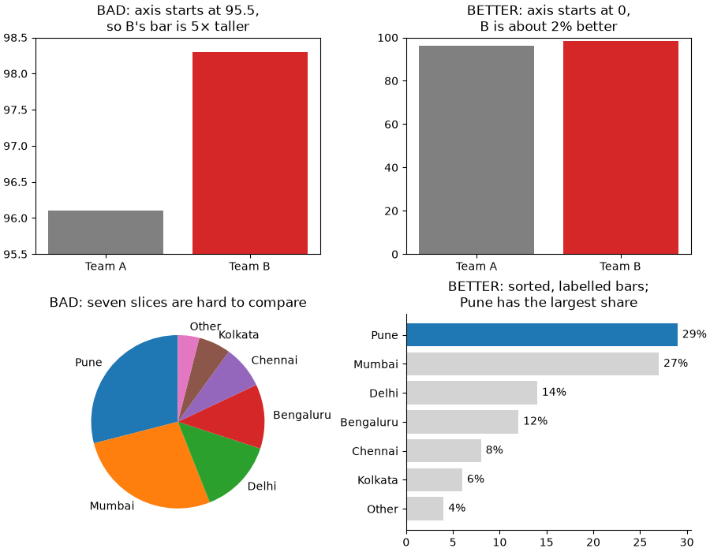

**Common mistakes:**

- ❌ Choosing a chart because it looks impressive (3D pies, radar charts, word clouds).
- ❌ Dual y-axes, truncated bars, or cherry-picked date ranges that make a small change look dramatic.
- ❌ Default titles like "Figure 1" or the column name. Say what the reader should notice.

### Practice

1. Which chart would you use for each question? (a) How are delivery times spread out? (b) Did weekly active users grow this year? (c) Do customers who order more often rate us higher? (d) What share of revenue comes from app vs web?

<details>
<summary><b>Answer</b></summary>

(a) Histogram or box plot (by city if comparing). (b) Line chart over weeks. (c) Scatter plot of order frequency vs rating, with a trend line. (d) A single stacked bar or a two-slice donut; or just state the two percentages.

</details>

---

### ✅ Part 4 checkpoint

Without looking, can you:

- [ ] Create a figure with `plt.subplots`, draw line, bar, scatter and histogram charts, and label and save them?
- [ ] Build multi-chart layouts, annotate a point, format axis labels, and pick colour-blind-safe colours?
- [ ] Use Seaborn with `hue` and facets for distributions, comparisons and relationships?
- [ ] Choose the right chart for a question, and spot a misleading one?

**Learn more:** [Claus Wilke, Fundamentals of Data Visualization (free book)](https://clauswilke.com/dataviz/) · [From Data to Viz: chart chooser](https://www.data-to-viz.com/)

---

# Part 5 — Advanced: Statistics and Getting Data Ready for ML

> **Goal:** Describe data, reason with probability and distributions, test hypotheses and run A/B tests, carry out a full EDA, and prepare features for machine learning.  
> **You need:** Parts 1–4.

---

## 20. Describing Data: Averages, Spread, Outliers and Correlation

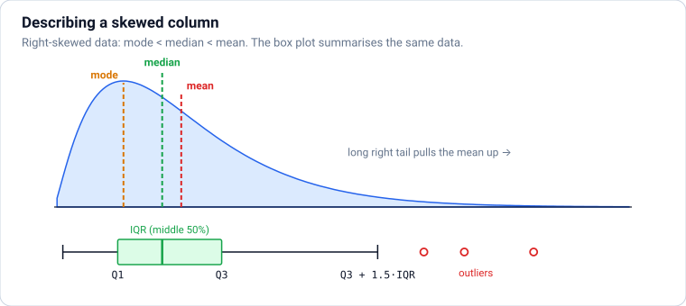

### Theory

> **In simple words:** descriptive statistics summarise a column of numbers in a few values: where the **middle** is (mean, median), how **spread out** the values are (standard deviation, IQR), whether there are **unusual** values (outliers), and how two columns **move together** (correlation).

**Where's the middle? (central tendency)**

| Measure | How | Good for | Weakness |
|---|---|---|---|
| **Mean** (average) | Sum ÷ count | Symmetric data, totals | Pulled by extreme values |
| **Median** | The middle value after sorting | Skewed data (salaries, prices, house values) | Ignores how far the extremes are |
| **Mode** | The most common value | Categories ("most popular size") | Can be unstable for numbers |

Example: salaries 30k, 35k, 40k, 45k and one of 1,000k. Mean = 230k (describes nobody); median = 40k (typical person). **When mean ≫ median, the data is right-skewed** (a long tail of large values), which is very common for money, time and counts.

**How spread out? (dispersion)**

- **Range** = max − min: simple, but set entirely by two (possibly extreme) values.
- **Variance** = the average of squared distances from the mean. **Standard deviation (std, σ)** = √variance, in the **same units** as the data. "Mean 50, std 10" means most values sit roughly between 40 and 60.
- **Percentiles:** the 90th percentile is the value that 90% of data falls below. The **quartiles** are the 25th (Q1), 50th (median) and 75th (Q3) percentiles. **IQR** = Q3 − Q1, the range of the middle 50%: robust to outliers.
- Engineering uses percentiles heavily: "p99 latency = 800 ms" means 99% of requests are faster than 800 ms.

(pandas' `std()` divides by n − 1, the **sample** standard deviation, because data is usually a sample of a bigger population; NumPy's `np.std` divides by n unless you pass `ddof=1`.)

**Shape:** **skewness** measures lopsidedness (positive = long right tail); **kurtosis** measures how heavy the tails are. A log transform (`np.log1p`) often makes right-skewed data more symmetric.

**Outliers**, values far from the rest, can be errors (a typo: age 250) or real and important (a fraud transaction). Two common rules:

- **IQR rule:** outside [Q1 − 1.5 × IQR, Q3 + 1.5 × IQR] (what box-plot dots show).
- **z-score:** z = (x − mean) / std; |z| > 3 is unusual **if** the data is roughly bell-shaped.

Investigate outliers before removing them; never delete them just to make results look nicer.

**Correlation** measures how two numbers move together, from −1 (perfect opposite) through 0 (no *linear* relation) to +1 (perfect together).

- **Pearson** (`df.corr()`): linear relationships; sensitive to outliers.
- **Spearman** (`df.corr(method="spearman")`): uses ranks, so it catches any steadily increasing or decreasing relationship and resists outliers.

**Correlation is not causation.** Ice-cream sales and drowning deaths correlate because both rise in summer (a **confounder**). Correlation can also be 0 for a strong but non-linear (U-shaped) relationship, so always plot the data too.

### Python

```python
import numpy as np
import pandas as pd

salaries = pd.Series([30, 35, 40, 45, 1000], name="salary_k")
print("mean:", salaries.mean(), "median:", salaries.median())

rng = np.random.default_rng(42)
delivery = pd.Series(rng.gamma(shape=2, scale=1.5, size=1000).round(1), name="days")   # right-skewed
print(delivery.describe().round(2))
print("skew:", round(delivery.skew(), 2), " p90:", round(delivery.quantile(0.9), 2), " p99:", round(delivery.quantile(0.99), 2))
print("mode:", delivery.mode().tolist())          # three values tie: the mode is unstable for measurements
```

**Output:**

```text
mean: 230.0 median: 40.0
count    1000.00
mean        2.95
std         2.09
min         0.10
25%         1.50
50%         2.50
75%         3.90
max        15.10
Name: days, dtype: float64
skew: 1.45  p90: 5.71  p99: 10.0
mode: [0.9, 2.2, 3.0]
```

```python
q1, q3 = delivery.quantile([0.25, 0.75])
iqr = q3 - q1
low, high = q1 - 1.5 * iqr, q3 + 1.5 * iqr
outliers = delivery[(delivery < low) | (delivery > high)]
print(f"IQR fence: {low:.2f} to {high:.2f}; {len(outliers)} outliers, largest {outliers.max()}")

z = (delivery - delivery.mean()) / delivery.std()
print("|z| > 3:", int((z.abs() > 3).sum()))
print("std (pandas, n-1):", round(delivery.std(), 4), " np.std (n):", round(np.std(delivery.to_numpy()), 4))
```

**Output:**

```text
IQR fence: -2.10 to 7.50; 42 outliers, largest 15.1
|z| > 3: 16
std (pandas, n-1): 2.0879  np.std (n): 2.0868
```

```python
x = np.linspace(-3, 3, 200)
df = pd.DataFrame({"x": x,
                   "linear": 2 * x + rng.normal(0, 0.5, 200),
                   "curved": np.exp(x) + rng.normal(0, 0.5, 200),       # always increasing, not a straight line
                   "u_shape": x ** 2 + rng.normal(0, 0.5, 200)})         # strong relation, but not monotonic
print(df.corr(method="pearson").loc["x"].round(2))
print(df.corr(method="spearman").loc["x"].round(2))
```

**Output:**

```text
x          1.00
linear     0.99
curved     0.82
u_shape    0.01
Name: x, dtype: float64
x          1.00
linear     0.99
curved     0.93
u_shape    0.00
Name: x, dtype: float64
```

The U-shaped column is **strongly** related to `x`, yet both correlations are close to 0: they only measure straight-line (Pearson) or steadily-rising (Spearman) patterns. Always look at a scatter plot.

**Common mistakes:**

- ❌ Reporting only the mean for skewed data (incomes, delivery times, prices). ✅ Report the median, and percentiles.
- ❌ Using the z-score rule on heavily skewed data, where it flags too few or too many points.
- ❌ Concluding "no relationship" from a correlation near 0 without plotting.
- ❌ "X correlates with Y, so X causes Y."

### Practice

1. For `delivery`, what percentage of orders take longer than 5 days? Is the mean or the median larger, and why?

<details>
<summary><b>Answer</b></summary>

```python
print(f"{100 * (delivery > 5).mean():.1f}% over 5 days")
print("mean > median:", delivery.mean() > delivery.median())
```

**Output:**

```text
13.9% over 5 days
mean > median: True
```

(`(condition).mean()` gives the **fraction** of True values, a handy trick.) The mean is larger because the long right tail of slow deliveries pulls it up; the median ignores how extreme those values are.

</details>

**Learn more:** [OpenIntro Statistics (free book)](https://www.openintro.org/book/os/) · [Seeing Theory (visual statistics)](https://seeing-theory.brown.edu/)

---

## 21. Probability, Distributions, Sampling and Confidence Intervals

### Theory

> **In simple words:** **probability** measures how likely something is, from 0 (never) to 1 (always). A **distribution** describes which values a random quantity takes and how often. Since we can rarely measure everyone, we measure a **sample** and use these ideas to say how close our sample's answer probably is to the truth.

**Probability basics:**

- P(A) = favourable outcomes ÷ all equally likely outcomes. A fair die: P(6) = 1/6.
- **Not:** P(not A) = 1 − P(A).
- **And** (independent events, where one doesn't affect the other): P(A and B) = P(A) × P(B). Two sixes: 1/36.
- **Or:** P(A or B) = P(A) + P(B) − P(A and B).
- **Conditional probability** P(A | B), "the probability of A given that B happened" = P(A and B) ÷ P(B).
- **Bayes' rule** turns it around: P(A | B) = P(B | A) × P(A) ÷ P(B).

**Bayes in one example.** A disease affects 1% of people. A test catches 95% of sick people but also flags 5% of healthy ones. You test positive: are you probably sick? Out of 10,000 people: 100 are sick → 95 test positive; 9,900 are healthy → 495 test positive. So P(sick | positive) = 95 / (95 + 495) ≈ **16%**. When the condition is rare, most positives are false alarms. The same maths explains why spam filters and fraud alerts need care with rare events.

**Common distributions:**

| Distribution | Describes | Example | NumPy |
|---|---|---|---|
| **Uniform** | Every value in a range equally likely | A random number 0–1 | `rng.uniform(a, b, n)` |
| **Bernoulli / Binomial** | Yes/no outcomes; count of "yes" in n tries | Clicks out of 1,000 views | `rng.binomial(n, p, size)` |
| **Poisson** | Count of events in a fixed period | Orders per minute, bugs per release | `rng.poisson(lam, size)` |
| **Normal** (Gaussian) | Symmetric bell curve around a mean | Heights, measurement errors | `rng.normal(mean, std, n)` |
| **Exponential** | Waiting time between random events | Time until the next customer | `rng.exponential(scale, n)` |
| **Log-normal** | Positive, right-skewed values | Incomes, order values, file sizes | `rng.lognormal(mu, sigma, n)` |

**The normal distribution's 68–95–99.7 rule:** about 68% of values lie within 1 std of the mean, 95% within 2, and 99.7% within 3.

**Samples and populations.** The **population** is everyone you care about (all customers); a **sample** is the part you measured. A good sample is **random** and **representative**; a biased sample (only customers who answered a survey) gives confidently wrong answers no matter how large it is.

**The two laws that make statistics work:**

- **Law of large numbers:** as a sample grows, its average gets closer to the true average.
- **Central limit theorem (CLT):** if you take many samples and compute each one's mean, those **means** form a normal (bell-shaped) distribution, even when the original data is skewed, as long as samples are reasonably large (often n ≥ 30). This is why so many statistical tests use the normal distribution.

**Standard error (SE)** is how much a sample mean typically varies from sample to sample: SE = std ÷ √n. Four times more data halves the error.

**A 95% confidence interval (CI)** is a range built so that, if you repeated the sampling many times, 95% of such ranges would contain the true value. For a mean with a decent sample: **mean ± 1.96 × SE**. Report results with their CI: "average order ₹842 (95% CI ₹806–₹878)", not just "₹842".

### Python

```python
import matplotlib.pyplot as plt
import numpy as np

sick, healthy = 10_000 * 0.01, 10_000 * 0.99
true_pos, false_pos = sick * 0.95, healthy * 0.05
print(f"P(sick | positive) = {true_pos / (true_pos + false_pos):.3f}")

rng = np.random.default_rng(0)
heights = rng.normal(165, 8, 100_000)
within = [np.mean(np.abs(heights - 165) <= k * 8) for k in (1, 2, 3)]
print("within 1, 2, 3 std:", [round(float(w), 3) for w in within])
print("clicks out of 1000 views (p=0.03):", rng.binomial(1000, 0.03, 5))
print("orders per minute (average 4):", rng.poisson(4, 8))
```

**Output:**

```text
P(sick | positive) = 0.161
within 1, 2, 3 std: [0.684, 0.955, 0.997]
clicks out of 1000 views (p=0.03): [33 30 32 25 24]
orders per minute (average 4): [4 3 2 1 2 2 3 4]
```

```python
population = rng.exponential(scale=800, size=1_000_000)       # skewed "order values", true mean ≈ 800
sample_means = [rng.choice(population, 50).mean() for _ in range(5000)]

fig, axes = plt.subplots(1, 2, figsize=(9, 3.2), layout="constrained")
axes[0].hist(population[:20000], bins=60, color="gray")
axes[0].set_title("Population: very skewed")
axes[1].hist(sample_means, bins=60, color="tab:blue")
axes[1].set_title("Means of 5,000 samples of 50: a bell curve")
fig.savefig("central-limit-theorem.png", dpi=100)
plt.close(fig)

print("population mean:", round(population.mean()), " average of sample means:", round(np.mean(sample_means)))
print("SE predicted:", round(population.std() / np.sqrt(50)), " SE observed:", round(np.std(sample_means)))
```

**Output:**

```text
population mean: 800  average of sample means: 802
SE predicted: 113  SE observed: 112
```

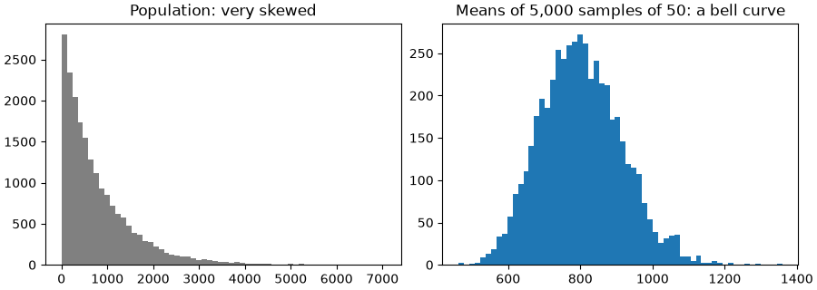

```python
from scipy import stats

sample = rng.choice(population, 400)
mean, se = sample.mean(), sample.std(ddof=1) / np.sqrt(len(sample))
print(f"mean {mean:.0f}, 95% CI {mean - 1.96 * se:.0f} to {mean + 1.96 * se:.0f}")
low, high = stats.t.interval(0.95, df=len(sample) - 1, loc=mean, scale=se)   # the exact small-sample version
print(f"t-interval: {low:.0f} to {high:.0f}")

hits = 0
for _ in range(1000):                          # does the interval catch the true mean ~95% of the time?
    s = rng.choice(population, 400)
    m, e = s.mean(), s.std(ddof=1) / np.sqrt(400)
    hits += (m - 1.96 * e) <= population.mean() <= (m + 1.96 * e)
print("coverage:", hits / 1000)              # close to 0.95, as promised
```

**Output:**

```text
mean 771, 95% CI 695 to 848
t-interval: 695 to 848
coverage: 0.943
```

**Common mistakes:**

- ❌ "There's a 95% chance the true value is in *this* interval." Strictly, 95% is about the **method**: 95% of intervals built this way contain it.
- ❌ Assuming a bigger sample fixes a **biased** sample. It doesn't; it just makes the wrong answer more precise.
- ❌ Assuming data is normal without checking (money, time and counts usually aren't).
- ❌ Forgetting base rates (the Bayes example): a 95%-accurate test for a rare condition mostly produces false positives.

### Practice

1. A 99%-accurate fraud model (catches 99% of fraud, flags 1% of normal transactions) runs on data where 0.1% of transactions are fraud. What fraction of flagged transactions is actually fraud?

<details>
<summary><b>Answer</b></summary>

```python
fraud, normal = 1_000_000 * 0.001, 1_000_000 * 0.999
flagged_fraud, flagged_normal = fraud * 0.99, normal * 0.01
print(f"{flagged_fraud / (flagged_fraud + flagged_normal):.1%}")
```

**Output:**

```text
9.0%
```

Only about 1 in 11 alerts is real fraud, which is why fraud teams look at **precision** (covered in `machine-learning.md`), not just accuracy.

</details>

**Learn more:** [Seeing Theory: probability and CLT (interactive)](https://seeing-theory.brown.edu/) · [3Blue1Brown: Bayes' theorem (video)](https://www.youtube.com/watch?v=HZGCoVF3YvM) · [SciPy: statistical functions](https://docs.scipy.org/doc/scipy/reference/stats.html)

---

## 22. Hypothesis Tests and A/B Testing

### Theory

> **In simple words:** you changed the checkout button and conversions went from 10.0% to 10.8%. Is that a **real** improvement or just **luck**? A hypothesis test answers: "if the change did nothing, how surprising would a difference this big be?" If it would be very surprising, we conclude the change probably had an effect.

**The steps of a test:**

1. **Null hypothesis (H₀):** "no effect" (the new button converts the same as the old).
2. **Alternative (H₁):** "there is an effect".
3. Choose a **significance level α** before looking, usually 0.05.
4. Compute a **test statistic** from the data, and its **p-value**: the probability of seeing a result at least this extreme **if H₀ were true**.
5. If p < α, **reject H₀** ("statistically significant"). Otherwise you **fail to reject** it (which is *not* proof of no effect).

**Two ways to be wrong:**

| | H₀ actually true (no effect) | H₀ actually false (real effect) |
|---|---|---|
| Reject H₀ | **Type I error** (false positive), probability α | ✅ Correct |
| Don't reject H₀ | ✅ Correct | **Type II error** (false negative), probability β |

**Power** = 1 − β: the chance of detecting a real effect. It grows with sample size and effect size. Aim for 80% power, and **calculate the sample size before the experiment**.

**Which test?**

| Question | Test | SciPy |
|---|---|---|
| Two groups' means differ? (numbers) | Welch's **t-test** | `stats.ttest_ind(a, b, equal_var=False)` |
| Same people before vs after? | Paired t-test | `stats.ttest_rel(before, after)` |
| Two groups differ, data very skewed or ranks? | **Mann–Whitney U** (non-parametric) | `stats.mannwhitneyu(a, b)` |
| Two conversion **rates** differ? | Two-proportion **z-test** or chi-square | `stats.chi2_contingency(table)` |
| Two categorical columns related? | **Chi-square** test of independence | `stats.chi2_contingency(table)` |
| Three or more groups' means? | ANOVA (`f_oneway`), Kruskal–Wallis | `stats.f_oneway(a, b, c)` |

**Resampling methods** need no formulas and few assumptions, which makes them popular in practice:

- **Bootstrap:** resample your data **with replacement** thousands of times and recompute the statistic each time; the middle 95% of results is a confidence interval. Works for medians, ratios, anything.
- **Permutation test:** shuffle the group labels thousands of times; the p-value is how often a shuffled difference is at least as large as the real one.

**A/B testing in practice** (how product companies run experiments):

- **Randomly** assign users (not page views) to A (control) or B (treatment), and decide the **primary metric**, α, minimum effect worth detecting and sample size **up front**.
- Run for **whole weeks** (weekday and weekend users behave differently), and check the split is really 50/50 (a **sample ratio mismatch** signals a bug).
- ❌ **Don't peek** and stop as soon as p < 0.05: checking repeatedly inflates false positives a lot. If you must monitor, use a **sequential** method designed for it (such as always-valid p-values or group-sequential designs, offered by experimentation platforms).
- **Many metrics or many variants** → some will look "significant" by chance (with 20 tests at α = 0.05, expect one false positive). Correct with Bonferroni (α ÷ number of tests) or Benjamini–Hochberg.
- **Statistical vs practical significance:** with millions of users, a 0.01% lift can be "significant" but worthless. Report the **effect size and its confidence interval**.
- **Variance reduction** such as **CUPED** (adjusting for each user's pre-experiment behaviour) lets big platforms detect smaller effects with the same traffic.
- Watch for **novelty effects** (users click the new thing because it's new) and **network effects** (users in A and B influence each other, as in marketplaces and social apps).

### Python

```python
import numpy as np
from scipy import stats

rng = np.random.default_rng(1)
control = rng.binomial(1, 0.100, 20_000)          # 1 = converted, true rate 10.0%
treatment = rng.binomial(1, 0.108, 20_000)        # true rate 10.8%
print(f"A: {control.mean():.4f}  B: {treatment.mean():.4f}  lift: {treatment.mean() / control.mean() - 1:+.1%}")

table = [[treatment.sum(), len(treatment) - treatment.sum()],
         [control.sum(), len(control) - control.sum()]]
chi2, p, dof, _ = stats.chi2_contingency(table, correction=False)
print(f"chi-square p-value: {p:.4f}")

p_pool = (treatment.sum() + control.sum()) / (len(treatment) + len(control))
se = np.sqrt(p_pool * (1 - p_pool) * (1 / len(treatment) + 1 / len(control)))
z = (treatment.mean() - control.mean()) / se
print(f"z = {z:.2f}, two-sided p = {2 * stats.norm.sf(abs(z)):.4f}")       # same test, by hand
```

**Output:**

```text
A: 0.1018  B: 0.1062  lift: +4.3%
chi-square p-value: 0.1542
z = 1.42, two-sided p = 0.1542
```

Notice what happened: B really **is** better (we built the data with 10.0% vs 10.8%), yet p = 0.15, so we can't reject H₀. With 20,000 users per group, this test is **too small** to reliably detect such a small lift (the practice question below shows how to compute the sample size you'd need). "Not significant" means "not enough evidence", not "no effect".

```python
diff = treatment.mean() - control.mean()
boot = [rng.choice(treatment, len(treatment)).mean() - rng.choice(control, len(control)).mean()
        for _ in range(2000)]
low, high = np.percentile(boot, [2.5, 97.5])
print(f"difference {diff:+.4f}, bootstrap 95% CI {low:+.4f} to {high:+.4f}")

order_a = rng.lognormal(6.6, 0.7, 300)            # skewed order values
order_b = rng.lognormal(6.7, 0.7, 300)
print("Welch t-test p:", round(stats.ttest_ind(order_b, order_a, equal_var=False).pvalue, 4))
print("Mann-Whitney p:", round(stats.mannwhitneyu(order_b, order_a).pvalue, 4))

observed = order_b.mean() - order_a.mean()
pooled = np.concatenate([order_a, order_b])
count = 0
for _ in range(5000):
    rng.shuffle(pooled)
    count += abs(pooled[300:].mean() - pooled[:300].mean()) >= abs(observed)
print("permutation p:", round(count / 5000, 4))
```

**Output:**

```text
difference +0.0044, bootstrap 95% CI -0.0018 to +0.0103
Welch t-test p: 0.0474
Mann-Whitney p: 0.0409
permutation p: 0.048
```

```python
false_alarms = 0
for _ in range(2000):                              # A/A tests: both groups identical, so H0 is TRUE
    a, b = rng.binomial(1, 0.1, 2000), rng.binomial(1, 0.1, 2000)
    peeks = [stats.chi2_contingency([[b[:k].sum(), k - b[:k].sum()], [a[:k].sum(), k - a[:k].sum()]],
                                    correction=False)[1] for k in range(200, 2001, 200)]
    false_alarms += min(peeks) < 0.05              # "stop as soon as it looks significant"
print(f"false-positive rate with 10 peeks: {false_alarms / 2000:.1%} (should be 5%)")
```

**Output:**

```text
false-positive rate with 10 peeks: 18.3% (should be 5%)
```

That's the danger of peeking: checking ten times and stopping at the first "significant" result roughly **triples or quadruples** the false-positive rate.

**Common mistakes:**

- ❌ "p = 0.03 means a 97% chance B is better." The p-value assumes H₀ is true; it's not the probability that H₀ is true.
- ❌ "p = 0.2, so there's no effect." Maybe the test was too small (low power).
- ❌ Picking the metric or the stopping day **after** seeing the data.
- ❌ Randomising by page view, so the same user sees both versions.

### Practice

1. How many users per group do you need to detect a lift from 10% to 11% conversion with α = 0.05 and 80% power? Use the formula n = (z₁₋α/₂ + z₁₋β)² × (p₁(1−p₁) + p₂(1−p₂)) ÷ (p₂ − p₁)².

<details>
<summary><b>Answer</b></summary>

```python
p1, p2 = 0.10, 0.11
z_a, z_b = stats.norm.ppf(1 - 0.05 / 2), stats.norm.ppf(0.80)
n = (z_a + z_b) ** 2 * (p1 * (1 - p1) + p2 * (1 - p2)) / (p2 - p1) ** 2
print(round(z_a, 2), round(z_b, 2), int(np.ceil(n)))
```

**Output:**

```text
1.96 0.84 14749
```

About 15,000 users **per group** to reliably detect a 1-percentage-point lift. Small effects need big samples, which is why experiments on small products often can't detect them.

</details>

**Learn more:** [Kohavi, Tang and Xu, Trustworthy Online Controlled Experiments (book site)](https://experimentguide.com/) · [Evan Miller: how not to run an A/B test](https://www.evanmiller.org/how-not-to-run-an-ab-test.html) · [SciPy: statistics](https://docs.scipy.org/doc/scipy/reference/stats.html)

---

## 23. A Complete Exploratory Data Analysis (EDA)

### Theory

> **In simple words:** EDA is getting to know a dataset **before** drawing conclusions or training models: what's in it, what's wrong with it, and what patterns stand out. It combines everything so far: pandas to inspect and summarise, charts to see, and statistics to check that patterns aren't just noise.

**An EDA checklist** you can reuse on any dataset:

1. **Context:** what does each row represent? What does each column mean (the **data dictionary**)? What question are we answering? Where did the data come from, and who is missing from it?
2. **Structure:** `shape`, `dtypes`, `head()`. Are the types right?
3. **Quality:** missing values, duplicates, impossible values, inconsistent categories (Section [9](#9-cleaning-data-missing-values-duplicates-types-and-text)).
4. **One column at a time (univariate):** `describe()`, histograms, `value_counts()`. Skewed? Outliers?
5. **Pairs of columns (bivariate):** correlations, scatter plots, box plots of a number by a category.
6. **The target** (what you want to predict or explain): its balance, and which columns relate to it most.
7. **Many columns (multivariate):** heatmaps, pair plots, facets.
8. **Write down findings and next steps:** what to clean, which features look useful, what to ask the data owner.

**Automated profiling** tools (such as `ydata-profiling`, or a Jupyter data-explorer extension) produce a full report in one line. Use them for a first look, but they don't replace thinking about the question.

**The dataset here:** the classic **wine** dataset bundled with scikit-learn (no download needed): 178 wines from three grape cultivars grown in the same region of Italy, with 13 chemical measurements each. The question: **which measurements tell the three cultivars apart?** (The machine-learning notes then train a model on it; `load_wine` is only used here to load the table.)

### Python

```python
import matplotlib.pyplot as plt
import numpy as np
import pandas as pd
import seaborn as sns
from scipy import stats
from sklearn.datasets import load_wine

wine = load_wine(as_frame=True).frame
wine = wine.rename(columns={"od280/od315_of_diluted_wines": "od280", "target": "cultivar"})
wine["cultivar"] = wine["cultivar"].map({0: "A", 1: "B", 2: "C"}).astype("category")

print(wine.shape)
print("missing values:", int(wine.isna().sum().sum()), " duplicate rows:", int(wine.duplicated().sum()))
print(wine["cultivar"].value_counts().sort_index())
print(wine.describe().T[["mean", "std", "min", "max"]].round(2).head(6))
```

**Output:**

```text
(178, 14)
missing values: 0  duplicate rows: 0
cultivar
A    59
B    71
C    48
Name: count, dtype: int64
                    mean    std    min     max
alcohol            13.00   0.81  11.03   14.83
malic_acid          2.34   1.12   0.74    5.80
ash                 2.37   0.27   1.36    3.23
alcalinity_of_ash  19.49   3.34  10.60   30.00
magnesium          99.74  14.28  70.00  162.00
total_phenols       2.30   0.63   0.98    3.88
```

The data is clean (no missing values or duplicates), and the classes are reasonably balanced. Note the very different **scales**: `magnesium` is around 100, `hue` around 1, and `proline` (below) in the hundreds to over a thousand. That matters for many ML models (Section [24](#24-preparing-data-for-machine-learning-feature-engineering-basics)).

```python
numeric = wine.columns.drop("cultivar")
skew = wine[numeric].skew().sort_values(ascending=False).round(2)
print(skew.head(3))

f_scores = {col: stats.f_oneway(*[g[col] for _, g in wine.groupby("cultivar", observed=True)]).statistic
            for col in numeric}                                   # ANOVA: how different are the group means?
ranking = pd.Series(f_scores).sort_values(ascending=False).round(0)
print(ranking.head(5))
print(wine.groupby("cultivar", observed=True)[["flavanoids", "proline", "od280", "alcohol"]].mean().round(2))
```

**Output:**

```text
magnesium          1.10
malic_acid         1.04
color_intensity    0.87
dtype: float64
flavanoids         234.0
proline            208.0
od280              190.0
alcohol            135.0
color_intensity    121.0
dtype: float64
          flavanoids  proline  od280  alcohol
cultivar                                     
A               2.98  1115.71   3.16    13.74
B               2.08   519.51   2.79    12.28
C               0.78   629.90   1.68    13.15
```

The ANOVA F-score ranks each measurement by how strongly the three cultivars' means differ relative to the spread inside each group. `flavanoids`, `proline`, `od280` and `alcohol` separate the cultivars best.

```python
sns.set_theme(style="whitegrid")
fig, axes = plt.subplots(1, 3, figsize=(11, 3.4), layout="constrained")
for ax, col in zip(axes, ["proline", "flavanoids", "alcohol"]):
    sns.boxplot(data=wine, x="cultivar", y=col, hue="cultivar", legend=False, ax=ax)
    ax.set_title(f"{col} by cultivar")
fig.savefig("eda-boxplots.png", dpi=100)
plt.close(fig)

fig, ax = plt.subplots(figsize=(7, 5.5), layout="constrained")
top = ranking.index[:7].tolist()
sns.heatmap(wine[top].corr().round(2), annot=True, cmap="RdBu", vmin=-1, vmax=1, ax=ax)
ax.set_title("Correlations among the most useful measurements")
fig.savefig("eda-heatmap.png", dpi=100)
plt.close(fig)

grid = sns.pairplot(wine, vars=["proline", "flavanoids", "color_intensity"], hue="cultivar", height=2.2, corner=True)
grid.savefig("eda-pairplot.png", dpi=90)
plt.close(grid.figure)
print(round(wine["flavanoids"].corr(wine["total_phenols"]), 2))
```

**Output:**

```text
0.86
```

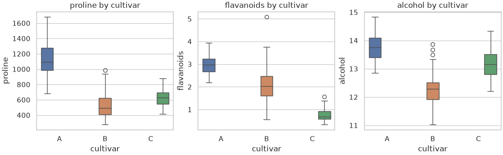

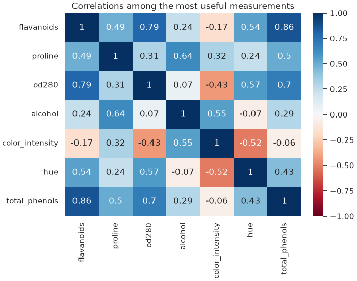

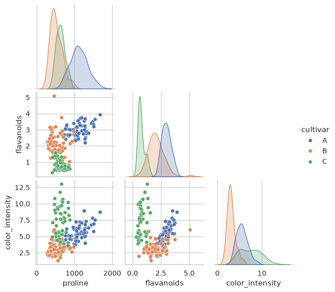

**Findings (what you'd write in the notebook):**

1. Clean data: 178 rows, 13 numeric features, no missing values or duplicates; classes 59 / 71 / 48, so no severe imbalance.
2. Cultivar **A** has high `proline` (≈1,116 vs ≈520–630); cultivar **C** has low `flavanoids` (≈0.78) and high `color_intensity`. Two or three measurements already separate the groups well (see the pair plot).
3. `flavanoids`, `total_phenols` and `od280` are strongly correlated (r ≈ 0.7–0.86): they carry overlapping information, so a model might need only one or two of them.
4. Features have very different scales (`proline` in the hundreds to thousands vs `hue` near 1), so **scale** features before distance-based models.
5. **Next steps:** train a simple classifier on these features (machine-learning notes), with a train/test split.

**Common mistakes:**

- ❌ Jumping straight to modelling without looking at the data.
- ❌ Making dozens of charts with no question in mind, and no written conclusions.
- ❌ Exploring the **test** set too. In ML projects, split the data first and explore only the training part, so your choices aren't influenced by the data you'll evaluate on.

### Practice

1. Which cultivar has the highest average `color_intensity`, and by how much does it exceed the lowest?

<details>
<summary><b>Answer</b></summary>

```python
ci = wine.groupby("cultivar", observed=True)["color_intensity"].mean().round(2)
print(ci.idxmax(), ci.max(), "vs lowest", ci.idxmin(), ci.min())
```

**Output:**

```text
C 7.4 vs lowest B 3.09
```

</details>

**Learn more:** [Kaggle Learn: data visualization](https://www.kaggle.com/learn/data-visualization) · [UCI: wine dataset description](https://archive.ics.uci.edu/dataset/109/wine)

---

## 24. Preparing Data for Machine Learning: Feature Engineering Basics

### Theory

> **In simple words:** a machine-learning model learns from a table of **features** (the inputs, called **X**) to predict a **target** (the answer, called **y**). Models only understand **numbers**, can't handle missing values (most of them), and can be thrown off by very different scales. **Feature engineering** turns raw columns into good numeric inputs, and it often improves results more than choosing a fancier model.

**The golden rule: split first, then learn anything from the data.** Keep some rows aside as a **test set** to check the model at the end. Any value you compute from data (a mean for filling gaps, a scaling factor, category lists) must come from the **training** rows only, then be applied to the test rows. Using test data in these steps is **data leakage**: the model looks better in testing than it will be in real use. (The ML notes do this with scikit-learn pipelines; here you see the idea with plain pandas.)

**Turning categories into numbers:**

| Method | How | Use when |
|---|---|---|
| **One-hot encoding** | One 0/1 column per category (`pd.get_dummies`) | Categories with **no order** and not too many values (city, colour) |
| **Ordinal encoding** | Map to ordered integers: small=0, medium=1, large=2 | Categories **with** a natural order |
| **Frequency / count encoding** | Replace with how common each category is | Many categories (thousands of product IDs) |
| **Target encoding** | Replace with the average target for that category (computed on training data, with smoothing) | Many categories and a strong relation to the target; easy to leak, so use carefully |

**Scaling numbers** (needed for models that use distances or gradients: k-NN, SVM, linear models with regularisation, neural networks; **not** needed for tree models):

- **Standardisation:** (x − mean) ÷ std → mean 0, std 1. The default choice.
- **Min–max scaling:** (x − min) ÷ (max − min) → between 0 and 1.
- **Robust scaling:** (x − median) ÷ IQR → less affected by outliers.

**Other everyday transformations:**

- **Log transform** (`np.log1p`) for right-skewed values (prices, counts, incomes).
- **Date parts:** day of week, month, hour, "is weekend", "days since signup". A raw timestamp is rarely useful by itself.
- **Ratios and combinations:** price per item, revenue per visit, BMI from height and weight.
- **Missing values:** fill (median, most frequent, "Unknown") **and** add a 0/1 "was missing" column, because missingness itself can carry information.
- **Text:** length, word counts, keyword flags as simple features (the LLM notes cover embeddings, a far richer option).
- **Drop** ID columns, columns that are almost constant, and anything that wouldn't be known at prediction time (a "refund_issued" column when predicting refunds is leakage).

### Python

```python
import numpy as np
import pandas as pd

rng = np.random.default_rng(3)
n = 10
customers = pd.DataFrame({
    "customer_id": range(101, 101 + n),
    "city": rng.choice(["Pune", "Mumbai", "Delhi"], n),
    "plan": rng.choice(["basic", "plus", "premium"], n),
    "monthly_spend": rng.lognormal(7, 0.8, n).round(),
    "signup": pd.to_datetime("2024-01-01") + pd.to_timedelta(rng.integers(0, 400, n), unit="D"),
    "age": [25, 31, np.nan, 45, 38, np.nan, 29, 52, 41, 34],
    "churned": rng.integers(0, 2, n),                    # the target: did the customer leave?
})

train = customers.sample(frac=0.7, random_state=0)      # split FIRST
test = customers.drop(train.index)
print(len(train), "train rows,", len(test), "test rows")
```

**Output:**

```text
7 train rows, 3 test rows
```

```python
def prepare(df, stats):
    out = pd.DataFrame(index=df.index)
    out["age_missing"] = df["age"].isna().astype(int)
    out["age"] = df["age"].fillna(stats["age_median"])                        # value learned from train
    out["log_spend"] = np.log1p(df["monthly_spend"])
    out["log_spend"] = (out["log_spend"] - stats["spend_mean"]) / stats["spend_std"]   # standardise
    out["plan_level"] = df["plan"].map({"basic": 0, "plus": 1, "premium": 2})         # ordered
    out["days_since_signup"] = (pd.Timestamp("2025-06-01") - df["signup"]).dt.days
    out["signup_weekend"] = (df["signup"].dt.dayofweek >= 5).astype(int)
    city = pd.get_dummies(df["city"], prefix="city", dtype=int)
    out = out.join(city.reindex(columns=stats["city_columns"], fill_value=0))       # same columns every time
    return out

log_spend_train = np.log1p(train["monthly_spend"])
stats = {"age_median": train["age"].median(),
         "spend_mean": log_spend_train.mean(), "spend_std": log_spend_train.std(),
         "city_columns": [f"city_{c}" for c in sorted(train["city"].unique())]}

X_train, y_train = prepare(train, stats), train["churned"]
X_test, y_test = prepare(test, stats), test["churned"]
print(X_train.round(2).to_string())                 # to_string() prints every column
print(X_test.columns.equals(X_train.columns))
```

**Output:**

```text
   age_missing   age  log_spend  plan_level  days_since_signup  signup_weekend  city_Delhi  city_Mumbai  city_Pune
2            1  36.0      -0.28           1                487               0           0            0          1
8            0  41.0       1.64           0                500               0           0            0          1
4            0  38.0      -1.48           0                140               1           0            0          1
9            0  34.0      -0.16           0                161               1           0            0          1
1            0  31.0      -0.39           1                517               0           0            0          1
6            0  29.0       0.90           2                462               1           1            0          0
7            0  52.0      -0.22           2                392               1           0            1          0
True
```

The test rows went through exactly the same steps, using only numbers learned from the training rows, and ended up with exactly the same columns, which is what a model needs.

**Common mistakes:**

- ❌ Scaling or filling missing values on the **whole** dataset before splitting (leakage).
- ❌ One-hot encoding train and test separately, so a city missing from test gives them **different columns**. ✅ Fix the column list from training data (`reindex`), or use scikit-learn's `OneHotEncoder(handle_unknown="ignore")`.
- ❌ Ordinal-encoding unordered categories (Pune=0, Mumbai=1, Delhi=2 tells a linear model that Delhi is "twice" Mumbai).
- ❌ Features that wouldn't exist at prediction time (future information).

### Practice

1. Add a feature `spend_per_day` (monthly spend ÷ days since signup) to `X_train`. Can this feature cause leakage?

<details>
<summary><b>Answer</b></summary>

```python
X_train["spend_per_day"] = (train["monthly_spend"] / X_train["days_since_signup"]).round(2)
print(X_train["spend_per_day"].head(3))
```

**Output:**

```text
2    1.80
8    4.72
4    3.36
Name: spend_per_day, dtype: float64
```

This feature uses only each customer's own row, so it can't leak information between rows; computing it before or after the split gives the same values. Leakage only comes from values computed **across rows** (means, medians, scaling factors, category lists, target averages).

</details>

---

### ✅ Part 5 checkpoint

Without looking, can you:

- [ ] Choose between mean and median, compute percentiles and IQR, and find outliers two ways?
- [ ] Explain the normal distribution, the central limit theorem, standard error and a 95% confidence interval?
- [ ] Run a t-test, chi-square test, bootstrap and permutation test, and explain a p-value correctly?
- [ ] Design an A/B test (sample size, randomisation, no peeking) and explain the common pitfalls?
- [ ] Carry out an EDA from first look to written findings?
- [ ] Encode categories, scale numbers, and prepare train and test sets without leakage?

**Learn more:** [Kaggle Learn: feature engineering](https://www.kaggle.com/learn/feature-engineering) · [Kaggle Learn: data leakage](https://www.kaggle.com/code/alexisbcook/data-leakage)

---

# Part 6 — Interview Prep: Revision

> **Goal:** Practise the classic pandas and NumPy interview problems and revise quickly.  
> **You need:** Parts 1–5.

---

## 25. Interview Problems: pandas and NumPy

### Theory

> **In simple words:** data interviews (data analyst, data scientist, ML engineer) usually include a live coding round in pandas or SQL on a small table: "top 3 products per category", "month-over-month growth", "users active 3 days in a row". The same dozen patterns come up again and again. Learn them here, and compare each with its SQL version in `sql-postgresql.md`.

**Pattern → pandas tool:**

| Pattern | Tool |
|---|---|
| Top N per group | `sort_values` + `groupby().head(N)`, or `rank` / `nlargest` per group |
| N-th highest value | `drop_duplicates` + `nlargest(N).iloc[-1]`, or `rank(method="dense")` |
| Running total, share of total | `groupby().cumsum()`, `transform("sum")` |
| Growth vs previous period | `resample` / `groupby` + `pct_change()` or `shift()` |
| Latest record per key (dedupe) | `sort_values` + `drop_duplicates(keep="last")` |
| Rows with no match | `merge(..., indicator=True)` or `~isin` |
| Consecutive streaks | `diff()` ≠ 1 → `cumsum()` to label groups |
| Retention / cohorts | first date per user → `groupby([cohort, period]).nunique()` → `pivot_table` |

**How to do well in the interview:** say your plan before coding; check the row count after each step; handle ties and missing values out loud; prefer vectorised pandas over loops; and state the complexity if asked (sorting is O(n log n), `groupby` roughly O(n)).

### Python

```python
import numpy as np
import pandas as pd

sales = pd.DataFrame({
    "order_id": range(1, 13),
    "user": ["u1", "u2", "u1", "u3", "u2", "u1", "u4", "u3", "u2", "u1", "u4", "u2"],
    "date": pd.to_datetime(["2025-01-03", "2025-01-10", "2025-01-20", "2025-02-02", "2025-02-05", "2025-02-17",
                            "2025-02-21", "2025-03-01", "2025-03-04", "2025-03-09", "2025-03-15", "2025-03-28"]),
    "category": ["books", "tech", "tech", "books", "books", "tech", "home", "tech", "home", "books", "home", "tech"],
    "amount": [300, 2500, 1800, 450, 300, 2200, 900, 1500, 650, 500, 1200, 2500],
})

# 1. Top 2 orders by amount in each category (ties broken by date)
top2 = sales.sort_values(["category", "amount", "date"], ascending=[True, False, True]).groupby("category").head(2)
print(top2[["category", "order_id", "amount"]])

# 2. Second-highest distinct order amount
print(sales["amount"].drop_duplicates().nlargest(2).iloc[-1])

# 3. Each order's share of its user's total spend, and each user's running total
sales["user_share"] = (sales["amount"] / sales.groupby("user")["amount"].transform("sum")).round(2)
sales["running"] = sales.sort_values("date").groupby("user")["amount"].cumsum()
print(sales.loc[sales["user"] == "u1", ["date", "amount", "user_share", "running"]])
```

**Output:**

```text
   category  order_id  amount
9     books        10     500
3     books         4     450
10     home        11    1200
6      home         7     900
1      tech         2    2500
11     tech        12    2500
2200
        date  amount  user_share  running
0 2025-01-03     300        0.06      300
2 2025-01-20    1800        0.38     2100
5 2025-02-17    2200        0.46     4300
9 2025-03-09     500        0.10     4800
```

```python
# 4. Month-over-month revenue growth
monthly = sales.set_index("date")["amount"].resample("MS").sum()
print(pd.DataFrame({"revenue": monthly, "growth_pct": (100 * monthly.pct_change()).round(1)}))

# 5. Each user's latest order only
latest = sales.sort_values("date").drop_duplicates("user", keep="last")
print(latest[["user", "order_id", "date"]].sort_values("user"))

# 6. Users who never bought "home" items
home_buyers = sales.loc[sales["category"] == "home", "user"].unique()
print(sorted(set(sales["user"]) - set(home_buyers)))
```

**Output:**

```text
            revenue  growth_pct
date                           
2025-01-01     4600         NaN
2025-02-01     3850       -16.3
2025-03-01     6350        64.9
   user  order_id       date
9    u1        10 2025-03-09
11   u2        12 2025-03-28
7    u3         8 2025-03-01
10   u4        11 2025-03-15
['u1', 'u3']
```

```python
# 7. Longest streak of consecutive login days per user
logins = pd.DataFrame({"user": ["a"] * 6 + ["b"] * 4,
                       "day": pd.to_datetime(["2025-05-01", "2025-05-02", "2025-05-03", "2025-05-05", "2025-05-06", "2025-05-07",
                                              "2025-05-01", "2025-05-03", "2025-05-04", "2025-05-10"])})
logins = logins.drop_duplicates().sort_values(["user", "day"])
new_run = logins.groupby("user")["day"].diff().dt.days.ne(1)          # True where a new streak starts
logins["run_id"] = new_run.cumsum()
streaks = logins.groupby(["user", "run_id"]).size().groupby("user").max()
print(streaks)

# 8. Monthly retention cohorts: of users who first bought in month M, how many bought in each later month?
sales["month"] = sales["date"].dt.to_period("M")
sales["cohort"] = sales.groupby("user")["month"].transform("min")
sales["months_since"] = (sales["month"] - sales["cohort"]).apply(lambda d: d.n)
cohorts = sales.pivot_table(index="cohort", columns="months_since", values="user", aggfunc="nunique", fill_value=0)
print(cohorts)
```

**Output:**

```text
user
a    3
b    2
dtype: int64
months_since  0  1  2
cohort               
2025-01       2  2  2
2025-02       2  2  0
```

```python
# 9. NumPy: standardise each column, then find which column is furthest above average in each row
X = np.array([[1.0, 200, 3], [2.0, 180, 9], [3.0, 220, 6]])
Z = (X - X.mean(axis=0)) / X.std(axis=0)
print(Z.round(2))
print(Z.argmax(axis=1))

# 10. NumPy: moving average of window 3 without a loop
x = np.array([3, 5, 7, 6, 8, 12, 10])
print(np.convolve(x, np.ones(3) / 3, mode="valid").round(2))

# 11. NumPy: one-hot encode integer labels
labels = np.array([2, 0, 1, 2])
print(np.eye(3, dtype=int)[labels])
```

**Output:**

```text
[[-1.22  0.   -1.22]
 [ 0.   -1.22  1.22]
 [ 1.22  1.22  0.  ]]
[1 2 0]
[ 5.    6.    7.    8.67 10.  ]
[[0 0 1]
 [1 0 0]
 [0 1 0]
 [0 0 1]]
```

**Common mistakes:**

- ❌ Forgetting ties ("top 2" with a tie for second place: say which rule you use).
- ❌ `groupby().head(N)` without sorting first (it takes the first N rows **as they appear**).
- ❌ Loops over rows in an interview when a `groupby` exists; it signals unfamiliarity with pandas.

### Practice

1. For each category, find the user who spent the most in it (and how much).

<details>
<summary><b>Answer</b></summary>

```python
spend = sales.groupby(["category", "user"], as_index=False)["amount"].sum()
best = spend.loc[spend.groupby("category")["amount"].idxmax()]
print(best)
```

**Output:**

```text
  category user  amount
0    books   u1     800
4     home   u4    2100
6     tech   u2    5000
```

</details>

**Learn more:** [StrataScratch: pandas interview questions](https://www.stratascratch.com/blog/python-pandas-interview-questions-for-data-science/) · [LeetCode: Introduction to pandas study plan](https://leetcode.com/studyplan/introduction-to-pandas/)

---

## 26. Data Science Cheat Sheet

**NumPy:**

| Task | Code |
|---|---|
| Create | `np.array(list)`, `np.zeros((r, c))`, `np.arange(a, b, step)`, `np.linspace(a, b, n)`, `rng = np.random.default_rng(42)` |
| Inspect | `a.shape`, `a.ndim`, `a.dtype`, `a.size` |
| Select | `a[i, j]`, `a[:, 0]` (column), `a[a > 0]` (mask), `a[[0, 2]]` (fancy) |
| Maths | `a + b`, `a * 2`, `np.sqrt(a)`, `a @ b` (matrix product), `np.where(cond, x, y)` |
| Summarise | `a.sum(axis=0)` (down columns), `a.mean(axis=1)` (across rows), `a.argmax()`, `np.percentile(a, 90)` |
| Reshape | `a.reshape(3, -1)`, `a.T`, `a[:, None]` (new axis), `np.concatenate`, `np.stack` |
| Compare floats | `np.allclose(a, b)`, `np.isclose(x, y)` |

**pandas:**

| Task | Code |
|---|---|
| Read / write | `pd.read_csv(p, parse_dates=[...])`, `pd.read_parquet(p)`, `pd.read_sql(q, con)`, `df.to_parquet(p)`, `df.to_csv(p, index=False)` |
| Inspect | `df.head()`, `df.info()`, `df.describe()`, `df.shape`, `df["c"].value_counts()`, `df.isna().sum()` |
| Select | `df["c"]`, `df[["a", "b"]]`, `df.loc[mask, cols]`, `df.iloc[:5, :3]`, `df.query("a > 1 and b == 'x'")` |
| Change | `df["new"] = ...`, `df.assign(new=lambda d: ...)`, `df.loc[mask, "c"] = v`, `df.rename(columns={...})`, `df.drop(columns=[...])` |
| Clean | `df.dropna(subset=[...])`, `df.fillna({...})`, `df.drop_duplicates()`, `pd.to_numeric(s, errors="coerce")`, `pd.to_datetime(s, errors="coerce")`, `s.str.strip().str.lower()` |
| Sort | `df.sort_values(["a", "b"], ascending=[True, False])`, `df.nlargest(5, "c")` |
| Group | `df.groupby("k")["v"].sum()`, `.agg(total=("v", "sum"), n=("id", "count"))`, `.transform("mean")`, `.filter(lambda g: ...)` |
| Combine | `df.merge(other, on="k", how="left", validate="many_to_one")`, `pd.concat([a, b], ignore_index=True)` |
| Reshape | `df.pivot_table(index=, columns=, values=, aggfunc=)`, `df.melt(id_vars=)`, `pd.crosstab(a, b)`, `df.explode("c")` |
| Time | `s.dt.month`, `df.set_index("date").resample("ME").sum()`, `s.rolling(7).mean()`, `s.shift(1)`, `s.pct_change()` |
| Categories, memory | `s.astype("category")`, `df.memory_usage(deep=True)` |

**Matplotlib and Seaborn:**

| Task | Code |
|---|---|
| Figure and axes | `fig, ax = plt.subplots(figsize=(8, 4), layout="constrained")`; grid: `plt.subplots(2, 2)` |
| Draw | `ax.plot`, `ax.bar` / `ax.barh`, `ax.scatter`, `ax.hist`, `ax.boxplot`, `ax.imshow` |
| Label | `ax.set(title=, xlabel=, ylabel=)`, `ax.legend()`, `ax.annotate(text, xy=, xytext=, arrowprops=)` |
| Save | `fig.savefig("chart.png", dpi=200, bbox_inches="tight")` (or `.svg`) |
| Seaborn | `sns.histplot(data=df, x=, hue=)`, `sns.boxplot(data=df, x=, y=)`, `sns.scatterplot` / `regplot`, `sns.heatmap(df.corr(), annot=True, cmap="RdBu", vmin=-1, vmax=1)`, `sns.relplot(..., col=)`, `sns.pairplot(df, hue=)` |

**Statistics (SciPy and friends):**

| Question | Tool |
|---|---|
| Typical value | Median for skewed data, mean for symmetric |
| Spread | Std (`s.std()`), IQR (`s.quantile(.75) - s.quantile(.25)`), percentiles |
| Outliers | Outside Q1 − 1.5·IQR … Q3 + 1.5·IQR; or \|z\| > 3 for bell-shaped data |
| Relationship | `df.corr()` (Pearson), `df.corr(method="spearman")`, and always a scatter plot |
| Uncertainty of a mean | SE = std / √n; 95% CI ≈ mean ± 1.96·SE; bootstrap for anything else |
| Two means | `stats.ttest_ind(a, b, equal_var=False)`; skewed: `stats.mannwhitneyu(a, b)` |
| Two rates / two categorical columns | `stats.chi2_contingency(table)` |
| Sample size for an A/B test | n ≈ (1.96 + 0.84)² × (p₁(1−p₁) + p₂(1−p₂)) / (p₂ − p₁)² per group |

**Tool choice:** pandas (up to a few GB, ecosystem) · Polars (faster, bigger, lazy) · DuckDB (SQL on files and DataFrames) · Spark/warehouse (terabytes) · PostgreSQL (application data).

**Habits:** split before learning anything from data · check row counts after every merge · `validate=` on merges · store dates as dates, times in UTC · Parquet over CSV · seed your random generators · label every chart axis with units · write findings down.

---

## 27. Most Asked Data Science Theory Questions

1. **Why is NumPy faster than Python lists?** → Arrays store raw numbers of one type in one contiguous block, and operations run as compiled loops (vectorisation) instead of the Python interpreter handling one object at a time.
2. **What is broadcasting?** → NumPy's rule for combining arrays of different shapes: compare shapes from the right; sizes must match or be 1, and size-1 axes are stretched. Example: a `(3, 4)` table minus a `(4,)` row of column means.
3. **View vs copy in NumPy?** → Slices are views (they share memory, so changing one changes the other); fancy and boolean indexing return copies. Use `.copy()` when you need independence.
4. **What is the difference between a Series and a DataFrame?** → A Series is one labelled column of one type; a DataFrame is a table of Series sharing a row index.
5. **`loc` vs `iloc`?** → `loc` selects by label (slices include the end); `iloc` by integer position (slices exclude the end).
6. **What changed in pandas 3.0?** → Copy-on-write is always on (operations behave like copies; chained assignment never modifies the original, so use `df.loc[...] = ...`), and text columns get a dedicated `str` type by default (backed by PyArrow when it is installed) instead of `object`.
7. **`apply` vs vectorised operations?** → Vectorised column operations run in compiled code; `apply` calls a Python function per value or row and can be 100–1000× slower. Use `apply` only when nothing vectorised exists.
8. **`merge` vs `join` vs `concat`?** → `merge` combines tables on key columns (SQL join); `join` is a shortcut that merges on the index; `concat` stacks tables along rows or columns without matching keys.
9. **How do you handle missing data?** → First understand why it's missing. Then drop (few rows, unrecoverable), fill (median, mode, "Unknown", forward-fill for time series, or a model), and/or add a "was missing" indicator. Fit any fill values on training data only.
10. **`groupby` + `agg` vs `transform`?** → `agg` returns one row per group; `transform` returns a result aligned with the original rows (like a SQL window function).
11. **Wide vs long data?** → Wide spreads one variable across columns (months as columns); long (tidy) has one row per observation. `melt` goes wide→long, `pivot_table` long→wide.
12. **How would you process a 50 GB CSV on a laptop?** → Don't load it whole: convert once to Parquet (in chunks), read only needed columns, use smaller dtypes and categories, or query it directly with DuckDB or Polars' lazy engine.
13. **Mean vs median: when do you use which?** → Median for skewed data or with outliers (income, prices, latency); mean for roughly symmetric data or when totals matter.
14. **What is standard deviation? Standard error?** → Standard deviation measures the spread of individual values; standard error (std / √n) measures how much a sample **mean** would vary between samples.
15. **Explain the central limit theorem.** → Means of reasonably large random samples are approximately normally distributed, whatever the shape of the original data; it justifies normal-based confidence intervals and tests.
16. **What is a p-value?** → The probability of a result at least as extreme as the one observed, assuming the null hypothesis is true. It is not the probability that the null hypothesis is true.
17. **Type I vs Type II error, and power?** → Type I: a false positive (rejecting a true null), probability α. Type II: a false negative, probability β. Power = 1 − β, the chance of detecting a real effect; it rises with sample size and effect size.
18. **What is a confidence interval?** → A range produced by a method that captures the true value in (say) 95% of repeated samples; it shows the precision of an estimate.
19. **How do you design an A/B test?** → Define the hypothesis and primary metric, pick α, power and the minimum effect worth detecting, compute the sample size, randomise by user, run full weeks without peeking, check the split ratio, then report the effect with its confidence interval.
20. **Why is peeking at an A/B test a problem?** → Every look is another chance for noise to cross the threshold, so repeated checks inflate the false-positive rate well above α; use a fixed horizon or a sequential testing method.
21. **What is the multiple comparisons problem?** → Running many tests makes some false positives likely (20 tests at α = 0.05 → expect one). Correct with Bonferroni or Benjamini–Hochberg (false discovery rate).
22. **Correlation vs causation?** → Correlation measures co-movement; causation needs a randomised experiment or careful causal methods, because confounders (a third variable driving both) and reverse causation can create correlation.
23. **Pearson vs Spearman correlation?** → Pearson measures linear relationships and is sensitive to outliers; Spearman works on ranks and captures any monotonic relationship.
24. **What is Simpson's paradox?** → A trend that appears in every group reverses when the groups are combined, because group sizes differ; always check results by important segments.
25. **What is data leakage?** → Information in training that wouldn't be available at prediction time (test-set statistics used in preprocessing, or features derived from the target or the future), making models look better than they are.
26. **How do you detect outliers, and should you remove them?** → IQR fences, z-scores, or plots; investigate first: remove only clear errors, and consider robust methods (median, log transforms, robust scaling) for real extreme values.
27. **One-hot vs ordinal vs target encoding?** → One-hot for unordered categories with few values; ordinal for ordered categories; target encoding for many categories, computed on training data with smoothing to avoid leakage.
28. **Why scale features?** → Distance- and gradient-based models (k-NN, SVM, regularised linear models, neural networks) are dominated by large-scale features otherwise; tree-based models don't need it.
29. **Bayes' rule, and why do rare-event tests produce many false positives?** → P(A|B) = P(B|A)·P(A)/P(B). When the condition is rare, even a small false-positive rate on the large negative group outnumbers the true positives.
30. **How do you choose a chart?** → From the question: line for change over time, sorted bars for comparisons, histogram/box plot for distributions, scatter for relationships, heatmap for many correlations; start bars at zero and put the message in the title.

---

---
