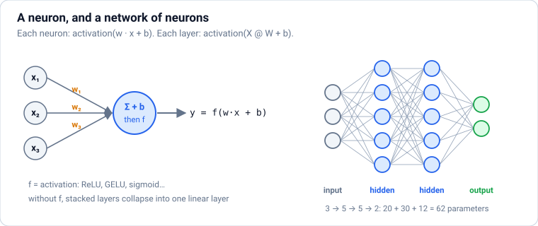
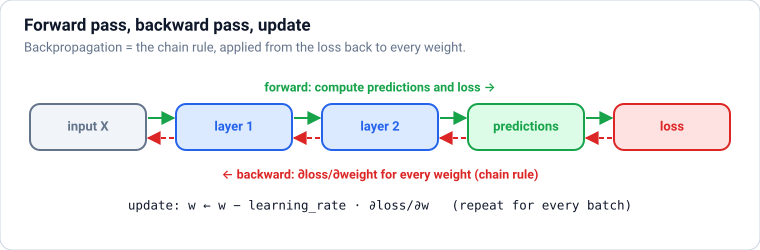
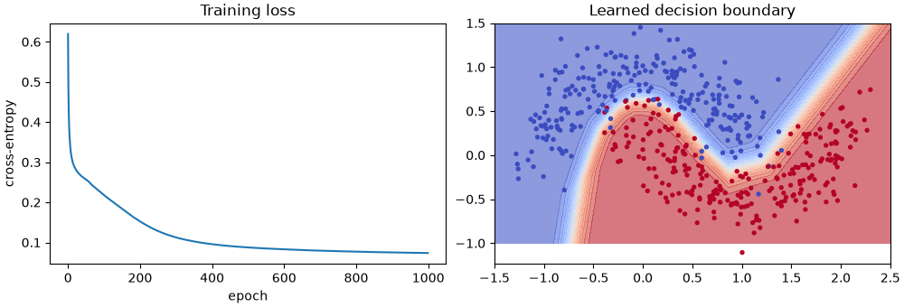
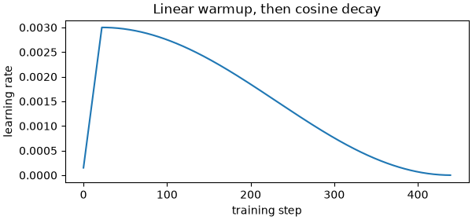
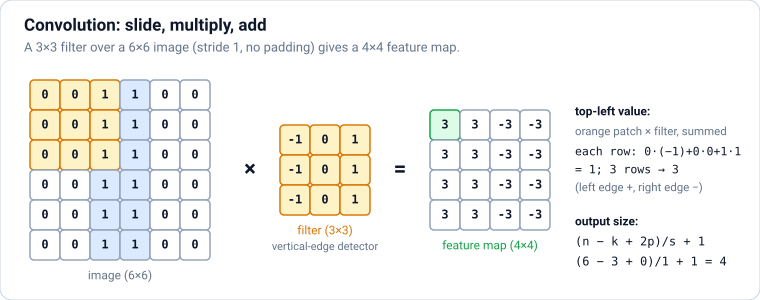
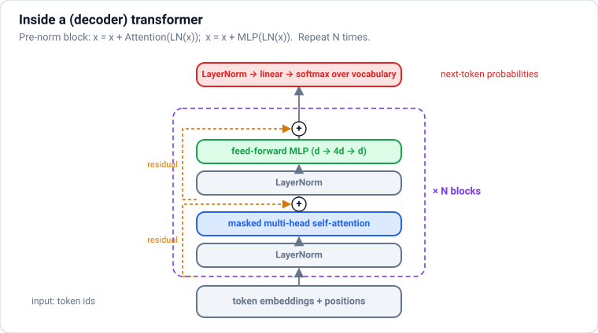
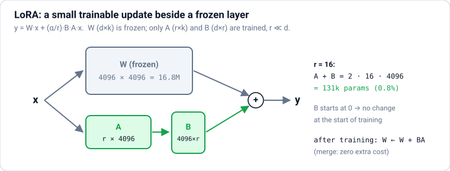
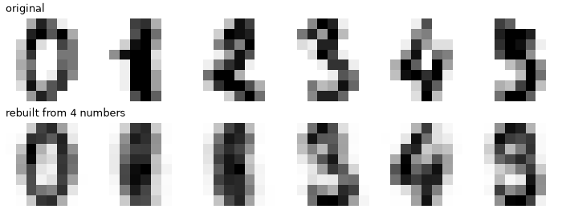
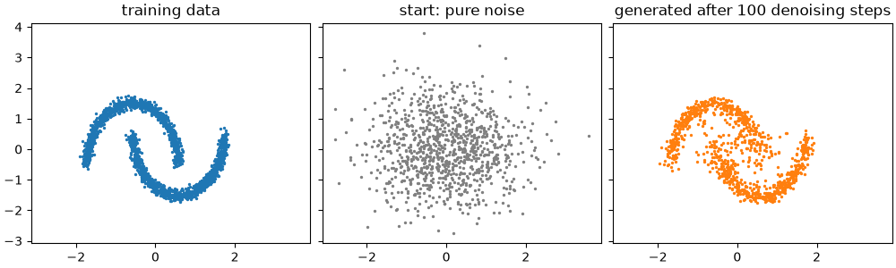

# Deep Learning with PyTorch: From Neurons to Transformers, LLMs and LoRA

Deep learning explained from zero, in **levels**: **Basic** (neurons, backpropagation from scratch, tensors and autograd) → **Easy** (training in PyTorch, recipes, data pipelines) → **Moderate** (CNNs, RNNs, attention and transformers, a tiny GPT built from scratch, Hugging Face, fine-tuning, LoRA/QLoRA, diffusion) → **Advanced** (mixed precision, distributed training, quantisation, distillation, mixture of experts, scaling laws) → **Interview Prep**. **Each part uses only what earlier parts taught.**

Every section has the same shape: a **picture** where it helps, **theory** in plain words, **Python** you can run, and **practice** with hidden answers and links. Every example was run with PyTorch 2.14 on a CPU (plus Transformers 5.17 and PEFT 0.21), sized to finish in seconds: results under **Output** are real, and every chart was produced by the code next to it. Hugging Face examples build small models locally, so they run offline; the same code works with `from_pretrained` on real models.

Each part ends with a ✅ **checkpoint**. Before this file, read `machine-learning.md`; after it, continue with `llm-engineering.md` and `rag-and-agents.md`.

## Table of Contents

**[Part 1 — Basic: How Neural Networks Work](#part-1--basic-how-neural-networks-work)**

1. [How to Use These Notes (and What Deep Learning Is For)](#1-how-to-use-these-notes-and-what-deep-learning-is-for)
2. [Neurons, Layers and Activation Functions](#2-neurons-layers-and-activation-functions)
3. [How Networks Learn: Backpropagation from Scratch](#3-how-networks-learn-backpropagation-from-scratch)
4. [PyTorch Basics: Tensors, Devices and Autograd](#4-pytorch-basics-tensors-devices-and-autograd)

**[Part 2 — Easy: Training Networks in PyTorch](#part-2--easy-training-networks-in-pytorch)**

5. [Your First PyTorch Model: Modules, DataLoaders and the Training Loop](#5-your-first-pytorch-model-modules-dataloaders-and-the-training-loop)
6. [Training Recipes: Optimisers, Learning-Rate Schedules, Normalisation and Regularisation](#6-training-recipes-optimisers-learning-rate-schedules-normalisation-and-regularisation)
7. [Real Data Pipelines: Custom Datasets, Augmentation, Padding and Checkpoints](#7-real-data-pipelines-custom-datasets-augmentation-padding-and-checkpoints)

**[Part 3 — Moderate: Architectures: CNNs, RNNs and Transformers](#part-3--moderate-architectures-cnns-rnns-and-transformers)**

8. [Convolutional Neural Networks (CNNs) for Images](#8-convolutional-neural-networks-cnns-for-images)
9. [Embeddings and Sequence Models (RNN, LSTM, GRU)](#9-embeddings-and-sequence-models-rnn-lstm-gru)
10. [Attention and Transformers](#10-attention-and-transformers)
11. [Build a Tiny GPT from Scratch](#11-build-a-tiny-gpt-from-scratch)

**[Part 4 — Moderate: Hugging Face, Fine-Tuning and Generative Models](#part-4--moderate-hugging-face-fine-tuning-and-generative-models)**

12. [Hugging Face: The Hub, Transformers, Tokenizers and Pipelines](#12-hugging-face-the-hub-transformers-tokenizers-and-pipelines)
13. [Transfer Learning and Fine-Tuning with the Trainer API](#13-transfer-learning-and-fine-tuning-with-the-trainer-api)
14. [Parameter-Efficient Fine-Tuning: LoRA and QLoRA](#14-parameter-efficient-fine-tuning-lora-and-qlora)
15. [Generative Models: Autoencoders, GANs and Diffusion](#15-generative-models-autoencoders-gans-and-diffusion)

**[Part 5 — Advanced: Efficiency, Scale and Modern Architectures](#part-5--advanced-efficiency-scale-and-modern-architectures)**

16. [Making Models Fast and Small: Mixed Precision, Distributed Training, Quantisation and Distillation](#16-making-models-fast-and-small-mixed-precision-distributed-training-quantisation-and-distillation)
17. [Modern Architectures and Scaling: Mixture of Experts, State-Space Models and Multimodal Models](#17-modern-architectures-and-scaling-mixture-of-experts-state-space-models-and-multimodal-models)

**[Part 6 — Interview Prep: Revision](#part-6--interview-prep-revision)**

18. [Interview Coding: Deep-Learning Building Blocks](#18-interview-coding-deep-learning-building-blocks)
19. [Deep Learning Cheat Sheet](#19-deep-learning-cheat-sheet)
20. [Most Asked Deep Learning Theory Questions](#20-most-asked-deep-learning-theory-questions)

---

# Part 1 — Basic: How Neural Networks Work

> **Goal:** Understand neurons, layers and activations, build and train a network from scratch with backpropagation in NumPy, and learn PyTorch tensors and autograd.  
> **You need:** Python, NumPy (`data-science.md` Part 1), and `machine-learning.md` Parts 1–2 (loss functions, gradient descent, splits, overfitting).

---

## 1. How to Use These Notes (and What Deep Learning Is For)


### Theory

> **In simple words:** deep learning is machine learning with **neural networks**: many layers of simple units that each do a weighted sum and a small bend. Stacked deep enough and trained on enough data, they learn to recognise faces, transcribe speech, translate languages and write text. Every modern AI model you've heard of (GPT, Claude, Gemini, Llama, Stable Diffusion, Whisper) is a deep neural network.

**How these notes are organised:**

| Part | Level | You learn |
|---|---|---|
| 1 | Basic | Neurons, layers and activations; how networks learn (backpropagation) built from scratch in NumPy; PyTorch tensors and autograd |
| 2 | Easy | Training in PyTorch: models, data loaders, the training loop, and the recipes that make training work (optimisers, schedules, normalisation, regularisation) |
| 3 | Moderate | Architectures: CNNs for images, embeddings and RNNs for sequences, attention and transformers, and a **tiny GPT built from scratch** |
| 4 | Moderate | The modern workflow: Hugging Face, fine-tuning, LoRA/PEFT, and generative models (autoencoders, GANs, diffusion) |
| 5 | Advanced | Making models fast and small (mixed precision, distributed training, quantisation), and modern architectures (mixture of experts, state-space models, multimodal) |
| 6 | Interview Prep | Implement the core pieces, cheat sheet, and the most-asked questions |

**What you need first:** Python, NumPy (`data-science.md` Part 1) and the ML basics in `machine-learning.md` Parts 1–2 (loss functions, gradient descent, train/validation/test splits, overfitting). Every example was run with **PyTorch 2.14 on a CPU**, plus Transformers 5.17 and PEFT 0.21; results under **Output** are real. The examples are sized to run on a laptop in seconds.

**When to use deep learning vs classic ML:**

| Data | Best tool (2026) |
|---|---|
| Tables of business data | Usually gradient-boosted trees (`machine-learning.md`) |
| Images, video | Deep learning (CNNs, vision transformers), usually starting from a pretrained model |
| Text | Pretrained transformers / LLMs, or their embeddings |
| Audio, speech | Deep learning (e.g. Whisper-style models) |
| Very large, complex data (recommendations at scale) | Deep learning, often combined with trees |

**Hardware:** training real models needs a **GPU** (NVIDIA with CUDA, Apple Silicon with MPS, or cloud TPUs). For learning, a CPU is fine for the small examples here; for bigger experiments use free notebook GPUs (Google Colab, Kaggle) or rent cloud GPUs. PyTorch code runs on either with one line: `device = "cuda" if torch.cuda.is_available() else "cpu"`.

**Setup:** `uv pip install torch transformers peft accelerate datasets` (see pytorch.org for the right command for your GPU). **PyTorch** is the dominant framework in research and industry; **JAX** is used at Google and in some research labs; **Keras 3** is a high-level API that runs on either.

### Practice

1. Install PyTorch (or open Colab) and run `import torch; print(torch.__version__, torch.cuda.is_available())`. On Colab, switch the runtime to a GPU and run it again.

---

## 2. Neurons, Layers and Activation Functions



### Theory

> **In simple words:** an artificial **neuron** is logistic regression's little cousin: it takes some numbers, multiplies each by a **weight**, adds a **bias**, and passes the result through an **activation function** (a small bend). A **layer** is many neurons looking at the same inputs. A **network** stacks layers, so each layer builds on what the previous one found: edges → shapes → objects, or letters → words → meaning.

**One neuron:** output = activation(w₁x₁ + w₂x₂ + … + b) = activation(**w · x + b**) (the dot product from `machine-learning.md`).

**One layer** of m neurons on n inputs is a matrix multiplication: `h = activation(x @ W + b)`, with W of shape (n, m). A batch of inputs `X` of shape (batch, n) gives `X @ W + b` of shape (batch, m), all at once. That's why neural networks run so well on GPUs, which are built for matrix multiplication.

**A multi-layer perceptron (MLP)**, the basic "fully connected" network: input → hidden layer(s) → output layer. "Deep" just means many layers.

**Why activations matter:** without them, stacking layers is pointless, since a linear function of a linear function is still linear (one big matrix). The small bend lets networks build **curved**, complicated functions. With enough neurons, a network with even one hidden layer can approximate almost any function (the **universal approximation theorem**); depth makes it far more efficient.

| Activation | Formula | Used |
|---|---|---|
| **ReLU** | max(0, z) | The classic default for hidden layers: simple, fast, works well |
| **GELU** / **SiLU (Swish)** | Smooth versions of ReLU | Transformers and modern networks (GPT, BERT, Llama use GELU or SwiGLU) |
| **Sigmoid** | 1 / (1 + e⁻ᶻ) | Output layer for yes/no probabilities; gates inside LSTMs |
| **Tanh** | (eᶻ − e⁻ᶻ)/(eᶻ + e⁻ᶻ), range −1..1 | RNNs; rarely in hidden layers now |
| **Softmax** | eᶻⁱ / Σ eᶻʲ | Output layer for multi-class probabilities |
| None (identity) | z | Output layer for regression |

**Parameters** = all the weights and biases. A layer from n to m units has n·m + m parameters. GPT-2 small has 124 million; frontier LLMs have hundreds of billions or more.

**The output layer and loss go together:**

| Task | Output layer | Loss |
|---|---|---|
| Regression | 1 unit, no activation | MSE / MAE |
| Binary classification | 1 unit + sigmoid | Binary cross-entropy |
| Multi-class | k units + softmax | Cross-entropy |

### Python

```python
import numpy as np

def relu(z):
    return np.maximum(0, z)

x = np.array([0.5, -1.2, 3.0])              # one input with 3 features
w = np.array([0.8, 0.1, -0.4])
b = 0.2
z = x @ w + b
print("one neuron: z =", round(float(z), 3), " relu(z) =", round(float(relu(z)), 3))

rng = np.random.default_rng(0)
X = rng.normal(size=(4, 3))                 # a batch of 4 inputs
W1, b1 = rng.normal(size=(3, 5)), np.zeros(5)      # layer 1: 3 -> 5 neurons
W2, b2 = rng.normal(size=(5, 2)), np.zeros(2)      # layer 2: 5 -> 2 outputs
hidden = relu(X @ W1 + b1)
logits = hidden @ W2 + b2
probs = np.exp(logits) / np.exp(logits).sum(axis=1, keepdims=True)      # softmax per row
print("shapes:", X.shape, "->", hidden.shape, "->", logits.shape)
print("class probabilities per input:\n", probs.round(3))
print("parameters:", W1.size + b1.size + W2.size + b2.size)
```

**Output:**

```text
one neuron: z = -0.72  relu(z) = 0.0
shapes: (4, 3) -> (4, 5) -> (4, 2)
class probabilities per input:
 [[0.54  0.46 ]
 [0.502 0.498]
 [0.754 0.246]
 [0.246 0.754]]
parameters: 32
```

```python
W_a, W_b = rng.normal(size=(3, 4)), rng.normal(size=(4, 2))
two_linear = (X @ W_a) @ W_b
one_linear = X @ (W_a @ W_b)                 # the same function with a single matrix
print("stacked linear layers collapse into one:", np.allclose(two_linear, one_linear))
print("with ReLU in between they don't:", np.allclose(relu(X @ W_a) @ W_b, one_linear))
```

**Output:**

```text
stacked linear layers collapse into one: True
with ReLU in between they don't: False
```

This is why every hidden layer needs an activation function: it's what makes depth useful.

**Common mistakes:**

- ❌ Forgetting activations between layers (the network collapses to a linear model).
- ❌ Sigmoid or tanh in every hidden layer of a deep network (gradients vanish; see next section). Use ReLU/GELU.
- ❌ Applying softmax **and** a loss that already includes it (PyTorch's `CrossEntropyLoss` expects raw scores, called **logits**).

### Practice

1. How many parameters does an MLP with layer sizes 784 → 256 → 128 → 10 have (a classic network for 28×28 digit images)?

<details>
<summary><b>Answer</b></summary>

```python
sizes = [784, 256, 128, 10]
print(sum(n * m + m for n, m in zip(sizes[:-1], sizes[1:])))
```

**Output:**

```text
235146
```

</details>

**Learn more:** [3Blue1Brown: But what is a neural network? (video)](https://www.youtube.com/watch?v=aircAruvnKk) · [Michael Nielsen, Neural Networks and Deep Learning (free book)](http://neuralnetworksanddeeplearning.com/) · [TensorFlow Playground (interactive)](https://playground.tensorflow.org/)

---

## 3. How Networks Learn: Backpropagation from Scratch



### Theory

> **In simple words:** training a network is gradient descent (`machine-learning.md`): nudge every weight a little in the direction that lowers the loss. The hard part is working out, for millions of weights, **which direction** that is. **Backpropagation** does it efficiently: run the network forward to get the loss, then go **backwards** layer by layer, using the chain rule to pass "blame" for the error back to every weight.

**The training loop (the same for every neural network, including LLMs):**

1. **Forward pass:** compute predictions for a batch and the loss.
2. **Backward pass:** compute the gradient of the loss with respect to every parameter (backpropagation).
3. **Update:** parameters −= learning_rate × gradient (or a smarter optimiser such as Adam).
4. Repeat over many batches; one pass over the whole training set is an **epoch**.

**Backprop = the chain rule, organised.** For a two-layer network `h = relu(X W1 + b1)`, `logits = h W2 + b2`, `loss = cross_entropy(softmax(logits), y)`, the backward pass computes, from the end to the start:

```text
d_logits = (softmax(logits) - one_hot(y)) / batch        # a neat result for softmax + cross-entropy
dW2 = hᵀ @ d_logits          db2 = sum(d_logits)
d_h = d_logits @ W2ᵀ
d_z1 = d_h * (z1 > 0)        # ReLU passes gradient only where it was active
dW1 = Xᵀ @ d_z1              db1 = sum(d_z1)
```

Each step reuses the gradient from the step after it, so the whole backward pass costs about the same as the forward pass. Frameworks like PyTorch do this automatically (**autograd**, next section), but writing it once by hand makes everything else make sense.

**Problems that deep networks run into, and the fixes:**

| Problem | Why | Fixes |
|---|---|---|
| **Vanishing gradients** | Multiplying many small derivatives (e.g. sigmoid's max slope is 0.25) → early layers barely learn | ReLU-family activations, good initialisation, normalisation layers, **residual (skip) connections** |
| **Exploding gradients** | Multiplying many large numbers → huge updates, `nan` losses | Gradient clipping, lower learning rate, normalisation |
| **Bad initialisation** | All-zero weights make every neuron identical; too-large weights explode | Random init scaled to layer size: **He** init for ReLU, **Xavier/Glorot** for tanh (frameworks do this by default) |
| Dead ReLUs | A neuron stuck outputting 0 gets no gradient | Lower learning rate, LeakyReLU/GELU |

**Checking gradients:** compare the backprop gradient with a numerical estimate, (loss(w + ε) − loss(w − ε)) / 2ε. If they match, the backward pass is right. It's a classic interview topic and a lifesaver when writing custom layers.

### Python

```python
import matplotlib.pyplot as plt
import numpy as np
from sklearn.datasets import make_moons

X, y = make_moons(n_samples=500, noise=0.2, random_state=0)
rng = np.random.default_rng(0)
hidden = 16
W1 = rng.normal(0, np.sqrt(2 / 2), (2, hidden)); b1 = np.zeros(hidden)          # He initialisation
W2 = rng.normal(0, np.sqrt(2 / hidden), (hidden, 2)); b2 = np.zeros(2)

def forward(X):
    z1 = X @ W1 + b1
    h = np.maximum(0, z1)
    logits = h @ W2 + b2
    p = np.exp(logits - logits.max(axis=1, keepdims=True))
    return z1, h, p / p.sum(axis=1, keepdims=True)

lr, losses = 0.5, []
for epoch in range(1000):
    z1, h, p = forward(X)                                     # 1. forward
    loss = -np.mean(np.log(p[np.arange(len(y)), y]))
    losses.append(loss)
    d_logits = p.copy()                                       # 2. backward
    d_logits[np.arange(len(y)), y] -= 1
    d_logits /= len(y)
    dW2, db2 = h.T @ d_logits, d_logits.sum(axis=0)
    d_z1 = (d_logits @ W2.T) * (z1 > 0)
    dW1, db1 = X.T @ d_z1, d_z1.sum(axis=0)
    W1 -= lr * dW1; b1 -= lr * db1; W2 -= lr * dW2; b2 -= lr * db2   # 3. update
    if epoch in (0, 100, 999):
        print(f"epoch {epoch:4d}  loss {loss:.4f}  accuracy {np.mean(p.argmax(axis=1) == y):.3f}")
```

**Output:**

```text
epoch    0  loss 0.6194  accuracy 0.712
epoch  100  loss 0.2179  accuracy 0.918
epoch  999  loss 0.0737  accuracy 0.974
```

That's a complete neural network, trained from scratch in about 20 lines of NumPy: it learned the curved boundary between the two moons, which no straight-line model can.

```python
xx, yy = np.meshgrid(np.linspace(-1.5, 2.5, 200), np.linspace(-1, 1.5, 200))
grid_p = forward(np.column_stack([xx.ravel(), yy.ravel()]))[2][:, 1].reshape(xx.shape)
fig, axes = plt.subplots(1, 2, figsize=(10, 3.4), layout="constrained")
axes[0].plot(losses)
axes[0].set(title="Training loss", xlabel="epoch", ylabel="cross-entropy")
axes[1].contourf(xx, yy, grid_p, levels=20, cmap="coolwarm", alpha=0.6)
axes[1].scatter(X[:, 0], X[:, 1], c=y, cmap="coolwarm", s=8)
axes[1].set_title("Learned decision boundary")
fig.savefig("numpy-mlp.png", dpi=100)
plt.close(fig)

# Gradient check: compare one backprop gradient with a numerical estimate
def loss_at(W1_test):
    z = np.maximum(0, X @ W1_test + b1) @ W2 + b2
    q = np.exp(z - z.max(axis=1, keepdims=True)); q /= q.sum(axis=1, keepdims=True)
    return -np.mean(np.log(q[np.arange(len(y)), y]))

z1, h, p = forward(X)
d = p.copy(); d[np.arange(len(y)), y] -= 1; d /= len(y)
analytic = (X.T @ ((d @ W2.T) * (z1 > 0)))[0, 3]
eps = 1e-5
W_plus, W_minus = W1.copy(), W1.copy()
W_plus[0, 3] += eps; W_minus[0, 3] -= eps
numeric = (loss_at(W_plus) - loss_at(W_minus)) / (2 * eps)
print(f"backprop gradient {analytic:.8f}   numerical {numeric:.8f}")
```

**Output:**

```text
backprop gradient 0.00028639   numerical 0.00028639
```



**Common mistakes:**

- ❌ Initialising all weights to zero (every neuron learns the same thing).
- ❌ Learning rates that are too high (loss becomes `nan`).
- ❌ Forgetting to divide the gradient by the batch size (the effective learning rate then depends on batch size).

### Practice

1. Retrain the network with `hidden = 2`. What happens to the final accuracy, and why?

<details>
<summary><b>Answer</b></summary>

```python
def train(hidden, epochs=1000, lr=0.5, seed=0):
    r = np.random.default_rng(seed)
    A = r.normal(0, 1, (2, hidden)); a = np.zeros(hidden)
    B = r.normal(0, np.sqrt(2 / hidden), (hidden, 2)); c = np.zeros(2)
    for _ in range(epochs):
        z = X @ A + a; hh = np.maximum(0, z); lg = hh @ B + c
        q = np.exp(lg - lg.max(axis=1, keepdims=True)); q /= q.sum(axis=1, keepdims=True)
        g = q.copy(); g[np.arange(len(y)), y] -= 1; g /= len(y)
        gz = (g @ B.T) * (z > 0)
        A -= lr * X.T @ gz; a -= lr * gz.sum(0); B -= lr * hh.T @ g; c -= lr * g.sum(0)
    return np.mean(q.argmax(axis=1) == y)

print("2 hidden units:", round(train(2), 3), "  16 hidden units:", round(train(16), 3))
```

**Output:**

```text
2 hidden units: 0.866   16 hidden units: 0.974
```

With only 2 hidden units the network can bend its boundary only a little (it underfits), so accuracy is lower. More units = more capacity.

</details>

**Learn more:** [3Blue1Brown: backpropagation (video)](https://www.youtube.com/watch?v=Ilg3gGewQ5U) · [Andrej Karpathy: micrograd, building backprop from scratch (video)](https://www.youtube.com/watch?v=VMj-3S1tku0) · [CS231n: backpropagation notes](https://cs231n.github.io/optimization-2/)

---

## 4. PyTorch Basics: Tensors, Devices and Autograd

### Theory

> **In simple words:** PyTorch is NumPy with two superpowers: it runs on **GPUs**, and it computes **gradients automatically**. Its arrays are called **tensors**. You write the forward computation; PyTorch records it and, when you call `.backward()`, works out every gradient for you (the backprop you wrote by hand in the previous section).

**Tensors** behave like NumPy arrays: `torch.tensor([[1., 2.], [3., 4.]])`, `torch.zeros(2, 3)`, `torch.randn(4, 5)`, `torch.arange(10)`; the same indexing, broadcasting, `@` for matrix multiplication, `.sum(dim=0)` (PyTorch says `dim` where NumPy says `axis`), `.reshape`, `.T`.

| Attribute | Meaning |
|---|---|
| `t.shape` | Size of each dimension |
| `t.dtype` | `torch.float32` (the default for training), `float16` / `bfloat16` (half precision), `int64` (labels, token ids) |
| `t.device` | `cpu`, `cuda` (NVIDIA GPU), `mps` (Apple GPU) |
| `t.requires_grad` | Whether PyTorch tracks operations on it for gradients |

**Devices:** move tensors (and models) with `.to(device)`. Every tensor in one operation must be on the **same** device. Moving data between CPU and GPU is slow, so do it once per batch.

**Converting:** `torch.from_numpy(a)` and `t.numpy()` share memory (for CPU tensors); `t.item()` turns a one-element tensor into a Python number; `t.detach()` returns a tensor without gradient tracking.

**Autograd:**

1. Create parameters with `requires_grad=True` (model layers do this for you).
2. Compute a scalar loss from them.
3. `loss.backward()` fills `.grad` on every parameter with ∂loss/∂parameter.
4. Update parameters inside `with torch.no_grad():` (so the update itself isn't tracked), then **zero the gradients**, because `.grad` **accumulates** by default.

Use `with torch.no_grad():` (or `torch.inference_mode()`) whenever you're not training, e.g. evaluation and prediction: it's faster and uses less memory.

### Python

```python
import numpy as np
import torch

torch.manual_seed(0)
a = torch.tensor([[1.0, 2.0], [3.0, 4.0]])
b = torch.ones(2, 2)
print(a @ b)
print(a.sum(dim=0), a.mean(), a.shape, a.dtype)
print(torch.from_numpy(np.arange(3)).dtype, a.numpy().tolist())

device = "cuda" if torch.cuda.is_available() else "mps" if torch.backends.mps.is_available() else "cpu"
x = torch.randn(3, 4, device=device)
print("running on:", x.device.type)          # "cuda" or "mps" on a machine with a GPU
```

**Output:**

```text
tensor([[3., 3.],
        [7., 7.]])
tensor([4., 6.]) tensor(2.5000) torch.Size([2, 2]) torch.float32
torch.int64 [[1.0, 2.0], [3.0, 4.0]]
running on: cpu
```

```python
w = torch.tensor(3.0, requires_grad=True)
loss = (w - 5) ** 2 + 1                  # minimum at w = 5
loss.backward()
print("d(loss)/dw at w=3:", w.grad.item(), "(by hand: 2·(3−5) = −4)")

# Linear regression with autograd: no hand-written gradients
X = torch.rand(100, 1) * 10
y = 2.5 * X + 4 + torch.randn(100, 1)
w = torch.zeros(1, requires_grad=True)
b = torch.zeros(1, requires_grad=True)
for step in range(2000):
    loss = ((X * w + b - y) ** 2).mean()
    loss.backward()                       # fills w.grad and b.grad
    with torch.no_grad():
        w -= 0.01 * w.grad
        b -= 0.01 * b.grad
    w.grad.zero_(); b.grad.zero_()        # gradients accumulate unless cleared
print(f"learned w={w.item():.2f}, b={b.item():.2f}, loss={loss.item():.3f}")
```

**Output:**

```text
d(loss)/dw at w=3: -4.0 (by hand: 2·(3−5) = −4)
learned w=2.50, b=3.90, loss=0.899
```

Compare with the NumPy version in `machine-learning.md`: the model and loss are the same, but `loss.backward()` replaced the hand-derived gradient formulas.

**Common mistakes:**

- ❌ Forgetting to zero gradients: each `backward()` adds to `.grad`, so updates grow wrongly.
- ❌ "Expected all tensors to be on the same device": move the model **and** the data with `.to(device)`.
- ❌ Calling `.numpy()` on a tensor that requires grad or lives on the GPU: use `t.detach().cpu().numpy()`.
- ❌ Running evaluation without `torch.no_grad()` (wastes memory building a graph you never use).
- ❌ Mixing `float64` NumPy data with `float32` models (`from_numpy` keeps float64): convert with `.float()`.

### Practice

1. Use autograd to find the slope of f(x) = x³ − 2x at x = 2, and check it against the derivative 3x² − 2.

<details>
<summary><b>Answer</b></summary>

```python
x = torch.tensor(2.0, requires_grad=True)
f = x ** 3 - 2 * x
f.backward()
print(x.grad.item(), 3 * 2 ** 2 - 2)
```

**Output:**

```text
10.0 10
```

</details>

---

### ✅ Part 1 checkpoint

Without looking, can you:

- [ ] Write a neuron and a layer as `activation(x @ W + b)` and count a network's parameters?
- [ ] Explain why hidden layers need activations, and pick an output layer and loss for each task?
- [ ] Describe the forward pass, backward pass and update, and why vanishing gradients happen?
- [ ] Create tensors, move them between devices, and use `requires_grad`, `backward()`, `no_grad()` and `zero_()`?

**Learn more:** [PyTorch: tensors tutorial](https://docs.pytorch.org/tutorials/beginner/basics/tensorqs_tutorial.html) · [PyTorch: autograd tutorial](https://docs.pytorch.org/tutorials/beginner/basics/autogradqs_tutorial.html)

---

# Part 2 — Easy: Training Networks in PyTorch

> **Goal:** Write models, data loaders and the training loop; use the recipes that make training work; handle real data pipelines and checkpoints.  
> **You need:** Part 1.

---

## 5. Your First PyTorch Model: Modules, DataLoaders and the Training Loop

### Theory

> **In simple words:** a real PyTorch project has four pieces: a **model** (a class that says how inputs flow through layers), **data** served in shuffled mini-batches by a **DataLoader**, a **loss function**, and an **optimiser** that updates the weights. The **training loop** ties them together: for each batch, predict → measure the loss → backpropagate → update.

**The model: `nn.Module`.** Define the layers in `__init__`, and the computation in `forward`:

```text
class Net(nn.Module):
    def __init__(self):
        super().__init__()
        self.layers = nn.Sequential(nn.Linear(64, 128), nn.ReLU(), nn.Linear(128, 10))
    def forward(self, x):
        return self.layers(x)          # raw scores ("logits"), one per class
```

`nn.Linear(n, m)` is a layer with an (n → m) weight matrix and bias; `model.parameters()` lists every weight for the optimiser.

**Data:** a `Dataset` returns one `(input, label)` pair by index (`TensorDataset` wraps tensors you already have; write your own class to load files lazily); a `DataLoader` batches, shuffles and loads in parallel: `DataLoader(train_ds, batch_size=64, shuffle=True)`.

**The standard training loop:**

```text
for epoch in range(epochs):
    model.train()                              # enables dropout etc.
    for xb, yb in train_loader:
        xb, yb = xb.to(device), yb.to(device)
        logits = model(xb)                     # 1. forward
        loss = loss_fn(logits, yb)
        optimizer.zero_grad()                  # 2. clear old gradients
        loss.backward()                        # 3. backward
        optimizer.step()                       # 4. update
    model.eval()                               # disables dropout, freezes batch-norm statistics
    with torch.no_grad():
        ... compute validation loss / accuracy ...
```

**Loss functions:** `nn.CrossEntropyLoss()` for classification (takes **logits** and integer class labels; it applies softmax internally), `nn.BCEWithLogitsLoss()` for yes/no and multi-label, `nn.MSELoss()` / `nn.L1Loss()` for regression.

**Saving:** save the **weights** with `torch.save(model.state_dict(), "model.pt")`, and load them into a freshly created model with `model.load_state_dict(torch.load("model.pt"))`. Also keep the config (layer sizes) and preprocessing (e.g. the scaling used) alongside.

**Higher-level wrappers** (PyTorch Lightning, Hugging Face `Trainer`/Accelerate, Keras) write this loop for you, adding logging, checkpointing and multi-GPU support. Learn the plain loop first; then the wrappers make sense.

### Python

```python
import numpy as np
import torch
from sklearn.datasets import load_digits
from sklearn.model_selection import train_test_split
from torch import nn
from torch.utils.data import DataLoader, TensorDataset

torch.manual_seed(0)
digits = load_digits()                                        # 1,797 8×8 images of the digits 0–9
X = torch.tensor(digits.data / 16.0, dtype=torch.float32)     # pixel values 0..16 → 0..1
y = torch.tensor(digits.target, dtype=torch.long)
X_train, X_val, y_train, y_val = train_test_split(X, y, test_size=0.25, stratify=y, random_state=0)
train_loader = DataLoader(TensorDataset(X_train, y_train), batch_size=64, shuffle=True,
                          generator=torch.Generator().manual_seed(0))
val_loader = DataLoader(TensorDataset(X_val, y_val), batch_size=256)

class DigitNet(nn.Module):
    def __init__(self, hidden=128):
        super().__init__()
        self.layers = nn.Sequential(nn.Linear(64, hidden), nn.ReLU(), nn.Linear(hidden, 10))

    def forward(self, x):
        return self.layers(x)

model = DigitNet()
loss_fn = nn.CrossEntropyLoss()
optimizer = torch.optim.AdamW(model.parameters(), lr=1e-3)
print(model)
print("parameters:", sum(p.numel() for p in model.parameters()))
```

**Output:**

```text
DigitNet(
  (layers): Sequential(
    (0): Linear(in_features=64, out_features=128, bias=True)
    (1): ReLU()
    (2): Linear(in_features=128, out_features=10, bias=True)
  )
)
parameters: 9610
```

```python
def evaluate(model, loader):
    model.eval()
    correct, total, loss_sum = 0, 0, 0.0
    with torch.no_grad():
        for xb, yb in loader:
            logits = model(xb)
            loss_sum += loss_fn(logits, yb).item() * len(yb)
            correct += (logits.argmax(dim=1) == yb).sum().item()
            total += len(yb)
    return loss_sum / total, correct / total

for epoch in range(1, 16):
    model.train()
    for xb, yb in train_loader:
        loss = loss_fn(model(xb), yb)
        optimizer.zero_grad()
        loss.backward()
        optimizer.step()
    if epoch in (1, 5, 10, 15):
        val_loss, val_acc = evaluate(model, val_loader)
        print(f"epoch {epoch:2d}  train loss {loss.item():.3f}  val loss {val_loss:.3f}  val accuracy {val_acc:.3f}")
```

**Output:**

```text
epoch  1  train loss 1.997  val loss 2.029  val accuracy 0.687
epoch  5  train loss 0.899  val loss 0.757  val accuracy 0.893
epoch 10  train loss 0.388  val loss 0.362  val accuracy 0.922
epoch 15  train loss 0.252  val loss 0.246  val accuracy 0.938
```

```python
import os, tempfile

path = os.path.join(tempfile.mkdtemp(), "digits.pt")
torch.save(model.state_dict(), path)
restored = DigitNet()
restored.load_state_dict(torch.load(path))
restored.eval()
with torch.no_grad():
    probs = torch.softmax(restored(X_val[:3]), dim=1)
print("predicted:", probs.argmax(dim=1).tolist(), " true:", y_val[:3].tolist())
print("confidence:", [round(v, 3) for v in probs.max(dim=1).values.tolist()])
```

**Output:**

```text
predicted: [2, 0, 4]  true: [2, 0, 4]
confidence: [0.507, 0.961, 0.99]
```

**Common mistakes:**

- ❌ Forgetting `model.eval()` for validation (dropout and batch norm behave differently in training mode).
- ❌ Applying softmax before `nn.CrossEntropyLoss` (it already does it; double softmax trains badly).
- ❌ Labels as floats or one-hot vectors for `CrossEntropyLoss` (it wants integer class indices, `torch.long`).
- ❌ Not shuffling the training loader (or shuffling the validation one, which is harmless but pointless).
- ❌ Saving the whole model object with `torch.save(model)` (fragile across code changes). Save the `state_dict`.

### Practice

1. Add a second hidden layer (64 → 128 → 64 → 10) and train for 15 epochs. Does validation accuracy improve on this small dataset?

<details>
<summary><b>Answer</b></summary>

```python
torch.manual_seed(0)
deeper = nn.Sequential(nn.Linear(64, 128), nn.ReLU(), nn.Linear(128, 64), nn.ReLU(), nn.Linear(64, 10))
opt = torch.optim.AdamW(deeper.parameters(), lr=1e-3)
for epoch in range(15):
    deeper.train()
    for xb, yb in train_loader:
        loss = loss_fn(deeper(xb), yb)
        opt.zero_grad(); loss.backward(); opt.step()
print("deeper net val accuracy:", round(evaluate(deeper, val_loader)[1], 3))
```

**Output:**

```text
deeper net val accuracy: 0.953
```

A little better here (0.95 vs 0.94). On a dataset this small, a point or two can come from the random seed alone, so compare over a few seeds before concluding. Depth pays off most on harder problems and bigger data.

</details>

**Learn more:** [PyTorch: learn the basics (tutorial series)](https://docs.pytorch.org/tutorials/beginner/basics/intro.html) · [PyTorch: building models with nn.Module](https://docs.pytorch.org/tutorials/beginner/basics/buildmodel_tutorial.html)

---

## 6. Training Recipes: Optimisers, Learning-Rate Schedules, Normalisation and Regularisation

### Theory

> **In simple words:** the same network can train beautifully or fail completely depending on a handful of choices: the **optimiser**, the **learning rate** (and how it changes over time), **normalisation** layers, and **regularisation**. The good news is that a small set of proven defaults works for most problems.

**Optimisers:**

| Optimiser | Idea | Use |
|---|---|---|
| **SGD** | Step against the gradient | Simple; with momentum still strong for CNNs on images |
| **SGD + momentum** | Keep a running "velocity" so steps build up in consistent directions and damp zig-zags | Classic image training |
| **Adam** | Momentum + a separate, adaptive step size for each parameter | Fast and forgiving |
| **AdamW** | Adam with weight decay applied correctly | **The default** for transformers, LLMs and most new work |

Newer optimisers (e.g. Lion, Muon, Shampoo-style methods) show gains in some large-scale training, but AdamW remains the safe default.

**The learning rate is the most important hyperparameter.** Typical starting points: AdamW 1e-3 for small networks, 1e-4 to 3e-4 for transformers, 1e-5 to 5e-5 for fine-tuning pretrained models. **Schedules** change it during training:

- **Warmup:** start tiny and increase over the first steps (stabilises early training, standard for transformers).
- **Cosine decay** (or linear decay) down to a small value by the end: finer steps once near a good solution.
- **Reduce on plateau:** lower it when the validation loss stops improving.

**Batch size:** larger batches give smoother gradients and use hardware better but need a larger learning rate and can generalise slightly worse; common sizes are 32–512 (much larger for LLM pre-training, via gradient accumulation).

**Normalisation layers** keep activations in a healthy range, which makes deep networks train faster and more reliably:

- **BatchNorm:** normalises each feature across the batch; standard in CNNs. Behaves differently in `train()` and `eval()` modes.
- **LayerNorm:** normalises across the features of each example; standard in transformers (independent of batch size). **RMSNorm** is a simpler variant used in Llama-style LLMs.

**Regularisation (fighting overfitting):**

- **Weight decay** (L2-like shrinkage; AdamW's `weight_decay=0.01`–`0.1`).
- **Dropout:** randomly zero a fraction (e.g. 10–50%) of activations during training, so the network can't rely on any single unit. Automatically off in `eval()` mode.
- **Early stopping:** keep the checkpoint with the best validation score.
- **Data augmentation:** random crops, flips, colour changes (images), noise, masking; effectively more data.
- **Label smoothing:** train towards 0.9/0.1 instead of 1/0 targets, reducing over-confidence.

**Stability:** **gradient clipping** (`torch.nn.utils.clip_grad_norm_(model.parameters(), 1.0)`) prevents occasional huge updates; standard for transformers.

**A debugging routine that saves days:**

1. Check the **initial loss**: for k balanced classes it should be about ln(k) (e.g. 2.30 for 10 classes). Much higher means a bug in initialisation or the loss.
2. **Overfit one small batch**: the loss should go to nearly 0. If it can't, there's a bug (wrong labels, a missing `zero_grad`, a detached tensor).
3. Then train properly, watching training **and** validation curves; tune the learning rate first.

### Python

```python
import matplotlib.pyplot as plt
import numpy as np
import torch
from sklearn.datasets import load_digits
from sklearn.model_selection import train_test_split
from torch import nn
from torch.utils.data import DataLoader, TensorDataset

digits = load_digits()
X = torch.tensor(digits.data / 16.0, dtype=torch.float32)
y = torch.tensor(digits.target)
X_train, X_val, y_train, y_val = train_test_split(X, y, test_size=0.25, stratify=y, random_state=0)
loss_fn = nn.CrossEntropyLoss()

def make_model(dropout=0.0, seed=0):
    torch.manual_seed(seed)
    return nn.Sequential(nn.Linear(64, 256), nn.ReLU(), nn.Dropout(dropout), nn.Linear(256, 10))

model = make_model()
with torch.no_grad():
    print(f"initial loss {loss_fn(model(X_train), y_train).item():.3f}  (expected about ln(10) = {np.log(10):.3f})")

xb, yb = X_train[:32], y_train[:32]                       # overfit a single batch as a sanity check
opt = torch.optim.AdamW(model.parameters(), lr=1e-2)
for step in range(100):
    loss = loss_fn(model(xb), yb)
    opt.zero_grad(); loss.backward(); opt.step()
print(f"loss on one batch after 100 steps: {loss.item():.4f}  (near 0 means the pipeline can learn)")
```

**Output:**

```text
initial loss 2.335  (expected about ln(10) = 2.303)
loss on one batch after 100 steps: 0.0001  (near 0 means the pipeline can learn)
```

```python
def train(model, opt, epochs=20, scheduler=None, seed=0):
    loader = DataLoader(TensorDataset(X_train, y_train), batch_size=64, shuffle=True,
                        generator=torch.Generator().manual_seed(seed))
    for _ in range(epochs):
        model.train()
        for xb, yb in loader:
            loss = loss_fn(model(xb), yb)
            opt.zero_grad(); loss.backward()
            torch.nn.utils.clip_grad_norm_(model.parameters(), 1.0)
            opt.step()
            if scheduler:
                scheduler.step()
    model.eval()
    with torch.no_grad():
        return (model(X_val).argmax(1) == y_val).float().mean().item()

for name, make_opt in [("SGD lr=0.01", lambda p: torch.optim.SGD(p, lr=0.01)),
                       ("SGD + momentum", lambda p: torch.optim.SGD(p, lr=0.01, momentum=0.9)),
                       ("AdamW lr=1e-3", lambda p: torch.optim.AdamW(p, lr=1e-3, weight_decay=0.01))]:
    m = make_model()
    print(f"{name:16s} val accuracy after 20 epochs: {train(m, make_opt(m.parameters())):.3f}")
```

**Output:**

```text
SGD lr=0.01      val accuracy after 20 epochs: 0.869
SGD + momentum   val accuracy after 20 epochs: 0.953
AdamW lr=1e-3    val accuracy after 20 epochs: 0.967
```

Plain SGD with a small learning rate is still far from done after 20 epochs; momentum and AdamW get there much faster. That speed difference grows with model size.

```python
steps_per_epoch = int(np.ceil(len(X_train) / 64))
total = 20 * steps_per_epoch
m = make_model(dropout=0.2)
opt = torch.optim.AdamW(m.parameters(), lr=3e-3, weight_decay=0.05)
warmup = torch.optim.lr_scheduler.LinearLR(opt, start_factor=0.05, total_iters=steps_per_epoch)
cosine = torch.optim.lr_scheduler.CosineAnnealingLR(opt, T_max=total - steps_per_epoch)
sched = torch.optim.lr_scheduler.SequentialLR(opt, [warmup, cosine], milestones=[steps_per_epoch])
print(f"AdamW + dropout + warmup/cosine: val accuracy {train(m, opt, scheduler=sched):.3f}")

lrs, probe = [], torch.optim.AdamW([torch.zeros(1, requires_grad=True)], lr=3e-3)
w_ = torch.optim.lr_scheduler.LinearLR(probe, start_factor=0.05, total_iters=steps_per_epoch)
c_ = torch.optim.lr_scheduler.CosineAnnealingLR(probe, T_max=total - steps_per_epoch)
s_ = torch.optim.lr_scheduler.SequentialLR(probe, [w_, c_], milestones=[steps_per_epoch])
for _ in range(total):
    lrs.append(probe.param_groups[0]["lr"]); probe.step(); s_.step()
fig, ax = plt.subplots(figsize=(6, 2.8), layout="constrained")
ax.plot(lrs)
ax.set(title="Linear warmup, then cosine decay", xlabel="training step", ylabel="learning rate")
fig.savefig("lr-schedule.png", dpi=100)
plt.close(fig)
```

**Output:**

```text
AdamW + dropout + warmup/cosine: val accuracy 0.971
```



**Common mistakes:**

- ❌ Tuning everything except the learning rate. Tune it first (try 3× steps: 1e-4, 3e-4, 1e-3, 3e-3).
- ❌ Skipping the one-batch overfit test, then debugging a "bad model" that's really a bug.
- ❌ Adam with plain L2 in the loss instead of AdamW's decoupled weight decay.
- ❌ Forgetting `model.eval()`, so dropout stays on during evaluation.
- ❌ Calling `scheduler.step()` per epoch when it was configured per step (or the other way round).

### Practice

1. Train `make_model(dropout=0.5)` with AdamW (lr 1e-3) for 20 epochs and compare its validation accuracy with `dropout=0.0`. Does heavy dropout help here?

<details>
<summary><b>Answer</b></summary>

```python
for p in (0.0, 0.5):
    m = make_model(dropout=p)
    acc = train(m, torch.optim.AdamW(m.parameters(), lr=1e-3, weight_decay=0.01))
    print(f"dropout {p}: val accuracy {acc:.3f}")
```

**Output:**

```text
dropout 0.0: val accuracy 0.967
dropout 0.5: val accuracy 0.956
```

Here heavy dropout is slightly worse (0.956 vs 0.967). Dropout matters most when a model is large compared with its data and clearly overfits. On a small, clean problem trained briefly, it may help a little, not at all, or slightly slow learning. Always check the validation curve rather than assuming.

</details>

**Learn more:** [Andrej Karpathy: a recipe for training neural networks](https://karpathy.github.io/2019/04/25/recipe/) · [Google: deep learning tuning playbook](https://github.com/google-research/tuning_playbook) · [PyTorch: optimizers and schedulers](https://docs.pytorch.org/docs/stable/optim.html)

---

## 7. Real Data Pipelines: Custom Datasets, Augmentation, Padding and Checkpoints

### Theory

> **In simple words:** real training data doesn't fit neatly in one tensor: it's thousands of image files, text of different lengths, or rows in a database. A custom **Dataset** loads one example at a time, **transforms** clean and augment it, a **collate function** packs examples of different sizes into a batch, and **checkpoints** let a long training run resume after a crash.

**A custom Dataset** needs two methods:

```text
class ImageFolderDataset(Dataset):
    def __init__(self, paths, labels, transform=None): ...   # store file paths, not the images
    def __len__(self): return len(self.paths)
    def __getitem__(self, i):                                 # load ONE example when asked
        image = read_image(self.paths[i])
        return self.transform(image) if self.transform else image, self.labels[i]
```

Loading lazily in `__getitem__` means a dataset can be far bigger than memory. `DataLoader(ds, batch_size=64, shuffle=True, num_workers=4, pin_memory=True)` loads batches in parallel background processes (`num_workers`) and speeds up CPU→GPU copies (`pin_memory`). For very large or streaming data, use formats built for it: WebDataset shards, Hugging Face `datasets` (memory-mapped Arrow), Parquet, or Mosaic streaming.

**Transforms and augmentation** (images, with `torchvision.transforms.v2`): **preprocessing** (resize, convert to tensor, normalise with the mean/std the model expects) runs on every split; **augmentation** (random crop, flip, rotation, colour jitter, RandAugment, MixUp/CutMix) runs **only on training data**, creating new variations of each example every epoch. Text augmentation is harder (back-translation, synonym replacement, LLM paraphrases); audio uses noise, time-shift and masking.

**Batches of different lengths** (sentences, audio, time series): a **collate function** pads each sequence to the length of the longest in the batch and returns a **mask** marking the real positions, so the model and loss can ignore padding. Sorting or bucketing examples by length reduces wasted padding.

**Checkpoints:** save everything needed to resume, not just the weights:

```text
torch.save({"epoch": epoch, "model": model.state_dict(), "optimizer": optimizer.state_dict(),
            "scheduler": scheduler.state_dict(), "best_val": best_val}, "checkpoint.pt")
```

Keep the **best** checkpoint (by validation score) and the **latest** one. Cloud GPUs can be pre-empted, so save regularly.

**Reproducibility:** set seeds (`torch.manual_seed`, `numpy`, `random`), pass a seeded `generator` to shuffling DataLoaders, and record library versions. Exact bit-for-bit results on GPUs also need `torch.use_deterministic_algorithms(True)`, at some cost in speed.

### Python

```python
import torch
from torch.nn.utils.rnn import pad_sequence
from torch.utils.data import DataLoader, Dataset

class ReviewDataset(Dataset):
    """Tiny text dataset: each review becomes a sequence of word ids (lengths differ)."""
    def __init__(self, texts, labels, vocab):
        self.texts, self.labels, self.vocab = texts, labels, vocab
    def __len__(self):
        return len(self.texts)
    def __getitem__(self, i):
        ids = [self.vocab.get(w, 1) for w in self.texts[i].lower().split()]    # 1 = unknown word
        return torch.tensor(ids), torch.tensor(self.labels[i])

def collate(batch):
    seqs, labels = zip(*batch)
    lengths = torch.tensor([len(s) for s in seqs])
    padded = pad_sequence(seqs, batch_first=True, padding_value=0)             # 0 = padding
    mask = padded != 0
    return padded, mask, lengths, torch.stack(labels)

texts = ["great phone", "battery died in two days", "love it", "screen cracked and support never replied"]
labels = [1, 0, 1, 0]
vocab = {w: i + 2 for i, w in enumerate(sorted({w for t in texts for w in t.lower().split()}))}
ds = ReviewDataset(texts, labels, vocab)
print(len(ds), ds[0])

loader = DataLoader(ds, batch_size=2, shuffle=False, collate_fn=collate)
padded, mask, lengths, y = next(iter(loader))
print(padded)
print(mask.int())
print("lengths:", lengths.tolist(), " labels:", y.tolist())
```

**Output:**

```text
4 (tensor([ 7, 12]), tensor(1))
tensor([[ 7, 12,  0,  0,  0],
        [ 3,  6,  8, 16,  5]])
tensor([[1, 1, 0, 0, 0],
        [1, 1, 1, 1, 1]], dtype=torch.int32)
lengths: [2, 5]  labels: [1, 0]
```

```python
from torchvision.transforms import v2

torch.manual_seed(0)
image = torch.arange(1, 17, dtype=torch.float32).reshape(1, 4, 4)       # a tiny 1-channel "image"
train_tf = v2.Compose([v2.RandomHorizontalFlip(p=1.0), v2.Normalize(mean=[8.5], std=[4.6])])
eval_tf = v2.Normalize(mean=[8.5], std=[4.6])
print("original row 0:", image[0, 0].tolist())
print("train (flipped + normalised) row 0:", [round(v, 2) for v in train_tf(image)[0, 0].tolist()])
print("eval (normalised only) row 0:", [round(v, 2) for v in eval_tf(image)[0, 0].tolist()])
```

**Output:**

```text
original row 0: [1.0, 2.0, 3.0, 4.0]
train (flipped + normalised) row 0: [-0.98, -1.2, -1.41, -1.63]
eval (normalised only) row 0: [-1.63, -1.41, -1.2, -0.98]
```

```python
import os, tempfile
from torch import nn

model = nn.Linear(4, 2)
opt = torch.optim.AdamW(model.parameters(), lr=1e-3)
path = os.path.join(tempfile.mkdtemp(), "checkpoint.pt")
torch.save({"epoch": 7, "model": model.state_dict(), "optimizer": opt.state_dict(), "best_val": 0.93}, path)

ckpt = torch.load(path)
model2 = nn.Linear(4, 2)
opt2 = torch.optim.AdamW(model2.parameters(), lr=1e-3)
model2.load_state_dict(ckpt["model"]); opt2.load_state_dict(ckpt["optimizer"])
start_epoch = ckpt["epoch"] + 1
print("resuming at epoch", start_epoch, "| best so far", ckpt["best_val"],
      "| weights equal:", torch.equal(model.weight, model2.weight))
```

**Output:**

```text
resuming at epoch 8 | best so far 0.93 | weights equal: True
```

**Common mistakes:**

- ❌ Loading the whole dataset into memory in `__init__` when it's large; load lazily in `__getitem__`.
- ❌ Augmenting validation or test data.
- ❌ Normalising with statistics different from those the pretrained model was trained with.
- ❌ Letting padding affect the loss or the pooled representation (use the mask).
- ❌ Saving only weights, then being unable to resume training with the same optimiser state.

### Practice

1. Change `collate` so each batch is padded to a multiple of 4 (GPUs are often faster with lengths that are multiples of 8 or 64). Check the padded shape for the second batch.

<details>
<summary><b>Answer</b></summary>

```python
def collate_multiple(batch, multiple=4):
    seqs, labels = zip(*batch)
    longest = max(len(s) for s in seqs)
    target = -(-longest // multiple) * multiple                 # round up
    padded = torch.zeros(len(seqs), target, dtype=torch.long)
    for i, s in enumerate(seqs):
        padded[i, :len(s)] = s
    return padded, padded != 0, torch.stack(labels)

batches = list(DataLoader(ds, batch_size=2, collate_fn=collate_multiple))
print(batches[1][0].shape)
```

**Output:**

```text
torch.Size([2, 8])
```

</details>

---

### ✅ Part 2 checkpoint

Without looking, can you:

- [ ] Write an `nn.Module`, a `DataLoader`, and the full training loop with `train()` / `eval()` and `no_grad()`?
- [ ] Choose an optimiser, learning rate and schedule (warmup + cosine), and explain AdamW, dropout, weight decay and normalisation?
- [ ] Run the two sanity checks (initial loss ≈ ln(k); overfit one batch)?
- [ ] Write a custom `Dataset`, apply train-only augmentation, pad variable-length batches with a mask, and save/resume a full checkpoint?

**Learn more:** [PyTorch: datasets and data loaders](https://docs.pytorch.org/tutorials/beginner/basics/data_tutorial.html) · [torchvision: transforms v2](https://docs.pytorch.org/vision/stable/transforms.html) · [PyTorch: saving and loading a general checkpoint](https://docs.pytorch.org/tutorials/recipes/recipes/saving_and_loading_a_general_checkpoint.html)

---

# Part 3 — Moderate: Architectures: CNNs, RNNs and Transformers

> **Goal:** Learn the architectures behind vision and language models, and build a tiny GPT from scratch.  
> **You need:** Parts 1–2.

---

## 8. Convolutional Neural Networks (CNNs) for Images



### Theory

> **In simple words:** an image is a grid of numbers. A **convolution** slides a small **filter** (say 3×3 numbers) across the image, and at each spot computes a weighted sum: a strong result means "the pattern this filter looks for is here". Early filters find edges and colours; later layers combine them into textures, parts and whole objects. A CNN **learns** its filters from data.

**Why not a plain MLP on pixels?** A 224×224 colour image has 150,528 numbers; a fully connected first layer would need hundreds of millions of weights, and it would have to relearn "a cat's ear" separately for every position. Convolutions fix both:

- **Local connections:** each output looks at a small neighbourhood.
- **Weight sharing:** the same filter is used at every position, so a pattern is recognised **anywhere** in the image (translation equivariance) with very few parameters.

**Key terms:**

| Term | Meaning |
|---|---|
| **Kernel / filter** | The small weight grid, e.g. 3×3 |
| **Channels** | Colour images have 3 input channels (RGB). A conv layer with 32 filters outputs 32 channels (**feature maps**) |
| **Stride** | How far the filter moves each step (2 halves the size) |
| **Padding** | Zeros added around the border so the output can keep the same size |
| **Output size** | (input − kernel + 2·padding) / stride + 1 |
| **Pooling** | Downsampling: max-pooling keeps the largest value in each 2×2 block |
| **Receptive field** | How much of the original image one output value "sees"; grows with depth |

**A typical CNN:** [conv → BatchNorm → ReLU] × a few → pool → repeat with more channels → global average pooling → linear classifier. Spatial size shrinks while channels grow (e.g. 224×224×3 → 7×7×512).

**Landmark architectures:** LeNet (1998, digits) → **AlexNet** (2012, GPUs + ReLU, started the deep-learning boom) → VGG (deep stacks of 3×3 convs) → **ResNet** (2015, **residual connections** `x + f(x)` that let gradients flow through 100+ layers; still a standard backbone) → EfficientNet, ConvNeXt → **Vision Transformers (ViT)**, which split images into patches and use attention (Section [10](#10-attention-and-transformers)). Today, strong image models are CNNs, ViTs, or hybrids, usually **pretrained** on huge datasets.

**Transfer learning (what you do in practice):** start from a model pretrained on millions of images, replace the final layer with one for your classes, and fine-tune. With a few hundred labelled images per class you can get excellent results:

```text
from torchvision.models import resnet50, ResNet50_Weights
model = resnet50(weights=ResNet50_Weights.DEFAULT)          # downloads pretrained weights
for p in model.parameters(): p.requires_grad = False        # 1) freeze the backbone
model.fc = nn.Linear(model.fc.in_features, num_classes)     # 2) new head, trained first
# 3) optionally unfreeze later layers and fine-tune with a small learning rate
```

Other vision tasks build on the same backbones: **object detection** (boxes: YOLO, DETR), **segmentation** (per-pixel labels: U-Net, SAM), and image embeddings for search (CLIP).

### Python

```python
import numpy as np
import torch
from sklearn.datasets import load_digits
from torch import nn

digits = load_digits()
img = torch.tensor(digits.images[0] / 16.0, dtype=torch.float32)          # an 8×8 image of a "0"
vertical_edges = torch.tensor([[-1., 0., 1.], [-2., 0., 2.], [-1., 0., 1.]])    # a classic Sobel filter

out = torch.nn.functional.conv2d(img[None, None], vertical_edges[None, None])   # shapes: (batch, channels, H, W)
print("input", tuple(img.shape), "-> output", tuple(out.shape[2:]), "  (8 − 3 + 1 = 6)")
print((out[0, 0] * 10).round().int())

conv = nn.Conv2d(in_channels=3, out_channels=16, kernel_size=3, stride=1, padding=1)
x = torch.randn(8, 3, 32, 32)                                              # 8 RGB images, 32×32
print("conv:", tuple(conv(x).shape), " params:", sum(p.numel() for p in conv.parameters()))
print("after 2×2 max-pool:", tuple(nn.MaxPool2d(2)(conv(x)).shape))
print("a dense layer 3·32·32 -> 16·32·32 would need", 3 * 32 * 32 * 16 * 32 * 32, "weights")
```

**Output:**

```text
input (8, 8) -> output (6, 6)   (8 − 3 + 1 = 6)
tensor([[ 29,  26, -11,  -2,  -7, -26],
        [ 34,   6, -28,  16,  12, -28],
        [ 29,  -9, -29,  21,  20, -22],
        [ 24, -11, -24,  24,  19, -24],
        [ 28,  -6, -20,  25,   6, -28],
        [ 28,   9,  -9,   8, -15, -22]], dtype=torch.int32)
conv: (8, 16, 32, 32)  params: 448
after 2×2 max-pool: (8, 16, 16, 16)
a dense layer 3·32·32 -> 16·32·32 would need 50331648 weights
```

The edge filter responds strongly (large positive and negative numbers) at the left and right sides of the "0", and near zero in flat regions. The convolution layer has only 448 parameters, versus about 50 million for a dense layer with the same input and output sizes: that's weight sharing.

```python
from sklearn.model_selection import train_test_split
from torch.utils.data import DataLoader, TensorDataset

X = torch.tensor(digits.images / 16.0, dtype=torch.float32).unsqueeze(1)     # (N, 1, 8, 8)
y = torch.tensor(digits.target)
X_train, X_val, y_train, y_val = train_test_split(X, y, test_size=0.25, stratify=y, random_state=0)

class SmallCNN(nn.Module):
    def __init__(self):
        super().__init__()
        self.features = nn.Sequential(
            nn.Conv2d(1, 16, 3, padding=1), nn.BatchNorm2d(16), nn.ReLU(),      # 8×8×16
            nn.Conv2d(16, 32, 3, padding=1), nn.BatchNorm2d(32), nn.ReLU(),     # 8×8×32
            nn.MaxPool2d(2),                                                    # 4×4×32
            nn.Conv2d(32, 64, 3, padding=1), nn.BatchNorm2d(64), nn.ReLU(),     # 4×4×64
            nn.AdaptiveAvgPool2d(1))                                            # 1×1×64 (global average)
        self.head = nn.Linear(64, 10)

    def forward(self, x):
        return self.head(self.features(x).flatten(1))

def fit(model, epochs=15):
    torch.manual_seed(0)
    opt = torch.optim.AdamW(model.parameters(), lr=3e-3)
    loader = DataLoader(TensorDataset(X_train, y_train), batch_size=64, shuffle=True,
                        generator=torch.Generator().manual_seed(0))
    for _ in range(epochs):
        model.train()
        for xb, yb in loader:
            loss = nn.functional.cross_entropy(model(xb), yb)
            opt.zero_grad(); loss.backward(); opt.step()
    model.eval()
    with torch.no_grad():
        return (model(X_val).argmax(1) == y_val).float().mean().item()

torch.manual_seed(0)
cnn = SmallCNN()
torch.manual_seed(0)
mlp = nn.Sequential(nn.Flatten(), nn.Linear(64, 128), nn.ReLU(), nn.Linear(128, 10))
print(f"CNN: {sum(p.numel() for p in cnn.parameters())} params, val accuracy {fit(cnn):.3f}")
print(f"MLP: {sum(p.numel() for p in mlp.parameters())} params, val accuracy {fit(mlp):.3f}")
```

**Output:**

```text
CNN: 24170 params, val accuracy 0.989
MLP: 9610 params, val accuracy 0.971
```

Even on these tiny 8×8 images the CNN is more accurate (0.99 vs 0.97). On real photos, with far more pixels and variation, the gap is enormous, and pretrained CNNs/ViTs are the standard.

**Common mistakes:**

- ❌ Wrong tensor layout: PyTorch wants (batch, channels, height, width); image libraries often give (height, width, channels).
- ❌ Training from scratch on a small image dataset. ✅ Start from a pretrained model.
- ❌ Forgetting to normalise inputs the same way the pretrained model expects.
- ❌ Losing track of shapes: print `x.shape` after each layer while building a model.

### Practice

1. Compute the output size of a 224×224 input after `Conv2d(kernel_size=7, stride=2, padding=3)` followed by `MaxPool2d(kernel_size=3, stride=2, padding=1)` (the first layers of ResNet). Verify with PyTorch.

<details>
<summary><b>Answer</b></summary>

```python
size = (224 - 7 + 2 * 3) // 2 + 1
size = (size - 3 + 2 * 1) // 2 + 1
stem = nn.Sequential(nn.Conv2d(3, 64, 7, stride=2, padding=3), nn.MaxPool2d(3, stride=2, padding=1))
print(size, tuple(stem(torch.randn(1, 3, 224, 224)).shape))
```

**Output:**

```text
56 (1, 64, 56, 56)
```

</details>

**Learn more:** [CS231n: convolutional networks](https://cs231n.github.io/convolutional-networks/) · [CNN Explainer (interactive)](https://poloclub.github.io/cnn-explainer/) · [PyTorch: transfer learning tutorial](https://docs.pytorch.org/tutorials/beginner/transfer_learning_tutorial.html)

---

## 9. Embeddings and Sequence Models (RNN, LSTM, GRU)

### Theory

> **In simple words:** words, products and users aren't numbers, so we give each one a **learned vector** called an **embedding**; similar things end up with similar vectors. Text, speech and time series are **sequences**, where order matters. A **recurrent neural network (RNN)** reads a sequence one step at a time, carrying a **memory** (hidden state) forward. RNNs were the standard for text until transformers replaced them, and they remain useful for streaming and small-footprint models.

**Embeddings:**

- Give every item (word, token, product, user) an id; an **embedding layer** is a lookup table: id → a vector of, say, 64–4096 numbers. `nn.Embedding(vocab_size, dim)`.
- The vectors start random and are **learned** during training, so items that behave similarly (words used in similar contexts, products bought together) move close together.
- **word2vec** (2013) showed that training word vectors to predict their neighbours captures meaning: the famous "king − man + woman ≈ queen". Modern **text embeddings** from transformer models (used for search and RAG, `llm-engineering.md`) are the same idea, far stronger.
- Embeddings are how neural networks handle **categorical features** too (a user id, a city), often better than one-hot encoding for large vocabularies.

**Recurrent networks:** at each step t, the new hidden state mixes the current input with the previous state: **hₜ = tanh(W·xₜ + U·hₜ₋₁ + b)**. The same weights are reused at every step, and the final (or every) hidden state feeds an output layer.

**Their big problem:** gradients must flow backwards through every time step (**backpropagation through time**), multiplying by the same matrix again and again, so they vanish (or explode) over long sequences; plain RNNs forget things more than ~10–20 steps back.

**LSTM and GRU** add **gates**, small sigmoid switches that learn what to keep, what to forget and what to output, plus an additive memory path that lets gradients survive much longer:

| Model | Gates | Notes |
|---|---|---|
| **LSTM** (1997) | Forget, input, output + a separate cell state | The classic; powered speech recognition, translation and keyboards in the 2010s |
| **GRU** (2014) | Update, reset | Simpler and a bit faster; often similar accuracy |

**Variants:** **bidirectional** RNNs read left-to-right and right-to-left (for tagging, when the whole sequence is available); **stacked** RNNs use several layers; **encoder–decoder (seq2seq)** models read one sequence into a state and generate another (early neural translation).

**Why transformers took over:** RNNs process tokens **one after another** (slow to train on GPUs) and still struggle with very long-range dependencies. **Attention** (next section) lets every position look at every other position directly, and in parallel. Newer **state-space models** (e.g. Mamba) revisit the recurrent idea with fast parallel training (Section [17](#17-modern-architectures-and-scaling-mixture-of-experts-state-space-models-and-multimodal-models)).

### Python

```python
import torch
from torch import nn

torch.manual_seed(0)
emb = nn.Embedding(num_embeddings=10_000, embedding_dim=8)       # 10k words, 8 numbers each
token_ids = torch.tensor([[12, 431, 7, 0], [5, 99, 2021, 3]])     # a batch of 2 sequences, 4 tokens each
vectors = emb(token_ids)
print("ids", tuple(token_ids.shape), "-> embeddings", tuple(vectors.shape))
print("embedding parameters:", emb.weight.numel())

rnn = nn.GRU(input_size=8, hidden_size=16, batch_first=True)
outputs, h_last = rnn(vectors)
print("GRU outputs (one per step):", tuple(outputs.shape), "  final hidden state:", tuple(h_last.shape))
```

**Output:**

```text
ids (2, 4) -> embeddings (2, 4, 8)
embedding parameters: 80000
GRU outputs (one per step): (2, 4, 16)   final hidden state: (1, 2, 16)
```

```python
import numpy as np

t = torch.linspace(0, 60, 1200)
series = torch.sin(t) + 0.5 * torch.sin(3.1 * t)                  # a wavy signal to forecast
window = 30
X = torch.stack([series[i:i + window] for i in range(len(series) - window)]).unsqueeze(-1)   # (N, 30, 1)
y = series[window:]                                                 # the next value after each window
split = 900
X_train, y_train, X_test, y_test = X[:split], y[:split], X[split:], y[split:]

class Forecaster(nn.Module):
    def __init__(self, cell):
        super().__init__()
        self.rnn = cell(input_size=1, hidden_size=32, batch_first=True)
        self.out = nn.Linear(32, 1)

    def forward(self, x):
        seq_out, _ = self.rnn(x)
        return self.out(seq_out[:, -1]).squeeze(-1)                 # use the last step's hidden state

for name, cell in [("RNN", nn.RNN), ("LSTM", nn.LSTM), ("GRU", nn.GRU)]:
    torch.manual_seed(0)
    model = Forecaster(cell)
    opt = torch.optim.Adam(model.parameters(), lr=1e-2)
    for epoch in range(60):
        loss = nn.functional.mse_loss(model(X_train), y_train)
        opt.zero_grad(); loss.backward(); opt.step()
    with torch.no_grad():
        test_mse = nn.functional.mse_loss(model(X_test), y_test).item()
    print(f"{name:4s} params {sum(p.numel() for p in model.parameters()):5d}   test MSE {test_mse:.4f}")
print("baseline 'next = last value' MSE:", round(nn.functional.mse_loss(X_test[:, -1, 0], y_test).item(), 4))
```

**Output:**

```text
RNN  params  1153   test MSE 0.0003
LSTM params  4513   test MSE 0.0005
GRU  params  3393   test MSE 0.0006
baseline 'next = last value' MSE: 0.0045
```

All three forecast the wave far better than the "repeat the last value" baseline. The plain RNN does as well as the gated ones here because 30 steps is a short memory and the signal is smooth; LSTM and GRU pull ahead when the model must remember something from hundreds of steps back.

**Common mistakes:**

- ❌ Forgetting `batch_first=True` (PyTorch RNNs default to (sequence, batch, features)).
- ❌ Using the last output of a **padded** sequence (it's padding); use the true length (`pack_padded_sequence`) or a mask.
- ❌ Plain RNNs for long sequences; use LSTM/GRU, or a transformer.
- ❌ Shuffling time-series windows across the train/test boundary (the test must come after the training period).

### Practice

1. Find the three nearest neighbours of word id 12 in `emb` by cosine similarity. Why are the results meaningless right now?

<details>
<summary><b>Answer</b></summary>

```python
W = nn.functional.normalize(emb.weight, dim=1)
sims = W @ W[12]
print(sims.topk(4).indices.tolist()[1:])            # skip the word itself
```

**Output:**

```text
[5464, 9475, 3504]
```

The embedding table is still **random**: nothing has been trained, so "nearest" words are arbitrary. Meaningful neighbours appear only after training on a task (predicting nearby words, classifying text, and so on).

</details>

**Learn more:** [Christopher Olah: Understanding LSTMs](https://colah.github.io/posts/2015-08-Understanding-LSTMs/) · [Jay Alammar: The Illustrated Word2vec](https://jalammar.github.io/illustrated-word2vec/) · [Andrej Karpathy: The Unreasonable Effectiveness of RNNs](https://karpathy.github.io/2015/05/21/rnn-effectiveness/)

---

## 10. Attention and Transformers



### Theory

> **In simple words:** in "The animal didn't cross the street because **it** was too tired", what does "it" mean? You look back at the other words and focus on "animal". **Attention** lets a model do exactly that: every word looks at every other word, decides how relevant each one is, and mixes in their information. A **transformer** is a stack of attention layers and small feed-forward networks. It's the architecture behind GPT, Claude, Gemini, Llama, BERT, Whisper and most modern image models.

**Self-attention in four steps.** Each token's vector x is turned into three vectors by learned matrices:

- a **query** q = x·W_Q ("what am I looking for?"),
- a **key** k = x·W_K ("what do I contain?"),
- a **value** v = x·W_V ("what will I pass on if chosen?").

Then, for every token:

1. **Score** it against every token: q · k (a dot product: high when they match).
2. **Scale** by √d (keeps scores in a sensible range as the vector size d grows).
3. **Softmax** the scores into weights that sum to 1 (how much attention to pay to each token).
4. **Mix:** output = weighted sum of the value vectors.

All tokens at once, as matrices: **Attention(Q, K, V) = softmax(Q Kᵀ / √d) V**. Because it's matrix multiplication, every position is processed **in parallel**, which is why transformers train so efficiently on GPUs.

**Multi-head attention:** run several attention "heads" side by side (e.g. 12), each with its own W_Q, W_K, W_V, so different heads can track different relations (syntax, coreference, position), then concatenate and mix their outputs.

**Causal (masked) attention:** for generating text, a token may only look at **earlier** tokens (it can't peek at the word it's supposed to predict). A mask sets the scores for future positions to −∞ before the softmax. GPT-style models use this.

**Where is the word order?** Attention by itself ignores order ("dog bites man" = "man bites dog"), so positional information is added: sinusoidal or **learned position embeddings** (original transformer, GPT-2), or **RoPE** (rotary position embeddings, which rotate q and k by position; used by Llama and most modern LLMs).

**A transformer block** (modern "pre-norm" version):

```text
x = x + MultiHeadAttention(LayerNorm(x))      # tokens exchange information
x = x + FeedForward(LayerNorm(x))              # each token is processed on its own (an MLP, e.g. d → 4d → d)
```

The `x + …` **residual connections** (from ResNet) keep gradients flowing through dozens of blocks; LayerNorm keeps values stable. A model stacks N blocks (12 in GPT-2 small, 80+ in big LLMs) and ends with a linear layer to the vocabulary.

**Three families:**

| Type | Attention | Trained to | Examples | Good for |
|---|---|---|---|---|
| **Encoder-only** | Bidirectional (sees the whole text) | Fill in masked words | BERT, RoBERTa, modern embedding models | Classification, search embeddings, tagging |
| **Decoder-only** | Causal | Predict the next token | GPT, Claude, Llama, Gemini, Mistral | Text generation, chat, code: today's LLMs |
| **Encoder–decoder** | Encoder bidirectional; decoder causal + cross-attention to the encoder | Map input → output text | T5, BART, Whisper (speech → text) | Translation, summarisation, speech recognition |

**Cost:** attention compares every token with every other, so compute and memory grow with the **square** of sequence length. Engineering fixes: **FlashAttention** (an exact, memory-efficient GPU kernel; PyTorch's `scaled_dot_product_attention` uses such kernels), the **KV cache** during generation (keys and values of past tokens are stored, not recomputed), grouped-query attention, and sliding-window or sparse attention for long contexts.

### Python

```python
import math
import torch
import torch.nn.functional as F

def attention(Q, K, V, causal=False):
    d = Q.shape[-1]
    scores = Q @ K.transpose(-2, -1) / math.sqrt(d)                 # (…, tokens, tokens)
    if causal:
        n = scores.shape[-1]
        future = torch.triu(torch.ones(n, n, dtype=torch.bool), diagonal=1)
        scores = scores.masked_fill(future, float("-inf"))           # no peeking ahead
    weights = torch.softmax(scores, dim=-1)
    return weights @ V, weights

torch.manual_seed(0)
tokens = ["the", "cat", "sat", "down"]
x = torch.randn(4, 16)                                              # 4 token vectors of size 16
W_Q, W_K, W_V = (torch.randn(16, 16) / 4 for _ in range(3))
out, w = attention(x @ W_Q, x @ W_K, x @ W_V)
print("output shape:", tuple(out.shape))
print("attention weights (rows sum to 1):\n", w.round(decimals=2))
out_c, w_c = attention(x @ W_Q, x @ W_K, x @ W_V, causal=True)
print("causal weights (upper triangle is 0):\n", w_c.round(decimals=2))

same = torch.allclose(out_c, F.scaled_dot_product_attention(x @ W_Q, x @ W_K, x @ W_V, is_causal=True), atol=1e-6)
print("matches PyTorch's fused attention:", same)
```

**Output:**

```text
output shape: (4, 16)
attention weights (rows sum to 1):
 tensor([[0.1600, 0.0500, 0.2500, 0.5400],
        [0.1400, 0.0700, 0.7900, 0.0100],
        [0.3500, 0.2200, 0.3200, 0.1100],
        [0.3000, 0.1100, 0.3600, 0.2400]])
causal weights (upper triangle is 0):
 tensor([[1.0000, 0.0000, 0.0000, 0.0000],
        [0.6700, 0.3300, 0.0000, 0.0000],
        [0.4000, 0.2500, 0.3600, 0.0000],
        [0.3000, 0.1100, 0.3600, 0.2400]])
matches PyTorch's fused attention: True
```

The first token can only attend to itself in causal mode (its row is `[1, 0, 0, 0]`); the last token can attend to all four.

```python
from torch import nn

class TransformerBlock(nn.Module):
    def __init__(self, d_model=64, n_heads=4, dropout=0.0):
        super().__init__()
        self.norm1 = nn.LayerNorm(d_model)
        self.attn = nn.MultiheadAttention(d_model, n_heads, dropout=dropout, batch_first=True)
        self.norm2 = nn.LayerNorm(d_model)
        self.ff = nn.Sequential(nn.Linear(d_model, 4 * d_model), nn.GELU(), nn.Linear(4 * d_model, d_model))

    def forward(self, x, causal=True):
        n = x.shape[1]
        mask = torch.triu(torch.ones(n, n, dtype=torch.bool), diagonal=1) if causal else None
        h = self.norm1(x)
        attn_out, _ = self.attn(h, h, h, attn_mask=mask, need_weights=False)
        x = x + attn_out                                              # residual 1
        return x + self.ff(self.norm2(x))                             # residual 2

block = TransformerBlock()
batch = torch.randn(2, 10, 64)                                        # 2 sequences, 10 tokens, 64 dims
print("block output:", tuple(block(batch).shape), " params per block:", sum(p.numel() for p in block.parameters()))
d = 768
print("GPT-2-small-sized block (d=768):", 12 * d * d + 13 * d, "params")      # 4d² attention + 8d² MLP + biases/norms
```

**Output:**

```text
block output: (2, 10, 64)  params per block: 49984
GPT-2-small-sized block (d=768): 7087872 params
```

A block keeps the shape (batch, tokens, d_model), so blocks stack like LEGO. The count is exactly 12d² + 13d: four d×d attention matrices, two d×4d MLP matrices, plus biases and norms. Twelve such blocks are about 85 million of GPT-2 small's 124 million parameters; the token embeddings are most of the rest.

**Common mistakes:**

- ❌ Forgetting the √d scaling (softmax saturates, gradients vanish).
- ❌ Getting the mask backwards (in PyTorch's `attn_mask`, `True` means **blocked**).
- ❌ Assuming attention knows word order without position information.
- ❌ Ignoring the n² cost: doubling the context length quadruples attention memory (without memory-efficient kernels).

### Practice

1. Show that attention without positional information is **order-blind**: shuffle the 4 token vectors and check that each token's output is the same, just in the shuffled order (use non-causal attention).

<details>
<summary><b>Answer</b></summary>

```python
perm = torch.tensor([2, 0, 3, 1])
out_shuffled, _ = attention((x @ W_Q)[perm], (x @ W_K)[perm], (x @ W_V)[perm])
print(torch.allclose(out_shuffled, out[perm], atol=1e-6))
```

**Output:**

```text
True
```

Each token gets exactly the same output wherever it appears, so the model can't tell "dog bites man" from "man bites dog". That's why transformers add position embeddings (or RoPE).

</details>

**Learn more:** [Vaswani et al., Attention Is All You Need (2017)](https://arxiv.org/abs/1706.03762) · [Jay Alammar: The Illustrated Transformer](https://jalammar.github.io/illustrated-transformer/) · [3Blue1Brown: attention in transformers (video)](https://www.youtube.com/watch?v=eMlx5fFNoYc)

---

## 11. Build a Tiny GPT from Scratch

### Theory

> **In simple words:** a GPT is a transformer trained on one simple task: **predict the next token** of text. Do that over enough text with a big enough model, and it learns spelling, grammar, facts and reasoning patterns along the way. Here you build a miniature version, character by character, and train it in about a minute on a laptop CPU. Every LLM, from GPT-2 to today's frontier models, is this recipe scaled up enormously (plus the post-training in `llm-engineering.md`).

**The recipe:**

1. **Tokenise:** turn text into integer ids. Here each **character** is a token (a vocabulary of ~50); real LLMs use **subword** tokens (BPE, ~50k–200k vocabulary), covered in `llm-engineering.md`.
2. **Make training examples:** take a random chunk of `block_size` tokens as input; the target is the **same chunk shifted by one**. One chunk gives `block_size` next-token predictions at once, thanks to causal masking.
3. **The model:** token embedding + position embedding → N transformer blocks (causal) → LayerNorm → a linear layer to vocabulary-size **logits**.
4. **Loss:** cross-entropy between the logits and the true next token, averaged over all positions.
5. **Generate:** start from a prompt; repeatedly predict the next-token distribution for the last position, **sample** a token, append it, and feed the longer sequence back in (**autoregressive** generation).

**Sampling controls** (the same settings LLM APIs expose):

- **Temperature**: divide logits by T before softmax. T < 1 → sharper, safer, more repetitive; T > 1 → more random and creative; T → 0 → always the single most likely token (**greedy**).
- **Top-k**: sample only from the k most likely tokens. **Top-p (nucleus)**: sample from the smallest set of tokens whose probabilities add up to p (e.g. 0.9).

**What changes at real scale:** subword tokenisers, far bigger models (billions of parameters, dozens of layers), trillions of training tokens, many GPUs for weeks (`Part 5`), then **post-training** (instruction tuning and preference optimisation) to turn the raw text predictor into a helpful assistant.

### Python

```python
import codecs
import contextlib
import io

import torch
from torch import nn
import torch.nn.functional as F

with contextlib.redirect_stdout(io.StringIO()):                        # importing `this` prints the Zen of Python;
    import this                                                       # we hide that and take the text (stored rot13-encoded)
zen = codecs.decode(this.s, "rot13")
extra = """Readable code is written for people first and computers second.
Small functions with clear names are easier to test and easier to change.
Tests catch mistakes early, and early mistakes are cheap to fix.
Simple data structures and simple code beat clever tricks.
"""
text = (zen + "\n" + extra) * 3
chars = sorted(set(text))
stoi = {c: i for i, c in enumerate(chars)}
itos = {i: c for c, i in stoi.items()}
encode = lambda s: [stoi[c] for c in s]
decode = lambda ids: "".join(itos[i] for i in ids)
data = torch.tensor(encode(text))
print(f"{len(text)} characters, vocabulary of {len(chars)}")
print(encode("Simple"), "->", decode(encode("Simple")))

block_size, batch_size = 64, 32
g = torch.Generator().manual_seed(0)
def get_batch():
    starts = torch.randint(len(data) - block_size - 1, (batch_size,), generator=g)
    x = torch.stack([data[s:s + block_size] for s in starts])
    y = torch.stack([data[s + 1:s + block_size + 1] for s in starts])     # the same text shifted by one
    return x, y

xb, yb = get_batch()
print("input :", repr(decode(xb[0, :20].tolist())))
print("target:", repr(decode(yb[0, :20].tolist())))
```

**Output:**

```text
3357 characters, vocabulary of 45
[18, 30, 33, 36, 32, 26] -> Simple
input : 'explicitly silenced.'
target: 'xplicitly silenced.\n'
```

```python
class Block(nn.Module):
    def __init__(self, d, n_heads):
        super().__init__()
        self.ln1, self.ln2 = nn.LayerNorm(d), nn.LayerNorm(d)
        self.attn = nn.MultiheadAttention(d, n_heads, batch_first=True)
        self.mlp = nn.Sequential(nn.Linear(d, 4 * d), nn.GELU(), nn.Linear(4 * d, d))

    def forward(self, x):
        n = x.shape[1]
        mask = torch.triu(torch.ones(n, n, dtype=torch.bool), diagonal=1)
        h = self.ln1(x)
        x = x + self.attn(h, h, h, attn_mask=mask, need_weights=False)[0]
        return x + self.mlp(self.ln2(x))

class TinyGPT(nn.Module):
    def __init__(self, vocab, d=96, n_heads=4, n_layers=3, block_size=64):
        super().__init__()
        self.block_size = block_size
        self.tok = nn.Embedding(vocab, d)
        self.pos = nn.Embedding(block_size, d)
        self.blocks = nn.Sequential(*[Block(d, n_heads) for _ in range(n_layers)])
        self.ln = nn.LayerNorm(d)
        self.head = nn.Linear(d, vocab)

    def forward(self, idx, targets=None):
        positions = torch.arange(idx.shape[1])
        x = self.tok(idx) + self.pos(positions)
        logits = self.head(self.ln(self.blocks(x)))
        loss = None if targets is None else F.cross_entropy(logits.reshape(-1, logits.shape[-1]), targets.reshape(-1))
        return logits, loss

    @torch.no_grad()
    def generate(self, idx, new_tokens, temperature=1.0, top_k=None, generator=None):
        for _ in range(new_tokens):
            logits, _ = self(idx[:, -self.block_size:])           # crop to the context window
            logits = logits[:, -1] / temperature                  # only the last position matters
            if top_k:
                kth = torch.topk(logits, top_k).values[:, -1:]
                logits = logits.masked_fill(logits < kth, float("-inf"))
            next_id = torch.multinomial(torch.softmax(logits, dim=-1), 1, generator=generator)
            idx = torch.cat([idx, next_id], dim=1)
        return idx

torch.manual_seed(0)
model = TinyGPT(len(chars))
print(f"parameters: {sum(p.numel() for p in model.parameters()):,}")
opt = torch.optim.AdamW(model.parameters(), lr=3e-3, weight_decay=0.01)
for step in range(1, 601):
    xb, yb = get_batch()
    _, loss = model(xb, yb)
    opt.zero_grad(); loss.backward()
    torch.nn.utils.clip_grad_norm_(model.parameters(), 1.0)
    opt.step()
    if step in (1, 100, 300, 600):
        print(f"step {step:4d}  loss {loss.item():.3f}")
```

**Output:**

```text
parameters: 350,541
step    1  loss 3.904
step  100  loss 1.048
step  300  loss 0.115
step  600  loss 0.088
```

The loss starts near ln(vocabulary size) (random guessing) and falls steadily as the model learns which characters follow which.

```python
model.eval()
prompt = torch.tensor([encode("Beautiful is")])
for temperature in (0.5, 1.2):
    out = model.generate(prompt, 120, temperature=temperature, top_k=10, generator=torch.Generator().manual_seed(1))
    print(f"--- temperature {temperature} ---")
    print(decode(out[0].tolist()))
```

**Output:**

```text
--- temperature 0.5 ---
Beautiful is better than ugly.
Explicit is better than implicit.
Simple is better than complex.
Complex is better than complicated.

--- temperature 1.2 ---
Beautiful is better than ugly.
acambitter unts pecitter ity.
Errors should never pass silently.
Unless explicitlars syou're be ter t
```

At temperature 0.5 the model mostly reproduces text it has seen (it's tiny and trained on a tiny text, so it largely memorises); at 1.2 it invents more, with more mistakes. Scale the same code up (a bigger model, subword tokens, a large corpus, many GPU-hours) and you get GPT-2; scale much further and add post-training, and you get today's assistants.

**Common mistakes:**

- ❌ Forgetting the causal mask: training loss falls suspiciously fast because the model can see the answers, and generation is garbage.
- ❌ Off-by-one targets (targets must be the inputs shifted by exactly one position).
- ❌ Generating beyond the position-embedding length without cropping the context.
- ❌ Evaluating only by training loss: hold out text for a validation loss to see memorisation.

### Practice

1. Hold out the last 10% of `data` as validation text and compute the model's validation loss on a few batches from it. Is it higher than the training loss? What does that tell you?

<details>
<summary><b>Answer</b></summary>

```python
val = data[int(0.9 * len(data)):]
gv = torch.Generator().manual_seed(2)
losses = []
with torch.no_grad():
    for _ in range(5):
        s = torch.randint(len(val) - block_size - 1, (16,), generator=gv)
        xv = torch.stack([val[i:i + block_size] for i in s])
        yv = torch.stack([val[i + 1:i + block_size + 1] for i in s])
        losses.append(model(xv, yv)[1].item())
print(round(sum(losses) / len(losses), 3))
```

**Output:**

```text
0.096
```

Here it's **low**, not high, because our "validation" text is a repeat of text the model trained on (we built `text` by repeating the same passage three times): it has seen these exact sentences. A fair validation set must contain **different** text; spotting this kind of leak is a real-world skill (`machine-learning.md`, error analysis).

</details>

---

### ✅ Part 3 checkpoint

Without looking, can you:

- [ ] Explain convolution, channels, stride, padding and pooling, compute an output size, and describe transfer learning?
- [ ] Explain embeddings, how an RNN carries a hidden state, and why LSTM/GRU gates help?
- [ ] Write scaled dot-product attention with a causal mask, and describe a transformer block and the three transformer families?
- [ ] Explain next-token training, autoregressive generation, temperature and top-k?

**Learn more:** [Andrej Karpathy: Let's build GPT from scratch (video)](https://www.youtube.com/watch?v=kCc8FmEb1nY) · [nanoGPT (code)](https://github.com/karpathy/nanoGPT) · [Radford et al., GPT-2 paper](https://cdn.openai.com/better-language-models/language_models_are_unsupervised_multitask_learners.pdf)

---

# Part 4 — Moderate: Hugging Face, Fine-Tuning and Generative Models

> **Goal:** Use pretrained models from the Hugging Face ecosystem, fine-tune them (fully and with LoRA), and understand autoencoders, GANs and diffusion.  
> **You need:** Parts 1–3.

---

## 12. Hugging Face: The Hub, Transformers, Tokenizers and Pipelines

### Theory

> **In simple words:** Hugging Face is the "GitHub of AI models". The **Hub** hosts millions of pretrained models and datasets, and the **Transformers** library loads almost any of them with the same few lines of code. Instead of training from scratch (weeks, millions of dollars), you download a model someone already trained and use it, or fine-tune it on your data.

**The ecosystem:**

| Library / service | What it does |
|---|---|
| **Hub** (huggingface.co) | Models, datasets and demo apps (Spaces), each with a **model card**: what it does, how it was trained, licence, limitations |
| **transformers** | Load, run, train and fine-tune models: `AutoTokenizer`, `AutoModel…`, `pipeline`, `Trainer` |
| **tokenizers** | Fast tokenisers (BPE, WordPiece, Unigram), trainable on your own text |
| **datasets** | Load and process datasets (Arrow-backed, memory-mapped, streaming) |
| **peft** | Parameter-efficient fine-tuning: LoRA, QLoRA, prompt tuning (Section [14](#14-parameter-efficient-fine-tuning-lora-and-qlora)) |
| **accelerate** | Run the same training code on CPU, one GPU or many |
| **trl** | Post-training LLMs: supervised fine-tuning, DPO, GRPO (`llm-engineering.md`) |
| **sentence-transformers** | Text embeddings for search and RAG |
| **diffusers** | Image/video generation models (Section [15](#15-generative-models-autoencoders-gans-and-diffusion)) |
| **safetensors** | The safe, fast file format for weights (unlike pickle, it can't run code) |

**The Auto classes:** `AutoTokenizer.from_pretrained(name)` and `AutoModelForX.from_pretrained(name)` read the model's config from the Hub and build the right architecture, where X is the task: `SequenceClassification`, `TokenClassification`, `CausalLM` (text generation), `Seq2SeqLM`, `QuestionAnswering`, and so on. Weights are downloaded once and cached.

```text
from transformers import AutoTokenizer, AutoModelForSequenceClassification, pipeline
tok = AutoTokenizer.from_pretrained("distilbert/distilbert-base-uncased-finetuned-sst-2-english")
model = AutoModelForSequenceClassification.from_pretrained("distilbert/distilbert-base-uncased-finetuned-sst-2-english")
classify = pipeline("sentiment-analysis", model=model, tokenizer=tok)
classify("The delivery was fast and the product is great!")   # [{'label': 'POSITIVE', 'score': 0.99…}]
```

**Pipelines** wrap tokenise → model → post-process for common tasks: `"text-classification"`, `"token-classification"` (named entities), `"question-answering"`, `"summarization"`, `"translation"`, `"text-generation"`, `"feature-extraction"` (embeddings), `"automatic-speech-recognition"`, `"image-classification"`, `"zero-shot-classification"`.

**Tokenisers:** models don't see characters or whole words but **subword tokens**. **BPE** (byte-pair encoding, used by GPT-style models) starts from bytes/characters and repeatedly merges the most frequent adjacent pair into a new token, so common words become one token and rare words split into pieces ("tokenisation" → "token", "isation"). A tokeniser also adds special tokens (start/end, padding) and returns an **attention mask**. Always use the tokeniser that came **with** the model.

**Choosing a model on the Hub:** check the task, size (parameters vs your hardware), licence (Apache-2.0/MIT vs restricted "open-weight" licences), languages, benchmark results relevant to **your** task, downloads and recency, and the model card's stated limitations. Prefer `safetensors` weights, and don't enable `trust_remote_code=True` for repositories you haven't reviewed (it runs their Python code).

### Python

The examples below run **offline**: we train a small tokeniser on our own text and build a tiny, randomly initialised GPT-2 from a config. Real projects call `from_pretrained("…")` instead, and everything else stays the same.

```python
from tokenizers import Tokenizer, decoders, models, pre_tokenizers, trainers
from transformers import PreTrainedTokenizerFast

corpus = ["the order was delivered late", "the refund was processed quickly", "the app crashed during payment",
          "delivery partner was polite", "payment failed but money was deducted", "refund still not received"] * 30
bpe = Tokenizer(models.BPE(unk_token="[UNK]"))
bpe.pre_tokenizer = pre_tokenizers.ByteLevel(add_prefix_space=False)
bpe.decoder = decoders.ByteLevel()
bpe.train_from_iterator(corpus, trainers.BpeTrainer(vocab_size=320, special_tokens=["[UNK]", "[PAD]", "<|endoftext|>"],
                                                    initial_alphabet=pre_tokenizers.ByteLevel.alphabet()))
tok = PreTrainedTokenizerFast(tokenizer_object=bpe, unk_token="[UNK]", pad_token="[PAD]", eos_token="<|endoftext|>")

enc = tok(["refund delivered", "payment crashed quickly"], padding=True)
print(enc["input_ids"])
print(enc["attention_mask"])
print(tok.convert_ids_to_tokens(tok("the refunds were delivered")["input_ids"]))
print("vocabulary size:", len(tok))
```

**Output:**

```text
[[267, 283, 269, 282, 259, 1, 1, 1, 1], [311, 223, 291, 260, 297, 223, 312, 300, 301]]
[[1, 1, 1, 1, 1, 0, 0, 0, 0], [1, 1, 1, 1, 1, 1, 1, 1, 1]]
['the', 'Ġre', 'fund', 's', 'Ġ', 'w', 'er', 'e', 'Ġd', 'eliver', 'ed']
vocabulary size: 320
```

With a vocabulary of only 320, the tokeniser learned whole tokens for the most frequent strings ("the", "payment") and common pieces ("fund", "eliver", "ed"), and builds other words from them; a word it never saw, like "were", is spelled out almost letter by letter. Real tokenisers have 50,000–200,000 tokens, so most common words are a single token. The `Ġ` symbol marks a token that starts with a space (GPT-2-style byte-level BPE). Padding filled the shorter row and the attention mask marks it with 0.

```python
import os, tempfile
import torch
from transformers import AutoModelForCausalLM, GPT2Config, GPT2LMHeadModel, pipeline

config = GPT2Config(vocab_size=len(tok), n_positions=64, n_embd=64, n_layer=2, n_head=2,
                    bos_token_id=tok.eos_token_id, eos_token_id=tok.eos_token_id, pad_token_id=tok.pad_token_id)
torch.manual_seed(0)
model = GPT2LMHeadModel(config)                         # random weights: same architecture as GPT-2, much smaller
print(f"tiny GPT-2: {sum(p.numel() for p in model.parameters()):,} parameters")

folder = tempfile.mkdtemp()
model.save_pretrained(folder)                            # writes config.json + model.safetensors
tok.save_pretrained(folder)
print(sorted(f for f in os.listdir(folder) if f.endswith((".json", ".safetensors"))))
reloaded = AutoModelForCausalLM.from_pretrained(folder)   # the Auto class reads config.json and picks GPT-2
print(type(reloaded).__name__)

inputs = tok("the refund", return_tensors="pt")
with torch.no_grad():
    out = reloaded(**inputs)
print("logits shape (batch, tokens, vocabulary):", tuple(out.logits.shape))
```

**Output:**

```text
tiny GPT-2: 124,672 parameters
['config.json', 'generation_config.json', 'model.safetensors', 'tokenizer.json', 'tokenizer_config.json']
GPT2LMHeadModel
logits shape (batch, tokens, vocabulary): (1, 3, 320)
```

`save_pretrained` / `from_pretrained` work the same for a local folder as for a Hub repository name: that's how you'd share a fine-tuned model (`model.push_to_hub("you/model-name")`).

**Common mistakes:**

- ❌ Using a different tokeniser from the one the model was trained with.
- ❌ Forgetting `padding=True` / `truncation=True` (and the attention mask) for batches of different lengths.
- ❌ Ignoring the licence and model card before using a model commercially.
- ❌ `trust_remote_code=True` on unreviewed repositories, or loading pickle `.bin` files from unknown sources.
- ❌ Loading a 7-billion-parameter model on a laptop in float32 (≈28 GB); use a smaller model, half precision or quantisation (Section [16](#16-making-models-fast-and-small-mixed-precision-distributed-training-quantisation-and-distillation)).

### Practice

1. Count how many tokens our tokeniser produces for "payment failed" vs "paymentfailedxyz". Why the difference?

<details>
<summary><b>Answer</b></summary>

```python
for text in ("payment failed", "paymentfailedxyz"):
    ids = tok(text)["input_ids"]
    print(f"{text!r}: {len(ids)} tokens -> {tok.convert_ids_to_tokens(ids)}")
```

**Output:**

```text
'payment failed': 4 tokens -> ['payment', 'Ġ', 'fail', 'ed']
'paymentfailedxyz': 6 tokens -> ['payment', 'fail', 'ed', 'x', 'y', 'z']
```

Familiar words map to whole tokens; an unusual string must be spelled out with smaller pieces. That's why token counts (and so LLM costs and context usage) depend on the language and the kind of text.

</details>

**Learn more:** [Hugging Face: LLM course (free)](https://huggingface.co/learn/llm-course) · [Transformers documentation](https://huggingface.co/docs/transformers/index) · [Tokenizers: quick tour](https://huggingface.co/docs/tokenizers/quicktour)

---

## 13. Transfer Learning and Fine-Tuning with the Trainer API

### Theory

> **In simple words:** a pretrained model has already learned general knowledge (what language looks like, what edges and shapes look like) from huge datasets. **Fine-tuning** continues training it for a while on **your** smaller, labelled dataset, so it adapts that knowledge to your task. It needs far less data and compute than training from scratch, and it's how most real deep-learning projects work.

**Three levels of adapting a pretrained model:**

| Approach | What's trained | Data needed | Cost | Typical use |
|---|---|---|---|---|
| **Feature extraction** | Only a new head on top of frozen embeddings | Small | Tiny | Quick baselines; embeddings + logistic regression |
| **Full fine-tuning** | All weights | Hundreds to thousands of examples | Highest memory (weights + gradients + optimiser state) | Best accuracy for small/medium models (e.g. BERT-sized classifiers) |
| **Parameter-efficient fine-tuning (PEFT)**, e.g. LoRA | A small set of new weights; the original frozen | Similar | Much less memory; tiny files | Large models and LLMs (next section) |

**The fine-tuning workflow with Hugging Face:**

1. Load the dataset (the `datasets` library: `load_dataset("csv", data_files=...)`, or `Dataset.from_dict/pandas`), and split train/validation/test.
2. **Tokenise** with the model's tokeniser, via `dataset.map(tokenise_fn, batched=True)`.
3. Load the pretrained model with a **new task head**: `AutoModelForSequenceClassification.from_pretrained(name, num_labels=3)`.
4. Configure `TrainingArguments` (learning rate, batch size, epochs, evaluation and saving strategy, `bf16`/`fp16`, weight decay, warmup), and a `compute_metrics` function.
5. `Trainer(...).train()`, then evaluate on the test set once, `save_pretrained` or `push_to_hub`.

**Good defaults for fine-tuning:** small learning rates (**1e-5 to 5e-5** for full fine-tuning), a few epochs (2–5), warmup (~5–10% of steps), weight decay 0.01, early stopping on validation, and **mixed precision** on GPU. Too high a learning rate causes **catastrophic forgetting**: the model loses its pretrained knowledge.

**Which model to fine-tune?** For classification, extraction and embeddings: encoder models (ModernBERT, DeBERTa-v3, multilingual models like XLM-R), which are small and fast. For generation: a small open decoder LLM (e.g. 1–8 billion parameters) with LoRA. For many text tasks, first try **prompting an LLM** or **embeddings + a linear model**; fine-tune when you need lower cost per prediction, lower latency, better accuracy on a narrow task, or data can't leave your servers.

### Python

This environment is offline, so the model below starts from **random** weights built from a small BERT config, with a simple word-level vocabulary built from the training texts; the code is otherwise exactly what you'd run with `from_pretrained("answerdotai/ModernBERT-base")` or similar (a pretrained model would reach high accuracy with far fewer examples).

```python
import numpy as np
import torch
from datasets import Dataset
from tokenizers import Tokenizer, models, normalizers, pre_tokenizers, processors
from transformers import (BertConfig, BertForSequenceClassification, PreTrainedTokenizerFast,
                          PrinterCallback, Trainer, TrainingArguments)

rng = np.random.default_rng(0)
phrases = {0: ["charged twice", "refund not received", "wrong amount on invoice", "payment failed but money deducted"],
           1: ["order not delivered", "package arrived late", "wrong item delivered", "tracking not updating"],
           2: ["app crashes on login", "cannot reset password", "otp not received", "error at checkout page"]}
openers, closers = ["hi", "please help", "urgent", ""], ["thanks", "fix asap", "", "waiting"]
rows = [{"text": f"{rng.choice(openers)} {rng.choice(phrases[lab])} {rng.choice(closers)}".strip(), "label": lab}
        for lab in rng.integers(0, 3, 600).tolist()]
ds = Dataset.from_list(rows).train_test_split(test_size=0.2, seed=0)
print(ds)

words = sorted({w for t in ds["train"]["text"] for w in t.lower().split()})
specials = ["[PAD]", "[UNK]", "[CLS]", "[SEP]"]
vocab = {w: i for i, w in enumerate(specials + words)}               # a simple word-level vocabulary
wl = Tokenizer(models.WordLevel(vocab=vocab, unk_token="[UNK]"))
wl.normalizer = normalizers.BertNormalizer(lowercase=True)
wl.pre_tokenizer = pre_tokenizers.Whitespace()
wl.post_processor = processors.TemplateProcessing(single="[CLS] $A [SEP]",
                                                  special_tokens=[("[CLS]", vocab["[CLS]"]), ("[SEP]", vocab["[SEP]"])])
tok = PreTrainedTokenizerFast(tokenizer_object=wl, pad_token="[PAD]", unk_token="[UNK]",
                              cls_token="[CLS]", sep_token="[SEP]")

tokenised = ds.map(lambda b: tok(b["text"], truncation=True, max_length=16, padding="max_length"), batched=True)
print(tokenised["train"][0]["text"], "->", tokenised["train"][0]["input_ids"][:8])
```

**Output:**

```text
DatasetDict({
    train: Dataset({
        features: ['text', 'label'],
        num_rows: 480
    })
    test: Dataset({
        features: ['text', 'label'],
        num_rows: 120
    })
})
please help wrong item delivered fix asap -> [2, 34, 19, 44, 22, 15, 18, 7]
```

```python
config = BertConfig(vocab_size=len(tok), hidden_size=64, num_hidden_layers=2, num_attention_heads=2,
                    intermediate_size=128, max_position_embeddings=32, num_labels=3)
torch.manual_seed(0)
model = BertForSequenceClassification(config)          # real use: .from_pretrained(name, num_labels=3)

def compute_metrics(eval_pred):
    logits, labels = eval_pred
    return {"accuracy": float((logits.argmax(-1) == labels).mean())}

import tempfile
args = TrainingArguments(output_dir=tempfile.mkdtemp(), num_train_epochs=4, per_device_train_batch_size=32,
                         learning_rate=1e-3, weight_decay=0.01, warmup_steps=5, eval_strategy="epoch",
                         save_strategy="no", logging_strategy="no", report_to="none", seed=0,
                         disable_tqdm=True, use_cpu=True)
trainer = Trainer(model=model, args=args, train_dataset=tokenised["train"], eval_dataset=tokenised["test"],
                  compute_metrics=compute_metrics)
trainer.remove_callback(PrinterCallback)                # keep the output short; logs still go to the trainer's history
trainer.train()
for log in trainer.state.log_history:
    if "eval_accuracy" in log:
        print(f"epoch {log['epoch']:.0f}: validation loss {log['eval_loss']:.3f}, accuracy {log['eval_accuracy']:.3f}")
result = trainer.evaluate()
print({k: round(v, 3) for k, v in result.items() if k in ("eval_loss", "eval_accuracy")})
```

**Output:**

```text
epoch 1: validation loss 1.090, accuracy 0.400
epoch 2: validation loss 0.955, accuracy 0.892
epoch 3: validation loss 0.596, accuracy 0.975
epoch 4: validation loss 0.468, accuracy 1.000
{'eval_loss': 0.468, 'eval_accuracy': 1.0}
```

(The learning rate here is higher than the 1e-5–5e-5 recommended for fine-tuning because this tiny model starts from random weights; with a pretrained model, use the small values.)

```python
from transformers import pipeline

classify = pipeline("text-classification", model=trainer.model, tokenizer=tok, device=-1)
labels = {"LABEL_0": "billing", "LABEL_1": "delivery", "LABEL_2": "technical"}
for text in ["money deducted but payment failed", "my package is late", "cannot login to the app"]:
    pred = classify(text)[0]
    print(f"{text!r:40s} -> {labels[pred['label']]} ({pred['score']:.2f})")
```

**Output:**

```text
'money deducted but payment failed'      -> billing (0.69)
'my package is late'                     -> delivery (0.62)
'cannot login to the app'                -> technical (0.58)
```

**Common mistakes:**

- ❌ Learning rates like 1e-3 on a **pretrained** model (destroys what it learned). Use 1e-5–5e-5 for full fine-tuning.
- ❌ Fine-tuning before trying a strong baseline (prompting, embeddings + logistic regression).
- ❌ Evaluating only on the validation set you early-stopped on; keep a test set.
- ❌ Truncating inputs without checking how long they really are (look at the token-length distribution first).
- ❌ Setting `id2label`/`label2id` wrongly, so predictions come back with confusing names (set them in the config).

### Practice

1. Set readable label names in the config (`id2label={0: "billing", 1: "delivery", 2: "technical"}` and the matching `label2id`) and check that the model's config reports them.

<details>
<summary><b>Answer</b></summary>

```python
id2label = {0: "billing", 1: "delivery", 2: "technical"}
named = BertForSequenceClassification(BertConfig(**{**config.to_dict(), "id2label": id2label,
                                                    "label2id": {v: k for k, v in id2label.items()}}))
print(named.config.id2label, named.config.label2id)
```

**Output:**

```text
{0: 'billing', 1: 'delivery', 2: 'technical'} {'billing': 0, 'delivery': 1, 'technical': 2}
```

With these set, pipelines return `"billing"` instead of `"LABEL_0"`, and the names are saved with the model.

</details>

**Learn more:** [Hugging Face: fine-tuning a pretrained model](https://huggingface.co/docs/transformers/training) · [Hugging Face: datasets tutorial](https://huggingface.co/docs/datasets/tutorial) · [ModernBERT announcement](https://huggingface.co/blog/modernbert)

---

## 14. Parameter-Efficient Fine-Tuning: LoRA and QLoRA



### Theory

> **In simple words:** fully fine-tuning a 7-billion-parameter model means updating all 7 billion numbers, which needs expensive GPUs. **LoRA** freezes the original model and adds tiny "adapter" matrices beside some layers, then trains only those, often **less than 1%** of the parameters. The result is nearly as good, trains on a single GPU, and the adapter file is megabytes instead of gigabytes.

**Why full fine-tuning is expensive.** With AdamW in mixed precision, each trainable parameter needs roughly 16 bytes during training (weights, gradients, and two optimiser moments, some in 32-bit). A 7B model → ~112 GB of GPU memory, before activations. Inference alone needs 14 GB in bf16.

**The LoRA idea:** a weight update ΔW for a d×k matrix usually has a simple structure, so approximate it with two thin matrices: **ΔW = B·A**, with B (d×r) and A (r×k), where the **rank** r is small (4–64).

- The layer computes: y = W·x + (α/r)·B·A·x. W is **frozen**; only A and B are trained.
- B starts at **zero**, so at the start the model behaves exactly like the pretrained one.
- Parameters: r·(d + k) instead of d·k. For a 4096×4096 matrix with r = 16: 131k instead of 16.8M (0.8%).
- **Target modules:** usually the attention projections (q, k, v, o), often the MLP projections too.
- After training, **merge** B·A into W (no extra inference cost), or keep adapters separate and swap them per customer/task on one base model.

**QLoRA:** load the frozen base model in **4-bit** precision (NF4 quantisation) and train LoRA adapters in 16-bit on top. A 7–8B model then fine-tunes on a single 24 GB GPU (or less), with quality close to 16-bit LoRA.

**Other PEFT methods:** **DoRA** (splits weights into magnitude and direction; often a little better than LoRA), prompt/prefix tuning (learn a few "virtual tokens"), IA³, and adapter layers. LoRA and QLoRA are the everyday defaults, supported by `peft`, `trl`, Axolotl, Unsloth, and most cloud fine-tuning services.

**Typical hyperparameters:** r = 8–64, α = r or 2r, dropout 0.05–0.1, learning rate **1e-4 to 2e-4** (higher than full fine-tuning, since far fewer weights move), target all linear layers for best quality.

**When to fine-tune an LLM at all?** Try prompting and retrieval (RAG, `rag-and-agents.md`) first. Fine-tune to teach a **format, style, or narrow skill** (structured extraction, a support tone, a domain's jargon), or to make a **small model** do what a large one does (cheaper and faster). Fine-tuning is poor at adding lots of new, changing **facts**; that's what retrieval is for.

### Python

```python
import torch
from torch import nn

class LoRALinear(nn.Module):
    """A frozen linear layer plus a trainable low-rank update B @ A."""
    def __init__(self, base: nn.Linear, r=4, alpha=8):
        super().__init__()
        self.base = base
        for p in self.base.parameters():
            p.requires_grad = False                                   # freeze the pretrained weights
        self.A = nn.Parameter(torch.randn(r, base.in_features) * 0.01)
        self.B = nn.Parameter(torch.zeros(base.out_features, r))      # zero: starts as a no-op
        self.scale = alpha / r

    def forward(self, x):
        return self.base(x) + self.scale * (x @ self.A.T @ self.B.T)

torch.manual_seed(0)
base = nn.Linear(4096, 4096)
lora = LoRALinear(base, r=16, alpha=32)
x = torch.randn(2, 4096)
print("same output as the base layer at the start:", torch.allclose(lora(x), base(x)))
trainable = sum(p.numel() for p in lora.parameters() if p.requires_grad)
total = sum(p.numel() for p in lora.parameters())
print(f"trainable {trainable:,} of {total:,} ({100 * trainable / total:.2f}%)")

params_7b = 7e9
print(f"full fine-tune memory ≈ {params_7b * 16 / 1e9:.0f} GB;  bf16 inference weights ≈ {params_7b * 2 / 1e9:.0f} GB;"
      f"  4-bit weights ≈ {params_7b * 0.5 / 1e9:.1f} GB")
```

**Output:**

```text
same output as the base layer at the start: True
trainable 131,072 of 16,912,384 (0.78%)
full fine-tune memory ≈ 112 GB;  bf16 inference weights ≈ 14 GB;  4-bit weights ≈ 3.5 GB
```

```python
import os, tempfile
from peft import LoraConfig, PeftModel, get_peft_model
from transformers import GPT2Config, GPT2LMHeadModel

torch.manual_seed(0)
base_model = GPT2LMHeadModel(GPT2Config(vocab_size=300, n_positions=64, n_embd=128, n_layer=4, n_head=4))
lora_cfg = LoraConfig(r=8, lora_alpha=16, lora_dropout=0.05, target_modules=["c_attn", "c_proj"],
                      fan_in_fan_out=True, task_type="CAUSAL_LM")          # GPT-2 stores weights transposed
model = get_peft_model(base_model, lora_cfg)
model.print_trainable_parameters()

ids = torch.randint(0, 300, (8, 32), generator=torch.Generator().manual_seed(0))     # stand-in training text
opt = torch.optim.AdamW([p for p in model.parameters() if p.requires_grad], lr=2e-3)
for step in range(30):
    loss = model(input_ids=ids, labels=ids).loss
    if step == 0:
        first = loss.item()
    opt.zero_grad(); loss.backward(); opt.step()
print(f"loss: {first:.3f} at the start -> {loss.item():.3f} after 30 LoRA steps (only adapters trained)")

folder = tempfile.mkdtemp()
model.save_pretrained(folder)                                       # saves ONLY the adapter
size_kb = sum(os.path.getsize(os.path.join(folder, f)) for f in os.listdir(folder)) / 1024
print(f"adapter files: {sorted(os.listdir(folder))}, {size_kb:.0f} KB")
```

**Output:**

```text
trainable params: 45,056 || all params: 884,992 || trainable%: 5.0911
loss: 5.751 at the start -> 4.898 after 30 LoRA steps (only adapters trained)
adapter files: ['README.md', 'adapter_config.json', 'adapter_model.safetensors'], 185 KB
```

The trainable share is 5% only because this model is tiny (width 128); on real LLMs, LoRA typically trains 0.1–1% of the parameters.

```python
model.eval()
with torch.no_grad():
    before = model(input_ids=ids[:1]).logits
merged = model.merge_and_unload()                                   # fold B·A into the base weights
with torch.no_grad():
    after = merged(input_ids=ids[:1]).logits
print("merged model gives the same outputs:", torch.allclose(before, after, atol=1e-4))
print("merged model type:", type(merged).__name__)
```

**Output:**

```text
merged model gives the same outputs: True
merged model type: GPT2LMHeadModel
```

After merging, the model is an ordinary GPT-2 again (no adapter overhead at inference); alternatively keep the small adapter files and load them onto a shared base model with `PeftModel.from_pretrained(base, folder)`.

**Real QLoRA setup** (needs a CUDA GPU and `bitsandbytes`):

```text
from transformers import AutoModelForCausalLM, BitsAndBytesConfig
bnb = BitsAndBytesConfig(load_in_4bit=True, bnb_4bit_quant_type="nf4", bnb_4bit_compute_dtype=torch.bfloat16)
base = AutoModelForCausalLM.from_pretrained("meta-llama/Llama-3.1-8B-Instruct", quantization_config=bnb)
model = get_peft_model(base, LoraConfig(r=16, lora_alpha=32, target_modules="all-linear", task_type="CAUSAL_LM"))
# then train with trl's SFTTrainer on instruction data (llm-engineering.md)
```

**Common mistakes:**

- ❌ Fine-tuning to inject facts that change (prices, policies); use retrieval.
- ❌ Too few or low-quality examples: a few hundred **excellent** examples beat thousands of noisy ones.
- ❌ Forgetting to use the same prompt/chat template at inference as in training.
- ❌ Not evaluating the base model first, so you can't tell if fine-tuning helped (or hurt general abilities).

### Practice

1. How many trainable parameters would LoRA with r = 8 add to **one** 4096×11008 MLP projection (a Llama-7B-sized layer), and what fraction of that layer is it?

<details>
<summary><b>Answer</b></summary>

```python
d, k, r = 4096, 11008, 8
print(r * (d + k), f"{100 * r * (d + k) / (d * k):.2f}%")
```

**Output:**

```text
120832 0.27%
```

</details>

**Learn more:** [Hu et al., LoRA (2021)](https://arxiv.org/abs/2106.09685) · [Dettmers et al., QLoRA (2023)](https://arxiv.org/abs/2305.14314) · [Hugging Face PEFT documentation](https://huggingface.co/docs/peft/index) · [Sebastian Raschka: practical tips for LoRA](https://magazine.sebastianraschka.com/p/practical-tips-for-finetuning-llms)

---

## 15. Generative Models: Autoencoders, GANs and Diffusion

### Theory

> **In simple words:** most models so far **judge** data (is this a cat?). **Generative** models **create** new data that looks like the training data: faces, music, text, code. GPT-style models generate text one token at a time (Section [11](#11-build-a-tiny-gpt-from-scratch)). For images, audio and video the main families are **autoencoders**, **GANs** and, today's leaders, **diffusion models**, which learn to turn random noise into an image step by step.

**Autoencoders:** an **encoder** squeezes the input into a small **latent** vector (the bottleneck), and a **decoder** rebuilds the input from it. Trained to reconstruct their input, they learn compact representations, useful for compression, denoising and anomaly detection (`machine-learning.md`: badly reconstructed = unusual).

**Variational autoencoders (VAEs)** make the latent space smooth and well organised (each input maps to a small cloud rather than a point), so you can **sample** a random latent vector and decode it into a new example. VAEs are also the compression stage inside latent diffusion models.

**GANs (generative adversarial networks, 2014):** two networks compete. A **generator** turns noise into fake images; a **discriminator** tries to tell fake from real. Each improves by beating the other. GANs produced the first photorealistic faces (StyleGAN) and are fast at generation, but they're unstable to train and can **mode-collapse** (produce little variety). Diffusion models have largely replaced them for images.

**Diffusion models (2020–):**

1. **Forward process (fixed):** add a little Gaussian noise to a training image, over many steps, until it's pure noise.
2. **Train** a network (a U-Net or a transformer) to **predict the noise** that was added at a random step, given the noisy image and the step number. It's just regression with MSE loss: stable and scalable.
3. **Generate:** start from pure noise and repeatedly subtract the predicted noise, a bit at a time, until an image emerges.
4. **Condition** on text by feeding the network a text embedding (from CLIP or a language model), and use **classifier-free guidance** to follow the prompt more strongly.

**Latent diffusion** (Stable Diffusion) runs the process in a VAE's compressed latent space instead of pixels, which is far cheaper. Recent image and video models (Stable Diffusion 3, FLUX, and many video generators) use **diffusion transformers** trained with **flow matching / rectified flow**, a closely related formulation that learns a straighter path from noise to data, so fewer steps are needed.

**Multimodal building blocks:** **CLIP** trains an image encoder and a text encoder so matching image–caption pairs get similar embeddings; it powers image search, zero-shot image classification and text conditioning. Vision-language models (the ones that "see" images in chat) connect an image encoder to an LLM.

**Evaluating generative models** is hard: image metrics like FID compare statistics of generated vs real images; in practice, human preference studies and task-specific checks matter most. And generated media raises real risks (deepfakes, copyright, consent), so provenance tools (watermarking, C2PA content credentials) and usage policies are part of deploying them.

### Python

```python
import matplotlib.pyplot as plt
import torch
from sklearn.datasets import load_digits
from torch import nn

digits = torch.tensor(load_digits().data / 16.0, dtype=torch.float32)       # 1,797 × 64 pixels

class AutoEncoder(nn.Module):
    def __init__(self, latent=4):
        super().__init__()
        self.encoder = nn.Sequential(nn.Linear(64, 32), nn.ReLU(), nn.Linear(32, latent))
        self.decoder = nn.Sequential(nn.Linear(latent, 32), nn.ReLU(), nn.Linear(32, 64), nn.Sigmoid())

    def forward(self, x):
        return self.decoder(self.encoder(x))

torch.manual_seed(0)
ae = AutoEncoder(latent=4)
opt = torch.optim.Adam(ae.parameters(), lr=3e-3)
for epoch in range(300):
    loss = nn.functional.mse_loss(ae(digits), digits)
    opt.zero_grad(); loss.backward(); opt.step()
print(f"reconstruction MSE with a 4-number bottleneck: {loss.item():.4f}  (64 → 4 → 64)")

with torch.no_grad():
    recon = ae(digits[:6])
fig, axes = plt.subplots(2, 6, figsize=(7, 2.6), layout="constrained")
for i in range(6):
    axes[0, i].imshow(digits[i].reshape(8, 8), cmap="gray_r"); axes[0, i].axis("off")
    axes[1, i].imshow(recon[i].reshape(8, 8), cmap="gray_r"); axes[1, i].axis("off")
axes[0, 0].set_title("original", fontsize=9, loc="left")
axes[1, 0].set_title("rebuilt from 4 numbers", fontsize=9, loc="left")
fig.savefig("autoencoder-digits.png", dpi=100)
plt.close(fig)
```

**Output:**

```text
reconstruction MSE with a 4-number bottleneck: 0.0351  (64 → 4 → 64)
```



The decoder rebuilds recognisable digits from just 4 numbers per image: the encoder has learned a compact description of "which digit, drawn how".

```python
import math
from sklearn.datasets import make_moons

data = torch.tensor(make_moons(n_samples=2000, noise=0.05, random_state=0)[0], dtype=torch.float32)
data = (data - data.mean(0)) / data.std(0)                  # standardise, as for images scaled to [-1, 1]
T = 100
betas = torch.linspace(1e-4, 0.08, T)                       # how much noise each step adds
alpha_bar = torch.cumprod(1 - betas, dim=0)                 # share of the original signal left after t steps

class NoisePredictor(nn.Module):
    def __init__(self):
        super().__init__()
        self.net = nn.Sequential(nn.Linear(2 + 16, 128), nn.SiLU(), nn.Linear(128, 128), nn.SiLU(),
                                 nn.Linear(128, 128), nn.SiLU(), nn.Linear(128, 2))

    def forward(self, x, t):
        angles = (t.float() / T).unsqueeze(1) * (2 ** torch.arange(8)) * math.pi
        t_features = torch.cat([torch.sin(angles), torch.cos(angles)], dim=1)   # the step number, as features
        return self.net(torch.cat([x, t_features], dim=1))

torch.manual_seed(0)
model = NoisePredictor()
opt = torch.optim.Adam(model.parameters(), lr=1e-3)
for step in range(4000):
    x0 = data[torch.randint(0, len(data), (512,))]
    t = torch.randint(0, T, (512,))
    noise = torch.randn_like(x0)
    xt = alpha_bar[t].sqrt().unsqueeze(1) * x0 + (1 - alpha_bar[t]).sqrt().unsqueeze(1) * noise   # jump to step t
    loss = nn.functional.mse_loss(model(xt, t), noise)                                         # predict the noise
    opt.zero_grad(); loss.backward(); opt.step()
print(f"noise-prediction loss after training: {loss.item():.3f}")

@torch.no_grad()
def sample(n):
    x = torch.randn(n, 2)                                                   # start from pure noise
    for t in reversed(range(T)):
        eps = model(x, torch.full((n,), t))
        x = (x - betas[t] / (1 - alpha_bar[t]).sqrt() * eps) / (1 - betas[t]).sqrt()   # remove a little noise
        if t > 0:
            x += betas[t].sqrt() * torch.randn_like(x)
    return x

samples = sample(1000)
fig, axes = plt.subplots(1, 3, figsize=(10, 3), sharex=True, sharey=True, layout="constrained")
axes[0].scatter(*data.T, s=2); axes[0].set_title("training data")
axes[1].scatter(*torch.randn(1000, 2).T, s=2, color="gray"); axes[1].set_title("start: pure noise")
axes[2].scatter(*samples.T, s=2, color="tab:orange"); axes[2].set_title(f"generated after {T} denoising steps")
fig.savefig("diffusion-moons.png", dpi=100)
plt.close(fig)
on_moons = torch.cdist(samples, data).min(dim=1).values < 0.2              # close to some real point?
print(f"generated points lying on the moons: {on_moons.float().mean():.0%}")
```

**Output:**

```text
noise-prediction loss after training: 0.418
generated points lying on the moons: 95%
```



Most generated points land on the two moons; a few fall in between (a bigger network, more training and more steps fix that). It's a 2-D toy, but the same algorithm as an image diffusion model: learn to predict noise, then denoise from pure randomness. Image models do this over millions of pixels (or latent values) with a much larger network, conditioned on text.

**Common mistakes:**

- ❌ Judging a generative model on a handful of cherry-picked samples.
- ❌ Forgetting the step number (timestep) as an input to the denoiser: it must know how noisy its input is.
- ❌ Training GANs without watching for mode collapse (all samples look alike).
- ❌ Ignoring licensing and consent for training data and for generated likenesses.

### Practice

1. Encode all digits with the autoencoder and train a logistic regression on the **4-number latent codes** to predict the digit. How accurate is it, compared with the ~97% from the full 64 pixels?

<details>
<summary><b>Answer</b></summary>

```python
from sklearn.linear_model import LogisticRegression
from sklearn.model_selection import cross_val_score

with torch.no_grad():
    codes = ae.encoder(digits).numpy()
labels = load_digits().target
print(round(cross_val_score(LogisticRegression(max_iter=2000), codes, labels, cv=5).mean(), 3))
```

**Output:**

```text
0.748
```

Well above chance (10%) from just 4 numbers learned **without any labels**, though below the full-pixel model: the autoencoder kept information about digit identity because it helps reconstruction. That's the idea behind self-supervised pretraining.

</details>

---

### ✅ Part 4 checkpoint

Without looking, can you:

- [ ] Load a model and tokeniser with the Auto classes or a pipeline, and explain BPE tokenisation and model cards?
- [ ] Fine-tune with the `Trainer` API (tokenise with `map`, `TrainingArguments`, metrics) and pick sensible learning rates?
- [ ] Explain LoRA (W + BA), count its parameters, and say when to use QLoRA, and when not to fine-tune at all?
- [ ] Explain autoencoders, GANs and diffusion models, and what CLIP does?

**Learn more:** [Lilian Weng: What are diffusion models?](https://lilianweng.github.io/posts/2021-07-11-diffusion-models/) · [Hugging Face: diffusion models course](https://huggingface.co/learn/diffusion-course/) · [Ho et al., DDPM (2020)](https://arxiv.org/abs/2006.11239) · [Radford et al., CLIP (2021)](https://arxiv.org/abs/2103.00020)

---

# Part 5 — Advanced: Efficiency, Scale and Modern Architectures

> **Goal:** Make models fast and small (mixed precision, distributed training, quantisation, distillation) and understand scaling laws, mixture of experts, state-space and multimodal models.  
> **You need:** Parts 1–4.

---

## 16. Making Models Fast and Small: Mixed Precision, Distributed Training, Quantisation and Distillation

### Theory

> **In simple words:** big models are limited by **memory** and **speed**. Store numbers with fewer bits (**mixed precision**, **quantisation**), split the work across many GPUs (**distributed training**), or train a small model to copy a big one (**distillation**). These tricks are why a model that needed a data centre a few years ago can now run on a laptop or phone.

**Memory, the back-of-the-envelope way:**

| Precision | Bytes per parameter | 7B-parameter model |
|---|---|---|
| float32 | 4 | 28 GB |
| bfloat16 / float16 | 2 | 14 GB |
| int8 | 1 | 7 GB |
| 4-bit (NF4, GPTQ, AWQ, GGUF Q4) | ~0.5 | ~3.5–4 GB |

Training needs much more: weights + gradients + optimiser state (~16 bytes/parameter with AdamW in mixed precision) + **activations** (which grow with batch size × sequence length). Serving an LLM also needs the **KV cache**, which grows with context length × concurrent users.

**Training faster and bigger:**

- **Mixed precision:** compute in **bf16** (same range as float32, less precision; the default on modern GPUs) while keeping a float32 master copy of the weights. ~2× faster, half the activation memory. FP8 training is used for the largest models on the newest GPUs.
- **Gradient accumulation:** add up gradients over several small batches before each update, to simulate a large batch on limited memory.
- **Activation (gradient) checkpointing:** don't store all activations; recompute some in the backward pass. Trades ~30% more compute for much less memory.
- **`torch.compile(model)`:** compiles the model into fused, optimised kernels; often a free speed-up.
- **Distributed training:**
  - **Data parallel (DDP):** every GPU holds a full copy and processes different batches; gradients are averaged.
  - **Sharded data parallel (FSDP, DeepSpeed ZeRO):** weights, gradients and optimiser state are **split** across GPUs, so models too big for one GPU can train.
  - **Tensor and pipeline parallelism:** split individual layers, or groups of layers, across GPUs; combined with the above ("3D parallelism") for the largest LLMs.

**Serving faster and cheaper:**

- **Quantisation:** store weights in int8 or 4-bit (post-training: GPTQ, AWQ, bitsandbytes, GGUF for llama.cpp; torchao for PyTorch). Small quality loss, big memory and speed gains. The key idea: map each group of floats to small integers plus a **scale**.
- **Distillation:** train a small **student** to match a large **teacher's** output probabilities ("soft labels" carry more information than hard labels). Many small production models (and small LLMs) are distilled.
- **Pruning:** remove weights or whole heads/layers that matter little.
- **Batching** requests together, and for LLMs: KV caching, **continuous batching**, paged attention and speculative decoding, provided by servers such as **vLLM**, SGLang and TensorRT-LLM; **llama.cpp / Ollama** for local CPU/Mac inference.
- **Export:** ONNX / TensorRT / Core ML for deployment outside Python.

### Python

```python
import torch
from torch import nn

def memory_gb(params, bytes_per_param):
    return params * bytes_per_param / 1e9

for name, n in [("BERT-base", 110e6), ("Llama-3.1-8B", 8e9), ("70B model", 70e9)]:
    print(f"{name:13s} fp32 {memory_gb(n, 4):6.1f} GB | bf16 {memory_gb(n, 2):6.1f} GB | 4-bit {memory_gb(n, 0.5):5.1f} GB"
          f" | full fine-tune ≈ {memory_gb(n, 16):6.0f} GB")

torch.manual_seed(0)
a, b = torch.randn(256, 256), torch.randn(256, 256)
exact = a @ b
with torch.autocast(device_type="cpu", dtype=torch.bfloat16):          # "cuda" on a GPU
    fast = a @ b
print("autocast result dtype:", fast.dtype, "| max relative error:",
      round(((fast.float() - exact).abs().max() / exact.abs().max()).item(), 4))
```

**Output:**

```text
BERT-base     fp32    0.4 GB | bf16    0.2 GB | 4-bit   0.1 GB | full fine-tune ≈      2 GB
Llama-3.1-8B  fp32   32.0 GB | bf16   16.0 GB | 4-bit   4.0 GB | full fine-tune ≈    128 GB
70B model     fp32  280.0 GB | bf16  140.0 GB | 4-bit  35.0 GB | full fine-tune ≈   1120 GB
autocast result dtype: torch.bfloat16 | max relative error: 0.0043
```

```python
def quantise_int8(w):
    scale = w.abs().amax(dim=1, keepdim=True) / 127          # one scale per output row ("per-channel")
    q = torch.clamp((w / scale).round(), -127, 127).to(torch.int8)
    return q, scale

def dequantise(q, scale):
    return q.float() * scale

layer = nn.Linear(1024, 1024)
q, scale = quantise_int8(layer.weight.data)
w_back = dequantise(q, scale)
x = torch.randn(8, 1024)
y_fp32 = x @ layer.weight.data.T
y_int8 = x @ w_back.T
print(f"weights: {layer.weight.numel() * 4 / 1e6:.1f} MB as float32 -> {q.numel() / 1e6 + scale.numel() * 4 / 1e6:.2f} MB as int8 + scales")
print(f"relative output error: {((y_int8 - y_fp32).norm() / y_fp32.norm()).item():.4f}")
print("first weights:", layer.weight.data[0, :3].tolist(), "->", q[0, :3].tolist(), "->", [round(v, 4) for v in w_back[0, :3].tolist()])
```

**Output:**

```text
weights: 4.2 MB as float32 -> 1.05 MB as int8 + scales
relative output error: 0.0040
first weights: [0.013893887400627136, 0.03014654666185379, 0.010180000215768814] -> [56, 123, 41] -> [0.0138, 0.0303, 0.0101]
```

A quarter of the memory for well under 1% output error: that's why int8 and 4-bit quantisation are standard for serving large models.

```python
from sklearn.datasets import load_digits
from sklearn.model_selection import train_test_split

d = load_digits()
X = torch.tensor(d.data / 16.0, dtype=torch.float32)
y = torch.tensor(d.target)
X_tr, X_te, y_tr, y_te = train_test_split(X, y, test_size=0.3, stratify=y, random_state=0)

def train(model, inputs, loss_fn, epochs=300):
    opt = torch.optim.Adam(model.parameters(), lr=3e-3)
    for _ in range(epochs):
        loss = loss_fn(model(inputs))
        opt.zero_grad(); loss.backward(); opt.step()
    with torch.no_grad():
        return (model(X_te).argmax(1) == y_te).float().mean().item()

def student():
    torch.manual_seed(1)
    return nn.Sequential(nn.Linear(64, 16), nn.ReLU(), nn.Linear(16, 10))

torch.manual_seed(0)
teacher = nn.Sequential(nn.Linear(64, 512), nn.ReLU(), nn.Linear(512, 512), nn.ReLU(), nn.Linear(512, 10))
acc_t = train(teacher, X_tr, lambda out: nn.functional.cross_entropy(out, y_tr))
print(f"teacher: {sum(p.numel() for p in teacher.parameters()):,} params, accuracy {acc_t:.3f}")

T = 2.0
with torch.no_grad():
    soft = torch.softmax(teacher(X_tr) / T, dim=1)                     # teacher's "soft labels"
few = train(student(), X_tr[:120], lambda out: nn.functional.cross_entropy(out, y_tr[:120]))
full = train(student(), X_tr, lambda out: nn.functional.cross_entropy(out, y_tr))
distilled = train(student(), X_tr, lambda out: T * T * nn.functional.kl_div(
    torch.log_softmax(out / T, dim=1), soft, reduction="batchmean"))   # no labels used here
n_student = sum(p.numel() for p in student().parameters())
print(f"student ({n_student:,} params) trained on:")
print(f"  120 labelled examples only:                    {few:.3f}")
print(f"  all {len(X_tr)} true labels:                          {full:.3f}")
print(f"  the teacher's soft labels for {len(X_tr)} inputs:     {distilled:.3f}")
```

**Output:**

```text
teacher: 301,066 params, accuracy 0.972
student (1,210 params) trained on:
  120 labelled examples only:                    0.894
  all 1257 true labels:                          0.972
  the teacher's soft labels for 1257 inputs:     0.965
```

The student is about 250× smaller than the teacher. Learning from the teacher's **soft probabilities** ("this 3 looks a bit like an 8") works almost as well as learning from all the true labels (0.965 vs 0.972), far better than having only a few labels, and needs **no labels at all** for the distillation inputs, only the teacher's outputs. That's how small production models, and small LLMs, are often built: a big model labels lots of data, and a small model learns from it.

**Common mistakes:**

- ❌ float16 without loss scaling (underflow); prefer bf16 where supported.
- ❌ Forgetting that activations and the KV cache, not just weights, often dominate memory.
- ❌ Quantising and never re-evaluating quality on your own task.
- ❌ Scaling to many GPUs before making one GPU efficient (data loading bottlenecks, small batches, no mixed precision).

### Practice

1. Estimate the KV-cache size for one request to an 8B Llama-style model with 32 layers, 8 key/value heads of size 128, a 32,000-token context, in bf16. (KV cache = 2 × layers × kv_heads × head_dim × tokens × bytes.)

<details>
<summary><b>Answer</b></summary>

```python
layers, kv_heads, head_dim, tokens, bytes_ = 32, 8, 128, 32_000, 2
print(f"{2 * layers * kv_heads * head_dim * tokens * bytes_ / 1e9:.1f} GB per request")
```

**Output:**

```text
4.2 GB per request
```

About 4 GB for a single long conversation, on top of the 16 GB of weights. That's why grouped-query attention (fewer KV heads), KV-cache quantisation and paged attention matter so much for serving many users.

</details>

**Learn more:** [Hugging Face: efficient training on one GPU](https://huggingface.co/docs/transformers/perf_train_gpu_one) · [PyTorch: FSDP tutorial](https://docs.pytorch.org/tutorials/intermediate/FSDP_tutorial.html) · [Hinton et al., distillation (2015)](https://arxiv.org/abs/1503.02531) · [vLLM documentation](https://docs.vllm.ai/)

---

## 17. Modern Architectures and Scaling: Mixture of Experts, State-Space Models and Multimodal Models

### Theory

> **In simple words:** since 2020 the biggest improvements have come from **scale** (more parameters, more data, more compute) and from designs that get more out of that scale: **mixture-of-experts** models that only use part of the network per token, **state-space models** that handle very long sequences cheaply, and **multimodal** models that take in images, audio and video alongside text.

**Scaling laws.** A model's loss falls smoothly and predictably as you increase parameters (N), training tokens (D) and compute. Two rules of thumb:

- Training compute ≈ **6 · N · D** floating-point operations.
- The "Chinchilla" result (2022): for a fixed compute budget, train with roughly **20 tokens per parameter**. In practice, models meant for heavy use are trained far beyond that (hundreds or thousands of tokens per parameter), because a smaller, longer-trained model is cheaper to **serve**.
- Newer scaling axes: **data quality** (filtering, synthetic data), and **test-time compute**: letting a model "think" longer (generate reasoning before answering) improves results on hard problems (`llm-engineering.md`).

**Mixture of experts (MoE).** Replace the feed-forward (MLP) layer of each transformer block with many parallel "expert" MLPs plus a small **router**. For each token, the router picks the top-k experts (e.g. 2 of 8, or 8 of 256) and only those run. So a model can have a huge **total** parameter count (knowledge capacity) while each token uses only a small **active** part (compute cost). Many recent open and frontier LLMs (e.g. Mixtral, DeepSeek-V3, Qwen3 MoE variants, Llama 4) use MoE. Challenges: all experts must still fit in memory, and training needs **load balancing** so tokens don't all go to the same few experts.

**State-space models (SSMs) and hybrids.** Attention costs grow with the square of sequence length. SSMs such as **Mamba** process sequences with a learned recurrence (like an RNN) that can still be trained in parallel, costing time linear in length and a fixed-size memory at inference. Pure SSMs lag transformers on some tasks (exact recall from long contexts), so **hybrids** (mostly SSM or linear-attention layers with some attention layers) are common in long-context models.

**Long context.** Techniques that let models read hundreds of thousands to millions of tokens: RoPE scaling, sliding-window and sparse attention, grouped-query / multi-head latent attention (smaller KV cache), ring attention across GPUs, and KV-cache compression. Long context complements, but doesn't replace, retrieval (`rag-and-agents.md`).

**Multimodal models.** Vision-language models connect an image encoder (a ViT) to an LLM through a projection layer, so images become "tokens" the LLM can attend to; newer models are trained on text, images, audio and video **natively** from the start, and can also output speech or images. Related: CLIP-style embeddings (Section [15](#15-generative-models-autoencoders-gans-and-diffusion)), speech models (Whisper), and diffusion transformers for image and video generation.

**How to keep up:** read model **technical reports** and papers (arXiv), follow leaderboards critically (benchmarks leak into training data; test on your own tasks), and learn the fundamentals in these notes; new architectures are mostly recombinations of attention, MLPs, normalisation, residuals, recurrence and routing.

### Python

```python
import torch
from torch import nn

class MoELayer(nn.Module):
    """Top-k mixture of experts replacing a transformer's feed-forward layer."""
    def __init__(self, d=64, n_experts=8, k=2, hidden=128):
        super().__init__()
        self.k = k
        self.router = nn.Linear(d, n_experts)
        self.experts = nn.ModuleList(nn.Sequential(nn.Linear(d, hidden), nn.GELU(), nn.Linear(hidden, d))
                                     for _ in range(n_experts))

    def forward(self, x):                                   # x: (tokens, d)
        gate_logits = self.router(x)
        weights, chosen = gate_logits.topk(self.k, dim=-1)  # each token picks its k best experts
        weights = torch.softmax(weights, dim=-1)
        out = torch.zeros_like(x)
        for e, expert in enumerate(self.experts):
            rows, slot = (chosen == e).nonzero(as_tuple=True)
            if len(rows):
                out[rows] += weights[rows, slot].unsqueeze(1) * expert(x[rows])   # only chosen tokens run expert e
        return out, chosen

torch.manual_seed(0)
moe = MoELayer()
tokens = torch.randn(1000, 64)
out, chosen = moe(tokens)
per_expert = sum(p.numel() for p in moe.experts[0].parameters())
total = sum(p.numel() for p in moe.parameters())
active = moe.router.weight.numel() + moe.router.bias.numel() + moe.k * per_expert
print("output:", tuple(out.shape))
print(f"total params {total:,}, active per token {active:,} ({100 * active / total:.0f}%)")
print("tokens routed to each expert:", torch.bincount(chosen.flatten(), minlength=8).tolist())
```

**Output:**

```text
output: (1000, 64)
total params 133,128, active per token 33,672 (25%)
tokens routed to each expert: [229, 236, 252, 227, 198, 303, 287, 268]
```

Each token used only 2 of the 8 experts, so about a quarter of the layer's parameters did any work for it. With a random (untrained) router, the load is uneven across experts; training adds a **load-balancing** loss to spread tokens out.

```python
def training_flops(params, tokens):
    return 6 * params * tokens

for name, n, d in [("GPT-3 (2020)", 175e9, 300e9), ("Chinchilla (2022)", 70e9, 1.4e12), ("an 8B model on 15T tokens", 8e9, 15e12)]:
    print(f"{name:26s} {d / n:6.0f} tokens/param   ≈ {training_flops(n, d):.1e} FLOPs")

gpu_flops = 400e12 * 0.4                                  # a modern GPU at ~40% utilisation of ~400 TFLOP/s (bf16)
print(f"8B on 15T tokens ≈ {training_flops(8e9, 15e12) / gpu_flops / 3600 / 24:,.0f} GPU-days")
```

**Output:**

```text
GPT-3 (2020)                    2 tokens/param   ≈ 3.2e+23 FLOPs
Chinchilla (2022)              20 tokens/param   ≈ 5.9e+23 FLOPs
an 8B model on 15T tokens    1875 tokens/param   ≈ 7.2e+23 FLOPs
8B on 15T tokens ≈ 52,083 GPU-days
```

The last line is why pre-training LLMs is done by a few well-funded labs on thousands of GPUs at once, while most engineers **use**, fine-tune and build systems around those models.

**Common mistakes:**

- ❌ Comparing MoE models by total parameters only (compute and speed depend on **active** parameters; memory depends on total).
- ❌ Trusting a single public benchmark to choose a model; evaluate on your own tasks.
- ❌ Assuming a longer context window means the model uses all of it equally well; test retrieval from the middle of long inputs.

### Practice

1. A MoE model has 64 experts per layer, uses 4 per token, and each expert has 50M parameters per layer across 40 layers; attention and embeddings add 5B parameters. What are its total and active parameter counts?

<details>
<summary><b>Answer</b></summary>

```python
experts, k, per_expert, layers, shared = 64, 4, 50e6, 40, 5e9
total = shared + experts * per_expert * layers
active = shared + k * per_expert * layers
print(f"total {total / 1e9:.0f}B, active {active / 1e9:.0f}B per token")
```

**Output:**

```text
total 133B, active 13B per token
```

It needs memory for 133B parameters but computes like a 13B model per token.

</details>

---

### ✅ Part 5 checkpoint

Without looking, can you:

- [ ] Estimate a model's memory in fp32, bf16, int8 and 4-bit, and for full fine-tuning?
- [ ] Explain mixed precision, gradient accumulation, checkpointing, DDP vs FSDP, and quantisation with scales?
- [ ] Explain knowledge distillation and why soft labels help?
- [ ] Explain scaling laws (6·N·D, tokens per parameter), mixture of experts (total vs active), state-space models and multimodal models?

**Learn more:** [Hoffmann et al., Chinchilla scaling laws (2022)](https://arxiv.org/abs/2203.15556) · [Hugging Face: mixture of experts explained](https://huggingface.co/blog/moe) · [Gu and Dao, Mamba (2023)](https://arxiv.org/abs/2312.00752) · [Sebastian Raschka: LLM architecture comparisons](https://magazine.sebastianraschka.com/)

---

# Part 6 — Interview Prep: Revision

> **Goal:** Implement the core building blocks from scratch and revise quickly.  
> **You need:** Parts 1–5.

---

## 18. Interview Coding: Deep-Learning Building Blocks

### Theory

> **In simple words:** deep-learning interviews often ask you to implement a building block from scratch (softmax, cross-entropy, layer norm, attention, dropout, a linear layer's backward pass) or to reason about shapes and parameter counts. Each piece is only a few lines; what matters is getting the **shapes**, the **numerics** (overflow, division by zero) and the **train/eval behaviour** right, then checking against PyTorch.

| Block | Key detail interviewers look for |
|---|---|
| Softmax | Subtract the max before `exp` (numerical stability) |
| Cross-entropy | Use log-softmax (log-sum-exp), not `log(softmax)`; average over the batch |
| LayerNorm | Normalise over the **feature** dimension per example; learnable scale and shift; ε inside the square root |
| BatchNorm | Normalise over the **batch** per feature; running averages used in eval mode |
| Dropout | Zero with probability p **and scale the rest by 1/(1−p)** during training; identity in eval |
| Linear backward | dX = dY Wᵀ, dW = Xᵀ dY, db = sum(dY) |
| Attention | Scale by √d; causal mask before softmax; shapes (batch, heads, tokens, head_dim) |
| Conv output size | (n − k + 2p) / s + 1 |

### Python

```python
import torch
import torch.nn.functional as F

def softmax(z, dim=-1):
    z = z - z.max(dim=dim, keepdim=True).values          # stability: exp of large numbers overflows
    e = z.exp()
    return e / e.sum(dim=dim, keepdim=True)

def cross_entropy(logits, targets):
    log_probs = logits - logits.logsumexp(dim=-1, keepdim=True)     # log-softmax, stable
    return -log_probs[torch.arange(len(targets)), targets].mean()

def layer_norm(x, gamma, beta, eps=1e-5):
    mean = x.mean(dim=-1, keepdim=True)
    var = x.var(dim=-1, keepdim=True, unbiased=False)
    return gamma * (x - mean) / torch.sqrt(var + eps) + beta

def dropout(x, p, training):
    if not training or p == 0:
        return x
    mask = (torch.rand_like(x) > p).float()
    return x * mask / (1 - p)                              # "inverted dropout": keeps the expected value

torch.manual_seed(0)
z = torch.tensor([[1000.0, 1001.0, 1002.0]])
print("stable softmax on huge logits:", [round(v, 4) for v in softmax(z)[0].tolist()], " naive gives nan:", torch.isnan(z.exp() / z.exp().sum()).any().item())

logits, targets = torch.randn(5, 4), torch.tensor([0, 3, 1, 2, 3])
print("cross-entropy matches PyTorch:", torch.allclose(cross_entropy(logits, targets), F.cross_entropy(logits, targets)))

x = torch.randn(3, 8)
g, b = torch.ones(8), torch.zeros(8)
print("layer norm matches PyTorch:", torch.allclose(layer_norm(x, g, b), F.layer_norm(x, (8,), g, b), atol=1e-6))

big = torch.ones(100_000)
print("dropout keeps the mean:", round(dropout(big, 0.3, training=True).mean().item(), 2), " eval is identity:", torch.equal(dropout(big, 0.3, training=False), big))
```

**Output:**

```text
stable softmax on huge logits: [0.09, 0.2447, 0.6652]  naive gives nan: True
cross-entropy matches PyTorch: True
layer norm matches PyTorch: True
dropout keeps the mean: 1.0  eval is identity: True
```

```python
X = torch.randn(4, 3, requires_grad=True)
W = torch.randn(3, 2, requires_grad=True)
bias = torch.randn(2, requires_grad=True)
Y = X @ W + bias
dY = torch.randn(4, 2)                                     # pretend gradient from the layer above
Y.backward(dY)

dX_manual, dW_manual, db_manual = dY @ W.T, X.T @ dY, dY.sum(dim=0)
print("linear backward matches autograd:",
      torch.allclose(X.grad, dX_manual), torch.allclose(W.grad, dW_manual), torch.allclose(bias.grad, db_manual))

def multi_head_attention(x, Wq, Wk, Wv, Wo, n_heads, causal=True):
    B, T, D = x.shape
    hd = D // n_heads
    def split(t):                                          # (B, T, D) -> (B, heads, T, head_dim)
        return t.view(B, T, n_heads, hd).transpose(1, 2)
    q, k, v = split(x @ Wq), split(x @ Wk), split(x @ Wv)
    scores = q @ k.transpose(-2, -1) / hd ** 0.5
    if causal:
        scores = scores.masked_fill(torch.triu(torch.ones(T, T, dtype=torch.bool), 1), float("-inf"))
    out = softmax(scores) @ v                              # (B, heads, T, head_dim)
    return out.transpose(1, 2).reshape(B, T, D) @ Wo       # merge heads, then output projection

D, H = 16, 4
x = torch.randn(2, 5, D)
Wq, Wk, Wv, Wo = (torch.randn(D, D) / 4 for _ in range(4))
mine = multi_head_attention(x, Wq, Wk, Wv, Wo, H)
mha = torch.nn.MultiheadAttention(D, H, bias=False, batch_first=True)
with torch.no_grad():
    mha.in_proj_weight.copy_(torch.cat([Wq.T, Wk.T, Wv.T]))
    mha.out_proj.weight.copy_(Wo.T)
    ref = mha(x, x, x, attn_mask=torch.triu(torch.ones(5, 5, dtype=torch.bool), 1), need_weights=False)[0]
print("multi-head attention matches nn.MultiheadAttention:", torch.allclose(mine, ref, atol=1e-5))
```

**Output:**

```text
linear backward matches autograd: True True True
multi-head attention matches nn.MultiheadAttention: True
```

**Common mistakes:**

- ❌ `torch.log(torch.softmax(x))` (underflow to `log(0)`); use `log_softmax` / `logsumexp`.
- ❌ Dropout without the 1/(1−p) scaling, or left on at evaluation time.
- ❌ Normalising over the wrong dimension (LayerNorm is over features, BatchNorm over the batch).
- ❌ Forgetting to transpose back and merge heads correctly in multi-head attention.

### Practice

1. Implement batch norm's **training-mode** forward pass for a (batch, features) tensor and check it against `F.batch_norm(..., training=True)`.

<details>
<summary><b>Answer</b></summary>

```python
def batch_norm_train(x, gamma, beta, eps=1e-5):
    mean = x.mean(dim=0)                                   # per feature, across the batch
    var = x.var(dim=0, unbiased=False)
    return gamma * (x - mean) / torch.sqrt(var + eps) + beta

x = torch.randn(32, 6)
g, b = torch.rand(6), torch.rand(6)
ref = F.batch_norm(x, torch.zeros(6), torch.ones(6), g, b, training=True)
print(torch.allclose(batch_norm_train(x, g, b), ref, atol=1e-6))
```

**Output:**

```text
True
```

</details>

**Learn more:** [Andrej Karpathy: Neural Networks: Zero to Hero](https://karpathy.ai/zero-to-hero.html) · [CS231n: assignments (implement layers from scratch)](https://cs231n.github.io/)

---

## 19. Deep Learning Cheat Sheet

**PyTorch skeleton:**

```text
device = "cuda" if torch.cuda.is_available() else "cpu"
model = MyModel().to(device)
opt = torch.optim.AdamW(model.parameters(), lr=3e-4, weight_decay=0.01)
sched = get_cosine_schedule_with_warmup(opt, warmup_steps, total_steps)   # or torch.optim.lr_scheduler.*
for epoch in range(epochs):
    model.train()
    for xb, yb in train_loader:
        xb, yb = xb.to(device), yb.to(device)
        with torch.autocast(device_type=device, dtype=torch.bfloat16):
            loss = loss_fn(model(xb), yb)
        opt.zero_grad(set_to_none=True); loss.backward()
        torch.nn.utils.clip_grad_norm_(model.parameters(), 1.0)
        opt.step(); sched.step()
    model.eval()
    with torch.no_grad(): ...validate, keep the best checkpoint...
torch.save({"model": model.state_dict(), "opt": opt.state_dict(), "epoch": epoch}, "ckpt.pt")
```

**Output layers and losses:** regression → linear + `MSELoss`/`L1Loss` · binary/multi-label → 1 or k logits + `BCEWithLogitsLoss` · multi-class → k logits + `CrossEntropyLoss` (integer labels, no softmax in the model) · next token → vocabulary logits + cross-entropy.

**Shapes:** images `(B, C, H, W)` · sequences `(B, T, D)` with `batch_first=True` · attention scores `(B, heads, T, T)` · conv output `(n − k + 2p)/s + 1` · linear layer params `n·m + m` · transformer block ≈ `12·d²`.

**Architecture by data:**

| Data | Architecture |
|---|---|
| Tabular | Gradient boosting first; MLP with embeddings for categoricals if needed |
| Images | Pretrained CNN (ResNet, ConvNeXt) or ViT; fine-tune |
| Text | Pretrained transformer: encoder (classification, embeddings) or decoder LLM (generation) |
| Time series | Gradient boosting with lags; RNN/transformer/foundation models for large collections |
| Audio | Pretrained speech models (Whisper-style) |
| Generation | Decoder transformers (text/code), diffusion/flow models (images, video) |

**Defaults that usually work:** AdamW · lr 1e-3 (small nets) / 3e-4 (transformers from scratch) / 1e-5–5e-5 (full fine-tune) / 1e-4–2e-4 (LoRA) · warmup + cosine · weight decay 0.01–0.1 · grad clip 1.0 · bf16 · batch as large as fits (accumulate if needed) · early stopping on validation.

**Debugging:** initial loss ≈ ln(k) · overfit one batch → loss ≈ 0 · loss `nan` → lower lr, clip, check data/labels, bf16 not fp16 · train ≪ val loss → regularise/augment/more data · both high → bigger model, train longer, higher lr · slow → data loader workers, mixed precision, `torch.compile`, larger batches.

**Memory (per parameter):** fp32 4 B · bf16 2 B · int8 1 B · 4-bit 0.5 B · full training with AdamW ≈ 16 B · plus activations and (for LLM serving) the KV cache = 2 × layers × kv_heads × head_dim × tokens × bytes.

**Fine-tuning choice:** prompt/RAG first → embeddings + linear head → LoRA/QLoRA → full fine-tune; distil into a small model for cheap serving.

**Hugging Face in five lines:** `AutoTokenizer.from_pretrained(name)` · `AutoModelFor<Task>.from_pretrained(name)` · `pipeline(task, model=...)` · `Trainer(model, args, train_dataset, eval_dataset).train()` · `model.save_pretrained(dir)` / `push_to_hub(repo)`; PEFT: `get_peft_model(model, LoraConfig(r=16, lora_alpha=32, target_modules="all-linear"))`.

---

## 20. Most Asked Deep Learning Theory Questions

1. **Why do neural networks need non-linear activation functions?** → Without them, stacked linear layers collapse into a single linear map; activations let networks represent complex, curved functions.
2. **ReLU vs sigmoid vs GELU?** → ReLU is cheap and avoids saturation for positive inputs (default for CNNs); sigmoid saturates and causes vanishing gradients in hidden layers (use for binary outputs/gates); GELU/SiLU are smooth variants used in transformers.
3. **Explain backpropagation.** → The chain rule applied from the loss backwards through the computation graph, reusing each layer's upstream gradient to compute gradients for all parameters in about the cost of one forward pass.
4. **What are vanishing and exploding gradients, and how are they fixed?** → Repeated multiplication through many layers/time steps shrinks or blows up gradients. Fixes: ReLU-family activations, careful initialisation (He/Xavier), normalisation, residual connections, gated RNNs (LSTM/GRU), gradient clipping.
5. **SGD vs Adam vs AdamW?** → SGD steps along the gradient (with momentum it accumulates velocity); Adam adapts per-parameter step sizes using moving averages of gradients and their squares; AdamW decouples weight decay from the adaptive update and is the default for transformers.
6. **Why is the learning rate so important, and what do warmup and cosine decay do?** → It sets the step size: too high diverges, too low is slow. Warmup avoids unstable early updates; cosine decay takes smaller steps as training converges.
7. **BatchNorm vs LayerNorm?** → BatchNorm normalises each feature across the batch (uses running stats at inference; common in CNNs); LayerNorm normalises across features within each example (batch-independent; used in transformers; RMSNorm is a simpler variant).
8. **How does dropout work, and why is it different at inference?** → During training it randomly zeroes activations and scales the rest by 1/(1−p), preventing co-adaptation; at inference it's turned off (`model.eval()`).
9. **What is the difference between `model.train()` / `model.eval()` and `torch.no_grad()`?** → `train/eval` switch layer behaviour (dropout, batch norm); `no_grad` disables gradient tracking to save memory and time. Use both for evaluation.
10. **Why do CNNs work well for images?** → Local connectivity and weight sharing give translation equivariance and far fewer parameters; stacked layers build a hierarchy from edges to objects; pooling/strides grow the receptive field.
11. **What is a residual connection and why does it help?** → The block outputs x + f(x), giving gradients a direct path through the network and making very deep networks trainable (ResNet, transformers).
12. **What is transfer learning?** → Reusing a model pretrained on a large dataset and adapting it (feature extraction or fine-tuning) to a new task with less data and compute.
13. **Why did LSTMs/GRUs improve on plain RNNs?** → Gates and an additive memory path let information and gradients persist over many time steps, reducing vanishing gradients.
14. **Explain self-attention.** → Each token produces a query, key and value; attention weights are softmax(QKᵀ/√d); each output is the weighted sum of values, so every token can gather information from every other token in parallel.
15. **Why divide by √d in attention?** → Dot products grow with dimension; scaling keeps the softmax from saturating, which would give tiny gradients.
16. **What is multi-head attention for?** → Several attention heads with separate projections attend to different relationships in parallel; their outputs are concatenated and projected.
17. **How do transformers know word order?** → Positional information: absolute learned/sinusoidal embeddings or relative schemes like RoPE applied to queries and keys.
18. **Encoder-only vs decoder-only vs encoder–decoder transformers?** → Encoders (BERT) see full context, good for classification/embeddings; decoders (GPT, Llama, Claude) use causal masking for generation; encoder–decoders (T5, Whisper) map an input sequence to an output sequence.
19. **What is a causal mask?** → A mask that blocks attention to future positions so a token's prediction depends only on earlier tokens, required for next-token training and generation.
20. **How is a GPT trained, and how does it generate text?** → Trained with cross-entropy to predict the next token over huge text corpora; it generates autoregressively by sampling one token at a time (temperature, top-k, top-p) and appending it.
21. **What is the KV cache?** → During generation, the keys and values of previous tokens are stored so each new token only computes its own, making generation much faster at the cost of memory that grows with context length.
22. **What are tokenisers and why subword tokens?** → They split text into ids; subword schemes (BPE, WordPiece, Unigram) keep vocabularies manageable while representing any word, including rare ones, as pieces.
23. **What is LoRA and why is it popular?** → It freezes pretrained weights and learns a low-rank update ΔW = BA for chosen layers, training ~0.1–1% of parameters with much less memory, tiny adapter files, and quality close to full fine-tuning; QLoRA adds a 4-bit base model.
24. **What is knowledge distillation?** → Training a small student to match a large teacher's softened output probabilities, transferring knowledge into a cheaper model.
25. **What is quantisation and what does it cost?** → Representing weights (and sometimes activations) with fewer bits (int8, 4-bit) plus scales; it cuts memory and speeds inference at a small accuracy cost that must be measured.
26. **Mixed precision: why bf16?** → Computing in 16-bit halves memory and speeds up GPUs; bf16 keeps float32's exponent range, avoiding the overflow/underflow issues of fp16 without loss scaling.
27. **DDP vs FSDP?** → DDP replicates the full model on every GPU and averages gradients; FSDP/ZeRO shard weights, gradients and optimiser state across GPUs so larger models fit.
28. **What is a mixture-of-experts model?** → A model whose feed-forward layers contain many experts with a router that activates only a few per token, giving large total capacity with lower compute per token.
29. **How do diffusion models generate images?** → They learn to predict the noise added to data at random noise levels; generation starts from pure noise and repeatedly denoises, optionally conditioned on text with classifier-free guidance.
30. **How would you debug a network that isn't learning?** → Check data and labels, initial loss ≈ ln(k), overfit a single batch, verify `zero_grad`/`train()`/`eval()`, try a lower or higher learning rate, check for `nan`, inspect gradient norms, and simplify the model until it learns.

---

---
