# DSA in Python: From Absolute Basics to Interviews

Data structures and algorithms explained from zero, in Python only, in **five levels**: **Basic** (Python, loops, pattern printing, maths for programmers) → **Easy** (Big-O, recursion, arrays, strings, sorting, searching, hashing) → **Moderate** (problem-solving techniques, linked lists, stacks, queues, trees) → **Advanced** (graphs, dynamic programming, specialised topics, and the algorithms inside real systems in 2026) → **Interview Prep**. **Each part uses only what earlier parts taught**, so read in order. Together the parts cover the topics that top product companies ask in coding interviews (Section [58](#58-interview-topic-checklist-what-top-companies-ask) maps each topic to its must-do problems).

Every section has the same shape:

1. **Picture:** a diagram of the idea.
2. **Theory:** what it is, how it works, its cost, and when to use it.
3. **Python:** short working programs. Every example in this file was run, and every result shown is the real output.
4. **Practice:** exercises with hidden answers and/or LeetCode problems from easy to hard (all free), plus links to read and watch.

Each part ends with a ✅ **checkpoint**. Interview coding questions and output questions are in `python.md` → "Data Structures & Algorithms in Python" and "Coding Questions (with solutions)".

## Table of Contents

**[Part 1 — Basic: Programming Fundamentals](#part-1--basic-programming-fundamentals)**

1. [How to Use These Notes](#1-how-to-use-these-notes)
2. [Python Basics: Values, Variables, Decisions and Functions](#2-python-basics-values-variables-decisions-and-functions)
3. [Loops and Dry Runs](#3-loops-and-dry-runs)
4. [Pattern Printing I: Squares and Triangles](#4-pattern-printing-i-squares-and-triangles)
5. [Pattern Printing II: Pyramids, Diamonds and Hollow Shapes](#5-pattern-printing-ii-pyramids-diamonds-and-hollow-shapes)
6. [Pattern Printing III: Number and Letter Patterns](#6-pattern-printing-iii-number-and-letter-patterns)

**[Part 2 — Basic: Maths for Programmers](#part-2--basic-maths-for-programmers)**

7. [Working with Digits](#7-working-with-digits)
8. [Divisors and Prime Numbers](#8-divisors-and-prime-numbers)
9. [GCD, LCM and Euclid's Algorithm](#9-gcd-lcm-and-euclids-algorithm)
10. [Sieve of Eratosthenes and Prime Factorisation](#10-sieve-of-eratosthenes-and-prime-factorisation)
11. [Maths Toolbox: Series, Factorials, Fibonacci, Powers and Modulo](#11-maths-toolbox-series-factorials-fibonacci-powers-and-modulo)
12. [Number Systems: Decimal and Binary](#12-number-systems-decimal-and-binary)

**[Part 3 — Easy: Core Data Structures and Algorithms](#part-3--easy-core-data-structures-and-algorithms)**

13. [Big-O: How Fast Is My Code?](#13-big-o-how-fast-is-my-code)
14. [Recursion Basics](#14-recursion-basics)
15. [Arrays and Python Lists](#15-arrays-and-python-lists)
16. [Strings](#16-strings)
17. [Basic Sorting: Selection, Bubble and Insertion Sort](#17-basic-sorting-selection-bubble-and-insertion-sort)
18. [Searching: Linear Search and Binary Search](#18-searching-linear-search-and-binary-search)
19. [Hashing: Dictionaries and Sets](#19-hashing-dictionaries-and-sets)
20. [Python's Cost Model: What Each Operation Costs](#20-pythons-cost-model-what-each-operation-costs)

**[Part 4 — Moderate: Problem-Solving Techniques](#part-4--moderate-problem-solving-techniques)**

21. [How to Attack a New Problem](#21-how-to-attack-a-new-problem)
22. [Two Pointers](#22-two-pointers)
23. [Sliding Window](#23-sliding-window)
24. [Prefix Sums](#24-prefix-sums)
25. [Classic Array Algorithms: Kadane, Majority Vote, Dutch Flag and More](#25-classic-array-algorithms-kadane-majority-vote-dutch-flag-and-more)
26. [Matrices: 2D Array Problems](#26-matrices-2d-array-problems)
27. [Intervals: Merge, Insert and Overlap](#27-intervals-merge-insert-and-overlap)
28. [Binary Search on the Answer](#28-binary-search-on-the-answer)
29. [Merge Sort and Quick Sort](#29-merge-sort-and-quick-sort)

**[Part 5 — Moderate: Linked Lists, Stacks, Queues and Design](#part-5--moderate-linked-lists-stacks-queues-and-design)**

30. [Classes, Objects and Nodes](#30-classes-objects-and-nodes)
31. [Linked Lists](#31-linked-lists)
32. [Linked List Interview Problems](#32-linked-list-interview-problems)
33. [Stacks](#33-stacks)
34. [Queues and Deques](#34-queues-and-deques)
35. [Design Problems: Min Stack, Queue from Stacks, LRU Cache](#35-design-problems-min-stack-queue-from-stacks-lru-cache)

**[Part 6 — Moderate: Trees and Heaps](#part-6--moderate-trees-and-heaps)**

36. [Binary Trees and Traversals](#36-binary-trees-and-traversals)
37. [Binary Tree Interview Problems](#37-binary-tree-interview-problems)
38. [Binary Search Trees](#38-binary-search-trees)
39. [Heaps and Priority Queues](#39-heaps-and-priority-queues)
40. [Tries (Prefix Trees)](#40-tries-prefix-trees)

**[Part 7 — Advanced: Graphs](#part-7--advanced-graphs)**

41. [Graphs: Representation, BFS and DFS](#41-graphs-representation-bfs-and-dfs)
42. [Graph Problems: Cycles, Bipartite Graphs and Multi-Source BFS](#42-graph-problems-cycles-bipartite-graphs-and-multi-source-bfs)
43. [Shortest Paths: Dijkstra](#43-shortest-paths-dijkstra)
44. [Topological Sort](#44-topological-sort)
45. [Union-Find (Disjoint Set Union)](#45-union-find-disjoint-set-union)
46. [Minimum Spanning Trees, Bellman-Ford and Floyd-Warshall](#46-minimum-spanning-trees-bellman-ford-and-floyd-warshall)

**[Part 8 — Advanced: Algorithm Design](#part-8--advanced-algorithm-design)**

47. [Backtracking](#47-backtracking)
48. [Greedy Algorithms](#48-greedy-algorithms)
49. [Dynamic Programming](#49-dynamic-programming)
50. [Dynamic Programming II: Knapsack, Subsequences, Strings and Intervals](#50-dynamic-programming-ii-knapsack-subsequences-strings-and-intervals)
51. [Bit Manipulation](#51-bit-manipulation)

**[Part 9 — Advanced: Specialised Topics](#part-9--advanced-specialised-topics)**

52. [String Algorithms: Palindromes, KMP and Rabin-Karp](#52-string-algorithms-palindromes-kmp-and-rabin-karp)
53. [Range Queries with Updates: Fenwick Trees and Segment Trees](#53-range-queries-with-updates-fenwick-trees-and-segment-trees)
54. [Advanced Graphs: Bridges, Strongly Connected Components and Max Flow](#54-advanced-graphs-bridges-strongly-connected-components-and-max-flow)

**[Part 10 — Advanced: Algorithms in the Real World (2026)](#part-10--advanced-algorithms-in-the-real-world-2026)**

55. [Randomised and Streaming Algorithms: Shuffling, Sampling, Bloom Filters and Sketches](#55-randomised-and-streaming-algorithms-shuffling-sampling-bloom-filters-and-sketches)
56. [Algorithms Behind Real Systems: Consistent Hashing, Rate Limiters, B-Trees, LSM Trees and Vector Search](#56-algorithms-behind-real-systems-consistent-hashing-rate-limiters-b-trees-lsm-trees-and-vector-search)
57. [What's New: Recent Breakthroughs and Modern Practice (2022–2026)](#57-whats-new-recent-breakthroughs-and-modern-practice-20222026)

**[Part 11 — Interview Prep: Revision](#part-11--interview-prep-revision)**

58. [Interview Topic Checklist: What Top Companies Ask](#58-interview-topic-checklist-what-top-companies-ask)
59. [Pattern Cheat Sheet: Which Technique When?](#59-pattern-cheat-sheet-which-technique-when)
60. [Most Asked DSA Theory Questions](#60-most-asked-dsa-theory-questions)

---

# Part 1 — Basic: Programming Fundamentals

> **Goal:** Write small programs and trace them by hand. Everything later is built from what this part teaches: variables, decisions, loops and functions.  
> **You need:** Nothing. Start here even if you've programmed a little: the dry-run and pattern skills matter later.

---

## 1. How to Use These Notes


### Theory

**DSA** means **Data Structures and Algorithms**.

- A **data structure** is a way of storing data so that the jobs you need to do with it are quick. A phone's contact list (sorted by name, so you find people fast), a stack of plates (you take from the top) and a queue at a ticket counter (first come, first served) are all data structures from real life.
- An **algorithm** is an exact list of steps that solves a problem. A recipe is an algorithm for a cake; "look up the middle page of the dictionary, then go left or right" is an algorithm for finding a word.

**These notes climb level by level: Basic → Easy → Moderate → Advanced → Interview Prep.** Each part uses only what the parts before it taught, so read them in order. If a section ever uses a word or a tool that wasn't explained earlier, treat it as a mistake in the notes.

| Part | Level | What you learn | Afterwards you can… |
|---|---|---|---|
| 1 | Basic | Python basics, loops, dry runs, pattern printing | Write small programs and trace them by hand |
| 2 | Basic | Maths for programmers: digits, divisors, primes, GCD, modulo, binary | Solve number problems quickly and correctly |
| 3 | Easy | Big-O, recursion, arrays, strings, basic sorting, searching, hashing | Solve most Easy array and string problems |
| 4 | Moderate | Techniques: two pointers, sliding window, prefix sums, classic array algorithms, matrices, intervals, binary search on the answer, merge sort, quick sort and quickselect | Solve Easy and many Medium problems |
| 5 | Moderate | Classes and nodes, linked lists, stacks, queues, design problems (LRU cache) | Build and combine your own data structures |
| 6 | Moderate | Binary trees and their classic problems, binary search trees, heaps, tries | Work with data arranged as a hierarchy |
| 7 | Advanced | Graphs: BFS, DFS, cycles, bipartite graphs, shortest paths, topological sort, union-find, spanning trees | Model maps, networks and dependencies |
| 8 | Advanced | Backtracking, greedy, dynamic programming (two sections), bit manipulation | Take on Medium and Hard interview problems |
| 9 | Advanced | String matching (KMP, Rabin-Karp), segment trees and Fenwick trees, bridges, strongly connected components, max flow | Handle the harder rounds |
| 10 | Advanced | Randomised and streaming algorithms, consistent hashing, rate limiters, B-trees and LSM trees, vector search, recent breakthroughs | Connect DSA to real systems and current practice |
| 11 | Interview Prep | What top companies ask (a topic checklist), a cheat sheet, theory questions | Check your coverage and revise quickly |

**Every section has the same four parts:**

1. **Picture:** look at the diagram first; it shows the whole idea at once.
2. **Theory:** what the idea is, how it works and when to use it.
3. **Python:** short programs. **Type them yourself** instead of copy-pasting, run them, then change a number and predict the new result *before* running again. Every example in this file was run, and the results shown are the real output.
4. **Practice:** problems from easy to hard. The early sections have small exercises with hidden answers (click **Answer** to open one). Most sections also link to problems on LeetCode, the website most coding interviews draw their questions from.

**Two ways results are shown in code:**

- In Parts 1 and 2, programs use `print`, and what they print is shown underneath under **Output**.
- From Part 3 on, short results are written as a comment after the line: `len("cat")  # → 3` means "this expression gives 3". That's also what Python's interactive shell shows if you type the line into it.

**Each part ends with a checkpoint:** a short list of things you should be able to do without looking. If you can do them all, move on; if not, redo that part's exercises first. Going slowly through the early parts makes the later ones much easier.

### Practice

Get set up before Section 2:

1. Install Python 3 from [python.org](https://www.python.org/downloads/), or use [Python Tutor](https://pythontutor.com/visualize.html) in the browser: it runs your code **one line at a time** and draws every variable, which is the best way to understand the early sections.
2. Create a free [LeetCode](https://leetcode.com/) account for the practice problems.
3. Keep a notebook (paper or a file). For each problem you solve, write one line: the idea that cracked it, and any mistake you made.

---

## 2. Python Basics: Values, Variables, Decisions and Functions

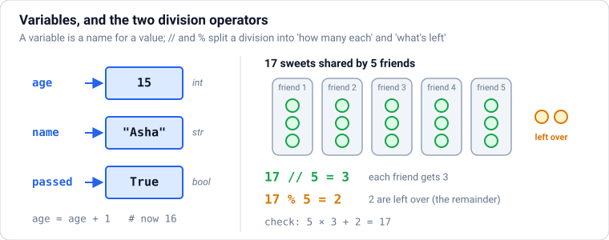

### Theory

> **In simple words:** a program is a recipe. Python follows your instructions one line at a time, top to bottom. **Variables** are labelled boxes that hold values, `if` makes choices, and **functions** are small recipes you can reuse by name.

A **program** is a list of instructions that Python runs **from top to bottom, one line at a time**. This section covers the few building blocks every later section uses.

**1. Values and their types.** Every piece of data has a type:

| Type | Examples | What it holds |
|---|---|---|
| `int` | `7`, `-3`, `0` | Whole numbers (any size in Python) |
| `float` | `3.14`, `-0.5`, `2.0` | Numbers with a decimal point |
| `str` | `"hello"`, `'A'`, `""` | Text: a *string* of characters |
| `bool` | `True`, `False` | Yes/no answers |

**2. Variables** are names for values. `age = 15` puts 15 in a box labelled `age`. Here `=` means **store**, not "is equal to". So `age = age + 1` is fine: read the old value, add 1, and store the result back in the same box. You can store several at once: `a, b = 3, 4`, and swap without a temporary variable: `a, b = b, a`.

**3. Arithmetic operators:**

| Operator | Meaning | Example | Result |
|---|---|---|---|
| `+` `-` `*` | Add, subtract, multiply | `7 * 3` | `21` |
| `/` | Divide (always gives a float) | `7 / 2` | `3.5` |
| `//` | **Floor division**: how many whole times | `17 // 5` | `3` |
| `%` | **Modulo**: the remainder | `17 % 5` | `2` |
| `**` | Power | `2 ** 10` | `1024` |

`//` and `%` are the most useful operators in DSA. Think of sharing 17 sweets between 5 friends: each friend gets `17 // 5 = 3` sweets, and `17 % 5 = 2` are left over. Part 2 uses them in almost every program:

- `n % 2 == 0` means n is **even**.
- `n % 10` is the **last digit** of n, and `n // 10` **removes** the last digit.
- `a % b == 0` means **b divides a** exactly.

Shortcuts: `x += 5` means `x = x + 5`; the same works for `-=`, `*=`, `//=` and `%=`.

**4. Comparisons and logic.** `==` (equal), `!=` (not equal), `<`, `>`, `<=` and `>=` give `True` or `False`. Combine them with `and`, `or` and `not`. Python also lets you chain them: `0 <= x < 10`.

**5. Decisions** use `if`, `elif` ("else if") and `else`. Python runs the **first** branch whose condition is true and skips the rest. The lines inside a branch are **indented** by 4 spaces; indentation is how Python knows which lines belong to the `if`.

**6. Functions** give a name to a group of steps so you can reuse them. `def` creates a function; the values in brackets are its **parameters** (inputs); `return` sends the answer back to whoever called it.

- `print` **shows** a value on the screen; `return` **gives it back** to the caller so the program can use it. A function without `return` gives back `None`.
- Write functions that `return` answers, and `print` outside them. Almost every practice website expects this.

**7. A first look at lists.** A **list** is a row of boxes holding several values: `marks = [72, 85, 90]`. The boxes are numbered from **0**, so `marks[0]` is 72 and `marks[2]` is 90; `marks[-1]` counts from the end. `len(marks)` is the number of boxes, and `marks.append(64)` adds a box at the end. Strings work the same way: `"hello"[0]` is `"h"` and `len("hello")` is 5. That's all you need until Sections [15](#15-arrays-and-python-lists) and [16](#16-strings), which cover lists and strings fully.

**8. Handy extras you'll see in later code:**

- **One-line if:** `x if condition else y` picks one of two values: `"even" if n % 2 == 0 else "odd"`.
- **Tuples:** `(3, 4)` is a fixed group of values, written with round brackets. Functions can return several values as a tuple: `return total, count`.
- **f-strings** put values inside text: `f"{name} scored {marks}"` becomes `"Asha scored 90"`.
- **Built-in helpers:** `abs(-7)` is 7, `max(3, 9)` is 9, `min(3, 9)` is 3, and `str(42)` is the text `"42"`.

**9. Reading input.** `input()` reads one line the user types, **always as a string**. Convert it with `int()` before doing maths: `"3" + "4"` is `"34"`, but `int("3") + int("4")` is `7`.

### Python

```python
# 1-3. values, variables and operators
sweets, friends = 17, 5
print(sweets // friends, sweets % friends)   # each friend gets 3; 2 are left over
print(2 ** 10, 7 / 2, 7 // 2)

a, b = 3, 4
a, b = b, a                                   # swap
print(a, b)

count = 10
count += 5
count //= 4
print(count)
```

**Output:**

```text
3 2
1024 3.5 3
4 3
3
```

```python
# 4-6. comparisons, decisions and functions
def grade(marks):
    if marks >= 90:
        return "A"
    elif marks >= 75:
        return "B"
    elif marks >= 40:
        return "C"
    else:
        return "Fail"

def is_even(n):
    return n % 2 == 0            # remainder 0 when divided by 2

def is_leap(year):
    # divisible by 4, except century years, which must be divisible by 400
    return (year % 4 == 0 and year % 100 != 0) or year % 400 == 0

print(grade(95), grade(80), grade(12))
print(is_even(10), is_even(7))
print(is_leap(2024), is_leap(1900), is_leap(2000))
print(0 <= 7 < 10, not True)

# 8. handy extras
n, name = 7, "Asha"
print("even" if n % 2 == 0 else "odd", (3, 4), f"{name} is {n + 8}", abs(-7), max(3, 9))
```

**Output:**

```text
A B Fail
True False
True False True
True False
odd (3, 4) Asha is 15 7 9
```

```python
# 7. a first look at lists
marks = [72, 85, 90]
marks.append(64)
print(marks)
print(marks[0], marks[-1], len(marks))
word = "hello"
print(word[0], word[-1], len(word))
```

**Output:**

```text
[72, 85, 90, 64]
72 64 4
h o 5
```

Reading input looks like this. The block isn't run automatically because it waits for you to type:

<!-- no-run -->
```python
name = input("Your name: ")          # always a str
n = int(input("A number: "))         # convert text to an int
a, b = map(int, input().split())     # two numbers on one line, like "3 4"
print("Hello", name, "- double your number is", 2 * n)
```

**Common mistakes:**

- ❌ `if x = 5:` → ✅ `if x == 5:` (`=` stores, `==` compares).
- ❌ Forgetting `int(...)` around `input()`, so maths becomes text-joining.
- ❌ Printing inside a function when the caller needs the value. ✅ Return it.
- ❌ Expecting `7 / 2` to be `3`. ✅ Use `7 // 2` for whole-number division.
- Negative numbers: `-7 // 2` is `-4`, not `-3`, because `//` always rounds **down** (towards minus infinity).

### Practice

Try each one before opening the answer.

1. Write `max_of_three(a, b, c)` using only `if`/`else` (no `max`).
2. Write `last_digit(n)` and `without_last_digit(n)` for a positive `n`.
3. Write `can_vote(age, is_citizen)` that returns `True` when `age >= 18` and the person is a citizen.

<details>
<summary><b>Answer</b></summary>

```python
def max_of_three(a, b, c):
    if a >= b and a >= c:
        return a
    elif b >= c:
        return b
    else:
        return c

def last_digit(n):
    return n % 10

def without_last_digit(n):
    return n // 10

def can_vote(age, is_citizen):
    return age >= 18 and is_citizen

print(max_of_three(4, 9, 2), max_of_three(7, 7, 1))
print(last_digit(2025), without_last_digit(2025))
print(can_vote(20, True), can_vote(16, True))
```

**Output:**

```text
9 7
5 202
True False
```

</details>

| # | LeetCode problem | Difficulty |
|---|---|---|
| 1 | [2235. Add Two Integers](https://leetcode.com/problems/add-two-integers/) | 🟢 Easy |
| 2 | [2469. Convert the Temperature](https://leetcode.com/problems/convert-the-temperature/) | 🟢 Easy |
| 3 | [2413. Smallest Even Multiple](https://leetcode.com/problems/smallest-even-multiple/) | 🟢 Easy |

**Learn more:** [The official Python tutorial](https://docs.python.org/3/tutorial/introduction.html) · this repo's [`python.md`](python.md) covers the language in depth.

---

## 3. Loops and Dry Runs

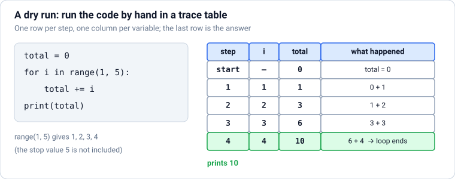

### Theory

> **In simple words:** a loop says "do this again": once for every item (`for`), or until something becomes true (`while`). Almost every algorithm in this file is a loop, or loops inside loops.

A **loop** repeats a block of code. Almost every algorithm is a loop, or loops inside loops.

**The `for` loop** repeats once for each value in a sequence:

| Code | Values it gives | Remember |
|---|---|---|
| `range(5)` | 0, 1, 2, 3, 4 | Starts at 0; the stop value **5 is not included** |
| `range(1, 6)` | 1, 2, 3, 4, 5 | `range(start, stop)` |
| `range(10, 0, -2)` | 10, 8, 6, 4, 2 | `range(start, stop, step)`; a negative step counts down |
| `for m in marks` | Each item of the list | Use it when you need the items |
| `for ch in "abc"` | Each character: `"a"`, `"b"`, `"c"` | Strings loop like lists |
| `for i in range(len(marks))` | Each index 0 … len − 1 | Use it when you need positions |
| `for i, m in enumerate(marks)` | Pairs (index, item) | Use it when you need both |

**The `while` loop** repeats **as long as a condition is true**. Something inside the loop must change the condition, or it runs forever (press Ctrl+C to stop it).

- Use `for` when you know how many times to repeat ("for each item", "n times").
- Use `while` when you stop on a condition ("until n becomes 0", "while the guess is wrong").

**Jumping out:** `break` leaves the loop immediately; `continue` skips the rest of this round and goes to the next one.

**Three loop patterns you'll use constantly:**

1. **Accumulator:** start with `total = 0` and add to it each round.
2. **Counter:** start with `count = 0` and do `count += 1` when something matches.
3. **Best so far:** start with the first item (or a very small value) and replace it whenever you find something better.

**Nested loops** are loops inside loops. The inner loop runs **completely** for every single round of the outer loop, so an outer loop of 3 rounds with an inner loop of 4 rounds runs the inner body 3 × 4 = 12 times. Pattern printing (the next three sections) is all nested loops: the outer loop picks the **row**, the inner loop prints what goes in that row.

**Printing on one line:** `print` normally ends with a new line. `print(x, end=" ")` ends with a space instead, and an empty `print()` just moves to the next line.

**Dry runs.** A **dry run** means running the code **by hand, on paper**, writing down every variable after every step in a **trace table** (see the picture). It's how you find bugs without a computer, and interviewers often ask you to "walk through your code with this example". Do a dry run for every new loop until tracing feels easy.

**Used in real software:** every program that processes a list of anything (orders, messages, pixels, rows in a database) is a loop at heart. Debuggers, like the one in VS Code, let you step through a loop line by line: a dry run done by the computer.

### Python

```python
# accumulator: add 1 + 2 + 3 + 4, showing each step (compare with the trace table)
total = 0
for i in range(1, 5):
    total += i
    print("i =", i, " total =", total)
print("final total:", total)
```

**Output:**

```text
i = 1  total = 1
i = 2  total = 3
i = 3  total = 6
i = 4  total = 10
final total: 10
```

```python
# while: how many times can 40 be halved before it reaches 1?
n, steps = 40, 0
while n > 1:
    n //= 2              # 40 → 20 → 10 → 5 → 2 → 1
    steps += 1
print(steps)

# counter and best-so-far over a list
marks = [72, 85, 38, 90, 64]
passed, best = 0, marks[0]
for m in marks:
    if m >= 40:
        passed += 1
    if m > best:
        best = m
print(passed, best)

# enumerate gives the position and the item together
for i, m in enumerate(marks):
    if m < 40:
        print("failed at index", i)
```

**Output:**

```text
5
4 90
failed at index 2
```

```python
# break and continue
for n in range(1, 10):
    if n % 2 == 0:
        continue          # skip even numbers
    if n > 7:
        break             # stop the whole loop
    print(n, end=" ")
print()

# nested loops: a small times table (inner loop = columns, outer loop = rows)
for row in range(1, 4):
    for col in range(1, 6):
        print(f"{row * col:3}", end="")   # :3 pads each number to 3 characters
    print()
```

**Output:**

```text
1 3 5 7
  1  2  3  4  5
  2  4  6  8 10
  3  6  9 12 15
```

**Common mistakes:**

- ❌ Expecting `range(1, 5)` to include 5. ✅ The stop value is never included; write `range(1, n + 1)` for 1 … n.
- ❌ A `while` loop whose condition never changes (an infinite loop).
- ❌ Putting a statement at the wrong indentation, so it runs once after the loop instead of every round (or the other way round).
- ❌ Changing a list's length while looping over it with `for`. Build a new list instead.

### Practice

Dry-run each one on paper first, then check by running it.

1. What does this print?

   ```python
   x = 1
   while x < 50:
       x = x * 3
   print(x)
   ```

   **Output:**

   ```text
   81
   ```

   (1 → 3 → 9 → 27 → 81; 81 is not less than 50, so the loop stops.)

2. Write a loop that prints the multiplication table of 7 (7 × 1 = 7 … 7 × 10 = 70).
3. Write `count_multiples(n, k)`: how many numbers in 1 … n are divisible by k?
4. Write `smallest(nums)` that returns the smallest number in a list without using `min`.

<details>
<summary><b>Answer</b></summary>

```python
for i in range(1, 11):
    print(7, "x", i, "=", 7 * i)

def count_multiples(n, k):
    count = 0
    for x in range(1, n + 1):
        if x % k == 0:
            count += 1
    return count

def smallest(nums):
    best = nums[0]
    for x in nums:
        if x < best:
            best = x
    return best

print(count_multiples(20, 3), smallest([8, 3, 9, -2, 5]))
```

**Output:**

```text
7 x 1 = 7
7 x 2 = 14
7 x 3 = 21
7 x 4 = 28
7 x 5 = 35
7 x 6 = 42
7 x 7 = 49
7 x 8 = 56
7 x 9 = 63
7 x 10 = 70
6 -2
```

</details>

| # | LeetCode problem | Difficulty |
|---|---|---|
| 1 | [412. Fizz Buzz](https://leetcode.com/problems/fizz-buzz/) | 🟢 Easy |
| 2 | [1342. Number of Steps to Reduce a Number to Zero](https://leetcode.com/problems/number-of-steps-to-reduce-a-number-to-zero/) | 🟢 Easy |
| 3 | [1480. Running Sum of 1d Array](https://leetcode.com/problems/running-sum-of-1d-array/) | 🟢 Easy |
| 4 | [1672. Richest Customer Wealth](https://leetcode.com/problems/richest-customer-wealth/) | 🟢 Easy |
| 5 | [1512. Number of Good Pairs](https://leetcode.com/problems/number-of-good-pairs/) | 🟢 Easy |

**Learn & visualise:** [Python Tutor](https://pythontutor.com/visualize.html) (paste any loop above and step through it)

---

## 4. Pattern Printing I: Squares and Triangles

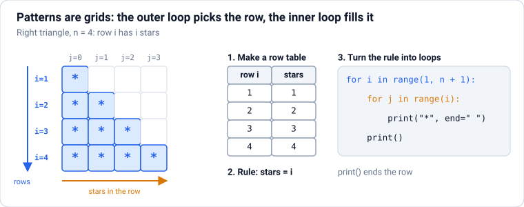

### Theory

> **In simple words:** printing a shape is like colouring squares on graph paper, one row at a time. The **outer loop** moves down the rows, and the **inner loop** moves across one row.

Pattern printing means drawing shapes with characters. It looks like a game, but it's the best practice there is for **nested loops**: the skill of turning "what I see" into "what the loops must do". Every later topic, from sorting to dynamic programming tables, needs that skill.

**The four-step method (use it for every pattern):**

1. **Count the rows.** That's the **outer loop**: `for i in range(1, n + 1)`, where `i` is the row number.
2. **Describe one row.** For row `i`, write down *what* is printed and *how many*: stars, spaces or numbers. Make a small table for rows 1 to 4.
3. **Find the rule.** Turn the table into a formula using `i` and `n`: "row i has i stars", "row i has n − i spaces".
4. **Write the inner loop(s)** from the rule, then call `print()` to end the row.

For the right triangle in the picture:

| Row `i` | Stars | Rule |
|---|---|---|
| 1 | 1 | stars = i |
| 2 | 2 | |
| 3 | 3 | |
| 4 | 4 | |

So the inner loop runs `i` times. For an **inverted** triangle the rule becomes stars = n − i + 1, or you can simply make the outer loop count **down**: `range(n, 0, -1)`.

**When the row prints numbers**, ask *which* number: the column number `j` (1 2 3), the row number `i` (3 3 3), or a counter that keeps growing (Section [6](#6-pattern-printing-iii-number-and-letter-patterns)).

**Python shortcut:** `"* " * 3` is `"* * * "`, because multiplying a string repeats it. So `print("* " * i)` prints a whole row at once. Learn the loop version first: interviews and other languages expect it, and the shortcut only works for simple rows.

### Python

We use `n = 4` so the output stays short; every function works for any `n`.

```python
def square(n):
    for i in range(n):              # n rows
        for j in range(n):          # n stars in every row
            print("*", end=" ")
        print()                     # end of the row

def right_triangle(n):
    for i in range(1, n + 1):       # row i ...
        for j in range(i):          # ... has i stars
            print("*", end=" ")
        print()

square(4)
print()
right_triangle(4)
```

**Output:**

```text
* * * *
* * * *
* * * *
* * * *

*
* *
* * *
* * * *
```

```python
def number_triangle(n):
    for i in range(1, n + 1):
        for j in range(1, i + 1):   # print the column number j
            print(j, end=" ")
        print()

def row_number_triangle(n):
    for i in range(1, n + 1):
        for j in range(i):
            print(i, end=" ")       # print the row number i, i times
        print()

number_triangle(4)
print()
row_number_triangle(4)
```

**Output:**

```text
1
1 2
1 2 3
1 2 3 4

1
2 2
3 3 3
4 4 4 4
```

```python
def inverted_triangle(n):
    for i in range(n, 0, -1):       # rows count down: n, n-1, ..., 1
        for j in range(i):
            print("*", end=" ")
        print()

def inverted_numbers(n):
    for i in range(n, 0, -1):
        for j in range(1, i + 1):
            print(j, end=" ")
        print()

def right_triangle_short(n):        # the string-repeat shortcut
    for i in range(1, n + 1):
        print("* " * i)

inverted_triangle(4)
print()
inverted_numbers(4)
print()
right_triangle_short(3)
```

**Output:**

```text
* * * *
* * *
* *
*

1 2 3 4
1 2 3
1 2
1

*
* *
* * *
```

**Common mistakes:**

- ❌ Forgetting the `print()` after the inner loop, which puts everything on one line.
- ❌ Putting that `print()` **inside** the inner loop, which prints one character per line.
- ❌ An off-by-one error in `range`: row 1 printing 0 stars, or row n printing n + 1. Check the first and last rows against your table.

### Practice

Write each pattern for any `n` (shown for n = 4). Make the row table first.

1. A rectangle of `#` with `rows` rows and `cols` columns (shown for 3 × 5).
2. Each row counts down from `i` to 1.
3. An inverted triangle of the row's number.

```text
1)  # # # # #      2)  1              3)  4 4 4 4
    # # # # #          2 1                3 3 3
    # # # # #          3 2 1              2 2
                       4 3 2 1            1
```

<details>
<summary><b>Answer</b></summary>

```python
def rectangle(rows, cols):
    for i in range(rows):
        for j in range(cols):
            print("#", end=" ")
        print()

def countdown_triangle(n):
    for i in range(1, n + 1):
        for j in range(i, 0, -1):       # from i down to 1
            print(j, end=" ")
        print()

def inverted_row_numbers(n):
    for i in range(n, 0, -1):
        for j in range(i):
            print(i, end=" ")
        print()

rectangle(3, 5)
countdown_triangle(4)
inverted_row_numbers(4)
```

**Output:**

```text
# # # # #
# # # # #
# # # # #
1
2 1
3 2 1
4 3 2 1
4 4 4 4
3 3 3
2 2
1
```

</details>

**More practice:** [HackerRank: Loops](https://www.hackerrank.com/challenges/python-loops/problem) · [HackerRank: Print Function](https://www.hackerrank.com/challenges/python-print/problem)

---

## 5. Pattern Printing II: Pyramids, Diamonds and Hollow Shapes

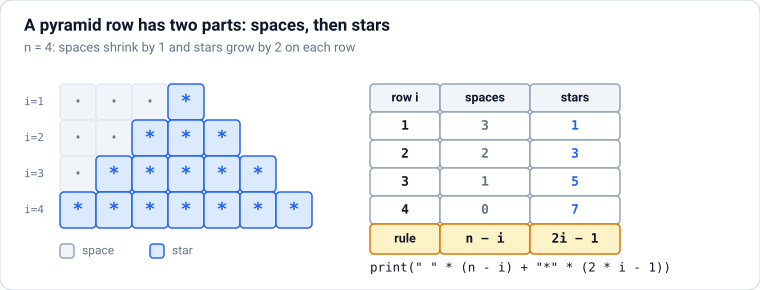

### Theory

> **In simple words:** a pyramid row is "some spaces, then some stars". Work out **how many of each** for row i, and the shape draws itself.

These shapes add one new idea: **spaces before the stars**, which push each row to the right. A row now has two parts, so it needs **two inner loops** (or two counts): first the spaces, then the stars.

Make the row table exactly as before, with one column for each part. For a pyramid with n = 4:

| Row `i` | Spaces | Stars | Rules |
|---|---|---|---|
| 1 | 3 | 1 | spaces = n − i |
| 2 | 2 | 3 | stars = 2i − 1 (the odd numbers 1, 3, 5, 7) |
| 3 | 1 | 5 | |
| 4 | 0 | 7 | |

**Building bigger shapes from smaller ones:**

- A **diamond** is a pyramid followed by an upside-down pyramid. Print the middle (widest) row only once.
- A **butterfly** is two triangles facing each other, with a gap of 2(n − i) spaces between them.

**Hollow shapes** add a **decision inside the inner loop**: print a star if the position is on the border, otherwise a space. For a hollow square, the border is the first or last row (`i == 0 or i == n - 1`) or the first or last column (`j == 0 or j == n - 1`).

The shortcut from the last section works well here: `" " * (n - i) + "*" * (2 * i - 1)` builds a whole pyramid row at once. The first example uses loops so you can see both parts; the rest use the shortcut.

### Python

```python
def right_aligned_triangle(n):
    for i in range(1, n + 1):
        print(" " * (n - i) + "*" * i)          # n - i spaces, then i stars

def pyramid(n):
    for i in range(1, n + 1):
        for s in range(n - i):                  # part 1: spaces
            print(" ", end="")
        for j in range(2 * i - 1):              # part 2: stars
            print("*", end="")
        print()

right_aligned_triangle(4)
pyramid(4)
```

**Output:**

```text
   *
  **
 ***
****
   *
  ***
 *****
*******
```

```python
def inverted_pyramid(n):
    for i in range(n, 0, -1):
        print(" " * (n - i) + "*" * (2 * i - 1))

def diamond(n):
    for i in range(1, n + 1):                   # top half, including the middle row
        print(" " * (n - i) + "*" * (2 * i - 1))
    for i in range(n - 1, 0, -1):               # bottom half, without the middle row
        print(" " * (n - i) + "*" * (2 * i - 1))

inverted_pyramid(3)
diamond(4)
```

**Output:**

```text
*****
 ***
  *
   *
  ***
 *****
*******
 *****
  ***
   *
```

```python
def hollow_square(n):
    for i in range(n):
        for j in range(n):
            if i == 0 or i == n - 1 or j == 0 or j == n - 1:
                print("*", end=" ")             # on the border
            else:
                print(" ", end=" ")             # inside
        print()

def hollow_pyramid(n):
    for i in range(1, n + 1):
        print(" " * (n - i), end="")
        for j in range(1, 2 * i):               # positions 1 .. 2i-1
            if j == 1 or j == 2 * i - 1 or i == n:
                print("*", end="")              # first, last, or the bottom row
            else:
                print(" ", end="")
        print()

def butterfly(n):
    for i in list(range(1, n + 1)) + list(range(n - 1, 0, -1)):   # 1 2 3 4 3 2 1
        print("*" * i + " " * (2 * (n - i)) + "*" * i)

hollow_square(4)
hollow_pyramid(4)
butterfly(4)
```

**Output:**

```text
* * * *
*     *
*     *
* * * *
   *
  * *
 *   *
*******
*      *
**    **
***  ***
********
***  ***
**    **
*      *
```

**Common mistakes:**

- ❌ Getting the star count wrong on pyramids: it's `2 * i - 1`, not `2 * i`.
- ❌ Printing the middle row of a diamond twice: the bottom half must start at `n - 1`.
- ❌ Putting spaces **after** the stars instead of before; trailing spaces are invisible, so the shape doesn't move.

### Practice

Make the row table first (spaces, stars), then write the code. Shown for n = 4.

1. An upside-down right-aligned triangle (the stars line up on the right edge).
2. A hollow right triangle.
3. A "sandglass": an inverted pyramid followed by a pyramid (the one-star row appears once).

```text
1)  ****       2)  *          3)  *******
     ***           **              *****
      **           * *              ***
       *           ****              *
                                    ***
                                   *****
                                  *******
```

<details>
<summary><b>Answer</b></summary>

```python
def mirrored_inverted(n):
    for i in range(n, 0, -1):
        print(" " * (n - i) + "*" * i)

def hollow_right_triangle(n):
    for i in range(1, n + 1):
        for j in range(1, i + 1):
            if j == 1 or j == i or i == n:
                print("*", end="")
            else:
                print(" ", end="")
        print()

def sandglass(n):
    for i in range(n, 0, -1):                   # shrinking
        print(" " * (n - i) + "*" * (2 * i - 1))
    for i in range(2, n + 1):                   # growing again, skipping the 1-star row
        print(" " * (n - i) + "*" * (2 * i - 1))

mirrored_inverted(4)
hollow_right_triangle(4)
sandglass(4)
```

**Output:**

```text
****
 ***
  **
   *
*
**
* *
****
*******
 *****
  ***
   *
  ***
 *****
*******
```

</details>

**More practice:** [HackerRank: Staircase](https://www.hackerrank.com/challenges/staircase/problem) (a right-aligned triangle)

---

## 6. Pattern Printing III: Number and Letter Patterns

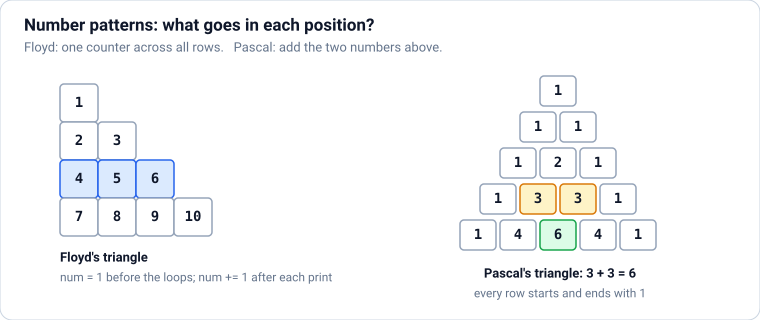

### Theory

> **In simple words:** the shape stays simple; the question is **which number or letter** goes in each spot. It's either the row number, the column number, a counter that keeps growing, or a small formula.

The shapes stay simple; now the question is **which value goes in each position**. There are four common answers:

| The value depends on… | Example row 3 | How |
|---|---|---|
| The column `j` | `1 2 3` | Print `j` |
| The row `i` | `3 3 3` | Print `i` |
| A **counter** that never resets | `4 5 6` (Floyd's triangle) | `num = 1` before the loops; print it and add 1 each time |
| A **formula** in `i` and `j` | `1 0 1` | `1 if (i + j) % 2 == 0 else 0` |

**Letters are numbers in disguise.** Every character has a code number: `ord("A")` is 65, `ord("B")` is 66, and `chr(65)` turns 65 back into `"A"`. So the j-th letter of the alphabet (counting from 0) is `chr(ord("A") + j)`. Section [16](#16-strings) uses this trick a lot.

**Pascal's triangle** (in the picture) starts with a 1 on top; every other number is the **sum of the two numbers above it**, and each row starts and ends with 1. To build it, keep the previous row in a list and make the next row from it. The numbers are also the "n choose r" counts from school maths: row 4 is 1 4 6 4 1.

### Python

```python
def floyd_triangle(n):
    num = 1                                   # a counter shared by all rows
    for i in range(1, n + 1):
        for j in range(i):
            print(num, end=" ")
            num += 1
        print()

def zero_one_triangle(n):
    for i in range(1, n + 1):
        for j in range(1, i + 1):
            print(1 if (i + j) % 2 == 0 else 0, end=" ")
        print()

floyd_triangle(4)
zero_one_triangle(4)
```

**Output:**

```text
1
2 3
4 5 6
7 8 9 10
1
0 1
1 0 1
0 1 0 1
```

```python
def letter_triangle(n):
    for i in range(1, n + 1):
        for j in range(i):
            print(chr(ord("A") + j), end=" ")   # A, B, C, ... by column
        print()

def letter_rows(n):
    for i in range(n):
        letter = chr(ord("A") + i)              # one letter per row
        print((letter + " ") * (i + 1))

def number_palindrome_pyramid(n):
    for i in range(1, n + 1):
        print(" " * (n - i), end="")
        for j in range(1, i + 1):               # climb up: 1 2 ... i
            print(j, end="")
        for j in range(i - 1, 0, -1):           # climb down: i-1 ... 1
            print(j, end="")
        print()

print(ord("A"), ord("a"), chr(67))
letter_triangle(4)
letter_rows(3)
number_palindrome_pyramid(4)
```

**Output:**

```text
65 97 C
A
A B
A B C
A B C D
A
B B
C C C
   1
  121
 12321
1234321
```

```python
def pascal_triangle(n):
    row = [1]
    for i in range(n):
        print(" " * (n - i - 1), end="")        # centre the row
        for x in row:
            print(x, end=" ")
        print()
        next_row = [1]
        for j in range(1, len(row)):
            next_row.append(row[j - 1] + row[j])   # sum of the two numbers above
        next_row.append(1)
        row = next_row

pascal_triangle(5)
```

**Output:**

```text
    1
   1 1
  1 2 1
 1 3 3 1
1 4 6 4 1
```

**Common mistakes:**

- ❌ Resetting Floyd's counter inside the outer loop: then every row starts at 1 again.
- ❌ Starting the alphabet at `chr(ord("A") + 1)`: the first letter is `+ 0`.
- ❌ In Pascal's triangle, changing `row` while still reading from it. Build `next_row` separately, then replace.

### Practice

1. Print this "reverse Floyd" triangle for n = 4 (the numbers count down from 10).
2. Print a triangle where row `i` has the letters from the i-th letter back to A (`C B A` in row 3).
3. Print the n-th row of Pascal's triangle only, as a list (row 0 is `[1]`).

```text
1)  10              2)  A
    9 8                 B A
    7 6 5               C B A
    4 3 2 1             D C B A
```

<details>
<summary><b>Answer</b></summary>

```python
def reverse_floyd(n):
    num = n * (n + 1) // 2                  # total count of numbers in the triangle
    for i in range(1, n + 1):
        for j in range(i):
            print(num, end=" ")
            num -= 1
        print()

def backward_letters(n):
    for i in range(n):
        for j in range(i, -1, -1):
            print(chr(ord("A") + j), end=" ")
        print()

def pascal_row(n):
    row = [1]
    for _ in range(n):                      # _ is a name for "a value we don't use"
        next_row = [1]
        for j in range(1, len(row)):
            next_row.append(row[j - 1] + row[j])
        next_row.append(1)
        row = next_row
    return row

reverse_floyd(4)
backward_letters(4)
print(pascal_row(0), pascal_row(4))
```

**Output:**

```text
10
9 8
7 6 5
4 3 2 1
A
B A
C B A
D C B A
[1] [1, 4, 6, 4, 1]
```

</details>

| # | LeetCode problem | Difficulty |
|---|---|---|
| 1 | [118. Pascal's Triangle](https://leetcode.com/problems/pascals-triangle/) | 🟢 Easy |
| 2 | [119. Pascal's Triangle II](https://leetcode.com/problems/pascals-triangle-ii/) | 🟢 Easy |

**Learn & visualise:** [Wikipedia: Pascal's triangle](https://en.wikipedia.org/wiki/Pascal%27s_triangle) (pictures of its many hidden patterns) · [Wikipedia: Floyd's triangle](https://en.wikipedia.org/wiki/Floyd%27s_triangle)

---

### ✅ Part 1 checkpoint

Without looking at the notes, can you:

- [ ] Explain the difference between `/`, `//` and `%`, and between `print` and `return`?
- [ ] Write a function using `if` / `elif` / `else`, and loop over a list with `for` and with `enumerate`?
- [ ] Dry-run a nested loop in a trace table and predict exactly what it prints?
- [ ] Print a pyramid, a diamond and a hollow square for any `n`, starting from a row table?
- [ ] Print Floyd's triangle and Pascal's triangle?

If yes, move on to Part 2. If not, redo this part's practice first: Part 2 assumes loops feel easy.

---

# Part 2 — Basic: Maths for Programmers

> **Goal:** The number theory behind many problems (digits, divisors, primes, GCD, modulo, binary), and your first taste of fast vs slow methods.  
> **You need:** Part 1: loops, functions, and the `//` and `%` operators.

---

## 7. Working with Digits

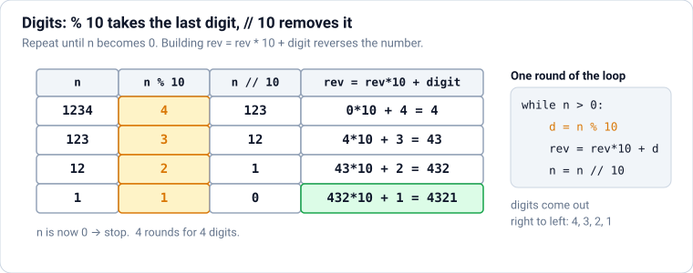

### Theory

> **In simple words:** `% 10` snips off the **last digit** of a number, and `// 10` throws it away. Repeat both and you read the digits from right to left, one at a time.

Many beginner problems ask about the **digits** of a number: count them, add them, reverse them. Two operators do all the work:

| Operation | Gives | Example with 1234 |
|---|---|---|
| `n % 10` | The **last digit** | `1234 % 10 = 4` |
| `n // 10` | The number **without** its last digit | `1234 // 10 = 123` |

Repeat both in a `while n > 0` loop and you visit every digit from **right to left**: 4, 3, 2, 1. The loop ends when `n` becomes 0.

**Building a number digit by digit** is the reverse move: `result = result * 10 + digit` shifts everything one place left and puts the new digit at the end. Starting from 0 and adding 4, 3, 2, 1 gives 4 → 43 → 432 → 4321. That's how you **reverse** a number.

**Special cases to handle every time:**

- **n = 0** has one digit, but `while n > 0` never runs. Handle it before the loop.
- **Negative numbers:** work on `abs(n)` (the value without its sign), then add the sign back if needed.
- **Trailing zeros disappear** when reversed: the reverse of 1200 is 21 as a number.

**How many steps?** One loop round per digit. A number with 9 digits takes 9 rounds, even though it's close to a billion. (Section [13](#13-big-o-how-fast-is-my-code) names this growth "O(log n)".)

**Shortcut:** `str(n)` turns a number into text, so `len(str(1234))` is 4 and `str(1234)[::-1]` is `"4321"` (Section [16](#16-strings) explains `[::-1]`). It's fine in real code, but interviewers usually want the `%` and `//` method, and it's the method that works in every language.

**Classic digit problems:**

- **Palindrome number:** it reads the same backwards (121, 1331). Compare the number with its reverse.
- **Armstrong number:** equal to the sum of its digits, each raised to the power of the number of digits: 153 = 1³ + 5³ + 3³.
- **Digital root:** keep adding the digits until one digit remains: 9875 → 29 → 11 → 2.

**Used in real software:** **check digits.** Credit-card numbers end with a digit chosen by the **Luhn algorithm** (shown in the code below), so a typing mistake is caught before any payment is attempted. ISBNs on books and Aadhaar-style ID numbers use similar check digits.

### Python

```python
def count_digits(n):
    n = abs(n)
    if n == 0:
        return 1                     # special case: the loop would not run
    count = 0
    while n > 0:
        n //= 10                     # drop the last digit
        count += 1
    return count

def sum_digits(n):
    n, total = abs(n), 0
    while n > 0:
        total += n % 10              # take the last digit
        n //= 10                     # then drop it
    return total

def reverse_number(n):
    rev = 0
    while n > 0:
        rev = rev * 10 + n % 10      # shift left, then append the last digit
        n //= 10
    return rev

print(count_digits(1234), count_digits(0), count_digits(-507))
print(sum_digits(1234), sum_digits(9045))
print(reverse_number(1234), reverse_number(1200))
```

**Output:**

```text
4 1 3
10 18
4321 21
```

**A real use: the Luhn check digit.** Starting from the rightmost digit, double every **second** digit; if doubling gives more than 9, subtract 9. Add everything up: the number is valid when the total ends in 0. A single mistyped digit always breaks the rule.

```python
def luhn_valid(n):
    total, position = 0, 0
    while n > 0:
        d = n % 10                    # rightmost digit first
        if position % 2 == 1:         # every second digit from the right
            d *= 2
            if d > 9:
                d -= 9
        total += d
        n //= 10
        position += 1
    return total % 10 == 0

print(luhn_valid(79927398713), luhn_valid(79927398710))
```

**Output:**

```text
True False
```

```python
def is_palindrome_number(n):
    return n >= 0 and n == reverse_number(n)

def is_armstrong(n):
    power = count_digits(n)
    total, m = 0, n
    while m > 0:
        total += (m % 10) ** power
        m //= 10
    return total == n

def digital_root(n):
    while n >= 10:                   # more than one digit left
        n = sum_digits(n)
    return n

print(is_palindrome_number(121), is_palindrome_number(123), is_palindrome_number(-121))
print(is_armstrong(153), is_armstrong(9474), is_armstrong(154))

armstrong = []
for x in range(1, 1000):
    if is_armstrong(x):
        armstrong.append(x)
print(armstrong)
print(digital_root(9875))
```

**Output:**

```text
True False False
True True False
[1, 2, 3, 4, 5, 6, 7, 8, 9, 153, 370, 371, 407]
2
```

(These functions reuse `count_digits`, `sum_digits` and `reverse_number` from the block above, so run the blocks one after the other.)

**Common mistakes:**

- ❌ Using `/` instead of `//`: `1234 / 10` is `123.4`, and the loop never reaches 0 cleanly.
- ❌ Changing `n` in the loop and then comparing with the original `n` afterwards. Keep a copy first (`m = n`).
- ❌ Forgetting the `n = 0` and negative-number cases.

### Practice

1. Write `product_of_digits(n)` (the product of 234 is 24).
2. Write `count_even_digits(n)` (123456 has 3 even digits).
3. Write `largest_digit(n)`.

<details>
<summary><b>Answer</b></summary>

```python
def product_of_digits(n):
    product = 1
    while n > 0:
        product *= n % 10
        n //= 10
    return product

def count_even_digits(n):
    count = 0
    while n > 0:
        if (n % 10) % 2 == 0:
            count += 1
        n //= 10
    return count

def largest_digit(n):
    best = 0
    while n > 0:
        if n % 10 > best:
            best = n % 10
        n //= 10
    return best

print(product_of_digits(234), count_even_digits(123456), largest_digit(38192))
```

**Output:**

```text
24 3 9
```

</details>

| # | LeetCode problem | Difficulty |
|---|---|---|
| 1 | [9. Palindrome Number](https://leetcode.com/problems/palindrome-number/) | 🟢 Easy |
| 2 | [258. Add Digits](https://leetcode.com/problems/add-digits/) | 🟢 Easy |
| 3 | [1281. Subtract the Product and Sum of Digits of an Integer](https://leetcode.com/problems/subtract-the-product-and-sum-of-digits-of-an-integer/) | 🟢 Easy |
| 4 | [1295. Find Numbers with Even Number of Digits](https://leetcode.com/problems/find-numbers-with-even-number-of-digits/) | 🟢 Easy |
| 5 | [2520. Count the Digits That Divide a Number](https://leetcode.com/problems/count-the-digits-that-divide-a-number/) | 🟢 Easy |
| 6 | [7. Reverse Integer](https://leetcode.com/problems/reverse-integer/) | 🟡 Medium |

**Learn more:** [GeeksforGeeks: Program to reverse digits of a number](https://www.geeksforgeeks.org/dsa/write-a-program-to-reverse-digits-of-a-number/)

---

## 8. Divisors and Prime Numbers

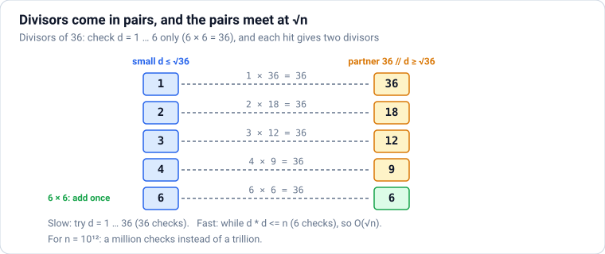

### Theory

> **In simple words:** a **divisor** divides a number with nothing left over. A **prime** can only be divided evenly by 1 and itself: you can't arrange that many sweets into a rectangle of equal rows (except one long row).

**d is a divisor of n** when d divides n with nothing left over: `n % d == 0`. The divisors of 12 are 1, 2, 3, 4, 6 and 12.

**The slow way** checks every number from 1 to n: n loop rounds. That's fine for n = 1,000, but for n = 10¹² it would take hours.

**The key observation: divisors come in pairs.** If d divides n, then so does n // d, because d × (n // d) = n. For 36 the pairs are (1, 36), (2, 18), (3, 12), (4, 9) and (6, 6). In every pair, **one number is at most √n** (the square root; √36 = 6), and the other is at least √n. So:

> Only check d = 1, 2, 3, … while **d × d ≤ n**. Every time d divides n, you've found two divisors: d and n // d.

That's about √n rounds instead of n: for n = 10¹², a million rounds instead of a trillion. Watch out for perfect squares: when d × d = n (6 × 6 = 36), the pair is one number, so add it once. Writing the condition as `d * d <= n` avoids square roots and decimals entirely.

**Prime numbers** have exactly two divisors: 1 and themselves (2, 3, 5, 7, 11, 13, …).

- 1 is **not** prime (it has only one divisor), and 2 is the only even prime.
- To test whether n is prime, look for any divisor from 2 up to √n. If there's none, n is prime. If n had a divisor bigger than √n, its partner would be smaller than √n, and we'd already have found it.
- A number greater than 1 that isn't prime is called **composite**.

**Related ideas:**

- **Proper divisors** are all divisors except n itself. A **perfect number** equals the sum of its proper divisors: 6 = 1 + 2 + 3, and 28 = 1 + 2 + 4 + 7 + 14.
- `reversed(some_list)` walks a list from the end to the start; the code uses it to put the big partners in increasing order.

**Used in real software:** **cryptography.** RSA encryption, used for decades to secure websites, relies on the fact that multiplying two huge primes is easy but splitting the product back into them is extremely hard. Because future quantum computers could break RSA, in 2024 the US standards body NIST published new "post-quantum" standards (such as ML-KEM) based on different mathematics, and companies are migrating to them. Primes also pick good sizes for hash tables.

### Python

```python
def divisors_slow(n):
    result = []
    for d in range(1, n + 1):          # n rounds
        if n % d == 0:
            result.append(d)
    return result

def divisors_fast(n):
    small, large = [], []
    d = 1
    while d * d <= n:                  # about √n rounds
        if n % d == 0:
            small.append(d)            # the small partner
            if d != n // d:            # a perfect square's root is added once
                large.append(n // d)   # the big partner
        d += 1
    for x in reversed(large):          # big partners, smallest first
        small.append(x)
    return small

print(divisors_slow(36))
print(divisors_fast(36))
print(divisors_fast(97))

# how many loop rounds each method needs for n = 1,000,000
n = 1_000_000                          # the underscores are only for readability
rounds_fast = 0
d = 1
while d * d <= n:
    rounds_fast += 1
    d += 1
print("slow:", n, "rounds   fast:", rounds_fast, "rounds")
```

**Output:**

```text
[1, 2, 3, 4, 6, 9, 12, 18, 36]
[1, 2, 3, 4, 6, 9, 12, 18, 36]
[1, 97]
slow: 1000000 rounds   fast: 1000 rounds
```

```python
def is_prime(n):
    if n < 2:
        return False                   # 0, 1 and negatives are not prime
    d = 2
    while d * d <= n:
        if n % d == 0:
            return False               # found a divisor: not prime
        d += 1
    return True

def is_perfect(n):
    total = 0
    for d in divisors_fast(n):
        if d != n:
            total += d                 # add the proper divisors
    return total == n

primes = []
for x in range(1, 51):
    if is_prime(x):
        primes.append(x)
print(primes)
print(is_prime(1), is_prime(2), is_prime(1_000_003), is_prime(1_000_001))

perfect = []
for x in range(2, 10_000):
    if is_perfect(x):
        perfect.append(x)
print(perfect)
```

**Output:**

```text
[2, 3, 5, 7, 11, 13, 17, 19, 23, 29, 31, 37, 41, 43, 47]
False True True False
[6, 28, 496, 8128]
```

**Common mistakes:**

- ❌ Saying 1 is prime, or forgetting that 2 is.
- ❌ Looping `while d * d < n` (strictly less): then 49 = 7 × 7 looks prime.
- ❌ Adding the square root twice for perfect squares (36 would get two 6s).

### Practice

1. Write `count_divisors(n)` using the √n idea (12 has 6 divisors).
2. Write `next_prime(n)`: the smallest prime bigger than n.
3. Twin primes are pairs of primes that differ by 2, like (11, 13). Print all twin-prime pairs below 50.

<details>
<summary><b>Answer</b></summary>

```python
def count_divisors(n):
    count, d = 0, 1
    while d * d <= n:
        if n % d == 0:
            count += 1 if d == n // d else 2
        d += 1
    return count

def next_prime(n):
    candidate = n + 1
    while not is_prime(candidate):
        candidate += 1
    return candidate

print(count_divisors(12), count_divisors(36), next_prime(13), next_prime(90))
for p in range(2, 48):
    if is_prime(p) and is_prime(p + 2):
        print((p, p + 2), end=" ")
print()
```

**Output:**

```text
6 9 17 97
(3, 5) (5, 7) (11, 13) (17, 19) (29, 31) (41, 43)
```

</details>

| # | LeetCode problem | Difficulty |
|---|---|---|
| 1 | [507. Perfect Number](https://leetcode.com/problems/perfect-number/) | 🟢 Easy |
| 2 | [1952. Three Divisors](https://leetcode.com/problems/three-divisors/) | 🟢 Easy |
| 3 | [2427. Number of Common Factors](https://leetcode.com/problems/number-of-common-factors/) | 🟢 Easy |
| 4 | [263. Ugly Number](https://leetcode.com/problems/ugly-number/) | 🟢 Easy |
| 5 | [1492. The kth Factor of n](https://leetcode.com/problems/the-kth-factor-of-n/) | 🟡 Medium |

**Learn more:** [GeeksforGeeks: Find all divisors of a natural number](https://www.geeksforgeeks.org/dsa/find-all-divisors-of-a-natural-number-set-2/) · [GeeksforGeeks: Primality test](https://www.geeksforgeeks.org/dsa/primality-test-set-1-introduction-and-school-method/)

---

## 9. GCD, LCM and Euclid's Algorithm

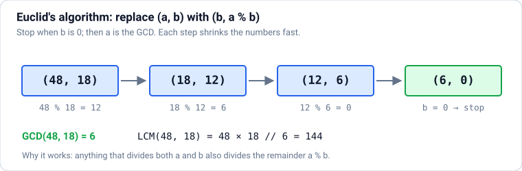

### Theory

> **In simple words:** the GCD is the **biggest tile** that exactly covers an a × b floor with no cutting. The LCM is the first time two repeating things line up again.

- The **GCD** (greatest common divisor, also called HCF) of two numbers is the largest number that divides both. GCD(12, 18) = 6.
- The **LCM** (least common multiple) is the smallest number that both divide into. LCM(4, 6) = 12.

**Real-life uses:** simplifying fractions (12/18 = 2/3, dividing both by the GCD 6), cutting two ropes into equal pieces with none left over (GCD), and finding when two repeating events next happen together (LCM: buses every 4 and 6 minutes meet every 12 minutes).

**The slow way:** try every number from min(a, b) down to 1 and return the first that divides both. That's up to min(a, b) rounds.

**Euclid's algorithm (about 2,300 years old, and still the best):**

> GCD(a, b) = GCD(b, a % b), and GCD(a, 0) = a.

Replace the pair (a, b) with (b, a % b) until the second number becomes 0; the first number is then the answer. For 48 and 18: (48, 18) → (18, 12) → (12, 6) → (6, 0), so the GCD is 6.

**Why it works:** any number that divides both a and b also divides a − b, a − 2b, and so on, so it divides the remainder a % b. The common divisors of (a, b) and (b, a % b) are exactly the same, so their greatest one is too.

**Why it's fast:** the numbers at least halve every two steps, so even for numbers with 18 digits Euclid needs fewer than 100 steps.

**LCM from GCD:** a × b = GCD(a, b) × LCM(a, b), so

> LCM(a, b) = a × b // GCD(a, b)  (divide first to keep the numbers small: `a // gcd(a, b) * b`).

**More than two numbers:** GCD(a, b, c) = GCD(GCD(a, b), c). Go through the list keeping a running answer, just like a running total.

**Python's built-ins:** `math.gcd(a, b)` and `math.lcm(a, b)` (Python 3.9+). Use them in real code; write Euclid yourself in interviews. `import math` at the top of a program gives access to Python's `math` module (a ready-made collection of maths functions).

**Used in real software:** screen **aspect ratios** (1920 × 1080: the GCD is 120, so it's 16 : 9), Python's `fractions.Fraction` (it divides by the GCD to keep fractions simplified), and RSA key generation, which uses an extended version of Euclid's algorithm to compute modular inverses.

### Python

```python
def gcd_slow(a, b):
    for d in range(min(a, b), 0, -1):   # from the smaller number down to 1
        if a % d == 0 and b % d == 0:
            return d

def gcd(a, b):
    while b != 0:
        a, b = b, a % b                 # (a, b) → (b, a % b)
    return a

def lcm(a, b):
    return a // gcd(a, b) * b

def gcd_of_list(nums):
    result = nums[0]
    for x in nums:
        result = gcd(result, x)         # running GCD, like a running total
    return result

def simplify(numerator, denominator):
    g = gcd(numerator, denominator)
    return numerator // g, denominator // g

print(gcd_slow(48, 18), gcd(48, 18), gcd(17, 5), gcd(7, 0))
print(lcm(4, 6), lcm(21, 6))
print(gcd_of_list([24, 36, 60]), simplify(12, 18))
```

**Output:**

```text
6 6 1 7
12 42
12 (2, 3)
```

```python
import math

# show every step of Euclid's algorithm
a, b = 1071, 462
while b != 0:
    print(a, "%", b, "=", a % b)
    a, b = b, a % b
print("GCD:", a, " check:", math.gcd(1071, 462), math.lcm(4, 6))
```

**Output:**

```text
1071 % 462 = 147
462 % 147 = 21
147 % 21 = 0
GCD: 21  check: 21 12
```

**Common mistakes:**

- ❌ Computing LCM as `a * b // gcd(a, b)` in languages with fixed-size integers: `a * b` can overflow. Divide first.
- ❌ Swapping the order: it's `a, b = b, a % b`, not `a, b = a % b, b`.
- ❌ Two numbers with GCD 1 (like 8 and 15) are called **coprime**. They don't have to be prime themselves.

### Practice

1. Two buses leave together; one returns every 12 minutes and one every 18 minutes. After how many minutes do they next leave together?
2. Write `lcm_of_list(nums)`.
3. Write `are_coprime(a, b)`.

<details>
<summary><b>Answer</b></summary>

```python
def lcm_of_list(nums):
    result = 1
    for x in nums:
        result = lcm(result, x)
    return result

def are_coprime(a, b):
    return gcd(a, b) == 1

print(lcm(12, 18), lcm_of_list([2, 3, 4, 5]), are_coprime(8, 15), are_coprime(8, 12))
```

**Output:**

```text
36 60 True False
```

</details>

| # | LeetCode problem | Difficulty |
|---|---|---|
| 1 | [1979. Find Greatest Common Divisor of Array](https://leetcode.com/problems/find-greatest-common-divisor-of-array/) | 🟢 Easy |
| 2 | [2748. Number of Beautiful Pairs](https://leetcode.com/problems/number-of-beautiful-pairs/) | 🟢 Easy |
| 3 | [1447. Simplified Fractions](https://leetcode.com/problems/simplified-fractions/) | 🟡 Medium |
| 4 | [2447. Number of Subarrays With GCD Equal to K](https://leetcode.com/problems/number-of-subarrays-with-gcd-equal-to-k/) | 🟡 Medium |

**Learn more:** [GeeksforGeeks: Euclidean algorithms](https://www.geeksforgeeks.org/dsa/euclidean-algorithms-basic-and-extended/) · [Wikipedia: Euclidean algorithm](https://en.wikipedia.org/wiki/Euclidean_algorithm) (with animations)

---

## 10. Sieve of Eratosthenes and Prime Factorisation

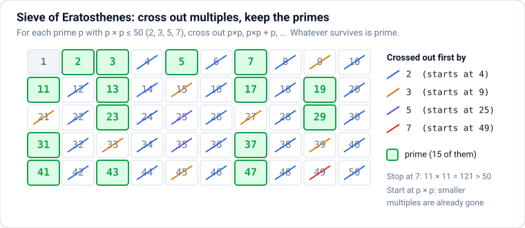

### Theory

> **In simple words:** instead of testing every number one by one, **cross out the multiples** of each prime. Whatever is never crossed out must be prime.

**Problem: find all the primes up to n.** Testing each number with `is_prime` costs up to √n rounds per number. For n = 10 million that's billions of rounds. The **Sieve of Eratosthenes** does it far faster by **crossing out** instead of testing:

1. Write down all numbers from 2 to n, all marked "maybe prime". In code that's a list of booleans: `is_prime = [True] * (n + 1)` makes n + 1 boxes that all hold `True` (multiplying a list repeats it, just like `"*" * 3` repeats a string). Box `x` answers "is x prime?"; boxes 0 and 1 are set to `False`.
2. Take the next number `p` that's still marked. It's prime, because nothing smaller divides it.
3. Cross out every multiple of p: `is_prime[m] = False` for m = p × p, p × p + p, p × p + 2p, …
4. Stop once p × p > n. Everything still marked is prime.

**Why start crossing at p × p?** Smaller multiples like 2p or 3p already have a smaller prime factor, so they were crossed out earlier. (In the picture, 3 starts at 9 because 6 was crossed out by 2.)

**Cost:** close to n steps in total (the exact figure is n × log log n, which grows extremely slowly), plus a list of n + 1 booleans. For many prime questions about numbers up to about 10⁷, build the sieve once and then answer each "is x prime?" by just reading `is_prime[x]`.

**Prime factorisation** writes a number as a product of primes: 360 = 2 × 2 × 2 × 3 × 3 × 5 = 2³ × 3² × 5. Every whole number above 1 has exactly **one** such factorisation. That fact is why primes are called the "building blocks" of numbers.

**How to factorise n** (trial division):

1. Divide by 2 as many times as you can, then by 3, then 4, 5, … (4 will never divide, because all its 2s are already gone).
2. Stop when d × d > n. Whatever is left above 1 is itself a prime factor.

That takes about √n rounds.

**What the factorisation gives you:** if n = p^a × q^b × …, then n has (a + 1) × (b + 1) × … divisors. For 360 = 2³ × 3² × 5¹: (3 + 1) × (2 + 1) × (1 + 1) = 24 divisors.

**Used in real software:** sieves are used whenever you need **all** primes in a range (number theory research, precomputed tables in competitive programming). To test one **huge** number (hundreds of digits, for cryptographic keys), real libraries use fast probabilistic tests like Miller–Rabin instead, because a sieve that big wouldn't fit in memory.

### Python

```python
def sieve(n):
    is_prime = [True] * (n + 1)          # box x answers "is x prime?"
    is_prime[0] = is_prime[1] = False
    p = 2
    while p * p <= n:
        if is_prime[p]:
            for multiple in range(p * p, n + 1, p):   # p*p, p*p + p, ...
                is_prime[multiple] = False
        p += 1
    primes = []
    for x in range(n + 1):
        if is_prime[x]:
            primes.append(x)
    return primes

print(sieve(50))
print(len(sieve(1_000_000)), "primes below one million")
```

**Output:**

```text
[2, 3, 5, 7, 11, 13, 17, 19, 23, 29, 31, 37, 41, 43, 47]
78498 primes below one million
```

```python
def prime_factors(n):
    factors = []
    d = 2
    while d * d <= n:
        while n % d == 0:                # divide out d as many times as possible
            factors.append(d)
            n //= d
        d += 1
    if n > 1:
        factors.append(n)                # what's left is a prime factor
    return factors

def count_divisors_from_factors(n):
    factors = prime_factors(n)
    total, i = 1, 0
    while i < len(factors):
        exponent = 0
        p = factors[i]
        while i < len(factors) and factors[i] == p:   # count how many times p repeats
            exponent += 1
            i += 1
        total *= exponent + 1
    return total

print(prime_factors(360), prime_factors(97), prime_factors(1001))
print(count_divisors_from_factors(360), count_divisors_from_factors(36))
```

**Output:**

```text
[2, 2, 2, 3, 3, 5] [97] [7, 11, 13]
24 9
```

**Common mistakes:**

- ❌ Making the list size `n` instead of `n + 1`: then `is_prime[n]` doesn't exist.
- ❌ Forgetting the leftover prime at the end of factorisation (`if n > 1`). Without it, 14 would give `[2]` instead of `[2, 7]`.
- ❌ Using a sieve for one huge number like 10¹². A sieve that big doesn't fit in memory; for a single number use the √n test from Section [8](#8-divisors-and-prime-numbers).

### Practice

1. Using the sieve, count the primes between 100 and 200.
2. Write `distinct_prime_factors(n)` (360 → [2, 3, 5]).
3. Write `largest_prime_factor(n)` (13195 → 29).

<details>
<summary><b>Answer</b></summary>

```python
count = 0
for p in sieve(200):
    if p >= 100:
        count += 1
print(count)

def distinct_prime_factors(n):
    result = []
    for p in prime_factors(n):
        if len(result) == 0 or result[-1] != p:   # factors come in increasing order
            result.append(p)
    return result

def largest_prime_factor(n):
    return prime_factors(n)[-1]

print(distinct_prime_factors(360), largest_prime_factor(13195))
```

**Output:**

```text
21
[2, 3, 5] 29
```

</details>

| # | LeetCode problem | Difficulty |
|---|---|---|
| 1 | [204. Count Primes](https://leetcode.com/problems/count-primes/) | 🟡 Medium |
| 2 | [2523. Closest Prime Numbers in Range](https://leetcode.com/problems/closest-prime-numbers-in-range/) | 🟡 Medium |
| 3 | [2507. Smallest Value After Replacing With Sum of Prime Factors](https://leetcode.com/problems/smallest-value-after-replacing-with-sum-of-prime-factors/) | 🟡 Medium |
| 4 | [2521. Distinct Prime Factors of Product of Array](https://leetcode.com/problems/distinct-prime-factors-of-product-of-array/) | 🟡 Medium |

**Learn & visualise:** [GeeksforGeeks: Sieve of Eratosthenes](https://www.geeksforgeeks.org/dsa/sieve-of-eratosthenes/) · [Wikipedia: Sieve of Eratosthenes](https://en.wikipedia.org/wiki/Sieve_of_Eratosthenes) (animated)

---

## 11. Maths Toolbox: Series, Factorials, Fibonacci, Powers and Modulo

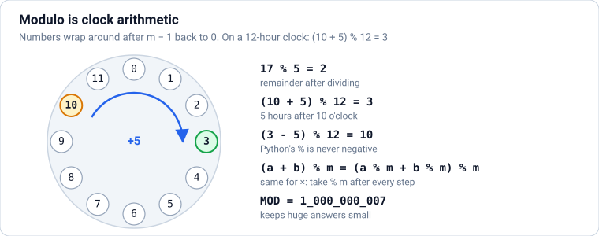

### Theory

> **In simple words:** a few formulas and tricks that replace long loops with a handful of steps: add 1 … n in one line, compute giant powers by repeated squaring, and keep huge answers small with `%`.

**1. Sums with a formula instead of a loop.** The young Gauss famously added 1 + 2 + … + 100 by pairing the ends: 1 + 100, 2 + 99, … gives 50 pairs of 101, so 5,050.

| Sum | Formula | Example |
|---|---|---|
| 1 + 2 + … + n | n(n + 1) / 2 | n = 100 → 5,050 |
| 1² + 2² + … + n² | n(n + 1)(2n + 1) / 6 | n = 3 → 14 |
| a + (a + d) + … (n terms) | n × (first + last) / 2 | 2 + 5 + 8 + 11 → 26 |
| 1 + r + r² + … + rⁿ⁻¹ | (rⁿ − 1) / (r − 1) | 1 + 2 + 4 + 8 → 15 |

A loop needs n rounds; a formula needs **one** step, however big n is. That's the first taste of a big idea: the same answer can be cheap or expensive depending on the method.

**2. Factorial.** n! = 1 × 2 × … × n, with 0! = 1. It counts the ways to arrange n things in order (3 books → 3! = 6 orders). It grows **very** fast: 10! is 3,628,800 and 20! is already 19 digits long. Python's integers never overflow, but other languages' do, which is why problems ask for "the answer modulo 10⁹ + 7" (see point 5).

**3. Fibonacci numbers:** 0, 1, 1, 2, 3, 5, 8, 13, …, where each number is the sum of the two before it. Compute them with **two variables** that slide forward: `a, b = b, a + b`. Section [14](#14-recursion-basics) shows the recursive version and why it's slow.

**4. Powers.** `x ** n` is built in. Doing it with a loop takes n multiplications, but **fast power** (exponentiation by squaring) takes only about log₂ n: to get 3¹³, note that 3¹³ = 3 × 3¹² and 3¹² = (3⁶)². Each step **halves** the exponent:

- If the exponent is odd, multiply the answer by the base once.
- Square the base and halve the exponent (`n //= 2`).

2¹⁰⁰⁰ needs about 10 rounds of this instead of 1,000 multiplications.

**5. Modular arithmetic** is "clock arithmetic" (see the picture): on a 12-hour clock, 5 hours after 10 o'clock is 3 o'clock, because (10 + 5) % 12 = 3. Problems whose answers are huge ask for them `% 1_000_000_007` (10⁹ + 7, a large prime). The rules that make this work:

- (a + b) % m = ((a % m) + (b % m)) % m
- (a × b) % m = ((a % m) × (b % m)) % m
- (a − b) % m: Python's `%` always gives a result between 0 and m − 1, even for negatives, so `(a - b) % m` just works. (In C++ and Java it can be negative; add m first.)

So you can take `% m` after **every** step and the numbers stay small. Division is the exception: it needs a "modular inverse", which is beyond this section.

Python's `pow(x, n, m)` computes xⁿ % m using fast power, and `math.factorial(n)` computes n!.

**6. A classic puzzle: trailing zeros of n!** Each trailing zero comes from a factor 10 = 2 × 5, and there are always more 2s than 5s. So count the 5s: n // 5 + n // 25 + n // 125 + … For 100!, that's 20 + 4 = 24 zeros.

**7. Counting: combinations (nCr).** "In how many ways can I choose r items from n, when order doesn't matter?" The answer is nCr = n! / (r! × (n − r)!). Choosing 2 of 4 friends: 4! / (2! × 2!) = 6. These are exactly the numbers in Pascal's triangle (Section [6](#6-pattern-printing-iii-number-and-letter-patterns)): row n, position r. Python has `math.comb(n, r)`.

**Dividing under a modulo.** When a problem asks for nCr % (10⁹ + 7), you can't just divide, because `%` doesn't mix with `/`. Instead, multiply by the **modular inverse**: the number that "undoes" multiplication mod m. For a prime m, the inverse of a is a^(m−2) % m (this follows from Fermat's little theorem), and Python 3.8+ computes it directly with `pow(a, -1, m)`. So nCr % p = n! × inverse(r!) × inverse((n − r)!) % p, with the factorials precomputed once.

**Used in real software:** **modular arithmetic** is everywhere: hash tables pick a slot with `hash % size`, round-robin load balancers send request i to server `i % n`, circular buffers wrap around with `%`, and cryptography does almost everything "mod m" with fast power (Python's `pow(x, e, m)`).

### Python

```python
def sum_to_n_loop(n):
    total = 0
    for i in range(1, n + 1):          # n rounds
        total += i
    return total

def sum_to_n_formula(n):
    return n * (n + 1) // 2             # one step

def factorial(n):
    result = 1
    for i in range(2, n + 1):
        result *= i
    return result

def fibonacci(n):
    a, b = 0, 1                         # F(0), F(1)
    for _ in range(n):
        a, b = b, a + b                 # slide the pair forward
    return a

print(sum_to_n_loop(100), sum_to_n_formula(100), sum_to_n_formula(10**9))
print(factorial(0), factorial(5), factorial(20))

fibs = []
for i in range(10):
    fibs.append(fibonacci(i))
print(fibs)
```

**Output:**

```text
5050 5050 500000000500000000
1 120 2432902008176640000
[0, 1, 1, 2, 3, 5, 8, 13, 21, 34]
```

```python
import math

MOD = 1_000_000_007

def ncr_mod(n, r, p=MOD):
    fact = [1] * (n + 1)
    for i in range(2, n + 1):
        fact[i] = fact[i - 1] * i % p
    return fact[n] * pow(fact[r], -1, p) % p * pow(fact[n - r], -1, p) % p   # multiply by inverses

print(math.comb(4, 2), math.comb(52, 5), ncr_mod(52, 5))
print(pow(3, -1, 7), 3 * pow(3, -1, 7) % 7)            # 5 is 3's inverse mod 7: 3 × 5 = 15 = 2 × 7 + 1
print(ncr_mod(100_000, 50_000))
```

**Output:**

```text
6 2598960 2598960
5 1
149033233
```

```python
def fast_power(base, exp):
    result = 1
    while exp > 0:
        if exp % 2 == 1:                # odd exponent: use one copy of the base
            result *= base
        base *= base                    # square the base ...
        exp //= 2                       # ... and halve the exponent
    return result

def fast_power_mod(base, exp, m):
    result, base = 1, base % m
    while exp > 0:
        if exp % 2 == 1:
            result = result * base % m  # take % m after every step
        base = base * base % m
        exp //= 2
    return result

def trailing_zeros_of_factorial(n):
    count, power_of_5 = 0, 5
    while power_of_5 <= n:
        count += n // power_of_5
        power_of_5 *= 5
    return count

MOD = 1_000_000_007
print(fast_power(3, 13), 3 ** 13, fast_power(2, 10))
print(fast_power_mod(2, 1000, MOD), pow(2, 1000, MOD))
print((10 + 5) % 12, (3 - 5) % 12, -7 % 3)
print(trailing_zeros_of_factorial(100), trailing_zeros_of_factorial(5))
```

**Output:**

```text
1594323 1594323 1024
688423210 688423210
3 10 2
24 1
```

**Common mistakes:**

- ❌ Using `/` in formulas: `n * (n + 1) / 2` gives a float like `5050.0`, which loses precision for huge n. Use `//`.
- ❌ Taking `% m` only at the very end. In Python that's slow for huge numbers; in other languages the number overflows long before the end.
- ❌ Starting Fibonacci wrongly: decide whether the sequence starts at F(0) = 0 or F(1) = 1, and check small cases.

### Practice

1. Write `sum_of_squares(n)` with the formula, and check it against a loop for n = 10.
2. Write `count_numbers_divisible(a, b, k)`: how many numbers from a to b are divisible by k, in one step (no loop)?
3. Write `nth_tribonacci(n)`, where each number is the sum of the three before it (0, 1, 1, 2, 4, 7, 13, …).

<details>
<summary><b>Answer</b></summary>

```python
def sum_of_squares(n):
    return n * (n + 1) * (2 * n + 1) // 6

check = 0
for i in range(1, 11):
    check += i * i

def count_numbers_divisible(a, b, k):
    return b // k - (a - 1) // k        # multiples up to b, minus multiples below a

def nth_tribonacci(n):
    a, b, c = 0, 1, 1
    for _ in range(n):
        a, b, c = b, c, a + b + c
    return a

print(sum_of_squares(10), check)
print(count_numbers_divisible(10, 30, 7), nth_tribonacci(6))
```

**Output:**

```text
385 385
3 13
```

</details>

| # | LeetCode problem | Difficulty |
|---|---|---|
| 1 | [509. Fibonacci Number](https://leetcode.com/problems/fibonacci-number/) | 🟢 Easy |
| 2 | [1137. N-th Tribonacci Number](https://leetcode.com/problems/n-th-tribonacci-number/) | 🟢 Easy |
| 3 | [2485. Find the Pivot Integer](https://leetcode.com/problems/find-the-pivot-integer/) | 🟢 Easy |
| 4 | [1523. Count Odd Numbers in an Interval Range](https://leetcode.com/problems/count-odd-numbers-in-an-interval-range/) | 🟢 Easy |
| 5 | [172. Factorial Trailing Zeroes](https://leetcode.com/problems/factorial-trailing-zeroes/) | 🟡 Medium |
| 6 | [50. Pow(x, n)](https://leetcode.com/problems/powx-n/) | 🟡 Medium |

**Learn more:** [GeeksforGeeks: Modular arithmetic](https://www.geeksforgeeks.org/engineering-mathematics/modular-arithmetic/) · [GeeksforGeeks: Binary exponentiation](https://www.geeksforgeeks.org/dsa/binary-exponentiation-for-competitive-programming/)

---

## 12. Number Systems: Decimal and Binary

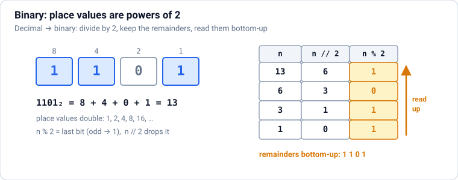

### Theory

> **In simple words:** binary is counting with only two digits, 0 and 1. Each place is worth double the place to its right (1, 2, 4, 8, …), just as each decimal place is worth ten times more.

**Decimal** (base 10) uses the digits 0–9, and each place is worth 10 times the place to its right: 507 = 5 × 100 + 0 × 10 + 7 × 1.

**Binary** (base 2) uses only 0 and 1, and each place is worth **2 times** the place to its right: 1, 2, 4, 8, 16, 32, … So 1101 in binary is 1 × 8 + 1 × 4 + 0 × 2 + 1 × 1 = 13. Computers store everything in binary because a circuit is either off (0) or on (1). One binary digit is a **bit**, and 8 bits make a **byte** (values 0 to 255).

**Decimal → binary** is the digits trick from Section [7](#7-working-with-digits) with 2 instead of 10:

- `n % 2` is the **last bit** (0 for even numbers, 1 for odd numbers);
- `n // 2` drops that bit.

Repeat until n is 0, then read the remainders **backwards** (the first remainder is the rightmost bit). 13 → remainders 1, 0, 1, 1 → read backwards: 1101.

**Binary → decimal** is the "build a number" trick: `value = value * 2 + bit` for each bit from left to right. For 1101: 0 → 1 → 3 → 6 → 13.

**The same method works for any base b:** use `% b` and `// b`. Base 16 (**hexadecimal**) uses the digits 0–9 and then A–F for 10–15; programmers use it for colours (`#FF0000` is red) and memory addresses.

**Facts worth knowing:**

- A number n has about log₂ n bits: 1,000 needs 10 bits and 1,000,000 needs 20. Dividing by 2 repeatedly takes about log₂ n steps, the same way digit loops take about log₁₀ n steps.
- Powers of two are a 1 followed by zeros in binary: 8 = 1000, 16 = 10000.
- Python's built-ins: `bin(13)` is `"0b1101"`, `int("1101", 2)` is 13, and `hex(255)` is `"0xff"`.

Section [51](#51-bit-manipulation) builds on this with **bitwise operators**, which work on all the bits of a number at once.

**Used in real software:** IP addresses and **subnet masks** (`255.255.255.0` is 24 ones followed by 8 zeros), web **colours** in hexadecimal (`#FF8800`), Unix **file permissions** (`chmod 755` is the bits rwx r-x r-x), and every file, image and message on a computer, which is ultimately stored as bits.

### Python

```python
def to_binary(n):
    if n == 0:
        return "0"
    bits = ""
    while n > 0:
        bits = str(n % 2) + bits       # put the new bit on the LEFT
        n //= 2
    return bits

def from_binary(bits):
    value = 0
    for b in bits:
        value = value * 2 + int(b)     # shift left, add the new bit
    return value

def to_base(n, base):
    digits = "0123456789ABCDEF"
    if n == 0:
        return "0"
    result = ""
    while n > 0:
        result = digits[n % base] + result
        n //= base
    return result

print(to_binary(13), to_binary(8), to_binary(255))
print(from_binary("1101"), from_binary("11111111"))
print(to_base(255, 16), to_base(100, 8), to_base(13, 2))
print(bin(13), int("1101", 2), hex(255))
```

**Output:**

```text
1101 1000 11111111
13 255
FF 144 1101
0b1101 13 0xff
```

```python
def count_ones(n):
    count = 0
    while n > 0:
        count += n % 2                 # add the last bit (0 or 1)
        n //= 2
    return count

def is_power_of_two(n):
    if n <= 0:
        return False
    while n % 2 == 0:
        n //= 2                        # strip trailing zero bits
    return n == 1

print(count_ones(13), count_ones(255))
print(is_power_of_two(64), is_power_of_two(96), is_power_of_two(1))
```

**Output:**

```text
3 8
True False True
```

**Common mistakes:**

- ❌ Reading the remainders in the order you got them. The first remainder is the **rightmost** bit.
- ❌ Forgetting the `n == 0` case, which returns an empty string.
- ❌ Confusing `bin(13)` (a string with a `0b` prefix) with the number itself.

### Practice

1. Convert 45 to binary by hand, then check with `to_binary`.
2. Write `binary_length(n)`: how many bits n has (13 → 4).
3. Write `add_binary(a, b)` for two binary strings, by converting to numbers and back.

<details>
<summary><b>Answer</b></summary>

```python
def binary_length(n):
    length = 0
    while n > 0:
        n //= 2
        length += 1
    return max(length, 1)              # 0 still needs one bit

def add_binary(a, b):
    return to_binary(from_binary(a) + from_binary(b))

print(to_binary(45), binary_length(13), binary_length(1024))
print(add_binary("1011", "110"))
```

**Output:**

```text
101101 4 11
10001
```

</details>

| # | LeetCode problem | Difficulty |
|---|---|---|
| 1 | [504. Base 7](https://leetcode.com/problems/base-7/) | 🟢 Easy |
| 2 | [231. Power of Two](https://leetcode.com/problems/power-of-two/) | 🟢 Easy |
| 3 | [191. Number of 1 Bits](https://leetcode.com/problems/number-of-1-bits/) | 🟢 Easy |
| 4 | [1009. Complement of Base 10 Integer](https://leetcode.com/problems/complement-of-base-10-integer/) | 🟢 Easy |
| 5 | [67. Add Binary](https://leetcode.com/problems/add-binary/) | 🟢 Easy |
| 6 | [405. Convert a Number to Hexadecimal](https://leetcode.com/problems/convert-a-number-to-hexadecimal/) | 🟢 Easy |

**Learn more:** [Math is Fun: Binary numbers](https://www.mathsisfun.com/binary-number-system.html) · [Wikipedia: Binary number](https://en.wikipedia.org/wiki/Binary_number)

---

### ✅ Part 2 checkpoint

Without looking, can you:

- [ ] Reverse a number and check if it's a palindrome using only `%` and `//`?
- [ ] Explain why checking divisors only up to √n is enough, and write `is_prime` that way?
- [ ] Run Euclid's algorithm by hand on (84, 36), and get the LCM from the GCD?
- [ ] Write the Sieve of Eratosthenes and prime factorisation from memory?
- [ ] Compute 1 + 2 + … + n without a loop, and xⁿ % m with fast power?
- [ ] Convert 37 to binary and back by hand?

You've now seen that the **same answer** can take n steps, √n steps, log n steps or 1 step depending on the method. Part 3 starts by giving that idea a name: Big-O.

---

# Part 3 — Easy: Core Data Structures and Algorithms

> **Goal:** Measure speed with Big-O, think recursively, and master Python's four built-in structures (list, str, dict, set) with sorting and searching.  
> **You need:** Parts 1 and 2.

---

## 13. Big-O: How Fast Is My Code?

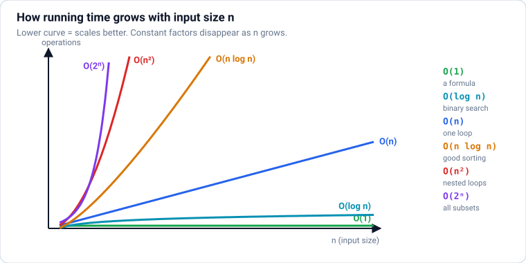

### Theory

> **In simple words:** Big-O answers one question: **if the input gets 10 times bigger, how much slower does my code get?** Not at all (O(1)), a little (O(log n)), 10 times (O(n)), or 100 times (O(n²))?

In Part 2 you solved the same problem in very different amounts of work:

| Problem | Slow method | Fast method |
|---|---|---|
| Sum 1 + 2 + … + n | A loop: n steps | Gauss's formula: 1 step |
| Is n prime? | Try every divisor: n steps | Stop at √n: √n steps |
| GCD of a and b | Try every number: up to min(a, b) steps | Euclid: a few dozen steps at most |
| xⁿ | Multiply n times | Fast power: about log₂ n steps |

We compare algorithms by **how the number of steps grows as the input grows**, not by seconds, because seconds depend on the computer. **Big-O** is the name for that growth. "The loop is O(n)" means "the work grows in proportion to n: double n, double the work".

**How to work out the Big-O of code you've written:**

| You see… | Steps | Big-O | Name |
|---|---|---|---|
| A formula, or a fixed number of lines, no loop depending on n | Same for every n | O(1) | Constant |
| `n` halves each round (`n //= 2`), or a loop over the digits of n | About log₂ n | O(log n) | Logarithmic |
| `while d * d <= n` | About √n | O(√n) | Square root |
| One loop over n items | n | O(n) | Linear |
| A loop inside a loop, both over n (the square pattern) | n × n | O(n²) | Quadratic |
| Trying every subset of n items (Section [47](#47-backtracking)) | 2ⁿ | O(2ⁿ) | Exponential |

What **log n** means in practice: the number of times you can halve n before reaching 1. It grows incredibly slowly: log₂ of a thousand is about 10, of a million about 20, of a billion about 30.

**The rules:**

1. **Keep only the fastest-growing part.** 3n + 10 steps → O(n); n² + n → O(n²). For large n, the biggest term swamps the rest.
2. **Drop constant factors.** 2n and n/2 are both O(n). Big-O describes the *shape* of the growth.
3. **Steps one after another add:** a loop over n, then a loop over m → O(n + m).
4. **Loops inside loops multiply:** n rounds, each doing m rounds → O(n × m).
5. **A triangle is still a square:** an inner loop that runs `i` times (like the right-triangle pattern) does 1 + 2 + … + n = n(n + 1)/2 steps in total, which is O(n²).

**Why it matters:** Python does roughly 10 million simple steps per second. So for n = 1,000,000:

| Big-O | Steps | Time |
|---|---|---|
| O(log n) | 20 | Instant |
| O(n) | 1,000,000 | About 0.1 s |
| O(n²) | 10¹² | About a day |

That's why interview problems state the input size: with n up to 10⁵ or more, an O(n²) solution is too slow, and you need O(n) or O(n log n).

**Space complexity** counts **extra memory** in the same way. A few variables are O(1); building a list of n items is O(n); the sieve's list of n + 1 booleans is O(n).

**Best, worst and average case.** Searching a list for a value might find it at the first position (1 step) or the last (n steps). Big-O usually means the **worst case** unless you say otherwise.

**Used in real software:** engineers use Big-O to predict whether a feature will survive growth: code that's fine with 1,000 users can collapse at 1,000,000 if it's O(n²). Real code also cares about **constant factors and memory access**: two O(n) solutions can differ 10× in speed because one reads memory in order (cache-friendly) and the other jumps around. So measure with a profiler (`python -m cProfile`) before optimising.

### Python

From this section on, short results are shown as comments: `count_steps(16)  # → ...` means the expression gives that value.

```python
def count_steps(n):
    log_steps = sqrt_steps = linear_steps = quadratic_steps = 0
    i = n
    while i > 1:                                   # O(log n): i halves every time
        i //= 2
        log_steps += 1
    d = 1
    while d * d <= n:                              # O(√n)
        d += 1
        sqrt_steps += 1
    for _ in range(n):                             # O(n)
        linear_steps += 1
    for _ in range(n):                             # O(n²): a loop inside a loop
        for _ in range(n):
            quadratic_steps += 1
    return log_steps, sqrt_steps, linear_steps, quadratic_steps

count_steps(16)    # → (4, 4, 16, 256)
count_steps(64)    # → (6, 8, 64, 4096)
```

Multiplying n by 4 (16 → 64): the log count grows by 2, √n doubles, the linear count grows 4 times, and the quadratic count grows **16 times**.

```python
def triangle_steps(n):
    steps = 0
    for i in range(1, n + 1):
        for j in range(i):                          # the right-triangle pattern
            steps += 1
    return steps

triangle_steps(100), 100 * 101 // 2                 # → (5050, 5050)
```

About half of n², but still O(n²): doubling n makes it about 4 times slower.

**Common mistakes:**

- ❌ Thinking that two loops always mean O(n²). Two loops **one after the other** are O(n + n) = O(n). Only **nested** loops multiply.
- ❌ Forgetting hidden loops. A single line can loop: `x in some_list` checks items one by one (O(n)), and so do `sum`, `max`, `min` and `list.count`. Section [20](#20-pythons-cost-model-what-each-operation-costs) lists these costs.
- ❌ Counting seconds instead of steps. Timing depends on the computer; growth doesn't.

### Practice

What is the Big-O of each snippet?

```text
a)  for i in range(n):          b)  i = 1                c)  for i in range(n):
        print(i)                    while i < n:                 for j in range(i, n):
    for j in range(n):                  i *= 2                       print(i, j)
        print(j)

d)  total = n * (n + 1) // 2    e)  for i in range(n):          f)  d = 2
                                        for j in range(5):          while d * d <= n:
                                            print(i, j)                 d += 1
```

<details>
<summary><b>Answer</b></summary>

- a) O(n): two loops one after the other, n + n steps.
- b) O(log n): i doubles each round, so it reaches n in about log₂ n rounds.
- c) O(n²): n + (n − 1) + … + 1 = n(n + 1)/2 steps.
- d) O(1): a formula, no loop.
- e) O(n): the inner loop is a constant 5, so there are 5n steps in total.
- f) O(√n).

</details>

| # | LeetCode problem | Difficulty |
|---|---|---|
| 1 | [1523. Count Odd Numbers in an Interval Range](https://leetcode.com/problems/count-odd-numbers-in-an-interval-range/) (an O(1) answer beats a loop) | 🟢 Easy |
| 2 | [367. Valid Perfect Square](https://leetcode.com/problems/valid-perfect-square/) (O(√n) works; Section [18](#18-searching-linear-search-and-binary-search) gets O(log n)) | 🟢 Easy |
| 3 | [2119. A Number After a Double Reversal](https://leetcode.com/problems/a-number-after-a-double-reversal/) (O(1) once you spot the rule) | 🟢 Easy |

**Learn & visualise:** [GeeksforGeeks: Analysis of Algorithms](https://www.geeksforgeeks.org/dsa/analysis-of-algorithms/) · [Big-O Cheat Sheet](https://www.bigocheatsheet.com/)

---

## 14. Recursion Basics

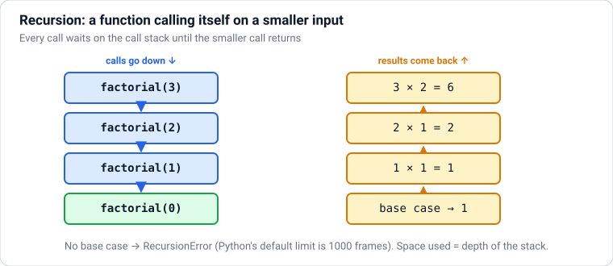

### Theory

> **In simple words:** a recursive function solves a big problem by asking **itself** to solve a smaller copy of the same problem, until the problem is so small the answer is obvious.

A **recursive** function is a function that **calls itself** on a **smaller version** of the same problem.

**An everyday example:** you're in a long queue and want to know your position. You ask the person in front, "What's your position?" They ask the person in front of them, and so on, until the person at the very front says "1" because nobody is ahead of them. Then each answer travels back: "2", "3", …, and you add 1 to the answer you receive. That's recursion:

- **Base case:** the person at the front answers directly, without asking anyone. Without a base case, the questions never stop.
- **Recursive case:** everyone else asks a **smaller** version of the question (the queue in front of them is shorter) and adds 1 to the answer.

**How to write a recursive function:**

1. **Base case:** what's the smallest input, and its answer? (n = 0, an empty list, a single character.)
2. **Recursive case:** how does the answer for n follow from the answer for a smaller input? For factorial, n! = n × (n − 1)!.
3. **Trust it** (the "leap of faith"): assume the smaller call returns the right answer. Don't try to trace every level in your head; check the base case and one step instead.

**The call stack.** Every call that hasn't finished waits in memory, stacked on top of the call that made it (see the picture). A recursive function runs in **two phases**:

- **Going down** (winding): calls are made, each on a smaller input, until the base case.
- **Coming back** (unwinding): answers return upwards, one level at a time.

Code written **before** the recursive call runs on the way down; code written **after** it runs on the way back. That's why `count_up` below prints 1, 2, 3 even though it's called with 3 first.

**Limits and costs:**

- Every waiting call uses memory, so recursion depth d costs O(d) space. Python stops at about 1,000 levels with a `RecursionError`. For deep problems, use a loop.
- **Time** = (number of calls) × (work per call). `factorial(n)` makes n calls: O(n).
- A function that calls itself **twice**, like the naive Fibonacci below, makes about 2ⁿ calls, and most of them repeat work already done. Section [49](#49-dynamic-programming) (dynamic programming) fixes that by remembering answers.
- Anything recursive can be written with a loop, and the other way round. Recursion shines when a problem **branches** into several smaller problems of the same kind, which you'll meet with merge sort, trees and graphs later.

**Used in real software:** anything **nested** is naturally recursive: folders inside folders (walking a file system), JSON and HTML documents (objects inside objects), comments with replies to replies, and the parsers inside compilers and browsers.

### Python

```python
def count_down(n):
    if n == 0:                    # base case
        return
    print(n, end=" ")             # before the call: runs on the way DOWN
    count_down(n - 1)

def count_up(n):
    if n == 0:
        return
    count_up(n - 1)
    print(n, end=" ")             # after the call: runs on the way BACK

count_down(3)
print()
count_up(3)
print()
```

**Output:**

```text
3 2 1
1 2 3
```

```python
def sum_to(n):
    if n == 0:
        return 0
    return n + sum_to(n - 1)                   # sum(1..n) = n + sum(1..n-1)

def factorial(n):
    if n <= 1:                                 # base case
        return 1
    return n * factorial(n - 1)                # smaller problem, then combine

def sum_digits(n):
    if n < 10:
        return n                               # one digit left
    return n % 10 + sum_digits(n // 10)        # last digit + the rest

def gcd(a, b):
    if b == 0:
        return a
    return gcd(b, a % b)                       # Euclid, written recursively

def power(x, n):
    """Fast power, recursively: x^n = (x^(n//2))², times x if n is odd."""
    if n == 0:
        return 1
    half = power(x, n // 2)
    if n % 2 == 0:
        return half * half
    return half * half * x

sum_to(100), factorial(5), sum_digits(9045)    # → (5050, 120, 18)
gcd(48, 18), power(2, 10), power(3, 13)        # → (6, 1024, 1594323)
```

```python
def is_palindrome(s, lo, hi):
    """Check s[lo..hi] by comparing the two ends, then the part inside them."""
    if lo >= hi:
        return True                            # 0 or 1 characters left
    if s[lo] != s[hi]:
        return False
    return is_palindrome(s, lo + 1, hi - 1)

def reverse_list(nums, lo, hi):
    """Reverse nums[lo..hi] in place: swap the ends, then reverse the inside."""
    if lo >= hi:
        return
    nums[lo], nums[hi] = nums[hi], nums[lo]
    reverse_list(nums, lo + 1, hi - 1)

word = "racecar"
is_palindrome(word, 0, len(word) - 1)          # → True
is_palindrome("robot", 0, 4)                   # → False
nums = [1, 2, 3, 4, 5]
reverse_list(nums, 0, len(nums) - 1)
nums                                           # → [5, 4, 3, 2, 1]
```

```python
calls = [0]                     # a one-item list, so the function can update the count

def fib(n):
    calls[0] += 1
    if n <= 1:
        return n
    return fib(n - 1) + fib(n - 2)      # two recursive calls: the work explodes

fib(10), calls[0]                        # → (55, 177)
calls[0] = 0
fib(20), calls[0]                        # → (6765, 21891)
```

Going from n = 10 to n = 20 multiplied the calls by more than 100. The loop version from Section [11](#11-maths-toolbox-series-factorials-fibonacci-powers-and-modulo) needs just 20 rounds. Recursion is elegant, but always check how many calls it makes.

**Common mistakes:**

- ❌ No base case, or one the input never reaches (like `n == 0` when n goes 5, 3, 1, −1, …): `RecursionError`.
- ❌ The recursive call doesn't get smaller: `f(n)` calling `f(n)`.
- ❌ Forgetting `return` before the recursive call, so the answer is thrown away and the function returns `None`.

### Practice

1. Write `print_name(name, n)` that prints a name n times, recursively.
2. Write `count_digits(n)` recursively.
3. Write `list_sum(nums, i)`: the sum of the items from index i to the end of the list, recursively.

<details>
<summary><b>Answer</b></summary>

```python
def print_name(name, n):
    if n == 0:
        return
    print(name)
    print_name(name, n - 1)

def count_digits(n):
    if n < 10:
        return 1
    return 1 + count_digits(n // 10)

def list_sum(nums, i):
    if i == len(nums):
        return 0                       # no items left
    return nums[i] + list_sum(nums, i + 1)

print_name("Asha", 2)
print(count_digits(90210), list_sum([3, 1, 4, 1, 5], 0))
```

**Output:**

```text
Asha
Asha
5 14
```

</details>

| # | LeetCode problem | Difficulty |
|---|---|---|
| 1 | [509. Fibonacci Number](https://leetcode.com/problems/fibonacci-number/) | 🟢 Easy |
| 2 | [344. Reverse String](https://leetcode.com/problems/reverse-string/) | 🟢 Easy |
| 3 | [231. Power of Two](https://leetcode.com/problems/power-of-two/) | 🟢 Easy |
| 4 | [326. Power of Three](https://leetcode.com/problems/power-of-three/) | 🟢 Easy |
| 5 | [50. Pow(x, n)](https://leetcode.com/problems/powx-n/) | 🟡 Medium |
| 6 | [779. K-th Symbol in Grammar](https://leetcode.com/problems/k-th-symbol-in-grammar/) | 🟡 Medium |

**Learn & visualise:** [GeeksforGeeks: Recursion](https://www.geeksforgeeks.org/dsa/recursion-algorithms/) · [VisuAlgo: Recursion Tree](https://visualgo.net/en/recursion) · [Python Tutor](https://pythontutor.com/visualize.html) (watch the call stack grow and shrink)

---

## 15. Arrays and Python Lists


### Theory

> **In simple words:** an array is a row of numbered lockers, side by side. Because they're side by side, you can walk straight to locker number i without opening the others.

An **array** is the simplest data structure: a row of boxes **side by side in memory**, numbered from 0. Python's version is the **list**, which you've used since Section [2](#2-python-basics-values-variables-decisions-and-functions).

**Why reading `a[i]` is instant (O(1)).** Because the boxes sit next to each other, the computer finds box i with one calculation, *start address + i × box size*, instead of walking along the row. That's the defining strength of arrays.

**Why adding at the end is (almost always) instant.** A Python list keeps some spare empty boxes at its end. `append` fills the next spare box. When the spares run out, Python moves the whole list to a new block about 1.1–2 times bigger, which costs O(n) that once, but it happens so rarely that the **average** cost per append stays O(1). This is called **amortised O(1)**.

**Why inserting at the front is slow (O(n)).** Every item after the insertion point has to shift one box to the right to make room. Deleting from the front shifts everything left.

| Operation | Code | Cost | Why |
|---|---|---|---|
| Read or write | `a[i]`, `a[i] = x` | O(1) | Address arithmetic |
| Add or remove at the end | `a.append(x)`, `a.pop()` | O(1) amortised | Spare room at the end |
| Insert or remove elsewhere | `a.insert(i, x)`, `a.pop(i)` | O(n) | Items after i shift |
| Search for a value | `x in a`, `a.index(x)`, `a.count(x)` | O(n) | Checks items one by one |
| Length | `len(a)` | O(1) | Stored with the list |
| Sum, max, min | `sum(a)`, `max(a)`, `min(a)` | O(n) | Visits every item |
| Slice (copy a part) | `a[i:j]` | O(j − i) | Copies that many items |

**Slicing** makes a copy of part of a list: `a[1:4]` is the items at indexes 1, 2 and 3 (the end index is excluded, like `range`); `a[:3]` is the first three; `a[2:]` is everything from index 2; and `a[::-1]` is the whole list reversed.

**List comprehensions** are a short way to write "build a list with a loop":

```text
squares = []                         squares = [x * x for x in range(5)]
for x in range(5):          ⇄
    squares.append(x * x)            evens = [x for x in nums if x % 2 == 0]
```

Read `[x * x for x in range(5)]` as "x × x, for each x in range(5)". An `if` at the end keeps only the items that pass.

**2D lists (grids and matrices)** are lists of lists: `grid[r][c]` is row r, column c. Create them with a comprehension, `[[0] * cols for _ in range(rows)]`. **Never** use `[[0] * cols] * rows`: that repeats the **same** inner list, so changing one row changes them all (shown below).

**The basic techniques for array problems:**

1. **One pass with a "best so far"** variable: maximum, second maximum, count, sum.
2. **Two indexes moving towards each other** from both ends: reversing, palindromes.
3. **A read index and a write index:** the read index visits every item; the write index marks where the next item you keep should go. It removes or compacts items in place, without a second list.
4. **Reverse parts of the list** to rotate it in place.

Section [22](#22-two-pointers) turns techniques 2 and 3 into a general method.

**Used in real software:** **NumPy** arrays and the tensors in machine-learning libraries are contiguous arrays (which is why they're so fast), images are 2D arrays of pixels, audio is a 1D array of samples, and CPU caches load neighbouring memory together, so looping through an array in order is far faster than jumping around (for example, following linked-list pointers).

### Python

```python
a = [10, 20, 30, 40, 50]
a[0], a[-1], len(a)                  # → (10, 50, 5)
a[1:4], a[:2], a[3:], a[::-1]        # → ([20, 30, 40], [10, 20], [40, 50], [50, 40, 30, 20, 10])
a.append(60)
a.insert(0, 5)                       # O(n): everything shifts right
a                                    # → [5, 10, 20, 30, 40, 50, 60]
a.pop(), a.pop(0), a                 # → (60, 5, [10, 20, 30, 40, 50])
30 in a, a.index(30), sum(a), max(a) # → (True, 2, 150, 50)
[x * x for x in range(6)]            # → [0, 1, 4, 9, 16, 25]
[x for x in [7, 2, 9, 4] if x > 3]   # → [7, 9, 4]
```

```python
def largest(nums):
    best = nums[0]
    for x in nums:
        if x > best:
            best = x
    return best

def second_largest(nums):
    """Largest value strictly smaller than the maximum, in one pass; None if there isn't one."""
    first = second = None
    for x in nums:
        if first is None or x > first:
            first, second = x, first          # the old best becomes second
        elif x != first and (second is None or x > second):
            second = x
    return second

def is_sorted(nums):
    for i in range(1, len(nums)):
        if nums[i] < nums[i - 1]:             # a step down: not sorted
            return False
    return True

def reverse_in_place(nums):
    lo, hi = 0, len(nums) - 1                 # two indexes moving towards each other
    while lo < hi:
        nums[lo], nums[hi] = nums[hi], nums[lo]
        lo, hi = lo + 1, hi - 1
    return nums

largest([3, 9, 2, 9, 7]), second_largest([3, 9, 2, 9, 7]), second_largest([5, 5])   # → (9, 7, None)
is_sorted([1, 2, 2, 5]), is_sorted([1, 3, 2])        # → (True, False)
reverse_in_place([1, 2, 3, 4, 5])                    # → [5, 4, 3, 2, 1]
```

`x is None` checks whether a variable holds `None`, Python's value for "nothing yet".

```python
def move_zeroes(nums):
    """Keep the order of non-zero items, push zeros to the end: read/write indexes, O(n)."""
    write = 0
    for read in range(len(nums)):
        if nums[read] != 0:
            nums[write] = nums[read]
            write += 1
    for i in range(write, len(nums)):
        nums[i] = 0
    return nums

def remove_duplicates_sorted(nums):
    """Compact a sorted list in place; return the count of unique values (O(n) time, O(1) space)."""
    write = 0
    for read in range(len(nums)):
        if read == 0 or nums[read] != nums[read - 1]:
            nums[write] = nums[read]
            write += 1
    return write

def rotate_right(nums, k):
    """Rotate in place by reversing three ranges: O(n) time, O(1) space."""
    def reverse(lo, hi):
        while lo < hi:
            nums[lo], nums[hi] = nums[hi], nums[lo]
            lo, hi = lo + 1, hi - 1
    n = len(nums)
    k %= n                                    # rotating by n changes nothing
    reverse(0, n - 1)
    reverse(0, k - 1)
    reverse(k, n - 1)
    return nums

move_zeroes([0, 1, 0, 3, 12])                  # → [1, 3, 12, 0, 0]
nums = [1, 1, 2, 3, 3, 3, 4]
k = remove_duplicates_sorted(nums)
k, nums[:k]                                    # → (4, [1, 2, 3, 4])
rotate_right([1, 2, 3, 4, 5, 6, 7], 3)         # → [5, 6, 7, 1, 2, 3, 4]
```

A function defined inside another function (like `reverse` inside `rotate_right`) can use the outer function's variables, here `nums`.

```python
rows, cols = 2, 3
good = [[0] * cols for _ in range(rows)]      # a new inner list for every row
bad = [[0] * cols] * rows                     # the SAME inner list, twice
good[0][0] = 1
bad[0][0] = 1
good, bad                                     # → ([[1, 0, 0], [0, 0, 0]], [[1, 0, 0], [1, 0, 0]])

grid = [[1, 2, 3],
        [4, 5, 6]]
[sum(row) for row in grid]                    # → [6, 15]
[[grid[r][c] for r in range(2)] for c in range(3)]   # → [[1, 4], [2, 5], [3, 6]]
```

The last line is the **transpose**: rows become columns.

**Common mistakes:**

- ❌ `IndexError`: the last index is `len(a) - 1`, not `len(a)`.
- ❌ `x in a` or `a.insert(0, x)` inside a loop: each is O(n), so the loop becomes O(n²).
- ❌ `b = a` does **not** copy a list; both names refer to the same list. Copy with `b = a[:]` or `b = list(a)`.
- ❌ `[[0] * cols] * rows` for a grid (see above).

### Practice

| # | LeetCode problem | Difficulty |
|---|---|---|
| 1 | [1929. Concatenation of Array](https://leetcode.com/problems/concatenation-of-array/) | 🟢 Easy |
| 2 | [485. Max Consecutive Ones](https://leetcode.com/problems/max-consecutive-ones/) | 🟢 Easy |
| 3 | [414. Third Maximum Number](https://leetcode.com/problems/third-maximum-number/) | 🟢 Easy |
| 4 | [1752. Check if Array Is Sorted and Rotated](https://leetcode.com/problems/check-if-array-is-sorted-and-rotated/) | 🟢 Easy |
| 5 | [26. Remove Duplicates from Sorted Array](https://leetcode.com/problems/remove-duplicates-from-sorted-array/) | 🟢 Easy |
| 6 | [283. Move Zeroes](https://leetcode.com/problems/move-zeroes/) | 🟢 Easy |
| 7 | [867. Transpose Matrix](https://leetcode.com/problems/transpose-matrix/) | 🟢 Easy |
| 8 | [189. Rotate Array](https://leetcode.com/problems/rotate-array/) | 🟡 Medium |
| 9 | [238. Product of Array Except Self](https://leetcode.com/problems/product-of-array-except-self/) | 🟡 Medium |

**Learn & visualise:** [GeeksforGeeks: Arrays](https://www.geeksforgeeks.org/dsa/array-data-structure-guide/) · [VisuAlgo: Array](https://visualgo.net/en/array)

---

## 16. Strings

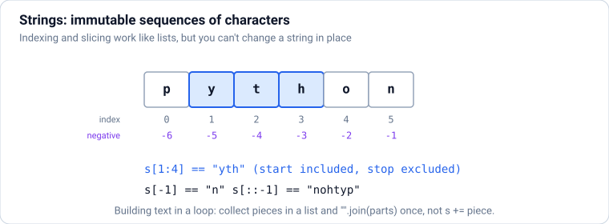

### Theory

> **In simple words:** a string is a row of characters, like a list you can read but not change. Every "change" builds a new string.

A **string** (`str`) is a sequence of characters. Indexing, negative indexes, slicing, `len` and `for ch in s` all work exactly like lists (Section [15](#15-arrays-and-python-lists)): `"python"[0]` is `"p"`, `"python"[-1]` is `"n"`, and `"python"[1:4]` is `"yth"`.

**The big difference: strings are immutable** (they can't be changed). `s[0] = "P"` is an error. Every "change" builds a **new** string instead: `s = "P" + s[1:]`.

- That's why `s += piece` inside a loop can be slow: each `+=` may copy the whole string built so far, which makes the loop O(n²) in the worst case.
- ✅ Instead, collect the pieces in a list and join them once at the end: `"".join(pieces)` glues a list of strings together, and `"-".join(["a", "b"])` is `"a-b"`.

**Characters are numbers.** Every character has a code (its **ASCII** or **Unicode** number): `ord("a")` is 97 and `chr(97)` is `"a"`. The letters are consecutive, so:

| Codes | Characters |
|---|---|
| 48–57 | `"0"` … `"9"` |
| 65–90 | `"A"` … `"Z"` |
| 97–122 | `"a"` … `"z"` |

- `ord(c) - ord("a")` turns a lowercase letter into 0–25 (a → 0, z → 25): perfect as a **list index**.
- Lowercase and uppercase differ by 32: `chr(ord("A") + 32)` is `"a"`.

**Counting characters with a list of 26.** Make `count = [0] * 26` and do `count[ord(c) - ord("a")] += 1` for each letter. Two words are **anagrams** (same letters, different order, like "listen" and "silent") exactly when their count lists are equal. Section [19](#19-hashing-dictionaries-and-sets) generalises this with dictionaries.

**Useful string methods** (each is O(n)):

| Method | Example | Result |
|---|---|---|
| `s.lower()`, `s.upper()` | `"Hi".lower()` | `"hi"` |
| `s.isalpha()`, `s.isdigit()`, `s.isalnum()` | `"a1".isalnum()` | `True` (letters or digits only) |
| `s.split()` | `"a b  c".split()` | `["a", "b", "c"]` (splits on spaces) |
| `s.strip()` | `"  hi ".strip()` | `"hi"` (trims spaces at both ends) |
| `s.replace(a, b)` | `"a-b".replace("-", "+")` | `"a+b"` |
| `s.find(t)` | `"hello".find("l")` | `2` (−1 if not found) |
| `s.startswith(t)` | `"python".startswith("py")` | `True` |

**Classic string techniques:**

- **Two ends moving inwards** for palindromes (you wrote this recursively in Section [14](#14-recursion-basics)).
- **Counting** for anagrams and "which character appears most".
- **Scanning runs** of equal characters, with a `while` loop that skips ahead.
- **Shifting letters with `%`**: a Caesar cipher moves each letter k places and wraps z → a using `% 26`, exactly like the clock in Section [11](#11-maths-toolbox-series-factorials-fibonacci-powers-and-modulo).

**Used in real software:** search boxes, text editors, log processing, and every web page. **Unicode** matters in modern apps: a Python `str` stores Unicode characters, so `len("naïve")` is 5 and emojis work; when text is saved or sent over a network it's encoded to bytes, almost always as **UTF-8** (`"é".encode()` gives 2 bytes).

### Python

```python
s = "Hello World"
len(s), s[0], s[-1], s[6:], s[::-1]          # → (11, "H", "d", "World", "dlroW olleH")
s.lower(), s.split(), "-".join(["a", "b", "c"])   # → ("hello world", ["Hello", "World"], "a-b-c")
ord("a"), chr(98), ord("z") - ord("a")       # → (97, "b", 25)

def count_vowels(s):
    count = 0
    for ch in s.lower():
        if ch in "aeiou":                    # `in` also searches inside a string
            count += 1
    return count

def reverse_words(sentence):
    return " ".join(sentence.split()[::-1])

count_vowels("Data Structures")              # → 5
reverse_words("  the sky   is blue ")        # → "blue is sky the"
```

```python
def letter_counts(s):
    count = [0] * 26
    for ch in s:
        count[ord(ch) - ord("a")] += 1       # a → box 0, b → box 1, ...
    return count

def is_anagram(a, b):                        # O(n), lowercase letters
    return letter_counts(a) == letter_counts(b)

def is_palindrome(s):                        # ignore case and non-alphanumerics, O(n)
    lo, hi = 0, len(s) - 1
    while lo < hi:
        if not s[lo].isalnum():
            lo += 1
        elif not s[hi].isalnum():
            hi -= 1
        elif s[lo].lower() != s[hi].lower():
            return False
        else:
            lo, hi = lo + 1, hi - 1
    return True

is_anagram("listen", "silent"), is_anagram("rat", "car")   # → (True, False)
is_palindrome("A man, a plan, a canal: Panama")            # → True
letter_counts("banana")[:3]                                # → [3, 1, 0]
```

```python
def compress(s):                             # "aaabcc" → "a3b1c2", built with join
    out, i = [], 0
    while i < len(s):
        j = i
        while j < len(s) and s[j] == s[i]:   # scan the run of equal characters
            j += 1
        out.append(f"{s[i]}{j - i}")
        i = j
    return "".join(out)

def caesar(s, k):
    out = []
    for ch in s:
        if "a" <= ch <= "z":
            out.append(chr((ord(ch) - ord("a") + k) % 26 + ord("a")))   # wrap z → a
        else:
            out.append(ch)
    return "".join(out)

compress("aaabcc")                           # → "a3b1c2"
caesar("hello, zebra", 3)                    # → "khoor, cheud"
caesar(caesar("hello", 3), -3)               # → "hello"
```

**Common mistakes:**

- ❌ Trying to change a character with `s[i] = ...`. Build a new string (or work on `list(s)` and join it back).
- ❌ `s += ...` inside a long loop. Collect pieces in a list and `"".join` them once.
- ❌ Forgetting that `"A" != "a"`. Normalise with `.lower()` when case shouldn't matter.

### Practice

| # | LeetCode problem | Difficulty |
|---|---|---|
| 1 | [709. To Lower Case](https://leetcode.com/problems/to-lower-case/) | 🟢 Easy |
| 2 | [1768. Merge Strings Alternately](https://leetcode.com/problems/merge-strings-alternately/) | 🟢 Easy |
| 3 | [58. Length of Last Word](https://leetcode.com/problems/length-of-last-word/) | 🟢 Easy |
| 4 | [125. Valid Palindrome](https://leetcode.com/problems/valid-palindrome/) | 🟢 Easy |
| 5 | [242. Valid Anagram](https://leetcode.com/problems/valid-anagram/) | 🟢 Easy |
| 6 | [14. Longest Common Prefix](https://leetcode.com/problems/longest-common-prefix/) | 🟢 Easy |
| 7 | [151. Reverse Words in a String](https://leetcode.com/problems/reverse-words-in-a-string/) | 🟡 Medium |
| 8 | [443. String Compression](https://leetcode.com/problems/string-compression/) | 🟡 Medium |

**Learn & visualise:** [GeeksforGeeks: Strings](https://www.geeksforgeeks.org/dsa/string-data-structure/) · [ASCII table](https://www.asciitable.com/)

---

## 17. Basic Sorting: Selection, Bubble and Insertion Sort

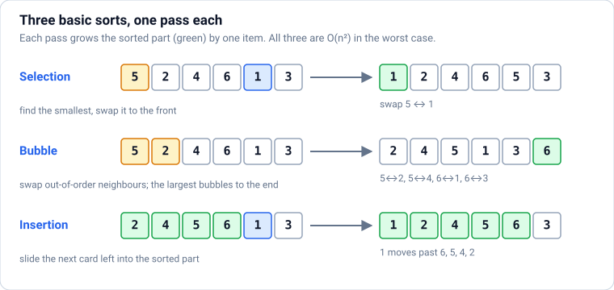

### Theory

> **In simple words:** each basic sort grows a **sorted part** one item at a time: selection sort picks the smallest remaining item, bubble sort swaps neighbours, and insertion sort slides each new item into place, like sorting playing cards in your hand.

**Sorting** puts items in order. It's one of the most useful steps in all of DSA, because sorted data is easier to work with:

- You can **search** it in O(log n) with binary search (Section [18](#18-searching-linear-search-and-binary-search)).
- **Equal items sit next to each other**, so duplicates are easy to find.
- The smallest and largest items are at the two ends.

The three basic sorts are all O(n²), too slow for big inputs, but they're the best way to learn how sorting works, and interviewers often ask for them. Each one keeps a **sorted part** that grows by one item per pass.

**Selection sort: "find the smallest, put it next".** In pass i, find the smallest item in the unsorted part `a[i:]` and swap it into position i. After pass i, the first i + 1 items are sorted and final.

**Bubble sort: "swap neighbours that are out of order".** Walk along the list comparing each pair of neighbours and swap them if the left one is bigger. The biggest item "bubbles up" to the end in the first pass, the second biggest in the second pass, and so on. **Early exit:** if a pass makes no swaps, the list is already sorted, so stop. That makes bubble sort O(n) on already-sorted input.

**Insertion sort: "like sorting playing cards in your hand".** Take the next card and slide it left past every bigger card until it's in the right place. It's fast (close to O(n)) when the list is already **nearly sorted**, which is why real-world sorts use it for small pieces.

| Algorithm | Best | Worst | Extra space | Stable? | Good for |
|---|---|---|---|---|---|
| Selection | O(n²) | O(n²) | O(1) | No | Fewest swaps (at most n − 1) |
| Bubble | O(n) with early exit | O(n²) | O(1) | Yes | Teaching; detecting "already sorted" |
| Insertion | O(n) | O(n²) | O(1) | Yes | Small or nearly sorted lists |

**Stable** means items with **equal keys keep their original order**. If you sort students by marks, a stable sort keeps students with the same marks in the order they were in before. That matters when you sort by one thing, then by another.

**In real code, use Python's built-in sort.** `sorted(a)` returns a **new** sorted list; `a.sort()` sorts the list **in place** (and returns `None`). Both use **Timsort**: O(n log n) in the worst case, stable, and very fast on partly sorted data. Two options control them:

- `reverse=True` sorts from largest to smallest.
- `key=` gives a function that picks **what to sort by**. `key=len` sorts words by length. For something custom, write a **lambda**, a tiny one-line function without a name: `lambda p: p[1]` means "given p, return p[1]".

How O(n log n) is possible at all is the subject of Section [29](#29-merge-sort-and-quick-sort) (merge sort and quick sort), which needs recursion plus some techniques from Part 4.

**Used in real software:** insertion sort is still used **inside** the fastest real sorts: Python's `sorted`, Java's object sort and Rust's sorts switch to insertion sort for short pieces (roughly under 32–64 items), where its simplicity beats fancier methods. Section [29](#29-merge-sort-and-quick-sort) covers what languages use in 2026.

### Python

```python
def selection_sort(a):
    n = len(a)
    for i in range(n - 1):
        smallest = i
        for j in range(i + 1, n):             # find the smallest in a[i:]
            if a[j] < a[smallest]:
                smallest = j
        a[i], a[smallest] = a[smallest], a[i] # put it at position i
    return a

def bubble_sort(a):
    n = len(a)
    for end in range(n - 1, 0, -1):           # a[end+1:] is already sorted
        swapped = False
        for j in range(end):
            if a[j] > a[j + 1]:
                a[j], a[j + 1] = a[j + 1], a[j]
                swapped = True
        if not swapped:
            break                             # no swaps: already sorted
    return a

def insertion_sort(a):
    for i in range(1, len(a)):
        card = a[i]
        j = i - 1
        while j >= 0 and a[j] > card:         # shift bigger items one step right
            a[j + 1] = a[j]
            j -= 1
        a[j + 1] = card                       # drop the card into the gap
    return a

selection_sort([5, 2, 4, 6, 1, 3])            # → [1, 2, 3, 4, 5, 6]
bubble_sort([5, 2, 4, 6, 1, 3])               # → [1, 2, 3, 4, 5, 6]
insertion_sort([5, 2, 4, 6, 1, 3])            # → [1, 2, 3, 4, 5, 6]
```

Watch insertion sort work, one pass per line:

```python
a = [5, 2, 4, 6, 1, 3]
for i in range(1, len(a)):
    card, j = a[i], i - 1
    while j >= 0 and a[j] > card:
        a[j + 1] = a[j]
        j -= 1
    a[j + 1] = card
    print("pass", i, a)
```

**Output:**

```text
pass 1 [2, 5, 4, 6, 1, 3]
pass 2 [2, 4, 5, 6, 1, 3]
pass 3 [2, 4, 5, 6, 1, 3]
pass 4 [1, 2, 4, 5, 6, 3]
pass 5 [1, 2, 3, 4, 5, 6]
```

```python
nums = [3, 1, 2]
sorted(nums), nums                             # → ([1, 2, 3], [3, 1, 2])
nums.sort()
nums                                           # → [1, 2, 3]
sorted([3, 1, 2], reverse=True)                # → [3, 2, 1]
sorted(["banana", "kiwi", "apple"], key=len)   # → ["kiwi", "apple", "banana"]

people = [("Asha", 31), ("Ravi", 25), ("Meera", 31), ("Arjun", 25)]
sorted(people, key=lambda p: p[1])             # → [("Ravi", 25), ("Arjun", 25), ("Asha", 31), ("Meera", 31)]
sorted(people, key=lambda p: (-p[1], p[0]))    # → [("Asha", 31), ("Meera", 31), ("Arjun", 25), ("Ravi", 25)]
```

- **Stability in action:** Ravi and Arjun are both 25, and Ravi stays first because he came first in the input.
- A key that returns a **tuple** sorts by the first value, then breaks ties with the second: here oldest first (`-p[1]` flips the order), then alphabetically.

**Common mistakes:**

- ❌ `nums = nums.sort()`: `sort()` returns `None`, so you lose the list. Use `nums.sort()` alone, or `nums = sorted(nums)`.
- ❌ Writing your own O(n²) sort for a real problem with 10⁵ items. Use `sorted`.
- ❌ In insertion sort, overwriting `a[i]` before saving it in `card`.

### Practice

| # | LeetCode problem | Difficulty |
|---|---|---|
| 1 | [1051. Height Checker](https://leetcode.com/problems/height-checker/) | 🟢 Easy |
| 2 | [2089. Find Target Indices After Sorting Array](https://leetcode.com/problems/find-target-indices-after-sorting-array/) | 🟢 Easy |
| 3 | [977. Squares of a Sorted Array](https://leetcode.com/problems/squares-of-a-sorted-array/) | 🟢 Easy |
| 4 | [88. Merge Sorted Array](https://leetcode.com/problems/merge-sorted-array/) | 🟢 Easy |
| 5 | [75. Sort Colors](https://leetcode.com/problems/sort-colors/) | 🟡 Medium |
| 6 | [912. Sort an Array](https://leetcode.com/problems/sort-an-array/) (O(n²) sorts time out here; come back after Section [29](#29-merge-sort-and-quick-sort)) | 🟡 Medium |

**Learn & visualise:** [VisuAlgo: Sorting (animated)](https://visualgo.net/en/sorting) · [GeeksforGeeks: Sorting](https://www.geeksforgeeks.org/dsa/sorting-algorithms/)

---

## 18. Searching: Linear Search and Binary Search

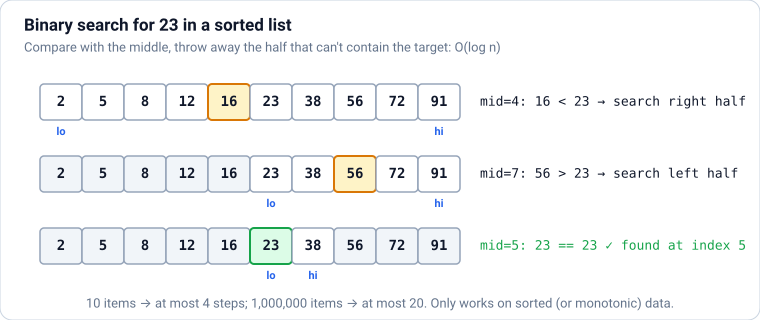

### Theory

> **In simple words:** linear search checks items one by one. Binary search, on **sorted** data, checks the middle and throws away half every time, like finding a word in a dictionary by opening it in the middle.

**Linear search** checks the items one by one until it finds the target: O(n). It works on **any** list, sorted or not, and it's what `x in a` and `a.index(x)` do.

**Binary search** is the "guess the number" game. I think of a number from 1 to 100; you guess 50, and I say "higher". Now half the numbers are gone in one guess. Keep guessing the **middle** of what's left and you always win within **7 guesses**, because 100 → 50 → 25 → 13 → 7 → 4 → 2 → 1.

On a **sorted** list:

1. Keep a range `lo … hi` where the target could be (at first, the whole list).
2. Look at the middle item, `mid = (lo + hi) // 2`.
3. If it's the target, done. If it's too small, the target can only be to the right: `lo = mid + 1`. If it's too big: `hi = mid - 1`.
4. Stop when the range is empty (`lo > hi`): the target isn't there.

Every step halves the range, so it's **O(log n)**: at most about 20 steps for a million items, 30 for a billion. The one requirement is that the data is **sorted**; on an unsorted list binary search gives wrong answers.

**Variations you'll need:**

- **Lower bound:** the first index where `a[i] >= x`. It's where x *would be inserted* to keep the list sorted, and it finds the **first** occurrence of a repeated value. The version below uses a **half-open** range `[lo, hi)`: `hi` itself is not included, and the loop runs `while lo < hi`.
- **Upper bound:** the first index where `a[i] > x`. The count of x in the list is upper bound − lower bound.
- Python's `bisect` module has both: `bisect_left(a, x)` is the lower bound and `bisect_right(a, x)` the upper bound. (`from bisect import bisect_left` makes the function available.)

**The classic bugs:** an off-by-one in `lo`/`hi` updates, a loop that never ends because the range doesn't shrink (`lo = mid` instead of `lo = mid + 1`), and searching an unsorted list. Pick **one** template, learn it by heart, and always test it on a list of 1 and 2 items.

Section [28](#28-binary-search-on-the-answer) shows binary search's most powerful use: searching for an **answer**, not an item.

**Used in real software:** **`git bisect`** binary-searches your commit history to find the commit that introduced a bug; **database indexes** (B-trees, Section [56](#56-algorithms-behind-real-systems-consistent-hashing-rate-limiters-b-trees-lsm-trees-and-vector-search)) are a many-way binary search on disk; and Python's `bisect` module keeps lists sorted for fast lookups.

### Python

```python
def linear_search(a, x):
    for i in range(len(a)):
        if a[i] == x:
            return i
    return -1                              # not found

def binary_search(a, x):
    lo, hi = 0, len(a) - 1                 # x can only be in a[lo..hi]
    while lo <= hi:
        mid = (lo + hi) // 2
        if a[mid] == x:
            return mid
        if a[mid] < x:
            lo = mid + 1                   # x is to the right of mid
        else:
            hi = mid - 1                   # x is to the left of mid
    return -1

a = [2, 5, 8, 12, 16, 23, 38, 56, 72, 91]
linear_search(a, 23), binary_search(a, 23), binary_search(a, 7)   # → (5, 5, -1)
```

```python
def binary_search_steps(a, x):
    lo, hi, steps = 0, len(a) - 1, 0
    while lo <= hi:
        steps += 1
        mid = (lo + hi) // 2
        if a[mid] == x:
            return steps
        if a[mid] < x:
            lo = mid + 1
        else:
            hi = mid - 1
    return steps

million = list(range(1_000_000))
binary_search_steps(million, 999_999), binary_search_steps(million, 123_456)   # → (20, 16)
```

```python
from bisect import bisect_left, bisect_right

def lower_bound(a, x):
    """First index i with a[i] >= x (len(a) if none): the half-open [lo, hi) template."""
    lo, hi = 0, len(a)
    while lo < hi:
        mid = (lo + hi) // 2
        if a[mid] < x:
            lo = mid + 1
        else:
            hi = mid                       # mid might be the answer, so keep it
    return lo

b = [1, 2, 2, 2, 3, 5]
lower_bound(b, 2), lower_bound(b, 4), lower_bound(b, 9)       # → (1, 5, 6)
bisect_left(b, 2), bisect_right(b, 2)                        # → (1, 4)
bisect_right(b, 2) - bisect_left(b, 2)                       # → 3
```

The last line counts the 2s in O(log n) without looking at each one.

**Common mistakes:**

- ❌ Binary searching an unsorted list. Sort first (O(n log n)), which only pays off if you search many times.
- ❌ Mixing templates: `while lo <= hi` goes with `hi = len(a) - 1` and `hi = mid - 1`; `while lo < hi` goes with `hi = len(a)` and `hi = mid`.
- ❌ `mid = (lo + hi) / 2` gives a float. Use `//`.

### Practice

| # | LeetCode problem | Difficulty |
|---|---|---|
| 1 | [704. Binary Search](https://leetcode.com/problems/binary-search/) | 🟢 Easy |
| 2 | [374. Guess Number Higher or Lower](https://leetcode.com/problems/guess-number-higher-or-lower/) | 🟢 Easy |
| 3 | [35. Search Insert Position](https://leetcode.com/problems/search-insert-position/) | 🟢 Easy |
| 4 | [278. First Bad Version](https://leetcode.com/problems/first-bad-version/) | 🟢 Easy |
| 5 | [34. Find First and Last Position of Element in Sorted Array](https://leetcode.com/problems/find-first-and-last-position-of-element-in-sorted-array/) | 🟡 Medium |
| 6 | [153. Find Minimum in Rotated Sorted Array](https://leetcode.com/problems/find-minimum-in-rotated-sorted-array/) | 🟡 Medium |
| 7 | [33. Search in Rotated Sorted Array](https://leetcode.com/problems/search-in-rotated-sorted-array/) | 🟡 Medium |

**Learn & visualise:** [GeeksforGeeks: Binary Search](https://www.geeksforgeeks.org/dsa/binary-search/)

---

## 19. Hashing: Dictionaries and Sets

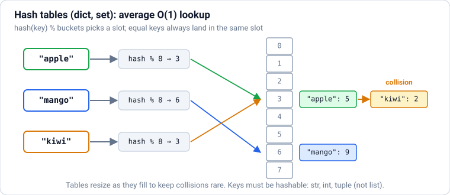

### Theory

> **In simple words:** a **hash function** turns a key (a word, a number) into a **locker number**. To find the key again you compute the same locker number and walk straight there, instead of opening every locker. That's why dict and set lookups are O(1) on average.

**Start with a counting problem:** how often does each number 0–9 appear in a list? You already know the answer from Section [16](#16-strings): make a list of 10 counters and use the **number itself as the index**, `count[x] += 1`. Finding any number's count is then O(1).

That trick breaks down when the "keys" aren't small numbers: counting words, or numbers up to 10¹⁸, would need an impossibly long list. A **hash table** fixes that. It turns **any** key into a list index with a **hash function** (a formula that turns a key into a number), `index = hash(key) % size`, and then works just like the counting list. Python gives you two hash tables:

**`dict` (dictionary): key → value pairs.** Like a real dictionary: look up a word (the key) to find its meaning (the value).

| Operation | Code | Average cost |
|---|---|---|
| Create | `ages = {"asha": 31, "ravi": 25}` or `{}` | |
| Read | `ages["asha"]` (error if missing); `ages.get("x", 0)` (0 if missing) | O(1) |
| Add or change | `ages["meera"] = 28` | O(1) |
| Check a key | `"asha" in ages` | O(1) |
| Delete | `del ages["ravi"]` | O(1) |
| Loop | `for name, age in ages.items():` (also `.keys()`, `.values()`) | O(n) |

**`set`: just keys, no values.** Answers "have I seen this before?" in O(1), and removes duplicates automatically.

| Operation | Code |
|---|---|
| Create | `seen = set()` (not `{}`, which is an empty dict), or `{1, 2, 3}`, or `set(some_list)` |
| Add, check, remove | `seen.add(x)`, `x in seen`, `seen.discard(x)` |
| Combine | `a \| b` (union), `a & b` (in both), `a - b` (in a but not b) |

Compare `x in some_list` (O(n): checks every item) with `x in some_set` (O(1)). Replacing a list with a set is the most common way to speed up a slow solution.

**How it works (and when it doesn't):**

- **Collisions:** two keys can land on the same slot. Tables handle it (CPython probes for the next free slot) and **resize** when they fill up, so the average stays O(1). With many collisions, operations degrade towards O(n); that's the "worst case O(n)" you'll hear about.
- **Keys must be hashable**, which in practice means **unchangeable**: `int`, `str` and tuples work; lists, dicts and sets don't, because if a key changed after it was stored, its hash would change and the entry would be lost. Use `tuple(lst)` as a key instead.
- Dicts remember **insertion order** (Python 3.7+). Sets have no order.

**Two helpers from the `collections` module** (`from collections import Counter, defaultdict`):

- `Counter(items)` counts everything in one line: `Counter("banana")` gives `{"a": 3, "n": 2, "b": 1}`, and `.most_common(k)` returns the top k.
- `defaultdict(list)` creates a missing key with an empty list the first time you touch it, so `groups[key].append(x)` just works. `defaultdict(int)` starts missing keys at 0.

**Patterns:**

- **Counting** frequencies (`Counter`, or `d[x] = d.get(x, 0) + 1`).
- **"Have I seen it?"** with a set: duplicates, repeated states, first repeated item.
- **Complement lookup:** for each x, is `target - x` already seen? That gives Two Sum in O(n) instead of O(n²).
- **Grouping** by a shared key: anagrams share the same sorted letters.

**Used in real software:** Python's own `dict` and `set` (CPython uses a compact, insertion-ordered hash table with open addressing), caches like Redis and Memcached, database "hash joins" and hash indexes, and duplicate detection. Two things worth knowing: Python **randomises string hashes** each time it starts, so attackers can't craft keys that all collide and slow a server down (a "hash-flooding" attack); and the `hash()` used by tables is **not** a cryptographic hash. For passwords and signatures, systems use cryptographic hashes like SHA-256 or password hashes like Argon2 and bcrypt.

### Python

```python
def count_small(nums):                      # the counting-list idea, for values 0-9
    count = [0] * 10
    for x in nums:
        count[x] += 1
    return count

def count_words(words):                     # the same idea with a dict: any keys
    count = {}
    for w in words:
        count[w] = count.get(w, 0) + 1      # 0 the first time we see w
    return count

count_small([3, 1, 3, 9, 3])                # → [0, 1, 0, 3, 0, 0, 0, 0, 0, 1]
count_words(["to", "be", "or", "not", "to", "be"])   # → {"to": 2, "be": 2, "or": 1, "not": 1}

ages = {"asha": 31, "ravi": 25}
ages["meera"] = 28
"ravi" in ages, ages.get("zoe", 0), len(ages)   # → (True, 0, 3)
[name for name, age in ages.items() if age > 26]   # → ["asha", "meera"]

a, b = {1, 2, 3, 4}, {3, 4, 5}
a | b, a & b, a - b                          # → ({1, 2, 3, 4, 5}, {3, 4}, {1, 2})
set([3, 1, 3, 2, 1]) == {1, 2, 3}            # → True
```

```python
from collections import Counter, defaultdict

def contains_duplicate(nums):                # O(n) with a set, instead of O(n²) with pairs
    seen = set()
    for x in nums:
        if x in seen:
            return True
        seen.add(x)
    return False

def two_sum(nums, target):                   # O(n): value → index of what we've seen
    seen = {}
    for i, x in enumerate(nums):
        if target - x in seen:
            return [seen[target - x], i]
        seen[x] = i
    return []

def first_unique_char(s):
    counts = Counter(s)
    for i, ch in enumerate(s):
        if counts[ch] == 1:
            return i
    return -1

def group_anagrams(words):                   # O(n · k log k): sorted letters are the key
    groups = defaultdict(list)
    for w in words:
        groups["".join(sorted(w))].append(w)
    return sorted([sorted(g) for g in groups.values()])   # sorted only to print neatly

contains_duplicate([1, 2, 3, 1]), contains_duplicate([1, 2, 3])   # → (True, False)
two_sum([2, 7, 11, 15], 9)                               # → [0, 1]
first_unique_char("leetcode"), first_unique_char("aabb") # → (0, -1)
group_anagrams(["eat", "tea", "tan", "ate", "nat", "bat"])  # → [["ate", "eat", "tea"], ["bat"], ["nat", "tan"]]
Counter("mississippi").most_common(2)                    # → [("i", 4), ("s", 4)]
```

`sorted(w)` sorts the letters of a word into a list (`sorted("tea")` is `["a", "e", "t"]`), and `"".join` glues them back into `"aet"`, the shared key for every anagram of "tea".

**Common mistakes:**

- ❌ `d[key]` for a key that might be missing (`KeyError`). Use `d.get(key, default)`, `in`, or a `defaultdict`.
- ❌ `x = {}` when you meant an empty **set**; write `set()`.
- ❌ Using a list as a dict key or set item. Convert it to a tuple.
- ❌ Changing a dict's size while looping over it. Loop over `list(d)` instead.

### Practice

| # | LeetCode problem | Difficulty |
|---|---|---|
| 1 | [1. Two Sum](https://leetcode.com/problems/two-sum/) | 🟢 Easy |
| 2 | [217. Contains Duplicate](https://leetcode.com/problems/contains-duplicate/) | 🟢 Easy |
| 3 | [387. First Unique Character in a String](https://leetcode.com/problems/first-unique-character-in-a-string/) | 🟢 Easy |
| 4 | [202. Happy Number](https://leetcode.com/problems/happy-number/) (digits + a "seen" set) | 🟢 Easy |
| 5 | [49. Group Anagrams](https://leetcode.com/problems/group-anagrams/) | 🟡 Medium |
| 6 | [347. Top K Frequent Elements](https://leetcode.com/problems/top-k-frequent-elements/) | 🟡 Medium |
| 7 | [128. Longest Consecutive Sequence](https://leetcode.com/problems/longest-consecutive-sequence/) | 🟡 Medium |

**Learn & visualise:** [GeeksforGeeks: Hashing](https://www.geeksforgeeks.org/dsa/hashing-data-structure/) · [VisuAlgo: Hash Table](https://visualgo.net/en/hashtable)

---

## 20. Python's Cost Model: What Each Operation Costs

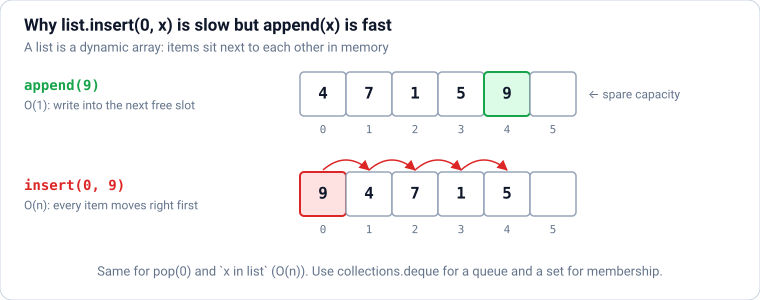

### Theory

> **In simple words:** the same idea can be cheap or expensive depending on the structure you pick. Learn the price of each operation, and watch for single lines that secretly loop.

You now know four Python structures: `list`, `str`, `dict` and `set`. The same job costs very different amounts depending on which one you use, and one innocent-looking line can hide a whole loop. Learn this table by heart:

| Operation | list | str | dict / set |
|---|---|---|---|
| Index `a[i]` | O(1) | O(1) | — |
| Look up a key `d[k]` | — | — | O(1) average |
| Append / add | O(1) amortised | — (immutable; `+` makes a copy) | O(1) average |
| Pop from the end | O(1) | — | — |
| Insert or pop at the front or middle | **O(n)** | — | — |
| `x in …` | **O(n)** | O(n) | **O(1)** average |
| Delete a value / key | O(n) | — | O(1) average |
| `len(…)` | O(1) | O(1) | O(1) |
| `sum`, `max`, `min`, `.count(x)`, `.index(x)` | O(n) | O(n) | O(n) |
| Slice `a[i:j]` | O(j − i) (copies) | O(j − i) (copies) | — |
| Sort (`sorted`, `.sort()`) | O(n log n) | O(n log n) | — |
| Build from n items | O(n) | O(n) with `"".join` | O(n) |

**The most common Python performance bugs:**

- `if x in some_list` inside a loop → O(n²). Convert the list to a `set` once, before the loop.
- `nums.pop(0)` or `nums.insert(0, x)` in a loop → O(n) each. Section [34](#34-queues-and-deques) introduces `deque`, which does both in O(1).
- `s += piece` in a loop → can be O(n²). Collect pieces in a list and `"".join()` them once.
- Slicing inside recursion (`solve(nums[1:])`) copies the list on every call. Pass an index instead (`solve(nums, i + 1)`), as in Section [14](#14-recursion-basics).
- `sorted()` or `max()` inside a loop over the same data. Do it once, outside the loop.

### Python

```python
data = list(range(10_000))
lookup = set(data)                # O(n) once ...
9_999 in lookup                   # → True   (... then O(1) per check)

def slow_common(a, b):            # O(n × m): `in` on a list is a hidden loop
    return [x for x in a if x in b]

def fast_common(a, b):            # O(n + m): build a set once
    b_set = set(b)
    return [x for x in a if x in b_set]

slow_common([1, 5, 9, 12], [9, 1, 7]), fast_common([1, 5, 9, 12], [9, 1, 7])   # → ([1, 9], [1, 9])

parts = []
for word in ["data", "structures", "in", "python"]:
    parts.append(word.upper())
"-".join(parts)                   # → "DATA-STRUCTURES-IN-PYTHON"
```

### Practice

For each line, say its cost when `a` is a list of n items, `s` a set of n items and `d` a dict of n items:

```text
1) a[-1]        2) a.insert(0, 7)     3) 42 in s       4) 42 in a
5) d["key"]     6) max(a)             7) a[:n // 2]    8) sorted(a)
```

<details>
<summary><b>Answer</b></summary>

1) O(1) · 2) O(n) · 3) O(1) average · 4) O(n) · 5) O(1) average · 6) O(n) · 7) O(n) (copies n/2 items) · 8) O(n log n)

</details>

---

### ✅ Part 3 checkpoint

Without looking, can you:

- [ ] Give the Big-O of a snippet with loops one after another, nested loops, and a halving loop?
- [ ] Write a recursive function with a correct base case, and explain the call stack?
- [ ] Find the second largest item in one pass, and reverse a list in place?
- [ ] Check two strings for being anagrams using a list of 26 counts?
- [ ] Write selection, bubble and insertion sort, and sort records with `key=`?
- [ ] Write binary search from memory, and explain why it needs sorted data?
- [ ] Solve Two Sum in O(n) with a dict, and say when to use a set?

Part 4 combines these tools into **techniques**, the reusable ideas behind most interview problems.

---

# Part 4 — Moderate: Problem-Solving Techniques

> **Goal:** The reusable ideas behind most Easy and Medium interview problems on arrays, strings and matrices.  
> **You need:** Part 3 (lists, strings, dicts, sets, sorting, binary search, recursion, Big-O).

---

## 21. How to Attack a New Problem

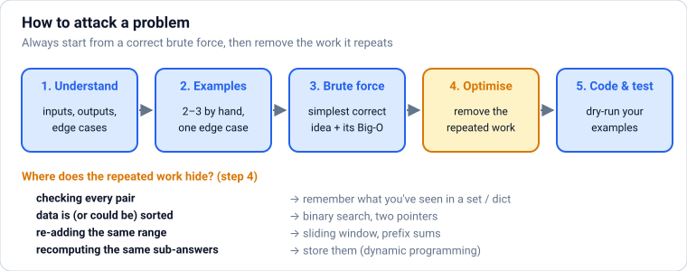

### Theory

> **In simple words:** don't jump to code. Understand the problem, solve small examples by hand, write the simplest correct solution, and only then make it faster by removing repeated work.

From here on, problems won't tell you which tool to use. This method works for almost all of them:

1. **Understand:** restate the problem in your own words. Ask about the input size, the edge cases (empty input, one item, duplicates, negatives) and what exactly to return.
2. **Examples:** work 2–3 small cases **by hand**, including one edge case. If you can't solve it by hand, you can't code it.
3. **Brute force first:** the simplest correct idea, even if it's slow, and its Big-O. It's your safety net and your starting point.
4. **Optimise:** find the **repeated or wasted work** in the brute force, and remove it:
   - Checking every pair? A **dict/set** can remember what you've seen (Section [19](#19-hashing-dictionaries-and-sets)).
   - The data is **sorted**, or could be? Think **binary search** (Section [18](#18-searching-linear-search-and-binary-search)) or **two pointers** (Section [22](#22-two-pointers)).
   - Re-adding the same range again and again? **Sliding window** or **prefix sums** (Sections [23](#23-sliding-window) and [24](#24-prefix-sums)).
   - Recomputing the same smaller answers? Remember them: that's dynamic programming (Section [49](#49-dynamic-programming)).
5. **Code** it cleanly, with good names, then **test**: dry-run your examples through the code (Section [3](#3-loops-and-dry-runs)) and check the edge cases.

**The input size tells you how fast your solution must be.** Python manages roughly 10⁷ simple steps per second, and most judges allow 1–2 seconds:

| Input size n | Target | What usually fits (from what you know so far) |
|---|---|---|
| n ≤ 10 | Anything, even O(n!) | Try every possibility |
| n ≤ 1,000 | O(n²) | Nested loops over pairs |
| n ≤ 10⁵ – 10⁶ | O(n log n) or O(n) | Sorting, hashing, one or two passes |
| n up to 10⁹ or more | O(log n), O(√n) or O(1) | Binary search, maths (Part 2) |

Section [59](#59-pattern-cheat-sheet-which-technique-when) has the full version of this table, once every technique has been covered.

**Used in real software:** the same method is how engineers approach any new task: write a correct, simple version first (with tests), measure it, and optimise only the parts that are actually slow.

### Python

```python
# The "brute force → optimise" loop on a classic: does any pair sum to target?
def has_pair_brute(nums, target):          # O(n²): try every pair
    for i in range(len(nums)):
        for j in range(i + 1, len(nums)):
            if nums[i] + nums[j] == target:
                return True
    return False

def has_pair_fast(nums, target):           # O(n): remember what we've seen
    seen = set()
    for x in nums:
        if target - x in seen:             # the partner x needs
            return True
        seen.add(x)
    return False

has_pair_brute([3, 8, 1, 5], 9)   # → True
has_pair_fast([3, 8, 1, 5], 9)    # → True
has_pair_fast([3, 8, 1, 5], 100)  # → False
```

The repeated work in the brute force is the inner loop asking "is the partner somewhere in the list?" again for every item. A set answers that in O(1).

### Practice

Use the method on a problem you've already met, and write down each step:

1. [1. Two Sum](https://leetcode.com/problems/two-sum/): write the O(n²) brute force first, then the O(n) version.
2. [217. Contains Duplicate](https://leetcode.com/problems/contains-duplicate/): three solutions, O(n²) pairs, O(n log n) sort-then-compare-neighbours, and O(n) with a set. Say which you'd pick and why.

Then try the structured lists: [NeetCode practice](https://neetcode.io/practice) (problems grouped by pattern) and [HackerRank's Algorithms track](https://www.hackerrank.com/domains/algorithms).

---

## 22. Two Pointers

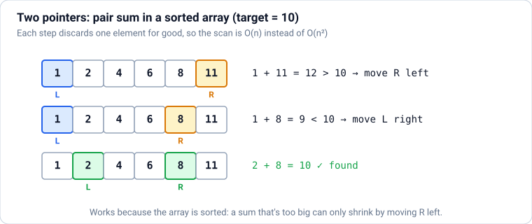

### Theory

> **In simple words:** instead of checking every pair of items (slow), keep **two fingers** on the list and move them cleverly, so each step rules out many pairs at once.

You've already used two indexes at once: reversing a list from both ends, and the read/write indexes in Section [15](#15-arrays-and-python-lists). **Two pointers** turns that into a general technique.

**Everyday picture.** Two friends look for two books whose prices add up to exactly ₹100 on a shelf sorted from cheapest to most expensive. One starts at the cheapest end, the other at the most expensive end. If the pair costs too much, the friend at the expensive end steps left (a cheaper book); if it costs too little, the friend at the cheap end steps right. They never need to go back.

**The three shapes of two pointers:**

| Shape | How the pointers move | Typical problems |
|---|---|---|
| **Opposite ends** (L → … ← R), usually on **sorted** data | Start at both ends and move inwards | Pair/triplet with a target sum, container with most water, palindromes |
| **Same direction, different speeds** (slow/fast, read/write) | Both move right; one runs ahead | Remove duplicates in place, move zeroes, partitioning, cycle detection in linked lists |
| **Two sequences**, one pointer each | Each pointer walks its own list | Merge two sorted lists, "is s a subsequence of t?" |

**Worked example: pair with sum 10 in `[1, 2, 4, 6, 8, 11]`**

| Step | L (value) | R (value) | Sum | Decision |
|---|---|---|---|---|
| 1 | 0 (1) | 5 (11) | 12 | Too big → move R left |
| 2 | 0 (1) | 4 (8) | 9 | Too small → move L right |
| 3 | 1 (2) | 4 (8) | 10 | Found: indexes (1, 4) |

**Why is it correct?** In step 1 the sum 12 is too big. Pairing 11 with any other number would be even bigger (every other number is ≥ 1, the smallest), so 11 can never be part of the answer and we drop it for good. Every step removes one number permanently, so there are at most n steps: **O(n)** instead of the O(n²) of checking every pair.

**3Sum** (three numbers summing to 0) fixes the first number with a loop and runs the pair search on the rest: O(n²), better than the O(n³) of three nested loops. To avoid duplicate triplets, skip a number when it equals the one before it.

**When to use it (clues):** the input is sorted (or sorting it is allowed), you're looking for a pair or triplet, you need to work in place with O(1) extra memory, or you're comparing two sequences.

**Common mistakes:**

- ❌ Using opposite-end pointers on **unsorted** data: the "too big, move left" logic only works when the order is known.
- ❌ `while lo <= hi` in pair problems, which pairs an item with itself. Use `lo < hi`.
- ❌ Forgetting to skip duplicates in 3Sum, which produces the same triplet several times.

**Used in real software:** the merge step of merge sort, and the "sort-merge join" that databases use to combine two sorted tables; removing duplicates from sorted logs; comparing two versions of a sorted list.

### Python

```python
def pair_with_sum(sorted_nums, target):
    lo, hi = 0, len(sorted_nums) - 1
    while lo < hi:
        total = sorted_nums[lo] + sorted_nums[hi]
        if total == target:
            return (lo, hi)
        if total < target:
            lo += 1          # need a bigger sum
        else:
            hi -= 1          # need a smaller sum
    return None

def three_sum(nums):
    """All unique triplets summing to 0: sort, then two pointers for each first item. O(n²)."""
    nums.sort()
    out = []
    for i in range(len(nums) - 2):
        if i > 0 and nums[i] == nums[i - 1]:
            continue                                   # skip duplicate first numbers
        lo, hi = i + 1, len(nums) - 1
        while lo < hi:
            s = nums[i] + nums[lo] + nums[hi]
            if s < 0:
                lo += 1
            elif s > 0:
                hi -= 1
            else:
                out.append([nums[i], nums[lo], nums[hi]])
                lo += 1
                while lo < hi and nums[lo] == nums[lo - 1]:
                    lo += 1                            # skip duplicate second numbers
    return out

pair_with_sum([1, 2, 4, 6, 8, 11], 10)   # → (1, 4)
three_sum([-1, 0, 1, 2, -1, -4])         # → [[-1, -1, 2], [-1, 0, 1]]
```

### Practice

| # | LeetCode problem | Difficulty |
|---|---|---|
| 1 | [125. Valid Palindrome](https://leetcode.com/problems/valid-palindrome/) | 🟢 Easy |
| 2 | [167. Two Sum II - Input Array Is Sorted](https://leetcode.com/problems/two-sum-ii-input-array-is-sorted/) | 🟡 Medium |
| 3 | [15. 3Sum](https://leetcode.com/problems/3sum/) | 🟡 Medium |
| 4 | [11. Container With Most Water](https://leetcode.com/problems/container-with-most-water/) | 🟡 Medium |
| 5 | [42. Trapping Rain Water](https://leetcode.com/problems/trapping-rain-water/) | 🔴 Hard |

**Learn & visualise:** [GeeksforGeeks: Two Pointers](https://www.geeksforgeeks.org/dsa/two-pointers-technique/)

---

## 23. Sliding Window

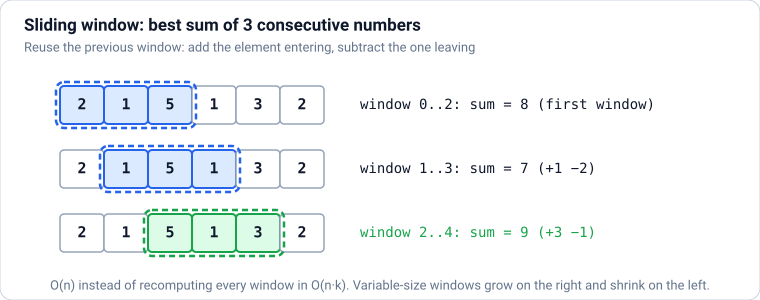

### Theory

> **In simple words:** look at the data through a "window" that slides along it. When the window moves one step, **update** your answer (add what came in, remove what went out) instead of recounting everything inside it.

**Everyday picture.** A train passes, and you want the busiest group of 3 carriages. You don't recount all 3 carriages each time the view moves: you add the carriage that just appeared and subtract the one that just left.

A **subarray** (or **substring**, for strings) is an unbroken piece: `[5, 1, 3]` is a subarray of `[2, 1, 5, 1, 3, 2]`, but `[2, 5]` isn't. A sliding window is a two-pointer technique (Section [22](#22-two-pointers)): `left` and `right` mark the window `[left, right]`.

**Type 1: fixed-size window (size k).** Build the first window, then slide: add `nums[right]`, remove `nums[right - k]`.

Worked example, the best sum of 3 in a row in `[2, 1, 5, 1, 3, 2]`:

| Window | Calculation | Sum |
|---|---|---|
| [2, 1, 5] | first window | 8 |
| [1, 5, 1] | 8 + 1 − 2 | 7 |
| [5, 1, 3] | 7 + 3 − 1 | **9** |
| [1, 3, 2] | 9 + 2 − 5 | 6 |

Each slide costs O(1), so the whole scan is O(n) instead of O(n × k).

**Type 2: variable-size window.** The window grows and shrinks:

1. **Expand:** move `right` one step and add the new item to the window's state.
2. **Shrink:** while the window breaks the rule (the sum is too big, a character repeats, …), remove `nums[left]` and move `left` right.
3. **Record:** when the window is valid, update the answer (longest, shortest, count).

Both pointers only move forwards, so each item enters and leaves the window at most once: O(n) in total, even though there's a loop inside a loop.

**What the window remembers ("state"):** a running sum, a dict (or `Counter`) of the characters inside it, or the last position where each character was seen. `float("inf")` (infinity) is a handy starting value for "the smallest so far": any real number is smaller. (For the **maximum** of each window, Section [34](#34-queues-and-deques) adds a special queue.)

**When to use it (clues):** "subarray" or "substring", "contiguous" (meaning unbroken), "longest / shortest / maximum … such that …", "at most k distinct", "every window of size k".

**When it doesn't work:** with **negative numbers**, adding an item can make a sum smaller, so "shrink while the sum is too big" stops making sense. Use prefix sums + a dict instead (Section [24](#24-prefix-sums)).

**Common mistakes:**

- ❌ Recomputing `sum(nums[left:right + 1])` inside the loop, which quietly brings back O(n × k).
- ❌ Updating the answer before shrinking the window back to a valid state.
- ❌ An off-by-one in the window length: it's `right - left + 1`.

**Used in real software:** API **rate limiters** ("at most 100 requests in any 60 seconds"), moving averages on monitoring dashboards, TCP's sliding window for network flow control, and "trending in the last hour" counters.

### Python

```python
def max_sum_k(nums, k):                       # fixed window
    window = sum(nums[:k])
    best = window
    for right in range(k, len(nums)):
        window += nums[right] - nums[right - k]
        best = max(best, window)
    return best

def longest_unique_substring(s):              # variable window
    last_seen, left, best = {}, 0, 0
    for right, ch in enumerate(s):
        if ch in last_seen and last_seen[ch] >= left:
            left = last_seen[ch] + 1          # shrink past the previous copy
        last_seen[ch] = right
        best = max(best, right - left + 1)
    return best

def min_len_subarray(target, nums):           # shortest window with sum ≥ target
    left, total, best = 0, 0, float("inf")
    for right, x in enumerate(nums):
        total += x
        while total >= target:
            best = min(best, right - left + 1)
            total -= nums[left]
            left += 1
    return 0 if best == float("inf") else best

max_sum_k([2, 1, 5, 1, 3, 2], 3)             # → 9
longest_unique_substring("abcabcbb")         # → 3
min_len_subarray(7, [2, 3, 1, 2, 4, 3])      # → 2
```

### Practice

| # | LeetCode problem | Difficulty |
|---|---|---|
| 1 | [643. Maximum Average Subarray I](https://leetcode.com/problems/maximum-average-subarray-i/) | 🟢 Easy |
| 2 | [121. Best Time to Buy and Sell Stock](https://leetcode.com/problems/best-time-to-buy-and-sell-stock/) | 🟢 Easy |
| 3 | [3. Longest Substring Without Repeating Characters](https://leetcode.com/problems/longest-substring-without-repeating-characters/) | 🟡 Medium |
| 4 | [209. Minimum Size Subarray Sum](https://leetcode.com/problems/minimum-size-subarray-sum/) | 🟡 Medium |
| 5 | [567. Permutation in String](https://leetcode.com/problems/permutation-in-string/) | 🟡 Medium |
| 6 | [76. Minimum Window Substring](https://leetcode.com/problems/minimum-window-substring/) | 🔴 Hard |

**Learn & visualise:** [GeeksforGeeks: Sliding Window](https://www.geeksforgeeks.org/dsa/window-sliding-technique/)

---

## 24. Prefix Sums

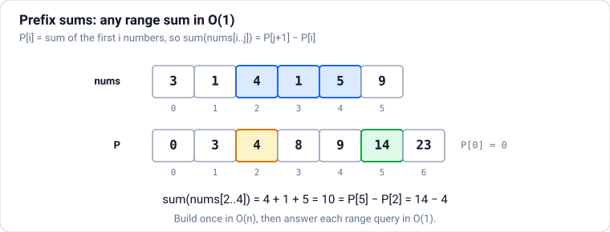

### Theory

> **In simple words:** write down the **running total** once. Then the sum of any stretch is just "total up to the end minus total before the start": one subtraction, however long the stretch is.

**Everyday picture.** A car's odometer shows the total distance driven so far. To know how far you drove between Monday and Friday, you don't add up every trip: you subtract Monday's reading from Friday's. A prefix-sum list is an odometer for your data.

**How it works.** Build `P` with `P[0] = 0` and `P[i + 1] = P[i] + nums[i]`, so `P[i]` is the sum of the first i items. Then

> sum(nums[i..j]) = P[j + 1] − P[i]

Worked example with `nums = [3, 1, 4, 1, 5, 9]`:

| i | 0 | 1 | 2 | 3 | 4 | 5 | 6 |
|---|---|---|---|---|---|---|---|
| `nums[i]` | 3 | 1 | 4 | 1 | 5 | 9 | |
| `P[i]` (sum of the first i) | 0 | 3 | 4 | 8 | 9 | 14 | 23 |

The sum of `nums[2..4]` = 4 + 1 + 5 = 10 = `P[5] − P[2]` = 14 − 4. ✓

**Cost:** O(n) once to build, then O(1) per question. It's ideal when there are **many** range questions on data that **doesn't change**. (If values change between questions, see Section [53](#53-range-queries-with-updates-fenwick-trees-and-segment-trees).)

**The big trick: prefix sums + a dict.** "How many subarrays sum to exactly k?" A subarray ending at position j sums to k exactly when some **earlier** running total equals `(running total now) − k`. So walk once, keep a dict counting how often each running total has appeared, and at each step add `seen[total - k]` to the answer. That's O(n), and unlike a sliding window it works with **negative numbers**. Start with `seen[0] = 1`, meaning "the empty prefix has total 0", so subarrays that start at index 0 are counted.

**Variations:**

- **2D prefix sums** give any rectangle's sum in O(1): `P[r][c]` = the sum of everything above and to the left.
- The same idea works with counts (how many vowels in `s[i..j]`?), products (careful with zeros) and XOR (Section [51](#51-bit-manipulation)).
- **Difference arrays** are the reverse trick: to add x to every item in a range many times, do `diff[l] += x`, `diff[r + 1] -= x`, and take one prefix sum at the end.
- Shortcut: `itertools.accumulate(nums)` produces the running totals for you.

**Common mistakes:**

- ❌ An off-by-one between `P[j + 1] − P[i]` and `P[j] − P[i]`. Write the small table above and check once.
- ❌ Forgetting `seen[0] = 1`, which misses subarrays that start at index 0.
- ❌ Using a sliding window when the numbers can be negative.

**Used in real software:** "integral images" in computer vision (the classic Viola–Jones face detector sums image rectangles in O(1) this way), cumulative metrics on analytics dashboards, and running totals in SQL window functions (`SUM(...) OVER (ORDER BY ...)`).

### Python

```python
from collections import defaultdict

def prefix_sums(nums):
    P = [0]
    for x in nums:
        P.append(P[-1] + x)                    # running total so far
    return P

def range_sum(P, i, j):                       # inclusive i..j
    return P[j + 1] - P[i]

def count_subarrays_with_sum(nums, k):
    seen = defaultdict(int)
    seen[0] = 1                                # the empty prefix
    total = count = 0
    for x in nums:
        total += x
        count += seen[total - k]               # earlier prefixes that complete a sum of k
        seen[total] += 1
    return count

P = prefix_sums([3, 1, 4, 1, 5, 9])
P                                              # → [0, 3, 4, 8, 9, 14, 23]
range_sum(P, 2, 4)                             # → 10
count_subarrays_with_sum([1, 2, 3, -2, 2], 3)  # → 4
```

### Practice

| # | LeetCode problem | Difficulty |
|---|---|---|
| 1 | [1480. Running Sum of 1d Array](https://leetcode.com/problems/running-sum-of-1d-array/) | 🟢 Easy |
| 2 | [303. Range Sum Query - Immutable](https://leetcode.com/problems/range-sum-query-immutable/) | 🟢 Easy |
| 3 | [724. Find Pivot Index](https://leetcode.com/problems/find-pivot-index/) | 🟢 Easy |
| 4 | [560. Subarray Sum Equals K](https://leetcode.com/problems/subarray-sum-equals-k/) | 🟡 Medium |
| 5 | [304. Range Sum Query 2D - Immutable](https://leetcode.com/problems/range-sum-query-2d-immutable/) | 🟡 Medium |

**Learn & visualise:** [GeeksforGeeks: Prefix Sum](https://www.geeksforgeeks.org/dsa/prefix-sum-array-implementation-applications-competitive-programming/)

---

## 25. Classic Array Algorithms: Kadane, Majority Vote, Dutch Flag and More

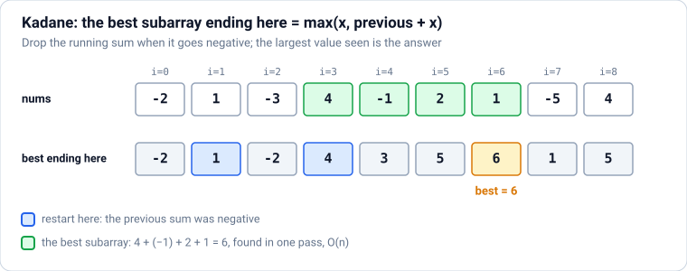

### Theory

> **In simple words:** these are famous one-pass tricks: each one keeps **one or two running values** (the best so far, a candidate, a few pointers) and updates them as it walks the array once.

A handful of array problems come up in interviews so often that each has a well-known one-pass solution. Learn the **idea** behind each one, not just the code.

**1. Maximum subarray sum (Kadane's algorithm).** Find the unbroken piece of the array with the largest sum. Brute force tries every subarray: O(n²). Kadane's insight: walk left to right keeping `best_here`, the best sum of a subarray that **ends at the current item**. For each new item x there are only two choices:

- extend the previous subarray: `best_here + x`, or
- start fresh at x, which is better whenever `best_here` was negative (a negative past only drags x down).

So `best_here = max(x, best_here + x)`, and the answer is the largest `best_here` ever seen. One pass: O(n) time, O(1) space.

**2. Best time to buy and sell a stock (one trade).** Walk through the prices, remembering the **lowest price so far**. Selling today earns `price - lowest`; keep the best. If you may trade many times, add up every rise from one day to the next.

**3. Majority element (Boyer–Moore voting).** A value that fills **more than half** the array survives if you cancel pairs of different values. Keep a `candidate` and a `count`: the same value adds 1, a different value subtracts 1, and at 0 the next item becomes the candidate. O(n) time, O(1) space. If a majority isn't guaranteed, check the candidate with a second pass.

**4. Sort 0s, 1s and 2s in one pass (Dutch national flag).** Three pointers split the array into four zones: `[0, low)` holds 0s, `[low, mid)` holds 1s, `[mid, high]` is unchecked, and `(high, end]` holds 2s. Look at `nums[mid]`: a 0 is swapped to `low`, a 1 stays, and a 2 is swapped to `high`. It's O(n), in place, and the idea behind quick sort's three-way partition.

**5. Next permutation.** Find the next arrangement in dictionary order (1 2 3 → 1 3 2 → 2 1 3 …):

1. From the right, find the first `i` with `nums[i] < nums[i + 1]`. Everything after `i` is decreasing, so it can't grow any more.
2. From the right, find the first `j` with `nums[j] > nums[i]`, and swap them.
3. Reverse the part after `i`, making it as small as possible.

If there's no such `i`, the array is the last permutation, so reversing it all wraps around to the first.

**6. Missing number in 0 … n.** The expected total is n(n + 1)/2 (Section [11](#11-maths-toolbox-series-factorials-fibonacci-powers-and-modulo)); subtract the actual sum.

**Used in real software:** running maximums and minimums power trading and analytics dashboards (best buy/sell points, biggest gain over a period); majority voting is used in streaming "heavy hitters" detection; and three-way partitioning is inside real quick sort implementations to handle many equal values.

### Python

```python
def max_subarray(nums):
    """Kadane: returns (best sum, start, end) of the best subarray."""
    best_here, best = nums[0], nums[0]
    start = best_start = best_end = 0
    for i in range(1, len(nums)):
        if best_here < 0:                         # a negative past only hurts: start fresh
            best_here, start = nums[i], i
        else:
            best_here += nums[i]                  # extend the current subarray
        if best_here > best:
            best, best_start, best_end = best_here, start, i
    return best, best_start, best_end

def max_profit(prices):                           # one buy, one sell
    lowest, best = prices[0], 0
    for p in prices:
        lowest = min(lowest, p)
        best = max(best, p - lowest)
    return best

def max_profit_many(prices):                      # any number of trades
    return sum(max(0, prices[i] - prices[i - 1]) for i in range(1, len(prices)))

max_subarray([-2, 1, -3, 4, -1, 2, 1, -5, 4])     # → (6, 3, 6)
max_subarray([-3, -1, -2])                        # → (-1, 1, 1)
max_profit([7, 1, 5, 3, 6, 4]), max_profit_many([7, 1, 5, 3, 6, 4])   # → (5, 7)
```

`sum(... for i in ...)` adds up the values of a comprehension without building a list first.

```python
def majority(nums):
    candidate, count = None, 0
    for x in nums:
        if count == 0:
            candidate = x                         # start a new candidate
        count += 1 if x == candidate else -1      # different values cancel out
    return candidate

def sort_colors(nums):                            # Dutch national flag: one pass, in place
    low, mid, high = 0, 0, len(nums) - 1
    while mid <= high:
        if nums[mid] == 0:
            nums[low], nums[mid] = nums[mid], nums[low]
            low, mid = low + 1, mid + 1
        elif nums[mid] == 1:
            mid += 1
        else:
            nums[mid], nums[high] = nums[high], nums[mid]
            high -= 1                             # don't move mid: the swapped-in value is unchecked
    return nums

def next_permutation(nums):
    i = len(nums) - 2
    while i >= 0 and nums[i] >= nums[i + 1]:
        i -= 1                                    # 1. first dip from the right
    if i >= 0:
        j = len(nums) - 1
        while nums[j] <= nums[i]:
            j -= 1                                # 2. first bigger value from the right
        nums[i], nums[j] = nums[j], nums[i]
    nums[i + 1:] = nums[i + 1:][::-1]             # 3. reverse the tail
    return nums

def missing_number(nums):
    n = len(nums)
    return n * (n + 1) // 2 - sum(nums)

majority([2, 2, 1, 1, 1, 2, 2])                   # → 2
sort_colors([2, 0, 2, 1, 1, 0])                   # → [0, 0, 1, 1, 2, 2]
next_permutation([1, 2, 3]), next_permutation([1, 3, 2]), next_permutation([3, 2, 1])   # → ([1, 3, 2], [2, 1, 3], [1, 2, 3])
missing_number([3, 0, 1])                         # → 2
```

**Common mistakes:**

- ❌ Starting Kadane with `best = 0`: an all-negative array would wrongly return 0. Start from the first item.
- ❌ Advancing `mid` after swapping a 2 to the end in the Dutch flag. The value that came back from `high` hasn't been checked yet.
- ❌ Trusting Boyer–Moore's candidate when a majority isn't guaranteed. Count it in a second pass.

### Practice

| # | LeetCode problem | Difficulty |
|---|---|---|
| 1 | [121. Best Time to Buy and Sell Stock](https://leetcode.com/problems/best-time-to-buy-and-sell-stock/) | 🟢 Easy |
| 2 | [169. Majority Element](https://leetcode.com/problems/majority-element/) | 🟢 Easy |
| 3 | [268. Missing Number](https://leetcode.com/problems/missing-number/) | 🟢 Easy |
| 4 | [53. Maximum Subarray](https://leetcode.com/problems/maximum-subarray/) | 🟡 Medium |
| 5 | [122. Best Time to Buy and Sell Stock II](https://leetcode.com/problems/best-time-to-buy-and-sell-stock-ii/) | 🟡 Medium |
| 6 | [75. Sort Colors](https://leetcode.com/problems/sort-colors/) | 🟡 Medium |
| 7 | [31. Next Permutation](https://leetcode.com/problems/next-permutation/) | 🟡 Medium |
| 8 | [152. Maximum Product Subarray](https://leetcode.com/problems/maximum-product-subarray/) | 🟡 Medium |
| 9 | [229. Majority Element II](https://leetcode.com/problems/majority-element-ii/) | 🟡 Medium |

**Learn & visualise:** [GeeksforGeeks: Kadane's algorithm](https://www.geeksforgeeks.org/dsa/largest-sum-contiguous-subarray/) · [GeeksforGeeks: Boyer–Moore majority voting](https://www.geeksforgeeks.org/dsa/boyer-moore-majority-voting-algorithm/)

---

## 26. Matrices: 2D Array Problems

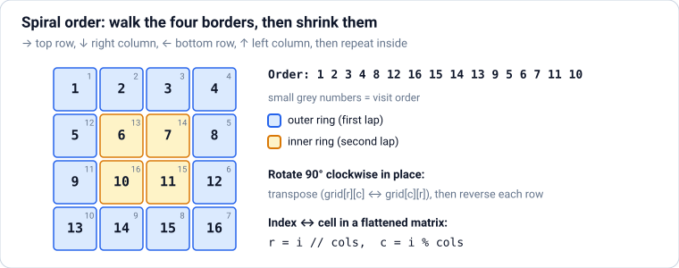

### Theory

> **In simple words:** a matrix is a grid of rows and columns. Most grid problems are about **moving around it correctly**: which cells are neighbours, and how to walk it in a given order without going off the edge.

A **matrix** (grid) is a list of rows: `grid[r][c]` is row `r`, column `c`, with `rows = len(grid)` and `cols = len(grid[0])` (Section [15](#15-arrays-and-python-lists) showed how to create one safely). Grids appear everywhere: images, game boards, maps, spreadsheets. Most grid problems reuse a few ideas.

**1. Moving around a grid.** The 4 neighbours of `(r, c)` are up, down, left and right. Keep them in a **directions list** and check the bounds before using a neighbour:

```text
for dr, dc in [(-1, 0), (1, 0), (0, -1), (0, 1)]:
    nr, nc = r + dr, c + dc
    if 0 <= nr < rows and 0 <= nc < cols: ...
```

Add `(-1, -1), (-1, 1), (1, -1), (1, 1)` for 8 directions (diagonals). Section [41](#41-graphs-representation-bfs-and-dfs) uses exactly this to explore grids.

**2. Diagonals.** On the main diagonal `r == c`; on the anti-diagonal `r + c == n - 1`. All cells with the same `r - c` lie on one diagonal line.

**3. Rotate 90° clockwise in place = transpose, then reverse each row.** Transposing swaps `grid[r][c]` with `grid[c][r]` (rows become columns); reversing the rows then flips it left-right. (Counter-clockwise: transpose, then reverse the order of the rows.)

**4. Spiral order.** Keep four borders, `top`, `bottom`, `left` and `right`. Walk along the top row, down the right column, back along the bottom row and up the left column, moving each border inwards after walking it, until the borders cross.

**5. Set matrix zeroes.** If a cell is 0, its whole row and column become 0. First **record** which rows and columns contain a 0 (two sets), then clear them in a second pass. Clearing while you scan would spread zeros that weren't in the original.

**6. Searching a sorted matrix.**

- **Every row sorted, and each row starts after the previous one ends:** it's really one sorted list of `rows × cols` items. Binary-search index `i` from 0 to `rows × cols − 1`, and turn it into a cell with `r = i // cols`, `c = i % cols` (the `//` and `%` from Section [2](#2-python-basics-values-variables-decisions-and-functions)). O(log(rows × cols)).
- **Rows sorted and columns sorted separately:** start at the **top-right** corner. If the value is too big, move left (everything below is even bigger); if it's too small, move down. Each step removes a row or a column: O(rows + cols).

**Used in real software:** images are matrices of pixels (rotating a photo is a matrix rotation), spreadsheets, game boards and maps, and the matrices of numbers inside every machine-learning model.

### Python

```python
def spiral_order(grid):
    out = []
    top, bottom, left, right = 0, len(grid) - 1, 0, len(grid[0]) - 1
    while top <= bottom and left <= right:
        for c in range(left, right + 1):              # → along the top row
            out.append(grid[top][c])
        top += 1
        for r in range(top, bottom + 1):              # ↓ down the right column
            out.append(grid[r][right])
        right -= 1
        if top <= bottom:
            for c in range(right, left - 1, -1):      # ← back along the bottom row
                out.append(grid[bottom][c])
            bottom -= 1
        if left <= right:
            for r in range(bottom, top - 1, -1):      # ↑ up the left column
                out.append(grid[r][left])
            left += 1
    return out

def rotate_clockwise(grid):                           # in place: transpose, then reverse rows
    n = len(grid)
    for r in range(n):
        for c in range(r + 1, n):
            grid[r][c], grid[c][r] = grid[c][r], grid[r][c]
    for row in grid:
        row.reverse()                                 # list method: reverse in place
    return grid

def set_zeroes(grid):
    zero_rows, zero_cols = set(), set()
    for r in range(len(grid)):
        for c in range(len(grid[0])):
            if grid[r][c] == 0:
                zero_rows.add(r)
                zero_cols.add(c)
    for r in range(len(grid)):
        for c in range(len(grid[0])):
            if r in zero_rows or c in zero_cols:
                grid[r][c] = 0
    return grid

m = [[1, 2, 3, 4],
     [5, 6, 7, 8],
     [9, 10, 11, 12]]
spiral_order(m)                                       # → [1, 2, 3, 4, 8, 12, 11, 10, 9, 5, 6, 7]
rotate_clockwise([[1, 2, 3], [4, 5, 6], [7, 8, 9]])   # → [[7, 4, 1], [8, 5, 2], [9, 6, 3]]
set_zeroes([[1, 1, 1], [1, 0, 1], [1, 1, 1]])         # → [[1, 0, 1], [0, 0, 0], [1, 0, 1]]
```

```python
def search_flat(grid, target):                        # rows continue one another
    rows, cols = len(grid), len(grid[0])
    lo, hi = 0, rows * cols - 1
    while lo <= hi:
        mid = (lo + hi) // 2
        value = grid[mid // cols][mid % cols]         # index → (row, column)
        if value == target:
            return True
        if value < target:
            lo = mid + 1
        else:
            hi = mid - 1
    return False

def search_staircase(grid, target):                   # rows and columns sorted separately
    r, c = 0, len(grid[0]) - 1                         # start top-right
    while r < len(grid) and c >= 0:
        if grid[r][c] == target:
            return True
        if grid[r][c] > target:
            c -= 1                                    # too big: this column is out
        else:
            r += 1                                    # too small: this row is out
    return False

search_flat([[1, 3, 5, 7], [10, 11, 16, 20], [23, 30, 34, 60]], 16)   # → True
g = [[1, 4, 7, 11], [2, 5, 8, 12], [3, 6, 9, 16], [10, 13, 14, 17]]
search_staircase(g, 5), search_staircase(g, 15)                        # → (True, False)
```

**Common mistakes:**

- ❌ Mixing up `grid[r][c]` and `grid[c][r]`, or rows and columns in `range`. Name them `r` and `c`, never `i` and `j`.
- ❌ Forgetting the bounds check before reading a neighbour (`IndexError`, or worse, `grid[-1]` silently reading the last row).
- ❌ In spiral order, forgetting the `if top <= bottom` / `if left <= right` checks, which repeats items on a single remaining row or column.

### Practice

| # | LeetCode problem | Difficulty |
|---|---|---|
| 1 | [1572. Matrix Diagonal Sum](https://leetcode.com/problems/matrix-diagonal-sum/) | 🟢 Easy |
| 2 | [54. Spiral Matrix](https://leetcode.com/problems/spiral-matrix/) | 🟡 Medium |
| 3 | [48. Rotate Image](https://leetcode.com/problems/rotate-image/) | 🟡 Medium |
| 4 | [73. Set Matrix Zeroes](https://leetcode.com/problems/set-matrix-zeroes/) | 🟡 Medium |
| 5 | [74. Search a 2D Matrix](https://leetcode.com/problems/search-a-2d-matrix/) | 🟡 Medium |
| 6 | [240. Search a 2D Matrix II](https://leetcode.com/problems/search-a-2d-matrix-ii/) | 🟡 Medium |
| 7 | [36. Valid Sudoku](https://leetcode.com/problems/valid-sudoku/) | 🟡 Medium |

**Learn & visualise:** [GeeksforGeeks: Matrix data structure](https://www.geeksforgeeks.org/dsa/matrix/)

---

## 27. Intervals: Merge, Insert and Overlap

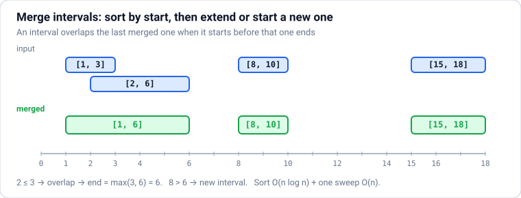

### Theory

> **In simple words:** an interval is a time slot (start, end). Sort the slots by start time, and then only **neighbouring** slots can overlap, so one pass from left to right handles them.

An **interval** is a range `[start, end]`: a meeting from 9 to 11, a booking, a section of a road. Interval problems ask which ranges overlap, how to combine them, or how many overlap at once.

**When do two intervals overlap?** `[a, b]` and `[c, d]` overlap exactly when **`a <= d and c <= b`** (each starts before the other ends). Read the problem carefully: are touching intervals like `[1, 3]` and `[3, 5]` overlapping? Usually yes for merging, and usually no for meetings (one ends as the next begins).

**Almost every interval problem starts by sorting.** After sorting by start (Section [17](#17-basic-sorting-selection-bubble-and-insertion-sort)), any interval can only overlap the ones right next to it, so a single left-to-right sweep is enough:

- **Merge:** keep the last merged interval. If the next one starts before (or when) it ends, extend its end with `max`; otherwise start a new merged interval. O(n log n) for the sort + O(n) for the sweep.
- **Insert into a sorted, non-overlapping list:** copy everything that ends before the new one starts, merge everything that overlaps it, then copy the rest. O(n), no sort needed.
- **Maximum overlap at any moment** (the minimum number of meeting rooms): sort the **starts** and the **ends** separately and sweep them with two pointers (Section [22](#22-two-pointers)). A start before the next end means one more meeting is running; otherwise one has finished. The largest running count is the answer.
- **Intersection of two sorted lists of intervals:** two pointers. The overlap of two intervals is `[max(starts), min(ends)]` when that's non-empty; then move past whichever interval ends first.

Choosing the most non-overlapping intervals is a greedy problem (sort by **end**), covered in Section [48](#48-greedy-algorithms).

**Used in real software:** calendar apps finding free slots and double bookings, meeting-room and hotel booking systems, CPU and job scheduling, and genome analysis (overlapping DNA regions). Databases use **interval trees** for fast "what overlaps this range?" queries.

### Python

```python
def merge(intervals):
    intervals = sorted(intervals)                   # by start (then end)
    merged = [intervals[0][:]]                     # a copy, so the input isn't changed
    for start, end in intervals[1:]:
        if start <= merged[-1][1]:                  # overlaps the last merged one
            merged[-1][1] = max(merged[-1][1], end)
        else:
            merged.append([start, end])
    return merged

def insert(intervals, new):
    out, i, n = [], 0, len(intervals)
    while i < n and intervals[i][1] < new[0]:       # ends before new starts
        out.append(intervals[i]); i += 1
    start, end = new
    while i < n and intervals[i][0] <= end:         # overlaps: absorb it
        start, end = min(start, intervals[i][0]), max(end, intervals[i][1])
        i += 1
    out.append([start, end])
    out.extend(intervals[i:])                       # everything after
    return out

merge([[1, 3], [8, 10], [2, 6], [15, 18]])          # → [[1, 6], [8, 10], [15, 18]]
merge([[1, 4], [4, 5]])                             # → [[1, 5]]
insert([[1, 2], [3, 5], [6, 7], [8, 10], [12, 16]], [4, 8])   # → [[1, 2], [3, 10], [12, 16]]
```

`out.extend(other_list)` appends every item of another list.

```python
def min_meeting_rooms(meetings):
    starts = sorted(s for s, e in meetings)
    ends = sorted(e for s, e in meetings)
    rooms = best = 0
    j = 0
    for s in starts:
        while ends[j] <= s:                         # meetings that finished free a room
            rooms -= 1
            j += 1
        rooms += 1
        best = max(best, rooms)
    return best

def interval_intersection(a, b):
    i = j = 0
    out = []
    while i < len(a) and j < len(b):
        lo, hi = max(a[i][0], b[j][0]), min(a[i][1], b[j][1])
        if lo <= hi:
            out.append([lo, hi])
        if a[i][1] < b[j][1]:                       # move past whichever ends first
            i += 1
        else:
            j += 1
    return out

min_meeting_rooms([[0, 30], [5, 10], [15, 20]])     # → 2
min_meeting_rooms([[1, 5], [5, 8], [8, 9]])         # → 1
interval_intersection([[0, 2], [5, 10], [13, 23], [24, 25]], [[1, 5], [8, 12], [15, 24], [25, 26]])   # → [[1, 2], [5, 5], [8, 10], [15, 23], [24, 24], [25, 25]]
```

**Common mistakes:**

- ❌ Forgetting to sort first (merging only works on sorted intervals).
- ❌ Setting the merged end to the new interval's end instead of `max(...)`: `[1, 10]` merged with `[2, 3]` must stay `[1, 10]`.
- ❌ Getting touching intervals wrong. Decide `<` vs `<=` from the problem statement, and test `[1, 4], [4, 5]`.

### Practice

| # | LeetCode problem | Difficulty |
|---|---|---|
| 1 | [56. Merge Intervals](https://leetcode.com/problems/merge-intervals/) | 🟡 Medium |
| 2 | [57. Insert Interval](https://leetcode.com/problems/insert-interval/) | 🟡 Medium |
| 3 | [986. Interval List Intersections](https://leetcode.com/problems/interval-list-intersections/) | 🟡 Medium |
| 4 | [2406. Divide Intervals Into Minimum Number of Groups](https://leetcode.com/problems/divide-intervals-into-minimum-number-of-groups/) (meeting rooms) | 🟡 Medium |
| 5 | [1288. Remove Covered Intervals](https://leetcode.com/problems/remove-covered-intervals/) | 🟡 Medium |
| 6 | [452. Minimum Number of Arrows to Burst Balloons](https://leetcode.com/problems/minimum-number-of-arrows-to-burst-balloons/) | 🟡 Medium |

**Learn & visualise:** [GeeksforGeeks: Merge overlapping intervals](https://www.geeksforgeeks.org/dsa/merging-intervals/)

---

## 28. Binary Search on the Answer

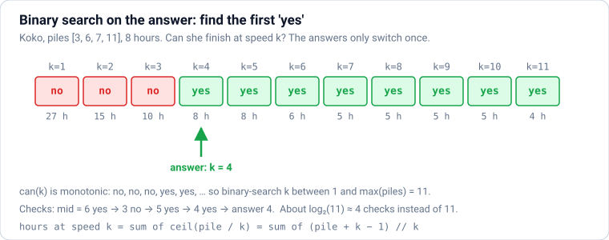

### Theory

> **In simple words:** if you can check "does this answer work?" and the checks go no, no, no, yes, yes, yes as the answer grows, then binary search finds the smallest answer that works, without trying them all.

Section [18](#18-searching-linear-search-and-binary-search) searched a sorted list for an **item**. The same halving idea can search for an **answer**, which is binary search's most powerful use.

It works whenever you can ask a **yes/no question about a candidate answer** whose replies look like this as the candidate grows:

> no, no, no, …, no, **yes**, yes, yes, …

(or the other way round). This property is called **monotonic**: once the answer becomes "yes", it stays "yes". Then the smallest "yes" is found with binary search over the **range of possible answers**, asking the question at the middle each time.

**Example:** Koko eats bananas from piles at speed k bananas per hour and must finish within h hours. "Can she finish at speed k?" is no, no, …, yes, yes as k grows (eating faster never hurts). So binary-search k between 1 and the biggest pile, and each check costs one pass over the piles.

**The recipe:**

1. What's the answer, and what's its **smallest and largest possible value**? That's `lo` and `hi`.
2. Write `can(x)`: a yes/no check for a candidate answer, usually a simple O(n) loop.
3. Make sure `can` is monotonic.
4. Binary search for the first `x` where `can(x)` is true, using the half-open template: if `can(mid)`, the answer is `mid` or smaller (`hi = mid`); otherwise it's bigger (`lo = mid + 1`).

Total cost: O(n × log(range)). Even a range of 10⁹ needs only about 30 checks.

**Clues in the problem:** "minimum speed/capacity/time such that…", "maximise the minimum…", "minimise the maximum…", or a huge answer range with a cheap way to *check* a candidate.

**Rounding up division:** "hours to eat a pile of p at speed k" is p / k rounded **up**, which is `(p + k - 1) // k` in integers.

**Used in real software:** capacity planning ("the fewest servers that handle the peak load"), finding the largest image quality that fits a size limit, and tuning thresholds. `git bisect` is the same idea over time: "is the bug present at this commit?" is no, no, …, yes, yes.

### Python

```python
def integer_sqrt(n):
    """Largest r with r*r <= n: the answer line is yes, yes, ..., yes, no, no."""
    lo, hi = 0, n
    while lo < hi:
        mid = (lo + hi + 1) // 2                 # round up so the range always shrinks
        if mid * mid <= n:
            lo = mid                             # mid works; the answer is mid or bigger
        else:
            hi = mid - 1
    return lo

def min_eating_speed(piles, hours):
    """Binary search on the answer: the smallest speed k that finishes within `hours`."""
    def can_finish(k):
        total = 0
        for p in piles:
            total += (p + k - 1) // k            # hours for this pile, rounded up
        return total <= hours                    # monotonic in k
    lo, hi = 1, max(piles)
    while lo < hi:
        mid = (lo + hi) // 2
        if can_finish(mid):
            hi = mid
        else:
            lo = mid + 1
    return lo

integer_sqrt(50), integer_sqrt(49), integer_sqrt(10**18)   # → (7, 7, 1000000000)
min_eating_speed([3, 6, 7, 11], 8)                         # → 4
```

`integer_sqrt` searches for the **last** "yes" instead of the first "no". That's why it rounds `mid` up: with `lo = mid` and `mid` rounded down, a range of two numbers would never shrink.

### Practice

| # | LeetCode problem | Difficulty |
|---|---|---|
| 1 | [69. Sqrt(x)](https://leetcode.com/problems/sqrtx/) | 🟢 Easy |
| 2 | [367. Valid Perfect Square](https://leetcode.com/problems/valid-perfect-square/) | 🟢 Easy |
| 3 | [875. Koko Eating Bananas](https://leetcode.com/problems/koko-eating-bananas/) | 🟡 Medium |
| 4 | [1011. Capacity To Ship Packages Within D Days](https://leetcode.com/problems/capacity-to-ship-packages-within-d-days/) | 🟡 Medium |
| 5 | [1482. Minimum Number of Days to Make m Bouquets](https://leetcode.com/problems/minimum-number-of-days-to-make-m-bouquets/) | 🟡 Medium |
| 6 | [410. Split Array Largest Sum](https://leetcode.com/problems/split-array-largest-sum/) | 🔴 Hard |
| 7 | [4. Median of Two Sorted Arrays](https://leetcode.com/problems/median-of-two-sorted-arrays/) | 🔴 Hard |

**Learn & visualise:** [GeeksforGeeks: Binary Search](https://www.geeksforgeeks.org/dsa/binary-search/)

---

## 29. Merge Sort and Quick Sort

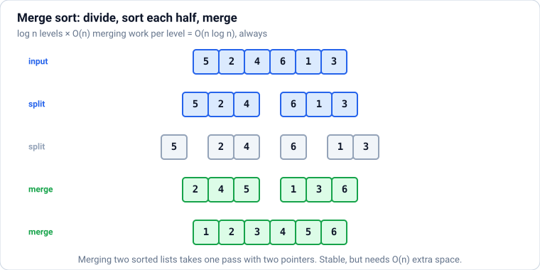

### Theory

> **In simple words:** both split the problem into halves. **Merge sort** splits the list, sorts each half, and zips the halves together. **Quick sort** picks a pivot, puts smaller items on its left and bigger on its right, and repeats on each side.

The basic sorts from Section [17](#17-basic-sorting-selection-bubble-and-insertion-sort) are O(n²). **Merge sort** and **quick sort** reach **O(n log n)** with an idea called **divide and conquer**:

1. **Divide** the problem into smaller pieces of the same kind.
2. **Conquer** each piece recursively (Section [14](#14-recursion-basics)); a list of 0 or 1 items is already sorted, which is the base case.
3. **Combine** the pieces' answers.

**Merge sort** splits the list in half, sorts each half recursively, then **merges** the two sorted halves with two pointers (Section [22](#22-two-pointers)): repeatedly take the smaller of the two front items. As the picture shows, there are about log₂ n levels of halving, and each level does O(n) merging work, so O(n log n) in total, always.

**Quick sort** picks a **pivot** item and splits the list into items smaller than it, equal to it and bigger than it, then sorts the smaller and bigger parts recursively. With a pivot near the middle value, each split roughly halves the list: O(n log n). With a terrible pivot every time (for example, always the smallest item), each split removes only one item: O(n²). Picking the pivot at random makes that practically impossible.

**Partitioning in place.** Real quick sorts don't build new lists. They **partition** the list in place: move every item smaller than the pivot to the left part, then put the pivot right after them. The pivot is now in its **final sorted position**.

**Quickselect** uses that fact to find the **k-th smallest** item without sorting everything. After one partition, the pivot's position tells you which side holds the k-th item, so you recurse (or loop) into **one** side only. On average the work is n + n/2 + n/4 + … ≈ 2n, so **O(n) average** (O(n²) worst case, made unlikely by a random pivot). It's the standard answer to "k-th largest element" when O(n log n) sorting is considered too slow.

| Algorithm | Best | Average | Worst | Extra space | Stable | Notes |
|---|---|---|---|---|---|---|
| Bubble / insertion | O(n) | O(n²) | O(n²) | O(1) | Yes | Insertion sort is fast on small or nearly-sorted data |
| Selection | O(n²) | O(n²) | O(n²) | O(1) | No | Fewest swaps |
| **Merge sort** | O(n log n) | O(n log n) | O(n log n) | O(n) | Yes | Divide and conquer; always O(n log n) |
| **Quick sort** | O(n log n) | O(n log n) | O(n²) | O(log n) | No | Fast in practice; a random pivot avoids the worst case |
| Counting / radix | O(n + k) | O(n + k) | O(n + k) | O(n + k) | Yes | k = range of values; small integer ranges only |

- **Sorts that only compare items can't beat O(n log n)** in the worst case (a mathematical lower bound). Counting sort beats it by not comparing: it counts each value, like the counting list in Section [19](#19-hashing-dictionaries-and-sets), so it only works for small integer ranges.
- Heap sort, another O(n log n) sort, appears with heaps in Section [39](#39-heaps-and-priority-queues).
- **Python's `sorted()` / `list.sort()` use Timsort** (a merge/insertion hybrid). It's stable, O(n log n) worst case, and O(n) on already-sorted runs. In real code, always use it with `key=`; implement sorts yourself only to learn or when an interview asks.

**What real languages use in 2026.** No production sort is a "pure" textbook algorithm: they're **hybrids** that combine a fast general method, insertion sort for small pieces, and special handling for data that's already partly sorted.

| Language | Built-in sort | Notes |
|---|---|---|
| Python (`sorted`, `list.sort`) | An adaptive merge sort (Timsort); since CPython 3.11 it decides which runs to merge with the **Powersort** rule | Stable; O(n) on already-sorted data |
| Java | Dual-pivot quick sort for primitive arrays; TimSort for objects | Objects need a stable sort |
| C++ | `std::sort`: typically **introsort** (quick sort that falls back to heap sort if it recurses too deep, plus insertion sort for small pieces); `std::stable_sort`: merge sort | Guaranteed O(n log n) |
| Go (1.19+) | **pdqsort** ("pattern-defeating quick sort") | Detects and avoids bad patterns |
| Rust (1.81+, 2024) | **driftsort** (stable `sort`) and **ipnsort** (`sort_unstable`) | Newer designs tuned for modern CPUs |
| JavaScript (V8, in Chrome and Node.js) | TimSort | `Array.prototype.sort` has been required to be stable since ES2019 |

The lesson for interviews: know merge sort and quick sort deeply, and mention that real libraries are tuned hybrids of them. Section [57](#57-whats-new-recent-breakthroughs-and-modern-practice-20222026) describes how an AI system (DeepMind's AlphaDev) even found faster routines for sorting tiny arrays that were added to LLVM's C++ library in 2023.

### Python

```python
def merge_sort(a):
    if len(a) <= 1:
        return a
    mid = len(a) // 2
    left, right = merge_sort(a[:mid]), merge_sort(a[mid:])
    merged, i, j = [], 0, 0
    while i < len(left) and j < len(right):
        if left[i] <= right[j]:              # <= keeps it stable
            merged.append(left[i]); i += 1
        else:
            merged.append(right[j]); j += 1
    return merged + left[i:] + right[j:]

def quick_sort(a):
    if len(a) <= 1:
        return a
    pivot = a[len(a) // 2]
    return (quick_sort([x for x in a if x < pivot]) + [x for x in a if x == pivot]
            + quick_sort([x for x in a if x > pivot]))

merge_sort([5, 2, 4, 6, 1, 3])                          # → [1, 2, 3, 4, 5, 6]
quick_sort([9, 3, 7, 3, 1])                             # → [1, 3, 3, 7, 9]
merge_sort([("b", 2), ("a", 1), ("c", 2)])             # → [("a", 1), ("b", 2), ("c", 2)]
```

Tuples compare item by item, so the last line sorts by letter first. Merge sort's `<=` in the merge step is what makes it **stable** (Section [17](#17-basic-sorting-selection-bubble-and-insertion-sort)): on a tie it takes from the left half first.

```python
import random

def partition(a, lo, hi):
    """Lomuto partition of a[lo..hi] around a random pivot; returns the pivot's final index."""
    r = random.randint(lo, hi)                   # random index in lo..hi (both included)
    a[r], a[hi] = a[hi], a[r]                    # move the pivot to the end
    pivot, store = a[hi], lo
    for i in range(lo, hi):
        if a[i] < pivot:
            a[i], a[store] = a[store], a[i]      # grow the "smaller than pivot" part
            store += 1
    a[store], a[hi] = a[hi], a[store]            # pivot goes right after the smaller items
    return store

def quick_sort_in_place(a, lo=0, hi=None):
    if hi is None:
        hi = len(a) - 1
    if lo < hi:
        p = partition(a, lo, hi)
        quick_sort_in_place(a, lo, p - 1)
        quick_sort_in_place(a, p + 1, hi)
    return a

def quickselect(a, k):
    """k-th smallest (k = 1 is the minimum), average O(n)."""
    a = a[:]                                     # work on a copy
    lo, hi, target = 0, len(a) - 1, k - 1
    while True:
        p = partition(a, lo, hi)
        if p == target:
            return a[p]
        if p < target:
            lo = p + 1                           # the answer is on the right
        else:
            hi = p - 1                           # the answer is on the left

quick_sort_in_place([9, 3, 7, 3, 1, 8])                 # → [1, 3, 3, 7, 8, 9]
quickselect([3, 2, 1, 5, 6, 4], 2)                      # → 2
nums = [3, 2, 3, 1, 2, 4, 5, 5, 6]
quickselect(nums, len(nums) - 4 + 1)                    # → 4   (the 4th largest)
```

`random.randint(lo, hi)` (from the `random` module) picks a random whole number between `lo` and `hi`, both included. The pivot is random, but the results are always the same.

### Practice

| # | LeetCode problem | Difficulty |
|---|---|---|
| 1 | [88. Merge Sorted Array](https://leetcode.com/problems/merge-sorted-array/) | 🟢 Easy |
| 2 | [75. Sort Colors](https://leetcode.com/problems/sort-colors/) | 🟡 Medium |
| 3 | [912. Sort an Array](https://leetcode.com/problems/sort-an-array/) | 🟡 Medium |
| 4 | [56. Merge Intervals](https://leetcode.com/problems/merge-intervals/) | 🟡 Medium |
| 5 | [215. Kth Largest Element in an Array](https://leetcode.com/problems/kth-largest-element-in-an-array/) | 🟡 Medium |

**Learn & visualise:** [GeeksforGeeks: Sorting](https://www.geeksforgeeks.org/dsa/sorting-algorithms/) · [VisuAlgo: Sorting (animated)](https://visualgo.net/en/sorting)

---

### ✅ Part 4 checkpoint

Without looking, can you:

- [ ] Follow the five-step method on a new problem, starting with a brute force and its Big-O?
- [ ] Solve "pair with a given sum in a sorted array" with two pointers, and say why it's correct?
- [ ] Write a fixed-size and a variable-size sliding window, and answer range sums with prefix sums?
- [ ] Write Kadane's algorithm, the Dutch national flag partition and next permutation?
- [ ] Print a matrix in spiral order, rotate it in place, and search a sorted matrix?
- [ ] Merge and insert intervals, and count the most overlapping meetings?
- [ ] Recognise a monotonic yes/no question and binary-search the answer?
- [ ] Write merge sort and quickselect, and explain their complexities?

So far every structure has been built into Python. Part 5 shows how to **build your own**.

---

# Part 5 — Moderate: Linked Lists, Stacks, Queues and Design

> **Goal:** Build structures Python doesn't have, out of objects linked together, and combine structures to design classes.  
> **You need:** Parts 1–4.

---

## 30. Classes, Objects and Nodes

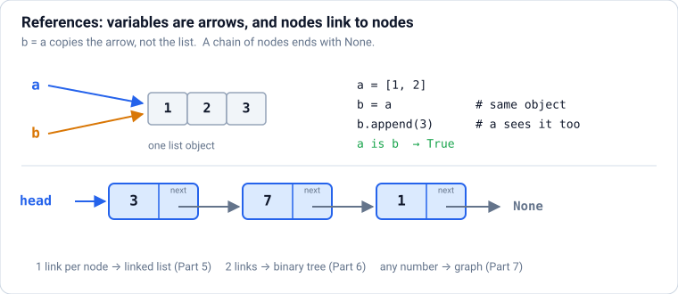

### Theory

> **In simple words:** a class is a **blueprint** ("every student has a name and marks"), and an object is one **thing built from it** (Asha, with her marks). A node is a tiny object that holds a value and **arrows to other nodes**.

Python gives you lists, strings, dicts and sets. The rest of DSA (linked lists, trees, graphs) uses structures Python **doesn't** have built in, so you build them yourself out of small pieces called **nodes**. That needs two ideas: **classes** and **references**.

**1. Classes and objects.** A **class** is a blueprint; an **object** is one thing built from it. `class Student:` describes what every student has; `Student("Asha", [90, 85])` builds one particular student.

- `__init__` is the **setup function**. It runs automatically when you create an object, and stores the starting data.
- `self` means **"this particular object"**. `self.name = name` stores the name inside this student. Every function in a class takes `self` first, but you don't pass it yourself: `asha.average()` passes `asha` as `self` automatically.
- Data stored on an object (`self.name`) is called an **attribute**; a function inside a class (`average`) is a **method**.

**2. References: variables are arrows, not boxes.** In Python a variable doesn't *contain* an object; it **points to** it (see the picture). So:

- `b = a` makes `b` point to the **same** object as `a`, not a copy. Changing the object through `b` is visible through `a`. (That's why Section [15](#15-arrays-and-python-lists) warned that `b = a` doesn't copy a list.)
- `a is b` asks "do they point to the same object?"; `a == b` asks "do they hold equal values?".
- `None` means "points to nothing". It marks the end of a chain.

**3. Nodes.** A **node** is a small object that holds a **value** plus **references to other nodes**. Linking nodes together builds every structure in the rest of these notes:

| Links per node | Structure | Where |
|---|---|---|
| 1 (`next`) | Linked list: a chain | Section [31](#31-linked-lists) |
| 2 (`left`, `right`) | Binary tree: a family tree | Section [36](#36-binary-trees-and-traversals) |
| Any number (a list of neighbours) | Graph: a network | Section [41](#41-graphs-representation-bfs-and-dfs) |

**Walking a chain** is the most important loop in Part 5: start at the first node, and move with `current = current.next` until `current` is `None`.

**Used in real software:** almost all modern software is organised into classes and objects: a web framework's `Request` and `User`, a game's `Player`, a GUI's `Button`. The node-and-reference idea is how browsers store web pages (the DOM tree), how databases link records, and how Python itself stores lists of objects (as references).

### Python

```python
class Student:
    def __init__(self, name, marks):      # runs when a Student is created
        self.name = name                  # attributes: data stored on this object
        self.marks = marks

    def average(self):                    # a method: a function that belongs to the class
        return sum(self.marks) / len(self.marks)

    def add_mark(self, m):
        self.marks.append(m)

asha = Student("Asha", [90, 85])
ravi = Student("Ravi", [70, 64, 82])
asha.add_mark(95)
asha.name, asha.marks, asha.average(), ravi.average()   # → ("Asha", [90, 85, 95], 90.0, 72.0)
```

```python
a = [1, 2]
b = a                  # b points to the SAME list
b.append(3)
a                      # → [1, 2, 3]
c = [1, 2, 3]
a == c, a is c, a is b # → (True, False, True)
```

```python
class Node:
    def __init__(self, val, next=None):
        self.val = val                    # the data
        self.next = next                  # a reference to the next node (None = end)

# build the chain 3 → 7 → 1 by hand
third = Node(1)
second = Node(7, third)
first = Node(3, second)

def walk(node):
    values = []
    while node is not None:               # stop at the end of the chain
        values.append(node.val)
        node = node.next                  # follow the arrow
    return values

walk(first)                               # → [3, 7, 1]
first.next.next.val                       # → 1
second.next = None                        # cut the chain after 7
walk(first)                               # → [3, 7]
```

**Common mistakes:**

- ❌ Forgetting `self` as the first parameter of a method, or writing `name = name` instead of `self.name = name` (then the value is lost when `__init__` ends).
- ❌ Following `node.next` without checking for `None` first: `AttributeError: 'NoneType' object has no attribute 'val'`.
- ❌ Losing the start of a chain by moving the only variable that pointed to it. Walk with a separate variable (`node = first`).

### Practice

1. Write a class `Rectangle` with `width` and `height` attributes and methods `area()` and `perimeter()`.
2. Build a chain of nodes holding 1 → 2 → 3 → 4 with a loop, and write `count_nodes(head)`.

<details>
<summary><b>Answer</b></summary>

```python
class Rectangle:
    def __init__(self, width, height):
        self.width = width
        self.height = height

    def area(self):
        return self.width * self.height

    def perimeter(self):
        return 2 * (self.width + self.height)

def count_nodes(head):
    count = 0
    while head is not None:
        count += 1
        head = head.next
    return count

head = None
for v in [4, 3, 2, 1]:                    # build from the back, so 1 ends up first
    head = Node(v, head)

r = Rectangle(3, 4)
print(r.area(), r.perimeter(), walk(head), count_nodes(head))
```

**Output:**

```text
12 14 [1, 2, 3, 4] 4
```

</details>

| # | LeetCode problem | Difficulty |
|---|---|---|
| 1 | [1603. Design Parking System](https://leetcode.com/problems/design-parking-system/) (your first class) | 🟢 Easy |
| 2 | [1290. Convert Binary Number in a Linked List to Integer](https://leetcode.com/problems/convert-binary-number-in-a-linked-list-to-integer/) (walk a chain + Section [12](#12-number-systems-decimal-and-binary)) | 🟢 Easy |

**Learn & visualise:** [The Python tutorial: Classes](https://docs.python.org/3/tutorial/classes.html) · [Python Tutor](https://pythontutor.com/visualize.html) (it draws references as arrows)

---

## 31. Linked Lists

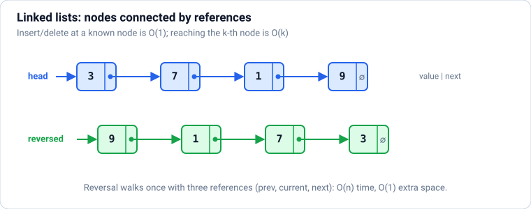

### Theory

> **In simple words:** a linked list is a **chain** of nodes: each node holds a value and an arrow to the next one. You can add or remove links anywhere without shifting everything, but to reach the 100th node you must follow 99 arrows.

A **linked list** is the chain of nodes from Section [30](#30-classes-objects-and-nodes): each node holds a value and a reference to the **next** node, and the last node's `next` is `None`. The list is known by its first node, the **head**. (In a **doubly** linked list, each node also points back to the **previous** node.)

**Linked list vs array (Python list):**

| Operation | Linked list | Array (list) |
|---|---|---|
| Access the k-th item | O(k): walk from the head | O(1) |
| Insert/delete at the head | **O(1)**: change one arrow | O(n): everything shifts |
| Insert/delete after a node you already have | **O(1)** | O(n) |
| Search for a value | O(n) | O(n) |
| Memory | An extra reference per node; nodes scattered in memory | Compact, side by side |

Linked lists win when you add and remove at the front (or at known places) a lot; arrays win for jumping to positions. In Python you'll rarely need one in real code, but they're an interview favourite because they test careful pointer handling.

**The basic operations** (all in the code below):

- **Traverse / length / search:** walk from the head with `node = node.next`.
- **Insert at the head:** the new node points at the old head, and becomes the new head. O(1).
- **Insert at the end:** walk to the last node (the one whose `next` is `None`), then attach. O(n).
- **Delete a value:** find the node **before** it, then skip over it: `prev.next = prev.next.next`.

**Key techniques:**

- **A dummy (sentinel) head:** a fake node in front of the real head, so inserting or deleting the first node needs no special case. Return `dummy.next` at the end.
- **In-place reversal** with three variables `prev`, `curr` and `nxt`: turn each arrow around, one node at a time.
- **Fast and slow pointers:** `slow` moves 1 step and `fast` moves 2. When `fast` reaches the end, `slow` is at the **middle**. If the list has a **cycle** (a loop back to an earlier node), `fast` eventually laps `slow` and they meet (Floyd's cycle detection).
- **Merging two sorted lists:** repeatedly take the smaller head, like the merge step of merge sort.

**Used in real software:** the Linux kernel uses doubly linked lists all over (processes, open files); LRU caches combine a linked list with a dict (Section [35](#35-design-problems-min-stack-queue-from-stacks-lru-cache)); memory allocators keep "free lists"; and undo histories are often linked. In everyday application code, though, arrays usually win: they're cache-friendly (Section [15](#15-arrays-and-python-lists)), so use Python lists unless you truly need O(1) inserts in the middle.

### Python

```python
class ListNode:
    def __init__(self, val, next=None):
        self.val, self.next = val, next

def build(values):                        # Python list → linked list
    dummy = ListNode(0)
    tail = dummy
    for v in values:
        tail.next = ListNode(v)
        tail = tail.next
    return dummy.next

def to_list(head):                        # linked list → Python list (for printing)
    out = []
    while head:                           # a node counts as True, None as False
        out.append(head.val)
        head = head.next
    return out

def insert_at_head(head, val):            # O(1)
    return ListNode(val, head)

def insert_at_end(head, val):             # O(n): walk to the last node
    new = ListNode(val)
    if head is None:
        return new
    node = head
    while node.next:
        node = node.next
    node.next = new
    return head

def delete_value(head, val):              # remove the first node holding val
    dummy = ListNode(0, head)
    prev = dummy
    while prev.next and prev.next.val != val:
        prev = prev.next
    if prev.next:
        prev.next = prev.next.next        # skip over the node
    return dummy.next

head = build([3, 7, 1])
head = insert_at_head(head, 9)
head = insert_at_end(head, 4)
to_list(head)                             # → [9, 3, 7, 1, 4]
to_list(delete_value(head, 9)), to_list(delete_value(build([1, 2, 3]), 2))   # → ([3, 7, 1, 4], [1, 3])
```

`while head:` works because Python treats `None` as false and any node as true.

```python
def reverse(head):                        # O(n) time, O(1) space
    prev = None
    while head:
        nxt = head.next                   # remember the rest of the list
        head.next = prev                  # turn the arrow around
        prev, head = head, nxt
    return prev

def middle(head):                         # slow moves 1, fast moves 2
    slow = fast = head
    while fast and fast.next:
        slow, fast = slow.next, fast.next.next
    return slow.val

def has_cycle(head):                      # Floyd's tortoise and hare
    slow = fast = head
    while fast and fast.next:
        slow, fast = slow.next, fast.next.next
        if slow is fast:
            return True
    return False

def merge_sorted(a, b):
    dummy = tail = ListNode(0)
    while a and b:
        if a.val <= b.val:
            tail.next, a = a, a.next
        else:
            tail.next, b = b, b.next
        tail = tail.next
    tail.next = a or b                    # attach whatever is left
    return dummy.next

to_list(reverse(build([3, 7, 1, 9])))     # → [9, 1, 7, 3]
middle(build([1, 2, 3, 4, 5]))            # → 3
looped = build([1, 2, 3])
looped.next.next.next = looped            # 3 → back to 1
has_cycle(looped), has_cycle(build([1, 2]))   # → (True, False)
to_list(merge_sorted(build([1, 4, 6]), build([2, 3, 7])))   # → [1, 2, 3, 4, 6, 7]
```

`a or b` gives `a` if it isn't `None`, otherwise `b`.

**Common mistakes:**

- ❌ Losing the rest of the list by changing `node.next` before saving it (`nxt = head.next` must come first when reversing).
- ❌ Reading `node.next.val` when `node.next` might be `None`.
- ❌ Forgetting the "empty list" and "one node" cases. A dummy head removes most special cases.

### Practice

| # | LeetCode problem | Difficulty |
|---|---|---|
| 1 | [876. Middle of the Linked List](https://leetcode.com/problems/middle-of-the-linked-list/) | 🟢 Easy |
| 2 | [206. Reverse Linked List](https://leetcode.com/problems/reverse-linked-list/) | 🟢 Easy |
| 3 | [21. Merge Two Sorted Lists](https://leetcode.com/problems/merge-two-sorted-lists/) | 🟢 Easy |
| 4 | [141. Linked List Cycle](https://leetcode.com/problems/linked-list-cycle/) | 🟢 Easy |
| 5 | [203. Remove Linked List Elements](https://leetcode.com/problems/remove-linked-list-elements/) | 🟢 Easy |
| 6 | [19. Remove Nth Node From End of List](https://leetcode.com/problems/remove-nth-node-from-end-of-list/) | 🟡 Medium |
| 7 | [707. Design Linked List](https://leetcode.com/problems/design-linked-list/) | 🟡 Medium |

**Learn & visualise:** [GeeksforGeeks: Linked List](https://www.geeksforgeeks.org/dsa/linked-list-data-structure/) · [VisuAlgo: Linked List](https://visualgo.net/en/list)

---

## 32. Linked List Interview Problems

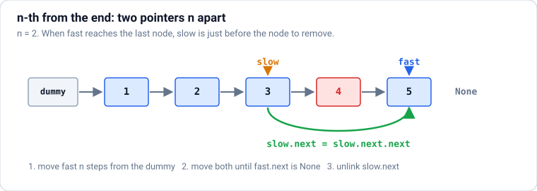

### Theory

> **In simple words:** almost every linked-list question is solved with the same four tools: a dummy node, fast and slow pointers, two pointers a fixed gap apart, and reversing links in place.

Almost every linked list interview question combines four tools from Section [31](#31-linked-lists):

| Tool | What it gives you |
|---|---|
| **Dummy head** | No special case when the head itself changes |
| **Fast and slow pointers** | The middle; cycles |
| **Two pointers a fixed gap apart** | The n-th node from the end in one pass |
| **In-place reversal** | Reversing all, half, or groups of the list |

**The classic problems and their ideas:**

1. **Remove the n-th node from the end.** Move `fast` n steps ahead, then move `fast` and `slow` together until `fast` reaches the last node. `slow` is then just before the node to delete (see the picture). One pass, O(1) space.
2. **Palindrome linked list.** Find the middle (fast/slow), reverse the second half, then compare the two halves node by node. O(n) time, O(1) space.
3. **Intersection of two lists.** Walk pointer `a` along list A then list B, and pointer `b` along B then A. Both walk the same total distance, so they meet at the shared node, or both reach `None` together if there isn't one.
4. **Add two numbers** stored as digit lists (least significant digit first): add digit by digit with a **carry**, exactly like the digit arithmetic of Section [7](#7-working-with-digits): `digit = total % 10`, `carry = total // 10`.
5. **Reverse in groups of k.** Check that k nodes remain, reverse those k with the usual three-pointer loop, then connect the reversed group to the previous part and continue. Leftover nodes (fewer than k) stay as they are.
6. **Copy a list with random pointers.** Each node has a `next` and a `random` arrow. Make a dict from every old node to its new copy (first pass), then set `next` and `random` on the copies using the dict (second pass).

### Python

```python
class ListNode:
    def __init__(self, val, next=None):
        self.val, self.next = val, next

def build(values):
    dummy = tail = ListNode(0)
    for v in values:
        tail.next = ListNode(v)
        tail = tail.next
    return dummy.next

def to_list(head):
    out = []
    while head:
        out.append(head.val)
        head = head.next
    return out

def remove_nth_from_end(head, n):
    dummy = ListNode(0, head)
    fast = slow = dummy
    for _ in range(n):
        fast = fast.next                        # open a gap of n nodes
    while fast.next:
        fast, slow = fast.next, slow.next       # move together
    slow.next = slow.next.next                  # slow is just before the target
    return dummy.next

def is_palindrome(head):
    slow = fast = head
    while fast and fast.next:                   # 1. find the middle
        slow, fast = slow.next, fast.next.next
    prev = None
    while slow:                                 # 2. reverse the second half
        slow.next, prev, slow = prev, slow, slow.next
    left, right = head, prev
    while right:                                # 3. compare the halves
        if left.val != right.val:
            return False
        left, right = left.next, right.next
    return True

def intersection(a_head, b_head):
    a, b = a_head, b_head
    while a is not b:
        a = a.next if a else b_head             # switch to the other list at the end
        b = b.next if b else a_head
    return a                                    # the shared node, or None

to_list(remove_nth_from_end(build([1, 2, 3, 4, 5]), 2))   # → [1, 2, 3, 5]
to_list(remove_nth_from_end(build([1]), 1))               # → []
is_palindrome(build([1, 2, 2, 1])), is_palindrome(build([1, 2, 3]))   # → (True, False)
shared = build([8, 4, 5])
a = ListNode(4, ListNode(1, shared))
b = ListNode(5, ListNode(6, ListNode(1, shared)))
intersection(a, b).val, intersection(build([1]), build([2]))   # → (8, None)
```

`slow.next, prev, slow = prev, slow, slow.next` does the three reversal steps in one line: Python evaluates the whole right side first, then assigns left to right.

```python
def add_two_numbers(l1, l2):
    dummy = tail = ListNode(0)
    carry = 0
    while l1 or l2 or carry:
        total = carry + (l1.val if l1 else 0) + (l2.val if l2 else 0)
        tail.next = ListNode(total % 10)        # this digit
        carry = total // 10                     # carry to the next digit
        tail = tail.next
        l1 = l1.next if l1 else None
        l2 = l2.next if l2 else None
    return dummy.next

def reverse_k_group(head, k):
    dummy = ListNode(0, head)
    group_prev = dummy
    while True:
        kth = group_prev
        for _ in range(k):                      # are there k nodes left?
            kth = kth.next
            if kth is None:
                return dummy.next
        group_next = kth.next
        prev, curr = group_next, group_prev.next
        while curr is not group_next:           # reverse this group of k
            curr.next, prev, curr = prev, curr, curr.next
        first = group_prev.next                 # becomes the group's last node
        group_prev.next = kth
        group_prev = first

class RandomNode:
    def __init__(self, val, next=None, random=None):
        self.val, self.next, self.random = val, next, random

def copy_random_list(head):
    copy = {None: None}
    node = head
    while node:                                 # pass 1: a copy of every node
        copy[node] = RandomNode(node.val)
        node = node.next
    node = head
    while node:                                 # pass 2: wire up the copies
        copy[node].next = copy[node.next]
        copy[node].random = copy[node.random]
        node = node.next
    return copy[head]

to_list(add_two_numbers(build([2, 4, 3]), build([5, 6, 4])))   # → [7, 0, 8]   (342 + 465 = 807)
to_list(reverse_k_group(build([1, 2, 3, 4, 5]), 2))            # → [2, 1, 4, 3, 5]
x, y = RandomNode(7), RandomNode(13)
x.next, y.random, x.random = y, x, None
c = copy_random_list(x)
c.val, c.next.val, c.next.random.val, c is x, c.next.random is c   # → (7, 13, 7, False, True)
```

Nodes can be dict keys: each object is hashable by its identity.

**Common mistakes:**

- ❌ Forgetting the dummy head in "remove n-th from end", which breaks when the head itself is removed.
- ❌ Losing the rest of the list in a reversal: always save `next` before changing it.
- ❌ In "add two numbers", forgetting the final carry (99 + 1 needs a new node).

### Practice

| # | LeetCode problem | Difficulty |
|---|---|---|
| 1 | [234. Palindrome Linked List](https://leetcode.com/problems/palindrome-linked-list/) | 🟢 Easy |
| 2 | [160. Intersection of Two Linked Lists](https://leetcode.com/problems/intersection-of-two-linked-lists/) | 🟢 Easy |
| 3 | [19. Remove Nth Node From End of List](https://leetcode.com/problems/remove-nth-node-from-end-of-list/) | 🟡 Medium |
| 4 | [2. Add Two Numbers](https://leetcode.com/problems/add-two-numbers/) | 🟡 Medium |
| 5 | [143. Reorder List](https://leetcode.com/problems/reorder-list/) | 🟡 Medium |
| 6 | [138. Copy List with Random Pointer](https://leetcode.com/problems/copy-list-with-random-pointer/) | 🟡 Medium |
| 7 | [148. Sort List](https://leetcode.com/problems/sort-list/) (merge sort on a linked list) | 🟡 Medium |
| 8 | [142. Linked List Cycle II](https://leetcode.com/problems/linked-list-cycle-ii/) | 🟡 Medium |
| 9 | [25. Reverse Nodes in k-Group](https://leetcode.com/problems/reverse-nodes-in-k-group/) | 🔴 Hard |

**Learn & visualise:** [VisuAlgo: Linked List](https://visualgo.net/en/list) · [Python Tutor](https://pythontutor.com/visualize.html) (step through a reversal)

---

## 33. Stacks

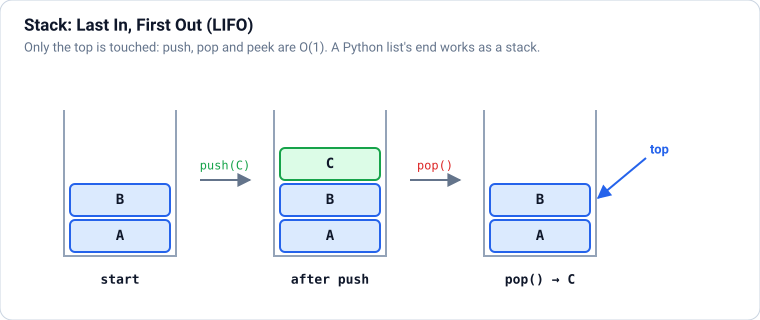

### Theory

> **In simple words:** a stack is a pile. You can only add to the **top** and take from the **top**, so the last thing you put in is the first thing you get back: **Last In, First Out (LIFO)**.

**Everyday picture.** A pile of plates: you put a clean plate on top and take the top plate when you need one. You never pull a plate from the middle.

**The operations (all O(1)):**

| Operation | Meaning | Python (a list used only at its end) |
|---|---|---|
| push | Put an item on top | `stack.append(x)` |
| pop | Remove and return the top item | `stack.pop()` |
| peek / top | Look at the top without removing it | `stack[-1]` |
| is empty? | Anything left? | `not stack` or `len(stack) == 0` |

A plain Python list is a perfect stack as long as you only touch its end (Section [20](#20-pythons-cost-model-what-each-operation-costs)).

**Why "last in, first out" is so useful:** whenever something must be **closed or finished in the reverse order it was opened**, a stack keeps track. Worked example, checking the brackets in `{[()]}`:

| Read | Action | Stack afterwards |
|---|---|---|
| `{` | opening: push | `{` |
| `[` | opening: push | `{ [` |
| `(` | opening: push | `{ [ (` |
| `)` | closing: top is `(`, a match → pop | `{ [` |
| `]` | closing: top is `[`, a match → pop | `{` |
| `}` | closing: top is `{`, a match → pop | *(empty)* |

The stack is empty at the end, so the brackets are balanced. For `([)]`, the `)` arrives while the top is `[`: a mismatch, so it's invalid.

**The monotonic stack** answers "for each item, what's the **next bigger** (or smaller) item to its right?" in O(n). The stack holds the positions still **waiting** for their answer, and their values decrease from bottom to top. When a new, bigger number arrives, it is the answer for every smaller number waiting on top, so pop and answer them all, then push the new one. Every item is pushed once and popped at most once: O(n) in total. The same idea solves "daily temperatures" (how many days until a warmer day?) and "largest rectangle in a histogram".

**When to use a stack (clues):** matching pairs (brackets, HTML tags), "undo", evaluating expressions like `3 4 + 2 *` (postfix notation: push numbers; an operator pops two, computes, and pushes the result), "next greater/smaller element", and turning recursion into a loop.

**Recursion is a stack.** The call stack from Section [14](#14-recursion-basics) is a real stack of waiting function calls, so any recursive algorithm can be rewritten with an explicit stack. Section [41](#41-graphs-representation-bfs-and-dfs) does this for depth-first search.

**Common mistakes:**

- ❌ Calling `stack.pop()` or `stack[-1]` on an empty stack (`IndexError`). Check `if stack` first.
- ❌ Forgetting to check that the stack is empty **at the end** (for `((`, every character was fine, but nothing was closed).
- ❌ Using `list.pop(0)`: that's a queue operation, and slow (Section [34](#34-queues-and-deques)).

**Used in real software:** the **undo** history in editors, the browser's **back** button, the function **call stack** in every programming language, and compilers checking and parsing nested code.

### Python

```python
stack = []
stack.append(1)                                 # push
stack.append(2)
stack.append(3)
stack[-1], stack.pop(), stack                   # → (3, 3, [1, 2])   peek, pop, what's left
len(stack) == 0                                 # → False   (is it empty?)

def valid_brackets(s):
    pairs = {")": "(", "]": "[", "}": "{"}
    stack = []
    for ch in s:
        if ch in "([{":
            stack.append(ch)
        elif not stack or stack.pop() != pairs[ch]:
            return False
    return not stack

def next_greater(nums):
    """For each item, the next bigger item to its right (-1 if none). Monotonic stack: O(n)."""
    result = [-1] * len(nums)
    stack = []                                  # indexes whose answer isn't known yet
    for i, x in enumerate(nums):
        while stack and nums[stack[-1]] < x:
            result[stack.pop()] = x
        stack.append(i)
    return result

valid_brackets("{[()()]}"), valid_brackets("([)]")   # → (True, False)
next_greater([2, 1, 5, 3, 6])                        # → [5, 5, 6, 6, -1]
```

### Practice

| # | LeetCode problem | Difficulty |
|---|---|---|
| 1 | [20. Valid Parentheses](https://leetcode.com/problems/valid-parentheses/) | 🟢 Easy |
| 2 | [155. Min Stack](https://leetcode.com/problems/min-stack/) | 🟡 Medium |
| 3 | [150. Evaluate Reverse Polish Notation](https://leetcode.com/problems/evaluate-reverse-polish-notation/) | 🟡 Medium |
| 4 | [739. Daily Temperatures](https://leetcode.com/problems/daily-temperatures/) | 🟡 Medium |
| 5 | [84. Largest Rectangle in Histogram](https://leetcode.com/problems/largest-rectangle-in-histogram/) | 🔴 Hard |

**Learn & visualise:** [GeeksforGeeks: Stack](https://www.geeksforgeeks.org/dsa/stack-data-structure/) · [VisuAlgo: Stack (list page)](https://visualgo.net/en/list)

---

## 34. Queues and Deques

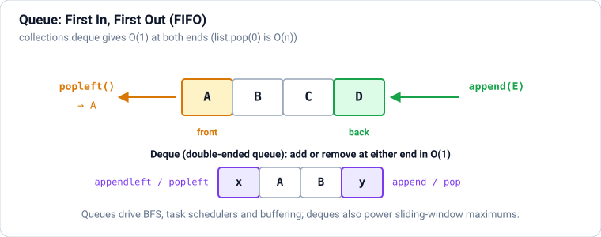

### Theory

> **In simple words:** a queue is a line of people. New people join at the **back**, and the person at the **front** is served first: **First In, First Out (FIFO)**.

**Everyday picture.** The line at a ticket counter. Nobody skips ahead, and nobody leaves from the middle. A **deque** ("deck", a double-ended queue) is a line where people may join or leave at **both** ends.

**The operations:**

| Operation | Meaning | Python `collections.deque` | Cost |
|---|---|---|---|
| enqueue | Join at the back | `q.append(x)` | O(1) |
| dequeue | Leave from the front | `q.popleft()` | O(1) |
| front / back | Look at either end | `q[0]`, `q[-1]` | O(1) |
| Add/remove at the other ends | Deque only | `q.appendleft(x)`, `q.pop()` | O(1) |
| Index the middle | Rarely needed | `q[i]` | O(n) |

Get it with `from collections import deque`. **Never** use `list.pop(0)` as a queue: it shifts every remaining element one place left, which is O(n) per operation (Section [20](#20-pythons-cost-model-what-each-operation-costs)). A deque stores its items in linked blocks, so both ends are O(1).

**Worked example: counting recent requests.** "How many requests arrived in the last 3,000 ms?" Keep the request times in a queue. When a new request arrives at time t, add it at the back, then remove from the front every time older than `t − 3000`. The queue then holds exactly the recent requests, and its length is the answer. Every request is added once and removed once: O(1) amortised per request.

**The monotonic deque** keeps the **maximum of a sliding window** (Section [23](#23-sliding-window)) at its front, in O(n) for the whole array. It's the queue version of the monotonic stack from Section [33](#33-stacks):

1. Before adding a new number, pop every **smaller** number from the back. They can never be a window's maximum again, because the new number is bigger **and** will stay in the window longer.
2. Pop the front if it has slid out of the window.
3. The front is now the window's maximum.

**When to use a queue (clues):** "process in arrival order", "level by level", "shortest number of steps", buffering data between a fast producer and a slow consumer. Queues power **breadth-first search** (BFS) on trees and graphs (Sections [36](#36-binary-trees-and-traversals) and [41](#41-graphs-representation-bfs-and-dfs)).

`queue.Queue` is a different, thread-safe queue for programs running several threads at once. For algorithms, use `deque`.

**Common mistakes:**

- ❌ `list.pop(0)` in a loop, which turns an O(n) algorithm into O(n²).
- ❌ Reading `q[0]` without checking that the queue isn't empty.
- ❌ Using a plain stack where arrival order matters.

**Used in real software:** printer queues, task queues in web back ends (Celery, RQ), message brokers (RabbitMQ, Amazon SQS), operating-system schedulers that give each program a turn, network routers buffering packets, and web crawlers visiting pages level by level.

### Python

```python
from collections import deque

q = deque([1, 2, 3])
q.append(4)                            # join at the back: O(1)
q.popleft()                            # → 1   (leave from the front: O(1))
q.appendleft(0)
list(q), q[0], q[-1], len(q)           # → ([0, 2, 3, 4], 0, 4, 4)

def recent_calls(times, window=3000):
    """Count requests in the last `window` ms at each call (LeetCode 933 idea)."""
    q, counts = deque(), []
    for t in times:
        q.append(t)
        while q[0] < t - window:
            q.popleft()                    # drop calls that fell out of the window
        counts.append(len(q))
    return counts

def window_max(nums, k):
    """Max of every window of size k with a decreasing deque of indexes: O(n)."""
    dq, out = deque(), []
    for i, x in enumerate(nums):
        while dq and nums[dq[-1]] <= x:
            dq.pop()                       # smaller items can never be a max again
        dq.append(i)
        if dq[0] <= i - k:
            dq.popleft()                   # front index left the window
        if i >= k - 1:
            out.append(nums[dq[0]])
    return out

recent_calls([1, 100, 3001, 3002])           # → [1, 2, 3, 3]
window_max([1, 3, -1, -3, 5, 3, 6, 7], 3)    # → [3, 3, 5, 5, 6, 7]
```

### Practice

| # | LeetCode problem | Difficulty |
|---|---|---|
| 1 | [232. Implement Queue using Stacks](https://leetcode.com/problems/implement-queue-using-stacks/) | 🟢 Easy |
| 2 | [933. Number of Recent Calls](https://leetcode.com/problems/number-of-recent-calls/) | 🟢 Easy |
| 3 | [622. Design Circular Queue](https://leetcode.com/problems/design-circular-queue/) | 🟡 Medium |
| 4 | [239. Sliding Window Maximum](https://leetcode.com/problems/sliding-window-maximum/) | 🔴 Hard |

**Learn & visualise:** [GeeksforGeeks: Queue](https://www.geeksforgeeks.org/dsa/queue-data-structure/) · [VisuAlgo: Queue & Deque (list page)](https://visualgo.net/en/list)

---

## 35. Design Problems: Min Stack, Queue from Stacks, LRU Cache

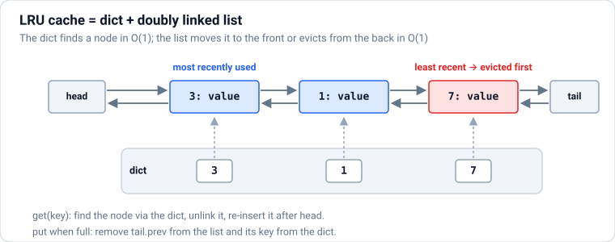

### Theory

> **In simple words:** no single structure is good at everything, so you **combine** two or three structures, each doing the job it's best at, and keep them in sync.

In a **design** question you're asked to build a class with certain operations, each within a target cost: "design a cache where `get` and `put` are O(1)". No single structure does everything, so you **combine** structures, each covering the operation it's good at.

**The method:**

1. List the operations and the cost each must have.
2. For each operation, name the structure that makes it cheap (dict: find by key; linked list: insert/remove in the middle; stack: latest item; heap: smallest item; list: random index).
3. Combine them, and keep them **in sync**: every operation must update all of them.

**Four classics:**

- **Min stack** (push, pop, top and `get_min` all O(1)): store each item together with **the minimum at the moment it was pushed**. Popping restores the old minimum for free.
- **Queue from two stacks:** push onto an `in` stack; to pop, if the `out` stack is empty, pour everything from `in` into `out` (which reverses the order), then pop from `out`. Each item moves at most once, so it's **amortised O(1)**.
- **LRU cache** (Least Recently Used): a fixed-size cache that, when full, throws out the item used longest ago. `get` and `put` must be O(1):
  - a **dict** maps each key to its node, for O(1) lookup;
  - a **doubly linked list** keeps the nodes in order of use, most recent at the front. Any node can be unlinked and moved to the front in O(1), because it knows both neighbours. The least recently used node is always at the back.
  - Python's `collections.OrderedDict` is exactly this combination built in: `move_to_end(key)` marks a key as recent, and `popitem(last=False)` removes the oldest.
- **Insert, delete and get-random, all O(1):** keep the values in a **list** (so a random index is O(1)) and a **dict** from value to its index. To delete, move the **last** value into the deleted slot, update its index, and pop the end. Removing from the middle of a list would be O(n).

**Used in real software:** Python's `functools.lru_cache` (an LRU cache on a function), Redis's eviction policies (it uses an approximate LRU based on sampling, to save memory), browser and CDN caches, and CPU caches. Design questions are also a stepping stone to **system design** interviews.

### Python

```python
class MinStack:
    def __init__(self):
        self.items = []                              # (value, min at that time)

    def push(self, x):
        current_min = min(x, self.items[-1][1]) if self.items else x
        self.items.append((x, current_min))

    def pop(self):
        return self.items.pop()[0]

    def top(self):
        return self.items[-1][0]

    def get_min(self):
        return self.items[-1][1]

class QueueFromStacks:
    def __init__(self):
        self.inbox, self.outbox = [], []

    def push(self, x):
        self.inbox.append(x)

    def pop(self):
        if not self.outbox:
            while self.inbox:
                self.outbox.append(self.inbox.pop())   # reverses the order once
        return self.outbox.pop()

s = MinStack()
for x in [5, 3, 7, 2]:
    s.push(x)
s.get_min(), s.pop(), s.get_min(), s.top()          # → (2, 2, 3, 7)

q = QueueFromStacks()
for x in [1, 2, 3]:
    q.push(x)
q.pop(), q.pop()                                     # → (1, 2)
q.push(4)
q.pop(), q.pop()                                     # → (3, 4)
```

```python
class Node:
    def __init__(self, key=0, val=0):
        self.key, self.val = key, val
        self.prev = self.next = None

class LRUCache:
    def __init__(self, capacity):
        self.capacity = capacity
        self.map = {}                                # key → node
        self.head, self.tail = Node(), Node()        # dummies: head.next is the most recent
        self.head.next, self.tail.prev = self.tail, self.head

    def _remove(self, node):                         # unlink: O(1)
        node.prev.next, node.next.prev = node.next, node.prev

    def _add_front(self, node):                      # link right after head: O(1)
        node.prev, node.next = self.head, self.head.next
        self.head.next.prev = node
        self.head.next = node

    def get(self, key):
        if key not in self.map:
            return -1
        node = self.map[key]
        self._remove(node)
        self._add_front(node)                        # now the most recently used
        return node.val

    def put(self, key, val):
        if key in self.map:
            self._remove(self.map[key])
        node = Node(key, val)
        self.map[key] = node
        self._add_front(node)
        if len(self.map) > self.capacity:
            lru = self.tail.prev                     # least recently used
            self._remove(lru)
            del self.map[lru.key]

cache = LRUCache(2)
cache.put(1, "one"); cache.put(2, "two")
cache.get(1)                                         # → "one"   (1 is now the most recent)
cache.put(3, "three")                                # full: evicts 2, the least recently used
cache.get(2), cache.get(3), cache.get(1)             # → (-1, "three", "one")
```

A method whose name starts with `_` is a helper meant for use inside the class only (a Python convention).

```python
from collections import OrderedDict
import random

class LRUCacheShort:
    def __init__(self, capacity):
        self.capacity, self.data = capacity, OrderedDict()

    def get(self, key):
        if key not in self.data:
            return -1
        self.data.move_to_end(key)                   # mark as most recent
        return self.data[key]

    def put(self, key, val):
        self.data[key] = val
        self.data.move_to_end(key)
        if len(self.data) > self.capacity:
            self.data.popitem(last=False)            # drop the oldest

class RandomizedSet:
    def __init__(self):
        self.values, self.index = [], {}             # list for random picks, dict for positions

    def insert(self, x):
        if x in self.index:
            return False
        self.index[x] = len(self.values)
        self.values.append(x)
        return True

    def remove(self, x):
        if x not in self.index:
            return False
        i, last = self.index[x], self.values[-1]
        self.values[i], self.index[last] = last, i   # move the last value into x's slot
        self.values.pop()
        del self.index[x]
        return True

    def get_random(self):
        return random.choice(self.values)            # O(1): a random list index

c2 = LRUCacheShort(2)
c2.put("a", 1); c2.put("b", 2); c2.get("a"); c2.put("c", 3)
list(c2.data)                                        # → ["a", "c"]
rs = RandomizedSet()
rs.insert(1), rs.insert(2), rs.insert(1), rs.remove(1), rs.values   # → (True, True, False, True, [2])
rs.get_random() in {2}                               # → True
```

**Common mistakes:**

- ❌ An LRU cache built on a plain list: finding and moving an item is O(n).
- ❌ Forgetting to update **both** structures (for example, removing the node but leaving its key in the dict).
- ❌ Forgetting to mark a key as recently used on `get`, not only on `put`.

### Practice

| # | LeetCode problem | Difficulty |
|---|---|---|
| 1 | [232. Implement Queue using Stacks](https://leetcode.com/problems/implement-queue-using-stacks/) | 🟢 Easy |
| 2 | [225. Implement Stack using Queues](https://leetcode.com/problems/implement-stack-using-queues/) | 🟢 Easy |
| 3 | [706. Design HashMap](https://leetcode.com/problems/design-hashmap/) | 🟢 Easy |
| 4 | [155. Min Stack](https://leetcode.com/problems/min-stack/) | 🟡 Medium |
| 5 | [146. LRU Cache](https://leetcode.com/problems/lru-cache/) | 🟡 Medium |
| 6 | [380. Insert Delete GetRandom O(1)](https://leetcode.com/problems/insert-delete-getrandom-o1/) | 🟡 Medium |
| 7 | [460. LFU Cache](https://leetcode.com/problems/lfu-cache/) | 🔴 Hard |

**Learn & visualise:** [Wikipedia: Cache replacement policies](https://en.wikipedia.org/wiki/Cache_replacement_policies) · [Python docs: OrderedDict](https://docs.python.org/3/library/collections.html#collections.OrderedDict)

---

### ✅ Part 5 checkpoint

Without looking, can you:

- [ ] Write a small class with `__init__`, attributes and a method, and explain `self`?
- [ ] Explain why `b = a` doesn't copy a list, and what `None` means at the end of a chain?
- [ ] Build a linked list, insert and delete nodes, and reverse it in place?
- [ ] Find the middle, detect a cycle, and remove the n-th node from the end with two pointers?
- [ ] Check balanced brackets with a stack, and use a monotonic stack for "next greater element"?
- [ ] Use `deque` as a queue, and say why `list.pop(0)` is slow?
- [ ] Design a min stack and an LRU cache with O(1) operations?

Part 6 gives nodes **two** links instead of one, which turns a chain into a tree.

---

# Part 6 — Moderate: Trees and Heaps

> **Goal:** Nodes with two links: binary trees and their classic interview problems, binary search trees, heaps and tries.  
> **You need:** Part 5 (nodes and references, stacks, queues) and recursion from Part 3.

---

## 36. Binary Trees and Traversals

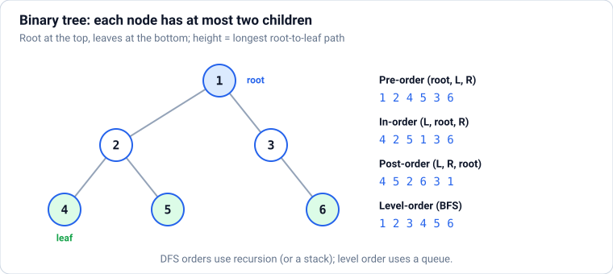

### Theory

> **In simple words:** a tree is a family tree of data. One node at the top (the **root**) has children, they have children, and so on. In a **binary** tree, every node has **at most two** children: a left one and a right one.

It's built from the nodes of Section [30](#30-classes-objects-and-nodes), except that each node has **two** links (`left` and `right`, either of which can be `None`), and nothing ever loops back up.

**Everyday pictures:** the folders on your computer (folders inside folders), a company's org chart, a tournament bracket.

**Words you need:**

| Word | Meaning |
|---|---|
| Root | The top node (no parent) |
| Parent / child | A node and the nodes directly below it |
| Leaf | A node with **no** children |
| Subtree | A node together with everything below it; it's a tree too |
| Depth of a node | How many edges it is from the root (the root has depth 0) |
| Height of a tree | The number of levels on the longest path from the root down to a leaf |
| Balanced | Left and right sides have about the same height everywhere, so the height is about log₂ n |

A tree with n nodes has exactly n − 1 edges (every node except the root has one edge up to its parent). A **balanced** tree of a million nodes is only about 20 levels tall; a badly **skewed** one (every node with one child) is a million levels tall, just like a linked list.

**Traversal** means visiting every node once. Because every child is the root of a smaller tree, the traversals are tiny recursive functions (Section [14](#14-recursion-basics)). For the tree in the code below (1 at the root; 2 and 3 below it; 4 and 5 under 2; 6 under 3):

| Traversal | Order | Result | Used for |
|---|---|---|---|
| **Pre-order** | node, then left, then right | 1 2 4 5 3 6 | Copying or saving a tree (the parent comes first) |
| **In-order** | left, then node, then right | 4 2 5 1 3 6 | Sorted order in a BST (Section [38](#38-binary-search-trees)) |
| **Post-order** | left, then right, then node | 4 5 2 6 3 1 | Deleting a tree, or computing sizes and heights from the bottom up |
| **Level order (BFS)** | level by level, left to right | 1 · 2 3 · 4 5 6 | The closest nodes first, level averages, the "right side view" |

The first three are **depth-first (DFS)**: they go all the way down one branch before trying the next. Level order is **breadth-first (BFS)**: it uses a queue (Section [34](#34-queues-and-deques)), and processing `len(q)` nodes at a time handles exactly one level per round.

**The pattern behind most tree problems:** "solve the left subtree, solve the right subtree, combine the two answers at this node". The height, for example, is `1 + max(height(left), height(right))`. Each node is visited once, so it's O(n) time, and the recursion uses O(h) stack space, where h is the height.

**Common mistakes:**

- ❌ Forgetting the base case `if node is None`, which crashes on leaves' missing children.
- ❌ Confusing depth (from the top) with height (to the bottom).
- ❌ Deep recursion on a very skewed tree (Python's ~1,000-level limit). Use an explicit stack or queue for trees that might be 10⁵ levels deep.

**Used in real software:** file systems, the HTML page structure in every browser (the DOM tree), JSON and XML documents, the syntax trees compilers build from code, and decision trees in machine learning.

### Python

```python
from collections import deque

class TreeNode:
    def __init__(self, val, left=None, right=None):
        self.val, self.left, self.right = val, left, right

#        1
#       / \
#      2   3
#     / \   \
#    4   5   6
root = TreeNode(1, TreeNode(2, TreeNode(4), TreeNode(5)), TreeNode(3, None, TreeNode(6)))

def preorder(n):                            # node, left, right
    if n is None:
        return []
    return [n.val] + preorder(n.left) + preorder(n.right)

def inorder(n):                             # left, node, right
    if n is None:
        return []
    return inorder(n.left) + [n.val] + inorder(n.right)

def postorder(n):                           # left, right, node
    if n is None:
        return []
    return postorder(n.left) + postorder(n.right) + [n.val]

def level_order(root):
    levels, q = [], deque([root] if root else [])
    while q:
        level = []
        for _ in range(len(q)):                 # exactly one level per iteration
            node = q.popleft()
            level.append(node.val)
            if node.left:
                q.append(node.left)
            if node.right:
                q.append(node.right)
        levels.append(level)
    return levels

def height(n):
    return 0 if n is None else 1 + max(height(n.left), height(n.right))

preorder(root), inorder(root), postorder(root)   # → ([1, 2, 4, 5, 3, 6], [4, 2, 5, 1, 3, 6], [4, 5, 2, 6, 3, 1])
level_order(root)                                 # → [[1], [2, 3], [4, 5, 6]]
height(root)                                      # → 3
```

### Practice

| # | LeetCode problem | Difficulty |
|---|---|---|
| 1 | [94. Binary Tree Inorder Traversal](https://leetcode.com/problems/binary-tree-inorder-traversal/) | 🟢 Easy |
| 2 | [104. Maximum Depth of Binary Tree](https://leetcode.com/problems/maximum-depth-of-binary-tree/) | 🟢 Easy |
| 3 | [226. Invert Binary Tree](https://leetcode.com/problems/invert-binary-tree/) | 🟢 Easy |
| 4 | [543. Diameter of Binary Tree](https://leetcode.com/problems/diameter-of-binary-tree/) | 🟢 Easy |
| 5 | [102. Binary Tree Level Order Traversal](https://leetcode.com/problems/binary-tree-level-order-traversal/) | 🟡 Medium |
| 6 | [124. Binary Tree Maximum Path Sum](https://leetcode.com/problems/binary-tree-maximum-path-sum/) | 🔴 Hard |

**Learn & visualise:** [GeeksforGeeks: Binary Tree](https://www.geeksforgeeks.org/dsa/binary-tree-data-structure/) · [VisuAlgo: BST & traversals](https://visualgo.net/en/bst)

---

## 37. Binary Tree Interview Problems

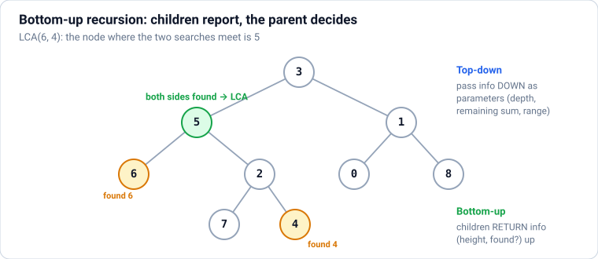

### Theory

> **In simple words:** most tree problems are "ask the left subtree, ask the right subtree, combine the two answers at this node". Decide whether information travels **down** the tree (as parameters) or **up** (as return values).

Tree questions are among the most asked at top companies, and almost all of them are solved by one of **two recursive templates**:

| Template | Information flows | Write it as | Examples |
|---|---|---|---|
| **Top-down** | From parent **to** children, as extra parameters | `dfs(node, info_so_far)` | Depth of each node, path sums, "is it a valid BST?" (allowed range) |
| **Bottom-up** | From children **back** to the parent, as return values | `left = dfs(node.left)`, `right = dfs(node.right)`, combine | Height, diameter, balanced check, LCA, max path sum |

**Bottom-up with a global answer.** Sometimes what you **return** to the parent differs from what you **record**. For the **diameter** (the longest path between any two nodes), each node returns its height, but records `left_height + right_height` (the longest path that bends at this node) in a variable outside the recursion. Inside a nested function, `nonlocal best` lets you update that outer variable.

**The classic problems:**

- **Same tree / symmetric tree:** compare two trees node by node (for symmetry, compare the left subtree with the mirror of the right).
- **Balanced:** at every node, the heights of the two subtrees differ by at most 1. Return −1 upwards as soon as any part is unbalanced, to stay O(n).
- **Lowest common ancestor (LCA)** of p and q: the deepest node that has both below it. Bottom-up: if p and q are found in **different** subtrees, the current node is the LCA; otherwise pass up whichever side found something.
- **Right side view / zigzag:** level-order traversal (Section [36](#36-binary-trees-and-traversals)), taking the last node of each level, or reversing every other level.
- **Build a tree from preorder + inorder traversals:** the first preorder value is the root; its position in the inorder list splits the left and right subtrees. A dict of value → inorder index makes each lookup O(1).
- **Serialize / deserialize:** write a pre-order traversal with a marker (`#`) for empty children; reading the values back in the same order rebuilds the same tree.

**Test input format.** LeetCode writes trees as a level-order list with `None` for missing children: `[3, 9, 20, None, None, 15, 7]`. The `build_tree` helper below turns that into nodes, so you can test your solutions locally.

**Used in real software:** the same patterns run on real trees: a browser computing the size of every element on a page (bottom-up), a file manager calculating folder sizes (bottom-up), permission checks that inherit settings from parent folders (top-down), and "nearest common manager" in an org chart (lowest common ancestor).

### Python

```python
from collections import deque

class TreeNode:
    def __init__(self, val, left=None, right=None):
        self.val, self.left, self.right = val, left, right

def build_tree(values):
    """LeetCode's level-order list (None = no child) → tree."""
    if not values or values[0] is None:
        return None
    root = TreeNode(values[0])
    q, i = deque([root]), 1
    while q and i < len(values):
        node = q.popleft()
        for side in ("left", "right"):
            if i < len(values) and values[i] is not None:
                child = TreeNode(values[i])
                setattr(node, side, child)          # node.left = child, or node.right = child
                q.append(child)
            i += 1
    return root

def is_same(a, b):
    if a is None or b is None:
        return a is b                               # both empty → same
    return a.val == b.val and is_same(a.left, b.left) and is_same(a.right, b.right)

def is_symmetric(root):
    def mirror(a, b):
        if a is None or b is None:
            return a is b
        return a.val == b.val and mirror(a.left, b.right) and mirror(a.right, b.left)
    return mirror(root.left, root.right) if root else True

def diameter(root):
    best = 0
    def height(node):
        nonlocal best                               # update the outer variable
        if node is None:
            return 0
        l, r = height(node.left), height(node.right)
        best = max(best, l + r)                     # longest path bending here
        return 1 + max(l, r)                        # what the parent needs
    height(root)
    return best

def is_balanced(root):
    def check(node):                                # height, or -1 if unbalanced
        if node is None:
            return 0
        l, r = check(node.left), check(node.right)
        if l == -1 or r == -1 or abs(l - r) > 1:
            return -1
        return 1 + max(l, r)
    return check(root) != -1

t = build_tree([3, 9, 20, None, None, 15, 7])
is_same(t, build_tree([3, 9, 20, None, None, 15, 7])), is_symmetric(build_tree([1, 2, 2, 3, 4, 4, 3]))   # → (True, True)
diameter(build_tree([1, 2, 3, 4, 5])), is_balanced(t), is_balanced(build_tree([1, 2, None, 3]))          # → (3, True, False)
```

`setattr(node, "left", child)` is the same as `node.left = child`, with the attribute name given as a string.

```python
def lowest_common_ancestor(root, p, q):
    if root is None or root.val in (p, q):
        return root
    left = lowest_common_ancestor(root.left, p, q)
    right = lowest_common_ancestor(root.right, p, q)
    if left and right:
        return root                                 # p and q are on different sides
    return left or right

def right_side_view(root):
    view, q = [], deque([root] if root else [])
    while q:
        for i in range(len(q)):
            node = q.popleft()
            if i == 0:
                view.append(node.val)               # first popped = rightmost (right child queued first)
            for child in (node.right, node.left):
                if child:
                    q.append(child)
    return view

def has_path_sum(root, target):                     # top-down: pass the remaining sum down
    if root is None:
        return False
    if root.left is None and root.right is None:
        return root.val == target
    return has_path_sum(root.left, target - root.val) or has_path_sum(root.right, target - root.val)

def max_path_sum(root):
    best = float("-inf")
    def gain(node):                                 # best downward path starting at node
        nonlocal best
        if node is None:
            return 0
        l, r = max(gain(node.left), 0), max(gain(node.right), 0)   # skip negative branches
        best = max(best, node.val + l + r)
        return node.val + max(l, r)
    gain(root)
    return best

tree = build_tree([3, 5, 1, 6, 2, 0, 8, None, None, 7, 4])
lowest_common_ancestor(tree, 5, 1).val, lowest_common_ancestor(tree, 6, 4).val   # → (3, 5)
right_side_view(build_tree([1, 2, 3, None, 5, None, 4]))                         # → [1, 3, 4]
has_path_sum(build_tree([5, 4, 8, 11, None, 13, 4, 7, 2]), 22)                   # → True
max_path_sum(build_tree([-10, 9, 20, None, None, 15, 7]))                        # → 42
```

```python
def build_from_pre_in(preorder, inorder):
    where = {v: i for i, v in enumerate(inorder)}   # value → inorder position
    it = iter(preorder)                             # hands out preorder values one at a time
    def build(lo, hi):                              # the subtree made of inorder[lo..hi]
        if lo > hi:
            return None
        val = next(it)
        node = TreeNode(val)
        node.left = build(lo, where[val] - 1)
        node.right = build(where[val] + 1, hi)
        return node
    return build(0, len(inorder) - 1)

def serialize(root):
    out = []
    def pre(node):
        if node is None:
            out.append("#")
            return
        out.append(str(node.val))
        pre(node.left)
        pre(node.right)
    pre(root)
    return ",".join(out)

def deserialize(data):
    it = iter(data.split(","))
    def build():
        val = next(it)
        if val == "#":
            return None
        return TreeNode(int(val), build(), build())
    return build()

def level_values(root):                             # level order, for checking results
    out, q = [], deque([root])
    while q:
        node = q.popleft()
        out.append(node.val if node else None)
        if node:
            q.extend([node.left, node.right])
    while out and out[-1] is None:
        out.pop()
    return out

r = build_from_pre_in([3, 9, 20, 15, 7], [9, 3, 15, 20, 7])
level_values(r)                                     # → [3, 9, 20, None, None, 15, 7]
s = serialize(r)
s, level_values(deserialize(s))                     # → ("3,9,#,#,20,15,#,#,7,#,#", [3, 9, 20, None, None, 15, 7])
```

`{v: i for i, v in enumerate(inorder)}` is a **dict comprehension** (like a list comprehension, building a dict). `iter(...)` makes an iterator, and each `next(it)` returns its next value.

**Common mistakes:**

- ❌ Recomputing heights inside a loop over all nodes (O(n²)). Return the height and the answer from the same recursion.
- ❌ Treating "leaf" wrongly in path-sum problems: a leaf has **no** children, not just one.
- ❌ Forgetting `nonlocal` when updating an outer variable from a nested function (Python then treats it as a new local variable).

### Practice

| # | LeetCode problem | Difficulty |
|---|---|---|
| 1 | [100. Same Tree](https://leetcode.com/problems/same-tree/) | 🟢 Easy |
| 2 | [101. Symmetric Tree](https://leetcode.com/problems/symmetric-tree/) | 🟢 Easy |
| 3 | [110. Balanced Binary Tree](https://leetcode.com/problems/balanced-binary-tree/) | 🟢 Easy |
| 4 | [112. Path Sum](https://leetcode.com/problems/path-sum/) | 🟢 Easy |
| 5 | [572. Subtree of Another Tree](https://leetcode.com/problems/subtree-of-another-tree/) | 🟢 Easy |
| 6 | [199. Binary Tree Right Side View](https://leetcode.com/problems/binary-tree-right-side-view/) | 🟡 Medium |
| 7 | [103. Binary Tree Zigzag Level Order Traversal](https://leetcode.com/problems/binary-tree-zigzag-level-order-traversal/) | 🟡 Medium |
| 8 | [236. Lowest Common Ancestor of a Binary Tree](https://leetcode.com/problems/lowest-common-ancestor-of-a-binary-tree/) | 🟡 Medium |
| 9 | [105. Construct Binary Tree from Preorder and Inorder Traversal](https://leetcode.com/problems/construct-binary-tree-from-preorder-and-inorder-traversal/) | 🟡 Medium |
| 10 | [1448. Count Good Nodes in Binary Tree](https://leetcode.com/problems/count-good-nodes-in-binary-tree/) | 🟡 Medium |
| 11 | [124. Binary Tree Maximum Path Sum](https://leetcode.com/problems/binary-tree-maximum-path-sum/) | 🔴 Hard |
| 12 | [297. Serialize and Deserialize Binary Tree](https://leetcode.com/problems/serialize-and-deserialize-binary-tree/) | 🔴 Hard |

**Learn & visualise:** [VisuAlgo: Binary trees](https://visualgo.net/en/bst) · [GeeksforGeeks: Binary tree problems](https://www.geeksforgeeks.org/dsa/binary-tree-data-structure/)

---

## 38. Binary Search Trees

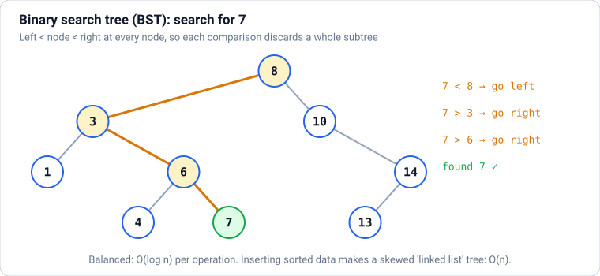

### Theory

> **In simple words:** a binary search tree is a binary tree that keeps its values **in order**: smaller values always go left, bigger values always go right. So finding a value is like binary search, one step down the tree at a time.

**Everyday picture.** A "higher or lower" guessing game frozen into a shape. At each node you ask "is my value smaller or bigger than this?" and go left or right, discarding the whole other side.

**The rule (at EVERY node, not just between parent and child):** every value in the **left subtree** is smaller than the node, and every value in the **right subtree** is bigger. (It's binary search from Section [18](#18-searching-linear-search-and-binary-search), built into the tree's shape.)

**Worked example: inserting 8, 3, 10, 1, 6, 14, 4, 7, 13 in that order.** 8 becomes the root. 3 < 8 goes left. 10 > 8 goes right. 1 < 8, then 1 < 3: left of 3. 6 < 8, then 6 > 3: right of 3. And so on. To **search** for 7: 7 < 8 → left; 7 > 3 → right; 7 > 6 → right; found. Only 4 nodes were checked, not 9.

**What a BST gives you:**

- Search, insert and delete follow **one path from the root down**: O(h), where h is the height. That's O(log n) when the tree is balanced.
- An **in-order traversal visits the values in sorted order** (left, node, right). That's the key to "k-th smallest", "validate BST" and "closest value" problems.
- Min and max are the leftmost and rightmost nodes.

**The danger: unbalanced trees.** Inserting already-sorted data (1, 2, 3, 4, …) makes every node a right child: a "tree" that's really a linked list, with O(n) operations. **Self-balancing** BSTs (AVL trees, red-black trees) rotate nodes after inserts and deletes to keep the height O(log n). You're rarely asked to code them, but you should know they exist and why.

**Validating a BST is a classic trap.** Checking only that `left.val < node.val < right.val` isn't enough: a small value can hide deep in a right subtree. Pass the allowed **range** `(low, high)` down the tree (top-down, Section [37](#37-binary-tree-interview-problems)) and narrow it at each step.

**BST or something else?**

| You need | Use |
|---|---|
| Only "is x present?" | A set (O(1) average, Section [19](#19-hashing-dictionaries-and-sets)) |
| Sorted order, "next bigger than x", ranges, **with** inserts and deletes | A balanced BST |
| Sorted data that rarely changes | A sorted list + `bisect` (Section [18](#18-searching-linear-search-and-binary-search)) |

Python has no built-in balanced BST. In real code, use a sorted list with `bisect`, or the popular `sortedcontainers` package (`SortedList`).

**Common mistakes:**

- ❌ Validating with only a node's direct children (see above).
- ❌ Assuming O(log n) without balancing: sorted input makes it O(n).
- ❌ Forgetting what to do with duplicates. Decide on a side (the code below sends them right).

**Used in real software:** Java's `TreeMap` and C++'s `std::map` are red-black trees; the Linux kernel's process scheduler keeps tasks in a red-black tree; and databases use a wider cousin, the **B-tree** (Section [56](#56-algorithms-behind-real-systems-consistent-hashing-rate-limiters-b-trees-lsm-trees-and-vector-search)), for their indexes.

### Python

```python
class Node:
    def __init__(self, val):
        self.val, self.left, self.right = val, None, None

def insert(root, val):
    if root is None:
        return Node(val)
    if val < root.val:
        root.left = insert(root.left, val)
    else:
        root.right = insert(root.right, val)
    return root

def contains(root, val):
    while root:
        if val == root.val:
            return True
        root = root.left if val < root.val else root.right
    return False

def is_valid(root, low=float("-inf"), high=float("inf")):
    if root is None:
        return True
    return low < root.val < high and is_valid(root.left, low, root.val) and is_valid(root.right, root.val, high)

def kth_smallest(root, k):
    stack = []
    while True:                                 # iterative in-order traversal
        while root:
            stack.append(root)
            root = root.left
        root = stack.pop()
        k -= 1
        if k == 0:
            return root.val
        root = root.right

root = None
for v in [8, 3, 10, 1, 6, 14, 4, 7, 13]:
    root = insert(root, v)
contains(root, 7), contains(root, 5)            # → (True, False)
is_valid(root), kth_smallest(root, 3)           # → (True, 4)
bad = Node(5); bad.left = Node(1); bad.right = Node(6); bad.right.left = Node(3)   # 3 is right of 5
is_valid(bad)                                   # → False
```

### Practice

| # | LeetCode problem | Difficulty |
|---|---|---|
| 1 | [700. Search in a Binary Search Tree](https://leetcode.com/problems/search-in-a-binary-search-tree/) | 🟢 Easy |
| 2 | [701. Insert into a Binary Search Tree](https://leetcode.com/problems/insert-into-a-binary-search-tree/) | 🟡 Medium |
| 3 | [98. Validate Binary Search Tree](https://leetcode.com/problems/validate-binary-search-tree/) | 🟡 Medium |
| 4 | [230. Kth Smallest Element in a BST](https://leetcode.com/problems/kth-smallest-element-in-a-bst/) | 🟡 Medium |
| 5 | [235. Lowest Common Ancestor of a Binary Search Tree](https://leetcode.com/problems/lowest-common-ancestor-of-a-binary-search-tree/) | 🟡 Medium |

**Learn & visualise:** [GeeksforGeeks: Binary Search Tree](https://www.geeksforgeeks.org/dsa/binary-search-tree-data-structure/) · [VisuAlgo: BST / AVL](https://visualgo.net/en/bst)

---

## 39. Heaps and Priority Queues

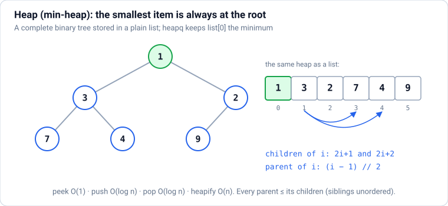

### Theory

> **In simple words:** a heap is a structure that always knows its **smallest** item (or largest) and hands it to you instantly, while staying cheap to add to. It's how you build a **priority queue**: a line where the most urgent item goes first, not the one that arrived first.

**Everyday picture.** A hospital emergency room. Patients don't leave in arrival order; the most urgent case is always treated next, and new patients can arrive at any time.

**How it works.** A binary heap is a binary tree with two rules:

1. **Shape:** it's **complete**, meaning every level is full except possibly the last, which fills from the left. So its height is always about log₂ n.
2. **Order (min-heap):** every parent is ≤ its children. So the smallest item is always at the root.

Because the shape is so regular, the tree lives in a **plain list** with no node objects at all: the children of index i are at 2i + 1 and 2i + 2, and its parent is at (i − 1) // 2.

- **Push:** put the new item at the end of the list, then **sift it up**, swapping with its parent while it's smaller. That's at most log n swaps.
- **Pop the minimum:** take the root, move the last item to the root, then **sift it down**, swapping with its smaller child while it's bigger. Also O(log n).
- **Heapify** (turning a whole list into a heap) is O(n), faster than n pushes.

| Operation | Cost |
|---|---|
| Peek at the min, `h[0]` | O(1) |
| Push / pop | O(log n) |
| Build from a list (`heapify`) | O(n) |
| Search for any value | O(n) (a heap is **not** sorted, only "roughly ordered") |

**In Python:** the `heapq` module (`import heapq`) works on a plain list as a **min-heap**: `heapq.heappush(h, x)`, `heapq.heappop(h)`, `heapq.heapify(lst)`, and `h[0]` to peek. For a **max-heap**, push negated numbers (`-x`) or tuples like `(-priority, item)`. (Python 3.14 added built-in max-heap functions such as `heapq.heappush_max` and `heapq.heappop_max`; the negation trick works on every version.)

**Patterns:**

- **Top k:** keep a heap of size k. For the k largest of n items, push each item and pop whenever the heap grows past k: O(n log k), better than sorting when k is much smaller than n.
- **Merge k sorted lists:** keep one item from each list in a heap and repeatedly take the smallest.
- **Running median:** two heaps (shown in the code below).
- **Heap sort:** heapify, then pop n times: O(n log n) and in place, but not stable (it completes the table in Section [29](#29-merge-sort-and-quick-sort)).
- **Tie-breaking:** tuples compare item by item, so `(priority, counter, item)` makes sure two items with the same priority never compare the items themselves (which may not be comparable).

**Common mistakes:**

- ❌ Expecting `h` to be sorted. Only `h[0]` is guaranteed; `h[1]` is not necessarily the second smallest.
- ❌ Forgetting to negate **both** when pushing and when popping in a max-heap.
- ❌ Sorting the whole list when you only need the top k.

**Used in real software:** Python's `asyncio` event loop keeps scheduled callbacks in a heap (next deadline first), timers in language runtimes, "top 10" and trending lists, Dijkstra's shortest paths in route planners (Section [43](#43-shortest-paths-dijkstra)), and job schedulers that run the most urgent job first.

### Python

```python
import heapq

nums = [5, 1, 8, 3, 9, 2]
heapq.nsmallest(3, nums), heapq.nlargest(2, nums)    # → ([1, 2, 3], [9, 8])

def kth_largest(nums, k):                   # heap of size k: O(n log k)
    heap = []
    for x in nums:
        heapq.heappush(heap, x)
        if len(heap) > k:
            heapq.heappop(heap)             # drop the smallest; k largest remain
    return heap[0]

def merge_sorted(lists):
    """Merge k sorted lists in O(N log k)."""
    heap = [(lst[0], i, 0) for i, lst in enumerate(lists) if lst]
    heapq.heapify(heap)
    out = []
    while heap:
        val, i, j = heapq.heappop(heap)
        out.append(val)
        if j + 1 < len(lists[i]):
            heapq.heappush(heap, (lists[i][j + 1], i, j + 1))
    return out

max_heap = []
for x in [3, 7, 1]:
    heapq.heappush(max_heap, -x)            # negate for a max-heap
kth_largest([3, 2, 1, 5, 6, 4], 2)          # → 5
merge_sorted([[1, 4, 7], [2, 5], [3, 6, 9]])  # → [1, 2, 3, 4, 5, 6, 7, 9]
-heapq.heappop(max_heap)                    # → 7
```

**Two heaps: the running median.** Keep the smaller half of the numbers in a **max-heap** (`low`, stored negated) and the larger half in a **min-heap** (`high`), with sizes equal or `low` one bigger. The median is then at the top of the heaps: O(log n) per new number, O(1) to read the median. It's a favourite hard question at top companies.

```python
class MedianFinder:
    def __init__(self):
        self.low, self.high = [], []              # max-heap (negated) and min-heap

    def add(self, x):
        heapq.heappush(self.low, -x)
        heapq.heappush(self.high, -heapq.heappop(self.low))   # move low's largest to high
        if len(self.high) > len(self.low):
            heapq.heappush(self.low, -heapq.heappop(self.high))   # rebalance

    def median(self):
        if len(self.low) > len(self.high):
            return -self.low[0]
        return (-self.low[0] + self.high[0]) / 2

mf = MedianFinder()
medians = []
for x in [5, 15, 1, 3, 8]:
    mf.add(x)
    medians.append(mf.median())
medians                                         # → [5, 10.0, 5, 4.0, 5]
```

### Practice

| # | LeetCode problem | Difficulty |
|---|---|---|
| 1 | [1046. Last Stone Weight](https://leetcode.com/problems/last-stone-weight/) | 🟢 Easy |
| 2 | [703. Kth Largest Element in a Stream](https://leetcode.com/problems/kth-largest-element-in-a-stream/) | 🟢 Easy |
| 3 | [973. K Closest Points to Origin](https://leetcode.com/problems/k-closest-points-to-origin/) | 🟡 Medium |
| 4 | [621. Task Scheduler](https://leetcode.com/problems/task-scheduler/) | 🟡 Medium |
| 5 | [295. Find Median from Data Stream](https://leetcode.com/problems/find-median-from-data-stream/) | 🔴 Hard |
| 6 | [23. Merge k Sorted Lists](https://leetcode.com/problems/merge-k-sorted-lists/) | 🔴 Hard |

**Learn & visualise:** [GeeksforGeeks: Heap](https://www.geeksforgeeks.org/dsa/heap-data-structure/) · [VisuAlgo: Binary Heap](https://visualgo.net/en/heap)

---

## 40. Tries (Prefix Trees)

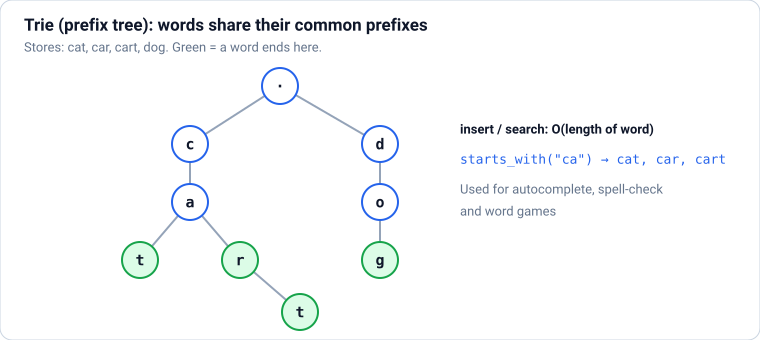

### Theory

> **In simple words:** a trie stores words letter by letter, like a tree of letters. Words that start the same way **share the same path**, so "all words starting with `ca`" is just "walk down c → a and list everything below".

**Everyday picture.** The phone's autocomplete. You type `c`, `a`, and it instantly offers "car", "cart", "cat". It doesn't scan every word it knows; it walks down the letters you've typed and lists what's below that point.

**How it works:**

- Each node has **children**, one for each possible next letter, and an **end-of-word** flag.
- The root represents the empty string. The path root → c → a → t spells "cat", and the node for `t` is marked "a word ends here".
- **Insert** a word: walk its letters from the root, creating missing child nodes, and mark the last node.
- **Search** a word: walk its letters; it's present only if every letter exists **and** the last node is marked. ("ca" walks fine, but isn't marked, so it isn't a word.)
- **starts_with(prefix):** walk the letters; if the walk succeeds, some word has this prefix.

Worked example: after inserting "cat", "car", "cart" and "dog", the root has two children, `c` and `d`. The `c` → `a` path is shared by three words, and it splits into `t` (a word end) and `r` (a word end, which continues to `t`, another word end).

**Cost:** insert, search and starts_with are all **O(L)**, where L is the length of the word. That doesn't depend on how many words are stored, whether ten or ten million.

**Trie or set?** A set answers "is this exact word present?" in O(L) too, but it can't answer "which words start with `ca`?" without checking every word. Prefix questions are what tries are for.

**In code:** each node can be a dict from a character to the child node (flexible, any alphabet) or a list of 26 children (faster, lowercase only). The code below uses nested dicts: `node.setdefault(ch, {})` returns the child for `ch`, creating an empty one first if it doesn't exist, and the special key `"$"` marks "a word ends here".

**Cost warning:** a trie uses a lot of memory (one node per character). **Radix trees** (compressed tries) save space by merging chains of single-child nodes into one edge labelled with several letters.

**Common mistakes:**

- ❌ Treating a prefix as a word (forgetting the end-of-word marker).
- ❌ Scanning all words for prefix queries when a trie would do it in O(prefix length).
- ❌ Using a trie for exact lookups only, where a set is simpler.

**Used in real software:** autocomplete and search suggestions, spell checkers, word games, and **IP routing** (routers find the longest matching address prefix with trie-like structures). Radix trees also appear inside real systems: Redis streams, for example, are built on one.

### Python

```python
class Trie:
    def __init__(self):
        self.root = {}

    def insert(self, word):
        node = self.root
        for ch in word:
            node = node.setdefault(ch, {})
        node["$"] = True                          # end-of-word marker

    def _walk(self, prefix):
        node = self.root
        for ch in prefix:
            if ch not in node:
                return None
            node = node[ch]
        return node

    def search(self, word):
        node = self._walk(word)
        return node is not None and "$" in node

    def starts_with(self, prefix):
        return self._walk(prefix) is not None

    def words_with_prefix(self, prefix):
        node, out = self._walk(prefix), []
        def dfs(n, path):
            if "$" in n:
                out.append(prefix + path)
            for ch in sorted([k for k in n if k != "$"]):
                dfs(n[ch], path + ch)
        if node is not None:
            dfs(node, "")
        return out

t = Trie()
for w in ["cat", "car", "cart", "dog"]:
    t.insert(w)
t.search("car"), t.search("ca"), t.starts_with("ca")   # → (True, False, True)
t.words_with_prefix("ca")                              # → ["car", "cart", "cat"]
```

### Practice

| # | LeetCode problem | Difficulty |
|---|---|---|
| 1 | [14. Longest Common Prefix](https://leetcode.com/problems/longest-common-prefix/) | 🟢 Easy |
| 2 | [208. Implement Trie (Prefix Tree)](https://leetcode.com/problems/implement-trie-prefix-tree/) | 🟡 Medium |
| 3 | [211. Design Add and Search Words Data Structure](https://leetcode.com/problems/design-add-and-search-words-data-structure/) | 🟡 Medium |
| 4 | [212. Word Search II](https://leetcode.com/problems/word-search-ii/) | 🔴 Hard |

**Learn & visualise:** [GeeksforGeeks: Trie](https://www.geeksforgeeks.org/dsa/trie-insert-and-search/)

---

### ✅ Part 6 checkpoint

Without looking, can you:

- [ ] Write pre-order, in-order and post-order traversals recursively, and level order with a queue?
- [ ] Choose between top-down and bottom-up recursion, and solve diameter, LCA and max path sum?
- [ ] Build a tree from preorder + inorder, and serialize/deserialize one?
- [ ] Insert into and search a BST, and explain why in-order traversal of a BST is sorted?
- [ ] Use `heapq` for "k-th largest" in O(n log k), and keep a running median with two heaps?
- [ ] Implement a trie with `insert`, `search` and `starts_with`?

Part 7 removes the last restriction: nodes can link to **any** other nodes, even in loops.

---

# Part 7 — Advanced: Graphs

> **Goal:** Nodes with any number of links: exploring networks, cycles, shortest paths, dependencies, groups and spanning trees.  
> **You need:** Parts 5 and 6 (queues, stacks, heaps, tree traversals).

---

## 41. Graphs: Representation, BFS and DFS

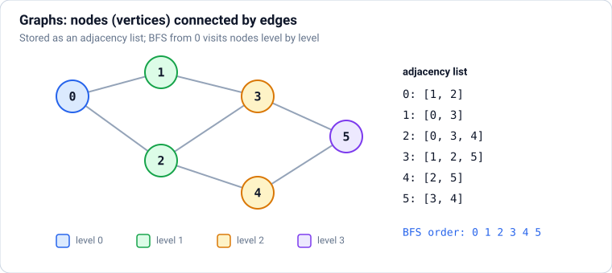

### Theory

> **In simple words:** a graph is a set of **dots** (vertices) joined by **lines** (edges). Anything made of "things and connections between them" is a graph: cities and roads, people and friendships, web pages and links.

It's the most general node structure: a linked list allows one link per node, a tree two (or more) links but no loops, and a graph has **no rules at all**. Trees are graphs without cycles; grids are graphs where each cell connects to its neighbours.

**Kinds of graphs:**

| Kind | Meaning | Example |
|---|---|---|
| **Undirected** | Edges work both ways | Friendships, two-way roads |
| **Directed** | Edges are one-way arrows | "Follows" on social media, course prerequisites, one-way streets |
| **Weighted** | Each edge has a number (cost, distance, time) | Road distances |
| **Unweighted** | Every edge counts as 1 | "Minimum number of moves" |
| **Cyclic / acyclic** | Has loops / has none | A directed acyclic graph (**DAG**) models dependencies |

**Storing a graph.** V is the number of vertices, E the number of edges.

| Representation | What it is | Space | "Are u and v connected?" | "List u's neighbours" | Use when |
|---|---|---|---|---|---|
| **Adjacency list** | `graph[u]` = list of u's neighbours (a dict or a list of lists) | O(V + E) | O(degree) | O(degree) | Almost always |
| Adjacency matrix | `m[u][v]` = 1 if connected | O(V²) | O(1) | O(V) | Small, dense graphs |
| Edge list | A list of `(u, v)` pairs | O(E) | O(E) | O(E) | The usual input format; convert it first |

For an undirected edge, add it **both** ways: `graph[a].append(b)` and `graph[b].append(a)`.

**Exploring a graph: BFS and DFS.** Both visit every reachable vertex once, in **O(V + E)**. Both need a **visited** set, because unlike trees, graphs can have cycles, and without it you'd walk in circles forever.

- **BFS (breadth-first search)** explores in **rings**: first the start, then all its neighbours, then their neighbours… It uses a queue (Section [34](#34-queues-and-deques)). Because it reaches everything at distance 1 before distance 2, the first time BFS reaches a node is along a **shortest path** (in edges). Mark nodes visited when you **add** them to the queue, not when you remove them, or a node can be queued many times.
- **DFS (depth-first search)** goes as **deep** as it can down one path, then backs up and tries the next. It's recursion (Section [14](#14-recursion-basics)), or an explicit stack (Section [33](#33-stacks)) to avoid Python's recursion limit. It's the natural choice for "is there a path?", counting separate groups, cycles and topological sort (Section [44](#44-topological-sort)).

Worked example, BFS from 0 in the graph built below (edges 0–1, 0–2, 1–3, 2–3, 2–4, 3–5, 4–5): distance 0: {0}; distance 1: {1, 2}; distance 2: {3, 4}; distance 3: {5}. So the shortest path from 0 to 5 has 3 edges.

**Grids are graphs.** Each cell is a vertex, and its up/down/left/right neighbours (Section [26](#26-matrices-2d-array-problems)) are its edges. "Count the islands" is "count the connected groups of land cells": start a DFS from each unvisited land cell and count how many times you had to start one.

**Common mistakes:**

- ❌ No visited set (infinite loop on any cycle).
- ❌ Marking nodes visited only when you pop them in BFS (the same node gets queued many times).
- ❌ Adding an undirected edge in only one direction.
- ❌ Forgetting that the graph may be **disconnected**: loop over every vertex as a possible start.

**Used in real software:** maps and navigation, social networks ("people you may know" is a two-step BFS), web crawlers and search engines (PageRank ranks pages using the link graph), package managers resolving dependencies, and garbage collectors, which find unreachable objects by traversing the graph of references from live variables.

### Python

```python
from collections import deque

edges = [(0, 1), (0, 2), (1, 3), (2, 3), (2, 4), (3, 5), (4, 5)]
graph = {v: [] for v in range(6)}
for a, b in edges:                                 # undirected: add both directions
    graph[a].append(b)
    graph[b].append(a)

def bfs_order(graph, start):
    seen, order, q = {start}, [], deque([start])
    while q:
        node = q.popleft()
        order.append(node)
        for nxt in graph[node]:
            if nxt not in seen:
                seen.add(nxt)                      # mark when ENQUEUED, not when popped
                q.append(nxt)
    return order

def shortest_path_length(graph, start, goal):     # BFS = shortest in unweighted graphs
    dist, q = {start: 0}, deque([start])
    while q:
        node = q.popleft()
        if node == goal:
            return dist[node]
        for nxt in graph[node]:
            if nxt not in dist:
                dist[nxt] = dist[node] + 1
                q.append(nxt)
    return -1

def count_islands(grid):                          # DFS flood fill on a grid
    rows, cols, seen = len(grid), len(grid[0]), set()
    def dfs(r, c):
        if not (0 <= r < rows and 0 <= c < cols) or grid[r][c] == "0" or (r, c) in seen:
            return
        seen.add((r, c))
        for dr, dc in ((1, 0), (-1, 0), (0, 1), (0, -1)):
            dfs(r + dr, c + dc)
    islands = 0
    for r in range(rows):
        for c in range(cols):
            if grid[r][c] == "1" and (r, c) not in seen:
                dfs(r, c)
                islands += 1
    return islands

bfs_order(graph, 0)                          # → [0, 1, 2, 3, 4, 5]
shortest_path_length(graph, 0, 5)            # → 3
count_islands(["11000", "11000", "00100", "00011"])   # → 3
```

### Practice

| # | LeetCode problem | Difficulty |
|---|---|---|
| 1 | [1971. Find if Path Exists in Graph](https://leetcode.com/problems/find-if-path-exists-in-graph/) | 🟢 Easy |
| 2 | [200. Number of Islands](https://leetcode.com/problems/number-of-islands/) | 🟡 Medium |
| 3 | [133. Clone Graph](https://leetcode.com/problems/clone-graph/) | 🟡 Medium |
| 4 | [994. Rotting Oranges](https://leetcode.com/problems/rotting-oranges/) | 🟡 Medium |
| 5 | [417. Pacific Atlantic Water Flow](https://leetcode.com/problems/pacific-atlantic-water-flow/) | 🟡 Medium |
| 6 | [127. Word Ladder](https://leetcode.com/problems/word-ladder/) | 🔴 Hard |

**Learn & visualise:** [GeeksforGeeks: Graph Algorithms](https://www.geeksforgeeks.org/dsa/graph-data-structure-and-algorithms/) · [VisuAlgo: Graph representations](https://visualgo.net/en/graphds) · [VisuAlgo: BFS & DFS](https://visualgo.net/en/dfsbfs)

---

## 42. Graph Problems: Cycles, Bipartite Graphs and Multi-Source BFS

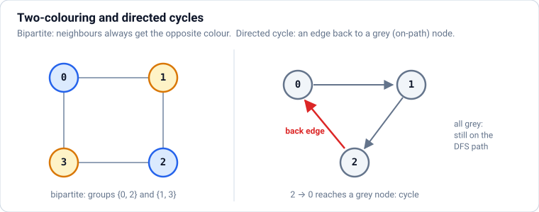

### Theory

> **In simple words:** BFS and DFS answer most graph questions once you know what to look for: a **cycle** (a path back to where you've been), a **two-colouring** (splitting nodes into two teams), or **distances from many starting points at once**.

With BFS and DFS from Section [41](#41-graphs-representation-bfs-and-dfs) you can already answer most graph questions. These patterns come up again and again:

**1. Cycle in an undirected graph.** During DFS, reaching an already-visited node that **isn't the node you just came from** (the parent) means there's a cycle. (Union-find, coming in Section [45](#45-union-find-disjoint-set-union), is another way.)

**2. Cycle in a directed graph: three colours.** In a directed graph, reaching a visited node isn't enough: two separate paths may lead to the same node without any loop. Give each node a state:

- **white** (0): not visited yet;
- **grey** (1): on the **current** DFS path (we're still exploring below it);
- **black** (2): completely finished.

Reaching a **grey** node means you've come back to a node on your own path: a cycle. That's how "can all courses be finished?" is answered with DFS (Kahn's algorithm, coming in Section [44](#44-topological-sort), is the BFS way).

**3. Bipartite graphs (two-colouring).** Can the nodes be split into two groups so that every edge goes **between** the groups? (For example, splitting people into two teams with no two rivals in the same team.) BFS from each uncoloured node, giving each neighbour the **opposite** colour; if an edge ever joins two nodes of the same colour, it's impossible. A graph is bipartite exactly when it has no cycle of odd length.

**4. Multi-source BFS.** When the question is "how far is each cell from the **nearest** source" (rotting oranges, the nearest 0, the nearest exit), put **all** the sources in the queue at the start, at distance 0. BFS then expands from all of them at once, so each cell is reached first by its nearest source. That's O(cells) in total, instead of one BFS per source.

**5. Connected components.** Count how many times you have to start a new DFS/BFS from an unvisited node. Grids work the same way, with the 4 directions of Section [26](#26-matrices-2d-array-problems) as the edges.

**Used in real software:** dependency tools detect cycles ("package A needs B needs A"), deadlock detectors look for cycles in "who waits for whom" graphs, recommendation and matching systems use bipartite graphs (users ↔ products), and multi-source BFS computes "distance to the nearest store/hospital" for every map cell at once.

### Python

```python
from collections import deque

def has_cycle_undirected(n, edges):
    graph = [[] for _ in range(n)]
    for a, b in edges:
        graph[a].append(b)
        graph[b].append(a)
    seen = set()
    def dfs(node, parent):
        seen.add(node)
        for nxt in graph[node]:
            if nxt not in seen:
                if dfs(nxt, node):
                    return True
            elif nxt != parent:
                return True                        # visited, and not where we came from
        return False
    return any(dfs(v, -1) for v in range(n) if v not in seen)

def has_cycle_directed(n, edges):
    graph = [[] for _ in range(n)]
    for a, b in edges:
        graph[a].append(b)
    state = [0] * n                                # 0 white, 1 grey (on path), 2 black (done)
    def dfs(node):
        state[node] = 1
        for nxt in graph[node]:
            if state[nxt] == 1:
                return True                        # back to a node on the current path
            if state[nxt] == 0 and dfs(nxt):
                return True
        state[node] = 2
        return False
    return any(state[v] == 0 and dfs(v) for v in range(n))

has_cycle_undirected(4, [(0, 1), (1, 2), (2, 3)]), has_cycle_undirected(3, [(0, 1), (1, 2), (2, 0)])   # → (False, True)
has_cycle_directed(3, [(0, 1), (0, 2), (1, 2)]), has_cycle_directed(3, [(0, 1), (1, 2), (2, 0)])       # → (False, True)
```

`any(...)` returns `True` as soon as one value is true (and stops early).

```python
def is_bipartite(graph):                           # graph: list of neighbour lists
    color = {}
    for start in range(len(graph)):
        if start in color:
            continue
        color[start] = 0
        q = deque([start])
        while q:
            node = q.popleft()
            for nxt in graph[node]:
                if nxt not in color:
                    color[nxt] = 1 - color[node]   # the opposite colour
                    q.append(nxt)
                elif color[nxt] == color[node]:
                    return False                   # an edge inside one group
    return True

def rotting_oranges(grid):
    """0 empty, 1 fresh, 2 rotten. Minutes until no fresh orange is left (-1 if impossible)."""
    rows, cols = len(grid), len(grid[0])
    q, fresh = deque(), 0
    for r in range(rows):
        for c in range(cols):
            if grid[r][c] == 2:
                q.append((r, c, 0))                # every rotten orange is a source
            elif grid[r][c] == 1:
                fresh += 1
    minutes = 0
    while q:
        r, c, t = q.popleft()
        minutes = max(minutes, t)
        for dr, dc in ((1, 0), (-1, 0), (0, 1), (0, -1)):
            nr, nc = r + dr, c + dc
            if 0 <= nr < rows and 0 <= nc < cols and grid[nr][nc] == 1:
                grid[nr][nc] = 2
                fresh -= 1
                q.append((nr, nc, t + 1))
    return minutes if fresh == 0 else -1

is_bipartite([[1, 3], [0, 2], [1, 3], [0, 2]]), is_bipartite([[1, 2, 3], [0, 2], [0, 1, 3], [0, 2]])   # → (True, False)
rotting_oranges([[2, 1, 1], [1, 1, 0], [0, 1, 1]]), rotting_oranges([[2, 1, 1], [0, 1, 1], [1, 0, 1]])  # → (4, -1)
```

**Common mistakes:**

- ❌ Using the undirected cycle test (visited = cycle) on a directed graph. Use the grey/black states.
- ❌ Checking only the component of node 0. Graphs can be disconnected: loop over every node as a possible start.
- ❌ Running a separate BFS from every source. Put all sources in the queue once.

### Practice

| # | LeetCode problem | Difficulty |
|---|---|---|
| 1 | [695. Max Area of Island](https://leetcode.com/problems/max-area-of-island/) | 🟡 Medium |
| 2 | [785. Is Graph Bipartite?](https://leetcode.com/problems/is-graph-bipartite/) | 🟡 Medium |
| 3 | [886. Possible Bipartition](https://leetcode.com/problems/possible-bipartition/) | 🟡 Medium |
| 4 | [994. Rotting Oranges](https://leetcode.com/problems/rotting-oranges/) | 🟡 Medium |
| 5 | [542. 01 Matrix](https://leetcode.com/problems/01-matrix/) | 🟡 Medium |
| 6 | [130. Surrounded Regions](https://leetcode.com/problems/surrounded-regions/) | 🟡 Medium |
| 7 | [207. Course Schedule](https://leetcode.com/problems/course-schedule/) (directed cycle) | 🟡 Medium |
| 8 | [684. Redundant Connection](https://leetcode.com/problems/redundant-connection/) (undirected cycle) | 🟡 Medium |

**Learn & visualise:** [VisuAlgo: DFS & BFS (cycle detection, bipartite check)](https://visualgo.net/en/dfsbfs)

---

## 43. Shortest Paths: Dijkstra

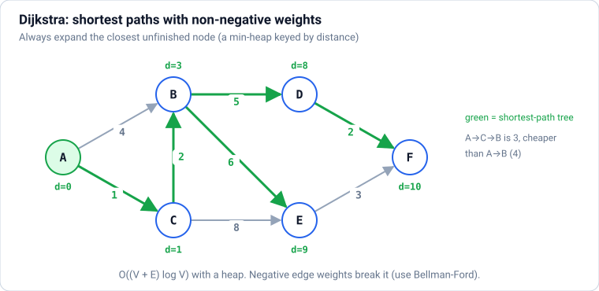

### Theory

> **In simple words:** Dijkstra's algorithm finds the cheapest route from one place to every other place, when roads have different lengths. It always settles the **closest unsettled place next**, like water spreading outwards from the start and reaching nearer places first.

In a **weighted** graph each edge has a cost (a distance, a price, a time). The shortest path is the one with the smallest **total** cost, not the fewest edges, so plain BFS no longer works: two short hops can beat one long edge.

**How it works:**

1. `dist[start] = 0`; every other distance is unknown (∞).
2. Keep a min-heap (Section [39](#39-heaps-and-priority-queues)) of `(distance, node)` pairs, starting with `(0, start)`.
3. Pop the node with the **smallest** distance. With non-negative weights, nothing found later can be cheaper, so this distance is **final**.
4. **Relax** its edges: for each neighbour v through an edge of weight w, if `dist[u] + w < dist[v]`, you've found a cheaper way to v: update `dist[v]` and push `(dist[v], v)`.
5. Repeat until the heap is empty. If a popped pair's distance is bigger than the recorded one, it's a **stale** entry from before an improvement: skip it (the "lazy deletion" trick).

Worked example (the graph in the code below): start at A. A's edges give C = 1 and B = 4. Pop C (1): C → B costs 1 + 2 = 3 < 4, so B improves to 3; C → E gives E = 9. Pop B (3): B → D gives D = 8, and B → E gives 3 + 6 = 9, no better. Pop D (8): D → F gives F = 10. Pop E (9): E → F gives 12, no better. Final: A 0, C 1, B 3, D 8, E 9, F 10.

**Cost:** O((V + E) log V) with a heap.

**The one rule: no negative edges.** A negative edge could make an already-"final" node cheaper later, which breaks step 3. Use Bellman-Ford instead (Section [46](#46-minimum-spanning-trees-bellman-ford-and-floyd-warshall)).

**Getting the path, not just the distance:** whenever you improve `dist[v]`, record `parent[v] = u`. At the end, follow the parents back from the target to the start.

**Choosing a shortest-path algorithm:**

| Graph | Algorithm | Time |
|---|---|---|
| Unweighted (every edge = 1) | **BFS** (Section [41](#41-graphs-representation-bfs-and-dfs)) | O(V + E) |
| Weights 0 or 1 only | 0-1 BFS (a deque: push weight-0 edges to the front) | O(V + E) |
| Non-negative weights | **Dijkstra** | O((V + E) log V) |
| One target, and a good distance estimate (like straight-line distance on a map) | **A\*** (below) | Usually far fewer nodes than Dijkstra |
| Negative weights (no negative cycle) | Bellman-Ford (Section [46](#46-minimum-spanning-trees-bellman-ford-and-floyd-warshall)) | O(V · E) |
| All pairs, small V | Floyd-Warshall (Section [46](#46-minimum-spanning-trees-bellman-ford-and-floyd-warshall)) | O(V³) |

**A\* search** is Dijkstra with a sense of direction. When you're heading for one specific target, it orders the heap by `distance so far + estimate of the distance left`, where the estimate (the **heuristic**) must never overestimate: straight-line distance on a map, or Manhattan distance (`|Δrow| + |Δcol|`) on a grid. It explores towards the target first, so it usually touches far fewer nodes. With a heuristic of 0 it's exactly Dijkstra.

**Common mistakes:**

- ❌ Using BFS on a weighted graph.
- ❌ Forgetting to skip stale heap entries, which makes the algorithm much slower.
- ❌ Running Dijkstra with negative edges.

**Used in real software:** route planning in map apps (Dijkstra and A\*, plus heavy precomputation like "contraction hierarchies" so that a query on a continent-sized road network takes milliseconds), network routing protocols (OSPF computes shortest paths with Dijkstra), pathfinding for characters in video games (A\*), and robot motion planning. A 2025 research result even beat Dijkstra's running time on sparse directed graphs; Section [57](#57-whats-new-recent-breakthroughs-and-modern-practice-20222026) has the story.

### Python

```python
import heapq

def dijkstra(graph, source):
    dist = {source: 0}
    heap = [(0, source)]
    while heap:
        d, u = heapq.heappop(heap)
        if d > dist[u]:
            continue                             # stale entry
        for v, w in graph.get(u, []):
            nd = d + w
            if nd < dist.get(v, float("inf")):
                dist[v] = nd
                heapq.heappush(heap, (nd, v))
    return dist

graph = {
    "A": [("B", 4), ("C", 1)], "C": [("B", 2), ("E", 8)],
    "B": [("D", 5), ("E", 6)], "D": [("F", 2)], "E": [("F", 3)],
}
dict(sorted(dijkstra(graph, "A").items()))   # → {"A": 0, "B": 3, "C": 1, "D": 8, "E": 9, "F": 10}
```

Path reconstruction and **A\*** on a grid (`#` is a wall; each step costs 1; the heuristic is the Manhattan distance to the goal):

```python
def dijkstra_path(graph, source, target):
    dist, parent = {source: 0}, {source: None}
    heap = [(0, source)]
    while heap:
        d, u = heapq.heappop(heap)
        if d > dist[u]:
            continue
        if u == target:
            break
        for v, w in graph.get(u, []):
            if d + w < dist.get(v, float("inf")):
                dist[v], parent[v] = d + w, u     # remember how we got here
                heapq.heappush(heap, (d + w, v))
    path, node = [], target
    while node is not None:                       # walk the parents back to the start
        path.append(node)
        node = parent[node]
    return dist[target], path[::-1]

def a_star(grid, start, goal, use_heuristic=True):
    rows, cols = len(grid), len(grid[0])
    def h(cell):                                  # never overestimates on a 4-direction grid
        if not use_heuristic:
            return 0                              # h = 0 turns A* into plain Dijkstra
        return abs(cell[0] - goal[0]) + abs(cell[1] - goal[1])
    best = {start: 0}
    heap = [(h(start), 0, start)]                 # (distance so far + estimate, distance so far, cell)
    expanded = 0
    while heap:
        _, g, cell = heapq.heappop(heap)
        if g > best[cell]:
            continue
        expanded += 1
        if cell == goal:
            return g, expanded
        r, c = cell
        for nr, nc in ((r + 1, c), (r - 1, c), (r, c + 1), (r, c - 1)):
            if 0 <= nr < rows and 0 <= nc < cols and grid[nr][nc] != "#":
                if g + 1 < best.get((nr, nc), float("inf")):
                    best[(nr, nc)] = g + 1
                    heapq.heappush(heap, (g + 1 + h((nr, nc)), g + 1, (nr, nc)))
    return -1, expanded

dijkstra_path(graph, "A", "F")                    # → (10, ["A", "C", "B", "D", "F"])
maze = ["....#...",
        ".##.#.#.",
        "....#.#.",
        ".##...#.",
        "......#."]
a_star(maze, (0, 0), (4, 5))[0]                   # → 9
open_field = ["." * 20 for _ in range(20)]
a_star(open_field, (10, 0), (10, 19)), a_star(open_field, (10, 0), (10, 19), use_heuristic=False)   # → ((19, 20), (19, 291))
```

`a_star` returns (steps, cells expanded). On the open 20 × 20 field, A\* walks almost straight to the goal and expands 20 cells; without the heuristic (plain Dijkstra) it spreads in every direction and expands 291. Both find the same 19-step route.

### Practice

| # | LeetCode problem | Difficulty |
|---|---|---|
| 1 | [743. Network Delay Time](https://leetcode.com/problems/network-delay-time/) | 🟡 Medium |
| 2 | [1631. Path With Minimum Effort](https://leetcode.com/problems/path-with-minimum-effort/) | 🟡 Medium |
| 3 | [787. Cheapest Flights Within K Stops](https://leetcode.com/problems/cheapest-flights-within-k-stops/) | 🟡 Medium |
| 4 | [1091. Shortest Path in Binary Matrix](https://leetcode.com/problems/shortest-path-in-binary-matrix/) | 🟡 Medium |

**Learn & visualise:** [GeeksforGeeks: Dijkstra](https://www.geeksforgeeks.org/dsa/dijkstras-shortest-path-algorithm-greedy-algo-7/) · [VisuAlgo: Shortest paths](https://visualgo.net/en/sssp)

---

## 44. Topological Sort

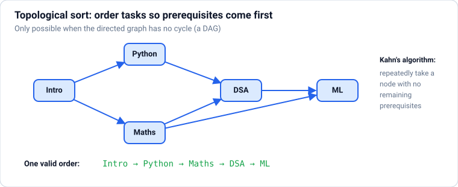

### Theory

> **In simple words:** topological sort puts tasks in an order where **every task comes after the tasks it depends on**. Like getting dressed: socks before shoes, shirt before tie.

**Everyday picture.** A course plan: you can't take DSA before Python, or Machine Learning before DSA and Maths. A topological order is any valid sequence of courses that respects every prerequisite.

**The graph:** tasks are vertices, and an edge **u → v** means "u must come before v". The graph must be a **DAG** (directed acyclic graph): if there's a cycle (A needs B, B needs A), no valid order exists.

**Kahn's algorithm (BFS, the most common):**

1. Count each node's **in-degree**: how many arrows point **into** it (how many prerequisites it still waits for).
2. Put every node with in-degree 0 (nothing to wait for) into a queue.
3. Take a node from the queue and add it to the order. For each of its outgoing arrows, decrease that neighbour's in-degree by 1 (one fewer prerequisite to wait for). Any neighbour that reaches 0 joins the queue.
4. Repeat until the queue is empty.

**Cycle check for free:** if the order has fewer nodes than the graph, some nodes never reached in-degree 0. They're stuck waiting on each other in a cycle. That's exactly how "can all the courses be finished?" is answered.

Worked example (the courses in the code below; 0 Intro, 1 Python, 2 Maths, 3 DSA, 4 ML): in-degrees 0, 1, 1, 2, 2. Start with {0}. Output 0 → Python and Maths drop to 0. Output 1 → DSA drops to 1. Output 2 → DSA drops to 0, ML drops to 1. Output 3 → ML drops to 0. Output 4. Order: 0, 1, 2, 3, 4.

**The DFS alternative:** run DFS and add each node to a list **after** all of its descendants are finished (post-order), then reverse the list.

**Cost:** O(V + E). Many different orders can be valid; if a problem needs the smallest in dictionary order, use a heap instead of the queue.

**Python has it built in:** `graphlib.TopologicalSorter` (Python 3.9+) takes each node's prerequisites and returns an order with `static_order()`, raising `CycleError` if there's a cycle (see the code below).

**Common mistakes:**

- ❌ Drawing the arrow the wrong way round. Decide clearly: `needs → course` means "needs comes first".
- ❌ Forgetting the cycle check (comparing the order's length with the number of nodes).
- ❌ Starting only from node 0 instead of from **every** node with in-degree 0.

**Used in real software:** build tools (Make, Bazel, and every compiler deciding which files to build first), package managers installing dependencies before the packages that need them, spreadsheet recalculation (a cell after the cells it reads), and workflow schedulers like Apache Airflow, whose pipelines are literally DAGs.

### Python

```python
from collections import deque

def topo_sort(n, prerequisites):
    """prerequisites: (course, needs) pairs. Returns an order, or [] if there's a cycle."""
    graph = [[] for _ in range(n)]
    indegree = [0] * n
    for course, needs in prerequisites:
        graph[needs].append(course)
        indegree[course] += 1
    q = deque(i for i in range(n) if indegree[i] == 0)
    order = []
    while q:
        node = q.popleft()
        order.append(node)
        for nxt in graph[node]:
            indegree[nxt] -= 1
            if indegree[nxt] == 0:
                q.append(nxt)
    return order if len(order) == n else []

# 0 Intro, 1 Python, 2 Maths, 3 DSA, 4 ML
topo_sort(5, [(1, 0), (2, 0), (3, 1), (3, 2), (4, 3), (4, 2)])   # → [0, 1, 2, 3, 4]
topo_sort(2, [(0, 1), (1, 0)])                                   # → []
```

Python's built-in version (Python 3.9+): give each node its prerequisites.

```python
from graphlib import TopologicalSorter, CycleError

needs = {"DSA": {"Python", "Maths"}, "ML": {"DSA", "Maths"}, "Python": {"Intro"}, "Maths": {"Intro"}}
order = list(TopologicalSorter(needs).static_order())
order[0], order[-1], order.index("Python") < order.index("DSA")   # → ("Intro", "ML", True)

try:
    list(TopologicalSorter({"a": {"b"}, "b": {"a"}}).static_order())
except CycleError:
    print("cycle found: no valid order")
```

**Output:**

```text
cycle found: no valid order
```

`try` / `except` runs the code in `try`, and if it raises the named error, runs the `except` block instead of crashing.

### Practice

| # | LeetCode problem | Difficulty |
|---|---|---|
| 1 | [207. Course Schedule](https://leetcode.com/problems/course-schedule/) | 🟡 Medium |
| 2 | [210. Course Schedule II](https://leetcode.com/problems/course-schedule-ii/) | 🟡 Medium |
| 3 | [802. Find Eventual Safe States](https://leetcode.com/problems/find-eventual-safe-states/) | 🟡 Medium |
| 4 | [2115. Find All Possible Recipes from Given Supplies](https://leetcode.com/problems/find-all-possible-recipes-from-given-supplies/) | 🟡 Medium |
| 5 | [1462. Course Schedule IV](https://leetcode.com/problems/course-schedule-iv/) | 🟡 Medium |

**Learn & visualise:** [GeeksforGeeks: Topological Sort](https://www.geeksforgeeks.org/dsa/topological-sorting/) · [VisuAlgo: DFS/BFS (topo sort mode)](https://visualgo.net/en/dfsbfs)

---

## 45. Union-Find (Disjoint Set Union)

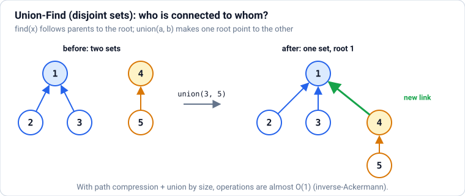

### Theory

> **In simple words:** union-find keeps track of **groups** that keep merging. It answers two questions very fast: "are these two items in the same group?" and "merge these two groups".

**Everyday picture.** Friend circles at a party. Each group has a **leader**. To know whether two people are in the same circle, ask each for their leader and compare. When two circles become friends, one leader simply agrees to follow the other.

**How it works.** Every item has a `parent`. At the start everyone is their own parent (their own group of one). A group is a small tree, and its **root** (the item that is its own parent) is the group's leader.

- **`find(x)`**: follow parents up until you reach the root. Two items are in the same group exactly when `find` returns the same root.
- **`union(a, b)`**: find both roots. If they're different, make one root point to the other: the groups are merged. If they're the same, `a` and `b` were already connected; in a graph, that edge would close a **cycle**.

**Two tricks make it almost O(1):**

1. **Path compression:** during `find`, point the nodes you pass straight at (or closer to) the root, so later finds are shorter. (The code below uses "path halving", a simple version that points each node at its grandparent.)
2. **Union by size:** attach the **smaller** tree under the **larger** one, so trees stay flat.

Together they make each operation O(α(n)), where α is the "inverse Ackermann" function, which is at most 4 for any input that could fit in the universe. Think of it as O(1).

Worked example (the code below): 6 people, 0 … 5. union(1, 2), union(1, 3) → group {1, 2, 3}. union(4, 5) → group {4, 5}. Now find(3) = find(1), but find(5) ≠ find(1). union(3, 5) merges them into {1, 2, 3, 4, 5}; then union(2, 4) returns False, because they're already connected. Groups left: {0} and {1, 2, 3, 4, 5}, so 2.

**Union-find or BFS/DFS?** For a fixed graph, both count connected groups in about O(V + E). Union-find wins when **edges arrive one at a time** and you must answer "connected yet?" after each one, without re-running a search.

**Common mistakes:**

- ❌ Comparing `parent[a] == parent[b]` instead of `find(a) == find(b)` (parents aren't necessarily roots).
- ❌ Skipping both tricks, which can make trees tall and operations O(n).
- ❌ Forgetting to count down the number of groups only when a merge actually happens.

**Used in real software:** Kruskal's minimum spanning tree (Section [46](#46-minimum-spanning-trees-bellman-ford-and-floyd-warshall)), labelling connected regions in images, network connectivity monitoring, and merging duplicate customer accounts that share an email or phone number.

### Python

```python
class DSU:
    def __init__(self, n):
        self.parent = list(range(n))
        self.size = [1] * n
        self.groups = n

    def find(self, x):
        while self.parent[x] != x:
            self.parent[x] = self.parent[self.parent[x]]   # path halving (a form of compression)
            x = self.parent[x]
        return x

    def union(self, a, b):
        ra, rb = self.find(a), self.find(b)
        if ra == rb:
            return False                                  # already connected → this edge makes a cycle
        if self.size[ra] < self.size[rb]:
            ra, rb = rb, ra
        self.parent[rb] = ra                              # attach smaller tree under larger
        self.size[ra] += self.size[rb]
        self.groups -= 1
        return True

d = DSU(6)
d.union(1, 2), d.union(1, 3), d.union(4, 5)   # → (True, True, True)
d.find(3) == d.find(1), d.find(5) == d.find(1)   # → (True, False)
d.union(3, 5), d.find(5) == d.find(2)          # → (True, True)
d.union(2, 4), d.groups                        # → (False, 2)
```

### Practice

| # | LeetCode problem | Difficulty |
|---|---|---|
| 1 | [547. Number of Provinces](https://leetcode.com/problems/number-of-provinces/) | 🟡 Medium |
| 2 | [684. Redundant Connection](https://leetcode.com/problems/redundant-connection/) | 🟡 Medium |
| 3 | [721. Accounts Merge](https://leetcode.com/problems/accounts-merge/) | 🟡 Medium |
| 4 | [1319. Number of Operations to Make Network Connected](https://leetcode.com/problems/number-of-operations-to-make-network-connected/) | 🟡 Medium |

**Learn & visualise:** [GeeksforGeeks: Disjoint Set](https://www.geeksforgeeks.org/dsa/introduction-to-disjoint-set-data-structure-or-union-find-algorithm/) · [VisuAlgo: Union-Find](https://visualgo.net/en/ufds)

---

## 46. Minimum Spanning Trees, Bellman-Ford and Floyd-Warshall

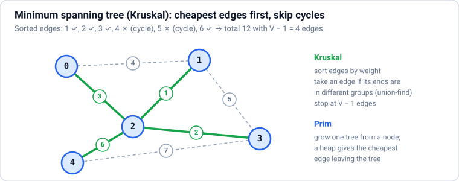

### Theory

> **In simple words:** a **minimum spanning tree** connects every point as cheaply as possible (the cheapest road network that links all towns). **Bellman-Ford** and **Floyd-Warshall** find shortest routes when Dijkstra can't: with negative costs, or between every pair of places.

**Minimum spanning tree (MST).** Given towns and the cost of building each possible road, connect **every** town using the cheapest total set of roads. The answer is always a tree: V − 1 edges and no cycles (any cycle has a removable edge). Two **greedy** algorithms find it: each step takes the cheapest safe choice and never undoes it (Section [48](#48-greedy-algorithms) covers greedy thinking in general):

- **Kruskal:** sort all edges by weight; go through them cheapest first, and keep an edge if it joins two **different** groups. Union-find (Section [45](#45-union-find-disjoint-set-union)) answers "different groups?" in near O(1). Stop at V − 1 edges. Cost: O(E log E) for the sort.
- **Prim:** grow one tree from any start node. A heap (Section [39](#39-heaps-and-priority-queues)) holds the edges leaving the tree; repeatedly add the cheapest edge that reaches a new node. Cost: O(E log V). It's the better choice on dense graphs, or when the edges aren't given as a list (for example "connect all points", where every pair is an edge).

**Bellman-Ford: shortest paths with negative edges.** Dijkstra (Section [43](#43-shortest-paths-dijkstra)) breaks with negative weights. Bellman-Ford simply **relaxes every edge, V − 1 times** (`dist[v] = min(dist[v], dist[u] + w)`). A shortest path has at most V − 1 edges, so after V − 1 rounds all distances are final. If a V-th round still improves something, there's a **negative cycle** (a loop that keeps lowering the cost forever). Cost: O(V × E). Stopping after k + 1 rounds gives the cheapest path using **at most k + 1 edges**, which solves "cheapest flight with at most k stops".

**Floyd-Warshall: all pairs at once.** `dist[i][j]` starts as the direct edge weight (∞ if none, 0 on the diagonal). Then for each node k in turn, allow paths to pass **through** k: `dist[i][j] = min(dist[i][j], dist[i][k] + dist[k][j])`. Three nested loops: O(V³), fine for V up to a few hundred. It's an early example of dynamic programming (coming in Section [49](#49-dynamic-programming)): each round reuses the answers from the round before.

| Problem | Algorithm | Time |
|---|---|---|
| Connect everything as cheaply as possible | Kruskal / Prim | O(E log E) / O(E log V) |
| Shortest paths from one source, weights ≥ 0 | Dijkstra | O((V + E) log V) |
| From one source, negative weights, or "at most k edges" | Bellman-Ford | O(V · E) |
| Between **all** pairs, small V | Floyd-Warshall | O(V³) |

**Used in real software:** designing cable, fibre and power networks (MST), clustering data points (cut the most expensive MST edges), currency-exchange and arbitrage detection (Bellman-Ford finds negative cycles), and distance tables between all pairs of cities (Floyd-Warshall).

### Python

```python
import heapq

def kruskal(n, edges):                              # edges: (weight, u, v)
    parent = list(range(n))
    def find(x):
        while parent[x] != x:
            parent[x] = parent[parent[x]]
            x = parent[x]
        return x
    total, used = 0, []
    for w, u, v in sorted(edges):                   # cheapest first
        ru, rv = find(u), find(v)
        if ru != rv:                                # different groups: no cycle
            parent[ru] = rv
            total += w
            used.append((u, v))
    return total, used

def prim(n, adj):                                   # adj[u] = list of (weight, v)
    seen, total = set(), 0
    heap = [(0, 0)]                                 # (cost to reach, node); start at node 0
    while heap and len(seen) < n:
        w, u = heapq.heappop(heap)
        if u in seen:
            continue
        seen.add(u)
        total += w
        for edge in adj[u]:
            if edge[1] not in seen:
                heapq.heappush(heap, edge)
    return total

edges = [(4, 0, 1), (1, 1, 2), (3, 0, 2), (2, 2, 3), (5, 1, 3), (7, 3, 4), (6, 2, 4)]
kruskal(5, edges)                                   # → (12, [(1, 2), (2, 3), (0, 2), (2, 4)])
adj = [[] for _ in range(5)]
for w, u, v in edges:
    adj[u].append((w, v))
    adj[v].append((w, u))
prim(5, adj)                                        # → 12
```

```python
INF = float("inf")

def bellman_ford(n, edges, source):                 # edges: (u, v, w), directed
    dist = [INF] * n
    dist[source] = 0
    for _ in range(n - 1):                          # V - 1 rounds of relaxing every edge
        for u, v, w in edges:
            if dist[u] + w < dist[v]:
                dist[v] = dist[u] + w
    for u, v, w in edges:                           # one more round: still improving?
        if dist[u] + w < dist[v]:
            return None                             # negative cycle
    return dist

def floyd_warshall(n, edges):
    dist = [[0 if i == j else INF for j in range(n)] for i in range(n)]
    for u, v, w in edges:
        dist[u][v] = min(dist[u][v], w)
    for k in range(n):                              # allow paths through k
        for i in range(n):
            for j in range(n):
                if dist[i][k] + dist[k][j] < dist[i][j]:
                    dist[i][j] = dist[i][k] + dist[k][j]
    return dist

bellman_ford(4, [(0, 1, 4), (0, 2, 5), (1, 2, -3), (2, 3, 2)], 0)   # → [0, 4, 1, 3]
bellman_ford(3, [(0, 1, 1), (1, 2, -2), (2, 1, 1)], 0)             # → None
floyd_warshall(3, [(0, 1, 4), (1, 2, 1), (0, 2, 7)])               # → [[0, 4, 5], [inf, 0, 1], [inf, inf, 0]]
```

**Common mistakes:**

- ❌ Using Dijkstra on graphs with negative edges; use Bellman-Ford.
- ❌ In Kruskal, forgetting to check that both ends are in different groups, which lets a cycle in.
- ❌ In Floyd-Warshall, putting the `k` loop inside the others: `k` **must** be the outermost loop.

### Practice

| # | LeetCode problem | Difficulty |
|---|---|---|
| 1 | [1584. Min Cost to Connect All Points](https://leetcode.com/problems/min-cost-to-connect-all-points/) (Prim) | 🟡 Medium |
| 2 | [787. Cheapest Flights Within K Stops](https://leetcode.com/problems/cheapest-flights-within-k-stops/) (Bellman-Ford) | 🟡 Medium |
| 3 | [743. Network Delay Time](https://leetcode.com/problems/network-delay-time/) (try all three) | 🟡 Medium |
| 4 | [1334. Find the City With the Smallest Number of Neighbors at a Threshold Distance](https://leetcode.com/problems/find-the-city-with-the-smallest-number-of-neighbors-at-a-threshold-distance/) (Floyd-Warshall) | 🟡 Medium |
| 5 | [1489. Find Critical and Pseudo-Critical Edges in Minimum Spanning Tree](https://leetcode.com/problems/find-critical-and-pseudo-critical-edges-in-minimum-spanning-tree/) | 🔴 Hard |

**Learn & visualise:** [VisuAlgo: Minimum spanning tree](https://visualgo.net/en/mst) · [VisuAlgo: Shortest paths (Bellman-Ford, Dijkstra)](https://visualgo.net/en/sssp)

---

### ✅ Part 7 checkpoint

Without looking, can you:

- [ ] Build an adjacency list from a list of edges, for directed and undirected graphs?
- [ ] Write BFS and DFS with a `visited` set, and count islands in a grid?
- [ ] Detect cycles in undirected and directed graphs, and check whether a graph is bipartite?
- [ ] Use multi-source BFS for "distance to the nearest …" problems?
- [ ] Explain Dijkstra, Bellman-Ford and Floyd-Warshall, and when each one applies?
- [ ] Produce a topological order with Kahn's algorithm?
- [ ] Write union-find, and use it in Kruskal's minimum spanning tree?

Part 8 moves from structures to **strategies** for designing algorithms.

---

# Part 8 — Advanced: Algorithm Design

> **Goal:** General strategies for hard problems: trying every choice smartly, choosing greedily, and remembering answers.  
> **You need:** Everything before, especially recursion (Part 3) and DFS (Part 7).

---

## 47. Backtracking

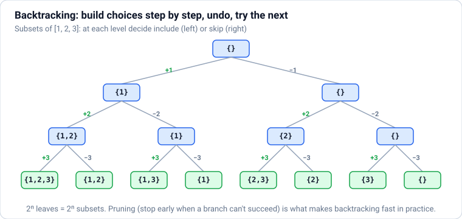

### Theory

> **In simple words:** backtracking tries every possibility **one choice at a time**. When a path can't work, it steps back ("backtracks"), undoes the last choice, and tries the next option. It's how you'd solve a maze: walk until you hit a dead end, go back to the last junction, try another way.

**Everyday picture.** Packing a suitcase by trial: put an item in, then another; if the lid won't close, take out the last item and try a different one.

**The decision tree.** Every sequence of choices is a path in a tree. For the subsets of `[1, 2, 3]`, the first level decides "take 1 or not", the second "take 2 or not", the third "take 3 or not": 2 × 2 × 2 = 8 leaves, one per subset. Backtracking walks this tree depth-first (like DFS in Section [41](#41-graphs-representation-bfs-and-dfs)), but never builds it in memory; it only walks it.

**The template: choose → explore → un-choose.**

```text
def backtrack(state):
    if state is a complete solution: record a copy of it; return
    for choice in the options available now:
        if the choice is allowed:
            make the choice            (choose)
            backtrack(the new state)   (explore)
            undo the choice            (un-choose)
```

**Why "undo"?** All the branches share one `path` list. After exploring a choice, you must restore the list exactly as it was, so the next choice starts from a clean state.

**How big can it get?** Very big: 2ⁿ subsets, n! orderings (10! is 3.6 million). Two things make it practical:

- **Pruning:** stop a branch as soon as it can't lead to a valid answer (the running total already exceeds the target; a queen is already attacked). This can cut away most of the tree.
- **Small inputs:** backtracking problems usually have n ≤ 15 or so; the input size is a hint (Section [59](#59-pattern-cheat-sheet-which-technique-when)).

**The classic problems:**

| Problem | Choice at each step | Pruning |
|---|---|---|
| Subsets | Take this item or skip it | — |
| Permutations | Which unused item goes next | Skip used items |
| Combination sum | Which candidate to add (reuse allowed) | Stop when the candidate is bigger than what's left |
| N-Queens | Which column for the queen in this row | Skip attacked columns and diagonals |
| Word search in a grid | Which neighbouring cell to step to | Stop when the letter doesn't match |
| Sudoku | Which digit for this empty cell | Skip digits already in the row, column or box |

**Two details that cause most bugs:**

- Record a **copy** of the current path (`path[:]`), because `path` keeps changing afterwards.
- To avoid **duplicate** results when the input has repeated values: sort first, and skip a value that equals the previous one at the same depth.

**Used in real software:** Sudoku and puzzle solvers, SAT solvers (they decide whether a huge logic formula can be satisfied, by backtracking with clever learning, and are used to verify chips and software), and regular-expression engines. Python's `re` module is a backtracking engine, which is why a badly written pattern can take "forever" on some inputs (a "catastrophic backtracking" bug, sometimes used for denial-of-service attacks).

### Python

```python
def subsets(nums):
    out, path = [], []
    def backtrack(i):
        if i == len(nums):
            out.append(path[:])                 # copy!
            return
        path.append(nums[i]); backtrack(i + 1); path.pop()   # include nums[i]
        backtrack(i + 1)                                     # skip nums[i]
    backtrack(0)
    return out

def permutations(nums):
    out, path, used = [], [], [False] * len(nums)
    def backtrack():
        if len(path) == len(nums):
            out.append(path[:])
            return
        for i, x in enumerate(nums):
            if not used[i]:
                used[i] = True; path.append(x)
                backtrack()
                path.pop(); used[i] = False
    backtrack()
    return out

def combination_sum(candidates, target):
    out, path = [], []
    candidates.sort()
    def backtrack(start, remaining):
        if remaining == 0:
            out.append(path[:])
            return
        for i in range(start, len(candidates)):
            if candidates[i] > remaining:
                break                            # prune: sorted, so the rest are too big
            path.append(candidates[i])
            backtrack(i, remaining - candidates[i])   # i, not i + 1: reuse allowed
            path.pop()
    backtrack(0, target)
    return out

subsets([1, 2, 3])                    # → [[1, 2, 3], [1, 2], [1, 3], [1], [2, 3], [2], [3], []]
len(permutations([1, 2, 3, 4]))       # → 24
combination_sum([2, 3, 6, 7], 7)      # → [[2, 2, 3], [7]]
```

Two more interview favourites: searching a grid (backtracking on the 4 directions from Section [26](#26-matrices-2d-array-problems)) and N-Queens (pruning with sets of attacked columns and diagonals).

```python
def word_search(board, word):
    rows, cols = len(board), len(board[0])
    def backtrack(r, c, i):
        if i == len(word):
            return True
        if not (0 <= r < rows and 0 <= c < cols) or board[r][c] != word[i]:
            return False
        board[r][c] = "#"                        # choose: mark as used on this path
        found = any(backtrack(r + dr, c + dc, i + 1) for dr, dc in ((1, 0), (-1, 0), (0, 1), (0, -1)))
        board[r][c] = word[i]                    # un-choose: restore the letter
        return found
    return any(backtrack(r, c, 0) for r in range(rows) for c in range(cols))

def n_queens(n):
    """Number of ways to place n queens so that none attack each other."""
    cols, diag, anti = set(), set(), set()
    def place(r):
        if r == n:
            return 1
        count = 0
        for c in range(n):
            if c in cols or r - c in diag or r + c in anti:
                continue                         # prune: this square is attacked
            cols.add(c); diag.add(r - c); anti.add(r + c)
            count += place(r + 1)
            cols.remove(c); diag.remove(r - c); anti.remove(r + c)
        return count
    return place(0)

grid = [list("ABCE"), list("SFCS"), list("ADEE")]
word_search(grid, "ABCCED"), word_search(grid, "SEE"), word_search(grid, "ABCB")   # → (True, True, False)
n_queens(4), n_queens(8)                         # → (2, 92)
```

Cells on the same diagonal share `r - c`, and cells on the same anti-diagonal share `r + c`, so three sets detect every attack in O(1).

### Practice

| # | LeetCode problem | Difficulty |
|---|---|---|
| 1 | [78. Subsets](https://leetcode.com/problems/subsets/) | 🟡 Medium |
| 2 | [46. Permutations](https://leetcode.com/problems/permutations/) | 🟡 Medium |
| 3 | [39. Combination Sum](https://leetcode.com/problems/combination-sum/) | 🟡 Medium |
| 4 | [17. Letter Combinations of a Phone Number](https://leetcode.com/problems/letter-combinations-of-a-phone-number/) | 🟡 Medium |
| 5 | [79. Word Search](https://leetcode.com/problems/word-search/) | 🟡 Medium |
| 6 | [22. Generate Parentheses](https://leetcode.com/problems/generate-parentheses/) | 🟡 Medium |
| 7 | [131. Palindrome Partitioning](https://leetcode.com/problems/palindrome-partitioning/) | 🟡 Medium |
| 8 | [51. N-Queens](https://leetcode.com/problems/n-queens/) | 🔴 Hard |
| 9 | [37. Sudoku Solver](https://leetcode.com/problems/sudoku-solver/) | 🔴 Hard |

**Learn & visualise:** [GeeksforGeeks: Backtracking](https://www.geeksforgeeks.org/dsa/backtracking-algorithms/)

---

## 48. Greedy Algorithms

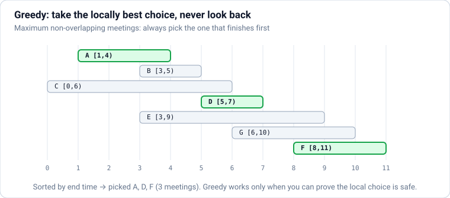

### Theory

> **In simple words:** a greedy algorithm makes the choice that looks **best right now** and never changes its mind. It's fast and simple, but it's only correct for problems where "best right now" is guaranteed to lead to the best overall answer.

**Everyday picture.** A shopkeeper giving ₹87 in change hands over the biggest note or coin that fits (a 50, then 20, 10, 5, 2) until nothing is left. With Indian currency this always uses the fewest coins. With strange coins it can fail (see below).

**How greedy solutions usually look:** sort by the right key, then one pass that takes each item if it fits. O(n log n) in total.

**The hard part is choosing the key, and proving it.** Example: fit the most meetings into one room.

| Rule | Does it work? |
|---|---|
| Take the **shortest** meeting first | ❌ A short meeting in the middle can block two others |
| Take the meeting that **starts earliest** | ❌ An early, very long meeting blocks everything |
| Take the meeting that **ends earliest** | ✅ It leaves the most time for the rest |

**Why "ends earliest" is right (the exchange argument):** take any best schedule. Swap its first meeting for the meeting that ends earliest overall. That meeting ends no later, so it can't clash with the rest of the schedule, and the count stays the same. Repeating the argument shows greedy is never worse than the best. This "swap in the greedy choice without making things worse" reasoning is how every greedy algorithm is proved.

**When greedy fails:** coins [1, 3, 4] for amount 6. Greedy takes 4, then 1, then 1 (3 coins), but 3 + 3 uses only 2. Once a choice limits future choices in a way that matters, you need to consider **all** options: that's dynamic programming (Section [49](#49-dynamic-programming)). The 0/1 knapsack (take items to fit a bag) is another classic greedy failure.

**How to decide in an interview:**

1. Suggest a greedy rule.
2. Try to break it with a small counterexample (spend two minutes on it).
3. If you can't break it, try an exchange argument. If you can, switch to DP.
4. If unsure, test greedy against a brute force on small random inputs.

**Classic greedy problems:** interval scheduling (earliest end first), jump game (track the farthest reachable index), gas station, assigning cookies, partition labels, Huffman coding, and Dijkstra (Section [43](#43-shortest-paths-dijkstra)) and the minimum spanning tree algorithms (Section [46](#46-minimum-spanning-trees-bellman-ford-and-floyd-warshall)), which are greedy too.

**Common mistakes:**

- ❌ Trusting greedy without a proof or at least a counterexample hunt.
- ❌ Sorting by the wrong key (start instead of end time).
- ❌ Using greedy on 0/1 knapsack or coin change with unusual coins.

**Used in real software:** **Huffman coding** (inside ZIP files, PNG images and HTTP compression) builds its code greedily by always merging the two rarest symbols; schedulers and meeting planners; network design (minimum spanning trees); and cashier and vending-machine change-making.

### Python

```python
def max_meetings(intervals):
    """Most non-overlapping meetings: sort by END time, take each that starts after the last end."""
    count, last_end = 0, float("-inf")
    for start, end in sorted(intervals, key=lambda m: m[1]):
        if start >= last_end:
            count += 1
            last_end = end
    return count

def can_jump(nums):
    """Jump game: track the farthest index reachable so far."""
    farthest = 0
    for i, jump in enumerate(nums):
        if i > farthest:
            return False
        farthest = max(farthest, i + jump)
    return True

def greedy_coins(coins, amount):
    count = 0
    for c in sorted(coins, reverse=True):
        count += amount // c
        amount %= c
    return count if amount == 0 else -1

max_meetings([(1, 4), (3, 5), (0, 6), (5, 7), (3, 9), (6, 10), (8, 11)])   # → 3
can_jump([2, 3, 1, 1, 4]), can_jump([3, 2, 1, 0, 4])                      # → (True, False)
greedy_coins([1, 3, 4], 6)                                                 # → 3
```

The last line is the **counterexample**: greedy uses 3 coins (4+1+1), but the optimum is 2 (3+3). Section [49](#49-dynamic-programming) solves it correctly with DP.

### Practice

| # | LeetCode problem | Difficulty |
|---|---|---|
| 1 | [455. Assign Cookies](https://leetcode.com/problems/assign-cookies/) | 🟢 Easy |
| 2 | [55. Jump Game](https://leetcode.com/problems/jump-game/) | 🟡 Medium |
| 3 | [134. Gas Station](https://leetcode.com/problems/gas-station/) | 🟡 Medium |
| 4 | [435. Non-overlapping Intervals](https://leetcode.com/problems/non-overlapping-intervals/) | 🟡 Medium |
| 5 | [763. Partition Labels](https://leetcode.com/problems/partition-labels/) | 🟡 Medium |

**Learn & visualise:** [GeeksforGeeks: Greedy](https://www.geeksforgeeks.org/dsa/greedy-algorithms/)

---

## 49. Dynamic Programming

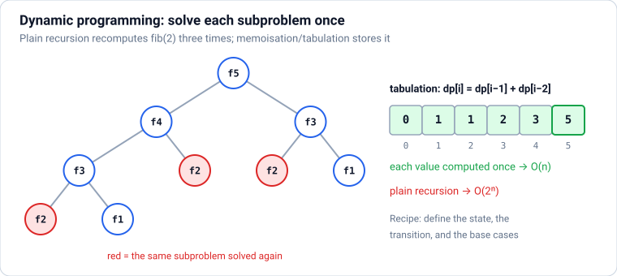

### Theory

> **In simple words:** dynamic programming (DP) means **never solving the same small problem twice**. Break the problem into smaller versions of itself, solve each one once, **write the answer down**, and build bigger answers from the saved ones.

**Everyday picture.** Someone asks "what's 1 + 1 + 1 + 1 + 1?" You count: 5. They add "+ 1" at the end and ask again. You don't recount from scratch: you answer 6 at once, because you remembered 5. That's DP.

**When does DP apply?** Two signs:

1. **Overlapping subproblems:** the same smaller question is asked again and again. The recursive Fibonacci in Section [14](#14-recursion-basics) made 21,891 calls for fib(20), because fib(18), fib(17), … were recomputed over and over (see the picture).
2. **Optimal substructure:** the best answer is built from the best answers to smaller questions. The fewest coins for 11 is 1 + the fewest coins for 11 − (some coin).

**Two ways to write it:**

| Style | How | Good for |
|---|---|---|
| **Top-down (memoisation)** | Write the plain recursion, then save each answer in a cache | The easiest step from a recursive idea; only solves the states it needs |
| **Bottom-up (tabulation)** | Fill a list/table from the smallest cases upwards, in a loop | No recursion limit; easy to shrink memory |

In Python, top-down is often one line: `@cache` (from `functools`) placed above a function is a **decorator**. It wraps the function so each answer is stored in a dict the first time it's computed, and returned instantly on every later call with the same arguments. It turns the exponential Fibonacci into O(n).

**The recipe that works for almost every DP problem:**

1. **State:** what does `dp[i]` (or `dp[i][j]`) mean? Say it in a full sentence: "`dp[a]` = the fewest coins that make amount a".
2. **Transition:** how does a state come from smaller states? "To make a, the last coin is some c, so `dp[a] = min(dp[a − c] + 1)` over every coin c ≤ a."
3. **Base case:** the smallest states, answered directly: `dp[0] = 0`.
4. **Order:** compute smaller states before the states that need them (here, amounts from 1 up). **Answer:** which state holds it? (`dp[amount]`.)
5. **Save space** (optional): if row i only needs row i − 1, keep one or two rows instead of the whole table.

**Worked example: climbing stairs.** You can climb 1 or 2 steps at a time. How many ways are there to climb n steps? The last move was either a 1-step (from n − 1) or a 2-step (from n − 2), so `ways(n) = ways(n − 1) + ways(n − 2)`, with ways(0) = ways(1) = 1. That gives 1, 1, 2, 3, 5, 8, …: it's Fibonacci again. ways(10) = 89.

**Cost of a DP:** (number of states) × (work per state). Coin change: `amount` states × `len(coins)` choices each.

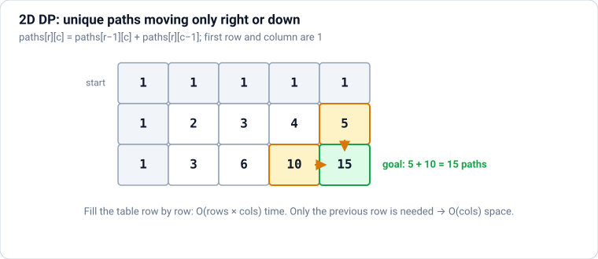

**Common families** (Section [50](#50-dynamic-programming-ii-knapsack-subsequences-strings-and-intervals) covers the rest): 1D (climbing stairs, house robber, coin change), 2D grids (unique paths, minimum path sum), two strings (longest common subsequence, edit distance), knapsack, and intervals.

**Common mistakes:**

- ❌ Starting to code before stating the state in words.
- ❌ Wrong base cases (off by one at `dp[0]`).
- ❌ Filling the table in an order that reads states before they're computed.
- ❌ Using greedy where choices interact (Section [48](#48-greedy-algorithms)).

**Used in real software:** `diff` and `git diff` (closely related to the longest common subsequence), spell checkers suggesting words by edit distance, DNA and protein sequence alignment in bioinformatics, speech recognition (the Viterbi algorithm), and the line-breaking algorithm that TeX uses to lay out paragraphs.

### Python

```python
from functools import cache

@cache
def climb(n):                          # top-down: ways to climb n stairs taking 1 or 2 steps
    return 1 if n <= 1 else climb(n - 1) + climb(n - 2)

def coin_change(coins, amount):        # bottom-up: fewest coins (fixes the greedy counterexample)
    INF = amount + 1
    dp = [0] + [INF] * amount
    for a in range(1, amount + 1):
        for c in coins:
            if c <= a:
                dp[a] = min(dp[a], dp[a - c] + 1)
    return dp[amount] if dp[amount] != INF else -1

def unique_paths(rows, cols):          # 2D table, kept as one row: O(cols) space
    row = [1] * cols
    for _ in range(1, rows):
        for c in range(1, cols):
            row[c] += row[c - 1]       # above (old row[c]) + left (new row[c-1])
    return row[-1]

def lcs(a, b):                         # longest common subsequence: the classic two-string DP
    dp = [[0] * (len(b) + 1) for _ in range(len(a) + 1)]
    for i in range(1, len(a) + 1):
        for j in range(1, len(b) + 1):
            if a[i - 1] == b[j - 1]:
                dp[i][j] = dp[i - 1][j - 1] + 1
            else:
                dp[i][j] = max(dp[i - 1][j], dp[i][j - 1])
    return dp[-1][-1]

def rob(houses):                       # house robber: take this house + best two back, or skip it
    take_prev, best = 0, 0
    for money in houses:
        take_prev, best = best, max(best, take_prev + money)
    return best

climb(10)                              # → 89
coin_change([1, 3, 4], 6)              # → 2
coin_change([2], 3)                    # → -1
unique_paths(3, 5)                     # → 15
lcs("abcde", "ace")                    # → 3
rob([2, 7, 9, 3, 1])                   # → 12
```

### Practice

| # | LeetCode problem | Difficulty |
|---|---|---|
| 1 | [70. Climbing Stairs](https://leetcode.com/problems/climbing-stairs/) | 🟢 Easy |
| 2 | [198. House Robber](https://leetcode.com/problems/house-robber/) | 🟡 Medium |
| 3 | [322. Coin Change](https://leetcode.com/problems/coin-change/) | 🟡 Medium |
| 4 | [300. Longest Increasing Subsequence](https://leetcode.com/problems/longest-increasing-subsequence/) | 🟡 Medium |
| 5 | [62. Unique Paths](https://leetcode.com/problems/unique-paths/) | 🟡 Medium |
| 6 | [1143. Longest Common Subsequence](https://leetcode.com/problems/longest-common-subsequence/) | 🟡 Medium |
| 7 | [72. Edit Distance](https://leetcode.com/problems/edit-distance/) | 🟡 Medium |

**Learn & visualise:** [GeeksforGeeks: Dynamic Programming](https://www.geeksforgeeks.org/dsa/dynamic-programming/) · [VisuAlgo: Recursion tree → DP](https://visualgo.net/en/recursion)

---

## 50. Dynamic Programming II: Knapsack, Subsequences, Strings and Intervals

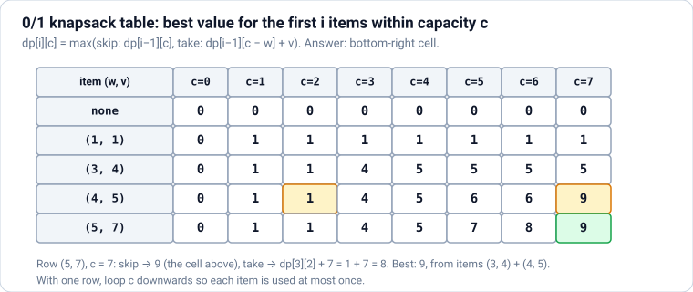

### Theory

> **In simple words:** most DP interview problems belong to a few **families**. Once you recognise the family, the table (the "state") and the rule for filling it are standard.

Section [49](#49-dynamic-programming) gave the recipe: **state → transition → base case → order → answer**. Interview DP problems fall into a few **families**. Recognise the family and the state is usually standard:

| Family | State | Transition (idea) | Classic problems |
|---|---|---|---|
| **0/1 knapsack** (each item used at most once) | `dp[c]` = best value with capacity c | Skip item, or take it: `dp[c - w] + v`. Loop c **downwards** so an item isn't reused | Knapsack, partition equal subset sum, target sum |
| **Unbounded knapsack** (reuse allowed) | `dp[a]` = ways / fewest coins for amount a | Loop a **upwards**, so an item can be used again | Coin change, coin change II (count ways) |
| **Subsequences** of one list | `dp[i]` = best answer **ending at** i | Look back at every j < i | Longest increasing subsequence (LIS) |
| **Two strings** | `dp[i][j]` = answer for the first i chars of a and first j of b | Match the last characters, or drop one | LCS, edit distance |
| **Prefix of a string** | `dp[i]` = can the first i chars be solved? | Try every last piece `s[j:i]` | Word break, decode ways |
| **Intervals** | `dp[i][j]` = answer for the range i … j | Try every split point k inside it | Burst balloons, matrix-chain multiplication, palindrome partitioning |
| **States / "state machine"** | `dp[i][state]`: holding a stock or not, resting or not | Move between states each day | Stock problems with cooldown or fees |

**Key details:**

- **0/1 vs unbounded is just the loop direction** when you use one row. Going downwards reads values from *before* this item was considered (each item once); going upwards reads values that may already include it (reuse).
- **Counting ways vs finding the best:** replace `max`/`min` with `+`. For coin change II, loop over **coins outside** and amounts inside, so each combination is counted once (not once per order).
- **LIS in O(n log n):** keep `tails[k]` = the smallest possible last value of an increasing subsequence of length k + 1. For each x, binary-search (Section [18](#18-searching-linear-search-and-binary-search)) the first tail ≥ x and replace it, or append x if it's bigger than all of them. The length of `tails` is the answer.
- **Edit distance:** if the last characters match, `dp[i][j] = dp[i-1][j-1]`; otherwise 1 + the best of insert (`dp[i][j-1]`), delete (`dp[i-1][j]`) and replace (`dp[i-1][j-1]`).
- **Interval DP:** fill by **increasing length**, because a range depends on shorter ranges inside it. For burst balloons, choose which balloon `k` bursts **last** in the range (i, j): its neighbours at that moment are the fixed ends i and j.

**Used in real software:** knapsack-style DP decides what fits in a budget (ad bidding, cargo loading, cloud resource allocation), edit distance powers spell checkers and fuzzy search, and LCS-style DP is the core of `diff` and of DNA alignment tools in bioinformatics.

### Python

```python
def knapsack(weights, values, capacity):            # 0/1: each item at most once
    dp = [0] * (capacity + 1)
    for w, v in zip(weights, values):
        for c in range(capacity, w - 1, -1):         # downwards: don't reuse this item
            dp[c] = max(dp[c], dp[c - w] + v)
    return dp[capacity]

def can_partition(nums):                             # split into two equal-sum halves?
    total = sum(nums)
    if total % 2:
        return False
    target = total // 2
    reachable = [True] + [False] * target            # reachable[s]: some subset sums to s
    for x in nums:
        for s in range(target, x - 1, -1):
            reachable[s] = reachable[s] or reachable[s - x]
    return reachable[target]

def coin_change_ways(coins, amount):                 # unbounded: count combinations
    ways = [1] + [0] * amount
    for c in coins:                                  # coins outside: combinations, not orders
        for a in range(c, amount + 1):               # upwards: coin c can be reused
            ways[a] += ways[a - c]
    return ways[amount]

knapsack([1, 3, 4, 5], [1, 4, 5, 7], 7)             # → 9
can_partition([1, 5, 11, 5]), can_partition([1, 2, 3, 5])   # → (True, False)
coin_change_ways([1, 2, 5], 5)                       # → 4
```

`zip(a, b)` pairs up two lists item by item: `zip([1, 3], [1, 4])` gives `(1, 1)`, then `(3, 4)`.

```python
from bisect import bisect_left

def lis_quadratic(nums):                             # dp[i] = LIS ending at i: O(n²)
    dp = [1] * len(nums)
    for i in range(len(nums)):
        for j in range(i):
            if nums[j] < nums[i]:
                dp[i] = max(dp[i], dp[j] + 1)
    return max(dp)

def lis_fast(nums):                                  # O(n log n) with binary search
    tails = []
    for x in nums:
        i = bisect_left(tails, x)
        if i == len(tails):
            tails.append(x)                          # x extends the longest subsequence
        else:
            tails[i] = x                             # x is a smaller tail for length i + 1
    return len(tails)

def edit_distance(a, b):
    dp = [[0] * (len(b) + 1) for _ in range(len(a) + 1)]
    for i in range(len(a) + 1):
        dp[i][0] = i                                 # delete all i characters
    for j in range(len(b) + 1):
        dp[0][j] = j                                 # insert all j characters
    for i in range(1, len(a) + 1):
        for j in range(1, len(b) + 1):
            if a[i - 1] == b[j - 1]:
                dp[i][j] = dp[i - 1][j - 1]
            else:
                dp[i][j] = 1 + min(dp[i - 1][j], dp[i][j - 1], dp[i - 1][j - 1])
    return dp[-1][-1]

def word_break(s, words):
    words = set(words)
    ok = [True] + [False] * len(s)                   # ok[i]: s[:i] can be split into words
    for i in range(1, len(s) + 1):
        for j in range(i):
            if ok[j] and s[j:i] in words:
                ok[i] = True
                break
    return ok[len(s)]

nums = [10, 9, 2, 5, 3, 7, 101, 18]
lis_quadratic(nums), lis_fast(nums)                  # → (4, 4)
edit_distance("horse", "ros"), edit_distance("intention", "execution")   # → (3, 5)
word_break("leetcode", ["leet", "code"]), word_break("catsandog", ["cats", "dog", "sand", "and", "cat"])   # → (True, False)
```

```python
def burst_balloons(nums):                            # interval DP
    vals = [1] + nums + [1]
    n = len(vals)
    dp = [[0] * n for _ in range(n)]                 # dp[i][j]: best for balloons strictly between i and j
    for length in range(2, n):                       # shorter ranges first
        for i in range(n - length):
            j = i + length
            for k in range(i + 1, j):                # k bursts LAST between i and j
                dp[i][j] = max(dp[i][j], dp[i][k] + vals[i] * vals[k] * vals[j] + dp[k][j])
    return dp[0][n - 1]

def max_profit_cooldown(prices):                     # state machine DP
    hold, sold, rest = float("-inf"), 0, 0           # best profit in each state
    for p in prices:
        hold, sold, rest = max(hold, rest - p), hold + p, max(rest, sold)
    return max(sold, rest)

burst_balloons([3, 1, 5, 8])                         # → 167
max_profit_cooldown([1, 2, 3, 0, 2])                 # → 3
```

**Common mistakes:**

- ❌ Looping capacity upwards in 0/1 knapsack, which silently allows reusing items.
- ❌ In coin change II, putting amounts outside and coins inside: that counts orders (1+2 and 2+1) separately.
- ❌ Filling an interval DP by `i` and `j` in plain order instead of by **length**, so a range is read before its inner ranges are computed.

### Practice

| # | LeetCode problem | Difficulty |
|---|---|---|
| 1 | [416. Partition Equal Subset Sum](https://leetcode.com/problems/partition-equal-subset-sum/) | 🟡 Medium |
| 2 | [494. Target Sum](https://leetcode.com/problems/target-sum/) | 🟡 Medium |
| 3 | [518. Coin Change II](https://leetcode.com/problems/coin-change-ii/) | 🟡 Medium |
| 4 | [300. Longest Increasing Subsequence](https://leetcode.com/problems/longest-increasing-subsequence/) | 🟡 Medium |
| 5 | [139. Word Break](https://leetcode.com/problems/word-break/) | 🟡 Medium |
| 6 | [91. Decode Ways](https://leetcode.com/problems/decode-ways/) | 🟡 Medium |
| 7 | [516. Longest Palindromic Subsequence](https://leetcode.com/problems/longest-palindromic-subsequence/) | 🟡 Medium |
| 8 | [309. Best Time to Buy and Sell Stock with Cooldown](https://leetcode.com/problems/best-time-to-buy-and-sell-stock-with-cooldown/) | 🟡 Medium |
| 9 | [72. Edit Distance](https://leetcode.com/problems/edit-distance/) | 🟡 Medium |
| 10 | [312. Burst Balloons](https://leetcode.com/problems/burst-balloons/) | 🔴 Hard |
| 11 | [10. Regular Expression Matching](https://leetcode.com/problems/regular-expression-matching/) | 🔴 Hard |

**Learn & visualise:** [GeeksforGeeks: 0/1 knapsack](https://www.geeksforgeeks.org/dsa/0-1-knapsack-problem-dp-10/) · [VisuAlgo: Recursion tree → DP](https://visualgo.net/en/recursion)

---

## 51. Bit Manipulation

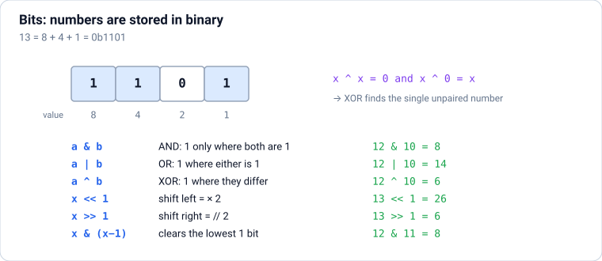

### Theory

> **In simple words:** every integer is stored as a row of **bits** (0s and 1s, Section [12](#12-number-systems-decimal-and-binary)). Bitwise operators work on **all the bits at once**, like flipping a whole row of light switches in one move, which makes some tricks very fast.

**The operators** (each is O(1)), shown on 12 = `1100` and 10 = `1010`:

| Operator | Name | Rule for each bit pair | 12 op 10 | Common use |
|---|---|---|---|---|
| `a & b` | AND | 1 only if **both** are 1 | `1000` = 8 | Test or clear bits; `x & 1` is 1 for odd numbers |
| `a \| b` | OR | 1 if **either** is 1 | `1110` = 14 | Turn bits on |
| `a ^ b` | XOR | 1 if they're **different** | `0110` = 6 | Toggle bits; `x ^ x = 0` |
| `~x` | NOT | Flip every bit | | In Python, `~x == -x - 1` |
| `x << k` | Left shift | Move bits k places left | 13 << 1 = 26 | Multiply by 2ᵏ |
| `x >> k` | Right shift | Move bits k places right | 13 >> 1 = 6 | Floor-divide by 2ᵏ |

**Bit i of x** is `(x >> i) & 1`. Turn it on with `x | (1 << i)`, off with `x & ~(1 << i)`, and flip it with `x ^ (1 << i)`.

**The famous tricks, explained:**

- **`x & (x - 1)` removes the lowest 1-bit.** Subtracting 1 turns the lowest 1 into 0 and every 0 below it into 1 (like 1000 − 1 = 0111), so the AND clears exactly that bit. Uses: count the 1-bits (repeat until 0), and test for a power of two (a power of two has exactly one 1-bit: `x > 0 and x & (x - 1) == 0`).
- **XOR cancels pairs.** `a ^ a = 0` and `a ^ 0 = a`, and the order doesn't matter. So XOR-ing a list where every number appears twice except one leaves exactly that one: 4 ^ 1 ^ 2 ^ 1 ^ 2 = 4.
- **`x & -x` isolates the lowest 1-bit** (it's what Fenwick trees use, Section [53](#53-range-queries-with-updates-fenwick-trees-and-segment-trees)).

**Bitmasks: a set in one integer.** With up to about 20 items, bit i can mean "item i is in the set". Then every subset of n items is one of the integers 0 … 2ⁿ − 1, so looping over `range(1 << n)` visits every subset. That's another way to write subset backtracking, and the basis of "bitmask DP".

**Python details:** integers have **unlimited size** (no overflow), and negative numbers behave as if they had infinitely many 1-bits on the left. To imitate the 32-bit integers of C, Java or LeetCode's problem statements, mask with `& 0xFFFFFFFF`. `bin(x)` shows the bits, and `x.bit_count()` (Python 3.10+) counts the 1-bits.

**Common mistakes:**

- ❌ Operator precedence: `x & 1 == 0` means `x & (1 == 0)`. Write `(x & 1) == 0`.
- ❌ Expecting 32-bit overflow behaviour in Python.
- ❌ Using bitmasks for more than about 20–25 items (2²⁵ is already 33 million subsets).

**Used in real software:** Unix file permissions (`chmod 755` is three groups of 3 bits: read, write, execute), network subnet masks (`255.255.255.0`), feature flags packed into one integer, graphics and compression code, Bloom filters (Section [55](#55-randomised-and-streaming-algorithms-shuffling-sampling-bloom-filters-and-sketches)), and chess engines that store the board as 64-bit "bitboards".

### Python

```python
def count_bits(x):
    count = 0
    while x:
        x &= x - 1                 # drop the lowest set bit
        count += 1
    return count

def single_number(nums):           # every number appears twice except one
    result = 0
    for x in nums:
        result ^= x
    return result

def is_power_of_two(x):
    return x > 0 and x & (x - 1) == 0

def subsets_by_mask(items):
    n = len(items)
    return [[items[i] for i in range(n) if mask >> i & 1] for mask in range(1 << n)]

bin(13), count_bits(13), (13).bit_count()        # → ("0b1101", 3, 3)
single_number([4, 1, 2, 1, 2])                   # → 4
is_power_of_two(64), is_power_of_two(96)         # → (True, False)
subsets_by_mask(["a", "b", "c"])                 # → [[], ["a"], ["b"], ["a", "b"], ["c"], ["a", "c"], ["b", "c"], ["a", "b", "c"]]
12 & 10, 12 | 10, 12 ^ 10, 13 << 1, 13 >> 1      # → (8, 14, 6, 26, 6)
```

### Practice

| # | LeetCode problem | Difficulty |
|---|---|---|
| 1 | [191. Number of 1 Bits](https://leetcode.com/problems/number-of-1-bits/) | 🟢 Easy |
| 2 | [136. Single Number](https://leetcode.com/problems/single-number/) | 🟢 Easy |
| 3 | [338. Counting Bits](https://leetcode.com/problems/counting-bits/) | 🟢 Easy |
| 4 | [268. Missing Number](https://leetcode.com/problems/missing-number/) | 🟢 Easy |
| 5 | [190. Reverse Bits](https://leetcode.com/problems/reverse-bits/) | 🟢 Easy |
| 6 | [371. Sum of Two Integers](https://leetcode.com/problems/sum-of-two-integers/) | 🟡 Medium |

**Learn & visualise:** [GeeksforGeeks: Bitwise Algorithms](https://www.geeksforgeeks.org/dsa/bitwise-algorithms/) · [VisuAlgo: Bitmask](https://visualgo.net/en/bitmask)

---

### ✅ Part 8 checkpoint

Without looking, can you:

- [ ] Write the choose → explore → un-choose template for subsets, permutations, word search and N-Queens?
- [ ] Explain when greedy is safe, and give a counterexample where it fails?
- [ ] Solve a DP problem by stating the state, transition, base case and order, top-down and bottom-up?
- [ ] Recognise the DP families: knapsack (0/1 and unbounded), LIS, two strings, word break, intervals?
- [ ] Use `x & (x - 1)`, XOR cancelling, and bitmasks for subsets?

Part 9 covers specialised topics that harder interviews add on top.

---

# Part 9 — Advanced: Specialised Topics

> **Goal:** Topics that harder interview rounds add: string matching, range queries with updates, bridges, strongly connected components and max flow.  
> **You need:** Parts 3–8, especially hashing, modulo, trees, graphs and bits.

---

## 52. String Algorithms: Palindromes, KMP and Rabin-Karp

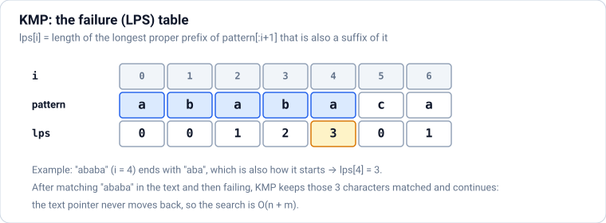

### Theory

> **In simple words:** to find a pattern in a long text, don't restart from scratch after every mismatch. **KMP** remembers how much of the pattern already matched; **Rabin-Karp** compares quick fingerprints (hashes) instead of whole strings.

**1. Palindromic substrings: expand around the centre.** Every palindrome has a centre: one character (odd length, "aba") or the gap between two characters (even length, "abba"). There are 2n − 1 centres. From each one, expand outwards while the two ends match. That finds the **longest palindromic substring**, or **counts** all palindromic substrings, in O(n²) time and O(1) space. (Manacher's algorithm does it in O(n), but it's rarely expected.)

**2. Pattern matching: find `pattern` (length m) inside `text` (length n).**

- **Naive:** try every start position and compare: O(n × m) in the worst case (text `"aaaa…ab"`, pattern `"aaab"`). Python's `text.find(pattern)` is fast in practice, but interviews ask you to explain a guaranteed method.
- **KMP (Knuth–Morris–Pratt):** O(n + m). When a mismatch happens after matching some characters, the naive method restarts almost from scratch. KMP instead uses a precomputed **failure table** (also called LPS, "longest proper prefix that is also a suffix"): `lps[i]` is the length of the longest proper prefix of `pattern[:i + 1]` that is also its suffix. After a mismatch, the pattern jumps so that this prefix lines up with the text it already matched, and the text pointer **never moves backwards**.
- **Rabin-Karp:** O(n + m) on average. Give each length-m window of the text a number (a **hash**) and compare hashes instead of strings. A **rolling hash** updates the window's hash in O(1) when it slides one step: remove the leftmost character's contribution, shift, add the new character, all `% mod` (Section [11](#11-maths-toolbox-series-factorials-fibonacci-powers-and-modulo)). Equal hashes are double-checked character by character, because different strings can occasionally share a hash. Rolling hashes also find **repeated substrings** quickly.

**Where each is used:**

| Need | Use |
|---|---|
| Longest / count palindromic substrings | Expand around the centre |
| Find a pattern, guaranteed linear time | KMP |
| Many patterns, or repeated substrings of a fixed length | Rabin-Karp rolling hash |
| "Is s made of a repeated block?", "longest prefix that is also a suffix" | KMP's failure table directly |

**Used in real software:** text editors' find, `grep` (GNU grep uses Boyer–Moore, a cousin of KMP that skips ahead), **rsync** and backup tools (a rolling checksum finds matching blocks between two versions of a file), plagiarism detection (fingerprints of text windows), and antivirus scanners matching thousands of patterns at once with Aho–Corasick, a trie-based extension of KMP.

### Python

```python
def longest_palindrome(s):
    best_lo, best_len = 0, 0
    for centre in range(2 * len(s) - 1):
        lo = centre // 2
        hi = lo + centre % 2                     # odd centres: lo == hi; even: the gap
        while lo >= 0 and hi < len(s) and s[lo] == s[hi]:
            lo, hi = lo - 1, hi + 1              # expand while the ends match
        if hi - lo - 1 > best_len:
            best_lo, best_len = lo + 1, hi - lo - 1
    return s[best_lo:best_lo + best_len]

def count_palindromes(s):
    count = 0
    for centre in range(2 * len(s) - 1):
        lo, hi = centre // 2, centre // 2 + centre % 2
        while lo >= 0 and hi < len(s) and s[lo] == s[hi]:
            count += 1
            lo, hi = lo - 1, hi + 1
    return count

longest_palindrome("babad"), longest_palindrome("cbbd"), count_palindromes("aaa")   # → ("bab", "bb", 6)
```

```python
def build_lps(pattern):
    lps = [0] * len(pattern)
    length = 0                                   # length of the current matching prefix
    for i in range(1, len(pattern)):
        while length and pattern[i] != pattern[length]:
            length = lps[length - 1]             # fall back to a shorter prefix
        if pattern[i] == pattern[length]:
            length += 1
        lps[i] = length
    return lps

def kmp_search(text, pattern):
    """All start indexes of pattern in text, O(n + m)."""
    lps, out, j = build_lps(pattern), [], 0      # j = characters of pattern matched so far
    for i, ch in enumerate(text):
        while j and ch != pattern[j]:
            j = lps[j - 1]                       # jump; i never moves back
        if ch == pattern[j]:
            j += 1
        if j == len(pattern):
            out.append(i - j + 1)
            j = lps[j - 1]                       # keep going for overlapping matches
    return out

def rabin_karp(text, pattern, base=256, mod=1_000_000_007):
    n, m = len(text), len(pattern)
    if m > n:
        return []
    high = pow(base, m - 1, mod)                 # weight of the leftmost character
    p_hash = t_hash = 0
    for k in range(m):
        p_hash = (p_hash * base + ord(pattern[k])) % mod
        t_hash = (t_hash * base + ord(text[k])) % mod
    out = []
    for i in range(n - m + 1):
        if t_hash == p_hash and text[i:i + m] == pattern:   # confirm: hashes can collide
            out.append(i)
        if i + m < n:                            # roll: drop text[i], add text[i + m]
            t_hash = ((t_hash - ord(text[i]) * high) * base + ord(text[i + m])) % mod
    return out

build_lps("ababaca"), build_lps("aabaaab")       # → ([0, 0, 1, 2, 3, 0, 1], [0, 1, 0, 1, 2, 2, 3])
kmp_search("abababcabab", "abab")                # → [0, 2, 7]
rabin_karp("abababcabab", "abab")                # → [0, 2, 7]
```

**Common mistakes:**

- ❌ Checking only odd-length palindromes (forgetting the even centres between characters).
- ❌ In KMP, moving the text pointer backwards after a mismatch. Only `j` falls back.
- ❌ Trusting equal hashes in Rabin-Karp without comparing the actual strings.

### Practice

| # | LeetCode problem | Difficulty |
|---|---|---|
| 1 | [28. Find the Index of the First Occurrence in a String](https://leetcode.com/problems/find-the-index-of-the-first-occurrence-in-a-string/) | 🟢 Easy |
| 2 | [459. Repeated Substring Pattern](https://leetcode.com/problems/repeated-substring-pattern/) | 🟢 Easy |
| 3 | [5. Longest Palindromic Substring](https://leetcode.com/problems/longest-palindromic-substring/) | 🟡 Medium |
| 4 | [647. Palindromic Substrings](https://leetcode.com/problems/palindromic-substrings/) | 🟡 Medium |
| 5 | [187. Repeated DNA Sequences](https://leetcode.com/problems/repeated-dna-sequences/) | 🟡 Medium |
| 6 | [1392. Longest Happy Prefix](https://leetcode.com/problems/longest-happy-prefix/) | 🔴 Hard |
| 7 | [214. Shortest Palindrome](https://leetcode.com/problems/shortest-palindrome/) | 🔴 Hard |

**Learn & visualise:** [GeeksforGeeks: KMP algorithm](https://www.geeksforgeeks.org/dsa/kmp-algorithm-for-pattern-searching/) · [GeeksforGeeks: Rabin-Karp](https://www.geeksforgeeks.org/dsa/rabin-karp-algorithm-for-pattern-searching/)

---

## 53. Range Queries with Updates: Fenwick Trees and Segment Trees

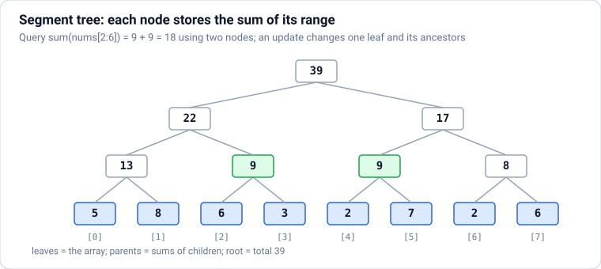

### Theory

> **In simple words:** when numbers keep **changing** and you keep asking for **range totals**, store extra "summary" values over blocks of the array, so each update and each question only touches about log n blocks.

Prefix sums (Section [24](#24-prefix-sums)) answer "sum of `nums[i..j]`?" in O(1), but only while the array **never changes**: after one update, O(n) prefix values are wrong. When updates and queries are **mixed** (a live leaderboard, stock prices changing all day), you need both operations fast:

| Structure | Update one value | Range query | Code size | Handles |
|---|---|---|---|---|
| Plain list | O(1) | O(n) | Tiny | — |
| Prefix sums | O(n) | O(1) | Tiny | Sums, no updates |
| **Fenwick tree** (binary indexed tree) | O(log n) | O(log n) | ~10 lines | Sums (anything with an "undo", like + and −) |
| **Segment tree** | O(log n) | O(log n) | ~25 lines | Sums, min, max, GCD, … (any combinable operation) |

**Segment tree.** A binary tree (Section [36](#36-binary-trees-and-traversals)) where each **leaf** is one array value and each **inner node** stores the combined value (sum, min, …) of its range (see the picture). Stored in a list of size 2n, like a heap (Section [39](#39-heaps-and-priority-queues)): leaves at indexes n … 2n − 1, and node i's children at 2i and 2i + 1.

- **Update:** change the leaf, then walk up to the root, recomputing each parent: O(log n).
- **Query `[l, r)`:** start with `l` and `r` at the leaves and move both up level by level. Whenever a boundary node's range lies fully inside the query, add it to the answer. At most about 2 log n nodes are used.
- **Lazy propagation** (for "add x to every value in a range" updates) delays updates to children until they're needed. It's the advanced version to know about.

**Fenwick tree.** A clever list where position i stores the sum of a block of values ending at i, whose size is **i's lowest set bit** (`i & -i`, Section [51](#51-bit-manipulation)). Moving to the next responsible position is `i += i & -i` (for updates) or `i -= i & -i` (for prefix sums), so each takes O(log n) steps. A range sum is `prefix(r) − prefix(l − 1)`. It uses 1-based indexes.

**Clues in a problem:** "update one element and query a range, many times", "count of smaller numbers after self", "reverse pairs", "number of inversions". The last three insert values one at a time and ask "how many so far are smaller?" with a Fenwick tree indexed by value.

**Used in real software:** live leaderboards and rankings ("how many players scored less than me?"), time-series databases answering range queries over metrics, and order-statistics problems. In interviews they're more common at companies with harder rounds.

### Python

```python
class SegmentTree:
    """Range sums with point updates; swap + for min/max to answer other queries."""
    def __init__(self, nums):
        self.n = len(nums)
        self.tree = [0] * self.n + list(nums)          # leaves at n .. 2n-1
        for i in range(self.n - 1, 0, -1):
            self.tree[i] = self.tree[2 * i] + self.tree[2 * i + 1]

    def update(self, i, value):
        i += self.n
        self.tree[i] = value
        while i > 1:                                   # recompute the ancestors
            i //= 2
            self.tree[i] = self.tree[2 * i] + self.tree[2 * i + 1]

    def query(self, l, r):                             # sum of nums[l:r]
        total, l, r = 0, l + self.n, r + self.n
        while l < r:
            if l % 2 == 1:                             # l is a right child: take it, move right
                total += self.tree[l]
                l += 1
            if r % 2 == 1:                             # node r - 1 lies inside the range: take it
                r -= 1
                total += self.tree[r]
            l //= 2
            r //= 2
        return total

st = SegmentTree([5, 8, 6, 3, 2, 7, 2, 6])
st.query(0, 8), st.query(2, 6)                         # → (39, 18)
st.update(3, 10)
st.query(2, 6), st.query(3, 4)                         # → (25, 10)
```

```python
class Fenwick:
    def __init__(self, n):
        self.tree = [0] * (n + 1)                      # 1-based

    def add(self, i, delta):                           # nums[i] += delta (i is 1-based)
        while i < len(self.tree):
            self.tree[i] += delta
            i += i & -i                                # next block that covers i

    def prefix(self, i):                               # nums[1] + ... + nums[i]
        total = 0
        while i > 0:
            total += self.tree[i]
            i -= i & -i                                # drop the lowest set bit
        return total

    def range_sum(self, l, r):                         # inclusive, 1-based
        return self.prefix(r) - self.prefix(l - 1)

def count_smaller_after(nums):
    """For each item, how many items to its right are smaller (values ranked 1..k first)."""
    rank = {v: i + 1 for i, v in enumerate(sorted(set(nums)))}
    fw, out = Fenwick(len(rank)), []
    for x in reversed(nums):                           # scan right to left
        out.append(fw.prefix(rank[x] - 1))             # how many smaller values already seen
        fw.add(rank[x], 1)
    return out[::-1]

fw = Fenwick(8)
for i, v in enumerate([5, 8, 6, 3, 2, 7, 2, 6], start=1):
    fw.add(i, v)
fw.range_sum(3, 6), fw.prefix(8)                       # → (18, 39)
count_smaller_after([5, 2, 6, 1])                      # → [2, 1, 1, 0]
```

`enumerate(items, start=1)` numbers the items from 1 instead of 0.

**Common mistakes:**

- ❌ Mixing 0-based and 1-based indexes in a Fenwick tree (index 0 makes `i & -i` equal 0, so the loop never ends).
- ❌ Rebuilding prefix sums after every update (O(n) each). That's exactly what these trees avoid.
- ❌ Reaching for a segment tree when the data never changes: prefix sums are simpler and faster.

### Practice

| # | LeetCode problem | Difficulty |
|---|---|---|
| 1 | [307. Range Sum Query - Mutable](https://leetcode.com/problems/range-sum-query-mutable/) | 🟡 Medium |
| 2 | [315. Count of Smaller Numbers After Self](https://leetcode.com/problems/count-of-smaller-numbers-after-self/) | 🔴 Hard |
| 3 | [493. Reverse Pairs](https://leetcode.com/problems/reverse-pairs/) | 🔴 Hard |
| 4 | [1649. Create Sorted Array through Instructions](https://leetcode.com/problems/create-sorted-array-through-instructions/) | 🔴 Hard |
| 5 | [218. The Skyline Problem](https://leetcode.com/problems/the-skyline-problem/) | 🔴 Hard |

**Learn & visualise:** [VisuAlgo: Segment tree](https://visualgo.net/en/segmenttree) · [VisuAlgo: Fenwick tree](https://visualgo.net/en/fenwicktree) · [CP-Algorithms: Fenwick tree](https://cp-algorithms.com/data_structures/fenwick.html)

---

## 54. Advanced Graphs: Bridges, Strongly Connected Components and Max Flow

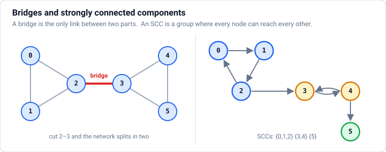

### Theory

> **In simple words:** three questions about how well a network holds together. Which single link, if cut, would split the network? (**bridges**) Which groups of places can all reach each other along one-way roads? (**strongly connected components**) How much can flow from a source to a destination through pipes of limited size? (**max flow**)

**1. Bridges ("critical connections").** In an undirected graph, a **bridge** is an edge whose removal disconnects the graph. (An **articulation point** is the same idea for a vertex.) The obvious method removes each edge and re-checks connectivity: O(E × (V + E)). **Tarjan's algorithm** finds all bridges in one DFS, O(V + E):

- `disc[v]`: the time at which DFS first reached v (1, 2, 3, …).
- `low[v]`: the earliest discovery time v's subtree can reach, using tree edges down plus **one** back edge up.
- A tree edge u → v is a **bridge** when `low[v] > disc[u]`: nothing below v can climb back to u or above without that edge.

Intuition: an edge that lies on a **cycle** is never a bridge (the cycle gives another route), and `low` detects exactly that "another route back up".

**2. Strongly connected components (SCCs).** In a **directed** graph, an SCC is a largest group where every vertex can reach every other one. Squash each SCC into a single node and the result is always a DAG, which is why SCCs appear before topological sorting in many real problems. **Kosaraju's algorithm** (two DFS passes, O(V + E)):

1. Run DFS on the graph and record vertices in the order they **finish**.
2. Reverse every edge.
3. Take vertices in reverse finishing order; each DFS on the reversed graph from an unvisited vertex collects exactly one SCC.

(Tarjan's SCC algorithm does it in one pass with `low` values, like the bridge algorithm.)

**3. Maximum flow and minimum cut.** Each edge is a pipe with a **capacity**. How much can flow from source s to sink t per second? The **Ford–Fulkerson** idea: repeatedly find a path from s to t with spare capacity (an **augmenting path**), push as much as it allows, and record the reverse "undo" capacity so later paths can reroute earlier flow. Finding each path with **BFS** gives **Edmonds–Karp**, O(V × E²).

- **Max-flow = min-cut:** the maximum flow equals the smallest total capacity of edges you'd have to cut to separate s from t. So max-flow algorithms also find a network's **bottleneck**.
- **Bipartite matching** (assigning workers to jobs, students to projects) is a max-flow problem: source → workers → jobs → sink, all capacities 1.
- Interviews rarely ask you to code max flow, but recognising "this is a flow/matching problem" is valuable. In research, a 2022 algorithm by Chen, Kyng, Liu, Peng, Probst Gutenberg and Sachdeva solves max flow in **almost-linear time** (Section [57](#57-whats-new-recent-breakthroughs-and-modern-practice-20222026)).

**Common mistakes:**

- ❌ In bridge finding, skipping the parent edge by **vertex** instead of by edge (it breaks when two vertices have parallel edges; fine for simple graphs).
- ❌ Forgetting the reverse edges in max flow, which makes the algorithm unable to undo a bad early choice.
- ❌ Using recursive DFS on graphs with 10⁵ vertices in Python (recursion limit). Convert to an explicit stack, or raise the limit with `sys.setrecursionlimit` carefully.

**Used in real software:** finding single points of failure in computer networks and power grids (bridges and articulation points), analysing web and social graphs and simplifying dependency graphs (SCCs; compilers also use them to find mutually recursive functions), and flow networks for transport and logistics capacity, airline crew assignment, image segmentation (min-cut) and matching markets.

### Python

```python
from collections import deque

def bridges(n, edges):
    graph = [[] for _ in range(n)]
    for a, b in edges:
        graph[a].append(b)
        graph[b].append(a)
    disc, low, time, out = [0] * n, [0] * n, [1], []
    def dfs(u, parent):
        disc[u] = low[u] = time[0]
        time[0] += 1
        for v in graph[u]:
            if v == parent:
                continue
            if disc[v]:                              # back edge: v was reached earlier
                low[u] = min(low[u], disc[v])
            else:
                dfs(v, u)
                low[u] = min(low[u], low[v])
                if low[v] > disc[u]:                 # v's subtree can't climb above u
                    out.append((u, v))
    for v in range(n):
        if not disc[v]:
            dfs(v, -1)
    return sorted(out)

def kosaraju(n, edges):
    graph, reverse = [[] for _ in range(n)], [[] for _ in range(n)]
    for a, b in edges:
        graph[a].append(b)
        reverse[b].append(a)
    seen, order = set(), []
    def dfs1(u):
        seen.add(u)
        for v in graph[u]:
            if v not in seen:
                dfs1(v)
        order.append(u)                              # record when u FINISHES
    for v in range(n):
        if v not in seen:
            dfs1(v)
    seen, comps = set(), []
    def dfs2(u, comp):
        seen.add(u)
        comp.append(u)
        for v in reverse[u]:
            if v not in seen:
                dfs2(v, comp)
    for v in reversed(order):                        # latest finisher first
        if v not in seen:
            comp = []
            dfs2(v, comp)
            comps.append(sorted(comp))
    return sorted(comps)

# two triangles joined by the single edge 2-3
bridges(6, [(0, 1), (1, 2), (2, 0), (2, 3), (3, 4), (4, 5), (5, 3)])   # → [(2, 3)]
bridges(4, [(0, 1), (1, 2), (2, 3)])                                  # → [(0, 1), (1, 2), (2, 3)]
kosaraju(6, [(0, 1), (1, 2), (2, 0), (2, 3), (3, 4), (4, 3), (4, 5)])  # → [[0, 1, 2], [3, 4], [5]]
```

```python
def max_flow(n, capacity_edges, s, t):
    """Edmonds-Karp: BFS for augmenting paths on a residual capacity matrix."""
    cap = [[0] * n for _ in range(n)]
    for u, v, c in capacity_edges:
        cap[u][v] += c
    flow = 0
    while True:
        parent = [-1] * n
        parent[s] = s
        q = deque([s])
        while q and parent[t] == -1:                 # BFS for a path with spare capacity
            u = q.popleft()
            for v in range(n):
                if parent[v] == -1 and cap[u][v] > 0:
                    parent[v] = u
                    q.append(v)
        if parent[t] == -1:
            return flow                              # no augmenting path left
        push, v = float("inf"), t
        while v != s:                                # the path's narrowest pipe
            push = min(push, cap[parent[v]][v])
            v = parent[v]
        v = t
        while v != s:                                # use it, and add "undo" capacity backwards
            cap[parent[v]][v] -= push
            cap[v][parent[v]] += push
            v = parent[v]
        flow += push

# 0 = source, 5 = sink
pipes = [(0, 1, 16), (0, 2, 13), (1, 2, 10), (2, 1, 4), (1, 3, 12), (3, 2, 9),
         (2, 4, 14), (4, 3, 7), (3, 5, 20), (4, 5, 4)]
max_flow(6, pipes, 0, 5)                                               # → 23
```

The answer 23 is also the capacity of the smallest cut: the pipes 1→3 (12), 4→3 (7) and 4→5 (4) add up to 23, and removing them separates the source from the sink.

### Practice

| # | LeetCode problem | Difficulty |
|---|---|---|
| 1 | [1192. Critical Connections in a Network](https://leetcode.com/problems/critical-connections-in-a-network/) (bridges) | 🔴 Hard |
| 2 | [1568. Minimum Number of Days to Disconnect Island](https://leetcode.com/problems/minimum-number-of-days-to-disconnect-island/) (articulation points) | 🔴 Hard |
| 3 | [2360. Longest Cycle in a Graph](https://leetcode.com/problems/longest-cycle-in-a-graph/) | 🔴 Hard |
| 4 | [1557. Minimum Number of Vertices to Reach All Nodes](https://leetcode.com/problems/minimum-number-of-vertices-to-reach-all-nodes/) (in-degree/SCC thinking) | 🟡 Medium |

**Learn & visualise:** [CP-Algorithms: Finding bridges](https://cp-algorithms.com/graph/bridge-searching.html) · [CP-Algorithms: Strongly connected components](https://cp-algorithms.com/graph/strongly-connected-components.html) · [CP-Algorithms: Edmonds–Karp](https://cp-algorithms.com/graph/edmonds_karp.html) · [VisuAlgo: Max flow](https://visualgo.net/en/maxflow)

---

### ✅ Part 9 checkpoint

Without looking, can you:

- [ ] Find the longest palindromic substring by expanding around centres?
- [ ] Build KMP's failure table and use it to search in O(n + m)?
- [ ] Explain a rolling hash, and why equal hashes must be double-checked?
- [ ] Write a Fenwick tree and a segment tree, and say when prefix sums are no longer enough?
- [ ] Find bridges with `disc`/`low` values, and strongly connected components with Kosaraju?
- [ ] Explain max flow, augmenting paths and why max flow equals min cut?

Part 10 shows how these ideas run inside real systems today.

---

# Part 10 — Advanced: Algorithms in the Real World (2026)

> **Goal:** How randomised and probabilistic algorithms, consistent hashing, database indexes and vector search run inside real systems, and what's new in the field.  
> **You need:** Parts 3–9.

---

## 55. Randomised and Streaming Algorithms: Shuffling, Sampling, Bloom Filters and Sketches

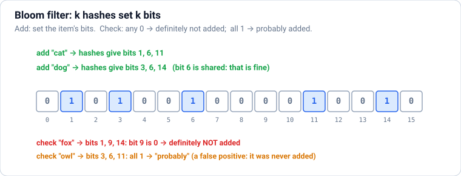

### Theory

> **In simple words:** sometimes the smartest move is to **flip a coin**, or to accept a tiny, controlled chance of error, in exchange for huge savings in time or memory. Big systems in 2026 do this constantly: they can't store or sort everything, so they sample, estimate and summarise.

**Two kinds of randomised algorithm:**

- **Las Vegas:** always correct, only the running time is random. Randomised quick sort and quickselect (Section [29](#29-merge-sort-and-quick-sort)) are always right, and a random pivot makes the slow case practically impossible.
- **Monte Carlo:** always fast, but the answer may be slightly off, with a probability you control. Bloom filters and sketches below.

In Python, `random.seed(42)` makes the "random" numbers repeat exactly on every run, which is essential for tests and debugging.

**1. Shuffling fairly (Fisher–Yates).** Go from the last position down to the first; swap position i with a random position **from 0 to i** (including i). Every one of the n! orders is equally likely, in O(n). The classic bug is swapping with a random position from the **whole** list each time: it looks fine but some orders come out more often than others. `random.shuffle` uses Fisher–Yates.

**2. Reservoir sampling: a fair sample from a stream of unknown length.** You're reading a log with billions of lines and want k random lines, but you can't store the log or know its length in advance. Keep the first k items. For item number i (counting from 1, with i > k), keep it with probability k/i, replacing a random slot of the reservoir. At every moment, each item seen so far is in the sample with the same probability k/i. Memory: O(k).

**3. Weighted random choice.** To pick index i with probability `w[i] / sum(w)`: build prefix sums of the weights (Section [24](#24-prefix-sums)), pick a random number between 0 and the total, and binary-search (Section [18](#18-searching-linear-search-and-binary-search)) for where it lands. O(log n) per pick. (`random.choices(items, weights)` does this for you.)

**4. Bloom filter: "definitely not" or "probably yes" in tiny memory.** A bit array of m bits, all 0, plus k different hash functions.

- **Add** an item: compute its k hashes and set those k bits to 1.
- **Check** an item: compute the same k bits. If **any** is 0, the item was **definitely never added**. If all are 1, it was **probably** added: the bits might have been set by other items (a **false positive**).
- There are **no false negatives**, and the false-positive rate is tunable: about 10 bits per item with 7 hash functions gives roughly 1% false positives, however large the items are.

It's perfect as a cheap **first check** before an expensive one: "is this key possibly on disk?", "has this user possibly seen this post?".

**5. Count-Min Sketch: approximate counts.** A small grid of counters with d rows; each row has its own hash function. To count an item, add 1 to one counter in each row (the one its hash picks). To estimate its count, take the **minimum** of its d counters. Collisions only ever **add** to counters, so the estimate is never too low, and the minimum picks the least-polluted row. It answers "roughly how often has this appeared?" for millions of distinct items in a few kilobytes.

**6. HyperLogLog: counting distinct items.** "How many unique visitors today?" Storing every visitor ID is expensive. HyperLogLog hashes each ID and remembers, in small buckets, the longest run of leading zeros seen (a long run is rare, so it hints at many distinct values). With about 12 KB it estimates billions of distinct items to within about 1%. Redis offers it directly (`PFADD`, `PFCOUNT`).

**Common mistakes:**

- ❌ A biased shuffle (swapping with any position instead of positions 0 … i).
- ❌ Using Python's built-in `hash()` for Bloom filters or sketches that must give the same answer on every run: string hashes are randomised per process. Use `hashlib` (as in the code) for stable hashes.
- ❌ Forgetting that a Bloom filter can't **delete** items (a "counting Bloom filter" or "cuckoo filter" can).

**Used in real software:** databases like Cassandra, HBase and RocksDB keep a Bloom filter per data file to skip files that can't contain a key; CDNs and caches avoid caching one-hit wonders; Redis provides HyperLogLog; analytics and monitoring systems use sketches for "top trending" and "unique users" counts; A/B testing platforms randomly assign users to experiments; and reservoir sampling keeps a fair sample of requests in logging and tracing systems.

### Python

```python
import random

def fisher_yates(items):
    a = items[:]
    for i in range(len(a) - 1, 0, -1):
        j = random.randint(0, i)                   # 0 .. i, inclusive
        a[i], a[j] = a[j], a[i]
    return a

def reservoir_sample(stream, k):
    sample = []
    for i, item in enumerate(stream, start=1):
        if i <= k:
            sample.append(item)                    # fill the reservoir first
        else:
            j = random.randint(1, i)               # keep item with probability k / i
            if j <= k:
                sample[j - 1] = item
    return sample

random.seed(42)                                    # repeatable "randomness"
deck = fisher_yates(list(range(10)))
sorted(deck) == list(range(10)), len(reservoir_sample(range(1_000_000), 5))   # → (True, 5)

counts = {}
for _ in range(60_000):                            # every order of [1, 2, 3] ~ 10,000 times
    order = tuple(fisher_yates([1, 2, 3]))
    counts[order] = counts.get(order, 0) + 1
len(counts), max(counts.values()) / min(counts.values()) < 1.1                # → (6, True)

hits = [0] * 10
for _ in range(20_000):
    for x in reservoir_sample(range(10), 3):      # each of 10 items should appear ~6,000 times
        hits[x] += 1
max(hits) / min(hits) < 1.1                                                    # → True
```

```python
import hashlib
from bisect import bisect_right
from itertools import accumulate

class BloomFilter:
    def __init__(self, m, k):
        self.m, self.k, self.bits = m, k, 0        # one big int used as a row of m bits

    def _positions(self, item):
        for seed in range(self.k):                 # k different hash functions via different salts
            digest = hashlib.sha256(f"{seed}:{item}".encode()).digest()
            yield int.from_bytes(digest[:8], "big") % self.m

    def add(self, item):
        for p in self._positions(item):
            self.bits |= 1 << p                    # set bit p

    def __contains__(self, item):                  # makes `item in bloom` work
        return all(self.bits >> p & 1 for p in self._positions(item))

class CountMinSketch:
    def __init__(self, width, depth):
        self.w, self.d = width, depth
        self.table = [[0] * width for _ in range(depth)]

    def _cols(self, item):
        for row in range(self.d):
            digest = hashlib.sha256(f"{row}|{item}".encode()).digest()
            yield row, int.from_bytes(digest[:8], "big") % self.w

    def add(self, item, count=1):
        for row, col in self._cols(item):
            self.table[row][col] += count

    def estimate(self, item):
        return min(self.table[row][col] for row, col in self._cols(item))

bf = BloomFilter(m=1000, k=7)
for word in ["apple", "banana", "cherry"]:
    bf.add(word)
"apple" in bf, "banana" in bf, "grape" in bf       # → (True, True, False)

cms = CountMinSketch(width=50, depth=4)
for word, n in [("python", 120), ("java", 40), ("rust", 7)]:
    cms.add(word, n)
cms.estimate("python") >= 120, cms.estimate("rust") >= 7, cms.estimate("go") >= 0   # → (True, True, True)

def weighted_pick(weights, r):                     # r: a random number in [0, total)
    return bisect_right(list(accumulate(weights)), r)

[weighted_pick([1, 3, 6], r) for r in (0.5, 1.0, 3.9, 4.0, 9.9)]   # → [0, 1, 1, 2, 2]
```

- `yield` makes a function a **generator**: it hands out values one at a time to the loop that uses it.
- Defining `__contains__` lets `in` work on your own class.

### Practice

| # | LeetCode problem | Difficulty |
|---|---|---|
| 1 | [384. Shuffle an Array](https://leetcode.com/problems/shuffle-an-array/) | 🟡 Medium |
| 2 | [382. Linked List Random Node](https://leetcode.com/problems/linked-list-random-node/) (reservoir sampling) | 🟡 Medium |
| 3 | [398. Random Pick Index](https://leetcode.com/problems/random-pick-index/) | 🟡 Medium |
| 4 | [528. Random Pick with Weight](https://leetcode.com/problems/random-pick-with-weight/) | 🟡 Medium |
| 5 | [470. Implement Rand10() Using Rand7()](https://leetcode.com/problems/implement-rand10-using-rand7/) | 🟡 Medium |
| 6 | [710. Random Pick with Blacklist](https://leetcode.com/problems/random-pick-with-blacklist/) | 🔴 Hard |

**Learn more:** [Wikipedia: Fisher–Yates shuffle](https://en.wikipedia.org/wiki/Fisher%E2%80%93Yates_shuffle) · [Wikipedia: Reservoir sampling](https://en.wikipedia.org/wiki/Reservoir_sampling) · [Wikipedia: Bloom filter](https://en.wikipedia.org/wiki/Bloom_filter) · [Redis docs: HyperLogLog](https://redis.io/docs/latest/develop/data-types/probabilistic/hyperloglogs/)

---

## 56. Algorithms Behind Real Systems: Consistent Hashing, Rate Limiters, B-Trees, LSM Trees and Vector Search

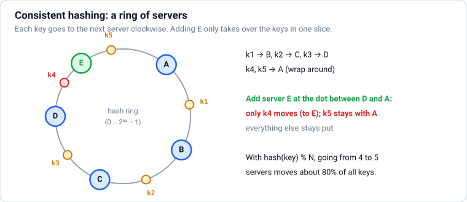

### Theory

> **In simple words:** the structures in this file aren't just interview puzzles. Real systems (databases, caches, search engines, AI apps) are built from them. This section shows the most important combinations used in industry today, all made from pieces you already know.

**1. Consistent hashing: spreading data across many servers.** With N cache servers, the obvious rule is `server = hash(key) % N` (Section [11](#11-maths-toolbox-series-factorials-fibonacci-powers-and-modulo)). But when N changes (a server is added or dies), almost **every** key moves to a different server, and the whole cache goes cold at once. Consistent hashing fixes this:

- Put the servers on a **ring** (the circle of all hash values), each at the position of its hash.
- A key belongs to the **first server clockwise** from the key's hash. Find it with binary search over the sorted server positions (Section [18](#18-searching-linear-search-and-binary-search)).
- Adding or removing one server only moves the keys in **one slice** of the ring: about 1/N of them.
- Each server is placed at many positions (**virtual nodes**) so the slices are evenly sized.

Used in: Amazon's Dynamo-style databases and Cassandra, distributed caches, and load balancers.

**2. Rate limiting: the token bucket.** "Each user may make at most 10 requests per second, with short bursts allowed." Picture a bucket holding up to `capacity` tokens, refilled at `rate` tokens per second. Each request takes one token; with no token left, the request is rejected (HTTP 429 "Too Many Requests"). It needs O(1) memory per user: the token count and the last refill time. (The sliding-window log in Section [34](#34-queues-and-deques) is the exact alternative that costs more memory.) Used in: API gateways, cloud APIs (including LLM APIs' request and token limits), and login-attempt protection.

**3. B-trees and B+ trees: how database indexes work.** A BST (Section [38](#38-binary-search-trees)) has 2 children per node, so a billion keys means about 30 levels, and on disk each level is a slow read. A **B-tree** node holds **hundreds** of sorted keys and has hundreds of children. With 500 children per node, three levels reach 500³ = 125 million keys, so any key is found in about 3–4 disk reads, and each node is binary-searched in memory. In a **B+ tree** (the variant databases use) all the data lives in the leaves, and the leaves are linked together, so range queries (`WHERE age BETWEEN 20 AND 30`) just walk along the leaves. Used in: PostgreSQL, MySQL (InnoDB), SQLite and most file systems.

**4. LSM trees: databases optimised for writing.** Updating a B-tree in place means random disk writes. A **log-structured merge (LSM) tree** turns writes into fast sequential ones:

1. New writes go into an in-memory sorted structure (the **memtable**) and an append-only log (for crash safety).
2. When the memtable is full, it's written to disk as an immutable, sorted file.
3. Background **compaction** merges sorted files together, like merge sort's merge step (Section [29](#29-merge-sort-and-quick-sort)) or a k-way merge with a heap (Section [39](#39-heaps-and-priority-queues)).
4. Reads check the memtable, then the files, newest first, and each file's **Bloom filter** (Section [55](#55-randomised-and-streaming-algorithms-shuffling-sampling-bloom-filters-and-sketches)) skips files that can't contain the key.

Used in: RocksDB, LevelDB, Cassandra, ScyllaDB and many time-series databases.

**5. Vector search: the retrieval engine of AI apps.** Modern AI systems turn text, images or products into **embeddings**: lists of hundreds of numbers where similar meanings are close together. "Find documents similar to this question" (the core of RAG chatbots) becomes "find the vectors nearest to this vector".

- **Similarity:** usually **cosine similarity**, the cosine of the angle between two vectors (1 = same direction, 0 = unrelated), computed as dot(a, b) / (|a| × |b|).
- **Exact search** compares the query with every vector: O(n × d) for n vectors of d numbers each. That's fine for thousands of vectors, too slow for hundreds of millions.
- **Approximate nearest neighbour (ANN)** indexes trade a little accuracy for huge speed. **HNSW** (Hierarchical Navigable Small World) builds a layered graph: a sparse top layer for long jumps and denser lower layers for fine search, then walks it greedily towards the query (Section [48](#48-greedy-algorithms) + Section [41](#41-graphs-representation-bfs-and-dfs)). **IVF** clusters the vectors and searches only the nearest clusters. **Product quantization** compresses vectors to save memory.

Used in: vector databases and libraries (FAISS, pgvector for PostgreSQL, Milvus, Qdrant, Weaviate, Pinecone), semantic search, recommendations and RAG pipelines. (The AI/ML notes in this repo cover RAG in depth.)

**6. Merkle trees: checking huge data cheaply.** Hash every data block, then hash pairs of hashes, and so on up to one **root hash**. If any block changes, the root changes. Two machines can compare roots, and only if they differ walk down the tree to find **which** blocks differ, in O(log n) comparisons instead of sending everything. Used in: **Git** (every commit and folder is identified by a hash of its contents), blockchains, and database replicas (Cassandra and DynamoDB-style anti-entropy repair).

**7. Other everyday pieces:** **external merge sort** sorts data bigger than memory (sort chunks that fit, then k-way merge them with a heap); **geospatial indexes** (geohashes, quadtrees, and Uber's H3 hexagon grid) answer "what's near me?"; and **inverted indexes** (a dict from each word to the list of documents containing it) power full-text search engines like Elasticsearch and PostgreSQL's full-text search.

**How industry applies all this in 2026:**

- **Use the standard library and proven tools first:** `sorted`, `heapq`, `bisect`, `collections`, `graphlib`, a real database. Hand-written structures are for learning and for the rare cases a library can't handle.
- **Measure before optimising:** profile, find the real bottleneck, then pick the right structure.
- **At scale, approximate:** Bloom filters, sketches, HyperLogLog and ANN search accept a tiny error for enormous savings.
- **Memory access matters as much as Big-O:** contiguous arrays and cache-friendly layouts often beat "theoretically better" pointer-heavy structures.

### Python

```python
import hashlib
from bisect import bisect_right

def stable_hash(text):                                 # the same on every run (unlike hash())
    return int.from_bytes(hashlib.md5(text.encode()).digest()[:8], "big")

class ConsistentHashRing:
    def __init__(self, servers, vnodes=100):
        self.vnodes = vnodes
        self.ring = []                                 # sorted (position, server) pairs
        for s in servers:
            self.add(s)

    def add(self, server):
        for i in range(self.vnodes):                   # many positions per server
            self.ring.append((stable_hash(f"{server}#{i}"), server))
        self.ring.sort()

    def server_for(self, key):
        i = bisect_right(self.ring, (stable_hash(key), ""))   # first position clockwise
        return self.ring[i % len(self.ring)][1]               # wrap around the ring

keys = [f"user:{i}" for i in range(10_000)]
ring = ConsistentHashRing(["A", "B", "C", "D"])
before = {k: ring.server_for(k) for k in keys}
ring.add("E")
moved = sum(before[k] != ring.server_for(k) for k in keys)
modulo_moved = sum(stable_hash(k) % 4 != stable_hash(k) % 5 for k in keys)
moved < 3_000, modulo_moved > 7_000                    # → (True, True)
```

Adding a fifth server moved roughly a fifth of the keys (under 3,000 of 10,000), while plain `% N` hashing would move about 80% (over 7,000).

```python
class TokenBucket:
    def __init__(self, capacity, rate):
        self.capacity, self.rate = capacity, rate      # max tokens, tokens added per second
        self.tokens, self.last = capacity, 0.0

    def allow(self, now):
        self.tokens = min(self.capacity, self.tokens + (now - self.last) * self.rate)
        self.last = now
        if self.tokens >= 1:
            self.tokens -= 1
            return True
        return False                                   # would be HTTP 429 in a real API

bucket = TokenBucket(capacity=3, rate=1)               # bursts of 3, then 1 request per second
[bucket.allow(t) for t in (0, 0, 0, 0, 0.5, 1.0, 2.5)]   # → [True, True, True, False, False, True, True]

def cosine(a, b):
    dot = sum(x * y for x, y in zip(a, b))
    norm = (sum(x * x for x in a) ** 0.5) * (sum(y * y for y in b) ** 0.5)
    return dot / norm

def top_k(query, docs, k):                             # exact nearest neighbours: O(n × d)
    scored = sorted(((cosine(query, vec), name) for name, vec in docs.items()), reverse=True)
    return [name for score, name in scored[:k]]

docs = {"cats": [0.9, 0.1, 0.0], "dogs": [0.8, 0.3, 0.1], "stocks": [0.0, 0.2, 0.9], "bonds": [0.1, 0.1, 0.8]}
top_k([0.85, 0.2, 0.05], docs, 2), top_k([0.0, 0.25, 0.9], docs, 1)   # → (["cats", "dogs"], ["stocks"])

def merkle_root(blocks):
    level = [hashlib.sha256(b.encode()).hexdigest() for b in blocks]
    while len(level) > 1:
        if len(level) % 2:
            level.append(level[-1])                   # duplicate the last hash on odd levels
        level = [hashlib.sha256((level[i] + level[i + 1]).encode()).hexdigest()
                 for i in range(0, len(level), 2)]
    return level[0]

r1 = merkle_root(["block1", "block2", "block3", "block4"])
r2 = merkle_root(["block1", "block2", "blockX", "block4"])
r1 == merkle_root(["block1", "block2", "block3", "block4"]), r1 == r2   # → (True, False)
```

The toy embeddings above have 3 numbers; real ones have hundreds or thousands, and a real system would call a vector database or `pgvector` instead of looping in Python.

### Practice

These are design-flavoured; try explaining each out loud, then code a small version:

1. Design a rate limiter allowing 100 requests per minute per user. Compare token bucket, fixed window and sliding window.
2. Design a URL shortener's key → URL storage for 1 billion links spread across 50 servers, where servers are added over time.
3. Given 10 GB of numbers and 1 GB of memory, sort them (external merge sort).
4. Build a tiny "semantic search": store 20 sentences with hand-made 3-number vectors and return the 3 closest to a query.

| # | LeetCode problem | Difficulty |
|---|---|---|
| 1 | [933. Number of Recent Calls](https://leetcode.com/problems/number-of-recent-calls/) (a sliding-window rate counter) | 🟢 Easy |
| 2 | [1146. Snapshot Array](https://leetcode.com/problems/snapshot-array/) (versioned storage + binary search) | 🟡 Medium |
| 3 | [981. Time Based Key-Value Store](https://leetcode.com/problems/time-based-key-value-store/) | 🟡 Medium |
| 4 | [146. LRU Cache](https://leetcode.com/problems/lru-cache/) (the cache in front of every system) | 🟡 Medium |

**Learn more:** [Wikipedia: Consistent hashing](https://en.wikipedia.org/wiki/Consistent_hashing) · [Wikipedia: Token bucket](https://en.wikipedia.org/wiki/Token_bucket) · [Wikipedia: B+ tree](https://en.wikipedia.org/wiki/B%2B_tree) · [Wikipedia: Log-structured merge-tree](https://en.wikipedia.org/wiki/Log-structured_merge-tree) · [pgvector (GitHub)](https://github.com/pgvector/pgvector) · [HNSW paper (arXiv)](https://arxiv.org/abs/1603.09320)

---

## 57. What's New: Recent Breakthroughs and Modern Practice (2022–2026)

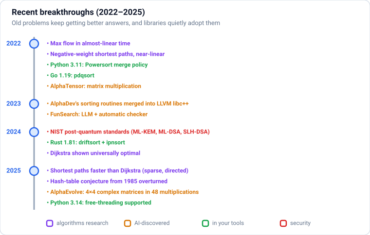

### Theory

> **In simple words:** algorithms aren't finished. Problems studied for 50+ years, like shortest paths, sorting and hash tables, got **new, faster answers** in the last few years, and AI systems have started discovering algorithms too. You don't need these results for interviews, but knowing them shows you follow the field, and some already run inside the tools you use.

**1. Shortest paths got faster than Dijkstra (2025).** For decades, Dijkstra's algorithm (Section [43](#43-shortest-paths-dijkstra)) with a good heap, O(m + n log n), was thought to be about the best possible for single-source shortest paths, because it effectively **sorts** vertices by distance. In 2025, Duan, Mao, Mao, Shu and Yin presented a deterministic algorithm for directed graphs with non-negative weights running in **O(m log^(2/3) n)**, faster than Dijkstra on sparse graphs, by avoiding a full sort. It won the best paper award at STOC 2025. Around the same time (FOCS 2024), Haeupler and colleagues showed that Dijkstra with a specially designed heap is **universally optimal** in a precise sense: no algorithm can beat it on any graph structure by more than a constant factor, when the answer must include the order of the vertices.

**2. Negative edge weights in near-linear time (2022).** Bellman-Ford (Section [46](#46-minimum-spanning-trees-bellman-ford-and-floyd-warshall)) takes O(V × E). Bernstein, Nanongkai and Wulff-Nilsen found a near-linear-time algorithm for shortest paths with negative integer weights (FOCS 2022 best paper).

**3. Maximum flow in almost-linear time (2022).** Chen, Kyng, Liu, Peng, Probst Gutenberg and Sachdeva solved max flow (Section [54](#54-advanced-graphs-bridges-strongly-connected-components-and-max-flow)) in m^(1+o(1)) time: essentially as fast as reading the graph. It's a theoretical milestone rather than a practical library routine today.

**4. Hash tables: a 40-year-old conjecture overturned (2025).** In 1985, Andrew Yao conjectured that a certain simple style of open-addressing hash table (Section [19](#19-hashing-dictionaries-and-sets)) couldn't be made faster. Andrew Krapivin, then an undergraduate, with Martín Farach-Colton and William Kuszmaul, showed that with a clever layout it can, using ideas from "tiny pointers". Published in 2025, it changes what we believe is possible for the most-used data structure in computing.

**5. AI discovering algorithms.**

- **AlphaDev** (DeepMind, 2023) used reinforcement learning to find shorter machine-code routines for sorting 3–5 items. They were merged into LLVM's C++ standard library (libc++), so they run inside real software.
- **AlphaTensor** (2022) found new ways to multiply small matrices with fewer multiplications, and **AlphaEvolve** (2025) found a way to multiply two 4 × 4 complex-valued matrices with 48 multiplications, improving on Strassen's 1969 method (49).
- **FunSearch** (2023) used a large language model plus automatic checking to find new constructions in mathematics and better heuristics for bin packing.

**6. How the languages you use changed.**

| Change | Year | Section |
|---|---|---|
| CPython's `list.sort` switched to the **Powersort** merge policy (Python 3.11) | 2022 | [29](#29-merge-sort-and-quick-sort) |
| Go's `sort` switched to **pdqsort** (Go 1.19) | 2022 | [29](#29-merge-sort-and-quick-sort) |
| Rust's sorts replaced by **driftsort** and **ipnsort** (Rust 1.81) | 2024 | [29](#29-merge-sort-and-quick-sort) |
| Python 3.13 added an experimental **free-threaded** build (no global interpreter lock), officially supported from Python 3.14 | 2024–2025 | Parallel CPU work in pure Python |
| Python 3.14 added built-in **max-heap** functions to `heapq` | 2025 | [39](#39-heaps-and-priority-queues) |

**7. Security: post-quantum cryptography (2024).** Large quantum computers could break RSA and elliptic-curve cryptography, which rely on factoring and related problems (Section [8](#8-divisors-and-prime-numbers)). In August 2024, NIST published the first post-quantum standards (ML-KEM, ML-DSA and SLH-DSA), based on lattices and hash functions, and browsers and messaging apps have started deploying them alongside the classic methods.

**8. What changed in engineering practice.**

- **Vector search went mainstream.** AI applications (chatbots with company knowledge, semantic search) made approximate nearest-neighbour search (HNSW, IVF, Section [56](#56-algorithms-behind-real-systems-consistent-hashing-rate-limiters-b-trees-lsm-trees-and-vector-search)) an everyday tool, including inside PostgreSQL via pgvector.
- **Probabilistic structures are standard at scale:** Bloom filters, HyperLogLog and sketches (Section [55](#55-randomised-and-streaming-algorithms-shuffling-sampling-bloom-filters-and-sketches)) inside databases, analytics and caches.
- **AI coding assistants are everywhere.** They write a lot of routine code, which makes **understanding** more valuable, not less: you must judge whether generated code is correct and efficient, spot the O(n²) hidden in it, and test the edge cases. Coding interviews still largely test DSA, and some companies have started allowing AI tools in some rounds, where the focus shifts to explaining, verifying and improving the code.

**What to do with this:** for interviews, master Parts 1–8. For your career, remember the pattern: well-known problems keep getting better solutions, and libraries quietly adopt them, so prefer the standard library, keep your tools updated, and stay curious.

### Practice

Explain in your own words (out loud or in writing):

1. Why was Dijkstra's O(m + n log n) considered a "sorting barrier", and what does beating it mean?
2. Why do language runtimes keep changing their sort algorithm if all of them are O(n log n)?
3. Why must an AI-discovered algorithm (AlphaDev, AlphaEvolve) still be **proved** or **verified** before it's trusted?
4. What changes for RSA if large quantum computers arrive, and what is replacing it?

**Learn more:** [Quanta Magazine: computer science coverage](https://www.quantamagazine.org/computer-science/) (readable articles on most of the results above) · [DeepMind: AlphaDev](https://deepmind.google/discover/blog/alphadev-discovers-faster-sorting-algorithms/) · [NIST: post-quantum cryptography](https://csrc.nist.gov/projects/post-quantum-cryptography)

---

### ✅ Part 10 checkpoint

Without looking, can you:

- [ ] Shuffle fairly with Fisher–Yates, and sample k items from a stream of unknown length?
- [ ] Explain how a Bloom filter answers "definitely not" vs "probably yes", and where databases use one?
- [ ] Explain consistent hashing and why plain `hash % N` fails when servers change?
- [ ] Describe a token-bucket rate limiter, a B+ tree index and an LSM tree in a few sentences each?
- [ ] Explain vector search, cosine similarity and why ANN indexes like HNSW exist?
- [ ] Name two recent algorithm breakthroughs and one way your tools changed because of them?

Part 11 is for revision: a topic checklist, a cheat sheet and the theory questions interviewers ask most.

---

# Part 11 — Interview Prep: Revision

> **Goal:** Check your coverage against what top companies ask, and revise quickly before interviews.  
> **You need:** Parts 1–10.

---

## 58. Interview Topic Checklist: What Top Companies Ask

### Theory

Coding rounds at large product companies (Google, Amazon, Microsoft, Meta, Apple, and the many companies that interview the same way) draw on the same core set of topics. The widely shared prep lists (**Blind 75**, **NeetCode 150**, **LeetCode Top Interview 150**, **Striver's A2Z sheet**) all cover roughly the list below. Use this table as a **coverage check**: for each topic, study the linked sections, then solve the must-do problems without hints.

**How to read the priority column:** ⭐⭐⭐ appears in almost every interview loop; ⭐⭐ is common; ⭐ is occasional, but separates strong candidates (it shows up more at companies with harder rounds).

| Topic | Priority | Study | Must-do problems (LeetCode) |
|---|---|---|---|
| Arrays & hashing | ⭐⭐⭐ | [15](#15-arrays-and-python-lists), [19](#19-hashing-dictionaries-and-sets) | [1. Two Sum](https://leetcode.com/problems/two-sum/) · [217. Contains Duplicate](https://leetcode.com/problems/contains-duplicate/) · [49. Group Anagrams](https://leetcode.com/problems/group-anagrams/) · [347. Top K Frequent Elements](https://leetcode.com/problems/top-k-frequent-elements/) · [238. Product of Array Except Self](https://leetcode.com/problems/product-of-array-except-self/) · [128. Longest Consecutive Sequence](https://leetcode.com/problems/longest-consecutive-sequence/) |
| Classic array algorithms | ⭐⭐⭐ | [25](#25-classic-array-algorithms-kadane-majority-vote-dutch-flag-and-more) | [53. Maximum Subarray](https://leetcode.com/problems/maximum-subarray/) · [121. Best Time to Buy and Sell Stock](https://leetcode.com/problems/best-time-to-buy-and-sell-stock/) · [75. Sort Colors](https://leetcode.com/problems/sort-colors/) · [169. Majority Element](https://leetcode.com/problems/majority-element/) · [31. Next Permutation](https://leetcode.com/problems/next-permutation/) |
| Two pointers | ⭐⭐⭐ | [22](#22-two-pointers) | [125. Valid Palindrome](https://leetcode.com/problems/valid-palindrome/) · [15. 3Sum](https://leetcode.com/problems/3sum/) · [11. Container With Most Water](https://leetcode.com/problems/container-with-most-water/) · [42. Trapping Rain Water](https://leetcode.com/problems/trapping-rain-water/) |
| Sliding window | ⭐⭐⭐ | [23](#23-sliding-window) | [3. Longest Substring Without Repeating Characters](https://leetcode.com/problems/longest-substring-without-repeating-characters/) · [424. Longest Repeating Character Replacement](https://leetcode.com/problems/longest-repeating-character-replacement/) · [567. Permutation in String](https://leetcode.com/problems/permutation-in-string/) · [76. Minimum Window Substring](https://leetcode.com/problems/minimum-window-substring/) |
| Prefix sums | ⭐⭐ | [24](#24-prefix-sums) | [560. Subarray Sum Equals K](https://leetcode.com/problems/subarray-sum-equals-k/) · [724. Find Pivot Index](https://leetcode.com/problems/find-pivot-index/) |
| Binary search | ⭐⭐⭐ | [18](#18-searching-linear-search-and-binary-search), [28](#28-binary-search-on-the-answer) | [704. Binary Search](https://leetcode.com/problems/binary-search/) · [33. Search in Rotated Sorted Array](https://leetcode.com/problems/search-in-rotated-sorted-array/) · [153. Find Minimum in Rotated Sorted Array](https://leetcode.com/problems/find-minimum-in-rotated-sorted-array/) · [875. Koko Eating Bananas](https://leetcode.com/problems/koko-eating-bananas/) · [4. Median of Two Sorted Arrays](https://leetcode.com/problems/median-of-two-sorted-arrays/) |
| Matrices | ⭐⭐ | [26](#26-matrices-2d-array-problems) | [54. Spiral Matrix](https://leetcode.com/problems/spiral-matrix/) · [48. Rotate Image](https://leetcode.com/problems/rotate-image/) · [73. Set Matrix Zeroes](https://leetcode.com/problems/set-matrix-zeroes/) · [74. Search a 2D Matrix](https://leetcode.com/problems/search-a-2d-matrix/) |
| Intervals | ⭐⭐ | [27](#27-intervals-merge-insert-and-overlap), [48](#48-greedy-algorithms) | [56. Merge Intervals](https://leetcode.com/problems/merge-intervals/) · [57. Insert Interval](https://leetcode.com/problems/insert-interval/) · [435. Non-overlapping Intervals](https://leetcode.com/problems/non-overlapping-intervals/) |
| Sorting & quickselect | ⭐⭐ | [17](#17-basic-sorting-selection-bubble-and-insertion-sort), [29](#29-merge-sort-and-quick-sort) | [912. Sort an Array](https://leetcode.com/problems/sort-an-array/) · [215. Kth Largest Element in an Array](https://leetcode.com/problems/kth-largest-element-in-an-array/) |
| Stacks (incl. monotonic) | ⭐⭐⭐ | [33](#33-stacks) | [20. Valid Parentheses](https://leetcode.com/problems/valid-parentheses/) · [150. Evaluate Reverse Polish Notation](https://leetcode.com/problems/evaluate-reverse-polish-notation/) · [739. Daily Temperatures](https://leetcode.com/problems/daily-temperatures/) · [84. Largest Rectangle in Histogram](https://leetcode.com/problems/largest-rectangle-in-histogram/) |
| Linked lists | ⭐⭐⭐ | [31](#31-linked-lists), [32](#32-linked-list-interview-problems) | [206. Reverse Linked List](https://leetcode.com/problems/reverse-linked-list/) · [21. Merge Two Sorted Lists](https://leetcode.com/problems/merge-two-sorted-lists/) · [141. Linked List Cycle](https://leetcode.com/problems/linked-list-cycle/) · [19. Remove Nth Node From End of List](https://leetcode.com/problems/remove-nth-node-from-end-of-list/) · [143. Reorder List](https://leetcode.com/problems/reorder-list/) · [25. Reverse Nodes in k-Group](https://leetcode.com/problems/reverse-nodes-in-k-group/) |
| Design | ⭐⭐ | [35](#35-design-problems-min-stack-queue-from-stacks-lru-cache) | [155. Min Stack](https://leetcode.com/problems/min-stack/) · [146. LRU Cache](https://leetcode.com/problems/lru-cache/) · [380. Insert Delete GetRandom O(1)](https://leetcode.com/problems/insert-delete-getrandom-o1/) |
| Binary trees | ⭐⭐⭐ | [36](#36-binary-trees-and-traversals), [37](#37-binary-tree-interview-problems) | [226. Invert Binary Tree](https://leetcode.com/problems/invert-binary-tree/) · [104. Maximum Depth of Binary Tree](https://leetcode.com/problems/maximum-depth-of-binary-tree/) · [102. Binary Tree Level Order Traversal](https://leetcode.com/problems/binary-tree-level-order-traversal/) · [236. Lowest Common Ancestor of a Binary Tree](https://leetcode.com/problems/lowest-common-ancestor-of-a-binary-tree/) · [105. Construct Binary Tree from Preorder and Inorder Traversal](https://leetcode.com/problems/construct-binary-tree-from-preorder-and-inorder-traversal/) · [124. Binary Tree Maximum Path Sum](https://leetcode.com/problems/binary-tree-maximum-path-sum/) · [297. Serialize and Deserialize Binary Tree](https://leetcode.com/problems/serialize-and-deserialize-binary-tree/) |
| Binary search trees | ⭐⭐ | [38](#38-binary-search-trees) | [98. Validate Binary Search Tree](https://leetcode.com/problems/validate-binary-search-tree/) · [230. Kth Smallest Element in a BST](https://leetcode.com/problems/kth-smallest-element-in-a-bst/) · [235. Lowest Common Ancestor of a Binary Search Tree](https://leetcode.com/problems/lowest-common-ancestor-of-a-binary-search-tree/) |
| Heaps | ⭐⭐ | [39](#39-heaps-and-priority-queues) | [703. Kth Largest Element in a Stream](https://leetcode.com/problems/kth-largest-element-in-a-stream/) · [973. K Closest Points to Origin](https://leetcode.com/problems/k-closest-points-to-origin/) · [621. Task Scheduler](https://leetcode.com/problems/task-scheduler/) · [23. Merge k Sorted Lists](https://leetcode.com/problems/merge-k-sorted-lists/) · [295. Find Median from Data Stream](https://leetcode.com/problems/find-median-from-data-stream/) |
| Tries | ⭐⭐ | [40](#40-tries-prefix-trees) | [208. Implement Trie (Prefix Tree)](https://leetcode.com/problems/implement-trie-prefix-tree/) · [211. Design Add and Search Words Data Structure](https://leetcode.com/problems/design-add-and-search-words-data-structure/) · [212. Word Search II](https://leetcode.com/problems/word-search-ii/) |
| Backtracking | ⭐⭐ | [47](#47-backtracking) | [78. Subsets](https://leetcode.com/problems/subsets/) · [39. Combination Sum](https://leetcode.com/problems/combination-sum/) · [46. Permutations](https://leetcode.com/problems/permutations/) · [79. Word Search](https://leetcode.com/problems/word-search/) · [131. Palindrome Partitioning](https://leetcode.com/problems/palindrome-partitioning/) · [51. N-Queens](https://leetcode.com/problems/n-queens/) |
| Graphs: BFS / DFS | ⭐⭐⭐ | [41](#41-graphs-representation-bfs-and-dfs), [42](#42-graph-problems-cycles-bipartite-graphs-and-multi-source-bfs) | [200. Number of Islands](https://leetcode.com/problems/number-of-islands/) · [133. Clone Graph](https://leetcode.com/problems/clone-graph/) · [994. Rotting Oranges](https://leetcode.com/problems/rotting-oranges/) · [417. Pacific Atlantic Water Flow](https://leetcode.com/problems/pacific-atlantic-water-flow/) · [785. Is Graph Bipartite?](https://leetcode.com/problems/is-graph-bipartite/) · [127. Word Ladder](https://leetcode.com/problems/word-ladder/) |
| Topological sort | ⭐⭐ | [44](#44-topological-sort) | [207. Course Schedule](https://leetcode.com/problems/course-schedule/) · [210. Course Schedule II](https://leetcode.com/problems/course-schedule-ii/) |
| Weighted graphs & MST | ⭐⭐ | [43](#43-shortest-paths-dijkstra), [46](#46-minimum-spanning-trees-bellman-ford-and-floyd-warshall) | [743. Network Delay Time](https://leetcode.com/problems/network-delay-time/) · [787. Cheapest Flights Within K Stops](https://leetcode.com/problems/cheapest-flights-within-k-stops/) · [1584. Min Cost to Connect All Points](https://leetcode.com/problems/min-cost-to-connect-all-points/) · [778. Swim in Rising Water](https://leetcode.com/problems/swim-in-rising-water/) |
| Union-find | ⭐⭐ | [45](#45-union-find-disjoint-set-union) | [547. Number of Provinces](https://leetcode.com/problems/number-of-provinces/) · [684. Redundant Connection](https://leetcode.com/problems/redundant-connection/) · [721. Accounts Merge](https://leetcode.com/problems/accounts-merge/) |
| 1D dynamic programming | ⭐⭐⭐ | [49](#49-dynamic-programming), [50](#50-dynamic-programming-ii-knapsack-subsequences-strings-and-intervals) | [70. Climbing Stairs](https://leetcode.com/problems/climbing-stairs/) · [198. House Robber](https://leetcode.com/problems/house-robber/) · [322. Coin Change](https://leetcode.com/problems/coin-change/) · [300. Longest Increasing Subsequence](https://leetcode.com/problems/longest-increasing-subsequence/) · [139. Word Break](https://leetcode.com/problems/word-break/) · [416. Partition Equal Subset Sum](https://leetcode.com/problems/partition-equal-subset-sum/) |
| 2D dynamic programming | ⭐⭐ | [49](#49-dynamic-programming), [50](#50-dynamic-programming-ii-knapsack-subsequences-strings-and-intervals) | [62. Unique Paths](https://leetcode.com/problems/unique-paths/) · [1143. Longest Common Subsequence](https://leetcode.com/problems/longest-common-subsequence/) · [72. Edit Distance](https://leetcode.com/problems/edit-distance/) · [518. Coin Change II](https://leetcode.com/problems/coin-change-ii/) · [312. Burst Balloons](https://leetcode.com/problems/burst-balloons/) |
| Greedy | ⭐⭐ | [48](#48-greedy-algorithms) | [55. Jump Game](https://leetcode.com/problems/jump-game/) · [45. Jump Game II](https://leetcode.com/problems/jump-game-ii/) · [134. Gas Station](https://leetcode.com/problems/gas-station/) · [763. Partition Labels](https://leetcode.com/problems/partition-labels/) |
| Bit manipulation | ⭐ | [12](#12-number-systems-decimal-and-binary), [51](#51-bit-manipulation) | [136. Single Number](https://leetcode.com/problems/single-number/) · [191. Number of 1 Bits](https://leetcode.com/problems/number-of-1-bits/) · [338. Counting Bits](https://leetcode.com/problems/counting-bits/) · [371. Sum of Two Integers](https://leetcode.com/problems/sum-of-two-integers/) |
| Maths | ⭐ | Part 2 ([7](#7-working-with-digits)–[12](#12-number-systems-decimal-and-binary)) | [9. Palindrome Number](https://leetcode.com/problems/palindrome-number/) · [50. Pow(x, n)](https://leetcode.com/problems/powx-n/) · [204. Count Primes](https://leetcode.com/problems/count-primes/) · [202. Happy Number](https://leetcode.com/problems/happy-number/) |
| String algorithms | ⭐ | [16](#16-strings), [52](#52-string-algorithms-palindromes-kmp-and-rabin-karp) | [5. Longest Palindromic Substring](https://leetcode.com/problems/longest-palindromic-substring/) · [647. Palindromic Substrings](https://leetcode.com/problems/palindromic-substrings/) · [28. Find the Index of the First Occurrence in a String](https://leetcode.com/problems/find-the-index-of-the-first-occurrence-in-a-string/) |
| Segment / Fenwick trees | ⭐ | [53](#53-range-queries-with-updates-fenwick-trees-and-segment-trees) | [307. Range Sum Query - Mutable](https://leetcode.com/problems/range-sum-query-mutable/) · [315. Count of Smaller Numbers After Self](https://leetcode.com/problems/count-of-smaller-numbers-after-self/) |
| Advanced graphs | ⭐ | [54](#54-advanced-graphs-bridges-strongly-connected-components-and-max-flow) | [1192. Critical Connections in a Network](https://leetcode.com/problems/critical-connections-in-a-network/) · [2360. Longest Cycle in a Graph](https://leetcode.com/problems/longest-cycle-in-a-graph/) |
| Randomised algorithms | ⭐ | [55](#55-randomised-and-streaming-algorithms-shuffling-sampling-bloom-filters-and-sketches) | [384. Shuffle an Array](https://leetcode.com/problems/shuffle-an-array/) · [382. Linked List Random Node](https://leetcode.com/problems/linked-list-random-node/) · [528. Random Pick with Weight](https://leetcode.com/problems/random-pick-with-weight/) |
| Systems-flavoured design | ⭐⭐ | [35](#35-design-problems-min-stack-queue-from-stacks-lru-cache), [56](#56-algorithms-behind-real-systems-consistent-hashing-rate-limiters-b-trees-lsm-trees-and-vector-search) | [981. Time Based Key-Value Store](https://leetcode.com/problems/time-based-key-value-store/) · [1146. Snapshot Array](https://leetcode.com/problems/snapshot-array/) · [933. Number of Recent Calls](https://leetcode.com/problems/number-of-recent-calls/) |

**Beyond the problem list, interviewers check that you can:**

1. **Talk while you solve:** restate the problem, ask about constraints and edge cases, and say the brute force before optimising (Section [21](#21-how-to-attack-a-new-problem)).
2. **State the time and space complexity** of your solution without being asked (Section [13](#13-big-o-how-fast-is-my-code)).
3. **Dry-run your code** on a small example and fix bugs yourself (Section [3](#3-loops-and-dry-runs)).
4. **Write clean code:** clear names, small helper functions, no copy-pasted blocks.
5. **Handle follow-ups:** "what if the input doesn't fit in memory?", "can you do it in O(1) space?", "what if it's a stream?".

**Not covered by this file:** system design (see `nodejs.md` → system design sections) and behavioural questions. Most companies interview for those separately from DSA.

**A practice plan:** finish Parts 1–3 first. Then, for each row above, solve the must-do problems in order (123 problems in total), timing yourself at 25–45 minutes per problem. Finish with mixed, random problems, because a real interview doesn't tell you the topic.

---

## 59. Pattern Cheat Sheet: Which Technique When?

Read the problem for **clues**, then match them to a technique:

| Clue in the problem | Try |
|---|---|
| Digits, divisors, primes, "divisible by", "modulo 10⁹ + 7" | Maths from Part 2 (`%`, `//`, √n loops, sieve, GCD, fast power) |
| "Sorted array", "find a pair/triplet" | Two pointers, binary search |
| "Contiguous subarray/substring", "longest/shortest … such that" | Sliding window (positives) or prefix sums + dict (negatives) |
| "Maximum subarray sum", "best day to buy and sell" | Kadane / running minimum |
| "Appears more than n/2 times" | Boyer–Moore voting |
| "Sort 0s, 1s and 2s", "partition around a value" | Dutch national flag (three pointers) |
| Grid: rotate, spiral, search a sorted matrix | Matrix techniques (transpose + reverse, four borders, staircase search) |
| Meetings, bookings, "overlapping ranges" | Sort by start, then sweep; min rooms = sweep starts and ends |
| "How many times…", "have we seen…", "group by…" | Dict / set / `Counter` |
| "Minimum X that works", "maximise the minimum" | Binary search on the answer |
| "k-th smallest/largest" (one query) | Quickselect (average O(n)) or a heap of size k |
| "Next greater/smaller", "matching brackets" | Stack / monotonic stack |
| Linked list: "middle", "cycle", "n-th from the end" | Fast/slow pointers, two pointers a gap apart |
| "Design a class with O(1) get/put", "least recently used" | Dict + doubly linked list (or `OrderedDict`) |
| Tree: "height", "diameter", "ancestor", "path sum" | Recursion: top-down parameters or bottom-up return values |
| "Top k", "merge k sorted", "running median" | Heap (two heaps for the median) |
| "Prefix", "autocomplete", "words from a dictionary" | Trie |
| "Shortest path", "minimum steps" (unweighted, grid) | BFS (multi-source BFS for "nearest") |
| Weighted shortest path, non-negative weights | Dijkstra |
| Negative weights, "at most k stops" / all pairs | Bellman-Ford / Floyd-Warshall |
| "Split into two groups with no conflicts" | Bipartite check (two-colouring) |
| "Order with dependencies", "can all tasks finish" | Topological sort (or directed cycle detection) |
| "Connected groups", "merge accounts", edges arriving over time | Union-Find (or BFS/DFS) |
| "Connect everything at minimum cost" | Minimum spanning tree (Kruskal / Prim) |
| "All combinations/permutations/subsets", "place N queens" | Backtracking |
| "Number of ways", "min/max cost", choices that overlap | Dynamic programming |
| "Pick items within a capacity/target sum" | Knapsack DP (0/1: loop down; unbounded: loop up) |
| "Transform one string into another", "common subsequence" | Two-string DP (edit distance, LCS) |
| "Pick the best locally" + a provable exchange argument | Greedy |
| "Palindromic substring", "find a pattern in text" | Expand around centre / KMP / rolling hash |
| "Update a value and query a range", many times | Fenwick tree / segment tree |
| "Appears once while others appear twice", subsets of ≤ 20 | Bit manipulation |
| "Critical connection", "single point of failure" | Bridges / articulation points (Tarjan's low-link) |
| "Groups where everyone reaches everyone" (directed) | Strongly connected components (Kosaraju / Tarjan) |
| "Maximum throughput", "assign workers to jobs" | Max flow / bipartite matching |
| "Shuffle", "random sample from a stream", "pick by weight" | Fisher–Yates, reservoir sampling, prefix sums + binary search |
| "Seen before?" with tiny memory, "unique count" at huge scale | Bloom filter, HyperLogLog, Count-Min Sketch |
| "Spread keys over servers that come and go" | Consistent hashing |
| "Find similar items/documents" | Embeddings + cosine similarity + ANN index (HNSW) |

**Input size → target complexity** (roughly 10⁷ simple steps per second in Python):

| Input size n | Target complexity | Typical approach |
|---|---|---|
| n ≤ 10 | O(n!) or O(2ⁿ) | Backtracking, brute force |
| n ≤ 20 | O(2ⁿ) | Subsets, bitmask DP |
| n ≤ 500 | O(n³) | Triple loops, interval DP |
| n ≤ 5,000 | O(n²) | Nested loops, 2D DP |
| n ≤ 10⁶ | O(n log n) or O(n) | Sorting, heaps, hashing, two pointers |
| n ≥ 10⁸ | O(log n), O(√n) or O(1) | Binary search, maths |

**Complexity summary of the core structures:**

| Structure | Access | Search | Insert | Delete | Notes |
|---|---|---|---|---|---|
| Array / list | O(1) | O(n) | O(1) end, O(n) middle | O(1) end, O(n) middle | Cache-friendly |
| Hash map / set | — | O(1) avg | O(1) avg | O(1) avg | O(n) worst case |
| Linked list | O(n) | O(n) | O(1) at a known node | O(1) at a known node | |
| Stack / queue / deque | top/ends O(1) | O(n) | O(1) | O(1) | |
| Balanced BST | O(log n) | O(log n) | O(log n) | O(log n) | Ordered iteration |
| Binary heap | min O(1) | O(n) | O(log n) | pop O(log n) | |
| Segment / Fenwick tree | O(log n) range query | — | O(log n) update | — | |
| Trie | — | O(L) | O(L) | O(L) | L = word length |

**A study plan that works:**

1. Learn a topic's theory here in order, part by part, and watch it animate on VisuAlgo or Python Tutor.
2. Solve its **Easy** problems without hints, then the **Medium** ones (give each 30–45 minutes before reading a solution).
3. After reading a solution, **re-solve it from scratch** two days later. Spaced repetition beats volume.
4. Keep a log: problem, pattern, the key insight in one line, and mistakes made.
5. Once each pattern feels familiar, mix topics randomly (NeetCode lists or LeetCode's random problems), because interviews don't tell you the pattern.

**Where to practise:**

- **LeetCode**: the main interview platform (the problems linked under each topic above).
- [NeetCode](https://neetcode.io/practice): curated lists by pattern, with video explanations.
- [GeeksforGeeks DSA](https://www.geeksforgeeks.org/dsa/dsa-tutorial-learn-data-structures-and-algorithms/): theory articles and practice.
- [HackerRank](https://www.hackerrank.com/domains/data-structures): structured tracks.
- [CSES](https://cses.fi/problemset/): 300+ classic algorithm problems.
- [VisuAlgo](https://visualgo.net/en): animations of every structure here.
- [Python Tutor](https://pythontutor.com/): step through your code and see the memory.

---

## 60. Most Asked DSA Theory Questions

1. **`print` vs `return`?** → `print` shows a value on the screen; `return` hands it back to the caller so the program can use it. A function without `return` gives back `None`.
2. **What do `//` and `%` do, and why are they everywhere in DSA?** → Floor division and remainder. `n % 10` / `n // 10` peel digits, `n % 2` tests parity, `a % b == 0` tests divisibility, and `% m` keeps huge answers small.
3. **Why is it enough to check divisors up to √n?** → Divisors come in pairs d × (n / d) = n, and one of each pair is at most √n. So primality and divisor listing are O(√n) instead of O(n).
4. **What does O(log n) mean in plain words?** → The number of times you can halve n before reaching 1: about 20 for a million, 30 for a billion. It appears whenever each step throws away half the work (binary search, Euclid, fast power).
5. **Why must recursion have a base case? What happens without one?** → Each call waits on the call stack; without a base case the calls never stop and Python raises `RecursionError` at about 1,000 levels.
6. **Array vs linked list?** → Arrays have O(1) indexing and are cache-friendly, but inserting in the middle is O(n). Linked lists insert in O(1) at a known node but need O(n) to reach the k-th item.
7. **How does a hash table achieve O(1)? When does it degrade?** → Hashing maps keys straight to slots. With many collisions (a bad hash, or adversarial keys) lookups approach O(n); resizing keeps the load factor low.
8. **Why must dict keys be immutable in Python?** → The hash must never change while the key is stored, or the entry would be lost in the wrong slot.
9. **Stack vs queue? Real uses?** → LIFO (undo, call stack, DFS, brackets) vs FIFO (BFS, scheduling, buffering).
10. **What is amortised complexity? Example?** → The average cost per operation over a sequence. `list.append` is O(1) amortised despite occasional O(n) resizes.
11. **When does binary search apply beyond sorted arrays?** → Whenever a yes/no condition is monotonic: binary search on the answer (minimum speed, capacity, time).
12. **Merge sort vs quick sort?** → Merge: guaranteed O(n log n), stable, O(n) extra space. Quick: faster in practice and in-place, but O(n²) worst case (avoid with random pivots), not stable.
13. **What is a stable sort? Is Python's sort stable?** → Equal keys keep their input order. Yes, Timsort is stable.
14. **BFS vs DFS? When would you choose each?** → BFS: shortest path in unweighted graphs, level order, O(width) memory. DFS: connectivity, cycles, topological sort, backtracking, O(depth) memory.
15. **Why can't Dijkstra handle negative edges?** → It finalises the closest node on the assumption that no later path can be cheaper; a negative edge breaks that assumption. Use Bellman-Ford.
16. **What properties must a problem have for DP?** → Overlapping subproblems and optimal substructure.
17. **Memoisation vs tabulation?** → Top-down recursion with a cache vs bottom-up table filling. Same complexity; tabulation avoids recursion limits and makes it easy to reduce space.
18. **Greedy vs DP: how do you choose?** → Greedy needs a proof that the local choice is always safe (exchange argument). If the choices interact (knapsack, odd coin systems), use DP.
19. **What is a heap? How is it stored?** → A complete binary tree with the heap-order property, stored in an array (children at 2i+1 and 2i+2). O(1) peek, O(log n) push and pop, O(n) build.
20. **How does union-find stay nearly O(1)?** → Path compression and union by size/rank give O(α(n)) amortised.
21. **How do you detect a cycle in a directed graph vs an undirected graph?** → Directed: DFS with an "in the current path" colour, or Kahn's algorithm outputting fewer than V nodes. Undirected: union-find (union of already-connected nodes), or DFS that ignores the edge back to the parent.
22. **What is the time complexity of recursion like fib(n)? How do you fix it?** → O(2ⁿ) calls because subproblems repeat. Memoise, or tabulate, for O(n).
23. **What's a trie good for that a hash set isn't?** → Prefix queries (autocomplete, `starts_with`) in O(length of prefix).
24. **How do you choose a data structure for a problem?** → List the operations the problem needs most often (lookup, min, order, prefix…) and pick the structure that makes those cheapest.
25. **Space complexity of a recursive DFS on a tree?** → O(h), the height: O(log n) if balanced, O(n) if skewed.
26. **How does Kadane's algorithm work?** → Keep the best sum of a subarray ending at the current index: `max(x, best_here + x)`. A negative running sum is dropped, because it can only make what follows smaller. O(n) time, O(1) space.
27. **How would you build an LRU cache with O(1) `get` and `put`?** → A dict from key to node for lookup, plus a doubly linked list ordered by recency: move a node to the front on every use, and evict from the back when full.
28. **Minimum spanning tree vs shortest path tree?** → An MST minimises the **total** weight needed to connect all nodes; a shortest-path tree minimises the distance from **one source** to each node. They're usually different trees.
29. **Why is KMP linear?** → The text pointer never moves backwards; after a mismatch, the failure table says how much of the pattern is already matched. Each character is compared O(1) times amortised, so O(n + m).
30. **When do you need a segment tree or Fenwick tree instead of prefix sums?** → When values change between range queries. Prefix sums need O(n) per update; the trees do both updates and queries in O(log n).
31. **What does a Bloom filter guarantee, and what doesn't it?** → A "no" is always correct (no false negatives); a "yes" may be wrong (false positives, at a tunable rate). It can't delete items or list its contents.
32. **Why use consistent hashing instead of `hash(key) % N`?** → With `% N`, changing N remaps almost every key. With a hash ring, adding or removing a server moves only about 1/N of the keys; virtual nodes keep the load even.
33. **Why do databases use B+ trees rather than binary search trees?** → Disk reads are slow, and a B+ tree node holds hundreds of keys, so the tree is only 3–4 levels deep even for hundreds of millions of rows; linked leaves make range scans fast.
34. **Exact vs approximate nearest-neighbour search?** → Exact compares the query with every vector, O(n × d); ANN indexes like HNSW or IVF check a small, well-chosen fraction for a big speed-up, at the cost of occasionally missing a true neighbour.
35. **What is a bridge in a graph, and how do you find all of them in O(V + E)?** → An edge whose removal disconnects the graph. One DFS tracks discovery times and low-links; edge u → v is a bridge when low[v] > disc[u].

---
