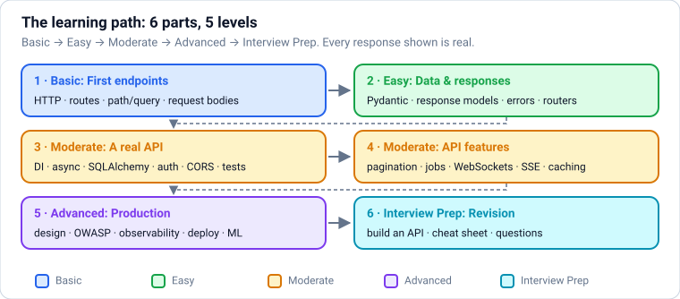
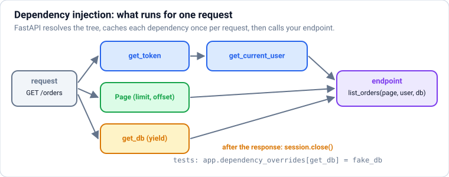
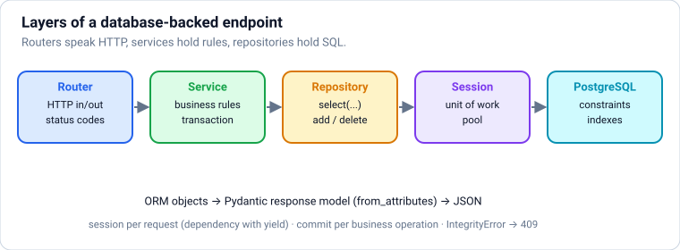

# FastAPI: Building Production APIs in Python

Web APIs with FastAPI from zero, in **levels**: **Basic** (HTTP and REST, first app, routes, parameters, request bodies) → **Easy** (Pydantic, response models, errors, headers/forms/files, routers) → **Moderate** (dependency injection, async, settings and lifespan, SQLAlchemy, authentication and authorisation, middleware and CORS, testing; pagination, background jobs, WebSockets, streaming/SSE for LLMs, webhooks, caching and rate limiting) → **Advanced** (API design, OWASP API security, observability, deployment, serving ML and LLM models) → **Interview Prep**. **Each part uses only what earlier parts taught.**

Every section has the same shape: a **picture** where it helps, **theory** in plain words, **Python** examples, **common mistakes**, and **practice** with hidden answers and links. Every example builds a small app and calls it through FastAPI's `TestClient` (or a real uvicorn server where concurrency matters); the responses under **Output** are exactly what the app returned with FastAPI 0.141, Pydantic 2.13 and Python 3.14.

Each part ends with a ✅ **checkpoint**. Before this file: `python.md` (Parts 1–3 and asyncio). Related: `sql-postgresql.md`, `llm-engineering.md` and `rag-and-agents.md` (the AI features you'll serve with FastAPI).

## Table of Contents

**[Part 1 — Basic: How APIs Work and Your First Endpoints](#part-1--basic-how-apis-work-and-your-first-endpoints)**

1. [How to Use These Notes: APIs, HTTP and What FastAPI Is](#1-how-to-use-these-notes-apis-http-and-what-fastapi-is)
2. [Your First FastAPI App](#2-your-first-fastapi-app)
3. [Path Operations: Routes and HTTP Methods](#3-path-operations-routes-and-http-methods)
4. [Path and Query Parameters with Validation](#4-path-and-query-parameters-with-validation)
5. [Request Bodies with Pydantic Models](#5-request-bodies-with-pydantic-models)

**[Part 2 — Easy: Data, Responses and Structure](#part-2--easy-data-responses-and-structure)**

6. [Pydantic v2 in Depth: Validation, Serialisation and Custom Rules](#6-pydantic-v2-in-depth-validation-serialisation-and-custom-rules)
7. [Response Models, Status Codes and Response Types](#7-response-models-status-codes-and-response-types)
8. [Error Handling: HTTPException, Custom Errors and Consistent Error Responses](#8-error-handling-httpexception-custom-errors-and-consistent-error-responses)
9. [Headers, Cookies, Forms and File Uploads](#9-headers-cookies-forms-and-file-uploads)
10. [APIRouter and Project Structure](#10-apirouter-and-project-structure)

**[Part 3 — Moderate: Building a Real API](#part-3--moderate-building-a-real-api)**

11. [Dependency Injection with Depends](#11-dependency-injection-with-depends)
12. [async def vs def: Concurrency in FastAPI](#12-async-def-vs-def-concurrency-in-fastapi)
13. [Settings, Lifespan Events and Shared Resources](#13-settings-lifespan-events-and-shared-resources)
14. [Databases with SQLAlchemy 2.0: Models, Sessions and CRUD](#14-databases-with-sqlalchemy-20-models-sessions-and-crud)
15. [Async Databases, Transactions, Repositories and Migrations](#15-async-databases-transactions-repositories-and-migrations)
16. [Authentication: Password Hashing, JWT and OAuth2](#16-authentication-password-hashing-jwt-and-oauth2)
17. [Authorisation: Roles, Permissions, Ownership and Multi-Tenancy](#17-authorisation-roles-permissions-ownership-and-multi-tenancy)
18. [Middleware and CORS](#18-middleware-and-cors)
19. [Testing FastAPI Apps](#19-testing-fastapi-apps)

**[Part 4 — Moderate: API Features](#part-4--moderate-api-features)**

20. [Pagination, Filtering and Sorting](#20-pagination-filtering-and-sorting)
21. [Background Tasks and Job Queues](#21-background-tasks-and-job-queues)
22. [WebSockets: Real-Time, Two-Way Connections](#22-websockets-real-time-two-way-connections)
23. [Streaming Responses and Server-Sent Events (LLM Token Streaming)](#23-streaming-responses-and-server-sent-events-llm-token-streaming)
24. [Calling Other APIs and Receiving Webhooks](#24-calling-other-apis-and-receiving-webhooks)
25. [Caching and Rate Limiting](#25-caching-and-rate-limiting)

**[Part 5 — Advanced: Design, Security and Production](#part-5--advanced-design-security-and-production)**

26. [API Design: Naming, Versioning, Idempotency and Consistency](#26-api-design-naming-versioning-idempotency-and-consistency)
27. [API Security: The OWASP API Top 10 in FastAPI](#27-api-security-the-owasp-api-top-10-in-fastapi)
28. [Observability: Structured Logs, Request IDs, Metrics and Tracing](#28-observability-structured-logs-request-ids-metrics-and-tracing)
29. [Performance and Deployment: Workers, Docker, Proxies and Scaling](#29-performance-and-deployment-workers-docker-proxies-and-scaling)
30. [Serving ML Models and LLM Features with FastAPI](#30-serving-ml-models-and-llm-features-with-fastapi)

**[Part 6 — Interview Prep: Revision](#part-6--interview-prep-revision)**

31. [Interview Coding: Build a Small API](#31-interview-coding-build-a-small-api)
32. [FastAPI Cheat Sheet](#32-fastapi-cheat-sheet)
33. [Most Asked FastAPI and Backend Interview Questions](#33-most-asked-fastapi-and-backend-interview-questions)

---

# Part 1 — Basic: How APIs Work and Your First Endpoints

> **Goal:** Understand HTTP and REST, build and run a FastAPI app, and accept validated path, query and body input.  
> **You need:** Python up to classes and type hints (`python.md` Parts 1–3).

---

## 1. How to Use These Notes: APIs, HTTP and What FastAPI Is



### Theory

> **In simple words:** an **API** (application programming interface) is how programs talk to each other. A web API is a server that waits for **HTTP requests** ("give me order 90312", "create this user") and sends back **responses**, usually as **JSON**. Your mobile app, React website, other services and AI agents all talk to backends this way. **FastAPI** is a modern Python framework for building such APIs: you write ordinary Python functions with type hints, and FastAPI turns them into validated, documented, fast HTTP endpoints.

**How these notes are organised:**

| Part | Level | You learn |
|---|---|---|
| 1 | Basic | HTTP and REST, your first app, routes, path and query parameters, request bodies |
| 2 | Easy | Pydantic models, response models and status codes, errors, headers/forms/files, routers |
| 3 | Moderate | Dependency injection, async vs sync, settings and lifespan, databases with SQLAlchemy, authentication and authorisation, middleware and CORS, testing |
| 4 | Moderate | Pagination, background jobs, WebSockets, streaming and Server-Sent Events, calling other APIs and webhooks, caching and rate limits |
| 5 | Advanced | API design, security (OWASP API Top 10), observability, performance, deployment, serving ML and LLM models |
| 6 | Interview Prep | Coding tasks, cheat sheet, most-asked questions |

**What you need first:** Python up to classes, type hints and `async`/`await` (`python.md` Parts 1–3, plus the asyncio section). SQL basics help for the database sections (`sql-postgresql.md`).

**About the examples:** every example builds a small app and calls it with FastAPI's **`TestClient`**, which sends real HTTP requests to the app in memory (no server needed). The status codes and JSON under **Output** are exactly what the app returned (FastAPI 0.141, Pydantic 2.13, Python 3.14).

**HTTP in five minutes:**

| Part of a request | Example | Meaning |
|---|---|---|
| **Method** | `GET`, `POST`, `PUT`, `PATCH`, `DELETE` | What to do: read, create, replace, partly update, delete |
| **Path** | `/orders/90312` | Which resource |
| **Query string** | `?status=paid&limit=10` | Options: filtering, sorting, paging |
| **Headers** | `Authorization: Bearer …`, `Content-Type: application/json` | Metadata: who you are, what format |
| **Body** | `{"sku": "P1", "qty": 2}` | Data sent with POST/PUT/PATCH |

A **response** has a **status code**, headers and a body. Status codes in families: **2xx** success (200 OK, 201 Created, 204 No Content), **3xx** redirect, **4xx** the client's fault (400 Bad Request, 401 Unauthorized = not logged in, 403 Forbidden = not allowed, 404 Not Found, 409 Conflict, 422 validation failed, 429 Too Many Requests), **5xx** the server's fault (500, 502, 503).

**REST** is a style for designing APIs around **resources** (nouns) and HTTP methods (verbs): `GET /orders` lists, `POST /orders` creates, `GET /orders/{id}` reads one, `PATCH /orders/{id}` updates, `DELETE /orders/{id}` deletes. `GET` must not change anything; `GET`, `PUT` and `DELETE` should be **idempotent** (repeating them has the same effect as doing it once).

**Why FastAPI (2026):**

- **Type hints drive everything:** request parsing, validation (via **Pydantic**), conversion, editor autocomplete and the docs.
- **Automatic interactive docs** (Swagger UI at `/docs`, ReDoc at `/redoc`) from the **OpenAPI** schema, which also generates client code.
- **Async-first** on the ASGI standard (Starlette underneath), so it handles many concurrent connections, WebSockets and streaming, which matters for LLM apps.
- **Dependency injection** for clean, testable code (auth, database sessions, settings).
- One of the most popular Python web frameworks; used for ML/AI serving, microservices and full backends.

**WSGI vs ASGI:** WSGI (Flask, classic Django) handles one request per worker at a time, synchronously. **ASGI** (FastAPI, Starlette, modern Django) supports `async`, WebSockets and long-lived connections. FastAPI apps run on an ASGI server such as **Uvicorn** (or Granian, Hypercorn).

### Practice

1. For an online shop's "reviews" feature, write the REST endpoints (method + path) to: list reviews of product P1, add a review to P1, edit your review 55, delete review 55. Which of these must be idempotent?

<details>
<summary><b>Answer</b></summary>

`GET /products/P1/reviews`, `POST /products/P1/reviews`, `PATCH /reviews/55` (or `PUT` to replace it entirely), `DELETE /reviews/55`. GET, PUT and DELETE must be idempotent; POST creates a new review each time (so clients that retry need an idempotency key, Section [26](#26-api-design-naming-versioning-idempotency-and-consistency)). PATCH can be idempotent if it sets fields to values ("rating = 4") rather than applying increments.

</details>

**Learn more:** [FastAPI documentation](https://fastapi.tiangolo.com/) · [MDN: an overview of HTTP](https://developer.mozilla.org/en-US/docs/Web/HTTP/Overview) · [MDN: HTTP status codes](https://developer.mozilla.org/en-US/docs/Web/HTTP/Status)

---

## 2. Your First FastAPI App

### Theory

> **In simple words:** a FastAPI app is an object (`app = FastAPI()`) plus functions decorated with the HTTP method and path they handle (`@app.get("/")`). Whatever the function returns (a dict, a list, a Pydantic model) is converted to JSON automatically. You run it with a server, open `/docs` in the browser, and you can try every endpoint from there.

**Setup (uv):**

```text
uv init shop-api && cd shop-api
uv add "fastapi[standard]"          # FastAPI + uvicorn + the fastapi CLI + httpx and friends
uv run fastapi dev main.py          # development server with auto-reload on http://127.0.0.1:8000
uv run fastapi run main.py          # production mode (no reload)
```

Then open `http://127.0.0.1:8000/docs` (Swagger UI: try requests in the browser), `/redoc`, or `/openapi.json` (the machine-readable schema).

**The pieces of a path operation:**

```text
@app.get("/items/{item_id}")        ← decorator: HTTP method + path ("operation")
async def read_item(item_id: int):  ← function: parameters are parsed and validated from the request
    return {"item_id": item_id}     ← return value: serialised to JSON with status 200
```

`async def` or plain `def` both work; Section [12](#12-async-def-vs-def-concurrency-in-fastapi) explains which to choose.

**Testing without a server:** `fastapi.testclient.TestClient(app)` (built on `httpx`) sends requests straight into the app. It's how you'll write automated tests (Section [19](#19-testing-fastapi-apps)), and it's how every example in these notes is run.

### Python

```python
from fastapi import FastAPI
from fastapi.testclient import TestClient

app = FastAPI(title="ShopKart API", version="1.0.0")

@app.get("/")
def home():
    return {"message": "Welcome to ShopKart"}

@app.get("/health")
async def health():
    return {"status": "ok"}

client = TestClient(app)
r = client.get("/")
print(r.status_code, r.json(), r.headers["content-type"])
print(client.get("/health").json())
print(client.get("/nope").status_code, client.get("/nope").json())
print(client.post("/health").status_code, client.post("/health").json())

schema = client.get("/openapi.json").json()           # the OpenAPI schema behind /docs
print(schema["info"], list(schema["paths"]))
```

**Output:**

```text
200 {'message': 'Welcome to ShopKart'} application/json
{'status': 'ok'}
404 {'detail': 'Not Found'}
405 {'detail': 'Method Not Allowed'}
{'title': 'ShopKart API', 'version': '1.0.0'} ['/', '/health']
```

Unknown paths give **404**, and a known path with the wrong method gives **405 Method Not Allowed**, without any code from you. The OpenAPI schema lists every path; `/docs` renders it as an interactive page.

**Common mistakes:**

- ❌ Naming your file `fastapi.py` (it shadows the library).
- ❌ Running `python main.py` without starting a server (use `fastapi dev` or `uvicorn main:app --reload`).
- ❌ Using `--reload` in production.
- ❌ Returning objects FastAPI can't serialise (open files, database connections); return dicts, lists or models.

### Practice

1. Add `GET /version` returning `{"name": ..., "version": ...}` taken from `app.title` and `app.version`, and test it with `TestClient`.

<details>
<summary><b>Answer</b></summary>

```python
@app.get("/version")
def version():
    return {"name": app.title, "version": app.version}

print(client.get("/version").json())
```

**Output:**

```text
{'name': 'ShopKart API', 'version': '1.0.0'}
```

</details>

**Learn more:** [FastAPI tutorial: first steps](https://fastapi.tiangolo.com/tutorial/first-steps/) · [FastAPI CLI](https://fastapi.tiangolo.com/fastapi-cli/) · [Uvicorn](https://www.uvicorn.org/)

---

## 3. Path Operations: Routes and HTTP Methods

### Theory

> **In simple words:** each endpoint is a **path operation**: an HTTP method plus a path, handled by one function. `@app.get("/orders")` answers "list orders", `@app.post("/orders")` answers "create an order", and so on. A small in-memory "database" (a dict) is enough to build a complete create-read-update-delete (**CRUD**) API and see how the pieces fit.

**Decorators:** `@app.get`, `@app.post`, `@app.put`, `@app.patch`, `@app.delete` (also `head`, `options`, and `@app.api_route(..., methods=[...])` for several). Useful decorator arguments: `status_code=201`, `tags=["orders"]` (groups endpoints in the docs), `summary=`, `description=`, `response_model=` (Section [7](#7-response-models-status-codes-and-response-types)), `deprecated=True`.

**Which method, which status code:**

| Action | Method + path | Success status |
|---|---|---|
| List | `GET /orders` | 200 |
| Read one | `GET /orders/{id}` | 200 (404 if missing) |
| Create | `POST /orders` | **201 Created** (often with a `Location` header) |
| Replace | `PUT /orders/{id}` | 200 |
| Partial update | `PATCH /orders/{id}` | 200 |
| Delete | `DELETE /orders/{id}` | **204 No Content** (empty body) |

**Route order matters:** FastAPI checks routes **in the order they were declared** and uses the first match. A fixed path like `/orders/latest` must come **before** `/orders/{order_id}`, or "latest" is treated as an order id.

**Raising errors:** `raise HTTPException(status_code=404, detail="...")` stops the function and sends that error response (Section [8](#8-error-handling-httpexception-custom-errors-and-consistent-error-responses) covers errors in depth).

### Python

```python
from fastapi import FastAPI, HTTPException
from fastapi.testclient import TestClient

app = FastAPI()
ORDERS: dict[int, dict] = {}                       # an in-memory "database"
next_id = 1

@app.get("/orders", tags=["orders"])
def list_orders():
    return list(ORDERS.values())

@app.get("/orders/latest", tags=["orders"])         # declared BEFORE /orders/{order_id}
def latest_order():
    if not ORDERS:
        raise HTTPException(status_code=404, detail="no orders yet")
    return ORDERS[max(ORDERS)]

@app.get("/orders/{order_id}", tags=["orders"])
def get_order(order_id: int):
    if order_id not in ORDERS:
        raise HTTPException(status_code=404, detail=f"order {order_id} not found")
    return ORDERS[order_id]

@app.post("/orders", status_code=201, tags=["orders"])
def create_order(order: dict):                      # a plain dict body for now; Pydantic models come soon
    global next_id
    ORDERS[next_id] = {"id": next_id, **order}
    next_id += 1
    return ORDERS[next_id - 1]

@app.delete("/orders/{order_id}", status_code=204, tags=["orders"])
def delete_order(order_id: int):
    if ORDERS.pop(order_id, None) is None:
        raise HTTPException(status_code=404, detail=f"order {order_id} not found")

client = TestClient(app)
print(client.get("/orders/latest").status_code, client.get("/orders/latest").json())
for body in [{"sku": "P1", "qty": 2}, {"sku": "P9", "qty": 1}]:
    r = client.post("/orders", json=body)
    print(r.status_code, r.json())
print(client.get("/orders").json())
print(client.get("/orders/latest").json(), client.get("/orders/1").json())
r = client.delete("/orders/1")
print(r.status_code, repr(r.text), client.get("/orders/1").status_code)
print(client.get("/orders/abc").status_code)          # not an int → validation error
```

**Output:**

```text
404 {'detail': 'no orders yet'}
201 {'id': 1, 'sku': 'P1', 'qty': 2}
201 {'id': 2, 'sku': 'P9', 'qty': 1}
[{'id': 1, 'sku': 'P1', 'qty': 2}, {'id': 2, 'sku': 'P9', 'qty': 1}]
{'id': 2, 'sku': 'P9', 'qty': 1} {'id': 1, 'sku': 'P1', 'qty': 2}
204 '' 404
422
```

The last line shows FastAPI's automatic **validation**: `order_id: int` means "abc" is rejected with **422** before your function runs.

**Common mistakes:**

- ❌ Declaring `/orders/{order_id}` before `/orders/latest`.
- ❌ Returning 200 for creation (use 201) or a body with 204.
- ❌ Using `GET` for actions that change data (crawlers and prefetchers will trigger them).
- ❌ Module-level dicts as a "database" in real apps (lost on restart, not shared between workers).

### Practice

1. Add `PATCH /orders/{order_id}` that updates only the fields sent in the body (a dict), returning the updated order or 404. Test it by changing order 2's quantity to 5.

<details>
<summary><b>Answer</b></summary>

```python
@app.patch("/orders/{order_id}", tags=["orders"])
def update_order(order_id: int, changes: dict):
    if order_id not in ORDERS:
        raise HTTPException(status_code=404, detail=f"order {order_id} not found")
    ORDERS[order_id].update({k: v for k, v in changes.items() if k != "id"})   # never let clients change the id
    return ORDERS[order_id]

print(client.patch("/orders/2", json={"qty": 5, "id": 999}).json(), client.patch("/orders/7", json={}).status_code)
```

**Output:**

```text
{'id': 2, 'sku': 'P9', 'qty': 5} 404
```

</details>

**Learn more:** [FastAPI: path operation configuration](https://fastapi.tiangolo.com/tutorial/path-operation-configuration/) · [MDN: HTTP request methods](https://developer.mozilla.org/en-US/docs/Web/HTTP/Methods)

---

## 4. Path and Query Parameters with Validation

### Theory

> **In simple words:** a **path parameter** is part of the URL that identifies a resource: in `/orders/90312`, the `90312`. A **query parameter** comes after `?` and adjusts the request: `/orders?status=paid&limit=10`. In FastAPI you just declare them as function parameters with type hints; FastAPI reads them from the URL, **converts** them to the right type, **validates** them, and returns a clear 422 error if they're wrong.

**How FastAPI decides where a parameter comes from:**

- Name appears in the path (`{order_id}`) → **path parameter**.
- Simple type (`int`, `str`, `bool`, `Enum`, `date`, …) not in the path → **query parameter**.
- A Pydantic model → **request body** (next section).

**Required or optional:** a query parameter **without a default** is required; with a default it's optional; `str | None = None` means optional with no value.

**Validation with `Annotated`:** `Annotated[int, Path(ge=1)]`, `Annotated[str, Query(min_length=3, max_length=50, pattern=...)]`, `Annotated[int, Query(ge=1, le=100)] = 20`. Numeric checks: `gt`, `ge`, `lt`, `le`; strings: `min_length`, `max_length`, `pattern`. `Query(alias="sort-by")` for names that aren't valid Python; `description=` shows in the docs; `list[str]` with `Query()` accepts repeated parameters (`?tag=a&tag=b`).

**Enums** restrict a value to fixed choices, and the docs show a dropdown.

**Booleans** accept `true/false`, `1/0`, `yes/no`, `on/off`.

**Query parameter models:** group many filters into one Pydantic model: `filters: Annotated[OrderFilters, Query()]`.

### Python

```python
from datetime import date
from enum import StrEnum
from typing import Annotated
from fastapi import FastAPI, Path, Query
from fastapi.testclient import TestClient

app = FastAPI()

class Status(StrEnum):
    PENDING = "pending"
    PAID = "paid"
    SHIPPED = "shipped"

@app.get("/orders/{order_id}")
def get_order(order_id: Annotated[int, Path(ge=1, description="Order number")]):
    return {"order_id": order_id}

@app.get("/orders")
def list_orders(
    status: Status | None = None,
    limit: Annotated[int, Query(ge=1, le=100)] = 20,
    since: date | None = None,
    express: bool = False,
    tag: Annotated[list[str], Query()] = [],
    q: Annotated[str | None, Query(min_length=3, max_length=50)] = None,
):
    return {"status": status, "limit": limit, "since": since, "express": express, "tags": tag, "q": q}

client = TestClient(app)
print(client.get("/orders/42").json())
print(client.get("/orders?status=paid&limit=5&since=2026-09-01&express=yes&tag=gift&tag=fragile").json())
print(client.get("/orders").json())

for bad in ["/orders/0", "/orders?limit=500", "/orders?status=lost", "/orders?q=ab"]:
    r = client.get(bad)
    err = r.json()["detail"][0]
    print(r.status_code, bad, "→", err["loc"], err["msg"])
```

**Output:**

```text
{'order_id': 42}
{'status': 'paid', 'limit': 5, 'since': '2026-09-01', 'express': True, 'tags': ['gift', 'fragile'], 'q': None}
{'status': None, 'limit': 20, 'since': None, 'express': False, 'tags': [], 'q': None}
422 /orders/0 → ['path', 'order_id'] Input should be greater than or equal to 1
422 /orders?limit=500 → ['query', 'limit'] Input should be less than or equal to 100
422 /orders?status=lost → ['query', 'status'] Input should be 'pending', 'paid' or 'shipped'
422 /orders?q=ab → ['query', 'q'] String should have at least 3 characters
```

Every error says **where** the problem is (`loc`: path or query, and which parameter) and **what** is wrong, with no validation code written by you.

**Query parameter models** keep long filter lists tidy (Pydantic models are explained properly in the next two sections; here, a model is just a class listing fields with types and defaults):

```python
from pydantic import BaseModel, Field

class ProductFilters(BaseModel):
    model_config = {"extra": "forbid"}              # unknown query parameters → 422
    min_price: float = Field(0, ge=0)
    max_price: float | None = None
    in_stock: bool = True
    sort: str = Field("price", pattern="^(price|name|-price|-name)$")

@app.get("/products")
def search_products(filters: Annotated[ProductFilters, Query()]):
    return filters

print(client.get("/products?min_price=100&sort=-price").json())
print(client.get("/products?colour=red").status_code)
```

**Output:**

```text
{'min_price': 100.0, 'max_price': None, 'in_stock': True, 'sort': '-price'}
422
```

**Common mistakes:**

- ❌ Mutable defaults like `tag: list[str] = []` without `Query()` (FastAPI would expect a body); declare list query parameters with `Query()`.
- ❌ Doing validation by hand in the function instead of in the parameter declaration.
- ❌ Huge unbounded `limit` values (clients can ask for a million rows); always cap them.
- ❌ Putting identifiers in query strings (`/orders?id=5`) when they identify a resource; use the path.

### Practice

1. Add `GET /users/{username}/orders` where `username` is 3–20 lowercase letters/digits (use `pattern`) and an optional `year` between 2020 and 2030. Test one valid and one invalid username.

<details>
<summary><b>Answer</b></summary>

```python
@app.get("/users/{username}/orders")
def user_orders(
    username: Annotated[str, Path(pattern="^[a-z0-9]{3,20}$")],
    year: Annotated[int | None, Query(ge=2020, le=2030)] = None,
):
    return {"username": username, "year": year}

print(client.get("/users/asha29/orders?year=2026").json())
r = client.get("/users/Asha!/orders")
print(r.status_code, r.json()["detail"][0]["msg"])
```

**Output:**

```text
{'username': 'asha29', 'year': 2026}
422 String should match pattern '^[a-z0-9]{3,20}$'
```

</details>

**Learn more:** [FastAPI: query parameters and validation](https://fastapi.tiangolo.com/tutorial/query-params-str-validations/) · [FastAPI: path parameters and numeric validation](https://fastapi.tiangolo.com/tutorial/path-params-numeric-validations/) · [FastAPI: query parameter models](https://fastapi.tiangolo.com/tutorial/query-param-models/)

---

## 5. Request Bodies with Pydantic Models

### Theory

> **In simple words:** when a client **sends data** (create an order, update a profile), it puts JSON in the request **body**. In FastAPI you describe the expected shape as a **Pydantic model**: a class listing each field with its type (and optional rules). FastAPI then reads the JSON, checks every field, converts types, and hands your function a ready-to-use Python object. Bad data never reaches your code; the client gets a precise 422 error instead.

**A model:**

```text
class OrderIn(BaseModel):
    sku: str                           ← required
    qty: int = 1                       ← optional with a default
    note: str | None = None            ← optional, may be null
    items: list[Item]                  ← nested models and lists work
```

**Where parameters come from (the rule again):** in the path → path parameter; simple type → query; **Pydantic model → body**. You can mix all three in one function.

**Validation and conversion:** `"2"` becomes `2` for an `int` field (lax mode, the default for JSON), missing required fields and wrong types are rejected, extra fields are ignored by default (set `extra="forbid"` to reject them, which is safer for write endpoints). Nested models validate recursively, and error locations point to the exact field (`["body", "items", 0, "qty"]`).

**Several body parts:** two model parameters make FastAPI expect `{"order": {...}, "customer": {...}}`. `Body()` adds single values to the body; `Body(embed=True)` wraps a lone model under its name.

**Why models instead of `dict`:** validation, conversion, editor autocomplete, and accurate docs and client code generation from the OpenAPI schema.

### Python

```python
from typing import Annotated
from fastapi import Body, FastAPI
from fastapi.testclient import TestClient
from pydantic import BaseModel, Field

class Item(BaseModel):
    sku: str = Field(min_length=2, max_length=20)
    qty: int = Field(default=1, ge=1, le=50)
    price: float = Field(gt=0)

class OrderIn(BaseModel):
    customer_email: str
    items: list[Item] = Field(min_length=1)
    note: str | None = None

app = FastAPI()

@app.post("/stores/{store_id}/orders", status_code=201)
def create_order(store_id: int, order: OrderIn, express: bool = False):     # path + body + query
    total = sum(i.qty * i.price for i in order.items)
    return {"store_id": store_id, "express": express, "customer": order.customer_email,
            "lines": len(order.items), "total": round(total, 2)}

client = TestClient(app)
good = {"customer_email": "asha@example.com", "items": [{"sku": "P1", "qty": "2", "price": 499}, {"sku": "P9", "price": 99.5}]}
r = client.post("/stores/7/orders?express=true", json=good)
print(r.status_code, r.json())

bad = {"customer_email": "asha@example.com", "items": [{"sku": "P", "qty": 0, "price": -5}]}
r = client.post("/stores/7/orders", json=bad)
print(r.status_code)
for e in r.json()["detail"]:
    print("  ", e["loc"], "-", e["msg"])
print(client.post("/stores/7/orders", json={"items": []}).json()["detail"][0]["loc"])
```

**Output:**

```text
201 {'store_id': 7, 'express': True, 'customer': 'asha@example.com', 'lines': 2, 'total': 1097.5}
422
   ['body', 'items', 0, 'sku'] - String should have at least 2 characters
   ['body', 'items', 0, 'qty'] - Input should be greater than or equal to 1
   ['body', 'items', 0, 'price'] - Input should be greater than 0
['body', 'customer_email']
```

**Several bodies and single body values:**

```python
class Customer(BaseModel):
    name: str
    email: str

@app.post("/checkout")
def checkout(order: OrderIn, customer: Customer, coupon: Annotated[str | None, Body()] = None):
    return {"customer": customer.name, "items": len(order.items), "coupon": coupon}

@app.post("/items")
def add_item(item: Annotated[Item, Body(embed=True)]):
    return item

body = {"order": good, "customer": {"name": "Asha", "email": "asha@example.com"}, "coupon": "DIWALI"}
print(client.post("/checkout", json=body).json())
print(client.post("/items", json={"item": {"sku": "P1", "price": 10}}).json())
```

**Output:**

```text
{'customer': 'Asha', 'items': 2, 'coupon': 'DIWALI'}
{'sku': 'P1', 'qty': 1, 'price': 10.0}
```

**Common mistakes:**

- ❌ `order: dict` for inputs (no validation, no docs).
- ❌ Accepting extra fields silently on write endpoints (clients' typos go unnoticed, and it enables mass assignment, Section [27](#27-api-security-the-owasp-api-top-10-in-fastapi)).
- ❌ Sending a body with `GET` (not supported by many clients and proxies).
- ❌ Reusing one model for input and output (clients could set `id` or `is_admin`); Section [7](#7-response-models-status-codes-and-response-types) shows separate models.

### Practice

1. Create a `ReviewIn` model (rating 1–5, comment 10–500 characters, optional `photos` list of at most 3 URLs as strings) and `POST /products/{sku}/reviews` returning 201 with the review and sku. Test a valid review and one with rating 6.

<details>
<summary><b>Answer</b></summary>

```python
class ReviewIn(BaseModel):
    model_config = {"extra": "forbid"}
    rating: int = Field(ge=1, le=5)
    comment: str = Field(min_length=10, max_length=500)
    photos: list[str] = Field(default_factory=list, max_length=3)

@app.post("/products/{sku}/reviews", status_code=201)
def add_review(sku: str, review: ReviewIn):
    return {"sku": sku, **review.model_dump()}

r = client.post("/products/P1/reviews", json={"rating": 5, "comment": "Great pen, smooth ink"})
print(r.status_code, r.json())
r = client.post("/products/P1/reviews", json={"rating": 6, "comment": "Too good to be true!"})
print(r.status_code, r.json()["detail"][0]["msg"])
```

**Output:**

```text
201 {'sku': 'P1', 'rating': 5, 'comment': 'Great pen, smooth ink', 'photos': []}
422 Input should be less than or equal to 5
```

</details>

---

### ✅ Part 1 checkpoint

Without looking, can you:

- [ ] Explain HTTP methods, status code families, REST resources and idempotency?
- [ ] Create a FastAPI app, run it, and call it with `TestClient`?
- [ ] Write CRUD path operations with correct status codes and route order?
- [ ] Declare validated path and query parameters (including enums, lists and limits)?
- [ ] Accept nested JSON bodies with Pydantic models and read 422 error details?

**Learn more:** [FastAPI: request body](https://fastapi.tiangolo.com/tutorial/body/) · [FastAPI: body with multiple parameters](https://fastapi.tiangolo.com/tutorial/body-multiple-params/) · [Pydantic: models](https://docs.pydantic.dev/latest/concepts/models/)

---

# Part 2 — Easy: Data, Responses and Structure

> **Goal:** Master Pydantic, shape responses and errors, handle headers, forms and files, and organise code with routers.  
> **You need:** Part 1.

---

## 6. Pydantic v2 in Depth: Validation, Serialisation and Custom Rules

### Theory

> **In simple words:** Pydantic is the library FastAPI uses to **check and convert data**. You describe the shape once as a model; Pydantic validates incoming data against it (types, lengths, ranges, formats, your own rules) and serialises outgoing data to JSON. It's written in Rust underneath, so it's fast. It's also used far beyond FastAPI: settings, configuration files, LLM structured outputs (`llm-engineering.md`), data pipelines.

**Core API (v2 names):**

| Task | Method |
|---|---|
| Validate a dict | `Model.model_validate(data)` |
| Validate JSON text | `Model.model_validate_json(text)` (faster than `json.loads` + validate) |
| Object → dict / JSON | `obj.model_dump()`, `obj.model_dump_json()`; options `exclude_unset`, `exclude_none`, `by_alias`, `include`/`exclude` |
| Copy with changes | `obj.model_copy(update={...})` |
| JSON schema | `Model.model_json_schema()` |
| Validate any type | `TypeAdapter(list[int]).validate_python(...)` |

(v1 names like `.dict()`, `.parse_obj()`, `@validator` are deprecated.)

**Field rules:** `Field(min_length=, max_length=, pattern=, gt=, ge=, lt=, le=, multiple_of=, default=, default_factory=, alias=, description=, examples=)`. Special types: `EmailStr` (needs `email-validator`), `HttpUrl`, `SecretStr`, `UUID`, `datetime`/`date`, `Decimal`, `constr`-style `Annotated[str, StringConstraints(strip_whitespace=True, to_lower=True)]`.

**Custom validation:**

| Decorator | Runs | Use |
|---|---|---|
| `@field_validator("field")` | On one field (after type conversion by default; `mode="before"` to see raw input) | Normalise or check one value |
| `@model_validator(mode="after")` | On the whole model | Rules across fields ("end after start") |
| `@computed_field` | On output | Derived values included in `model_dump` and the schema |
| `Annotated[int, AfterValidator(fn)]` | Reusable validated types | The same rule in many models |

**Model configuration** (`model_config = ConfigDict(...)`): `extra="forbid"` (reject unknown fields), `frozen=True`, `str_strip_whitespace=True`, `from_attributes=True` (read from ORM objects, Section [14](#14-databases-with-sqlalchemy-20-models-sessions-and-crud)), `alias_generator=to_camel` + `populate_by_name=True` (camelCase JSON, snake_case Python), `strict=True` (no type coercion).

**Discriminated unions:** when a field can hold one of several models, a `Literal` "type" field tells Pydantic which to use, giving fast validation and clear errors: `payment: Annotated[Card | Upi, Field(discriminator="method")]`.

### Python

```python
from datetime import date
from typing import Annotated, Literal
from pydantic import (AfterValidator, BaseModel, ConfigDict, Field, ValidationError, computed_field,
                      field_validator, model_validator)
from pydantic.alias_generators import to_camel

def indian_pincode(v: str) -> str:
    if not (v.isdigit() and len(v) == 6 and v[0] != "0"):
        raise ValueError("must be a 6-digit PIN code")
    return v

Pincode = Annotated[str, AfterValidator(indian_pincode)]         # a reusable validated type

class Address(BaseModel):
    city: str
    pincode: Pincode

class Booking(BaseModel):
    model_config = ConfigDict(alias_generator=to_camel, populate_by_name=True, extra="forbid", str_strip_whitespace=True)

    guest_name: str = Field(min_length=2)
    check_in: date
    check_out: date
    guests: int = Field(ge=1, le=6)
    address: Address

    @field_validator("guest_name")
    @classmethod
    def title_case(cls, v: str) -> str:
        return v.title()

    @model_validator(mode="after")
    def dates_in_order(self):
        if self.check_out <= self.check_in:
            raise ValueError("check_out must be after check_in")
        return self

    @computed_field
    @property
    def nights(self) -> int:
        return (self.check_out - self.check_in).days

raw = '{"guestName": "  asha rao ", "checkIn": "2026-12-20", "checkOut": "2026-12-23", "guests": "2", "address": {"city": "Goa", "pincode": "403001"}}'
b = Booking.model_validate_json(raw)
print(b.guest_name, b.nights, b.guests, type(b.check_in).__name__)
print(b.model_dump(by_alias=True, mode="json"))

try:
    Booking.model_validate({"guestName": "A", "checkIn": "2026-12-23", "checkOut": "2026-12-20", "guests": 9,
                            "address": {"city": "Goa", "pincode": "0123"}, "vip": True})
except ValidationError as e:
    for err in e.errors():
        print(err["loc"], "-", err["msg"])
```

**Output:**

```text
Asha Rao 3 2 date
{'guestName': 'Asha Rao', 'checkIn': '2026-12-20', 'checkOut': '2026-12-23', 'guests': 2, 'address': {'city': 'Goa', 'pincode': '403001'}, 'nights': 3}
('guestName',) - String should have at least 2 characters
('guests',) - Input should be less than or equal to 6
('address', 'pincode') - Value error, must be a 6-digit PIN code
('vip',) - Extra inputs are not permitted
```

**Discriminated unions and partial updates:**

```python
class CardPayment(BaseModel):
    method: Literal["card"]
    last4: str = Field(pattern=r"^\d{4}$")

class UpiPayment(BaseModel):
    method: Literal["upi"]
    vpa: str = Field(pattern=r"^[\w.-]+@\w+$")

class Checkout(BaseModel):
    amount: float
    payment: Annotated[CardPayment | UpiPayment, Field(discriminator="method")]

print(Checkout.model_validate({"amount": 499, "payment": {"method": "upi", "vpa": "asha@okbank"}}).payment)
try:
    Checkout.model_validate({"amount": 499, "payment": {"method": "cash"}})
except ValidationError as e:
    print(e.errors()[0]["msg"])

class ProfileUpdate(BaseModel):
    name: str | None = None
    city: str | None = None
    newsletter: bool | None = None

patch = ProfileUpdate.model_validate({"city": "Pune", "newsletter": None})
print(patch.model_dump(), patch.model_dump(exclude_unset=True))   # only what the client actually sent
```

**Output:**

```text
method='upi' vpa='asha@okbank'
Input tag 'cash' found using 'method' does not match any of the expected tags: 'card', 'upi'
{'name': None, 'city': 'Pune', 'newsletter': None} {'city': 'Pune', 'newsletter': None}
```

`exclude_unset=True` distinguishes "the client didn't send `name`" from "the client set `newsletter` to null", which is exactly what PATCH endpoints need (Section [7](#7-response-models-status-codes-and-response-types)).

**Common mistakes:**

- ❌ Using Pydantic v1 methods (`.dict()`, `@validator`) in new code.
- ❌ Validators with side effects (database calls, network); keep them pure and fast.
- ❌ Forgetting `mode="json"` in `model_dump` when you need JSON-compatible values (dates as strings).
- ❌ `Optional` fields that should really be required; being explicit about defaults avoids silent `None`s.

### Practice

1. Write a `SignUp` model with `email` (lower-cased and stripped), `password` (at least 10 characters, containing a digit), `password_repeat` that must match, and `age` ≥ 13. The response should never include the passwords: show `model_dump(exclude=...)`.

<details>
<summary><b>Answer</b></summary>

```python
class SignUp(BaseModel):
    email: Annotated[str, Field(pattern=r"^[^@\s]+@[^@\s]+\.[a-z]{2,}$")]
    password: str = Field(min_length=10)
    password_repeat: str
    age: int = Field(ge=13)

    @field_validator("email", mode="before")
    @classmethod
    def normalise_email(cls, v):
        return v.strip().lower() if isinstance(v, str) else v

    @field_validator("password")
    @classmethod
    def has_digit(cls, v):
        if not any(ch.isdigit() for ch in v):
            raise ValueError("password needs at least one digit")
        return v

    @model_validator(mode="after")
    def passwords_match(self):
        if self.password != self.password_repeat:
            raise ValueError("passwords do not match")
        return self

s = SignUp(email="  Asha@Example.COM ", password="correcthorse9", password_repeat="correcthorse9", age=21)
print(s.model_dump(exclude={"password", "password_repeat"}))
try:
    SignUp(email="a@b.io", password="nodigitshere", password_repeat="x", age=12)
except ValidationError as e:
    print([err["msg"] for err in e.errors()])
```

**Output:**

```text
{'email': 'asha@example.com', 'age': 21}
['Value error, password needs at least one digit', 'Input should be greater than or equal to 13']
```

The `after` model validator only runs once all fields are individually valid, so the mismatch isn't reported while other errors exist.

</details>

**Learn more:** [Pydantic docs](https://docs.pydantic.dev/latest/) · [Pydantic: validators](https://docs.pydantic.dev/latest/concepts/validators/) · [Pydantic: unions and discriminators](https://docs.pydantic.dev/latest/concepts/unions/) · [Migration guide v1 → v2](https://docs.pydantic.dev/latest/migration/)

---

## 7. Response Models, Status Codes and Response Types

### Theory

> **In simple words:** a **response model** describes exactly what your endpoint sends back. FastAPI uses it to **filter** the output (a password hash stored in your database never leaks, because the response model doesn't include it), to **validate** it, and to **document** it. The standard pattern is **separate models** for what clients send (`UserCreate`), what you store (`UserInDB`), and what you return (`UserOut`).

**Declaring the output:** either a return type annotation (`def get_user(...) -> UserOut:`) or `response_model=UserOut` in the decorator (use the latter when you return a dict or an ORM object that should be converted). Options: `response_model_exclude_unset=True`, `response_model_exclude_none=True`.

**The input/output/storage split:**

| Model | Contains | Why separate |
|---|---|---|
| `UserCreate` | email, password | What a client may send (no `id`, no `is_admin`) |
| `UserUpdate` | all fields optional | PATCH: only sent fields change (`exclude_unset`) |
| `UserInDB` / ORM model | id, email, hashed_password, is_admin, created_at | What's stored |
| `UserOut` | id, email, created_at | What's safe to return |

A common trick is a shared base class (`UserBase`) with the fields all of them share.

**Status codes:** set the success code in the decorator (`status_code=201`) using `fastapi.status` constants for readability (`status.HTTP_201_CREATED`). To choose the code at runtime, add a `response: Response` parameter and set `response.status_code`, or return a `JSONResponse`.

**Other response classes:** `JSONResponse` (default), `HTMLResponse`, `PlainTextResponse`, `RedirectResponse`, `FileResponse` (serve a file efficiently), `StreamingResponse` (Section [23](#23-streaming-responses-and-server-sent-events-llm-token-streaming)), `Response` (raw bytes with a media type). Headers and cookies can be set on the `Response` object.

### Python

```python
from datetime import UTC, datetime
from fastapi import FastAPI, HTTPException, Response, status
from fastapi.responses import HTMLResponse, PlainTextResponse, RedirectResponse
from fastapi.testclient import TestClient
from pydantic import BaseModel, Field

class UserBase(BaseModel):
    email: str
    name: str

class UserCreate(UserBase):
    password: str = Field(min_length=8)

class UserUpdate(BaseModel):
    name: str | None = None
    email: str | None = None

class UserOut(UserBase):
    id: int
    created_at: datetime

DB: dict[int, dict] = {}                           # stored rows include secret fields

app = FastAPI()

@app.post("/users", status_code=status.HTTP_201_CREATED, response_model=UserOut)
def create_user(user: UserCreate, response: Response):
    user_id = len(DB) + 1
    DB[user_id] = {"id": user_id, "email": user.email, "name": user.name,
                   "hashed_password": "argon2$" + user.password[::-1],   # stand-in; real password hashing comes in Part 3
                   "is_admin": False, "created_at": datetime(2026, 9, 25, 10, 0, tzinfo=UTC)}
    response.headers["Location"] = f"/users/{user_id}"
    return DB[user_id]                             # a dict with secrets; the response model filters it

@app.patch("/users/{user_id}", response_model=UserOut)
def update_user(user_id: int, changes: UserUpdate):
    if user_id not in DB:
        raise HTTPException(404, "user not found")
    DB[user_id].update(changes.model_dump(exclude_unset=True))   # only fields the client sent
    return DB[user_id]

client = TestClient(app)
r = client.post("/users", json={"email": "asha@example.com", "name": "Asha", "password": "s3cret-pass"})
print(r.status_code, r.headers["location"], r.json())
print(client.patch("/users/1", json={"name": "Asha Rao"}).json())
print(sorted(DB[1]))                               # what's stored still has the hash and admin flag
```

**Output:**

```text
201 /users/1 {'email': 'asha@example.com', 'name': 'Asha', 'id': 1, 'created_at': '2026-09-25T10:00:00Z'}
{'email': 'asha@example.com', 'name': 'Asha Rao', 'id': 1, 'created_at': '2026-09-25T10:00:00Z'}
['created_at', 'email', 'hashed_password', 'id', 'is_admin', 'name']
```

`hashed_password` and `is_admin` exist in storage but never appear in responses, because `UserOut` doesn't list them. The PATCH changed only `name`.

```python
@app.get("/hello", response_class=HTMLResponse)
def hello():
    return "<h1>Hello!</h1>"

@app.get("/robots.txt", response_class=PlainTextResponse)
def robots():
    return "User-agent: *\nDisallow: /admin"

@app.get("/old-docs")
def old_docs():
    return RedirectResponse("/docs", status_code=301)

@app.put("/users/{user_id}/avatar", status_code=204)
def set_avatar(user_id: int):
    return Response(status_code=204)

r = client.get("/hello")
print(r.headers["content-type"], r.text)
print(client.get("/robots.txt").text.splitlines())
r = client.get("/old-docs", follow_redirects=False)
print(r.status_code, r.headers["location"])
print(client.put("/users/1/avatar").status_code)
```

**Output:**

```text
text/html; charset=utf-8 <h1>Hello!</h1>
['User-agent: *', 'Disallow: /admin']
301 /docs
204
```

**Common mistakes:**

- ❌ Returning ORM objects or dicts that include secrets without a response model.
- ❌ One model for input and output (clients can set `id`, `is_admin`, `created_at`).
- ❌ PATCH that overwrites unsent fields with `None` (use `exclude_unset=True`).
- ❌ Always returning 200, even for creation or when nothing is returned.

### Practice

1. Add `GET /users` returning `list[UserOut]` and `GET /users/{user_id}` returning 404 when missing. Create a second user and list both.

<details>
<summary><b>Answer</b></summary>

```python
@app.get("/users", response_model=list[UserOut])
def list_users():
    return list(DB.values())

@app.get("/users/{user_id}", response_model=UserOut)
def get_user(user_id: int):
    if user_id not in DB:
        raise HTTPException(404, "user not found")
    return DB[user_id]

client.post("/users", json={"email": "ravi@example.com", "name": "Ravi", "password": "another-pass"})
print([u["email"] for u in client.get("/users").json()], client.get("/users/9").status_code)
```

**Output:**

```text
['asha@example.com', 'ravi@example.com'] 404
```

</details>

**Learn more:** [FastAPI: response model](https://fastapi.tiangolo.com/tutorial/response-model/) · [FastAPI: extra models](https://fastapi.tiangolo.com/tutorial/extra-models/) · [FastAPI: custom responses](https://fastapi.tiangolo.com/advanced/custom-response/)

---

## 8. Error Handling: HTTPException, Custom Errors and Consistent Error Responses

### Theory

> **In simple words:** when something goes wrong, an API must answer with the **right status code** and a **clear, consistent** JSON error that clients can handle: "404, order not found", "409, email already registered", "422, quantity must be at least 1". FastAPI gives you `HTTPException` for quick errors and **exception handlers** to turn your own domain exceptions into HTTP responses in one central place.

**Tools:**

| Tool | Use |
|---|---|
| `raise HTTPException(status_code, detail, headers=...)` | Quick errors inside endpoints |
| Custom exception classes (`OrderNotFound(Exception)`) | Raised by business logic that knows nothing about HTTP |
| `@app.exception_handler(OrderNotFound)` | Converts that exception to a response, for every endpoint |
| `@app.exception_handler(RequestValidationError)` | Customise the 422 validation error format |
| A catch-all `Exception` handler | Log the traceback, return a generic 500 with a request id (never leak internals) |

**Keep business logic HTTP-free:** a service function raises `InsufficientStock`, not `HTTPException(409)`. The API layer maps exceptions to status codes. The same logic can then be reused from a CLI, a queue worker or tests.

**A consistent error format:** pick one shape and use it everywhere, e.g. the standard **Problem Details** (RFC 9457): `{"type": ..., "title": ..., "status": ..., "detail": ..., "instance": ...}`, or a simple `{"error": {"code": "ORDER_NOT_FOUND", "message": "...", "request_id": "..."}}`. Machine-readable **codes** let clients react without parsing messages.

**Which status?** 400 malformed request · 401 not authenticated (send `WWW-Authenticate`) · 403 authenticated but not allowed · 404 not found (also used to hide existence of others' resources) · 409 conflict (duplicate, version mismatch) · 422 validation failed · 429 rate limited (with `Retry-After`) · 500 bug · 502/503/504 upstream problems.

### Python

```python
import logging
from fastapi import FastAPI, HTTPException, Request
from fastapi.exceptions import RequestValidationError
from fastapi.responses import JSONResponse
from fastapi.testclient import TestClient
from pydantic import BaseModel, Field

class ShopError(Exception):
    status_code, code = 400, "SHOP_ERROR"
    def __init__(self, message):
        self.message = message

class OrderNotFound(ShopError):
    status_code, code = 404, "ORDER_NOT_FOUND"

class InsufficientStock(ShopError):
    status_code, code = 409, "INSUFFICIENT_STOCK"

STOCK = {"P1": 3}

def reserve(sku: str, qty: int):                    # business logic: no HTTP here
    if STOCK.get(sku, 0) < qty:
        raise InsufficientStock(f"only {STOCK.get(sku, 0)} of {sku} left")
    STOCK[sku] -= qty

app = FastAPI()

@app.exception_handler(ShopError)
async def shop_error_handler(request: Request, exc: ShopError):
    return JSONResponse(status_code=exc.status_code, content={"error": {"code": exc.code, "message": exc.message}})

@app.exception_handler(RequestValidationError)
async def validation_handler(request: Request, exc: RequestValidationError):
    fields = [{"field": ".".join(str(p) for p in e["loc"][1:]), "message": e["msg"]} for e in exc.errors()]
    return JSONResponse(status_code=422, content={"error": {"code": "VALIDATION_ERROR", "fields": fields}})

@app.exception_handler(Exception)
async def unexpected_handler(request: Request, exc: Exception):
    logging.getLogger("shop").error("unhandled error on %s", request.url.path)   # log details server-side
    return JSONResponse(status_code=500, content={"error": {"code": "INTERNAL", "message": "Something went wrong"}})

class ReserveIn(BaseModel):
    sku: str
    qty: int = Field(ge=1)

@app.post("/reservations")
def make_reservation(body: ReserveIn):
    reserve(body.sku, body.qty)
    return {"reserved": body.qty, "left": STOCK[body.sku]}

@app.get("/orders/{order_id}")
def get_order(order_id: int):
    raise OrderNotFound(f"order {order_id} does not exist")

@app.get("/admin")
def admin():
    raise HTTPException(status_code=403, detail="admins only")

@app.get("/buggy")
def buggy():
    return 1 / 0

client = TestClient(app, raise_server_exceptions=False)   # show the 500 response instead of raising in tests
for method, url, body in [("post", "/reservations", {"sku": "P1", "qty": 2}), ("post", "/reservations", {"sku": "P1", "qty": 5}),
                          ("post", "/reservations", {"sku": "P1", "qty": 0}), ("get", "/orders/7", None),
                          ("get", "/admin", None), ("get", "/buggy", None)]:
    r = client.request(method, url, json=body)
    print(r.status_code, r.json())
```

**Output:**

```text
200 {'reserved': 2, 'left': 1}
409 {'error': {'code': 'INSUFFICIENT_STOCK', 'message': 'only 1 of P1 left'}}
422 {'error': {'code': 'VALIDATION_ERROR', 'fields': [{'field': 'qty', 'message': 'Input should be greater than or equal to 1'}]}}
404 {'error': {'code': 'ORDER_NOT_FOUND', 'message': 'order 7 does not exist'}}
403 {'detail': 'admins only'}
500 {'error': {'code': 'INTERNAL', 'message': 'Something went wrong'}}
```

Every error has the same shape and a machine-readable code, except `HTTPException`, which keeps FastAPI's default `{"detail": ...}` unless you also register a handler for it (`from starlette.exceptions import HTTPException as StarletteHTTPException`). The 500 response reveals nothing about the `ZeroDivisionError`; the details go to the logs.

**Common mistakes:**

- ❌ Returning `{"error": ...}` with status **200** (clients and monitoring think it succeeded).
- ❌ Leaking stack traces, SQL or internal paths in error messages.
- ❌ Raising `HTTPException` deep inside business logic.
- ❌ A different error shape per endpoint.
- ❌ 403 vs 404 confusion: return 404 for other users' resources when revealing their existence is itself a leak.

### Practice

1. Register a handler for FastAPI's `HTTPException` so that `/admin` also returns the `{"error": {"code": ..., "message": ...}}` shape, with code `HTTP_403`.

<details>
<summary><b>Answer</b></summary>

```python
from starlette.exceptions import HTTPException as StarletteHTTPException

app2 = FastAPI()                          # handlers are best registered before the app serves requests

@app2.exception_handler(StarletteHTTPException)
async def http_error_handler(request: Request, exc: StarletteHTTPException):
    return JSONResponse(status_code=exc.status_code, headers=exc.headers,
                        content={"error": {"code": f"HTTP_{exc.status_code}", "message": exc.detail}})

@app2.get("/admin")
def admin_only():
    raise HTTPException(status_code=403, detail="admins only")

client2 = TestClient(app2)
print(client2.get("/admin").json(), client2.get("/no-such-page").json())
```

**Output:**

```text
{'error': {'code': 'HTTP_403', 'message': 'admins only'}} {'error': {'code': 'HTTP_404', 'message': 'Not Found'}}
```

Registering the handler for **Starlette's** `HTTPException` also covers errors raised by the framework itself, like 404 for unknown paths.

</details>

**Learn more:** [FastAPI: handling errors](https://fastapi.tiangolo.com/tutorial/handling-errors/) · [RFC 9457: Problem Details for HTTP APIs](https://www.rfc-editor.org/rfc/rfc9457)

---

## 9. Headers, Cookies, Forms and File Uploads

### Theory

> **In simple words:** not all input arrives as JSON. **Headers** carry metadata (who's calling, which language, a request id), **cookies** are small values the browser sends back automatically (sessions), **forms** are what HTML `<form>` submissions and OAuth2 login send, and **file uploads** send images, PDFs or CSVs. FastAPI reads each with a marker: `Header()`, `Cookie()`, `Form()`, `File()`/`UploadFile`.

**Headers:** `user_agent: Annotated[str | None, Header()] = None` reads `User-Agent` (underscores become hyphens automatically; header names are case-insensitive). Set response headers via `response.headers[...]`. Common custom headers: `X-Request-ID`, `Idempotency-Key`, `X-API-Key`.

**Cookies:** read with `Cookie()`, set with `response.set_cookie(key, value, httponly=True, secure=True, samesite="lax", max_age=...)`. `HttpOnly` hides the cookie from JavaScript (protects against XSS theft), `Secure` sends it only over HTTPS, `SameSite` limits cross-site sending (CSRF protection).

**Forms:** `username: Annotated[str, Form()]` (needs the `python-multipart` package, included in `fastapi[standard]`). You can't mix `Form` and a JSON body in one request (it's one or the other encoding). Form models work like query models: `data: Annotated[LoginForm, Form()]`.

**Files:** `UploadFile` gives a spooled file object (kept in memory up to a size, then written to a temporary file), with `.filename`, `.content_type`, `.size`, and async `await file.read()`/`.seek()`. `bytes = File()` reads everything into memory (only for small files). Several files: `list[UploadFile]`.

**Upload safety:** limit the size (read in chunks and stop), check the type by **content** (magic bytes), not just the extension or declared content type; never use the client's filename as a path (path traversal: `../../etc/passwd`); generate your own names; store outside the web root or in object storage (S3/GCS with pre-signed URLs, Section [24](#24-calling-other-apis-and-receiving-webhooks)); scan if users share files.

### Python

```python
from typing import Annotated
from uuid import uuid4
from fastapi import Cookie, FastAPI, File, Form, Header, HTTPException, Response, UploadFile
from fastapi.testclient import TestClient

app = FastAPI()

@app.get("/whoami")
def whoami(
    user_agent: Annotated[str | None, Header()] = None,
    accept_language: Annotated[str, Header()] = "en",
    x_request_id: Annotated[str | None, Header()] = None,
    session: Annotated[str | None, Cookie()] = None,
):
    return {"agent": user_agent, "lang": accept_language, "request_id": x_request_id, "session": session}

@app.post("/login")
def login(username: Annotated[str, Form()], password: Annotated[str, Form()], response: Response):
    if password != "correct-horse":
        raise HTTPException(401, "wrong username or password")
    response.set_cookie("session", "sess-" + username, httponly=True, secure=True, samesite="lax", max_age=3600)
    return {"logged_in": username}

MAX_BYTES = 1_000_000
PNG_SIGNATURE = b"\x89PNG\r\n\x1a\n"

@app.post("/avatars", status_code=201)
async def upload_avatar(file: UploadFile, caption: Annotated[str, Form()] = ""):
    head = await file.read(8)
    if head != PNG_SIGNATURE:                                   # check the content, not the name
        raise HTTPException(415, "only PNG images are accepted")
    rest = await file.read(MAX_BYTES)                           # read at most the limit (+ the 8 bytes above)
    if await file.read(1):
        raise HTTPException(413, "file too large")
    stored_name = f"{uuid4().hex[:8]}.png"                      # never trust the client's filename
    return {"original": file.filename, "stored_as_png": stored_name.endswith(".png"), "bytes": len(head) + len(rest), "caption": caption}

client = TestClient(app, base_url="https://testserver")     # https, so Secure cookies are kept and sent
print(client.get("/whoami", headers={"User-Agent": "ShopApp/2.1", "X-Request-ID": "req-42", "Accept-Language": "hi"}).json())
r = client.post("/login", data={"username": "asha", "password": "correct-horse"})
print(r.json(), r.headers["set-cookie"])
print(client.get("/whoami").json()["session"])                   # the client stored the cookie and sends it back
plain_http = TestClient(app)
plain_http.post("/login", data={"username": "ravi", "password": "correct-horse"})
print(plain_http.get("/whoami").json()["session"])               # over plain http a Secure cookie is never sent

png = PNG_SIGNATURE + b"\x00" * 100
print(client.post("/avatars", files={"file": ("../../me.png", png, "image/png")}, data={"caption": "me"}).json())
print(client.post("/avatars", files={"file": ("cat.png", b"GIF89a....", "image/png")}).status_code)
print(client.post("/avatars", files={"file": ("big.png", PNG_SIGNATURE + b"\x00" * 2_000_000, "image/png")}).status_code)
```

**Output:**

```text
{'agent': 'ShopApp/2.1', 'lang': 'hi', 'request_id': 'req-42', 'session': None}
{'logged_in': 'asha'} session=sess-asha; HttpOnly; Max-Age=3600; Path=/; SameSite=lax; Secure
sess-asha
None
{'original': '../../me.png', 'stored_as_png': True, 'bytes': 108, 'caption': 'me'}
415
413
```

The cookie came back on the HTTPS client but **not** over plain HTTP, because it's marked `Secure`: exactly what protects session cookies from being sniffed. The "cat.png" upload claimed to be a PNG but its content was a GIF: checked by magic bytes, it's rejected with 415. The oversized file gets 413, and the malicious `../../me.png` filename is never used as a path.

**Common mistakes:**

- ❌ Trusting `file.filename` or `content_type` from the client.
- ❌ `await file.read()` with no size limit (a 10 GB upload fills memory or disk).
- ❌ Session cookies without `HttpOnly`/`Secure`/`SameSite`.
- ❌ Expecting JSON and form data in the same request.

### Practice

1. Add `POST /imports` that accepts a CSV file (check the first line is exactly `sku,qty`), counts the data rows, and rejects anything else with 400.

<details>
<summary><b>Answer</b></summary>

```python
import csv, io

@app.post("/imports")
async def import_csv(file: UploadFile):
    text = (await file.read(MAX_BYTES)).decode("utf-8", errors="replace")
    rows = list(csv.reader(io.StringIO(text)))
    if not rows or rows[0] != ["sku", "qty"]:
        raise HTTPException(400, "expected a CSV with header sku,qty")
    return {"rows": len(rows) - 1}

print(client.post("/imports", files={"file": ("stock.csv", b"sku,qty\nP1,4\nP2,9\n", "text/csv")}).json())
print(client.post("/imports", files={"file": ("x.csv", b"name,price\n", "text/csv")}).json())
```

**Output:**

```text
{'rows': 2}
{'detail': 'expected a CSV with header sku,qty'}
```

</details>

**Learn more:** [FastAPI: request files](https://fastapi.tiangolo.com/tutorial/request-files/) · [FastAPI: form data](https://fastapi.tiangolo.com/tutorial/request-forms/) · [OWASP: file upload cheat sheet](https://cheatsheetseries.owasp.org/cheatsheets/File_Upload_Cheat_Sheet.html)

---

## 10. APIRouter and Project Structure

### Theory

> **In simple words:** putting every endpoint in one `main.py` works for ten routes, not for a hundred. An **`APIRouter`** is a mini-app for one area (orders, users, payments) with its own prefix, tags and shared settings; the main app **includes** the routers. Combined with a layered folder structure, each part of the API lives in its own file and can be understood, tested and changed on its own.

**Router options:** `APIRouter(prefix="/orders", tags=["orders"], dependencies=[...], responses={404: {...}})`; `app.include_router(router, prefix="/v1")` adds another prefix (versioning, Section [26](#26-api-design-naming-versioning-idempotency-and-consistency)). Routers can include other routers.

**A layered structure that scales:**

```text
src/shop/
├── main.py              # create_app(): FastAPI(), middleware, include routers, exception handlers
├── config.py            # Settings (pydantic-settings)
├── db.py                # engine, session dependency
├── api/                 # HTTP layer: routers only parse input, call services, shape output
│   ├── deps.py          # shared dependencies (current user, pagination)
│   ├── orders.py
│   └── users.py
├── schemas/             # Pydantic models (request/response)
├── models/              # ORM models (database tables)
├── services/            # business logic: no FastAPI imports, raises domain exceptions
└── repositories/        # database queries
tests/
```

Organise **by layer** (as above) for small/medium apps, or **by feature/domain** (`orders/{router,service,schemas,models}.py`) for large ones; both are fine if you're consistent. The key rule: routers stay thin; logic lives in services that don't know about HTTP.

**App factory:** a `create_app()` function that builds and returns the app makes testing with different settings easy.

### Python

```python
from fastapi import APIRouter, FastAPI
from fastapi.testclient import TestClient

orders = APIRouter(prefix="/orders", tags=["orders"])
users = APIRouter(prefix="/users", tags=["users"])

@orders.get("")
def list_orders():
    return [{"id": 1}]

@orders.get("/{order_id}")
def get_order(order_id: int):
    return {"id": order_id}

@users.get("/me")
def me():
    return {"name": "Asha"}

def create_app() -> FastAPI:
    app = FastAPI(title="ShopKart")
    api_v1 = APIRouter(prefix="/api/v1")
    api_v1.include_router(orders)
    api_v1.include_router(users)
    app.include_router(api_v1)
    return app

app = create_app()
client = TestClient(app)
print(client.get("/api/v1/orders/5").json(), client.get("/api/v1/users/me").json())
print({path: list(ops)[0] for path, ops in client.get("/openapi.json").json()["paths"].items()})
print(client.get("/openapi.json").json()["paths"]["/api/v1/orders"]["get"]["tags"])
```

**Output:**

```text
{'id': 5} {'name': 'Asha'}
{'/api/v1/orders': 'get', '/api/v1/orders/{order_id}': 'get', '/api/v1/users/me': 'get'}
['orders']
```

**Common mistakes:**

- ❌ Business logic and SQL inside route functions.
- ❌ Circular imports between routers and `main.py` (routers shouldn't import the app; use dependencies and a factory).
- ❌ Inconsistent prefixes and trailing slashes (`/orders` vs `/orders/` causes redirects).
- ❌ A single giant `schemas.py`/`models.py` shared by unrelated features.

### Practice

1. Add a `payments` router with prefix `/payments` and a router-level `responses={402: {"description": "Payment required"}}`, with one endpoint `POST /payments/{order_id}`. Include it under `/api/v1` in a new app and print the documented response codes for that endpoint.

<details>
<summary><b>Answer</b></summary>

```python
payments = APIRouter(prefix="/payments", tags=["payments"], responses={402: {"description": "Payment required"}})

@payments.post("/{order_id}", status_code=201)
def pay(order_id: int):
    return {"order_id": order_id, "status": "paid"}

app2 = FastAPI()
app2.include_router(payments, prefix="/api/v1")
spec = TestClient(app2).get("/openapi.json").json()
print(sorted(spec["paths"]["/api/v1/payments/{order_id}"]["post"]["responses"]))
```

**Output:**

```text
['201', '402', '422']
```

</details>

---

### ✅ Part 2 checkpoint

Without looking, can you:

- [ ] Write Pydantic models with field constraints, validators, computed fields, aliases and discriminated unions?
- [ ] Separate input, update, storage and output models, and filter responses with `response_model`?
- [ ] Choose correct status codes and return consistent error JSON through exception handlers?
- [ ] Read headers and cookies, accept forms, and handle file uploads safely?
- [ ] Split an app into routers and a layered structure with an app factory?

**Learn more:** [FastAPI: bigger applications](https://fastapi.tiangolo.com/tutorial/bigger-applications/) · [zhanymkanov/fastapi-best-practices](https://github.com/zhanymkanov/fastapi-best-practices)

---

# Part 3 — Moderate: Building a Real API

> **Goal:** Use dependency injection, async correctly, settings and lifespan, SQLAlchemy databases, authentication, authorisation, middleware and tests.  
> **You need:** Parts 1–2, asyncio (`python.md`), SQL basics (`sql-postgresql.md`).

---

## 11. Dependency Injection with Depends



### Theory

> **In simple words:** many endpoints need the same things: a database session, the logged-in user, pagination values, settings. Instead of repeating that code, you write it once as a **dependency** (an ordinary function) and ask for it with `Depends(...)`. FastAPI calls the dependency for each request and passes the result into your endpoint. Dependencies can depend on other dependencies, can clean up after the request (with `yield`), and can be **swapped out in tests**, which is the real superpower.

**How it works:**

```text
def get_current_user(token = Depends(get_token)) -> User: ...
@app.get("/me")
def me(user: Annotated[User, Depends(get_current_user)]): ...
```

For each request FastAPI resolves the tree: `get_token` → `get_current_user` → your endpoint. Anything a dependency declares (query params, headers, body, other dependencies) is read from the request just like endpoint parameters, and appears in the docs.

**Kinds of dependencies:**

| Kind | Example |
|---|---|
| Shared parameters | `pagination: Annotated[Page, Depends()]` |
| Resources with clean-up | `def get_db(): db = Session(); try: yield db finally: db.close()` |
| Auth chain | token → current user → require admin |
| Classes / callables with configuration | `Depends(RateLimiter(times=5))`, `Depends(require_role("admin"))` |
| Router- or app-level | `APIRouter(dependencies=[Depends(verify_api_key)])` runs for every route (result not needed) |

**Caching:** within one request, the same dependency is called **once** even if several others need it (`use_cache=False` to disable).

**Type aliases** keep signatures short: `CurrentUser = Annotated[User, Depends(get_current_user)]`, then `def me(user: CurrentUser)`.

**Testing:** `app.dependency_overrides[get_db] = get_test_db` replaces a dependency everywhere for tests (Section [19](#19-testing-fastapi-apps)).

### Python

```python
from dataclasses import dataclass
from typing import Annotated
from fastapi import Depends, FastAPI, Header, HTTPException, Query
from fastapi.testclient import TestClient

app = FastAPI()
EVENTS = []                                          # records what the dependencies do

@dataclass
class Page:
    limit: int = Query(20, ge=1, le=100)
    offset: int = Query(0, ge=0)

class FakeSession:
    def __init__(self):
        EVENTS.append("session opened")
    def close(self):
        EVENTS.append("session closed")

def get_db():
    db = FakeSession()
    try:
        yield db                                     # the endpoint runs here
    finally:
        db.close()                                   # runs after the response, even on errors

USERS = {"tok-asha": {"name": "Asha", "role": "admin"}, "tok-ravi": {"name": "Ravi", "role": "customer"}}

def get_token(authorization: Annotated[str | None, Header()] = None) -> str:
    if not authorization or not authorization.startswith("Bearer "):
        raise HTTPException(401, "missing token", headers={"WWW-Authenticate": "Bearer"})
    return authorization.removeprefix("Bearer ")

def get_current_user(token: Annotated[str, Depends(get_token)]) -> dict:
    EVENTS.append("user looked up")
    if token not in USERS:
        raise HTTPException(401, "invalid token")
    return USERS[token]

CurrentUser = Annotated[dict, Depends(get_current_user)]

def require_role(role: str):                           # a dependency factory
    def checker(user: CurrentUser) -> dict:
        if user["role"] != role:
            raise HTTPException(403, f"{role} role required")
        return user
    return checker

@app.get("/orders")
def list_orders(page: Annotated[Page, Depends()], user: CurrentUser, db: Annotated[FakeSession, Depends(get_db)]):
    return {"user": user["name"], "limit": page.limit, "offset": page.offset}

@app.delete("/orders/{order_id}")
def delete_order(order_id: int, admin: Annotated[dict, Depends(require_role("admin"))], user: CurrentUser):
    return {"deleted": order_id, "by": admin["name"], "same_user_object": admin is user}

client = TestClient(app)
print(client.get("/orders?limit=5", headers={"Authorization": "Bearer tok-ravi"}).json(), EVENTS)
EVENTS.clear()
print(client.get("/orders").status_code, client.get("/orders", headers={"Authorization": "Bearer nope"}).json())
print(client.delete("/orders/7", headers={"Authorization": "Bearer tok-ravi"}).json())
EVENTS.clear()
print(client.delete("/orders/7", headers={"Authorization": "Bearer tok-asha"}).json(), EVENTS)
```

**Output:**

```text
{'user': 'Ravi', 'limit': 5, 'offset': 0} ['user looked up', 'session opened', 'session closed']
401 {'detail': 'invalid token'}
{'detail': 'admin role required'}
{'deleted': 7, 'by': 'Asha', 'same_user_object': True} ['user looked up']
```

Notice: the session was opened before the endpoint and closed after it; `get_current_user` ran **once** for the delete even though two parameters needed it (cached per request, so `admin is user`).

**Common mistakes:**

- ❌ Creating database sessions or clients inside each endpoint instead of a dependency.
- ❌ Doing heavy work in dependencies that many endpoints use (it runs on every request).
- ❌ Forgetting `try`/`finally` around `yield` (clean-up skipped on errors).
- ❌ Global state that can't be overridden in tests.

### Practice

1. Write a dependency `verify_api_key` that requires the header `X-API-Key: secret-123`, and apply it to a whole router `/internal` so every route there is protected. Test one route with and without the key.

<details>
<summary><b>Answer</b></summary>

```python
from fastapi import APIRouter

def verify_api_key(x_api_key: Annotated[str | None, Header()] = None):
    if x_api_key != "secret-123":
        raise HTTPException(401, "invalid API key")

internal = APIRouter(prefix="/internal", dependencies=[Depends(verify_api_key)])

@internal.get("/stats")
def stats():
    return {"orders_today": 42}

app2 = FastAPI()
app2.include_router(internal)
c2 = TestClient(app2)
print(c2.get("/internal/stats").status_code, c2.get("/internal/stats", headers={"X-API-Key": "secret-123"}).json())
```

**Output:**

```text
401 {'orders_today': 42}
```

(In production compare secrets with `secrets.compare_digest` to avoid timing attacks, Section [27](#27-api-security-the-owasp-api-top-10-in-fastapi).)

</details>

**Learn more:** [FastAPI: dependencies](https://fastapi.tiangolo.com/tutorial/dependencies/) · [FastAPI: dependencies with yield](https://fastapi.tiangolo.com/tutorial/dependencies/dependencies-with-yield/) · [FastAPI: testing dependencies with overrides](https://fastapi.tiangolo.com/advanced/testing-dependencies/)

---

## 12. async def vs def: Concurrency in FastAPI

### Theory

> **In simple words:** FastAPI runs on an **event loop** (asyncio, `python.md`). An `async def` endpoint runs **on** the loop: while it `await`s a database or HTTP call, the loop serves other requests. A plain `def` endpoint runs in a **thread pool**, so blocking code in it doesn't freeze the loop. The one thing you must never do is **block inside `async def`** (e.g. `time.sleep`, `requests.get`, a synchronous database driver): that stalls **every** request on that worker.

**The rule of thumb:**

| Your endpoint does… | Write |
|---|---|
| `await` calls with async libraries (httpx.AsyncClient, asyncpg, async SQLAlchemy, async LLM SDK clients) | `async def` |
| Blocking calls (requests, a sync DB driver, file I/O, CPU work) | `def` (runs in a thread pool of ~40 threads by default) |
| Nothing slow at all | Either; `async def` avoids the thread hop |
| Heavy CPU work (ML inference, image processing) | A process pool, a separate worker service, or a queue; not the request thread |

In `async def` you can still call a blocking function safely with `await run_in_threadpool(fn, ...)` (from `fastapi.concurrency`) or `await asyncio.to_thread(fn, ...)`.

**Dependencies follow the same rules:** `async def` dependencies run on the loop, `def` dependencies in the thread pool.

**The #1 FastAPI performance bug:** `async def` + a blocking call. Under load, requests queue up behind it and latency explodes, while CPU looks idle. Tests with one request at a time never show it.

### Python

The demo: three concurrent requests to each endpoint, each doing a 0.3-second "database call". It runs on a real server (uvicorn in a background thread) because concurrency needs real connections:

```python
import asyncio, threading, time
import httpx
import uvicorn
from fastapi import FastAPI

app = FastAPI()

@app.get("/async-good")
async def async_good():
    await asyncio.sleep(0.3)                # non-blocking wait: the loop serves others meanwhile
    return {"ok": True}

@app.get("/sync-good")
def sync_good():
    time.sleep(0.3)                         # blocking, but plain def runs in the thread pool
    return {"ok": True}

@app.get("/async-bad")
async def async_bad():
    time.sleep(0.3)                         # BLOCKS the event loop: everyone waits
    return {"ok": True}

server = uvicorn.Server(uvicorn.Config(app, port=8765, log_level="error"))
thread = threading.Thread(target=server.run, daemon=True)
thread.start()
while not server.started:
    time.sleep(0.05)

async def hit(path, n=3):
    async with httpx.AsyncClient(base_url="http://127.0.0.1:8765") as client:
        start = time.perf_counter()
        await asyncio.gather(*(client.get(path) for _ in range(n)))
        return time.perf_counter() - start

for path in ["/async-good", "/sync-good", "/async-bad"]:
    seconds = asyncio.run(hit(path))
    verdict = "overlapped (about 0.3 s in total)" if seconds < 0.6 else "ran one after another (about 0.9 s)"
    print(f"{path:12s} 3 concurrent requests {verdict}")     # timings vary a little, so we print the verdict
server.should_exit = True
thread.join()
```

**Output:**

```text
/async-good  3 concurrent requests overlapped (about 0.3 s in total)
/sync-good   3 concurrent requests overlapped (about 0.3 s in total)
/async-bad   3 concurrent requests ran one after another (about 0.9 s)
```

The first two finish in about 0.3 s (the three waits overlap). The blocking `async def` takes about 0.9 s: the requests ran **one after another**, and with 100 concurrent users it would be 30 s.

**Common mistakes:**

- ❌ `requests.get(...)`, `time.sleep`, or a sync database session inside `async def`.
- ❌ Making everything `async def` "because it's faster" without async libraries underneath.
- ❌ CPU-heavy work (model inference, PDF rendering) inside the request, blocking workers; offload it.
- ❌ Creating a new `httpx.AsyncClient` per request (reuse one via lifespan, Section [13](#13-settings-lifespan-events-and-shared-resources)).

### Practice

1. You must call a legacy blocking function `legacy_price(sku)` (it sleeps 0.2 s) from an `async def` endpoint. Show how to do it without blocking the loop, and test it with `TestClient`.

<details>
<summary><b>Answer</b></summary>

```python
from fastapi.concurrency import run_in_threadpool
from fastapi.testclient import TestClient

def legacy_price(sku: str) -> float:
    time.sleep(0.2)
    return {"P1": 499.0}.get(sku, 0.0)

@app.get("/price/{sku}")
async def price(sku: str):
    value = await run_in_threadpool(legacy_price, sku)     # runs in a worker thread
    return {"sku": sku, "price": value}

print(TestClient(app).get("/price/P1").json())
```

**Output:**

```text
{'sku': 'P1', 'price': 499.0}
```

</details>

**Learn more:** [FastAPI: concurrency and async/await](https://fastapi.tiangolo.com/async/) · [Starlette: thread pool](https://www.starlette.io/threadpool/)

---

## 13. Settings, Lifespan Events and Shared Resources

### Theory

> **In simple words:** an API needs **configuration** (database URL, API keys, feature flags) that changes between your laptop, staging and production, so it must come from the **environment**, not the code. It also needs **shared resources** created once at start-up and closed at shutdown: a database connection pool, an HTTP client, a loaded ML model. FastAPI's **lifespan** function handles start-up and shutdown in one place.

**Settings with `pydantic-settings`** (see also `python.md`, production section): a `BaseSettings` class reads environment variables (and `.env`), converts and validates them, and fails fast at start-up if something is wrong. Expose it through a cached dependency (`@lru_cache def get_settings()`), so tests can override it.

**Lifespan:**

```text
@asynccontextmanager
async def lifespan(app):
    # start-up: create pools/clients, load models, warm caches
    yield {"http": client}            ← optional: a dict of shared state, available as request.state.http
    # shutdown: close pools/clients, flush buffers
app = FastAPI(lifespan=lifespan)
```

(The older `@app.on_event("startup")` hooks are deprecated.)

**What belongs in lifespan:** database engine/pool, `httpx.AsyncClient` (connection reuse makes outbound calls much faster), Redis client, ML models and tokenizers (load once, not per request), LLM SDK clients, background schedulers. Don't do slow or failure-prone work (like migrations) there if you can avoid it: a failing start-up means the app never becomes healthy.

### Python

```python
from contextlib import asynccontextmanager
from functools import lru_cache
from typing import Annotated
import os
from fastapi import Depends, FastAPI, Request
from fastapi.testclient import TestClient
from pydantic import Field
from pydantic_settings import BaseSettings, SettingsConfigDict

class Settings(BaseSettings):
    model_config = SettingsConfigDict(env_prefix="SHOP_", env_file=".env", extra="ignore")
    app_name: str = "ShopKart API"
    database_url: str = "sqlite:///./dev.db"
    llm_model: str = "claude-opus-5"
    max_page_size: int = Field(100, ge=10, le=1000)
    enable_new_checkout: bool = False

@lru_cache
def get_settings() -> Settings:
    return Settings()

SettingsDep = Annotated[Settings, Depends(get_settings)]
LOG = []

class PriceModel:                                    # stands in for an expensive ML model
    def __init__(self):
        LOG.append("model loaded")
    def predict(self, sku: str) -> float:
        return 99.0 + len(sku)

@asynccontextmanager
async def lifespan(app: FastAPI):
    LOG.append("startup")
    model = PriceModel()                             # loaded ONCE, shared by all requests
    yield {"price_model": model}                     # available as request.state.price_model
    LOG.append("shutdown")

os.environ["SHOP_ENABLE_NEW_CHECKOUT"] = "true"
app = FastAPI(lifespan=lifespan)

@app.get("/info")
def info(settings: SettingsDep):
    return {"app": settings.app_name, "new_checkout": settings.enable_new_checkout, "page_cap": settings.max_page_size}

@app.get("/suggested-price/{sku}")
def suggested_price(sku: str, request: Request):
    return {"sku": sku, "price": request.state.price_model.predict(sku)}

with TestClient(app) as client:                      # `with` runs the lifespan start-up and shutdown
    print(client.get("/info").json())
    print(client.get("/suggested-price/P1").json(), client.get("/suggested-price/P22").json())
    print(LOG)
print(LOG)

app.dependency_overrides[get_settings] = lambda: Settings(app_name="Test API", max_page_size=10)
with TestClient(app) as client:
    print(client.get("/info").json())
```

**Output:**

```text
{'app': 'ShopKart API', 'new_checkout': True, 'page_cap': 100}
{'sku': 'P1', 'price': 101.0} {'sku': 'P22', 'price': 102.0}
['startup', 'model loaded']
['startup', 'model loaded', 'shutdown']
{'app': 'Test API', 'new_checkout': True, 'page_cap': 10}
```

The model loaded once however many requests came in, the shutdown code ran when the client closed, and a test swapped the settings with one line.

**Common mistakes:**

- ❌ Reading `os.environ` in random places; centralise in a settings class.
- ❌ Loading ML models or creating clients inside the endpoint (slow, wasteful).
- ❌ Module-level globals created at import time (hard to test, run even for scripts that import the module).
- ❌ Forgetting to close pools and clients at shutdown.
- ❌ Using `TestClient(app)` without `with` when the app depends on lifespan state (start-up never runs).

### Practice

1. Add a shared `httpx.AsyncClient` to the lifespan state (with a base URL and 5-second timeout) and an endpoint that returns its base URL and timeout, proving it's the same client object on two requests (compare `id`).

<details>
<summary><b>Answer</b></summary>

```python
import httpx

@asynccontextmanager
async def lifespan2(app: FastAPI):
    async with httpx.AsyncClient(base_url="https://api.example.com", timeout=5.0) as http:
        yield {"http": http}                          # closed automatically at shutdown

app2 = FastAPI(lifespan=lifespan2)

@app2.get("/client")
def client_info(request: Request):
    http = request.state.http
    return {"base_url": str(http.base_url), "timeout": http.timeout.read, "id": id(http)}

with TestClient(app2) as c:
    a, b = c.get("/client").json(), c.get("/client").json()
    print(a["base_url"], a["timeout"], a["id"] == b["id"])
```

**Output:**

```text
https://api.example.com 5.0 True
```

</details>

**Learn more:** [FastAPI: lifespan events](https://fastapi.tiangolo.com/advanced/events/) · [FastAPI: settings and environment variables](https://fastapi.tiangolo.com/advanced/settings/)

---

## 14. Databases with SQLAlchemy 2.0: Models, Sessions and CRUD



### Theory

> **In simple words:** real APIs store data in a database (usually PostgreSQL; `sql-postgresql.md`). **SQLAlchemy** is Python's standard toolkit for talking to SQL databases: you describe tables as Python classes (the **ORM**), and it turns your queries into SQL. In FastAPI, each request gets a **session** (a unit of work with the database) from a dependency; the endpoint uses it and the session is closed afterwards. Pydantic response models convert the database objects to JSON.

**SQLAlchemy 2.0 pieces:**

| Piece | Role |
|---|---|
| `engine = create_engine(url)` | Connection pool to the database (one per app) |
| `class Base(DeclarativeBase)` + models with `Mapped[...]` and `mapped_column(...)` | Tables as typed classes |
| `sessionmaker(engine)` → `Session` | A unit of work: tracks changes, commits or rolls back |
| `select(Product).where(...).order_by(...).limit(...)` | The 2.0 query style; run with `session.scalars(stmt)` / `session.execute(stmt)` |
| `session.get(Product, id)` | Fetch by primary key |
| `session.add(obj)`, `session.delete(obj)`, `session.commit()`, `session.refresh(obj)` | Write |
| `relationship()` + `selectinload()` | Related objects, loaded efficiently (avoid N+1 queries) |

**The session dependency:** `def get_db(): with SessionLocal() as session: yield session`. One session per request; commit in the service or endpoint when the unit of work succeeds; errors roll back.

**Pydantic ↔ ORM:** response models with `model_config = ConfigDict(from_attributes=True)` read attributes from ORM objects, so you can return the ORM object and FastAPI serialises it through the response model.

**Integrity:** let the database enforce rules (`unique`, `nullable=False`, `CheckConstraint`, foreign keys) and translate `IntegrityError` into 409 responses. Validation in Pydantic is the first line; constraints in the database are the last.

**Alternatives:** **SQLModel** (by FastAPI's author: one class serves as both the SQLAlchemy table and the Pydantic model), raw SQL with `psycopg`/`asyncpg`, Tortoise ORM, or MongoDB with Beanie/Motor for document data.

### Python

A complete products API with SQLite (swap the URL for `postgresql+psycopg://...` in real apps):

```python
from typing import Annotated
from fastapi import Depends, FastAPI, HTTPException, Query
from fastapi.testclient import TestClient
from pydantic import BaseModel, ConfigDict, Field
from sqlalchemy import CheckConstraint, ForeignKey, String, create_engine, func, select
from sqlalchemy.exc import IntegrityError
from sqlalchemy.orm import DeclarativeBase, Mapped, Session, mapped_column, relationship, selectinload, sessionmaker
from sqlalchemy.pool import StaticPool

engine = create_engine("sqlite://", connect_args={"check_same_thread": False}, poolclass=StaticPool)   # in-memory, shared
SessionLocal = sessionmaker(engine, expire_on_commit=False)

class Base(DeclarativeBase):
    pass

class Category(Base):
    __tablename__ = "categories"
    id: Mapped[int] = mapped_column(primary_key=True)
    name: Mapped[str] = mapped_column(String(50), unique=True)
    products: Mapped[list["Product"]] = relationship(back_populates="category")

class Product(Base):
    __tablename__ = "products"
    __table_args__ = (CheckConstraint("price > 0", name="price_positive"),)
    id: Mapped[int] = mapped_column(primary_key=True)
    sku: Mapped[str] = mapped_column(String(20), unique=True, index=True)
    name: Mapped[str] = mapped_column(String(100))
    price: Mapped[float]
    category_id: Mapped[int] = mapped_column(ForeignKey("categories.id"))
    category: Mapped[Category] = relationship(back_populates="products")

Base.metadata.create_all(engine)                    # real apps use Alembic migrations instead

class ProductIn(BaseModel):
    sku: str = Field(min_length=2, max_length=20)
    name: str
    price: float = Field(gt=0)
    category: str

class ProductOut(BaseModel):
    model_config = ConfigDict(from_attributes=True)  # read from ORM attributes
    id: int
    sku: str
    name: str
    price: float
    category_name: str

    @classmethod
    def from_orm_product(cls, p: Product) -> "ProductOut":
        return cls(id=p.id, sku=p.sku, name=p.name, price=p.price, category_name=p.category.name)

def get_db():
    with SessionLocal() as session:
        yield session

DB = Annotated[Session, Depends(get_db)]
app = FastAPI()

@app.post("/products", status_code=201, response_model=ProductOut)
def create_product(data: ProductIn, db: DB):
    category = db.scalar(select(Category).where(Category.name == data.category)) or Category(name=data.category)
    product = Product(sku=data.sku, name=data.name, price=data.price, category=category)
    db.add(product)
    try:
        db.commit()
    except IntegrityError:
        db.rollback()
        raise HTTPException(409, f"sku {data.sku} already exists")
    return ProductOut.from_orm_product(product)

@app.get("/products", response_model=list[ProductOut])
def list_products(db: DB, max_price: float | None = None, limit: Annotated[int, Query(le=100)] = 20):
    stmt = select(Product).options(selectinload(Product.category)).order_by(Product.price).limit(limit)
    if max_price is not None:
        stmt = stmt.where(Product.price <= max_price)
    return [ProductOut.from_orm_product(p) for p in db.scalars(stmt)]

@app.get("/categories/summary")
def category_summary(db: DB):
    rows = db.execute(select(Category.name, func.count(Product.id), func.round(func.avg(Product.price), 2))
                      .join(Product).group_by(Category.name).order_by(Category.name))
    return [{"category": n, "products": c, "avg_price": a} for n, c, a in rows]

@app.delete("/products/{product_id}", status_code=204)
def delete_product(product_id: int, db: DB):
    product = db.get(Product, product_id)
    if product is None:
        raise HTTPException(404, "product not found")
    db.delete(product)
    db.commit()

client = TestClient(app)
for p in [("P1", "Gel pen", 20, "stationery"), ("P2", "Notebook", 60, "stationery"), ("B1", "Backpack", 1299, "bags")]:
    r = client.post("/products", json=dict(zip(["sku", "name", "price", "category"], p)))
    print(r.status_code, r.json())
print(client.post("/products", json={"sku": "P1", "name": "dup", "price": 5, "category": "x"}).json())
print([p["sku"] for p in client.get("/products?max_price=100").json()])
print(client.get("/categories/summary").json())
print(client.delete("/products/2").status_code, client.delete("/products/2").status_code)
```

**Output:**

```text
201 {'id': 1, 'sku': 'P1', 'name': 'Gel pen', 'price': 20.0, 'category_name': 'stationery'}
201 {'id': 2, 'sku': 'P2', 'name': 'Notebook', 'price': 60.0, 'category_name': 'stationery'}
201 {'id': 3, 'sku': 'B1', 'name': 'Backpack', 'price': 1299.0, 'category_name': 'bags'}
{'detail': 'sku P1 already exists'}
['P1', 'P2']
[{'category': 'bags', 'products': 1, 'avg_price': 1299.0}, {'category': 'stationery', 'products': 2, 'avg_price': 40.0}]
204 404
```

The duplicate SKU was caught by the database's unique constraint and turned into a 409. With `from_attributes=True`, an endpoint whose output fields match the ORM attributes can simply `return product`; here a small classmethod also flattens the related category's name into the response.

**Common mistakes:**

- ❌ One global session shared by all requests (not thread-safe; transactions leak between users).
- ❌ N+1 queries: accessing `product.category` in a loop triggers one query per product; use `selectinload`/`joinedload`.
- ❌ Returning ORM objects with lazy relationships after the session closed (`DetachedInstanceError`); load what you need first.
- ❌ `create_all` in production instead of migrations.
- ❌ Forgetting that the check-then-insert race needs a unique constraint (handle `IntegrityError`).

### Practice

1. Add `PATCH /products/{product_id}` with a `ProductUpdate` model (optional `name`, `price` > 0) that only changes sent fields, and returns 404 for unknown ids.

<details>
<summary><b>Answer</b></summary>

```python
class ProductUpdate(BaseModel):
    name: str | None = None
    price: float | None = Field(default=None, gt=0)

@app.patch("/products/{product_id}", response_model=ProductOut)
def update_product(product_id: int, changes: ProductUpdate, db: DB):
    product = db.get(Product, product_id)
    if product is None:
        raise HTTPException(404, "product not found")
    for field, value in changes.model_dump(exclude_unset=True).items():
        setattr(product, field, value)
    db.commit()
    return ProductOut.from_orm_product(product)

print(client.patch("/products/1", json={"price": 25}).json(), client.patch("/products/99", json={}).status_code)
```

**Output:**

```text
{'id': 1, 'sku': 'P1', 'name': 'Gel pen', 'price': 25.0, 'category_name': 'stationery'} 404
```

</details>

**Learn more:** [SQLAlchemy 2.0 unified tutorial](https://docs.sqlalchemy.org/en/20/tutorial/) · [FastAPI: SQL databases (SQLModel)](https://fastapi.tiangolo.com/tutorial/sql-databases/) · [SQLAlchemy: relationship loading techniques](https://docs.sqlalchemy.org/en/20/orm/queryguide/relationships.html)

---

## 15. Async Databases, Transactions, Repositories and Migrations

### Theory

> **In simple words:** with `async def` endpoints you want an **async** database driver, so waiting for the database doesn't block the event loop. Beyond that, a production database layer needs **transactions** that group changes safely, a **repository/service** structure so SQL doesn't leak everywhere, **connection pooling** tuned for your workers, and **migrations** (Alembic) so the schema can change over time without losing data.

**Async SQLAlchemy:** `create_async_engine("postgresql+asyncpg://...")` (or `sqlite+aiosqlite://` for tests), `async_sessionmaker`, `AsyncSession`, and `await session.execute(...)`, `await session.commit()`. Relationships must be loaded eagerly (`selectinload`), because lazy loading would need an implicit `await`.

**Transactions:** `async with session.begin():` commits at the end of the block or rolls back on any exception. Put **one business operation** (e.g. "place order": reserve stock + create order + record payment intent) in **one** transaction. Use row locks (`with_for_update()`) or optimistic concurrency (a `version` column) when two requests may change the same row (stock, balances).

**Repository and service layers:**

| Layer | Knows about | Example |
|---|---|---|
| Router | HTTP (status codes, request/response models) | `POST /orders` → calls `OrderService.place(...)` |
| Service | Business rules, transactions | "can't order more than stock", "apply coupon" |
| Repository | SQL/ORM queries | `get_by_sku`, `list_for_customer`, `add` |

This keeps each piece small and testable (services can be tested with a fake repository).

**Connection pools:** each worker process has a pool (`pool_size`, `max_overflow`). Total connections = workers × (pool_size + max_overflow) must stay below the database's limit; use **PgBouncer** in front of PostgreSQL for many workers or serverless. Set `pool_pre_ping=True` to survive dropped connections.

**Migrations with Alembic:**

```text
uv add alembic
alembic init -t async migrations           # creates alembic.ini and migrations/env.py (point it at Base.metadata)
alembic revision --autogenerate -m "add orders table"   # compares models with the database, writes a script
alembic upgrade head                       # apply; `alembic downgrade -1` to roll back
```

Always **review** autogenerated scripts (renames look like drop + add, which loses data), run migrations as a separate deploy step (not at app start-up with many replicas), and prefer backwards-compatible changes (add a nullable column, deploy code, backfill, then add constraints: "expand and contract").

### Python

Async SQLAlchemy with a service/repository split and a transaction that either fully succeeds or fully rolls back:

```python
import asyncio
from sqlalchemy import CheckConstraint, ForeignKey, select
from sqlalchemy.ext.asyncio import AsyncSession, async_sessionmaker, create_async_engine
from sqlalchemy.orm import DeclarativeBase, Mapped, mapped_column

class Base(DeclarativeBase):
    pass

class Stock(Base):
    __tablename__ = "stock"
    __table_args__ = (CheckConstraint("quantity >= 0", name="non_negative"),)
    sku: Mapped[str] = mapped_column(primary_key=True)
    quantity: Mapped[int]

class Order(Base):
    __tablename__ = "orders"
    id: Mapped[int] = mapped_column(primary_key=True)
    sku: Mapped[str] = mapped_column(ForeignKey("stock.sku"))
    qty: Mapped[int]

class OutOfStock(Exception):
    pass

class StockRepository:
    def __init__(self, session: AsyncSession):
        self.session = session
    async def get_for_update(self, sku: str) -> Stock | None:
        return await self.session.scalar(select(Stock).where(Stock.sku == sku).with_for_update())

class OrderService:
    def __init__(self, session: AsyncSession):
        self.session, self.stock = session, StockRepository(session)
    async def place(self, sku: str, qty: int) -> int:
        async with self.session.begin():                   # one transaction for the whole operation
            item = await self.stock.get_for_update(sku)      # locks the row in PostgreSQL (no-op in SQLite)
            if item is None or item.quantity < qty:
                raise OutOfStock(f"not enough {sku}")
            item.quantity -= qty
            order = Order(sku=sku, qty=qty)
            self.session.add(order)
            await self.session.flush()                       # get the generated id
            return order.id

async def main():
    engine = create_async_engine("sqlite+aiosqlite://")
    async with engine.begin() as conn:
        await conn.run_sync(Base.metadata.create_all)
    Session = async_sessionmaker(engine, expire_on_commit=False)
    async with Session() as s, s.begin():
        s.add_all([Stock(sku="P1", quantity=5), Stock(sku="P2", quantity=1)])

    async with Session() as session:
        print("order id:", await OrderService(session).place("P1", 3))
    async with Session() as session:
        try:
            await OrderService(session).place("P1", 3)          # only 2 left
        except OutOfStock as e:
            print("rejected:", e)
    async with Session() as session:
        stock = {s.sku: s.quantity for s in await session.scalars(select(Stock))}
        orders = (await session.scalars(select(Order))).all()
        print(stock, [(o.id, o.sku, o.qty) for o in orders])
    await engine.dispose()

asyncio.run(main())
```

**Output:**

```text
order id: 1
rejected: not enough P1
{'P1': 2, 'P2': 1} [(1, 'P1', 3)]
```

The failed order changed nothing: the transaction rolled back, so stock and orders stay consistent. In FastAPI, the service is created from a session dependency (`async def get_session(): async with Session() as s: yield s`).

**Common mistakes:**

- ❌ A sync driver/session inside `async def` endpoints (blocks the loop).
- ❌ Several commits inside one business operation (partial updates on failure).
- ❌ Check-then-update races on stock/balances without locks, constraints or version checks.
- ❌ Pools that exceed the database's connection limit when you scale out.
- ❌ Running unreviewed autogenerated migrations, or migrating at start-up in every replica.

### Practice

1. Add a `restock(sku, qty)` method to `OrderService` (in a transaction, qty must be positive) and use it to add 10 units of P2, then place an order for 4 units of P2.

<details>
<summary><b>Answer</b></summary>

```python
async def restock(session: AsyncSession, sku: str, qty: int) -> int:
    if qty <= 0:
        raise ValueError("qty must be positive")
    async with session.begin():
        item = await StockRepository(session).get_for_update(sku)
        item.quantity += qty
        return item.quantity

async def practice():
    engine = create_async_engine("sqlite+aiosqlite://")
    async with engine.begin() as conn:
        await conn.run_sync(Base.metadata.create_all)
    Session = async_sessionmaker(engine, expire_on_commit=False)
    async with Session() as s, s.begin():
        s.add(Stock(sku="P2", quantity=1))
    async with Session() as s:
        print("P2 now:", await restock(s, "P2", 10))
    async with Session() as s:
        print("order id:", await OrderService(s).place("P2", 4))
    async with Session() as s:
        print("P2 left:", (await s.get(Stock, "P2")).quantity)
    await engine.dispose()

asyncio.run(practice())
```

**Output:**

```text
P2 now: 11
order id: 1
P2 left: 7
```

</details>

**Learn more:** [SQLAlchemy: asyncio support](https://docs.sqlalchemy.org/en/20/orm/extensions/asyncio.html) · [Alembic tutorial](https://alembic.sqlalchemy.org/en/latest/tutorial.html) · [Martin Fowler: repository pattern](https://martinfowler.com/eaaCatalog/repository.html)

---

## 16. Authentication: Password Hashing, JWT and OAuth2


### Theory

> **In simple words:** **authentication** answers "who are you?". The usual flow for APIs: the user logs in once with username and password; the server checks the password against a stored **hash** (never the password itself) and gives back a signed **access token**; the client sends that token with every later request (`Authorization: Bearer <token>`), and a dependency checks it. The token is usually a **JWT**: a small signed JSON document saying who the user is and when the token expires.

**Storing passwords:** never store plain passwords or fast hashes (MD5, SHA-256). Use a slow, salted **password hashing** algorithm: **Argon2id** (recommended) or bcrypt, via `pwdlib` (the library FastAPI's docs now use; `passlib` is unmaintained). Verification recomputes the hash and compares.

**JWT (JSON Web Token):** `header.payload.signature`, base64-encoded. The payload has **claims**: `sub` (user id), `exp` (expiry), `iat` (issued at), optionally `scope`/`roles`, `iss`/`aud`. It's **signed** (HS256 with a secret, or RS256/ES256 with a private key), not encrypted: anyone can read it, nobody can change it without the key. Libraries: `PyJWT`, `joserfc`.

**Token strategy:**

| Token | Lifetime | Stored |
|---|---|---|
| Access token (JWT) | Short: 5–15 minutes | Memory in the client; sent as `Bearer` header |
| Refresh token | Long: days–weeks, **rotated** on each use, revocable in the database | An `HttpOnly`, `Secure`, `SameSite` cookie (web) or secure storage (mobile) |

Short access tokens limit damage if one leaks; refresh tokens let users stay logged in and can be revoked (logout, stolen device).

**FastAPI helpers:** `OAuth2PasswordBearer(tokenUrl="token")` reads the Bearer token (and adds the "Authorize" button to `/docs`); `OAuth2PasswordRequestForm` reads the login form (`username`, `password`). Other schemes: `APIKeyHeader` (service-to-service keys), `HTTPBasic`.

**Don't build everything yourself when you don't have to:** for social login, SSO, MFA and passkeys use an identity provider (Auth0, Clerk, Cognito, Keycloak, Supabase/Firebase Auth) with OpenID Connect, and have FastAPI only **verify** their tokens (check signature via the provider's JWKS, `iss`, `aud`, `exp`).

### Python

```python
from datetime import UTC, datetime, timedelta
from typing import Annotated
import jwt
from fastapi import Depends, FastAPI, HTTPException, status
from fastapi.security import OAuth2PasswordBearer, OAuth2PasswordRequestForm
from fastapi.testclient import TestClient
from pwdlib import PasswordHash
from pydantic import BaseModel

SECRET_KEY = "change-me-to-a-long-random-value"      # from settings/secret manager in real apps
ALGORITHM = "HS256"
ACCESS_MINUTES = 15
password_hash = PasswordHash.recommended()          # Argon2id

USERS = {"asha": {"username": "asha", "full_name": "Asha Rao", "hashed_password": password_hash.hash("correct-horse-9"), "disabled": False},
         "ravi": {"username": "ravi", "full_name": "Ravi K", "hashed_password": password_hash.hash("another-pass-2"), "disabled": True}}
print(USERS["asha"]["hashed_password"][:30] + "…")   # salted Argon2 hash, never the password

class Token(BaseModel):
    access_token: str
    token_type: str = "bearer"

class User(BaseModel):
    username: str
    full_name: str

def create_access_token(username: str, now: datetime | None = None) -> str:
    now = now or datetime.now(UTC)
    payload = {"sub": username, "iat": now, "exp": now + timedelta(minutes=ACCESS_MINUTES)}
    return jwt.encode(payload, SECRET_KEY, algorithm=ALGORITHM)

oauth2_scheme = OAuth2PasswordBearer(tokenUrl="token")
CREDENTIALS_ERROR = HTTPException(status.HTTP_401_UNAUTHORIZED, "could not validate credentials",
                                  headers={"WWW-Authenticate": "Bearer"})

def get_current_user(token: Annotated[str, Depends(oauth2_scheme)]) -> User:
    try:
        payload = jwt.decode(token, SECRET_KEY, algorithms=[ALGORITHM])   # checks signature AND expiry
    except jwt.ExpiredSignatureError:
        raise HTTPException(401, "token expired", headers={"WWW-Authenticate": "Bearer"})
    except jwt.InvalidTokenError:
        raise CREDENTIALS_ERROR
    user = USERS.get(payload.get("sub", ""))
    if user is None or user["disabled"]:
        raise CREDENTIALS_ERROR
    return User(**user)

app = FastAPI()

@app.post("/token", response_model=Token)
def login(form: Annotated[OAuth2PasswordRequestForm, Depends()]):
    user = USERS.get(form.username)
    # same error for "no such user" and "wrong password": don't reveal which usernames exist
    if not user or not password_hash.verify(form.password, user["hashed_password"]) or user["disabled"]:
        raise HTTPException(401, "incorrect username or password", headers={"WWW-Authenticate": "Bearer"})
    return Token(access_token=create_access_token(user["username"]))

@app.get("/me", response_model=User)
def me(user: Annotated[User, Depends(get_current_user)]):
    return user

client = TestClient(app)
r = client.post("/token", data={"username": "asha", "password": "correct-horse-9"})
token = r.json()["access_token"]
print(r.status_code, r.json()["token_type"], token.count("."), "dots (header.payload.signature)")
print(jwt.decode(token, options={"verify_signature": False})["sub"])          # anyone can READ the payload
print(client.get("/me", headers={"Authorization": f"Bearer {token}"}).json())
print(client.post("/token", data={"username": "asha", "password": "wrong"}).json())
print(client.post("/token", data={"username": "ravi", "password": "another-pass-2"}).status_code)   # disabled
print(client.get("/me").status_code, client.get("/me").headers["www-authenticate"])

forged = token[:-4] + ("AAAA" if not token.endswith("AAAA") else "BBBB")     # tamper with the signature
print(client.get("/me", headers={"Authorization": f"Bearer {forged}"}).json())
old = create_access_token("asha", now=datetime.now(UTC) - timedelta(hours=1))
print(client.get("/me", headers={"Authorization": f"Bearer {old}"}).json())
```

**Output:**

```text
$argon2id$v=19$m=65536,t=3,p=4…
200 bearer 2 dots (header.payload.signature)
asha
{'username': 'asha', 'full_name': 'Asha Rao'}
{'detail': 'incorrect username or password'}
401
401 Bearer
{'detail': 'could not validate credentials'}
{'detail': 'token expired'}
```

**Common mistakes:**

- ❌ Storing passwords in plain text or with fast hashes; use Argon2id/bcrypt.
- ❌ Long-lived access tokens with no way to revoke them.
- ❌ Putting secrets or personal data in the JWT payload (it's readable by anyone).
- ❌ Hard-coded or short `SECRET_KEY`s, or accepting `alg: none`/unexpected algorithms (always pass `algorithms=[...]`).
- ❌ Error messages that reveal whether a username exists; no rate limiting on login (credential stuffing).
- ❌ Storing tokens in `localStorage` in browsers (exposed to XSS); prefer HttpOnly cookies for web sessions.

### Practice

1. Add a `POST /register` endpoint that hashes the password, rejects duplicate usernames with 409 and passwords shorter than 10 characters with 422, then log in as the new user and call `/me`.

<details>
<summary><b>Answer</b></summary>

```python
from pydantic import Field

class RegisterIn(BaseModel):
    username: str = Field(pattern="^[a-z0-9_]{3,20}$")
    full_name: str
    password: str = Field(min_length=10)

@app.post("/register", status_code=201, response_model=User)
def register(data: RegisterIn):
    if data.username in USERS:
        raise HTTPException(409, "username taken")
    USERS[data.username] = {"username": data.username, "full_name": data.full_name,
                            "hashed_password": password_hash.hash(data.password), "disabled": False}
    return User(**USERS[data.username])

print(client.post("/register", json={"username": "meera", "full_name": "Meera S", "password": "long-enough-1"}).json())
print(client.post("/register", json={"username": "meera", "full_name": "M", "password": "long-enough-1"}).status_code,
      client.post("/register", json={"username": "zoya", "full_name": "Z", "password": "short"}).status_code)
t = client.post("/token", data={"username": "meera", "password": "long-enough-1"}).json()["access_token"]
print(client.get("/me", headers={"Authorization": f"Bearer {t}"}).json())
```

**Output:**

```text
{'username': 'meera', 'full_name': 'Meera S'}
409 422
{'username': 'meera', 'full_name': 'Meera S'}
```

</details>

**Learn more:** [FastAPI: OAuth2 with password and JWT](https://fastapi.tiangolo.com/tutorial/security/oauth2-jwt/) · [OWASP: password storage cheat sheet](https://cheatsheetseries.owasp.org/cheatsheets/Password_Storage_Cheat_Sheet.html) · [PyJWT](https://pyjwt.readthedocs.io/) · [pwdlib](https://frankie567.github.io/pwdlib/)

---

## 17. Authorisation: Roles, Permissions, Ownership and Multi-Tenancy

### Theory

> **In simple words:** **authentication** proves who you are; **authorisation** decides what you're **allowed** to do. A logged-in customer may read **their own** orders but not anyone else's; a support agent may refund; only an admin may delete products. Broken authorisation is the **number one** API security problem (OWASP API1: *Broken Object Level Authorization*), because it's easy to check "is logged in" and forget "owns this object".

**Three layers of checks:**

| Check | Question | Example |
|---|---|---|
| **Function level** (roles/permissions) | May this kind of user call this endpoint at all? | Only `admin` can `DELETE /products/{id}` |
| **Object level** (ownership) | May this user touch **this particular** object? | Order 90312 belongs to Asha, so Ravi gets 404 |
| **Field level** | May this user read or change this field? | Customers can't set `status` or `discount` on their orders |

**Models of permissions:**

- **RBAC** (role-based): users have roles, roles have permissions (`orders:refund`). Simple and common.
- **Scopes** (OAuth2): the token carries what it may do (`orders:read`), good for third-party and machine clients.
- **ABAC / policy engines** (attribute-based: "managers can approve refunds under ₹10,000 in their own region"): for complex rules, tools like Oso, Cerbos, OpenFGA or OPA.

**Implementation rules:**

- Enforce in **dependencies** or a **service/policy layer**, not scattered `if` statements; deny by default.
- **Scope every query to the user** (`WHERE customer_id = :current_user`) instead of fetching by id and checking afterwards; it can't be forgotten in one code path.
- Return **404** (not 403) for objects the user shouldn't know exist.
- **Multi-tenancy** (SaaS with many companies): every row carries a `tenant_id`, taken from the **token**, never from the request body; every query filters by it (or use PostgreSQL row-level security, `sql-postgresql.md`).

### Python

```python
from typing import Annotated
from fastapi import Depends, FastAPI, Header, HTTPException
from fastapi.testclient import TestClient
from pydantic import BaseModel

USERS = {  # token → user (from the JWT in a real app)
    "t-asha": {"id": 1, "name": "Asha", "tenant": "shopkart", "role": "customer"},
    "t-ravi": {"id": 2, "name": "Ravi", "tenant": "shopkart", "role": "customer"},
    "t-sam":  {"id": 3, "name": "Sam", "tenant": "shopkart", "role": "support"},
    "t-zed":  {"id": 4, "name": "Zed", "tenant": "othershop", "role": "admin"},
}
ROLE_PERMISSIONS = {"customer": {"orders:read_own"}, "support": {"orders:read_any", "orders:refund"},
                    "admin": {"orders:read_any", "orders:refund", "products:delete"}}
ORDERS = {90312: {"id": 90312, "tenant": "shopkart", "customer_id": 1, "total": 998, "status": "paid"},
          90313: {"id": 90313, "tenant": "shopkart", "customer_id": 2, "total": 150, "status": "paid"}}

def current_user(authorization: Annotated[str, Header()]) -> dict:
    user = USERS.get(authorization.removeprefix("Bearer "))
    if user is None:
        raise HTTPException(401, "not authenticated")
    return user

User = Annotated[dict, Depends(current_user)]

def require(permission: str):
    def check(user: User) -> dict:
        if permission not in ROLE_PERMISSIONS[user["role"]]:
            raise HTTPException(403, f"missing permission {permission}")
        return user
    return check

def visible_orders(user: dict):
    """The ONE place that decides which orders a user can see (tenant + ownership)."""
    mine = [o for o in ORDERS.values() if o["tenant"] == user["tenant"]]
    if "orders:read_any" in ROLE_PERMISSIONS[user["role"]]:
        return mine
    return [o for o in mine if o["customer_id"] == user["id"]]

app = FastAPI()

@app.get("/orders")
def list_orders(user: User):
    return [o["id"] for o in visible_orders(user)]

@app.get("/orders/{order_id}")
def get_order(order_id: int, user: User):
    order = next((o for o in visible_orders(user) if o["id"] == order_id), None)
    if order is None:
        raise HTTPException(404, "order not found")      # not 403: don't reveal that it exists
    return order

class RefundIn(BaseModel):
    model_config = {"extra": "forbid"}                   # field level: clients can't sneak in other fields
    amount: float

@app.post("/orders/{order_id}/refund")
def refund(order_id: int, body: RefundIn, staff: Annotated[dict, Depends(require("orders:refund"))]):
    order = get_order(order_id, staff)                   # reuse the scoped lookup
    if body.amount > order["total"]:
        raise HTTPException(422, "refund larger than order total")
    return {"order": order_id, "refunded": body.amount, "by": staff["name"]}

c = TestClient(app)
h = lambda token: {"Authorization": f"Bearer {token}"}
print("Asha sees", c.get("/orders", headers=h("t-asha")).json(), "| Sam sees", c.get("/orders", headers=h("t-sam")).json(),
      "| Zed sees", c.get("/orders", headers=h("t-zed")).json())
print(c.get("/orders/90313", headers=h("t-asha")).status_code, "← Asha asking for Ravi's order (BOLA blocked)")
print(c.get("/orders/90312", headers=h("t-zed")).status_code, "← an admin of ANOTHER tenant")
print(c.post("/orders/90312/refund", json={"amount": 100}, headers=h("t-asha")).json())
print(c.post("/orders/90312/refund", json={"amount": 100}, headers=h("t-sam")).json())
print(c.post("/orders/90312/refund", json={"amount": 100, "status": "refunded"}, headers=h("t-sam")).status_code)
```

**Output:**

```text
Asha sees [90312] | Sam sees [90312, 90313] | Zed sees []
404 ← Asha asking for Ravi's order (BOLA blocked)
404 ← an admin of ANOTHER tenant
{'detail': 'missing permission orders:refund'}
{'order': 90312, 'refunded': 100.0, 'by': 'Sam'}
422
```

Even an admin of another company sees nothing: the tenant comes from the user's token and every lookup goes through `visible_orders`.

**Common mistakes:**

- ❌ Checking only "is logged in" and then fetching any object by id (BOLA).
- ❌ Trusting `tenant_id`, `user_id` or `role` sent in the request body or query.
- ❌ Authorisation checks copy-pasted into each endpoint (one will be forgotten).
- ❌ Returning 403 for other users' objects (reveals they exist; ids become enumerable).
- ❌ Accepting extra fields on updates (mass assignment: `"role": "admin"`).

### Practice

1. Add `DELETE /products/{sku}` that needs `products:delete`, and show which of Asha, Sam and Zed get 200 vs 403.

<details>
<summary><b>Answer</b></summary>

```python
@app.delete("/products/{sku}")
def delete_product(sku: str, admin: Annotated[dict, Depends(require("products:delete"))]):
    return {"deleted": sku, "by": admin["name"]}

for token in ["t-asha", "t-sam", "t-zed"]:
    print(USERS[token]["name"], c.delete("/products/P1", headers=h(token)).status_code)
```

**Output:**

```text
Asha 403
Sam 403
Zed 200
```

</details>

**Learn more:** [OWASP API Security Top 10 (2023)](https://owasp.org/API-Security/editions/2023/en/0x11-t10/) · [FastAPI: OAuth2 scopes](https://fastapi.tiangolo.com/advanced/security/oauth2-scopes/) · [OpenFGA (relationship-based authorisation)](https://openfga.dev/)

---

## 18. Middleware and CORS

### Theory

> **In simple words:** **middleware** is code that wraps **every** request and response, like a security guard and a receptionist at the building entrance: it runs before your endpoint (read headers, start a timer, check the host) and after it (add headers, log how long it took, compress the body). **CORS** is the browser rule that decides whether a web page from one site (your React app on `app.shopkart.in`) may call an API on another (`api.shopkart.in`); the API must opt in with CORS headers.

**Writing middleware:** `@app.middleware("http")` with `async def mw(request, call_next): ...; response = await call_next(request); ...; return response`, or a class (pure ASGI middleware is faster and works with streaming). Middleware runs in **reverse order of adding**: the last added is the outermost.

**Built-in middleware:**

| Middleware | Purpose |
|---|---|
| `CORSMiddleware` | Allow browsers on other origins to call the API |
| `GZipMiddleware` | Compress larger responses |
| `TrustedHostMiddleware` | Reject requests with unexpected `Host` headers |
| `HTTPSRedirectMiddleware` | Redirect HTTP to HTTPS (usually done by the proxy instead) |
| Third-party | Request ids (`asgi-correlation-id`), Prometheus metrics, OpenTelemetry, rate limiting, sessions |

**Middleware vs dependencies:** middleware applies to **everything** (including 404s and docs) and sees raw requests/responses: good for logging, timing, request ids, security headers, compression. Dependencies apply to **chosen** routes and integrate with validation and docs: good for auth, database sessions, pagination.

**CORS, properly:** a browser sends an `Origin` header; for non-simple requests (JSON bodies, custom headers, PUT/DELETE) it first sends a **preflight** `OPTIONS` request. The API answers with `Access-Control-Allow-Origin` (and friends). Rules: list exact origins (`["https://app.shopkart.in"]`), never `"*"` with `allow_credentials=True` (browsers forbid it, and it would let any site use your users' cookies), allow only needed methods and headers. CORS is **not** a server-side security control: it only restricts browsers; curl and servers ignore it.

### Python

```python
import time, uuid
from fastapi import FastAPI, Request
from fastapi.middleware.cors import CORSMiddleware
from fastapi.middleware.gzip import GZipMiddleware
from fastapi.testclient import TestClient

app = FastAPI()
app.add_middleware(GZipMiddleware, minimum_size=500)
app.add_middleware(
    CORSMiddleware,
    allow_origins=["https://app.shopkart.in"],        # exact origins, no "*" with credentials
    allow_credentials=True,
    allow_methods=["GET", "POST", "PATCH"],
    allow_headers=["Authorization", "Content-Type", "X-Request-ID"],
    max_age=600,                                      # browsers cache the preflight for 10 minutes
)

@app.middleware("http")
async def request_context(request: Request, call_next):
    request_id = request.headers.get("x-request-id") or uuid.uuid4().hex[:12]
    start = time.perf_counter()
    response = await call_next(request)               # the rest of the app runs here
    response.headers["X-Request-ID"] = request_id
    response.headers["X-Response-Time-ms"] = str(round((time.perf_counter() - start) * 1000))
    response.headers["X-Content-Type-Options"] = "nosniff"
    response.headers["Referrer-Policy"] = "no-referrer"
    return response

@app.get("/products")
def products():
    return [{"sku": f"P{i}", "name": "Gel pen " * 5} for i in range(40)]

c = TestClient(app)
r = c.get("/products", headers={"X-Request-ID": "req-777", "Accept-Encoding": "gzip"})
print(r.headers["x-request-id"], r.headers["content-encoding"], "x-response-time-ms" in r.headers, r.headers["x-content-type-options"])

pre = c.options("/products", headers={"Origin": "https://app.shopkart.in", "Access-Control-Request-Method": "POST",
                                      "Access-Control-Request-Headers": "Authorization"})
print(pre.status_code, pre.headers["access-control-allow-origin"], pre.headers["access-control-allow-credentials"])
evil = c.options("/products", headers={"Origin": "https://evil.example", "Access-Control-Request-Method": "POST"})
print(evil.status_code, "access-control-allow-origin" in evil.headers)
simple = c.get("/products", headers={"Origin": "https://evil.example"})
print(simple.status_code, "access-control-allow-origin" in simple.headers)
```

**Output:**

```text
req-777 gzip True nosniff
200 https://app.shopkart.in true
400 False
200 False
```

The last line surprises many people: the request from the evil origin **still ran** and returned 200; CORS only makes the *browser* hide the response from the evil page (no `Access-Control-Allow-Origin` header). That's why state-changing endpoints still need authentication and CSRF protection, not just CORS.

**Common mistakes:**

- ❌ `allow_origins=["*"]` with credentials, or reflecting any `Origin` back.
- ❌ Treating CORS as protection against attackers (it only affects browsers).
- ❌ Heavy work or database calls in middleware for every request (including health checks).
- ❌ `BaseHTTPMiddleware`-style middleware that reads the whole body, breaking streaming responses.

### Practice

1. Add middleware that rejects requests whose `Content-Length` is over 1 MB with 413 before the endpoint runs, and test it with a 2 MB body to a POST endpoint.

<details>
<summary><b>Answer</b></summary>

```python
from fastapi.responses import JSONResponse

app2 = FastAPI()

@app2.middleware("http")
async def limit_body(request: Request, call_next):
    length = request.headers.get("content-length")
    if length and int(length) > 1_000_000:
        return JSONResponse({"detail": "request body too large"}, status_code=413)
    return await call_next(request)

@app2.post("/upload")
async def upload(request: Request):
    return {"bytes": len(await request.body())}

c2 = TestClient(app2)
print(c2.post("/upload", content=b"x" * 1000).json(), c2.post("/upload", content=b"x" * 2_000_000).status_code)
```

**Output:**

```text
{'bytes': 1000} 413
```

(Clients can lie about or omit `Content-Length` with chunked uploads, so production setups also cap body size at the proxy, e.g. `client_max_body_size` in Nginx.)

</details>

**Learn more:** [FastAPI: middleware](https://fastapi.tiangolo.com/tutorial/middleware/) · [FastAPI: CORS](https://fastapi.tiangolo.com/tutorial/cors/) · [MDN: CORS](https://developer.mozilla.org/en-US/docs/Web/HTTP/CORS)

---

## 19. Testing FastAPI Apps

### Theory

> **In simple words:** API tests send requests to your app and check the responses: "creating an order returns 201", "Ravi can't see Asha's order", "a bad token gets 401". With FastAPI you test the **real app** in memory using `TestClient` (or `httpx.AsyncClient` for async tests), and replace slow or external pieces (the real database, payment gateway, email, the current user) with test versions using **dependency overrides**.

**The toolkit:**

| Tool | Use |
|---|---|
| `TestClient(app)` | Synchronous requests to the app; `with TestClient(app)` also runs lifespan start-up/shutdown |
| `httpx.AsyncClient(transport=ASGITransport(app))` + `pytest-asyncio`/`anyio` | Async tests (when the test itself needs to `await` things) |
| `app.dependency_overrides[dep] = fake` | Swap the DB session, current user, settings, external clients |
| pytest fixtures | A fresh test database per test (or per session with transactions rolled back), a logged-in client, sample data |
| `respx` / `pytest-httpx` | Mock outgoing HTTP calls made with httpx |
| `testcontainers` | Throwaway real PostgreSQL/Redis in Docker for integration tests |
| Schemathesis | Property-based testing that generates requests from your OpenAPI schema and finds crashes |

**What to test:** status codes and bodies for success cases; validation errors; **auth and authorisation** (401/403/404 for each role; BOLA tests are the most valuable security tests); edge cases (empty lists, pagination ends, duplicates → 409); error handlers; and a few end-to-end flows (register → login → order → refund).

**Test database strategies:** SQLite in memory is fast but differs from PostgreSQL (types, constraints, JSON); for confidence run integration tests against real PostgreSQL (testcontainers or a CI service), wrapping each test in a transaction that's rolled back.

### Python

A small app, a pytest test file with fixtures and dependency overrides, run with pytest:

```python
import re, subprocess, sys
from pathlib import Path

Path("shop_app.py").write_text('''
from typing import Annotated
from fastapi import Depends, FastAPI, HTTPException
from pydantic import BaseModel, Field

class OrderIn(BaseModel):
    sku: str
    qty: int = Field(1, ge=1)

class Store:                                   # the real one would use a database
    def __init__(self):
        self.orders = {}
    def add(self, owner, data):
        oid = len(self.orders) + 1
        self.orders[oid] = {"id": oid, "owner": owner, **data}
        return self.orders[oid]

_store = Store()
def get_store() -> Store:
    return _store

def get_current_user() -> str:
    raise HTTPException(401, "not authenticated")   # real version decodes a JWT

app = FastAPI()

@app.post("/orders", status_code=201)
def create(order: OrderIn, user: Annotated[str, Depends(get_current_user)], store: Annotated[Store, Depends(get_store)]):
    return store.add(user, order.model_dump())

@app.get("/orders/{oid}")
def read(oid: int, user: Annotated[str, Depends(get_current_user)], store: Annotated[Store, Depends(get_store)]):
    order = store.orders.get(oid)
    if not order or order["owner"] != user:
        raise HTTPException(404, "order not found")
    return order
''', encoding="utf-8")

Path("test_shop_app.py").write_text('''
import pytest
from fastapi.testclient import TestClient
from shop_app import Store, app, get_current_user, get_store

@pytest.fixture
def store():
    fresh = Store()                                  # isolated state for every test
    app.dependency_overrides[get_store] = lambda: fresh
    yield fresh
    app.dependency_overrides.clear()

def client_as(user):
    app.dependency_overrides[get_current_user] = lambda: user
    return TestClient(app)

def test_requires_login(store):
    assert TestClient(app).post("/orders", json={"sku": "P1"}).status_code == 401

def test_create_order(store):
    r = client_as("asha").post("/orders", json={"sku": "P1", "qty": 2})
    assert r.status_code == 201
    assert r.json() == {"id": 1, "owner": "asha", "sku": "P1", "qty": 2}

@pytest.mark.parametrize("body", [{"sku": "P1", "qty": 0}, {"qty": 1}, {}])
def test_validation(store, body):
    assert client_as("asha").post("/orders", json=body).status_code == 422

def test_users_cannot_read_each_others_orders(store):
    oid = client_as("asha").post("/orders", json={"sku": "P1"}).json()["id"]
    assert client_as("asha").get(f"/orders/{oid}").status_code == 200
    assert client_as("ravi").get(f"/orders/{oid}").status_code == 404

def test_each_test_gets_a_fresh_store(store):
    assert store.orders == {}
''', encoding="utf-8")

result = subprocess.run([sys.executable, "-m", "pytest", "-q", "-p", "no:cacheprovider", "test_shop_app.py"],
                        capture_output=True, text=True)
print(re.sub(r" in [\d.]+s", "", result.stdout.strip().splitlines()[-1]))
```

**Output:**

```text
7 passed
```

An **async** test calls the app through httpx's ASGI transport, useful when the test must await other things (a database, a queue):

```python
import asyncio
import httpx
from fastapi import FastAPI

api = FastAPI()

@api.get("/ping")
async def ping():
    return {"pong": True}

async def test_ping():
    transport = httpx.ASGITransport(app=api)
    async with httpx.AsyncClient(transport=transport, base_url="http://test") as client:
        r = await client.get("/ping")
    assert r.status_code == 200 and r.json() == {"pong": True}
    return "async test passed"

print(asyncio.run(test_ping()))
```

**Output:**

```text
async test passed
```

**Common mistakes:**

- ❌ Tests that share state (one test's data breaks another); use fixtures that reset state.
- ❌ Forgetting to clear `dependency_overrides` between tests.
- ❌ Only testing happy paths; no 401/403/404/422 tests.
- ❌ Calling real external services (payments, email, LLM APIs) from tests; mock them.
- ❌ Testing only against SQLite when production is PostgreSQL.

### Practice

1. Add a test to `test_shop_app.py` checking that two different users both get order id numbering from the same store (Asha creates #1, Ravi creates #2) and that each can read only their own. Run the suite again.

<details>
<summary><b>Answer</b></summary>

```python
with open("test_shop_app.py", "a", encoding="utf-8") as f:
    f.write('''
def test_two_users(store):
    assert client_as("asha").post("/orders", json={"sku": "P1"}).json()["id"] == 1
    assert client_as("ravi").post("/orders", json={"sku": "P2"}).json()["id"] == 2
    assert client_as("ravi").get("/orders/2").status_code == 200
    assert client_as("ravi").get("/orders/1").status_code == 404
''')
result = subprocess.run([sys.executable, "-m", "pytest", "-q", "-p", "no:cacheprovider", "test_shop_app.py"],
                        capture_output=True, text=True)
print(re.sub(r" in [\d.]+s", "", result.stdout.strip().splitlines()[-1]))
```

**Output:**

```text
8 passed
```

</details>

---

### ✅ Part 3 checkpoint

Without looking, can you:

- [ ] Build dependency chains (pagination, DB session with clean-up, token → user → role) and override them in tests?
- [ ] Choose `async def` or `def` correctly and explain the blocking-the-loop bug?
- [ ] Load validated settings and share resources (clients, models) through lifespan?
- [ ] Build CRUD endpoints with SQLAlchemy 2.0, transactions and a service/repository split, and run migrations with Alembic?
- [ ] Implement password hashing and JWT login, and enforce role, ownership and tenant checks?
- [ ] Add middleware and configure CORS correctly, and write pytest tests for success, validation and authorisation cases?

**Learn more:** [FastAPI: testing](https://fastapi.tiangolo.com/tutorial/testing/) · [FastAPI: async tests](https://fastapi.tiangolo.com/advanced/async-tests/) · [Schemathesis](https://schemathesis.readthedocs.io/) · [Testcontainers for Python](https://testcontainers-python.readthedocs.io/)

---

# Part 4 — Moderate: API Features

> **Goal:** Add pagination, background jobs, WebSockets, streaming and SSE, external API calls and webhooks, caching and rate limiting.  
> **You need:** Parts 1–3.

---

## 20. Pagination, Filtering and Sorting

### Theory

> **In simple words:** an endpoint like `GET /orders` must never return **all** rows: with a million orders the response would be huge and slow. **Pagination** returns one page at a time. **Filtering** (`?status=paid`) and **sorting** (`?sort=-created_at`) let clients ask for exactly what they need, but only on fields you allow.

**Two pagination styles:**

| Style | Request | How it works | Good for | Weak at |
|---|---|---|---|---|
| **Offset** | `?limit=20&offset=40` | `LIMIT 20 OFFSET 40` | Admin tables with page numbers, small data | Slow for deep pages (the DB still walks past skipped rows); items shift when rows are added |
| **Cursor (keyset)** | `?limit=20&cursor=eyJpZCI6MTIzfQ` | `WHERE (created_at, id) < (:last_ts, :last_id) ORDER BY created_at DESC, id DESC LIMIT 20` | Feeds, infinite scroll, APIs, big tables | No "jump to page 57" |

A cursor is an **opaque** token (base64 of the last item's sort keys) so clients can't depend on its format. Always sort on a **unique** key (add `id` as a tie-breaker), and index the sort columns (`sql-postgresql.md`).

**Response shape:** `{"items": [...], "next_cursor": "…" | null}` for cursors; `{"items": [...], "total": 1234, "limit": 20, "offset": 40}` for offsets (counting `total` can itself be expensive on big tables; make it optional). A generic Pydantic `Page[T]` model keeps it consistent.

**Safe filtering and sorting:** map allowed sort fields to columns with a dict (`{"price": Product.price, "-price": Product.price.desc()}`); never pass user input into `order_by(text(...))` or SQL strings. Cap `limit` (e.g. 100).

### Python

```python
import base64, json
from typing import Annotated
from fastapi import FastAPI, HTTPException, Query
from fastapi.testclient import TestClient
from pydantic import BaseModel

ORDERS = [{"id": i, "status": "paid" if i % 3 else "pending", "total": (i * 37) % 500 + 50} for i in range(1, 51)]

class Page[T](BaseModel):                         # a generic page model
    items: list[T]
    next_cursor: str | None = None

class OrderOut(BaseModel):
    id: int
    status: str
    total: int

def encode_cursor(last_id: int) -> str:
    return base64.urlsafe_b64encode(json.dumps({"id": last_id}).encode()).decode()

def decode_cursor(cursor: str) -> int:
    try:
        return json.loads(base64.urlsafe_b64decode(cursor))["id"]
    except Exception:
        raise HTTPException(400, "invalid cursor")

SORTS = {"total": lambda o: (o["total"], o["id"]), "-total": lambda o: (-o["total"], o["id"]), "id": lambda o: o["id"]}

app = FastAPI()

@app.get("/orders", response_model=Page[OrderOut])
def list_orders(limit: Annotated[int, Query(ge=1, le=100)] = 10, cursor: str | None = None, status: str | None = None):
    rows = [o for o in ORDERS if status is None or o["status"] == status]
    rows.sort(key=lambda o: -o["id"])                     # newest first; id is unique
    if cursor:
        last_id = decode_cursor(cursor)
        rows = [o for o in rows if o["id"] < last_id]      # keyset: continue after the last seen id
    page = rows[:limit]
    more = len(rows) > limit
    return Page[OrderOut](items=page, next_cursor=encode_cursor(page[-1]["id"]) if more else None)

@app.get("/orders/top")
def top_orders(sort: Annotated[str, Query(pattern="^(-?total|id)$")] = "-total", limit: Annotated[int, Query(le=20)] = 3):
    return [o["id"] for o in sorted(ORDERS, key=SORTS[sort])[:limit]]

c = TestClient(app)
cursor, pages = None, []
while True:                                          # a client walking through all pending orders
    params = {"limit": 6, "status": "pending"} | ({"cursor": cursor} if cursor else {})
    body = c.get("/orders", params=params).json()
    pages.append([o["id"] for o in body["items"]])
    cursor = body["next_cursor"]
    if cursor is None:
        break
print(pages)
print(c.get("/orders/top").json(), c.get("/orders/top?sort=total").json(), c.get("/orders/top?sort=drop table").status_code)
print(c.get("/orders?cursor=garbage").json(), c.get("/orders?limit=1000").status_code)
```

**Output:**

```text
[[48, 45, 42, 39, 36, 33], [30, 27, 24, 21, 18, 15], [12, 9, 6, 3]]
[27, 13, 40] [41, 14, 28] 422
{'detail': 'invalid cursor'} 422
```

**Common mistakes:**

- ❌ No pagination, or an uncapped `limit`.
- ❌ Offset pagination on huge, fast-changing tables (slow deep pages, duplicates/skips as rows are inserted).
- ❌ Sorting on a non-unique column without a tie-breaker (items repeat or vanish between pages).
- ❌ Building `ORDER BY` from raw user input (SQL injection).
- ❌ Exposing cursor internals that clients start depending on.

### Practice

1. Add `offset`-style pagination at `GET /orders/table?limit=&offset=` that returns `{"items", "total", "limit", "offset"}` and walk to the last page for `limit=20`.

<details>
<summary><b>Answer</b></summary>

```python
@app.get("/orders/table")
def orders_table(limit: Annotated[int, Query(ge=1, le=100)] = 20, offset: Annotated[int, Query(ge=0)] = 0):
    rows = sorted(ORDERS, key=lambda o: o["id"])
    return {"items": [o["id"] for o in rows[offset:offset + limit]], "total": len(rows), "limit": limit, "offset": offset}

last = c.get("/orders/table?limit=20&offset=40").json()
print(last["items"], last["total"])
```

**Output:**

```text
[41, 42, 43, 44, 45, 46, 47, 48, 49, 50] 50
```

</details>

**Learn more:** [Use The Index, Luke: pagination done the right way](https://use-the-index-luke.com/no-offset) · [Slack engineering: evolving API pagination](https://slack.engineering/evolving-api-pagination-at-slack/) · [fastapi-pagination](https://github.com/uriyyo/fastapi-pagination)

---

## 21. Background Tasks and Job Queues

### Theory

> **In simple words:** some work shouldn't make the user wait: sending a confirmation email, resizing an uploaded photo, generating a PDF invoice, calling a slow partner API, running an LLM batch job. FastAPI's **`BackgroundTasks`** runs small jobs **after** the response is sent, in the same process. For anything important, slow or heavy, use a real **job queue** (Celery, ARQ, Dramatiq, RQ, or a cloud queue): the API only **enqueues** a job and returns immediately; separate **worker** processes do the work, with retries, and survive restarts.

**`BackgroundTasks` vs a queue:**

| | `BackgroundTasks` | Job queue (Celery/ARQ/…) |
|---|---|---|
| Runs | In the web process, after the response | In separate worker processes |
| If the server restarts | The job is lost | The job waits in the broker (Redis/RabbitMQ/SQS) |
| Retries, scheduling, monitoring | None | Built in |
| Heavy CPU work | Slows your API | Isolated |
| Good for | Tiny, non-critical tasks (log an event, send a best-effort notification) | Emails, payments follow-up, file processing, reports, ML jobs |

**Job design rules (the important part):**

- **Idempotent** jobs: a job may run twice (retries, redelivery); make that harmless (check "already sent?", use idempotency keys).
- Pass **ids**, not big objects: `send_invoice(order_id=90312)`; the worker loads fresh data.
- Retries with **exponential backoff** and a maximum; send permanently failing jobs to a **dead-letter queue** for inspection.
- **Timeouts** on every external call inside jobs.
- **The transactional outbox:** when a job must run only if a database change committed, write the job to an `outbox` table **in the same transaction**, and have a relay enqueue it; otherwise you may send "order confirmed" for an order that rolled back.
- Return a **job id** to the client (`202 Accepted` + `GET /jobs/{id}` for status) for long work.

**Choosing a queue:** Celery (mature, feature-rich, sync-first), ARQ or Dramatiq (async-friendly, simpler), RQ (simplest), Temporal (durable workflows with many steps), cloud queues (SQS, Pub/Sub, Cloud Tasks) for serverless setups. Scheduled jobs: Celery beat, APScheduler, or cron/Kubernetes CronJobs.

### Python

`BackgroundTasks` runs after the response is sent, and a **202 + job status** pattern with an in-memory queue and worker shows the queue workflow end to end:

```python
import asyncio
import uuid
from fastapi import BackgroundTasks, FastAPI, HTTPException
from fastapi.testclient import TestClient

app = FastAPI()
LOG = []

def send_welcome_email(email: str):
    LOG.append(f"email sent to {email}")

@app.post("/signup", status_code=201)
def signup(email: str, background: BackgroundTasks):
    LOG.append("user saved")
    background.add_task(send_welcome_email, email)     # runs after the response is returned
    LOG.append("response ready")
    return {"email": email}

JOBS: dict[str, dict] = {}
QUEUE: asyncio.Queue | None = None

async def worker():
    while True:
        job_id = await QUEUE.get()
        job = JOBS[job_id]
        job["status"] = "running"
        await asyncio.sleep(0.05)                       # the slow work (a report, an LLM batch…)
        job.update(status="done", result=f"report for {job['params']['month']} with 3 pages")
        QUEUE.task_done()

@app.post("/reports", status_code=202)
async def create_report(month: str):
    job_id = uuid.uuid4().hex[:8]
    JOBS[job_id] = {"status": "queued", "params": {"month": month}, "result": None}
    await QUEUE.put(job_id)                              # enqueue and return immediately
    return {"job_id": job_id, "status_url": f"/jobs/{job_id}"}

@app.get("/jobs/{job_id}")
def job_status(job_id: str):
    if job_id not in JOBS:
        raise HTTPException(404, "unknown job")
    return {k: v for k, v in JOBS[job_id].items() if k != "params"}

with TestClient(app) as c:
    print(c.post("/signup", params={"email": "asha@example.com"}).json(), LOG)

async def demo():
    global QUEUE
    QUEUE = asyncio.Queue()
    task = asyncio.create_task(worker())
    import httpx
    async with httpx.AsyncClient(transport=httpx.ASGITransport(app=app), base_url="http://t") as client:
        created = (await client.post("/reports", params={"month": "2026-09"})).json()
        status = (await client.get(created["status_url"])).json()["status"]
        print(created["status_url"].startswith("/jobs/"), "not finished yet:", status in {"queued", "running"})
        await QUEUE.join()                                # wait until the worker finished
        print((await client.get(created["status_url"])).json())
    task.cancel()

asyncio.run(demo())
```

**Output:**

```text
{'email': 'asha@example.com'} ['user saved', 'response ready', 'email sent to asha@example.com']
True not finished yet: True
{'status': 'done', 'result': 'report for 2026-09 with 3 pages'}
```

The email was sent **after** the response was ready. The report request returned `202` instantly with a status URL; a client polls it (or gets a webhook/notification) until the job is done. In production the queue is Redis/RabbitMQ/SQS and the worker is a separate process such as a Celery or ARQ worker:

<!-- no-run (needs a Redis server and a separate worker process) -->
```python
# tasks.py (Celery)
from celery import Celery

celery_app = Celery("shop", broker="redis://localhost:6379/0", backend="redis://localhost:6379/1")

@celery_app.task(bind=True, autoretry_for=(ConnectionError,), retry_backoff=True, max_retries=5, acks_late=True)
def send_invoice(self, order_id: int):
    order = load_order(order_id)                  # load fresh data by id
    if order.invoice_sent:                        # idempotent: safe to run twice
        return "already sent"
    email_invoice(order)
    mark_invoice_sent(order_id)

# in the FastAPI endpoint:  send_invoice.delay(order_id)        and run:  celery -A tasks worker
```

**Common mistakes:**

- ❌ Heavy or critical work in `BackgroundTasks` (lost on restart, no retries, slows the API).
- ❌ Non-idempotent jobs that double-charge or double-email on retry.
- ❌ Passing whole ORM objects to jobs instead of ids.
- ❌ Enqueuing a job before the database transaction commits (use an outbox).
- ❌ Long work inside the request with the client waiting for minutes; return 202 and a job id.

### Practice

1. Make `send_welcome_email` idempotent: keep a set of addresses already emailed and skip duplicates. Sign up the same address twice and show the log contains one email.

<details>
<summary><b>Answer</b></summary>

```python
SENT = set()

def send_welcome_email_once(email: str):
    if email in SENT:
        LOG.append(f"skipped duplicate for {email}")
        return
    SENT.add(email)
    LOG.append(f"email sent to {email}")

app2 = FastAPI()

@app2.post("/signup")
def signup2(email: str, background: BackgroundTasks):
    background.add_task(send_welcome_email_once, email)
    return {"ok": True}

LOG.clear()
c2 = TestClient(app2)
c2.post("/signup", params={"email": "ravi@example.com"})
c2.post("/signup", params={"email": "ravi@example.com"})
print(LOG)
```

**Output:**

```text
['email sent to ravi@example.com', 'skipped duplicate for ravi@example.com']
```

(In production "already sent" lives in the database, set in the same transaction as the work, or checked via a unique constraint on an `emails_sent` table.)

</details>

**Learn more:** [FastAPI: background tasks](https://fastapi.tiangolo.com/tutorial/background-tasks/) · [Celery documentation](https://docs.celeryq.dev/) · [ARQ](https://arq-docs.helpmanual.io/) · [Transactional outbox pattern](https://microservices.io/patterns/data/transactional-outbox.html)

---

## 22. WebSockets: Real-Time, Two-Way Connections

### Theory

> **In simple words:** normal HTTP is "ask, answer, hang up". A **WebSocket** keeps one connection **open**, and both sides can send messages at any time: perfect for chat, live dashboards, multiplayer games, collaborative editing and live order tracking. FastAPI supports them with `@app.websocket("/path")`: accept the connection, then loop receiving and sending messages until the client disconnects.

**Lifecycle:** client connects (an HTTP request that "upgrades") → `await ws.accept()` → `await ws.receive_text()`/`receive_json()` and `send_text()`/`send_json()` in a loop → `WebSocketDisconnect` is raised when the client leaves → clean up.

**Connection manager:** to broadcast (chat rooms), keep the set of active connections per room and send to each; remove dead ones.

**Scaling beyond one process:** each worker only knows its own connections. With several workers or servers, publish messages through **Redis pub/sub** (or NATS, Kafka) so every worker forwards them to its local clients. Load balancers need WebSocket support and **sticky sessions** are not required if state lives in Redis.

**Auth:** browsers can't set custom headers on WebSocket connections, so authenticate with a cookie or a short-lived token in the query string (`?token=...`) or the first message, and check it **before** `accept()` (close with code 1008 on failure).

**WebSockets vs SSE vs polling:**

| | Direction | Use when |
|---|---|---|
| Polling (`GET` every N seconds) | Client pulls | Rare updates, simplest |
| **SSE** (Server-Sent Events, next section) | Server → client over plain HTTP | Notifications, progress, **LLM token streaming** |
| **WebSocket** | Both ways | Chat, games, collaborative apps, voice |

### Python

```python
from collections import defaultdict
from fastapi import FastAPI, WebSocket, WebSocketDisconnect, status
from fastapi.testclient import TestClient

app = FastAPI()

class RoomManager:
    def __init__(self):
        self.rooms: dict[str, set[WebSocket]] = defaultdict(set)

    async def join(self, room: str, ws: WebSocket):
        await ws.accept()
        self.rooms[room].add(ws)

    def leave(self, room: str, ws: WebSocket):
        self.rooms[room].discard(ws)

    async def broadcast(self, room: str, message: dict):
        for ws in list(self.rooms[room]):
            try:
                await ws.send_json(message)
            except Exception:
                self.leave(room, ws)                       # drop dead connections

manager = RoomManager()
TOKENS = {"tok-asha": "Asha", "tok-ravi": "Ravi"}

@app.websocket("/ws/rooms/{room}")
async def chat(ws: WebSocket, room: str, token: str = ""):
    user = TOKENS.get(token)
    if user is None:                                       # authenticate BEFORE accepting
        await ws.close(code=status.WS_1008_POLICY_VIOLATION)
        return
    await manager.join(room, ws)
    await manager.broadcast(room, {"system": f"{user} joined"})
    try:
        while True:
            data = await ws.receive_json()
            await manager.broadcast(room, {"from": user, "text": data["text"][:500]})
    except WebSocketDisconnect:
        manager.leave(room, ws)
        await manager.broadcast(room, {"system": f"{user} left"})

client = TestClient(app)
with client.websocket_connect("/ws/rooms/support?token=tok-asha") as asha:
    print(asha.receive_json())
    with client.websocket_connect("/ws/rooms/support?token=tok-ravi") as ravi:
        print(asha.receive_json(), ravi.receive_json())
        ravi.send_json({"text": "Where is order 90312?"})
        print(asha.receive_json(), ravi.receive_json())
    print(asha.receive_json())                             # Ravi disconnected

try:
    with client.websocket_connect("/ws/rooms/support?token=bad") as ws:
        ws.receive_json()
except WebSocketDisconnect as e:
    print("rejected with close code", e.code)
```

**Output:**

```text
{'system': 'Asha joined'}
{'system': 'Ravi joined'} {'system': 'Ravi joined'}
{'from': 'Ravi', 'text': 'Where is order 90312?'} {'from': 'Ravi', 'text': 'Where is order 90312?'}
{'system': 'Ravi left'}
rejected with close code 1008
```

**Common mistakes:**

- ❌ Accepting connections before checking authentication.
- ❌ Keeping connection lists in process memory with several workers (use Redis pub/sub).
- ❌ No limits on message size or rate (a client can flood the server).
- ❌ Not handling `WebSocketDisconnect`, leaving dead connections in the manager.
- ❌ Using WebSockets for one-way streams where SSE is simpler.

### Practice

1. Add a `/ws/echo` endpoint that replies to each text message with its upper-case version and closes the connection (code 1000) when it receives `"bye"`.

<details>
<summary><b>Answer</b></summary>

```python
@app.websocket("/ws/echo")
async def echo(ws: WebSocket):
    await ws.accept()
    while True:
        text = await ws.receive_text()
        if text == "bye":
            await ws.close(code=1000)
            break
        await ws.send_text(text.upper())

with client.websocket_connect("/ws/echo") as ws:
    ws.send_text("hello")
    print(ws.receive_text())
    ws.send_text("bye")
    try:
        ws.receive_text()
    except WebSocketDisconnect as e:
        print("closed with code", e.code)
```

**Output:**

```text
HELLO
closed with code 1000
```

</details>

**Learn more:** [FastAPI: WebSockets](https://fastapi.tiangolo.com/advanced/websockets/) · [MDN: WebSocket API](https://developer.mozilla.org/en-US/docs/Web/API/WebSockets_API) · [broadcaster (Redis pub/sub for Starlette)](https://github.com/encode/broadcaster)

---

## 23. Streaming Responses and Server-Sent Events (LLM Token Streaming)

### Theory

> **In simple words:** instead of building the whole response and sending it at the end, a **streaming response** sends it **piece by piece** as it's produced. That's how ChatGPT-style apps show an answer word by word: the backend forwards tokens from the LLM as they arrive, so users see text after a few hundred milliseconds instead of waiting ten seconds. **Server-Sent Events (SSE)** is the simple, standard format for this: a long-lived HTTP response of `data: ...` lines that browsers read with `EventSource` or `fetch`.

**The options in FastAPI:**

| Tool | Output |
|---|---|
| `StreamingResponse(generator, media_type=...)` | Any bytes as they're yielded (CSV exports, files, raw text) |
| A generator path operation (returns `yield`ed objects) | **JSON Lines** (`application/jsonl`): one JSON object per line |
| `response_class=EventSourceResponse` (`fastapi.sse`) | SSE: FastAPI formats events, sets `text/event-stream` and anti-buffering headers, sends keep-alive pings |

**The SSE wire format:** events separated by a blank line; fields `data:` (the payload; FastAPI JSON-encodes it), `event:` (a name), `id:` (so a reconnecting browser sends `Last-Event-ID` and can resume), `retry:` (reconnect delay in ms). Comment lines starting with `:` are keep-alive pings.

**Production details that bite:**

- **Proxy buffering:** Nginx and some load balancers buffer responses, so tokens arrive all at once at the end; send `X-Accel-Buffering: no` (FastAPI's SSE does) or disable buffering for that route.
- **Timeouts:** proxies close idle connections (often 60 s); keep-alive pings prevent that.
- **Client disconnects:** when the user closes the tab, stop the upstream work (the generator is cancelled; use `try`/`finally` to cancel the LLM call and save partial results).
- **Errors mid-stream:** the 200 status is already sent, so report errors **in-band** as an `event: error`.
- **POST streaming:** chat requests need a body, so use `POST` + `fetch` + a stream reader (the browser `EventSource` only supports GET); FastAPI SSE works with any method.

### Python

```python
import asyncio, json
from collections.abc import AsyncIterator
from typing import Annotated
from fastapi import FastAPI
from fastapi.responses import StreamingResponse
from fastapi.sse import EventSourceResponse, ServerSentEvent
from fastapi.testclient import TestClient
from pydantic import BaseModel, StringConstraints

app = FastAPI()

@app.get("/export.csv")
def export_csv():
    def rows():
        yield "sku,qty\n"
        for i in range(1, 4):
            yield f"P{i},{i * 10}\n"              # rows are sent as they're produced
    return StreamingResponse(rows(), media_type="text/csv")

async def fake_llm(prompt: str) -> AsyncIterator[str]:
    """Stands in for an LLM SDK's streaming call (e.g. `client.messages.stream` in llm-engineering.md)."""
    for token in ["Your ", "order ", "90312 ", "arrives ", "on ", "27 ", "Sept."]:
        await asyncio.sleep(0.01)
        yield token

class ChatIn(BaseModel):
    message: Annotated[str, StringConstraints(strip_whitespace=True, min_length=1, max_length=2000)]

@app.post("/chat", response_class=EventSourceResponse)
async def chat(body: ChatIn):
    full = []
    try:
        async for token in fake_llm(body.message):
            full.append(token)
            yield ServerSentEvent(event="token", data={"text": token})
        yield ServerSentEvent(event="done", data={"text": "".join(full)})
    except Exception:
        yield ServerSentEvent(event="error", data={"message": "generation failed"})   # in-band error
    finally:
        pass                                    # cancel upstream work / save partial answer here

c = TestClient(app)
print(c.get("/export.csv").text)
with c.stream("POST", "/chat", json={"message": "Where is my order?"}) as r:
    print(r.status_code, r.headers["content-type"], r.headers.get("x-accel-buffering"))
    raw = "".join(r.iter_text())
print(raw[:120].replace("\n", "⏎"))
events = [block for block in raw.strip().split("\n\n")]
tokens = [json.loads(line[6:])["text"] for b in events for line in b.split("\n") if line.startswith("data: ") and "event: token" in b]
print(len(events), "events;", "".join(tokens))
```

**Output:**

```text
sku,qty
P1,10
P2,20
P3,30

200 text/event-stream; charset=utf-8 no
event: token⏎data: {"text": "Your "}⏎⏎event: token⏎data: {"text": "order "}⏎⏎event: token⏎data: {"text": "90312 "}⏎⏎even
8 events; Your order 90312 arrives on 27 Sept.
```

The browser side (JavaScript) reads the stream with `fetch` and appends each token to the page:

```text
const res = await fetch("/chat", {method: "POST", headers: {"Content-Type": "application/json"},
                                   body: JSON.stringify({message: "Where is my order?"})});
const reader = res.body.pipeThrough(new TextDecoderStream()).getReader();
// read chunks, split on "\n\n", parse "event:" and "data:" lines, append data.text to the chat bubble
```

**Common mistakes:**

- ❌ Waiting for the full LLM answer before responding (seconds of blank screen).
- ❌ Proxy buffering left on, so the "stream" arrives in one piece.
- ❌ Not stopping the LLM call when the client disconnects (you keep paying for tokens nobody reads).
- ❌ Raising exceptions mid-stream instead of sending an error event.
- ❌ Streaming with `BaseHTTPMiddleware`-style middleware that buffers bodies.

### Practice

1. Add `GET /progress` as SSE that sends `{"pct": 0}`, `{"pct": 50}`, `{"pct": 100}` as events with ids "1", "2", "3", and print the raw text received.

<details>
<summary><b>Answer</b></summary>

```python
@app.get("/progress", response_class=EventSourceResponse)
async def progress():
    for i, pct in enumerate([0, 50, 100], start=1):
        yield ServerSentEvent(id=str(i), data={"pct": pct})

print(c.get("/progress").text)
```

**Output:**

```text
data: {"pct": 0}
id: 1

data: {"pct": 50}
id: 2

data: {"pct": 100}
id: 3
```

</details>

**Learn more:** [FastAPI: custom and streaming responses](https://fastapi.tiangolo.com/advanced/custom-response/) · [MDN: using server-sent events](https://developer.mozilla.org/en-US/docs/Web/API/Server-sent_events/Using_server-sent_events) · [Anthropic: streaming messages](https://platform.claude.com/docs/en/build-with-claude/streaming)

---

## 24. Calling Other APIs and Receiving Webhooks

### Theory

> **In simple words:** backends constantly talk to **other** services: payment gateways, shipping partners, email providers, LLM APIs. Calling them (**outbound**) safely needs a shared client, **timeouts**, **retries** with backoff for temporary failures, and circuit breakers when a service is down. Services also call **you** (**inbound webhooks**: "payment succeeded", "parcel delivered"); you must **verify** they're genuine (signatures), respond fast, and handle **duplicates**.

**Outbound calls with `httpx`:**

- One shared `httpx.AsyncClient` (created in lifespan) for connection pooling; set `base_url`, headers and **timeouts** (`httpx.Timeout(10.0, connect=2.0)`). Never call external services without a timeout.
- **Retry** only safe cases: connection errors, 429 (respect `Retry-After`), 502/503/504; with **exponential backoff and jitter**; limit attempts. Don't blindly retry non-idempotent POSTs unless the API supports **idempotency keys** (payments do).
- **Circuit breaker:** after repeated failures, stop calling for a while and fail fast (or serve a fallback), so a slow dependency doesn't exhaust your workers.
- Map upstream errors to your own: upstream 5xx/timeout → your 502/504, with a clear message; log the upstream request id.
- Libraries: `tenacity` or `stamina` (retries), `respx` (mock httpx in tests), `aiobreaker`/`purgatory` (circuit breakers).

**Inbound webhooks:**

1. **Verify the signature:** the sender signs the raw body with a shared secret (HMAC-SHA256) and sends it in a header; recompute over the **raw bytes** and compare with `hmac.compare_digest`. Also check a timestamp to block replays.
2. **Respond 2xx quickly**; do the real work in a background job.
3. **Deduplicate:** senders retry, so store processed event ids (unique constraint) and ignore repeats.
4. Don't trust the payload blindly; for money, re-fetch the object from the provider's API.

**Payments pattern** (Razorpay/Stripe-style): create an order/intent server-side with the amount (never trust the client's amount) → client pays on the provider's page/SDK → provider sends a signed webhook → you mark the order paid **from the webhook** (not from the browser redirect) → idempotent fulfilment.

**Files to object storage:** give clients **pre-signed URLs** (S3/GCS/R2) to upload directly, so large files don't pass through your API.

### Python

```python
import asyncio, hashlib, hmac, json, time
import httpx
from fastapi import FastAPI, Header, HTTPException, Request
from fastapi.testclient import TestClient

# A fake courier API that fails twice with 503, then succeeds (a MockTransport stands in for the network)
calls = {"n": 0}
def courier_api(request: httpx.Request) -> httpx.Response:
    calls["n"] += 1
    if calls["n"] <= 2:
        return httpx.Response(503, json={"error": "busy"})
    return httpx.Response(200, json={"awb": "DL123", "status": "in transit"})

async def get_with_retries(client: httpx.AsyncClient, url: str, attempts: int = 4, base_delay: float = 0.01):
    for attempt in range(1, attempts + 1):
        try:
            r = await client.get(url)
            if r.status_code not in (429, 502, 503, 504):
                return r
            print(f"attempt {attempt}: upstream {r.status_code}, retrying")
        except httpx.TransportError as e:                 # connection errors, timeouts
            print(f"attempt {attempt}: {type(e).__name__}, retrying")
        await asyncio.sleep(base_delay * 2 ** (attempt - 1))   # exponential backoff (add jitter in production)
    raise HTTPException(502, "courier service unavailable")

async def track():
    async with httpx.AsyncClient(base_url="https://courier.example", timeout=httpx.Timeout(5.0, connect=1.0),
                                 transport=httpx.MockTransport(courier_api)) as client:
        r = await get_with_retries(client, "/track/90312")
        return r.json()

print(asyncio.run(track()))
```

**Output:**

```text
attempt 1: upstream 503, retrying
attempt 2: upstream 503, retrying
{'awb': 'DL123', 'status': 'in transit'}
```

**Verifying a signed webhook:**

```python
WEBHOOK_SECRET = b"whsec_test_123"
PROCESSED: set[str] = set()
app = FastAPI()

def sign(body: bytes, timestamp: int) -> str:
    return hmac.new(WEBHOOK_SECRET, f"{timestamp}.".encode() + body, hashlib.sha256).hexdigest()

@app.post("/webhooks/payments")
async def payment_webhook(request: Request, x_signature: str = Header(), x_timestamp: int = Header()):
    body = await request.body()                                  # the RAW bytes, exactly as signed
    if abs(time.time() - x_timestamp) > 300:
        raise HTTPException(400, "stale webhook")                # replay protection
    if not hmac.compare_digest(sign(body, x_timestamp), x_signature):
        raise HTTPException(401, "bad signature")
    event = json.loads(body)
    if event["id"] in PROCESSED:
        return {"status": "duplicate ignored"}                   # senders retry: be idempotent
    PROCESSED.add(event["id"])
    # enqueue fulfilment here (background job); respond fast
    return {"status": "accepted", "order": event["data"]["order_id"]}

c = TestClient(app)
event = json.dumps({"id": "evt_1", "type": "payment.captured", "data": {"order_id": "90312", "amount": 99800}}).encode()
ts = int(time.time())
good = {"X-Signature": sign(event, ts), "X-Timestamp": str(ts), "Content-Type": "application/json"}
print(c.post("/webhooks/payments", content=event, headers=good).json())
print(c.post("/webhooks/payments", content=event, headers=good).json())
tampered = event.replace(b"99800", b"1")
print(c.post("/webhooks/payments", content=tampered, headers=good).status_code)
old = {**good, "X-Timestamp": str(ts - 3600), "X-Signature": sign(event, ts - 3600)}
print(c.post("/webhooks/payments", content=event, headers=old).json())
```

**Output:**

```text
{'status': 'accepted', 'order': '90312'}
{'status': 'duplicate ignored'}
401
{'detail': 'stale webhook'}
```

**Common mistakes:**

- ❌ Outbound calls without timeouts (one slow partner freezes your whole API).
- ❌ A new HTTP client per request (no connection reuse).
- ❌ Retrying non-idempotent requests without idempotency keys (double charges).
- ❌ Verifying webhook signatures over re-serialised JSON instead of the raw body, or with `==` instead of `compare_digest`.
- ❌ Marking orders paid from the browser redirect instead of the verified webhook.

### Practice

1. Change the fake courier so it always returns 503, and show that `get_with_retries` gives up with a 502 after 4 attempts.

<details>
<summary><b>Answer</b></summary>

```python
async def track_down():
    async with httpx.AsyncClient(base_url="https://courier.example",
                                 transport=httpx.MockTransport(lambda req: httpx.Response(503))) as client:
        try:
            await get_with_retries(client, "/track/90312")
        except HTTPException as e:
            return e.status_code, e.detail

print(asyncio.run(track_down()))
```

**Output:**

```text
attempt 1: upstream 503, retrying
attempt 2: upstream 503, retrying
attempt 3: upstream 503, retrying
attempt 4: upstream 503, retrying
(502, 'courier service unavailable')
```

</details>

**Learn more:** [HTTPX: async client](https://www.python-httpx.org/async/) · [HTTPX: timeouts](https://www.python-httpx.org/advanced/timeouts/) · [Stripe: webhook signatures](https://docs.stripe.com/webhooks#verify-events) · [AWS: exponential backoff and jitter](https://aws.amazon.com/builders-library/timeouts-retries-and-backoff-with-jitter/)

---

## 25. Caching and Rate Limiting

### Theory

> **In simple words:** **caching** keeps a copy of an expensive answer so the next identical request is answered instantly (the product catalogue changes hourly, but is read thousands of times a minute). **Rate limiting** caps how many requests a user or IP can make in a period, to protect your API from abuse, runaway scripts and cost explosions (especially for LLM endpoints). Both usually use **Redis** in production, because it's shared by all workers.

**Where to cache:**

| Layer | How | Good for |
|---|---|---|
| HTTP caching | `Cache-Control`, `ETag` → client/CDN reuses responses; `If-None-Match` → `304 Not Modified` | Public, read-heavy data (catalogue, images) |
| Application cache (cache-aside) | Look in Redis → on a miss, compute/query and store with a **TTL** | Expensive queries, external API results, LLM answers for identical prompts |
| In-process (`functools.lru_cache`, `cachetools`) | Per worker memory | Tiny, rarely changing data (config, feature flags) |
| Database | Materialised views, indexes | Heavy aggregations (`sql-postgresql.md`) |

**Cache invalidation** ("one of the two hard things"): use **TTLs** as a safety net, **delete/update keys when data changes** (write-through or delete-on-write), version keys (`product:v3:P1`), and avoid caching per-user private data under shared keys. Protect against **stampedes** (many requests recomputing the same expired key) with locks or early refresh.

**Rate limiting algorithms:**

| Algorithm | Idea |
|---|---|
| Fixed window | Count requests per minute bucket; simple, bursty at window edges |
| Sliding window | Smoother; count over the last N seconds |
| **Token bucket** | Tokens refill at a steady rate up to a capacity; each request spends one (or more, e.g. by LLM tokens used); allows short bursts |

Limit by **user id or API key** (not just IP; many users share IPs, attackers rotate them), use stricter limits on expensive or sensitive endpoints (login, password reset, LLM chat), and answer **429 Too Many Requests** with `Retry-After` and `RateLimit-*` headers. Libraries: `slowapi`, `fastapi-limiter`, or limits at the API gateway/CDN (Cloudflare, Nginx, Kong).

### Python

**Cache-aside with a TTL**, **ETags** with `304`, and a **token-bucket** rate-limit dependency:

```python
import hashlib, json, time
from typing import Annotated
from fastapi import Depends, FastAPI, Header, HTTPException, Request, Response
from fastapi.testclient import TestClient

class TTLCache:                                         # stands in for Redis GET/SETEX
    def __init__(self):
        self.data = {}
    def get(self, key):
        value, expires = self.data.get(key, (None, 0))
        return value if time.monotonic() < expires else None
    def set(self, key, value, ttl):
        self.data[key] = (value, time.monotonic() + ttl)
    def delete(self, key):
        self.data.pop(key, None)

cache = TTLCache()
DB_CALLS = {"n": 0}
PRODUCTS = {"P1": {"sku": "P1", "name": "Gel pen", "price": 20}}

def load_product(sku):                                   # the "expensive" query
    DB_CALLS["n"] += 1
    return PRODUCTS[sku]

class TokenBucket:
    def __init__(self, rate_per_sec, capacity):
        self.rate, self.capacity, self.buckets = rate_per_sec, capacity, {}
    def take(self, key, now):
        tokens, last = self.buckets.get(key, (self.capacity, now))
        tokens = min(self.capacity, tokens + (now - last) * self.rate)
        allowed = tokens >= 1
        self.buckets[key] = (tokens - 1 if allowed else tokens, now)
        retry_after = 0 if allowed else (1 - tokens) / self.rate
        return allowed, int(tokens - 1 if allowed else tokens), retry_after

limiter = TokenBucket(rate_per_sec=0.5, capacity=3)     # bursts of 3, then one every 2 s
CLOCK = {"now": 1000.0}                                   # a controllable clock for the demo

def rate_limit(request: Request, response: Response, x_api_key: Annotated[str, Header()] = "anonymous"):
    allowed, remaining, retry_after = limiter.take(x_api_key, CLOCK["now"])
    if not allowed:
        raise HTTPException(429, "rate limit exceeded", headers={"Retry-After": str(max(1, round(retry_after)))})
    response.headers["RateLimit-Remaining"] = str(remaining)

app = FastAPI()

@app.get("/products/{sku}", dependencies=[Depends(rate_limit)])
def get_product(sku: str, response: Response, if_none_match: Annotated[str | None, Header()] = None):
    key = f"product:{sku}"
    product = cache.get(key)
    if product is None:
        product = load_product(sku)
        cache.set(key, product, ttl=60)
    etag = '"' + hashlib.sha256(json.dumps(product, sort_keys=True).encode()).hexdigest()[:16] + '"'
    if if_none_match == etag:
        return Response(status_code=304, headers={"ETag": etag})       # client's copy is still fresh
    response.headers["ETag"] = etag
    response.headers["Cache-Control"] = "public, max-age=60"
    return product

@app.put("/products/{sku}/price")
def update_price(sku: str, price: float):
    PRODUCTS[sku] = {**PRODUCTS[sku], "price": price}
    cache.delete(f"product:{sku}")                        # invalidate on write
    return PRODUCTS[sku]

c = TestClient(app)
h = {"X-API-Key": "key-asha"}
r1 = c.get("/products/P1", headers=h)
etag = r1.headers["etag"]
r2 = c.get("/products/P1", headers={**h, "If-None-Match": etag})
print(r1.status_code, r2.status_code, "DB calls:", DB_CALLS["n"], "| remaining after the first call:", r1.headers.get("ratelimit-remaining"))
r3 = c.get("/products/P1", headers=h)
r4 = c.get("/products/P1", headers=h)
print(r3.status_code, r4.status_code, r4.json(), "Retry-After:", r4.headers.get("retry-after"))
CLOCK["now"] += 2                                          # two seconds later one token has refilled
print(c.get("/products/P1", headers=h).status_code, c.get("/products/P1", headers={"X-API-Key": "key-ravi"}).status_code)

c.put("/products/P1/price", params={"price": 25})
CLOCK["now"] += 10
r5 = c.get("/products/P1", headers={**h, "If-None-Match": etag})
print(r5.status_code, r5.json()["price"], "DB calls:", DB_CALLS["n"], r5.headers["etag"] != etag)
```

**Output:**

```text
200 304 DB calls: 1 | remaining after the first call: 2
200 429 {'detail': 'rate limit exceeded'} Retry-After: 2
200 200
200 25.0 DB calls: 2 True
```

The second request was a `304` with no body (the client's copy was still valid) and no database call. After three requests the bucket was empty (429 with `Retry-After`); another user had their own bucket; after the price change the cache was invalidated, the ETag changed and the client got fresh data.

**Common mistakes:**

- ❌ Caching without TTLs or invalidation (stale prices for days).
- ❌ Caching personalised responses under a shared key (one user sees another's data).
- ❌ Per-process in-memory caches/limits with many workers (each worker has its own counts); use Redis.
- ❌ Rate limiting only by IP, or not at all on login and LLM endpoints.
- ❌ 429 without `Retry-After`, so clients retry immediately and make it worse.

### Practice

1. Make the rate limit cost-based: an LLM endpoint should spend one token per 100 characters of the prompt (at least 1). With a capacity of 10, show a short prompt allowed and a 2,000-character prompt rejected.

<details>
<summary><b>Answer</b></summary>

```python
class CostBucket(TokenBucket):
    def spend(self, key, now, cost):
        tokens, last = self.buckets.get(key, (self.capacity, now))
        tokens = min(self.capacity, tokens + (now - last) * self.rate)
        if tokens < cost:
            self.buckets[key] = (tokens, now)
            return False
        self.buckets[key] = (tokens - cost, now)
        return True

llm_limit = CostBucket(rate_per_sec=1, capacity=10)
for prompt in ["Where is my order?", "x" * 2000]:
    cost = max(1, len(prompt) // 100)
    print(len(prompt), "chars → cost", cost, "→ allowed:", llm_limit.spend("key-asha", CLOCK["now"], cost))
```

**Output:**

```text
18 chars → cost 1 → allowed: True
2000 chars → cost 20 → allowed: False
```

</details>

---

### ✅ Part 4 checkpoint

Without looking, can you:

- [ ] Implement offset and cursor pagination, safe sorting and capped limits?
- [ ] Choose between `BackgroundTasks` and a job queue, and design idempotent jobs (202 + job status)?
- [ ] Build a WebSocket endpoint with authentication and broadcasting, and explain how to scale it?
- [ ] Stream responses and SSE events (e.g. LLM tokens), handling proxies, disconnects and in-band errors?
- [ ] Call external APIs with timeouts, retries and backoff, and verify signed webhooks idempotently?
- [ ] Add caching (TTL, invalidation, ETags) and token-bucket rate limiting with 429 + `Retry-After`?

**Learn more:** [MDN: HTTP caching](https://developer.mozilla.org/en-US/docs/Web/HTTP/Caching) · [IETF draft: RateLimit header fields](https://datatracker.ietf.org/doc/draft-ietf-httpapi-ratelimit-headers/) · [Redis: caching patterns](https://redis.io/solutions/caching/) · [slowapi](https://github.com/laurentS/slowapi)

---

# Part 5 — Advanced: Design, Security and Production

> **Goal:** Design durable APIs, defend against the OWASP API Top 10, observe, deploy and scale, and serve ML and LLM features.  
> **You need:** Parts 1–4.

---

## 26. API Design: Naming, Versioning, Idempotency and Consistency

### Theory

> **In simple words:** an API is a **contract** that other teams, apps and companies build on, and it's very hard to change once they do. Good design makes the API predictable: consistent names and shapes, clear errors, safe retries, versions for breaking changes, and documentation generated from the code. A few rules applied everywhere matter more than any single clever endpoint.

**Resource naming:** plural nouns (`/orders`, `/orders/{id}/items`), lowercase with hyphens (`/gift-cards`), no verbs in paths except for true actions (`POST /orders/{id}/cancel` is fine; `GET /getOrders` isn't), nesting at most one or two levels deep.

**Consistency checklist:** one JSON style (`snake_case` or `camelCase`, never both), ISO 8601 UTC timestamps (`2026-09-25T10:00:00Z`), money as integer minor units or decimal strings plus a currency (never floats), ids as strings, one pagination style, one error format (Section [8](#8-error-handling-httpexception-custom-errors-and-consistent-error-responses)), `null` vs absent handled deliberately.

**Idempotency keys:** for non-idempotent operations that clients may retry (payments, orders), the client sends `Idempotency-Key: <uuid>`; the server stores the first response under that key and returns the **same** response for repeats instead of acting twice. Essential for mobile networks and payment APIs.

**Optimistic concurrency:** return an `ETag`/`version` with each resource; updates send `If-Match`; if someone else changed it meanwhile, answer **412 Precondition Failed** (or 409) instead of silently overwriting.

**Versioning:** additive changes (new optional fields, new endpoints) don't need a new version; clients must ignore unknown fields. Breaking changes (renaming/removing fields, changing types or meaning) need a new version: **URL versioning** (`/v1/`, `/v2/`; most common and simplest), header versioning (`Accept: application/vnd.shop.v2+json`), or date-based versions (Stripe style). Announce deprecations with `Deprecation`/`Sunset` headers and give clients time.

**Beyond REST:** **GraphQL** (clients ask for exactly the fields they need; one endpoint; great for complex frontends; Strawberry works with FastAPI), **gRPC** (fast binary RPC between internal services), **webhooks** (push events to partners), **AsyncAPI** for event-driven APIs. REST + OpenAPI remains the default for public and most internal APIs.

**OpenAPI as the contract:** FastAPI generates it; publish it, **generate typed clients** (openapi-ts, openapi-python-client, orval), lint it (Spectral), and check for breaking changes in CI (oasdiff).

### Python

An **idempotency key** implementation: the second request with the same key returns the stored response without creating a second payment; reusing the key with a different body is rejected.

```python
import hashlib, json, uuid
from typing import Annotated
from fastapi import FastAPI, Header, HTTPException
from fastapi.testclient import TestClient
from pydantic import BaseModel, Field

app = FastAPI()
PAYMENTS: list[dict] = []
IDEMPOTENCY: dict[str, tuple[str, dict]] = {}          # key → (request fingerprint, stored response); Redis/DB in production

class PaymentIn(BaseModel):
    order_id: str
    amount_paise: int = Field(gt=0)                      # money as integer minor units
    currency: str = "INR"

@app.post("/v1/payments", status_code=201)
def create_payment(body: PaymentIn, idempotency_key: Annotated[str, Header(min_length=8)]):
    fingerprint = hashlib.sha256(body.model_dump_json().encode()).hexdigest()
    if idempotency_key in IDEMPOTENCY:
        stored_fp, stored_response = IDEMPOTENCY[idempotency_key]
        if stored_fp != fingerprint:
            raise HTTPException(422, "idempotency key reused with a different request")
        return stored_response                          # same answer, no second charge
    payment = {"id": f"pay_{len(PAYMENTS) + 1}", **body.model_dump(), "status": "captured"}
    PAYMENTS.append(payment)
    IDEMPOTENCY[idempotency_key] = (fingerprint, payment)
    return payment

c = TestClient(app)
key = str(uuid.UUID(int=42))
body = {"order_id": "90312", "amount_paise": 99800}
first = c.post("/v1/payments", json=body, headers={"Idempotency-Key": key})
retry = c.post("/v1/payments", json=body, headers={"Idempotency-Key": key})     # e.g. the network dropped the first reply
print(first.json(), retry.json() == first.json(), "payments created:", len(PAYMENTS))
print(c.post("/v1/payments", json={**body, "amount_paise": 1}, headers={"Idempotency-Key": key}).json())
print(c.post("/v1/payments", json=body).status_code)                              # the key is required
```

**Output:**

```text
{'id': 'pay_1', 'order_id': '90312', 'amount_paise': 99800, 'currency': 'INR', 'status': 'captured'} True payments created: 1
{'detail': 'idempotency key reused with a different request'}
422
```

**Optimistic concurrency with `If-Match`:**

```python
DOC = {"id": "cart-1", "items": ["P1"], "version": 1}

@app.get("/v1/carts/cart-1")
def get_cart():
    return DOC

@app.put("/v1/carts/cart-1")
def replace_cart(items: list[str], if_match: Annotated[int, Header()]):
    if if_match != DOC["version"]:
        raise HTTPException(412, f"cart changed (now version {DOC['version']}); reload and retry")
    DOC.update(items=items, version=DOC["version"] + 1)
    return DOC

v = c.get("/v1/carts/cart-1").json()["version"]
print(c.put("/v1/carts/cart-1", json=["P1", "P2"], headers={"If-Match": str(v)}).json())      # phone saves first
print(c.put("/v1/carts/cart-1", json=["P9"], headers={"If-Match": str(v)}).json())            # laptop, stale version
```

**Output:**

```text
{'id': 'cart-1', 'items': ['P1', 'P2'], 'version': 2}
{'detail': 'cart changed (now version 2); reload and retry'}
```

**Common mistakes:**

- ❌ Breaking changes without a new version (renaming a field breaks every client).
- ❌ Floats for money; mixed naming styles; local-time timestamps.
- ❌ Retry-unsafe POST endpoints for payments/orders without idempotency keys.
- ❌ "Last write wins" updates that silently overwrite other users' changes.
- ❌ Designing endpoints around database tables instead of client use cases.

### Practice

1. Add a `v2` payments endpoint that returns `amount` as a string with two decimals in rupees (`"998.00"`) instead of `amount_paise`, while `v1` keeps working. Mount both with routers.

<details>
<summary><b>Answer</b></summary>

```python
from fastapi import APIRouter

v2 = APIRouter(prefix="/v2")

@v2.post("/payments", status_code=201)
def create_payment_v2(body: PaymentIn, idempotency_key: Annotated[str, Header(min_length=8)]):
    payment = create_payment(body, idempotency_key)
    out = {k: v for k, v in payment.items() if k != "amount_paise"}
    return {**out, "amount": f"{payment['amount_paise'] / 100:.2f}"}

app.include_router(v2)
c2 = TestClient(app)
print(c2.post("/v2/payments", json={"order_id": "777", "amount_paise": 15050}, headers={"Idempotency-Key": "k-" + "7" * 10}).json())
print(c2.post("/v1/payments", json={"order_id": "777", "amount_paise": 15050}, headers={"Idempotency-Key": "k-" + "8" * 10}).json())
```

**Output:**

```text
{'id': 'pay_2', 'order_id': '777', 'currency': 'INR', 'status': 'captured', 'amount': '150.50'}
{'id': 'pay_3', 'order_id': '777', 'amount_paise': 15050, 'currency': 'INR', 'status': 'captured'}
```

</details>

**Learn more:** [Microsoft REST API guidelines](https://github.com/microsoft/api-guidelines) · [Stripe: idempotent requests](https://docs.stripe.com/api/idempotent_requests) · [Zalando RESTful API guidelines](https://opensource.zalando.com/restful-api-guidelines/) · [oasdiff (OpenAPI breaking-change detection)](https://github.com/oasdiff/oasdiff)

---

## 27. API Security: The OWASP API Top 10 in FastAPI

### Theory

> **In simple words:** APIs are attacked constantly and automatically. Most real breaches aren't clever hacks but **missing checks**: an endpoint that returns anyone's order if you change the id, an update that lets users set `is_admin`, an endpoint that fetches any URL a user supplies, a login with no rate limit. The **OWASP API Security Top 10 (2023)** lists the most common failures; each has a straightforward defence in FastAPI.

| # | Risk | What goes wrong | Defence in FastAPI |
|---|---|---|---|
| API1 | Broken object level authorisation (BOLA) | Change `/orders/90312` to `/orders/90313`, see someone else's order | Scope every query by user/tenant; 404 for others' objects (Section [17](#17-authorisation-roles-permissions-ownership-and-multi-tenancy)) |
| API2 | Broken authentication | Weak passwords, no rate limit, long-lived tokens, unsigned/`alg:none` JWTs | Argon2, short JWTs with `algorithms=[...]`, rate-limit login, MFA via an IdP (Section [16](#16-authentication-password-hashing-jwt-and-oauth2)) |
| API3 | Broken object property level authorisation | Mass assignment (`"role": "admin"` in a body) or leaking fields (`password_hash`) | `extra="forbid"` input models, separate output models |
| API4 | Unrestricted resource consumption | Huge pages, uploads, expensive queries, LLM calls with no limits | Cap `limit`, body and file sizes, timeouts, rate limits and cost budgets (Section [25](#25-caching-and-rate-limiting)) |
| API5 | Broken function level authorisation | Regular users call admin endpoints | Role/permission dependencies on whole routers; deny by default |
| API6 | Unrestricted access to sensitive business flows | Bots buy all the stock, abuse referral credits | Per-account limits, CAPTCHAs, anomaly detection |
| API7 | Server-side request forgery (SSRF) | "Fetch this image URL" used to reach `http://169.254.169.254/` (cloud credentials) or internal services | Allow-list hosts, resolve and block private IP ranges, no redirects to internal addresses |
| API8 | Security misconfiguration | Debug mode, open CORS, verbose errors, default credentials, missing security headers | Production settings, strict CORS, generic 500s, security headers, hide `/docs` if internal |
| API9 | Improper inventory management | Forgotten `/v1` or staging endpoints still live | Inventory of APIs and versions, retire old ones, gateway in front |
| API10 | Unsafe consumption of APIs | Trusting data from partner APIs or webhooks | Validate third-party responses with models, verify webhooks, timeouts |

**Also essential:** HTTPS everywhere (HSTS), secrets from a secret manager (never in code or logs), dependency scanning (`pip-audit`, Dependabot), parameterised SQL only, output encoding, logging and alerting on auth failures, and **for LLM features** the OWASP Top 10 for LLMs (prompt injection, excessive agency; `llm-engineering.md`).

### Python

Three defences with tests: mass assignment blocked by a strict model, an SSRF guard for user-supplied URLs, and constant-time comparison for API keys.

```python
import ipaddress, secrets, socket
from typing import Annotated
from urllib.parse import urlparse
from fastapi import FastAPI, Header, HTTPException
from fastapi.testclient import TestClient
from pydantic import BaseModel, ConfigDict, Field

app = FastAPI()
PROFILE = {"id": 7, "name": "Asha", "role": "customer", "credit": 0}

class ProfileUpdate(BaseModel):
    model_config = ConfigDict(extra="forbid")           # API3: unknown fields → 422, not silently applied
    name: str | None = Field(default=None, max_length=50)

@app.patch("/me")
def update_me(changes: ProfileUpdate):
    PROFILE.update(changes.model_dump(exclude_unset=True))
    return PROFILE

ALLOWED_SCHEMES = {"https"}
def is_safe_url(url: str) -> bool:
    """API7: allow only https URLs whose host resolves to public IP addresses."""
    parsed = urlparse(url)
    if parsed.scheme not in ALLOWED_SCHEMES or not parsed.hostname:
        return False
    try:
        addresses = {info[4][0] for info in socket.getaddrinfo(parsed.hostname, None)}
    except socket.gaierror:
        return False
    return all(ipaddress.ip_address(a).is_global for a in addresses)

@app.post("/import-image")
def import_image(url: str):
    if not is_safe_url(url):
        raise HTTPException(400, "URL not allowed")
    return {"would_fetch": url}                           # then fetch with a timeout and no redirects to private IPs

API_KEY = "sk_live_7f3a9c"
@app.get("/internal/report")
def report(x_api_key: Annotated[str, Header()] = ""):
    if not secrets.compare_digest(x_api_key.encode(), API_KEY.encode()):   # constant time: no timing leaks
        raise HTTPException(401, "invalid API key")
    return {"orders": 42}

c = TestClient(app)
print(c.patch("/me", json={"name": "Asha Rao"}).json())
r = c.patch("/me", json={"role": "admin", "credit": 100000})
print(r.status_code, [e["loc"][-1] for e in r.json()["detail"]], PROFILE["role"])
for url in ["http://127.0.0.1:8080/admin", "https://169.254.169.254/latest/meta-data/", "https://10.0.0.5/", "file:///etc/passwd",
            "https://localhost/"]:
    print(url, "→", c.post("/import-image", params={"url": url}).status_code)
print(c.get("/internal/report", headers={"X-API-Key": "sk_live_7f3a9c"}).json(), c.get("/internal/report").status_code)
```

**Output:**

```text
{'id': 7, 'name': 'Asha Rao', 'role': 'customer', 'credit': 0}
422 ['role', 'credit'] customer
http://127.0.0.1:8080/admin → 400
https://169.254.169.254/latest/meta-data/ → 400
https://10.0.0.5/ → 400
file:///etc/passwd → 400
https://localhost/ → 400
{'orders': 42} 401
```

(The SSRF check resolves hostnames, so names like `localhost` or a domain an attacker points at `10.0.0.5` are blocked too. Production code must also re-check after redirects, or disable them, and pin the resolved IP when connecting to prevent DNS rebinding.)

**Common mistakes:**

- ❌ Relying on "nobody will guess the id" (ids are sequential or leak easily).
- ❌ `extra="allow"`/`dict` bodies on update endpoints.
- ❌ Fetching user-supplied URLs server-side without SSRF protection.
- ❌ Exposing stack traces, `/docs` and debug endpoints in production for internal APIs.
- ❌ Comparing secrets with `==`, logging tokens, or hard-coding keys.

### Practice

1. Write a pytest-style test function (plain `assert`s) called `test_bola` for the authorisation app pattern: given two users, assert that user B gets 404 for user A's order id. Use this tiny app.

<details>
<summary><b>Answer</b></summary>

```python
bola_app = FastAPI()
ORDERS = {1: {"owner": "asha"}, 2: {"owner": "ravi"}}

@bola_app.get("/orders/{oid}")
def get_order(oid: int, x_user: Annotated[str, Header()]):
    order = ORDERS.get(oid)
    if order is None or order["owner"] != x_user:
        raise HTTPException(404, "order not found")
    return order

def test_bola():
    client = TestClient(bola_app)
    assert client.get("/orders/1", headers={"X-User": "asha"}).status_code == 200
    assert client.get("/orders/1", headers={"X-User": "ravi"}).status_code == 404
    assert client.get("/orders/2", headers={"X-User": "asha"}).status_code == 404

test_bola()
print("BOLA test passed")
```

**Output:**

```text
BOLA test passed
```

(The `X-User` header stands in for a verified token here; never trust such a header in a real app.)

</details>

**Learn more:** [OWASP API Security Top 10 (2023)](https://owasp.org/API-Security/editions/2023/en/0x11-t10/) · [OWASP: SSRF prevention cheat sheet](https://cheatsheetseries.owasp.org/cheatsheets/Server_Side_Request_Forgery_Prevention_Cheat_Sheet.html) · [FastAPI: security](https://fastapi.tiangolo.com/tutorial/security/)

---

## 28. Observability: Structured Logs, Request IDs, Metrics and Tracing

### Theory

> **In simple words:** once your API is live, you need to answer questions like "why is checkout slow since 3 pm?" or "what happened to Asha's order at 10:02?" without attaching a debugger to production. **Observability** gives you three kinds of signals: **logs** (what happened, as searchable events), **metrics** (numbers over time: requests per second, error rate, latency percentiles), and **traces** (the path of one request through your API, database and other services, with timings). A **request id** ties them together.

**The three pillars:**

| Signal | Tools (2026) | Example question |
|---|---|---|
| Structured logs (JSON) | `logging`/`structlog` → Loki, Elasticsearch, CloudWatch, Datadog | "Show all errors for order 90312" |
| Metrics | Prometheus client (`prometheus-client`, `prometheus-fastapi-instrumentator`) → Prometheus + Grafana | "p95 latency of `POST /orders` over the last hour" |
| Traces | **OpenTelemetry** (auto-instrumentation for FastAPI, SQLAlchemy, httpx) → Tempo, Jaeger, Honeycomb, Datadog | "Which part of this slow request took 2 s?" |
| Errors | Sentry (or similar) | "New exception after the last deploy, with stack trace and user count" |

**What to measure (the "RED" method for each endpoint):** **R**ate (requests/second), **E**rrors (5xx rate), **D**uration (latency histograms: p50, p95, p99, not averages). Plus saturation (CPU, memory, DB pool usage, queue length) and business metrics (orders placed, payment failures, LLM tokens and cost).

**SLOs:** agree on targets like "99.9% of requests succeed and 95% finish under 300 ms over 30 days". The **error budget** (0.1% ≈ 43 minutes a month) tells you when to slow down releases and fix reliability. Alert on SLO burn rate, not on every blip.

**Request ids:** accept `X-Request-ID` from the client or gateway (or generate one), put it in every log line (via `contextvars`), return it in the response, and pass it to downstream calls. OpenTelemetry's trace id plays the same role across services.

**Health endpoints:** `/health/live` (process is up) and `/health/ready` (can serve: database reachable), used by load balancers and Kubernetes.

**Privacy:** never log passwords, tokens, full card numbers or unnecessary personal data; redact in a log filter.

### Python

Structured JSON logs with a request id carried by `contextvars`, and Prometheus-style metrics from middleware:

```python
import contextvars, json, logging, sys, time, uuid
from collections import defaultdict
from fastapi import FastAPI, HTTPException, Request
from fastapi.testclient import TestClient

request_id_var = contextvars.ContextVar("request_id", default="-")

class JsonFormatter(logging.Formatter):
    def format(self, record):
        entry = {"level": record.levelname, "logger": record.name, "msg": record.getMessage(), "request_id": request_id_var.get()}
        entry.update(getattr(record, "fields", {}))
        return json.dumps(entry)

handler = logging.StreamHandler(sys.stdout)
handler.setFormatter(JsonFormatter())
log = logging.getLogger("shop.api")
log.handlers, log.propagate = [handler], False
log.setLevel(logging.INFO)

REQUESTS = defaultdict(int)                  # (method, route, status) → count
LATENCY_BUCKETS = (0.05, 0.1, 0.5, 1.0)
LATENCY = defaultdict(lambda: [0] * (len(LATENCY_BUCKETS) + 1))

app = FastAPI()

@app.middleware("http")
async def observe(request: Request, call_next):
    rid = request.headers.get("x-request-id") or uuid.uuid4().hex[:12]
    token = request_id_var.set(rid)
    start = time.perf_counter()
    try:
        response = await call_next(request)
    finally:
        request_id_var.reset(token)
    elapsed = time.perf_counter() - start
    route = request.scope.get("route")
    path = route.path if route else "unmatched"          # the route TEMPLATE, not the raw URL (keeps metrics small)
    REQUESTS[(request.method, path, response.status_code)] += 1
    LATENCY[path][next((i for i, b in enumerate(LATENCY_BUCKETS) if elapsed <= b), len(LATENCY_BUCKETS))] += 1
    response.headers["X-Request-ID"] = rid
    return response

@app.post("/orders/{order_id}/pay")
def pay(order_id: int):
    log.info("payment captured", extra={"fields": {"order_id": order_id, "amount_paise": 99800}})
    return {"paid": order_id}

@app.get("/orders/{order_id}")
def get_order(order_id: int):
    if order_id > 100:
        log.warning("order not found", extra={"fields": {"order_id": order_id}})
        raise HTTPException(404, "not found")
    return {"id": order_id}

@app.get("/metrics")
def metrics():
    lines = [f'http_requests_total{{method="{m}",route="{p}",status="{s}"}} {n}' for (m, p, s), n in sorted(REQUESTS.items())]
    return {"prometheus_text": lines}

c = TestClient(app)
c.post("/orders/90312/pay", headers={"X-Request-ID": "req-abc"})
for oid in (1, 2, 500):
    c.get(f"/orders/{oid}", headers={"X-Request-ID": f"req-{oid}"})
print("\n".join(c.get("/metrics").json()["prometheus_text"]))
print(sum(LATENCY["/orders/{order_id}"]), "latency observations for /orders/{order_id}")
```

**Output:**

```text
{"level": "INFO", "logger": "shop.api", "msg": "payment captured", "request_id": "req-abc", "order_id": 90312, "amount_paise": 99800}
{"level": "WARNING", "logger": "shop.api", "msg": "order not found", "request_id": "req-500", "order_id": 500}
http_requests_total{method="GET",route="/orders/{order_id}",status="200"} 2
http_requests_total{method="GET",route="/orders/{order_id}",status="404"} 1
http_requests_total{method="POST",route="/orders/{order_id}/pay",status="200"} 1
3 latency observations for /orders/{order_id}
```

Every log line is JSON with the request id, so "show me everything for `req-500`" is one search. Metrics use the **route template** (`/orders/{order_id}`), not each URL, so there's one time series per endpoint instead of millions.

With OpenTelemetry, tracing is mostly configuration (not run here):

<!-- no-run (needs an OpenTelemetry collector) -->
```python
from opentelemetry import trace
from opentelemetry.exporter.otlp.proto.http.trace_exporter import OTLPSpanExporter
from opentelemetry.instrumentation.fastapi import FastAPIInstrumentor
from opentelemetry.instrumentation.httpx import HTTPXClientInstrumentor
from opentelemetry.instrumentation.sqlalchemy import SQLAlchemyInstrumentor
from opentelemetry.sdk.resources import Resource
from opentelemetry.sdk.trace import TracerProvider
from opentelemetry.sdk.trace.export import BatchSpanProcessor

provider = TracerProvider(resource=Resource.create({"service.name": "shop-api"}))
provider.add_span_processor(BatchSpanProcessor(OTLPSpanExporter(endpoint="http://otel-collector:4318/v1/traces")))
trace.set_tracer_provider(provider)
FastAPIInstrumentor.instrument_app(app)          # a span per request
HTTPXClientInstrumentor().instrument()           # spans for outgoing calls (propagates trace ids)
SQLAlchemyInstrumentor().instrument(engine=engine)   # spans for SQL queries
```

**Common mistakes:**

- ❌ Unstructured `print` logs that can't be searched or correlated.
- ❌ Metrics labelled by raw URL or user id (millions of time series, "cardinality explosion").
- ❌ Alerting on averages instead of percentiles and error rates.
- ❌ Logging secrets or personal data.
- ❌ No request id, so one user's problem can't be followed across services.

### Practice

1. Compute an SLO report: 1,000,000 requests this month, 1,200 failed; the SLO is 99.9% success. What's the success rate, the error budget (allowed failures), and how much of it is used?

<details>
<summary><b>Answer</b></summary>

```python
total, failed, slo = 1_000_000, 1_200, 0.999
budget = total * (1 - slo)
print(f"success {1 - failed / total:.4%}, budget {budget:,.0f} failures, used {failed / budget:.0%}")
```

**Output:**

```text
success 99.8800%, budget 1,000 failures, used 120%
```

The budget is overspent (120%): time to prioritise reliability work over new features until the rate recovers.

</details>

**Learn more:** [OpenTelemetry Python: FastAPI instrumentation](https://opentelemetry-python-contrib.readthedocs.io/en/latest/instrumentation/fastapi/fastapi.html) · [Prometheus: histograms and summaries](https://prometheus.io/docs/practices/histograms/) · [Google SRE book: service level objectives](https://sre.google/sre-book/service-level-objectives/)

---

## 29. Performance and Deployment: Workers, Docker, Proxies and Scaling


### Theory

> **In simple words:** in production your app runs as several **worker processes** (to use all CPU cores), inside **containers**, behind a **load balancer or reverse proxy** that handles HTTPS, and it's scaled by running more copies. Performance mostly comes from not blocking the event loop, efficient database access, caching, and keeping heavy work out of the request path, not from micro-optimising Python.

**Running the server:**

| Setup | Command | When |
|---|---|---|
| Dev | `fastapi dev main.py` | Auto-reload |
| One process | `fastapi run main.py` or `uvicorn app.main:app --host 0.0.0.0 --port 8000` | In containers orchestrated by Kubernetes (scale with replicas) |
| Several workers | `fastapi run --workers 4` / `uvicorn ... --workers 4` (or Gunicorn with `uvicorn.workers.UvicornWorker`, or Granian) | A VM or a single container using several cores |

Rule of thumb: about one worker per CPU core for async apps (more for sync-heavy code). Behind a proxy, pass `--proxy-headers --forwarded-allow-ips=...` so the app sees the real client IP and scheme.

**Containers (Docker):** a multi-stage build with uv: install locked dependencies in a builder stage, copy the virtual environment and code into a slim runtime image, run as a **non-root** user, set `PYTHONUNBUFFERED=1`, add a health check, keep images small (no compilers, no tests in the final image).

```text
FROM python:3.14-slim AS builder
COPY --from=ghcr.io/astral-sh/uv:latest /uv /usr/local/bin/uv
WORKDIR /app
COPY pyproject.toml uv.lock ./
RUN uv sync --locked --no-dev --no-install-project
COPY src ./src
RUN uv sync --locked --no-dev

FROM python:3.14-slim
RUN useradd --create-home app
WORKDIR /app
COPY --from=builder /app /app
ENV PATH="/app/.venv/bin:$PATH" PYTHONUNBUFFERED=1
USER app
EXPOSE 8000
CMD ["fastapi", "run", "src/shop/main.py", "--port", "8000", "--proxy-headers"]
```

**Where to run it (2026):** container platforms (Kubernetes/EKS/GKE/AKS, AWS ECS/Fargate, Google Cloud Run, Azure Container Apps, Fly.io, Railway, Render), or serverless (AWS Lambda with Mangum; cold starts and connection pooling need care). Put a **reverse proxy/load balancer** in front (Nginx, Traefik, Caddy, cloud LB) for TLS, compression, request size limits and routing, and a CDN for static and cacheable responses.

**Zero-downtime operation:** rolling deploys with readiness checks, **graceful shutdown** (finish in-flight requests on SIGTERM; uvicorn does this; set timeouts shorter than the platform's grace period), database migrations that are backwards compatible (Section [15](#15-async-databases-transactions-repositories-and-migrations)), feature flags, and fast rollback.

**Performance checklist:**

1. No blocking calls in `async def` (Section [12](#12-async-def-vs-def-concurrency-in-fastapi)); shared HTTP clients and DB pools via lifespan.
2. Efficient queries: indexes, no N+1, only needed columns, pagination.
3. Cache hot reads (Section [25](#25-caching-and-rate-limiting)); CDN for public content.
4. Offload heavy work to queues/workers; stream large or slow responses.
5. Fast JSON: return Pydantic models with a declared response model (serialised in Rust by pydantic-core); `orjson` for custom responses.
6. Measure with load tests (**Locust**, k6, `oha`) and profiles (py-spy) before tuning; watch p95/p99 latency, not averages.

### Python

A tiny load test against a real uvicorn server: 50 concurrent requests to an async endpoint in one process.

```python
import asyncio, threading, time
import httpx
import uvicorn
from fastapi import FastAPI

app = FastAPI()

@app.get("/fast")
async def fast():
    await asyncio.sleep(0.05)            # e.g. a 50 ms database query with an async driver
    return {"ok": True}

server = uvicorn.Server(uvicorn.Config(app, port=8766, log_level="error"))
thread = threading.Thread(target=server.run, daemon=True)
thread.start()
while not server.started:
    time.sleep(0.05)

async def load(n=50):
    limits = httpx.Limits(max_connections=n)
    async with httpx.AsyncClient(base_url="http://127.0.0.1:8766", limits=limits) as client:
        start = time.perf_counter()
        responses = await asyncio.gather(*(client.get("/fast") for _ in range(n)))
        elapsed = time.perf_counter() - start
    return sum(r.status_code == 200 for r in responses), elapsed

ok, elapsed = asyncio.run(load())
print(f"{ok}/50 succeeded; all 50 overlapped in one process: {elapsed < 1.0}")
server.should_exit = True
thread.join()
```

**Output:**

```text
50/50 succeeded; all 50 overlapped in one process: True
```

Fifty 50 ms requests finished together in well under a second **in a single process**, because they spent their time awaiting. With a blocking call they would take 50 × 50 ms = 2.5 s, and more workers would only divide that.

**Common mistakes:**

- ❌ `--reload` or `debug=True` in production.
- ❌ Running as root in containers, or baking secrets into images.
- ❌ Too many workers × pool size exceeding database connections.
- ❌ No readiness checks or graceful shutdown (errors on every deploy).
- ❌ Optimising code before measuring; ignoring p99 latency.

### Practice

1. Estimate capacity: each request spends 20 ms of CPU in Python and 80 ms waiting on the database. How many requests per second can one async worker handle at most, and how many workers for 400 requests/second with 30% headroom?

<details>
<summary><b>Answer</b></summary>

```python
import math

cpu_ms = 20                                 # only CPU time blocks an async worker; waiting overlaps
per_worker = 1000 / cpu_ms
needed = math.ceil(400 * 1.3 / per_worker)
print(f"one worker ≈ {per_worker:.0f} req/s max; workers for 400 req/s + 30% headroom: {needed}")
```

**Output:**

```text
one worker ≈ 50 req/s max; workers for 400 req/s + 30% headroom: 11
```

In an async worker, waiting (the 80 ms) overlaps with other requests, so the CPU time sets the ceiling. Real capacity is lower (GC, serialisation, contention), which is why you verify with a load test.

</details>

**Learn more:** [FastAPI: deployment concepts](https://fastapi.tiangolo.com/deployment/concepts/) · [FastAPI in containers](https://fastapi.tiangolo.com/deployment/docker/) · [uv: Docker integration](https://docs.astral.sh/uv/guides/integration/docker/) · [Locust load testing](https://locust.io/)

---

## 30. Serving ML Models and LLM Features with FastAPI

### Theory

> **In simple words:** FastAPI is the most common way to put a machine-learning model or an LLM feature behind an API. The pattern is the same as any endpoint, with a few rules: **load the model once** at start-up (lifespan), **validate inputs** strictly with Pydantic, keep **heavy inference off the event loop**, return predictions with the **model version**, and for LLMs **stream** tokens, enforce **timeouts and budgets**, and never let user input reach tools or prompts unchecked.

**Classic ML model serving (`machine-learning.md`):**

- Save the whole **pipeline** (preprocessing + model) with `joblib`/`skops`/ONNX; load it in lifespan; expose `POST /predict` with a Pydantic input model mirroring the training features.
- CPU-bound `predict` in a `def` endpoint (thread pool) or `run_in_threadpool`; for big models or GPUs use a dedicated serving system (NVIDIA Triton, TorchServe, BentoML, Ray Serve, vLLM for LLMs) and call it from FastAPI.
- Batch endpoints (`list[Features]`) are far more efficient than many single calls.
- Return `model_version` and log inputs/outputs (privacy permitting) for monitoring drift.

**LLM features (`llm-engineering.md`, `rag-and-agents.md`):**

- One shared async SDK client (e.g. `anthropic.AsyncAnthropic`) from lifespan; API keys from settings.
- **Stream** answers with SSE (Section [23](#23-streaming-responses-and-server-sent-events-llm-token-streaming)); stop the upstream call on client disconnect.
- **Timeouts, retries, and per-user budgets** (tokens/cost rate limits, Section [25](#25-caching-and-rate-limiting)); cap `max_tokens`.
- Validate and bound inputs (length, attachments), use structured outputs for machine-readable results, and treat model output as untrusted (don't execute it).
- Log token usage and cost per request; cache identical prompts where safe.

### Python

A scikit-learn pipeline trained on the fly (a real app would load it from a file), loaded once through lifespan and served with validation, batching and a model version:

```python
from contextlib import asynccontextmanager
from typing import Annotated, Literal
import numpy as np
from fastapi import FastAPI, Request
from fastapi.testclient import TestClient
from pydantic import BaseModel, Field
from sklearn.compose import ColumnTransformer
from sklearn.linear_model import LogisticRegression
from sklearn.pipeline import make_pipeline
from sklearn.preprocessing import OneHotEncoder, StandardScaler
import pandas as pd

def train_churn_model():
    rng = np.random.default_rng(0)
    n = 400
    df = pd.DataFrame({"months_active": rng.integers(1, 60, n), "orders_last_90d": rng.integers(0, 20, n),
                       "plan": rng.choice(["free", "plus"], n)})
    churn = ((df.orders_last_90d < 3) & (df.plan == "free")).astype(int)
    pre = ColumnTransformer([("num", StandardScaler(), ["months_active", "orders_last_90d"]),
                             ("cat", OneHotEncoder(), ["plan"])])
    return make_pipeline(pre, LogisticRegression()).fit(df, churn)

@asynccontextmanager
async def lifespan(app: FastAPI):
    yield {"model": train_churn_model(), "model_version": "churn-2026-09-25"}   # load ONCE (joblib.load in real apps)

class Customer(BaseModel):
    months_active: int = Field(ge=0, le=600)
    orders_last_90d: int = Field(ge=0, le=10_000)
    plan: Literal["free", "plus"]

class Prediction(BaseModel):
    churn_probability: float
    will_churn: bool
    model_version: str

app = FastAPI(lifespan=lifespan)

@app.post("/predict/churn", response_model=list[Prediction])
def predict(customers: Annotated[list[Customer], Field(min_length=1, max_length=1000)], request: Request):
    frame = pd.DataFrame([c.model_dump() for c in customers])     # one batch call to the model
    probs = request.state.model.predict_proba(frame)[:, 1]
    return [Prediction(churn_probability=round(float(p), 3), will_churn=bool(p >= 0.5),
                       model_version=request.state.model_version) for p in probs]

with TestClient(app) as c:
    batch = [{"months_active": 3, "orders_last_90d": 0, "plan": "free"},
             {"months_active": 40, "orders_last_90d": 12, "plan": "plus"}]
    for p in c.post("/predict/churn", json=batch).json():
        print(p)
    print(c.post("/predict/churn", json=[{"months_active": 3, "orders_last_90d": -1, "plan": "gold"}]).status_code)
```

**Output:**

```text
{'churn_probability': 0.772, 'will_churn': True, 'model_version': 'churn-2026-09-25'}
{'churn_probability': 0.0, 'will_churn': False, 'model_version': 'churn-2026-09-25'}
422
```

An LLM endpoint that streams Claude's answer as SSE, with the client created once in lifespan (needs an API key, so it isn't executed here; the streaming mechanics were shown offline in Section [23](#23-streaming-responses-and-server-sent-events-llm-token-streaming)):

<!-- no-run (needs an API key) -->
```python
from contextlib import asynccontextmanager
import anthropic
from fastapi import FastAPI, Request
from fastapi.sse import EventSourceResponse, ServerSentEvent
from pydantic import BaseModel, Field

@asynccontextmanager
async def lifespan(app: FastAPI):
    client = anthropic.AsyncAnthropic(timeout=60.0, max_retries=2)      # reads ANTHROPIC_API_KEY
    yield {"llm": client}
    await client.close()

llm_app = FastAPI(lifespan=lifespan)

class ChatIn(BaseModel):
    message: str = Field(min_length=1, max_length=4000)

@llm_app.post("/support/chat", response_class=EventSourceResponse)
async def support_chat(body: ChatIn, request: Request):
    llm: anthropic.AsyncAnthropic = request.state.llm
    async with llm.messages.stream(
        model="claude-opus-5",
        max_tokens=1024,
        system="You are ShopKart's support assistant. Answer briefly.",
        messages=[{"role": "user", "content": body.message}],
    ) as stream:
        async for text in stream.text_stream:
            yield ServerSentEvent(event="token", data={"text": text})
        final = await stream.get_final_message()
    yield ServerSentEvent(event="done", data={"stop_reason": final.stop_reason,
                                              "output_tokens": final.usage.output_tokens})

from fastapi.testclient import TestClient
with TestClient(llm_app) as client:                     # try it (with ANTHROPIC_API_KEY set)
    print(client.post("/support/chat", json={"message": "Where is order 90312?"}).text)
```

**Common mistakes:**

- ❌ Loading the model (or creating the SDK client) inside the endpoint on every request.
- ❌ Accepting free-form dicts as model input; training/serving feature mismatches ("training-serving skew").
- ❌ Heavy inference inside `async def` (blocks everything); large models inside the API process instead of a model server.
- ❌ Waiting for full LLM answers instead of streaming; no token/cost limits per user.
- ❌ Not returning or logging the model version, so you can't tell which model produced a prediction.

### Practice

1. Add `GET /model/info` returning the model version and the pipeline's step names (`model.named_steps`), and call it.

<details>
<summary><b>Answer</b></summary>

```python
@app.get("/model/info")
def model_info(request: Request):
    return {"version": request.state.model_version, "steps": list(request.state.model.named_steps)}

with TestClient(app) as c:
    print(c.get("/model/info").json())
```

**Output:**

```text
{'version': 'churn-2026-09-25', 'steps': ['columntransformer', 'logisticregression']}
```

</details>

---

### ✅ Part 5 checkpoint

Without looking, can you:

- [ ] Design consistent endpoints, version breaking changes, and implement idempotency keys and optimistic concurrency?
- [ ] Defend against the OWASP API Top 10 (BOLA, mass assignment, SSRF, resource limits) and test those defences?
- [ ] Add structured logs with request ids, RED metrics and tracing, and reason about SLOs and error budgets?
- [ ] Deploy with workers, Docker and a reverse proxy, estimate capacity, and load-test before tuning?
- [ ] Serve an ML model and a streaming LLM endpoint with lifespan-loaded resources and validated inputs?

**Learn more:** [BentoML](https://docs.bentoml.com/) · [scikit-learn: model persistence](https://scikit-learn.org/stable/model_persistence.html) · [Anthropic: streaming (Python SDK)](https://platform.claude.com/docs/en/build-with-claude/streaming)

---

# Part 6 — Interview Prep: Revision

> **Goal:** Build a small API under interview conditions and revise with a cheat sheet and the most-asked questions.  
> **You need:** Parts 1–5.

---

## 31. Interview Coding: Build a Small API

### Theory

> **In simple words:** backend interviews often ask you to build a small API live in 30–60 minutes: a URL shortener, a to-do list with users, a rate limiter, a key-value store with TTLs. Interviewers look for: clear resource design, validation, correct status codes, error handling, separation of logic from HTTP, tests, and how you'd take it to production (database, caching, scaling). Talk through those decisions as you code.

**A reliable order of work:** clarify requirements and edge cases → sketch endpoints and models → implement the core logic as plain functions/classes → wrap with FastAPI endpoints → test happy paths and errors with `TestClient` → discuss production concerns.

### Python

**A URL shortener:** create short codes (custom or generated), redirect with 307, count clicks, reject invalid URLs and duplicate custom codes, and return stats.

```python
import secrets, string
from datetime import UTC, datetime
from typing import Annotated
from fastapi import FastAPI, HTTPException
from fastapi.responses import RedirectResponse
from fastapi.testclient import TestClient
from pydantic import BaseModel, Field, HttpUrl

ALPHABET = string.ascii_letters + string.digits

class LinkIn(BaseModel):
    url: HttpUrl
    code: Annotated[str | None, Field(pattern="^[A-Za-z0-9_-]{4,20}$")] = None

class LinkOut(BaseModel):
    code: str
    url: str
    short_url: str
    clicks: int
    created_at: datetime

class LinkStore:                                         # core logic, no HTTP (swap for Redis/PostgreSQL later)
    def __init__(self):
        self.links: dict[str, dict] = {}
    def create(self, url: str, code: str | None) -> dict:
        if code is None:
            code = "".join(secrets.choice(ALPHABET) for _ in range(7))
            while code in self.links:                    # extremely rare collision: try again
                code = "".join(secrets.choice(ALPHABET) for _ in range(7))
        elif code in self.links:
            raise KeyError(code)
        self.links[code] = {"code": code, "url": url, "clicks": 0, "created_at": datetime(2026, 9, 25, tzinfo=UTC)}
        return self.links[code]
    def resolve(self, code: str) -> str | None:
        link = self.links.get(code)
        if link:
            link["clicks"] += 1
            return link["url"]
        return None

store = LinkStore()
app = FastAPI()
BASE = "https://shk.rt/"

@app.post("/links", status_code=201, response_model=LinkOut)
def create_link(body: LinkIn):
    try:
        link = store.create(str(body.url), body.code)
    except KeyError:
        raise HTTPException(409, f"code {body.code!r} is taken")
    return {**link, "short_url": BASE + link["code"]}

@app.get("/links/{code}/stats", response_model=LinkOut)
def stats(code: str):
    if code not in store.links:
        raise HTTPException(404, "unknown code")
    return {**store.links[code], "short_url": BASE + code}

@app.get("/{code}")
def follow(code: str):
    url = store.resolve(code)
    if url is None:
        raise HTTPException(404, "unknown code")
    return RedirectResponse(url, status_code=307)

c = TestClient(app, follow_redirects=False)
made = c.post("/links", json={"url": "https://shopkart.example/sale?utm=mail", "code": "diwali"}).json()
print(made["short_url"], made["clicks"])
auto = c.post("/links", json={"url": "https://example.com/very/long/path"}).json()
print(len(auto["code"]), auto["url"])
for _ in range(3):
    r = c.get("/diwali")
print(r.status_code, r.headers["location"], c.get("/links/diwali/stats").json()["clicks"])
print(c.post("/links", json={"url": "https://a.example", "code": "diwali"}).status_code,
      c.post("/links", json={"url": "not a url"}).status_code, c.post("/links", json={"url": "https://a.example", "code": "x!"}).status_code,
      c.get("/nope123").status_code)
```

**Output:**

```text
https://shk.rt/diwali 0
7 https://example.com/very/long/path
307 https://shopkart.example/sale?utm=mail 3
409 422 422 404
```

**Production discussion points:** store links in PostgreSQL with a unique index on `code` (insert and handle the conflict instead of check-then-insert); cache hot codes in Redis; count clicks asynchronously (a queue or Redis `INCR` flushed periodically) so redirects stay fast; rate-limit creation per user; block malicious destinations (Safe Browsing check); 301 vs 307 (301 is cached forever by browsers, so you'd lose click counts); custom domains; analytics in a separate store.

**Common mistakes:**

- ❌ Guessable sequential codes (enumeration of private links); use random codes from a secure generator.
- ❌ Check-then-insert races on custom codes (rely on a unique constraint).
- ❌ Doing slow analytics writes inside the redirect path.
- ❌ Accepting any string as a URL (`javascript:` URLs, internal addresses).

### Practice

1. Add an optional `expires_in_seconds` to link creation. Expired links must return **410 Gone**. Use a module-level `NOW` value you can advance, instead of the real clock, so the test is deterministic.

<details>
<summary><b>Answer</b></summary>

```python
NOW = {"t": 1_000.0}

class ExpiringLinkIn(LinkIn):
    expires_in_seconds: int | None = Field(default=None, gt=0)

EXPIRY: dict[str, float] = {}
app2 = FastAPI()

@app2.post("/links", status_code=201)
def create_expiring(body: ExpiringLinkIn):
    link = store.create(str(body.url), body.code)
    if body.expires_in_seconds:
        EXPIRY[link["code"]] = NOW["t"] + body.expires_in_seconds
    return {"code": link["code"]}

@app2.get("/{code}")
def follow_expiring(code: str):
    if code in EXPIRY and NOW["t"] >= EXPIRY[code]:
        raise HTTPException(410, "link expired")
    url = store.resolve(code)
    if url is None:
        raise HTTPException(404, "unknown code")
    return RedirectResponse(url, status_code=307)

c2 = TestClient(app2, follow_redirects=False)
code = c2.post("/links", json={"url": "https://flash.example", "code": "flash1", "expires_in_seconds": 60}).json()["code"]
print(c2.get(f"/{code}").status_code)
NOW["t"] += 61
print(c2.get(f"/{code}").status_code)
```

**Output:**

```text
307
410
```

</details>

**Learn more:** [System design primer: URL shortener](https://github.com/donnemartin/system-design-primer/blob/master/solutions/system_design/pastebin/README.md) · [FastAPI: full-stack template](https://github.com/fastapi/full-stack-fastapi-template)

---

## 32. FastAPI Cheat Sheet

**App and routes:**

```text
app = FastAPI(title=..., lifespan=lifespan)              fastapi dev main.py  ·  fastapi run --workers 4
@app.get/post/put/patch/delete("/items/{id}", status_code=201, response_model=Out, tags=[...])
router = APIRouter(prefix="/orders", tags=["orders"], dependencies=[Depends(auth)]); app.include_router(router, prefix="/v1")
path: id: Annotated[int, Path(ge=1)]      query: limit: Annotated[int, Query(le=100)] = 20      body: item: ItemIn
header: Annotated[str | None, Header()]   cookie: Cookie()   form: Form()   file: UploadFile   list query: Query()
```

**Pydantic v2:** `Field(min_length, max_length, pattern, gt, ge, le, default_factory, alias)` · `ConfigDict(extra="forbid", from_attributes=True, alias_generator=to_camel, populate_by_name=True)` · `@field_validator` · `@model_validator(mode="after")` · `@computed_field` · `model_validate(_json)` · `model_dump(exclude_unset=True, mode="json")` · discriminated unions with `Literal` + `Field(discriminator=...)`.

**Responses and errors:** separate `In`/`Update`/`Out` models · `response_model` filters secrets · 201 create, 204 delete, 404, 409, 422, 429 · `raise HTTPException(status, detail, headers)` · `@app.exception_handler(MyError)` for domain errors and a generic 500 · `JSONResponse`, `RedirectResponse`, `StreamingResponse`, `FileResponse`, `EventSourceResponse` (SSE).

**Dependencies:** `Depends(fn)` · `yield` for setup/teardown · chains (token → user → role) · factories (`require("perm")`) · cached per request · `app.dependency_overrides[dep] = fake` in tests · `Annotated` aliases (`CurrentUser`).

**Async:** `async def` + awaitable libraries; `def` for blocking code (thread pool); never block in `async def`; `run_in_threadpool` for legacy calls; shared clients/pools/models in lifespan.

**Data:** SQLAlchemy 2.0 (`select`, `Mapped`, `mapped_column`, `selectinload`), one session per request, transactions per business operation, `IntegrityError` → 409, Alembic migrations (review autogenerate), async engine for async endpoints.

**Security:** Argon2 hashing (pwdlib) · short JWT access + rotating refresh tokens · OAuth2PasswordBearer · scope queries by user/tenant (BOLA) · `extra="forbid"` · strict CORS origins · SSRF guards · `secrets.compare_digest` · rate-limit login and expensive endpoints · security headers · HTTPS.

**Features:** offset vs cursor pagination · `BackgroundTasks` (small) vs Celery/ARQ (important/heavy; idempotent jobs; outbox) · WebSockets (auth before accept; Redis pub/sub to scale) · SSE for LLM streaming (disable proxy buffering) · httpx with timeouts, retries with backoff · verify webhook HMAC on raw body · cache-aside with TTL + invalidation · ETag/304 · token bucket + 429 `Retry-After` · idempotency keys · `If-Match` for concurrency.

**Operations:** pydantic-settings · JSON logs with request ids · RED metrics per route template · OpenTelemetry traces · Sentry · health/readiness endpoints · Docker multi-stage with uv, non-root · workers ≈ cores · reverse proxy + `--proxy-headers` · graceful shutdown · load test (Locust/k6) before tuning.

**FastAPI vs alternatives:**

| Framework | Strengths | Choose when |
|---|---|---|
| **FastAPI** | Type-driven validation and docs, async, DI, performance | APIs, microservices, ML/LLM serving |
| **Django (+ DRF / Django Ninja)** | Batteries included: ORM, admin, auth, migrations | Full web apps with admin panels, content sites |
| **Flask** | Minimal, flexible, huge ecosystem | Small apps, legacy codebases |
| **Litestar** | Similar to FastAPI, more built-ins | Teams wanting more structure |
| **Express/NestJS (Node)** | JS/TS everywhere (`nodejs.md`) | TypeScript teams |

---

## 33. Most Asked FastAPI and Backend Interview Questions

**Basics**

1. **What is FastAPI and why is it fast?** → A Python web framework built on Starlette (ASGI) and Pydantic; async I/O lets one worker handle many concurrent requests, and validation/serialisation run in Rust (pydantic-core). Developer speed comes from type hints driving validation, docs and editor support.
2. **WSGI vs ASGI?** → WSGI is synchronous, one request per worker thread; ASGI supports async, WebSockets and long-lived connections.
3. **How does FastAPI know where a parameter comes from?** → Path if in the route, query for simple types, body for Pydantic models, or explicit markers (`Header`, `Cookie`, `Form`, `File`, `Body`).
4. **What happens when validation fails?** → FastAPI returns 422 with a list of errors (location, message, type) before your function runs.
5. **What is Pydantic used for?** → Parsing and validating input, serialising output, settings, and generating JSON Schema for OpenAPI docs.
6. **What are response models for?** → Filtering and validating output (e.g. hiding password hashes) and documenting the response.
7. **PUT vs PATCH?** → PUT replaces the resource; PATCH changes only sent fields (`exclude_unset=True`).
8. **Which status codes do you use and when?** → 200/201/204 for success; 400 bad request; 401 not authenticated; 403 forbidden; 404 not found; 409 conflict; 422 validation; 429 rate limited; 500 server error; 502/503/504 upstream problems.
9. **What is OpenAPI?** → A machine-readable API description FastAPI generates automatically; it powers `/docs`, client generation and contract tests.
10. **What is idempotency and which methods are idempotent?** → Repeating a request has the same effect as doing it once; GET, PUT, DELETE (and HEAD, OPTIONS) should be; POST isn't, so use idempotency keys for retries.

**Intermediate**

11. **Explain dependency injection in FastAPI.** → Functions declared with `Depends` are resolved per request (with sub-dependencies, caching and `yield` clean-up) and injected into endpoints; they can be overridden in tests.
12. **`async def` vs `def` endpoints?** → `async def` runs on the event loop and must only await non-blocking calls; `def` runs in a thread pool and may block. Blocking inside `async def` stalls all requests.
13. **How do you manage database sessions?** → One session per request from a `yield` dependency; commit per business operation; close in `finally`; connection pools sized for workers.
14. **How do you implement authentication?** → Password hashing (Argon2), a login endpoint issuing short-lived JWT access tokens (plus rotating refresh tokens), and a dependency that verifies signature and expiry; or verify tokens from an identity provider (OIDC).
15. **What's in a JWT and is it encrypted?** → Header, payload (claims like `sub`, `exp`) and signature; it's signed, not encrypted, so don't put secrets in it.
16. **Authentication vs authorisation? What is BOLA?** → Who you are vs what you may do. BOLA is failing to check that the user may access a specific object (e.g. another user's order); prevent it by scoping queries.
17. **How do you handle errors consistently?** → Domain exceptions in services, mapped to HTTP responses by exception handlers, one JSON error format with codes, generic 500s with logged details.
18. **What are middleware used for?** → Cross-cutting concerns on every request: request ids, timing, logging, security headers, CORS, compression.
19. **What is CORS?** → A browser mechanism where servers declare which origins may read their responses; configure exact origins; it's not a server-side security control.
20. **How do you test FastAPI apps?** → TestClient or httpx AsyncClient with ASGITransport, dependency overrides for DB/auth/external services, fixtures for isolated data, tests for success, validation and authorisation cases.
21. **BackgroundTasks vs Celery?** → BackgroundTasks runs small, non-critical work after the response in the same process; queues (Celery/ARQ) give durability, retries and separate workers for important or heavy jobs.
22. **Offset vs cursor pagination?** → Offset is simple but slow for deep pages and unstable under inserts; cursor/keyset pagination is fast and stable for feeds and big tables.

**Advanced**

23. **How would you stream LLM responses?** → SSE or chunked streaming from an async generator that forwards tokens from the SDK stream; disable proxy buffering, handle client disconnects and send errors in-band.
24. **WebSockets vs SSE?** → WebSockets are two-way (chat, games); SSE is server-to-client over plain HTTP with automatic reconnection (notifications, token streaming).
25. **How do you make external calls resilient?** → Shared clients with timeouts, retries with exponential backoff and jitter for transient errors, circuit breakers, idempotency keys, and mapping upstream failures to 502/504.
26. **How do you verify webhooks?** → HMAC signature over the raw body with a shared secret, constant-time comparison, timestamp checks against replays, and deduplication by event id.
27. **How do you rate limit and cache in a multi-worker deployment?** → Use a shared store (Redis) for counters and cache entries; token bucket or sliding window per user/key; TTLs and invalidation on writes.
28. **How do you version an API?** → Additive changes without versions; breaking changes under a new version (URL `/v2` most commonly), with deprecation headers and migration time.
29. **How do you deploy FastAPI in production?** → Containers with locked dependencies, uvicorn/Gunicorn/Granian workers (or one process per pod), a reverse proxy/load balancer with TLS, health checks, graceful shutdown, migrations as a separate step, observability.
30. **How do you debug a slow endpoint in production?** → Look at traces to find the slow span (DB, external call, CPU), check metrics (p95/p99, pool saturation), profile (py-spy), then fix the cause: blocking calls, N+1 queries, missing indexes, missing caching.
31. **How do you serve an ML model with FastAPI?** → Load it once in lifespan, validate inputs with Pydantic, run inference off the event loop (thread/process pool or a model server), batch requests, return the model version, monitor inputs and predictions.
32. **What are the OWASP API Top 10's most important items?** → BOLA, broken authentication, broken object property authorisation (mass assignment/data exposure), unrestricted resource consumption, broken function-level authorisation, SSRF and misconfiguration.
33. **How do you prevent double processing of a payment?** → Idempotency keys on the API, unique constraints in the database, idempotent webhook handling by event id, and state machines that refuse invalid transitions.
34. **What is the transactional outbox pattern?** → Writing events/jobs to an outbox table in the same database transaction as the business change, then publishing them from a relay, so messages are sent if and only if the change committed.
35. **Design a URL shortener / order service API.** → Requirements → resources and endpoints → data model with unique constraints → validation and errors → caching of hot reads → async work (analytics, emails) through queues → rate limits and security → scaling (stateless workers, DB, Redis) → observability.

---
