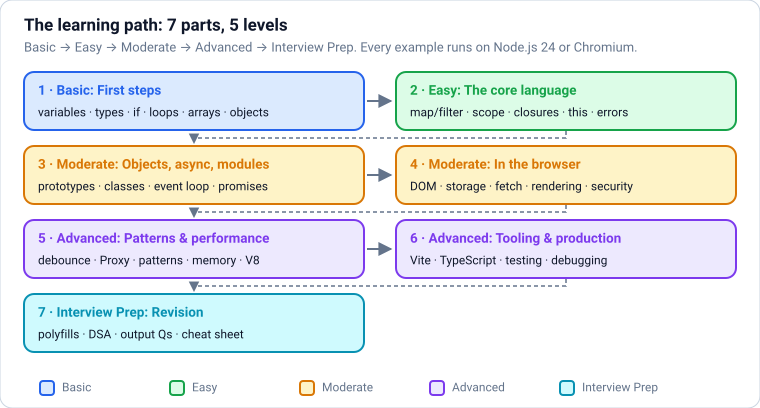
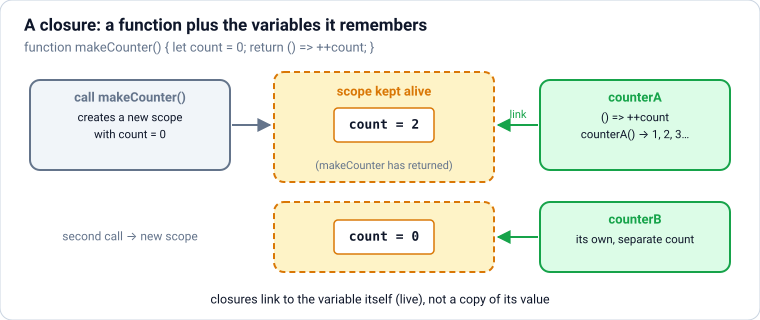
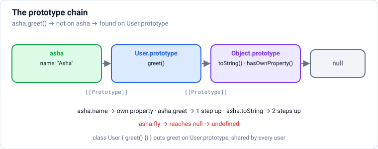
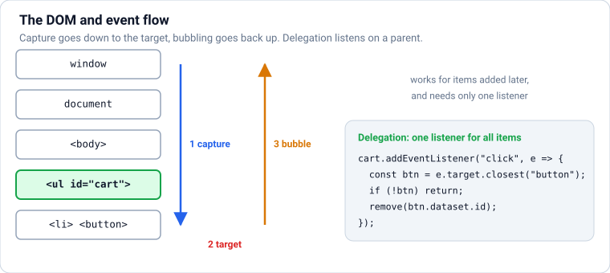
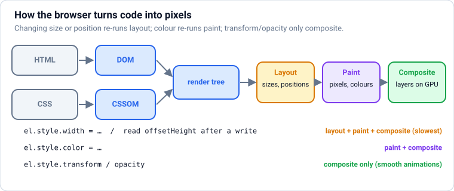
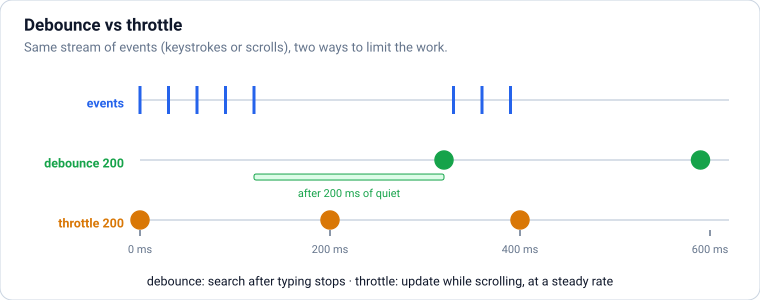

# JavaScript: From Absolute Basics to Production

JavaScript from zero, in **levels**: **Basic** (running code, variables, types, operators, decisions, loops, strings, arrays, objects, functions) → **Easy** (array methods, destructuring, scope, closures, `this`, coercion, errors) → **Moderate** (objects and prototypes, classes, Map/Set, generators, the event loop, promises, async/await, modules, regex, dates; then the browser: DOM and events, storage, Web APIs, files, rendering, fetch and CORS, security) → **Advanced** (functional patterns, debounce/throttle, Proxy, design patterns, memory, performance, modern ES2025 features, tooling, testing, debugging, production code) → **Interview Prep**. **Each part uses only what earlier parts taught.**

Every section has the same shape: a **picture** where it helps, **theory** in plain words, **JavaScript** examples, **common mistakes**, and **practice** with hidden answers and links. Every example was run on **Node.js 24 LTS**, and browser examples in **headless Chromium** against a real local server; the text under **Output** is exactly what they printed. Blocks within one section share their variables, like cells in a notebook.

Each part ends with a ✅ **checkpoint**. After this file: `typescript.md` for types, `react.md` for user interfaces and `nodejs.md` for servers.

## Table of Contents

**[Part 1 — Basic: First Steps](#part-1--basic-first-steps)**

1. [Getting Started: What JavaScript Is and Your First Program](#1-getting-started-what-javascript-is-and-your-first-program)
2. [Variables: let, const and var](#2-variables-let-const-and-var)
3. [Data Types: Primitives, Objects, null and undefined](#3-data-types-primitives-objects-null-and-undefined)
4. [Operators: Arithmetic, Comparison, Logical, ?? and ?.](#4-operators-arithmetic-comparison-logical--and-)
5. [Decisions: if, else, switch and the Ternary Operator](#5-decisions-if-else-switch-and-the-ternary-operator)
6. [Loops: for, while, for...of and for...in](#6-loops-for-while-forof-and-forin)
7. [Strings and Template Literals](#7-strings-and-template-literals)
8. [Arrays: Ordered Lists](#8-arrays-ordered-lists)
9. [Objects: Grouping Data with Keys](#9-objects-grouping-data-with-keys)
10. [Functions: Declarations, Expressions, Arrows and Parameters](#10-functions-declarations-expressions-arrows-and-parameters)

**[Part 2 — Easy: The Core Language](#part-2--easy-the-core-language)**

11. [Array Methods: map, filter, reduce, find and Friends](#11-array-methods-map-filter-reduce-find-and-friends)
12. [Destructuring, Spread and Rest](#12-destructuring-spread-and-rest)
13. [Scope, Hoisting and the Temporal Dead Zone](#13-scope-hoisting-and-the-temporal-dead-zone)
14. [Closures](#14-closures)
15. [The this Keyword, call, apply and bind](#15-the-this-keyword-call-apply-and-bind)
16. [Type Conversion, Coercion and == vs ===](#16-type-conversion-coercion-and--vs-)
17. [Error Handling: try, catch, throw and Custom Errors](#17-error-handling-try-catch-throw-and-custom-errors)

**[Part 3 — Moderate: Objects, Async and Modules](#part-3--moderate-objects-async-and-modules)**

18. [Objects in Depth: Copying, Property Descriptors, Getters/Setters and Immutability](#18-objects-in-depth-copying-property-descriptors-getterssetters-and-immutability)
19. [Prototypes and Prototypal Inheritance](#19-prototypes-and-prototypal-inheritance)
20. [Classes: Fields, Private Members, Static, Inheritance and OOP](#20-classes-fields-private-members-static-inheritance-and-oop)
21. [Map, Set, WeakMap, WeakSet and Symbol](#21-map-set-weakmap-weakset-and-symbol)
22. [Iterators, Generators and Iterator Helpers](#22-iterators-generators-and-iterator-helpers)
23. [How JavaScript Runs: Call Stack, Event Loop, Tasks and Microtasks](#23-how-javascript-runs-call-stack-event-loop-tasks-and-microtasks)
24. [Callbacks and Promises](#24-callbacks-and-promises)
25. [async/await: Asynchronous Code That Reads Like Normal Code](#25-asyncawait-asynchronous-code-that-reads-like-normal-code)
26. [Modules: import, export, ESM vs CommonJS](#26-modules-import-export-esm-vs-commonjs)
27. [Regular Expressions](#27-regular-expressions)
28. [Dates, Time Zones, Numbers and Intl](#28-dates-time-zones-numbers-and-intl)

**[Part 4 — Moderate: JavaScript in the Browser](#part-4--moderate-javascript-in-the-browser)**

29. [The DOM and Events](#29-the-dom-and-events)
30. [Browser Storage: localStorage, sessionStorage, Cookies and IndexedDB](#30-browser-storage-localstorage-sessionstorage-cookies-and-indexeddb)
31. [Web APIs: fetch, AbortController, URL, Observers and Workers](#31-web-apis-fetch-abortcontroller-url-observers-and-workers)
32. [Files, Blobs, Binary Data and Streams](#32-files-blobs-binary-data-and-streams)
33. [How Browsers Render Pages: Critical Path, Reflow, Web Components and Service Workers](#33-how-browsers-render-pages-critical-path-reflow-web-components-and-service-workers)
34. [Networking for Frontend Developers: From URL to Page, HTTP, Caching and CORS](#34-networking-for-frontend-developers-from-url-to-page-http-caching-and-cors)
35. [Frontend Security: XSS, CSRF, CSP, Prototype Pollution and the Supply Chain](#35-frontend-security-xss-csrf-csp-prototype-pollution-and-the-supply-chain)

**[Part 5 — Advanced: Patterns and Performance](#part-5--advanced-patterns-and-performance)**

36. [Functional Programming: Pure Functions, Immutability, Currying and Composition](#36-functional-programming-pure-functions-immutability-currying-and-composition)
37. [Debounce and Throttle](#37-debounce-and-throttle)
38. [Proxy and Reflect](#38-proxy-and-reflect)
39. [Design Patterns in JavaScript](#39-design-patterns-in-javascript)
40. [Memory Management, Garbage Collection and Leaks](#40-memory-management-garbage-collection-and-leaks)
41. [Performance: How V8 Runs Your Code and How to Make It Fast](#41-performance-how-v8-runs-your-code-and-how-to-make-it-fast)
42. [Modern JavaScript: What's New in ES2020–ES2026](#42-modern-javascript-whats-new-in-es2020es2026)

**[Part 6 — Advanced: Tooling, Testing and Production](#part-6--advanced-tooling-testing-and-production)**

43. [Tooling: npm, Package Managers, Bundlers, Linters and TypeScript](#43-tooling-npm-package-managers-bundlers-linters-and-typescript)
44. [Testing JavaScript: Unit, Integration and End-to-End](#44-testing-javascript-unit-integration-and-end-to-end)
45. [Debugging JavaScript](#45-debugging-javascript)
46. [Production-Grade JavaScript: Code Quality, Refactoring and Reliability](#46-production-grade-javascript-code-quality-refactoring-and-reliability)

**[Part 7 — Interview Prep: Revision](#part-7--interview-prep-revision)**

47. [Polyfills and "Implement It Yourself" Questions](#47-polyfills-and-implement-it-yourself-questions)
48. [DSA in JavaScript: Toolbox and Classic Coding Questions](#48-dsa-in-javascript-toolbox-and-classic-coding-questions)
49. [Output-Based Questions (Predict the Output)](#49-output-based-questions-predict-the-output)
50. [JavaScript Cheat Sheet](#50-javascript-cheat-sheet)
51. [Most Asked JavaScript Interview Questions](#51-most-asked-javascript-interview-questions)

---

# Part 1 — Basic: First Steps

> **Goal:** Run JavaScript, store values, use operators, make decisions, repeat with loops, and work with strings, arrays, objects and functions.  
> **You need:** Nothing: this is the very beginning.

---

## 1. Getting Started: What JavaScript Is and Your First Program



### Theory

> **In simple words:** **JavaScript** (JS) is the programming language of the web. Every website you use runs JavaScript in your browser to make pages interactive: buttons that respond, menus that open, live chat, maps you can drag. The same language also runs on **servers** (Node.js, Deno, Bun), in **mobile and desktop apps** (React Native, Electron), and in serverless functions. If you learn one language to build products people can see and use, JavaScript (and its typed version, TypeScript) is the one.

**How these notes are organised:**

| Part | Level | You learn |
|---|---|---|
| 1 | Basic | Running JS, variables, types, operators, decisions, loops, strings, arrays, objects, functions |
| 2 | Easy | Array methods, destructuring and spread, scope and hoisting, closures, `this`, type coercion, errors |
| 3 | Moderate | Objects in depth, prototypes, classes, Map/Set/Symbol, iterators and generators, the event loop, promises, async/await, modules, regex, dates and Intl |
| 4 | Moderate | JavaScript in the browser: the DOM and events, storage and cookies, Web APIs, files and binary data, rendering, networking, security |
| 5 | Advanced | Functional programming, debounce/throttle, Proxy and Reflect, design patterns, memory and garbage collection, engine internals, performance, modern ES2020–ES2026 features |
| 6 | Advanced | Tooling (npm, bundlers, linters), testing, debugging, production-grade code |
| 7 | Interview Prep | Polyfills, DSA in JS, output questions, cheat sheet, most-asked questions |

**About the examples:** every example that doesn't need a browser was run with **Node.js 24 (LTS)**, and the text under **Output** is exactly what it printed. Browser-only examples (DOM, storage, service workers) are marked and show no invented output; try them in your browser's console.

**Where JavaScript runs:**

| Environment | Engine | Adds |
|---|---|---|
| Browsers (Chrome, Edge, Firefox, Safari) | V8, SpiderMonkey, JavaScriptCore | `document` (the DOM), `window`, `fetch`, storage, events |
| **Node.js** | V8 | Files, network servers, processes (`node:fs`, `node:http`), npm packages |
| Deno, Bun | V8, JavaScriptCore | TypeScript out of the box, fast tooling |

The **language** itself (variables, functions, objects, promises) is standardised as **ECMAScript**; a new edition comes out every June (ES2025, ES2026…). Environments add their own **APIs** on top.

**Running JavaScript:**

- **Browser console:** open DevTools (F12 or Ctrl/Cmd+Shift+I) → Console, type `console.log("hi")`.
- **Node.js:** install the LTS version (nodejs.org, or a version manager like `fnm`/`nvm`/`volta`), save code in `hello.js`, run `node hello.js`. `node` alone opens an interactive REPL.
- **In a web page:** `<script src="app.js" type="module"></script>` at the end of `<body>`.

**Building blocks you'll use from day one:** `console.log(...)` prints values; `//` starts a comment (and `/* ... */` for several lines); statements end with `;` (optional in many cases, but the notes always use them for clarity); code blocks are grouped with `{ }`; names are case-sensitive.

### JavaScript

```js
// My first program
console.log("Hello, world!");
console.log("JavaScript", "is", "fun");      // several values are separated by spaces
console.log(2 + 3, 10 / 4, 7 * 6);            // JS is also a calculator
console.log(`Today is ${new Date(2026, 8, 25).toDateString()}`);   // a template string (explained in the strings section)
console.log(typeof "hi", typeof 42, typeof true);
```

**Output:**

```text
Hello, world!
JavaScript is fun
5 2.5 42
Today is Fri Sep 25 2026
string number boolean
```

Errors are normal; read the **type** and **message**:

```js
try {
  undefinedFunction();
} catch (err) {
  console.log(err.name, "-", err.message);
}
try {
  null.length;
} catch (err) {
  console.log(err.name, "-", err.message);
}
```

**Output:**

```text
ReferenceError - undefinedFunction is not defined
TypeError - Cannot read properties of null (reading 'length')
```

(`try`/`catch`, used here to catch errors and keep going, is explained in Section [17](#17-error-handling-try-catch-throw-and-custom-errors).)

| Error | Usually means |
|---|---|
| `SyntaxError` | The code isn't valid JavaScript (a missing bracket or quote) |
| `ReferenceError` | A name that doesn't exist (typo, or not declared) |
| `TypeError` | Using a value the wrong way (calling a non-function, reading a property of `null`/`undefined`) |
| `RangeError` | A number out of range (e.g. an invalid array length, too-deep recursion) |

**Common mistakes:**

- ❌ Loading scripts in `<head>` without `defer`/`type="module"` (they run before the page exists).
- ❌ Ignoring the console: errors are printed there, with the file and line.
- ❌ Confusing Java and JavaScript (unrelated languages with similar names).
- ❌ Copying code with "smart quotes" from documents.

### Practice

1. Print your name and city on one line, the number of seconds in a day, and the type of the value `3.14`.

<details>
<summary><b>Answer</b></summary>

```js
console.log("Asha", "Pune");
console.log(24 * 60 * 60);
console.log(typeof 3.14);
```

**Output:**

```text
Asha Pune
86400
number
```

</details>

**Learn more:** [MDN: JavaScript guide](https://developer.mozilla.org/en-US/docs/Web/JavaScript/Guide) · [javascript.info](https://javascript.info/) · [Node.js: introduction](https://nodejs.org/en/learn/getting-started/introduction-to-nodejs)

---

## 2. Variables: let, const and var

### Theory

> **In simple words:** a **variable** is a **name** for a value, so you can use and change it later. Modern JavaScript gives you two keywords: **`const`** for a name that will always point to the same value, and **`let`** for a name whose value will change. The old keyword **`var`** still works but behaves in surprising ways, so modern code avoids it.

| Keyword | Can reassign? | Scope | Use |
|---|---|---|---|
| `const` | No | Block `{ }` | **Default choice** |
| `let` | Yes | Block `{ }` | Counters, values that change |
| `var` | Yes | Whole function (ignores blocks) | Old code only |

**`const` doesn't mean "frozen":** `const cart = []` means `cart` always points to the same array, but the array's **contents** can change (`cart.push("pen")`). To prevent changes to the contents use `Object.freeze`.

**Block scope:** `let` and `const` exist only inside the `{ }` where they're declared (an `if`, a loop, a function). `var` leaks out of blocks, which causes bugs, especially in loops with callbacks (Section [14](#14-closures)).

**Naming:** letters, digits, `_` and `$`; can't start with a digit; case-sensitive; can't be a reserved word (`class`, `return`, `let`…). Style: `camelCase` for variables and functions (`totalPrice`), `PascalCase` for classes (`ShoppingCart`), `UPPER_SNAKE_CASE` for true constants (`MAX_RETRIES`).

**Declaring before use:** using a `let`/`const` name before its declaration line throws a `ReferenceError` (the "temporal dead zone", Section [13](#13-scope-hoisting-and-the-temporal-dead-zone)).

### JavaScript

```js
const shopName = "ShopKart";
let visitors = 0;
visitors = visitors + 1;
visitors += 1;                          // shortcut
visitors++;                             // add 1
console.log(shopName, visitors);

try {
  shopName = "Other";                   // const can't be reassigned
} catch (err) {
  console.log(err.name, "-", err.message);
}

const cart = ["pen"];
cart.push("notebook");                  // allowed: the SAME array, new contents
console.log(cart);

if (true) {
  let insideLet = "block only";
  var insideVar = "leaks out";
}
console.log(typeof insideLet, insideVar);   // insideLet doesn't exist out here

let a = 1, b = 2;
[a, b] = [b, a];                        // swap (destructuring, Part 2)
console.log(a, b);
```

**Output:**

```text
ShopKart 3
TypeError - Assignment to constant variable.
[ 'pen', 'notebook' ]
undefined leaks out
2 1
```

**Common mistakes:**

- ❌ Using `var` in new code.
- ❌ Using `let` everywhere "just in case"; `const` makes intent clear and prevents accidental reassignment.
- ❌ Thinking `const` objects/arrays can't change.
- ❌ Forgetting `let`/`const` entirely (`total = 5` creates an accidental global in sloppy mode; an error in strict mode/modules).

### Practice

1. Declare the price of a pen (₹20) and a quantity that starts at 1; increase the quantity three times, then print the total. Which variables should be `const`?

<details>
<summary><b>Answer</b></summary>

```js
const PEN_PRICE = 20;
let quantity = 1;
quantity++;
quantity++;
quantity++;
console.log(PEN_PRICE * quantity);
```

**Output:**

```text
80
```

The price never changes, so it's `const`; the quantity changes, so it's `let`.

</details>

**Learn more:** [MDN: let](https://developer.mozilla.org/en-US/docs/Web/JavaScript/Reference/Statements/let) · [MDN: const](https://developer.mozilla.org/en-US/docs/Web/JavaScript/Reference/Statements/const) · [javascript.info: variables](https://javascript.info/variables)

---

## 3. Data Types: Primitives, Objects, null and undefined

### Theory

> **In simple words:** every value in JavaScript has a **type**. There are seven simple, unchangeable ones called **primitives**: numbers, strings (text), booleans (true/false), `undefined`, `null`, BigInt (huge whole numbers) and Symbol (unique ids). Everything else is an **object**: arrays, functions, dates, and your own `{ }` objects. `typeof value` tells you the type (with two famous quirks).

| Type | Examples | Notes |
|---|---|---|
| `number` | `42`, `3.14`, `-7`, `NaN`, `Infinity` | One type for integers and decimals (64-bit floating point) |
| `bigint` | `9007199254740993n` | Exact integers of any size (append `n`) |
| `string` | `"hi"`, `'hi'`, `` `hi ${name}` `` | Immutable text |
| `boolean` | `true`, `false` | |
| `undefined` | `undefined` | "No value yet": unassigned variables, missing properties, functions without `return` |
| `null` | `null` | "Deliberately empty", set by the programmer |
| `symbol` | `Symbol("id")` | Unique, used as special object keys (Part 3) |
| `object` | `{}`, `[]`, `new Date()`, functions | Collections and structures; passed **by reference** |

**`typeof` quirks:** `typeof null` is `"object"` (a 1995 bug kept forever); `typeof function(){}` is `"function"`. To check for an array use `Array.isArray(x)`; for null, `x === null`.

**Numbers you must know:**

- `0.1 + 0.2` is `0.30000000000000004` (binary floating point; same as Python). Use integers of paise/cents for money, or `toFixed` for display.
- Integers are exact only up to `Number.MAX_SAFE_INTEGER` (2⁵³ − 1 ≈ 9 × 10¹⁵); beyond that use BigInt (e.g. 64-bit ids from databases often arrive as strings for this reason).
- `NaN` ("not a number") comes from invalid maths (`"abc" * 2`) and is **not equal to itself**; test with `Number.isNaN(x)`.
- Division by zero gives `Infinity`, not an error.

**Primitives vs objects (value vs reference):** copying a primitive copies the value; copying an object copies the **reference**, so two variables can point to the same object, and changing it through one is visible through the other.

### JavaScript

```js
console.log(typeof 42, typeof 3.14, typeof 10n, typeof "hi", typeof true);
console.log(typeof undefined, typeof null, typeof {}, typeof [], typeof (() => 1), typeof Symbol("id"));
console.log(Array.isArray([]), Array.isArray({}));

console.log(0.1 + 0.2, (0.1 + 0.2).toFixed(2), 0.1 * 3 === 0.3);
console.log(Number.MAX_SAFE_INTEGER, 2 ** 53 + 1, 2n ** 53n + 1n);
console.log("abc" * 2, NaN === NaN, Number.isNaN("abc" * 2), 1 / 0, -1 / 0);

let notSet;
const person = { name: "Asha" };
console.log(notSet, person.age, person.name);

let a = 5;
let b = a;           // copies the value
b = 99;
const o1 = { count: 1 };
const o2 = o1;       // copies the reference: same object
o2.count = 99;
console.log(a, o1.count, o1 === o2, { count: 99 } === { count: 99 });
```

**Output:**

```text
number number bigint string boolean
undefined object object object function symbol
true false
0.30000000000000004 0.30 false
9007199254740991 9007199254740992 9007199254740993n
NaN false true Infinity -Infinity
undefined undefined Asha
5 99 true false
```

The last line shows why two objects with the same contents aren't `===`: comparison checks whether they're the **same object**, not whether they look alike.

**Common mistakes:**

- ❌ `typeof x === "object"` to detect objects (true for `null` and arrays too).
- ❌ Comparing with `NaN` using `===`; use `Number.isNaN`.
- ❌ Floats for money; unsafe integers for ids.
- ❌ Expecting `===` to compare objects' contents.

### Practice

1. Write `describe(value)` that returns `"null"`, `"array"` or the `typeof` result, and test it with `null`, `[1]`, `{}`, `"x"`, `5n` and `undefined`.

<details>
<summary><b>Answer</b></summary>

```js
function describe(value) {
  if (value === null) return "null";
  if (Array.isArray(value)) return "array";
  return typeof value;
}
console.log([null, [1], {}, "x", 5n, undefined].map(describe));
```

**Output:**

```text
[ 'null', 'array', 'object', 'string', 'bigint', 'undefined' ]
```

(`function` and `.map` are covered later in Part 1 and Part 2; here they just run `describe` on each value.)

</details>

**Learn more:** [MDN: JavaScript data types](https://developer.mozilla.org/en-US/docs/Web/JavaScript/Data_structures) · [javascript.info: data types](https://javascript.info/types)

---

## 4. Operators: Arithmetic, Comparison, Logical, ?? and ?.

### Theory

> **In simple words:** operators are the symbols that combine values: `+` adds, `===` compares, `&&` means "and". JavaScript also has two modern safety operators you'll use constantly: **`??`** ("use this default if the value is missing") and **`?.`** ("read this property only if the object exists").

**Arithmetic:** `+ - * /`, `%` (remainder), `**` (power), `++`/`--`. `+` also joins strings, and if either side is a string, it joins (`"5" + 3` is `"53"`).

**Comparison:** always use **`===`** and **`!==`** (strict: same type and value). The loose `==` converts types first and has confusing rules (Section [16](#16-type-conversion-coercion-and--vs-)). `<`, `>`, `<=`, `>=` compare numbers, and strings alphabetically by character codes (`"Z" < "a"`).

**Logical:** `&&` (and), `||` (or), `!` (not). They **short-circuit** and return one of the operands, not necessarily a boolean: `a || b` returns `a` if it's truthy, otherwise `b`; `a && b` returns `a` if it's falsy, otherwise `b`.

**Falsy values:** `false`, `0`, `-0`, `0n`, `""`, `null`, `undefined`, `NaN`. Everything else is truthy (including `"0"`, `[]` and `{}`).

**`??` (nullish coalescing):** `value ?? fallback` uses the fallback only when `value` is `null` or `undefined`. Prefer it over `||` for defaults, because `||` also replaces valid values like `0` and `""`.

**`?.` (optional chaining):** `order?.customer?.city` returns `undefined` instead of throwing if `order` or `customer` is missing; `fn?.()` calls only if the function exists; `arr?.[0]` for indexes.

**Assignment shortcuts:** `+=`, `-=`, `*=`, `??=` (assign only if null/undefined), `||=`, `&&=`.

**Ternary:** `condition ? valueIfTrue : valueIfFalse`.

### JavaScript

```js
console.log(7 % 3, 2 ** 10, 7 / 2, Math.floor(7 / 2));
console.log("5" + 3, "5" - 3, 5 + 3 + "px", "px" + 5 + 3);
console.log(5 === 5, 5 === "5", 5 == "5", "apple" < "banana", "Zebra" < "apple");

console.log("" || "default", 0 || 10, null || "x");       // || replaces ANY falsy value
console.log("" ?? "default", 0 ?? 10, null ?? "x");       // ?? only replaces null/undefined
console.log(true && "shown", 0 && "never", !"text", !!"text");

const order = { id: 90312, customer: { name: "Asha" } };
const empty = null;
console.log(order.customer?.name, order.shipping?.city, empty?.customer?.name, order.notify?.());

const settings = { theme: null, pageSize: 0 };
settings.theme ??= "light";            // was null → set
settings.pageSize ||= 20;              // 0 is falsy → replaced (maybe not what you wanted!)
console.log(settings);

const age = 17;
console.log(age >= 18 ? "adult" : "minor");
```

**Output:**

```text
1 1024 3.5 3
53 2 8px px53
true false true true true
default 10 x
 0 x
shown 0 false true
Asha undefined undefined undefined
{ theme: 'light', pageSize: 20 }
minor
```

**Common mistakes:**

- ❌ `==` instead of `===`.
- ❌ `count || 10` when `count` may legitimately be `0`; use `??`.
- ❌ `"5" + 3` when you meant arithmetic; convert with `Number("5")` first.
- ❌ Overusing `?.` to hide bugs where a value should always exist.

### Practice

1. A settings object from an API may be missing fields: `const api = { volume: 0, user: { prefs: { lang: "" } } }`. Read `volume` with a default of 50, `lang` with a default of `"en"` (empty string counts as "not chosen"), and `theme` from `api.user.prefs.theme` with a default of `"dark"`.

<details>
<summary><b>Answer</b></summary>

```js
const api = { volume: 0, user: { prefs: { lang: "" } } };
const volume = api.volume ?? 50;                 // 0 is a valid volume: keep it
const lang = api.user?.prefs?.lang || "en";      // "" means not chosen: || is right here
const theme = api.user?.prefs?.theme ?? "dark";
console.log(volume, lang, theme);
```

**Output:**

```text
0 en dark
```

</details>

**Learn more:** [MDN: expressions and operators](https://developer.mozilla.org/en-US/docs/Web/JavaScript/Guide/Expressions_and_operators) · [MDN: nullish coalescing](https://developer.mozilla.org/en-US/docs/Web/JavaScript/Reference/Operators/Nullish_coalescing) · [MDN: optional chaining](https://developer.mozilla.org/en-US/docs/Web/JavaScript/Reference/Operators/Optional_chaining)

---

## 5. Decisions: if, else, switch and the Ternary Operator

### Theory

> **In simple words:** programs make choices: *if* the cart is empty show a message, *else* show the total. `if` runs a block only when its condition is truthy; `else if` checks another condition; `else` handles everything else. `switch` compares one value against many fixed cases. For choosing between two **values**, the ternary `cond ? a : b` is shorter.

**Shape:**

```text
if (condition) {
  ...runs when condition is truthy
} else if (other) {
  ...
} else {
  ...
}
```

Only the **first** matching branch runs. Always use braces `{ }`, even for one line (avoids bugs when lines are added later).

**Truthiness:** conditions don't need to be booleans; `if (items.length)`, `if (user)`, `if (name)` rely on truthy/falsy values (Section [4](#4-operators-arithmetic-comparison-logical--and-)). Be careful when `0` or `""` are valid values.

**`switch`** uses `===` to compare, and **falls through** to the next case unless you `break` (or `return`). Group cases by stacking them. `default` handles the rest. For mapping values to results, an **object lookup** (`const labels = { paid: "Paid", ... }`) is often cleaner than a long switch.

**Guard clauses:** in functions, handle the special cases first and `return` early; the main logic then isn't nested inside several `if`s.

### JavaScript

```js
function shippingFee(total, isMember) {
  if (isMember) {
    return 0;                              // guard clause: return early
  }
  if (total >= 499) {
    return 0;
  } else if (total >= 200) {
    return 20;
  } else {
    return 40;
  }
}
console.log(shippingFee(100, false), shippingFee(250, false), shippingFee(600, false), shippingFee(50, true));

function statusLabel(status) {
  switch (status) {
    case "pending":
    case "processing":                     // two cases share one result
      return "On its way to being shipped";
    case "shipped":
      return "Shipped";
    case "delivered":
      return "Delivered";
    default:
      return "Unknown status";
  }
}
console.log(statusLabel("processing"), "|", statusLabel("delivered"), "|", statusLabel("lost"));

const LABELS = { pending: "Pending", shipped: "Shipped" };   // a lookup table instead of switch
console.log(LABELS["shipped"], LABELS["lost"] ?? "Unknown");

const stock = 0;
console.log(stock > 0 ? `${stock} left` : "Out of stock");

let day = 3, name;
switch (day) {
  case 1: name = "Mon";
  case 2: name = "Tue";                    // no break: falls through!
  case 3: name = "Wed";
  case 4: name = "Thu";
}
console.log(name);
```

**Output:**

```text
40 20 0 0
On its way to being shipped | Delivered | Unknown status
Shipped Unknown
Out of stock
Thu
```

(`function` and `return` are covered in Section [10](#10-functions-declarations-expressions-arrows-and-parameters); here they let us try several inputs.) The last example prints "Thu": without `break`, execution falls through every case after the match.

**Common mistakes:**

- ❌ Missing `break` in `switch`.
- ❌ `if (x = 5)` (assignment) instead of `===`.
- ❌ Deeply nested `if`/`else` instead of guard clauses or lookup tables.
- ❌ `if (count)` when `count` can be a valid `0`.

### Practice

1. Write `grade(score)` returning `"A"` (≥ 90), `"B"` (≥ 75), `"C"` (≥ 50) or `"F"`, and `"invalid"` for scores below 0 or above 100 (check that first). Test with -5, 95, 75, 49 and 101.

<details>
<summary><b>Answer</b></summary>

```js
function grade(score) {
  if (score < 0 || score > 100) return "invalid";
  if (score >= 90) return "A";
  if (score >= 75) return "B";
  if (score >= 50) return "C";
  return "F";
}
console.log([-5, 95, 75, 49, 101].map(grade));
```

**Output:**

```text
[ 'invalid', 'A', 'B', 'F', 'invalid' ]
```

</details>

**Learn more:** [MDN: if...else](https://developer.mozilla.org/en-US/docs/Web/JavaScript/Reference/Statements/if...else) · [MDN: switch](https://developer.mozilla.org/en-US/docs/Web/JavaScript/Reference/Statements/switch)

---

## 6. Loops: for, while, for...of and for...in

### Theory

> **In simple words:** a **loop** repeats code: once for each item in a list, or until a condition changes. JavaScript has the classic counting `for` loop, `while` loops, and the modern **`for...of`**, which walks through the **values** of anything iterable (arrays, strings, maps, sets). Later you'll often replace loops with array methods like `map` and `filter` (Section [11](#11-array-methods-map-filter-reduce-find-and-friends)), but loops remain the most flexible tool.

| Loop | Use |
|---|---|
| `for (let i = 0; i < n; i++) { }` | Counting, when you need the index |
| `for (const item of items) { }` | **Values** of arrays, strings, Maps, Sets (the usual choice) |
| `for (const key in obj) { }` | **Keys** of an object (prefer `Object.keys/entries`; never use for arrays) |
| `while (cond) { }` | Repeat until something changes |
| `do { } while (cond)` | Like while, but runs at least once |

**Control:** `break` exits the loop; `continue` skips to the next round; **labels** (`outer:`) let `break outer` exit nested loops.

**Always use `let` (or `const` in `for...of`) for loop variables**, never `var`: each round then gets its own variable, which matters for callbacks (Section [14](#14-closures)).

### JavaScript

```js
for (let i = 1; i <= 3; i++) {
  console.log("round", i);
}

const fruits = ["apple", "banana", "cherry"];
for (const fruit of fruits) {
  console.log(fruit.toUpperCase());
}
for (const [index, fruit] of fruits.entries()) {    // index and value together
  console.log(index, fruit);
}
for (const ch of "Hi!") {
  console.log(ch);
}

const prices = { pen: 20, bag: 899 };
for (const key in prices) {
  console.log(key, prices[key]);
}

let total = 0;
for (let n = 1; n <= 100; n++) {
  if (n % 2 === 0) continue;                         // skip even numbers
  total += n;
}
console.log("sum of odd numbers 1..100:", total);

let attempts = 0;
while (attempts < 5) {
  attempts++;
  if (attempts === 3) break;
}
console.log("stopped after", attempts);

outer: for (let r = 0; r < 3; r++) {
  for (let c = 0; c < 3; c++) {
    if (r * c === 2) {
      console.log("found at", r, c);
      break outer;                                   // leave BOTH loops
    }
  }
}
```

**Output:**

```text
round 1
round 2
round 3
APPLE
BANANA
CHERRY
0 apple
1 banana
2 cherry
H
i
!
pen 20
bag 899
sum of odd numbers 1..100: 2500
stopped after 3
found at 1 2
```

**Common mistakes:**

- ❌ `for...in` over arrays (gives string indexes, includes inherited keys); use `for...of`.
- ❌ Off-by-one: `i <= arr.length` reads past the end.
- ❌ Infinite `while` loops that never change the condition.
- ❌ Modifying an array (adding/removing) while looping over it.

### Practice

1. Print a right-angled triangle of `*` with 4 rows using nested loops, then find the first number above 100 divisible by both 7 and 9 using a `while` loop.

<details>
<summary><b>Answer</b></summary>

```js
for (let row = 1; row <= 4; row++) {
  let line = "";
  for (let i = 0; i < row; i++) line += "*";
  console.log(line);
}
let n = 101;
while (n % 7 !== 0 || n % 9 !== 0) n++;
console.log(n);
```

**Output:**

```text
*
**
***
****
126
```

</details>

**Learn more:** [MDN: loops and iteration](https://developer.mozilla.org/en-US/docs/Web/JavaScript/Guide/Loops_and_iteration) · [javascript.info: loops](https://javascript.info/while-for)

---

## 7. Strings and Template Literals

### Theory

> **In simple words:** a **string** is text. JavaScript strings are **immutable** (methods return new strings), are indexed from 0, and come with many built-in methods for searching, slicing, changing case and trimming. **Template literals** (backticks `` ` ``) let you insert values with `${...}` and write multi-line text, and are the modern way to build strings.

**Creating:** `"double"`, `'single'` (identical), `` `template ${expr}` ``. Escapes: `\n`, `\t`, `\\`, `\"`.

**Most-used methods:**

| Method | Does |
|---|---|
| `length`, `s[i]`, `s.at(-1)` | Length; a character; negative index from the end |
| `slice(start, end)` | Part of the string (end excluded; negatives count from the end) |
| `includes`, `startsWith`, `endsWith`, `indexOf` | Search |
| `toUpperCase`, `toLowerCase` | Case |
| `trim`, `trimStart`, `trimEnd` | Remove whitespace |
| `split(sep)`, `array.join(sep)` | Text ↔ array |
| `replace(a, b)`, `replaceAll(a, b)` | Replace first / all (regex too, Section [27](#27-regular-expressions)) |
| `padStart(n, ch)`, `padEnd` | Pad to a width (`"7".padStart(3, "0")` → `"007"`) |
| `repeat(n)` | Repeat |
| `localeCompare` | Language-aware sorting/comparison |

**Unicode:** strings are UTF-16 internally; most characters are one "code unit", but emoji and some scripts use two, so `"👍".length` is 2. Use `[...str]` or `Array.from(str)` to iterate by code point, and `Intl.Segmenter` for user-perceived characters.

**Tagged templates** (`` html`<p>${x}</p>` ``) call a function with the literal parts and values separately, used for safe HTML/SQL building (similar in spirit to Python 3.14's t-strings).

### JavaScript

```js
const city = "Bengaluru";
console.log(city.length, city[0], city.at(-1), city.slice(0, 4), city.slice(-4));
console.log(city.toUpperCase(), city.includes("galu"), city.startsWith("Ben"), city.indexOf("u"));
console.log("  padded  ".trim() + "|", "a,b,,c".split(","), ["x", "y", "z"].join(" + "));
console.log("cat hat cat".replace("cat", "dog"), "|", "cat hat cat".replaceAll("cat", "dog"));
console.log("7".padStart(3, "0"), "ab".repeat(3), "Order".padEnd(8, ".") + "90312");

const name = "Asha", items = 3, total = 1497;
const message = `Hi ${name}, you have ${items} items.
Total: ₹${total.toLocaleString("en-IN")} (${items > 2 ? "free shipping" : "₹40 shipping"})`;
console.log(message);

console.log("👍".length, [..."👍🏽ok"].length, "é".normalize("NFD").length);
const upper = city.toUpperCase();
console.log(city, upper);                       // the original is unchanged (immutable)
```

**Output:**

```text
9 B u Beng luru
BENGALURU true true 6
padded| [ 'a', 'b', '', 'c' ] x + y + z
dog hat cat | dog hat dog
007 ababab Order...90312
Hi Asha, you have 3 items.
Total: ₹1,497 (free shipping)
2 4 2
Bengaluru BENGALURU
```

**Common mistakes:**

- ❌ Expecting `str.toUpperCase()` to change `str`.
- ❌ `replace` when you meant `replaceAll` (only the first match is replaced).
- ❌ Building HTML with templates from user input (XSS, Section [35](#35-frontend-security-xss-csrf-csp-prototype-pollution-and-the-supply-chain)).
- ❌ Counting characters with `.length` for emoji-heavy text.

### Practice

1. Turn `"  asha RAO  "` into `"Asha Rao"` (trim, split on spaces, capitalise each part), and format an order id `42` as `"ORD-00042"`.

<details>
<summary><b>Answer</b></summary>

```js
const raw = "  asha RAO  ";
const pretty = raw.trim().split(" ").map(w => w[0].toUpperCase() + w.slice(1).toLowerCase()).join(" ");
console.log(pretty, `ORD-${String(42).padStart(5, "0")}`);
```

(`.map(w => ...)` applies a small function to each word; arrow functions and `map` are explained in the next few sections.)

**Output:**

```text
Asha Rao ORD-00042
```

</details>

**Learn more:** [MDN: String](https://developer.mozilla.org/en-US/docs/Web/JavaScript/Reference/Global_Objects/String) · [MDN: template literals](https://developer.mozilla.org/en-US/docs/Web/JavaScript/Reference/Template_literals)

---

## 8. Arrays: Ordered Lists

### Theory

> **In simple words:** an **array** is an ordered list of values in square brackets: `const scores = [90, 72, 85]`. Items are numbered from 0. You can add and remove items at either end, change items by position, search, sort and loop. Arrays are objects, so `const` arrays can still change, and copying a variable doesn't copy the array.

**Basics:** `arr.length`, `arr[0]`, `arr.at(-1)` (last), `arr[i] = x`, `Array.isArray(arr)`. Reading past the end gives `undefined` (no error).

**Adding/removing (these change the array):**

| Method | Does | Speed |
|---|---|---|
| `push(x)` / `pop()` | Add / remove at the end | Fast |
| `unshift(x)` / `shift()` | Add / remove at the start | Slow for big arrays (shifts everything) |
| `splice(start, deleteCount, ...items)` | Remove/insert anywhere | |
| `sort()`, `reverse()`, `fill()` | In place | |

**Not changing it:** `slice(start, end)` (a copy of part), `concat`, `indexOf`, `includes`, `join`, and the ES2023 copying versions **`toSorted()`, `toReversed()`, `toSpliced()`, `with(i, x)`**, which return new arrays and leave the original alone (great for React state, `react.md`).

**The sort trap:** `sort()` with no argument sorts **as strings**: `[10, 9, 1].sort()` gives `[1, 10, 9]`. Always pass a compare function for numbers: `sort((a, b) => a - b)`.

**Copies:** `[...arr]` or `arr.slice()` make a shallow copy (nested objects are still shared; Section [18](#18-objects-in-depth-copying-property-descriptors-getterssetters-and-immutability)).

**Creating arrays:** literals, `Array.from({ length: 5 }, (_, i) => i)`, `Array.of(...)`, `"a,b".split(",")`, `new Array(3).fill(0)`.

The most powerful array tools, `map`, `filter`, `reduce`, `find` and friends, get their own section (Section [11](#11-array-methods-map-filter-reduce-find-and-friends)).

### JavaScript

```js
const cart = ["pen", "notebook"];
cart.push("bag");
cart.unshift("stickers");
console.log(cart, cart.length, cart[0], cart.at(-1), cart[10]);
const removedLast = cart.pop();
const removedFirst = cart.shift();
console.log(removedLast, removedFirst, cart);

const letters = ["a", "b", "c", "d", "e"];
const removed = letters.splice(1, 2, "X");        // at index 1 remove 2 items, insert "X"
console.log(removed, letters);
console.log(letters.slice(1, 3), letters.includes("X"), letters.indexOf("d"), letters.join(""));

const nums = [10, 9, 1, 100];
console.log([...nums].sort(), [...nums].sort((a, b) => a - b));   // the string-sort trap vs numeric
const sorted = nums.toSorted((a, b) => b - a);    // new array, original untouched
console.log(sorted, nums, nums.with(0, 42), nums.toReversed());

const alias = nums;
const copy = [...nums];
alias.push(7);
console.log(nums.length, copy.length);
console.log(Array.from({ length: 5 }, (_, i) => i * i), new Array(3).fill(0));
```

**Output:**

```text
[ 'stickers', 'pen', 'notebook', 'bag' ] 4 stickers bag undefined
bag stickers [ 'pen', 'notebook' ]
[ 'b', 'c' ] [ 'a', 'X', 'd', 'e' ]
[ 'X', 'd' ] true 2 aXde
[ 1, 10, 100, 9 ] [ 1, 9, 10, 100 ]
[ 100, 10, 9, 1 ] [ 10, 9, 1, 100 ] [ 42, 9, 1, 100 ] [ 100, 1, 9, 10 ]
5 4
[ 0, 1, 4, 9, 16 ] [ 0, 0, 0 ]
```

**Common mistakes:**

- ❌ `sort()` on numbers without a compare function.
- ❌ Mutating arrays you received (e.g. React state, function arguments) when a copy was intended; use `toSorted`, spread, etc.
- ❌ `arr.length = 0` or `delete arr[i]` surprises (`delete` leaves a hole).
- ❌ `for...in` over arrays.

### Practice

1. Given `const temps = [31, 35, 29, 40, 33]`, print the three highest (without changing `temps`), the array with `29` replaced by `30` (also without changing it), and `temps` itself.

<details>
<summary><b>Answer</b></summary>

```js
const temps = [31, 35, 29, 40, 33];
console.log(temps.toSorted((a, b) => b - a).slice(0, 3));
console.log(temps.with(temps.indexOf(29), 30));
console.log(temps);
```

**Output:**

```text
[ 40, 35, 33 ]
[ 31, 35, 30, 40, 33 ]
[ 31, 35, 29, 40, 33 ]
```

</details>

**Learn more:** [MDN: Array](https://developer.mozilla.org/en-US/docs/Web/JavaScript/Reference/Global_Objects/Array) · [MDN: change array by copy (toSorted, with)](https://developer.mozilla.org/en-US/docs/Web/JavaScript/Reference/Global_Objects/Array/toSorted)

---

## 9. Objects: Grouping Data with Keys

### Theory

> **In simple words:** an **object** groups related values under names (**keys** or **properties**): `const user = { name: "Asha", age: 29, city: "Pune" }`. It's how JavaScript represents almost everything: a user, an order, a settings file, a JSON API response. You read and change properties with a dot (`user.name`) or brackets (`user["name"]`), and add or remove properties at any time.

**Basics:**

| Operation | Syntax |
|---|---|
| Create | `{ key: value, other: 2 }` |
| Read | `obj.key`, `obj["key with spaces"]`, `obj[variable]` |
| Add / change | `obj.key = value` |
| Delete | `delete obj.key` |
| Check | `"key" in obj`, `Object.hasOwn(obj, "key")` |
| Keys / values / pairs | `Object.keys(obj)`, `Object.values(obj)`, `Object.entries(obj)` |
| Pairs → object | `Object.fromEntries(pairs)` |
| Shorthand | `{ name, age }` means `{ name: name, age: age }` |
| Computed key | `{ [field]: value }` |
| Methods | `{ greet() { return "hi"; } }` |

Values can be anything, including arrays, other objects (nesting) and functions (**methods**). Reading a missing property gives `undefined`; reading a property **of** `undefined` throws, which is why `?.` exists.

**JSON:** the text format for sending objects over the network: `JSON.stringify(obj)` (object → text) and `JSON.parse(text)` (text → object). JSON has no functions, `undefined`, dates or BigInt: those are dropped or must be converted.

**Objects are references:** `const b = a` doesn't copy. `{ ...a }` or `structuredClone(a)` do (shallow vs deep, Section [18](#18-objects-in-depth-copying-property-descriptors-getterssetters-and-immutability)).

### JavaScript

```js
const user = { name: "Asha", age: 29, city: "Pune", tags: ["plus", "early-adopter"] };
console.log(user.name, user["city"], user.tags[0], user.email);

user.email = "asha@example.com";          // add
user.age += 1;                            // change
delete user.city;                         // remove
console.log(user);
console.log("email" in user, Object.hasOwn(user, "city"));
console.log(Object.keys(user), Object.values(user).length);
for (const [key, value] of Object.entries(user)) {
  console.log(`${key} = ${value}`);
}

const field = "status";
const name = "Ravi", age = 31;
const ravi = { name, age, [field]: "active", greet() { return `Hi, I'm ${this.name}`; } };
console.log(ravi, ravi.greet());

const text = JSON.stringify({ id: 90312, items: [{ sku: "P1", qty: 2 }], paid: true, note: undefined });
console.log(text);
console.log(JSON.parse(text).items[0].qty, JSON.stringify({ a: 1, b: [1, 2] }, null, 2));

const prices = { pen: 20, bag: 899, notebook: 60 };
const discounted = Object.fromEntries(Object.entries(prices).map(([k, v]) => [k, v * 0.9]));
console.log(discounted);
```

**Output:**

```text
Asha Pune plus undefined
{
  name: 'Asha',
  age: 30,
  tags: [ 'plus', 'early-adopter' ],
  email: 'asha@example.com'
}
true false
[ 'name', 'age', 'tags', 'email' ] 4
name = Asha
age = 30
tags = plus,early-adopter
email = asha@example.com
{ name: 'Ravi', age: 31, status: 'active', greet: [Function: greet] } Hi, I'm Ravi
{"id":90312,"items":[{"sku":"P1","qty":2}],"paid":true}
2 {
  "a": 1,
  "b": [
    1,
    2
  ]
}
{ pen: 18, bag: 809.1, notebook: 54 }
```

**Common mistakes:**

- ❌ Reading nested properties without checking (`order.customer.address.city` crashes if one level is missing).
- ❌ Using objects as dictionaries with arbitrary user keys (`"__proto__"`, prototype pollution); use `Map` (Section [21](#21-map-set-weakmap-weakset-and-symbol)).
- ❌ Expecting `JSON.stringify` to keep dates, `undefined` or functions.
- ❌ Thinking `const obj` can't be modified.

### Practice

1. Count how many times each word appears in `"the cat and the hat and the bat"` using an object, then print the entries sorted by count (highest first).

<details>
<summary><b>Answer</b></summary>

```js
const counts = {};
for (const word of "the cat and the hat and the bat".split(" ")) {
  counts[word] = (counts[word] ?? 0) + 1;
}
console.log(counts);
console.log(Object.entries(counts).sort((a, b) => b[1] - a[1]));
```

**Output:**

```text
{ the: 3, cat: 1, and: 2, hat: 1, bat: 1 }
[
  [ 'the', 3 ],
  [ 'and', 2 ],
  [ 'cat', 1 ],
  [ 'hat', 1 ],
  [ 'bat', 1 ]
]
```

</details>

**Learn more:** [MDN: working with objects](https://developer.mozilla.org/en-US/docs/Web/JavaScript/Guide/Working_with_objects) · [MDN: JSON](https://developer.mozilla.org/en-US/docs/Web/JavaScript/Reference/Global_Objects/JSON) · [javascript.info: objects](https://javascript.info/object)

---

## 10. Functions: Declarations, Expressions, Arrows and Parameters

### Theory

> **In simple words:** a **function** is a reusable block of code with a name: give it inputs (**parameters**), it does something and **returns** a result. In JavaScript functions are also **values**: you can store them in variables, pass them to other functions (callbacks), and return them from functions. That makes them the most important building block in the language.

**Three ways to write one:**

| Form | Example | Notes |
|---|---|---|
| Declaration | `function add(a, b) { return a + b; }` | **Hoisted**: usable before the line it's written on |
| Expression | `const add = function (a, b) { return a + b; };` | Not hoisted |
| **Arrow function** | `const add = (a, b) => a + b;` | Short; implicit return for one expression; **no own `this`** (Section [15](#15-the-this-keyword-call-apply-and-bind)) |

Arrow details: one parameter needs no brackets (`x => x * 2`); returning an object literal needs brackets (`() => ({ id: 1 })`); a body with `{ }` needs an explicit `return`.

**Parameters:**

- **Default values:** `function greet(name = "friend") { }`: used when the argument is `undefined`.
- **Rest parameters:** `function sum(...nums) { }` collects extra arguments into an array.
- **Destructuring in parameters:** `function createUser({ name, age = 18 }) { }`: named options (Part 2).
- Missing arguments are `undefined`; extra ones are ignored.
- Arguments are passed by **value**, but for objects the value is a **reference**: a function can modify an object you pass it.

**Return:** `return` ends the function and gives back a value; without it, the result is `undefined`.

**Functions as values (first-class functions):** pass them as **callbacks** (`setTimeout(fn, 1000)`, `arr.map(fn)`), return them from other functions (factories, closures), store them in objects (methods).

**Pure functions** (same input → same output, no side effects) are easy to test and reuse; aim for them where you can.

**Recursion:** a function that calls itself on a smaller problem, with a base case. JavaScript engines don't generally optimise tail calls, and deep recursion throws `RangeError: Maximum call stack size exceeded`.

### JavaScript

```js
console.log(square(4));                                 // works: declarations are hoisted
function square(n) {
  return n * n;
}

const cube = function (n) { return n ** 3; };
const double = n => n * 2;
const makeUser = (name, age) => ({ name, age });        // object literal needs ( )
const greet = (name = "friend") => `Hello, ${name}!`;
console.log(cube(3), double(21), makeUser("Asha", 29), greet(), greet("Ravi"));

function sum(...nums) {
  let total = 0;
  for (const n of nums) total += n;
  return total;
}
console.log(sum(), sum(1, 2, 3), sum(...[10, 20]));    // ...[] spreads an array into arguments

function describe(a, b) {
  return `a=${a}, b=${b}`;
}
console.log(describe(1), describe(1, 2, 3));

function addTag(user, tag) {
  user.tags.push(tag);                                 // mutates the caller's object
}
const u = { tags: [] };
addTag(u, "vip");
console.log(u);

function applyTwice(fn, value) {                       // a function taking a function
  return fn(fn(value));
}
console.log(applyTwice(double, 5), applyTwice(s => s + "!", "hey"));

function factorial(n) {
  return n <= 1 ? 1 : n * factorial(n - 1);
}
console.log(factorial(5), typeof factorial, factorial.name, factorial.length);
```

**Output:**

```text
16
27 42 { name: 'Asha', age: 29 } Hello, friend! Hello, Ravi!
0 6 30
a=1, b=undefined a=1, b=2
{ tags: [ 'vip' ] }
20 hey!!
120 function factorial 1
```

**Common mistakes:**

- ❌ Forgetting `return` in a function with a `{ }` body (`undefined` result).
- ❌ `() => { id: 1 }` (that's a block with a label, not an object; write `() => ({ id: 1 })`).
- ❌ Arrow functions as object methods that use `this`.
- ❌ Functions that silently mutate their arguments.
- ❌ Calling a function expression before it's defined (TDZ / not hoisted).

### Practice

1. Write `formatPrice(amount, { currency = "INR", decimals = 2 } = {})` returning e.g. `"INR 1499.00"`, and `compose(f, g)` returning a function that computes `f(g(x))`. Use `compose` to make `formatDoubled`.

<details>
<summary><b>Answer</b></summary>

```js
function formatPrice(amount, { currency = "INR", decimals = 2 } = {}) {
  return `${currency} ${amount.toFixed(decimals)}`;
}
const compose = (f, g) => x => f(g(x));
const formatDoubled = compose(formatPrice, double);
console.log(formatPrice(1499), formatPrice(9.5, { currency: "USD", decimals: 1 }), formatDoubled(250));
```

**Output:**

```text
INR 1499.00 USD 9.5 INR 500.00
```

</details>

---

### ✅ Part 1 checkpoint

Without looking, can you:

- [ ] Run JavaScript in the browser console and in Node, and read error names and messages?
- [ ] Choose `const` or `let` (and explain why not `var`), and name the primitive types and the `typeof` quirks?
- [ ] Use `===`, `&&`/`||`, `??` and `?.` correctly, including the difference between `||` and `??`?
- [ ] Write `if`/`else`, `switch` (with `break`), `for`, `for...of` and `while` loops?
- [ ] Work with strings, template literals, arrays (including the sort trap) and objects (keys, entries, JSON)?
- [ ] Write functions in all three forms with defaults and rest parameters, and pass functions as values?

**Learn more:** [MDN: functions](https://developer.mozilla.org/en-US/docs/Web/JavaScript/Guide/Functions) · [MDN: arrow functions](https://developer.mozilla.org/en-US/docs/Web/JavaScript/Reference/Functions/Arrow_functions) · [javascript.info: functions](https://javascript.info/function-basics)

---

# Part 2 — Easy: The Core Language

> **Goal:** Transform arrays, destructure, understand scope, hoisting, closures, `this` and coercion, and handle errors.  
> **You need:** Part 1.

---

## 11. Array Methods: map, filter, reduce, find and Friends

### Theory

> **In simple words:** instead of writing a loop every time, arrays have methods that describe **what** you want: `map` transforms every item, `filter` keeps some items, `reduce` combines all items into one value, `find` returns the first match, `some`/`every` answer yes/no questions. You pass each one a small function (usually an arrow function) that's called for every item. Chained together, they read like a sentence: "orders → paid ones → their totals → summed".

| Method | Returns | Example |
|---|---|---|
| `map(fn)` | New array of `fn(item)` | prices → prices with tax |
| `filter(fn)` | New array of items where `fn` is truthy | only paid orders |
| `reduce(fn, start)` | One value built up item by item | sum, max, grouping, counting |
| `find(fn)` / `findLast(fn)` | First / last matching item or `undefined` | the order with id 90312 |
| `findIndex(fn)` / `findLastIndex` | Its index or `-1` | |
| `some(fn)` / `every(fn)` | `true`/`false` | any out of stock? all paid? |
| `includes(x)` | `true`/`false` | |
| `flat(depth)` / `flatMap(fn)` | Flattened arrays | tags of all orders |
| `forEach(fn)` | `undefined` (side effects only) | logging |
| `Object.groupBy(arr, fn)` (ES2024) | Object of groups | orders by status |

The callback receives `(item, index, array)`. None of these (except `sort`/`reverse`/`splice`) change the original array.

**Choosing:** transform → `map`; select → `filter`; one result → `reduce` (or `find`/`some`/`every`, or a simple loop if `reduce` gets unreadable); need to stop early → `find`/`some`/`every` or a `for...of` with `break` (`forEach` can't stop).

**Performance:** each method loops once; chaining `filter().map()` loops twice, which is fine for normal sizes. For huge arrays in hot paths, a single loop or iterator helpers (lazy, ES2025, Section [42](#42-modern-javascript-whats-new-in-es2020es2026)) avoid intermediate arrays.

### JavaScript

```js
const orders = [
  { id: 1, customer: "Asha", status: "paid", total: 998, items: ["pen", "bag"] },
  { id: 2, customer: "Ravi", status: "pending", total: 150, items: ["notebook"] },
  { id: 3, customer: "Asha", status: "paid", total: 60, items: ["pen"] },
  { id: 4, customer: "Meera", status: "cancelled", total: 499, items: ["mug", "pen"] },
];

console.log(orders.map(o => o.total));
console.log(orders.filter(o => o.status === "paid").map(o => o.id));
console.log(orders.filter(o => o.status === "paid").reduce((sum, o) => sum + o.total, 0));
console.log(orders.find(o => o.total > 400), orders.find(o => o.total > 5000));
console.log(orders.findIndex(o => o.customer === "Ravi"), orders.findLast(o => o.customer === "Asha").id);
console.log(orders.some(o => o.status === "cancelled"), orders.every(o => o.total > 100));
console.log(orders.flatMap(o => o.items), [...new Set(orders.flatMap(o => o.items))]);

const byStatus = Object.groupBy(orders, o => o.status);
console.log(Object.fromEntries(Object.entries(byStatus).map(([s, list]) => [s, list.length])));

const spendByCustomer = orders.reduce((acc, o) => {
  acc[o.customer] = (acc[o.customer] ?? 0) + o.total;
  return acc;
}, {});
console.log(spendByCustomer);

const top = orders.toSorted((a, b) => b.total - a.total).slice(0, 2).map(o => `${o.id}:${o.total}`);
console.log(top, [[1, [2]], [3]].flat(), [[1, [2]], [3]].flat(Infinity));
["a", "b"].forEach((letter, index) => console.log(index, letter));
```

**Output:**

```text
[ 998, 150, 60, 499 ]
[ 1, 3 ]
1058
{
  id: 1,
  customer: 'Asha',
  status: 'paid',
  total: 998,
  items: [ 'pen', 'bag' ]
} undefined
1 3
true false
[ 'pen', 'bag', 'notebook', 'pen', 'mug', 'pen' ] [ 'pen', 'bag', 'notebook', 'mug' ]
{ paid: 2, pending: 1, cancelled: 1 }
{ Asha: 1058, Ravi: 150, Meera: 499 }
[ '1:998', '4:499' ] [ 1, [ 2 ], 3 ] [ 1, 2, 3 ]
0 a
1 b
```

**Common mistakes:**

- ❌ `map` without `return` in a `{ }` body (an array of `undefined`).
- ❌ Using `map` for side effects or `forEach` when you need a result.
- ❌ `reduce` without an initial value (empty arrays throw; the first item's type sneaks in).
- ❌ Unreadable `reduce` chains; a loop is fine.
- ❌ Expecting `forEach` to wait for `async` callbacks (it doesn't; Section [25](#25-asyncawait-asynchronous-code-that-reads-like-normal-code)).

### Practice

1. From the `orders` array: list the names of customers who have at least one paid order (no duplicates), and compute the average total of non-cancelled orders rounded to 2 decimals.

<details>
<summary><b>Answer</b></summary>

```js
const paidCustomers = [...new Set(orders.filter(o => o.status === "paid").map(o => o.customer))];
const active = orders.filter(o => o.status !== "cancelled");
const average = active.reduce((sum, o) => sum + o.total, 0) / active.length;
console.log(paidCustomers, Number(average.toFixed(2)));
```

**Output:**

```text
[ 'Asha' ] 402.67
```

</details>

**Learn more:** [MDN: Array methods](https://developer.mozilla.org/en-US/docs/Web/JavaScript/Reference/Global_Objects/Array#instance_methods) · [MDN: Object.groupBy](https://developer.mozilla.org/en-US/docs/Web/JavaScript/Reference/Global_Objects/Object/groupBy) · [javascript.info: array methods](https://javascript.info/array-methods)

---

## 12. Destructuring, Spread and Rest

### Theory

> **In simple words:** **destructuring** unpacks values from arrays or objects into variables in one line: `const { name, age } = user` or `const [first, second] = list`. **Spread** (`...`) does the opposite, expanding an array or object into individual items: copying, merging, passing arguments. **Rest** (also `...`) collects "the remaining items" into an array or object. These three make modern JavaScript short and readable, and are everywhere in React code.

**Object destructuring:** `const { name, city = "Unknown", address: { pin } = {} } = user` (defaults, renaming with `name: newName`, nested). Works in function parameters: `function show({ name, age })`.

**Array destructuring:** by position: `const [first, , third] = arr`, `const [head, ...tail] = arr`, swapping `[a, b] = [b, a]`, returning several values from a function as an array.

**Spread:**

| Use | Example |
|---|---|
| Copy an array/object (shallow) | `[...arr]`, `{ ...obj }` |
| Merge | `[...a, ...b]`, `{ ...defaults, ...options }` (later wins) |
| Update immutably | `{ ...user, city: "Delhi" }` |
| Arguments | `Math.max(...nums)` |
| Strings/iterables → array | `[..."hi"]`, `[...new Set(arr)]` |

**Rest:** in destructuring (`const { password, ...safeUser } = user` removes a field) and in parameters (`function log(level, ...messages)`).

**Shallow!** Spread copies only one level; nested objects are still shared.

### JavaScript

```js
const user = { id: 7, name: "Asha", email: "asha@example.com", password: "hashed!", address: { city: "Pune", pin: "411001" } };

const { name, email: contact, phone = "not given", address: { city } } = user;
console.log(name, contact, phone, city);

const { password, ...safeUser } = user;               // remove a field with rest
console.log(safeUser);

const [first, , third, ...others] = ["a", "b", "c", "d", "e"];
console.log(first, third, others);

function minMax(nums) {
  return [Math.min(...nums), Math.max(...nums)];
}
const [low, high] = minMax([4, 8, 15, 16, 23, 42]);
console.log(low, high);

function createOrder({ sku, qty = 1, express = false } = {}) {
  return `${qty} x ${sku}${express ? " (express)" : ""}`;
}
console.log(createOrder({ sku: "P1" }), createOrder({ sku: "P2", qty: 3, express: true }));

const defaults = { theme: "light", pageSize: 20, lang: "en" };
const prefs = { ...defaults, theme: "dark" };
const updated = { ...user, address: { ...user.address, city: "Delhi" } };   // copy nested levels you change
console.log(prefs, user.address.city, updated.address.city);

const shallow = { ...user };
shallow.address.pin = "000000";                        // shared nested object!
console.log(user.address.pin, [..."héllo"], [...new Set([3, 1, 3, 2, 1])]);
```

**Output:**

```text
Asha asha@example.com not given Pune
{
  id: 7,
  name: 'Asha',
  email: 'asha@example.com',
  address: { city: 'Pune', pin: '411001' }
}
a c [ 'd', 'e' ]
4 42
1 x P1 3 x P2 (express)
{ theme: 'dark', pageSize: 20, lang: 'en' } Pune Delhi
000000 [ 'h', 'é', 'l', 'l', 'o' ] [ 3, 1, 2 ]
```

**Common mistakes:**

- ❌ Destructuring from `undefined` (`const { a } = undefined` throws); give defaults (`= {}`).
- ❌ Expecting spread to deep-copy nested objects.
- ❌ Confusing rest (collect) and spread (expand); it's the same `...`, meaning depends on position.
- ❌ Long destructuring patterns that are harder to read than plain property access.

### Practice

1. Write `updateCity(user, newCity)` that returns a new user object with `address.city` changed and everything else (including the original user) untouched. Prove the original is unchanged.

<details>
<summary><b>Answer</b></summary>

```js
const updateCity = (u, newCity) => ({ ...u, address: { ...u.address, city: newCity } });
const original = { name: "Ravi", address: { city: "Agra", pin: "282001" } };
const moved = updateCity(original, "Jaipur");
console.log(moved.address, original.address, moved.address === original.address);
```

**Output:**

```text
{ city: 'Jaipur', pin: '282001' } { city: 'Agra', pin: '282001' } false
```

</details>

**Learn more:** [MDN: destructuring](https://developer.mozilla.org/en-US/docs/Web/JavaScript/Reference/Operators/Destructuring) · [MDN: spread syntax](https://developer.mozilla.org/en-US/docs/Web/JavaScript/Reference/Operators/Spread_syntax)

---

## 13. Scope, Hoisting and the Temporal Dead Zone

### Theory

> **In simple words:** **scope** decides where a name can be used. A variable declared inside a function or `{ }` block is invisible outside it; code inside can see names from the outside (the **scope chain**). **Hoisting** is how JavaScript prepares a scope before running it: function declarations are ready to use from the top, `var` variables exist but are `undefined` until assigned, and `let`/`const` exist but **can't be touched** until their line runs (the **temporal dead zone**, TDZ).

**Kinds of scope:**

| Scope | Created by | Holds |
|---|---|---|
| Global | The script/page | `let`/`const` at the top level; `var` and function declarations also become properties of `globalThis` in classic scripts |
| Module | Each ES module file | Top-level names are private to the module unless exported |
| Function | Each function call | Parameters, `var`, `let`, `const`, inner functions |
| Block | `{ }` of `if`, loops, bare blocks | `let`, `const`, `class` (not `var`) |

**Lexical scope:** a function sees the variables of the place where it was **written**, not where it's called. Inner scopes can read and **shadow** (redeclare) outer names. This is what makes closures possible (next section).

**Hoisting, per declaration type:**

| Declaration | Before its line |
|---|---|
| `function f() {}` | Fully usable |
| `var x` | Exists, value `undefined` |
| `let` / `const` / `class` | Exists but in the **TDZ**: any access throws `ReferenceError` |
| `const f = () => {}` | Like any `const` (TDZ) |

**Why the TDZ is good:** it turns "used before initialised" bugs into immediate errors instead of silent `undefined`s.

**Strict mode** (`"use strict"`, automatic in modules and classes) turns more silent mistakes into errors: assigning to undeclared variables, duplicate parameter names, writing to read-only properties; and `this` is `undefined` in plain function calls instead of the global object.

### JavaScript

```js
const brand = "ShopKart";                  // outer scope
function outer() {
  const section = "orders";
  function inner() {
    const id = 90312;
    return `${brand}/${section}/${id}`;     // sees all enclosing scopes (lexical scope chain)
  }
  return inner();
}
console.log(outer());

function shadow() {
  const brand = "Local brand";              // shadows the outer name inside this function
  return brand;
}
console.log(shadow(), brand);

function hoistingDemo() {
  console.log(typeof helper, legacy);       // function is ready; var exists as undefined
  try {
    console.log(modern);                    // let in TDZ
  } catch (err) {
    console.log(err.name, "-", err.message);
  }
  var legacy = "var value";
  let modern = "let value";
  function helper() {}
  console.log(legacy, modern);
}
hoistingDemo();

for (var i = 0; i < 2; i++) {}
console.log("var i leaks out of the loop:", i);
try {
  for (let j = 0; j < 2; j++) {}
  console.log(j);
} catch (err) {
  console.log("let j does not:", err.name);
}

function strictDemo() {
  "use strict";
  try {
    undeclaredVariable = 5;                 // silent global in sloppy mode, error in strict mode
  } catch (err) {
    console.log(err.name, "-", err.message);
  }
}
strictDemo();
```

**Output:**

```text
ShopKart/orders/90312
Local brand ShopKart
function undefined
ReferenceError - Cannot access 'modern' before initialization
var value let value
var i leaks out of the loop: 2
let j does not: ReferenceError
ReferenceError - undeclaredVariable is not defined
```

**Common mistakes:**

- ❌ Relying on hoisting (calling things before they're defined makes code hard to follow).
- ❌ `var` in loops and blocks.
- ❌ Accidental globals from missing declarations (use modules/strict mode and a linter).
- ❌ Shadowing names by accident, making outer values unreachable.

### Practice

1. Predict, then run: what does this print, and why?

   ```text
   let x = "outer";
   function show() { console.log(x); let x = "inner"; }
   show();
   ```

<details>
<summary><b>Answer</b></summary>

```js
let x = "outer";
function show() {
  try {
    console.log(x);
    let x = "inner";
  } catch (err) {
    console.log(err.name, "-", err.message);
  }
}
show();
```

**Output:**

```text
ReferenceError - Cannot access 'x' before initialization
```

Inside the block, `x` refers to the **inner** `let x` (its scope starts at the top of the block), which is still in its TDZ, so it throws instead of falling back to the outer `x`.

</details>

**Learn more:** [MDN: scope](https://developer.mozilla.org/en-US/docs/Glossary/Scope) · [MDN: hoisting](https://developer.mozilla.org/en-US/docs/Glossary/Hoisting) · [MDN: strict mode](https://developer.mozilla.org/en-US/docs/Web/JavaScript/Reference/Strict_mode)

---

## 14. Closures



### Theory

> **In simple words:** a **closure** is a function that **remembers the variables around it** from where it was created, even after that outer function has finished running. When `makeCounter()` returns an inner function, that inner function carries a live link to `makeCounter`'s `count` variable; nobody else can reach it. Closures are how JavaScript does private state, factories, callbacks that remember context, memoisation, and React hooks.

**Key facts:**

- Every function in JavaScript is a closure over its lexical scope.
- It captures **variables, not values**: if the variable changes later, the closure sees the new value.
- Each call of the outer function creates a **new** set of variables, so each returned function has its own private state.
- Captured variables stay in memory as long as the closure is reachable (a source of leaks when large objects are captured by long-lived callbacks, Section [40](#40-memory-management-garbage-collection-and-leaks)).

**Uses:** private state (counters, caches), function factories (`makeMultiplier(3)`), partial application and currying, event handlers and timers that remember data, the module pattern, `once`, `debounce`/`throttle` (Section [37](#37-debounce-and-throttle)), memoisation.

**The classic loop bug:** with `var i` in a loop, all callbacks share **one** `i`, so they all see its final value. `let` creates a new binding per iteration, which fixes it.

### JavaScript

```js
function makeCounter(start = 0) {
  let count = start;                           // private: only the returned functions can see it
  return {
    increment: () => ++count,
    decrement: () => --count,
    value: () => count,
  };
}
const a = makeCounter();
const b = makeCounter(100);
a.increment(); a.increment();
b.decrement();
console.log(a.value(), b.value(), a.count);   // count isn't a property: it's a closed-over variable

const makeMultiplier = factor => n => n * factor;
const triple = makeMultiplier(3);
console.log(triple(7), [1, 2, 3].map(makeMultiplier(10)));

function once(fn) {
  let called = false, result;
  return (...args) => {
    if (!called) {
      called = true;
      result = fn(...args);
    }
    return result;
  };
}
const init = once(() => { console.log("initialising…"); return "ready"; });
console.log(init(), init(), init());

function memoize(fn) {
  const cache = {};                             // private cache kept alive by the closure
  return n => {
    if (!(n in cache)) cache[n] = fn(n);
    return cache[n];
  };
}
let calls = 0;
const slowSquare = n => { calls++; return n * n; };
const fastSquare = memoize(slowSquare);
fastSquare(9); fastSquare(9); fastSquare(9);
console.log("computed", calls, "time(s)");

const withVar = [], withLet = [];
for (var i = 0; i < 3; i++) withVar.push(() => i);
for (let j = 0; j < 3; j++) withLet.push(() => j);
console.log(withVar.map(f => f()), withLet.map(f => f()));
```

**Output:**

```text
2 99 undefined
21 [ 10, 20, 30 ]
initialising…
ready ready ready
computed 1 time(s)
[ 3, 3, 3 ] [ 0, 1, 2 ]
```

**Common mistakes:**

- ❌ `var` in loops with callbacks (all see the last value).
- ❌ Expecting a closure to capture a value at creation time (it captures the variable).
- ❌ Accidentally keeping huge objects alive through closures in long-lived listeners.
- ❌ Creating new closures on every render/call where a stable function is needed (matters in React).

### Practice

1. Write `createBankAccount(initial)` returning `deposit`, `withdraw` (throws if not enough money) and `balance` functions, with the balance truly private. Show two independent accounts.

<details>
<summary><b>Answer</b></summary>

```js
function createBankAccount(initial) {
  let balance = initial;
  return {
    deposit(amount) { balance += amount; return balance; },
    withdraw(amount) {
      if (amount > balance) throw new Error(`insufficient funds: ${balance}`);
      balance -= amount;
      return balance;
    },
    balance: () => balance,
  };
}
const asha = createBankAccount(500), ravi = createBankAccount(50);
asha.deposit(250);
try { ravi.withdraw(100); } catch (err) { console.log(err.message); }
console.log(asha.balance(), ravi.balance(), asha.balance === ravi.balance);
```

**Output:**

```text
insufficient funds: 50
750 50 false
```

</details>

**Learn more:** [MDN: closures](https://developer.mozilla.org/en-US/docs/Web/JavaScript/Closures) · [javascript.info: closure](https://javascript.info/closure)

---

## 15. The this Keyword, call, apply and bind

### Theory

> **In simple words:** inside a function, **`this`** refers to "the object the function is working on right now". Unlike most languages, JavaScript decides `this` **when the function is called**, based on **how** it's called, not where it's written. That's powerful but confusing, so learn the few rules below. **Arrow functions** are the exception: they don't have their own `this`; they use the `this` of the surrounding code.

**The rules (checked in this order):**

| How the function is called | `this` is |
|---|---|
| `new Fn()` | The new object being created |
| `fn.call(obj, ...)`, `fn.apply(obj, [...])`, or a function made by `fn.bind(obj)` | `obj` |
| `obj.method()` (called "on" an object) | `obj` |
| Plain call `fn()` | `undefined` in strict mode/modules/classes; the global object in old sloppy scripts |
| Arrow function | Whatever `this` was where the arrow was **defined** (lexical) |

**`call`, `apply`, `bind`:** `fn.call(thisArg, a, b)` calls with a chosen `this` and arguments; `apply` is the same with arguments as an array; `bind` returns a **new function** permanently bound to `thisArg` (and optionally some arguments: partial application).

**The classic bug: losing `this`.** Passing a method as a callback (`setTimeout(user.greet, 100)`, `button.addEventListener("click", obj.handle)`, `const f = obj.method`) detaches it from its object, so `this` is no longer `obj`. Fixes: an arrow wrapper (`() => user.greet()`), `bind`, or class fields defined as arrow functions.

**Where you'll use it:** methods in objects and classes, event handlers (in DOM listeners `this` is the element, unless you use arrows), and older libraries. Modern code with classes, arrows and closures needs `this` less often, but interviews love it.

### JavaScript

```js
"use strict";
const user = {
  name: "Asha",
  greet() { return `Hi, I'm ${this?.name}`; },            // a regular method: this = the caller's object
  greetLater() {
    return [1].map(() => this.name);                       // arrow inside a method: uses the method's this
  },
};
console.log(user.greet(), user.greetLater());

const detached = user.greet;                               // lost its object
console.log(detached());                                   // strict mode: this is undefined

const ravi = { name: "Ravi" };
console.log(user.greet.call(ravi), user.greet.apply(ravi, []));
const boundToRavi = user.greet.bind(ravi);
console.log(boundToRavi(), boundToRavi.call(user));        // bind wins over call

function introduce(greeting, punctuation) {
  return `${greeting}, ${this.name}${punctuation}`;
}
console.log(introduce.call(ravi, "Hello", "!"), introduce.apply(ravi, ["Namaste", "."]));
const sayHiRavi = introduce.bind(ravi, "Hi");              // partially applied
console.log(sayHiRavi("?"));

function Person(name) {                                    // constructor function (classes do this for you)
  this.name = name;
}
const p = new Person("Meera");
console.log(p.name, p instanceof Person);

class Timer {
  seconds = 0;
  tick = () => { this.seconds++; return this.seconds; };   // arrow class field: always bound
}
const t = new Timer();
const tick = t.tick;                                       // detached, but still works
tick(); tick();
console.log(t.seconds);
```

**Output:**

```text
Hi, I'm Asha [ 'Asha' ]
Hi, I'm undefined
Hi, I'm Ravi Hi, I'm Ravi
Hi, I'm Ravi Hi, I'm Ravi
Hello, Ravi! Namaste, Ravi.
Hi, Ravi?
Meera true
2
```

(The `class` syntax is covered in Part 3; the point here is that an arrow-function field keeps `this`.)

**Common mistakes:**

- ❌ Passing `obj.method` as a callback and losing `this`.
- ❌ Arrow functions as object methods that need `this`.
- ❌ Assuming `this` refers to the function itself or to where the function was written (except for arrows).
- ❌ Rebinding a bound function with `call`/`bind` (the first `bind` wins).

### Practice

1. Fix this so that it prints `"Order 90312 confirmed"` when `later` runs: `const order = { id: 90312, confirm() { return \`Order ${this.id} confirmed\`; } }; const later = order.confirm;`. Show two different fixes.

<details>
<summary><b>Answer</b></summary>

```js
const order = { id: 90312, confirm() { return `Order ${this.id} confirmed`; } };
const fix1 = order.confirm.bind(order);
const fix2 = () => order.confirm();
console.log(fix1(), "|", fix2());
```

**Output:**

```text
Order 90312 confirmed | Order 90312 confirmed
```

</details>

**Learn more:** [MDN: this](https://developer.mozilla.org/en-US/docs/Web/JavaScript/Reference/Operators/this) · [MDN: Function.prototype.bind](https://developer.mozilla.org/en-US/docs/Web/JavaScript/Reference/Global_Objects/Function/bind) · [javascript.info: object methods, this](https://javascript.info/object-methods)

---

## 16. Type Conversion, Coercion and == vs ===

### Theory

> **In simple words:** JavaScript often converts values from one type to another **automatically** (**coercion**): `"5" * 2` is `10`, `"5" + 2` is `"52"`, `if ("hello")` treats the string as `true`. Automatic conversion is convenient but causes famous surprises. The practical rules: **convert explicitly** (`Number(x)`, `String(x)`), use **`===`** for comparisons, and know which values are falsy.

**Explicit conversion:**

| To | Use | Examples |
|---|---|---|
| Number | `Number(x)` (whole string must be numeric), `parseInt(x, 10)`, `parseFloat(x)` (read a leading number) | `Number("42")` → 42, `Number("42px")` → NaN, `parseInt("42px", 10)` → 42, `Number("")` → 0 |
| String | `String(x)`, `` `${x}` ``, `x.toString()` | `String(null)` → "null" |
| Boolean | `Boolean(x)`, `!!x` | `Boolean("0")` → true, `Boolean(0)` → false |

**Implicit coercion rules worth knowing:**

- `+` with any string → string concatenation; other arithmetic operators (`- * / %`) → numbers.
- Objects are converted via `valueOf()`/`toString()` (e.g. arrays join with commas: `[1, 2] + ""` is `"1,2"`; `{}` becomes `"[object Object]"`).
- In conditions, values are converted to booleans (falsy list: `false, 0, -0, 0n, "", null, undefined, NaN`).

**`==` (loose) vs `===` (strict):** `===` compares type and value with no conversion. `==` converts first with complicated rules (`0 == ""`, `"0" == false`, `null == undefined` are all true, but `null == 0` is false). Use `===` always; the one common exception is `x == null`, a short way to check "null or undefined" (many teams still prefer `x === null || x === undefined` or `x ?? ...`).

**`Object.is(a, b)`** is like `===` but treats `NaN` as equal to itself and `+0`/`-0` as different (used by React to compare state).

### JavaScript

```js
console.log(Number("42"), Number("42px"), parseInt("42px", 10), parseFloat("3.5kg"), Number(""), Number(" 7 "), Number(null), Number(undefined));
console.log(String(99), String(null), `${[1, 2]}`, String({}), (255).toString(16));
console.log(Boolean("0"), Boolean(""), Boolean([]), Boolean({}), !!NaN);

console.log("5" + 2, "5" - 2, "5" * "2", true + 1, [] + [], [1, 2] + [3]);
console.log(0 == "", "0" == false, null == undefined, null == 0, NaN == NaN);
console.log(0 === "", null === undefined, 1 === 1.0);
console.log(Object.is(NaN, NaN), Object.is(0, -0), NaN === NaN, 0 === -0);

const input = "0";                                     // e.g. from a form field
if (input) console.log("a non-empty string is truthy, even '0'");
const qty = Number(input);
if (!Number.isFinite(qty) || qty < 1) console.log("invalid quantity:", qty);

let maybe = null;
console.log(maybe == null, undefined == null, 0 == null, "" == null);   // the one useful == idiom
```

**Output:**

```text
42 NaN 42 3.5 0 7 0 NaN
99 null 1,2 [object Object] ff
true false true true false
52 3 10 2  1,23
true true true false false
false false true
true false false true
a non-empty string is truthy, even '0'
invalid quantity: 0
true true false false
```

**Common mistakes:**

- ❌ `==` in comparisons.
- ❌ `parseInt` without the radix, or `parseInt` when the whole string must be a number (use `Number` and check `Number.isNaN`).
- ❌ Adding numbers read from inputs (`"5" + "3"` is `"53"`); convert first.
- ❌ `if (value)` where `0` or `""` are valid.

### Practice

1. Write `toQuantity(text)` that returns an integer from 1 to 99 for inputs like `" 3 "`, and `null` for `""`, `"abc"`, `"2.5"`, `"0"` or `"150"`.

<details>
<summary><b>Answer</b></summary>

```js
function toQuantity(text) {
  const n = Number(String(text).trim());
  if (text.trim() === "" || !Number.isInteger(n) || n < 1 || n > 99) return null;
  return n;
}
console.log([" 3 ", "", "abc", "2.5", "0", "150", "99"].map(toQuantity));
```

**Output:**

```text
[
  3,    null, null,
  null, null, null,
  99
]
```

(`Number("")` is `0`, so the empty check must come first; `Number.isInteger` rejects `2.5` and `NaN`.)

</details>

**Learn more:** [MDN: equality comparisons and sameness](https://developer.mozilla.org/en-US/docs/Web/JavaScript/Equality_comparisons_and_sameness) · [MDN: type coercion](https://developer.mozilla.org/en-US/docs/Glossary/Type_coercion) · [javascript.info: type conversions](https://javascript.info/type-conversions)

---

## 17. Error Handling: try, catch, throw and Custom Errors

### Theory

> **In simple words:** when something goes wrong at runtime, JavaScript **throws** an error: normal execution stops and jumps to the nearest `catch`. Wrap risky code in `try { } catch (err) { }` to handle problems (show a message, retry, use a fallback) instead of crashing. You can `throw` your own errors, and create custom error classes so callers can tell different problems apart.

**The shape:**

```text
try {
  risky();
} catch (err) {        ← err is usually an Error object: err.name, err.message, err.stack, err.cause
  handle(err);
} finally {
  cleanUp();           ← always runs
}
```

**Built-in errors:** `Error`, `TypeError`, `RangeError`, `ReferenceError`, `SyntaxError` (from `JSON.parse` too), `AggregateError` (several errors, e.g. `Promise.any`), plus environment-specific ones (`DOMException` for `fetch` aborts).

**Throwing:** `throw new Error("message")`; always throw `Error` objects (they carry a stack trace), never plain strings. Add context with **`cause`**: `throw new Error("could not load order", { cause: err })`.

**Custom errors:** `class NotFoundError extends Error { constructor(msg) { super(msg); this.name = "NotFoundError"; } }`; check with `err instanceof NotFoundError`. (Classes are in Part 3; this is the one pattern you need now.)

**What `catch` can't see:** errors in callbacks that run **later** (a `setTimeout` callback, an event handler) aren't caught by a `try` around the code that scheduled them; errors in promises need `.catch` or `try`/`await` (Section [25](#25-asyncawait-asynchronous-code-that-reads-like-normal-code)). Unhandled errors go to `window.onerror`/`unhandledrejection` in browsers and crash Node processes by default.

**Good practice:** catch only where you can do something useful; rethrow what you can't handle; never swallow errors silently; show users friendly messages and log details (with the stack) for developers; validate input early (fail fast).

### JavaScript

```js
function parseOrder(json) {
  try {
    const order = JSON.parse(json);
    if (typeof order.id !== "number") {
      throw new TypeError("order.id must be a number");
    }
    return order;
  } catch (err) {
    throw new Error("invalid order payload", { cause: err });   // add context, keep the cause
  } finally {
    console.log("  parse attempted");
  }
}

for (const input of ['{"id": 90312}', '{"id": "x"}', "{broken"]) {
  try {
    console.log("ok:", parseOrder(input).id);
  } catch (err) {
    console.log(err.message, "← caused by", err.cause.name + ":", err.cause.message);
  }
}

class NotFoundError extends Error {
  constructor(what) {
    super(`${what} not found`);
    this.name = "NotFoundError";
  }
}
const STOCK = { P1: 3 };
function reserve(sku, qty) {
  if (!(sku in STOCK)) throw new NotFoundError(`product ${sku}`);
  if (qty > STOCK[sku]) throw new RangeError(`only ${STOCK[sku]} left`);
  STOCK[sku] -= qty;
  return STOCK[sku];
}
for (const [sku, qty] of [["P1", 2], ["P9", 1], ["P1", 5]]) {
  try {
    console.log("left:", reserve(sku, qty));
  } catch (err) {
    if (err instanceof NotFoundError) console.log("404 →", err.message);
    else if (err instanceof RangeError) console.log("409 →", err.message);
    else throw err;                                   // unknown errors keep propagating
  }
}

try {
  setTimeout(() => { try { null.x; } catch (e) { console.log("caught INSIDE the callback:", e.name); } }, 0);
} catch {
  console.log("never reached: the outer try finished long before the callback ran");
}
```

**Output:**

```text
  parse attempted
ok: 90312
  parse attempted
invalid order payload ← caused by TypeError: order.id must be a number
  parse attempted
invalid order payload ← caused by SyntaxError: Expected property name or '}' in JSON at position 1 (line 1 column 2)
left: 1
404 → product P9 not found
409 → only 1 left
caught INSIDE the callback: TypeError
```

**Common mistakes:**

- ❌ `catch (e) {}`: silently swallowing errors.
- ❌ `throw "message"` instead of `throw new Error("message")` (no stack trace).
- ❌ Expecting a `try` around `setTimeout`/event registration to catch errors from the callback.
- ❌ Catching everything at every level instead of handling where you have context.
- ❌ Showing raw error messages/stack traces to end users.

### Practice

1. Write `safeJSON(text, fallback)` that returns the parsed value, or `fallback` if the text isn't valid JSON, logging a warning with `console.log`. Test with `'{"a":1}'`, `"nope"` and `""`.

<details>
<summary><b>Answer</b></summary>

```js
function safeJSON(text, fallback) {
  try {
    return JSON.parse(text);
  } catch (err) {
    console.log(`warning: ${err.name}, using fallback`);
    return fallback;
  }
}
console.log(safeJSON('{"a":1}', {}), safeJSON("nope", null), safeJSON("", []));
```

**Output:**

```text
warning: SyntaxError, using fallback
warning: SyntaxError, using fallback
{ a: 1 } null []
```

</details>

---

### ✅ Part 2 checkpoint

Without looking, can you:

- [ ] Transform data with `map`, `filter`, `reduce`, `find`, `some`/`every`, `flatMap` and `Object.groupBy`?
- [ ] Destructure objects and arrays (with defaults and rest), and copy/merge with spread (knowing it's shallow)?
- [ ] Explain scope, the scope chain, hoisting and the TDZ?
- [ ] Explain closures and use them for private state, factories, `once` and memoisation, and fix the `var`-in-loop bug?
- [ ] Predict `this` for method calls, plain calls, arrows, `new`, `call`/`apply`/`bind`, and fix lost `this`?
- [ ] Convert types explicitly, explain coercion and `==` vs `===`, and handle errors with `try`/`catch`, `cause` and custom errors?

**Learn more:** [MDN: control flow and error handling](https://developer.mozilla.org/en-US/docs/Web/JavaScript/Guide/Control_flow_and_error_handling) · [MDN: Error cause](https://developer.mozilla.org/en-US/docs/Web/JavaScript/Reference/Global_Objects/Error/cause)

---

# Part 3 — Moderate: Objects, Async and Modules

> **Goal:** Master objects, prototypes and classes, Map and Set, iterators and generators, the event loop, promises and async/await, modules, regex, dates and Intl.  
> **You need:** Parts 1–2.

---

## 18. Objects in Depth: Copying, Property Descriptors, Getters/Setters and Immutability

### Theory

> **In simple words:** objects hold more than keys and values. Each property has hidden **settings** (can it be changed? listed in loops? deleted?), properties can be **computed on the fly** with getters and setters, objects can be **frozen**, and copying an object is either **shallow** (one level) or **deep** (everything). Knowing these details prevents a whole family of bugs, especially "I changed a copy and the original changed too".

**Copying:**

| Method | Depth | Notes |
|---|---|---|
| `b = a` | None | Same object |
| `{ ...a }`, `Object.assign({}, a)`, `[...arr]` | Shallow | Nested objects shared |
| `structuredClone(a)` | Deep | Handles nested objects, arrays, Dates, Maps, Sets, cycles; **not** functions, DOM nodes or class prototypes |
| `JSON.parse(JSON.stringify(a))` | Deep-ish | Loses `undefined`, functions, Dates (become strings), Maps, `Infinity`; old workaround |

**Property descriptors:** each property has `value`, `writable`, `enumerable`, `configurable` (or `get`/`set` for accessors). `Object.defineProperty(obj, "key", {...})` sets them; `Object.getOwnPropertyDescriptor` reads them. Non-enumerable properties are hidden from `for...in`, `Object.keys` and `JSON.stringify`.

**Getters and setters:** `get fullName() { ... }` computes a value when read; `set fullName(v) { ... }` runs code (validation) when assigned.

**Locking objects:**

| Function | Add props? | Delete? | Change values? |
|---|---|---|---|
| `Object.preventExtensions` | No | Yes | Yes |
| `Object.seal` | No | No | Yes |
| `Object.freeze` | No | No | No (shallow!) |

In strict mode violations throw; otherwise they fail silently. Freezing is shallow: nested objects stay mutable (deep-freeze recursively if needed).

**Useful `Object` functions:** `keys/values/entries/fromEntries`, `assign`, `hasOwn`, `groupBy`, `getPrototypeOf`/`create` (next section), `is`.

**Property order:** integer-like keys come first in ascending order, then string keys in insertion order, then symbols.

### JavaScript

```js
"use strict";
const order = { id: 90312, items: [{ sku: "P1", qty: 2 }], placedAt: new Date("2026-09-25T10:00:00Z") };

const shallow = { ...order };
const deep = structuredClone(order);
order.items[0].qty = 99;
console.log(shallow.items[0].qty, deep.items[0].qty, deep.placedAt instanceof Date);
console.log(JSON.parse(JSON.stringify(order)).placedAt, typeof JSON.parse(JSON.stringify(order)).placedAt);

const product = { name: "Pen" };
Object.defineProperty(product, "internalCode", { value: "X-17", enumerable: false, writable: false });
console.log(Object.keys(product), product.internalCode, JSON.stringify(product));
try {
  product.internalCode = "hack";
} catch (err) {
  console.log(err.name, "-", err.message);
}

const person = {
  first: "Asha", last: "Rao",
  get fullName() { return `${this.first} ${this.last}`; },
  set fullName(value) {
    const [first, last] = value.split(" ");
    if (!last) throw new Error("need first and last name");
    this.first = first; this.last = last;
  },
};
person.fullName = "Ravi Kumar";
console.log(person.fullName, person.first);

const config = Object.freeze({ api: "https://api.example", retry: { times: 3 } });
try {
  config.api = "http://evil";
} catch (err) {
  console.log(err.name, "-", err.message);
}
config.retry.times = 10;                           // freeze is shallow!
console.log(config.retry.times, Object.isFrozen(config), Object.isFrozen(config.retry));
console.log(Object.keys({ b: 1, 10: "x", a: 2, 2: "y" }));
```

**Output:**

```text
99 2 true
2026-09-25T10:00:00.000Z string
[ 'name' ] X-17 {"name":"Pen"}
TypeError - Cannot assign to read only property 'internalCode' of object '#<Object>'
Ravi Kumar Ravi
TypeError - Cannot assign to read only property 'api' of object '#<Object>'
10 true false
[ '2', '10', 'b', 'a' ]
```

**Common mistakes:**

- ❌ Spread for deep copies; `JSON` round-trips that lose dates and `undefined`.
- ❌ Assuming `Object.freeze` is deep.
- ❌ Relying on property order for non-trivial logic.
- ❌ Getters with side effects or heavy work (they look like cheap property reads).

### Practice

1. Write `deepFreeze(obj)` that freezes an object and all nested objects/arrays, and show that changing `settings.limits.daily` then fails in strict mode.

<details>
<summary><b>Answer</b></summary>

```js
function deepFreeze(obj) {
  for (const value of Object.values(obj)) {
    if (value && typeof value === "object" && !Object.isFrozen(value)) deepFreeze(value);
  }
  return Object.freeze(obj);
}
const settings = deepFreeze({ limits: { daily: 5000, tags: ["a"] } });
try {
  settings.limits.daily = 1;
} catch (err) {
  console.log(err.name, "-", err.message);
}
console.log(Object.isFrozen(settings.limits.tags), settings.limits.daily);
```

**Output:**

```text
TypeError - Cannot assign to read only property 'daily' of object '#<Object>'
true 5000
```

</details>

**Learn more:** [MDN: structuredClone](https://developer.mozilla.org/en-US/docs/Web/API/Window/structuredClone) · [MDN: Object.defineProperty](https://developer.mozilla.org/en-US/docs/Web/JavaScript/Reference/Global_Objects/Object/defineProperty) · [MDN: Object.freeze](https://developer.mozilla.org/en-US/docs/Web/JavaScript/Reference/Global_Objects/Object/freeze)

---

## 19. Prototypes and Prototypal Inheritance



### Theory

> **In simple words:** every object in JavaScript has a hidden link to another object, its **prototype**. When you read a property that the object doesn't have, JavaScript looks at the prototype, then the prototype's prototype, and so on (the **prototype chain**) until it finds it or reaches `null`. That's how all arrays share `map` and `filter` without each array storing its own copy, and it's what `class` syntax is built on.

**The pieces:**

| Thing | Meaning |
|---|---|
| `Object.getPrototypeOf(obj)` | The object's prototype (the hidden `[[Prototype]]` link; `obj.__proto__` is the old way) |
| `Object.create(proto)` | A new object whose prototype is `proto` |
| `Fn.prototype` | For constructor functions/classes: the object that becomes the prototype of instances created with `new Fn()` |
| `obj.hasOwnProperty(k)` / `Object.hasOwn(obj, k)` | Is the property on the object itself (not inherited)? |
| `instanceof` | Is `Fn.prototype` somewhere in the object's chain? |

**How `new Fn(args)` works:** (1) create an empty object, (2) link its prototype to `Fn.prototype`, (3) run `Fn` with `this` = the new object, (4) return it (unless `Fn` returns another object).

**Methods live on the prototype, data on the instance:** so a million users share one copy of each method.

**Shadowing:** assigning a property on the object creates an **own** property that hides the inherited one; it never changes the prototype.

**Classes are prototype sugar:** `class User { greet() {} }` puts `greet` on `User.prototype`; `extends` links `Child.prototype` to `Parent.prototype`.

**Don't modify built-in prototypes** (`Array.prototype.myThing = ...`) in application code: it can clash with future standard methods (this has broken real websites and forced standards to rename methods).

### JavaScript

```js
const animal = { eats: true, describe() { return `${this.name} eats: ${this.eats}`; } };
const rabbit = Object.create(animal);                      // rabbit's prototype is animal
rabbit.name = "Bunny";
console.log(rabbit.eats, rabbit.describe(), Object.hasOwn(rabbit, "eats"), Object.getPrototypeOf(rabbit) === animal);

rabbit.eats = false;                                       // creates an OWN property (shadows)
console.log(rabbit.describe(), animal.eats);

function User(name) {                                      // a constructor function
  this.name = name;                                        // data: on each instance
}
User.prototype.greet = function () {                       // method: shared via the prototype
  return `Hi, ${this.name}`;
};
const a = new User("Asha"), b = new User("Ravi");
console.log(a.greet(), b.greet(), a.greet === b.greet, Object.keys(a));
console.log(Object.getPrototypeOf(a) === User.prototype, Object.getPrototypeOf(User.prototype) === Object.prototype,
            Object.getPrototypeOf(Object.prototype));
console.log(a instanceof User, a instanceof Object, typeof a.toString);

const arr = [1, 2];
console.log(Object.getPrototypeOf(arr) === Array.prototype, Object.hasOwn(arr, "map"), "map" in arr);

class Admin extends User {}                                // classes wire up the same chain
const admin = new Admin("Meera");
console.log(admin.greet(), Object.getPrototypeOf(Admin.prototype) === User.prototype);
```

**Output:**

```text
true Bunny eats: true false true
Bunny eats: false true
Hi, Asha Hi, Ravi true [ 'name' ]
true true null
true true function
true false true
Hi, Meera true
```

**Common mistakes:**

- ❌ Putting methods inside the constructor (`this.greet = function…`), creating a copy per instance.
- ❌ Modifying built-in prototypes.
- ❌ Confusing `Fn.prototype` (for instances) with `Object.getPrototypeOf(Fn)` (the function's own prototype, `Function.prototype`).
- ❌ Using `for...in` on objects with inherited enumerable properties without `hasOwn`.

### Practice

1. Without `class`, create a `Shape` constructor with an `area()` method returning 0, and a `Square(side)` whose prototype chain goes through `Shape.prototype` and overrides `area`. Check `instanceof` both ways.

<details>
<summary><b>Answer</b></summary>

```js
function Shape() {}
Shape.prototype.area = function () { return 0; };
Shape.prototype.describe = function () { return `area ${this.area()}`; };

function Square(side) {
  Shape.call(this);                         // run the parent constructor on this object
  this.side = side;
}
Square.prototype = Object.create(Shape.prototype);
Square.prototype.constructor = Square;
Square.prototype.area = function () { return this.side ** 2; };

const sq = new Square(4);
console.log(sq.describe(), sq instanceof Square, sq instanceof Shape, new Shape().describe());
```

**Output:**

```text
area 16 true true area 0
```

This is exactly what `class Square extends Shape` does for you.

</details>

**Learn more:** [MDN: inheritance and the prototype chain](https://developer.mozilla.org/en-US/docs/Web/JavaScript/Inheritance_and_the_prototype_chain) · [javascript.info: prototypal inheritance](https://javascript.info/prototype-inheritance)

---

## 20. Classes: Fields, Private Members, Static, Inheritance and OOP

### Theory

> **In simple words:** a **class** is a blueprint for creating objects that share structure and behaviour: `class Cart { ... }` then `new Cart()`. It bundles a **constructor** (sets up each object), **methods** (shared behaviour), **fields** (per-object data), truly **private** members (`#secret`), **static** members (belong to the class itself) and **inheritance** (`extends`). Under the hood it's the prototype system from the previous section, with cleaner syntax and stricter rules.

**Class anatomy:**

```text
class Cart {
  static TAX = 0.18;          ← static field: Cart.TAX
  #items = [];                ← private field: only code inside the class can touch it
  owner;                      ← public field (per instance)
  constructor(owner) { this.owner = owner; }
  add(item) { ... }           ← method on Cart.prototype
  get total() { ... }         ← getter
  #log(msg) { ... }           ← private method
  static isCart(x) {
    return #items in x;                           // brand check: does x have our private field?
  }
  static fromJSON(json) { ... } ← static method (e.g. alternative constructor)
}
```

**Inheritance:** `class Admin extends User`; the child's constructor must call `super(...)` before using `this`; methods can call `super.method()`. `instanceof` works along the chain.

**Rules that differ from functions:** class bodies are always in strict mode; classes aren't hoisted like function declarations (TDZ); calling a class without `new` throws; methods are non-enumerable.

**`#private` vs `_convention`:** `#field` is enforced by the language (accessing it from outside is a syntax error; `#field in obj` checks it); `_field` is only a naming convention. TypeScript's `private` keyword is compile-time only.

**The four OOP pillars in JS:** encapsulation (private fields, closures), abstraction (a small public API), inheritance (`extends`), polymorphism (different classes with the same method names). **Prefer composition** (objects holding other objects) over deep inheritance trees; mixins and plain functions often fit JavaScript better.

### JavaScript

```js
class Cart {
  static TAX = 0.18;
  static #count = 0;
  #items = [];
  owner;

  constructor(owner) {
    this.owner = owner;
    Cart.#count++;
  }
  add(sku, price, qty = 1) {
    if (price <= 0) throw new RangeError("price must be positive");
    this.#items.push({ sku, price, qty });
    return this;                                  // allows chaining
  }
  get subtotal() {
    return this.#items.reduce((s, i) => s + i.price * i.qty, 0);
  }
  get total() {
    return Math.round(this.subtotal * (1 + Cart.TAX));
  }
  static get created() {
    return Cart.#count;
  }
  static isCart(x) {
    return #items in x;                           // brand check: does x have our private field?
  }
  static fromJSON(json) {
    const data = JSON.parse(json);
    const cart = new Cart(data.owner);
    data.items.forEach(i => cart.add(i.sku, i.price, i.qty));
    return cart;
  }
}

const cart = new Cart("Asha").add("P1", 20, 2).add("B1", 899);
console.log(cart.subtotal, cart.total, cart.owner, Object.keys(cart));
const copy = Cart.fromJSON('{"owner":"Ravi","items":[{"sku":"P2","price":60,"qty":3}]}');
console.log(copy.total, Cart.created, cart.items, Cart.isCart(cart), Cart.isCart({ items: [] }));

class PlusCart extends Cart {
  constructor(owner) {
    super(owner);                                 // must come first
    this.member = true;
  }
  get total() {
    return Math.round(super.total * 0.95);        // 5% member discount on top of the parent logic
  }
}
const plus = new PlusCart("Meera").add("B1", 899);
console.log(plus.total, plus instanceof Cart, plus instanceof PlusCart, plus.constructor.name);

try {
  Cart("no new");
} catch (err) {
  console.log(err.name, "-", err.message);
}
```

**Output:**

```text
939 1108 Asha [ 'owner' ]
212 2 undefined true false
1008 true true PlusCart
TypeError - Class constructor Cart cannot be invoked without 'new'
```

Outside the class, `cart.#items` is a **syntax error** and `cart.items` is simply `undefined`: the data is truly private. `#items in x` (used in `isCart`) is the safe way to check whether an object was made by this class.

**Common mistakes:**

- ❌ Forgetting `super()` in a subclass constructor (`ReferenceError`).
- ❌ Using `this` in callbacks inside methods without arrows (lost `this`, Section [15](#15-the-this-keyword-call-apply-and-bind)).
- ❌ Deep inheritance hierarchies instead of composition.
- ❌ `_private` fields that other code still mutates; use `#private` for real encapsulation.
- ❌ Classes for everything; a plain object or function is often simpler.

### Practice

1. Write a `Stack` class with a private array, `push`, `pop` (throws on empty), a `size` getter and a static `from(iterable)`. Then write `MinStack extends Stack` whose `min` getter returns the smallest item.

<details>
<summary><b>Answer</b></summary>

```js
class Stack {
  #items = [];
  push(x) { this.#items.push(x); return this; }
  pop() {
    if (this.#items.length === 0) throw new Error("stack is empty");
    return this.#items.pop();
  }
  get size() { return this.#items.length; }
  toArray() { return [...this.#items]; }
  static from(iterable) {
    const s = new this();                          // `this` is the class: works for subclasses too
    for (const x of iterable) s.push(x);
    return s;
  }
}
class MinStack extends Stack {
  get min() { return Math.min(...this.toArray()); }
}
const s = MinStack.from([5, 2, 8]);
console.log(s.size, s.min, s.pop(), s instanceof MinStack);
try { new Stack().pop(); } catch (err) { console.log(err.message); }
```

**Output:**

```text
3 2 8 true
stack is empty
```

</details>

**Learn more:** [MDN: classes](https://developer.mozilla.org/en-US/docs/Web/JavaScript/Reference/Classes) · [MDN: private properties](https://developer.mozilla.org/en-US/docs/Web/JavaScript/Reference/Classes/Private_properties) · [javascript.info: classes](https://javascript.info/classes)

---

## 21. Map, Set, WeakMap, WeakSet and Symbol

### Theory

> **In simple words:** plain objects are fine for records with known fields, but for **collections** JavaScript has better tools. A **`Map`** is a dictionary whose keys can be **anything** (objects, numbers) and which remembers insertion order and knows its size. A **`Set`** holds **unique** values. **`WeakMap`/`WeakSet`** hold objects **without keeping them alive**, useful for caches and private data attached to objects. A **`Symbol`** is a unique, unguessable value used as a special property key.

**Map vs object:**

| | `Map` | Plain object |
|---|---|---|
| Key types | Any value (objects, numbers keep their type) | Strings and symbols only (`1` becomes `"1"`) |
| Size | `map.size` | `Object.keys(obj).length` |
| Order | Insertion order | Mostly insertion (integer keys first) |
| Iteration | Directly iterable (`for (const [k, v] of map)`) | Via `Object.entries` |
| Safe for user-provided keys | Yes | No (`"__proto__"`, `"constructor"` cause trouble) |
| JSON | Convert first (`Object.fromEntries(map)`) | Native |
| Frequent add/delete | Optimised for it | Slower |

**Set:** `add`, `has`, `delete`, `size`; iterable; de-duplicate with `[...new Set(arr)]`. **ES2025 set methods:** `union`, `intersection`, `difference`, `symmetricDifference`, `isSubsetOf`, `isSupersetOf`, `isDisjointFrom`.

**WeakMap / WeakSet:** keys must be objects (or non-registered symbols); entries disappear when the key object is garbage-collected; not iterable, no `size`. Use for per-object metadata or caches ("the computed layout for this DOM node") without memory leaks.

**Symbol:** `Symbol("desc")` is unique every time; symbol-keyed properties don't show up in `Object.keys`/`JSON.stringify`. **Well-known symbols** customise language behaviour: `Symbol.iterator` (make objects iterable, next section), `Symbol.toPrimitive`, `Symbol.asyncIterator`, `Symbol.dispose`. `Symbol.for("key")` returns a shared, registered symbol.

### JavaScript

```js
const visits = new Map();
const asha = { id: 7, name: "Asha" };
visits.set(asha, 3);                                  // an OBJECT as a key
visits.set(42, "number key").set("42", "string key");
console.log(visits.get(asha), visits.get(42), visits.get("42"), visits.size, visits.has({ id: 7 }));
for (const [key, value] of visits) console.log(typeof key, "→", value);
console.log(Object.fromEntries(new Map([["a", 1], ["b", 2]])), new Map(Object.entries({ x: 1 })));

const counts = new Map();
for (const w of "to be or not to be".split(" ")) counts.set(w, (counts.get(w) ?? 0) + 1);
console.log([...counts].sort((a, b) => b[1] - a[1]).slice(0, 2));

const registered = new Set(["asha", "ravi", "meera", "kabir"]);
const paid = new Set(["ravi", "kabir", "zoya"]);
console.log(registered.has("asha"), registered.size, [...new Set([3, 1, 3, 2])]);
console.log([...registered.intersection(paid)], [...registered.difference(paid)], [...paid.difference(registered)]);
console.log([...registered.union(paid)].length, new Set(["ravi"]).isSubsetOf(paid), registered.isDisjointFrom(new Set(["x"])));

const metadata = new WeakMap();                       // no leak: entries vanish with their keys
let element = { tag: "button" };
metadata.set(element, { clicks: 5 });
console.log(metadata.get(element), metadata.has({ tag: "button" }));
element = null;                                        // the entry can now be garbage-collected

const id = Symbol("id");
const user = { name: "Ravi", [id]: 123 };
console.log(user[id], Object.keys(user), JSON.stringify(user), Symbol("x") === Symbol("x"), Symbol.for("app") === Symbol.for("app"));
```

**Output:**

```text
3 number key string key 3 false
object → 3
number → number key
string → string key
{ a: 1, b: 2 } Map(1) { 'x' => 1 }
[ [ 'to', 2 ], [ 'be', 2 ] ]
true 4 [ 3, 1, 2 ]
[ 'ravi', 'kabir' ] [ 'asha', 'meera' ] [ 'zoya' ]
5 true true
{ clicks: 5 } false
123 [ 'name' ] {"name":"Ravi"} false true
```

**Common mistakes:**

- ❌ Objects as dictionaries for user-controlled keys; use `Map`.
- ❌ `map[key] = value` on a `Map` (sets a plain property; use `set`/`get`).
- ❌ Expecting `new Set([{a:1}, {a:1}])` to dedupe objects by content (it compares references).
- ❌ Caching per-object data in a `Map` that keeps objects alive forever; use `WeakMap`.

### Practice

1. Given two arrays of product SKUs viewed by a user on two days, `["P1","P2","P3","P2"]` and `["P3","P4","P1"]`, print the SKUs viewed on both days, only on day 1, and the total number of different SKUs, using `Set` methods.

<details>
<summary><b>Answer</b></summary>

```js
const day1 = new Set(["P1", "P2", "P3", "P2"]), day2 = new Set(["P3", "P4", "P1"]);
console.log([...day1.intersection(day2)], [...day1.difference(day2)], day1.union(day2).size);
```

**Output:**

```text
[ 'P1', 'P3' ] [ 'P2' ] 4
```

</details>

**Learn more:** [MDN: Map](https://developer.mozilla.org/en-US/docs/Web/JavaScript/Reference/Global_Objects/Map) · [MDN: Set (with ES2025 methods)](https://developer.mozilla.org/en-US/docs/Web/JavaScript/Reference/Global_Objects/Set) · [MDN: WeakMap](https://developer.mozilla.org/en-US/docs/Web/JavaScript/Reference/Global_Objects/WeakMap) · [MDN: Symbol](https://developer.mozilla.org/en-US/docs/Web/JavaScript/Reference/Global_Objects/Symbol)

---

## 22. Iterators, Generators and Iterator Helpers

### Theory

> **In simple words:** an **iterator** hands out values one at a time, on request. Anything that can produce an iterator (arrays, strings, Maps, Sets, and your own objects) is **iterable**, and works with `for...of`, spread `[...x]` and destructuring. A **generator** (`function*` with `yield`) is the easy way to write iterators: it pauses at each `yield` and resumes when the next value is requested, which lets you produce long or even infinite sequences lazily. ES2025 **iterator helpers** (`.map`, `.filter`, `.take`, `.drop` on iterators) process such sequences lazily without building arrays.

**The protocols:**

- **Iterable:** has a `[Symbol.iterator]()` method returning an iterator.
- **Iterator:** has `next()` returning `{ value, done }`.

**Generators:**

```text
function* countUp(limit) {
  for (let i = 1; i <= limit; i++) yield i;   ← pauses here each time
}
const it = countUp(3); it.next() → { value: 1, done: false } … { value: undefined, done: true }
```

`yield*` delegates to another iterable. Calling a generator function runs nothing until the first `next()`. Generators are single-use.

**Async iteration:** `async function*` and `for await (const x of stream)`: for paginated APIs, streams of chunks (e.g. `ReadableStream` and LLM token streams), and events.

**Iterator helpers (ES2025, in Node 22+/modern browsers):** `iter.map(fn)`, `filter`, `take(n)`, `drop(n)`, `flatMap`, `reduce`, `some`, `every`, `find`, `toArray()`, and `Iterator.from(x)`. They're **lazy**: nothing is computed until values are pulled, so `.take(5)` on an infinite generator is fine.

### JavaScript

```js
const letters = ["a", "b"];
const it = letters[Symbol.iterator]();
console.log(it.next(), it.next(), it.next());

class Range {                                      // a custom iterable
  constructor(from, to, step = 1) { Object.assign(this, { from, to, step }); }
  *[Symbol.iterator]() {                            // a generator method
    for (let n = this.from; n <= this.to; n += this.step) yield n;
  }
}
const r = new Range(1, 10, 3);
console.log([...r], Math.max(...r));
for (const n of new Range(5, 6)) console.log("n =", n);

function* ids(prefix) {
  let n = 1;
  while (true) yield `${prefix}-${String(n++).padStart(4, "0")}`;   // infinite, but lazy
}
const gen = ids("ORD");
console.log(gen.next().value, gen.next().value);

const firstEvenSquares = Iterator.from(new Range(1, Infinity))       // lazy pipeline over an infinite range
  .map(n => n * n)
  .filter(n => n % 2 === 0)
  .take(4)
  .toArray();
console.log(firstEvenSquares);

function* pages() {                                  // e.g. results of a paginated API
  yield [1, 2, 3];
  yield [4, 5];
}
function* flatten(iterable) {
  for (const page of iterable) yield* page;         // delegate
}
console.log([...flatten(pages())]);

async function* fetchPages() {
  for (let page = 1; page <= 3; page++) {
    await new Promise(r => setTimeout(r, 10));        // pretend network delay
    yield { page, items: page * 10 };
  }
}
for await (const p of fetchPages()) console.log("page", p.page, "→", p.items, "items");
```

**Output:**

```text
{ value: 'a', done: false } { value: 'b', done: false } { value: undefined, done: true }
[ 1, 4, 7, 10 ] 10
n = 5
n = 6
ORD-0001 ORD-0002
[ 4, 16, 36, 64 ]
[ 1, 2, 3, 4, 5 ]
page 1 → 10 items
page 2 → 20 items
page 3 → 30 items
```

**Common mistakes:**

- ❌ Iterating a generator twice (it's used up).
- ❌ Spreading an infinite iterator (`[...ids("x")]` never finishes); use `take`.
- ❌ Building big intermediate arrays when a lazy pipeline would do.
- ❌ Forgetting `await` in `for await` over async iterables.

### Practice

1. Write a generator `fibonacci()` (infinite) and use iterator helpers to get the first 5 Fibonacci numbers greater than 100.

<details>
<summary><b>Answer</b></summary>

```js
function* fibonacci() {
  let [a, b] = [0, 1];
  while (true) {
    yield a;
    [a, b] = [b, a + b];
  }
}
console.log(fibonacci().filter(n => n > 100).take(5).toArray());
```

**Output:**

```text
[ 144, 233, 377, 610, 987 ]
```

</details>

**Learn more:** [MDN: iterators and generators](https://developer.mozilla.org/en-US/docs/Web/JavaScript/Guide/Iterators_and_generators) · [MDN: Iterator helpers](https://developer.mozilla.org/en-US/docs/Web/JavaScript/Reference/Global_Objects/Iterator) · [MDN: for await...of](https://developer.mozilla.org/en-US/docs/Web/JavaScript/Reference/Statements/for-await...of)

---

## 23. How JavaScript Runs: Call Stack, Event Loop, Tasks and Microtasks


### Theory

> **In simple words:** JavaScript runs your code on **one thread**: one thing at a time, on a **call stack**. Slow things (timers, network requests, file reads, clicks) are handed to the browser or Node, which do the waiting **outside** JavaScript. When they finish, their callbacks are put in a **queue**. The **event loop** is a simple rule: whenever the stack is empty, take the next callback from the queues and run it. That's how a single-threaded language handles thousands of concurrent operations without freezing, as long as no single piece of code runs for too long.

**The pieces:**

| Piece | What it is |
|---|---|
| **Call stack** | The functions currently running. JS runs one function to completion before anything else can run ("run-to-completion") |
| **Web APIs / Node's libuv** | Timers, network, file system, DOM events: they wait outside JS |
| **Task queue** (macrotasks) | Callbacks from `setTimeout`, `setInterval`, I/O, UI events, `MessageChannel` |
| **Microtask queue** | Promise callbacks (`.then`, code after `await`), `queueMicrotask`, `MutationObserver` |
| **Event loop** | Run one task → run **all** microtasks (including ones added meanwhile) → (browser) maybe render → next task |

**Consequences you must know:**

- **Synchronous code first**, then microtasks, then tasks: `Promise.resolve().then(a)` runs before `setTimeout(b, 0)`.
- `setTimeout(fn, 0)` means "as soon as possible **after** the current task and microtasks", not "now"; browsers also clamp nested timers to ≥ 4 ms.
- **Long-running code blocks everything:** no clicks, no rendering, no other callbacks. Split heavy work into chunks (`await scheduler.yield()` in modern browsers, or `setTimeout` chunks) or move it to a **Web Worker** / Node `worker_threads`.
- Endless microtask chains starve rendering and timers.
- In Node, `process.nextTick` callbacks run even before promise microtasks; `setImmediate` runs after I/O callbacks.

**The call stack and recursion:** each call adds a frame; too many (deep recursion) throws `RangeError: Maximum call stack size exceeded`.

### JavaScript

The classic ordering puzzle, and what each step means:

```js
console.log("1 sync start");
setTimeout(() => console.log("6 timeout (task)"), 0);
Promise.resolve()
  .then(() => console.log("3 promise then (microtask)"))
  .then(() => console.log("5 second then (microtask added during microtasks)"));
queueMicrotask(() => console.log("4 queueMicrotask (microtask)"));
(async () => {
  console.log("2 async function body runs synchronously until the first await");
  await null;
  console.log("4b after await (microtask)");
})();
console.log("2b sync end");
```

**Output:**

```text
1 sync start
2 async function body runs synchronously until the first await
2b sync end
3 promise then (microtask)
4 queueMicrotask (microtask)
4b after await (microtask)
5 second then (microtask added during microtasks)
6 timeout (task)
```

All synchronous lines print first, then **every** microtask (even ones queued by other microtasks), and only then the timer.

**Blocking the loop:** a timer due in 10 ms can't run while synchronous code is busy:

```js
const start = Date.now();
setTimeout(() => console.log(`timer asked for 10 ms, ran after at least 300 ms: ${Date.now() - start >= 300}`), 10);
while (Date.now() - start < 300) {}                  // 300 ms of blocking work
console.log("blocking work done");

function countDown(n) {
  return n === 0 ? 0 : countDown(n - 1);
}
try {
  countDown(1e6);
} catch (err) {
  console.log(err.name, "-", err.message);
}
```

**Output:**

```text
blocking work done
RangeError - Maximum call stack size exceeded
timer asked for 10 ms, ran after at least 300 ms: true
```

**Common mistakes:**

- ❌ Believing `setTimeout(fn, 0)` runs immediately, or that a timer fires exactly on time.
- ❌ Heavy synchronous work (big loops, JSON of huge payloads, image processing) on the main thread; use chunking or workers.
- ❌ Assuming `async` makes code run in parallel (it only lets waiting overlap; CPU work still blocks).
- ❌ Infinite microtask loops.

### Practice

1. Predict the order, then run: `setTimeout(() => log("A"), 0); Promise.resolve().then(() => log("B")); log("C"); setTimeout(() => Promise.resolve().then(() => log("D")), 0); Promise.resolve().then(() => setTimeout(() => log("E"), 0));`

<details>
<summary><b>Answer</b></summary>

```js
const log = x => console.log(x);
setTimeout(() => log("A"), 0);
Promise.resolve().then(() => log("B"));
log("C");
setTimeout(() => Promise.resolve().then(() => log("D")), 0);
Promise.resolve().then(() => setTimeout(() => log("E"), 0));
```

**Output:**

```text
C
B
A
D
E
```

C is synchronous; B is a microtask; then the tasks in the order they were queued: A, then the second timer (whose microtask D runs right after it), then E, which was only queued during the microtask phase.

</details>

**Learn more:** [MDN: the event loop](https://developer.mozilla.org/en-US/docs/Web/JavaScript/Event_loop) · [Jake Archibald: tasks, microtasks, queues and schedules](https://jakearchibald.com/2015/tasks-microtasks-queues-and-schedules/) · [Node.js: the event loop](https://nodejs.org/en/learn/asynchronous-work/event-loop-timers-and-nexttick) · [Philip Roberts: what the heck is the event loop anyway? (talk)](https://www.youtube.com/watch?v=8aGhZQkoFbQ)

---

## 24. Callbacks and Promises

### Theory

> **In simple words:** a **callback** is a function you hand to someone else to call **later** ("when the file is read, call this"). Callbacks work, but nesting them for several steps becomes "callback hell" and error handling gets messy. A **Promise** is an object representing a value that isn't ready **yet**: it will either be **fulfilled** with a value or **rejected** with an error. You attach what to do next with `.then` and `.catch`, chain steps flatly, and combine several promises (`Promise.all` and friends). `async`/`await` (next section) is built on promises.

**Promise states:** `pending` → `fulfilled` (with a value) or `rejected` (with a reason). Once settled, it never changes.

**Creating:** `new Promise((resolve, reject) => { ... })` to wrap callback APIs; `Promise.resolve(v)`, `Promise.reject(err)`; ES2024 `Promise.withResolvers()` returns `{ promise, resolve, reject }` for cases where resolve/reject are needed outside the executor.

**Chaining:** `.then(fn)` returns a **new** promise resolved with what `fn` returns (if `fn` returns a promise, the chain waits for it). `.catch(fn)` handles any rejection earlier in the chain. `.finally(fn)` runs either way.

**Combinators:**

| Method | Resolves when | Rejects when | Use |
|---|---|---|---|
| `Promise.all([...])` | **All** fulfil (array of values, in order) | **Any** rejects (fail fast) | Parallel steps that all must succeed |
| `Promise.allSettled([...])` | All settle | Never | Parallel steps; inspect each result |
| `Promise.race([...])` | The **first** settles (either way) | The first rejects | Timeouts |
| `Promise.any([...])` | The first **fulfils** | All reject (`AggregateError`) | Fastest mirror/fallback |

**Error rules:** always end a chain with `.catch` (or `await` in `try`); an unhandled rejection is reported and crashes Node by default. Throwing inside `.then` rejects the next promise.

### JavaScript

```js
const delay = (ms, value, fail = false) =>
  new Promise((resolve, reject) => setTimeout(() => (fail ? reject(new Error(value)) : resolve(value)), ms));

// Callback style: nested steps ("callback hell")
function getUserCb(id, cb) { setTimeout(() => cb(null, { id, name: "Asha" }), 10); }
function getOrdersCb(user, cb) { setTimeout(() => cb(null, [90312, 90313]), 10); }
getUserCb(7, (err, user) => {
  if (err) return console.log(err);
  getOrdersCb(user, (err2, orders) => {
    if (err2) return console.log(err2);
    console.log("callbacks:", user.name, orders);
  });
});

// Promise style: flat chain, one catch
const getUser = id => delay(10, { id, name: "Asha" });
const getOrders = user => delay(10, [90312, 90313]);
getUser(7)
  .then(user => getOrders(user).then(orders => ({ user, orders })))
  .then(({ user, orders }) => console.log("promises:", user.name, orders))
  .catch(err => console.log("failed:", err.message))
  .finally(() => console.log("chain finished"));

const p = delay(30, "slow");
console.log(p instanceof Promise, "promise created; value not ready yet");
```

**Output:**

```text
true promise created; value not ready yet
callbacks: Asha [ 90312, 90313 ]
promises: Asha [ 90312, 90313 ]
chain finished
```

**Combinators:**

```js
const results = await Promise.all([delay(30, "profile"), delay(10, "orders"), delay(20, "cart")]);
console.log("all:", results);                                       // input order, not finishing order

try {
  await Promise.all([delay(30, "ok"), delay(10, "payment down", true)]);
} catch (err) {
  console.log("all rejects fast:", err.message);
}

const settled = await Promise.allSettled([delay(10, "a"), delay(5, "b broke", true)]);
console.log("allSettled:", settled.map(r => r.status === "fulfilled" ? r.value : `ERR ${r.reason.message}`));

const winner = await Promise.race([delay(50, "slow server"), delay(20, "timeout", true)]).catch(e => e.message);
console.log("race:", winner);

console.log("any:", await Promise.any([delay(30, "mirror 2"), delay(10, "mirror 1 down", true), delay(20, "mirror 3")]));
try {
  await Promise.any([delay(5, "x", true), delay(5, "y", true)]);
} catch (err) {
  console.log(err.name, err.errors.map(e => e.message));
}

const { promise, resolve } = Promise.withResolvers();
setTimeout(() => resolve("resolved from outside"), 10);
console.log(await promise);
```

**Output:**

```text
all: [ 'profile', 'orders', 'cart' ]
all rejects fast: payment down
allSettled: [ 'a', 'ERR b broke' ]
race: timeout
any: mirror 3
AggregateError [ 'x', 'y' ]
resolved from outside
```

(`await` pauses until a promise settles and is explained properly in the next section.)

**Common mistakes:**

- ❌ Forgetting to `return` a promise inside `.then` (the chain doesn't wait for it).
- ❌ No `.catch` (unhandled rejections).
- ❌ Wrapping promises in `new Promise` unnecessarily (the "explicit construction anti-pattern").
- ❌ `Promise.all` when partial failure is acceptable (use `allSettled`).
- ❌ Running requests one after another when they could run in parallel.

### Practice

1. Write `withTimeout(promise, ms)` that rejects with `Error("timed out after <ms> ms")` if `promise` doesn't settle in time, using `Promise.race`. Test with a 50 ms task and timeouts of 100 ms and 20 ms.

<details>
<summary><b>Answer</b></summary>

```js
function withTimeout(promise, ms) {
  let timer;
  const timeout = new Promise((_, reject) => {
    timer = setTimeout(() => reject(new Error(`timed out after ${ms} ms`)), ms);
  });
  return Promise.race([promise, timeout]).finally(() => clearTimeout(timer));   // don't leave the timer running
}
console.log(await withTimeout(delay(50, "done"), 100));
console.log(await withTimeout(delay(50, "done"), 20).catch(e => e.message));
```

**Output:**

```text
done
timed out after 20 ms
```

</details>

**Learn more:** [MDN: using promises](https://developer.mozilla.org/en-US/docs/Web/JavaScript/Guide/Using_promises) · [MDN: Promise](https://developer.mozilla.org/en-US/docs/Web/JavaScript/Reference/Global_Objects/Promise) · [javascript.info: promises](https://javascript.info/promise-basics)

---

## 25. async/await: Asynchronous Code That Reads Like Normal Code

### Theory

> **In simple words:** `async`/`await` lets you write promise-based code as if it were step-by-step synchronous code. An **`async` function** always returns a promise. Inside it, **`await promise`** pauses **that function** (not the whole program) until the promise settles, then gives you its value, or throws its error, which you catch with ordinary `try`/`catch`. It's the standard way to write asynchronous JavaScript in 2026: API calls, database queries, file reads, LLM calls.

**Rules:**

- `await` works inside `async` functions and at the top level of ES modules (top-level await).
- `await` on a non-promise just returns the value (after a microtask).
- An error thrown in an `async` function rejects its promise.
- `return await p` inside `try` is needed if you want the `catch` to see `p`'s rejection.

**Sequential vs parallel (the most important performance point):**

```text
const a = await getA();  const b = await getB();          ← sequential: total = time(A) + time(B)
const [a, b] = await Promise.all([getA(), getB()]);       ← parallel: total = max(A, B)
```

Only do things sequentially when one needs the other's result.

**Loops:** `for...of` with `await` inside runs sequentially (sometimes what you want, e.g. rate-limited APIs); `await Promise.all(items.map(async ...))` runs them all at once; for "at most N at a time" use a small pool (practice below) or a library like `p-limit`. **`forEach` does not await** async callbacks.

**Cancellation:** `AbortController` + `signal` cancels `fetch` and many APIs (Section [31](#31-web-apis-fetch-abortcontroller-url-observers-and-workers)); `AbortSignal.timeout(ms)` gives a timeout signal.

**Error handling:** wrap awaits in `try`/`catch`; for fire-and-forget calls, still attach `.catch`; in Node, unhandled rejections crash the process.

### JavaScript

```js
const delay = (ms, value) => new Promise(r => setTimeout(() => r(value), ms));
const fetchUser = async id => { await delay(50); return { id, name: "Asha" }; };
const fetchOrders = async id => { await delay(50); return [90312, 90313]; };
const fetchPayment = async id => { await delay(50); throw new Error("payment service unavailable"); };

async function loadDashboard(id) {
  const [user, orders] = await Promise.all([fetchUser(id), fetchOrders(id)]);   // parallel
  let payment;
  try {
    payment = await fetchPayment(id);
  } catch (err) {
    payment = `unavailable (${err.message})`;                                // degrade gracefully
  }
  return { name: user.name, orders: orders.length, payment };
}

console.log(await loadDashboard(7));

let t = Date.now();
const u = await fetchUser(7);
const o = await fetchOrders(7);                   // sequential: waits for the first to finish
const sequentialMs = Date.now() - t;
t = Date.now();
await Promise.all([fetchUser(7), fetchOrders(7)]);
const parallelMs = Date.now() - t;
console.log("sequential ≈ 100 ms, parallel ≈ 50 ms:", sequentialMs >= 95 && parallelMs < 90);   // timings vary slightly

const order = [];
[30, 10, 20].forEach(async ms => { await delay(ms); order.push(ms); });   // forEach doesn't wait!
console.log("right after forEach:", order);
for (const ms of [30, 10, 20]) { await delay(ms); order.push(`seq ${ms}`); }
console.log("after for...of:", order);

async function mightFail() { throw new Error("boom"); }
const pending = mightFail();                      // an async function returns a (here rejected) promise
console.log(pending instanceof Promise);
await pending.catch(err => console.log("caught:", err.message));
```

**Output:**

```text
{
  name: 'Asha',
  orders: 2,
  payment: 'unavailable (payment service unavailable)'
}
sequential ≈ 100 ms, parallel ≈ 50 ms: true
right after forEach: []
after for...of: [ 10, 20, 30, 'seq 30', 'seq 10', 'seq 20' ]
true
caught: boom
```

(The `forEach` callbacks finished during the later `for...of` loop's waits, which is why their numbers appear in the second print: `forEach` never waited for them.)

**Common mistakes:**

- ❌ Sequential `await`s for independent work.
- ❌ `async` callbacks in `forEach`/`map` without `Promise.all`.
- ❌ Missing `try`/`catch` or `.catch` (unhandled rejections).
- ❌ `await` inside a hot loop over thousands of items without limiting concurrency (or with no concurrency at all).
- ❌ Forgetting that `async` functions return promises (`if (isValid())` is always truthy if `isValid` is async).

### Practice

1. Write `mapWithLimit(items, limit, fn)` that runs async `fn` over items with at most `limit` running at once and returns results in input order. Test with delays `[40, 10, 30, 20, 10]` and limit 2, recording the maximum concurrency seen.

<details>
<summary><b>Answer</b></summary>

```js
async function mapWithLimit(items, limit, fn) {
  const results = new Array(items.length);
  let next = 0;
  async function worker() {
    while (next < items.length) {
      const i = next++;                           // claim the next index (safe: JS is single-threaded)
      results[i] = await fn(items[i], i);
    }
  }
  await Promise.all(Array.from({ length: Math.min(limit, items.length) }, worker));
  return results;
}

let running = 0, maxRunning = 0;
const results = await mapWithLimit([40, 10, 30, 20, 10], 2, async ms => {
  running++; maxRunning = Math.max(maxRunning, running);
  await delay(ms);
  running--;
  return ms * 2;
});
console.log(results, "max concurrency:", maxRunning);
```

**Output:**

```text
[ 80, 20, 60, 40, 20 ] max concurrency: 2
```

</details>

**Learn more:** [MDN: async function](https://developer.mozilla.org/en-US/docs/Web/JavaScript/Reference/Statements/async_function) · [javascript.info: async/await](https://javascript.info/async-await) · [p-limit](https://github.com/sindresorhus/p-limit)

---

## 26. Modules: import, export, ESM vs CommonJS

### Theory

> **In simple words:** a **module** is a file whose variables are **private** by default; it **exports** what others may use and **imports** what it needs from other modules. This keeps big programs organised (one concern per file), avoids name clashes, and lets tools remove unused code. Modern JavaScript uses **ES modules (ESM)** with `import`/`export` in browsers and Node; older Node code uses **CommonJS** (`require`/`module.exports`).

**ESM syntax:**

| Syntax | Meaning |
|---|---|
| `export const TAX = 0.18;` / `export function f() {}` | Named exports |
| `export default class Cart {}` | One default export per module |
| `import { TAX, f } from "./pricing.js";` | Named imports (names must match; rename with `as`) |
| `import Cart from "./cart.js";` | Default import (any name) |
| `import * as pricing from "./pricing.js";` | Namespace object |
| `export { f as format } from "./x.js";` | Re-export (index/"barrel" files) |
| `const mod = await import("./heavy.js");` | **Dynamic import**: load on demand (code splitting) |
| `import data from "./data.json" with { type: "json" };` | Import attributes (JSON modules) |

**ESM facts:** modules run **once** (then cached) and are in **strict mode**; imports are **live bindings** (you see the exporter's current value) and read-only; top-level `await` works; relative paths in browsers and Node ESM need the extension (`./pricing.js`). In browsers: `<script type="module">`; in Node: `.mjs` files or `"type": "module"` in `package.json`.

**CommonJS vs ESM (Node):**

| | CommonJS | ESM |
|---|---|---|
| Syntax | `require()`, `module.exports` | `import`, `export` |
| Loading | Synchronous, at runtime | Static structure, resolved before running (enables tree-shaking) |
| Top-level await | No | Yes |
| File markers | `.cjs`, or default in packages without `"type": "module"` | `.mjs`, or `"type": "module"` |
| Interop | Node 22+ can `require()` ESM modules (without top-level await) | `import` can load CommonJS (default = `module.exports`) |

New projects in 2026 should be ESM-only. Circular imports are allowed but can see uninitialised bindings; avoid them by extracting shared code.

### JavaScript

We write three module files and run them with Node:

```js
const fs = require("node:fs");
const { execFileSync } = require("node:child_process");

fs.writeFileSync("pricing.mjs", `
export const TAX = 0.18;
export let discountsApplied = 0;
export function withTax(amount) { return Math.round(amount * (1 + TAX)); }
export function applyDiscount(amount, pct) { discountsApplied++; return amount * (1 - pct / 100); }
const secret = "not exported";
`);
fs.writeFileSync("cart.mjs", `
import { withTax } from "./pricing.mjs";
export default class Cart {
  items = [];
  add(price) { this.items.push(price); return this; }
  total() { return withTax(this.items.reduce((a, b) => a + b, 0)); }
}
`);
fs.writeFileSync("main.mjs", `
import Cart from "./cart.mjs";
import { TAX, applyDiscount, discountsApplied } from "./pricing.mjs";
import * as pricing from "./pricing.mjs";

console.log(new Cart().add(100).add(400).total(), TAX, Object.keys(pricing));
console.log("before:", discountsApplied);
applyDiscount(100, 10);
console.log("after:", discountsApplied, "(a live binding)");
try { discountsApplied = 5; } catch (err) { console.log(err.name, "-", err.message); }
const { withTax } = await import("./pricing.mjs");      // dynamic import + top-level await
console.log(withTax(1000), typeof pricing.secret);
`);
console.log(execFileSync(process.execPath, ["main.mjs"], { encoding: "utf8" }).trim());

fs.writeFileSync("legacy.cjs", `module.exports = { add: (a, b) => a + b };`);
fs.writeFileSync("uses-cjs.mjs", `import legacy from "./legacy.cjs"; console.log("CommonJS from ESM:", legacy.add(2, 3));`);
console.log(execFileSync(process.execPath, ["uses-cjs.mjs"], { encoding: "utf8" }).trim());
```

**Output:**

```text
590 0.18 [ 'TAX', 'applyDiscount', 'discountsApplied', 'withTax' ]
before: 0
after: 1 (a live binding)
TypeError - Assignment to constant variable.
1180 undefined
CommonJS from ESM: 5
```

**Common mistakes:**

- ❌ Mixing `require` and `import` styles in one project without understanding the interop rules.
- ❌ Missing file extensions in Node ESM/browser imports.
- ❌ Giant "barrel" `index.js` files re-exporting everything (slow builds, circular imports, weak tree-shaking).
- ❌ Side effects at module top level (network calls, heavy work on import).
- ❌ Default exports everywhere (named exports are easier to refactor and auto-import).

### Practice

1. Create `math.mjs` exporting `sum(...nums)` and a default `average(...nums)` that uses `sum`, then a script that imports both and prints `sum(1,2,3)` and `average(2,4,6,8)`.

<details>
<summary><b>Answer</b></summary>

```js
fs.writeFileSync("math.mjs", `
export const sum = (...nums) => nums.reduce((a, b) => a + b, 0);
export default function average(...nums) { return sum(...nums) / nums.length; }
`);
fs.writeFileSync("use-math.mjs", `
import average, { sum } from "./math.mjs";
console.log(sum(1, 2, 3), average(2, 4, 6, 8));
`);
console.log(execFileSync(process.execPath, ["use-math.mjs"], { encoding: "utf8" }).trim());
```

**Output:**

```text
6 5
```

</details>

**Learn more:** [MDN: JavaScript modules](https://developer.mozilla.org/en-US/docs/Web/JavaScript/Guide/Modules) · [Node.js: ECMAScript modules](https://nodejs.org/api/esm.html) · [Node.js: require(esm)](https://nodejs.org/api/modules.html#loading-ecmascript-modules-using-require)

---

## 27. Regular Expressions

### Theory

> **In simple words:** a **regular expression** (regex) describes a **pattern** of text: "digits", "an @ with text on both sides", "a date like 2026-09-25". JavaScript regexes are written between slashes (`/\d+/g`) or built with `new RegExp(text)`. Use them to validate formats, extract parts of text, and search-and-replace. For simple checks, string methods (`includes`, `startsWith`) are clearer.

**Pattern basics** (same core syntax as Python, `python.md`): `\d \w \s` (digit, word char, whitespace; capitals are the opposites), `.` (any char), `[abc] [^abc] [a-z]`, quantifiers `* + ? {n} {n,m}` (add `?` for lazy), anchors `^ $ \b`, groups `( )`, named groups `(?<year>\d{4})`, alternation `a|b`, lookahead `(?=...)`/`(?!...)`, lookbehind `(?<=...)`/`(?<!...)`.

**Flags:** `g` (all matches), `i` (ignore case), `m` (`^`/`$` per line), `s` (`.` matches newlines), `u` (Unicode), `v` (Unicode sets, ES2024), `d` (match indices), `y` (sticky).

**Methods:**

| Method | Returns |
|---|---|
| `regex.test(str)` | `true`/`false` |
| `str.match(regex)` | First match with groups (no `g`), or all matched strings (with `g`) |
| `str.matchAll(regex)` | Iterator of all matches **with groups** (needs `g`) |
| `str.replace(regex, repl)` / `replaceAll` | New string; `repl` can use `$1`, `$<name>` or be a function |
| `str.split(regex)` | Split on a pattern |
| `regex.exec(str)` | Next match (stateful with `g`: uses `lastIndex`) |
| `RegExp.escape(str)` (ES2025) | Escape user text for safe use inside a pattern |

**Pitfalls:** a `g`/`y` regex object is **stateful** (`lastIndex`), so reusing it with `test` gives alternating results; user input inside `new RegExp(...)` must be escaped; badly nested quantifiers (`(a+)+`) can take exponential time on some inputs (ReDoS), a real denial-of-service risk on servers.

### JavaScript

```js
const text = "Order 90312 shipped 2026-09-21; order 88213 delivered 2026-09-12. Mail help@shopkart.example";
console.log(text.match(/\b\d{5}\b/g), /shipped/i.test(text));
console.log(text.match(/[\w.+-]+@[\w-]+(\.[\w-]+)+/)[0]);

const datePattern = /(?<year>\d{4})-(?<month>\d{2})-(?<day>\d{2})/g;
for (const m of text.matchAll(datePattern)) {
  console.log(m.groups.day, m.groups.month, m.groups.year, "at index", m.index);
}
console.log(text.replace(datePattern, "$<day>/$<month>/$<year>").slice(0, 40));
console.log("2 apples and 15 pears".replace(/\d+/g, n => n * 2));
console.log("a, b;c  d".split(/[;,\s]+/), "  too   many spaces ".trim().replace(/\s+/g, " "));

console.log(/^[6-9]\d{9}$/.test("9876543210"), /^[6-9]\d{9}$/.test("12345"));
console.log("price: ₹1,499 and ₹99".match(/(?<=₹)[\d,]+/g));          // lookbehind: numbers after ₹
console.log(/^(?=.*\d)(?=.*[A-Z]).{8,}$/.test("Secret123"), /^(?=.*\d)(?=.*[A-Z]).{8,}$/.test("secret"));

const g = /a/g;
console.log(g.test("aaa"), g.test("aaa"), g.test("aaa"), g.test("aaa"), "(lastIndex state!)");

const userInput = "C++ (beginner)";
console.log(new RegExp(RegExp.escape(userInput)).test("Learn C++ (beginner) today"));
```

**Output:**

```text
[ '90312', '88213' ] true
help@shopkart.example
21 09 2026 at index 20
12 09 2026 at index 54
Order 90312 shipped 21/09/2026; order 88
4 apples and 30 pears
[ 'a', 'b', 'c', 'd' ] too many spaces
true false
[ '1,499', '99' ]
true false
true true true false (lastIndex state!)
true
```

**Common mistakes:**

- ❌ Reusing a global regex with `test`/`exec` (the `lastIndex` trap).
- ❌ Building regexes from user input without escaping.
- ❌ Greedy `.*` that swallows too much; use `.*?` or a precise class.
- ❌ Parsing HTML/JSON with regex.
- ❌ Unreadable one-liners; name your groups and split complex patterns.

### Practice

1. Extract all hashtags (`#` followed by letters/digits/underscore) from `"Loving the #Diwali sale! #shopkart #deals2026 #"`, lower-cased and without duplicates.

<details>
<summary><b>Answer</b></summary>

```js
const post = "Loving the #Diwali sale! #shopkart #deals2026 #shopKart #";
console.log([...new Set([...post.matchAll(/#(\w+)/g)].map(m => m[1].toLowerCase()))]);
```

**Output:**

```text
[ 'diwali', 'shopkart', 'deals2026' ]
```

</details>

**Learn more:** [MDN: regular expressions](https://developer.mozilla.org/en-US/docs/Web/JavaScript/Guide/Regular_expressions) · [regex101 (choose ECMAScript)](https://regex101.com/) · [MDN: RegExp.escape](https://developer.mozilla.org/en-US/docs/Web/JavaScript/Reference/Global_Objects/RegExp/escape)

---

## 28. Dates, Time Zones, Numbers and Intl

### Theory

> **In simple words:** dates are one of the most bug-prone areas in programming: time zones, daylight saving, month numbering, parsing. JavaScript's built-in **`Date`** stores one moment in time (milliseconds since 1 January 1970 UTC) and shows it in the computer's local time zone by default. For **displaying** dates, numbers and currencies correctly in any language, use **`Intl`**. The modern replacement for `Date`, **Temporal**, is arriving in browsers and runtimes in 2025–2026.

**`Date` essentials and traps:**

- Create: `new Date()` (now), `new Date("2026-09-25T10:00:00Z")` (ISO with `Z` = UTC, the safe format), `new Date(2026, 8, 25)` (**months are 0-based**: 8 = September, in **local** time), `Date.now()` (a number).
- Read: `getFullYear()`, `getMonth()` (0–11), `getDate()` (day of month), `getDay()` (weekday, 0 = Sunday), plus `getUTC...` versions.
- Output: `toISOString()` (UTC, for storage and APIs), `toLocaleString(locale, options)` for humans.
- Dates are **mutable**: `setDate()` changes the object; copy first (`new Date(d)`).
- Parsing non-ISO strings (`"25/09/2026"`) is unreliable; parse yourself or use a library.

**Rules for real apps:** store and send **UTC ISO strings** (or epoch milliseconds); convert to the user's time zone only for display; use a real time zone (`"Asia/Kolkata"`, `"America/New_York"`), never fixed offsets; beware "date-only" values (a birthday isn't a moment in time).

**Temporal** (Stage 4 track; shipping in Firefox and Chrome by 2026, polyfill `@js-temporal/polyfill` elsewhere): separate types for `Temporal.Instant` (a moment), `PlainDate` (a calendar date), `ZonedDateTime` (moment + time zone), immutable, with correct arithmetic. Until it's everywhere, **date-fns** or **Luxon/Day.js** are common.

**`Intl`:** `Intl.NumberFormat` (currencies, percentages, compact numbers like "1.2K", Indian digit grouping), `Intl.DateTimeFormat`, `Intl.RelativeTimeFormat` ("3 days ago"), `Intl.PluralRules`, `Intl.ListFormat` ("A, B and C"), `Intl.Collator` (correct sorting per language), `Intl.Segmenter`.

**Numbers:** `Number.isInteger`, `Number.isFinite`, `toFixed(2)` (string, for display), `Math.round/floor/ceil/trunc`, `Math.max/min`, `Math.random()` (not for security; use `crypto.getRandomValues`/`crypto.randomUUID()`). ES2025 added `Math.sumPrecise` in some engines for exact float sums.

### JavaScript

```js
const shipped = new Date("2026-09-21T09:30:00Z");                  // an exact moment (UTC)
console.log(shipped.toISOString(), shipped.getTime());
console.log(shipped.toLocaleString("en-IN", { timeZone: "Asia/Kolkata", dateStyle: "medium", timeStyle: "short" }));
console.log(shipped.toLocaleString("en-US", { timeZone: "America/New_York", dateStyle: "full", timeStyle: "short" }));

const local = new Date(2026, 8, 25);                                // month 8 = SEPTEMBER
console.log(local.getMonth(), local.getDate(), ["Sun","Mon","Tue","Wed","Thu","Fri","Sat"][local.getDay()]);

const due = new Date(shipped);                                       // copy before changing
due.setUTCDate(due.getUTCDate() + 10);
console.log(due.toISOString().slice(0, 10), shipped.toISOString().slice(0, 10));
console.log(Math.round((due - shipped) / 86_400_000), "days between");

const inr = new Intl.NumberFormat("en-IN", { style: "currency", currency: "INR" });
const usd = new Intl.NumberFormat("en-US", { style: "currency", currency: "USD" });
console.log(inr.format(1234567.5), usd.format(1234567.5), new Intl.NumberFormat("de-DE").format(1234567.5));
console.log(new Intl.NumberFormat("en", { notation: "compact" }).format(1_250_000), new Intl.NumberFormat("en", { style: "percent" }).format(0.456));

const rtf = new Intl.RelativeTimeFormat("en", { numeric: "auto" });
console.log(rtf.format(-1, "day"), rtf.format(3, "week"), new Intl.RelativeTimeFormat("hi").format(-2, "hour"));
console.log(new Intl.ListFormat("en", { type: "conjunction" }).format(["pen", "notebook", "bag"]));
console.log(["Zoë", "zebra", "Émile", "apple"].sort(new Intl.Collator("en").compare));
console.log((0.1 + 0.2).toFixed(2), Math.trunc(-4.7), Math.floor(-4.7), Number.isInteger(5.0), typeof crypto.randomUUID());
```

**Output:**

```text
2026-09-21T09:30:00.000Z 1789983000000
21 Sept 2026, 3:00 pm
Monday, September 21, 2026 at 5:30 AM
8 25 Fri
2026-10-01 2026-09-21
10 days between
₹12,34,567.50 $1,234,567.50 1.234.567,5
1.3M 46%
yesterday in 3 weeks 2 घंटे पहले
pen, notebook, and bag
[ 'apple', 'Émile', 'zebra', 'Zoë' ]
0.30 -4 -5 true string
```

**Common mistakes:**

- ❌ Months off by one (`new Date(2026, 9, 1)` is **October**).
- ❌ Parsing `"25/09/2026"` or `"2026-09-25 10:00"` (no `T`/zone) and trusting the result.
- ❌ Storing local times without a time zone; using fixed UTC offsets instead of zone names.
- ❌ Mutating a shared `Date` object.
- ❌ Formatting currency by hand (`"₹" + n.toFixed(2)`), which gets grouping wrong (Indian lakh/crore grouping differs from Western).

### Practice

1. Given an order placed at `"2026-09-30T20:15:00Z"`, print the local date/time in India (`Asia/Kolkata`) and the delivery date 5 days later as a `YYYY-MM-DD` date in India's calendar.

<details>
<summary><b>Answer</b></summary>

```js
const placed = new Date("2026-09-30T20:15:00Z");
const fmt = new Intl.DateTimeFormat("en-CA", { timeZone: "Asia/Kolkata", year: "numeric", month: "2-digit", day: "2-digit" });
console.log(placed.toLocaleString("en-IN", { timeZone: "Asia/Kolkata" }));
const delivery = new Date(placed.getTime() + 5 * 86_400_000);
console.log(fmt.format(delivery));                          // en-CA formats dates as YYYY-MM-DD
```

**Output:**

```text
1/10/2026, 1:45:00 am
2026-10-06
```

In India the order was placed on **1 October** (01:45 IST), so the delivery date is 6 October; computing the date in UTC would have said 5 October. Time zones change calendar dates.

</details>

---

### ✅ Part 3 checkpoint

Without looking, can you:

- [ ] Deep-copy with `structuredClone`, use property descriptors, getters/setters and `Object.freeze` (knowing it's shallow)?
- [ ] Explain the prototype chain and what `new` does, and write classes with private fields, static members and `extends`?
- [ ] Choose `Map`/`Set`/`WeakMap` over plain objects when appropriate, and use the new Set methods?
- [ ] Write iterables and generators, and use lazy iterator helpers?
- [ ] Predict output order with the call stack, microtasks and tasks, and explain why blocking the loop is bad?
- [ ] Use promises, `Promise.all/allSettled/race/any`, and `async`/`await` with parallelism, error handling and limited concurrency?
- [ ] Write ES modules, explain ESM vs CommonJS, and handle regexes, dates, time zones and `Intl` formatting correctly?

**Learn more:** [MDN: Date](https://developer.mozilla.org/en-US/docs/Web/JavaScript/Reference/Global_Objects/Date) · [MDN: Intl](https://developer.mozilla.org/en-US/docs/Web/JavaScript/Reference/Global_Objects/Intl) · [MDN: Temporal](https://developer.mozilla.org/en-US/docs/Web/JavaScript/Reference/Global_Objects/Temporal) · [date-fns](https://date-fns.org/)

---

# Part 4 — Moderate: JavaScript in the Browser

> **Goal:** Work with the DOM and events, browser storage, Web APIs, binary data and files, rendering, networking with fetch and CORS, and web security.  
> **You need:** Parts 1–3.

---

## 29. The DOM and Events



### Theory

> **In simple words:** when a browser loads HTML it builds the **DOM** (Document Object Model): a tree of objects, one per element, that JavaScript can read and change. Change the DOM and the page updates. **Events** are how the page tells your code that something happened: a click, a key press, a form submit, the page finishing loading. You attach **listeners** (functions) to elements, and they run when the event occurs. Frameworks like React (`react.md`) do this for you, but they're built on exactly these APIs.

**Finding elements:** `document.querySelector(css)` (first match), `querySelectorAll(css)` (a static list), `getElementById`, `element.closest(css)` (nearest ancestor matching), `element.matches(css)`.

**Changing elements:**

| Task | API |
|---|---|
| Text (safe) | `el.textContent = "..."` |
| HTML (dangerous with user data) | `el.innerHTML = "..."` (XSS risk, Section [35](#35-frontend-security-xss-csrf-csp-prototype-pollution-and-the-supply-chain)) |
| Attributes | `el.setAttribute`, `el.getAttribute`, `el.dataset.orderId` (for `data-order-id`) |
| Classes | `el.classList.add/remove/toggle/contains` |
| Styles | `el.style.color = "red"` (prefer toggling classes) |
| Create/insert | `document.createElement`, `el.append(...)`, `el.prepend`, `el.before/after`, `el.replaceWith`, `el.remove()` |
| Many insertions | Build in a `DocumentFragment` or a string template, then insert once |

**Events:** `el.addEventListener("click", handler, options)`; the handler receives an **event object** (`event.target` = where it happened, `event.currentTarget` = the element the listener is on, `event.key`, `event.preventDefault()`, `event.stopPropagation()`). Options: `{ once: true }`, `{ passive: true }` (scroll/touch performance), `{ signal }` (remove with an `AbortController`), `capture`.

**Propagation:** an event travels **down** from `window` to the target (capture phase), then **up** back to `window` (bubble phase). Listeners run in the bubble phase by default.

**Event delegation:** instead of a listener on each of 1,000 list items, put **one** listener on the parent and check `event.target.closest("li")`. It's faster and works for items added later.

**Common events:** `click`, `input`/`change`, `submit` (on forms; call `preventDefault()` to handle it in JS), `keydown`, `focus`/`blur`, `pointerdown`/`pointermove` (mouse, touch and pen), `scroll`, `DOMContentLoaded` (HTML parsed), `load` (everything loaded), custom events (`new CustomEvent("cart:updated", { detail })`).

### JavaScript

These examples run in a browser. They were executed in headless Chromium on a small ShopKart page; objects are printed as JSON.

<!-- browser (run in headless Chromium) -->
```js
const app = document.querySelector("#app");
app.innerHTML = `
  <ul id="cart">
    <li data-sku="P1">Pen <button class="remove">×</button></li>
    <li data-sku="B1">Bag <button class="remove">×</button></li>
  </ul>
  <p id="count"></p>`;

const cart = document.querySelector("#cart");
const count = document.querySelector("#count");
const render = () => { count.textContent = `${cart.children.length} item(s)`; };
render();

cart.addEventListener("click", event => {                   // ONE listener for all buttons (delegation)
  const button = event.target.closest("button.remove");
  if (!button) return;
  const item = button.closest("li");
  console.log("removing", item.dataset.sku, "| listener on:", event.currentTarget.id);
  item.remove();
  render();
});

const li = document.createElement("li");                    // added later: delegation still works
li.dataset.sku = "N1";
li.textContent = "Notebook ";
li.append(Object.assign(document.createElement("button"), { className: "remove", textContent: "×" }));
cart.append(li);
render();
console.log(count.textContent);

cart.querySelector('[data-sku="P1"] button').click();
cart.querySelector('[data-sku="N1"] button').click();
console.log(count.textContent, [...cart.querySelectorAll("li")].map(el => el.dataset.sku));
```

**Output:**

```text
3 item(s)
removing P1 | listener on: cart
removing N1 | listener on: cart
1 item(s) ["B1"]
```

**Propagation order, `preventDefault` on a form, and custom events:**

<!-- browser (run in headless Chromium) -->
```js
app.innerHTML = `<div id="outer"><button id="inner">Go</button></div>
  <form id="search"><input name="q" value="pens"><button>Search</button></form>`;
const order = [];
const outer = document.querySelector("#outer"), inner = document.querySelector("#inner");
outer.addEventListener("click", () => order.push("outer capture"), { capture: true });
outer.addEventListener("click", () => order.push("outer bubble"));
inner.addEventListener("click", () => order.push("button (target)"));
inner.click();
console.log(order.join(" → "));

document.querySelector("#search").addEventListener("submit", event => {
  event.preventDefault();                                  // stay on the page; handle in JS
  const data = new FormData(event.currentTarget);
  console.log("searching for", data.get("q"));
});
document.querySelector("#search").requestSubmit();

document.addEventListener("cart:updated", e => console.log("cart updated:", e.detail.items), { once: true });
document.dispatchEvent(new CustomEvent("cart:updated", { detail: { items: 3 } }));
document.dispatchEvent(new CustomEvent("cart:updated", { detail: { items: 4 } }));   // { once: true }: ignored
```

**Output:**

```text
outer capture → button (target) → outer bubble
searching for pens
cart updated: 3
```

**Common mistakes:**

- ❌ `innerHTML` with user-provided text (XSS); use `textContent` or sanitise.
- ❌ One listener per item in long lists instead of delegation.
- ❌ Forgetting `preventDefault()` on form submits handled in JS (the page reloads).
- ❌ Reading layout (`offsetHeight`) and writing styles alternately in a loop (layout thrashing, Section [33](#33-how-browsers-render-pages-critical-path-reflow-web-components-and-service-workers)).
- ❌ Never removing listeners on elements/components that go away (leaks); use `{ signal }` or `{ once }`.

### Practice

1. Build a character counter: an `<input maxlength="20">` and a `<span>` that shows "N/20" and turns red (add class `over`) above 15 characters. Simulate typing by setting `value` and dispatching an `input` event.

<details>
<summary><b>Answer</b></summary>

<!-- browser (run in headless Chromium) -->
```js
app.innerHTML = `<input id="bio" maxlength="20"><span id="left"></span>`;
const bio = document.querySelector("#bio"), left = document.querySelector("#left");
bio.addEventListener("input", () => {
  left.textContent = `${bio.value.length}/20`;
  left.classList.toggle("over", bio.value.length > 15);
});
for (const text of ["Hello", "Hello from ShopKart!"]) {
  bio.value = text;
  bio.dispatchEvent(new Event("input"));
  console.log(left.textContent, left.classList.contains("over"));
}
```

**Output:**

```text
5/20 false
20/20 true
```

</details>

**Learn more:** [MDN: introduction to the DOM](https://developer.mozilla.org/en-US/docs/Web/API/Document_Object_Model/Introduction) · [MDN: event bubbling and delegation](https://developer.mozilla.org/en-US/docs/Learn_web_development/Core/Scripting/Event_bubbling) · [javascript.info: document](https://javascript.info/document)

---

## 30. Browser Storage: localStorage, sessionStorage, Cookies and IndexedDB

### Theory

> **In simple words:** web pages can store data **in the user's browser**: remember the theme, keep a draft, cache data for offline use, or keep a login session. Each storage option has a different size, lifetime and security profile: **localStorage** (small key-value strings, survives restarts), **sessionStorage** (per tab, cleared when it closes), **cookies** (tiny, sent to the server with every request, the usual home of session ids), and **IndexedDB** (a real database for large structured data).

| Storage | Size | Lifetime | Sent to server | Access | Use for |
|---|---|---|---|---|---|
| `localStorage` | ~5–10 MB per origin | Until cleared | No | Sync, strings only, same origin | Preferences, small caches, drafts |
| `sessionStorage` | ~5 MB | The tab's life | No | Sync, per tab | Wizard steps, one-tab state |
| Cookies | ~4 KB each | Session or `Max-Age`/`Expires` | **Yes, automatically** | `document.cookie` (unless `HttpOnly`) | Session ids (set by the server as `HttpOnly`) |
| IndexedDB | Large (a share of disk) | Until cleared/evicted | No | Async, structured data, indexes | Offline data, big caches, files |
| Cache API | Large | Until cleared | No | Async, request→response | Service worker offline caching |

**Security rules:**

- **Never store auth tokens in `localStorage`**: any XSS bug lets an attacker's script read it. Prefer **`HttpOnly` + `Secure` + `SameSite` cookies** set by the server, which JavaScript can't read.
- Everything in browser storage can be seen and edited by the user; never trust it on the server.
- Cookies need `SameSite=Lax` or `Strict` (default Lax in modern browsers) and CSRF protection for state-changing requests (Section [35](#35-frontend-security-xss-csrf-csp-prototype-pollution-and-the-supply-chain)).

**Practicalities:** storage values are strings: use `JSON.stringify`/`JSON.parse`; wrap access in `try`/`catch` (quota exceeded, private modes); the `storage` event notifies **other tabs** of changes; use a small wrapper library (`idb`, `idb-keyval`, Dexie) for IndexedDB.

### JavaScript

<!-- browser (run in headless Chromium) -->
```js
const prefs = { theme: "dark", pageSize: 20 };
localStorage.setItem("prefs", JSON.stringify(prefs));
const loaded = JSON.parse(localStorage.getItem("prefs") ?? "{}");
console.log(loaded.theme, typeof localStorage.getItem("prefs"), localStorage.length);
localStorage.setItem("visits", 1);
console.log(typeof localStorage.getItem("visits"), localStorage.getItem("missing"));
localStorage.removeItem("visits");

sessionStorage.setItem("checkoutStep", "2");
console.log("session step:", sessionStorage.getItem("checkoutStep"));

document.cookie = "lang=hi; Max-Age=3600; Path=/; SameSite=Lax; Secure";
document.cookie = "recent=P1%2CP2; Path=/; SameSite=Lax; Secure";
const cookies = Object.fromEntries(document.cookie.split("; ").map(c => c.split("=")));
console.log(cookies.lang, decodeURIComponent(cookies.recent));

const db = await new Promise((resolve, reject) => {           // IndexedDB with the raw API
  const req = indexedDB.open("shopkart", 1);
  req.onupgradeneeded = () => req.result.createObjectStore("orders", { keyPath: "id" }).createIndex("status", "status");
  req.onsuccess = () => resolve(req.result);
  req.onerror = () => reject(req.error);
});
const tx = db.transaction("orders", "readwrite");
tx.objectStore("orders").put({ id: 90312, status: "in transit", total: 998 });
tx.objectStore("orders").put({ id: 88213, status: "delivered", total: 2399 });
await new Promise(r => (tx.oncomplete = r));
const got = await new Promise(r => {
  const q = db.transaction("orders").objectStore("orders").index("status").getAll("delivered");
  q.onsuccess = () => r(q.result);
});
console.log("delivered orders:", got.map(o => o.id));
```

**Output:**

```text
dark string 1
string null
session step: 2
hi P1,P2
delivered orders: [88213]
```

**Common mistakes:**

- ❌ Tokens or personal data in `localStorage`.
- ❌ Forgetting `JSON.stringify` (you store `"[object Object]"`).
- ❌ Large or frequent `localStorage` writes on the main thread (it's synchronous).
- ❌ Cookies without `Secure`/`SameSite`, or session cookies readable by JavaScript (no `HttpOnly`).
- ❌ Trusting client-side stored values (prices, roles) on the server.

### Practice

1. Write `saveDraft(key, text)` and `loadDraft(key)` that store `{ text, savedAt }` in localStorage, with `loadDraft` returning `null` for drafts older than 7 days (pass the current time as a parameter to test it).

<details>
<summary><b>Answer</b></summary>

<!-- browser (run in headless Chromium) -->
```js
const WEEK = 7 * 24 * 3600 * 1000;
function saveDraft(key, text, now = Date.now()) {
  localStorage.setItem(`draft:${key}`, JSON.stringify({ text, savedAt: now }));
}
function loadDraft(key, now = Date.now()) {
  try {
    const draft = JSON.parse(localStorage.getItem(`draft:${key}`));
    if (!draft || now - draft.savedAt > WEEK) return null;
    return draft.text;
  } catch {
    return null;                                            // corrupted value: ignore it
  }
}
saveDraft("review-P1", "Great pen!", 1_000_000);
console.log(loadDraft("review-P1", 1_000_000 + 1000), loadDraft("review-P1", 1_000_000 + 8 * 24 * 3600 * 1000));
```

**Output:**

```text
Great pen! null
```

</details>

**Learn more:** [MDN: Web Storage API](https://developer.mozilla.org/en-US/docs/Web/API/Web_Storage_API) · [MDN: using HTTP cookies](https://developer.mozilla.org/en-US/docs/Web/HTTP/Cookies) · [MDN: IndexedDB](https://developer.mozilla.org/en-US/docs/Web/API/IndexedDB_API) · [idb](https://github.com/jakearchibald/idb)

---

## 31. Web APIs: fetch, AbortController, URL, Observers and Workers

### Theory

> **In simple words:** browsers give JavaScript many built-in tools beyond the language itself: **`fetch`** to call servers, **`AbortController`** to cancel requests, **`URL`/`URLSearchParams`** to build links safely, **observers** that tell you when elements appear on screen or change size, and **Web Workers** that run heavy code on another thread so the page stays smooth. Most are also available in Node (fetch, AbortController, URL, workers).

**`fetch` essentials:**

- `const res = await fetch(url, { method, headers, body, signal, credentials })`.
- `fetch` only rejects on **network errors**; HTTP errors (404, 500) resolve normally, so **check `res.ok`** (status 200–299).
- Read the body once: `await res.json()`, `.text()`, `.blob()`, `.arrayBuffer()`, or stream `res.body`.
- Send JSON: `body: JSON.stringify(data)` with `headers: { "Content-Type": "application/json" }`.
- Cross-origin requests are subject to **CORS** (the server must allow them, Section [34](#34-networking-for-frontend-developers-from-url-to-page-http-caching-and-cors)); cookies are sent cross-origin only with `credentials: "include"`.

**Cancellation and timeouts:** `const ac = new AbortController(); fetch(url, { signal: ac.signal }); ac.abort();` rejects with an `AbortError`. `AbortSignal.timeout(5000)` is a ready-made timeout signal; `AbortSignal.any([a, b])` combines signals. Cancel stale requests (search-as-you-type) so old responses don't overwrite new ones.

**Other APIs you'll use:**

| API | Purpose |
|---|---|
| `URL`, `URLSearchParams` | Build/parse URLs and query strings with correct encoding |
| `IntersectionObserver` | Know when an element enters the viewport (lazy loading, infinite scroll, analytics) |
| `ResizeObserver`, `MutationObserver` | React to size changes / DOM changes |
| `requestAnimationFrame` | Run visual updates right before the next paint |
| Web Workers | Run CPU-heavy work off the main thread; talk via `postMessage` |
| `BroadcastChannel`, `MessageChannel` | Messages between tabs/workers |
| Clipboard, Notifications, Geolocation, Web Share | Device features (usually need user permission and HTTPS) |
| `crypto.randomUUID()`, `crypto.subtle` | Secure random ids, hashing and encryption |

### JavaScript

These run in headless Chromium against a small mock ShopKart API (`/api/orders/{id}` answers after 50 ms; `/api/slow` takes 2 s).

<!-- browser (run in headless Chromium) -->
```js
async function getOrder(id, { signal } = {}) {
  const res = await fetch(`/api/orders/${id}`, { signal, headers: { Accept: "application/json" } });
  if (!res.ok) {                                             // fetch doesn't throw on 404/500
    const problem = await res.json().catch(() => ({}));
    throw new Error(`HTTP ${res.status}: ${problem.detail ?? res.statusText}`);
  }
  return res.json();
}
console.log(await getOrder(90312));
try {
  await getOrder(12345);
} catch (err) {
  console.log(err.message);
}

const created = await fetch("/api/echo", {
  method: "POST",
  headers: { "Content-Type": "application/json" },
  body: JSON.stringify({ sku: "P1", qty: 2 }),
}).then(r => r.json());
console.log(created);

try {
  await fetch("/api/slow", { signal: AbortSignal.timeout(200) });
} catch (err) {
  console.log("slow request:", err.name);
}

const controller = new AbortController();
const pending = getOrder(88213, { signal: controller.signal });
controller.abort();                                          // e.g. the user typed a new search
console.log(await pending.catch(err => err.name));

const url = new URL("http://localhost:8811/search");
url.searchParams.set("q", "gel pens & markers");
url.searchParams.append("tag", "sale");
url.searchParams.append("tag", "new");
console.log(url.toString(), url.searchParams.getAll("tag"));
```

**Output:**

```text
{"id":90312,"status":"in transit","total":998}
HTTP 404: order not found
{"method":"POST","body":{"sku":"P1","qty":2},"contentType":"application/json"}
slow request: TimeoutError
AbortError
http://localhost:8811/search?q=gel+pens+%26+markers&tag=sale&tag=new ["sale","new"]
```

**A Web Worker** keeps heavy work off the main thread, so the page stays responsive:

<!-- browser (run in headless Chromium) -->
```js
const workerCode = `
  onmessage = e => {
    let count = 0;
    for (let n = 2; n < e.data; n++) {
      let prime = true;
      for (let d = 2; d * d <= n; d++) if (n % d === 0) { prime = false; break; }
      if (prime) count++;
    }
    postMessage(count);
  };`;
const worker = new Worker(URL.createObjectURL(new Blob([workerCode], { type: "text/javascript" })));
const answer = new Promise(resolve => (worker.onmessage = e => resolve(e.data)));
worker.postMessage(200_000);
let ticks = 0;
const ticker = setInterval(() => ticks++, 5);                // the main thread keeps running meanwhile
const primes = await answer;
clearInterval(ticker);
console.log("primes below 200,000:", primes, "| main thread stayed responsive:", ticks > 0);
worker.terminate();
```

**Output:**

```text
primes below 200,000: 17984 | main thread stayed responsive: true
```

**Common mistakes:**

- ❌ Assuming `fetch` throws for 404/500 (check `res.ok`).
- ❌ Reading the body twice (`res.json()` then `res.text()`).
- ❌ No timeouts or cancellation (stale results overwrite newer ones in search UIs).
- ❌ Building query strings by concatenation (encoding bugs); use `URLSearchParams`.
- ❌ Heavy computation on the main thread (janky UI); use a worker.

### Practice

1. Write `searchProducts(term)` that cancels the previous in-flight request whenever it's called again (use a module-level `AbortController`), and show that only the last of three rapid calls completes (use `/api/orders/90312` as a stand-in endpoint).

<details>
<summary><b>Answer</b></summary>

<!-- browser (run in headless Chromium) -->
```js
let current;
async function searchProducts(term) {
  current?.abort();                                          // cancel the previous request
  current = new AbortController();
  const res = await fetch(`/api/orders/90312?q=${encodeURIComponent(term)}`, { signal: current.signal });
  return `${term}: ${(await res.json()).status}`;
}
const results = await Promise.allSettled(["p", "pe", "pen"].map(searchProducts));
console.log(results.map(r => r.status === "fulfilled" ? r.value : r.reason.name));
```

**Output:**

```text
["AbortError","AbortError","pen: in transit"]
```

</details>

**Learn more:** [MDN: using fetch](https://developer.mozilla.org/en-US/docs/Web/API/Fetch_API/Using_Fetch) · [MDN: AbortController](https://developer.mozilla.org/en-US/docs/Web/API/AbortController) · [MDN: IntersectionObserver](https://developer.mozilla.org/en-US/docs/Web/API/Intersection_Observer_API) · [MDN: using Web Workers](https://developer.mozilla.org/en-US/docs/Web/API/Web_Workers_API/Using_web_workers)

---

## 32. Files, Blobs, Binary Data and Streams

### Theory

> **In simple words:** not all data is text or JSON. Images, PDFs, audio and uploads are **binary**: raw bytes. JavaScript handles them with **`ArrayBuffer`** (a chunk of raw memory), **typed arrays** like `Uint8Array` (a view that reads those bytes as numbers), **`Blob`/`File`** (immutable file-like data, what `<input type="file">` gives you), and **streams** that process large data piece by piece instead of loading it all into memory.

| Type | What it is | Typical use |
|---|---|---|
| `ArrayBuffer` | Fixed-size raw bytes | Low-level data, WebSockets, crypto |
| `Uint8Array`, `Int16Array`, `Float32Array`, `DataView` | Views that read/write the bytes as numbers | Parsing file formats, image pixels, audio samples |
| `Blob` | Immutable binary data with a MIME type | Generated files (CSV export), images |
| `File` | A `Blob` with a name and date | From `<input type="file">` or drag-and-drop |
| `FileReader` (old) / `blob.text()`, `blob.arrayBuffer()`, `blob.stream()` (modern) | Read contents | |
| `URL.createObjectURL(blob)` | A temporary URL for a blob (revoke when done) | Previews, downloads |
| `TextEncoder` / `TextDecoder` | String ↔ UTF-8 bytes | Hashing, protocols |
| `ReadableStream`, `WritableStream`, `TransformStream` | Chunked processing | Large downloads/uploads, `fetch` bodies, LLM token streams |
| `FormData` | Multipart form body | Uploading files with `fetch` |

**Downloads:** create a Blob, make an object URL, click a temporary `<a download="file.csv">`. **Uploads:** `new FormData()`, `append("file", file)`, `fetch(url, { method: "POST", body: formData })` (don't set `Content-Type` yourself; the browser adds the boundary). Validate type and size on the **server** too.

**Base64** (`btoa`/`atob`, or `Uint8Array.prototype.toBase64()` in 2025+ engines) encodes bytes as text; it's 33% bigger, so avoid it for large files.

### JavaScript

This part runs in Node too (Blob, streams and TextEncoder are shared APIs):

```js
const bytes = new TextEncoder().encode("नमस्ते ShopKart");
console.log(bytes.length, "bytes for", "नमस्ते ShopKart".length, "UTF-16 code units");
console.log(new TextDecoder().decode(bytes.slice(-8)));

const buffer = new ArrayBuffer(8);
const view = new DataView(buffer);
view.setUint32(0, 0xCAFEBABE);                       // write a 32-bit number (big-endian)
console.log([...new Uint8Array(buffer)].map(b => b.toString(16).padStart(2, "0")).join(" "));

const csv = new Blob(["sku,qty\nP1,4\nP2,9\n"], { type: "text/csv" });
console.log(csv.size, csv.type, JSON.stringify(await csv.text()));

const upper = new TransformStream({
  transform(chunk, controller) { controller.enqueue(chunk.toUpperCase()); },
});
const source = new ReadableStream({
  start(controller) {
    for (const part of ["streams ", "process ", "data ", "in chunks"]) controller.enqueue(part);
    controller.close();
  },
});
let result = "", chunks = 0;
for await (const chunk of source.pipeThrough(upper)) { result += chunk; chunks++; }
console.log(chunks, "chunks →", result);
console.log(btoa("hello"), atob("aGVsbG8="));
```

**Output:**

```text
27 bytes for 15 UTF-16 code units
ShopKart
ca fe ba be 00 00 00 00
18 text/csv "sku,qty\nP1,4\nP2,9\n"
4 chunks → STREAMS PROCESS DATA IN CHUNKS
aGVsbG8= hello
```

In the browser, reading a user's file and offering a download:

<!-- browser (run in headless Chromium) -->
```js
const file = new File(["name,score\nAsha,91\nRavi,78\n"], "scores.csv", { type: "text/csv" });   // stands in for <input type="file">
const rows = (await file.text()).trim().split("\n").slice(1).map(line => line.split(","));
console.log(file.name, file.size, rows.length, "rows");

const report = new Blob([rows.map(([n, s]) => `${n}: ${Number(s) >= 80 ? "A" : "B"}`).join("\n")], { type: "text/plain" });
const link = Object.assign(document.createElement("a"), { href: URL.createObjectURL(report), download: "grades.txt" });
console.log(link.download, link.href.startsWith("blob:"));
URL.revokeObjectURL(link.href);                              // free the memory when done

const form = new FormData();
form.append("file", file);
form.append("note", "weekly import");
console.log([...form.keys()], form.get("file").name);
```

**Output:**

```text
scores.csv 27 2 rows
grades.txt true
["file","note"] scores.csv
```

**Common mistakes:**

- ❌ Reading huge files fully into memory instead of streaming.
- ❌ Setting `Content-Type: multipart/form-data` manually with `FormData` (breaks the boundary).
- ❌ Forgetting `URL.revokeObjectURL` (memory leaks in long-lived pages).
- ❌ Base64-encoding large files for upload.
- ❌ Trusting the file's name/extension/type from the client.

### Practice

1. Write `hexdump(str)` that returns the UTF-8 bytes of a string as hex pairs, and compare `"A"`, `"é"` and `"₹"`.

<details>
<summary><b>Answer</b></summary>

```js
const hexdump = s => [...new TextEncoder().encode(s)].map(b => b.toString(16).padStart(2, "0")).join(" ");
console.log(hexdump("A"), "|", hexdump("é"), "|", hexdump("₹"));
```

**Output:**

```text
41 | c3 a9 | e2 82 b9
```

ASCII characters take 1 byte, "é" takes 2 and "₹" takes 3 in UTF-8.

</details>

**Learn more:** [MDN: Blob](https://developer.mozilla.org/en-US/docs/Web/API/Blob) · [MDN: typed arrays](https://developer.mozilla.org/en-US/docs/Web/JavaScript/Guide/Typed_arrays) · [MDN: Streams API](https://developer.mozilla.org/en-US/docs/Web/API/Streams_API)

---

## 33. How Browsers Render Pages: Critical Path, Reflow, Web Components and Service Workers



### Theory

> **In simple words:** to show a page, the browser **parses** HTML into the DOM and CSS into the CSSOM, combines them, works out where every box goes (**layout**), fills in pixels (**paint**) and assembles layers on the GPU (**composite**). JavaScript can change anything, which can force some or all of these steps to run again. Fast pages avoid blocking the first render, and avoid forcing expensive layout over and over.

**The critical rendering path (first load):**

- HTML is parsed top to bottom; a plain `<script>` **blocks parsing** until it downloads and runs. Use `<script defer>` or `type="module"` (run after parsing, in order) or `async` (run whenever ready, for independent scripts like analytics).
- CSS **blocks rendering** (the browser won't paint unstyled content), so keep critical CSS small and load the rest later.
- Images need `width`/`height` (or `aspect-ratio`) to avoid layout shifts; use `loading="lazy"` below the fold, modern formats (AVIF/WebP), `srcset`, and `fetchpriority="high"` for the main image.
- Resource hints: `<link rel="preconnect">`, `preload`, `modulepreload`.

**Updates after load:**

| Change | Cost |
|---|---|
| `transform`, `opacity` | Composite only: cheapest, can run on the GPU; use for animations |
| Colours, backgrounds, shadows | Paint + composite |
| Size, position, fonts, adding/removing elements | **Layout** (reflow) + paint + composite: most expensive |

**Layout thrashing:** reading a layout property (`offsetHeight`, `getBoundingClientRect()`) right after writing styles forces the browser to compute layout immediately. Doing read-write-read-write in a loop forces a layout **each time**. Batch all reads, then all writes (or use `requestAnimationFrame`).

**Core Web Vitals** (Google's user-experience metrics): **LCP** (largest contentful paint, ≤ 2.5 s), **INP** (interaction to next paint, ≤ 200 ms; long JavaScript tasks hurt it), **CLS** (cumulative layout shift, ≤ 0.1). Measure in the field with the `web-vitals` library and in the lab with Lighthouse/DevTools Performance.

**Web Components:** browser-native reusable components: **custom elements** (`customElements.define("price-tag", class extends HTMLElement {...})`), **shadow DOM** (encapsulated markup and styles), `<template>`/`<slot>`. Framework-independent; used by design systems.

**Service workers:** a script that sits between the page and the network (HTTPS only): it can serve cached responses (offline support, instant repeat loads), handle push notifications and background sync. Together with a web app manifest they make a **PWA** (installable web app). Caching strategies: cache-first (static assets), network-first (API data), stale-while-revalidate.

### JavaScript

A custom element with shadow DOM, and the difference between thrashing and batched layout reads, measured in headless Chromium:

<!-- browser (run in headless Chromium) -->
```js
class PriceTag extends HTMLElement {
  static observedAttributes = ["amount"];
  constructor() {
    super();
    this.attachShadow({ mode: "open" }).innerHTML = `<style>span { font-weight: bold; }</style><span></span>`;
  }
  attributeChangedCallback() {
    const amount = Number(this.getAttribute("amount"));
    this.shadowRoot.querySelector("span").textContent =
      new Intl.NumberFormat("en-IN", { style: "currency", currency: "INR" }).format(amount);
  }
}
customElements.define("price-tag", PriceTag);
const app = document.querySelector("#app");
app.innerHTML = `<price-tag amount="1499"></price-tag>`;
const tag = app.querySelector("price-tag");
console.log(tag.shadowRoot.textContent.includes("₹1,499.00"), app.textContent === "");   // hidden in shadow DOM
tag.setAttribute("amount", "99");
console.log(tag.shadowRoot.querySelector("span").textContent);

app.innerHTML = Array.from({ length: 300 }, (_, i) => `<div class="row" style="height:${10 + (i % 5)}px">row ${i}</div>`).join("");
const rows = [...app.querySelectorAll(".row")];
let t = performance.now();
for (const row of rows) row.style.height = row.offsetHeight + 1 + "px";     // read, write, read, write… (thrashing)
const thrash = performance.now() - t;
t = performance.now();
const heights = rows.map(row => row.offsetHeight);                             // all reads first
rows.forEach((row, i) => (row.style.height = heights[i] + 1 + "px"));          // then all writes
const batched = performance.now() - t;
console.log("batched reads/writes were faster:", batched < thrash);
```

**Output:**

```text
true true
₹99.00
batched reads/writes were faster: true
```

**Common mistakes:**

- ❌ Render-blocking scripts in `<head>` without `defer`/`module`.
- ❌ Animating `top`/`left`/`width` instead of `transform`/`opacity`.
- ❌ Interleaving layout reads and style writes in loops.
- ❌ Images without dimensions (layout shift); huge unoptimised images.
- ❌ Service workers that cache HTML aggressively and serve stale apps forever (version and update them).

### Practice

1. Explain which of these trigger layout, paint only, or composite only: changing `transform: translateX(10px)`, `color`, `width`, `opacity`, adding a class that changes `font-size`.

<details>
<summary><b>Answer</b></summary>

`transform` and `opacity`: composite only (cheapest, GPU-friendly). `color`: paint (no geometry change). `width` and a `font-size` change: layout (reflow), then paint and composite, because sizes and positions of this and possibly other elements change. That's why smooth animations use `transform`/`opacity`.

</details>

**Learn more:** [web.dev: critical rendering path](https://web.dev/learn/performance/understanding-the-critical-path) · [web.dev: Core Web Vitals](https://web.dev/articles/vitals) · [MDN: Web Components](https://developer.mozilla.org/en-US/docs/Web/API/Web_components) · [MDN: service worker API](https://developer.mozilla.org/en-US/docs/Web/API/Service_Worker_API)

---

## 34. Networking for Frontend Developers: From URL to Page, HTTP, Caching and CORS

### Theory

> **In simple words:** when you type `shopkart.in` and press Enter, a lot happens in under a second: the browser finds the server's address (**DNS**), opens a connection (**TCP**/**QUIC**), sets up encryption (**TLS**), sends an **HTTP request**, receives HTML, then fetches CSS, JS, images and API data, and renders. Knowing this chain explains why sites are slow, why caching matters, and why the browser sometimes blocks your API calls (**CORS**).

**URL → page, step by step:**

1. **Parse the URL** and check caches (HTTP cache, service worker, HSTS list forcing HTTPS).
2. **DNS lookup:** domain → IP address (browser/OS caches, then resolvers).
3. **Connection:** TCP handshake + TLS 1.3 handshake (HTTP/1.1, HTTP/2), or QUIC over UDP (**HTTP/3**, fewer round trips, better on mobile networks). CDNs put servers close to users to cut this latency.
4. **HTTP request/response:** method, headers, cookies; status, headers, body (often compressed with Brotli/gzip).
5. **Parse and render** (Section [33](#33-how-browsers-render-pages-critical-path-reflow-web-components-and-service-workers)), fetching sub-resources in parallel (HTTP/2 multiplexes many requests on one connection).
6. **JavaScript runs**, fetches data, hydrates the UI.

**HTTP caching:** `Cache-Control: max-age=31536000, immutable` for versioned static files (`app.3f9c.js`); `no-cache` (revalidate every time) for HTML; `ETag`/`Last-Modified` let the browser ask "changed?" and get a tiny `304 Not Modified`. `private` vs `public` (can CDNs store it?). `stale-while-revalidate` serves the cached copy while refreshing in the background.

**Same-origin policy and CORS:** an **origin** is scheme + host + port (`https://shopkart.in:443`). Scripts may freely **send** requests to other origins, but the browser only lets your code **read** the response if the server opts in with `Access-Control-Allow-Origin`. "Non-simple" requests (JSON bodies, custom headers, PUT/DELETE) first send a **preflight** `OPTIONS` request. CORS errors are fixed **on the server** (or with a same-origin proxy), never by the frontend.

**Other things to know:** HTTPS everywhere (HSTS), cookies and `SameSite`, WebSockets/SSE for live data (`fastapi.md`), `preconnect`/`dns-prefetch` hints, and performance budgets (fewer requests, smaller JS).

### JavaScript

A cross-origin request from the page at `http://localhost:8811` to an API on another port, `http://localhost:8812` (a different port is a different origin), once to an endpoint that allows CORS and once to one that doesn't:

<!-- browser (run in headless Chromium) -->
```js
async function tryFetch(url, options) {
  try {
    const res = await fetch(url, options);
    return `${res.status} ${JSON.stringify(await res.json())}`;
  } catch (err) {
    return `${err.name}: ${err.message}`;                    // CORS failures look like network errors to JS
  }
}
console.log("origin:", location.origin);
console.log("allowed:  ", await tryFetch("http://localhost:8812/cors-ok"));
console.log("blocked:  ", await tryFetch("http://localhost:8812/cors-missing"));
console.log("preflight:", await tryFetch("http://localhost:8812/cors-ok", {
  method: "POST", headers: { "Content-Type": "application/json" }, body: JSON.stringify({ amount: 10 }) }));
console.log("same-origin needs no CORS:", await tryFetch("/api/orders/88213"));
```

**Output:**

```text
origin: http://localhost:8811
allowed:   200 {"partner":"rates","inr_per_usd":88}
blocked:   TypeError: Failed to fetch
preflight: 200 {"partner":"rates","inr_per_usd":88}
same-origin needs no CORS: 200 {"id":88213,"status":"delivered","total":2399}
```

The blocked request **did reach the server** (and could have changed data); the browser only hid the response from the page. That's why CORS is not a security boundary for your API: authentication and CSRF protection are.

Timing a page load's phases with the Navigation Timing API (in the browser console on any page):

<!-- no-run (timing values differ on every page load) -->
```js
const [nav] = performance.getEntriesByType("navigation");
console.table({
  dns: nav.domainLookupEnd - nav.domainLookupStart,
  connect_tls: nav.connectEnd - nav.connectStart,
  time_to_first_byte: nav.responseStart - nav.requestStart,
  download: nav.responseEnd - nav.responseStart,
  dom_content_loaded: nav.domContentLoadedEventEnd - nav.startTime,
  protocol: nav.nextHopProtocol,                     // "h2" or "h3"
});
```

**Common mistakes:**

- ❌ Trying to "fix" CORS in frontend code (it's a server setting).
- ❌ `Access-Control-Allow-Origin: *` together with credentials (not allowed; list exact origins).
- ❌ Long `max-age` on unversioned files (users get stale code), or no caching on versioned assets.
- ❌ Dozens of small API calls on page load instead of one well-shaped request.
- ❌ Ignoring latency: every round trip on a mobile network can cost 100–300 ms.

### Practice

1. For each resource, choose a `Cache-Control` value: `index.html`, `app.8f3a1c.js` (hash in the name), `/api/me` (the logged-in user), `/api/products` (public, changes every few minutes).

<details>
<summary><b>Answer</b></summary>

- `index.html`: `no-cache` (always revalidate, so new deployments show up immediately; ETag makes it cheap).
- `app.8f3a1c.js`: `public, max-age=31536000, immutable` (the name changes when the content changes).
- `/api/me`: `private, no-store` (personal data; never in shared caches).
- `/api/products`: `public, max-age=60, stale-while-revalidate=300` (fresh enough, fast, CDN-cacheable).

</details>

**Learn more:** [MDN: how the web works (URL to page)](https://developer.mozilla.org/en-US/docs/Learn_web_development/Getting_started/Web_standards/How_the_web_works) · [MDN: HTTP caching](https://developer.mozilla.org/en-US/docs/Web/HTTP/Caching) · [MDN: CORS](https://developer.mozilla.org/en-US/docs/Web/HTTP/CORS) · [web.dev: HTTP/3](https://web.dev/articles/performance-http2)

---

## 35. Frontend Security: XSS, CSRF, CSP, Prototype Pollution and the Supply Chain

### Theory

> **In simple words:** the browser runs code from many sources on your page, and attackers try to get **their** code to run there (to steal sessions, make purchases, or read private data) or to trick your users' browsers into sending requests they didn't intend. Most attacks exploit a few mistakes: inserting untrusted text as HTML, trusting cookies alone for important actions, loading scripts from anywhere, and installing risky npm packages.

| Attack | What happens | Main defences |
|---|---|---|
| **XSS** (cross-site scripting) | Attacker-controlled text is inserted as HTML/JS (`innerHTML`, `eval`, `javascript:` URLs), so their script runs on your page with the user's session | Use `textContent`/framework escaping; sanitise HTML you must render (DOMPurify); **Content Security Policy**; Trusted Types; never `eval` |
| **CSRF** (cross-site request forgery) | Another site makes the user's browser send a request to your site, with cookies attached | `SameSite=Lax/Strict` cookies, CSRF tokens, checking `Origin`, no state changes on GET |
| **Clickjacking** | Your page is framed invisibly and users are tricked into clicking | `Content-Security-Policy: frame-ancestors 'none'` (or `X-Frame-Options: DENY`) |
| **Prototype pollution** | Merging untrusted JSON with keys like `__proto__` modifies `Object.prototype` for the whole app | Reject dangerous keys, use `Object.create(null)`/`Map`, validate input schemas |
| **Open redirects** | `?next=https://evil.example` after login | Allow-list redirect targets |
| **Supply-chain attacks** | A compromised or typo-squatted npm package runs malicious code on install or in production | Lock files, `npm ci`, review new dependencies, Dependabot/Renovate, `npm audit`, disable install scripts where possible, provenance/Sigstore, Subresource Integrity for CDN scripts |
| **Secrets in the frontend** | API keys shipped in the JS bundle are public | Keep secrets on the server; call third-party APIs through your backend |

**Content Security Policy (CSP):** a response header telling the browser which sources may provide scripts, styles, images, frames, and where the page may connect. A strict policy (`script-src 'self' 'nonce-…'; object-src 'none'; base-uri 'none'; frame-ancestors 'none'`) makes most XSS bugs unexploitable. Start with `Content-Security-Policy-Report-Only` to find violations.

**Other headers:** `Strict-Transport-Security` (HTTPS only), `X-Content-Type-Options: nosniff`, `Referrer-Policy`, `Permissions-Policy` (disable camera/geolocation you don't use), `Cross-Origin-Opener-Policy`.

Remember: **frontend checks are for user experience; the server must enforce every rule** (the attacker controls their browser completely).

### JavaScript

**XSS in action** (in headless Chromium): the same "review" rendered unsafely and safely.

<!-- browser (run in headless Chromium) -->
```js
window.stolen = [];
const review = `Nice pen! `;
const app = document.querySelector("#app");

app.innerHTML = `<p class="review">${review}</p>`;             // ❌ untrusted text as HTML
await new Promise(r => setTimeout(r, 100));                    // the broken image fires onerror
console.log("unsafe render → attacker code ran:", window.stolen.length > 0);

window.stolen = [];
const p = document.createElement("p");
p.textContent = review;                                         // ✅ text, not HTML
app.replaceChildren(p);
await new Promise(r => setTimeout(r, 100));
console.log("safe render → attacker code ran:", window.stolen.length > 0, "| shown as text:", p.textContent.startsWith("Nice pen!  " '` with HTML entities, and use it to render a username safely inside a template string. Test with `<b>Asha</b> & "friends"`.

<details>
<summary><b>Answer</b></summary>

```js
const ENTITIES = { "&": "&amp;", "<": "&lt;", ">": "&gt;", '"': "&quot;", "'": "&#39;" };
const escapeHTML = s => String(s).replace(/[&<>"']/g, ch => ENTITIES[ch]);
const username = `<b>Asha</b> & "friends"`;
console.log(`<p>Hello, ${escapeHTML(username)}</p>`);
```

**Output:**

```text
<p>Hello, &lt;b&gt;Asha&lt;/b&gt; &amp; &quot;friends&quot;</p>
```

(In real apps prefer `textContent` or your framework's automatic escaping; hand-written escaping is easy to get wrong in attribute and URL contexts.)

</details>

---

### ✅ Part 4 checkpoint

Without looking, can you:

- [ ] Select, create and change DOM elements, and handle events with delegation, `preventDefault` and custom events?
- [ ] Choose between localStorage, sessionStorage, cookies and IndexedDB, and explain why tokens don't belong in localStorage?
- [ ] Use `fetch` correctly (check `res.ok`, JSON bodies, timeouts, `AbortController`) and move heavy work to a Web Worker?
- [ ] Work with Blobs, Files, typed arrays and streams?
- [ ] Explain the rendering pipeline, layout thrashing, Core Web Vitals, Web Components and service workers?
- [ ] Explain what happens from URL to page, HTTP caching headers and CORS, and defend against XSS, CSRF and prototype pollution?

**Learn more:** [OWASP: XSS prevention cheat sheet](https://cheatsheetseries.owasp.org/cheatsheets/Cross_Site_Scripting_Prevention_Cheat_Sheet.html) · [MDN: Content Security Policy](https://developer.mozilla.org/en-US/docs/Web/HTTP/CSP) · [web.dev: strict CSP](https://web.dev/articles/strict-csp) · [DOMPurify](https://github.com/cure53/DOMPurify)

---

# Part 5 — Advanced: Patterns and Performance

> **Goal:** Write functional code, debounce and throttle, use Proxy and Reflect, apply design patterns, manage memory, measure performance and use modern ES2023–ES2025 features.  
> **You need:** Parts 1–4.

---

## 36. Functional Programming: Pure Functions, Immutability, Currying and Composition

### Theory

> **In simple words:** functional programming (FP) builds programs out of small **pure functions** (same input → same output, no side effects) and **immutable data** (you create new values instead of changing old ones), combined like Lego bricks. JavaScript isn't a purely functional language, but its first-class functions make FP techniques natural, and they're central to React, Redux, and data-processing code.

**Key ideas:**

| Idea | Meaning | Why it helps |
|---|---|---|
| **Pure function** | Output depends only on inputs; no side effects (no I/O, no mutation of outside state) | Easy to test, cache and reason about |
| **Immutability** | Never modify; return new objects/arrays (`{ ...obj }`, `toSorted`, `with`) | No surprise changes; cheap change detection (React compares references) |
| **Higher-order functions** | Functions that take or return functions (`map`, `filter`, decorators) | Reusable behaviour |
| **Currying** | `f(a, b, c)` → `f(a)(b)(c)` | Pre-fill arguments to make specialised functions |
| **Partial application** | Fix some arguments now, the rest later (`bind`, closures) | |
| **Composition** | `compose(f, g)(x) = f(g(x))`; `pipe` runs left to right | Build pipelines from small steps |
| **Declarative style** | Say *what* (map/filter/reduce), not *how* (index loops) | Readable data transformations |

**Side effects are necessary** (network, DOM, storage), so the goal is to **push them to the edges**: a pure core that computes, and a thin shell that performs effects. **Point-free style** and heavy currying can hurt readability; use judgment.

**Performance note:** immutable updates copy data; for large, frequently updated structures use structural-sharing libraries (Immer, which lets you write "mutating" code that produces immutable results).

### JavaScript

```js
const pipe = (...fns) => x => fns.reduce((acc, fn) => fn(acc), x);
const compose = (...fns) => x => fns.reduceRight((acc, fn) => fn(acc), x);

const curry = fn => function curried(...args) {
  return args.length >= fn.length ? fn(...args) : (...more) => curried(...args, ...more);
};

const addTax = curry((rate, amount) => Math.round(amount * (1 + rate)));
const applyDiscount = curry((pct, amount) => amount * (1 - pct / 100));
const formatINR = amount => `₹${amount.toLocaleString("en-IN")}`;

const finalPrice = pipe(applyDiscount(10), addTax(0.18), formatINR);
console.log(finalPrice(1000), finalPrice(250), compose(formatINR, addTax(0.05))(100));
console.log(addTax(0.18, 100), addTax(0.18)(100));          // curried: both styles work

const cart = Object.freeze({ items: Object.freeze([{ sku: "P1", qty: 1 }]), coupon: null });
const addItem = (state, item) => ({ ...state, items: [...state.items, item] });              // pure + immutable
const setQty = (state, sku, qty) => ({ ...state, items: state.items.map(i => (i.sku === sku ? { ...i, qty } : i)) });
const next = setQty(addItem(cart, { sku: "B1", qty: 1 }), "P1", 3);
console.log(cart.items.length, next.items, "original untouched:", cart.items[0].qty === 1);

let impureTotal = 0;
const addToTotalImpure = x => (impureTotal += x);           // depends on and changes outside state
addToTotalImpure(5); addToTotalImpure(5);
const add = (a, b) => a + b;                                 // pure
console.log(impureTotal, add(5, 5), add(5, 5));

const orders = [{ status: "paid", total: 998 }, { status: "pending", total: 150 }, { status: "paid", total: 60 }];
const sumBy = key => list => list.reduce((s, x) => s + x[key], 0);
const where = (key, value) => list => list.filter(x => x[key] === value);
console.log(pipe(where("status", "paid"), sumBy("total"))(orders));
```

**Output:**

```text
₹1,062 ₹266 ₹105
118 118
1 [ { sku: 'P1', qty: 3 }, { sku: 'B1', qty: 1 } ] original untouched: true
10 10 10
1058
```

**Common mistakes:**

- ❌ Hidden mutation inside "pure-looking" functions (`arr.sort()` in a mapper).
- ❌ Over-abstracting: 10 tiny curried helpers where one clear function would do.
- ❌ Deep copies everywhere "for immutability" (slow); copy only the path you change.
- ❌ Thinking `Object.freeze` makes nested data immutable.

### Practice

1. Write a curried `filterBy(predicate)(list)` and `mapTo(key)(list)`, and use `pipe` to get the SKUs of items with `qty > 1` from `[{sku:"P1",qty:3},{sku:"B1",qty:1},{sku:"N1",qty:2}]`.

<details>
<summary><b>Answer</b></summary>

```js
const filterBy = predicate => list => list.filter(predicate);
const mapTo = key => list => list.map(x => x[key]);
const multiSkus = pipe(filterBy(i => i.qty > 1), mapTo("sku"));
console.log(multiSkus([{ sku: "P1", qty: 3 }, { sku: "B1", qty: 1 }, { sku: "N1", qty: 2 }]));
```

**Output:**

```text
[ 'P1', 'N1' ]
```

</details>

**Learn more:** [MDN: functional programming concepts](https://developer.mozilla.org/en-US/docs/Glossary/Functional_programming) · [Professor Frisby's mostly adequate guide to FP](https://mostly-adequate.gitbook.io/mostly-adequate-guide) · [Immer](https://immerjs.github.io/immer/)

---

## 37. Debounce and Throttle



### Theory

> **In simple words:** some events fire **very** often: typing (every key), scrolling and resizing (dozens of times a second), mouse movement. Running expensive work (an API search, a layout calculation) on every event wastes resources and makes the page janky. **Debounce** waits until the events **stop** for a moment, then runs once ("search after the user pauses typing for 300 ms"). **Throttle** runs at most once per time window while events keep coming ("update the scroll position indicator at most every 100 ms").

| | Debounce | Throttle |
|---|---|---|
| Fires | Once, after a quiet period | Regularly, at most once per interval |
| Good for | Search-as-you-type, auto-save, window resize end, validation | Scroll handlers, mouse move, analytics, rate-limiting button spam |
| Options | `leading` (fire on the first event too), `trailing` (default), `maxWait` | `leading`/`trailing` edges |

Both are built with **closures** and **timers**. In React, create them once (e.g. with `useMemo`/`useRef`) or they reset every render. For scroll-linked visual updates, `requestAnimationFrame` is often better than a fixed throttle, and for visibility use `IntersectionObserver` instead of scroll events. Remember to **cancel** pending debounced calls when a component unmounts.

### JavaScript

We simulate a user typing, with events at known times, to see exactly when each version fires:

```js
function debounce(fn, wait) {
  let timer;
  const debounced = (...args) => {
    clearTimeout(timer);                              // every new event restarts the wait
    timer = setTimeout(() => fn(...args), wait);
  };
  debounced.cancel = () => clearTimeout(timer);
  return debounced;
}

function throttle(fn, interval) {
  let last = 0, timer = null, pendingArgs = null;
  return (...args) => {
    const now = Date.now();
    const remaining = interval - (now - last);
    if (remaining <= 0) {                              // leading edge: run now
      last = now;
      fn(...args);
    } else {
      pendingArgs = args;                              // remember the latest call for the trailing edge
      timer ??= setTimeout(() => {
        last = Date.now();
        timer = null;
        fn(...pendingArgs);
      }, remaining);
    }
  };
}

const start = Date.now();
const log = label => value => console.log(`${label} "${value}" at ~${Math.round((Date.now() - start) / 50) * 50} ms`);
const search = debounce(log("debounced search"), 200);
const track = throttle(log("throttled update"), 200);

const typing = [[0, "p"], [50, "pe"], [100, "pen"], [450, "pens"], [500, "pens!"]];
for (const [at, text] of typing) {
  setTimeout(() => { search(text); track(text); }, at);
}
await new Promise(r => setTimeout(r, 900));
```

**Output:**

```text
throttled update "p" at ~0 ms
throttled update "pen" at ~200 ms
debounced search "pen" at ~300 ms
throttled update "pens" at ~450 ms
throttled update "pens!" at ~650 ms
debounced search "pens!" at ~700 ms
```

Debounced: only two searches ran, each 200 ms after a burst of typing ended. Throttled: it ran immediately on the first key, then at most every 200 ms with the latest value.

**Common mistakes:**

- ❌ Creating a new debounced function on every event/render (it never fires, or fires every time).
- ❌ Debouncing where throttling is needed (a scroll indicator that only updates after scrolling stops).
- ❌ Losing `this`/arguments in hand-written versions.
- ❌ Not cancelling pending calls on unmount/navigation.
- ❌ Debouncing a request without also cancelling stale in-flight requests (Section [31](#31-web-apis-fetch-abortcontroller-url-observers-and-workers)).

### Practice

1. Add a `flush()` method to `debounce` that immediately runs a pending call (useful before closing a form), and show it with an auto-save that would otherwise fire after 300 ms.

<details>
<summary><b>Answer</b></summary>

```js
function debounceWithFlush(fn, wait) {
  let timer = null, lastArgs = null;
  const run = () => { timer = null; const args = lastArgs; lastArgs = null; fn(...args); };
  const debounced = (...args) => { lastArgs = args; clearTimeout(timer); timer = setTimeout(run, wait); };
  debounced.flush = () => { if (timer) { clearTimeout(timer); run(); } };
  return debounced;
}
const save = debounceWithFlush(text => console.log("saved:", text), 300);
save("draft 1");
save("draft 2");
save.flush();                                        // runs now with the latest value
await new Promise(r => setTimeout(r, 400));
console.log("no second save happened");
```

**Output:**

```text
saved: draft 2
no second save happened
```

</details>

**Learn more:** [CSS-Tricks: debouncing and throttling explained](https://css-tricks.com/debouncing-throttling-explained-examples/) · [lodash debounce](https://lodash.com/docs/#debounce)

---

## 38. Proxy and Reflect

### Theory

> **In simple words:** a **`Proxy`** wraps an object and lets you **intercept** basic operations on it: reading a property, writing one, checking `in`, deleting, calling a function. You provide a **handler** with "traps" (`get`, `set`, `has`, `deleteProperty`, `apply`, …). **`Reflect`** has one method per trap that performs the default behaviour, so a trap can add logic and then call `Reflect.get(...)` to do the normal thing. Proxies power validation layers, reactive UI frameworks (Vue 3's reactivity, MobX), logging, and API clients.

**Common traps:**

| Trap | Intercepts |
|---|---|
| `get(target, prop, receiver)` | `obj.prop`, `obj[prop]` |
| `set(target, prop, value, receiver)` | `obj.prop = value` (return `true` for success) |
| `has(target, prop)` | `prop in obj` |
| `deleteProperty(target, prop)` | `delete obj.prop` |
| `ownKeys(target)` | `Object.keys`, `for...in` |
| `apply(target, thisArg, args)` | Calling a function proxy |
| `construct(target, args)` | `new` on a class proxy |

**Uses:** validation of assignments, default values for missing properties, read-only views, change tracking/reactivity (re-render when state changes), logging and access auditing, negative array indexes, auto-generated API clients (`api.users.get(7)` → `GET /users/7`).

**Cautions:** proxies add overhead to every operation (avoid in hot paths); `===` sees the proxy and the target as different objects; private class fields (`#x`) don't work through a proxy wrapping a class instance; a proxy is only as safe as its traps (not a security boundary).

### JavaScript

```js
function validated(target, schema) {
  return new Proxy(target, {
    set(obj, prop, value) {
      const check = schema[prop];
      if (!check) throw new TypeError(`unknown field "${String(prop)}"`);
      if (!check(value)) throw new RangeError(`invalid value for ${String(prop)}: ${JSON.stringify(value)}`);
      return Reflect.set(obj, prop, value);          // do the normal assignment
    },
  });
}
const product = validated({}, { name: v => typeof v === "string" && v.length > 0, price: v => Number.isFinite(v) && v > 0 });
product.name = "Gel pen";
product.price = 20;
for (const [k, v] of [["price", -5], ["colour", "blue"]]) {
  try { product[k] = v; } catch (err) { console.log(err.name, "-", err.message); }
}
console.log(product);

function reactive(state, onChange) {                  // the idea behind Vue's reactivity
  return new Proxy(state, {
    set(obj, prop, value) {
      const old = obj[prop];
      const ok = Reflect.set(obj, prop, value);
      if (old !== value) onChange(prop, old, value);
      return ok;
    },
  });
}
const cart = reactive({ count: 0 }, (prop, from, to) => console.log(`re-render: ${prop} ${from} → ${to}`));
cart.count++;
cart.count = 1;                                       // same value: no re-render
cart.count += 2;

const withNegatives = arr => new Proxy(arr, {
  get(target, prop, receiver) {
    const i = Number(prop);
    return Number.isInteger(i) && i < 0 ? target[target.length + i] : Reflect.get(target, prop, receiver);
  },
});
console.log(withNegatives(["a", "b", "c"])[-1], withNegatives([1, 2, 3]).length);

const calls = [];
const api = new Proxy({}, {                           // an auto-generated API client
  get: (_, resource) => new Proxy({}, {
    get: (_, method) => (...args) => { calls.push(`${method.toUpperCase()} /${resource}/${args.join("/")}`); return "ok"; },
  }),
});
api.orders.get(90312);
api.users.delete(7);
console.log(calls);
```

**Output:**

```text
RangeError - invalid value for price: -5
TypeError - unknown field "colour"
{ name: 'Gel pen', price: 20 }
re-render: count 0 → 1
re-render: count 1 → 3
c 3
[ 'GET /orders/90312', 'DELETE /users/7' ]
```

**Common mistakes:**

- ❌ Forgetting to `return true` from a `set` trap (throws in strict mode).
- ❌ Not using `Reflect` (reimplementing default behaviour incorrectly, e.g. getters with the wrong `this`).
- ❌ Proxies in performance-critical loops.
- ❌ Expecting `proxy === target`.

### Practice

1. Write `withDefaults(obj, fallback)` that returns `fallback` for any property that doesn't exist (instead of `undefined`), without changing `obj`, and a read-only proxy that throws on any assignment.

<details>
<summary><b>Answer</b></summary>

```js
const withDefaults = (obj, fallback) => new Proxy(obj, {
  get: (target, prop, receiver) => (prop in target ? Reflect.get(target, prop, receiver) : fallback),
});
const readOnly = obj => new Proxy(obj, {
  set(_, prop) { throw new TypeError(`${String(prop)} is read-only`); },
  deleteProperty(_, prop) { throw new TypeError(`${String(prop)} can't be deleted`); },
});
const labels = withDefaults({ paid: "Paid" }, "Unknown");
console.log(labels.paid, labels.lost);
const config = readOnly({ api: "https://api.example" });
try { config.api = "x"; } catch (err) { console.log(err.message); }
```

**Output:**

```text
Paid Unknown
api is read-only
```

</details>

**Learn more:** [MDN: Proxy](https://developer.mozilla.org/en-US/docs/Web/JavaScript/Reference/Global_Objects/Proxy) · [MDN: Reflect](https://developer.mozilla.org/en-US/docs/Web/JavaScript/Reference/Global_Objects/Reflect) · [javascript.info: Proxy and Reflect](https://javascript.info/proxy)

---

## 39. Design Patterns in JavaScript

### Theory

> **In simple words:** a **design pattern** is a proven, named solution to a problem that keeps coming up: "notify many parts of the app when something changes" (observer), "create the right kind of object" (factory), "only ever have one" (singleton), "add behaviour without changing the original" (decorator), "swap the algorithm" (strategy). Knowing the names helps you recognise them in libraries (React, Node's EventEmitter, Express middleware) and discuss designs quickly. In JavaScript many patterns are simpler than in Java, because functions and closures do much of the work.

| Pattern | Problem it solves | In JS you'll see it as |
|---|---|---|
| **Module** | Private state, public API | ES modules; closures |
| **Singleton** | Exactly one shared instance | A module-level object (modules are cached) |
| **Factory** | Create objects without the caller knowing the concrete class | `createNotifier(type)` returning different objects |
| **Observer / pub-sub** | Many listeners react to events | `EventTarget`, Node `EventEmitter`, stores, signals |
| **Strategy** | Swap an algorithm at runtime | An object/map of functions (`shippingStrategies[type](order)`) |
| **Decorator / wrapper** | Add behaviour around a function/object | Higher-order functions (`withRetry(fn)`, `memoize`) |
| **Middleware / chain of responsibility** | A request passes through a sequence of handlers | Express/Koa middleware, fetch interceptors |
| **Adapter** | Make an incompatible API fit the one you need | Wrapping a legacy SDK behind your interface |
| **Facade** | A simple API over a complex subsystem | `api.orders.create()` hiding HTTP details |
| **Proxy** | Control access to an object | `Proxy`, caching/lazy-loading wrappers |
| **Command** | Actions as objects (undo/redo, queues) | Redux actions, editor history |
| **Dependency injection** | Pass collaborators in instead of creating them | Constructor/function parameters; makes testing easy |

**Use patterns to solve real problems, not to decorate code.** The simplest code that clearly expresses the design wins.

### JavaScript

```js
class Emitter {                                        // observer / pub-sub
  #listeners = new Map();
  on(event, fn) {
    if (!this.#listeners.has(event)) this.#listeners.set(event, new Set());
    this.#listeners.get(event).add(fn);
    return () => this.#listeners.get(event).delete(fn);   // return an "unsubscribe" function
  }
  emit(event, data) {
    for (const fn of this.#listeners.get(event) ?? []) fn(data);
  }
}
const bus = new Emitter();
const off = bus.on("order:paid", o => console.log("email receipt for", o.id));
bus.on("order:paid", o => console.log("update analytics:", o.total));
bus.emit("order:paid", { id: 90312, total: 998 });
off();
bus.emit("order:paid", { id: 90313, total: 150 });

const shipping = {                                     // strategy: pick the algorithm by name
  standard: order => (order.total >= 499 ? 0 : 40),
  express: order => 99,
  pickup: () => 0,
};
console.log(["standard", "express", "pickup"].map(s => `${s}: ₹${shipping[s]({ total: 300 })}`).join(", "));

function createNotifier(channel) {                     // factory
  const senders = {
    email: { send: to => `email → ${to}` },
    sms: { send: to => `SMS → ${to}` },
  };
  if (!senders[channel]) throw new Error(`unknown channel ${channel}`);
  return senders[channel];
}
console.log(createNotifier("sms").send("+91-98xxxxxx"));

function compose(middlewares) {                        // middleware chain (like Koa)
  return ctx => {
    const dispatch = i => (i < middlewares.length ? middlewares[i](ctx, () => dispatch(i + 1)) : undefined);
    return dispatch(0);
  };
}
const handle = compose([
  (ctx, next) => { ctx.log.push("auth"); if (!ctx.user) return (ctx.status = 401); next(); },
  (ctx, next) => { ctx.log.push("rate-limit"); next(); },
  ctx => { ctx.log.push("handler"); ctx.status = 200; },
]);
for (const user of ["asha", null]) {
  const ctx = { user, log: [] };
  handle(ctx);
  console.log(ctx.status, ctx.log.join(" → "));
}

const history = [];                                     // command pattern: undo
let text = "";
const exec = cmd => { history.push(cmd); text = cmd.do(text); };
const undo = () => { text = history.pop().undo(text); };
const append = s => ({ do: t => t + s, undo: t => t.slice(0, -s.length) });
exec(append("Hello")); exec(append(", world"));
console.log(text); undo(); console.log(text);
```

**Output:**

```text
email receipt for 90312
update analytics: 998
update analytics: 150
standard: ₹40, express: ₹99, pickup: ₹0
SMS → +91-98xxxxxx
200 auth → rate-limit → handler
401 auth
Hello, world
Hello
```

**Common mistakes:**

- ❌ Singletons that hide global mutable state everywhere (hard to test); prefer passing dependencies.
- ❌ Listeners that are never removed (memory leaks); always keep the unsubscribe function.
- ❌ Class hierarchies copied from Java where a function or object map would do.
- ❌ Patterns added "just in case" before there's a second use.

### Practice

1. Write `withRetry(fn, { times, delayMs })` (the decorator pattern) that retries an async function on failure, and test it with a function that fails twice and then succeeds.

<details>
<summary><b>Answer</b></summary>

```js
const withRetry = (fn, { times = 3, delayMs = 10 } = {}) => async (...args) => {
  for (let attempt = 1; ; attempt++) {
    try {
      return await fn(...args);
    } catch (err) {
      if (attempt >= times) throw err;
      console.log(`attempt ${attempt} failed (${err.message}), retrying`);
      await new Promise(r => setTimeout(r, delayMs * 2 ** (attempt - 1)));   // exponential backoff
    }
  }
};
let n = 0;
const flaky = async id => { if (++n < 3) throw new Error("network blip"); return `order ${id} loaded`; };
console.log(await withRetry(flaky, { times: 5 })(90312));
```

**Output:**

```text
attempt 1 failed (network blip), retrying
attempt 2 failed (network blip), retrying
order 90312 loaded
```

</details>

**Learn more:** [patterns.dev](https://www.patterns.dev/) · [Refactoring Guru: design patterns](https://refactoring.guru/design-patterns) · [Node.js: EventEmitter](https://nodejs.org/api/events.html)

---

## 40. Memory Management, Garbage Collection and Leaks

### Theory

> **In simple words:** JavaScript manages memory for you: objects are created when you need them and a **garbage collector** (GC) frees them once nothing can **reach** them anymore. You never call `free`. But you can still leak memory: if something long-lived (a global, a cache, an event listener, a timer, a closure) keeps a reference to objects you no longer need, the GC can't free them, and a long-running tab or Node server slowly grows until it slows down or crashes.

**How GC decides:** an object is kept alive if it's **reachable** from the roots (global variables, the current call stack, active closures, DOM nodes in the document, pending timers/listeners). V8 uses a **generational** collector: most objects die young, so a fast "minor GC" cleans the young generation often; surviving objects move to the old generation, collected less often by a mostly concurrent mark-and-sweep. Reference cycles are **not** a problem (unlike simple reference counting).

**Common leaks:**

| Leak | Why | Fix |
|---|---|---|
| Growing caches/maps | Entries never removed | Size limits (LRU), TTLs, `WeakMap` keyed by objects |
| Event listeners on long-lived targets | The listener (and what it captures) stays reachable | `removeEventListener`, `{ once }`, `AbortController` signal, cleanup in React effects |
| Timers/intervals | `setInterval` callbacks keep their closures alive | `clearInterval` on cleanup |
| Detached DOM nodes | Removed from the page but still referenced from JS | Drop references |
| Closures capturing big objects | A small callback keeps a large array alive | Capture only what you need |
| Global variables | Never collected | Modules and local scope |
| Unbounded arrays of logs/requests in servers | Grow forever | Ring buffers, streaming |

**Weak references:** `WeakMap`/`WeakSet` don't keep keys alive. `WeakRef` (hold an object without keeping it alive) and `FinalizationRegistry` (callback after collection) exist for advanced caching; GC timing is unpredictable, so never rely on them for correctness.

**Finding leaks:** Chrome DevTools → Memory → heap snapshots (compare two snapshots, look for growing counts and "Detached" DOM nodes) and allocation timelines; in Node, `--inspect` + DevTools, `process.memoryUsage()`, `--heapsnapshot-signal`, or clinic.js. `structuredClone` and big JSON parses cause memory spikes in hot paths.

### JavaScript

A cache that grows forever vs a bounded LRU cache, and a listener removed with an `AbortSignal` so nothing keeps it alive:

```js
class LRUCache {
  #max; #map = new Map();                               // Map keeps insertion order
  constructor(max) { this.#max = max; }
  get(key) {
    if (!this.#map.has(key)) return undefined;
    const value = this.#map.get(key);
    this.#map.delete(key); this.#map.set(key, value);   // move to "most recent"
    return value;
  }
  set(key, value) {
    this.#map.delete(key);
    this.#map.set(key, value);
    if (this.#map.size > this.#max) this.#map.delete(this.#map.keys().next().value);   // evict the oldest
  }
  get size() { return this.#map.size; }
  keys() { return [...this.#map.keys()]; }
}
const unbounded = new Map();
const lru = new LRUCache(3);
for (let i = 1; i <= 1000; i++) {
  unbounded.set(`user:${i}`, { profile: "x".repeat(100) });
  lru.set(`user:${i}`, { profile: "x".repeat(100) });
}
lru.get("user:998");                                    // touch: becomes most recent
lru.set("user:1001", {});
console.log(unbounded.size, lru.size, lru.keys());

const controller = new AbortController();
const target = new EventTarget();
let hits = 0;
target.addEventListener("tick", () => hits++, { signal: controller.signal });
target.dispatchEvent(new Event("tick"));
controller.abort();                                     // removes the listener: nothing keeps it alive
target.dispatchEvent(new Event("tick"));
console.log("listener ran", hits, "time(s)");
```

**Output:**

```text
1000 3 [ 'user:1000', 'user:998', 'user:1001' ]
listener ran 1 time(s)
```

**Common mistakes:**

- ❌ Caches without limits in servers and long-lived pages.
- ❌ Adding listeners/intervals in components without removing them.
- ❌ Assuming "JS has GC, so leaks can't happen".
- ❌ Relying on `WeakRef`/`FinalizationRegistry` timing for program logic.

### Practice

1. Using `LRUCache(2)`, insert `a`, `b`, read `a`, insert `c`. Which key was evicted and why?

<details>
<summary><b>Answer</b></summary>

```js
const c = new LRUCache(2);
c.set("a", 1); c.set("b", 2);
c.get("a");                                            // a becomes the most recently used
c.set("c", 3);
console.log(c.keys(), c.get("b"));
```

**Output:**

```text
[ 'a', 'c' ] undefined
```

`b` was evicted: it was the **least recently used** after `a` was read.

</details>

**Learn more:** [MDN: memory management](https://developer.mozilla.org/en-US/docs/Web/JavaScript/Memory_management) · [Chrome DevTools: fix memory problems](https://developer.chrome.com/docs/devtools/memory-problems) · [V8 blog: trash talk (the Orinoco GC)](https://v8.dev/blog/trash-talk)

---

## 41. Performance: How V8 Runs Your Code and How to Make It Fast

### Theory

> **In simple words:** modern JavaScript engines (V8 in Chrome and Node, SpiderMonkey, JavaScriptCore) don't just interpret your code: they watch which functions run often and **compile them to fast machine code**, making assumptions about the shapes of your objects and the types of your values. Code that keeps those assumptions true runs fast; code that breaks them gets "de-optimised". But most real-world slowness comes from **doing too much work** (bad algorithms, too many network requests, too much JavaScript shipped, too much DOM work), so **measure first**.

**How V8 executes (simplified):** source → parse → bytecode run by the **Ignition** interpreter → hot functions are compiled by **Sparkplug**/**Maglev** (fast mid-tier compilers) and the **TurboFan** optimising compiler, using type feedback. If an assumption breaks (a function that always got numbers suddenly gets a string), the engine **de-optimises** back to bytecode.

**Hidden classes and inline caches:** objects created with the same properties **in the same order** share a hidden "shape", so property access can be a fast fixed-offset read. Adding properties later, deleting them, or creating objects with varying shapes makes access polymorphic and slower. Practical rules: initialise all fields in constructors/literals, don't `delete` properties in hot objects (set to `undefined`/`null`), keep arrays of one element type, avoid holes in arrays.

**What actually matters (in order):**

1. **Algorithms and data structures:** `Set`/`Map` lookups instead of `array.includes` in loops; avoid O(n²) (`dsa-python.md` concepts apply).
2. **Network:** fewer, smaller requests; caching; parallel instead of sequential awaits; compression; CDNs.
3. **Ship less JavaScript:** code splitting (`import()`), tree-shaking, removing unused dependencies; every KB must be downloaded, parsed and compiled (worst on cheap phones).
4. **Main-thread work:** break up long tasks (> 50 ms) to keep INP low; workers for heavy computation; avoid layout thrashing; virtualise long lists.
5. **Memory:** avoid leaks and excessive allocation in hot loops (GC pauses).
6. **Micro-optimisations** last, guided by profiling.

**Measuring:** `performance.now()` for timing; `performance.mark`/`measure`; DevTools **Performance** panel (flame charts, long tasks), Lighthouse, WebPageTest, the `web-vitals` library for real users; in Node, `--cpu-prof`, `node --inspect`, clinic.js, `0x` flame graphs; benchmark libraries (tinybench, mitata) that warm up and repeat.

### JavaScript

```js
function bench(label, fn, runs = 5) {
  fn();                                                   // warm up (let the JIT optimise)
  const times = [];
  for (let i = 0; i < runs; i++) {
    const t = performance.now();
    fn();
    times.push(performance.now() - t);
  }
  return Math.min(...times);                              // best of N reduces noise
}

const ids = Array.from({ length: 20_000 }, (_, i) => i);
const lookups = Array.from({ length: 20_000 }, (_, i) => i * 3);
const arrayTime = bench("array.includes", () => lookups.filter(x => ids.includes(x)).length);
const idSet = new Set(ids);
const setTime = bench("set.has", () => lookups.filter(x => idSet.has(x)).length);
console.log("Set lookups more than 50x faster than array.includes here:", arrayTime / setTime > 50);

class Point { constructor(x, y) { this.x = x; this.y = y; } }
const sameShape = Array.from({ length: 200_000 }, (_, i) => new Point(i, i));
const mixedShapes = Array.from({ length: 200_000 }, (_, i) => {
  const p = i % 4 === 0 ? { y: i, x: i } : i % 4 === 1 ? { x: i, y: i, z: 0 } : i % 4 === 2 ? { x: i, y: i, w: 1 } : { x: i, y: i };
  return p;                                               // 4 different hidden classes
});
const sum = pts => { let s = 0; for (const p of pts) s += p.x; return s; };
const mono = bench("same shape", () => sum(sameShape), 10);
const poly = bench("mixed shapes", () => sum(mixedShapes), 10);
console.log("monomorphic property access was faster:", mono < poly);

performance.mark("render-start");
let html = "";
for (let i = 0; i < 1000; i++) html += `<li>${i}</li>`;
performance.mark("render-end");
const m = performance.measure("render", "render-start", "render-end");
console.log(m.name, typeof m.duration, m.duration < 100);
```

**Output:**

```text
Set lookups more than 50x faster than array.includes here: true
monomorphic property access was faster: true
render number true
```

(Absolute timings differ between machines, so the example prints comparisons. On a typical laptop the Set version is hundreds of times faster.)

**Common mistakes:**

- ❌ Micro-optimising before profiling, or benchmarking without warm-up and repetition.
- ❌ Huge bundles; importing an entire library for one function.
- ❌ Long synchronous tasks on the main thread (poor INP).
- ❌ Sequential network requests that could be parallel.
- ❌ Objects whose shape changes constantly in hot code (`delete`, adding properties later).

### Practice

1. Two ways to check whether any of 10,000 orders has a duplicate id: `orders.some((o, i) => orders.findIndex(p => p.id === o.id) !== i)` vs `new Set(orders.map(o => o.id)).size !== orders.length`. Benchmark both with `bench` and print which is faster.

<details>
<summary><b>Answer</b></summary>

```js
const orders = Array.from({ length: 10_000 }, (_, i) => ({ id: i }));
const quadratic = bench("findIndex", () => orders.some((o, i) => orders.findIndex(p => p.id === o.id) !== i), 3);
const linear = bench("Set", () => new Set(orders.map(o => o.id)).size !== orders.length, 3);
console.log("the Set version is faster:", linear < quadratic, "| both find no duplicates:",
            !orders.some((o, i) => orders.findIndex(p => p.id === o.id) !== i), new Set(orders.map(o => o.id)).size === orders.length);
```

**Output:**

```text
the Set version is faster: true | both find no duplicates: true true
```

The first is O(n²) (about 50 million comparisons); the second is O(n).

</details>

**Learn more:** [V8 blog](https://v8.dev/blog) · [web.dev: optimize long tasks](https://web.dev/articles/optimize-long-tasks) · [Chrome DevTools: analyze runtime performance](https://developer.chrome.com/docs/devtools/performance) · [Node.js: profiling](https://nodejs.org/en/learn/getting-started/profiling)

---

## 42. Modern JavaScript: What's New in ES2020–ES2026

### Theory

> **In simple words:** JavaScript gets a new edition every June, adding features that make everyday code shorter and safer. Many of the tools in these notes (`??`, `?.`, `Object.groupBy`, `toSorted`, Set methods, iterator helpers) are recent additions. Knowing what's new helps you read modern code, drop old utility libraries, and answer "what's new in JavaScript?" in interviews. Check support on MDN/caniuse; Node 24 and current evergreen browsers support everything below except where noted.

| Year | Highlights |
|---|---|
| **ES2020** | `??`, `?.`, `BigInt`, `Promise.allSettled`, `globalThis`, dynamic `import()`, `String.matchAll` |
| **ES2021** | `replaceAll`, `Promise.any`, logical assignment (`??=`, `||=`, `&&=`), numeric separators (`1_000_000`), `WeakRef` |
| **ES2022** | Class fields, `#private` members, static blocks, `.at()`, `Object.hasOwn`, top-level `await`, `Error` `cause`, RegExp `d` flag |
| **ES2023** | `toSorted`, `toReversed`, `toSpliced`, `with`, `findLast`/`findLastIndex`, hashbang support |
| **ES2024** | `Object.groupBy`/`Map.groupBy`, `Promise.withResolvers`, RegExp `v` flag, resizable `ArrayBuffer`, `String.isWellFormed`, `Atomics.waitAsync` |
| **ES2025** | **Iterator helpers** (`map/filter/take/drop/toArray` on iterators), **Set methods** (`union`, `intersection`, …), `Promise.try`, `RegExp.escape`, JSON modules / import attributes, `Float16Array`, duplicate named capture groups |
| **ES2026** (finalised mid-2026) | **Explicit resource management** (`using` / `await using` with `Symbol.dispose`), `Error.isError`, `Array.fromAsync`, `Uint8Array` base64/hex helpers, `Math.sumPrecise`; **Temporal** (the new date/time API) is shipping in browsers but not yet in Node 24 |

**TC39 process:** proposals move through stages 0–4; stage 4 means "in the next edition". Stage 3 features often ship early in engines and TypeScript (e.g. decorators are stage 3 and supported by TypeScript 5+).

### JavaScript

```js
console.log(Object.groupBy([1, 2, 3, 4, 5], n => (n % 2 ? "odd" : "even")));
console.log([3, 1, 2].toSorted(), [1, 2, 3].with(1, 20), [1, 2, 3, 4].findLast(n => n % 2));
console.log([...new Set([1, 2, 3]).union(new Set([3, 4]))], [...new Set([1, 2, 3]).intersection(new Set([2, 3, 9]))]);
console.log(Iterator.from([1, 2, 3, 4, 5, 6]).filter(n => n % 2 === 0).map(n => n * 10).toArray());
console.log(await Promise.try(() => JSON.parse('{"ok":true}')), RegExp.escape("1+1=2?"));
console.log(await Array.fromAsync((async function* () { yield 1; yield 2; })()));
console.log(Error.isError(new TypeError("x")), Error.isError({ message: "fake" }), new Float16Array([1.5, 65504]).join());

class TempFile {                                           // explicit resource management (ES2026)
  constructor(name) { this.name = name; console.log("open", name); }
  [Symbol.dispose]() { console.log("cleanup", this.name); }
}
function work() {
  using a = new TempFile("a.tmp");
  using b = new TempFile("b.tmp");
  console.log("working with", a.name, "and", b.name);
}                                                           // disposed automatically, in reverse order
work();

const { promise, resolve } = Promise.withResolvers();
setTimeout(() => resolve(1_000_000n * 3n), 10);
console.log(await promise, 1_000_000 === 1000000, "𝒳".isWellFormed(), [10, 20, 30].at(-1));
```

**Output:**

```text
[Object: null prototype] { odd: [ 1, 3, 5 ], even: [ 2, 4 ] }
[ 1, 2, 3 ] [ 1, 20, 3 ] 3
[ 1, 2, 3, 4 ] [ 2, 3 ]
[ 20, 40, 60 ]
{ ok: true } \x31\+1\x3d2\?
[ 1, 2 ]
true false 1.5,65504
open a.tmp
open b.tmp
working with a.tmp and b.tmp
cleanup b.tmp
cleanup a.tmp
3000000n true true 30
```

**Common mistakes:**

- ❌ Pulling in lodash/moment-style dependencies for things the language now does (`groupBy`, `toSorted`, `structuredClone`, `Intl`).
- ❌ Using brand-new features in code that must run on older browsers without transpiling/polyfilling (check your browserslist).
- ❌ Confusing stage-3 proposals with finished standards.

### Practice

1. Rewrite this older code with modern features: `var name = (user && user.profile && user.profile.name) || "guest"; var sorted = list.slice().sort(function (a, b) { return a - b; }); if (!obj.hasOwnProperty("id")) obj.id = 1;`

<details>
<summary><b>Answer</b></summary>

```js
const user = { profile: { name: "" } }, list = [3, 1, 2], obj = {};
const name = user?.profile?.name || "guest";               // `||` kept on purpose: an empty name means guest
const sorted = list.toSorted((a, b) => a - b);
obj.id ??= 1;                                               // or: if (!Object.hasOwn(obj, "id")) obj.id = 1
console.log(name, sorted, obj, list);
```

**Output:**

```text
guest [ 1, 2, 3 ] { id: 1 } [ 3, 1, 2 ]
```

</details>

---

### ✅ Part 5 checkpoint

Without looking, can you:

- [ ] Write pure functions, update data immutably, and build pipelines with currying, `pipe` and `compose`?
- [ ] Implement debounce and throttle and choose between them?
- [ ] Use `Proxy` and `Reflect` for validation, reactivity and default values?
- [ ] Recognise and implement observer, strategy, factory, middleware, decorator and command patterns?
- [ ] Explain garbage collection and find/fix common leaks (caches, listeners, timers, closures)?
- [ ] Explain JIT compilation and hidden classes, and prioritise real performance work (algorithms, network, bundle size, long tasks)?
- [ ] Name the main features added in ES2020–ES2026?

**Learn more:** [TC39 finished proposals](https://github.com/tc39/proposals/blob/main/finished-proposals.md) · [MDN: what's new (JavaScript)](https://developer.mozilla.org/en-US/docs/Web/JavaScript) · [2ality: ECMAScript feature overviews](https://2ality.com/)

---

# Part 6 — Advanced: Tooling, Testing and Production

> **Goal:** Set up projects with package managers, Vite, TypeScript and linters; test, debug, and write maintainable production code.  
> **You need:** Parts 1–5.

---

## 43. Tooling: npm, Package Managers, Bundlers, Linters and TypeScript

### Theory

> **In simple words:** real JavaScript projects use a **toolchain**: a **package manager** installs libraries from the npm registry, a **bundler/dev server** (Vite) turns your source files into optimised files for browsers, **TypeScript** adds types, a **linter** (ESLint or Biome) catches bugs, a **formatter** (Prettier or Biome) keeps style consistent, and a **test runner** (Vitest) checks behaviour. You'll set this up once per project, usually from a template.

**`package.json` essentials:** `name`, `version`, `"type": "module"` (ESM), `scripts` (`npm run dev`, `test`, `build`, `lint`), `dependencies` (needed at runtime), `devDependencies` (tools), `engines` (Node version), `exports` (for libraries). Versions use **semver** ranges: `^1.4.2` allows 1.x ≥ 1.4.2, `~1.4.2` allows 1.4.x. The **lock file** (`package-lock.json`, `pnpm-lock.yaml`) records exact versions: commit it, and use `npm ci` in CI.

**Package managers (2026):** **npm** (bundled with Node), **pnpm** (fast, disk-efficient, strict; popular for monorepos), **Yarn**, and **Bun** (an all-in-one runtime/package manager). `npx`/`pnpm dlx` run a package's CLI without installing it.

**Build tools:**

| Tool | Role |
|---|---|
| **Vite** | Dev server with instant hot reload (native ESM) + production builds (Rollup/Rolldown); default for React/Vue/Svelte SPAs |
| Next.js/Remix/Astro/Nuxt | Full frameworks with their own build pipelines (`react.md`) |
| esbuild, SWC, Oxc | Very fast compilers (written in Go/Rust) used inside other tools |
| Rollup/Rolldown, webpack, Rspack, Turbopack | Bundlers (webpack for legacy projects) |
| TypeScript (`tsc`) | Type checking (`typescript.md`); Node 22.18+/24 can run `.ts` files directly by stripping types |

**What bundling does:** resolves imports into a dependency graph, transpiles (TS/JSX → JS for your browser targets), **tree-shakes** unused exports, **code-splits** (`import()` → separate chunks), minifies, hashes file names for caching, handles CSS and assets, and produces source maps for debugging.

**Code quality:** ESLint (flat config `eslint.config.js`, with `typescript-eslint`, React hooks rules) or **Biome** (fast linter + formatter in one); Prettier for formatting; `husky` + `lint-staged` to run them before commits; EditorConfig. Monorepos: pnpm workspaces + Turborepo/Nx.

**Supply-chain hygiene:** review new packages, keep dependencies few and updated (Renovate/Dependabot), `npm audit`, consider disabling install scripts (`ignore-scripts`), pin CI actions.

### JavaScript

A tiny `package.json` with scripts, run with npm, plus Node's built-in type stripping running a TypeScript file directly:

```js
const fs = require("node:fs");
const path = require("node:path");
const { execFileSync } = require("node:child_process");
const npm = path.join(path.dirname(process.execPath), "npm");

fs.mkdirSync("demo-app", { recursive: true });
fs.writeFileSync("demo-app/package.json", JSON.stringify({
  name: "demo-app", version: "1.0.0", type: "module", private: true,
  scripts: { start: "node src/index.js", greet: "node src/greet.ts" },
  engines: { node: ">=22.18" },
}, null, 2));
fs.mkdirSync("demo-app/src", { recursive: true });
fs.writeFileSync("demo-app/src/index.js", `import { total } from "./cart.js";\nconsole.log("total:", total([499, 99]));\n`);
fs.writeFileSync("demo-app/src/cart.js", `export const total = prices => prices.reduce((a, b) => a + b, 0);\nexport const unused = () => "tree-shaken away by bundlers";\n`);
fs.writeFileSync("demo-app/src/greet.ts", `const greet = (name: string, times: number = 1): string => "hi ".repeat(times) + name;\nconsole.log(greet("Asha", 2));\n`);

const run = args => execFileSync(npm, args, { cwd: "demo-app", encoding: "utf8", env: { ...process.env, PATH: path.dirname(process.execPath) + ":" + process.env.PATH } });
console.log(run(["run", "--silent", "start"]).trim());
console.log(run(["run", "--silent", "greet"]).trim(), "(TypeScript run directly: types are stripped, not checked)");
console.log(Object.keys(JSON.parse(fs.readFileSync("demo-app/package.json", "utf8")).scripts));
```

**Output:**

```text
total: 598
hi hi Asha (TypeScript run directly: types are stripped, not checked)
[ 'start', 'greet' ]
```

The terminal commands you'll use daily:

```text
npm create vite@latest shop-ui -- --template react-ts    # scaffold a project
cd shop-ui && npm install                                 # install from package.json (writes the lock file)
npm run dev                                               # dev server with hot reload
npm install zod                                           # add a runtime dependency
npm install -D vitest @biomejs/biome                      # add dev tools
npm run build && npm run preview                          # production build + local preview
npm ci                                                    # in CI: exact install from the lock file
npm outdated && npm audit                                 # maintenance
```

**Common mistakes:**

- ❌ Not committing the lock file, or using `npm install` in CI instead of `npm ci`.
- ❌ Tools in `dependencies` and runtime libraries in `devDependencies`.
- ❌ Adding a package for a one-liner (left-pad) or without checking its health.
- ❌ Assuming Node's type stripping or a bundler **checks** types (run `tsc --noEmit` in CI).
- ❌ Huge bundles from importing whole libraries; check with a bundle analyser.

### Practice

1. Add a `"test"` script to `demo-app/package.json` that runs `node --test`, create `src/cart.test.js` using `node:test` and `node:assert` to test `total`, and run it with `npm test`.

<details>
<summary><b>Answer</b></summary>

```js
const pkg = JSON.parse(fs.readFileSync("demo-app/package.json", "utf8"));
pkg.scripts.test = "node --test";
fs.writeFileSync("demo-app/package.json", JSON.stringify(pkg, null, 2));
fs.writeFileSync("demo-app/src/cart.test.js", `
import { test } from "node:test";
import assert from "node:assert/strict";
import { total } from "./cart.js";
test("sums prices", () => assert.equal(total([499, 99]), 598));
test("empty cart is 0", () => assert.equal(total([]), 0));
`);
const out = run(["test", "--silent"]);
console.log(out.split("\n").filter(l => /^(✔|ℹ (tests|pass|fail) )/.test(l)).map(l => l.replace(/ \([\d.]+ms\)/, "")).join("\n"));
```

**Output:**

```text
✔ sums prices
✔ empty cart is 0
ℹ tests 2
ℹ pass 2
ℹ fail 0
```

</details>

**Learn more:** [npm docs: package.json](https://docs.npmjs.com/cli/configuring-npm/package-json) · [Vite guide](https://vite.dev/guide/) · [pnpm](https://pnpm.io/) · [Biome](https://biomejs.dev/) · [Node.js: running TypeScript natively](https://nodejs.org/en/learn/typescript/run-natively)

---

## 44. Testing JavaScript: Unit, Integration and End-to-End

### Theory

> **In simple words:** tests are code that checks your code: "`formatPrice(1499)` returns `₹1,499.00`", "clicking Add puts the item in the cart", "checkout works in a real browser". They let you change code confidently. JavaScript projects typically use **Vitest** (or Jest) for unit and component tests, **Testing Library** to test UI the way users use it, **MSW** to mock network requests, and **Playwright** for end-to-end tests in real browsers. Node also has a capable built-in runner, **`node:test`**.

**The testing pyramid (or trophy):** many fast **unit** tests (pure functions, utilities), a good number of **integration/component** tests (several units together, a component with its hooks, an API route with a test database), and a few **end-to-end** tests of critical user flows (sign up, checkout). Static checks (TypeScript, ESLint) catch a whole class of bugs for free.

| Tool | Use |
|---|---|
| **Vitest** | Fast Jest-compatible runner (`describe`, `it`, `expect`, `vi.fn()`, `vi.useFakeTimers()`), works with Vite configs |
| Jest | Long-time standard, still common |
| `node:test` + `node:assert` | Built into Node: no dependencies; mocks and fake timers included |
| **Testing Library** | Query the DOM like a user (`getByRole("button", { name: /add/i })`), not by implementation details |
| **MSW** | Mock HTTP at the network level for tests and development |
| **Playwright** | Real Chromium/Firefox/WebKit end-to-end tests, tracing, screenshots |

**Good tests:** test behaviour (inputs/outputs, what the user sees), not internals; one reason to fail per test; deterministic (fake timers, fixed dates, seeded data, no real network); fast; descriptive names. Use mocks at boundaries (network, time, randomness), not everywhere.

**Async tests:** return/await promises; with fake timers, advance time explicitly instead of waiting.

### JavaScript

A module and its tests with Node's built-in runner, including a **mock function** and **fake timers** (the same ideas apply to Vitest's `vi.fn()` and `vi.useFakeTimers()`):

```js
const fs = require("node:fs");
const { execFileSync } = require("node:child_process");

fs.writeFileSync("checkout.mjs", `
export function applyCoupon(total, code) {
  if (total < 0) throw new RangeError("total must be >= 0");
  const rates = { DIWALI20: 0.2, WELCOME10: 0.1 };
  const rate = rates[code?.toUpperCase()] ?? 0;
  return Math.round(total * (1 - rate));
}
export async function placeOrder(cart, { payments, notify }) {
  const charge = await payments.charge(cart.total);
  if (charge.status !== "succeeded") return { ok: false, reason: charge.status };
  notify("order placed");
  return { ok: true, id: charge.id };
}
export function autoSave(save, delay = 1000) {
  let timer;
  return text => { clearTimeout(timer); timer = setTimeout(() => save(text), delay); };
}
`);

fs.writeFileSync("checkout.test.mjs", `
import { describe, it, mock } from "node:test";
import assert from "node:assert/strict";
import { applyCoupon, placeOrder, autoSave } from "./checkout.mjs";

describe("applyCoupon", () => {
  it("applies known codes case-insensitively", () => {
    assert.equal(applyCoupon(1000, "diwali20"), 800);
    assert.equal(applyCoupon(999, "WELCOME10"), 899);
  });
  it("ignores unknown or missing codes", () => {
    assert.equal(applyCoupon(500, "FAKE"), 500);
    assert.equal(applyCoupon(500), 500);
  });
  it("rejects negative totals", () => {
    assert.throws(() => applyCoupon(-1, "X"), RangeError);
  });
});

describe("placeOrder", () => {
  it("charges and notifies on success", async () => {
    const payments = { charge: mock.fn(async () => ({ status: "succeeded", id: "ch_1" })) };
    const notify = mock.fn();
    assert.deepEqual(await placeOrder({ total: 998 }, { payments, notify }), { ok: true, id: "ch_1" });
    assert.equal(payments.charge.mock.calls[0].arguments[0], 998);
    assert.equal(notify.mock.callCount(), 1);
  });
  it("does not notify when the card is declined", async () => {
    const notify = mock.fn();
    const result = await placeOrder({ total: 50 }, { payments: { charge: async () => ({ status: "declined" }) }, notify });
    assert.deepEqual(result, { ok: false, reason: "declined" });
    assert.equal(notify.mock.callCount(), 0);
  });
});

describe("autoSave", () => {
  it("saves once, 1 s after the last keystroke", (t) => {
    t.mock.timers.enable({ apis: ["setTimeout"] });     // fake timers: no real waiting
    const save = mock.fn();
    const onType = autoSave(save);
    onType("h"); onType("he"); onType("hello");
    t.mock.timers.tick(999);
    assert.equal(save.mock.callCount(), 0);
    t.mock.timers.tick(1);
    assert.deepEqual(save.mock.calls.map(c => c.arguments[0]), ["hello"]);
  });
});
`);

const out = execFileSync(process.execPath, ["--test", "--test-reporter=spec", "checkout.test.mjs"], { encoding: "utf8" });
console.log(out.split("\n").filter(l => /^\s*(▶|✔|✖)|^ℹ (tests|pass|fail) /.test(l)).map(l => l.replace(/ \([\d.]+ms\)/, "")).join("\n"));
```

**Output:**

```text
▶ applyCoupon
  ✔ applies known codes case-insensitively
  ✔ ignores unknown or missing codes
  ✔ rejects negative totals
✔ applyCoupon
▶ placeOrder
  ✔ charges and notifies on success
  ✔ does not notify when the card is declined
✔ placeOrder
▶ autoSave
  ✔ saves once, 1 s after the last keystroke
✔ autoSave
ℹ tests 6
ℹ pass 6
ℹ fail 0
```

An end-to-end test with Playwright looks like this (it drives a real browser against a running app, so it isn't executed here):

<!-- no-run (needs a running app and Playwright's test runner) -->
```js
import { test, expect } from "@playwright/test";

test("customer can add a product to the cart and check out", async ({ page }) => {
  await page.goto("http://localhost:5173/products/P1");
  await page.getByRole("button", { name: "Add to cart" }).click();
  await expect(page.getByTestId("cart-count")).toHaveText("1");
  await page.getByRole("link", { name: "Checkout" }).click();
  await expect(page).toHaveURL(/\/checkout/);
});
```

**Common mistakes:**

- ❌ Testing implementation details (private functions, CSS classes) so every refactor breaks tests.
- ❌ Real network, real time or random data in unit tests (flaky tests).
- ❌ Waiting with real `setTimeout` sleeps instead of fake timers or `await`ing the right thing.
- ❌ Only end-to-end tests (slow, brittle) or only unit tests (miss integration bugs).
- ❌ Snapshot tests nobody reads.

### Practice

1. Add a test for `applyCoupon` showing that rounding happens: `applyCoupon(333, "WELCOME10")` should be `300` (299.7 rounded). Append it to the test file and run the suite again, printing only the summary.

<details>
<summary><b>Answer</b></summary>

```js
fs.appendFileSync("checkout.test.mjs", `
describe("rounding", () => {
  it("rounds to whole rupees", () => assert.equal(applyCoupon(333, "WELCOME10"), 300));
});
`);
const again = execFileSync(process.execPath, ["--test", "--test-reporter=spec", "checkout.test.mjs"], { encoding: "utf8" });
console.log(again.split("\n").filter(l => /^ℹ (tests|pass|fail) /.test(l)).join("\n"));
```

**Output:**

```text
ℹ tests 7
ℹ pass 7
ℹ fail 0
```

</details>

**Learn more:** [Vitest](https://vitest.dev/) · [Node.js test runner](https://nodejs.org/api/test.html) · [Testing Library: guiding principles](https://testing-library.com/docs/guiding-principles) · [Playwright](https://playwright.dev/) · [Kent C. Dodds: the testing trophy](https://kentcdodds.com/blog/the-testing-trophy-and-testing-classifications)

---

## 45. Debugging JavaScript

### Theory

> **In simple words:** debugging is finding out **why** code does something different from what you expected. The fastest route is rarely adding more `console.log`s at random: read the error and stack trace, reproduce the problem reliably, then **pause the program** at the right place with a debugger and inspect the actual values. Browsers and Node both have excellent debuggers built in.

**Tools:**

| Tool | Use |
|---|---|
| Stack traces | The error type and message, then the chain of calls (read top-down: where it was thrown, then who called it); **source maps** map minified code back to your files |
| `console.log/warn/error/table/dir/group/time/timeEnd/trace/assert/count` | Quick inspection; `console.table` for arrays of objects, `console.trace` for "who called this?" |
| `debugger;` statement | Pauses execution when DevTools is open (remove before committing) |
| DevTools **Sources** panel | Breakpoints (line, conditional, logpoints, DOM-change, XHR/fetch, event-listener), step over/into/out, watch expressions, call stack, scope variables |
| DevTools **Network** panel | Request/response headers and bodies, status, timing, CORS errors, throttling |
| Performance / Memory panels | Slow code and leaks (Sections [41](#41-performance-how-v8-runs-your-code-and-how-to-make-it-fast) and [40](#40-memory-management-garbage-collection-and-leaks)) |
| Node | `node --inspect app.js` (or `--inspect-brk`) then `chrome://inspect` or VS Code's debugger |
| Error monitoring | Sentry and similar: real users' errors with stack traces and breadcrumbs |

**A method that works:** (1) reproduce reliably with the smallest input; (2) read the actual error, not your assumption; (3) form a hypothesis and test it (breakpoint, log); (4) binary-search the problem (comment out half, `git bisect` to find the commit that broke it); (5) fix the cause, not the symptom; (6) add a test so it can't return.

**Classic JS bug sources:** `undefined` from a typo or a missing `return`; async code running in a different order than expected (missing `await`); mutation of shared objects; `this` lost in callbacks; `==` coercion; off-by-one; stale closures (React); floating-point comparisons; time zones.

### JavaScript

Useful console tools (in DevTools the output is interactive; Node prints text):

```js
const orders = [{ id: 90312, status: "paid", total: 998 }, { id: 90313, status: "pending", total: 150 }];
console.table(orders);
console.group("checkout");
console.log("step 1: validate");
console.log("step 2: charge");
console.groupEnd();
console.count("render"); console.count("render");
console.assert(orders.length === 3, "expected 3 orders");          // prints only when the assertion FAILS (to stderr)

function chargeCard(amount) {
  if (amount <= 0) throw new RangeError(`invalid amount ${amount}`);
}
function checkout(cart) {
  chargeCard(cart.total);
}
try {
  checkout({ total: 0 });
} catch (err) {
  const frames = err.stack.split("\n").slice(0, 3).map(line => line.trim().replace(/\(.*\)/, "(…)"));
  console.log(frames.join("\n"));                                     // error, then where it was thrown, then the caller
}
```

**Output:**

```text
┌─────────┬───────┬───────────┬───────┐
│ (index) │ id    │ status    │ total │
├─────────┼───────┼───────────┼───────┤
│ 0       │ 90312 │ 'paid'    │ 998   │
│ 1       │ 90313 │ 'pending' │ 150   │
└─────────┴───────┴───────────┴───────┘
checkout
  step 1: validate
  step 2: charge
render: 1
render: 2
RangeError: invalid amount 0
at chargeCard (…)
at checkout (…)
```

The stack reads top-down: the error, where it was **thrown** (`chargeCard`), then **who called it** (`checkout`). File paths are shortened here; in DevTools they're clickable links to the exact line.

**Common mistakes:**

- ❌ Guessing instead of reading the full error message and stack.
- ❌ Leaving `debugger;` or noisy logs in committed code (use a linter rule).
- ❌ Debugging minified production code without source maps.
- ❌ "Fixing" a bug by adding a `try`/`catch` that hides it.
- ❌ Not adding a regression test after fixing.

### Practice

1. This function should return the average order total but returns `NaN`. Find the bug with `console.table` and fix it: `const avg = list => list.reduce((s, o) => s + o.totl, 0) / list.length;`

<details>
<summary><b>Answer</b></summary>

```js
const avgBroken = list => list.reduce((s, o) => s + o.totl, 0) / list.length;
console.log(avgBroken(orders));
console.table(orders.map(o => ({ totl: o.totl, total: o.total })));     // the misspelled property is undefined
const avg = list => list.reduce((s, o) => s + o.total, 0) / list.length;
console.log(avg(orders));
```

**Output:**

```text
NaN
┌─────────┬───────────┬───────┐
│ (index) │ totl      │ total │
├─────────┼───────────┼───────┤
│ 0       │ undefined │ 998   │
│ 1       │ undefined │ 150   │
└─────────┴───────────┴───────┘
574
```

`o.totl` is `undefined`, and `0 + undefined` is `NaN`. TypeScript (`typescript.md`) would have caught this typo before the code ever ran.

</details>

**Learn more:** [Chrome DevTools: debug JavaScript](https://developer.chrome.com/docs/devtools/javascript) · [MDN: console](https://developer.mozilla.org/en-US/docs/Web/API/console) · [Node.js: debugging guide](https://nodejs.org/en/learn/getting-started/debugging) · [VS Code: JavaScript debugging](https://code.visualstudio.com/docs/nodejs/nodejs-debugging)

---

## 46. Production-Grade JavaScript: Code Quality, Refactoring and Reliability

### Theory

> **In simple words:** production code is code that other people will read and change for years, running for real users on slow phones and flaky networks. It needs clear structure, consistent style, types, tests, good error handling, logging and monitoring, and regular clean-up (**refactoring**). The "code smells" below are signals that code will be hard to change; each has a well-known fix.

**Habits of production-grade JS/TS:**

- **TypeScript** for anything non-trivial (`typescript.md`); strict mode on.
- Lint + format automatically (ESLint/Biome, Prettier) in the editor, pre-commit and CI.
- Small modules with one responsibility; explicit named exports; no circular imports.
- Validate data at the boundaries (API responses, forms, `localStorage`) with a schema library (**Zod**, Valibot).
- Handle errors deliberately: user-facing messages, retries with backoff for network calls, error boundaries in UI, no silent `catch`.
- Observability: error monitoring (Sentry), performance monitoring (web-vitals, RUM), structured logs on servers.
- Performance budgets and bundle analysis in CI; lazy-load non-critical code.
- Security: CSP, dependency audits, no secrets in the client (Section [35](#35-frontend-security-xss-csrf-csp-prototype-pollution-and-the-supply-chain)).
- Accessibility: semantic HTML, keyboard navigation, labels, contrast (it's also a legal requirement in many places).
- Feature flags and gradual rollouts; the ability to roll back.

**Code smells and their refactorings:**

| Smell | Looks like | Refactor |
|---|---|---|
| Long function | 100+ lines doing several things | Extract functions with intention-revealing names |
| Deep nesting | `if` inside `if` inside `for` | Guard clauses, early returns, extract functions |
| Magic numbers/strings | `if (status === 3)`, `* 0.18` | Named constants/enums |
| Duplicated code | Same logic in 3 places | Extract a shared function (when truly the same concept) |
| Long parameter lists | `f(a, b, c, d, e, true, false)` | An options object with named properties |
| Boolean flag parameters | `render(true)` | Separate functions or named options |
| Primitive obsession | Money as raw numbers everywhere | Small value objects/types (`Money`) |
| Shotgun surgery | One change touches 10 files | Co-locate related code |
| Comments explaining confusing code | `// this adds tax and discount` | Rename and restructure so the code explains itself |
| Mutation of shared state | Functions changing their inputs | Return new values; make ownership clear |

Refactor in small steps, with tests passing after each step, separately from behaviour changes.

### JavaScript

A before/after refactor of a typical "does everything" function, with a test proving the behaviour is unchanged:

```js
// BEFORE: nested, magic numbers, boolean flag, mixed concerns
function calc(o, f) {
  let t = 0;
  for (let i = 0; i < o.items.length; i++) {
    if (o.items[i].q > 0) {
      if (o.items[i].p > 0) {
        t = t + o.items[i].p * o.items[i].q;
      }
    }
  }
  if (f) { if (t > 499) { } else { t = t + 40; } }
  t = t * 1.18;
  return Math.round(t);
}

// AFTER: named constants, small pure functions, an options object, guard clauses
const FREE_SHIPPING_THRESHOLD = 499;
const SHIPPING_FEE = 40;
const GST_RATE = 0.18;

const lineTotal = ({ price, qty }) => (price > 0 && qty > 0 ? price * qty : 0);
const subtotal = items => items.reduce((sum, item) => sum + lineTotal(item), 0);
const shippingFor = (amount, { delivery }) =>
  delivery === "home" && amount <= FREE_SHIPPING_THRESHOLD ? SHIPPING_FEE : 0;

function orderTotal(order, { delivery = "pickup" } = {}) {
  const base = subtotal(order.items);
  return Math.round((base + shippingFor(base, { delivery })) * (1 + GST_RATE));
}

const legacyOrder = { items: [{ p: 120, q: 2 }, { p: 60, q: 1 }, { p: 99, q: 0 }] };
const order = { items: legacyOrder.items.map(i => ({ price: i.p, qty: i.q })) };
const cases = [[false, "pickup"], [true, "home"]];
for (const [flag, delivery] of cases) {
  console.log(calc(legacyOrder, flag), orderTotal(order, { delivery }), calc(legacyOrder, flag) === orderTotal(order, { delivery }));
}
```

**Output:**

```text
354 354 true
401 401 true
```

Same results, but each piece now has a name, can be tested alone, and the next change ("free shipping for Plus members") has an obvious place to go.

**Common mistakes:**

- ❌ Big-bang rewrites instead of small, tested refactoring steps.
- ❌ Refactoring and changing behaviour in the same commit.
- ❌ Clever code ("look how short it is") over clear code.
- ❌ No monitoring, so production errors are discovered by users.

### Practice

1. Refactor `function fmt(n, c, d) { return (c ? c : "INR") + " " + (d ? n.toFixed(d) : n.toFixed(2)); }` to use an options object with defaults and `Intl.NumberFormat`, and show both old and new outputs for 1499.5.

<details>
<summary><b>Answer</b></summary>

```js
function fmtOld(n, c, d) { return (c ? c : "INR") + " " + (d ? n.toFixed(d) : n.toFixed(2)); }
function formatMoney(amount, { currency = "INR", locale = "en-IN", decimals = 2 } = {}) {
  return new Intl.NumberFormat(locale, { style: "currency", currency, minimumFractionDigits: decimals, maximumFractionDigits: decimals }).format(amount);
}
console.log(fmtOld(1499.5), "→", formatMoney(1499.5));
console.log(fmtOld(1499.5, "USD", 1), "→", formatMoney(1499.5, { currency: "USD", locale: "en-US", decimals: 1 }));
```

**Output:**

```text
INR 1499.50 → ₹1,499.50
USD 1499.5 → $1,499.5
```

The new version is self-describing at the call site and gets locale-correct grouping and symbols (note it's a deliberate behaviour change: ₹ and grouping instead of "INR 1499.50").

</details>

---

### ✅ Part 6 checkpoint

Without looking, can you:

- [ ] Set up a project with a package manager, lock file, scripts, Vite, TypeScript and a linter/formatter, and explain what bundlers do?
- [ ] Write unit tests with mocks and fake timers, and explain the roles of Testing Library, MSW and Playwright?
- [ ] Debug with stack traces, breakpoints and the Network panel, and follow a systematic debugging method?
- [ ] Recognise common code smells and refactor safely in small tested steps?

**Learn more:** [Martin Fowler: refactoring catalog](https://refactoring.com/catalog/) · [Google JavaScript style guide](https://google.github.io/styleguide/jsguide.html) · [Zod](https://zod.dev/) · [Sentry for JavaScript](https://docs.sentry.io/platforms/javascript/)

---

# Part 7 — Interview Prep: Revision

> **Goal:** Revise with polyfills, DSA in JavaScript, predict-the-output questions, a cheat sheet and the most-asked questions.  
> **You need:** Parts 1–6.

---

## 47. Polyfills and "Implement It Yourself" Questions

### Theory

> **In simple words:** a **polyfill** is code that adds a missing built-in feature to an older environment (for example, adding `Array.prototype.flat` to a browser that doesn't have it). In interviews, "write a polyfill for X" really means "**show me you understand exactly how X behaves**": its arguments, its return value, its edge cases (empty arrays, holes, `this`, errors, ordering). Writing them is the best way to deeply learn `this`, prototypes, closures and promises.

| Asked often | What it tests |
|---|---|
| `map`, `filter`, `reduce`, `flat` | Callbacks, `this`, holes (`i in arr`), the "no initial value" rule of `reduce`, recursion |
| `call`, `apply`, `bind` | How `this` is set ([15](#15-the-this-keyword-call-apply-and-bind)), `bind` with `new` |
| `Promise.all`, `allSettled`, `race`, `any` | Promise states, ordering, rejection rules ([24](#24-callbacks-and-promises)) |
| `new`, `instanceof`, `Object.create` | The prototype chain ([19](#19-prototypes-and-prototypal-inheritance)) |
| `once`, `memoize`, `curry`, `debounce` | Closures ([14](#14-closures)) |
| Deep clone, deep equal | Recursion, cycles, special types |
| Event emitter, retry with backoff | Design, async control flow |

**Rules for writing a good polyfill:**

- **Don't overwrite a native** implementation: guard with `if (!Array.prototype.myMap)`. In real projects you don't write polyfills by hand; tools like **core-js** plus your bundler's target settings add only what your browser list needs.
- **Use `function`, not arrow functions**, for methods on prototypes, because they need their own `this`.
- **Skip holes** in sparse arrays (`i in arr`), like the real methods.
- **Throw the same errors** the real thing throws (e.g. `TypeError` when the callback isn't a function; `reduce` of an empty array without an initial value).
- In interviews, name the methods `myMap` etc. so you don't change the real behaviour for everything else. Changing built-in prototypes in production code ("prototype pollution" by your own hand) is a bad idea.

### JavaScript

**Array methods:**

```js
Array.prototype.myMap = function (callback, thisArg) {
  if (typeof callback !== "function") throw new TypeError(`${callback} is not a function`);
  const result = new Array(this.length);
  for (let i = 0; i < this.length; i++) {
    if (i in this) result[i] = callback.call(thisArg, this[i], i, this);   // skip holes like the real map
  }
  return result;
};

Array.prototype.myFilter = function (callback, thisArg) {
  const result = [];
  for (let i = 0; i < this.length; i++) {
    if (i in this && callback.call(thisArg, this[i], i, this)) result.push(this[i]);
  }
  return result;
};

Array.prototype.myReduce = function (callback, ...initial) {
  let i = 0;
  let acc;
  if (initial.length > 0) {
    acc = initial[0];
  } else {
    while (i < this.length && !(i in this)) i++;                             // first real element
    if (i >= this.length) throw new TypeError("Reduce of empty array with no initial value");
    acc = this[i++];
  }
  for (; i < this.length; i++) {
    if (i in this) acc = callback(acc, this[i], i, this);
  }
  return acc;
};

Array.prototype.myFlat = function (depth = 1) {
  const result = [];
  const walk = (arr, d) => {
    for (let i = 0; i < arr.length; i++) {
      if (!(i in arr)) continue;
      if (Array.isArray(arr[i]) && d > 0) walk(arr[i], d - 1);
      else result.push(arr[i]);
    }
  };
  walk(this, depth);
  return result;
};

const prices = [499, 1299, 89];
console.log(prices.myMap(p => p * 2), prices.map(p => p * 2));
console.log(prices.myFilter(p => p > 100), prices.myReduce((a, b) => a + b), prices.myReduce((a, b) => a + b, 1000));
console.log([1, , 3].myMap(x => x * 10), [1, [2, [3, [4]]]].myFlat(), [1, [2, [3, [4]]]].myFlat(Infinity));
try { [].myReduce((a, b) => a + b); } catch (err) { console.log(err.name, err.message); }
```

**Output:**

```text
[ 998, 2598, 178 ] [ 998, 2598, 178 ]
[ 499, 1299 ] 1887 2887
[ 10, <1 empty item>, 30 ] [ 1, 2, [ 3, [ 4 ] ] ] [ 1, 2, 3, 4 ]
TypeError Reduce of empty array with no initial value
```

**`call`, `apply` and `bind`.** The trick for `call`: temporarily put the function **on the object** as a method, so calling it as `obj.fn()` sets `this` to `obj`. A `Symbol` key avoids clashing with real properties.

```js
Function.prototype.myCall = function (thisArg, ...args) {
  const target = thisArg == null ? globalThis : Object(thisArg);   // Object() boxes primitives
  const key = Symbol("fn");
  target[key] = this;                                               // `this` is the function being called
  try {
    return target[key](...args);
  } finally {
    delete target[key];
  }
};

Function.prototype.myApply = function (thisArg, args = []) {
  return this.myCall(thisArg, ...args);
};

Function.prototype.myBind = function (thisArg, ...preset) {
  const fn = this;
  function bound(...later) {
    // when used with `new`, `this` is the new object and the bound thisArg is ignored
    return new.target ? new fn(...preset, ...later) : fn.myCall(thisArg, ...preset, ...later);
  }
  bound.prototype = fn.prototype;
  return bound;
};

function greet(greeting, punctuation) {
  return `${greeting}, ${this.name}${punctuation}`;
}
const asha = { name: "Asha" };
console.log(greet.myCall(asha, "Hi", "!"), "|", greet.myApply(asha, ["Hello", "."]));
const hiAsha = greet.myBind(asha, "Hey");
console.log(hiAsha("?"), "| asha still clean:", Object.getOwnPropertySymbols(asha).length === 0);

function Point(x, y) { this.x = x; this.y = y; }
const AtOrigin = Point.myBind(null, 0);
const p = new AtOrigin(5);
console.log(p, p instanceof Point);
```

**Output:**

```text
Hi, Asha! | Hello, Asha.
Hey, Asha? | asha still clean: true
Point { x: 0, y: 5 } true
```

**Promise combinators.** Key rules: results keep the **input order** (not finishing order), `all` rejects on the **first** rejection, `allSettled` never rejects, `race` settles with the first to settle, `any` resolves with the first fulfilment and rejects with an `AggregateError` only if **all** reject. Non-promise values are wrapped with `Promise.resolve`.

```js
function promiseAll(items) {
  return new Promise((resolve, reject) => {
    const list = [...items];
    const results = new Array(list.length);
    let remaining = list.length;
    if (remaining === 0) return resolve([]);
    list.forEach((item, i) => {
      Promise.resolve(item).then(value => {
        results[i] = value;                          // keep input order
        if (--remaining === 0) resolve(results);
      }, reject);                                    // first rejection wins
    });
  });
}

function promiseAllSettled(items) {
  return promiseAll([...items].map(item =>
    Promise.resolve(item).then(
      value => ({ status: "fulfilled", value }),
      reason => ({ status: "rejected", reason }),
    )));
}

function promiseRace(items) {
  return new Promise((resolve, reject) => {
    for (const item of items) Promise.resolve(item).then(resolve, reject);
  });
}

function promiseAny(items) {
  return new Promise((resolve, reject) => {
    const list = [...items];
    const errors = new Array(list.length);
    let remaining = list.length;
    if (remaining === 0) return reject(new AggregateError([], "All promises were rejected"));
    list.forEach((item, i) => {
      Promise.resolve(item).then(resolve, err => {
        errors[i] = err;
        if (--remaining === 0) reject(new AggregateError(errors, "All promises were rejected"));
      });
    });
  });
}

const after = (ms, value, fail = false) =>
  new Promise((res, rej) => setTimeout(() => (fail ? rej(new Error(value)) : res(value)), ms));

console.log(await promiseAll([after(30, "slow"), after(10, "fast"), 42]));
console.log(await promiseAllSettled([after(10, "ok"), after(5, "boom", true)]).then(r => r.map(x => x.status)));
console.log(await promiseRace([after(30, "slow"), after(10, "fast")]));
console.log(await promiseAny([after(5, "down", true), after(20, "mirror-2")]));
await promiseAll([after(10, "a"), after(5, "payment failed", true)]).catch(err => console.log("all rejected:", err.message));
await promiseAny([after(5, "x", true), after(5, "y", true)]).catch(err => console.log(err.name, err.errors.map(e => e.message)));
```

**Output:**

```text
[ 'slow', 'fast', 42 ]
[ 'fulfilled', 'rejected' ]
fast
mirror-2
all rejected: payment failed
AggregateError [ 'x', 'y' ]
```

**`new`, `instanceof` and `Object.create`:**

```js
function myNew(Constructor, ...args) {
  const obj = Object.create(Constructor.prototype);          // 1. new object linked to the prototype
  const returned = Constructor.apply(obj, args);             // 2. run the constructor with this = obj
  const isObject = returned !== null && (typeof returned === "object" || typeof returned === "function");
  return isObject ? returned : obj;                          // 3. an explicitly returned object wins
}

function myInstanceOf(value, Constructor) {
  if (value === null || (typeof value !== "object" && typeof value !== "function")) return false;
  let proto = Object.getPrototypeOf(value);
  while (proto !== null) {                                   // walk up the prototype chain
    if (proto === Constructor.prototype) return true;
    proto = Object.getPrototypeOf(proto);
  }
  return false;
}

function objectCreate(proto) {
  function Temp() {}
  Temp.prototype = proto;
  return new Temp();
}

function User(name) { this.name = name; }
User.prototype.hello = function () { return `I am ${this.name}`; };

const u = myNew(User, "Ravi");
console.log(u.hello(), myInstanceOf(u, User), myInstanceOf(u, Object), myInstanceOf(u, Array), myInstanceOf(5, Number));
const child = objectCreate({ kind: "base" });
console.log(child.kind, Object.hasOwn(child, "kind"));
```

**Output:**

```text
I am Ravi true true false false
base false
```

**Closure utilities: `once`, `memoize` and `curry`:**

```js
function once(fn) {
  let done = false, result;
  return function (...args) {
    if (!done) { done = true; result = fn.apply(this, args); }
    return result;
  };
}

function memoize(fn, keyOf = (...args) => JSON.stringify(args)) {
  const cache = new Map();
  return function (...args) {
    const key = keyOf(...args);
    if (!cache.has(key)) cache.set(key, fn.apply(this, args));
    return cache.get(key);
  };
}

function curry(fn) {
  return function curried(...args) {
    return args.length >= fn.length
      ? fn.apply(this, args)
      : (...more) => curried.apply(this, [...args, ...more]);
  };
}

const init = once(() => { console.log("connecting..."); return "db-connection"; });
console.log(init(), init());

let calls = 0;
const slowSquare = memoize(n => { calls++; return n * n; });
console.log(slowSquare(12), slowSquare(12), slowSquare(5), "computed", calls, "times");

const price = curry((rate, qty, unit) => rate * qty * unit);
console.log(price(2)(3)(10), price(2, 3)(10), price(2)(3, 10), price(2, 3, 10));
```

**Output:**

```text
connecting...
db-connection db-connection
144 144 25 computed 2 times
60 60 60 60
```

**Deep clone with cycles, and a tiny event emitter:**

```js
function deepClone(value, seen = new WeakMap()) {
  if (value === null || typeof value !== "object") return value;       // primitives and functions
  if (seen.has(value)) return seen.get(value);                         // cycles: reuse the copy
  if (value instanceof Date) return new Date(value);
  if (value instanceof Map) {
    const copy = new Map();
    seen.set(value, copy);
    for (const [k, v] of value) copy.set(deepClone(k, seen), deepClone(v, seen));
    return copy;
  }
  if (value instanceof Set) {
    const copy = new Set();
    seen.set(value, copy);
    for (const v of value) copy.add(deepClone(v, seen));
    return copy;
  }
  const copy = Array.isArray(value) ? [] : Object.create(Object.getPrototypeOf(value));
  seen.set(value, copy);
  for (const key of Reflect.ownKeys(value)) copy[key] = deepClone(value[key], seen);
  return copy;
}

const order = { id: 7, placed: new Date("2026-01-15"), tags: new Set(["gift"]), items: [{ sku: "A1" }] };
order.self = order;                                                    // a cycle
const copy = deepClone(order);
copy.items[0].sku = "B2";
console.log(order.items[0].sku, copy.items[0].sku, copy.self === copy, copy.placed instanceof Date, copy.tags.has("gift"));

class Emitter {
  #handlers = new Map();
  on(event, fn) {
    if (!this.#handlers.has(event)) this.#handlers.set(event, new Set());
    this.#handlers.get(event).add(fn);
    return () => this.off(event, fn);                                  // return an "unsubscribe" function
  }
  off(event, fn) { this.#handlers.get(event)?.delete(fn); }
  once(event, fn) {
    const off = this.on(event, (...args) => { off(); fn(...args); });
    return off;
  }
  emit(event, ...args) {
    for (const fn of [...(this.#handlers.get(event) ?? [])]) fn(...args);   // copy: handlers may unsubscribe
  }
}

const bus = new Emitter();
const stop = bus.on("order", id => console.log("email for", id));
bus.once("order", id => console.log("first order ever:", id));
bus.emit("order", 101);
bus.emit("order", 102);
stop();
bus.emit("order", 103);
console.log("done");
```

**Output:**

```text
A1 B2 true true true
email for 101
first order ever: 101
email for 102
done
```

In real code use the built-in `structuredClone(value)` (handles cycles, Dates, Maps, Sets; throws on functions and DOM nodes) and Node's `EventEmitter` or the browser's `EventTarget`.

**Common mistakes:**

- Using an arrow function for `Array.prototype.myMap = () => ...`: `this` is then the outer `this`, not the array.
- Forgetting holes, the thisArg, or the "no initial value" rule in `reduce`.
- In `Promise.all`: pushing results in finishing order instead of `results[i]`, or never resolving for an empty array.
- Using `JSON.parse(JSON.stringify(x))` as deep clone: it drops `undefined`, functions and Symbols, turns Dates into strings, Maps/Sets into `{}`, and crashes on cycles.
- `memoize` with `JSON.stringify` keys can't tell apart objects that stringify the same, and caches forever; use a `Map`/`WeakMap` keyed by the argument, or an LRU with a size limit.

### Practice

1. Write `promiseWithTimeout(promise, ms)` that rejects with `Error("Timed out after <ms> ms")` if the promise doesn't settle in time, and clears the timer either way. Show one success and one timeout.
2. Write `retry(fn, { attempts, delay })` that retries an async function with exponential backoff (delay, 2×delay, 4×delay…) and rethrows the last error. Test it with a function that fails twice and then succeeds.

<details>
<summary><b>Answer</b></summary>

```js
function promiseWithTimeout(promise, ms) {
  let timer;
  const timeout = new Promise((_, reject) => {
    timer = setTimeout(() => reject(new Error(`Timed out after ${ms} ms`)), ms);
  });
  return Promise.race([promise, timeout]).finally(() => clearTimeout(timer));
}

const wait = (ms, v) => new Promise(r => setTimeout(() => r(v), ms));
console.log(await promiseWithTimeout(wait(10, "fast reply"), 100));
await promiseWithTimeout(wait(200, "slow"), 20).catch(err => console.log(err.message));

async function retry(fn, { attempts = 3, delay = 10 } = {}) {
  let lastError;
  for (let attempt = 1; attempt <= attempts; attempt++) {
    try {
      return await fn(attempt);
    } catch (err) {
      lastError = err;
      console.log(`attempt ${attempt} failed: ${err.message}`);
      if (attempt < attempts) await wait(delay * 2 ** (attempt - 1));
    }
  }
  throw lastError;
}

let tries = 0;
const flaky = async () => {
  tries++;
  if (tries < 3) throw new Error("503 Service Unavailable");
  return "payment captured";
};
console.log(await retry(flaky, { attempts: 4, delay: 5 }));
```

**Output:**

```text
fast reply
Timed out after 20 ms
attempt 1 failed: 503 Service Unavailable
attempt 2 failed: 503 Service Unavailable
payment captured
```

In production add **jitter** (a random part of the delay) so many clients don't retry at the same moment, only retry errors that are safe to retry (timeouts, 429, 5xx, not 400), and accept an `AbortSignal`.

</details>

**Learn more:** [MDN: Array.prototype.reduce](https://developer.mozilla.org/en-US/docs/Web/JavaScript/Reference/Global_Objects/Array/reduce) · [MDN: Promise.all](https://developer.mozilla.org/en-US/docs/Web/JavaScript/Reference/Global_Objects/Promise/all) · [core-js](https://github.com/zloirock/core-js) · [MDN: structuredClone](https://developer.mozilla.org/en-US/docs/Web/API/Window/structuredClone)

---

## 48. DSA in JavaScript: Toolbox and Classic Coding Questions

### Theory

> **In simple words:** coding rounds test problem solving with data structures (arrays, hash maps, stacks, queues, heaps, trees, graphs) and algorithms (sorting, binary search, two pointers, sliding window, BFS/DFS, dynamic programming). The full step-by-step course is **`dsa-python.md`**; the ideas are the same in every language. This section is the **JavaScript toolbox**: which built-in plays each role, what it costs, and the JavaScript-specific traps that cost people interviews.

| Classic structure | In JavaScript | Cost and notes |
|---|---|---|
| Dynamic array | `Array` | index O(1); `push`/`pop` O(1); `shift`/`unshift`/`splice` in the middle O(n) |
| Hash map | `Map` (any key type, keeps insertion order) | `get`/`set`/`has`/`delete` O(1) average. Prefer it over plain objects for counting: object keys become strings and inherit `__proto__` |
| Hash set | `Set` | `has`/`add` O(1). ES2025 added `union`, `intersection`, `difference` |
| Stack | `Array` with `push`/`pop` | O(1) |
| Queue | Array plus a **head index** (or a linked list) | `shift()` is O(n) on big arrays, so BFS with `shift` can become O(n²) |
| Priority queue (heap) | **None built in**: write a small binary heap (below) | push/pop O(log n) |
| Sorted order | `arr.sort((a, b) => a - b)` / `toSorted` | O(n log n), stable since ES2019. **Default sort compares strings**: `[10, 9, 1].sort()` gives `[1, 10, 9]` |
| Big integers | `BigInt` (`123n`) | Numbers are exact only up to `Number.MAX_SAFE_INTEGER` (2⁵³ − 1) |
| 2-D grid | Array of arrays: `Array.from({ length: r }, () => Array(c).fill(0))` | `Array(r).fill([])` shares **one** inner array |
| Memoisation | `Map` keyed by a string like `` `${i},${j}` `` | turns exponential recursion into polynomial |

**JavaScript-specific tips:** integer division is `Math.trunc(a / b)` (or `Math.floor` for non-negative); use `Infinity` / `-Infinity` as starting min/max; `for...of` for values and `entries()` for index + value; deep recursion can overflow the call stack (around ten thousand frames), so use an explicit stack for deep DFS; say the time and space complexity out loud; and write clean, correct code before clever code.

### JavaScript

**A binary min-heap** (the thing JavaScript doesn't give you). Store the tree in an array: the children of index `i` are `2i + 1` and `2i + 2`, its parent is `(i - 1) >> 1`. Push adds at the end and "bubbles up"; pop moves the last item to the top and "sinks down".

```js
class MinHeap {
  #items = [];
  #less;
  constructor(less = (a, b) => a < b) { this.#less = less; }
  get size() { return this.#items.length; }
  peek() { return this.#items[0]; }
  push(value) {
    const a = this.#items;
    a.push(value);
    let i = a.length - 1;
    while (i > 0) {
      const parent = (i - 1) >> 1;
      if (!this.#less(a[i], a[parent])) break;
      [a[i], a[parent]] = [a[parent], a[i]];
      i = parent;
    }
  }
  pop() {
    const a = this.#items;
    if (a.length === 0) return undefined;
    const top = a[0];
    const last = a.pop();
    if (a.length > 0) {
      a[0] = last;
      let i = 0;
      while (true) {
        const l = 2 * i + 1, r = l + 1;
        let smallest = i;
        if (l < a.length && this.#less(a[l], a[smallest])) smallest = l;
        if (r < a.length && this.#less(a[r], a[smallest])) smallest = r;
        if (smallest === i) break;
        [a[i], a[smallest]] = [a[smallest], a[i]];
        i = smallest;
      }
    }
    return top;
  }
}

const heap = new MinHeap();
for (const n of [42, 7, 19, 3, 25]) heap.push(n);
const drained = [];
while (heap.size) drained.push(heap.pop());
console.log(drained);

// Top-K most frequent words: keep a heap of size K ordered by count (smallest on top)
function topK(words, k) {
  const counts = new Map();
  for (const w of words) counts.set(w, (counts.get(w) ?? 0) + 1);
  const h = new MinHeap((a, b) => a[1] < b[1] || (a[1] === b[1] && a[0] > b[0]));
  for (const entry of counts) {
    h.push(entry);
    if (h.size > k) h.pop();                       // throw away the least frequent
  }
  const result = [];
  while (h.size) result.push(h.pop());
  return result.reverse();
}
console.log(topK("the cat and the dog and the bird".split(" "), 2));
console.log([10, 9, 1, 100].sort(), [10, 9, 1, 100].sort((a, b) => a - b));
```

**Output:**

```text
[ 3, 7, 19, 25, 42 ]
[ [ 'the', 3 ], [ 'and', 2 ] ]
[ 1, 10, 100, 9 ] [ 1, 9, 10, 100 ]
```

**1. Two Sum** (hash map, O(n)): return the indices of two numbers that add up to a target.

```js
function twoSum(nums, target) {
  const seen = new Map();                         // value → index
  for (const [i, n] of nums.entries()) {
    if (seen.has(target - n)) return [seen.get(target - n), i];
    seen.set(n, i);
  }
  return null;
}
console.log(twoSum([2, 7, 11, 15], 9), twoSum([3, 2, 4], 6), twoSum([1, 2], 10));
```

**Output:**

```text
[ 0, 1 ] [ 1, 2 ] null
```

**2. Group anagrams** (hash map with a computed key): `sorted letters` is the same for all anagrams.

```js
function groupAnagrams(words) {
  const groups = new Map();
  for (const w of words) {
    const key = [...w].sort().join("");
    if (!groups.has(key)) groups.set(key, []);
    groups.get(key).push(w);
  }
  return [...groups.values()];
}
console.log(groupAnagrams(["eat", "tea", "tan", "ate", "nat", "bat"]));
```

**Output:**

```text
[ [ 'eat', 'tea', 'ate' ], [ 'tan', 'nat' ], [ 'bat' ] ]
```

**3. Valid brackets** (stack):

```js
function isBalanced(s) {
  const pairs = { ")": "(", "]": "[", "}": "{" };
  const stack = [];
  for (const ch of s) {
    if ("([{".includes(ch)) stack.push(ch);
    else if (ch in pairs && stack.pop() !== pairs[ch]) return false;
  }
  return stack.length === 0;
}
console.log(isBalanced("{[()()]}"), isBalanced("([)]"), isBalanced("(("), isBalanced("fn(a[0]) { }"));
```

**Output:**

```text
true false false true
```

**4. Longest substring without repeating characters** (sliding window, O(n)): grow the right edge; when a character repeats, jump the left edge past its previous position.

```js
function longestUnique(s) {
  const lastSeen = new Map();
  let left = 0, best = "";
  for (let right = 0; right < s.length; right++) {
    const ch = s[right];
    if (lastSeen.has(ch) && lastSeen.get(ch) >= left) left = lastSeen.get(ch) + 1;
    lastSeen.set(ch, right);
    if (right - left + 1 > best.length) best = s.slice(left, right + 1);
  }
  return best;
}
console.log(longestUnique("abcabcbb"), longestUnique("pwwkew"), JSON.stringify(longestUnique("")));
```

**Output:**

```text
abc wke ""
```

**5. Binary search** (O(log n)) and "first position where it could be inserted" (lower bound), the version most problems actually need:

```js
function lowerBound(sorted, target) {
  let lo = 0, hi = sorted.length;                 // answer is in [lo, hi]
  while (lo < hi) {
    const mid = (lo + hi) >>> 1;                  // unsigned shift = floor((lo+hi)/2)
    if (sorted[mid] < target) lo = mid + 1;
    else hi = mid;
  }
  return lo;
}
const prices = [99, 149, 149, 299, 499];
console.log(lowerBound(prices, 149), lowerBound(prices, 300), lowerBound(prices, 1000), lowerBound(prices, 10));
const found = i => i < prices.length && prices[i] === 299;
console.log("299 present:", found(lowerBound(prices, 299)));
```

**Output:**

```text
1 4 5 0
299 present: true
```

**6. Merge overlapping intervals** (sort, then sweep):

```js
function mergeIntervals(intervals) {
  const sorted = intervals.toSorted((a, b) => a[0] - b[0]);
  const merged = [];
  for (const [start, end] of sorted) {
    const last = merged.at(-1);
    if (last && start <= last[1]) last[1] = Math.max(last[1], end);
    else merged.push([start, end]);
  }
  return merged;
}
console.log(mergeIntervals([[8, 10], [1, 3], [2, 6], [15, 18], [17, 20]]));
```

**Output:**

```text
[ [ 1, 6 ], [ 8, 10 ], [ 15, 20 ] ]
```

**7. Shortest path in a grid** (BFS with a head-index queue): `#` is a wall; count steps from `S` to `E`.

```js
function shortestPath(grid) {
  const rows = grid.length, cols = grid[0].length;
  let start;
  grid.forEach((row, r) => { const c = row.indexOf("S"); if (c !== -1) start = [r, c]; });
  const queue = [[...start, 0]];
  const seen = new Set([start.join(",")]);
  for (let head = 0; head < queue.length; head++) {          // O(1) dequeue instead of shift()
    const [r, c, dist] = queue[head];
    if (grid[r][c] === "E") return dist;
    for (const [dr, dc] of [[1, 0], [-1, 0], [0, 1], [0, -1]]) {
      const nr = r + dr, nc = c + dc, key = `${nr},${nc}`;
      if (nr < 0 || nc < 0 || nr >= rows || nc >= cols) continue;
      if (grid[nr][nc] === "#" || seen.has(key)) continue;
      seen.add(key);
      queue.push([nr, nc, dist + 1]);
    }
  }
  return -1;
}
console.log(shortestPath(["S.#.", "..#E", "...."]), shortestPath(["S#E"]));
```

**Output:**

```text
6 -1
```

**8. LRU cache** (a `Map` remembers insertion order, so "delete and re-insert" moves a key to the newest end; the first key is the least recently used):

```js
class LRUCache {
  #map = new Map();
  constructor(capacity) { this.capacity = capacity; }
  get(key) {
    if (!this.#map.has(key)) return undefined;
    const value = this.#map.get(key);
    this.#map.delete(key);
    this.#map.set(key, value);                            // now most recently used
    return value;
  }
  set(key, value) {
    this.#map.delete(key);
    this.#map.set(key, value);
    if (this.#map.size > this.capacity) {
      this.#map.delete(this.#map.keys().next().value);    // evict the oldest
    }
  }
  keys() { return [...this.#map.keys()]; }
}
const cache = new LRUCache(2);
cache.set("user:1", "Asha");
cache.set("user:2", "Ravi");
cache.get("user:1");
cache.set("user:3", "Meera");                             // evicts user:2
console.log(cache.keys(), cache.get("user:2"));
```

**Output:**

```text
[ 'user:1', 'user:3' ] undefined
```

**9. Climbing stairs / coin change** (dynamic programming, bottom-up):

```js
// fewest coins that add up to amount (−1 if impossible)
function coinChange(coins, amount) {
  const dp = new Array(amount + 1).fill(Infinity);
  dp[0] = 0;
  for (let a = 1; a <= amount; a++) {
    for (const coin of coins) {
      if (coin <= a) dp[a] = Math.min(dp[a], dp[a - coin] + 1);
    }
  }
  return dp[amount] === Infinity ? -1 : dp[amount];
}
console.log(coinChange([1, 5, 10, 25], 63), coinChange([2], 3), coinChange([1, 3, 4], 6));
```

**Output:**

```text
6 -1 2
```

**Common mistakes:**

- `arr.sort()` on numbers (string order). Always pass `(a, b) => a - b`.
- Using `queue.shift()` in BFS on large inputs (O(n) each time).
- Counting with a plain object and hitting keys like `"constructor"` or `"__proto__"`; use a `Map` or `Object.create(null)`.
- `Array(n).fill([])` or `.fill({})`: every slot is the **same** object.
- Comparing arrays with `===` (compares references) or using arrays as `Set`/`Map` keys; use a string key like `` `${r},${c}` ``.
- Integer overflow of precision: `2 ** 53 + 1` can't be represented; use `BigInt` for huge exact integers.

### Practice

1. Write `isPalindrome(s)` that ignores case and non-letters/digits, using two pointers and O(1) extra space. Test `"A man, a plan, a canal: Panama"` and `"race a car"`.
2. Write `productExceptSelf(nums)` without division, in O(n) (prefix and suffix products). Test `[1, 2, 3, 4]`.

<details>
<summary><b>Answer</b></summary>

```js
function isPalindrome(s) {
  const ok = ch => /[a-z0-9]/i.test(ch);
  let i = 0, j = s.length - 1;
  while (i < j) {
    if (!ok(s[i])) { i++; continue; }
    if (!ok(s[j])) { j--; continue; }
    if (s[i].toLowerCase() !== s[j].toLowerCase()) return false;
    i++; j--;
  }
  return true;
}
console.log(isPalindrome("A man, a plan, a canal: Panama"), isPalindrome("race a car"));

function productExceptSelf(nums) {
  const out = new Array(nums.length).fill(1);
  let prefix = 1;
  for (let i = 0; i < nums.length; i++) { out[i] = prefix; prefix *= nums[i]; }
  let suffix = 1;
  for (let i = nums.length - 1; i >= 0; i--) { out[i] *= suffix; suffix *= nums[i]; }
  return out;
}
console.log(productExceptSelf([1, 2, 3, 4]));
```

**Output:**

```text
true false
[ 24, 12, 8, 6 ]
```

Both are O(n) time; the second uses the output array as its only extra space.

</details>

**Learn more:** [dsa-python.md in these notes](dsa-python.md) · [NeetCode roadmap](https://neetcode.io/roadmap) · [MDN: Map](https://developer.mozilla.org/en-US/docs/Web/JavaScript/Reference/Global_Objects/Map) · [MDN: Array.prototype.sort](https://developer.mozilla.org/en-US/docs/Web/JavaScript/Reference/Global_Objects/Array/sort)

---

## 49. Output-Based Questions (Predict the Output)

### Theory

> **In simple words:** "what does this print?" questions check whether you really know JavaScript's rules: hoisting and the temporal dead zone, closures in loops, `this`, coercion, the event loop order (sync → microtasks → macrotasks), references vs copies, and prototype lookups. For each one, **write down your prediction first**, then open the answer. Every answer below was produced by running the code in Node.js 24.

**How to solve them:** go line by line, keep a small table of variable values, and for async code keep three lists: **"runs now"**, **microtask queue** (promise callbacks, `await` continuations, `queueMicrotask`) and **task queue** (`setTimeout`, I/O). After the synchronous code finishes, **all** microtasks run before the next timer.

### JavaScript

**1. `var` vs `let` in a loop with timers**

```js
for (var i = 0; i < 3; i++) setTimeout(() => console.log("var", i));
for (let j = 0; j < 3; j++) setTimeout(() => console.log("let", j));
```

<details>
<summary><b>Answer</b></summary>

**Output:**

```text
var 3
var 3
var 3
let 0
let 1
let 2
```

`var` has **one** `i` for the whole function; the callbacks run after the loop, when it is 3. `let` creates a **new binding per iteration**, so each closure keeps its own `j` ([14](#14-closures)).

</details>

**2. Hoisting and the temporal dead zone**

```js
console.log(typeof hoistedFn, typeof hoistedVar, hoistedVar);
var hoistedVar = "ready";
function hoistedFn() {}
try {
  console.log(notYet);
  let notYet = 1;
} catch (err) {
  console.log(err.name);
}
```

<details>
<summary><b>Answer</b></summary>

**Output:**

```text
function undefined undefined
ReferenceError
```

Function declarations are hoisted **with their body**; `var` is hoisted and set to `undefined`; `let`/`const` are hoisted but stay in the **temporal dead zone** until their line runs ([13](#13-scope-hoisting-and-the-temporal-dead-zone)).

</details>

**3. Event loop order**

```js
console.log("1 sync");
setTimeout(() => console.log("5 timeout"), 0);
Promise.resolve().then(() => console.log("3 microtask"));
queueMicrotask(() => console.log("4 microtask"));
(async () => {
  console.log("2 async fn starts synchronously");
  await null;
  console.log("4b after await");
})();
console.log("2b sync end");
```

<details>
<summary><b>Answer</b></summary>

**Output:**

```text
1 sync
2 async fn starts synchronously
2b sync end
3 microtask
4 microtask
4b after await
5 timeout
```

An `async` function runs synchronously **until its first `await`**. Microtasks run in the order they were queued, all before the timer ([23](#23-how-javascript-runs-call-stack-event-loop-tasks-and-microtasks)).

</details>

**4. Promise chains and `finally`**

```js
Promise.resolve(1)
  .then(x => x + 1)
  .then(x => { throw new Error(`bad ${x}`); })
  .then(() => console.log("skipped"))
  .catch(err => { console.log("caught", err.message); return 10; })
  .finally(() => { console.log("finally"); return 999; })
  .then(x => console.log("value", x));
```

<details>
<summary><b>Answer</b></summary>

**Output:**

```text
caught bad 2
finally
value 10
```

A throw skips `then` handlers until a `catch`. The `catch` returns 10, so the chain is fulfilled again. `finally`'s return value is **ignored** (unless it throws), so 10 passes through.

</details>

**5. `this` in different kinds of functions** (inside a strict-mode function, like all modern module and class code)

```js
function strictDemo() {
  "use strict";
  const counter = {
    count: 5,
    regular() { return this.count; },
    arrow: () => typeof this,
    delayed() { return [1].map(function () { return this?.count; }); },
    delayedArrow() { return [1].map(() => this.count); },
  };
  const { regular } = counter;
  console.log(counter.regular(), counter.arrow(), counter.delayed(), counter.delayedArrow());
  try { regular(); } catch (err) { console.log(err.constructor.name); }
}
strictDemo();
```

<details>
<summary><b>Answer</b></summary>

**Output:**

```text
5 undefined [ undefined ] [ 5 ]
TypeError
```

`this` depends on **how** a function is called. An arrow has no `this` of its own: the one at object level takes it from `strictDemo`, which was called plainly, so it is `undefined` (object literals don't create a `this`). A plain `function` callback called by `map` gets `undefined` in strict mode; an arrow callback inherits the method's `this` (5). The detached `regular()` has `this === undefined`, so `this.count` throws. In old non-strict scripts `this` would be `globalThis` instead, and `regular()` would quietly return `undefined` ([15](#15-the-this-keyword-call-apply-and-bind)).

</details>

**6. Coercion classics**

```js
console.log(1 + "2", "3" - 1, "3" * "4", true + 1, [] + [], [] + {}, [1, 2] + [3]);
console.log(0 == "", null == 0, null == undefined, NaN === NaN, [1] == 1, "b" + "a" + +"a" + "a");
console.log(0.1 + 0.2 === 0.3, Object.is(-0, 0), typeof NaN, typeof null, [10, 1, 3].sort());
```

<details>
<summary><b>Answer</b></summary>

**Output:**

```text
12 2 12 2  [object Object] 1,23
true false true false true baNaNa
false false number object [ 1, 10, 3 ]
```

`+` with a string concatenates; other maths operators convert to numbers. Arrays become strings (`[] + []` is an empty string, so the output has **two** spaces there). `null == 0` is false because `null` only loosely equals `undefined`. `+"a"` is `NaN` ([16](#16-type-conversion-coercion-and--vs-)).

</details>

**7. References vs copies**

```js
const a = { tags: ["new"], price: 100 };
const b = a;
const c = { ...a };
const d = structuredClone(a);
b.price = 80;
c.tags.push("sale");
console.log(a.price, c.price, a.tags, d.tags, a === b, a.tags === c.tags);
```

<details>
<summary><b>Answer</b></summary>

**Output:**

```text
80 100 [ 'new', 'sale' ] [ 'new' ] true true
```

`b` is the same object. Spread makes a **shallow** copy: `c.price` is separate, but `c.tags` is the same array. `structuredClone` deep-copies ([18](#18-objects-in-depth-copying-property-descriptors-getterssetters-and-immutability)).

</details>

**8. Closures and counters**

```js
function makeCounter() {
  let n = 0;
  return { inc: () => ++n, get: () => n };
}
const c1 = makeCounter();
const c2 = makeCounter();
c1.inc(); c1.inc(); c2.inc();
let x = 1;
const readX = () => x;
x = 2;
console.log(c1.get(), c2.get(), readX());
```

<details>
<summary><b>Answer</b></summary>

**Output:**

```text
2 1 2
```

Each call to `makeCounter` gets its own `n`. Closures keep a **live link** to the variable, not a snapshot, so `readX()` sees 2.

</details>

**9. Prototype lookups and shadowing**

```js
function Animal() {}
Animal.prototype.legs = 4;
Animal.prototype.sounds = [];
const cat = new Animal();
const dog = new Animal();
cat.legs = 3;                  // creates an OWN property (shadowing)
cat.sounds.push("meow");       // mutates the SHARED array on the prototype
console.log(dog.legs, cat.legs, dog.sounds, Object.hasOwn(cat, "sounds"));
delete cat.legs;
console.log(cat.legs);
```

<details>
<summary><b>Answer</b></summary>

**Output:**

```text
4 3 [ 'meow' ] false
4
```

Assigning creates an own property; mutating a value found on the prototype changes it for **every** instance. Deleting the own property makes the prototype's value visible again ([19](#19-prototypes-and-prototypal-inheritance)).

</details>

**10. `async` return values and `forEach` with `await`**

```js
async function getFive() { return 5; }
console.log(getFive() instanceof Promise);

const results = [];
[30, 10, 20].forEach(async ms => {
  await new Promise(r => setTimeout(r, ms));
  results.push(ms);
});
console.log("after forEach:", results);
await new Promise(r => setTimeout(r, 50));
console.log("later:", results);
```

<details>
<summary><b>Answer</b></summary>

**Output:**

```text
true
after forEach: []
later: [ 10, 20, 30 ]
```

An `async` function **always** returns a promise. `forEach` doesn't wait for async callbacks, so the array is empty right after it, and later fills in **finishing** order. Use `for...of` with `await` (in order) or `Promise.all(arr.map(...))` (in parallel, results in input order) ([25](#25-asyncawait-asynchronous-code-that-reads-like-normal-code)).

</details>

**11. Getters, `Object.freeze` and strict mode**

```js
function freezeDemo() {
  "use strict";
  const config = Object.freeze({ env: "prod", limits: { rps: 100 } });
  config.limits.rps = 5;          // nested object is not frozen
  try { config.env = "dev"; } catch (err) { console.log(err.name); }
  const user = { first: "Asha", last: "Rao", get full() { return `${this.first} ${this.last}`; } };
  user.first = "Meera";
  console.log(config.env, config.limits.rps, user.full);
}
freezeDemo();
```

<details>
<summary><b>Answer</b></summary>

**Output:**

```text
TypeError
prod 5 Meera Rao
```

In strict mode (every ES module and class body), writing to a frozen property **throws**; in old sloppy scripts it fails silently. `freeze` is **shallow**, so the nested `limits` object still changes. A getter is computed on every read, so it sees the new first name.

</details>

**12. `var` ignores blocks, and a local `var` shadows from the top**

```js
var total = 1;
{
  var total = 2;                         // same variable: var ignores blocks
}
function shadow() {
  console.log(total);                    // the local var below is hoisted → undefined
  var total = 3;
  return total;
}
console.log(total, shadow(), total);
```

<details>
<summary><b>Answer</b></summary>

**Output:**

```text
undefined
2 3 2
```

`var` is function-scoped, so the block re-declares the same `total`. Inside `shadow`, the local `var total` is hoisted, so the first log sees `undefined` instead of the outer 2. The arguments are evaluated left to right, so `total` (2) is read before `shadow()` runs and prints.

</details>

**Common mistakes when answering:**

- Forgetting that the code **inside** `new Promise(executor)` and the start of an `async` function run synchronously.
- Assuming `setTimeout(fn, 0)` runs before promise callbacks.
- Forgetting that `console.log(obj)` in the browser shows the object **live** when expanded later (Node prints it at that moment).

### Practice

1. Predict the output:

```js
const p = new Promise(resolve => {
  console.log("A");
  resolve("B");
  console.log("C");
});
setTimeout(() => console.log("D"));
p.then(v => {
  console.log(v);
  Promise.resolve().then(() => console.log("E"));
  setTimeout(() => console.log("F"));
});
console.log("G");
```

<details>
<summary><b>Answer</b></summary>

**Output:**

```text
A
C
G
B
E
D
F
```

The executor runs synchronously (A, C), then the rest of the script (G). Then microtasks: B, and the microtask queued inside it (E) also runs before any timer. Then timers in the order they were scheduled: D, F.

</details>

**Learn more:** [JavaScript Visualized: event loop (Lydia Hallie)](https://www.lydiahallie.com/blog/event-loop) · [javascript-questions (Lydia Hallie)](https://github.com/lydiahallie/javascript-questions) · [MDN: Microtask guide](https://developer.mozilla.org/en-US/docs/Web/API/HTML_DOM_API/Microtask_guide)

---

## 50. JavaScript Cheat Sheet

**Basics:**

```text
const x = 5; let n = 0;  (never var)          typeof x, Array.isArray(a), x instanceof Date, Number.isNaN(v)
Number("42"), String(9), Boolean(0), parseInt("08px", 10)     7 / 2 = 3.5, Math.trunc(7 / 2) = 3, 7 % 2 = 1, 2 ** 10
`Hi ${name}`  s.at(-1)  s.slice(1, 4)  s.split(",")  s.trim()  s.includes("x")  s.padStart(3, "0")  s.replaceAll(a, b)
if (a) {} else if (b) {} else {}      cond ? x : y      switch (v) { case 1: ...; break; default: ... }
for (const v of arr)  for (const [k, v] of Object.entries(obj))  for (let i = 0; i < n; i++)  while (cond)
falsy: false 0 -0 0n "" null undefined NaN     a ?? b (only null/undefined)   a || b (any falsy)   obj?.x?.y   === always
```

**Arrays and objects:**

```text
push/pop (end)  unshift/shift (front, O(n))  slice (copy)  splice (mutates)  includes  indexOf  find/findLast  findIndex
map  filter  reduce((acc, x) => ..., init)  some  every  flat(depth)  flatMap  sort((a, b) => a - b)  join
non-mutating: toSorted  toReversed  toSpliced  with(i, v)       Array.from({ length: n }, (_, i) => i)   Object.groupBy(arr, fn)
{ ...a, b: 2 }  (shallow)   structuredClone(x)  (deep)   const { a, b: renamed = 1, ...rest } = obj   const [first, , third] = arr
Object.keys/values/entries/fromEntries   Object.hasOwn(o, k)   Object.freeze (shallow)   Map/Set (any keys, O(1) has)   WeakMap
```

**Functions, scope, this:**

```text
function f(a, b = 1, ...rest) {}   const g = (x) => x * 2   hoisting: function bodies yes; let/const TDZ; var = undefined
closure = function + variables it remembers      this: obj.m() → obj; plain call → undefined (strict); arrow → outer this
f.call(obj, a, b)  f.apply(obj, [a, b])  f.bind(obj)     class A extends B { #priv; static s; constructor() { super(); } get x() {} }
```

**Async:**

```text
order: sync code → ALL microtasks (then/await/queueMicrotask) → one task (setTimeout, I/O, events) → render → repeat
async function f() { try { const r = await fetch(url, { signal }); if (!r.ok) throw new Error(r.status); return await r.json(); } catch (e) {} }
Promise.all (fail fast)  allSettled (never rejects)  race (first to settle)  any (first success)  Promise.withResolvers()
parallel: await Promise.all(items.map(fn))   sequential: for (const i of items) await fn(i)   AbortSignal.timeout(5000)
```

**Browser:**

```text
document.querySelector(".c")  el.textContent = userText  (NOT innerHTML)  el.classList.toggle("open")  el.dataset.id
list.addEventListener("click", e => e.target.closest("li"))  (delegation)   e.preventDefault()   { once: true, signal }
localStorage (strings, sync, ~5 MB, no secrets)   IndexedDB (big/structured)   HttpOnly cookies for sessions
IntersectionObserver · ResizeObserver · requestAnimationFrame · Web Workers · fetch + CORS (server sends Access-Control-Allow-Origin)
```

**Complexity:** array index/push/pop O(1), shift/unshift/includes O(n) · Map/Set get/has O(1) avg · sort O(n log n) · no built-in heap.

**Tooling:** pnpm/npm + lock file · Vite · TypeScript · ESLint (flat config) + Prettier or Biome · Vitest / node --test · Playwright · Sentry.

**Gotchas:** `[10, 9, 1].sort()` sorts as strings · `0.1 + 0.2 !== 0.3` · `typeof null === "object"` · `NaN !== NaN` · `==` coercion · `forEach` ignores `await` · `var` in loops · lost `this` when passing methods · `Array(3).fill([])` shares one array · spread is shallow · `JSON.stringify` drops `undefined`/functions · `parseInt` without radix · months in `Date` start at 0 · floating-point money (use integers in paise/cents).

---

## 51. Most Asked JavaScript Interview Questions

**Basics**

1. **What are JavaScript's data types?** → Seven primitives (string, number, bigint, boolean, undefined, null, symbol) plus objects (including arrays, functions, dates, maps). Primitives are immutable and compared by value; objects are compared by reference.
2. **`var` vs `let` vs `const`?** → `var` is function-scoped, hoisted as `undefined` and can be re-declared; `let`/`const` are block-scoped and in the temporal dead zone until declared; `const` can't be reassigned (but the object it points to can change).
3. **`==` vs `===`?** → `===` compares without type conversion; `==` converts types first with surprising rules. Always use `===` (the only common exception: `x == null` to check for null or undefined).
4. **`null` vs `undefined`?** → `undefined` means "not set yet" (missing variables, properties, arguments); `null` is an intentional "no value". `typeof null` is `"object"` (a historic bug).
5. **What are truthy and falsy values?** → Falsy: `false`, `0`, `-0`, `0n`, `""`, `null`, `undefined`, `NaN`. Everything else, including `[]`, `{}` and `"0"`, is truthy.
6. **`??` vs `||`?** → `||` falls back on any falsy value; `??` only on `null`/`undefined`, so `0` and `""` are kept.
7. **What is hoisting?** → Declarations are processed before code runs: function declarations with their body, `var` as `undefined`, `let`/`const`/`class` uninitialised (TDZ).
8. **Arrow functions vs regular functions?** → Arrows have no own `this`, `arguments` or `prototype`, can't be used with `new`, and take `this` from where they are defined; great for callbacks, not for object methods.
9. **What are spread and rest?** → `...` spreads an iterable/object into elements/properties (copying, merging, passing arguments) or collects the rest into an array/object (parameters, destructuring).
10. **`map` vs `forEach`?** → `map` returns a new array of results; `forEach` returns `undefined` and is for side effects. Neither waits for `async` callbacks.

**Intermediate**

11. **What is a closure?** → A function together with the variables from the scope where it was created, which it can still use after that scope has finished. Used for private state, factories, memoisation, debounce and React hooks.
12. **How is `this` decided?** → By the call: `obj.m()` → `obj`; plain call → `undefined` (strict) or `globalThis`; `new` → the new object; `call`/`apply`/`bind` → given value; arrows → outer `this`; DOM listeners (regular function) → the element.
13. **Explain prototypal inheritance.** → Every object has a hidden link (`[[Prototype]]`) to another object; property lookups walk up this chain. Classes are syntax on top of constructor functions and prototypes.
14. **Explain the event loop.** → One call stack runs code; when it's empty, the loop runs **all** microtasks (promise callbacks, `await` continuations), then one macrotask (timer, I/O, event), then lets the browser render, and repeats.
15. **What is a promise, and what states can it be in?** → An object for a future result: pending, then fulfilled with a value or rejected with a reason, exactly once. `then`/`catch`/`finally` return new promises, which is what makes chaining work.
16. **How does `async`/`await` work?** → An `async` function always returns a promise; `await` pauses that function (not the thread) until the promise settles, letting other code run; errors are handled with `try/catch`.
17. **`Promise.all` vs `allSettled` vs `race` vs `any`?** → All results or the first rejection; every outcome, never rejects; first to settle; first fulfilment (AggregateError if all fail).
18. **Shallow vs deep copy?** → Spread/`Object.assign`/`slice` copy only the top level (nested objects are shared); `structuredClone` copies deeply (handles cycles, Dates, Maps; not functions or DOM nodes).
19. **What are `Map`/`Set`/`WeakMap`?** → `Map`: any key type, ordered, O(1), has `size`; `Set`: unique values; `WeakMap`: object keys held weakly, so entries disappear when the key object is garbage-collected (private data, caches).
20. **What is event delegation?** → One listener on a parent handles events from many children via bubbling and `event.target.closest(...)`; fewer listeners and works for elements added later.
21. **Debounce vs throttle?** → Debounce runs once after events stop for a delay (search box); throttle runs at most once per interval while events continue (scroll).
22. **ES modules vs CommonJS?** → ESM (`import`/`export`) is the standard: static, analysable (tree shaking), async loading, top-level `await`, strict by default; CommonJS (`require`) is Node's older synchronous system. Node 22+ can even `require()` ESM.
23. **How do you handle errors in async code?** → `try/catch` around `await`, `.catch()` on chains, `Promise.allSettled` for partial failure, error boundaries in UI, global `unhandledrejection` handlers for logging, and custom `Error` subclasses with `cause`.
24. **`localStorage` vs `sessionStorage` vs cookies vs IndexedDB?** → Persistent vs per-tab small string stores (readable by any script, so no tokens); cookies are sent to the server (use `HttpOnly; Secure; SameSite` for sessions); IndexedDB stores large structured data asynchronously.

**Advanced**

25. **How does garbage collection work, and what causes memory leaks?** → Mark-and-sweep from roots (globals, stack); anything unreachable is freed. Leaks come from forgotten listeners, timers, growing caches or global arrays, closures holding big objects, and detached DOM nodes still referenced.
26. **What is the critical rendering path, and what are reflow and repaint?** → HTML → DOM, CSS → CSSOM, render tree, layout, paint, composite. Changing geometry causes layout (reflow), colours cause paint; `transform`/`opacity` only composite. Avoid reading layout right after writing it (layout thrashing).
27. **How do you make a web page fast?** → Measure Core Web Vitals (LCP, INP, CLS); ship less JavaScript (code splitting, tree shaking), optimise images, cache, lazy-load, avoid long tasks (break them up, use workers), and virtualise long lists.
28. **What are XSS and CSRF, and how do you prevent them?** → XSS: attacker's script runs in your page; prevent with `textContent`/framework escaping, sanitising any HTML (DOMPurify), a Content Security Policy and Trusted Types. CSRF: another site triggers requests with your cookies; prevent with `SameSite` cookies and CSRF tokens.
29. **What is CORS?** → A browser rule: scripts can read cross-origin responses only if the server allows the origin with `Access-Control-Allow-Origin` (and answers preflight `OPTIONS` requests for non-simple requests). It protects users, not servers.
30. **What are generators and iterators used for?** → Objects with `next()` that produce values lazily; `function*`/`yield` make them easy. Used for custom iteration, infinite sequences, and (async generators) streaming pages of data with `for await`.
31. **What are `Proxy` and `Reflect`?** → `Proxy` intercepts object operations (get, set, delete, has) for validation, logging and reactivity (Vue); `Reflect` provides the default behaviour to call inside traps.
32. **How do you cancel a `fetch`?** → Pass an `AbortController`'s `signal` (or `AbortSignal.timeout(ms)`) and call `abort()`; the promise rejects with an `AbortError`/`TimeoutError`.
33. **What are Web Workers?** → Background threads for CPU-heavy work, communicating by messages (structured clone or transferable objects), so the main thread stays responsive. They can't touch the DOM.
34. **What is tree shaking?** → Bundlers removing unused exports thanks to static ES module imports; side-effect-free code and `"sideEffects": false` help.
35. **How do you implement `Promise.all` / `bind` / `debounce`?** → See [47](#47-polyfills-and-implement-it-yourself-questions) and [37](#37-debounce-and-throttle); explain order, edge cases and `this` as you go.
36. **What's new in recent JavaScript (ES2023–ES2025)?** → Non-mutating array methods (`toSorted`, `with`), `findLast`, `Object.groupBy`, `Promise.withResolvers`, new `Set` methods, iterator helpers, `RegExp.escape`, `Promise.try`, import attributes (JSON modules), and `Float16Array`; Temporal is arriving in engines as the replacement for `Date`.
37. **How do you structure and test a production JavaScript app?** → TypeScript, ES modules, a bundler (Vite), linting/formatting, unit tests (Vitest), component tests (Testing Library + MSW), end-to-end tests (Playwright), CI, error monitoring (Sentry) and validated config and inputs (Zod).
38. **What is the difference between the browser and Node.js?** → Same language and engine family, different environment: the browser has the DOM, `window`, storage and a security sandbox; Node has the file system, processes, `process.env` and server APIs. Both share `fetch`, `URL`, Web Streams and `AbortController`.
39. **How would you debug a memory leak in a single-page app?** → Reproduce the action several times, take heap snapshots in Chrome DevTools, compare them, look for growing retained objects and detached DOM nodes, follow the retainer path to the listener/timer/cache holding them, and fix by cleaning up (`removeEventListener`, `AbortController`, `clearInterval`, bounded caches).
40. **Explain how you'd build a search box that calls an API.** → Debounce input (~300 ms), cancel the previous request with `AbortController` so old results can't overwrite new ones, show loading and error states, cache recent queries, escape displayed results, and make it keyboard-accessible.

---
