# Machine Learning with Python: From Zero to Production

Machine learning explained from zero, in **levels**: **Basic** (what ML is, and its maths: vectors, gradients, probabilities, loss) → **Easy** (first models, honest evaluation) → **Moderate** (scikit-learn pipelines, tuning, trees and gradient boosting, clustering, PCA, anomalies, forecasting, recommenders, text) → **Advanced** (SHAP and explainability, debugging, fairness, MLOps, monitoring, ML system design) → **Interview Prep**. **Each part uses only what earlier parts taught.**

Every section has the same shape: a **picture** where it helps, **theory** in plain words, **Python** you can run, and **practice** with hidden answers and links. Every example was run with scikit-learn 1.9, NumPy 2.4, pandas 3.0, XGBoost 3.2, LightGBM 4.7, SHAP 0.51 and MLflow 3: results under **Output** are real, and every chart was produced by the code next to it.

Each part ends with a ✅ **checkpoint**. Before this file, read `data-science.md`; after it, continue with `deep-learning.md` (neural networks), then `llm-engineering.md` and `rag-and-agents.md`.

## Table of Contents

**[Part 1 — Basic: What ML Is, and the Maths It Uses](#part-1--basic-what-ml-is-and-the-maths-it-uses)**

1. [How to Use These Notes (and What an ML Engineer Does)](#1-how-to-use-these-notes-and-what-an-ml-engineer-does)
2. [What Is Machine Learning?](#2-what-is-machine-learning)
3. [Maths for ML 1: Vectors, Matrices and the Dot Product](#3-maths-for-ml-1-vectors-matrices-and-the-dot-product)
4. [Maths for ML 2: Slopes, Gradients and Gradient Descent](#4-maths-for-ml-2-slopes-gradients-and-gradient-descent)
5. [Maths for ML 3: Probabilities, Sigmoid, Softmax and Loss Functions](#5-maths-for-ml-3-probabilities-sigmoid-softmax-and-loss-functions)

**[Part 2 — Easy: Your First Models](#part-2--easy-your-first-models)**

6. [Your First Model: Linear Regression](#6-your-first-model-linear-regression)
7. [Train/Test Splits, Overfitting and Underfitting](#7-traintest-splits-overfitting-and-underfitting)
8. [Classification with Logistic Regression](#8-classification-with-logistic-regression)
9. [Measuring Classifiers: Confusion Matrix, Precision, Recall, ROC and PR Curves](#9-measuring-classifiers-confusion-matrix-precision-recall-roc-and-pr-curves)
10. [k-Nearest Neighbours, Distances and Feature Scaling](#10-k-nearest-neighbours-distances-and-feature-scaling)

**[Part 3 — Moderate: The scikit-learn Toolkit and Strong Models](#part-3--moderate-the-scikit-learn-toolkit-and-strong-models)**

11. [scikit-learn Properly: Estimators, Pipelines and ColumnTransformer](#11-scikit-learn-properly-estimators-pipelines-and-columntransformer)
12. [Cross-Validation and Hyperparameter Tuning](#12-cross-validation-and-hyperparameter-tuning)
13. [Regularisation: Ridge, Lasso and Elastic Net](#13-regularisation-ridge-lasso-and-elastic-net)
14. [Decision Trees](#14-decision-trees)
15. [Ensembles: Random Forests and Gradient Boosting (XGBoost, LightGBM, CatBoost)](#15-ensembles-random-forests-and-gradient-boosting-xgboost-lightgbm-catboost)
16. [More Classic Models: Support Vector Machines and Naive Bayes](#16-more-classic-models-support-vector-machines-and-naive-bayes)

**[Part 4 — Moderate: Unsupervised Learning and Special Problems](#part-4--moderate-unsupervised-learning-and-special-problems)**

17. [Clustering: k-Means, DBSCAN and Hierarchical Clustering](#17-clustering-k-means-dbscan-and-hierarchical-clustering)
18. [Dimensionality Reduction: PCA, t-SNE and UMAP](#18-dimensionality-reduction-pca-t-sne-and-umap)
19. [Rare Events: Imbalanced Classes and Anomaly Detection](#19-rare-events-imbalanced-classes-and-anomaly-detection)
20. [Time-Series Forecasting with Machine Learning](#20-time-series-forecasting-with-machine-learning)
21. [Recommender Systems](#21-recommender-systems)
22. [Classic Text Classification: Bag of Words and TF-IDF](#22-classic-text-classification-bag-of-words-and-tf-idf)

**[Part 5 — Advanced: Models You Can Trust](#part-5--advanced-models-you-can-trust)**

23. [Explaining Models: Feature Importance, Partial Dependence and SHAP](#23-explaining-models-feature-importance-partial-dependence-and-shap)
24. [Debugging Models: Learning Curves, Error Analysis and Leakage](#24-debugging-models-learning-curves-error-analysis-and-leakage)
25. [Fairness, Privacy and Responsible ML](#25-fairness-privacy-and-responsible-ml)

**[Part 6 — Advanced: MLOps and ML System Design](#part-6--advanced-mlops-and-ml-system-design)**

26. [Saving and Serving Models: joblib, skops, ONNX and a FastAPI Endpoint](#26-saving-and-serving-models-joblib-skops-onnx-and-a-fastapi-endpoint)
27. [MLOps: Experiment Tracking, Reproducibility and ML Pipelines](#27-mlops-experiment-tracking-reproducibility-and-ml-pipelines)
28. [Monitoring Models in Production: Data Drift, Concept Drift and Retraining](#28-monitoring-models-in-production-data-drift-concept-drift-and-retraining)
29. [ML System Design: A Framework and a Worked Example](#29-ml-system-design-a-framework-and-a-worked-example)

**[Part 7 — Interview Prep: Revision](#part-7--interview-prep-revision)**

30. [Interview Coding: ML Algorithms from Scratch in NumPy](#30-interview-coding-ml-algorithms-from-scratch-in-numpy)
31. [Machine Learning Cheat Sheet](#31-machine-learning-cheat-sheet)
32. [Most Asked Machine Learning Theory Questions](#32-most-asked-machine-learning-theory-questions)

---

# Part 1 — Basic: What ML Is, and the Maths It Uses

> **Goal:** Understand what machine learning is, and learn the maths behind it (vectors and matrices, slopes and gradient descent, probabilities and loss functions) with pictures and NumPy.  
> **You need:** Python basics and `data-science.md` Parts 1–2 (NumPy and pandas). School algebra is enough for the maths.

---

## 1. How to Use These Notes (and What an ML Engineer Does)

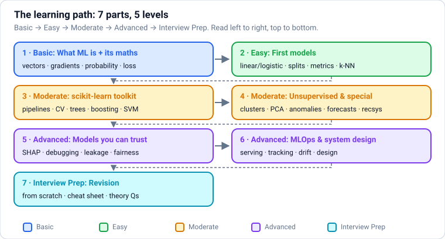

### Theory

> **In simple words:** machine learning (ML) is teaching a computer to make predictions by showing it **examples** instead of writing rules by hand. These notes take you from "what is a model?" to training, evaluating, explaining and deploying models the way companies do, one small step at a time.

**What these notes cover, and in what order:**

| Part | Level | You learn |
|---|---|---|
| 1 | Basic | What ML is, and the maths it uses (vectors, matrices, slopes and gradients, probability and loss), explained with pictures and NumPy |
| 2 | Easy | Your first models from scratch and with scikit-learn: linear and logistic regression, k-nearest neighbours; train/test splits, overfitting, and metrics |
| 3 | Moderate | The scikit-learn toolkit: pipelines, cross-validation, tuning, regularisation, decision trees, random forests, gradient boosting (XGBoost, LightGBM), SVMs |
| 4 | Moderate | Unsupervised learning and special problems: clustering, PCA, anomaly detection, imbalanced data, forecasting, recommendations, text classification |
| 5 | Advanced | Trustworthy models: feature selection, explaining models (SHAP), error analysis, fairness |
| 6 | Advanced | MLOps: saving and serving models, experiment tracking, monitoring and drift, ML system design |
| 7 | Interview Prep | Algorithms from scratch, cheat sheet, and the most-asked questions |

**What you need first:** Python (Parts 1–3 of `dsa-python.md` or `python.md`) and the data toolkit in `data-science.md` (NumPy, pandas, charts, and the statistics in its Part 5). Maths is taught here from the ground up; school algebra is enough to start.

Every example was run with **scikit-learn 1.9, NumPy 2.4, pandas 3.0, XGBoost 3.2 and LightGBM 4.7**. Results under **Output** are real, and chart images were produced by the code next to them.

**What does an ML engineer actually do?** Much less time goes into inventing algorithms than people expect:

| Activity | Share of a typical project |
|---|---|
| Framing the problem, agreeing on a metric with the business | Small, but decides success |
| Getting, cleaning and understanding data | **The largest part** |
| Building features and baselines | Large |
| Training and tuning models | Moderate |
| Evaluating properly (offline and with A/B tests) | Moderate |
| Deploying, monitoring, retraining | Large, and ongoing |

**Roles you'll hear about (2026):** *data scientist* (analysis, experiments, models for decisions), *ML engineer* (builds and runs models in production), *AI engineer* (builds products on top of LLMs and foundation models; see `llm-engineering.md` and `rag-and-agents.md`), *MLOps / ML platform engineer* (the infrastructure), *research scientist* (new methods). Classic ML from these notes remains the backbone of fraud detection, credit scoring, search ranking, recommendations, forecasting and pricing, even at companies that also use LLMs.

**Setup:** the same as the data-science notes, plus `uv pip install scikit-learn xgboost lightgbm shap optuna` (or `pip install ...`). Google Colab has most of these preinstalled.

### Practice

1. Pick an everyday prediction you'd like to automate (will it rain tomorrow, will a customer cancel, what price will a used phone sell for). Write down: what exactly is predicted, what information would be available **at prediction time**, and how you'd know if the predictions were good.

---

## 2. What Is Machine Learning?

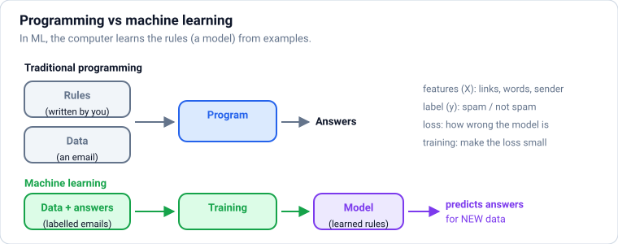

### Theory

> **In simple words:** in normal programming, **you** write the rules: "if the email contains 'lottery', mark it spam". In machine learning, you give the computer **thousands of examples** (emails already marked spam or not spam) and it **learns** the rules itself. The learned rules are called a **model**.

**Key words (you'll see them everywhere):**

| Word | Meaning | Spam example |
|---|---|---|
| **Example / sample / row** | One thing we have data about | One email |
| **Feature** (input, **X**) | A measurable property of an example | Number of links, contains "free", sender known? |
| **Label / target** (output, **y**) | The answer we want to predict | spam / not spam |
| **Model** | A function that maps features to a prediction, with adjustable numbers called **parameters** | "spam if 0.8 × links + 2.1 × free > 3" |
| **Training** | Adjusting the parameters so predictions match the known labels | Learning 0.8, 2.1, 3 from past emails |
| **Inference / prediction** | Using the trained model on new examples | Classifying today's emails |
| **Loss** | A number measuring how wrong the predictions are; training makes it small | Fraction of emails misclassified |

**The main types of machine learning:**

| Type | Learns from | Typical tasks | Examples |
|---|---|---|---|
| **Supervised** | Examples **with** labels | **Regression** (predict a number), **classification** (predict a category) | House price; spam or not; which digit is in an image |
| **Unsupervised** | Examples **without** labels | Clustering, dimensionality reduction, anomaly detection | Customer segments; compressing 100 features into 2 for a chart; unusual transactions |
| **Self-supervised** | Unlabelled data, with labels made from the data itself | Predict the next word; fill in a hidden patch of an image | How LLMs are pre-trained (`deep-learning.md`, `llm-engineering.md`) |
| **Reinforcement learning** | Rewards from trying actions | Choosing actions to maximise long-term reward | Game playing, robotics, tuning LLMs from feedback (RLHF) |

**The ML workflow** (this whole file follows it):

1. **Frame the problem:** what is predicted, for whom, and how success is measured (a metric).
2. **Collect and prepare data:** clean it, build features (`data-science.md`).
3. **Split** into training and test data, so evaluation is honest.
4. **Start with a baseline:** the simplest thing that works (predict the average; a rule; a simple model).
5. **Train models, evaluate, improve** (better features first, then better models, then tuning).
6. **Deploy** and **monitor**, then retrain as the world changes.

**When NOT to use ML:** when simple rules work well, when there's little or no data, when mistakes are unacceptable and can't be caught, or when you can't explain decisions that legally must be explained. A well-chosen rule beats a poorly-built model.

**Deep learning vs "classic" ML:** classic ML (these notes) works on **tables** of features and trains in seconds to minutes; gradient-boosted trees are still the best choice for most tabular business data. **Deep learning** (neural networks) shines on images, audio, text and very large datasets, and powers LLMs (`deep-learning.md`).

### Python

```python
# A hand-written rule vs a learned rule, on the same tiny dataset
emails = [  # (number of links, contains "free"?, is spam?)
    (0, 0, 0), (1, 0, 0), (5, 1, 1), (7, 1, 1), (2, 0, 0), (6, 0, 1), (0, 1, 0), (8, 1, 1),
]

def rule(links, free):                 # written by a human
    return 1 if free == 1 else 0

def learn_threshold(data):             # "training": try every threshold, keep the best
    best_t, best_correct = None, -1
    for t in range(10):
        correct = sum((links >= t) == bool(spam) for links, _, spam in data)
        if correct > best_correct:
            best_t, best_correct = t, correct
    return best_t

t = learn_threshold(emails)
print("learned rule: spam if links >=", t)
print("hand rule accuracy:", sum(rule(l, f) == s for l, f, s in emails) / len(emails))
print("learned rule accuracy:", sum((l >= t) == bool(s) for l, _, s in emails) / len(emails))
```

**Output:**

```text
learned rule: spam if links >= 3
hand rule accuracy: 0.75
learned rule accuracy: 1.0
```

That tiny loop is the essence of every ML algorithm: **try parameters, measure the loss on known examples, keep the parameters that do best**. Real algorithms search much more cleverly, over millions of parameters.

**Common mistakes:**

- ❌ Starting with a complex model before a simple baseline.
- ❌ Measuring success on the same data the model learned from.
- ❌ Using features that won't be available when the prediction is actually made.

### Practice

1. For each, say whether it's regression, classification, clustering or not ML at all: (a) predicting tomorrow's electricity demand in MW; (b) grouping shoppers by behaviour without predefined groups; (c) deciding if a card transaction is fraud; (d) converting Celsius to Fahrenheit.

<details>
<summary><b>Answer</b></summary>

(a) Regression (a number). (b) Clustering (unsupervised). (c) Classification (fraud / not fraud). (d) Not ML: there's an exact formula, F = C × 9/5 + 32.

</details>

**Learn more:** [Google: Machine Learning Crash Course](https://developers.google.com/machine-learning/crash-course) · [scikit-learn: getting started](https://scikit-learn.org/stable/getting_started.html)

---

## 3. Maths for ML 1: Vectors, Matrices and the Dot Product

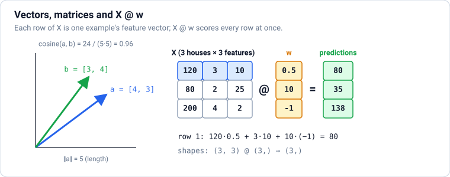

### Theory

> **In simple words:** ML turns everything into **lists of numbers**. One house = `[area, bedrooms, age]` is a **vector**. A whole dataset of houses stacked row by row is a **matrix**. A model's core operation is the **dot product**: multiply each feature by a weight and add up. That's all "linear algebra" means for most of ML.

**Vectors.** A vector is an ordered list of numbers, e.g. `x = [120, 3, 10]` (a 120 m², 3-bedroom, 10-year-old house). You can picture a 2-number vector as an arrow from (0, 0) to that point.

- **Adding** vectors adds matching positions: `[1, 2] + [3, 4] = [4, 6]`.
- **Scaling** multiplies every position: `2 × [1, 2] = [2, 4]`.
- **Length (norm):** the L2 norm `‖x‖ = √(x₁² + x₂² + …)` is the arrow's length (Pythagoras). The L1 norm is `|x₁| + |x₂| + …`. Both come back as **regularisation** later.

**The dot product** `a · b = a₁b₁ + a₂b₂ + … + aₙbₙ` gives one number. Two ways to understand it:

1. **A weighted sum:** a price model `price = 0.5 × area + 10 × bedrooms − 1 × age` is the dot product of the weights `w = [0.5, 10, −1]` with the features `x`. **Linear regression, logistic regression and every neuron in a neural network start with a dot product.**
2. **A similarity:** `a · b = ‖a‖ ‖b‖ cos θ`. If two vectors point the same way, the dot product is large; at right angles it's 0; opposite directions give a negative value. **Cosine similarity** `(a · b) / (‖a‖ ‖b‖)` ranges from −1 to 1 and ignores length. It's how semantic search compares text **embeddings** (vectors that represent meaning; `llm-engineering.md`).

**Matrices.** A matrix is a table of numbers with shape (rows, columns). A dataset `X` with n examples and d features has shape (n, d): each **row** is one example's feature vector.

**Matrix × vector:** `X @ w` computes the dot product of **every row** with `w`, giving one prediction per example, all at once. This is why ML code is fast: no Python loop over rows.

**Matrix × matrix:** `A @ B` needs A's columns = B's rows: shape (n, k) @ (k, m) → (n, m). Each result cell is a row of A dotted with a column of B. A neural-network layer is exactly this: inputs (batch, features) @ weights (features, neurons).

**Other terms you'll meet:**

- **Transpose** `Aᵀ` (NumPy `A.T`) swaps rows and columns.
- **Identity** `I` is the matrix version of 1: `A @ I = A`.
- **Inverse** `A⁻¹` undoes `A` (when it exists), used to solve equations like `A x = b` (in code, `np.linalg.solve(A, b)`, which is faster and more accurate than computing the inverse).
- **Eigenvectors** are directions a matrix only stretches, not rotates. PCA (Section [18](#18-dimensionality-reduction-pca-t-sne-and-umap)) finds the directions in which data varies most; they're eigenvectors of the data's covariance matrix.
- **Tensor:** an array with more axes, e.g. a batch of colour images has shape (batch, height, width, 3). Deep-learning libraries are built around tensors.

### Python

```python
import numpy as np

house = np.array([120, 3, 10])          # area m², bedrooms, age in years
weights = np.array([0.5, 10, -1])       # a (made-up) price model, in lakh rupees
house @ weights                         # → 80.0
np.dot(house, weights) == house @ weights   # → True

a, b = np.array([3.0, 4.0]), np.array([4.0, 3.0])
np.linalg.norm(a)                       # → 5.0
round(float(a @ b / (np.linalg.norm(a) * np.linalg.norm(b))), 2)   # → 0.96
```

```python
X = np.array([[120, 3, 10],             # 4 houses (rows) × 3 features (columns)
              [ 80, 2, 25],
              [200, 4,  2],
              [ 60, 1, 40]])
print(X.shape, "@", weights.shape, "->", (X @ weights).shape)
print("predicted prices:", X @ weights)

W = np.array([[0.5, 0.1],                # two models at once: a (3, 2) weight matrix
              [10., 5.0],
              [-1., 0.0]])
print((X @ W).shape)
print(X @ W)

A = np.array([[2.0, 1.0], [1.0, 3.0]])
b = np.array([5.0, 10.0])
print("solve A x = b:", np.linalg.solve(A, b))
```

**Output:**

```text
(4, 3) @ (3,) -> (4,)
predicted prices: [ 80.  35. 138.   0.]
(4, 2)
[[ 80.  27.]
 [ 35.  18.]
 [138.  40.]
 [  0.  11.]]
solve A x = b: [1. 3.]
```

**Common mistakes:**

- ❌ Confusing `*` (element-wise) with `@` (matrix product): `a * b` gives `[12, 12]`, `a @ b` gives `24`.
- ❌ Shape mismatches: `(4, 3) @ (2,)` fails. Write the shapes down; the inner numbers must match.
- ❌ Comparing embeddings with the dot product when their lengths differ a lot. Normalise, or use cosine similarity.

### Practice

1. Three sentences have embeddings `s1 = [0.9, 0.1, 0.0]`, `s2 = [0.8, 0.2, 0.1]`, `s3 = [0.0, 0.3, 0.9]`. Which two are most similar by cosine similarity?

<details>
<summary><b>Answer</b></summary>

```python
S = np.array([[0.9, 0.1, 0.0], [0.8, 0.2, 0.1], [0.0, 0.3, 0.9]])
unit = S / np.linalg.norm(S, axis=1, keepdims=True)     # make every row length 1
print((unit @ unit.T).round(2))                         # all pairwise cosine similarities
```

**Output:**

```text
[[1.   0.98 0.03]
 [0.98 1.   0.19]
 [0.03 0.19 1.  ]]
```

`s1` and `s2` (0.98). Dividing each row by its length and then taking `unit @ unit.T` computes every pair's cosine similarity in one matrix product, which is how vector search does it at scale.

</details>

**Learn more:** [3Blue1Brown: Essence of Linear Algebra (videos)](https://www.3blue1brown.com/topics/linear-algebra) · [Mathematics for Machine Learning (free book)](https://mml-book.github.io/)

---

## 4. Maths for ML 2: Slopes, Gradients and Gradient Descent

### Theory

> **In simple words:** training a model means finding the parameters that make the **loss** (the error) as small as possible. Picture the loss as a hilly landscape and yourself standing on it blindfolded. Feel which way the ground slopes, take a small step **downhill**, and repeat. That's **gradient descent**, the algorithm that trains almost every modern model, from linear regression to GPT-style LLMs.

**The derivative = the slope.** For a function f(w), the derivative f′(w) says how much f changes when w increases a tiny bit.

- f(w) = w² has derivative f′(w) = 2w. At w = 3 the slope is 6 (going up steeply to the right); at w = 0 the slope is 0 (the bottom of the valley).
- **Rules you need:** the derivative of a constant is 0; of wⁿ is n·wⁿ⁻¹; of a·w is a; and derivatives of sums add up.

**The chain rule** handles functions inside functions: if loss = (prediction − y)² and prediction = w·x, then d(loss)/dw = 2(prediction − y) × x. The chain rule applied layer after layer is **backpropagation**, the way neural networks compute their slopes (`deep-learning.md`).

**Partial derivatives and the gradient.** With many parameters (w₁, w₂, …), the **partial derivative** ∂L/∂w₁ is the slope when only w₁ changes. The **gradient** ∇L is the vector of all partial derivatives; it points **uphill** (the steepest increase).

**Gradient descent:**

```text
repeat many times:
    gradient = slope of the loss at the current parameters
    parameters = parameters - learning_rate * gradient     # a step downhill
```

**The learning rate** (step size) matters most:

- too **small** → progress is painfully slow;
- too **large** → you overshoot the valley and bounce around or even diverge (the loss grows);
- just right → the loss falls quickly and settles.

**Variants you'll hear about:**

| Variant | Uses | Why |
|---|---|---|
| **Batch** gradient descent | All training rows for each step | Exact slope, but slow on big data |
| **Stochastic** (SGD) | One row per step | Fast, noisy steps |
| **Mini-batch** | A small batch (e.g. 32–1024 rows) per step | The standard compromise; what deep learning uses |
| **Momentum**, **Adam**, **AdamW** | Remember past gradients; adapt the step per parameter | Faster, more reliable training; AdamW is the default for training neural networks and LLMs |

**Convex vs non-convex.** Linear and logistic regression have a **bowl-shaped** (convex) loss with one lowest point, so gradient descent finds the best answer. Neural networks have bumpy losses with many valleys; in practice gradient descent still finds very good solutions.

### Python

```python
import matplotlib.pyplot as plt
import numpy as np

def loss(w):          # a simple bowl: lowest at w = 3
    return (w - 3) ** 2 + 1

def slope(w):         # its derivative
    return 2 * (w - 3)

def descend(w, lr, steps=15):
    path = [w]
    for _ in range(steps):
        w = w - lr * slope(w)
        path.append(w)
    return np.array(path)

for lr in (0.05, 0.3, 1.05):
    path = descend(-2.0, lr)
    print(f"lr={lr:<4}  w after 15 steps = {path[-1]:8.3f}   loss = {loss(path[-1]):10.3f}")

w_grid = np.linspace(-8, 14, 200)
fig, axes = plt.subplots(1, 3, figsize=(11, 3), sharey=True, layout="constrained")
for ax, lr, title in zip(axes, (0.05, 0.3, 1.05), ("too small, slow", "about right", "too large, diverges")):
    path = descend(-2.0, lr, steps=8)
    ax.plot(w_grid, loss(w_grid), color="lightgray")
    ax.plot(path, loss(path), "o-", color="tab:blue", markersize=4)
    ax.set_title(f"learning rate {lr}: {title}")
    ax.set_xlim(-8, 14)
    ax.set_xlabel("parameter w")
    ax.set_ylim(0, 60)
axes[0].set_ylabel("loss")
fig.savefig("gradient-descent.png", dpi=100)
plt.close(fig)
```

**Output:**

```text
lr=0.05  w after 15 steps =    1.971   loss =      2.060
lr=0.3   w after 15 steps =    3.000   loss =      1.000
lr=1.05  w after 15 steps =   23.886   loss =    437.235
```

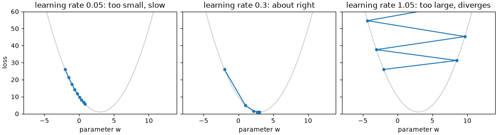

```python
# Two parameters: fit y = w*x + b to data by gradient descent, using the chain rule for the slopes
rng = np.random.default_rng(0)
x = rng.uniform(0, 10, 100)
y = 2.5 * x + 4 + rng.normal(0, 1, 100)          # the "true" answer is w = 2.5, b = 4

w, b, lr = 0.0, 0.0, 0.01
for step in range(2001):
    error = (w * x + b) - y
    grad_w = 2 * np.mean(error * x)              # ∂(mean squared error)/∂w
    grad_b = 2 * np.mean(error)                  # ∂(mean squared error)/∂b
    w, b = w - lr * grad_w, b - lr * grad_b
    if step in (0, 10, 100, 2000):
        print(f"step {step:4d}: w={w:.3f} b={b:.3f} loss={np.mean(error ** 2):.3f}")
```

**Output:**

```text
step    0: w=2.390 b=0.353 loss=368.511
step   10: w=2.964 b=0.596 loss=3.665
step  100: w=2.802 b=1.748 loss=2.130
step 2000: w=2.487 b=3.992 loss=0.940
```

The parameters walk towards the true values (2.5 and 4), and the loss falls towards the noise level (about 1, the variance of the noise we added).

**Common mistakes:**

- ❌ A learning rate that's too high: the loss goes up or becomes `nan`. Lower it by 3–10×.
- ❌ Features on very different scales (area in thousands, bedrooms 1–5): the bowl becomes a long thin valley and gradient descent zig-zags. **Scale your features.**
- ❌ Stopping by a fixed step count without watching the loss curve.

### Practice

1. Using `descend`, find roughly the largest learning rate that still converges for this loss (try values between 0.9 and 1.1).

<details>
<summary><b>Answer</b></summary>

```python
for lr in (0.9, 0.99, 1.0, 1.01):
    print(lr, round(float(descend(-2.0, lr, steps=50)[-1]), 3))
```

**Output:**

```text
0.9 3.0
0.99 1.179
1.0 -2.0
1.01 -10.458
```

Below 1.0 it converges to 3 (slowly near 1.0, bouncing from side to side); at exactly 1.0 it bounces between −2 and 8 forever; above 1.0 it diverges. For this bowl, each step multiplies the distance to the minimum by (1 − 2·lr), which only shrinks when that number is between −1 and 1.

</details>

**Learn more:** [3Blue1Brown: Essence of Calculus (videos)](https://www.3blue1brown.com/topics/calculus) · [Google ML Crash Course: gradient descent](https://developers.google.com/machine-learning/crash-course/linear-regression/gradient-descent)

---

## 5. Maths for ML 3: Probabilities, Sigmoid, Softmax and Loss Functions

### Theory

> **In simple words:** a **loss function** turns "how wrong is the model?" into one number, and training makes that number small. For numbers (prices), the loss measures the **distance** between prediction and truth. For categories (spam or not), the model outputs a **probability**, and the loss punishes it for being **confidently wrong**.

**Losses for regression (predicting a number):**

| Loss | Formula (average over rows) | Behaviour |
|---|---|---|
| **MSE** (mean squared error) | mean of (prediction − truth)² | Big errors count a lot (squared); smooth, easy to optimise; the usual default |
| **MAE** (mean absolute error) | mean of \|prediction − truth\| | Every unit of error counts the same; robust to outliers |
| **Huber** | Squared for small errors, absolute for big ones | A compromise: smooth near zero, robust to outliers |

**RMSE** = √MSE is in the same units as the target, so it's easy to read ("off by ₹2.1 lakh on average, with large misses weighted more").

**Turning scores into probabilities:**

- **Sigmoid** σ(z) = 1 / (1 + e⁻ᶻ) squashes any number into (0, 1): σ(0) = 0.5, large positive → close to 1, large negative → close to 0. A binary classifier computes a score z (a dot product) and outputs σ(z) = P(class = 1).
- **Softmax** does the same for many classes: it turns a vector of scores into probabilities that sum to 1: softmax(zᵢ) = eᶻⁱ / Σⱼ eᶻʲ. The biggest score gets the biggest probability. Neural-network classifiers, and LLMs choosing the next word, end with a softmax.

**Log loss (binary cross-entropy)** for one example with true label y (0 or 1) and predicted probability p:

```text
loss = -( y·log(p) + (1 - y)·log(1 - p) )
```

In words: **minus the log of the probability the model gave to the correct answer**. Correct and confident (p = 0.99 for a true 1) → loss 0.01. Unsure (p = 0.5) → 0.69. Confidently wrong (p = 0.01 for a true 1) → 4.6. The log makes confident mistakes very expensive, which pushes the model towards honest probabilities. For many classes, **categorical cross-entropy** is the same idea: −log(probability of the correct class). **LLMs are trained with exactly this loss**, on the next token.

**Why these losses? Maximum likelihood.** Choosing parameters that make the observed data **most probable** is called maximum likelihood estimation. Minimising log loss is exactly maximum likelihood for yes/no labels, and minimising MSE is maximum likelihood when errors are normally distributed. So these aren't arbitrary choices.

**Entropy and KL divergence (you'll meet these in deep learning):**

- **Entropy** measures uncertainty: a fair coin has 1 bit; a coin that always lands heads has 0.
- **Cross-entropy** measures how well predicted probabilities match the true ones.
- **KL divergence** is how different two probability distributions are (cross-entropy minus entropy). It appears in knowledge distillation, VAEs and keeping a fine-tuned LLM close to the original.

### Python

```python
import numpy as np

truth = np.array([3.0, 5.0, 2.5, 7.0, 4.0])
pred = np.array([2.5, 5.0, 3.0, 8.0, 4.0])
mse = np.mean((pred - truth) ** 2)
print("MSE", mse, " RMSE", round(float(np.sqrt(mse)), 3), " MAE", np.mean(np.abs(pred - truth)))

pred_outlier = pred.copy()
pred_outlier[3] = 17.0                              # one terrible prediction
print("with one big miss: MSE", np.mean((pred_outlier - truth) ** 2), " MAE", np.mean(np.abs(pred_outlier - truth)))
```

**Output:**

```text
MSE 0.3  RMSE 0.548  MAE 0.4
with one big miss: MSE 20.1  MAE 2.2
```

MSE jumped about 67× because of one miss; MAE only about 5×. Choose the loss that matches what hurts in your problem.

```python
def sigmoid(z):
    return 1 / (1 + np.exp(-z))

def softmax(z):
    e = np.exp(z - z.max())                         # subtracting the max avoids overflow; same result
    return e / e.sum()

def log_loss(y, p):
    return -(y * np.log(p) + (1 - y) * np.log(1 - p))

print(sigmoid(np.array([-4, 0, 4])).round(3))
print(softmax(np.array([2.0, 1.0, 0.1])).round(3), softmax(np.array([2.0, 1.0, 0.1])).sum())
for p in (0.99, 0.5, 0.01):
    print(f"true label 1, predicted p={p}: loss {log_loss(1, p):.2f}")
```

**Output:**

```text
[0.018 0.5   0.982]
[0.659 0.242 0.099] 1.0
true label 1, predicted p=0.99: loss 0.01
true label 1, predicted p=0.5: loss 0.69
true label 1, predicted p=0.01: loss 4.61
```

```python
def entropy(probs):
    probs = np.array(probs)
    return float(-(probs * np.log2(probs)).sum())

print("fair coin:", entropy([0.5, 0.5]), "bits;  90/10 coin:", round(entropy([0.9, 0.1]), 3), "bits")
```

**Output:**

```text
fair coin: 1.0 bits;  90/10 coin: 0.469 bits
```

**Common mistakes:**

- ❌ Computing `log(0)` when a model predicts exactly 0 or 1. Libraries clip probabilities to [1e-15, 1 − 1e-15].
- ❌ Using accuracy as the training loss: it has no slope (it jumps in steps), so gradient descent can't use it. Train with log loss; **report** accuracy or other metrics.
- ❌ Treating a model's score as a probability without checking calibration (Section [9](#9-measuring-classifiers-confusion-matrix-precision-recall-roc-and-pr-curves)).

### Practice

1. A 3-class model outputs scores `[1.0, 3.0, 0.5]` and the true class is the second one. What's the softmax probability of the true class, and the cross-entropy loss?

<details>
<summary><b>Answer</b></summary>

```python
p = softmax(np.array([1.0, 3.0, 0.5]))
print(p.round(3), "loss:", round(float(-np.log(p[1])), 3))
```

**Output:**

```text
[0.111 0.821 0.067] loss: 0.197
```

</details>

---

### ✅ Part 1 checkpoint

Without looking, can you:

- [ ] Explain features, labels, training, inference and loss, and the four main types of ML?
- [ ] Compute a dot product and cosine similarity, and say what `X @ w` means for a dataset?
- [ ] Explain gradient descent and the effect of the learning rate, and write it for a straight-line fit?
- [ ] Say when to use MSE, MAE and log loss, and what sigmoid and softmax do?

**Learn more:** [StatQuest: cross entropy (video)](https://www.youtube.com/watch?v=6ArSys5qHAU) · [Google ML Crash Course: logistic regression](https://developers.google.com/machine-learning/crash-course/logistic-regression)

---

# Part 2 — Easy: Your First Models

> **Goal:** Train and evaluate your first regression and classification models, split data honestly, and measure classifiers properly.  
> **You need:** Part 1, and the statistics in `data-science.md` Part 5.

---

## 6. Your First Model: Linear Regression

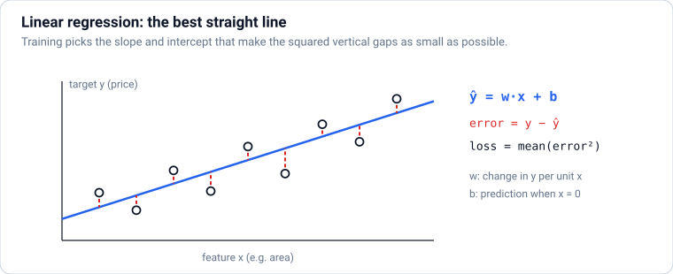

### Theory

> **In simple words:** linear regression predicts a **number** by adding up the features, each multiplied by a **weight**, plus a starting value: `price = w₁·area + w₂·bedrooms + … + b`. Training finds the weights that make the squared errors as small as possible. It's simple, fast and easy to explain, so it's the first model to try for any number-prediction problem.

**The model:** ŷ = w₁x₁ + w₂x₂ + … + wₙxₙ + b = **x · w + b** (the dot product from Section [3](#3-maths-for-ml-1-vectors-matrices-and-the-dot-product)).

- Each **weight (coefficient)** wᵢ says how much the prediction changes when feature xᵢ goes up by 1 **with the other features held fixed**.
- **b (the intercept or bias)** is the prediction when all features are 0.

**Training (fitting):** find w and b that minimise the **mean squared error**. Two ways:

1. **Gradient descent** (Section [4](#4-maths-for-ml-2-slopes-gradients-and-gradient-descent)): works for any size of data and any model.
2. **The exact formula** (the *normal equation*, solved as a least-squares problem): linear regression is one of the few models with a closed-form answer. Libraries use this for small and medium data.

**Measuring the fit:**

| Metric | Meaning | Good value |
|---|---|---|
| **MAE** | Average size of the error, in the target's units | Small, compared with typical target values |
| **RMSE** | Like MAE, but big errors count more | Small |
| **R²** (coefficient of determination) | Share of the target's variation the model explains: 1 − MSE(model) / MSE(predicting the mean) | 1 is perfect; 0 = no better than always predicting the average; can be negative |

**Always compare with a baseline.** The simplest baseline for regression predicts the **average** of the training targets for everyone. A model is only useful if it clearly beats that.

**Assumptions to keep in mind:** the relationship is roughly a straight line in each feature (use transformed features, such as `area²` or `log(price)`, if not); errors are independent; and very correlated features make the individual weights unstable (though predictions can still be fine). Linear models can't capture "it depends" interactions (a garden adds value only in the suburbs) unless you add them as features.

**scikit-learn in one pattern** (Part 3 covers it fully): create the model, `fit(X, y)` to train it, `predict(X_new)` to use it.

```text
from sklearn.linear_model import LinearRegression
model = LinearRegression()
model.fit(X, y)                  # learn weights from features X and targets y
model.predict(X_new)             # predictions for new rows
model.coef_, model.intercept_    # the learned weights and bias
```

### Python

```python
import numpy as np
import pandas as pd

rng = np.random.default_rng(42)
n = 300
houses = pd.DataFrame({
    "area_m2": rng.uniform(40, 250, n).round(),
    "bedrooms": rng.integers(1, 6, n),
    "age_years": rng.integers(0, 40, n),
    "km_to_centre": rng.uniform(1, 30, n).round(1),
})
houses["price_lakh"] = (20 + 0.55 * houses["area_m2"] + 4 * houses["bedrooms"] - 0.6 * houses["age_years"]
                        - 1.5 * houses["km_to_centre"] + rng.normal(0, 8, n)).round(1)
print(houses.head(3))

X = houses[["area_m2", "bedrooms", "age_years", "km_to_centre"]].to_numpy()
y = houses["price_lakh"].to_numpy()

X1 = np.column_stack([X, np.ones(n)])                 # a column of 1s lets the last weight act as b
w = np.linalg.lstsq(X1, y, rcond=None)[0]              # the exact least-squares solution
print("weights:", w[:-1].round(2), " intercept:", round(float(w[-1]), 2))
```

**Output:**

```text
   area_m2  bedrooms  age_years  km_to_centre  price_lakh
0    203.0         4          0          14.8       120.8
1    132.0         4          1          23.1        73.0
2    220.0         4          8          27.2       113.6
weights: [ 0.53  4.41 -0.57 -1.57]  intercept: 21.47
```

The learned weights are close to the ones we used to create the data (0.55, 4, −0.6, −1.5, intercept 20). With real data you don't know the true values, but the same maths finds the best straight-line fit.

```python
from sklearn.linear_model import LinearRegression
from sklearn.metrics import mean_absolute_error, mean_squared_error, r2_score

model = LinearRegression()
model.fit(X, y)
pred = model.predict(X)
print("coef:", model.coef_.round(2), " intercept:", round(float(model.intercept_), 2))
print(f"MAE {mean_absolute_error(y, pred):.2f}  RMSE {np.sqrt(mean_squared_error(y, pred)):.2f}  R² {r2_score(y, pred):.3f}")

baseline = np.full_like(y, y.mean())                   # predict the average for everyone
print(f"baseline MAE {mean_absolute_error(y, baseline):.2f}  R² {r2_score(y, baseline):.3f}")

new_house = np.array([[120, 3, 5, 8.0]])
print("predicted price for a new house:", model.predict(new_house).round(1), "lakh")
```

**Output:**

```text
coef: [ 0.53  4.41 -0.57 -1.57]  intercept: 21.47
MAE 5.93  RMSE 7.70  R² 0.957
baseline MAE 31.70  R² 0.000
predicted price for a new house: [83.5] lakh
```

**Is this evaluation honest?** Not quite: we measured the model on the **same rows it learned from**. A model can memorise its training data and still fail on new data. The next section shows how to measure properly.

**Common mistakes:**

- ❌ Reading a weight as the effect of a feature "on its own" when features are strongly correlated (area and bedrooms): the weights share the credit unpredictably.
- ❌ Comparing weights of features on different scales to judge importance (a weight per m² vs per bedroom). Scale features first, or use other importance methods (Section [23](#23-explaining-models-feature-importance-partial-dependence-and-shap)).
- ❌ Reporting R² without a baseline and without a test set.

### Practice

1. Add a feature `area_per_bedroom` and refit. Does R² change much? Why might it not?

<details>
<summary><b>Answer</b></summary>

```python
X_more = np.column_stack([X, houses["area_m2"] / houses["bedrooms"]])
print(round(r2_score(y, LinearRegression().fit(X_more, y).predict(X_more)), 3))
```

**Output:**

```text
0.957
```

Almost no change: the price was generated from area, bedrooms, age and distance only, so the extra feature carries no new information. On real data, a well-chosen feature can help a lot; that's feature engineering.

</details>

**Learn more:** [scikit-learn: linear models](https://scikit-learn.org/stable/modules/linear_model.html) · [StatQuest: linear regression (video)](https://www.youtube.com/watch?v=7ArmBVF2dCs)

---

## 7. Train/Test Splits, Overfitting and Underfitting

### Theory

> **In simple words:** a student who memorises last year's exam answers scores 100% on that paper and fails the real exam. Models do the same: they can **memorise** training data instead of learning the pattern. So we always keep some data **hidden** during training (the **test set**) and judge the model only on that. Doing well on unseen data is called **generalisation**, and it's the whole point.

**The split:**

| Set | Used for | Typical share |
|---|---|---|
| **Training set** | Fitting the model's parameters | 60–80% |
| **Validation set** | Choosing between models and settings (hyperparameters) | 10–20% (or use cross-validation, Section [12](#12-cross-validation-and-hyperparameter-tuning)) |
| **Test set** | One final, honest estimate at the very end | 10–20% |

Touch the test set **once**. If you keep checking it while making choices, you slowly fit those choices to it, and it stops being an honest estimate.

**How to split depends on the data:**

- Ordinary rows: a **random** split (`train_test_split(X, y, test_size=0.2, random_state=42)`).
- Classification with rare classes: a **stratified** split (`stratify=y`) keeps class proportions the same in both parts.
- **Time series**: split by **time** (train on the past, test on the future). Never shuffle.
- **Groups** (several rows per patient, customer or device): keep each group entirely in one side, or the model gets graded on people it has already seen.

**Underfitting vs overfitting:**

| | Training error | Test error | Cause | Fix |
|---|---|---|---|---|
| **Underfitting** (high **bias**) | High | High | Model too simple for the pattern | More features, a more flexible model, less regularisation |
| **Good fit** | Low | Low (a little higher than training) | | |
| **Overfitting** (high **variance**) | Very low | High | Model memorises noise | More data, a simpler model, regularisation (Section [13](#13-regularisation-ridge-lasso-and-elastic-net)), early stopping |

**The bias–variance trade-off:** a simple model is **biased** (it misses real patterns) but **stable**; a very flexible model has low bias but high **variance** (its predictions change a lot with small changes in the training data). The best test error lies in between. Your job is to find that sweet spot, using validation data.

**Hyperparameters vs parameters:** **parameters** are learned by training (the weights). **Hyperparameters** are settings you choose **before** training (polynomial degree, tree depth, learning rate). You pick hyperparameters by comparing validation scores.

### Python

To make models of different flexibility, we fit a straight line to the features x, x², x³, …, x^degree (a **polynomial**). `make_pipeline(PolynomialFeatures(degree), LinearRegression())` builds those features and then fits linear regression on them, in one object (pipelines are covered in Section [11](#11-scikit-learn-properly-estimators-pipelines-and-columntransformer)).

```python
import matplotlib.pyplot as plt
import numpy as np
from sklearn.linear_model import LinearRegression
from sklearn.metrics import mean_squared_error
from sklearn.model_selection import train_test_split
from sklearn.pipeline import make_pipeline
from sklearn.preprocessing import PolynomialFeatures

rng = np.random.default_rng(0)
x = np.sort(rng.uniform(0, 1, 40))
y = np.sin(2 * np.pi * x) + rng.normal(0, 0.2, 40)         # the true pattern is a smooth wave
X = x.reshape(-1, 1)                                        # scikit-learn wants a 2D (rows, features) array

X_train, X_test, y_train, y_test = train_test_split(X, y, test_size=0.3, random_state=1)
print(len(X_train), "training rows,", len(X_test), "test rows")

grid = np.linspace(0, 1, 200).reshape(-1, 1)
fig, axes = plt.subplots(1, 3, figsize=(11, 3.2), sharey=True, layout="constrained")
for ax, degree in zip(axes, (1, 4, 15)):
    model = make_pipeline(PolynomialFeatures(degree), LinearRegression())   # x, x², x³, … as features
    model.fit(X_train, y_train)
    train_mse = mean_squared_error(y_train, model.predict(X_train))
    test_mse = mean_squared_error(y_test, model.predict(X_test))
    print(f"degree {degree:2d}: train MSE {train_mse:.3f}   test MSE {test_mse:.3f}")
    ax.scatter(X_train, y_train, s=15, label="train")
    ax.scatter(X_test, y_test, s=15, marker="x", color="tab:red", label="test")
    ax.plot(grid, model.predict(grid), color="black")
    ax.set_ylim(-2, 2)
    ax.set_title({1: "degree 1: underfits", 4: "degree 4: good fit", 15: "degree 15: overfits"}[degree])
axes[0].legend(loc="lower left")
fig.savefig("under-over-fitting.png", dpi=100)
plt.close(fig)
```

**Output:**

```text
28 training rows, 12 test rows
degree  1: train MSE 0.289   test MSE 0.365
degree  4: train MSE 0.033   test MSE 0.064
degree 15: train MSE 0.027   test MSE 0.128
```

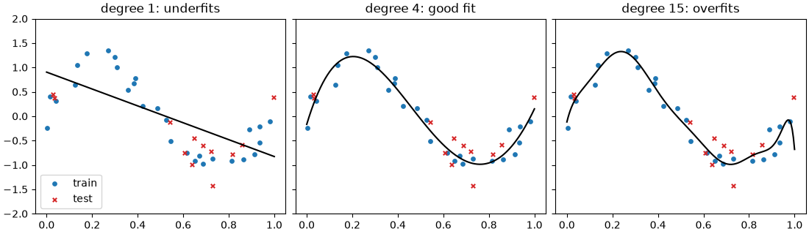

The degree-15 model has the **lowest training error** but a much worse test error: it bends to pass through the noise. Degree 4 has the best test error. Only the test (or validation) error reveals this.

```python
train_scores, val_scores = [], []
X_tr, X_val, y_tr, y_val = train_test_split(X_train, y_train, test_size=0.3, random_state=2)   # carve out validation
for degree in range(1, 13):
    m = make_pipeline(PolynomialFeatures(degree), LinearRegression()).fit(X_tr, y_tr)
    train_scores.append(mean_squared_error(y_tr, m.predict(X_tr)))
    val_scores.append(mean_squared_error(y_val, m.predict(X_val)))
best = int(np.argmin(val_scores)) + 1
print("best degree by validation:", best)
print("validation MSE by degree:", np.round(val_scores, 2))
```

**Output:**

```text
best degree by validation: 5
validation MSE by degree: [0.29 0.36 0.05 0.05 0.02 0.03 0.07 0.15 0.13 0.08 1.05 1.33]
```

The validation error falls, reaches a minimum, then rises as the model starts to overfit: the bias–variance trade-off in numbers. (With so few points the curve is noisy; cross-validation, in Section [12](#12-cross-validation-and-hyperparameter-tuning), makes this choice more reliable.)

**Common mistakes:**

- ❌ Evaluating on training data and celebrating.
- ❌ Doing preprocessing (scaling, filling, selecting features) on all data before splitting: that's leakage (`data-science.md`, feature preparation).
- ❌ Random splits for time series or grouped data, which leak the future or the same person into the test set.
- ❌ Tuning against the test set until it looks good.

### Practice

1. Split `X, y` with `test_size=0.3` using three different `random_state` values and fit degree 4 each time. How much does the test MSE vary? What does that tell you about small test sets?

<details>
<summary><b>Answer</b></summary>

```python
for seed in (1, 2, 3):
    Xa, Xb, ya, yb = train_test_split(X, y, test_size=0.3, random_state=seed)
    m = make_pipeline(PolynomialFeatures(4), LinearRegression()).fit(Xa, ya)
    print(seed, round(mean_squared_error(yb, m.predict(Xb)), 3))
```

**Output:**

```text
1 0.064
2 0.056
3 0.051
```

The score moves by about 25% just from changing the split. With only 12 test points, one lucky or unlucky split can mislead you, which is why cross-validation averages over several splits.

</details>

**Learn more:** [scikit-learn: underfitting vs overfitting](https://scikit-learn.org/stable/auto_examples/model_selection/plot_underfitting_overfitting.html) · [Google ML Crash Course: overfitting](https://developers.google.com/machine-learning/crash-course/overfitting)

---

## 8. Classification with Logistic Regression

### Theory

> **In simple words:** logistic regression answers **yes/no** questions (spam? fraud? will this customer leave?). It works like linear regression, a weighted sum of the features, but then squashes the result through the **sigmoid** into a **probability** between 0 and 1. If the probability is above a **threshold** (usually 0.5), it predicts "yes". Despite its name, it's a **classification** model.

**The model, step by step:**

1. Score: z = w · x + b (any number).
2. Probability: p = σ(z) = 1 / (1 + e⁻ᶻ) (Section [5](#5-maths-for-ml-3-probabilities-sigmoid-softmax-and-loss-functions)).
3. Decision: predict 1 if p ≥ threshold, else 0.

**The decision boundary** is where p = 0.5, i.e. where z = 0. Because z is a weighted sum, the boundary is a **straight line** (a flat plane with more features). Curved boundaries need extra features or a different model.

**Training** minimises **log loss** with gradient descent (or a smarter optimiser). There's no closed-form answer, but the loss is bowl-shaped, so the optimiser reliably finds the best weights.

**Reading the weights:** a weight is the change in the **log-odds** (log of p ÷ (1 − p)) per unit of the feature. Positive → pushes towards "yes"; negative → towards "no". `exp(weight)` is the **odds ratio**: 1.5 means each unit multiplies the odds by 1.5. With standardised features, bigger |weight| roughly means more influence.

**More than two classes:** scikit-learn's `LogisticRegression` uses the **softmax** version (multinomial logistic regression) automatically: one score per class, turned into probabilities that sum to 1.

**Regularisation is on by default** in scikit-learn (`C=1.0`; smaller C = stronger regularisation, Section [13](#13-regularisation-ridge-lasso-and-elastic-net)), and it assumes features on similar scales, so standardise first.

**Why it's still used everywhere:** fast, gives probabilities, easy to explain to regulators (credit scoring), and a strong **baseline**. If a complex model can't beat logistic regression, something is wrong with the features or the problem.

### Python

```python
import matplotlib.pyplot as plt
import numpy as np
from sklearn.linear_model import LogisticRegression

hours = np.array([0.5, 1, 1.5, 2, 2.5, 3, 3.5, 4, 4.5, 5, 5.5, 6, 6.5, 7]).reshape(-1, 1)
passed = np.array([0, 0, 0, 0, 0, 1, 0, 1, 0, 1, 1, 1, 1, 1])

clf = LogisticRegression().fit(hours, passed)
w, b = clf.coef_[0][0], clf.intercept_[0]
print(f"weight {w:.2f}, bias {b:.2f}, boundary at {-b / w:.2f} hours")
print("P(pass) for 2, 4 and 6 hours:", clf.predict_proba([[2], [4], [6]])[:, 1].round(2))
print("predicted class:", clf.predict([[2], [4], [6]]))

grid = np.linspace(0, 7.5, 200).reshape(-1, 1)
fig, ax = plt.subplots(figsize=(6, 3.2), layout="constrained")
ax.scatter(hours, passed, color="tab:blue", zorder=3)
ax.plot(grid, clf.predict_proba(grid)[:, 1], color="black", label="P(pass)")
ax.axhline(0.5, ls=":", color="gray")
ax.axvline(-b / w, ls="--", color="tab:red", label="decision boundary")
ax.set(xlabel="hours studied", ylabel="probability of passing", title="Logistic regression: an S-shaped probability")
ax.legend(loc="center right")
fig.savefig("logistic-sigmoid.png", dpi=100)
plt.close(fig)
```

**Output:**

```text
weight 1.06, bias -3.96, boundary at 3.75 hours
P(pass) for 2, 4 and 6 hours: [0.14 0.57 0.92]
predicted class: [0 1 1]
```

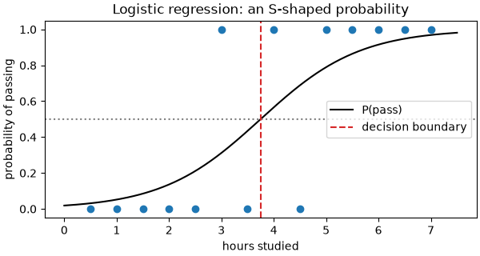

```python
from sklearn.datasets import load_breast_cancer
from sklearn.model_selection import train_test_split
from sklearn.pipeline import make_pipeline
from sklearn.preprocessing import StandardScaler

data = load_breast_cancer()
X, y = data.data, 1 - data.target                 # make 1 = malignant (the class we want to catch)
print(X.shape, "positive rate:", round(y.mean(), 3))

X_train, X_test, y_train, y_test = train_test_split(X, y, test_size=0.25, stratify=y, random_state=0)
model = make_pipeline(StandardScaler(), LogisticRegression())   # standardise, then fit
model.fit(X_train, y_train)
print("test accuracy:", round(model.score(X_test, y_test), 3))

weights = model[-1].coef_[0]
top = np.argsort(np.abs(weights))[::-1][:4]
for i in top:
    print(f"{data.feature_names[i]:<22} weight {weights[i]:+.2f}  odds ×{np.exp(weights[i]):.2f} per std")
```

**Output:**

```text
(569, 30) positive rate: 0.373
test accuracy: 0.986
radius error           weight +1.24  odds ×3.46 per std
worst radius           weight +1.03  odds ×2.79 per std
worst symmetry         weight +0.98  odds ×2.68 per std
worst concave points   weight +0.92  odds ×2.51 per std
```

`StandardScaler` standardises each feature ((x − mean) / std, learned from the **training** rows) before the model sees it; `make_pipeline` chains the two so the same scaling is applied at prediction time.

**Common mistakes:**

- ❌ Using linear regression for yes/no targets (predictions go below 0 and above 1).
- ❌ Forgetting to scale features, which gives convergence warnings and misleading weights.
- ❌ Treating 0.5 as a sacred threshold. Choose it from the costs of each kind of mistake (next section).

### Practice

1. With the breast-cancer model, what fraction of test patients get a malignancy probability between 0.3 and 0.7 (the "unsure" zone a doctor might review)?

<details>
<summary><b>Answer</b></summary>

```python
proba = model.predict_proba(X_test)[:, 1]
print(round(float(np.mean((proba > 0.3) & (proba < 0.7))), 3))
```

**Output:**

```text
0.07
```

Only a small fraction of cases are uncertain; sending just those for human review is a common and effective design.

</details>

**Learn more:** [scikit-learn: logistic regression](https://scikit-learn.org/stable/modules/linear_model.html#logistic-regression) · [StatQuest: logistic regression (video)](https://www.youtube.com/watch?v=yIYKR4sgzI8)

---

## 9. Measuring Classifiers: Confusion Matrix, Precision, Recall, ROC and PR Curves

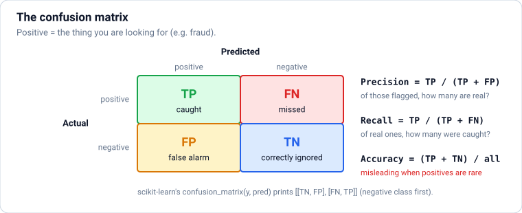

### Theory

> **In simple words:** "95% accurate" can mean almost nothing. If only 3% of transactions are fraud, a model that **always says "not fraud"** is 97% accurate and catches zero fraud. To judge a classifier you must count **which kinds** of mistakes it makes, because missing a fraud and blocking an honest customer cost very different amounts.

**The confusion matrix** counts four outcomes (with "positive" = the thing you're looking for, e.g. fraud):

| | Predicted positive | Predicted negative |
|---|---|---|
| **Actually positive** | **TP** (true positive): caught | **FN** (false negative): **missed** |
| **Actually negative** | **FP** (false positive): false alarm | **TN** (true negative): correctly left alone |

**Metrics built from it:**

| Metric | Formula | Question it answers | Care about it when… |
|---|---|---|---|
| **Accuracy** | (TP + TN) / all | How often is it right overall? | Classes are balanced and errors cost the same |
| **Precision** | TP / (TP + FP) | When it says "positive", how often is it right? | False alarms are expensive (spam filter hiding real email) |
| **Recall** (sensitivity, TPR) | TP / (TP + FN) | Of all real positives, how many did it catch? | Misses are expensive (cancer screening, fraud) |
| **Specificity** | TN / (TN + FP) | Of all negatives, how many did it leave alone? | Medical tests |
| **F1 score** | 2 · P · R / (P + R) | One number balancing precision and recall | You need a single score for an imbalanced problem |

**Precision and recall pull against each other.** Lower the threshold → the model says "positive" more often → recall goes up, precision goes down. **Choose the threshold from the costs**: e.g. "catch at least 90% of fraud" or "at most 1 false alarm per 100 flags".

**Curves that summarise all thresholds:**

- **ROC curve:** true-positive rate (recall) vs false-positive rate (FP / (FP + TN)) as the threshold varies. **ROC-AUC** (area under it) is the probability that the model scores a random positive above a random negative: 0.5 = random guessing, 1.0 = perfect. Good for comparing models; can look too optimistic when positives are rare.
- **Precision–recall curve** and its area, **average precision (PR-AUC)**: focus on the positive class; **the better choice for imbalanced problems** (fraud, rare diseases, search relevance). A random model's PR-AUC equals the positive rate.

**Calibration:** if a model says "70% chance", do 70% of such cases turn out positive? Many models (trees, SVMs, boosted models) give scores that aren't well-calibrated probabilities. Check with a **calibration curve** or the **Brier score** (mean squared error of the probabilities; lower is better), and fix with `CalibratedClassifierCV`. Calibration matters whenever probabilities drive decisions (pricing, risk, expected-value calculations).

**More than two classes:** compute precision/recall per class, then average: **macro** (every class equal: good when small classes matter), **weighted** (by class size), or **micro** (pool all decisions). `classification_report` prints them all.

### Python

```python
import numpy as np
from sklearn.datasets import make_classification
from sklearn.dummy import DummyClassifier
from sklearn.linear_model import LogisticRegression
from sklearn.metrics import (accuracy_score, average_precision_score, confusion_matrix, f1_score,
                             precision_score, recall_score, roc_auc_score)
from sklearn.model_selection import train_test_split

X, y = make_classification(n_samples=20_000, n_features=12, n_informative=6, weights=[0.97],
                           class_sep=0.8, random_state=0)          # about 3% positives, like fraud
X_train, X_test, y_train, y_test = train_test_split(X, y, test_size=0.3, stratify=y, random_state=0)
print("positive rate in test:", round(y_test.mean(), 3))

lazy = DummyClassifier(strategy="most_frequent").fit(X_train, y_train)     # always "not fraud"
model = LogisticRegression(max_iter=1000).fit(X_train, y_train)

for name, m in [("always 'no'", lazy), ("logistic regression", model)]:
    pred = m.predict(X_test)
    print(f"{name:20s} accuracy {accuracy_score(y_test, pred):.3f}  precision {precision_score(y_test, pred, zero_division=0):.3f}"
          f"  recall {recall_score(y_test, pred):.3f}  F1 {f1_score(y_test, pred):.3f}")
print(confusion_matrix(y_test, model.predict(X_test)))
```

**Output:**

```text
positive rate in test: 0.035
always 'no'          accuracy 0.965  precision 0.000  recall 0.000  F1 0.000
logistic regression  accuracy 0.964  precision 0.414  recall 0.057  F1 0.100
[[5771   17]
 [ 200   12]]
```

The lazy model's 96.5% accuracy hides a recall of **zero**, and the real model's accuracy is even slightly lower, so accuracy can't tell them apart at all. The confusion matrix (rows = actual, columns = predicted; `[[TN, FP], [FN, TP]]`) shows it still misses many positives at the default 0.5 threshold.

```python
proba = model.predict_proba(X_test)[:, 1]
print(f"ROC-AUC {roc_auc_score(y_test, proba):.3f}   PR-AUC {average_precision_score(y_test, proba):.3f}"
      f"   (random PR-AUC ≈ {y_test.mean():.3f})")

for threshold in (0.5, 0.2, 0.1, 0.05):
    pred = (proba >= threshold).astype(int)
    print(f"threshold {threshold:<4}  precision {precision_score(y_test, pred):.2f}  recall {recall_score(y_test, pred):.2f}"
          f"  flagged {pred.sum():4d} of {len(pred)}")
```

**Output:**

```text
ROC-AUC 0.857   PR-AUC 0.281   (random PR-AUC ≈ 0.035)
threshold 0.5   precision 0.41  recall 0.06  flagged   29 of 6000
threshold 0.2   precision 0.36  recall 0.33  flagged  190 of 6000
threshold 0.1   precision 0.26  recall 0.59  flagged  476 of 6000
threshold 0.05  precision 0.15  recall 0.70  flagged  985 of 6000
```

Lowering the threshold trades precision for recall. Which row is "best" depends on the business: how much a missed fraud costs versus the cost of a reviewer checking a false alarm.

```python
import matplotlib.pyplot as plt
from sklearn.calibration import calibration_curve
from sklearn.metrics import PrecisionRecallDisplay, RocCurveDisplay, brier_score_loss

fig, axes = plt.subplots(1, 3, figsize=(12, 3.6), layout="constrained")
RocCurveDisplay.from_predictions(y_test, proba, ax=axes[0], name="logistic")
axes[0].plot([0, 1], [0, 1], ls=":", color="gray")
axes[0].set_title("ROC curve")
PrecisionRecallDisplay.from_predictions(y_test, proba, ax=axes[1], name="logistic")
axes[1].axhline(y_test.mean(), ls=":", color="gray")
axes[1].set_title("Precision–recall curve")
frac_pos, mean_pred = calibration_curve(y_test, proba, n_bins=8, strategy="quantile")
axes[2].plot(mean_pred, frac_pos, "o-")
axes[2].plot([0, 0.25], [0, 0.25], ls=":", color="gray")          # perfect calibration
axes[2].set(title="Calibration", xlabel="predicted probability", ylabel="actual positive rate")
fig.savefig("classifier-curves.png", dpi=100)
plt.close(fig)
print("Brier score:", round(brier_score_loss(y_test, proba), 4))
```

**Output:**

```text
Brier score: 0.0291
```

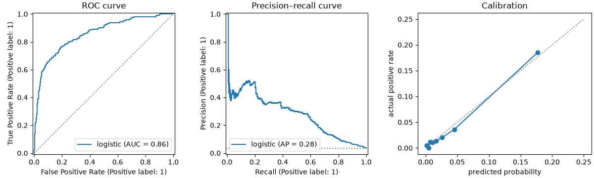

**Common mistakes:**

- ❌ Reporting accuracy on imbalanced data.
- ❌ Comparing models at different thresholds, or picking the threshold on the test set. Choose it on validation data.
- ❌ Using ROC-AUC alone for rare positives, where it can look great while precision is poor. Look at PR-AUC.
- ❌ Assuming a model's scores are calibrated probabilities.

### Practice

1. Find the **lowest threshold** that keeps precision at or above 0.5 on the test set. What recall do you get there?

<details>
<summary><b>Answer</b></summary>

```python
from sklearn.metrics import precision_recall_curve

precision, recall, thresholds = precision_recall_curve(y_test, proba)
ok = np.where(precision[:-1] >= 0.5)[0]            # the last precision value has no threshold
i = ok[0]
print(f"threshold {thresholds[i]:.3f}: precision {precision[i]:.2f}, recall {recall[i]:.2f}")
```

**Output:**

```text
threshold 0.354: precision 0.50, recall 0.20
```

(In a real project, pick the threshold on a validation set, then report the test-set result once.)

</details>

**Learn more:** [scikit-learn: classification metrics](https://scikit-learn.org/stable/modules/model_evaluation.html#classification-metrics) · [Google ML Crash Course: accuracy, precision, recall](https://developers.google.com/machine-learning/crash-course/classification/accuracy-precision-recall) · [scikit-learn: probability calibration](https://scikit-learn.org/stable/modules/calibration.html)

---

## 10. k-Nearest Neighbours, Distances and Feature Scaling

### Theory

> **In simple words:** to classify a new wine, find the **k most similar wines** you already know (its nearest neighbours) and let them **vote**. That's k-nearest neighbours (k-NN): no equations, no training beyond storing the data. It also shows why **feature scaling** matters: "similar" is measured by distance, and a feature measured in thousands drowns out one measured in single digits.

**How k-NN predicts:**

1. Compute the distance from the new point to every training point.
2. Take the k closest.
3. **Classification:** majority vote (optionally weighted by closeness). **Regression:** average of their values.

**Distances:**

| Distance | Formula | Use |
|---|---|---|
| **Euclidean** (L2) | √Σ(aᵢ − bᵢ)² | The default: straight-line distance |
| **Manhattan** (L1) | Σ\|aᵢ − bᵢ\| | Grid-like movement; less sensitive to one big difference |
| **Cosine distance** | 1 − cosine similarity | Text and embeddings, where direction matters more than length |

**Choosing k** (a hyperparameter): k = 1 follows every noisy point (overfits); a very large k averages everything away (underfits). Pick k with validation data; odd values avoid ties in two-class problems.

**Why scale features?** Suppose `proline` ranges 278–1680 and `hue` ranges 0.5–1.7. In a Euclidean distance, a difference of 100 in proline counts 100 times more than a full-range difference in hue, so the model effectively ignores hue. Scaling puts features on comparable ranges:

| Scaler | Result | Use when |
|---|---|---|
| `StandardScaler` | Mean 0, std 1 | The default for most models |
| `MinMaxScaler` | Range [0, 1] | Bounded features, neural-network inputs, images |
| `RobustScaler` | Median 0, scaled by IQR | Outliers present |

**Which models need scaling?** Distance-based (k-NN, k-means, SVM), gradient-based (linear/logistic regression with regularisation, neural networks) and PCA: **yes**. Tree-based models (decision trees, random forests, gradient boosting): **no**, since they split one feature at a time.

**Fit the scaler on training data only**, then apply it to validation and test data (Section [7](#7-traintest-splits-overfitting-and-underfitting)); a pipeline does this automatically.

**The curse of dimensionality.** With many features, all points become roughly equally far from each other, so "nearest" loses meaning and k-NN degrades. Reduce dimensions (Section [18](#18-dimensionality-reduction-pca-t-sne-and-umap)) or use models that pick relevant features.

**k-NN at scale:** comparing against every stored point is slow for millions of rows. Tree indexes help in low dimensions; for high-dimensional embeddings, systems use **approximate nearest-neighbour** (ANN) indexes such as HNSW, the engine inside vector databases (`dsa-python.md`, `sql-postgresql.md` pgvector, `rag-and-agents.md`). Recommendation ("users like you"), semantic search and RAG retrieval are all nearest-neighbour problems.

### Python

```python
import numpy as np
from sklearn.datasets import load_wine
from sklearn.model_selection import train_test_split
from sklearn.neighbors import KNeighborsClassifier
from sklearn.pipeline import make_pipeline
from sklearn.preprocessing import StandardScaler

X, y = load_wine(return_X_y=True)
X_train, X_test, y_train, y_test = train_test_split(X, y, test_size=0.3, stratify=y, random_state=0)
print("(min, max) of alcohol, malic acid, ash and proline:")
print(np.column_stack([X_train.min(axis=0), X_train.max(axis=0)])[[0, 1, 2, 12]].round(1).tolist())

raw = KNeighborsClassifier(n_neighbors=5).fit(X_train, y_train)
scaled = make_pipeline(StandardScaler(), KNeighborsClassifier(n_neighbors=5)).fit(X_train, y_train)
print("accuracy without scaling:", round(raw.score(X_test, y_test), 3))
print("accuracy with scaling:   ", round(scaled.score(X_test, y_test), 3))
```

**Output:**

```text
(min, max) of alcohol, malic acid, ash and proline:
[[11.4, 14.8], [0.7, 5.8], [1.7, 3.2], [278.0, 1680.0]]
accuracy without scaling: 0.722
accuracy with scaling:    0.963
```

Same algorithm, same data: scaling alone takes k-NN from mediocre to excellent, because without it the distance is almost entirely `proline`.

```python
for k in (1, 3, 5, 15, 51, 101):
    m = make_pipeline(StandardScaler(), KNeighborsClassifier(n_neighbors=k)).fit(X_train, y_train)
    print(f"k={k:3d}  train {m.score(X_train, y_train):.3f}  test {m.score(X_test, y_test):.3f}")

new_wine = X_test[:1]
dist, idx = scaled[-1].kneighbors(scaled[0].transform(new_wine))
print("neighbour classes:", y_train[idx[0]], "-> predicted", scaled.predict(new_wine)[0], "(true", y_test[0], ")")
```

**Output:**

```text
k=  1  train 1.000  test 1.000
k=  3  train 0.944  test 0.963
k=  5  train 0.968  test 0.963
k= 15  train 0.952  test 0.981
k= 51  train 0.952  test 0.963
k=101  train 0.419  test 0.426
neighbour classes: [0 0 0 0 0] -> predicted 0 (true 0 )
```

k = 1 is always perfect on training data (each point is its own nearest neighbour), so training accuracy tells you nothing here. On this small, easy dataset k = 1 also happens to do well on the 54 test wines (a difference of one wine is about 0.02, so small gaps between k values are noise). k = 101 collapses: with only 124 training wines, 101 neighbours is nearly everyone, so it predicts the biggest class for almost every wine. That's underfitting.

```python
rng = np.random.default_rng(0)
for d in (2, 10, 100, 1000):
    pts = rng.uniform(size=(500, d))
    dists = np.linalg.norm(pts[1:] - pts[0], axis=1)
    print(f"{d:5d} dims: nearest/farthest distance ratio = {dists.min() / dists.max():.2f}")
```

**Output:**

```text
    2 dims: nearest/farthest distance ratio = 0.01
   10 dims: nearest/farthest distance ratio = 0.30
  100 dims: nearest/farthest distance ratio = 0.73
 1000 dims: nearest/farthest distance ratio = 0.90
```

The curse of dimensionality in numbers: in 2 dimensions the nearest point is far closer than the farthest one; in 1,000 dimensions they're almost the same distance away, so "nearest" means little.

**Common mistakes:**

- ❌ Forgetting to scale for k-NN, SVMs, k-means and regularised linear models.
- ❌ Fitting the scaler on the whole dataset (leakage) instead of inside a pipeline.
- ❌ Using k-NN on huge datasets without an index: every prediction scans all rows.

### Practice

1. Try `KNeighborsClassifier(n_neighbors=5, weights="distance")` (closer neighbours get bigger votes) in the scaled pipeline. Does the test accuracy change?

<details>
<summary><b>Answer</b></summary>

```python
m = make_pipeline(StandardScaler(), KNeighborsClassifier(n_neighbors=5, weights="distance")).fit(X_train, y_train)
print(round(m.score(X_test, y_test), 3))
```

**Output:**

```text
0.963
```

</details>

---

### ✅ Part 2 checkpoint

Without looking, can you:

- [ ] Fit a linear regression, read its weights, and judge it with MAE, RMSE and R² against a baseline?
- [ ] Split data properly (random, stratified, by time, by group) and recognise under- and overfitting?
- [ ] Explain how logistic regression turns a score into a probability and a decision?
- [ ] Build a confusion matrix, compute precision, recall and F1, choose a threshold, and explain ROC-AUC vs PR-AUC?
- [ ] Explain k-NN, pick k with validation data, and say which models need feature scaling?

**Learn more:** [scikit-learn: nearest neighbours](https://scikit-learn.org/stable/modules/neighbors.html) · [scikit-learn: importance of feature scaling](https://scikit-learn.org/stable/auto_examples/preprocessing/plot_scaling_importance.html)

---

# Part 3 — Moderate: The scikit-learn Toolkit and Strong Models

> **Goal:** Build leak-free pipelines, cross-validate and tune, regularise, and use the models that win in practice: trees, random forests and gradient boosting (XGBoost, LightGBM), plus SVMs and Naive Bayes.  
> **You need:** Parts 1–2.

---

## 11. scikit-learn Properly: Estimators, Pipelines and ColumnTransformer

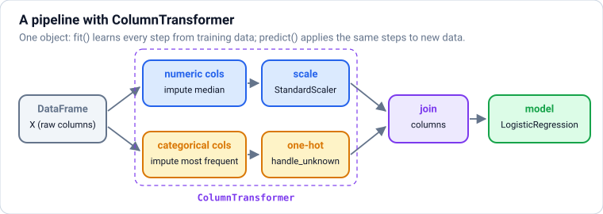

### Theory

> **In simple words:** scikit-learn gives every model and every preprocessing step the **same few methods**, so they snap together like LEGO. A **pipeline** chains the steps (fill missing values → encode categories → scale → model) into **one object** that you fit once and use everywhere. This prevents the most common bug in ML projects: preparing training and test data differently.

**The estimator API:**

| Method | On | Does |
|---|---|---|
| `fit(X, y)` | Everything | Learns from data (a model's weights, a scaler's means, an encoder's categories) |
| `predict(X)` | Models | Predictions |
| `predict_proba(X)` | Classifiers | Class probabilities |
| `transform(X)` | Preprocessors | Applies what was learned (scales, encodes) |
| `fit_transform(X)` | Preprocessors | Both, on the training data |
| `score(X, y)` | Models | Default metric (accuracy for classifiers, R² for regressors) |

Learned values end with an underscore: `coef_`, `mean_`, `categories_`, `feature_importances_`. Hyperparameters are set in the constructor: `LogisticRegression(C=0.5)`.

**Pipelines:** `Pipeline([("scale", StandardScaler()), ("model", LogisticRegression())])` (or `make_pipeline(...)`, which names the steps automatically). Calling `fit` fits each step on the training data in order; `predict` runs new data through the **already-fitted** steps. Benefits:

- **No leakage:** during cross-validation, preprocessing is refitted inside each training fold.
- **One object to save and deploy**, preprocessing included.
- **Tune everything together**, e.g. the imputer strategy and the model's `C` in one search, with step names: `model__C`, `prep__num__impute__strategy`.

**ColumnTransformer** applies different steps to different columns, then joins the results:

```text
prep = ColumnTransformer([
    ("num", make_pipeline(SimpleImputer(strategy="median"), StandardScaler()), numeric_columns),
    ("cat", make_pipeline(SimpleImputer(strategy="most_frequent"), OneHotEncoder(handle_unknown="ignore")), categorical_columns),
])
model = make_pipeline(prep, LogisticRegression())
```

`OneHotEncoder(handle_unknown="ignore")` turns a category never seen in training into all zeros instead of crashing in production.

**Useful extras:**

- `set_output(transform="pandas")` makes transformers return DataFrames with readable column names.
- `get_feature_names_out()` lists the final feature names (e.g. `cat__city_Pune`).
- `FunctionTransformer(np.log1p)` wraps any function as a step; for custom logic with learned state, write a class with `fit` and `transform`.
- Other libraries (XGBoost, LightGBM, CatBoost) follow the same API, so they drop into pipelines.

### Python

```python
import numpy as np
import pandas as pd
from sklearn.compose import ColumnTransformer
from sklearn.impute import SimpleImputer
from sklearn.linear_model import LogisticRegression
from sklearn.model_selection import train_test_split
from sklearn.pipeline import make_pipeline
from sklearn.preprocessing import OneHotEncoder, StandardScaler

rng = np.random.default_rng(7)
n = 2000
customers = pd.DataFrame({
    "tenure_months": rng.integers(1, 72, n).astype(float),
    "monthly_bill": rng.normal(700, 250, n).clip(99).round(),
    "support_calls": rng.poisson(1.5, n).astype(float),
    "plan": rng.choice(["basic", "plus", "premium"], n, p=[0.5, 0.3, 0.2]),
    "city": rng.choice(["Pune", "Mumbai", "Delhi", "Bengaluru"], n),
    "payment": rng.choice(["upi", "card", "cash"], n, p=[0.6, 0.3, 0.1]),
})
score = (-0.05 * customers["tenure_months"] + 0.5 * customers["support_calls"] + 0.002 * customers["monthly_bill"]
         + np.where(customers["payment"] == "cash", 0.8, 0) + np.where(customers["plan"] == "premium", -0.7, 0))
customers["churned"] = (rng.uniform(size=n) < 1 / (1 + np.exp(-(score - 0.5)))).astype(int)
for col in ["monthly_bill", "support_calls", "payment"]:                  # real data has gaps
    customers.loc[rng.uniform(size=n) < 0.05, col] = np.nan
print(customers.head(3).to_string())
print("churn rate:", round(customers["churned"].mean(), 3), " missing:", customers.isna().sum().to_dict())
```

**Output:**

```text
   tenure_months  monthly_bill  support_calls     plan       city payment  churned
0           68.0         308.0            2.0  premium  Bengaluru     upi        0
1           45.0         693.0            2.0    basic      Delhi     upi        1
2           49.0         824.0            4.0  premium       Pune     upi        1
churn rate: 0.445  missing: {'tenure_months': 0, 'monthly_bill': 99, 'support_calls': 91, 'plan': 0, 'city': 0, 'payment': 96, 'churned': 0}
```

```python
X = customers.drop(columns="churned")
y = customers["churned"]
X_train, X_test, y_train, y_test = train_test_split(X, y, test_size=0.25, stratify=y, random_state=0)

numeric = ["tenure_months", "monthly_bill", "support_calls"]
categorical = ["plan", "city", "payment"]
prep = ColumnTransformer([
    ("num", make_pipeline(SimpleImputer(strategy="median"), StandardScaler()), numeric),
    ("cat", make_pipeline(SimpleImputer(strategy="most_frequent"), OneHotEncoder(handle_unknown="ignore")), categorical),
])
model = make_pipeline(prep, LogisticRegression(max_iter=1000))
model.fit(X_train, y_train)
print("test accuracy:", round(model.score(X_test, y_test), 3))
print(list(model.named_steps))
print(model[:-1].get_feature_names_out()[:6])

new_customer = pd.DataFrame([{"tenure_months": 3, "monthly_bill": np.nan, "support_calls": 4,
                              "plan": "basic", "city": "Chennai", "payment": "cash"}])   # unseen city, missing bill
print("churn probability:", model.predict_proba(new_customer)[0, 1].round(3))
```

**Output:**

```text
test accuracy: 0.72
['columntransformer', 'logisticregression']
['num__tenure_months' 'num__monthly_bill' 'num__support_calls'
 'cat__plan_basic' 'cat__plan_plus' 'cat__plan_premium']
churn probability: 0.969
```

The new customer has a missing bill and a city the model has never seen, and the pipeline still handles it: the imputer fills the bill with the training median and the encoder ignores the unknown city.

```python
weights = pd.Series(model[-1].coef_[0], index=model[:-1].get_feature_names_out()).sort_values()
print(weights.round(2).head(3))
print(weights.round(2).tail(3))
```

**Output:**

```text
num__tenure_months   -0.97
cat__plan_premium    -0.51
cat__payment_card    -0.40
dtype: float64
num__monthly_bill     0.47
num__support_calls    0.54
cat__payment_cash     0.61
dtype: float64
```

The model recovered the patterns built into the data: long tenure and premium plans reduce churn; support calls and paying cash increase it.

**Common mistakes:**

- ❌ `scaler.fit(X)` on all data, then splitting. ✅ Put the scaler inside the pipeline.
- ❌ Calling `fit_transform` on test data (it re-learns from the test set). ✅ `transform` only; a pipeline does this for you.
- ❌ `pd.get_dummies` separately on train and test, giving mismatched columns. ✅ `OneHotEncoder(handle_unknown="ignore")`.
- ❌ Saving the model without its preprocessing. Save the whole pipeline.

### Practice

1. Replace `StandardScaler` with `RobustScaler` and the numeric imputer's strategy with `"mean"`. Does test accuracy change? (Use `model.set_params(...)` with the step names.)

<details>
<summary><b>Answer</b></summary>

```python
from sklearn.preprocessing import RobustScaler

model.set_params(columntransformer__num__standardscaler=RobustScaler(),
                 columntransformer__num__simpleimputer__strategy="mean")
model.fit(X_train, y_train)
print(round(model.score(X_test, y_test), 3))
```

**Output:**

```text
0.714
```

Little or no change: with features this well behaved, the choice of scaler and imputer barely matters. The point is that pipelines make such experiments one line each.

</details>

**Learn more:** [scikit-learn: pipelines and composite estimators](https://scikit-learn.org/stable/modules/compose.html) · [scikit-learn: common pitfalls](https://scikit-learn.org/stable/common_pitfalls.html)

---

## 12. Cross-Validation and Hyperparameter Tuning

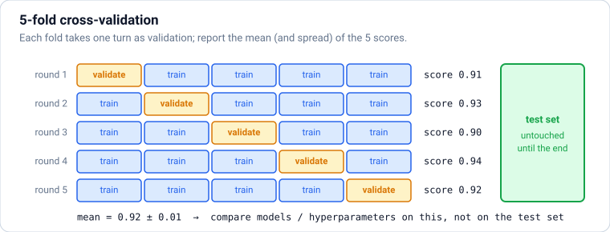

### Theory

> **In simple words:** one train/validation split gives one noisy score (Section [7](#7-traintest-splits-overfitting-and-underfitting)). **Cross-validation** splits the training data into k parts (**folds**), trains k times, each time holding out a different fold for validation, and averages the k scores. You get a more reliable score **and** a sense of how much it varies. Then **hyperparameter tuning** tries many settings and keeps the one with the best cross-validated score.

**k-fold cross-validation (usually k = 5 or 10):**

1. Split the training data into k folds.
2. For each fold: train on the other k − 1 folds, score on this one.
3. Report the **mean** (the estimate) and the **standard deviation** (how stable it is).

The **test set stays untouched** throughout; use it once at the end.

**Choosing the splitter** (the same rules as for a single split):

| Data | Splitter |
|---|---|
| Regression, plain rows | `KFold(n_splits=5, shuffle=True, random_state=0)` |
| Classification | `StratifiedKFold` (keeps class proportions; the default for classifiers) |
| Several rows per person/device/session | `GroupKFold` / `StratifiedGroupKFold` (a group never appears on both sides) |
| Time series | `TimeSeriesSplit` (always train on the past, validate on the future) |

**Tuning methods:**

| Method | How | When |
|---|---|---|
| **Grid search** (`GridSearchCV`) | Tries every combination from lists you give | Few hyperparameters, few values |
| **Random search** (`RandomizedSearchCV`) | Tries random combinations from ranges | More hyperparameters: finds good regions with far fewer trials |
| **Successive halving** (`HalvingRandomSearchCV`) | Starts many candidates on little data, keeps the best, gives them more | Big searches on a budget |
| **Bayesian optimisation** (e.g. **Optuna**) | Learns from past trials which region to try next | Expensive models (boosting, neural networks); the common industry choice |

Search on a **log scale** for scale-like hyperparameters (regularisation strength, learning rate): 0.001, 0.01, 0.1, 1, 10.

**Nested cross-validation:** the best score from a search is slightly optimistic (you picked the maximum of many noisy scores). To report an unbiased estimate without a separate test set, run the search inside an outer cross-validation loop. In practice, a held-out test set does the same job more simply.

### Python

```python
import numpy as np
from sklearn.datasets import load_breast_cancer
from sklearn.linear_model import LogisticRegression
from sklearn.model_selection import StratifiedKFold, cross_val_score, cross_validate, train_test_split
from sklearn.pipeline import make_pipeline
from sklearn.preprocessing import StandardScaler

X, y = load_breast_cancer(return_X_y=True)
y = 1 - y                                                   # 1 = malignant
X_train, X_test, y_train, y_test = train_test_split(X, y, test_size=0.2, stratify=y, random_state=0)

model = make_pipeline(StandardScaler(), LogisticRegression(max_iter=1000))
cv = StratifiedKFold(n_splits=5, shuffle=True, random_state=0)
scores = cross_val_score(model, X_train, y_train, cv=cv, scoring="roc_auc")
print("ROC-AUC per fold:", scores.round(4))
print(f"mean {scores.mean():.4f} ± {scores.std():.4f}")

res = cross_validate(model, X_train, y_train, cv=cv, scoring=["accuracy", "recall", "precision"])
print({k: round(float(v.mean()), 3) for k, v in res.items() if k.startswith("test_")})
```

**Output:**

```text
ROC-AUC per fold: [0.9943 1.     0.9763 0.9871 1.    ]
mean 0.9915 ± 0.0090
{'test_accuracy': 0.982, 'test_recall': 0.959, 'test_precision': 0.994}
```

```python
from scipy.stats import loguniform
from sklearn.model_selection import GridSearchCV, RandomizedSearchCV

grid = GridSearchCV(model, {"logisticregression__C": [0.001, 0.01, 0.1, 1, 10, 100]},
                    cv=cv, scoring="roc_auc")
grid.fit(X_train, y_train)
print("grid best:", grid.best_params_, round(grid.best_score_, 4))
for c, s in zip(grid.cv_results_["param_logisticregression__C"], grid.cv_results_["mean_test_score"]):
    print(f"  C={c:<6} ROC-AUC {s:.4f}")

rand = RandomizedSearchCV(model, {"logisticregression__C": loguniform(1e-3, 1e2)},
                          n_iter=20, cv=cv, scoring="roc_auc", random_state=0)
rand.fit(X_train, y_train)
print("random best C:", round(rand.best_params_["logisticregression__C"], 3), round(rand.best_score_, 4))
print("final test ROC-AUC (used once):", round(grid.score(X_test, y_test), 4))
```

**Output:**

```text
grid best: {'logisticregression__C': 0.1} 0.9944
  C=0.001  ROC-AUC 0.9871
  C=0.01   ROC-AUC 0.9935
  C=0.1    ROC-AUC 0.9944
  C=1.0    ROC-AUC 0.9915
  C=10.0   ROC-AUC 0.9885
  C=100.0  ROC-AUC 0.9856
random best C: 0.083 0.9944
final test ROC-AUC (used once): 0.9917
```

The search refits the best setting on all the training data (`refit=True` by default), so `grid` itself is the final model. Very small C (strong regularisation) underfits a little, very large C (weak regularisation) overfits a little, and the best is in between. Notice how small the differences are (0.986 to 0.994): on an easy dataset, tuning matters much less than good data and features.

```python
import optuna

optuna.logging.set_verbosity(optuna.logging.WARNING)

def objective(trial):
    c = trial.suggest_float("C", 1e-3, 1e2, log=True)
    candidate = make_pipeline(StandardScaler(), LogisticRegression(C=c, max_iter=1000))
    return cross_val_score(candidate, X_train, y_train, cv=cv, scoring="roc_auc").mean()

study = optuna.create_study(direction="maximize", sampler=optuna.samplers.TPESampler(seed=0))
study.optimize(objective, n_trials=25)
print("optuna best C:", round(study.best_params["C"], 3), " score:", round(study.best_value, 4))
```

**Output:**

```text
optuna best C: 0.028  score: 0.9947
```

**Common mistakes:**

- ❌ Preprocessing outside the pipeline, so each fold's validation data leaked into scaling or feature selection.
- ❌ Plain `KFold` on grouped or time-ordered data.
- ❌ Reporting `best_score_` as the expected production performance (it's optimistically biased); report the untouched test score.
- ❌ Grid searches over many hyperparameters with fine grids: the number of fits explodes. Use random search or Optuna.

### Practice

1. Use `cross_val_score` with `TimeSeriesSplit(n_splits=4)` on `X_train, y_train` (pretending rows are in time order) and print the fold scores. How do the training sizes differ from k-fold?

<details>
<summary><b>Answer</b></summary>

```python
from sklearn.model_selection import TimeSeriesSplit

tss = TimeSeriesSplit(n_splits=4)
print([len(train_idx) for train_idx, _ in tss.split(X_train)])
print(cross_val_score(model, X_train, y_train, cv=tss, scoring="roc_auc").round(4))
```

**Output:**

```text
[91, 182, 273, 364]
[0.9978 0.9984 0.9825 0.9995]
```

Each fold trains on everything **before** its validation block, so the training set grows fold by fold, unlike k-fold where every fold trains on the same amount.

</details>

**Learn more:** [scikit-learn: cross-validation](https://scikit-learn.org/stable/modules/cross_validation.html) · [scikit-learn: tuning hyperparameters](https://scikit-learn.org/stable/modules/grid_search.html) · [Optuna: tutorial](https://optuna.readthedocs.io/en/stable/tutorial/index.html)

---

## 13. Regularisation: Ridge, Lasso and Elastic Net

### Theory

> **In simple words:** an overfitting model uses **huge, wild weights** to chase noise. **Regularisation** adds a penalty for big weights to the loss, so the model only uses a large weight when the data really justifies it. The result: simpler, more stable models that generalise better, especially when you have **many features** or **few rows**.

**The idea in one line:** loss = (how wrong the predictions are) + α × (how big the weights are). α (alpha) controls the strength: α = 0 is ordinary regression; a huge α pushes all weights towards 0 (underfitting).

| Method | Penalty | Effect | Use when |
|---|---|---|---|
| **Ridge** (L2) | α × Σ w² | Shrinks all weights smoothly; handles correlated features well | Many useful, correlated features: a safe default |
| **Lasso** (L1) | α × Σ \|w\| | Pushes many weights to **exactly 0**: automatic **feature selection** | You suspect only a few features matter |
| **Elastic Net** | A mix of L1 and L2 (`l1_ratio`) | Selection plus stability with correlated features | Many correlated features, want sparsity |

**Why does L1 give exact zeros?** The L1 penalty has the same slope however small a weight gets, so it keeps pushing weights all the way to zero. The L2 penalty's slope shrinks as the weight shrinks, so weights get small but rarely exactly zero.

**Practical notes:**

- **Scale features first**: the penalty treats all weights equally, so features must be on comparable scales.
- In scikit-learn, `Ridge(alpha=...)`, `Lasso(alpha=...)`, `ElasticNet(alpha=..., l1_ratio=...)`; `RidgeCV` / `LassoCV` pick α by cross-validation. For classifiers, `LogisticRegression(C=...)` uses **C = 1 / strength**: smaller C = stronger regularisation, and `penalty="l1"` (with `solver="liblinear"` or `"saga"`) gives Lasso-style selection.
- **Regularisation is everywhere**, not just linear models: tree depth limits and minimum leaf sizes (trees), learning-rate shrinkage and subsampling (boosting), and weight decay, dropout, early stopping and data augmentation (neural networks, `deep-learning.md`).
- Bayesian view: L2 = assuming weights are probably small (a normal prior); L1 = assuming most are zero (a Laplace prior).

### Python

```python
import matplotlib.pyplot as plt
import numpy as np
from sklearn.linear_model import Lasso, LinearRegression, Ridge
from sklearn.metrics import r2_score
from sklearn.model_selection import train_test_split
from sklearn.pipeline import make_pipeline
from sklearn.preprocessing import StandardScaler

rng = np.random.default_rng(0)
n, d = 150, 80                                        # few rows, many features: overfitting territory
X = rng.normal(size=(n, d))
true_w = np.zeros(d)
true_w[:5] = [3, -2, 1.5, 1, -1]                      # only 5 features really matter
y = X @ true_w + rng.normal(0, 1.0, n)
X_train, X_test, y_train, y_test = train_test_split(X, y, test_size=0.4, random_state=0)

for name, reg in [("plain linear", LinearRegression()), ("ridge α=5", Ridge(alpha=5)), ("lasso α=0.1", Lasso(alpha=0.1))]:
    m = make_pipeline(StandardScaler(), reg).fit(X_train, y_train)
    w = m[-1].coef_
    print(f"{name:13s} train R² {r2_score(y_train, m.predict(X_train)):.3f}  test R² {r2_score(y_test, m.predict(X_test)):.3f}"
          f"  non-zero weights {np.sum(np.abs(w) > 1e-6):2d}  largest noise weight {np.abs(w[5:]).max():.2f}")
```

**Output:**

```text
plain linear  train R² 0.993  test R² 0.678  non-zero weights 80  largest noise weight 0.66
ridge α=5     train R² 0.985  test R² 0.839  non-zero weights 80  largest noise weight 0.43
lasso α=0.1   train R² 0.966  test R² 0.948  non-zero weights 20  largest noise weight 0.15
```

Plain linear regression, with 80 features and only 90 training rows, nearly memorises the training data and does much worse on the test set. Ridge shrinks the noise weights; Lasso sets most of them to exactly zero and keeps the 5 real ones, giving the best test score.

```python
alphas = np.logspace(-3, 1, 40)
paths = np.array([Lasso(alpha=a).fit(StandardScaler().fit_transform(X_train), y_train).coef_ for a in alphas])

fig, ax = plt.subplots(figsize=(7, 3.6), layout="constrained")
ax.plot(alphas, paths[:, 5:], color="lightgray", lw=0.8)
ax.plot(alphas, paths[:, :5], lw=2)
ax.set_xscale("log")
ax.set(xlabel="alpha (regularisation strength, log scale)", ylabel="weight",
       title="Lasso path: noise weights (grey) hit zero first")
fig.savefig("lasso-path.png", dpi=100)
plt.close(fig)
print("features kept at alpha=0.5:", np.flatnonzero(np.abs(paths[np.searchsorted(alphas, 0.5)]) > 1e-6))
```

**Output:**

```text
features kept at alpha=0.5: [0 1 2 3 4]
```

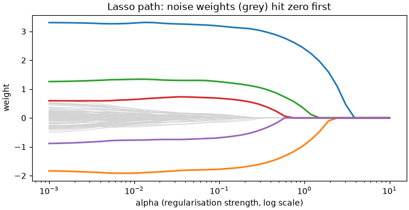

**Common mistakes:**

- ❌ Regularising unscaled features (the penalty unfairly hits features with small units).
- ❌ Choosing α by eye or on the test set. ✅ `RidgeCV`, `LassoCV`, or a search with cross-validation.
- ❌ Reading Lasso's chosen features as "the true causes": with correlated features it picks one of a group somewhat arbitrarily.
- ❌ Forgetting that `C` in scikit-learn classifiers is the **inverse** of the strength.

### Practice

1. Use `LassoCV(cv=5)` inside a pipeline with `StandardScaler` to choose α automatically. Which α does it pick, and how many features does it keep?

<details>
<summary><b>Answer</b></summary>

```python
from sklearn.linear_model import LassoCV

m = make_pipeline(StandardScaler(), LassoCV(cv=5, random_state=0)).fit(X_train, y_train)
print(round(float(m[-1].alpha_), 3), int(np.sum(np.abs(m[-1].coef_) > 1e-6)), round(r2_score(y_test, m.predict(X_test)), 3))
```

**Output:**

```text
0.124 18 0.948
```

</details>

**Learn more:** [scikit-learn: Ridge, Lasso, Elastic Net](https://scikit-learn.org/stable/modules/linear_model.html) · [StatQuest: regularisation (video series)](https://www.youtube.com/watch?v=Q81RR3yKn30)

---

## 14. Decision Trees

### Theory

> **In simple words:** a decision tree is a flowchart of yes/no questions learned from data: "Is tenure < 6 months? → Are support calls ≥ 3? → likely to churn". Each question splits the data into purer groups. Trees are easy to read, need no feature scaling, and handle mixed feature types. On their own they overfit easily, but combined in **ensembles** (next section) they're the strongest models for tabular data.

**How a tree is grown (the CART algorithm):**

1. At a node, try every feature and every possible threshold ("feature ≤ value").
2. Pick the split that makes the two child groups **purest** (for classification) or with the **lowest error** (for regression).
3. Repeat on each child, until a stopping rule (maximum depth, minimum samples per leaf, no improvement).
4. A **leaf** predicts the majority class (or the average value) of its training rows.

This greedy, one-step-at-a-time search is fast, though not guaranteed to find the best possible tree.

**Measuring purity (classification):**

- **Gini impurity** = 1 − Σ pᵢ², where pᵢ is the share of class i in the node. A pure node (all one class) has Gini 0; a 50/50 node has 0.5.
- **Entropy** = −Σ pᵢ log₂ pᵢ (0 for pure, 1 bit for 50/50). The drop in entropy after a split is the **information gain**.
- Both give very similar trees; Gini is the scikit-learn default.

For **regression trees**, the split minimises the squared error (variance) within the children, and leaves predict the mean.

**Controlling overfitting** (the hyperparameters that matter): `max_depth`, `min_samples_leaf` (e.g. 20: each leaf needs at least 20 rows), `min_samples_split`, `max_leaf_nodes`, and `ccp_alpha` (cost-complexity **pruning**: remove branches that don't pay for their complexity). An unlimited tree can keep splitting until every training row sits in its own pure leaf: 100% training accuracy and poor generalisation.

**Strengths and weaknesses:**

| ✅ Strengths | ❌ Weaknesses |
|---|---|
| Readable rules; easy to explain | High variance: small data changes → a different tree |
| No scaling needed; handles non-linear patterns and interactions | Overfits without limits |
| Fast to train and predict | Boundaries are axis-aligned steps (awkward for diagonal patterns) |
| Handles missing values natively in recent scikit-learn | Can't predict outside the range of training targets (regression) |

### Python

```python
def gini(counts):
    total = sum(counts)
    return 1 - sum((c / total) ** 2 for c in counts)

print("pure node:", gini([10, 0]), " 50/50:", gini([5, 5]), " 8 vs 2:", round(gini([8, 2]), 2))

# One split: 10 customers (6 churn, 4 stay) split by "tenure < 6 months"
left, right = [5, 1], [1, 3]            # [churn, stay] on each side
before = gini([6, 4])
after = (6 / 10) * gini(left) + (4 / 10) * gini(right)     # weighted by child size
print(f"Gini before {before:.3f}, after {after:.3f}, improvement {before - after:.3f}")
```

**Output:**

```text
pure node: 0.0  50/50: 0.5  8 vs 2: 0.32
Gini before 0.480, after 0.317, improvement 0.163
```

```python
import matplotlib.pyplot as plt
from sklearn.datasets import load_wine
from sklearn.model_selection import train_test_split
from sklearn.tree import DecisionTreeClassifier, export_text, plot_tree

data = load_wine()
X_train, X_test, y_train, y_test = train_test_split(data.data, data.target, test_size=0.3,
                                                    stratify=data.target, random_state=0)
for depth in (1, 2, 3, 5, None):
    t = DecisionTreeClassifier(max_depth=depth, random_state=0).fit(X_train, y_train)
    print(f"max_depth={str(depth):4s} leaves {t.get_n_leaves():2d}  train {t.score(X_train, y_train):.3f}  test {t.score(X_test, y_test):.3f}")

tree = DecisionTreeClassifier(max_depth=2, random_state=0).fit(X_train, y_train)
print(export_text(tree, feature_names=list(data.feature_names)))

fig, ax = plt.subplots(figsize=(10, 4.2), layout="constrained")
plot_tree(tree, feature_names=data.feature_names, class_names=["A", "B", "C"], filled=True, rounded=True,
          impurity=True, fontsize=9, ax=ax)
fig.savefig("decision-tree.png", dpi=100)
plt.close(fig)
```

**Output:**

```text
max_depth=1    leaves  2  train 0.702  test 0.667
max_depth=2    leaves  4  train 0.927  test 0.852
max_depth=3    leaves  8  train 0.984  test 0.963
max_depth=5    leaves  9  train 1.000  test 0.944
max_depth=None leaves  9  train 1.000  test 0.944
|--- proline <= 765.00
|   |--- flavanoids <= 1.40
|   |   |--- class: 2
|   |--- flavanoids >  1.40
|   |   |--- class: 1
|--- proline >  765.00
|   |--- flavanoids <= 2.17
|   |   |--- class: 2
|   |--- flavanoids >  2.17
|   |   |--- class: 0
```

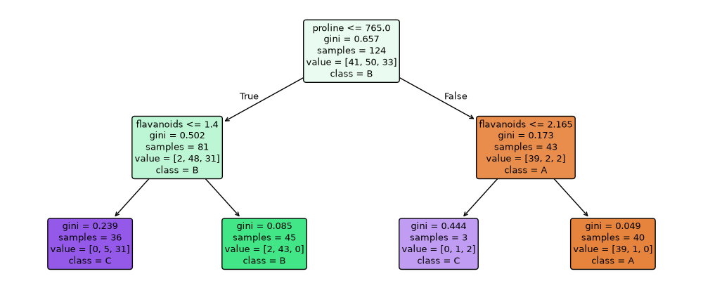

Two questions already classify 85% of test wines correctly. The unlimited tree scores 100% on training data but does slightly worse on test data than the depth-3 tree: classic overfitting (small here, because the dataset is easy).

**Common mistakes:**

- ❌ Growing trees without depth or leaf-size limits.
- ❌ Trusting a single tree's "importance" or structure: retrain on slightly different data and it may look very different.
- ❌ Using a tree to extrapolate (predicting prices beyond anything in the training data).

### Practice

1. Train `DecisionTreeClassifier(min_samples_leaf=10, random_state=0)` on the wine data. How many leaves does it have, and how does test accuracy compare with the unlimited tree?

<details>
<summary><b>Answer</b></summary>

```python
t = DecisionTreeClassifier(min_samples_leaf=10, random_state=0).fit(X_train, y_train)
print(t.get_n_leaves(), round(t.score(X_test, y_test), 3))
```

**Output:**

```text
6 0.796
```

Worse (0.80): with only 124 training wines, requiring 10 wines per leaf stops the tree before it can separate the classes (underfitting). Good limits depend on the data size; choose them with cross-validation.

</details>

**Learn more:** [scikit-learn: decision trees](https://scikit-learn.org/stable/modules/tree.html) · [StatQuest: decision trees (video)](https://www.youtube.com/watch?v=_L39rN6gz7Y) · [R2D3: a visual introduction to ML](http://www.r2d3.us/visual-intro-to-machine-learning-part-1/)

---

## 15. Ensembles: Random Forests and Gradient Boosting (XGBoost, LightGBM, CatBoost)

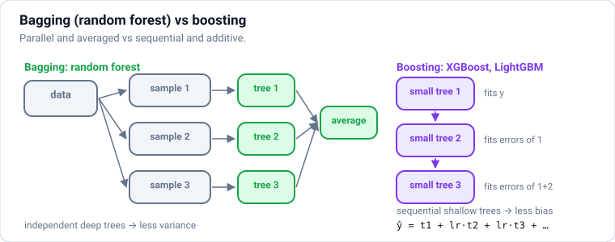

### Theory

> **In simple words:** one decision tree is a nervous expert: it overreacts to details. **Many** trees, combined well, make a calm and accurate committee. **Random forests** train hundreds of trees **independently** on random variations of the data and **average** their votes. **Gradient boosting** trains trees **one after another**, each new tree correcting the mistakes the previous ones still make. For tables of business data, gradient-boosted trees are usually the most accurate models you can use.

**Bagging and random forests (reduce variance):**

1. Draw a **bootstrap sample**: pick n rows **with replacement** (some rows twice, about a third not at all).
2. Grow a deep tree on it, and at **each split consider only a random subset of features** (`max_features`, e.g. √d). This makes the trees different from each other.
3. Repeat for hundreds of trees; **average** their predictions (or vote).

Averaging many different, overfitted trees cancels out their individual errors. Random forests are hard to break: good results with default settings, little tuning, and a free validation estimate from the rows each tree didn't see (the **out-of-bag** score, `oob_score=True`).

**Boosting (reduce bias, step by step):**

1. Start with a simple prediction (the average).
2. Compute the errors (**residuals**) of the current model.
3. Fit a **small** tree (depth 3–8) to predict those errors.
4. Add it to the model, scaled by a **learning rate** (e.g. 0.05): prediction += 0.05 × new tree.
5. Repeat hundreds or thousands of times.

"Gradient" boosting because, for any loss (log loss, MSE, ranking losses), each tree fits the **negative gradient** of the loss: gradient descent (Section [4](#4-maths-for-ml-2-slopes-gradients-and-gradient-descent)), but in the space of functions.

**Key boosting hyperparameters:** `learning_rate` (smaller = more trees needed, usually better), `n_estimators` (number of trees; set high and use **early stopping** on validation data), `max_depth` / `num_leaves` (tree size), `min_child_samples` / `min_child_weight`, `subsample` and `colsample_bytree` (randomness, like random forests), and L1/L2 penalties on leaf values.

**The popular implementations:**

| Library | Known for |
|---|---|
| **XGBoost** | The original fast, regularised implementation; very widely used; GPU support |
| **LightGBM** (Microsoft) | Very fast on large data (histogram-based, leaf-wise growth); native categorical features |
| **CatBoost** (Yandex) | Excellent handling of categorical features with little tuning; ordered boosting reduces leakage |
| **scikit-learn `HistGradientBoosting…`** | Built in, LightGBM-style, handles missing values and categories natively |

**Random forest vs gradient boosting:**

| | Random forest | Gradient boosting |
|---|---|---|
| Trees | Deep, independent, parallel | Shallow, sequential |
| Mainly reduces | Variance | Bias |
| Tuning needed | Little | More (learning rate, trees, depth), but pays off |
| Accuracy on tabular data | Very good | Usually the best |
| Overfitting risk | Low | Higher without early stopping |

**Other ensembles:** **voting** (average several different models) and **stacking** (a second model learns how to combine the first models' predictions), common in competitions.

**2026 context:** gradient-boosted trees remain the default for tabular data in industry (fraud, credit, ranking, pricing, demand). **Tabular foundation models** such as TabPFN (a pretrained transformer that predicts on small tables without training) are strong on small datasets (up to roughly ten thousand rows) and worth trying as another baseline, but boosting is still the workhorse at scale.

### Python

```python
import matplotlib.pyplot as plt
import numpy as np
from sklearn.tree import DecisionTreeRegressor

rng = np.random.default_rng(1)
x = np.sort(rng.uniform(0, 6, 80)).reshape(-1, 1)
y = np.sin(x[:, 0]) + 0.3 * x[:, 0] + rng.normal(0, 0.15, 80)

# Gradient boosting by hand: each small tree fits what the model still gets wrong
prediction = np.full_like(y, y.mean())
fig, axes = plt.subplots(1, 3, figsize=(11, 3), sharey=True, layout="constrained")
panel = 0
for round_ in range(1, 51):
    residual = y - prediction
    stump = DecisionTreeRegressor(max_depth=2).fit(x, residual)
    prediction += 0.3 * stump.predict(x)
    if round_ in (1, 5, 50):
        axes[panel].scatter(x, y, s=10, color="gray")
        axes[panel].plot(x, prediction, color="tab:red", lw=2)
        axes[panel].set_title(f"after {round_} tree{'s' if round_ > 1 else ''}: MSE {np.mean((y - prediction) ** 2):.3f}")
        panel += 1
fig.savefig("boosting-rounds.png", dpi=100)
plt.close(fig)
print("final training MSE:", round(float(np.mean((y - prediction) ** 2)), 4))
```

**Output:**

```text
final training MSE: 0.0033
```

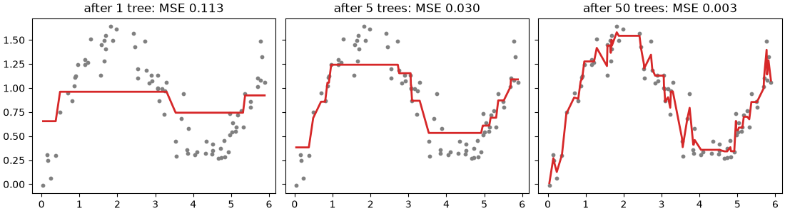

Notice the final training MSE (0.003) is far **below** the noise we added (0.15² ≈ 0.02): after 50 rounds the model has started fitting noise. That's why real boosting watches a **validation** set and stops early, as below.

```python
import lightgbm as lgb
import xgboost as xgb
from sklearn.datasets import make_classification
from sklearn.ensemble import HistGradientBoostingClassifier, RandomForestClassifier
from sklearn.linear_model import LogisticRegression
from sklearn.metrics import roc_auc_score
from sklearn.model_selection import train_test_split
from sklearn.tree import DecisionTreeClassifier

X, y = make_classification(n_samples=20_000, n_features=20, n_informative=10, n_redundant=4,
                           flip_y=0.05, class_sep=0.7, random_state=0)
X_train, X_test, y_train, y_test = train_test_split(X, y, test_size=0.25, random_state=0)

models = {
    "logistic regression": LogisticRegression(max_iter=1000),
    "single tree (depth 8)": DecisionTreeClassifier(max_depth=8, random_state=0),
    "random forest": RandomForestClassifier(n_estimators=300, n_jobs=-1, random_state=0),
    "sklearn HistGB": HistGradientBoostingClassifier(random_state=0),
    "XGBoost": xgb.XGBClassifier(n_estimators=400, learning_rate=0.05, max_depth=6, subsample=0.8,
                                 colsample_bytree=0.8, random_state=0, n_jobs=4),
    "LightGBM": lgb.LGBMClassifier(n_estimators=400, learning_rate=0.05, num_leaves=31, subsample=0.8,
                                   subsample_freq=1, colsample_bytree=0.8, random_state=0, verbose=-1, n_jobs=4),
}
for name, m in models.items():
    m.fit(X_train, y_train)
    auc = roc_auc_score(y_test, m.predict_proba(X_test)[:, 1])
    print(f"{name:22s} ROC-AUC {auc:.3f}")
```

**Output:**

```text
logistic regression    ROC-AUC 0.703
single tree (depth 8)  ROC-AUC 0.859
random forest          ROC-AUC 0.954
sklearn HistGB         ROC-AUC 0.954
XGBoost                ROC-AUC 0.959
LightGBM               ROC-AUC 0.958
```

The ranking is typical: a linear model (which can't capture this non-linear data) < a single tree < random forest < gradient boosting, with the boosting libraries within a whisker of each other. All of these train in seconds here.

```python
X_tr, X_val, y_tr, y_val = train_test_split(X_train, y_train, test_size=0.2, random_state=1)
booster = xgb.XGBClassifier(n_estimators=3000, learning_rate=0.05, max_depth=6, subsample=0.8,
                            colsample_bytree=0.8, early_stopping_rounds=50, eval_metric="logloss",
                            random_state=0, n_jobs=4)
booster.fit(X_tr, y_tr, eval_set=[(X_val, y_val)], verbose=False)
print("trees used before validation loss stopped improving:", booster.best_iteration + 1)
print("test ROC-AUC:", round(roc_auc_score(y_test, booster.predict_proba(X_test)[:, 1]), 3))

forest = models["random forest"]
top = np.argsort(forest.feature_importances_)[::-1][:5]
print("random forest top features:", top, forest.feature_importances_[top].round(3))
```

**Output:**

```text
trees used before validation loss stopped improving: 525
test ROC-AUC: 0.958
random forest top features: [ 6 14 18 15 10] [0.119 0.09  0.075 0.072 0.066]
```

**Early stopping** lets the validation data decide how many trees to use: we asked for up to 3,000, and training stopped once 50 more trees brought no improvement.

**Common mistakes:**

- ❌ Boosting with a high learning rate and many trees, and no early stopping (overfits).
- ❌ Early-stopping on the **test** set. Use a separate validation split.
- ❌ One-hot encoding high-cardinality categories for boosting; LightGBM, CatBoost and `HistGradientBoosting` can use categories directly.
- ❌ Trusting the default `feature_importances_` (impurity-based) blindly: it favours features with many unique values. Prefer permutation importance or SHAP (Section [23](#23-explaining-models-feature-importance-partial-dependence-and-shap)).

### Practice

1. Train `RandomForestClassifier(n_estimators=200, oob_score=True, random_state=0)` on `X_train` and compare its OOB score with its test accuracy.

<details>
<summary><b>Answer</b></summary>

```python
rf = RandomForestClassifier(n_estimators=200, oob_score=True, n_jobs=-1, random_state=0).fit(X_train, y_train)
print(round(rf.oob_score_, 3), round(rf.score(X_test, y_test), 3))
```

**Output:**

```text
0.905 0.911
```

They're close: the out-of-bag estimate is a nearly free stand-in for a validation set.

</details>

**Learn more:** [scikit-learn: ensembles](https://scikit-learn.org/stable/modules/ensemble.html) · [XGBoost: introduction to boosted trees](https://xgboost.readthedocs.io/en/stable/tutorials/model.html) · [LightGBM: parameter tuning](https://lightgbm.readthedocs.io/en/latest/Parameters-Tuning.html) · [Grinsztajn et al., why tree models still beat deep learning on tabular data](https://arxiv.org/abs/2207.08815)

---

## 16. More Classic Models: Support Vector Machines and Naive Bayes

### Theory

> **In simple words:** a **support vector machine (SVM)** draws the boundary between classes with the **widest possible gap** (margin) on each side, which tends to generalise well. With the **kernel trick** it can draw curved boundaries too. **Naive Bayes** is a fast probabilistic classifier that multiplies simple per-feature probabilities; it's a classic, strong baseline for text such as spam filtering.

**SVMs:**

- **Maximum margin:** among all lines that separate the classes, pick the one farthest from the nearest points. Those nearest points are the **support vectors**; only they define the boundary.
- **Soft margin (C):** real data overlaps, so some points may sit inside the margin or on the wrong side, at a cost. **Large C** = few violations allowed (a tighter fit, risk of overfitting); **small C** = a wider, smoother margin.
- **Kernels** let an SVM find curved boundaries by implicitly mapping points into a higher-dimensional space where a straight boundary works, without ever computing that space. `kernel="rbf"` (the default) uses similarity by distance, with `gamma` controlling how far each point's influence reaches (large gamma = wiggly boundaries).
- **Scale features** (distance-based). Kernel SVMs train in roughly O(n²)–O(n³) time, so they're best for up to tens of thousands of rows; `LinearSVC` scales to much bigger, high-dimensional data like text.

**Naive Bayes** applies Bayes' rule (`data-science.md`, probability section): P(class | features) ∝ P(class) × P(feature₁ | class) × P(feature₂ | class) × …

- "Naive" because it assumes features are **independent given the class** (rarely true), yet it often works well, especially with many features.
- Variants: `MultinomialNB` (word counts: text), `BernoulliNB` (present/absent), `GaussianNB` (numeric features assumed normal per class).
- Trains in a single pass over the data; great for huge text datasets, streaming data, and as a baseline.

**Where these stand today:** for tabular data, gradient boosting usually wins; for text and images, deep learning and embeddings usually win. SVMs and Naive Bayes remain useful for small datasets, quick baselines, high-dimensional sparse features, and interviews.

### Python

```python
import matplotlib.pyplot as plt
import numpy as np
from sklearn.datasets import make_moons
from sklearn.model_selection import train_test_split
from sklearn.pipeline import make_pipeline
from sklearn.preprocessing import StandardScaler
from sklearn.svm import SVC

X, y = make_moons(n_samples=400, noise=0.25, random_state=0)       # two interleaving half-moons
X_train, X_test, y_train, y_test = train_test_split(X, y, test_size=0.3, random_state=0)

xx, yy = np.meshgrid(np.linspace(-2, 3, 300), np.linspace(-1.5, 2, 300))
grid = np.column_stack([xx.ravel(), yy.ravel()])
fig, axes = plt.subplots(1, 3, figsize=(11, 3.3), sharey=True, layout="constrained")
settings = [("linear kernel", dict(kernel="linear")), ("RBF, gamma=1", dict(kernel="rbf", gamma=1)),
            ("RBF, gamma=50 (overfits)", dict(kernel="rbf", gamma=50))]
for ax, (title, params) in zip(axes, settings):
    svm = make_pipeline(StandardScaler(), SVC(C=1.0, **params)).fit(X_train, y_train)
    ax.contourf(xx, yy, svm.predict(grid).reshape(xx.shape), alpha=0.25, cmap="coolwarm")
    ax.scatter(X_train[:, 0], X_train[:, 1], c=y_train, s=8, cmap="coolwarm")
    ax.set_title(f"{title}\ntrain {svm.score(X_train, y_train):.2f}  test {svm.score(X_test, y_test):.2f}")
    print(f"{title:26s} support vectors: {svm[-1].n_support_.sum():3d}   test accuracy {svm.score(X_test, y_test):.3f}")
fig.savefig("svm-kernels.png", dpi=100)
plt.close(fig)
```

**Output:**

```text
linear kernel              support vectors: 101   test accuracy 0.908
RBF, gamma=1               support vectors:  81   test accuracy 0.942
RBF, gamma=50 (overfits)   support vectors: 245   test accuracy 0.925
```

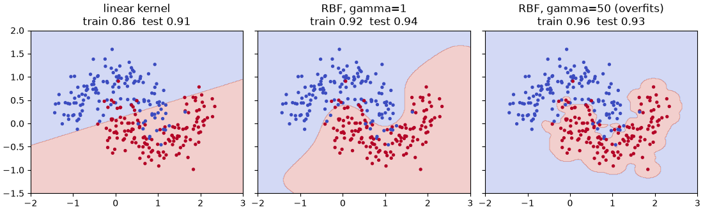

```python
from sklearn.feature_extraction.text import CountVectorizer
from sklearn.naive_bayes import MultinomialNB

texts = ["win a free prize now", "free lottery tickets win cash", "claim your free reward today",
         "meeting moved to monday", "please review the attached report", "lunch at noon tomorrow?",
         "cheap loans win big", "project update and next steps"]
labels = [1, 1, 1, 0, 0, 0, 1, 0]                                  # 1 = spam

spam_filter = make_pipeline(CountVectorizer(), MultinomialNB())    # words → counts → Naive Bayes
spam_filter.fit(texts, labels)
tests = ["free cash prize", "report for monday meeting", "win a free meeting"]
for t, p in zip(tests, spam_filter.predict_proba(tests)[:, 1]):
    print(f"{t!r:30s} P(spam) = {p:.2f}")
```

**Output:**

```text
'free cash prize'              P(spam) = 0.94
'report for monday meeting'    P(spam) = 0.11
'win a free meeting'           P(spam) = 0.89
```

`CountVectorizer` turns each text into word counts (Section [22](#22-classic-text-classification-bag-of-words-and-tf-idf) explains text features properly); Naive Bayes then learns how often each word appears in spam and in normal mail.

**Common mistakes:**

- ❌ Kernel SVMs on hundreds of thousands of rows (very slow). ✅ `LinearSVC`, SGD, or gradient boosting.
- ❌ Unscaled features with SVMs.
- ❌ Treating Naive Bayes probabilities as calibrated: the independence assumption makes them overconfident.

### Practice

1. Tune `C` and `gamma` for the RBF SVM on the moons data with `GridSearchCV` (C in [0.1, 1, 10], gamma in [0.1, 1, 10]). What's the best combination?

<details>
<summary><b>Answer</b></summary>

```python
from sklearn.model_selection import GridSearchCV

search = GridSearchCV(make_pipeline(StandardScaler(), SVC()),
                      {"svc__C": [0.1, 1, 10], "svc__gamma": [0.1, 1, 10]}, cv=5).fit(X_train, y_train)
print(search.best_params_, round(search.best_score_, 3), round(search.score(X_test, y_test), 3))
```

**Output:**

```text
{'svc__C': 1, 'svc__gamma': 1} 0.921 0.942
```

</details>

---

### ✅ Part 3 checkpoint

Without looking, can you:

- [ ] Build a pipeline with `ColumnTransformer` that imputes, scales and one-hot encodes, and explain how it prevents leakage?
- [ ] Run stratified, grouped and time-series cross-validation, and tune hyperparameters with grid search, random search or Optuna?
- [ ] Explain L1 vs L2 regularisation and why Lasso selects features?
- [ ] Explain how a decision tree chooses splits, and how to stop it overfitting?
- [ ] Compare random forests and gradient boosting, and use XGBoost or LightGBM with early stopping?
- [ ] Explain the SVM margin, `C`, kernels and `gamma`, and when Naive Bayes is a good baseline?

**Learn more:** [scikit-learn: SVMs](https://scikit-learn.org/stable/modules/svm.html) · [scikit-learn: Naive Bayes](https://scikit-learn.org/stable/modules/naive_bayes.html) · [scikit-learn: choosing the right estimator](https://scikit-learn.org/stable/machine_learning_map.html)

---

# Part 4 — Moderate: Unsupervised Learning and Special Problems

> **Goal:** Cluster and compress data, handle rare events and anomalies, forecast time series, build recommenders, and classify text.  
> **You need:** Parts 1–3.

---

## 17. Clustering: k-Means, DBSCAN and Hierarchical Clustering

### Theory

> **In simple words:** clustering finds **groups of similar things without being told the groups**. Give it customers' spending and visit patterns, and it might find "bargain hunters", "loyal big spenders" and "one-time visitors". There are no labels, so there's no single right answer; you judge clusters by whether they're **well separated** and **useful**.

**k-means** (the most used):

1. Choose k (the number of clusters) and place k **centroids** (centre points), e.g. at random rows (scikit-learn uses the smarter `k-means++` start).
2. **Assign** every point to its nearest centroid.
3. **Move** each centroid to the average of its points.
4. Repeat 2–3 until nothing changes.

It minimises **inertia**, the total squared distance from points to their centroid. Fast and simple, but it assumes round, similar-sized clusters, needs k up front, and is sensitive to scale (**standardise first**) and outliers.

**Choosing k:**

- **Elbow method:** plot inertia against k; inertia always falls, so look for the "elbow" where extra clusters stop helping much.
- **Silhouette score** (−1 to 1): for each point, how much closer it is to its own cluster than to the next nearest. Higher is better; pick the k with the best average.
- **Usefulness:** can the business act on the segments? Sometimes 4 clear segments beat 7 slightly "better" ones.

**Other algorithms:**

| Algorithm | Idea | Good for | Watch out |
|---|---|---|---|
| **DBSCAN** | Clusters are dense regions; points in sparse regions are **noise** | Any cluster shape; finds outliers; no k needed | Choosing `eps` (neighbourhood radius); clusters of different densities |
| **HDBSCAN** | DBSCAN over many densities, keeps stable clusters | Varying densities, fewer settings; a strong modern default | Slower on very large data |
| **Hierarchical (agglomerative)** | Start with every point alone; repeatedly merge the closest pair; the merge tree (**dendrogram**) shows clusters at every level | Small data, nested groupings, taxonomies | O(n²) memory |
| **Gaussian mixture** | Soft clusters: each point gets a probability for each cluster | Overlapping, elliptical clusters | Assumes normal-shaped clusters |

**Uses in industry:** customer segmentation, grouping similar documents or support tickets (often on **embeddings** from an LLM), deduplicating near-identical items, image colour quantisation, and as a feature for supervised models ("cluster id").

### Python

```python
import matplotlib.pyplot as plt
import numpy as np
import pandas as pd
from sklearn.cluster import KMeans
from sklearn.metrics import silhouette_score
from sklearn.preprocessing import StandardScaler

rng = np.random.default_rng(3)
segments = [  # (visits per month, average spend in ₹, number of customers)
    (2, 400, 150), (12, 350, 120), (6, 2500, 80), (1, 4500, 40),
]
rows = [np.column_stack([rng.normal(v, v * 0.25 + 0.5, n), rng.normal(s, s * 0.15, n)]) for v, s, n in segments]
customers = pd.DataFrame(np.vstack(rows), columns=["visits", "avg_spend"]).clip(lower=0)
X = StandardScaler().fit_transform(customers)

inertias, silhouettes = [], []
for k in range(2, 9):
    km = KMeans(n_clusters=k, n_init=10, random_state=0).fit(X)
    inertias.append(km.inertia_)
    silhouettes.append(silhouette_score(X, km.labels_))
    print(f"k={k}  inertia {km.inertia_:7.1f}  silhouette {silhouettes[-1]:.3f}")

best_k = range(2, 9)[int(np.argmax(silhouettes))]
km = KMeans(n_clusters=best_k, n_init=10, random_state=0).fit(X)
customers["segment"] = km.labels_
print(customers.groupby("segment").agg(customers=("visits", "size"), visits=("visits", "mean"),
                                       avg_spend=("avg_spend", "mean")).round(1))
```

**Output:**

```text
k=2  inertia   433.9  silhouette 0.487
k=3  inertia   155.8  silhouette 0.660
k=4  inertia    80.0  silhouette 0.704
k=5  inertia    49.8  silhouette 0.684
k=6  inertia    40.7  silhouette 0.643
k=7  inertia    33.9  silhouette 0.633
k=8  inertia    28.6  silhouette 0.621
         customers  visits  avg_spend
segment                              
0              160     2.2      402.6
1               80     6.2     2524.4
2              110    12.8      355.1
3               40     0.9     4394.5
```

```python
fig, axes = plt.subplots(1, 2, figsize=(10, 3.6), layout="constrained")
axes[0].plot(range(2, 9), inertias, "o-")
axes[0].set(title="Elbow: inertia by k", xlabel="k", ylabel="inertia")
axes[1].scatter(customers["visits"], customers["avg_spend"], c=customers["segment"], cmap="tab10", s=12)
axes[1].set(title=f"k-means segments (k={best_k})", xlabel="visits per month", ylabel="average spend (₹)")
fig.savefig("kmeans-segments.png", dpi=100)
plt.close(fig)
```

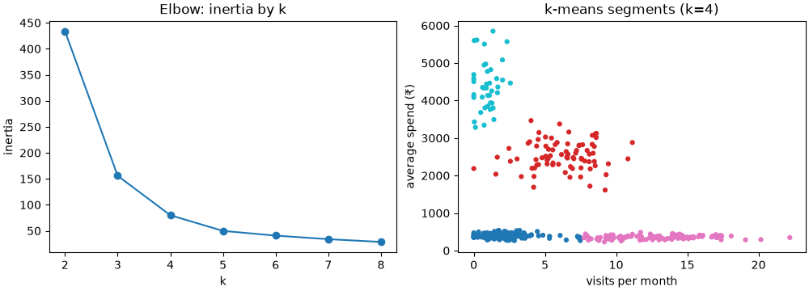

The silhouette score picks k = 4, matching the four groups we generated. With real data the groups won't be this clean, so combine the scores with a look at what each segment means.

```python
from sklearn.cluster import DBSCAN, HDBSCAN
from sklearn.datasets import make_moons

Xm, _ = make_moons(n_samples=300, noise=0.07, random_state=0)
Xm = np.vstack([Xm, [[2.5, 1.5], [-1.5, -0.8]]])            # two obvious outliers
for name, model in [("k-means", KMeans(n_clusters=2, n_init=10, random_state=0)),
                    ("DBSCAN", DBSCAN(eps=0.2, min_samples=5)),
                    ("HDBSCAN", HDBSCAN(min_cluster_size=15, copy=True))]:
    labels = model.fit_predict(Xm)
    print(f"{name:8s} clusters: {len(set(labels) - {-1})}  noise points: {int(np.sum(labels == -1))}")
```

**Output:**

```text
k-means  clusters: 2  noise points: 0
DBSCAN   clusters: 2  noise points: 2
HDBSCAN  clusters: 2  noise points: 10
```

On two interleaving moons, k-means cuts straight across them (it can only make round clusters). DBSCAN and HDBSCAN follow the moon shapes and label points in sparse areas as **noise** (`-1`): DBSCAN flags exactly the two stray points; HDBSCAN is more cautious and also flags a few points on the moons' thin edges.

**Common mistakes:**

- ❌ Clustering unscaled features (spend in thousands dominates visits in single digits).
- ❌ Treating clusters as "truth": different algorithms and settings give different, equally valid groupings.
- ❌ k-means on non-round shapes, or with many outliers.
- ❌ Clustering hundreds of raw features; reduce dimensions first (next section).

### Practice

1. Describe each of the 4 segments in plain words and suggest one marketing action for each.

<details>
<summary><b>Answer</b></summary>

From the table (segment numbers may differ): **occasional low spenders** (≈2 visits, ≈₹400): win-back offers; **frequent low spenders** (≈12 visits, ≈₹350): loyalty points to grow basket size; **regular high spenders** (≈6 visits, ≈₹2,500): premium service and early access; **rare big spenders** (≈1 visit, ≈₹4,500): reminders around big purchase occasions.

</details>

**Learn more:** [scikit-learn: clustering](https://scikit-learn.org/stable/modules/clustering.html) · [StatQuest: k-means (video)](https://www.youtube.com/watch?v=4b5d3muPQmA)

---

## 18. Dimensionality Reduction: PCA, t-SNE and UMAP

### Theory

> **In simple words:** a dataset can have hundreds of columns, many of them saying nearly the same thing. **Dimensionality reduction** squeezes them into a few new columns that keep most of the information. **PCA** does it with straight-line combinations, great for speeding up models and removing noise. **t-SNE** and **UMAP** make 2D "maps" where similar items land near each other, great for **looking** at data (and embeddings).

**PCA (principal component analysis):**

1. Standardise the features.
2. Find the direction along which the data **varies most**: that's principal component 1 (PC1).
3. Find the next direction of most variance, at right angles to PC1: PC2. And so on.
4. Keep the first k components and describe each row by its coordinates along them.

Each component is a weighted mix of the original features (its weights are called **loadings**). The **explained variance ratio** says how much of the total variation each component captures; keeping enough components for ~90–95% is a common rule. (Mathematically, the components are the eigenvectors of the covariance matrix, computed with the SVD; see Section [3](#3-maths-for-ml-1-vectors-matrices-and-the-dot-product).)

**Uses of PCA:** fewer features for faster training, less noise, fighting the curse of dimensionality, compressing data, removing correlated features (the components are uncorrelated), and a quick 2D view. Limits: it only finds **linear** structure, and components can be hard to interpret.

**t-SNE and UMAP (for visualisation):**

- **t-SNE** keeps **neighbours** together: points that are close in the original space end up close on the map. Great pictures, but distances **between** clusters and cluster sizes on the map mean little, it's slow on big data, and it can't place new points.
- **UMAP** does a similar job, is faster, keeps more of the global structure, and can transform new data. It's the common choice for visualising embeddings (`pip install umap-learn`).
- Use them to **explore**, not as model features, and try a couple of settings (`perplexity` for t-SNE, `n_neighbors` for UMAP) before concluding anything.

**Related methods:** `TruncatedSVD` (PCA for sparse data such as word counts; the core of latent semantic analysis and matrix-factorisation recommenders, Section [21](#21-recommender-systems)), autoencoders (neural networks that compress and reconstruct; `deep-learning.md`), and **embeddings** themselves, learned low-dimensional representations used throughout modern AI.

### Python

```python
import matplotlib.pyplot as plt
import numpy as np
from sklearn.datasets import load_digits
from sklearn.decomposition import PCA
from sklearn.linear_model import LogisticRegression
from sklearn.manifold import TSNE
from sklearn.model_selection import cross_val_score
from sklearn.pipeline import make_pipeline
from sklearn.preprocessing import StandardScaler

digits = load_digits()                       # 1,797 images of handwritten digits, 8×8 pixels = 64 features
X, y = digits.data, digits.target
print(X.shape)

pca = PCA().fit(StandardScaler().fit_transform(X))
cumulative = np.cumsum(pca.explained_variance_ratio_)
for k in (2, 10, 20, 30, 40):
    print(f"{k:2d} components keep {cumulative[k - 1]:.0%} of the variance")
print("components needed for 90%:", int(np.searchsorted(cumulative, 0.90)) + 1)
```

**Output:**

```text
(1797, 64)
 2 components keep 22% of the variance
10 components keep 59% of the variance
20 components keep 79% of the variance
30 components keep 89% of the variance
40 components keep 95% of the variance
components needed for 90%: 31
```

```python
for n in (5, 10, 20, 64):
    steps = [StandardScaler()] + ([PCA(n_components=n)] if n < 64 else []) + [LogisticRegression(max_iter=2000)]
    acc = cross_val_score(make_pipeline(*steps), X, y, cv=5).mean()
    print(f"{n:2d} features -> accuracy {acc:.3f}")
```

**Output:**

```text
 5 features -> accuracy 0.771
10 features -> accuracy 0.840
20 features -> accuracy 0.899
64 features -> accuracy 0.920
```

With 20 of the 64 dimensions, the classifier keeps most of its accuracy (0.90 vs 0.92) using less than a third of the features. Whether that trade is worth it depends on how much speed or memory matters.

```python
X2_pca = PCA(n_components=2).fit_transform(StandardScaler().fit_transform(X))
X2_tsne = TSNE(n_components=2, perplexity=30, random_state=0).fit_transform(X)

fig, axes = plt.subplots(1, 2, figsize=(10, 4.2), layout="constrained")
for ax, pts, title in [(axes[0], X2_pca, "PCA (linear): digits overlap"), (axes[1], X2_tsne, "t-SNE: clear digit clusters")]:
    sc = ax.scatter(pts[:, 0], pts[:, 1], c=y, cmap="tab10", s=5)
    ax.set_title(title)
    ax.set_xticks([]); ax.set_yticks([])
fig.colorbar(sc, ax=axes, ticks=range(10), label="digit")
fig.savefig("pca-tsne-digits.png", dpi=100)
plt.close(fig)
```

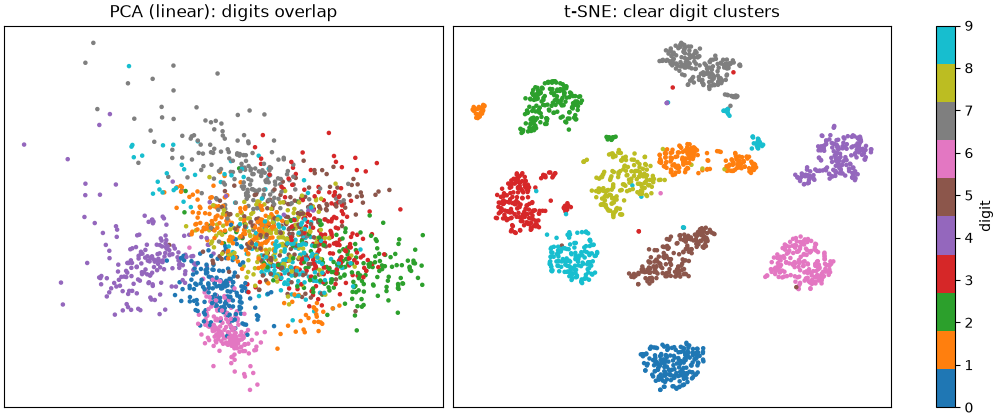

**Common mistakes:**

- ❌ PCA without standardising (features with big numbers dominate the components).
- ❌ Fitting PCA on all data before splitting (leakage). Put it in the pipeline.
- ❌ Reading t-SNE cluster sizes or distances between clusters as meaningful.
- ❌ Using t-SNE output as model features (it can't transform new data consistently).

### Practice

1. Use `PCA(n_components=0.95)` (a fraction means "keep enough components for 95% of the variance"). How many components does it keep for the digits?

<details>
<summary><b>Answer</b></summary>

```python
p95 = PCA(n_components=0.95).fit(StandardScaler().fit_transform(X))
print(p95.n_components_)
```

**Output:**

```text
40
```

</details>

**Learn more:** [scikit-learn: decomposition (PCA and more)](https://scikit-learn.org/stable/modules/decomposition.html) · [How to use t-SNE effectively (Distill)](https://distill.pub/2016/misread-tsne/) · [UMAP documentation](https://umap-learn.readthedocs.io/)

---

## 19. Rare Events: Imbalanced Classes and Anomaly Detection

### Theory

> **In simple words:** many important problems are about **rare** things: fraud (0.1% of payments), machine failures, rare diseases, intrusions. Two approaches: if you have **labelled** examples of the rare class, train a classifier that's adjusted for imbalance; if you have few or no labels, use **anomaly detection** to flag whatever looks unusual.

**Imbalanced classification: what actually works**

1. **Use the right metrics:** precision, recall, PR-AUC, and cost-based numbers, never plain accuracy (Section [9](#9-measuring-classifiers-confusion-matrix-precision-recall-roc-and-pr-curves)).
2. **Move the threshold:** train normally, then choose the threshold on validation data to hit the precision/recall you need. Often the single most effective step.
3. **Class weights:** tell the model a mistake on the rare class costs more: `class_weight="balanced"` (scikit-learn) or `scale_pos_weight` (XGBoost/LightGBM). Simple and usually enough.
4. **Resampling** (the `imbalanced-learn` library): **undersample** the common class (fast, loses data), **oversample** the rare class, or create synthetic rare examples (**SMOTE**). Resample **only the training folds**, never the validation/test data. Modern practice finds weights plus threshold tuning usually match resampling, with less risk.
5. **Get more positive examples** and better features: often worth more than any trick.

Note: class weights and resampling shift the predicted **probabilities** upwards for the rare class; recalibrate if you need real probabilities.

**Anomaly (outlier) detection: when labels are scarce**

| Method | Idea | Notes |
|---|---|---|
| **Statistical rules** | z-score, IQR, per-feature limits | Simple, explainable; one feature at a time |
| **Isolation Forest** | Random splits isolate unusual points in **fewer** splits | Fast, scales well, few settings: the usual first choice |
| **Local Outlier Factor (LOF)** | A point in a much sparser neighbourhood than its neighbours is an outlier | Good for local, density-based anomalies |
| **One-Class SVM** | Learns a boundary around normal data | Sensitive to settings; small data |
| **Autoencoders** | A neural network learns to rebuild normal data; badly rebuilt rows are anomalies | Complex data: images, sensor streams, logs |
| **Time-series methods** | Compare each value with a forecast or a rolling range | Metrics, monitoring, IoT |

The `contamination` setting (expected share of anomalies) sets the threshold. **Evaluate** with whatever labels you have (a few confirmed fraud cases, incident reports), and have humans review the top-scored cases: anomaly detectors find **unusual**, which isn't always **bad**.

**In production (fraud as an example):** real systems combine rules, supervised models trained on confirmed fraud, and anomaly scores for new patterns; they review borderline cases by hand, feed those decisions back as labels, and retrain often because fraudsters adapt.

### Python

```python
import numpy as np
from sklearn.datasets import make_classification
from sklearn.linear_model import LogisticRegression
from sklearn.metrics import average_precision_score, precision_score, recall_score
from sklearn.model_selection import train_test_split

X, y = make_classification(n_samples=30_000, n_features=15, n_informative=6, weights=[0.99],
                           class_sep=1.0, random_state=1)              # 1% positives
X_train, X_test, y_train, y_test = train_test_split(X, y, test_size=0.3, stratify=y, random_state=0)
print("positives in training data:", int(y_train.sum()), "of", len(y_train))

for name, weights in [("no weights", None), ("class_weight='balanced'", "balanced")]:
    m = LogisticRegression(class_weight=weights, max_iter=1000).fit(X_train, y_train)
    pred, proba = m.predict(X_test), m.predict_proba(X_test)[:, 1]
    print(f"{name:25s} precision {precision_score(y_test, pred):.2f}  recall {recall_score(y_test, pred):.2f}"
          f"  PR-AUC {average_precision_score(y_test, proba):.3f}  mean P(positive) {proba.mean():.3f}")
```

**Output:**

```text
positives in training data: 324 of 21000
no weights                precision 1.00  recall 0.17  PR-AUC 0.380  mean P(positive) 0.015
class_weight='balanced'   precision 0.05  recall 0.71  PR-AUC 0.352  mean P(positive) 0.347
```

Class weights raise recall a lot (at the cost of precision) but barely change PR-AUC: the model **ranks** cases about equally well either way; weights mainly move where the default 0.5 threshold falls. They also inflate the predicted probabilities far above the true 1% rate, so recalibrate if the probabilities themselves matter.

```python
from sklearn.ensemble import IsolationForest
from sklearn.neighbors import LocalOutlierFactor

rng = np.random.default_rng(0)
normal = rng.normal(loc=[50, 2], scale=[15, 0.8], size=(2000, 2))      # amount (₹ hundreds), transactions per hour
odd = np.array([[400, 1], [60, 12], [300, 9], [5, 15], [250, 0.2]])      # 5 unusual payments
payments = np.vstack([normal, odd])
is_odd = np.r_[np.zeros(2000), np.ones(5)]

iso = IsolationForest(contamination=0.005, random_state=0).fit(payments)
flag_iso = iso.predict(payments) == -1                                  # -1 = anomaly
lof = LocalOutlierFactor(n_neighbors=30, contamination=0.005)
flag_lof = lof.fit_predict(payments) == -1
print("Isolation Forest flagged", flag_iso.sum(), "rows; caught", int(flag_iso[is_odd == 1].sum()), "of 5 planted anomalies")
print("LOF flagged", flag_lof.sum(), "rows; caught", int(flag_lof[is_odd == 1].sum()), "of 5")
print("most anomalous rows:", np.argsort(iso.score_samples(payments))[:5])
```

**Output:**

```text
Isolation Forest flagged 11 rows; caught 5 of 5 planted anomalies
LOF flagged 11 rows; caught 5 of 5
most anomalous rows: [2002 2003 2004  547 2000]
```

Both detectors catch all five planted anomalies (rows 2000–2004), plus six extreme-but-normal rows (such as row 547, which even ranks among the top five). That's typical: a person reviews the top of the list and decides.

**Common mistakes:**

- ❌ Resampling (e.g. SMOTE) **before** splitting, so synthetic copies of test points leak into training.
- ❌ Judging a fraud model by accuracy or ROC-AUC alone.
- ❌ Treating every anomaly as bad, or every non-flagged row as fine.
- ❌ Training once and forgetting: rare-event patterns drift quickly (Section [28](#28-monitoring-models-in-production-data-drift-concept-drift-and-retraining)).

### Practice

1. For the weighted and unweighted logistic models, find the threshold that gives recall ≥ 0.5 on the test set, and compare precision there. What do you notice?

<details>
<summary><b>Answer</b></summary>

```python
from sklearn.metrics import precision_recall_curve

for weights in (None, "balanced"):
    proba = LogisticRegression(class_weight=weights, max_iter=1000).fit(X_train, y_train).predict_proba(X_test)[:, 1]
    precision, recall, thresholds = precision_recall_curve(y_test, proba)
    i = np.where(recall[:-1] >= 0.5)[0][-1]                              # highest threshold that still has recall >= 0.5
    print(f"{str(weights):9s} threshold {thresholds[i]:.3f}  precision {precision[i]:.2f}  recall {recall[i]:.2f}")
```

**Output:**

```text
None      threshold 0.067  precision 0.22  recall 0.50
balanced  threshold 0.752  precision 0.23  recall 0.50
```

At the same recall, both models have about the same precision; only the threshold differs. Class weighting mostly moves the threshold for you; it doesn't make the model see the positives more clearly.

</details>

**Learn more:** [imbalanced-learn documentation](https://imbalanced-learn.org/stable/) · [scikit-learn: novelty and outlier detection](https://scikit-learn.org/stable/modules/outlier_detection.html) · [scikit-learn: tuning the decision threshold](https://scikit-learn.org/stable/modules/classification_threshold.html)

---

## 20. Time-Series Forecasting with Machine Learning

### Theory

> **In simple words:** forecasting predicts **future** values of something measured over time: tomorrow's sales, next hour's electricity demand, next week's app sign-ups. The trick with ML is to turn the past into **features** ("sales yesterday", "sales same day last week", "is it a holiday?") and then use a normal regression model, while being strict that the model **never sees the future** during training or testing.

**Parts of a time series:** **trend** (long-term rise or fall), **seasonality** (repeating patterns: daily, weekly, yearly), **events** (holidays, promotions, outages) and **noise**.

**Always start with baselines:**

- **Naive:** tomorrow = today.
- **Seasonal naive:** next Monday = last Monday. Surprisingly hard to beat for strongly seasonal data.
- **Moving average** of the last few periods.

**Families of methods:**

| Family | Examples | Good for |
|---|---|---|
| Statistical | ETS / Holt–Winters, ARIMA/SARIMA, Prophet (`statsmodels`, `statsforecast`) | Single series, clear patterns, small data, explainability |
| **ML with lag features** | Gradient boosting (LightGBM, XGBoost) on lags, rolling statistics and calendar features | **Many related series** (thousands of products or stores), external drivers (price, weather, promotions): the most common industry approach |
| Deep learning | N-BEATS, N-HiTS, Temporal Fusion Transformer, DeepAR | Very large collections of series |
| **Foundation models** | TimesFM (Google), Chronos (Amazon), Moirai (Salesforce) | Pretrained on many series; zero-shot forecasts with no training; a strong new baseline since 2024 |

**Building features for ML forecasting:**

- **Lags:** the value 1, 7, 14, 28 days ago.
- **Rolling statistics** over past windows: mean and std of the last 7 / 28 days, **shifted** so they only use data available at prediction time.
- **Calendar:** day of week, month, holidays, paydays, festivals.
- **Known future drivers:** planned prices, promotions, weather forecasts.

**Forecasting several steps ahead:** **recursive** (predict tomorrow, feed it back as a lag, predict the next day…; errors compound) or **direct** (a separate model or a "horizon" feature for each step ahead).

**Evaluating correctly: backtesting.** Train on data up to a cut-off, forecast the next period, move the cut-off forward, repeat (`TimeSeriesSplit`, Section [12](#12-cross-validation-and-hyperparameter-tuning)). Metrics: **MAE**, **RMSE**, **MAPE** (percentage error; breaks when actual values are near 0), **WAPE** (total absolute error ÷ total actual; robust and popular in retail), and **MASE** (error relative to the seasonal-naive baseline: below 1 means you beat it).

**Uncertainty:** planners need ranges, not just one number. **Quantile regression** (e.g. LightGBM with `objective="quantile"`, or `HistGradientBoostingRegressor(loss="quantile")`) predicts the 10th and 90th percentiles directly.

### Python

```python
import matplotlib.pyplot as plt
import numpy as np
import pandas as pd
from sklearn.ensemble import HistGradientBoostingRegressor

rng = np.random.default_rng(0)
days = pd.date_range("2023-01-01", "2025-06-30", freq="D")
t = np.arange(len(days))
weekly = np.array([0, -5, -5, -3, 5, 25, 30])[days.dayofweek]        # Mon..Sun pattern: weekends busy
yearly = 15 * np.sin(2 * np.pi * (days.dayofyear - 80) / 365.25)
promo = (rng.uniform(size=len(days)) < 0.05).astype(int)             # random promotion days
sales = 200 + 0.08 * t + weekly + yearly + 40 * promo + rng.normal(0, 8, len(days))
df = pd.DataFrame({"sales": sales.round(), "promo": promo}, index=days)

for lag in (1, 7, 14, 28):
    df[f"lag_{lag}"] = df["sales"].shift(lag)
df["roll_mean_7"] = df["sales"].shift(1).rolling(7).mean()          # shift(1): only past days
df["roll_mean_28"] = df["sales"].shift(1).rolling(28).mean()
df["dayofweek"] = df.index.dayofweek
df["dayofyear"] = df.index.dayofyear
df = df.dropna()
print(df.iloc[:2, :6])
```

**Output:**

```text
            sales  promo  lag_1  lag_7  lag_14  lag_28
2023-01-29  213.0      0  218.0  206.0   226.0   211.0
2023-01-30  192.0      0  213.0  186.0   179.0   184.0
```

```python
def wape(actual, forecast):
    return np.abs(actual - forecast).sum() / np.abs(actual).sum()

features = [c for c in df.columns if c != "sales"]
results = {"seasonal naive": [], "gradient boosting": []}
for cutoff in pd.date_range("2025-01-01", "2025-06-01", freq="MS"):      # six monthly backtests
    train = df[df.index < cutoff]
    test = df[(df.index >= cutoff) & (df.index < cutoff + pd.DateOffset(months=1))]
    model = HistGradientBoostingRegressor(max_iter=300, learning_rate=0.05, random_state=0)
    model.fit(train[features], train["sales"])
    results["gradient boosting"].append(wape(test["sales"], model.predict(test[features])))
    results["seasonal naive"].append(wape(test["sales"], test["lag_7"]))
for name, scores in results.items():
    print(f"{name:18s} WAPE per month: {np.round(scores, 3)}  mean {np.mean(scores):.3f}")
```

**Output:**

```text
seasonal naive     WAPE per month: [0.048 0.054 0.047 0.056 0.048 0.034]  mean 0.048
gradient boosting  WAPE per month: [0.03  0.036 0.036 0.038 0.035 0.022]  mean 0.033
```

Gradient boosting beats the seasonal-naive baseline in every month, with about 30% lower error. Each backtest trains only on data **before** its month, then forecasts that month, just as the model would be used in real life. (For simplicity the lags here use actual past values, i.e. one-day-ahead forecasts; forecasting a whole month ahead needs the recursive or direct approach from the theory.)

```python
test = df[df.index >= "2025-06-01"]
train = df[df.index < "2025-06-01"]
low = HistGradientBoostingRegressor(loss="quantile", quantile=0.1, max_iter=300, random_state=0).fit(train[features], train["sales"])
high = HistGradientBoostingRegressor(loss="quantile", quantile=0.9, max_iter=300, random_state=0).fit(train[features], train["sales"])
mid = model.predict(test[features])

fig, ax = plt.subplots(figsize=(9, 3.4), layout="constrained")
ax.plot(df.index[-75:], df["sales"].iloc[-75:], color="gray", label="actual")
ax.plot(test.index, mid, color="tab:blue", label="forecast")
ax.fill_between(test.index, low.predict(test[features]), high.predict(test[features]), alpha=0.25, label="10–90% range")
ax.set(title="June 2025 forecast with an uncertainty band", ylabel="units sold")
ax.legend(loc="upper left")
fig.savefig("forecast-june.png", dpi=100)
plt.close(fig)
inside = np.mean((test["sales"] >= low.predict(test[features])) & (test["sales"] <= high.predict(test[features])))
print(f"share of June days inside the 10–90% band: {inside:.0%}")
```

**Output:**

```text
share of June days inside the 10–90% band: 60%
```

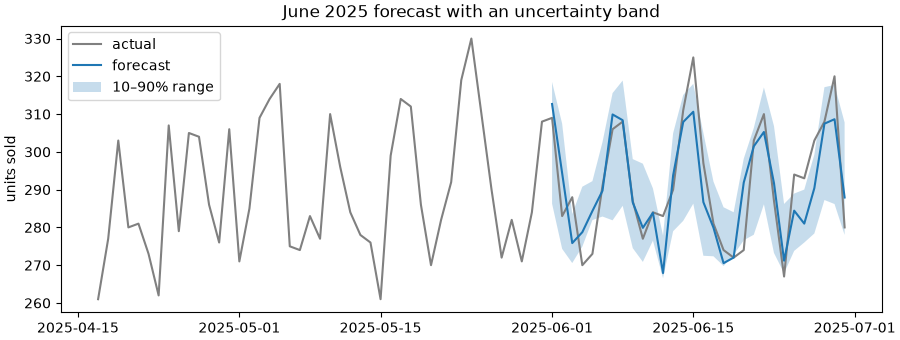

A 10–90% band should contain about 80% of days; here it holds only 60%, so these quantile models are **overconfident** (30 days is also a small sample). Always check coverage in backtests, and widen the band if needed; **conformal prediction** is a principled way to do that.

**Common mistakes:**

- ❌ Random train/test splits on time series (the model learns from the future).
- ❌ Rolling features that include the current day (`rolling(7).mean()` without `shift(1)`): leakage.
- ❌ Skipping the seasonal-naive baseline, and never checking MASE < 1.
- ❌ Using MAPE when actual values can be near zero.
- ❌ Forgetting that at forecast time, lag features for future days don't exist yet.

### Practice

1. Remove the `promo` feature and rerun the backtests. How much worse does gradient boosting get, and why can't the seasonal-naive baseline use promotions at all?

<details>
<summary><b>Answer</b></summary>

```python
no_promo = [f for f in features if f != "promo"]
scores = []
for cutoff in pd.date_range("2025-01-01", "2025-06-01", freq="MS"):
    train = df[df.index < cutoff]
    test = df[(df.index >= cutoff) & (df.index < cutoff + pd.DateOffset(months=1))]
    m = HistGradientBoostingRegressor(max_iter=300, learning_rate=0.05, random_state=0).fit(train[no_promo], train["sales"])
    scores.append(wape(test["sales"], m.predict(test[no_promo])))
print(round(float(np.mean(scores)), 3))
```

**Output:**

```text
0.04
```

Noticeably worse (0.040 vs 0.033): promotion days add about 40 units, and without the feature the model can't know which days they are. Seasonal naive just copies last week, so it can never anticipate a planned promotion; ML models can use **known future drivers**.

</details>

**Learn more:** [Forecasting: Principles and Practice (free book)](https://otexts.com/fpp3/) · [Nixtla statsforecast and mlforecast](https://nixtlaverse.nixtla.io/) · [Chronos: pretrained forecasting models](https://github.com/amazon-science/chronos-forecasting)

---

## 21. Recommender Systems

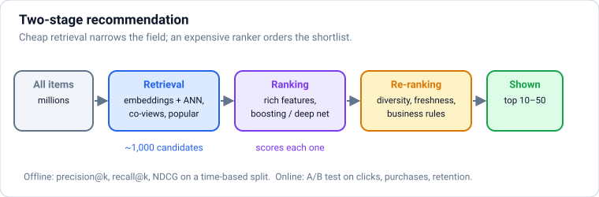

### Theory

> **In simple words:** a recommender guesses what each person will like next: "customers who bought this also bought", "because you watched…", your social-media feed. It learns from what people **did** (clicks, purchases, watch time, ratings) and from what items **are** (category, text, price).

**The main approaches:**

| Approach | Idea | Strength | Weakness |
|---|---|---|---|
| **Popularity** | Recommend what's popular (overall, or in your city this week) | Strong baseline; works for new users | Same for everyone |
| **Content-based** | Recommend items **similar** to what you liked (same genre, similar description embeddings) | Works for new items; explainable | Stays in a bubble; needs good item features |
| **Collaborative filtering** | People who agreed in the past will agree again: **user-based** ("users like you liked…") or **item-based** ("people who liked X also liked Y") | Finds surprising links without any item features | **Cold start**: nothing to go on for new users or items |
| **Matrix factorisation** | Learn a short vector (**embedding**) for every user and item so that their dot product predicts interest | Compact, scales well; the idea behind the Netflix Prize winners | Needs enough interaction data |
| **Two-tower neural models + ranking models** | A user tower and an item tower produce embeddings for fast retrieval; a second model ranks the shortlist with many features | The industry standard at scale (YouTube, e-commerce, feeds) | Engineering-heavy |

**Explicit vs implicit feedback:** ratings (explicit) are rare; clicks, views, purchases and watch time (implicit) are plentiful but noisy (not clicking isn't the same as disliking). Most real systems learn from implicit feedback.

**How large companies build it (two stages):**

1. **Candidate retrieval:** from millions of items, quickly fetch a few hundred plausible ones, using embedding nearest-neighbour search (ANN; Section [10](#10-k-nearest-neighbours-distances-and-feature-scaling)), co-occurrence lists, popularity and rules.
2. **Ranking:** a model (often gradient boosting or a deep network) scores each candidate with rich features (user history, item stats, context like time and device) for the target (click, purchase, watch time).
3. **Re-ranking / business rules:** diversity, freshness, removing already-bought items, fairness to sellers.

**Evaluation:** offline, hide some of each user's later interactions and measure **precision@k**, **recall@k**, **NDCG** (rewards putting relevant items near the top) and coverage/diversity. Online, **A/B tests** on the real goal (sales, retention, watch time) decide, since offline metrics often disagree with online results.

**2026 trends:** LLM-generated item descriptions and embeddings for content features and cold start, sequence models (transformers over a user's history) for next-item prediction, and "generative retrieval" research, but the retrieval-plus-ranking structure remains standard.

### Python

```python
import numpy as np
import pandas as pd

items = ["Python book", "SQL book", "ML book", "Keyboard", "Mouse", "Monitor", "Yoga mat", "Dumbbells"]
purchases = pd.DataFrame(
    [[1, 1, 1, 0, 0, 0, 0, 0],      # user 0: data books
     [1, 1, 0, 0, 0, 0, 0, 0],      # user 1
     [0, 1, 1, 0, 0, 1, 0, 0],      # user 2
     [0, 0, 0, 1, 1, 1, 0, 0],      # user 3: desk setup
     [0, 0, 0, 1, 1, 0, 0, 0],      # user 4
     [0, 0, 0, 0, 0, 0, 1, 1],      # user 5: fitness
     [1, 0, 0, 1, 0, 0, 1, 0],      # user 6: mixed
     [0, 0, 0, 0, 1, 1, 0, 0]],     # user 7
    columns=items)

M = purchases.to_numpy(dtype=float)
unit = M / np.linalg.norm(M, axis=0, keepdims=True)          # normalise each item's column
item_sim = unit.T @ unit                                      # cosine similarity between every pair of items
np.fill_diagonal(item_sim, 0)
sim = pd.DataFrame(item_sim, index=items, columns=items)
print("people who bought 'Keyboard' also bought:", sim["Keyboard"].sort_values(ascending=False).head(2).round(2).to_dict())

def recommend(user, k=2):
    scores = M[user] @ item_sim                               # sum of similarities to what the user owns
    scores[M[user] > 0] = -np.inf                             # don't recommend what they already have
    return [items[i] for i in np.argsort(scores)[::-1][:k]]

for user in (1, 4, 6):
    print(f"user {user} owns {[i for i, v in zip(items, M[user]) if v]} -> recommend {recommend(user)}")
```

**Output:**

```text
people who bought 'Keyboard' also bought: {'Mouse': 0.67, 'Yoga mat': 0.41}
user 1 owns ['Python book', 'SQL book'] -> recommend ['ML book', 'Yoga mat']
user 4 owns ['Keyboard', 'Mouse'] -> recommend ['Monitor', 'Yoga mat']
user 6 owns ['Python book', 'Keyboard', 'Yoga mat'] -> recommend ['Dumbbells', 'Mouse']
```

That's **item-based collaborative filtering** in a few lines: no item descriptions were used, only who bought what. The odd "Yoga mat" suggestions come from user 6's mixed basket: with this little data, one person creates links. Real systems learn from millions of interactions, where such accidents average out.

```python
from sklearn.decomposition import TruncatedSVD

svd = TruncatedSVD(n_components=3, random_state=0)
user_vecs = svd.fit_transform(M)                              # one 3-number embedding per user
item_vecs = svd.components_.T                                 # one 3-number embedding per item
predicted = user_vecs @ item_vecs.T                           # dot products = predicted interest
print("item embeddings:")
print(pd.DataFrame(item_vecs, index=items).round(2))
print("user 1 predicted interest:", {item: round(float(v), 2) for item, v in zip(items, predicted[1])})
```

**Output:**

```text
item embeddings:
                0     1     2
Python book  0.40 -0.39  0.40
SQL book     0.43 -0.50 -0.21
ML book      0.32 -0.33 -0.26
Keyboard     0.41  0.38  0.39
Mouse        0.39  0.53 -0.12
Monitor      0.45  0.26 -0.44
Yoga mat     0.16 -0.00  0.57
Dumbbells    0.02 -0.00  0.21
user 1 predicted interest: {'Python book': 0.76, 'SQL book': 0.76, 'ML book': 0.51, 'Keyboard': 0.08, 'Mouse': -0.17, 'Monitor': 0.06, 'Yoga mat': 0.24, 'Dumbbells': 0.06}
```

**Matrix factorisation** compressed the purchase table into 3 "taste" dimensions: the first is roughly "buys a lot overall", the second separates books (negative) from desk gear (positive), and the third picks out fitness items. User 1 bought two books, so the ML book (unbought) gets the highest predicted interest.

**Common mistakes:**

- ❌ Skipping the popularity baseline (often surprisingly strong).
- ❌ Evaluating with a random split, so the model sees a user's future purchases. Split by time.
- ❌ Optimising clicks alone, which rewards clickbait; include longer-term signals (purchases, returns, retention).
- ❌ Ignoring cold start: new users and items need content features or popularity.

### Practice

1. Hide one purchase per user (their last item), recommend 2 items using `recommend`-style scoring built only from the remaining purchases, and compute **hit rate@2** (share of users whose hidden item appears in their 2 recommendations).

<details>
<summary><b>Answer</b></summary>

```python
hits, users = 0, 0
for u in range(len(M)):
    owned = np.flatnonzero(M[u])
    if len(owned) < 2:
        continue
    hidden = owned[-1]
    train = M.copy()
    train[u, hidden] = 0
    unit_t = train / np.maximum(np.linalg.norm(train, axis=0, keepdims=True), 1e-9)
    s = unit_t.T @ unit_t
    np.fill_diagonal(s, 0)
    scores = train[u] @ s
    scores[train[u] > 0] = -np.inf
    hits += hidden in np.argsort(scores)[::-1][:2]
    users += 1
print(f"hit rate@2 = {hits}/{users} = {hits / users:.2f}")
```

**Output:**

```text
hit rate@2 = 4/8 = 0.50
```

</details>

**Learn more:** [Google: recommendation systems course](https://developers.google.com/machine-learning/recommendation) · [Eugene Yan: system design for recommendations and search](https://eugeneyan.com/writing/system-design-for-discovery/)

---

## 22. Classic Text Classification: Bag of Words and TF-IDF

### Theory

> **In simple words:** models need numbers, so text must become numbers first. The classic way: count **which words** appear in each document (a **bag of words**), give rare, telling words more weight (**TF-IDF**), and train a linear model. It's fast, cheap, explainable and still a strong baseline for routing support tickets, spam, sentiment and topic tagging.

**From text to a table:**

1. **Tokenise:** split into words (lowercase, drop punctuation).
2. **Vocabulary:** every distinct word (or word pair) becomes a column.
3. **Count** how often each word appears in each document: a big, mostly-zero (**sparse**) matrix.

**TF-IDF** = term frequency × inverse document frequency. A word gets a high weight in a document if it appears **often there** but **rarely elsewhere**. "refund" in a billing ticket scores high; "the" and "please" score near zero because they're everywhere.

**Useful options** (`TfidfVectorizer`): `ngram_range=(1, 2)` adds word pairs ("not working", "credit card"), `min_df=2` drops very rare words (typos), `max_features` caps the vocabulary, `sublinear_tf=True` dampens repeated words, and `stop_words="english"` removes common words (often unnecessary with TF-IDF).

**Models that work well on TF-IDF:** logistic regression and linear SVMs (the usual best), Naive Bayes (fast baseline). Linear models let you read the **most indicative words** for each class.

**Where it stands in 2026:**

| Approach | Accuracy | Cost and speed | Needs |
|---|---|---|---|
| TF-IDF + linear model | Good for topical tasks | Tiny, microseconds per text | A few hundred labelled examples |
| **Sentence embeddings** + linear model | Better: understands synonyms and meaning | Small model, fast | Same labelled data; an embedding model |
| Fine-tuned transformer (e.g. a BERT-style model) | Very good | GPU for training; fast inference | Thousands of labels |
| **LLM** with a prompt (zero/few-shot) | Very good, no training | Slowest, costs per call | Just instructions and a few examples |

A common production pattern: an LLM labels a few thousand examples (checked by people), then a small, cheap model (TF-IDF or embeddings) is trained on them to handle millions of texts. See `llm-engineering.md` and `deep-learning.md`.

### Python

```python
import numpy as np
from sklearn.feature_extraction.text import CountVectorizer, TfidfVectorizer

docs = ["the refund has not arrived", "the delivery has not arrived", "the app crashes on login"]
counts = CountVectorizer().fit(docs)
print(counts.get_feature_names_out())
print(counts.transform(docs).toarray())

tfidf = TfidfVectorizer().fit(docs)
row = tfidf.transform(["the refund has not arrived"]).toarray()[0]
print({w: round(float(v), 2) for w, v in zip(tfidf.get_feature_names_out(), row) if v > 0})
```

**Output:**

```text
['app' 'arrived' 'crashes' 'delivery' 'has' 'login' 'not' 'on' 'refund'
 'the']
[[0 1 0 0 1 0 1 0 1 1]
 [0 1 0 1 1 0 1 0 0 1]
 [1 0 1 0 0 1 0 1 0 1]]
{'arrived': 0.43, 'has': 0.43, 'not': 0.43, 'refund': 0.57, 'the': 0.34}
```

"refund" gets the highest weight in the first document because it appears in no other document; "the" appears in all three and gets the lowest.

```python
from sklearn.linear_model import LogisticRegression
from sklearn.metrics import classification_report
from sklearn.model_selection import train_test_split
from sklearn.pipeline import make_pipeline

rng = np.random.default_rng(0)
phrases = {
    "billing": ["charged twice", "refund not received", "wrong amount on invoice", "payment failed but money deducted",
                "cancel my subscription and refund", "extra fee on my bill", "upi payment stuck"],
    "delivery": ["order not delivered", "package arrived late", "wrong item delivered", "delivery partner did not come",
                 "tracking not updating", "parcel damaged in transit", "change delivery address"],
    "technical": ["app crashes on login", "cannot reset password", "otp not received", "page keeps loading",
                  "error 500 at checkout", "app freezes after update", "login button not working"],
}
openers = ["hi", "hello team", "please help", "urgent", "", "dear support"]
closers = ["thanks", "please fix asap", "", "this is frustrating", "waiting for reply"]
texts, labels = [], []
for _ in range(600):
    label = rng.choice(list(phrases))
    text = f"{rng.choice(openers)} {rng.choice(phrases[label])} {rng.choice(closers)}".strip()
    texts.append(text)
    labels.append(label)

X_train, X_test, y_train, y_test = train_test_split(texts, labels, test_size=0.25, stratify=labels, random_state=0)
router = make_pipeline(TfidfVectorizer(ngram_range=(1, 2), sublinear_tf=True), LogisticRegression(max_iter=1000))
router.fit(X_train, y_train)
print(classification_report(y_test, router.predict(X_test), digits=3))
```

**Output:**

```text
              precision    recall  f1-score   support

     billing      1.000     1.000     1.000        44
    delivery      1.000     1.000     1.000        50
   technical      1.000     1.000     1.000        56

    accuracy                          1.000       150
   macro avg      1.000     1.000     1.000       150
weighted avg      1.000     1.000     1.000       150
```

The perfect scores are because these synthetic tickets reuse a small set of phrases; on real, messy tickets expect lower (often 80–95%) and look at per-class recall.

```python
vec, clf = router[0], router[-1]
words = vec.get_feature_names_out()
for i, label in enumerate(clf.classes_):
    top = np.argsort(clf.coef_[i])[::-1][:5]
    print(f"{label:10s}", ", ".join(words[top]))

new = ["my money got deducted twice", "the courier never showed up", "I get an error when I sign in"]
print([(text, str(label)) for text, label in zip(new, router.predict(new))])
```

**Output:**

```text
billing    refund, refund not, charged twice, twice, charged
delivery   delivered, delivery, not updating, tracking not, tracking
technical  otp, otp not, login, app, cannot reset
[('my money got deducted twice', 'billing'), ('the courier never showed up', 'technical'), ('I get an error when I sign in', 'technical')]
```

The second ticket is **misrouted**: "courier" and "showed up" never appeared in training, so the model has almost nothing to go on and guesses. The third lands correctly only because "error" appeared in training; "sign in" itself means nothing to it (it only knows "login"). That's the key weakness that **embeddings** fix: they place "courier" near "delivery partner" and "sign in" near "login" by meaning.

**Common mistakes:**

- ❌ Fitting the vectoriser on all text before splitting (the vocabulary and IDF leak test information). Keep it in the pipeline.
- ❌ Removing words like "not": "not working" and "working" mean opposite things. Use bigrams.
- ❌ Expecting bag-of-words to handle synonyms, typos or other languages. Use embeddings or an LLM.

### Practice

1. Print the predicted probabilities for "otp not received for refund" and explain the result.

<details>
<summary><b>Answer</b></summary>

```python
proba = router.predict_proba(["otp not received for refund"])[0]
print({str(c): round(float(p), 2) for c, p in zip(router.classes_, proba)})
```

**Output:**

```text
{'billing': 0.21, 'delivery': 0.05, 'technical': 0.75}
```

The text mixes a technical phrase ("otp not received") with a billing word ("refund"), so the model leans technical (0.75) but gives billing a real share (0.21). A ticket like this could be routed to a person, or tagged with both labels (multi-label classification).

</details>

---

### ✅ Part 4 checkpoint

Without looking, can you:

- [ ] Run k-means, choose k with the elbow and silhouette score, and say when DBSCAN/HDBSCAN is better?
- [ ] Use PCA to reduce features, read explained variance, and make a t-SNE or UMAP map?
- [ ] Handle imbalanced classes with thresholds and class weights, and detect anomalies with Isolation Forest?
- [ ] Build lag and rolling features for forecasting, backtest properly, and beat a seasonal-naive baseline?
- [ ] Explain collaborative filtering, matrix factorisation and the two-stage retrieval + ranking design?
- [ ] Classify text with TF-IDF and a linear model, and explain when to use embeddings or an LLM instead?

**Learn more:** [scikit-learn: working with text data](https://scikit-learn.org/stable/tutorial/text_analytics/working_with_text_data.html) · [scikit-learn: feature extraction from text](https://scikit-learn.org/stable/modules/feature_extraction.html#text-feature-extraction)

---

# Part 5 — Advanced: Models You Can Trust

> **Goal:** Explain models (permutation importance, partial dependence, SHAP), debug them (learning curves, slices, leakage), and check fairness and privacy.  
> **You need:** Parts 1–4.

---

## 23. Explaining Models: Feature Importance, Partial Dependence and SHAP

### Theory

> **In simple words:** people need to know **why** a model decided something: "why was my loan rejected?", "which factors drive churn?", "is the model using something it shouldn't?". Explainability tools answer two questions: **globally**, which features matter most overall; and **locally**, why the model made **this one** prediction.

**Kinds of explanation:**

| Tool | Scope | Idea | Notes |
|---|---|---|---|
| Linear coefficients | Global | Weight per (standardised) feature | Only for linear models; misleading with correlated features |
| Tree impurity importance (`feature_importances_`) | Global | How much each feature's splits reduced impurity | Fast, but biased towards features with many distinct values; measured on training data |
| **Permutation importance** | Global | Shuffle one feature's column on **validation** data; how much does the score drop? | Model-agnostic and honest; correlated features share (and can hide) importance |
| **Partial dependence (PDP)** / **ICE** plots | Global / per row | Vary one feature, average (or show each row's) prediction | Shows the **shape** of an effect: rising, falling, a threshold |
| **SHAP values** | Local **and** global | Splits each prediction into contributions per feature, fairly (from game theory's Shapley values) | The industry standard; fast exact version for tree models |
| LIME | Local | Fits a simple model around one prediction | Older; less stable than SHAP |

**SHAP in one sentence:** for each row, prediction = baseline (average prediction) + Σ (each feature's SHAP value). A positive SHAP value pushed this prediction up, a negative one pushed it down. Averaging |SHAP| over many rows gives a global importance ranking; plotting SHAP against a feature's value shows its effect.

**Important caution:** these tools explain **the model**, not the real world. "Support calls have high importance" means the model relies on them, not that support calls **cause** churn. Causal questions need experiments or causal-inference methods.

**Feature selection** (fewer features → simpler, faster, sometimes more accurate and robust models):

- **Filter** methods: rank features by a statistic (correlation, mutual information) with `SelectKBest`. Fast, but ignore interactions.
- **Wrapper** methods: try subsets with a model (`RFE`, `SequentialFeatureSelector`). Better, but slow.
- **Embedded** methods: selection happens during training (Lasso's zeros, tree importances with `SelectFromModel`).
- Drop features with near-zero permutation importance, check the validation score doesn't fall, and **do selection inside cross-validation** (in the pipeline), or it leaks.

### Python

```python
import numpy as np
import pandas as pd
import xgboost as xgb
from sklearn.inspection import permutation_importance
from sklearn.model_selection import train_test_split

rng = np.random.default_rng(7)
n = 4000
X = pd.DataFrame({
    "tenure_months": rng.integers(1, 72, n),
    "monthly_bill": rng.normal(700, 250, n).clip(99).round(),
    "support_calls": rng.poisson(1.5, n),
    "is_premium": rng.integers(0, 2, n),
    "pays_cash": (rng.uniform(size=n) < 0.1).astype(int),
    "random_noise": rng.normal(size=n),                               # has nothing to do with churn
}).astype(float)                                                      # float columns keep the plotting tools happy
score = (-0.06 * X["tenure_months"] + 0.6 * X["support_calls"] + 0.002 * X["monthly_bill"]
         - 0.8 * X["is_premium"] + 1.0 * X["pays_cash"] + 1.5 * (X["tenure_months"] < 6))
y = (rng.uniform(size=n) < 1 / (1 + np.exp(-(score - 0.3)))).astype(int)
X_train, X_val, y_train, y_val = train_test_split(X, y, test_size=0.3, random_state=0)

model = xgb.XGBClassifier(n_estimators=300, learning_rate=0.05, max_depth=4, random_state=0, n_jobs=4)
model.fit(X_train, y_train)
print("validation accuracy:", round(model.score(X_val, y_val), 3))

perm = permutation_importance(model, X_val, y_val, scoring="roc_auc", n_repeats=10, random_state=0)
print(pd.Series(perm.importances_mean, index=X.columns).sort_values(ascending=False).round(4))
```

**Output:**

```text
validation accuracy: 0.772
tenure_months    0.2249
support_calls    0.0820
monthly_bill     0.0190
is_premium       0.0130
pays_cash        0.0115
random_noise    -0.0016
dtype: float64
```

Shuffling `tenure_months` hurts ROC-AUC the most; shuffling `random_noise` does nothing, so it's safe to drop.

```python
import matplotlib.pyplot as plt
import shap
from sklearn.inspection import PartialDependenceDisplay

fig, axes = plt.subplots(1, 2, figsize=(9, 3.2), layout="constrained")
PartialDependenceDisplay.from_estimator(model, X_val, ["tenure_months", "support_calls"], ax=axes, kind="average")
fig.suptitle("Partial dependence: average churn probability as one feature changes")
fig.savefig("partial-dependence.png", dpi=100)
plt.close(fig)

explainer = shap.TreeExplainer(model)
shap_values = explainer(X_val)                                        # one SHAP value per row per feature
row = 0
contrib = pd.Series(shap_values.values[row], index=X.columns).sort_values(key=np.abs, ascending=False)
print("customer:", X_val.iloc[row].round(2).to_dict())
print("baseline (log-odds):", round(float(shap_values.base_values[row]), 3))
print(contrib.round(3))
print("baseline + contributions =", round(float(shap_values.base_values[row] + contrib.sum()), 3),
      "  model output (log-odds) =", round(float(model.predict(X_val.iloc[[row]], output_margin=True)[0]), 3))

shap.summary_plot(shap_values.values, X_val, show=False, plot_size=(7, 3.6))
plt.savefig("shap-summary.png", dpi=100, bbox_inches="tight")
plt.close()
```

**Output:**

```text
customer: {'tenure_months': 8.0, 'monthly_bill': 722.0, 'support_calls': 2.0, 'is_premium': 1.0, 'pays_cash': 0.0, 'random_noise': -0.6}
baseline (log-odds): -0.322
tenure_months    1.507
monthly_bill    -0.308
support_calls    0.202
is_premium      -0.153
pays_cash       -0.083
random_noise     0.036
dtype: float32
baseline + contributions = 0.879   model output (log-odds) = 0.879
```

For this customer, the contributions add up **exactly** to the model's output (in log-odds, the scale XGBoost works in before the sigmoid). That additivity is what makes SHAP explanations trustworthy and easy to show ("your churn risk is high mainly because you joined only 8 months ago").

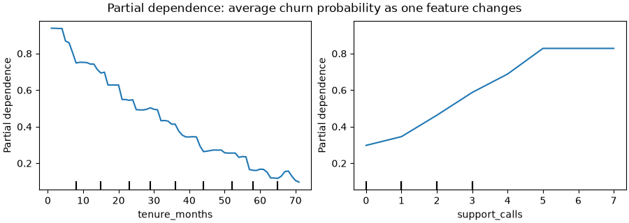

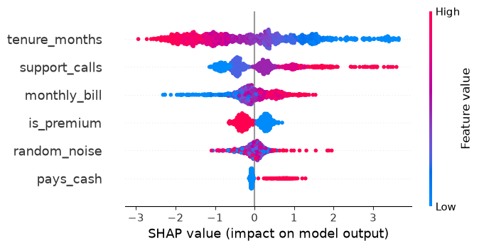

The partial dependence plot shows the **shape** of each effect, including the jump for customers in their first 6 months that we built into the data. In the SHAP summary, each dot is one customer: colour is the feature's value (red = high), position is its push on the prediction. Notice `random_noise` isn't exactly zero there: the model learned a little noise from the training data (mild overfitting), even though permutation importance on **validation** data shows it's useless. SHAP explains what the model **does**, mistakes included.

**Common mistakes:**

- ❌ Reading importance as causation.
- ❌ Trusting impurity importances (they're computed on training data and favour high-cardinality features). Use permutation importance on validation data, or SHAP.
- ❌ Dropping a feature because its importance is low when a correlated twin carries the same signal (drop one and the other may become important).
- ❌ Feature selection on the full dataset before cross-validation (leakage).

### Practice

1. Drop `random_noise` and the least important real feature, retrain, and compare validation ROC-AUC with the full model.

<details>
<summary><b>Answer</b></summary>

```python
from sklearn.metrics import roc_auc_score

least = pd.Series(perm.importances_mean, index=X.columns).drop("random_noise").idxmin()
keep = [c for c in X.columns if c not in ("random_noise", least)]
small = xgb.XGBClassifier(n_estimators=300, learning_rate=0.05, max_depth=4, random_state=0, n_jobs=4).fit(X_train[keep], y_train)
print("dropped:", least)
print("full  ROC-AUC", round(roc_auc_score(y_val, model.predict_proba(X_val)[:, 1]), 4))
print("small ROC-AUC", round(roc_auc_score(y_val, small.predict_proba(X_val[keep])[:, 1]), 4))
```

**Output:**

```text
dropped: pays_cash
full  ROC-AUC 0.8457
small ROC-AUC 0.8396
```

A small drop: `pays_cash` is a weak but real signal (only 10% of customers pay cash), while `random_noise` contributed nothing. Whether one fewer feature is worth 0.006 of ROC-AUC is a judgement call; in production, fewer features means fewer things that can break.

</details>

**Learn more:** [Christoph Molnar, Interpretable Machine Learning (free book)](https://christophm.github.io/interpretable-ml-book/) · [SHAP documentation](https://shap.readthedocs.io/) · [scikit-learn: permutation importance](https://scikit-learn.org/stable/modules/permutation_importance.html)

---

## 24. Debugging Models: Learning Curves, Error Analysis and Leakage

### Theory

> **In simple words:** when a model disappoints, don't randomly try fancier algorithms. Diagnose first: is it **underfitting or overfitting**? Would **more data** help? **Where** exactly does it fail? And when a model looks **too good**, suspect **leakage** before celebrating.

**A debugging checklist:**

1. **Compare with baselines:** the average / most frequent class / a simple rule / last year's method. No clear win → check the data and features first.
2. **Train vs validation scores:**
   - both poor → **underfitting**: more or better features, a more flexible model, less regularisation;
   - train great, validation poor → **overfitting**: more data, regularisation, simpler model, fewer features.
3. **Learning curve:** plot train and validation scores as the training set grows.
   - The curves are still converging at the right edge → **more data will help**.
   - They've met and flattened at a poor level → more data won't help; improve the features or the model.
4. **Error analysis by slices:** compute the metric per segment (city, device, new vs old customers, text length). Aggregate scores hide groups where the model fails badly.
5. **Read the worst errors:** look at the most confident wrong predictions. You'll often find label mistakes, missing features or data bugs.
6. **Check for leakage** when results look surprisingly good.

**Data leakage red flags:**

- Validation scores that are **too good** (ROC-AUC 0.99 on a hard problem).
- One feature with overwhelming importance.
- Features created **after** the event you're predicting ("refund_issued" when predicting complaints; "days_in_hospital" when predicting admission).
- Duplicates or the same person/device in both train and test.
- Preprocessing or target encoding fitted on all data.
- Random splits of time-ordered data.

**Train–serving skew:** the model works offline but fails in production because features are computed differently in the two places (different code, different data freshness, a default value for missing). Fix by computing features with **one shared code path** (a pipeline or feature store) and by logging production inputs to compare.

**"Data-centric AI":** in practice, fixing labels, adding examples for weak slices and improving features beats model tweaking most of the time.

### Python

```python
import matplotlib.pyplot as plt
import numpy as np
from sklearn.datasets import load_digits
from sklearn.ensemble import RandomForestClassifier
from sklearn.linear_model import LogisticRegression
from sklearn.model_selection import learning_curve
from sklearn.pipeline import make_pipeline
from sklearn.preprocessing import StandardScaler

X, y = load_digits(return_X_y=True)
sizes = np.linspace(0.1, 1.0, 6)
fig, axes = plt.subplots(1, 2, figsize=(10, 3.4), sharey=True, layout="constrained")
for ax, (name, model) in zip(axes, [("logistic regression", make_pipeline(StandardScaler(), LogisticRegression(max_iter=2000))),
                                    ("random forest", RandomForestClassifier(n_estimators=100, random_state=0))]):
    n, train_sc, val_sc = learning_curve(model, X, y, train_sizes=sizes, cv=5, n_jobs=-1)
    ax.plot(n, train_sc.mean(axis=1), "o-", label="training")
    ax.plot(n, val_sc.mean(axis=1), "o-", label="validation")
    ax.set(title=f"Learning curve: {name}", xlabel="training examples")
    print(f"{name:20s} validation accuracy with {n[0]} rows: {val_sc.mean(axis=1)[0]:.3f}  with {n[-1]} rows: {val_sc.mean(axis=1)[-1]:.3f}")
axes[0].set_ylabel("accuracy")
axes[0].legend()
fig.savefig("learning-curves.png", dpi=100)
plt.close(fig)
```

**Output:**

```text
logistic regression  validation accuracy with 143 rows: 0.779  with 1437 rows: 0.920
random forest        validation accuracy with 143 rows: 0.776  with 1437 rows: 0.935
```

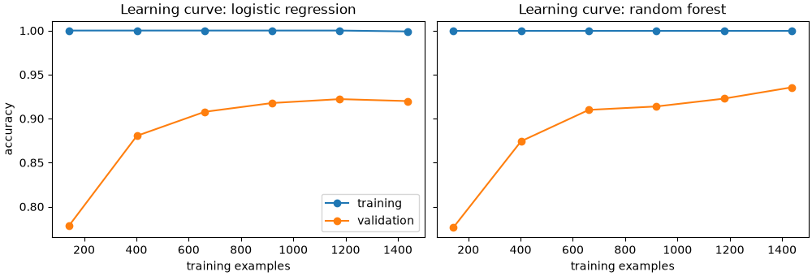

The two curves tell different stories. Logistic regression's validation accuracy has **flattened** at about 0.92: more data alone won't help it much, so a more flexible model or better features would. The random forest is **still climbing** at the right edge, so more labelled data would likely help it. The gap to the training curves (near 1.0) shows both still overfit somewhat.

```python
import pandas as pd
from sklearn.metrics import roc_auc_score
from sklearn.model_selection import train_test_split

rng = np.random.default_rng(1)
n = 6000
df = pd.DataFrame({"tenure": rng.integers(1, 60, n).astype(float),
                   "calls": rng.poisson(1.5, n).astype(float),
                   "device": rng.choice(["android", "ios", "web"], n, p=[0.6, 0.3, 0.1])})
risk = -0.05 * df["tenure"] + 0.6 * df["calls"]
risk += np.where(df["device"] == "web", 1.5 * np.sin(df["tenure"] / 4), 0)     # web users behave differently
df["churn"] = (rng.uniform(size=n) < 1 / (1 + np.exp(-risk))).astype(int)

train, test = train_test_split(df, test_size=0.3, random_state=0)
features = ["tenure", "calls"]
model = LogisticRegression().fit(train[features], train["churn"])
test = test.assign(p=model.predict_proba(test[features])[:, 1])
print("overall ROC-AUC:", round(roc_auc_score(test["churn"], test["p"]), 3))
for device, g in test.groupby("device"):
    print(f"{device:8s} rows {len(g):5d}   ROC-AUC {roc_auc_score(g['churn'], g['p']):.3f}")
```

**Output:**

```text
overall ROC-AUC: 0.764
android  rows  1126   ROC-AUC 0.778
ios      rows   493   ROC-AUC 0.756
web      rows   181   ROC-AUC 0.691
```

The overall score looks fine, but slicing by device shows the model is much weaker for **web** users, a small group (10%) whose behaviour it doesn't capture. That's where to dig: a device feature, interactions, or a separate model.

```python
leaky = df.assign(retention_offer_sent=((df["churn"] == 1) & (rng.uniform(size=n) < 0.8)).astype(int))
# ^ offers are sent AFTER a customer asks to cancel, i.e. after the outcome is known: a leak
tr, te = train_test_split(leaky, test_size=0.3, random_state=0)
cols = ["tenure", "calls", "retention_offer_sent"]
m = LogisticRegression().fit(tr[cols], tr["churn"])
print("ROC-AUC with the leaky feature:", round(roc_auc_score(te["churn"], m.predict_proba(te[cols])[:, 1]), 3))
print("weights:", {c: round(float(w), 2) for c, w in zip(cols, m.coef_[0])})
```

**Output:**

```text
ROC-AUC with the leaky feature: 0.962
weights: {'tenure': -0.05, 'calls': 0.57, 'retention_offer_sent': 7.12}
```

A jump to a near-perfect score and one enormous weight: the classic signature of leakage. In production, the offer isn't sent until **after** a customer decides to leave, so this feature doesn't exist at prediction time and the model would be useless.

**Common mistakes:**

- ❌ Trying bigger models before checking whether the problem is data, features or labels.
- ❌ Reporting one overall number without slices.
- ❌ Celebrating a suspiciously high score.
- ❌ Computing features differently in training and serving.

### Practice

1. Improve the web slice: add a one-hot `device` feature **and** a tree-based model (`HistGradientBoostingClassifier`, which can learn the web-specific pattern). Compare the per-device ROC-AUC.

<details>
<summary><b>Answer</b></summary>

```python
from sklearn.ensemble import HistGradientBoostingClassifier

X_tr = pd.get_dummies(train[["tenure", "calls", "device"]], dtype=float)
X_te = pd.get_dummies(test[["tenure", "calls", "device"]], dtype=float)[X_tr.columns]
hgb = HistGradientBoostingClassifier(random_state=0).fit(X_tr, train["churn"])
test = test.assign(p2=hgb.predict_proba(X_te)[:, 1])
for device, g in test.groupby("device"):
    print(f"{device:8s} before {roc_auc_score(g['churn'], g['p']):.3f}   after {roc_auc_score(g['churn'], g['p2']):.3f}")
```

**Output:**

```text
android  before 0.778   after 0.763
ios      before 0.756   after 0.731
web      before 0.691   after 0.752
```

The web slice improves clearly once the model has both the information (device) and the flexibility (trees) to learn its different pattern. Android and iOS get slightly **worse**: for them a straight line was already right, and the default boosted model fits some noise. Fixing one slice can hurt another, which is why you always re-check every slice; tuning (fewer iterations, early stopping) would recover most of it.

</details>

**Learn more:** [Andrew Ng: Machine Learning Yearning (free book)](https://info.deeplearning.ai/machine-learning-yearning-book) · [scikit-learn: learning curves](https://scikit-learn.org/stable/modules/learning_curve.html) · [Google: rules of machine learning](https://developers.google.com/machine-learning/guides/rules-of-ml)

---

## 25. Fairness, Privacy and Responsible ML

### Theory

> **In simple words:** a model learns from past data, and past data can contain **unfair patterns**. A hiring model trained on a company's past hires can learn to prefer the kinds of people who were hired before. Responsible ML means checking **who** the model makes mistakes for, protecting people's **data**, and **documenting** what the model should and shouldn't be used for.

**Where bias comes from:**

| Source | Example |
|---|---|
| **Historical bias** | Past loan approvals reflect past discrimination; the model copies it |
| **Sampling / representation bias** | A face dataset with few darker-skinned faces → worse accuracy for them |
| **Measurement / label bias** | "Arrests" used as a label for "crime" measures policing, not crime |
| **Proxy features** | Removing "gender" doesn't help if "first name" or "pincode" stands in for it |
| **Feedback loops** | A model sends more police to an area → more recorded incidents there → the model sends even more |

**Measuring fairness** (compare these across groups such as gender, age band, region):

| Metric | Asks | Equal across groups means… |
|---|---|---|
| **Selection rate** (demographic parity) | What share of each group gets a "yes"? | Same approval rate |
| **True-positive rate** (equal opportunity) | Of the people who **deserve** a yes, what share get it? | Qualified people are treated the same |
| **False-positive rate** | Of those who don't, how many wrongly get a yes (or a flag)? | Equal odds together with TPR |
| **Calibration by group** | Does "70% risk" mean 70% for every group? | Scores mean the same thing for everyone |

**You can't satisfy all of them at once** when groups have different base rates (a proven result). Choosing which matters is a **values and legal** decision, made with domain experts and affected people, not only by the data scientist.

**Mitigation options:** better and more representative data (usually the most effective); removing or constraining proxy features; reweighting training examples; fairness-constrained training (e.g. the `fairlearn` library); and adjusting thresholds per group (legally restricted in some settings). Then monitor fairness metrics in production, since they drift too.

**Privacy:**

- Collect only what you need; remove or pseudonymise **personal data** (names, phone numbers, IDs) before modelling.
- Models can **memorise** training data (LLMs especially can repeat it); don't train on secrets.
- Techniques: access control, aggregation, **differential privacy** (adding calibrated noise so no individual can be identified), **federated learning** (training on devices without collecting raw data).

**Documentation and law (2026):**

- **Model cards** (what a model is for, how it was evaluated, per-group results, limits) and **datasheets** for datasets are standard practice.
- Regulation now applies to ML: the **EU AI Act** (obligations phasing in from 2025 through 2027) sets requirements for "high-risk" uses such as credit, hiring, education and healthcare: risk management, data quality, documentation, human oversight and transparency. Data-protection laws (the EU's GDPR, India's DPDP Act) govern personal data and automated decisions.
- Keep a **human in the loop** for high-stakes decisions, and give people a way to contest them.

### Python

```python
import numpy as np
import pandas as pd
from sklearn.linear_model import LogisticRegression
from sklearn.model_selection import train_test_split

rng = np.random.default_rng(5)
n = 20_000
group = rng.choice(["A", "B"], n, p=[0.7, 0.3])
income = rng.normal(55, 15, n)                                          # same income distribution in both groups
pincode_score = rng.normal(np.where(group == "B", -1.0, 0.0), 1.0, n)   # a proxy that encodes group
repaid = (rng.uniform(size=n) < 1 / (1 + np.exp(-(0.08 * (income - 50) + 0.8)))).astype(int)   # truth: income only
# Biased history: 35% of group B's good payers were wrongly recorded as defaulters
recorded = np.where((group == "B") & (repaid == 1) & (rng.uniform(size=n) < 0.35), 0, repaid)
loans = pd.DataFrame({"group": group, "income": income, "pincode_score": pincode_score,
                      "repaid": repaid, "recorded": recorded})
train, test = train_test_split(loans, test_size=0.3, random_state=0)

def report(df, col):
    rows = []
    for g, part in df.groupby("group"):
        rows.append({"group": g, "approval rate": part[col].mean(),
                     "TPR (good payers approved)": part.loc[part["repaid"] == 1, col].mean()})
    return pd.DataFrame(rows).set_index("group").round(3)

features = ["income", "pincode_score"]                                   # "group" itself is NOT a feature
model = LogisticRegression().fit(train[features], train["recorded"])     # trained on the biased records
test = test.assign(approved=(model.predict_proba(test[features])[:, 1] >= 0.7).astype(int))
print("weights:", {f: round(float(w), 3) for f, w in zip(features, model.coef_[0])})
print(report(test, "approved"))
```

**Output:**

```text
weights: {'income': 0.059, 'pincode_score': 0.185}
       approval rate  TPR (good payers approved)
group                                           
A              0.450                       0.552
B              0.379                       0.470
```

The true repayment chances are identical for both groups (same incomes, repayment depends on income only). But the model learned from **biased records**, found that `pincode_score` predicts those records, and now approves group B's genuinely good payers less often (a lower true-positive rate), even though "group" was never a feature. Removing the sensitive column didn't remove the bias.

```python
fair_model = LogisticRegression().fit(train[["income"]], train["recorded"])     # drop the proxy
test = test.assign(approved_2=(fair_model.predict_proba(test[["income"]])[:, 1] >= 0.7).astype(int))
print(report(test, "approved_2"))
print("accuracy vs the truth, with proxy:", round((test["approved"] == test["repaid"]).mean(), 3),
      "  without:", round((test["approved_2"] == test["repaid"]).mean(), 3))
```

**Output:**

```text
       approval rate  TPR (good payers approved)
group                                           
A              0.421                       0.520
B              0.418                       0.521
accuracy vs the truth, with proxy: 0.61   without: 0.609
```

Without the proxy, qualified applicants from both groups are approved at nearly the same rate, and accuracy against the **true** outcomes doesn't suffer. The deeper fix is better labels: the model still learned from biased history (its weights are pulled down overall), which is why fixing data beats patching models.

**Common mistakes:**

- ❌ "We don't use gender/caste/religion, so the model is fair." Proxies carry the same information.
- ❌ Reporting only overall accuracy; always break results down by relevant groups.
- ❌ Treating fairness as a one-time check instead of something to monitor.
- ❌ Using personal data without consent or a legal basis.

### Practice

1. Compute the **false-positive rate** (approved but did not repay) for each group with the first model. Which group bears more of the lender's risk-taking?

<details>
<summary><b>Answer</b></summary>

```python
for g, part in test.groupby("group"):
    bad = part[part["repaid"] == 0]
    print(g, round(bad["approved"].mean(), 3))
```

**Output:**

```text
A 0.198
B 0.132
```

Group A's non-payers are approved more often (a higher FPR): the proxy makes the model more generous to group A in both directions. Fairness metrics usually move together like this, and the trade-offs between them are why they must be chosen deliberately.

</details>

---

### ✅ Part 5 checkpoint

Without looking, can you:

- [ ] Explain a model globally (permutation importance, partial dependence) and locally (SHAP), and say why neither proves causation?
- [ ] Select features without leakage?
- [ ] Read a learning curve to decide between more data and a better model, and find weak slices with error analysis?
- [ ] Recognise the signs of data leakage and train–serving skew?
- [ ] Measure fairness across groups, explain why proxies defeat "just drop the column", and name ways to mitigate bias?

**Learn more:** [Fairlearn: user guide](https://fairlearn.org/main/user_guide/index.html) · [Google: fairness in ML (crash course)](https://developers.google.com/machine-learning/crash-course/fairness) · [Mitchell et al., Model Cards for Model Reporting](https://arxiv.org/abs/1810.03993) · [EU AI Act overview](https://artificialintelligenceact.eu/)

---

# Part 6 — Advanced: MLOps and ML System Design

> **Goal:** Save and serve models, track experiments, monitor for drift, and design complete ML systems.  
> **You need:** Parts 1–5. (`fastapi.md` helps for the serving section.)

---

## 26. Saving and Serving Models: joblib, skops, ONNX and a FastAPI Endpoint

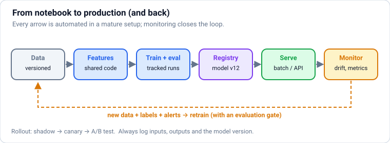

### Theory

> **In simple words:** a model is only useful once something can **call** it. You save the trained pipeline to a file, load it in a service, and expose a `predict` endpoint (or run it over a big table every night). The rules: save **the whole pipeline** (preprocessing included), know exactly which data and code produced it, and never load model files you don't trust.

**Saving a model:**

| Format | How | Notes |
|---|---|---|
| **joblib / pickle** | `joblib.dump(model, "model.joblib")`, `joblib.load(...)` | The common default for scikit-learn. ⚠️ Loading a pickle can **run arbitrary code**: only load files you created or trust. Load with the same library versions you saved with. |
| **skops** | `skops.io.dump(model, "model.skops")`, load with an explicit list of trusted types | A safer format for sharing scikit-learn models (e.g. on Hugging Face) |
| **ONNX** | Convert with `skl2onnx` (or export from PyTorch), run with **onnxruntime** | Portable and fast: run the same model from Python, C++, Java, C#, JavaScript or mobile, without scikit-learn installed |
| Native formats | `booster.save_model("model.json")` (XGBoost), `lgb.Booster.save_model` | Stable across library versions; preferred for boosting libraries |

**Two ways to serve:**

| | **Batch (offline) prediction** | **Online (real-time) prediction** |
|---|---|---|
| How | A scheduled job scores many rows at once and writes results to a table | A web service answers each request in milliseconds |
| Examples | Nightly churn scores, weekly demand forecasts, email targeting | Fraud check during payment, search ranking, recommendations on page load |
| Pros | Simple, cheap, easy to monitor | Fresh, uses the latest context |
| Cons | Predictions can be stale | Latency limits, must stay up, more engineering |

Start with batch whenever the business can wait; it's much simpler to run.

**A typical online service:** a small web API (FastAPI, `fastapi.md`) that validates input with Pydantic, calls `model.predict_proba`, returns the result with the **model version**, and logs inputs and outputs for monitoring. Package it in a **Docker** container and run it on Kubernetes or a managed platform (AWS SageMaker, Google Vertex AI, Azure ML). Specialised model servers (BentoML, Ray Serve, KServe, NVIDIA Triton) add batching, scaling and GPU support.

**Production habits:**

- **Version everything:** code (git), data (a snapshot or DVC), model file, and the library versions (`requirements.txt` / `uv.lock`).
- Load the model **once** at startup, not per request.
- Validate inputs (types, ranges, allowed categories) and return clear errors.
- Keep feature computation **identical** in training and serving (Section [24](#24-debugging-models-learning-curves-error-analysis-and-leakage)).
- Roll out safely: **shadow mode** (the new model predicts silently alongside the old one), **canary** (a small share of traffic first), then an **A/B test** on the business metric.

### Python

```python
import numpy as np
import pandas as pd
from sklearn.compose import ColumnTransformer
from sklearn.linear_model import LogisticRegression
from sklearn.pipeline import make_pipeline
from sklearn.preprocessing import OneHotEncoder, StandardScaler

rng = np.random.default_rng(0)
n = 3000
data = pd.DataFrame({"tenure_months": rng.integers(1, 72, n).astype(float),
                     "support_calls": rng.poisson(1.5, n).astype(float),
                     "plan": rng.choice(["basic", "plus", "premium"], n)})
logit = -0.05 * data["tenure_months"] + 0.6 * data["support_calls"] - 0.8 * (data["plan"] == "premium")
data["churned"] = (rng.uniform(size=n) < 1 / (1 + np.exp(-logit))).astype(int)
X, y = data.drop(columns="churned"), data["churned"]

pipeline = make_pipeline(
    ColumnTransformer([("num", StandardScaler(), ["tenure_months", "support_calls"]),
                       ("cat", OneHotEncoder(handle_unknown="ignore"), ["plan"])]),
    LogisticRegression())
pipeline.fit(X, y)

import os, tempfile
import joblib
import skops.io as sio

folder = tempfile.mkdtemp()
joblib.dump(pipeline, os.path.join(folder, "churn.joblib"))
sio.dump(pipeline, os.path.join(folder, "churn.skops"))

loaded = joblib.load(os.path.join(folder, "churn.joblib"))                  # only for files you trust!
untrusted = sio.get_untrusted_types(file=os.path.join(folder, "churn.skops"))
print("types skops needs you to approve:", untrusted)       # [] here: only standard scikit-learn/NumPy types
safe = sio.load(os.path.join(folder, "churn.skops"), trusted=untrusted)      # after reviewing the list
sample = X.head(3)
print(np.allclose(loaded.predict_proba(sample), pipeline.predict_proba(sample)),
      np.allclose(safe.predict_proba(sample), pipeline.predict_proba(sample)))
```

**Output:**

```text
types skops needs you to approve: []
True True
```

```python
import onnxruntime as ort
from skl2onnx import to_onnx
from skl2onnx.common.data_types import FloatTensorType, StringTensorType

onnx_model = to_onnx(pipeline, initial_types=[("tenure_months", FloatTensorType([None, 1])),
                                              ("support_calls", FloatTensorType([None, 1])),
                                              ("plan", StringTensorType([None, 1]))],
                     options={id(pipeline[-1]): {"zipmap": False}})      # plain arrays out, not dicts
session = ort.InferenceSession(onnx_model.SerializeToString())
inputs = {"tenure_months": sample[["tenure_months"]].to_numpy(np.float32),
          "support_calls": sample[["support_calls"]].to_numpy(np.float32),
          "plan": sample[["plan"]].to_numpy()}
label, proba = session.run(None, inputs)
print("onnxruntime:", proba[:, 1].round(4))
print("scikit-learn:", pipeline.predict_proba(sample)[:, 1].round(4))
```

**Output:**

```text
onnxruntime: [0.0511 0.1678 0.0587]
scikit-learn: [0.0511 0.1678 0.0587]
```

The ONNX version gives the same answers (up to float32 rounding) and can run anywhere onnxruntime runs, with no Python or scikit-learn needed.

```python
from fastapi import FastAPI, HTTPException
from fastapi.testclient import TestClient
from pydantic import BaseModel, Field

MODEL_VERSION = "churn-2025-06-01"
app = FastAPI()
model = joblib.load(os.path.join(folder, "churn.joblib"))                  # load once, at startup

class Customer(BaseModel):
    tenure_months: float = Field(ge=0, le=600)
    support_calls: float = Field(ge=0, le=100)
    plan: str

@app.post("/predict")
def predict(customer: Customer):
    if customer.plan not in {"basic", "plus", "premium"}:
        raise HTTPException(status_code=422, detail=f"unknown plan {customer.plan!r}")
    row = pd.DataFrame([customer.model_dump()])
    p = float(model.predict_proba(row)[0, 1])
    return {"churn_probability": round(p, 3), "will_churn": p >= 0.5, "model_version": MODEL_VERSION}

client = TestClient(app)                                                  # calls the app without a real server
print(client.post("/predict", json={"tenure_months": 3, "support_calls": 4, "plan": "basic"}).json())
print(client.post("/predict", json={"tenure_months": 60, "support_calls": 0, "plan": "premium"}).json())
bad = client.post("/predict", json={"tenure_months": -5, "support_calls": 0, "plan": "basic"})
print(bad.status_code, bad.json()["detail"][0]["msg"])
```

**Output:**

```text
{'churn_probability': 0.881, 'will_churn': True, 'model_version': 'churn-2025-06-01'}
{'churn_probability': 0.019, 'will_churn': False, 'model_version': 'churn-2025-06-01'}
422 Input should be greater than or equal to 0
```

In production you'd run this app with `uvicorn app:app` inside a Docker container; the `TestClient` here calls it directly so the example runs anywhere. Invalid input is rejected with a clear 422 error before it reaches the model.

**Common mistakes:**

- ❌ Saving only the model, not the preprocessing, then re-implementing preprocessing (differently) in the service.
- ❌ Loading pickles from the internet or from users.
- ❌ Loading the model inside the request handler (slow).
- ❌ No model version in responses and logs, so nobody can tell which model made a decision.
- ❌ Library version mismatches between training and serving (pin them).

### Practice

1. Add a `/predict_batch` endpoint that accepts a list of customers and returns a list of probabilities, then call it with two customers.

<details>
<summary><b>Answer</b></summary>

```python
@app.post("/predict_batch")
def predict_batch(customers: list[Customer]):
    rows = pd.DataFrame([c.model_dump() for c in customers])
    return {"probabilities": model.predict_proba(rows)[:, 1].round(3).tolist(), "model_version": MODEL_VERSION}

print(client.post("/predict_batch", json=[{"tenure_months": 3, "support_calls": 4, "plan": "basic"},
                                          {"tenure_months": 60, "support_calls": 0, "plan": "premium"}]).json())
```

**Output:**

```text
{'probabilities': [0.881, 0.019], 'model_version': 'churn-2025-06-01'}
```

Batching several rows into one `predict_proba` call is much faster than one call per row.

</details>

**Learn more:** [scikit-learn: model persistence](https://scikit-learn.org/stable/model_persistence.html) · [skops: secure persistence](https://skops.readthedocs.io/en/stable/persistence.html) · [ONNX Runtime](https://onnxruntime.ai/) · [FastAPI documentation](https://fastapi.tiangolo.com/)

---

## 27. MLOps: Experiment Tracking, Reproducibility and ML Pipelines

### Theory

> **In simple words:** after a few weeks of experiments, nobody remembers which settings produced that great score, on which data, with which code. **MLOps** is the set of habits and tools that make ML work **repeatable** and **reliable**: record every experiment, version data and models, automate training, and move models to production in a controlled way. It's DevOps (`best-practices.md`) applied to models, plus data.

**Experiment tracking.** For every training run, log:

- **parameters** (hyperparameters, feature set, data version),
- **metrics** (validation and test scores, per-slice results),
- **artifacts** (the model file, plots, the confusion matrix),
- **code version** (git commit) and **environment** (library versions).

Tools: **MLflow** (open source; tracking, model registry, deployment), **Weights & Biases**, Neptune, Comet, and the built-in trackers in cloud platforms. Even a spreadsheet is better than nothing; a tool is much better.

**Reproducibility checklist:**

- Fix **random seeds** (`random_state=42`, NumPy generators, framework seeds).
- **Version data**: immutable snapshots, date-partitioned tables, or tools like **DVC** / lakeFS that version large files alongside git.
- **Pin library versions** (`uv lock`, `requirements.txt`) and use containers.
- Put training in **scripts or pipelines**, not only notebooks; notebooks are for exploration.

**Model registry:** a catalogue of trained models with versions and stages ("candidate", "production", "archived"), linked to the run that produced each one. Deployment pulls "the current production model" from the registry, and rollback is just pointing back to the previous version.

**ML pipelines and orchestration:** production training is a pipeline of steps (extract data → validate → build features → train → evaluate → register → deploy) run on a schedule or trigger by an orchestrator: **Airflow**, **Prefect**, **Dagster**, **Kubeflow Pipelines**, or cloud services (SageMaker Pipelines, Vertex AI Pipelines). Each step is testable and re-runnable.

**CI/CD/CT for ML:**

- **CI:** unit-test feature code, validate data schemas (e.g. with pandera or Great Expectations), and run a quick training smoke test on every change.
- **CD:** automatically package and deploy a model that passes evaluation gates (beats the current model on key metrics and slices).
- **CT (continuous training):** retrain on fresh data on a schedule or when monitoring detects drift (next section).

**Feature stores** (Feast, Tecton, Databricks, SageMaker Feature Store) keep feature definitions in one place and serve the **same** features for training (historical, "as of" each past date, to avoid leakage) and online inference (low latency), which prevents training–serving skew.

**MLOps maturity, roughly:** level 0 = manual notebooks and hand-copied models; level 1 = automated training pipeline and tracking; level 2 = fully automated CI/CD/CT with monitoring. Most teams should aim for level 1 early.

### Python

```python
import logging
import os
import tempfile

import mlflow
import numpy as np
from sklearn.datasets import load_breast_cancer
from sklearn.ensemble import HistGradientBoostingClassifier
from sklearn.linear_model import LogisticRegression
from sklearn.metrics import roc_auc_score
from sklearn.model_selection import train_test_split
from sklearn.pipeline import make_pipeline
from sklearn.preprocessing import StandardScaler

logging.getLogger("mlflow").setLevel(logging.ERROR)                        # keep the output short
folder = tempfile.mkdtemp()
mlflow.set_tracking_uri(f"sqlite:///{os.path.join(folder, 'mlflow.db')}")  # a local tracking database
mlflow.create_experiment("breast-cancer", artifact_location=os.path.join(folder, "artifacts"))   # where model files go
mlflow.set_experiment("breast-cancer")

X, y = load_breast_cancer(return_X_y=True)
X_train, X_val, y_train, y_val = train_test_split(X, y, test_size=0.25, stratify=y, random_state=0)

candidates = {
    "logreg C=0.1": make_pipeline(StandardScaler(), LogisticRegression(C=0.1, max_iter=1000)),
    "logreg C=10": make_pipeline(StandardScaler(), LogisticRegression(C=10, max_iter=1000)),
    "hist-gb": HistGradientBoostingClassifier(random_state=0),
}
for name, model in candidates.items():
    with mlflow.start_run(run_name=name):
        model.fit(X_train, y_train)
        auc = roc_auc_score(y_val, model.predict_proba(X_val)[:, 1])
        mlflow.log_params({"model": name, "n_train": len(X_train), "data_version": "wdbc-v1"})
        mlflow.log_metric("val_roc_auc", auc)

runs = mlflow.search_runs(order_by=["metrics.val_roc_auc DESC"])
print(runs[["tags.mlflow.runName", "metrics.val_roc_auc", "params.data_version"]].round(4).to_string(index=False))
```

**Output:**

```text
tags.mlflow.runName  metrics.val_roc_auc params.data_version
        logreg C=10               0.9943             wdbc-v1
       logreg C=0.1               0.9929             wdbc-v1
            hist-gb               0.9866             wdbc-v1
```

Every run is now recorded with its settings and score, searchable later. In a real setup the tracking server is shared by the team (`mlflow server` or a hosted service), and you open its web UI to compare runs side by side.

```python
best_name = runs.iloc[0]["tags.mlflow.runName"]
best_model = candidates[best_name]
with mlflow.start_run(run_name=f"{best_name} (registered)"):
    mlflow.sklearn.log_model(best_model, name="model", input_example=X_val[:2],
                                    registered_model_name="cancer-classifier")
reloaded = mlflow.sklearn.load_model("models:/cancer-classifier/1")          # load by registry name and version
print("registered:", best_name, "| same predictions:", np.array_equal(reloaded.predict(X_val), best_model.predict(X_val)))
```

**Output:**

```text
registered: logreg C=10 | same predictions: True
```

**Common mistakes:**

- ❌ "Final_model_v3_really_final.pkl" on someone's laptop.
- ❌ Results you can't reproduce because the data changed underneath (no data versioning).
- ❌ A training pipeline that only runs in one person's notebook.
- ❌ Deploying without an evaluation gate against the current production model.

### Practice

1. Add a run for `HistGradientBoostingClassifier(learning_rate=0.05, max_iter=300, random_state=0)` and print the updated ranking. Did it take the top spot?

<details>
<summary><b>Answer</b></summary>

```python
model = HistGradientBoostingClassifier(learning_rate=0.05, max_iter=300, random_state=0)
with mlflow.start_run(run_name="hist-gb lr=0.05"):
    model.fit(X_train, y_train)
    mlflow.log_params({"model": "hist-gb lr=0.05", "data_version": "wdbc-v1"})
    mlflow.log_metric("val_roc_auc", roc_auc_score(y_val, model.predict_proba(X_val)[:, 1]))
ranked = mlflow.search_runs(order_by=["metrics.val_roc_auc DESC"])
print(ranked[["tags.mlflow.runName", "metrics.val_roc_auc"]].dropna().round(4).to_string(index=False))
```

**Output:**

```text
tags.mlflow.runName  metrics.val_roc_auc
        logreg C=10               0.9943
       logreg C=0.1               0.9929
    hist-gb lr=0.05               0.9874
            hist-gb               0.9866
```

No: on this small, clean dataset a regularised logistic regression is hard to beat. The tracker makes that visible instead of relying on anyone's memory.

</details>

**Learn more:** [MLflow documentation](https://mlflow.org/docs/latest/) · [Google: MLOps continuous delivery and automation pipelines](https://cloud.google.com/architecture/mlops-continuous-delivery-and-automation-pipelines-in-machine-learning) · [Made With ML: MLOps course](https://madewithml.com/) · [DVC](https://dvc.org/doc)

---

## 28. Monitoring Models in Production: Data Drift, Concept Drift and Retraining

### Theory

> **In simple words:** a model is trained on a snapshot of the past, but the world keeps changing: new customers, new prices, new fraud tricks, a pandemic. Over time its predictions quietly get worse. **Monitoring** watches the model's inputs, outputs and (when they arrive) true outcomes, so you notice problems and **retrain** before users do.

**What can go wrong:**

| Problem | What changes | Example |
|---|---|---|
| **Data drift** (covariate shift) | The **inputs** look different from training | A marketing campaign brings many younger users; a new app version sends a new field format |
| **Concept drift** | The **relationship** between inputs and outcome changes | Fraudsters change tactics; after a price rise, the same usage no longer predicts churn |
| **Label / prior shift** | The share of each outcome changes | Fraud rate doubles during festival season |
| **Data quality bugs** | A pipeline breaks | A column becomes all null, units switch from rupees to paise, a category is renamed |

**What to monitor:**

1. **Service health:** latency, errors, throughput (like any API).
2. **Data quality:** missing rates, types, ranges, unseen categories, compared with training.
3. **Input drift:** each feature's distribution vs the training distribution.
4. **Prediction drift:** the distribution of scores (a sudden jump in average churn probability is a warning).
5. **Model performance:** once true labels arrive (often days or weeks later), the real metrics, overall and **per slice**.
6. **Business metrics:** the thing the model is meant to improve.

**Measuring drift:**

- **PSI (population stability index):** bins a feature, compares the share of rows in each bin now vs at training: PSI = Σ (actual% − expected%) × ln(actual% / expected%). Common rule of thumb: < 0.1 stable, 0.1–0.25 moderate change, > 0.25 significant shift.
- **Kolmogorov–Smirnov test** for numeric features and **chi-square** for categories; with big data, tiny harmless changes become "significant", so look at effect sizes (PSI, distance) rather than p-values alone.
- **Domain classifier:** train a model to tell "training data" from "recent data"; if it can (ROC-AUC well above 0.5), the data has shifted, and its feature importances show where.

**Responding:**

- **Retrain** on recent data on a schedule (daily, weekly), or when drift or performance alerts fire. Keep an evaluation gate before replacing the current model.
- Investigate **why**: a data bug should be fixed at the source, not trained into the model.
- Fall back to rules or an older model if a new one misbehaves.
- Tools: Evidently, NannyML (can estimate performance before labels arrive), WhyLabs, Arize, and cloud-platform model monitors; many teams start with scheduled queries and dashboards.

### Python

```python
import numpy as np
from scipy import stats

def psi(expected, actual, bins=10):
    edges = np.quantile(expected, np.linspace(0, 1, bins + 1))          # bins from the training data
    edges[0], edges[-1] = -np.inf, np.inf
    e = np.histogram(expected, edges)[0] / len(expected)
    a = np.histogram(actual, edges)[0] / len(actual)
    e, a = np.clip(e, 1e-6, None), np.clip(a, 1e-6, None)
    return float(np.sum((a - e) * np.log(a / e)))

rng = np.random.default_rng(0)
train_age = rng.normal(35, 10, 20_000)
scenarios = {"same population": rng.normal(35, 10, 5_000),
             "slightly older": rng.normal(37, 10, 5_000),
             "campaign brought young users": np.r_[rng.normal(35, 10, 3_500), rng.normal(21, 3, 1_500)]}
for name, now in scenarios.items():
    ks = stats.ks_2samp(train_age, now)
    print(f"{name:30s} PSI {psi(train_age, now):.3f}   KS statistic {ks.statistic:.3f}  p-value {ks.pvalue:.2g}")
```

**Output:**

```text
same population                PSI 0.003   KS statistic 0.013  p-value 0.47
slightly older                 PSI 0.038   KS statistic 0.078  p-value 2.1e-21
campaign brought young users   PSI 0.285   KS statistic 0.236  p-value 1.5e-196
```

The "slightly older" population has a small PSI (little practical change), yet the KS test calls it highly significant, because with thousands of rows even tiny shifts are "significant". PSI and the size of the KS statistic are better guides to **how much** things changed.

```python
from sklearn.ensemble import HistGradientBoostingClassifier
from sklearn.metrics import roc_auc_score

def make_month(n, drifted):
    X = rng.normal(size=(n, 4))                                          # inputs look the same every month
    effect = -1.5 if drifted else 1.5                                    # ...but the effect of feature 0 flips
    y = (effect * X[:, 0] + X[:, 1] - 0.5 * X[:, 2] + rng.normal(0, 0.7, n) > 0).astype(int)
    return X, y

X_train, y_train = make_month(10_000, drifted=False)
model = HistGradientBoostingClassifier(random_state=0).fit(X_train, y_train)

for month in range(1, 7):                                               # from month 4, concept drift
    Xm, ym = make_month(2000, drifted=month >= 4)
    auc = roc_auc_score(ym, model.predict_proba(Xm)[:, 1])
    flag = "  <- ALERT: investigate / retrain" if auc < 0.85 else ""
    print(f"month {month}: ROC-AUC {auc:.3f}   PSI(feature 0) {psi(X_train[:, 0], Xm[:, 0]):.3f}{flag}")
```

**Output:**

```text
month 1: ROC-AUC 0.953   PSI(feature 0) 0.002
month 2: ROC-AUC 0.953   PSI(feature 0) 0.004
month 3: ROC-AUC 0.955   PSI(feature 0) 0.004
month 4: ROC-AUC 0.376   PSI(feature 0) 0.009  <- ALERT: investigate / retrain
month 5: ROC-AUC 0.387   PSI(feature 0) 0.004  <- ALERT: investigate / retrain
month 6: ROC-AUC 0.368   PSI(feature 0) 0.002  <- ALERT: investigate / retrain
```

From month 4, the inputs look exactly as before (PSI stays near 0), yet performance collapses, because the **relationship** between feature 0 and the outcome flipped. **Concept drift** can't be seen in the inputs alone. That's why monitoring real outcomes (once labels arrive) matters as much as monitoring inputs.

**Common mistakes:**

- ❌ Deploying and forgetting.
- ❌ Alerting on p-values from huge samples (everything is "significant"); alert on effect sizes and business impact.
- ❌ Retraining automatically on data that contains a pipeline bug, "learning" the bug.
- ❌ Monitoring only overall metrics, missing a failing slice.

### Practice

1. Build a **domain classifier**: label 5,000 training ages as 0 and the "campaign" ages as 1, train a classifier on age, and report its cross-validated ROC-AUC. What does a value near 0.5 vs well above 0.5 mean?

<details>
<summary><b>Answer</b></summary>

```python
from sklearn.model_selection import cross_val_score

ages = np.r_[train_age[:5000], scenarios["campaign brought young users"]].reshape(-1, 1)
is_new = np.r_[np.zeros(5000), np.ones(5000)]
clf = HistGradientBoostingClassifier(random_state=0)
print(round(cross_val_score(clf, ages, is_new, cv=5, scoring="roc_auc").mean(), 3))
```

**Output:**

```text
0.605
```

Near 0.5 would mean the classifier can't tell old from new data (no drift). Clearly above 0.5 means the new data is distinguishable: here, because of the cluster of young users. With many features, the domain classifier's feature importances point to **which** features drifted.

</details>

**Learn more:** [Evidently: ML monitoring guides](https://www.evidentlyai.com/ml-in-production/data-drift) · [Chip Huyen, Designing Machine Learning Systems (book)](https://www.oreilly.com/library/view/designing-machine-learning/9781098107956/) · [NannyML documentation](https://nannyml.readthedocs.io/)

---

## 29. ML System Design: A Framework and a Worked Example

### Theory

> **In simple words:** ML system design interviews (and real projects) ask: "design a system that detects fraudulent payments" or "design the home feed for a shopping app". There's no single right answer; interviewers want to see that you think about the **whole** system in a sensible order: the goal, the data, the model, how to measure it, how to serve it, and how to keep it working.

**A framework (spend time roughly in this order):**

1. **Clarify the problem and constraints.** What decision does the model support? Who uses it? Scale (requests per second, number of items/users)? Latency budget? What mistakes are costly? Is ML even needed (would rules do)?
2. **Frame it as an ML task.** Classification, regression, ranking, retrieval? What exactly is the **label**, and where does it come from (and how delayed is it)? What's the **prediction-time** information?
3. **Metrics.** **Offline** (PR-AUC, recall at a fixed precision, NDCG, RMSE) and **online/business** (fraud losses, conversion, watch time, complaints), plus guardrails (latency, fairness, user complaints).
4. **Data and features.** Sources, freshness, labelling, class balance, leakage risks; feature groups (user, item, context, history aggregates); how features are computed identically offline and online (feature store).
5. **Model.** Start with a **baseline** (rules, logistic regression), then the realistic choice (gradient boosting for tabular; two-tower + ranker for recommendations; transformers or embeddings for text/images). Justify trade-offs: accuracy, latency, interpretability, cost.
6. **Training and evaluation.** Splits (by time/user), cross-validation, per-slice evaluation, handling imbalance, retraining cadence.
7. **Serving.** Batch or online; latency budget per step; caching; fallbacks when the model or a feature is unavailable.
8. **Monitoring and iteration.** Drift, data quality, performance when labels arrive, A/B testing new versions, feedback loops, human review.
9. **Risks.** Fairness, privacy, abuse and adversaries, explainability requirements, failure modes.

**Worked example: real-time payment fraud detection**

| Step | Decisions |
|---|---|
| Problem | Score every card/UPI payment before it's approved; block, allow, or ask for extra verification (OTP). ~2,000 payments/second at peak; **< 50 ms** for scoring. Fraud ≈ 0.1% of payments. |
| Framing | Binary classification with a **score**, then thresholds for block / step-up / allow. Labels: chargebacks and confirmed fraud reports, arriving **days to weeks later**. |
| Metrics | Offline: PR-AUC, recall at a fixed false-positive rate (e.g. ≤ 1 in 1,000 genuine payments challenged). Online: fraud losses (₹), share of genuine payments challenged, customer complaints. |
| Features | Payment (amount, merchant category, device, location); user history aggregates (spend in last 1 h / 24 h / 30 d, usual merchants, usual hours); velocity (payments in the last minute); graph signals (shared devices or cards between accounts); merchant risk. Aggregates come from a streaming system (Kafka + Flink) and an online feature store; the **same** definitions build point-in-time-correct training data. |
| Model | Baseline: rules (existing). Main: gradient-boosted trees (fast, strong on tabular, SHAP for explanations), trained with class weights, early stopping, time-based validation. Possibly a graph model later for fraud rings. |
| Serving | Online service; features fetched from the feature store (≈10 ms), model scoring (≈2 ms); if features are missing, fall back to rules. Threshold per risk tier; step-up auth for the middle band. |
| Monitoring | Score distribution and feature drift hourly; alert on spikes; weekly retraining (fraud patterns shift fast); analysts review flagged cases and their decisions become new labels. |
| Risks | Adversaries adapt (keep some randomness and rules); fairness (don't block whole regions or groups unfairly; check false positives by segment); explainability for customer-support and regulators; privacy of payment data. |

**Other classic prompts** and their key idea: **feed/recommendation ranking** (two-stage retrieval + ranking, Section [21](#21-recommender-systems)); **search ranking** (learning-to-rank, NDCG, query understanding); **ad click prediction** (calibrated probabilities, huge sparse features, online learning); **ETA prediction** (regression on map/traffic features, quantiles); **spam/abuse detection** (adversarial, fast feedback loops); **demand forecasting** (many series, quantile forecasts, Section [20](#20-time-series-forecasting-with-machine-learning)).

**Where LLMs fit now:** many 2026 designs add an LLM component (classifying free-text reports, generating features or explanations, a RAG assistant for analysts; see `rag-and-agents.md`), but latency, cost and reliability usually keep the core high-volume decision on a classic model.

### Python

```python
# Back-of-the-envelope maths is part of every design: estimate before you build.
payments_per_day = 20_000_000
fraud_rate = 0.001
avg_fraud_amount = 8_000                      # ₹
peak_factor = 8                               # peak traffic vs the daily average

peak_qps = payments_per_day / 86_400 * peak_factor
fraud_per_day = payments_per_day * fraud_rate
print(f"peak requests/second ≈ {peak_qps:,.0f}")
print(f"fraudulent payments/day ≈ {fraud_per_day:,.0f}  (≈ ₹{fraud_per_day * avg_fraud_amount / 1e7:.1f} crore at risk)")

for recall, fpr in [(0.60, 0.001), (0.75, 0.003), (0.90, 0.010)]:
    caught = fraud_per_day * recall
    challenged_genuine = payments_per_day * (1 - fraud_rate) * fpr
    print(f"recall {recall:.0%}, FPR {fpr:.1%}: saves ≈ ₹{caught * avg_fraud_amount / 1e7:.1f} crore/day,"
          f" challenges {challenged_genuine:,.0f} genuine payments/day")
```

**Output:**

```text
peak requests/second ≈ 1,852
fraudulent payments/day ≈ 20,000  (≈ ₹16.0 crore at risk)
recall 60%, FPR 0.1%: saves ≈ ₹9.6 crore/day, challenges 19,980 genuine payments/day
recall 75%, FPR 0.3%: saves ≈ ₹12.0 crore/day, challenges 59,940 genuine payments/day
recall 90%, FPR 1.0%: saves ≈ ₹14.4 crore/day, challenges 199,800 genuine payments/day
```

This is how the threshold becomes a **business decision**: each operating point trades fraud losses against genuine customers who get an extra OTP step (friction) or a blocked payment. The numbers make the conversation with the business concrete.

**Common mistakes (in interviews and real projects):**

- ❌ Jumping to "I'd use a transformer" before clarifying the goal, labels and constraints.
- ❌ No baseline, no metrics, no plan for labels.
- ❌ Ignoring latency, serving and monitoring.
- ❌ Forgetting feedback loops and adversaries.

### Practice

1. Sketch (in bullet points, using the framework) a system that predicts which support tickets need urgent human attention.

<details>
<summary><b>Answer</b></summary>

**Problem:** rank incoming tickets so urgent ones (outages, payment failures, safety) reach agents within minutes; ~10k tickets/day; latency of seconds is fine. **Framing:** binary "urgent" classification (plus category routing); labels from past escalations and agent tags (noisy: audit a sample). **Metrics:** recall of truly urgent tickets at a workable alert volume; time-to-first-response for urgent tickets online. **Features:** ticket text (embeddings or TF-IDF), customer tier, recent orders/payments status, number of prior contacts, sentiment, time. **Model:** baseline keyword rules → embeddings + logistic regression or gradient boosting; an LLM could label training data or handle rare categories. **Serving:** score on arrival (async queue). **Monitoring:** urgent-recall weekly from agent feedback, drift in topics (new product launches), and an easy "mark as urgent" button whose clicks become labels. **Risks:** missing a real emergency (keep rules for critical keywords), and not systematically deprioritising some customer groups.

</details>

---

### ✅ Part 6 checkpoint

Without looking, can you:

- [ ] Save a whole pipeline safely (joblib vs skops vs ONNX) and serve it behind a validated API endpoint?
- [ ] Choose between batch and online prediction, and describe shadow, canary and A/B rollouts?
- [ ] Track experiments, version data and models, and describe an automated training pipeline with evaluation gates?
- [ ] Detect data drift with PSI, explain concept drift, and plan monitoring and retraining?
- [ ] Walk through an ML system design from problem framing to monitoring, with back-of-the-envelope numbers?

**Learn more:** [Chip Huyen: ML systems design (notes and book)](https://huyenchip.com/machine-learning-systems-design/toc.html) · [Alex Xu and Ali Aminian, Machine Learning System Design Interview (book)](https://bytebytego.com/) · [Eugene Yan: applied ML at companies (collection)](https://github.com/eugeneyan/applied-ml)

---

# Part 7 — Interview Prep: Revision

> **Goal:** Implement the classic algorithms from scratch and revise quickly.  
> **You need:** Parts 1–6.

---

## 30. Interview Coding: ML Algorithms from Scratch in NumPy

### Theory

> **In simple words:** ML interviews often ask you to implement a classic algorithm in plain Python/NumPy in 20–30 minutes: k-means, k-NN, logistic regression, a metric like ROC-AUC. They check that you **understand** the algorithm, not that you remember a library call. Each one below is short, vectorised, and checked against scikit-learn.

**How to approach it in the interview:**

1. Restate the algorithm in 3–5 steps out loud.
2. Write the function signature and the shapes: `X: (n, d)`, `y: (n,)`.
3. Implement the simplest correct version, vectorised with NumPy.
4. Test on a tiny example; compare with a library if allowed.
5. Discuss complexity, edge cases (empty clusters, ties, division by zero) and improvements.

| Algorithm | Core idea | Time complexity |
|---|---|---|
| k-NN predict | Distances to all training points, vote among the k nearest | O(n·d) per query |
| k-means | Assign to nearest centroid, move centroids to means, repeat | O(n·k·d) per iteration |
| Linear regression (GD) | w −= lr · 2/n · Xᵀ(Xw − y) | O(n·d) per step |
| Logistic regression (GD) | w −= lr · 1/n · Xᵀ(σ(Xw) − y) | O(n·d) per step |
| ROC-AUC | Fraction of (positive, negative) pairs ranked correctly | O(n log n) with sorting |
| Best decision-tree split | Try each feature and threshold, minimise weighted Gini | O(d · n log n) |

### Python

```python
import numpy as np

def knn_predict(X_train, y_train, X_query, k=3):
    d2 = ((X_query[:, None, :] - X_train[None, :, :]) ** 2).sum(axis=2)   # (queries, train) squared distances
    nearest = np.argsort(d2, axis=1)[:, :k]
    votes = y_train[nearest]
    return np.array([np.bincount(v).argmax() for v in votes])

def kmeans(X, k, iters=100, seed=0):
    rng = np.random.default_rng(seed)
    centroids = X[rng.choice(len(X), k, replace=False)]
    for _ in range(iters):
        labels = ((X[:, None, :] - centroids[None]) ** 2).sum(axis=2).argmin(axis=1)
        new = np.array([X[labels == j].mean(axis=0) if np.any(labels == j) else centroids[j] for j in range(k)])
        if np.allclose(new, centroids):
            break
        centroids = new
    return centroids, labels

from sklearn.datasets import load_iris, make_blobs
from sklearn.neighbors import KNeighborsClassifier

X, y = load_iris(return_X_y=True)
mine = knn_predict(X[::2], y[::2], X[1::2], k=5)
sk = KNeighborsClassifier(n_neighbors=5).fit(X[::2], y[::2]).predict(X[1::2])
print("k-NN agrees with scikit-learn:", np.mean(mine == sk), " accuracy:", np.mean(mine == y[1::2]).round(3))

Xb, _ = make_blobs(n_samples=300, centers=3, random_state=4)
centroids, labels = kmeans(Xb, 3)
print("k-means centroids:\n", centroids[np.argsort(centroids[:, 0])].round(2))
```

**Output:**

```text
k-NN agrees with scikit-learn: 1.0  accuracy: 0.987
k-means centroids:
 [[ 4.08 -5.62]
 [ 9.51  4.58]
 [ 9.52  0.92]]
```

```python
def sigmoid(z):
    return 1 / (1 + np.exp(-z))

def logistic_regression(X, y, lr=0.1, steps=2000):
    Xb = np.column_stack([np.ones(len(X)), X])          # bias column
    w = np.zeros(Xb.shape[1])
    for _ in range(steps):
        grad = Xb.T @ (sigmoid(Xb @ w) - y) / len(y)     # gradient of the mean log loss
        w -= lr * grad
    return w

def roc_auc(y_true, scores):
    order = np.argsort(scores)
    ranks = np.empty(len(scores))
    ranks[order] = np.arange(1, len(scores) + 1)        # rank 1 = lowest score (ties ignored for simplicity)
    n_pos = y_true.sum()
    n_neg = len(y_true) - n_pos
    return (ranks[y_true == 1].sum() - n_pos * (n_pos + 1) / 2) / (n_pos * n_neg)

def precision_recall_f1(y_true, y_pred):
    tp = np.sum((y_pred == 1) & (y_true == 1))
    fp = np.sum((y_pred == 1) & (y_true == 0))
    fn = np.sum((y_pred == 0) & (y_true == 1))
    p = tp / (tp + fp) if tp + fp else 0.0
    r = tp / (tp + fn) if tp + fn else 0.0
    return p, r, (2 * p * r / (p + r) if p + r else 0.0)

from sklearn.datasets import load_breast_cancer
from sklearn.metrics import f1_score, roc_auc_score
from sklearn.preprocessing import StandardScaler

Xc, yc = load_breast_cancer(return_X_y=True)
Xc = StandardScaler().fit_transform(Xc)
w = logistic_regression(Xc, yc)
scores = sigmoid(np.column_stack([np.ones(len(Xc)), Xc]) @ w)
print("my ROC-AUC:", round(roc_auc(yc, scores), 5), " scikit-learn:", round(roc_auc_score(yc, scores), 5))
p, r, f1 = precision_recall_f1(yc, (scores >= 0.5).astype(int))
print(f"precision {p:.3f} recall {r:.3f} F1 {f1:.3f}  (scikit-learn F1 {f1_score(yc, (scores >= 0.5).astype(int)):.3f})")
```

**Output:**

```text
my ROC-AUC: 0.99704  scikit-learn: 0.99704
precision 0.986 recall 0.994 F1 0.990  (scikit-learn F1 0.990)
```

```python
def gini(y):
    _, counts = np.unique(y, return_counts=True)
    p = counts / counts.sum()
    return 1 - np.sum(p ** 2)

def best_split(X, y):
    best = (None, None, gini(y))                         # (feature, threshold, weighted impurity)
    for j in range(X.shape[1]):
        for t in np.unique(X[:, j])[:-1]:
            left = X[:, j] <= t
            imp = (left.sum() * gini(y[left]) + (~left).sum() * gini(y[~left])) / len(y)
            if imp < best[2]:
                best = (j, t, imp)
    return best

feature, threshold, impurity = best_split(X, y)
print(f"best first split on iris: feature {feature} <= {threshold}  (weighted Gini {impurity:.3f}, from {gini(y):.3f})")
```

**Output:**

```text
best first split on iris: feature 2 <= 1.9  (weighted Gini 0.333, from 0.667)
```

The from-scratch split matches the root of a scikit-learn decision tree on iris (petal length ≤ 1.9 separates setosa perfectly; feature 3, petal width ≤ 0.6, is an equally good tie).

**Common mistakes:**

- ❌ Python loops over rows where broadcasting works (slow and long).
- ❌ Forgetting the bias term, or the 1/n in the gradient (the learning rate then depends on data size).
- ❌ `np.exp` overflow in sigmoid for huge negative inputs (use `np.clip(z, -500, 500)` or `scipy.special.expit`).
- ❌ Not handling empty clusters in k-means, or division by zero in metrics.

### Practice

1. Implement PCA from scratch with `np.linalg.svd`: centre the data, take the SVD, project onto the first 2 right-singular vectors, and check the explained variance ratio against scikit-learn.

<details>
<summary><b>Answer</b></summary>

```python
from sklearn.decomposition import PCA

def pca(X, k):
    Xc = X - X.mean(axis=0)
    U, S, Vt = np.linalg.svd(Xc, full_matrices=False)
    explained = S ** 2 / np.sum(S ** 2)
    return Xc @ Vt[:k].T, explained[:k]

proj, ratio = pca(X, 2)
print(ratio.round(4), PCA(n_components=2).fit(X).explained_variance_ratio_.round(4))
```

**Output:**

```text
[0.9246 0.0531] [0.9246 0.0531]
```

</details>

**Learn more:** [Sebastian Raschka: ML from scratch notes](https://sebastianraschka.com/blog/index.html) · [Andrej Karpathy: Neural Networks: Zero to Hero (builds up from scratch)](https://karpathy.ai/zero-to-hero.html)

---

## 31. Machine Learning Cheat Sheet

**Which model first?**

| Data / task | Start with | Then try |
|---|---|---|
| Tabular, predict a number | Linear regression (Ridge) | Gradient boosting (LightGBM, XGBoost, HistGB) |
| Tabular, predict a class | Logistic regression | Gradient boosting; random forest |
| Very small tabular data | Regularised linear model, random forest | TabPFN-style foundation model, SVM |
| Text classification | TF-IDF + logistic regression | Embeddings + linear model; fine-tuned transformer; LLM |
| Images, audio | Pretrained deep network (fine-tune) | `deep-learning.md` |
| Groups, no labels | k-means (scaled) | HDBSCAN, Gaussian mixture |
| Rare/unusual events, few labels | Isolation Forest | LOF, autoencoder; supervised model once labels exist |
| Forecasting | Seasonal naive baseline | Gradient boosting with lags; foundation models (Chronos, TimesFM) |
| Recommendations | Popularity; item-item similarity | Matrix factorisation; two-tower retrieval + ranker |

**scikit-learn skeleton:**

```text
prep = ColumnTransformer([("num", make_pipeline(SimpleImputer(strategy="median"), StandardScaler()), num_cols),
                          ("cat", OneHotEncoder(handle_unknown="ignore"), cat_cols)])
model = make_pipeline(prep, LogisticRegression(max_iter=1000))
X_train, X_test, y_train, y_test = train_test_split(X, y, test_size=0.2, stratify=y, random_state=42)
search = RandomizedSearchCV(model, {"logisticregression__C": loguniform(1e-3, 1e2)}, cv=5, scoring="average_precision")
search.fit(X_train, y_train);  search.score(X_test, y_test)          # test set: once, at the end
joblib.dump(search.best_estimator_, "model.joblib")
```

**Metrics:**

| Task | Metrics |
|---|---|
| Regression | MAE (robust, readable), RMSE (punishes big errors), R², MAPE/WAPE (percent), MASE (vs naive) |
| Balanced classification | Accuracy, F1, ROC-AUC, log loss |
| Imbalanced classification | Precision, recall, F1, **PR-AUC**, recall at fixed precision / FPR, cost |
| Probabilities | Log loss, Brier score, calibration curve |
| Ranking / recommendations | Precision@k, recall@k, NDCG, MAP, hit rate |
| Clustering | Silhouette, and usefulness |

**Diagnose:** train ≫ validation → overfitting (regularise, simplify, more data) · both poor → underfitting (features, flexibility) · learning curve still rising → more data helps · suspiciously good → leakage · good overall, bad slice → error analysis.

**Hyperparameters that matter most:**

| Model | Tune |
|---|---|
| Logistic / linear | `C` or `alpha` (log scale), penalty |
| k-NN | `k`, distance, scaling |
| Decision tree | `max_depth`, `min_samples_leaf` |
| Random forest | `n_estimators` (more is fine), `max_features`, `min_samples_leaf` |
| Gradient boosting | `learning_rate` + early stopping on `n_estimators`, `max_depth`/`num_leaves`, `min_child_samples`, `subsample`, `colsample_bytree`, L1/L2 |
| SVM (RBF) | `C`, `gamma` |
| k-means | `k`, scaling, `n_init` |

**Needs scaling:** k-NN, k-means, SVM, PCA, regularised linear models, neural networks. **Doesn't:** trees and tree ensembles.

**Leakage checklist:** split first (by time / group when needed) · all preprocessing inside the pipeline · no features from after the prediction moment · no duplicates across splits · tune on validation, test once.

**Production checklist:** save the whole pipeline · pin versions · validate inputs · log predictions with model version · monitor data quality, drift, performance by slice · retrain with evaluation gates · shadow/canary/A-B rollouts · model card.

---

## 32. Most Asked Machine Learning Theory Questions

1. **Supervised vs unsupervised vs self-supervised vs reinforcement learning?** → Labelled examples / no labels (find structure) / labels created from the data itself (predict the next word) / learning from rewards for actions.
2. **What is overfitting, and how do you prevent it?** → Fitting noise in the training data, so it generalises poorly (train ≫ validation score). Prevent with more data, regularisation, simpler models, early stopping, cross-validation, dropout/augmentation (deep learning), fewer features.
3. **Explain the bias–variance trade-off.** → Error = bias² + variance + noise. Simple models have high bias (miss patterns); flexible ones have high variance (sensitive to the training sample). The best test error balances them.
4. **Why do we need a validation set as well as a test set?** → The validation set (or CV) is used to choose models and hyperparameters, so it gets "used up"; the untouched test set gives an unbiased final estimate.
5. **How does k-fold cross-validation work, and when do you use stratified / group / time-series splits?** → Train k times, each time validating on a different fold, and average. Stratified for classification balance; group when rows share an entity; time-series to always validate on the future.
6. **Parameters vs hyperparameters?** → Parameters are learned in training (weights); hyperparameters are chosen before training (depth, learning rate, C) using validation data.
7. **How does gradient descent work? What does the learning rate do?** → Repeatedly step parameters against the gradient of the loss. Too small: slow; too large: overshoots or diverges. Mini-batch SGD and Adam/AdamW are the standard variants.
8. **Why is the loss for logistic regression log loss, not MSE?** → Log loss is the maximum-likelihood loss for yes/no outcomes, is convex for logistic regression, and punishes confident mistakes heavily; MSE with a sigmoid is non-convex and learns slowly.
9. **L1 vs L2 regularisation?** → L1 (Lasso) adds Σ|w| and drives some weights exactly to zero (feature selection); L2 (Ridge) adds Σw² and shrinks all weights smoothly (good with correlated features).
10. **Precision vs recall; when do you prefer each?** → Precision = TP/(TP+FP) (how many flagged are right); recall = TP/(TP+FN) (how many positives are found). Prefer recall when misses are costly (cancer, fraud), precision when false alarms are costly (spam hiding real mail).
11. **ROC-AUC vs PR-AUC?** → ROC-AUC measures ranking of positives above negatives; it can look high on very imbalanced data. PR-AUC focuses on the positive class and is more informative when positives are rare.
12. **How do you handle imbalanced data?** → Right metrics, threshold tuning, class weights, resampling (only on training folds), more positive data, anomaly detection when labels are scarce.
13. **How does a decision tree choose a split?** → It tries features and thresholds and picks the one that most reduces impurity (Gini/entropy for classification, variance for regression), greedily.
14. **Random forest vs gradient boosting?** → Forest: deep trees on bootstrap samples with random feature subsets, averaged (reduces variance, little tuning). Boosting: shallow trees added sequentially to fit the remaining errors with a learning rate (reduces bias, usually most accurate, needs early stopping and tuning).
15. **Why do gradient-boosted trees usually beat neural networks on tabular data?** → Tabular features are heterogeneous and irregular; trees handle different scales, interactions and uninformative features naturally, need less data and tuning, and are fast. Neural networks shine on images, text and audio.
16. **Explain the SVM margin and the kernel trick.** → The SVM picks the boundary with the widest margin to the nearest points (support vectors); kernels compute similarities as if in a higher-dimensional space, allowing curved boundaries without explicit feature mapping.
17. **How does k-means work, and how do you choose k?** → Assign points to the nearest centroid, move centroids to the mean, repeat. Choose k with the elbow of inertia, the silhouette score, and usefulness. It assumes round clusters and needs scaling.
18. **What does PCA do?** → Finds orthogonal directions of maximum variance (eigenvectors of the covariance matrix) and projects data onto the top ones to reduce dimensions while keeping most variance.
19. **What is the curse of dimensionality?** → In high dimensions, data becomes sparse and distances become similar, hurting distance-based methods and needing far more data.
20. **Why and when do you scale features?** → For distance- and gradient-based models (k-NN, SVM, k-means, PCA, regularised linear models, neural nets) so no feature dominates by its units; trees don't need it. Fit the scaler on training data only.
21. **What is data leakage? Give examples.** → Information in training that isn't available at prediction time: preprocessing fitted on all data, future-derived features, target-derived features, duplicates across splits, random splits of time series.
22. **How do you choose a threshold for a classifier?** → On validation data, from business costs or constraints (e.g. recall ≥ 90%, or at most N alerts per day), using the precision–recall curve.
23. **What is calibration and why does it matter?** → Whether predicted probabilities match observed frequencies; it matters when probabilities drive decisions (pricing, risk). Check with calibration curves / Brier score; fix with Platt scaling or isotonic regression.
24. **How do you explain a model's predictions?** → Globally with permutation importance and partial dependence; locally with SHAP (additive contributions per feature). These explain the model, not causation.
25. **What is concept drift vs data drift, and how do you monitor models?** → Data drift: input distributions change; concept drift: the input–output relationship changes. Monitor data quality, input and prediction distributions (PSI), and real performance by slice once labels arrive; retrain with evaluation gates.
26. **Batch vs online inference?** → Batch scores many rows on a schedule (simple, cheap, possibly stale); online answers each request in real time (fresh, needs low latency and reliability).
27. **What is training–serving skew and how do you avoid it?** → Features computed differently in training and production. Share one feature pipeline or a feature store, save the whole pipeline, and log production inputs.
28. **How would you evaluate a recommender system?** → Offline with time-based splits and ranking metrics (precision@k, recall@k, NDCG, coverage), then online with A/B tests on business outcomes.
29. **How do you make an ML model fair?** → Measure errors and outcomes by group (selection rate, TPR, FPR, calibration), look for proxies and label bias, improve data, apply constraints or post-processing, document with model cards, keep humans in the loop for high-stakes decisions.
30. **Walk me through an ML project end to end.** → Clarify goal and metric → data and labels → split correctly → baseline → features and models → tuning with CV → error analysis and slices → test once → deploy (batch or online) → monitor and retrain → iterate with A/B tests.

---

---
