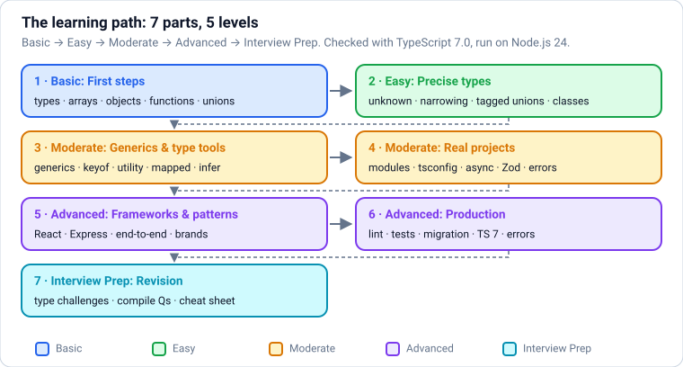
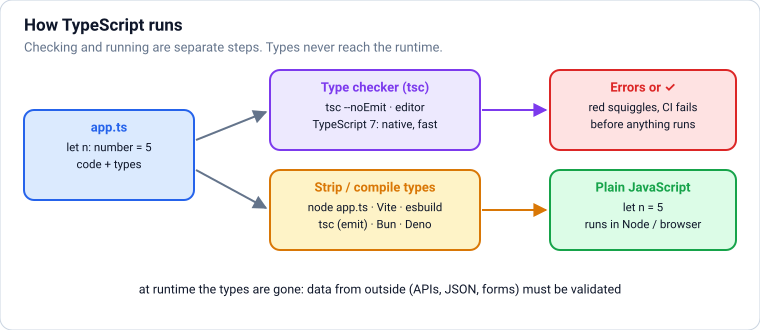
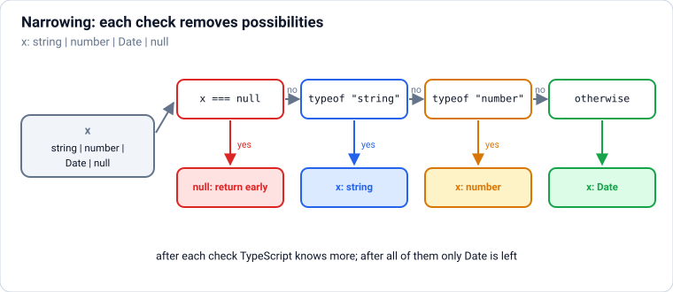
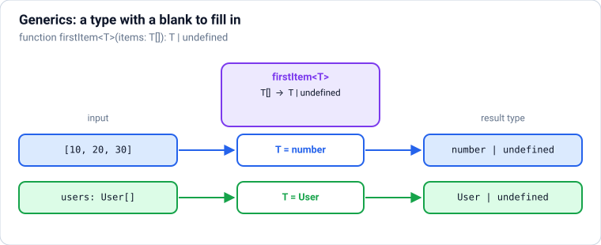

# TypeScript: From Absolute Basics to Production

TypeScript from zero, in **levels**: **Basic** (what TypeScript is, basic types, arrays, objects, functions, unions, type vs interface) → **Easy** (unknown and never, narrowing, discriminated unions, `as const` and `satisfies`, enums, structural typing, classes) → **Moderate** (generics, `keyof`/`typeof`, constraints, utility, mapped, conditional and template literal types, overloads; then real projects: modules and declaration files, tsconfig, async code, Zod validation, error handling, decorators) → **Advanced** (React, Node/Express, end-to-end type safety, practical patterns, variance and recursive types, production setup, what's new up to TypeScript 7, fixing compiler errors) → **Interview Prep**. **Each part uses only what earlier parts taught.** It assumes JavaScript basics (`javascript.md` Parts 1–3).

Every section has the same shape: a **picture** where it helps, **theory** in plain words, **TypeScript** examples, **common mistakes**, and **practice** with hidden answers and links. Every example was **type-checked with TypeScript 7.0** and **run on Node.js 24** (React examples with React 19, APIs with Express 5 and Zod 4). The text under **Output** is exactly what the program printed, and the text under **Compiler output** is exactly what `tsc` reported, with line numbers counted from the start of that code block. Blocks within one section share their variables, like cells in a notebook.

Each part ends with a ✅ **checkpoint**. After this file: `react.md` for user interfaces and `nodejs.md` for servers.

## Table of Contents

**[Part 1 — Basic: First Steps](#part-1--basic-first-steps)**

1. [Getting Started: What TypeScript Is and Your First Program](#1-getting-started-what-typescript-is-and-your-first-program)
2. [Basic Types, Annotations and Type Inference](#2-basic-types-annotations-and-type-inference)
3. [Arrays, Tuples and Safe Indexing](#3-arrays-tuples-and-safe-indexing)
4. [Object Types: Shapes, Optional and Readonly Properties](#4-object-types-shapes-optional-and-readonly-properties)
5. [Typing Functions: Parameters, Returns, Callbacks and void](#5-typing-functions-parameters-returns-callbacks-and-void)
6. [Union and Literal Types: "This or That"](#6-union-and-literal-types-this-or-that)
7. [Type Aliases vs Interfaces](#7-type-aliases-vs-interfaces)

**[Part 2 — Easy: Making Types Precise](#part-2--easy-making-types-precise)**

8. [The Special Types: any, unknown, never and void](#8-the-special-types-any-unknown-never-and-void)
9. [Narrowing and Type Guards](#9-narrowing-and-type-guards)
10. [Discriminated Unions and Exhaustive Checks](#10-discriminated-unions-and-exhaustive-checks)
11. [as const, satisfies, Type Assertions and the ! Operator](#11-as-const-satisfies-type-assertions-and-the--operator)
12. [Enums and Their Modern Alternatives](#12-enums-and-their-modern-alternatives)
13. [Structural Typing: Shapes, Not Names](#13-structural-typing-shapes-not-names)
14. [Classes: Access Modifiers, implements, abstract and override](#14-classes-access-modifiers-implements-abstract-and-override)

**[Part 3 — Moderate: Generics and Type-Level Tools](#part-3--moderate-generics-and-type-level-tools)**

15. [Generics: Types With Parameters](#15-generics-types-with-parameters)
16. [keyof, typeof and Indexed Access Types](#16-keyof-typeof-and-indexed-access-types)
17. [Generic Constraints, Defaults and const Type Parameters](#17-generic-constraints-defaults-and-const-type-parameters)
18. [Built-in Utility Types](#18-built-in-utility-types)
19. [Mapped Types: Transforming Every Property](#19-mapped-types-transforming-every-property)
20. [Conditional Types and infer](#20-conditional-types-and-infer)
21. [Template Literal Types](#21-template-literal-types)
22. [Function Overloads, this Parameters and Typing Callbacks Well](#22-function-overloads-this-parameters-and-typing-callbacks-well)

**[Part 4 — Moderate: Real Projects](#part-4--moderate-real-projects)**

23. [Modules, import type, Declaration Files and @types](#23-modules-import-type-declaration-files-and-types)
24. [tsconfig.json: Compiler Options That Matter in 2026](#24-tsconfigjson-compiler-options-that-matter-in-2026)
25. [Typing Async Code: Promises, fetch and Errors](#25-typing-async-code-promises-fetch-and-errors)
26. [Runtime Validation with Zod: One Schema, Types and Checks](#26-runtime-validation-with-zod-one-schema-types-and-checks)
27. [Error Handling Patterns: Typed Errors, Result Types and using](#27-error-handling-patterns-typed-errors-result-types-and-using)
28. [Decorators](#28-decorators)

**[Part 5 — Advanced: TypeScript with Frameworks and Patterns](#part-5--advanced-typescript-with-frameworks-and-patterns)**

29. [TypeScript with React](#29-typescript-with-react)
30. [TypeScript on the Server: Node.js and Express](#30-typescript-on-the-server-nodejs-and-express)
31. [End-to-End Type Safety: Sharing Types Between Client and Server](#31-end-to-end-type-safety-sharing-types-between-client-and-server)
32. [Practical Type Patterns: Branded Types, State Machines and Typed Events](#32-practical-type-patterns-branded-types-state-machines-and-typed-events)
33. [Advanced Type System Topics: Recursive Types, Variance and Type-Level Limits](#33-advanced-type-system-topics-recursive-types-variance-and-type-level-limits)

**[Part 6 — Advanced: Production TypeScript](#part-6--advanced-production-typescript)**

34. [Production TypeScript: Project Setup, Linting, Testing, Migration and Publishing](#34-production-typescript-project-setup-linting-testing-migration-and-publishing)
35. [What's New: TypeScript 5.0 to 7.0](#35-whats-new-typescript-50-to-70)
36. [Reading and Fixing Common Compiler Errors](#36-reading-and-fixing-common-compiler-errors)

**[Part 7 — Interview Prep: Revision](#part-7--interview-prep-revision)**

37. [Type Challenges: Implement the Utility Types Yourself](#37-type-challenges-implement-the-utility-types-yourself)
38. ["Does It Compile?" Questions](#38-does-it-compile-questions)
39. [TypeScript Cheat Sheet](#39-typescript-cheat-sheet)
40. [Most Asked TypeScript Interview Questions](#40-most-asked-typescript-interview-questions)

---

# Part 1 — Basic: First Steps

> **Goal:** Understand what TypeScript is and how it runs, then type variables, arrays, tuples, objects and functions, use unions and literal types, and name types with type and interface.  
> **You need:** JavaScript up to promises and modules (javascript.md Parts 1–3).

---

## 1. Getting Started: What TypeScript Is and Your First Program



### Theory

> **In simple words:** TypeScript is **JavaScript plus types**. You write normal JavaScript and add labels like `: number` or `: string` that say what kind of value a variable, parameter or return value holds. A program called the **type checker** reads those labels and warns you **before the code runs** when something doesn't fit, like passing text where a number is expected or reading a property that doesn't exist. Then the types are simply **removed** and ordinary JavaScript runs. Types never exist at runtime.

**Why almost every serious JavaScript project uses it in 2026:**

- **Bugs are caught while typing**, not by users. `user.nmae`, a missing `await`, a forgotten `null` check, calling a function with arguments in the wrong order: all red squiggles in the editor.
- **Your editor understands your code**: autocomplete, "go to definition", safe "rename everywhere", inline docs.
- **Types are documentation that can't go out of date**: a function signature tells you exactly what to pass and what you get back.
- **Refactoring is safe**: change a type and the checker lists every place that must change.
- React, Node.js, Angular, Vue, Next.js, Deno, Bun and most npm libraries are written in or ship types for TypeScript.



**How TypeScript runs your code (2026):**

| Way | What it does | When |
|---|---|---|
| `tsc` (the TypeScript compiler) | **Type-checks** the whole project and can also write `.js` files | Always in CI and before merging; `tsc --noEmit` = "only check" |
| `node app.ts` | Node.js 22.18+ / 24 **strips types** and runs the file directly (no type checking!) | Scripts, servers, tools |
| Vite, esbuild, Bun, Deno, Next.js | Strip types very fast while bundling or running | Web apps and frameworks |

Important: **running** (stripping types) and **checking** (finding type errors) are separate. Tools that run `.ts` files do **not** check types; you run `tsc --noEmit` (and your editor does it continuously) to find errors.

**TypeScript 7** (released July 2026) is the compiler **rewritten in Go**: the same language and the same errors, but type checking is roughly **10× faster** and uses less memory. TypeScript 6.0 (March 2026) was the last JavaScript-based version and switched on modern defaults (for example, `strict` is on by default). Everything in these notes was checked with **TypeScript 7.0** and run with **Node.js 24**.

**What you need:** Node.js 24 LTS, then in a project folder:

<!-- no-run (shell commands) -->
```text
npm init -y
npm install --save-dev typescript @types/node
npx tsc --init          # creates tsconfig.json with recommended settings
npx tsc --noEmit        # check every file
node src/app.ts         # run a file (types are stripped)
```

Use **VS Code** (or any editor with the TypeScript language server): errors appear as you type. This note assumes you know JavaScript up to promises and modules (`javascript.md` Parts 1–3).

### TypeScript

Your first program. The only new thing compared with JavaScript is the `: type` after the names:

```ts
const shopName: string = "Chai Point";
const cupsSold: number = 128;
const isOpen: boolean = true;

function revenue(cups: number, pricePerCup: number): number {
  return cups * pricePerCup;
}

console.log(`${shopName} is open: ${isOpen}`);
console.log("Today's revenue:", revenue(cupsSold, 25));
```

**Output:**

```text
Chai Point is open: true
Today's revenue: 3200
```

Now a mistake. TypeScript reports it **without running the code**. Each error has a file position `(line,column)`, a code like `TS2345` (search it to learn more) and a message:

```ts
const total = revenue("128", 25);
const name2: string = cupsSold;
console.log(shopName.toUppercase());
```

**Compiler output:**

```text
example.ts(1,23): error TS2345: Argument of type 'string' is not assignable to parameter of type 'number'.
example.ts(2,7): error TS2322: Type 'number' is not assignable to type 'string'.
example.ts(3,22): error TS2551: Property 'toUppercase' does not exist on type 'string'. Did you mean 'toUpperCase'?
```

Read the messages slowly: they are the most useful thing TypeScript gives you. "Argument of type 'string' is not assignable to parameter of type 'number'" means "you passed text where a number is needed". Notice the last one even suggests the correct spelling.

Types are **erased**: after checking, this is the JavaScript that actually runs. You can prove it; a type has no value at runtime:

```ts
function double(n: number): number {
  return n * 2;
}
console.log(double.toString());
```

**Output:**

```text
function double(n) {
    return n * 2;
}
```

That's why TypeScript can't protect you from data arriving at runtime (from an API, a form or a file) that doesn't match your types. For that you validate at runtime, which you'll learn in a later part.

**Common mistakes:**

- Thinking TypeScript checks things **at runtime**. It doesn't; it checks your **code**, before it runs.
- Running `.ts` files with Node/Vite/Bun and assuming that means "no type errors". Run `tsc --noEmit` (add it to CI).
- Ignoring red squiggles or silencing them with `any` (you'll see why that's bad soon).
- Installing TypeScript globally instead of per project; keep it in `devDependencies` so everyone uses the same version.

### Practice

1. Write a typed function `area(width: number, height: number): number` and print the area of a 12 × 7.5 room.
2. What does the checker say about `area(12)`? Predict the kind of error first.

<details>
<summary><b>Answer</b></summary>

```ts
function area(width: number, height: number): number {
  return width * height;
}
console.log(area(12, 7.5));
```

**Output:**

```text
90
```

```ts
area(12);
```

**Compiler output:**

```text
example.ts(1,1): error TS2554: Expected 2 arguments, but got 1.
```

In TypeScript every declared parameter is required unless you mark it optional, so a missing argument is an error (in plain JavaScript it would silently be `undefined` and give `NaN`).

</details>

**Learn more:** [TypeScript for JavaScript programmers](https://www.typescriptlang.org/docs/handbook/typescript-in-5-minutes.html) · [TypeScript Playground](https://www.typescriptlang.org/play) · [Node.js: running TypeScript natively](https://nodejs.org/en/learn/typescript/run-natively) · [Announcing TypeScript 7.0](https://devblogs.microsoft.com/typescript/)

---

## 2. Basic Types, Annotations and Type Inference

### Theory

> **In simple words:** a **type** is a set of allowed values. `number` is "any number", `string` is "any text", `boolean` is "`true` or `false`". A **type annotation** (`: number`) is you *telling* TypeScript the type. **Type inference** is TypeScript *working it out* from the value, so most of the time you don't need to write types at all: `let count = 0` is already a `number`.

**The primitive types** (the same seven as JavaScript, written in lowercase):

| Type | Example values | Note |
|---|---|---|
| `string` | `"Asha"`, `` `Hi ${name}` `` | |
| `number` | `42`, `3.14`, `-0`, `NaN`, `Infinity` | One type for integers and decimals |
| `boolean` | `true`, `false` | |
| `bigint` | `9007199254740993n` | Huge exact integers |
| `null` | `null` | Separate type in strict mode |
| `undefined` | `undefined` | Separate type in strict mode |
| `symbol` | `Symbol("id")` | Unique keys |

Use lowercase `string`, `number`, `boolean`, never the wrapper objects `String`, `Number`, `Boolean`.

**When to write annotations and when to let inference work:**

- **Let inference work for variables** initialised with a value: `const total = price * qty` (hovering shows `number`).
- **Always annotate function parameters**: TypeScript can't guess what callers will pass.
- **Annotate return types** of exported/public functions: it documents the contract and catches mistakes inside the function.
- **Annotate when a variable starts empty**: `let names: string[] = []`.

**`const` vs `let` inference.** A `let` can change, so TypeScript infers the general type (`let size = "M"` → `string`). A `const` can never change, so it infers the exact **literal type** (`const size = "M"` → the type `"M"`, meaning "only this exact string"). You'll use literal types a lot later.

**Strict null checks.** In strict mode (on by default), `null` and `undefined` are **not** allowed in a `string` or `number`. If a value can be missing, you must say so (you'll learn how with unions shortly). This one rule prevents the most common JavaScript crash: "Cannot read properties of undefined".

### TypeScript

```ts
let city = "Pune";              // inferred: string
const country = "India";        // inferred: "India" (literal type, because const)
let population = 7_400_000;     // inferred: number
let isCapital = false;          // inferred: boolean
const bigId = 9007199254740993n; // bigint

let score: number;              // declared now, assigned later
score = 88;

city = "Mumbai";                // ok: still a string
console.log(city, country, population, isCapital, bigId, score);
console.log(typeof city, typeof population, typeof bigId);
```

**Output:**

```text
Mumbai India 7400000 false 9007199254740993n 88
string number bigint
```

The type of a variable is fixed once declared. Changing a `let` to a different kind of value, or using a variable before assigning it, is caught:

```ts
let zip = 411001;
zip = "411001";

let discount: number;
console.log(discount * 2);

let nickname: string = null;
```

**Compiler output:**

```text
example.ts(2,1): error TS2322: Type 'string' is not assignable to type 'number'.
example.ts(5,13): error TS2454: Variable 'discount' is used before being assigned.
example.ts(7,5): error TS2322: Type 'null' is not assignable to type 'string'.
```

**Numbers and maths are still JavaScript.** Types don't change runtime behaviour: `0.1 + 0.2` is still not exactly `0.3`, and division by zero is still `Infinity`:

```ts
const subtotal: number = 0.1 + 0.2;
const perPerson: number = 100 / 0;
const parsed: number = Number("12px");
console.log(subtotal, perPerson, parsed, Number.isNaN(parsed));
```

**Output:**

```text
0.30000000000000004 Infinity NaN true
```

`Number("12px")` is `NaN`, which is still of type `number`. Types say what **kind** of value something is, not whether it is a **valid** one.

**Common mistakes:**

- Annotating everything (`const x: number = 5`): noisy. Let inference do the easy cases.
- Using `String`/`Number`/`Object` (capitalised) as types.
- Declaring `let data;` with no type and no value: it becomes an implicit `any` that changes as you assign (avoid it; give it a type).
- Expecting types to validate data: `Number(input)` may be `NaN`; you still have to check.

### Practice

1. Without running it, write down the inferred type of each: `let a = 10`, `const b = "tea"`, `let c = [1, 2]`, `const d = true`. Then hover over them in your editor (or check the answer).
2. Fix the code so it type-checks: `let total: number = "0"; total += 99.5;`

<details>
<summary><b>Answer</b></summary>

1. `a: number`, `b: "tea"` (literal), `c: number[]`, `d: true` (literal).
2. The initial value must be a number:

```ts
let total: number = 0;
total += 99.5;
console.log(total.toFixed(2));
```

**Output:**

```text
99.50
```

</details>

**Learn more:** [Handbook: Everyday Types](https://www.typescriptlang.org/docs/handbook/2/everyday-types.html) · [Handbook: Type inference](https://www.typescriptlang.org/docs/handbook/type-inference.html)

---

## 3. Arrays, Tuples and Safe Indexing

### Theory

> **In simple words:** an **array type** says "a list where every item has this type": `number[]` is a list of numbers. A **tuple** is a fixed-length array where **each position has its own type**, like `[string, number]` for "a name and an age". Tuples are handy for small grouped values, like the `[value, setValue]` pair React's `useState` returns.

| Syntax | Meaning |
|---|---|
| `string[]` | Array of strings (most common way to write it) |
| `Array<string>` | Exactly the same, "generic" spelling (you'll learn generics later) |
| `readonly string[]` | Array you can read but not change (`push`, assignment to `[i]` are errors) |
| `[string, number]` | Tuple: exactly 2 items, a string then a number |
| `[string, number?]` | Tuple with an optional second item |
| `[name: string, age: number]` | Labelled tuple: labels only help readability and autocomplete |
| `[string, ...number[]]` | A string followed by any number of numbers |

**Safe indexing (`noUncheckedIndexedAccess`).** `prices[10]` might not exist. By default TypeScript pretends it's a `number`, which hides bugs. With the `noUncheckedIndexedAccess` option (turned on by `tsc --init` and in these notes), `prices[i]` has type `number | undefined` ("a number **or** undefined"), so TypeScript makes you handle the missing case. `for...of` loops and array methods like `map` still give you plain `number`, because every item they visit exists.

### TypeScript

```ts
const prices: number[] = [120, 45, 300];
const tags = ["new", "sale"];                  // inferred: string[]
prices.push(99);
const total = prices.reduce((sum, p) => sum + p, 0);
const upper = tags.map(t => t.toUpperCase());   // t is known to be a string
console.log(total, upper);

let pair: [string, number] = ["Asha", 29];
const [who, age] = pair;                        // destructuring keeps the types
console.log(`${who} is ${age}`);

type RGB = [red: number, green: number, blue: number];
const saffron: RGB = [255, 153, 51];
console.log(saffron.length, saffron[1]);

const first = prices[0];                        // number | undefined
console.log(first !== undefined ? first * 2 : "empty list");
for (const p of prices) {
  if (p > 100) console.log("expensive:", p);   // p is number here
}
```

**Output:**

```text
564 [ 'NEW', 'SALE' ]
Asha is 29
3 153
240
expensive: 120
expensive: 300
```

Mistakes the checker catches:

```ts
prices.push("free");
pair = [29, "Asha"];
const blue: number = saffron[3];
const halved = prices[5] / 2;
const frozen: readonly string[] = ["a", "b"];
frozen.push("c");
```

**Compiler output:**

```text
example.ts(1,13): error TS2345: Argument of type 'string' is not assignable to parameter of type 'number'.
example.ts(2,9): error TS2322: Type 'number' is not assignable to type 'string'.
example.ts(2,13): error TS2322: Type 'string' is not assignable to type 'number'.
example.ts(3,7): error TS2322: Type 'undefined' is not assignable to type 'number'.
example.ts(3,30): error TS2493: Tuple type 'RGB' of length '3' has no element at index '3'.
example.ts(4,16): error TS2532: Object is possibly 'undefined'.
example.ts(6,8): error TS2339: Property 'push' does not exist on type 'readonly string[]'.
```

Line by line: a string can't go in a `number[]`; the tuple's order matters (two errors, one per position); an `RGB` has no index `3`; `prices[5]` may be `undefined`, so you can't divide it; and `readonly` arrays have no `push`.

**Mixed arrays.** If an array can hold different kinds of values, TypeScript infers a **union** (`|` means "or"):

```ts
const mixed = [1, "two", 3];                    // (string | number)[]
const lengths = mixed.map(v => (typeof v === "string" ? v.length : v));
console.log(lengths);
```

**Output:**

```text
[ 1, 3, 3 ]
```

Inside the arrow, `typeof v === "string"` tells TypeScript which kind `v` is in each branch. This is called **narrowing**; it gets its own section soon.

**Common mistakes:**

- Using a tuple when a small **object** would be clearer: `{ name, age }` beats `[name, age]` once there are more than two items or the order isn't obvious.
- Empty arrays with no type: `const ids = []` then `ids.push(1)` works but is fuzzy; write `const ids: number[] = []`.
- Forgetting that `readonly` is only a compile-time check (use `Object.freeze` if you need runtime protection).

### Practice

1. Write `function minMax(values: number[]): [min: number, max: number]` and test it on `[7, 2, 9, 4]`.
2. What should `minMax([])` return? Change the return type to handle it, and show the call.

<details>
<summary><b>Answer</b></summary>

```ts
function minMax(values: number[]): [min: number, max: number] | undefined {
  if (values.length === 0) return undefined;
  return [Math.min(...values), Math.max(...values)];
}
console.log(minMax([7, 2, 9, 4]), minMax([]));
```

**Output:**

```text
[ 2, 9 ] undefined
```

Without the empty case, `Math.min()` of nothing would silently return `Infinity`. Making the "no answer" case part of the return type forces every caller to deal with it.

</details>

**Learn more:** [Handbook: Arrays and tuples](https://www.typescriptlang.org/docs/handbook/2/objects.html#tuple-types) · [TSConfig: noUncheckedIndexedAccess](https://www.typescriptlang.org/tsconfig/#noUncheckedIndexedAccess)

---

## 4. Object Types: Shapes, Optional and Readonly Properties

### Theory

> **In simple words:** an **object type** describes the **shape** of an object: which properties it has and the type of each. `{ name: string; price: number }` means "an object with a `name` that is a string and a `price` that is a number". TypeScript then checks that every object you create has that shape and that you only read properties that exist.

| Syntax | Meaning |
|---|---|
| `{ name: string; price: number }` | Both properties required |
| `{ note?: string }` | Optional: may be missing; its type becomes `string \| undefined` |
| `{ readonly id: number }` | Can be read but not reassigned after creation |
| `{ [sku: string]: number }` | **Index signature**: any number of string keys, all with number values (a dictionary) |
| `Record<string, number>` | The same dictionary, shorter (a built-in helper) |

**Giving a shape a name.** Writing the full shape every time is repetitive, so you name it with a **type alias**: `type Product = { name: string; price: number }`. Now `Product` can be used anywhere a type is expected. (The next sections show `interface`, another way to name shapes.)

**Excess property checks.** When you write an object literal directly where a type is expected, TypeScript also complains about **extra** properties it doesn't know. That catches typos like `pirce: 10`. (Objects that come from elsewhere are allowed to have extra properties; you'll see why in the section on structural typing.)

**Optional chaining and defaults** from JavaScript work hand in hand with optional properties: `order.note?.trim()` and `order.note ?? "no note"`.

### TypeScript

```ts
type Product = {
  readonly sku: string;
  name: string;
  price: number;
  discountPercent?: number;         // optional
};

const kettle: Product = { sku: "KT-01", name: "Electric kettle", price: 1499 };
const mug: Product = { sku: "MG-07", name: "Steel mug", price: 349, discountPercent: 10 };

function finalPrice(p: Product): number {
  const discount = p.discountPercent ?? 0;       // number | undefined → number
  return Math.round(p.price * (1 - discount / 100));
}

console.log(finalPrice(kettle), finalPrice(mug));
kettle.price = 1399;                              // allowed: not readonly
console.log(kettle);

const stock: Record<string, number> = { "KT-01": 12, "MG-07": 0 };
stock["BT-99"] = 5;
for (const [sku, qty] of Object.entries(stock)) {
  console.log(sku, qty > 0 ? "in stock" : "sold out");
}
```

**Output:**

```text
1499 314
{ sku: 'KT-01', name: 'Electric kettle', price: 1399 }
KT-01 in stock
MG-07 sold out
BT-99 in stock
```

Now the mistakes. Missing properties, typos (excess properties), wrong types, writing to `readonly`, and reading something that isn't there:

```ts
const lamp: Product = { sku: "LP-02", name: "Desk lamp" };
const fan: Product = { sku: "FN-03", name: "Fan", pirce: 2499 };
mug.sku = "MG-08";
console.log(mug.colour);
const d: number = mug.discountPercent;
```

**Compiler output:**

```text
example.ts(1,7): error TS2741: Property 'price' is missing in type '{ sku: string; name: string; }' but required in type 'Product'.
example.ts(2,51): error TS2561: Object literal may only specify known properties, but 'pirce' does not exist in type 'Product'. Did you mean to write 'price'?
example.ts(3,5): error TS2540: Cannot assign to 'sku' because it is a read-only property.
example.ts(4,17): error TS2339: Property 'colour' does not exist on type 'Product'.
example.ts(5,7): error TS2322: Type 'number | undefined' is not assignable to type 'number'.
  Type 'undefined' is not assignable to type 'number'.
```

The last error shows why optional properties matter: `discountPercent` might be missing, so it's `number | undefined`, and you must provide a fallback (`?? 0`) or check it first.

**Nested shapes and inline types.** Shapes can contain other shapes and arrays. For a one-off parameter you can write the type inline:

```ts
type Order = {
  id: number;
  customer: { name: string; email: string };
  items: { sku: string; qty: number }[];
  note?: string;
};

function summary(order: Order): string {
  const units = order.items.reduce((n, item) => n + item.qty, 0);
  const note = order.note?.trim() || "no note";
  return `#${order.id} for ${order.customer.name}: ${units} units (${note})`;
}

function greet(user: { name: string; vip?: boolean }): string {
  return user.vip ? `Welcome back, ${user.name}!` : `Hello, ${user.name}`;
}

console.log(summary({ id: 90312, customer: { name: "Ravi", email: "ravi@example.com" }, items: [{ sku: "KT-01", qty: 1 }, { sku: "MG-07", qty: 4 }] }));
console.log(greet({ name: "Meera", vip: true }), "|", greet({ name: "Kabir" }));
```

**Output:**

```text
#90312 for Ravi: 5 units (no note)
Welcome back, Meera! | Hello, Kabir
```

**Common mistakes:**

- Marking properties optional "just in case". Every `?` forces every reader to handle `undefined`; only use it when the value really can be missing.
- Using `Record<string, X>` and assuming every key exists: with `noUncheckedIndexedAccess`, `stock["anything"]` is `number | undefined`, which is the honest type.
- Thinking `readonly` makes an object immutable at runtime. It's a compile-time rule only, and it's shallow.
- Using `{}` or `object` as "any object": `{}` actually means "any value except null and undefined". Describe the real shape instead.

### Practice

1. Create a `type Address` with `line1`, optional `line2`, `city` and `pin` (string), and a function `formatAddress(a: Address): string` that skips `line2` when missing. Test it with and without `line2`.

<details>
<summary><b>Answer</b></summary>

```ts
type Address = { line1: string; line2?: string; city: string; pin: string };

function formatAddress(a: Address): string {
  return [a.line1, a.line2, `${a.city} ${a.pin}`].filter(Boolean).join(", ");
}

console.log(formatAddress({ line1: "12 MG Road", city: "Bengaluru", pin: "560001" }));
console.log(formatAddress({ line1: "Flat 4B", line2: "Lake View Apts", city: "Kochi", pin: "682001" }));
```

**Output:**

```text
12 MG Road, Bengaluru 560001
Flat 4B, Lake View Apts, Kochi 682001
```

</details>

**Learn more:** [Handbook: Object types](https://www.typescriptlang.org/docs/handbook/2/objects.html) · [Handbook: Record](https://www.typescriptlang.org/docs/handbook/utility-types.html#recordkeys-type)

---

## 5. Typing Functions: Parameters, Returns, Callbacks and void

### Theory

> **In simple words:** a function's type is its **contract**: what goes in (parameter types) and what comes out (return type). TypeScript checks both sides: callers must pass the right arguments, and the function body must return what it promised. Functions themselves are values, so they also have types, written like arrows: `(price: number) => number` means "a function that takes a number and returns a number".

| Feature | Syntax | Meaning |
|---|---|---|
| Parameter types | `(name: string, qty: number)` | Required, in this order |
| Optional parameter | `(name: string, title?: string)` | May be left out; type is `string \| undefined` |
| Default value | `(qty = 1)` | Optional, and the type is inferred from the default |
| Rest parameters | `(...ids: number[])` | Any number of extra arguments, collected into an array |
| Return type | `(): number` | What the function returns |
| `void` | `(): void` | Returns nothing useful (the result should be ignored) |
| Function type | `type Formatter = (n: number) => string` | The type of a function value |
| Arrow functions | `const f = (n: number): string => ...` | Same rules |

**Return type inference.** If you don't write the return type, TypeScript infers it from the `return` statements. That's fine for small private helpers. For exported functions, writing it is good practice: if you accidentally return the wrong thing inside, the error appears **in the function** instead of in far-away callers.

**Callbacks get their types from context.** When you pass an arrow function to something whose parameter type is known (like `array.map` or your own `(n: number) => string` parameter), you don't need to annotate the arrow's parameters: TypeScript fills them in. This is called **contextual typing**.

**`void` for callbacks.** A callback type returning `void` means "I will ignore what you return". That's why `names.forEach(n => list.push(n))` is fine even though `push` returns a number.

### TypeScript

```ts
function lineTotal(price: number, qty = 1, discountPercent?: number): number {
  const discount = discountPercent ?? 0;
  return price * qty * (1 - discount / 100);
}

function tagList(label: string, ...tags: string[]): string {
  return `${label}: ${tags.join(", ") || "(none)"}`;
}

const toRupees = (paise: number): string => `₹${(paise / 100).toFixed(2)}`;

console.log(lineTotal(250), lineTotal(250, 4), lineTotal(250, 4, 10));
console.log(tagList("Tea", "green", "organic"), "|", tagList("Coffee"));
console.log(toRupees(149950));
```

**Output:**

```text
250 1000 900
Tea: green, organic | Coffee: (none)
₹1499.50
```

**Function types and callbacks.** A function can accept another function as a parameter; its type is written with `=>`:

```ts
type PriceRule = (price: number) => number;

function applyRules(price: number, rules: PriceRule[]): number {
  return rules.reduce((current, rule) => rule(current), price);
}

const festiveSale: PriceRule = p => p * 0.8;         // p is number: contextual typing
const addGst: PriceRule = p => p * 1.18;
const roundDown: PriceRule = Math.floor;

console.log(applyRules(1000, [festiveSale, addGst, roundDown]));

function repeat(times: number, action: (i: number) => void): void {
  for (let i = 1; i <= times; i++) action(i);
}
const log: string[] = [];
repeat(3, i => log.push(`step ${i}`));               // push returns a number; void callbacks ignore it
console.log(log);
```

**Output:**

```text
944
[ 'step 1', 'step 2', 'step 3' ]
```

**What the checker catches.** Wrong argument count or types, forgetting to return on some path, returning the wrong type, and callbacks with the wrong shape:

```ts
lineTotal(250, "4");
tagList();
function shippingFee(total: number): number {
  if (total > 999) return 0;
}
const bad: PriceRule = (p: string) => p.length;
function label(n: number): string {
  return n;
}
```

**Compiler output:**

```text
example.ts(1,16): error TS2345: Argument of type 'string' is not assignable to parameter of type 'number'.
example.ts(2,1): error TS2555: Expected at least 1 arguments, but got 0.
example.ts(3,38): error TS2366: Function lacks ending return statement and return type does not include 'undefined'.
example.ts(6,7): error TS2322: Type '(p: string) => number' is not assignable to type 'PriceRule'.
  Types of parameters 'p' and 'price' are incompatible.
    Type 'number' is not assignable to type 'string'.
example.ts(8,3): error TS2322: Type 'number' is not assignable to type 'string'.
```

**Common mistakes:**

- Putting an optional parameter **before** a required one: `(a?: string, b: number)` is an error; optional and default parameters go at the end (or use an options object).
- Using a long list of positional parameters. Once there are more than 3, pass one object: `createUser({ name, email, role })`. Named, order-free and easy to extend.
- Writing `Function` as a type: it accepts any function and loses all parameter checking. Write the real signature.
- Annotating callback parameters that TypeScript already knows (`prices.map((p: number) => ...)`); it's noise.

### Practice

1. Write `formatPrice(amount: number, options?: { currency?: string; decimals?: number }): string` that defaults to INR and 2 decimals using `Intl.NumberFormat("en-IN", ...)`. Test with no options and with `{ currency: "USD", decimals: 0 }`.
2. Write `countWhere(values: number[], test: (n: number) => boolean): number` and count the even numbers in `[3, 8, 10, 7, 2]`.

<details>
<summary><b>Answer</b></summary>

```ts
function formatPrice(amount: number, options?: { currency?: string; decimals?: number }): string {
  const { currency = "INR", decimals = 2 } = options ?? {};
  return new Intl.NumberFormat("en-IN", {
    style: "currency",
    currency,
    minimumFractionDigits: decimals,
    maximumFractionDigits: decimals,
  }).format(amount);
}
console.log(formatPrice(1499.5), formatPrice(1499.5, { currency: "USD", decimals: 0 }));

function countWhere(values: number[], test: (n: number) => boolean): number {
  let count = 0;
  for (const v of values) if (test(v)) count++;
  return count;
}
console.log(countWhere([3, 8, 10, 7, 2], n => n % 2 === 0));
```

**Output:**

```text
₹1,499.50 $1,500
3
```

</details>

**Learn more:** [Handbook: More on functions](https://www.typescriptlang.org/docs/handbook/2/functions.html)

---

## 6. Union and Literal Types: "This or That"

### Theory

> **In simple words:** a **union type** `A | B` means "a value that is **either** an A **or** a B". `string | number` accepts both text and numbers. A **literal type** is a type with exactly one value, like `"small"` or `42`. Put literals in a union and you get a precise list of allowed values: `"small" | "medium" | "large"`. This is how TypeScript models real-world choices, missing values and "one of these states".

| Pattern | Example | Use it for |
|---|---|---|
| Mixed input | `id: string \| number` | APIs that accept either |
| Maybe missing | `string \| undefined`, `User \| null` | Values that might not exist |
| Allowed values | `"card" \| "upi" \| "cod"` | Options, statuses, modes (instead of any string) |
| Number literals | `1 \| 2 \| 3 \| 4 \| 5` | Ratings, dice |
| Boolean literal | `true` | Flags that must be exactly true |

**You can only use what all members share.** With `value: string | number`, `value.toUpperCase()` is an error because numbers don't have it. First **check** which one you have, and TypeScript narrows the type inside that branch:

- `typeof value === "string"` → inside the `if`, `value` is `string`; in the `else`, it's `number`.
- `value === null` / `value !== undefined` → removes `null`/`undefined`.
- `if (value)` (truthiness) → removes `null`, `undefined` (and also `""` and `0`, careful!).

This is the start of **narrowing**; a later section covers every kind.

**Literal unions beat plain strings.** `status: string` accepts `"shiped"` (typo) silently. `status: "pending" | "shipped" | "delivered"` rejects it and gives autocomplete for the allowed values.

### TypeScript

```ts
type PaymentMethod = "card" | "upi" | "cod";
type Rating = 1 | 2 | 3 | 4 | 5;

function fee(method: PaymentMethod, amount: number): number {
  if (method === "cod") return 40;              // cash on delivery has a flat fee
  if (method === "card") return Math.round(amount * 0.02);
  return 0;                                      // here TypeScript knows method is "upi"
}

function formatId(id: string | number): string {
  if (typeof id === "number") {
    return `#${id.toString().padStart(6, "0")}`; // id: number
  }
  return id.toUpperCase();                        // id: string
}

function describe(stars: Rating): string {
  return "★".repeat(stars) + "☆".repeat(5 - stars);
}

console.log(fee("card", 2500), fee("upi", 2500), fee("cod", 2500));
console.log(formatId(4312), formatId("ord-9x"));
console.log(describe(4));
```

**Output:**

```text
50 0 40
#004312 ORD-9X
★★★★☆
```

**Handling "maybe missing" with `| undefined` and `| null`:**

```ts
type User = { name: string; phone?: string };

function findUser(id: number): User | undefined {
  const users: Record<number, User> = { 1: { name: "Asha", phone: "98450 12345" }, 2: { name: "Ravi" } };
  return users[id];
}

function contactLine(id: number): string {
  const user = findUser(id);
  if (user === undefined) return `user ${id} not found`;
  return `${user.name}: ${user.phone ?? "no phone"}`;   // user is User here
}

console.log(contactLine(1));
console.log(contactLine(2));
console.log(contactLine(3));
```

**Output:**

```text
Asha: 98450 12345
Ravi: no phone
user 3 not found
```

What the checker stops you from doing:

```ts
fee("paypal", 100);
const r: Rating = 6;
function shout(value: string | number) {
  return value.toUpperCase();
}
const phoneDigits = findUser(1).phone.replace(/\s/g, "");
```

**Compiler output:**

```text
example.ts(1,5): error TS2345: Argument of type '"paypal"' is not assignable to parameter of type 'PaymentMethod'.
example.ts(2,7): error TS2322: Type '6' is not assignable to type 'Rating'.
example.ts(4,16): error TS2339: Property 'toUpperCase' does not exist on type 'string | number'.
  Property 'toUpperCase' does not exist on type 'number'.
example.ts(6,21): error TS2532: Object is possibly 'undefined'.
example.ts(6,21): error TS2532: Object is possibly 'undefined'.
```

The last line has **two** possible crashes: the user might not be found, and the phone might be missing. TypeScript flags both. The fix is to check, or to use optional chaining: `findUser(1)?.phone?.replace(/\s/g, "")` (whose result is then `string | undefined`).

**Common mistakes:**

- Using `if (value)` to check for "missing" when `0` or `""` are valid values (a price of 0, an empty name). Compare with `=== undefined` / `== null`, or use `??`.
- Reaching for `!` (the "non-null assertion", `user!.name`) to silence "possibly undefined". It turns the compile-time error back into a runtime crash. Check instead.
- Plain `string` for fields with a fixed set of values.

### Practice

1. Write `type Size = "S" | "M" | "L" | "XL"` and `priceFor(size: Size): number` (S 499, M 549, L 599, XL 649) using `if` statements. Print the price of each size.
2. Write `parseQty(input: string): number | null` that returns `null` when the text isn't a positive whole number. Test `"3"`, `"0"`, `"two"`, `"2.5"`.

<details>
<summary><b>Answer</b></summary>

```ts
type Size = "S" | "M" | "L" | "XL";
function priceFor(size: Size): number {
  if (size === "S") return 499;
  if (size === "M") return 549;
  if (size === "L") return 599;
  return 649;
}
const sizes: Size[] = ["S", "M", "L", "XL"];
console.log(sizes.map(s => `${s}=${priceFor(s)}`).join(" "));

function parseQty(input: string): number | null {
  const n = Number(input);
  return Number.isInteger(n) && n > 0 ? n : null;
}
console.log(["3", "0", "two", "2.5"].map(parseQty));
```

**Output:**

```text
S=499 M=549 L=599 XL=649
[ 3, null, null, null ]
```

</details>

**Learn more:** [Handbook: Union types](https://www.typescriptlang.org/docs/handbook/2/everyday-types.html#union-types) · [Handbook: Literal types](https://www.typescriptlang.org/docs/handbook/2/everyday-types.html#literal-types)

---

## 7. Type Aliases vs Interfaces

### Theory

> **In simple words:** there are two ways to give a type a name. A **type alias** (`type Product = {...}`) can name **any** type: an object shape, a union, a tuple, a function type. An **interface** (`interface Product {...}`) can only name an **object shape**, but it can be **extended** with `extends` and **reopened** to add properties later. For everyday object shapes they are almost interchangeable; the important thing is to be consistent.

| | `type` | `interface` |
|---|---|---|
| Object shapes | ✅ | ✅ |
| Unions, tuples, primitives, function types | ✅ `type Id = string \| number` | ❌ |
| Extending | Intersection `A & B` | `interface B extends A` (clearer errors, a bit faster to check) |
| Declaration merging (reopen and add fields) | ❌ (duplicate name error) | ✅ (used to extend library types) |
| Implemented by classes | ✅ | ✅ |
| Advanced type tricks (mapped, conditional types) | ✅ | ❌ |

**A practical 2026 rule:** use `interface` for object shapes that other code extends (public APIs, library types, class contracts) and `type` for everything else (unions, function types, computed types). Many teams simply use `type` everywhere except when they need merging; both are fine. Enforce whatever you choose with the linter rule `@typescript-eslint/consistent-type-definitions`.

**Intersections (`&`)** combine types: `A & B` means "has **everything** from A **and** B". It's the `type` way to extend. (A union `|` is "either"; an intersection `&` is "both".)

### TypeScript

```ts
interface Animal {
  name: string;
  sound(): string;
}

interface Dog extends Animal {          // Dog has everything Animal has, plus more
  breed: string;
}

type Timestamps = { createdAt: Date; updatedAt: Date };
type Id = string | number;             // only a type alias can name a union
type Post = { id: Id; title: string } & Timestamps;   // intersection

const bruno: Dog = { name: "Bruno", breed: "Indie", sound: () => "Woof" };
const post: Post = { id: 7, title: "Hello TS", createdAt: new Date("2026-01-15"), updatedAt: new Date("2026-02-01") };

console.log(`${bruno.name} (${bruno.breed}) says ${bruno.sound()}`);
console.log(post.title, post.updatedAt.getTime() > post.createdAt.getTime());
```

**Output:**

```text
Bruno (Indie) says Woof
Hello TS true
```

**Declaration merging.** Declaring an interface twice **merges** them. That's how you add properties to types you don't own, such as a library's request type or the global `Window`. A `type` can't do this:

```ts
interface AppConfig {
  apiUrl: string;
}
interface AppConfig {                   // same name: merged, not replaced
  retries: number;
}
const config: AppConfig = { apiUrl: "https://api.example.com", retries: 3 };
console.log(config);
```

**Output:**

```text
{ apiUrl: 'https://api.example.com', retries: 3 }
```

The flip side: merging can happen **by accident** if two files pick the same interface name. With `type`, the duplicate is an error:

```ts
type Theme = { dark: boolean };
type Theme = { accent: string };

const pet: Dog = { name: "Tiger", sound: () => "Meow" };
```

**Compiler output:**

```text
example.ts(1,6): error TS2300: Duplicate identifier 'Theme'.
example.ts(2,6): error TS2300: Duplicate identifier 'Theme'.
example.ts(4,7): error TS2741: Property 'breed' is missing in type '{ name: string; sound: () => string; }' but required in type 'Dog'.
```

**Common mistakes:**

- Endless debates. Pick one convention per codebase and move on.
- Using `interface` to try to name a union (impossible) or `type` expecting it to merge.
- Intersecting incompatible types: `{ id: string } & { id: number }` makes `id` of type `never` (no value can be both), so the object becomes impossible to create.

### Practice

1. Create `interface Employee { id: number; name: string }` and `interface Manager extends Employee { reports: Employee[] }`. Build one manager with two reports and print `"<manager> manages <n> people: <names>"`.

<details>
<summary><b>Answer</b></summary>

```ts
interface Employee { id: number; name: string }
interface Manager extends Employee { reports: Employee[] }

const lead: Manager = {
  id: 1,
  name: "Meera",
  reports: [{ id: 2, name: "Kabir" }, { id: 3, name: "Zoya" }],
};
console.log(`${lead.name} manages ${lead.reports.length} people: ${lead.reports.map(e => e.name).join(", ")}`);
```

**Output:**

```text
Meera manages 2 people: Kabir, Zoya
```

</details>

---

### ✅ Part 1 checkpoint

Without looking, can you:

- [ ] Explain the difference between **checking** types (`tsc --noEmit`) and **running** TypeScript (Node, Vite), and why types don't exist at runtime?
- [ ] Say when to write an annotation and when to rely on inference, and why `const` gets a literal type?
- [ ] Type arrays, tuples and objects with optional and `readonly` properties, and handle `T | undefined` from indexing?
- [ ] Type function parameters, defaults, rest parameters, return values and callbacks?
- [ ] Use unions and literal unions, and narrow them with `typeof` and `=== undefined`?
- [ ] Choose between `type` and `interface`, and explain `extends`, `&` and declaration merging?

**Learn more:** [Handbook: Differences between type aliases and interfaces](https://www.typescriptlang.org/docs/handbook/2/everyday-types.html#differences-between-type-aliases-and-interfaces) · [typescript-eslint: consistent-type-definitions](https://typescript-eslint.io/rules/consistent-type-definitions/)

---

# Part 2 — Easy: Making Types Precise

> **Goal:** Use unknown, never and void, narrow unions safely, model states with discriminated unions, use as const and satisfies, choose enum alternatives, understand structural typing and write typed classes.  
> **You need:** Part 1.

---

## 8. The Special Types: any, unknown, never and void

### Theory

> **In simple words:** four types are special. **`any`** switches type checking **off** for a value: anything goes, and mistakes slip through. **`unknown`** means "I don't know what this is **yet**": you can hold it, but you must check what it is before using it. **`never`** means "this can never happen": no value has this type. **`void`** means "this function returns nothing useful".

Think of the type system as sets of values:

| Type | Set of values | Can you use it freely? |
|---|---|---|
| `unknown` | **Everything** (the top type) | No: you must narrow it first. The **safe** "anything" |
| `any` | Everything, **and** it is assignable to everything | Yes, with zero checking. The **unsafe** "anything" (an escape hatch) |
| `never` | **Nothing** (the bottom type) | It fits everywhere, because it never actually exists |
| `void` | "No useful value" (in practice, `undefined`) | Used as a function return type |

**Where each appears in real code:**

- **`unknown`**: data from outside your program: `JSON.parse` results you validate, `catch (err)` variables (they're `unknown` in strict mode, because anything can be thrown), user input, `fetch` responses. Check it with `typeof`, `instanceof`, `in` or a validation library.
- **`any`**: legacy JavaScript during a migration, or a type you truly can't express. **`any` spreads**: `any.foo.bar()` is also `any`, and assigning `any` to a `string` variable is silently allowed. Ban accidental `any` with `noImplicitAny` (part of `strict`) and the linter rule `no-explicit-any`. Note that `JSON.parse` and `response.json()` return `any`; assign them to `unknown` right away.
- **`never`**: functions that always throw or loop forever, impossible branches (used for **exhaustiveness checks**, next sections), and results of impossible intersections like `string & number`.
- **`void`**: return type of functions like event handlers and loggers.

### TypeScript

`any` hides a bug that `unknown` would have caught:

```ts
const raw = '{"name": "Asha", "orders": 3}';

const asAny: any = JSON.parse(raw);
console.log(asAny.name.toUpperCase(), asAny.total?.toFixed(2));   // no errors... but total doesn't exist

const data: unknown = JSON.parse(raw);
if (typeof data === "object" && data !== null && "orders" in data && typeof data.orders === "number") {
  console.log("orders × 2 =", data.orders * 2);                 // safe: checked first
}
```

**Output:**

```text
ASHA undefined
orders × 2 = 6
```

With `unknown`, TypeScript refuses until you check. With `any`, a wrong assumption would crash at runtime:

```ts
const payload: unknown = JSON.parse(raw);
console.log(payload.name);
const n: number = payload;
const s: string = asAny;           // allowed! any is assignable to everything
```

**Compiler output:**

```text
example.ts(2,13): error TS18046: 'payload' is of type 'unknown'.
example.ts(3,7): error TS2322: Type 'unknown' is not assignable to type 'number'.
```

Only two errors: the `any` assignment on the last line is silently accepted, which is exactly the danger.

**Errors in `catch` are `unknown`.** Anything can be thrown (`throw "oops"`, `throw 42`), so check before using `.message`:

```ts
function riskyParse(text: string): number {
  try {
    return JSON.parse(text).total;
  } catch (err: unknown) {
    const message = err instanceof Error ? err.message : String(err);
    console.log("could not parse:", message.split(" (")[0]);
    return 0;
  }
}
console.log(riskyParse('{"total": 42}'), riskyParse("{oops"));
```

**Output:**

```text
could not parse: Expected property name or '}' in JSON at position 1
42 0
```

**`never` for functions that don't return, and for "impossible" values:**

```ts
function fail(message: string): never {
  throw new Error(message);
}

function assertPositive(n: number): number {
  if (n <= 0) fail(`expected a positive number, got ${n}`);
  return n;                                // TypeScript knows fail() never returns
}

type Impossible = string & number;         // no value is both → never
const logLine = (msg: string): void => console.log(`[log] ${msg}`);

logLine(`qty ok: ${assertPositive(3)}`);
try { assertPositive(-1); } catch (e) { logLine((e as Error).message); }
```

**Output:**

```text
[log] qty ok: 3
[log] expected a positive number, got -1
```

(`e as Error` is a **type assertion**: you telling TypeScript "trust me, this is an Error". It's covered properly later; prefer the `instanceof` check shown above.)

**Common mistakes:**

- Using `any` to "make the error go away". Use `unknown` and narrow, or fix the type.
- Leaving `JSON.parse(...)` / `await res.json()` as `any` and passing it deep into the app. Treat outside data as `unknown` and validate it at the boundary.
- Writing `catch (err) { console.log(err.message) }`: fails to compile in strict mode for a good reason.
- Confusing `void` with `undefined`: use `void` for "ignore the return value", `undefined` when the caller can rely on getting exactly `undefined`.

### Practice

1. Write `toNumber(value: unknown): number | null` that accepts numbers, and numeric strings like `"42"`, and returns `null` otherwise. Test `42`, `"7.5"`, `"abc"`, `null`, `true`.

<details>
<summary><b>Answer</b></summary>

```ts
function toNumber(value: unknown): number | null {
  if (typeof value === "number") return Number.isFinite(value) ? value : null;
  if (typeof value === "string" && value.trim() !== "") {
    const n = Number(value);
    return Number.isFinite(n) ? n : null;
  }
  return null;
}
console.log([42, "7.5", "abc", null, true].map(toNumber));
```

**Output:**

```text
[ 42, 7.5, null, null, null ]
```

</details>

**Learn more:** [Handbook: unknown](https://www.typescriptlang.org/docs/handbook/2/functions.html#unknown) · [Handbook: never](https://www.typescriptlang.org/docs/handbook/2/functions.html#never) · [typescript-eslint: no-explicit-any](https://typescript-eslint.io/rules/no-explicit-any/)

---

## 9. Narrowing and Type Guards



### Theory

> **In simple words:** a union type says a value could be several things. **Narrowing** is TypeScript following your `if` checks to work out **which one it is right now**. After `if (typeof x === "string")`, TypeScript knows `x` is a string inside that block, and after a `return` it knows it isn't anymore. The checks that narrow are called **type guards**. You write normal JavaScript checks and TypeScript understands them; this is called **control flow analysis**.

| Type guard | Narrows | Example |
|---|---|---|
| `typeof x === "string"` | Primitives: `"string"`, `"number"`, `"boolean"`, `"bigint"`, `"symbol"`, `"undefined"`, `"function"`, `"object"` | `typeof id === "number"` |
| `x === null`, `x !== undefined`, `x == null` | Removes/keeps null and undefined | `if (user == null) return;` |
| Truthiness `if (x)` | Removes null/undefined (and `""`, `0`, `false`, `NaN`!) | `if (user?.email)` |
| `x instanceof Class` | Class instances: `Date`, `Error`, your classes | `if (err instanceof HttpError)` |
| `"key" in x` | Objects that have a property | `if ("errors" in response)` |
| `Array.isArray(x)` | Arrays | `if (Array.isArray(tags))` |
| Equality with a literal | Literal unions | `if (method === "upi")` |
| **Custom type predicate** `x is T` | Anything, by your own function | `function isUser(v: unknown): v is User` |
| **Assertion function** `asserts x is T` | Everything after the call | `assertIsDefined(config.apiKey)` |

**Early returns** are the cleanest way to narrow: handle the special cases first and return; the rest of the function then works with the precise type.

**Custom type predicates.** When the check is complicated (validating an `unknown` object), wrap it in a function whose return type is `value is Type`. When it returns `true`, TypeScript narrows the argument. Since TypeScript 5.5, simple arrow functions like `x => x !== undefined` **infer** the predicate automatically, which makes `array.filter(...)` produce the right type.

**Be honest in predicates:** TypeScript trusts your `is` function completely. A predicate that returns `true` for the wrong data creates a lie in your types.

### TypeScript

```ts
function describe(value: string | number | Date | null | string[]): string {
  if (value === null) return "nothing";
  if (typeof value === "string") return `text of length ${value.length}`;
  if (typeof value === "number") return `number ${value.toFixed(1)}`;
  if (value instanceof Date) return `date ${value.toISOString().slice(0, 10)}`;
  return `list: ${value.join("/")}`;          // only string[] is left
}

console.log(describe(null));
console.log(describe("chai"));
console.log(describe(3.14159));
console.log(describe(new Date("2026-03-21T10:00:00Z")));
console.log(describe(["a", "b"]));
```

**Output:**

```text
nothing
text of length 4
number 3.1
date 2026-03-21
list: a/b
```

**The `in` operator** narrows objects by the properties they have, which is common with API responses:

```ts
type Success = { data: { id: number; name: string } };
type Failure = { error: string; retryAfter?: number };

function handle(res: Success | Failure): string {
  if ("error" in res) {
    return `failed: ${res.error}${res.retryAfter ? ` (retry in ${res.retryAfter}s)` : ""}`;
  }
  return `ok: ${res.data.name}`;               // res is Success here
}

console.log(handle({ data: { id: 1, name: "Asha" } }));
console.log(handle({ error: "rate limited", retryAfter: 30 }));
```

**Output:**

```text
ok: Asha
failed: rate limited (retry in 30s)
```

**Custom type predicates and inferred predicates with `filter`:**

```ts
type Customer = { id: number; email: string };

function isCustomer(value: unknown): value is Customer {
  return (
    typeof value === "object" && value !== null &&
    "id" in value && typeof value.id === "number" &&
    "email" in value && typeof value.email === "string"
  );
}

const incoming: unknown[] = [{ id: 1, email: "a@x.in" }, { id: "2" }, null, { id: 3, email: "c@x.in" }];
const customers = incoming.filter(isCustomer);            // Customer[]
console.log(customers.map(c => c.email));

const maybeTotals = [120, undefined, 80, undefined, 45];
const totals = maybeTotals.filter(t => t !== undefined);  // number[]: predicate inferred (TS 5.5+)
console.log(totals.reduce((a, b) => a + b, 0));
```

**Output:**

```text
[ 'a@x.in', 'c@x.in' ]
245
```

**Assertion functions** throw if the check fails, and narrow everything after the call. Great for config and invariants:

```ts
function assertDefined<T>(value: T, name: string): asserts value is NonNullable<T> {
  if (value === undefined || value === null) throw new Error(`${name} is required`);
}

const env: Record<string, string | undefined> = { API_URL: "https://api.example.com" };
const apiUrl = env["API_URL"];
assertDefined(apiUrl, "API_URL");
console.log(apiUrl.toUpperCase());                          // apiUrl is string now

try {
  const key = env["API_KEY"];
  assertDefined(key, "API_KEY");
} catch (err) {
  console.log(err instanceof Error ? err.message : err);
}
```

**Output:**

```text
HTTPS://API.EXAMPLE.COM
API_KEY is required
```

(`<T>` and `NonNullable` are **generics** and a **utility type**, explained in Part 3. Here, read it as "whatever type `value` had, minus null and undefined".)

**Narrowing inside callbacks.** A callback may run **later**. Since TypeScript 5.4, narrowing is kept inside a callback when the variable is never assigned again afterwards. If a `let` variable **is** reassigned later, the callback might see the new value, so the narrowing is dropped:

```ts
let current: string | undefined = "draft";
if (current !== undefined) {
  setTimeout(() => console.log(current.length), 0);
}
current = undefined;
```

**Compiler output:**

```text
example.ts(3,32): error TS18048: 'current' is possibly 'undefined'.
```

Fix: copy into a `const` inside the `if` (`const c = current;`), which can never change.

**Common mistakes:**

- `typeof x === "object"` is also true for `null` and arrays. Check `x !== null` and `Array.isArray` too.
- Truthiness checks throwing away valid `0` and `""`.
- Writing type predicates that don't check everything they claim.
- Forgetting that `instanceof` only works for classes (not for `type`/`interface` shapes, which don't exist at runtime).

### Practice

1. Write `area(shape: { radius: number } | { width: number; height: number }): number` using `in`. Test a circle of radius 2 and a 3×4 rectangle (round to 2 decimals).
2. Write a predicate `isNonEmptyString(v: unknown): v is string` and use it to keep only real names from `["Asha", "", 42, " ", "Ravi", null]` (a name of only spaces doesn't count).

<details>
<summary><b>Answer</b></summary>

```ts
function area(shape: { radius: number } | { width: number; height: number }): number {
  if ("radius" in shape) return Number((Math.PI * shape.radius ** 2).toFixed(2));
  return shape.width * shape.height;
}
console.log(area({ radius: 2 }), area({ width: 3, height: 4 }));

function isNonEmptyString(v: unknown): v is string {
  return typeof v === "string" && v.trim().length > 0;
}
console.log(["Asha", "", 42, " ", "Ravi", null].filter(isNonEmptyString));
```

**Output:**

```text
12.57 12
[ 'Asha', 'Ravi' ]
```

</details>

**Learn more:** [Handbook: Narrowing](https://www.typescriptlang.org/docs/handbook/2/narrowing.html) · [TypeScript 5.5: inferred type predicates](https://www.typescriptlang.org/docs/handbook/release-notes/typescript-5-5.html)

---

## 10. Discriminated Unions and Exhaustive Checks

### Theory

> **In simple words:** a **discriminated union** is a union of object types that all share one property with a **different literal value** in each, like `kind: "circle"` vs `kind: "square"`, or `status: "loading" | "success" | "error"`. That shared property is the **discriminant** (or "tag"). Checking it (`if (shape.kind === "circle")` or `switch (state.status)`) tells TypeScript exactly which variant you have, including which other properties exist. It's the single most useful pattern in TypeScript for modelling **states** and **messages**.

**Why it's better than optional properties.** Compare two ways to model a data request:

| Loose shape | Discriminated union |
|---|---|
| `{ loading: boolean; data?: User; error?: string }` | `{ status: "loading" } \| { status: "success"; data: User } \| { status: "error"; error: string }` |
| Allows nonsense: `loading: true` **and** `error` **and** `data` at once | Only the 3 real states can exist ("make impossible states impossible") |
| You must check `data` for `undefined` even when successful | In the `"success"` branch, `data` is guaranteed |

**Exhaustiveness checking.** When you `switch` over the tag, you want TypeScript to tell you if a case is **missing**, for example when someone adds a new variant next month. The trick: in the `default` branch, assign the value to a variable of type `never`. If all cases are handled, nothing is left, so the value's type **is** `never` and it compiles. If a case is missing, the leftover variant can't be assigned to `never`, and you get an error pointing at the exact place to update.

Where you'll see it: Redux/`useReducer` actions, API results, form and payment state machines, WebSocket/event messages, AST nodes, and LLM tool calls.

### TypeScript

```ts
type Shape =
  | { kind: "circle"; radius: number }
  | { kind: "rectangle"; width: number; height: number }
  | { kind: "triangle"; base: number; height: number };

function assertNever(value: never): never {
  throw new Error(`Unhandled variant: ${JSON.stringify(value)}`);
}

function area(shape: Shape): number {
  switch (shape.kind) {
    case "circle":
      return Math.PI * shape.radius ** 2;          // only circle properties here
    case "rectangle":
      return shape.width * shape.height;
    case "triangle":
      return (shape.base * shape.height) / 2;
    default:
      return assertNever(shape);                    // shape is never: all cases handled
  }
}

const shapes: Shape[] = [
  { kind: "circle", radius: 1 },
  { kind: "rectangle", width: 4, height: 2.5 },
  { kind: "triangle", base: 6, height: 3 },
];
console.log(shapes.map(s => `${s.kind}: ${area(s).toFixed(2)}`));
```

**Output:**

```text
[ 'circle: 3.14', 'rectangle: 10.00', 'triangle: 9.00' ]
```

**Adding a variant without handling it** is caught at compile time, in the right place:

```ts
type Payment =
  | { method: "card"; last4: string }
  | { method: "upi"; vpa: string }
  | { method: "wallet"; provider: string };      // new variant added later

function describePayment(p: Payment): string {
  switch (p.method) {
    case "card":
      return `card ending ${p.last4}`;
    case "upi":
      return `UPI ${p.vpa}`;
    default:
      return assertNever(p);
  }
}
```

**Compiler output:**

```text
example.ts(13,26): error TS2345: Argument of type '{ method: "wallet"; provider: string; }' is not assignable to parameter of type 'never'.
```

The message says exactly which variant (`wallet`) you forgot.

**Modelling request state.** Each state carries only the data that makes sense for it:

```ts
type User = { id: number; name: string };
type RequestState =
  | { status: "idle" }
  | { status: "loading"; startedAt: number }
  | { status: "success"; data: User[] }
  | { status: "error"; message: string; canRetry: boolean };

function render(state: RequestState): string {
  switch (state.status) {
    case "idle":
      return "Press search";
    case "loading":
      return "Loading…";
    case "success":
      return state.data.length === 0 ? "No users" : state.data.map(u => u.name).join(", ");
    case "error":
      return `Error: ${state.message}${state.canRetry ? " [Retry]" : ""}`;
  }
}

const states: RequestState[] = [
  { status: "idle" },
  { status: "loading", startedAt: 0 },
  { status: "success", data: [{ id: 1, name: "Asha" }, { id: 2, name: "Ravi" }] },
  { status: "error", message: "Network down", canRetry: true },
];
for (const s of states) console.log(render(s));
```

**Output:**

```text
Press search
Loading…
Asha, Ravi
Error: Network down [Retry]
```

Here `render` has no `default` at all. Because its return type is `string` and every case returns, TypeScript also knows the switch is exhaustive. Add a fifth status without a case and you get "Function lacks ending return statement".

**Actions and reducers** (the pattern behind React's `useReducer` and Redux):

```ts
type CartItem = { sku: string; qty: number };
type CartAction =
  | { type: "add"; sku: string }
  | { type: "remove"; sku: string }
  | { type: "clear" };

function cartReducer(items: CartItem[], action: CartAction): CartItem[] {
  switch (action.type) {
    case "add": {
      const found = items.find(i => i.sku === action.sku);
      return found
        ? items.map(i => (i.sku === action.sku ? { ...i, qty: i.qty + 1 } : i))
        : [...items, { sku: action.sku, qty: 1 }];
    }
    case "remove":
      return items.filter(i => i.sku !== action.sku);
    case "clear":
      return [];
  }
}

const actions: CartAction[] = [{ type: "add", sku: "TEA" }, { type: "add", sku: "MUG" }, { type: "add", sku: "TEA" }, { type: "remove", sku: "MUG" }];
console.log(actions.reduce(cartReducer, []));
```

**Output:**

```text
[ { sku: 'TEA', qty: 2 } ]
```

**Common mistakes:**

- Making the discriminant a plain `string` instead of literal types: then it can't narrow.
- Adding a `default: return ""` that silently swallows new variants. Use `assertNever`.
- Using many booleans (`isLoading`, `isError`, `isEmpty`) that can contradict each other.

### Practice

1. Model a notification as a discriminated union: `email` (to, subject), `sms` (phone, text) and `push` (deviceId, title). Write `send(n)` returning a description with an exhaustive `switch` + `assertNever`, and test all three.

<details>
<summary><b>Answer</b></summary>

```ts
type Notification =
  | { channel: "email"; to: string; subject: string }
  | { channel: "sms"; phone: string; text: string }
  | { channel: "push"; deviceId: string; title: string };

function send(n: Notification): string {
  switch (n.channel) {
    case "email": return `email to ${n.to}: "${n.subject}"`;
    case "sms": return `sms to ${n.phone}: "${n.text}"`;
    case "push": return `push to ${n.deviceId}: "${n.title}"`;
    default: return assertNever(n);
  }
}

console.log(send({ channel: "email", to: "asha@example.com", subject: "Order shipped" }));
console.log(send({ channel: "sms", phone: "+91 98450 12345", text: "OTP 482913" }));
console.log(send({ channel: "push", deviceId: "px-77", title: "Sale ends tonight" }));
```

**Output:**

```text
email to asha@example.com: "Order shipped"
sms to +91 98450 12345: "OTP 482913"
push to px-77: "Sale ends tonight"
```

</details>

**Learn more:** [Handbook: Discriminated unions](https://www.typescriptlang.org/docs/handbook/2/narrowing.html#discriminated-unions) · [Making impossible states impossible (talk)](https://www.youtube.com/watch?v=IcgmSRJHu_8)

---

## 11. as const, satisfies, Type Assertions and the ! Operator

### Theory

> **In simple words:** these four tools control **how precise** TypeScript is about a value and **who decides** its type.
> - **`as const`**: "treat this value as exact and read-only". `["S", "M"]` becomes `readonly ["S", "M"]` instead of `string[]`.
> - **`satisfies Type`**: "check that this value fits `Type`, but **keep** its precise inferred type". Validation without losing detail.
> - **`as Type`** (type assertion): "trust me, this is a `Type`". **No check at runtime**, and only a weak check at compile time. You're overriding the checker.
> - **`value!`** (non-null assertion): "trust me, this isn't null or undefined". Same risk.

| Tool | Checks the value? | Result type | Risk |
|---|---|---|---|
| `const x: T = value` (annotation) | ✅ | `T` (widened: detail lost) | None |
| `const x = value satisfies T` | ✅ | The value's own inferred type (not replaced by `T`) | None |
| `const x = value as const` | n/a | Deepest literal, `readonly` | None |
| `const x = value as T` | ❌ (only rejects obviously unrelated types) | `T` | Lies become runtime crashes |
| `x!` | ❌ | Type without `null`/`undefined` | Crash if it *is* missing |

**Getting a union from a list: `as const` + `typeof` + indexing.** A very common pattern: define allowed values **once**, as an array you can loop over at runtime, and derive the type from it:

```text
const SIZES = ["S", "M", "L"] as const;     // readonly ["S", "M", "L"]
type Size = (typeof SIZES)[number];          // "S" | "M" | "L"
```

`typeof SIZES` (in a type position) means "the type of the variable `SIZES`", and `[number]` means "the type of its items". You get a runtime list **and** a type that can never drift apart. (Part 3 explains `typeof` and indexed types in depth.)

**When assertions are acceptable:** after a check TypeScript can't follow, with DOM APIs where you know the element type (`document.querySelector("#email") as HTMLInputElement`, better with a check), and in tests. When you find yourself writing `as` often, it's usually a sign the types should be improved. A **double assertion** `x as unknown as T` forces anything into anything; treat it as a red flag in code review.

### TypeScript

`as const` keeps exact values and makes them read-only:

```ts
const plain = { env: "prod", retries: 3, regions: ["ap-south-1", "eu-west-1"] };
const exact = { env: "prod", retries: 3, regions: ["ap-south-1", "eu-west-1"] } as const;
// plain:  { env: string; retries: number; regions: string[] }
// exact:  { readonly env: "prod"; readonly retries: 3; readonly regions: readonly ["ap-south-1", "eu-west-1"] }

const SIZES = ["S", "M", "L", "XL"] as const;
type Size = (typeof SIZES)[number];

function isSize(value: string): value is Size {
  return (SIZES as readonly string[]).includes(value);
}

const requested = ["M", "XXL", "S"];
for (const r of requested) {
  console.log(r, isSize(r) ? "available" : `not one of ${SIZES.join("/")}`);
}
console.log(plain.env.length, exact.regions.length);
```

**Output:**

```text
M available
XXL not one of S/M/L/XL
S available
4 2
```

`as const` values really are read-only, and their types really are exact:

```ts
exact.retries = 5;
exact.regions.push("us-east-1");
const s: Size = "XXL";
```

**Compiler output:**

```text
example.ts(1,7): error TS2540: Cannot assign to 'retries' because it is a read-only property.
example.ts(2,15): error TS2339: Property 'push' does not exist on type 'readonly ["ap-south-1", "eu-west-1"]'.
example.ts(3,7): error TS2322: Type '"XXL"' is not assignable to type '"L" | "M" | "S" | "XL"'.
```

**`satisfies`: check the shape, keep the details.** Here a route table must map every page to a path, but we also want TypeScript to remember the **exact** keys and values:

```ts
type Page = "home" | "cart" | "orders";

const annotated: Record<Page, string> = { home: "/", cart: "/cart", orders: "/orders" };
const checked = { home: "/", cart: "/cart", orders: "/orders" } as const satisfies Record<Page, string>;

// annotated.cart is string; checked.cart is the literal "/cart" (as const keeps it exact, satisfies checks it)
const cartPath: "/cart" = checked.cart;
console.log(cartPath, Object.keys(annotated).length);

const palette = {
  primary: "#2563eb",
  danger: [220, 38, 38],
} satisfies Record<string, string | number[]>;

console.log(palette.primary.toUpperCase(), palette.danger.join(","));   // each keeps its own type
```

**Output:**

```text
/cart 3
#2563EB 220,38,38
```

`as const satisfies T` is a popular combination for config and lookup tables: exact, read-only **and** checked. With an annotation (`: Record<string, string | number[]>`), `palette.primary.toUpperCase()` would be an error because TypeScript would only know "string or number array". `satisfies` checks the value and still remembers that `primary` is a string.

`satisfies` also catches typos and missing keys like an annotation would:

```ts
const broken = { home: "/", cart: "/cart", ordrs: "/orders" } satisfies Record<Page, string>;
```

**Compiler output:**

```text
example.ts(1,44): error TS2561: Object literal may only specify known properties, but 'ordrs' does not exist in type 'Record<Page, string>'. Did you mean to write 'orders'?
```

**Assertions override the checker, which can hide real bugs:**

```ts
type Config = { apiUrl: string; timeoutMs: number };

const parsed = JSON.parse('{"apiUrl": "https://api.example.com"}') as Config;   // a lie: timeoutMs is missing
console.log(parsed.timeoutMs * 2);                                              // NaN at runtime, no compile error

const prices = new Map<string, number>([["tea", 30]]);
const coffee = prices.get("coffee")!;                                            // "trust me, it exists"
console.log(coffee, typeof coffee);                                              // undefined, despite type number
```

**Output:**

```text
NaN
undefined undefined
```

TypeScript still rejects assertions between **unrelated** types, which is what double assertions get around:

```ts
const n = "42" as number;
const forced = "42" as unknown as number;
```

**Compiler output:**

```text
example.ts(1,11): error TS2352: Conversion of type 'string' to type 'number' may be a mistake because neither type sufficiently overlaps with the other. If this was intentional, convert the expression to 'unknown' first.
```

**Common mistakes:**

- Using `as SomeType` on API responses instead of validating them. It's the most common source of "TypeScript said it was fine but it crashed".
- Sprinkling `!` to silence "possibly undefined" warnings.
- Annotating config objects (losing precise types) when `satisfies` would validate **and** keep them.
- Forgetting `as const` on arrays of options, then getting `string[]` instead of a union.

### Practice

1. Create `const ROLES = ["viewer", "editor", "admin"] as const`, derive `type Role`, and write `canEdit(role: Role): boolean` (editor and admin). Print it for each role by looping over `ROLES`.
2. Replace the assertion in `const el = document.getElementById("qty") as HTMLInputElement` with a safe version. (Just write the function; it needs a browser to run.)

<details>
<summary><b>Answer</b></summary>

```ts
const ROLES = ["viewer", "editor", "admin"] as const;
type Role = (typeof ROLES)[number];
const canEdit = (role: Role): boolean => role === "editor" || role === "admin";
for (const role of ROLES) console.log(role, canEdit(role));
```

**Output:**

```text
viewer false
editor true
admin true
```

<!-- no-run (needs a browser DOM) -->
```ts
function getQtyInput(): HTMLInputElement {
  const el = document.getElementById("qty");
  if (!(el instanceof HTMLInputElement)) throw new Error("#qty input not found");
  return el;                       // narrowed by instanceof: no assertion needed
}
```

A check narrows the type **and** protects you at runtime if the HTML changes.

</details>

**Learn more:** [TypeScript 4.9: satisfies](https://www.typescriptlang.org/docs/handbook/release-notes/typescript-4-9.html#the-satisfies-operator) · [Handbook: const assertions](https://www.typescriptlang.org/docs/handbook/release-notes/typescript-3-4.html#const-assertions) · [Handbook: type assertions](https://www.typescriptlang.org/docs/handbook/2/everyday-types.html#type-assertions)

---

## 12. Enums and Their Modern Alternatives

### Theory

> **In simple words:** an **enum** is a named set of constants: `enum Status { Pending, Shipped, Delivered }`. It was TypeScript's original way to model "one of these values". Unlike almost everything else in TypeScript, an enum is **not just a type**: it generates a real JavaScript object at runtime. In 2026 most teams prefer **literal unions** or **`as const` objects** instead, because they are plain JavaScript, work with Node's built-in type stripping, and are simpler.

| Kind | Example | Runtime output | Notes |
|---|---|---|---|
| Numeric enum | `enum Level { Low, High }` | Object with **reverse mapping** (`Level[0] === "Low"`) | Any number is accepted in places (a classic loophole in older versions) |
| String enum | `enum Color { Red = "RED" }` | Object `{ Red: "RED" }` | Readable values; must use `Color.Red`, not `"RED"` |
| `const enum` | `const enum Dir { Up, Down }` | Inlined, no object | Breaks with isolated per-file compilers; avoid in libraries |
| Literal union | `type Color = "red" \| "green"` | **Nothing** (types only) | The default choice |
| `as const` object | `const Color = { Red: "red" } as const` | Plain object | When you also want a runtime object to iterate or reference |

**Why many teams avoid `enum` now:**

- **Type stripping**: Node.js (`node app.ts`) and many fast tools only **remove** types; they can't generate the enum object. Enums (and `namespace`, parameter properties) fail there. The option **`erasableSyntaxOnly`** makes `tsc` report such syntax so your code stays strippable.
- String enums are **nominal**: a function taking `Color` rejects the plain string `"RED"`, even from JSON, which is awkward at API boundaries.
- Literal unions give the same autocomplete and safety with zero runtime code.

You will still meet enums in existing codebases (Angular, older NestJS code, generated clients), so you need to read them.

### TypeScript

```ts
enum Level { Low, Medium, High }                  // numeric: 0, 1, 2
enum OrderStatus {
  Pending = "PENDING",
  Shipped = "SHIPPED",
  Delivered = "DELIVERED",
}

function badge(status: OrderStatus): string {
  switch (status) {
    case OrderStatus.Pending: return "🕒 pending";
    case OrderStatus.Shipped: return "🚚 on the way";
    case OrderStatus.Delivered: return "✅ delivered";
  }
}

console.log(Level.High, Level[2], Object.keys(Level));    // numeric enums map both ways
console.log(OrderStatus.Shipped, badge(OrderStatus.Delivered));
console.log(Object.values(OrderStatus));
```

**Output:**

```text
2 High [ '0', '1', '2', 'Low', 'Medium', 'High' ]
SHIPPED ✅ delivered
[ 'PENDING', 'SHIPPED', 'DELIVERED' ]
```

That reverse mapping is why `Object.keys(Level)` shows six keys. String enums don't have it.

String enums don't accept plain strings, even when the text matches:

```ts
badge("SHIPPED");
const fromApi: string = "PENDING";
badge(fromApi);
```

**Compiler output:**

```text
example.ts(1,7): error TS2345: Argument of type '"SHIPPED"' is not assignable to parameter of type 'OrderStatus'.
example.ts(3,7): error TS2345: Argument of type 'string' is not assignable to parameter of type 'OrderStatus'.
```

**The modern alternatives.** A literal union for types only, and an `as const` object when you want named constants at runtime too:

```ts
type PayStatus = "pending" | "paid" | "refunded";           // type only, zero runtime code

const OrderState = {
  Pending: "pending",
  Shipped: "shipped",
  Delivered: "delivered",
} as const;
type OrderState = (typeof OrderState)[keyof typeof OrderState];   // "pending" | "shipped" | "delivered"

function nextState(s: OrderState): OrderState | null {
  if (s === OrderState.Pending) return OrderState.Shipped;
  if (s === "shipped") return "delivered";                    // plain strings work too
  return null;
}

const status: PayStatus = "paid";
console.log(status, nextState(OrderState.Pending), nextState("shipped"), nextState("delivered"));
console.log(Object.values(OrderState));                       // iterate over the options
```

**Output:**

```text
paid shipped delivered null
[ 'pending', 'shipped', 'delivered' ]
```

`keyof typeof OrderState` reads as "the keys of the object's type" (`"Pending" | "Shipped" | "Delivered"`), and indexing with them gives the values. Using the **same name** for the object and the type is allowed and common: one lives in the value world, the other in the type world. Part 3 explains `keyof` in detail.

**Checking that code stays strippable** with `erasableSyntaxOnly`:

<!-- no-run (shows the compiler flag on a separate tiny project) -->
```text
$ npx tsc --noEmit --erasableSyntaxOnly status.ts
status.ts(1,6): error TS1294: This syntax is not allowed when 'erasableSyntaxOnly' is enabled.
```

**Common mistakes:**

- Numeric enums in APIs and databases: the stored value `2` means nothing to a reader, and reordering members silently changes values. If you use enums, use **string** enums.
- `const enum` in libraries or with per-file compilers (Vite, esbuild, Babel, Node stripping): the inlining can't happen across files.
- Iterating a numeric enum with `Object.keys` and getting the reverse-mapped numbers too.

### Practice

1. Convert `enum Priority { Low = "low", High = "high", Urgent = "urgent" }` into an `as const` object plus a type of the same name, and write `slaHours(p: Priority): number` (low 72, high 24, urgent 4) using a lookup object typed with `satisfies Record<Priority, number>`. Print the SLA for every priority.

<details>
<summary><b>Answer</b></summary>

```ts
const Priority = { Low: "low", High: "high", Urgent: "urgent" } as const;
type Priority = (typeof Priority)[keyof typeof Priority];

const SLA_HOURS = { low: 72, high: 24, urgent: 4 } satisfies Record<Priority, number>;
const slaHours = (p: Priority): number => SLA_HOURS[p];

for (const p of Object.values(Priority)) console.log(p, slaHours(p));
```

**Output:**

```text
low 72
high 24
urgent 4
```

If someone adds a new priority, `satisfies Record<Priority, number>` reports the missing SLA immediately.

</details>

**Learn more:** [Handbook: Enums](https://www.typescriptlang.org/docs/handbook/enums.html) · [TypeScript 5.8: erasableSyntaxOnly](https://www.typescriptlang.org/docs/handbook/release-notes/typescript-5-8.html#the---erasablesyntaxonly-option) · [Node.js: type stripping](https://nodejs.org/api/typescript.html#type-stripping)

---

## 13. Structural Typing: Shapes, Not Names

### Theory

> **In simple words:** TypeScript compares types by their **shape** (structure), not by their **name**. If a value has all the properties a type needs, with the right types, it **is** that type, even if it was never declared as one. "If it walks like a duck and quacks like a duck, it's a duck." Languages like Java and C# do the opposite (**nominal** typing: a `Customer` is only a `Customer` if it was declared as one).

**What this means in practice:**

- A `{ name: string; email: string; age: number }` object can be passed where `{ name: string; email: string }` is expected: **extra properties are fine**, because it has everything that's needed.
- Two types with different names but the same shape are **interchangeable**. `type UserId = string` and `type OrderId = string` are both just `string`, so mixing them up is **not** caught. (Part 5 shows **branded types**, the fix.)
- A class instance matches an interface without writing `implements`, as long as the shape fits.
- **Exception: excess property checks.** When you pass an object **literal** directly (written right there), TypeScript *does* complain about extra properties, because a literal with an unknown property is almost always a typo. Once the object is stored in a variable first, extras are allowed.

**Assignability** is the rule behind every "Type X is not assignable to type Y" error: X can go where Y is expected if X has at least everything Y requires (for objects), is a member of Y (for unions), or is a narrower literal of it (`"S"` fits `string`).

**Function compatibility** follows the same idea: a function that takes **fewer** parameters can be used where more are provided (that's why `[1, 2].forEach(n => ...)` works even though `forEach` passes 3 arguments).

### TypeScript

```ts
type Contact = { name: string; email: string };

function sendWelcome(to: Contact): string {
  return `Welcome ${to.name} <${to.email}>`;
}

const customer = { name: "Asha", email: "asha@example.com", loyaltyPoints: 1200 };
console.log(sendWelcome(customer));            // extra property: fine (it has name and email)

class Employee {
  constructor(public name: string, public email: string, public team: string) {}
}
console.log(sendWelcome(new Employee("Ravi", "ravi@corp.in", "Platform")));   // never declared as Contact

const handlers: Array<(value: string, index: number) => void> = [];
handlers.push(value => console.log("got", value));  // fewer parameters is fine
handlers.forEach((h, i) => h(`item-${i}`, i));
```

**Output:**

```text
Welcome Asha <asha@example.com>
Welcome Ravi <ravi@corp.in>
got item-0
```

(`constructor(public name: string, ...)` is a class shorthand covered in the next section: it declares and assigns the properties.)

**Excess property checks apply only to fresh object literals:**

```ts
sendWelcome({ name: "Meera", email: "m@x.in", phone: "98450 12345" });

const meera = { name: "Meera", email: "m@x.in", phone: "98450 12345" };
sendWelcome(meera);                               // no error: not a fresh literal
```

**Compiler output:**

```text
example.ts(1,47): error TS2353: Object literal may only specify known properties, and 'phone' does not exist in type 'Contact'.
```

**The weakness: same shape, different meaning.** These two IDs are both plain strings, so swapping them compiles:

```ts
type UserId = string;
type OrderId = string;

function cancelOrder(orderId: OrderId, requestedBy: UserId): string {
  return `order ${orderId} cancelled by ${requestedBy}`;
}

const user: UserId = "usr_42";
const order: OrderId = "ord_9001";
console.log(cancelOrder(user, order));           // wrong order, and TypeScript can't tell
```

**Output:**

```text
order usr_42 cancelled by ord_9001
```

When mixing up values would be costly (IDs, money in different currencies, raw vs escaped HTML), use **branded types** (Part 5) or objects (`{ kind: "order"; id: string }`).

**Common mistakes:**

- Expecting TypeScript to stop you passing an `OrderId` where a `UserId` goes, when both are aliases of `string`.
- Assuming a value has **only** the properties in its type. At runtime it may carry extra fields (for example, a user object with a `passwordHash`). When returning data from an API, pick fields explicitly instead of spreading the whole object.
- Being confused why the same object errors as a literal but not via a variable: that's the excess property check.

### Practice

1. Write `type Point = { x: number; y: number }` and `distance(a: Point, b: Point): number`. Call it with a plain object and with an object that also has a `label` property stored in a variable. Print the distance from (0,0) to (3,4).

<details>
<summary><b>Answer</b></summary>

```ts
type Point = { x: number; y: number };
const distance = (a: Point, b: Point): number => Math.hypot(b.x - a.x, b.y - a.y);

const shop = { x: 3, y: 4, label: "Chai Point" };
console.log(distance({ x: 0, y: 0 }, shop));
```

**Output:**

```text
5
```

</details>

**Learn more:** [Handbook: Type compatibility](https://www.typescriptlang.org/docs/handbook/type-compatibility.html) · [Handbook: Excess property checks](https://www.typescriptlang.org/docs/handbook/2/objects.html#excess-property-checks)

---

## 14. Classes: Access Modifiers, implements, abstract and override

### Theory

> **In simple words:** TypeScript classes are JavaScript classes plus types. You declare the type of each field, and you can control **who may use** each member (`public`, `protected`, `private`), promise that a class follows a contract (`implements`), and create **abstract** base classes that define "every subclass must have this method".

| Feature | Syntax | Meaning |
|---|---|---|
| Field with type | `balance: number = 0;` | Must be initialised (in the declaration or constructor) under `strict` |
| `public` (default) | `name: string` | Anyone can use it |
| `protected` | `protected ledger: string[]` | This class and subclasses only |
| `private` (TypeScript) | `private pin: string` | This class only, **checked at compile time only** |
| `#private` (JavaScript) | `#pin: string` | This class only, **enforced at runtime** too. Prefer it for real privacy |
| `readonly` | `readonly id: string` | Set once (declaration or constructor) |
| Parameter properties | `constructor(private readonly repo: Repo) {}` | Declares and assigns a field in one go (not erasable syntax) |
| `implements` | `class A implements Printable` | Compile-time check that A has the interface's members |
| `abstract` | `abstract class Shape { abstract area(): number }` | Can't be created with `new`; subclasses must implement abstract members |
| `override` | `override toString()` | Marks a method that replaces a parent's; with `noImplicitOverride`, forgetting it is an error |
| `static` | `static create()` | Belongs to the class itself |

**`private` vs `#private`.** TypeScript's `private` disappears when types are erased, so plain JavaScript (or `(obj as any).pin`) can still read it. JavaScript's `#field` is truly private at runtime. For new code, `#` is the safer default; `private` is common in existing code (NestJS, Angular).

**Classes vs plain objects and functions.** In modern TypeScript many things are plain objects + functions (types describe data; functions transform it). Classes shine when you have **state plus behaviour that belongs together** (a connection pool, a cache, a domain entity with rules), when a framework expects them, or for custom errors.

### TypeScript

```ts
interface Account {
  readonly id: string;
  deposit(amount: number): void;
  get balance(): number;
}

class SavingsAccount implements Account {
  readonly id: string;
  #balance = 0;                                  // truly private (runtime too)
  protected history: string[] = [];
  static readonly MIN_DEPOSIT = 100;

  constructor(id: string, public owner: string) {  // "public owner" = parameter property
    this.id = id;
  }

  deposit(amount: number): void {
    if (amount < SavingsAccount.MIN_DEPOSIT) throw new RangeError(`minimum deposit is ${SavingsAccount.MIN_DEPOSIT}`);
    this.#balance += amount;
    this.history.push(`+${amount}`);
  }

  get balance(): number {
    return this.#balance;
  }
}

const acc = new SavingsAccount("SB-001", "Asha");
acc.deposit(500);
acc.deposit(250);
console.log(acc.owner, acc.id, acc.balance);
try { acc.deposit(50); } catch (e) { console.log(e instanceof RangeError, (e as Error).message); }
console.log(Object.keys(acc));                   // #balance isn't even visible as a key
```

**Output:**

```text
Asha SB-001 750
true minimum deposit is 100
[ 'owner', 'id', 'history' ]
```

The compiler enforces the access rules:

```ts
acc.#balance = 1_000_000;
acc.history.push("hack");
acc.id = "SB-999";
acc.balance = 5;
```

**Compiler output:**

```text
example.ts(1,5): error TS18013: Property '#balance' is not accessible outside class 'SavingsAccount' because it has a private identifier.
example.ts(2,5): error TS2445: Property 'history' is protected and only accessible within class 'SavingsAccount' and its subclasses.
example.ts(3,5): error TS2540: Cannot assign to 'id' because it is a read-only property.
example.ts(4,5): error TS2540: Cannot assign to 'balance' because it is a read-only property.
```

**Abstract classes and `override`.** The base class provides shared behaviour and forces subclasses to fill in the specific parts:

```ts
abstract class Notifier {
  constructor(protected readonly appName: string) {}

  abstract channel(): string;                    // every subclass must implement
  protected format(message: string): string {
    return `[${this.appName}] ${message}`;
  }
  send(message: string): string {
    return `${this.channel()} → ${this.format(message)}`;
  }
}

class EmailNotifier extends Notifier {
  channel(): string { return "email"; }
}

class SmsNotifier extends Notifier {
  channel(): string { return "sms"; }
  override format(message: string): string {    // replaces the parent's version
    return super.format(message).slice(0, 30);
  }
}

const notifiers: Notifier[] = [new EmailNotifier("ShopKart"), new SmsNotifier("ShopKart")];
for (const n of notifiers) console.log(n.send("Your order #90312 has been shipped today"));
```

**Output:**

```text
email → [ShopKart] Your order #90312 has been shipped today
sms → [ShopKart] Your order #90312 h
```

Trying to create the abstract class, or forgetting an abstract member:

```ts
const n = new Notifier("x");
class PushNotifier extends Notifier {}
```

**Compiler output:**

```text
example.ts(1,11): error TS2511: Cannot create an instance of an abstract class.
example.ts(2,7): error TS2515: Non-abstract class 'PushNotifier' does not implement inherited abstract member channel from class 'Notifier'.
```

**A custom error class**, one of the best uses of classes:

```ts
class HttpError extends Error {
  constructor(public readonly status: number, message: string, options?: { cause?: unknown }) {
    super(message, options);
    this.name = "HttpError";
  }
  get retryable(): boolean {
    return this.status === 429 || this.status >= 500;
  }
}

function explain(err: unknown): string {
  if (err instanceof HttpError) return `${err.name} ${err.status} (retryable: ${err.retryable})`;
  if (err instanceof Error) return `Error: ${err.message}`;
  return "unknown error";
}

console.log(explain(new HttpError(503, "Service unavailable")));
console.log(explain(new HttpError(404, "Not found")));
console.log(explain(new TypeError("x is not a function")));
```

**Output:**

```text
HttpError 503 (retryable: true)
HttpError 404 (retryable: false)
Error: x is not a function
```

**Common mistakes:**

- Forgetting to initialise fields under `strict` ("Property has no initializer"). Initialise them, set them in the constructor, or make them optional.
- Relying on `private` for security. It's compile-time only; use `#`.
- Parameter properties (`constructor(private x: T)`) in projects that run TypeScript with type stripping or use `erasableSyntaxOnly`: they're not erasable. Declare fields explicitly there.
- Deep inheritance trees. Prefer composition (pass collaborators in the constructor) and small interfaces.

### Practice

1. Write an abstract class `Discount` with `abstract apply(amount: number): number` and a `describe()` method, and two subclasses: `PercentOff(percent)` and `FlatOff(amount)` (never below 0). Apply both to 1200 and 300.

<details>
<summary><b>Answer</b></summary>

```ts
abstract class Discount {
  abstract apply(amount: number): number;
  describe(amount: number): string {
    return `${this.constructor.name}: ${amount} → ${this.apply(amount)}`;
  }
}

class PercentOff extends Discount {
  constructor(private readonly percent: number) { super(); }
  apply(amount: number): number { return Math.round(amount * (1 - this.percent / 100)); }
}

class FlatOff extends Discount {
  constructor(private readonly off: number) { super(); }
  apply(amount: number): number { return Math.max(0, amount - this.off); }
}

const discounts: Discount[] = [new PercentOff(15), new FlatOff(500)];
for (const d of discounts) console.log(d.describe(1200), "|", d.describe(300));
```

**Output:**

```text
PercentOff: 1200 → 1020 | PercentOff: 300 → 255
FlatOff: 1200 → 700 | FlatOff: 300 → 0
```

</details>

---

### ✅ Part 2 checkpoint

Without looking, can you:

- [ ] Explain `unknown` vs `any` vs `never` vs `void`, and handle a `catch` variable safely?
- [ ] Narrow with `typeof`, `instanceof`, `in`, equality, custom `is` predicates and assertion functions?
- [ ] Model states with a discriminated union and make a `switch` exhaustive with `never`?
- [ ] Use `as const`, `satisfies`, and explain why `as` and `!` are risky?
- [ ] Choose between enums, literal unions and `as const` objects, and explain `erasableSyntaxOnly`?
- [ ] Explain structural typing and excess property checks?
- [ ] Write classes with `#private`, `readonly`, `implements`, `abstract` and `override`?

**Learn more:** [Handbook: Classes](https://www.typescriptlang.org/docs/handbook/2/classes.html) · [MDN: Private class features](https://developer.mozilla.org/en-US/docs/Web/JavaScript/Reference/Classes/Private_properties)

---

# Part 3 — Moderate: Generics and Type-Level Tools

> **Goal:** Write generic functions and types, derive types with keyof, typeof and indexed access, constrain generics, and use utility, mapped, conditional and template literal types and overloads.  
> **You need:** Parts 1–2.

---

## 15. Generics: Types With Parameters



### Theory

> **In simple words:** a **generic** is a type with a **blank to fill in**, like a function parameter but for types. `function first<T>(items: T[]): T | undefined` says: "give me an array of *some* type `T`, and I'll give you back one item of **that same** type". Call it with numbers and `T` becomes `number`; with users and `T` becomes `User`. One function, fully type-safe for every type, without falling back to `any`.

**The problem generics solve.** Without them you'd pick between:

| Option | Problem |
|---|---|
| `function first(items: number[]): number` | Only works for numbers; copy-paste for every type |
| `function first(items: any[]): any` | Works for everything, but the result is `any`: all checking lost |
| `function first<T>(items: T[]): T` | Works for everything **and** keeps the exact type ✅ |

**Vocabulary:**

- `<T>` declares a **type parameter**. `T` is just a conventional name; use descriptive names when it helps: `<TItem>`, `<TKey, TValue>`.
- You rarely write the type argument yourself: `first([1, 2])` **infers** `T = number`. You can pass it explicitly: `first<string>([])`.
- You've already used generics: `Array<string>`, `Promise<User>`, `Map<string, number>`, `Record<K, V>`, `Set<T>`.
- **Generic types**: `type ApiResponse<T> = { data: T; error: null } | { data: null; error: string }`.
- **Generic classes**: `class Cache<T> { ... }`.

**Rule of thumb:** a type parameter should **connect** things: an input to an output, or two inputs to each other. If `T` appears only once, you probably don't need a generic (`function log<T>(x: T): void` is just `(x: unknown) => void`).

### TypeScript

```ts
function firstItem<T>(items: T[]): T | undefined {
  return items[0];
}

function lastN<T>(items: T[], n: number): T[] {
  return items.slice(-n);
}

type User = { id: number; name: string };
const users: User[] = [{ id: 1, name: "Asha" }, { id: 2, name: "Ravi" }, { id: 3, name: "Meera" }];

const n = firstItem([10, 20, 30]);           // T = number → n: number | undefined
const u = firstItem(users);                  // T = User   → u: User | undefined
const empty = firstItem<string>([]);         // explicit T

console.log(n, u?.name, empty);
console.log(lastN(users, 2).map(x => x.name), lastN(["a", "b", "c"], 1));
```

**Output:**

```text
10 Asha undefined
[ 'Ravi', 'Meera' ] [ 'c' ]
```

**Several type parameters that connect inputs and outputs:**

```ts
function pair<A, B>(a: A, b: B): [A, B] {
  return [a, b];
}

function mapValues<V, R>(obj: Record<string, V>, fn: (value: V) => R): Record<string, R> {
  const out: Record<string, R> = {};
  for (const [key, value] of Object.entries(obj)) out[key] = fn(value);
  return out;
}

function groupBy<T>(items: T[], keyOf: (item: T) => string): Record<string, T[]> {
  const groups: Record<string, T[]> = {};
  for (const item of items) {
    const key = keyOf(item);
    (groups[key] ??= []).push(item);
  }
  return groups;
}

const [label, count] = pair("orders", 42);       // [string, number]
const pricesInRupees = mapValues({ tea: 3000, coffee: 4500 }, paise => paise / 100);
const byLength = groupBy(["kiwi", "fig", "plum", "pear", "apple"], w => `len${w.length}`);
console.log(label.toUpperCase(), count + 1, pricesInRupees, byLength);
```

**Output:**

```text
ORDERS 43 { tea: 30, coffee: 45 } {
  len4: [ 'kiwi', 'plum', 'pear' ],
  len3: [ 'fig' ],
  len5: [ 'apple' ]
}
```

**Generic types and classes.** A response wrapper used by every API call, and a small typed cache:

```ts
type Result<T> = { ok: true; value: T } | { ok: false; error: string };

function parseJson<T>(text: string): Result<T> {
  try {
    return { ok: true, value: JSON.parse(text) as T };   // still an assertion: validate in real code
  } catch {
    return { ok: false, error: "invalid JSON" };
  }
}

class TtlCache<V> {
  #store = new Map<string, { value: V; expiresAt: number }>();
  constructor(private readonly ttlMs: number) {}
  set(key: string, value: V, now = Date.now()): void {
    this.#store.set(key, { value, expiresAt: now + this.ttlMs });
  }
  get(key: string, now = Date.now()): V | undefined {
    const hit = this.#store.get(key);
    if (!hit || hit.expiresAt <= now) return undefined;
    return hit.value;
  }
}

const r = parseJson<{ total: number }>('{"total": 99}');
console.log(r.ok ? r.value.total : r.error, parseJson("{bad").ok);

const cache = new TtlCache<User>(1000);
cache.set("u1", { id: 1, name: "Asha" }, 0);
console.log(cache.get("u1", 500)?.name, cache.get("u1", 1500));
```

**Output:**

```text
99 false
Asha undefined
```

**Generics keep you honest.** Mixing types that should match is caught:

```ts
const mixed = pair<string, number>(1, "one");
const c2 = new TtlCache<number>(1000);
c2.set("k", "not a number");
const upper: string = firstItem([1, 2, 3]);
```

**Compiler output:**

```text
example.ts(1,36): error TS2345: Argument of type 'number' is not assignable to parameter of type 'string'.
example.ts(3,13): error TS2345: Argument of type 'string' is not assignable to parameter of type 'number'.
example.ts(4,7): error TS2322: Type 'number | undefined' is not assignable to type 'string'.
  Type 'undefined' is not assignable to type 'string'.
```

**Common mistakes:**

- Using `any` "because it has to work for every type". That's exactly what generics are for.
- A generic used only once (it adds complexity with no benefit).
- Passing type arguments that inference would get right (`firstItem<number>([1, 2])`): noise.
- `parseJson<T>` style functions give a **false sense of safety**: `T` is whatever the caller claims. For real outside data, validate (Part 4 shows how).

### Practice

1. Write `uniqueBy<T>(items: T[], keyOf: (item: T) => string | number): T[]` that keeps the first item for each key. Test with users that repeat an `id`.
2. Write `type Paginated<T> = { items: T[]; page: number; total: number }` and `paginate<T>(all: T[], page: number, size: number): Paginated<T>`. Show page 2 of `["a".."e"]` with size 2.

<details>
<summary><b>Answer</b></summary>

```ts
function uniqueBy<T>(items: T[], keyOf: (item: T) => string | number): T[] {
  const seen = new Set<string | number>();
  return items.filter(item => {
    const key = keyOf(item);
    if (seen.has(key)) return false;
    seen.add(key);
    return true;
  });
}
console.log(uniqueBy([...users, { id: 2, name: "Ravi (duplicate)" }], u => u.id).map(u => u.name));

type Paginated<T> = { items: T[]; page: number; total: number };
function paginate<T>(all: T[], page: number, size: number): Paginated<T> {
  return { items: all.slice((page - 1) * size, page * size), page, total: all.length };
}
console.log(paginate(["a", "b", "c", "d", "e"], 2, 2));
```

**Output:**

```text
[ 'Asha', 'Ravi', 'Meera' ]
{ items: [ 'c', 'd' ], page: 2, total: 5 }
```

</details>

**Learn more:** [Handbook: Generics](https://www.typescriptlang.org/docs/handbook/2/generics.html) · [Total TypeScript: generics](https://www.totaltypescript.com/)

---

## 16. keyof, typeof and Indexed Access Types

### Theory

> **In simple words:** these three operators let you **build types from other types or from values**, so you write the information once and derive the rest.
> - **`keyof T`**: the union of `T`'s property names. `keyof { id: number; name: string }` is `"id" | "name"`.
> - **`typeof value`** (in a type position): the type of an existing **variable**. `typeof config` gives you config's type without writing it out.
> - **`T[K]`** (indexed access): the type of property `K` in `T`. `User["email"]` is `string`. `T[number]` is the item type of an array type.

**Values vs types: two worlds.** TypeScript code has **values** (things that exist at runtime: variables, functions, objects) and **types** (erased before running). `typeof` is the bridge from values to types. You can't use a type as a value (`console.log(User)` fails if `User` is only a type), and after `const x = ...` you can't write `x` where a type is expected; write `typeof x`.

| Expression | Result |
|---|---|
| `keyof User` | `"id" \| "name" \| "email"` |
| `User["id"]` | `number` |
| `User["id" \| "name"]` | `number \| string` |
| `User[keyof User]` | Union of **all** property types |
| `typeof defaults` | The inferred type of the variable `defaults` |
| `keyof typeof defaults` | Keys of that object (common pattern!) |
| `(typeof SIZES)[number]` | Item type of the `as const` array `SIZES` |
| `ReturnType<typeof fn>` | What a function returns (a utility type, next sections) |

**Why this matters: a single source of truth.** Define the object (or type) once; derive key unions, value unions and property types. When someone adds a field, every derived type updates automatically, and every place that must handle it gets an error.

### TypeScript

```ts
type User = { id: number; name: string; email: string; isAdmin: boolean };

type UserKey = keyof User;                   // "id" | "name" | "email" | "isAdmin"
type Email = User["email"];                  // string
type IdOrName = User["id" | "name"];         // number | string

function getField(user: User, key: UserKey): User[UserKey] {
  return user[key];
}

const asha: User = { id: 1, name: "Asha", email: "asha@example.com", isAdmin: false };
const email: Email = asha.email;
const fields: UserKey[] = ["name", "isAdmin"];
console.log(email, fields.map(f => getField(asha, f)));
```

**Output:**

```text
asha@example.com [ 'Asha', false ]
```

`getField` works, but its return type is the union of every property type (`string | number | boolean`), so the caller loses precision. The next section fixes this with a generic constraint.

**`typeof`: derive types from values** (configs, defaults, lookup tables):

```ts
const defaults = {
  theme: "light",
  pageSize: 20,
  notifications: { email: true, sms: false },
};

type Settings = typeof defaults;                         // the full object type
type SettingKey = keyof typeof defaults;                 // "theme" | "pageSize" | "notifications"
type NotificationPrefs = Settings["notifications"];      // { email: boolean; sms: boolean }

function update(settings: Settings, changes: Partial<Settings>): Settings {
  return { ...settings, ...changes };                     // Partial = every property optional (next sections)
}

const prefs: NotificationPrefs = { email: false, sms: true };
const updated = update(defaults, { pageSize: 50, notifications: prefs });
const keys = Object.keys(updated) as SettingKey[];
console.log(keys, updated.pageSize, updated.notifications);
```

**Output:**

```text
[ 'theme', 'pageSize', 'notifications' ] 50 { email: false, sms: true }
```

(`Object.keys` always returns `string[]`, because at runtime an object may have extra keys. Asserting to `SettingKey[]` is fine when you created the object yourself.)

**Indexed access into arrays and nested API types.** Great for typing parts of a big generated API type without copying them:

```ts
type OrdersResponse = {
  data: {
    orders: { id: number; items: { sku: string; qty: number }[]; status: "paid" | "shipped" }[];
  };
};

type Order = OrdersResponse["data"]["orders"][number];      // one order
type LineItem = Order["items"][number];                      // one item
type OrderStatus = Order["status"];                          // "paid" | "shipped"

const item: LineItem = { sku: "TEA-250", qty: 2 };
const status: OrderStatus = "shipped";
const order: Order = { id: 90312, items: [item], status };
console.log(order);
```

**Output:**

```text
{ id: 90312, items: [ { sku: 'TEA-250', qty: 2 } ], status: 'shipped' }
```

Values and types don't mix:

```ts
const limit: defaults = 10;
console.log(User);
type Bad = asha["name"];
```

**Compiler output:**

```text
example.ts(1,14): error TS2749: 'defaults' refers to a value, but is being used as a type here. Did you mean 'typeof defaults'?
example.ts(2,13): error TS2693: 'User' only refers to a type, but is being used as a value here.
example.ts(3,12): error TS2749: 'asha' refers to a value, but is being used as a type here. Did you mean 'typeof asha'?
```

**Common mistakes:**

- Writing `keyof defaults` instead of `keyof typeof defaults` (keyof needs a **type**).
- Copy-pasting sub-shapes of large types by hand instead of indexing into them.
- Expecting `Object.keys(obj)` to return `(keyof typeof obj)[]`; TypeScript deliberately returns `string[]`.
- Forgetting `[number]` gives the **item** type of an array type: `Order[]` → `Order[][number]` is `Order`.

### Practice

1. Given `const PLAN_PRICES = { free: 0, pro: 499, team: 1999 } as const`, derive `type Plan` (the keys) and `type PlanPrice` (the values), and write `priceOf(plan: Plan): PlanPrice`. Print all prices by looping over the keys.

<details>
<summary><b>Answer</b></summary>

```ts
const PLAN_PRICES = { free: 0, pro: 499, team: 1999 } as const;
type Plan = keyof typeof PLAN_PRICES;                        // "free" | "pro" | "team"
type PlanPrice = (typeof PLAN_PRICES)[Plan];                 // 0 | 499 | 1999

const priceOf = (plan: Plan): PlanPrice => PLAN_PRICES[plan];
for (const plan of Object.keys(PLAN_PRICES) as Plan[]) console.log(plan, priceOf(plan));
```

**Output:**

```text
free 0
pro 499
team 1999
```

</details>

**Learn more:** [Handbook: keyof](https://www.typescriptlang.org/docs/handbook/2/keyof-types.html) · [Handbook: typeof](https://www.typescriptlang.org/docs/handbook/2/typeof-types.html) · [Handbook: Indexed access types](https://www.typescriptlang.org/docs/handbook/2/indexed-access-types.html)

---

## 17. Generic Constraints, Defaults and const Type Parameters

### Theory

> **In simple words:** a plain `<T>` accepts **any** type, so inside the function you can't assume anything about it (not even that it has a `.length`). A **constraint** `<T extends Something>` says "T can be any type, **as long as** it has at least what `Something` has". Now you may use those properties, and callers get an error if they pass something that doesn't fit.

| Syntax | Meaning | Example |
|---|---|---|
| `<T extends { length: number }>` | T must have a numeric `length` | strings, arrays, `{ length: 3 }` |
| `<T extends object>` | T must be an object (not a primitive) | |
| `<K extends keyof T>` | K must be one of T's keys | `getProp(user, "email")` |
| `<T extends string \| number>` | T must be one of these | ID helpers |
| `<T = string>` | **Default** type if none is given or inferred | `class Store<T = unknown>` |
| `<const T>` | Infer T as precisely as with `as const` (TypeScript 5.0+) | Route and config builders |
| `NoInfer<T>` | "Don't use this spot to infer T" (TypeScript 5.4+) | Default values that must match earlier arguments |

**The famous one: `<T, K extends keyof T>`.** This connects an object and one of its keys, so the return type `T[K]` is the **exact** type of that property. It's how `lodash.get`-style helpers, form libraries (`register("email")`) and ORMs (`select("id", "name")`) give you autocomplete and precise results.

**`extends` here means "is assignable to"**, not class inheritance: `"email" extends keyof User` is true because `"email"` is a member of that union.

### TypeScript

```ts
function longest<T extends { length: number }>(a: T, b: T): T {
  return a.length >= b.length ? a : b;
}

type User = { id: number; name: string; email: string; isAdmin: boolean };
const asha: User = { id: 1, name: "Asha", email: "asha@example.com", isAdmin: false };

function getProp<T, K extends keyof T>(obj: T, key: K): T[K] {
  return obj[key];
}

function pick<T, K extends keyof T>(obj: T, keys: K[]): Pick<T, K> {
  const out = {} as Pick<T, K>;
  for (const k of keys) out[k] = obj[k];
  return out;
}

console.log(longest("chai", "coffee"), longest([1, 2, 3], [4]));
const email = getProp(asha, "email");       // string (exact!)
const admin = getProp(asha, "isAdmin");     // boolean
console.log(email.toUpperCase(), admin ? "admin" : "member");
console.log(pick(asha, ["id", "name"]));    // type: { id: number; name: string }
```

**Output:**

```text
coffee [ 1, 2, 3 ]
ASHA@EXAMPLE.COM member
{ id: 1, name: 'Asha' }
```

(`Pick<T, K>` is a built-in utility type: "T with only the keys K". The next section lists them all.)

Constraints reject things that don't fit, and keys that don't exist:

```ts
longest(10, 20);
getProp(asha, "phone");
const n: number = getProp(asha, "name");
```

**Compiler output:**

```text
example.ts(1,9): error TS2345: Argument of type 'number' is not assignable to parameter of type '{ length: number; }'.
example.ts(2,15): error TS2345: Argument of type '"phone"' is not assignable to parameter of type 'keyof User'.
example.ts(3,7): error TS2322: Type 'string' is not assignable to type 'number'.
```

**Defaults for type parameters**, like defaults for function parameters:

```ts
type ApiResponse<TData = unknown, TError = { message: string }> =
  | { ok: true; data: TData }
  | { ok: false; error: TError };

const health: ApiResponse = { ok: true, data: "up" };                    // TData = unknown
const users: ApiResponse<User[]> = { ok: true, data: [asha] };
const failed: ApiResponse<User[], { code: number }> = { ok: false, error: { code: 503 } };

console.log(health.ok, users.ok && users.data.length, failed.ok ? "" : failed.error.code);
```

**Output:**

```text
true 1 503
```

**`const` type parameters** infer literal types without the caller writing `as const`, and **`NoInfer`** stops a default argument from widening the type:

```ts
function defineRoutes<const T extends readonly string[]>(routes: T): T {
  return routes;
}
const routes = defineRoutes(["/", "/cart", "/orders"]);    // readonly ["/", "/cart", "/orders"]
type Route = (typeof routes)[number];                       // "/" | "/cart" | "/orders"
const goTo = (r: Route) => `navigating to ${r}`;
console.log(goTo("/cart"));

function createSelect<T extends string>(options: T[], initial: NoInfer<T>) {
  return { options, selected: initial };
}
const sizePicker = createSelect(["S", "M", "L"], "M");      // T = "S" | "M" | "L"
console.log(sizePicker);
```

**Output:**

```text
navigating to /cart
{ options: [ 'S', 'M', 'L' ], selected: 'M' }
```

Without `NoInfer`, `createSelect(["S", "M"], "XL")` would quietly **add** `"XL"` to `T`. With it, the mistake is caught:

```ts
createSelect(["S", "M", "L"], "XL");
goTo("/checkout");
```

**Compiler output:**

```text
example.ts(1,31): error TS2345: Argument of type '"XL"' is not assignable to parameter of type '"L" | "M" | "S"'.
example.ts(2,6): error TS2345: Argument of type '"/checkout"' is not assignable to parameter of type '"/" | "/cart" | "/orders"'.
```

**Common mistakes:**

- Reaching for `T extends any` or `T extends object` everywhere. Only constrain what the function actually uses.
- Returning `T` when you actually build a **new** object of a different shape (return the real type, e.g. `Pick<T, K>`).
- Over-generic APIs: if a function has four type parameters and needs a paragraph to explain, simpler overloads or plain types may be kinder to readers.

### Practice

1. Write `sortBy<T, K extends keyof T>(items: T[], key: K): T[]` that returns a **new** array sorted ascending by that key (numbers or strings). Sort users by `name`, then try a key that doesn't exist and read the error.

<details>
<summary><b>Answer</b></summary>

```ts
function sortBy<T, K extends keyof T>(items: T[], key: K): T[] {
  return items.toSorted((a, b) => (a[key] < b[key] ? -1 : a[key] > b[key] ? 1 : 0));
}
const team: User[] = [asha, { id: 2, name: "Zoya", email: "z@x.in", isAdmin: true }, { id: 3, name: "Kabir", email: "k@x.in", isAdmin: false }];
console.log(sortBy(team, "name").map(u => u.name));
```

**Output:**

```text
[ 'Asha', 'Kabir', 'Zoya' ]
```

```ts
sortBy(team, "age");
```

**Compiler output:**

```text
example.ts(1,14): error TS2345: Argument of type '"age"' is not assignable to parameter of type 'keyof User'.
```

</details>

**Learn more:** [Handbook: Generic constraints](https://www.typescriptlang.org/docs/handbook/2/generics.html#generic-constraints) · [TypeScript 5.0: const type parameters](https://www.typescriptlang.org/docs/handbook/release-notes/typescript-5-0.html#const-type-parameters) · [TypeScript 5.4: NoInfer](https://www.typescriptlang.org/docs/handbook/release-notes/typescript-5-4.html#the-noinfer-utility-type)

---

## 18. Built-in Utility Types

### Theory

> **In simple words:** utility types are **ready-made generic types** that transform other types: "the same as `User`, but every field optional", "only these fields", "without these fields", "what this function returns". Instead of writing near-duplicate types by hand (which drift apart over time), you derive them from one source type.

| Utility | Result | Typical use |
|---|---|---|
| `Partial<T>` | All properties optional | Update/patch payloads, options with defaults |
| `Required<T>` | All properties required | Config after defaults are applied |
| `Readonly<T>` | All properties `readonly` | Immutable state, frozen config |
| `Pick<T, K>` | Only keys `K` | Public views: `Pick<User, "id" \| "name">` |
| `Omit<T, K>` | All keys except `K` | Create payloads: `Omit<User, "id" \| "createdAt">` |
| `Record<K, V>` | Object with keys `K`, values `V` | Lookup tables, dictionaries |
| `Exclude<U, M>` | Remove members `M` from union `U` | `Exclude<Status, "deleted">` |
| `Extract<U, M>` | Keep only members of `U` assignable to `M` | Pick variants out of a discriminated union |
| `NonNullable<T>` | Remove `null` and `undefined` | After a check |
| `ReturnType<F>` | Return type of function type `F` | Types from factory functions |
| `Parameters<F>` | Parameter types of `F` as a tuple | Wrappers, middleware |
| `Awaited<T>` | Unwrap `Promise<X>` → `X` (recursively) | Result of `async` functions |
| `InstanceType<C>` | Instance type of a class type | Factories |
| `NoInfer<T>` | Block inference at that spot | (previous section) |
| `Uppercase<S>`, `Lowercase<S>`, `Capitalize<S>`, `Uncapitalize<S>` | Transform string literal types | Event names, keys (next sections) |

Remember: **`Omit` is not checked**: `Omit<User, "nmae">` is allowed (typo and all) and just removes nothing. `Pick` does check its keys.

### TypeScript

```ts
type User = {
  id: number;
  name: string;
  email: string;
  role: "viewer" | "editor" | "admin";
  createdAt: Date;
};

type NewUser = Omit<User, "id" | "createdAt">;          // what the client sends
type UserPatch = Partial<Pick<User, "name" | "email" | "role">>;   // what an update may change
type PublicUser = Pick<User, "id" | "name">;             // what others can see
type RoleCounts = Record<User["role"], number>;

let nextId = 1;
function createUser(input: NewUser): User {
  return { ...input, id: nextId++, createdAt: new Date("2026-01-15T00:00:00Z") };
}
function updateUser(user: User, patch: UserPatch): User {
  return { ...user, ...patch };
}
function toPublic({ id, name }: User): PublicUser {
  return { id, name };                                    // pick fields explicitly: no leaks
}

const asha = createUser({ name: "Asha", email: "asha@example.com", role: "viewer" });
const promoted = updateUser(asha, { role: "editor" });
const counts: RoleCounts = { viewer: 0, editor: 1, admin: 0 };
console.log(promoted.role, toPublic(promoted), counts);
```

**Output:**

```text
editor { id: 1, name: 'Asha' } { viewer: 0, editor: 1, admin: 0 }
```

The derived types catch mistakes in each place:

```ts
createUser({ name: "Ravi", email: "r@x.in" });
updateUser(asha, { id: 99 });
const frozen: Readonly<User> = asha;
frozen.name = "Changed";
const missing: RoleCounts = { viewer: 1, editor: 2 };
```

**Compiler output:**

```text
example.ts(1,12): error TS2741: Property 'role' is missing in type '{ name: string; email: string; }' but required in type 'NewUser'.
example.ts(2,20): error TS2353: Object literal may only specify known properties, and 'id' does not exist in type 'Partial<Pick<User, "email" | "name" | "role">>'.
example.ts(4,8): error TS2540: Cannot assign to 'name' because it is a read-only property.
example.ts(5,7): error TS2741: Property 'admin' is missing in type '{ viewer: number; editor: number; }' but required in type 'RoleCounts'.
```

**Union utilities: `Exclude`, `Extract`, `NonNullable`:**

```ts
type UiEvent =
  | { type: "click"; x: number; y: number }
  | { type: "keypress"; key: string }
  | { type: "scroll"; offset: number };

type EventType = UiEvent["type"];                           // "click" | "keypress" | "scroll"
type ClickEvent = Extract<UiEvent, { type: "click" }>;   // just the click variant
type NotScroll = Exclude<EventType, "scroll">;            // "click" | "keypress"
type MaybeName = string | null | undefined;
type Name = NonNullable<MaybeName>;                       // string

const click: ClickEvent = { type: "click", x: 10, y: 20 };
const tracked: NotScroll[] = ["click", "keypress"];
const name: Name = "Meera";
console.log(click, tracked, name);
```

**Output:**

```text
{ type: 'click', x: 10, y: 20 } [ 'click', 'keypress' ] Meera
```

**Function utilities: derive types from code you already have** (great for third-party functions that don't export their types):

```ts
function createStore(initialItems: string[], options: { persist: boolean; key?: string }) {
  let items = [...initialItems];
  return {
    add: (item: string) => { items = [...items, item]; },
    list: () => items,
    options,
  };
}

async function fetchProfile(id: number) {
  return { id, name: "Asha", plan: "pro" as const };
}

type Store = ReturnType<typeof createStore>;              // { add: ...; list: ...; options: ... }
type StoreArgs = Parameters<typeof createStore>;          // [initialItems: string[], options: {...}]
type Profile = Awaited<ReturnType<typeof fetchProfile>>;  // { id: number; name: string; plan: "pro" }

const args: StoreArgs = [["tea"], { persist: false }];
const store: Store = createStore(...args);
store.add("coffee");
const profile: Profile = await fetchProfile(7);
console.log(store.list(), profile.plan);
```

**Output:**

```text
[ 'tea', 'coffee' ] pro
```

**Common mistakes:**

- Maintaining `User`, `UserInput`, `UserUpdate` and `UserView` as four hand-written types. Derive them from one.
- Typos in `Omit` keys go unnoticed. If that worries you, define a strict version: `type StrictOmit<T, K extends keyof T> = Omit<T, K>`.
- `Partial` is shallow: nested objects stay required inside.
- Using `ReturnType` of an `async` function and forgetting `Awaited` (you get `Promise<...>`).

### Practice

1. Given `type Product = { id: string; title: string; price: number; stock: number; tags: string[] }`, write types `ProductCard` (id, title, price), `ProductInput` (everything except id) and `StockUpdate` (only stock, required). Then write `applyStock(p: Product, u: StockUpdate): Product` and print a result.

<details>
<summary><b>Answer</b></summary>

```ts
type Product = { id: string; title: string; price: number; stock: number; tags: string[] };
type ProductCard = Pick<Product, "id" | "title" | "price">;
type ProductInput = Omit<Product, "id">;
type StockUpdate = Pick<Product, "stock">;

const applyStock = (p: Product, u: StockUpdate): Product => ({ ...p, ...u });

const input: ProductInput = { title: "Masala chai 250g", price: 180, stock: 40, tags: ["tea"] };
const product: Product = { id: "p-1", ...input };
const card: ProductCard = { id: product.id, title: product.title, price: product.price };
console.log(card, applyStock(product, { stock: 12 }).stock);
```

**Output:**

```text
{ id: 'p-1', title: 'Masala chai 250g', price: 180 } 12
```

</details>

**Learn more:** [Handbook: Utility types](https://www.typescriptlang.org/docs/handbook/utility-types.html)

---

## 19. Mapped Types: Transforming Every Property

### Theory

> **In simple words:** a **mapped type** builds a new object type by **looping over keys**, like `array.map` but for types. `{ [K in keyof T]: boolean }` means "for every key `K` of `T`, make a property with type `boolean`". The utility types from the previous section (`Partial`, `Readonly`, `Record`, `Pick`) are all mapped types; now you can write your own.

**The building blocks:**

| Syntax | Meaning |
|---|---|
| `{ [K in Keys]: V }` | One property per member of the union `Keys` |
| `{ [K in keyof T]: T[K] }` | Copy of `T` (each key keeps its own type) |
| `{ readonly [K in keyof T]: T[K] }` | Add `readonly` (that's `Readonly<T>`) |
| `{ [K in keyof T]?: T[K] }` | Add `?` (that's `Partial<T>`) |
| `{ -readonly [K in keyof T]: T[K] }` | **Remove** `readonly` (`-`) |
| `{ [K in keyof T]-?: T[K] }` | **Remove** `?` (that's `Required<T>`) |
| `{ [K in keyof T as NewKey]: ... }` | **Rename** or **filter** keys with `as` (key remapping) |

This is how you express ideas like "a form's error object has the **same keys** as the form values, but each value is a `string` message", or "for each field, a setter function `setName`, `setEmail`", once, for any shape.

### TypeScript

```ts
type SignupForm = { name: string; email: string; age: number; agree: boolean };

type FormErrors<T> = { [K in keyof T]?: string };          // same keys, optional string messages
type Touched<T> = { [K in keyof T]: boolean };               // same keys, all booleans
type Mutable<T> = { -readonly [K in keyof T]: T[K] };        // remove readonly

function validate(form: SignupForm): FormErrors<SignupForm> {
  const errors: FormErrors<SignupForm> = {};
  if (form.name.trim() === "") errors.name = "Name is required";
  if (!form.email.includes("@")) errors.email = "Enter a valid email";
  if (form.age < 18) errors.age = "You must be 18 or older";
  if (!form.agree) errors.agree = "Please accept the terms";
  return errors;
}

const touched: Touched<SignupForm> = { name: true, email: true, age: false, agree: false };
console.log(validate({ name: "", email: "asha.example.com", age: 21, agree: true }));
console.log(Object.entries(touched).filter(([, t]) => t).map(([k]) => k));

const frozen: Readonly<{ count: number }> = { count: 1 };
const copy: Mutable<typeof frozen> = { ...frozen };
copy.count += 1;
console.log(copy);
```

**Output:**

```text
{ name: 'Name is required', email: 'Enter a valid email' }
[ 'name', 'email' ]
{ count: 2 }
```

The mapped types stay in sync with `SignupForm`:

```ts
const e: FormErrors<SignupForm> = { phone: "bad" };
const t: Touched<SignupForm> = { name: true };
```

**Compiler output:**

```text
example.ts(1,37): error TS2353: Object literal may only specify known properties, and 'phone' does not exist in type 'FormErrors<SignupForm>'.
example.ts(2,7): error TS2739: Type '{ name: true; }' is missing the following properties from type 'Touched<SignupForm>': email, age, agree
```

**Key remapping with `as`**: generate getter/setter names, or filter keys by their type. This uses **template literal types** (`` `set${Capitalize<K>}` ``), which get a full section soon; read it as "the text `set` followed by the key with a capital first letter":

```ts
type Setters<T> = {
  [K in keyof T & string as `set${Capitalize<K>}`]: (value: T[K]) => void;
};

type OnlyStrings<T> = {
  [K in keyof T as T[K] extends string ? K : never]: T[K];   // keep only string-valued keys
};

type Profile = { name: string; city: string; age: number };

function makeSetters(target: Profile): Setters<Profile> {
  return {
    setName: v => { target.name = v; },
    setCity: v => { target.city = v; },
    setAge: v => { target.age = v; },
  };
}

const me: Profile = { name: "Asha", city: "Pune", age: 29 };
const setters = makeSetters(me);
setters.setCity("Mumbai");
setters.setAge(30);
const textOnly: OnlyStrings<Profile> = { name: me.name, city: me.city };   // { name: string; city: string }
console.log(me, textOnly);
```

**Output:**

```text
{ name: 'Asha', city: 'Mumbai', age: 30 } { name: 'Asha', city: 'Mumbai' }
```

`T[K] extends string ? K : never` is a **conditional type** (next section): "if this property is a string, keep the key, otherwise drop it". Mapping a key to `never` removes it.

Remapped keys are checked too:

```ts
setters.setEmail("a@b.c");
setters.setAge("thirty");
```

**Compiler output:**

```text
example.ts(1,9): error TS2339: Property 'setEmail' does not exist on type 'Setters<Profile>'.
example.ts(2,16): error TS2345: Argument of type 'string' is not assignable to parameter of type 'number'.
```

**Common mistakes:**

- Forgetting `& string` when remapping with template literals (`keyof T` can include `number` and `symbol` keys, which can't go into a template string).
- Deep transformations with a one-level mapped type: `Readonly<T>` doesn't make nested objects readonly. A recursive `DeepReadonly<T>` exists but costs compile time; use it deliberately.
- Writing clever mapped types nobody on the team can read. Add a comment with an example of the result.

### Practice

1. Write `type Nullable<T> = ...` that makes every property `T[K] | null`, and `type Getters<T>` that produces `getName(): string` style methods. Use `Nullable<Profile>` for a record with a missing city.

<details>
<summary><b>Answer</b></summary>

```ts
type Nullable<T> = { [K in keyof T]: T[K] | null };
type Getters<T> = { [K in keyof T & string as `get${Capitalize<K>}`]: () => T[K] };

const partialProfile: Nullable<Profile> = { name: "Ravi", city: null, age: 34 };
const getters: Getters<Profile> = {
  getName: () => me.name,
  getCity: () => me.city,
  getAge: () => me.age,
};
console.log(partialProfile.city ?? "city unknown", getters.getCity(), getters.getAge() + 1);
```

**Output:**

```text
city unknown Mumbai 31
```

</details>

**Learn more:** [Handbook: Mapped types](https://www.typescriptlang.org/docs/handbook/2/mapped-types.html)

---

## 20. Conditional Types and infer

### Theory

> **In simple words:** a **conditional type** is an `if/else` for types: `T extends U ? X : Y` means "if `T` fits into `U`, the result is `X`, otherwise `Y`". With **`infer`**, you can also **pull a piece out** of a type while checking it: `T extends Promise<infer V> ? V : T` means "if `T` is a promise of something, call that something `V` and give me `V`". This is how `ReturnType`, `Awaited`, `Parameters`, `Exclude` and `NonNullable` are built.

**Three rules to know:**

1. **`extends` means "is assignable to"**: `"a" extends string` is true; `string extends "a"` is false.
2. **Distribution over unions.** When the checked type is a **bare type parameter** and you pass a union, the condition runs **for each member separately** and the results are joined: `ToArray<string | number>` becomes `string[] | number[]`. That's how `Exclude<U, M>` removes members. Wrap in brackets to turn it off: `[T] extends [U] ? ...`.
3. **`never` disappears from unions**: returning `never` for some members filters them out.

**Where you'll use them:** mostly **reading** them in library types (React, Zod, tRPC, Prisma) and occasionally writing small helpers (unwrap arrays or promises, pick function keys, make API types from route definitions). Keep your own simple; complicated type-level code slows the compiler and your teammates.

### TypeScript

```ts
type IsString<T> = T extends string ? "yes" : "no";
type A = IsString<"hello">;                      // "yes"
type B = IsString<42>;                           // "no"

type ElementOf<T> = T extends readonly (infer Item)[] ? Item : T;   // unwrap arrays
type UnwrapPromise<T> = T extends Promise<infer V> ? V : T;

type C = ElementOf<string[]>;                     // string
type D = ElementOf<number>;                       // number (not an array: unchanged)
type E = UnwrapPromise<Promise<{ id: number }>>;  // { id: number }

const a: A = "yes";
const b: B = "no";
const c: C = "text";
const d: D = 7;
const e: E = { id: 1 };
console.log(a, b, c, d, e);
```

**Output:**

```text
yes no text 7 { id: 1 }
```

The results are real types, so wrong values are rejected:

```ts
const wrong1: A = "no";
const wrong2: E = { id: "1" };
```

**Compiler output:**

```text
example.ts(1,7): error TS2322: Type '"no"' is not assignable to type '"yes"'.
example.ts(2,21): error TS2322: Type 'string' is not assignable to type 'number'.
```

**Distribution: conditional types run once per union member**, which is how filtering utilities work:

```ts
type ToArray<T> = T extends unknown ? T[] : never;
type NoDistribute<T> = [T] extends [unknown] ? T[] : never;

type MyExclude<T, U> = T extends U ? never : T;   // same as the built-in Exclude
type MyNonNullable<T> = T extends null | undefined ? never : T;

type Status = "draft" | "published" | "archived" | "deleted";
type Visible = MyExclude<Status, "archived" | "deleted">;   // "draft" | "published"

const eachSeparately: ToArray<string | number> = ["a", "b"];     // string[] | number[]
const mixedAllowed: NoDistribute<string | number> = ["a", 1];    // (string | number)[]
const v: Visible = "published";
const n: MyNonNullable<string | null> = "ok";
console.log(eachSeparately, mixedAllowed, v, n);
```

**Output:**

```text
[ 'a', 'b' ] [ 'a', 1 ] published ok
```

```ts
const notAllowed: ToArray<string | number> = ["a", 1];
const hidden: Visible = "deleted";
```

**Compiler output:**

```text
example.ts(1,7): error TS2322: Type '(string | number)[]' is not assignable to type 'string[] | number[]'.
  Type '(string | number)[]' is not assignable to type 'string[]'.
    Type 'string | number' is not assignable to type 'string'.
      Type 'number' is not assignable to type 'string'.
example.ts(2,7): error TS2322: Type '"deleted"' is not assignable to type 'Visible'.
```

**`infer` to extract parts of function types** (how `ReturnType` and `Parameters` work), and a practical helper that finds the keys whose values are functions:

```ts
type MyReturnType<F> = F extends (...args: any[]) => infer R ? R : never;
type FirstArg<F> = F extends (first: infer A, ...rest: any[]) => unknown ? A : never;
type MethodKeys<T> = { [K in keyof T]: T[K] extends (...args: any[]) => unknown ? K : never }[keyof T];

function makeOrder(id: number, items: string[]) {
  return { id, items, total: items.length * 100 };
}

type Order = MyReturnType<typeof makeOrder>;     // { id: number; items: string[]; total: number }
type OrderId = FirstArg<typeof makeOrder>;       // number

const api = {
  baseUrl: "https://api.example.com",
  getUser: (id: number) => ({ id }),
  deleteUser: (id: number) => id > 0,
  retries: 3,
};
type ApiMethod = MethodKeys<typeof api>;         // "getUser" | "deleteUser"

const order: Order = makeOrder(1, ["tea", "mug"]);
const id: OrderId = 2;
const methods: ApiMethod[] = ["getUser", "deleteUser"];
console.log(order.total, id, methods.map(m => typeof api[m]));
```

**Output:**

```text
200 2 [ 'function', 'function' ]
```

(`any[]` in the pattern `(...args: any[]) => ...` is the standard way to say "a function with any parameters" inside type-level code; it doesn't leak `any` into your values.)

`MethodKeys` combines a mapped type (turn each key into itself or `never`) with indexing by `[keyof T]` (collect the values into a union, where `never` vanishes). This "map then index" trick appears in many libraries.

**Common mistakes:**

- Being surprised by distribution (`ToArray<string | number>` isn't `(string | number)[]`). Use `[T] extends [...]` when you want the union treated as a whole.
- `T extends never ? ... ` on a union distributes over **no** members: with `never` as input, a distributive conditional type returns `never`.
- Writing deeply recursive conditional types for runtime-style logic (parsing strings, doing maths). It's fun, but slow to compile and hard to debug. Prefer simpler types plus runtime code.

### Practice

1. Write `type Flatten<T>` that unwraps **one** level of array or promise (`string[]` → `string`, `Promise<number>` → `number`, `boolean` → `boolean`). Show three values typed with it.
2. Write `type PropsOfType<T, V>` that gives the keys of `T` whose values are assignable to `V`. Use it to get the number-valued keys of `{ id: number; name: string; price: number }`.

<details>
<summary><b>Answer</b></summary>

```ts
type Flatten<T> = T extends readonly (infer I)[] ? I : T extends Promise<infer P> ? P : T;
const f1: Flatten<string[]> = "s";
const f2: Flatten<Promise<number>> = 5;
const f3: Flatten<boolean> = true;

type PropsOfType<T, V> = { [K in keyof T]: T[K] extends V ? K : never }[keyof T];
type Item = { id: number; name: string; price: number };
const numericKeys: PropsOfType<Item, number>[] = ["id", "price"];
console.log(f1, f2, f3, numericKeys);
```

**Output:**

```text
s 5 true [ 'id', 'price' ]
```

</details>

**Learn more:** [Handbook: Conditional types](https://www.typescriptlang.org/docs/handbook/2/conditional-types.html) · [type-challenges](https://github.com/type-challenges/type-challenges)

---

## 21. Template Literal Types

### Theory

> **In simple words:** template literal types are JavaScript's `` `Hello ${name}` `` strings, but for **types**. `` `order_${number}` `` is the type of every string that starts with `order_` followed by a number, like `"order_42"`. Combined with unions, they **multiply out**: `` `${"sm" | "lg"}-${"red" | "blue"}` `` is `"sm-red" | "sm-blue" | "lg-red" | "lg-blue"`. They let you type string formats that JavaScript APIs use everywhere: event names, CSS values, IDs, routes, environment variable names.

| Example | Matches |
|---|---|
| `` `order_${number}` `` | `"order_42"`, `"order_7"` (not `"order_x"`) |
| `` `${string}@${string}.${string}` `` | Strings with an `@` and a dot after it (a *rough* email shape) |
| `` `on${Capitalize<"click" \| "focus">}` `` | `"onClick" \| "onFocus"` |
| `` `${number}px` \| `${number}rem` `` | `"16px"`, `"1.5rem"` |
| `` `/users/${string}` `` | Any user path |

**Built-in string helpers:** `Uppercase<S>`, `Lowercase<S>`, `Capitalize<S>`, `Uncapitalize<S>`.

**`infer` inside templates** lets you **parse** a string type: `` T extends `${infer Head}/${infer Rest}` ? ... `` splits at the first `/`. Routers like TanStack Router and Hono use this to turn `"/users/:id/orders/:orderId"` into typed parameters `{ id: string; orderId: string }`.

**Limits:** these are compile-time patterns, not validation. `` `${string}@${string}.${string}` `` accepts `"@."`-ish nonsense and says nothing about strings arriving at runtime. And huge unions (e.g. every combination of 5 lists of 20) slow the compiler; TypeScript refuses to build unions of more than 100,000 members.

### TypeScript

```ts
type OrderId = `order_${number}`;
type Size = "sm" | "md" | "lg";
type Tone = "primary" | "danger";
type ButtonClass = `btn-${Size}-${Tone}`;                 // 6 combinations
type CssLength = `${number}px` | `${number}rem` | "auto";

function buttonClass(size: Size, tone: Tone): ButtonClass {
  return `btn-${size}-${tone}`;
}

function orderNumber(id: OrderId): number {
  return Number(id.slice("order_".length));
}

const width: CssLength = "320px";
console.log(buttonClass("lg", "danger"), orderNumber("order_90312"), width);
```

**Output:**

```text
btn-lg-danger 90312 320px
```

The patterns are checked:

```ts
const bad1: OrderId = "order_abc";
const bad2: ButtonClass = "btn-xl-primary";
const bad3: CssLength = "12em";
```

**Compiler output:**

```text
example.ts(1,7): error TS2322: Type '"order_abc"' is not assignable to type '`order_${number}`'.
example.ts(2,7): error TS2820: Type '"btn-xl-primary"' is not assignable to type '"btn-lg-danger" | "btn-lg-primary" | "btn-md-danger" | "btn-md-primary" | "btn-sm-danger" | "btn-sm-primary"'. Did you mean '"btn-lg-primary"'?
example.ts(3,7): error TS2322: Type '"12em"' is not assignable to type 'CssLength'.
```

**Typed event names** (a common real use), combining a mapped type with key remapping:

```ts
type Events = {
  cartUpdated: { items: number };
  userLoggedIn: { name: string };
};

type Handlers = {
  [E in keyof Events & string as `on${Capitalize<E>}`]: (payload: Events[E]) => void;
};

const handlers: Handlers = {
  onCartUpdated: ({ items }) => console.log(`cart now has ${items} items`),
  onUserLoggedIn: ({ name }) => console.log(`welcome, ${name}`),
};

function emit<E extends keyof Events & string>(event: E, payload: Events[E]): void {
  const key = `on${event[0]!.toUpperCase()}${event.slice(1)}` as `on${Capitalize<E>}`;
  (handlers[key] as (p: Events[E]) => void)(payload);
}

emit("cartUpdated", { items: 3 });
emit("userLoggedIn", { name: "Asha" });
```

**Output:**

```text
cart now has 3 items
welcome, Asha
```

(The two assertions inside `emit` bridge a gap TypeScript can't follow on its own: building a string at runtime. That's acceptable **inside** a small, tested helper, because every caller outside gets full checking.)

```ts
emit("cartUpdated", { items: "three" });
emit("orderPlaced", {});
```

**Compiler output:**

```text
example.ts(1,23): error TS2322: Type 'string' is not assignable to type 'number'.
example.ts(2,6): error TS2345: Argument of type '"orderPlaced"' is not assignable to parameter of type '"cartUpdated" | "userLoggedIn"'.
```

**Parsing route parameters from a string type** with `infer`, a recursive conditional type:

```ts
type RouteParams<Path extends string> =
  Path extends `${string}:${infer Param}/${infer Rest}`
    ? { [K in Param | keyof RouteParams<`/${Rest}`>]: string }
    : Path extends `${string}:${infer Param}`
      ? { [K in Param]: string }
      : {};

function buildPath<const P extends string>(pattern: P, params: RouteParams<P>): string {
  return pattern.replace(/:(\w+)/g, (_, name: string) => (params as Record<string, string>)[name] ?? "");
}

console.log(buildPath("/users/:userId/orders/:orderId", { userId: "42", orderId: "90312" }));
console.log(buildPath("/health", {}));
```

**Output:**

```text
/users/42/orders/90312
/health
```

```ts
buildPath("/users/:userId/orders/:orderId", { userId: "42" });
```

**Compiler output:**

```text
example.ts(1,45): error TS2741: Property 'orderId' is missing in type '{ userId: string; }' but required in type '{ orderId: string; userId: string; }'.
```

**Common mistakes:**

- Believing a template type validates data: `"x@y.z"`-looking types don't stop bad emails from a form. Validate at runtime.
- Exploding unions (every size × colour × state × breakpoint). Keep combinations small.
- Using a template type where a simple union of literals is clearer.

### Practice

1. Create `type EnvVar = `APP_${Uppercase<"db_url" | "api_key" | "port">}`` and a function `readEnv(name: EnvVar, env: Record<string, string | undefined>): string` that throws when missing. Read `APP_PORT` from `{ APP_PORT: "8080" }`.

<details>
<summary><b>Answer</b></summary>

```ts
type EnvVar = `APP_${Uppercase<"db_url" | "api_key" | "port">}`;   // "APP_DB_URL" | "APP_API_KEY" | "APP_PORT"

function readEnv(name: EnvVar, env: Record<string, string | undefined>): string {
  const value = env[name];
  if (value === undefined) throw new Error(`Missing environment variable ${name}`);
  return value;
}

const fakeEnv = { APP_PORT: "8080" };
console.log(Number(readEnv("APP_PORT", fakeEnv)) + 1);
try { readEnv("APP_DB_URL", fakeEnv); } catch (e) { console.log((e as Error).message); }
```

**Output:**

```text
8081
Missing environment variable APP_DB_URL
```

</details>

**Learn more:** [Handbook: Template literal types](https://www.typescriptlang.org/docs/handbook/2/template-literal-types.html)

---

## 22. Function Overloads, this Parameters and Typing Callbacks Well

### Theory

> **In simple words:** sometimes a function's **return type depends on how you call it**. `parse(text)` returns an object but `parse(text, { raw: true })` returns a string. **Overloads** let you list several call signatures ("if called like this, it returns that") above one implementation. Callers see only the overload signatures; the implementation signature is hidden and must be compatible with all of them.

**Choose the simplest tool that works:**

| Situation | Best tool |
|---|---|
| Same logic, input type decides output type directly | **Generic**: `function first<T>(xs: T[]): T` |
| Few distinct shapes of arguments with different return types | **Overloads** |
| Return type depends on a literal flag | Overloads, or a conditional type on a generic |
| Parameter can be one of several types but return is the same | A **union** parameter: `(id: string \| number): User` |

**Overload rules:** write them from **most specific to most general** (TypeScript picks the first that matches); the implementation signature isn't callable directly; and each overload must be compatible with the implementation.

**The `this` parameter.** A fake first parameter named `this` declares what `this` must be inside a function (it's erased at runtime). It catches the classic "lost `this`" bug when a method is passed around as a callback.

### TypeScript

```ts
function toList(value: string): string[];
function toList(value: number): number[];
function toList(value: string, separator: string): string[];
function toList(value: string | number, separator = ","): string[] | number[] {
  if (typeof value === "number") return Array.from({ length: value }, (_, i) => i + 1);
  return value.split(separator).map(s => s.trim()).filter(Boolean);
}

const tags = toList("tea, coffee, ,juice");          // string[]
const steps = toList(4);                             // number[]
const path = toList("home/orders/42", "/");          // string[]
console.log(tags, steps.map(n => n * 10), path);
```

**Output:**

```text
[ 'tea', 'coffee', 'juice' ] [ 10, 20, 30, 40 ] [ 'home', 'orders', '42' ]
```

Callers can only use the listed shapes. The implementation signature is invisible:

```ts
toList(4, ";");
toList(true);
const wrong: number[] = toList("a,b");
```

**Compiler output:**

```text
example.ts(1,8): error TS2345: Argument of type 'number' is not assignable to parameter of type 'string'.
example.ts(2,8): error TS2769: No overload matches this call.
  The last overload gave the following error.
    Argument of type 'boolean' is not assignable to parameter of type 'number'.
example.ts(3,7): error TS2322: Type 'string[]' is not assignable to type 'number[]'.
  Type 'string' is not assignable to type 'number'.
```

**Return type depending on a flag** with overloads on literal types:

```ts
type Row = { id: number; name: string };

function query(sql: string, options: { single: true }): Row | undefined;
function query(sql: string, options?: { single?: false }): Row[];
function query(sql: string, options?: { single?: boolean }): Row | Row[] | undefined {
  const rows: Row[] = sql.includes("users") ? [{ id: 1, name: "Asha" }, { id: 2, name: "Ravi" }] : [];
  return options?.single ? rows[0] : rows;
}

const all = query("select * from users");                     // Row[]
const one = query("select * from users", { single: true });   // Row | undefined
console.log(all.length, one?.name);
```

**Output:**

```text
2 Asha
```

**The `this` parameter** catches detached methods:

```ts
type Counter = { count: number; increment(this: Counter): number };

const counter: Counter = {
  count: 0,
  increment() {
    return ++this.count;
  },
};

counter.increment();
console.log(counter.increment());
```

**Output:**

```text
2
```

```ts
const detached = counter.increment;
detached();
```

**Compiler output:**

```text
example.ts(2,1): error TS2684: The 'this' context of type 'void' is not assignable to method's 'this' of type 'Counter'.
```

Without the `this: Counter` annotation this would compile and then crash at runtime (`this` is `undefined` in strict mode).

**Common mistakes:**

- Writing overloads where a union parameter or generic would do (overloads are harder to read and maintain).
- Putting a general overload **before** a specific one, so the specific one is never chosen.
- Forgetting that the implementation must handle **every** overload (it's only loosely checked against them, so test each shape).

### Practice

1. Write overloads for `getConfig(key: "port"): number`, `getConfig(key: "host"): string`, `getConfig(key: "debug"): boolean` backed by one implementation reading from an object. Print all three.

<details>
<summary><b>Answer</b></summary>

```ts
const CONFIG = { port: 8080, host: "localhost", debug: true };

function getConfig(key: "port"): number;
function getConfig(key: "host"): string;
function getConfig(key: "debug"): boolean;
function getConfig(key: keyof typeof CONFIG): number | string | boolean {
  return CONFIG[key];
}

console.log(getConfig("port") + 1, getConfig("host").toUpperCase(), !getConfig("debug"));
```

**Output:**

```text
8081 LOCALHOST false
```

A generic version (`<K extends keyof typeof CONFIG>(key: K): (typeof CONFIG)[K]`) does the same with one signature, and scales better as keys are added. Prefer it; overloads are for when the shapes really differ.

</details>

---

### ✅ Part 3 checkpoint

Without looking, can you:

- [ ] Write generic functions, types and classes, and explain when a generic is (and isn't) needed?
- [ ] Use `keyof`, `typeof` and indexed access (`T[K]`, `T[number]`) to derive types from one source?
- [ ] Constrain generics with `extends`, use `<T, K extends keyof T>`, defaults, `const` type parameters and `NoInfer`?
- [ ] Use `Partial`, `Pick`, `Omit`, `Record`, `Exclude`, `Extract`, `ReturnType`, `Parameters` and `Awaited`?
- [ ] Write mapped types with modifiers and `as` key remapping?
- [ ] Read and write conditional types with `infer`, and explain distribution?
- [ ] Type string formats with template literal types?
- [ ] Choose between overloads, unions and generics, and use a `this` parameter?

**Learn more:** [Handbook: Function overloads](https://www.typescriptlang.org/docs/handbook/2/functions.html#function-overloads) · [Handbook: Declaring this in a function](https://www.typescriptlang.org/docs/handbook/2/functions.html#declaring-this-in-a-function)

---

# Part 4 — Moderate: Real Projects

> **Goal:** Organise modules and declaration files, configure tsconfig for 2026, type async code, validate data with Zod, handle errors with typed errors and Result types, and use decorators.  
> **You need:** Parts 1–3.

---

## 23. Modules, import type, Declaration Files and @types

### Theory

> **In simple words:** each `.ts` file is a **module**: it keeps its names private unless it `export`s them, and other files `import` what they need, exactly like JavaScript ES modules. TypeScript adds **type-only imports** (`import type`) for things that exist only as types, and **declaration files** (`.d.ts`): files containing **only types**, which describe JavaScript code that has no types of its own (a plain JS library, a global variable, a browser API).

**Imports in 2026 TypeScript:**

| Syntax | Meaning |
|---|---|
| `export function add(...)`, `export type User = ...` | Export a value or a type |
| `import { add } from "./math.js"` | Import a value. With `module: "nodenext"`, relative imports use the **`.js`** extension (the file that will exist at runtime), even though the source is `math.ts`. With `rewriteRelativeImportExtensions` you can write `./math.ts` instead |
| `import type { User } from "./types.js"` | Type-only import: **completely removed** from the output |
| `import { add, type User } from "./math.js"` | Mixed: `add` stays, `User` is removed |
| `export type { User }` | Re-export only the type |

**Why `import type` matters:** with `verbatimModuleSyntax` (the recommended setting), TypeScript keeps every import that isn't marked `type`. If you import a type without `type`, the output would try to import something that doesn't exist at runtime, so TypeScript reports an error. Marking type imports also lets fast tools (Node type stripping, esbuild, SWC) remove them file by file without understanding your whole project.

**Where types for libraries come from:**

1. **Bundled** with the package (most modern packages: `zod`, `axios`, `hono`): nothing to install.
2. **DefinitelyTyped**: community types published as `@types/<name>` (`@types/node`, `@types/express`, `@types/react`). Install as a dev dependency.
3. **Your own** `.d.ts` file, for untyped packages or globals: `declare module "legacy-lib" { ... }` or `declare global { ... }`.

**`declare`** says "this exists at runtime; here is its type", without creating it. **Module augmentation** adds properties to someone else's types (for example, a `user` field on Express's `Request`), relying on interface merging.

### TypeScript

A small multi-file project. Each block starting with `// @filename:` is its own file:

```ts
// @filename: types.ts
export type Money = { amount: number; currency: "INR" | "USD" };
export type LineItem = { sku: string; unitPrice: Money; qty: number };
```

```ts
// @filename: pricing.ts
import type { LineItem, Money } from "./types.js";

export const GST_RATE = 0.18;

export function subtotal(items: LineItem[]): Money {
  const amount = items.reduce((sum, i) => sum + i.unitPrice.amount * i.qty, 0);
  return { amount, currency: "INR" };
}

export function withGst(m: Money): Money {
  return { ...m, amount: Math.round(m.amount * (1 + GST_RATE)) };
}
```

```ts
import { subtotal, withGst, GST_RATE } from "./pricing.js";
import type { LineItem } from "./types.js";

const cart: LineItem[] = [
  { sku: "TEA-250", unitPrice: { amount: 180, currency: "INR" }, qty: 2 },
  { sku: "MUG-01", unitPrice: { amount: 349, currency: "INR" }, qty: 1 },
];
const net = subtotal(cart);
console.log(net, withGst(net), `GST ${GST_RATE * 100}%`);
```

**Output:**

```text
{ amount: 709, currency: 'INR' } { amount: 837, currency: 'INR' } GST 18%
```

Forgetting `type` on a type-only import, or importing something that isn't exported:

```ts
import { Money } from "./types.js";
import { discount } from "./pricing.js";
```

**Compiler output:**

```text
example.ts(1,10): error TS1484: 'Money' is a type and must be imported using a type-only import when 'verbatimModuleSyntax' is enabled.
example.ts(2,10): error TS2305: Module '"./pricing.js"' has no exported member 'discount'.
```

**Declaration files for untyped JavaScript and globals.** Suppose an old analytics script adds a global `analytics` object, and there's an untyped package `legacy-slugify`. Two `.d.ts` files describe them. Note the difference: a file with an `import`/`export` is a module, so globals go inside `declare global`; a file **without** imports/exports is a "script", and a `declare module "name"` there describes a whole untyped package:

```ts
// @filename: types/globals.d.ts
declare global {
  var analytics: { track(event: string, props?: Record<string, string | number>): void };
}
export {};
```

```ts
// @filename: types/legacy-slugify.d.ts
declare module "legacy-slugify" {
  export default function slugify(text: string, options?: { lower?: boolean }): string;
}
```

```js
// @filename: node_modules/legacy-slugify/index.js
export default function slugify(text, options = {}) {
  const s = text.trim().replace(/[^A-Za-z0-9]+/g, "-").replace(/^-|-$/g, "");
  return options.lower ? s.toLowerCase() : s;
}
```

```json
// @filename: node_modules/legacy-slugify/package.json
{ "name": "legacy-slugify", "type": "module", "main": "index.js" }
```

```ts
import slugify from "legacy-slugify";

globalThis.analytics = { track: (event, props) => console.log("track:", event, props ?? {}) };

const title = "Masala Chai – 250 g Pack!";
analytics.track("product_viewed", { slug: slugify(title, { lower: true }) });
```

**Output:**

```text
track: product_viewed { slug: 'masala-chai-250-g-pack' }
```

(In this example the fake package files are created next to the code so it runs; in a real project the package comes from npm and only the `.d.ts` file is yours.)

**Module augmentation**: add a field to a library's interface. Here we add a typed `requestId` to Node's `IncomingMessage`, the request object behind Express and many frameworks:

```ts
import type { IncomingMessage } from "node:http";

declare module "node:http" {
  interface IncomingMessage {
    requestId?: string;
  }
}

function tagRequest(req: IncomingMessage): string {
  req.requestId = `req_${Date.now().toString(36).slice(-4)}`;
  return req.requestId.startsWith("req_") ? "tagged" : "not tagged";
}

console.log(tagRequest({ url: "/health" } as IncomingMessage));
```

**Output:**

```text
tagged
```

**Common mistakes:**

- Writing `from "./pricing"` or `"./pricing.ts"` with `module: "nodenext"`: use `"./pricing.js"` (or enable `rewriteRelativeImportExtensions` and use `.ts`).
- Adding `@types/x` for a package that already ships its own types (they can conflict).
- `declare`-ing things that don't exist at runtime: `declare` is a promise TypeScript can't verify.
- Using old `namespace` blocks to organise code. Use ES modules; `namespace` isn't erasable syntax.

### Practice

1. Split this into two files: `format.ts` exporting `type Locale = "en-IN" | "en-US"` and `formatMoney(amount: number, locale: Locale): string` (currency INR for en-IN, USD for en-US), and a main block that imports the function and the type (type-only) and prints 1234567.5 in both locales.

<details>
<summary><b>Answer</b></summary>

```ts
// @filename: format.ts
export type Locale = "en-IN" | "en-US";
export function formatMoney(amount: number, locale: Locale): string {
  const currency = locale === "en-IN" ? "INR" : "USD";
  return new Intl.NumberFormat(locale, { style: "currency", currency }).format(amount);
}
```

```ts
import { formatMoney, type Locale } from "./format.js";

const locales: Locale[] = ["en-IN", "en-US"];
for (const l of locales) console.log(l, formatMoney(1234567.5, l));
```

**Output:**

```text
en-IN ₹12,34,567.50
en-US $1,234,567.50
```

Note the Indian grouping (lakhs and crores) in `en-IN`.

</details>

**Learn more:** [Handbook: Modules](https://www.typescriptlang.org/docs/handbook/2/modules.html) · [Modules reference: choosing compiler options](https://www.typescriptlang.org/docs/handbook/modules/guides/choosing-compiler-options.html) · [Handbook: Declaration files](https://www.typescriptlang.org/docs/handbook/declaration-files/introduction.html) · [DefinitelyTyped](https://github.com/DefinitelyTyped/DefinitelyTyped)

---

## 24. tsconfig.json: Compiler Options That Matter in 2026

### Theory

> **In simple words:** `tsconfig.json` is the settings file for the TypeScript compiler. It says **which files** belong to the project, **how strict** checking should be, **what kind of JavaScript** to produce and **how imports are resolved**. `npx tsc` with no arguments finds it and checks (and optionally builds) the whole project. Editors read the same file, so the red squiggles match what CI reports.

**The options grouped by purpose:**

| Group | Option | What it does | Recommended |
|---|---|---|---|
| Files | `include`, `exclude`, `files` | Which files are in the project | `"include": ["src"]` |
| | `rootDir`, `outDir` | Where sources are, where `.js` goes | `src` → `dist` |
| Strictness | `strict` | Turns on the whole family: `strictNullChecks`, `noImplicitAny`, `strictFunctionTypes`, `useUnknownInCatchVariables`, ... | `true` (default since TS 6) |
| | `noUncheckedIndexedAccess` | `arr[i]` and `record[key]` include `undefined` | `true` |
| | `exactOptionalPropertyTypes` | `note?: string` means "missing", not "may be `undefined`" | `true` for new code |
| | `noImplicitOverride`, `noImplicitReturns`, `noFallthroughCasesInSwitch` | Catch common slips | `true` |
| Output | `target` | Which JS syntax to emit (`es2024`, `esnext`) | Match your runtime (Node 24: `es2024`) |
| | `lib` | Which built-in APIs exist (`es2024`, `dom`) | Match your environment |
| | `sourceMap`, `declaration` | Debug maps; `.d.ts` for libraries | Libraries: `declaration: true` |
| | `noEmit` | Only check, don't write files | When a bundler or Node does the running |
| Modules | `module` | Module system and resolution rules | Node: `nodenext`. Bundler apps (Vite, Next.js): `preserve` (+ `moduleResolution: "bundler"`) |
| | `verbatimModuleSyntax` | Keep/remove imports exactly as written; requires `import type` | `true` |
| | `isolatedModules` | Every file can be compiled on its own (needed by esbuild, SWC, Node stripping) | `true` |
| | `erasableSyntaxOnly` | Forbid enums, namespaces, parameter properties | `true` if you run `.ts` directly in Node |
| | `rewriteRelativeImportExtensions` | Write `import "./x.ts"`; output uses `./x.js` | Handy with Node type stripping |
| Types | `types` | Which `@types/*` packages are loaded globally | List them: `["node"]` (default is none since TS 6) |
| Speed | `skipLibCheck` | Don't re-check `.d.ts` files of dependencies | `true` |
| | `incremental`, `composite` + `tsc -b` | Cache results; project references for monorepos | Large repos |

**What changed in TypeScript 6 and 7 (2026).** TypeScript 6.0 made modern settings the **default** (`strict: true`, modern `module`/`target`, `types: []`) and **deprecated** old options. TypeScript 7.0, the native Go compiler, **removed** them: `target: "es5"`, `moduleResolution: "node10"` (the old `"node"`), `baseUrl`, `module: "amd"/"umd"/"system"`, `outFile` and `esModuleInterop: false` are errors now. If you upgrade an old project, delete these options (use `paths` without `baseUrl`, or package.json `"imports"` for aliases like `#src/*`).

**A `tsconfig.json` for a Node.js 24 service or library** (checked with TypeScript 7.0):

<!-- no-run (configuration file) -->
```json
{
  "compilerOptions": {
    "target": "es2024",
    "lib": ["es2024"],
    "module": "nodenext",
    "types": ["node"],
    "rootDir": "src",
    "outDir": "dist",

    "strict": true,
    "noUncheckedIndexedAccess": true,
    "exactOptionalPropertyTypes": true,
    "noImplicitOverride": true,
    "noFallthroughCasesInSwitch": true,
    "noImplicitReturns": true,

    "verbatimModuleSyntax": true,
    "isolatedModules": true,
    "erasableSyntaxOnly": true,
    "rewriteRelativeImportExtensions": true,
    "moduleDetection": "force",
    "skipLibCheck": true,

    "sourceMap": true,
    "declaration": true
  },
  "include": ["src"]
}
```

With `module: "nodenext"`, Node decides whether a `.ts` file is an ES module or CommonJS from the nearest `package.json`: add `"type": "module"`, or you get this (real output):

```text
src/a.ts(5,10): error TS1295: ECMAScript imports and exports cannot be written in a CommonJS file under 'verbatimModuleSyntax'. Adjust the 'type' field in the nearest 'package.json' to make this file an ECMAScript module, or adjust your 'verbatimModuleSyntax', 'module', and 'moduleResolution' settings in TypeScript.
```

And here is what the stricter flags catch, from running `npx tsc` on a small file with three classic slips:

<!-- no-run (shown for the flags; the TypeScript is in the output) -->
```ts
type Opts = { note?: string };
const o: Opts = { note: undefined };                                  // exactOptionalPropertyTypes
function f(x: number): string { if (x > 1) { return "a"; } }          // noImplicitReturns / strict
switch (1 as number) { case 1: console.log(1); case 2: console.log(2); break; }   // noFallthroughCasesInSwitch
```

```text
src/a.ts(2,7): error TS2375: Type '{ note: undefined; }' is not assignable to type 'Opts' with 'exactOptionalPropertyTypes: true'. Consider adding 'undefined' to the types of the target's properties.
  Types of property 'note' are incompatible.
    Type 'undefined' is not assignable to type 'string'.
src/a.ts(3,24): error TS2366: Function lacks ending return statement and return type does not include 'undefined'.
src/a.ts(4,24): error TS7029: Fallthrough case in switch.
```

**For a front-end app built by Vite** (or Next.js), the bundler does the building, so TypeScript only checks:

<!-- no-run (configuration file) -->
```json
{
  "compilerOptions": {
    "target": "es2022",
    "lib": ["es2023", "dom", "dom.iterable"],
    "module": "preserve",
    "moduleResolution": "bundler",
    "jsx": "react-jsx",
    "noEmit": true,
    "strict": true,
    "noUncheckedIndexedAccess": true,
    "verbatimModuleSyntax": true,
    "isolatedModules": true,
    "skipLibCheck": true,
    "types": ["vite/client"]
  },
  "include": ["src"]
}
```

**Everyday commands:**

<!-- no-run (shell commands) -->
```text
npx tsc --noEmit            # type-check (CI, pre-commit)
npx tsc --noEmit --watch    # keep checking while you edit
npx tsc                     # check and build to outDir
npx tsc -b                  # build a project with references (monorepos)
npx tsc --showConfig        # print the final settings after "extends"
npx tsc --init              # create a tsconfig.json with recommended settings
```

Share settings between projects with `"extends"`: either your own base file or a community base like `@tsconfig/node24` or `@tsconfig/strictest`.

**Common mistakes:**

- Turning `strict` off to make errors disappear during a migration. Instead keep it on and allow `.js` files (`allowJs`) or add `// @ts-expect-error` comments with a reason, fixing them over time.
- Mismatched `module` settings: `nodenext` for code Node runs, `preserve`/`bundler` for code a bundler processes.
- Adding `"dom"` to `lib` in a Node project (lets browser-only globals like `document` compile) or forgetting `types: ["node"]` (then `process` is unknown).
- Using `paths` aliases for runtime code without configuring the runtime or bundler too: `paths` only affects type checking, not where Node looks for files.

### Practice

1. You run `node src/server.ts` in production and `tsc --noEmit` in CI. Which options from the table are essential, and why?
2. A teammate's tsconfig has `"baseUrl": "."`, `"target": "es5"` and `"esModuleInterop": false`. What happens with TypeScript 7, and what do you change?

<details>
<summary><b>Answer</b></summary>

1. `erasableSyntaxOnly` (Node can only **strip** types, so enums/namespaces/parameter properties must be rejected), `verbatimModuleSyntax` + `isolatedModules` (each file is processed alone; type imports must be marked), `rewriteRelativeImportExtensions` or `.js` import paths so imports resolve at runtime, `module: "nodenext"` + `"type": "module"`, `noEmit: true` (Node runs the source), plus `strict` and friends for the checking itself.
2. TypeScript 7 reports them as **removed** options and stops. Delete `baseUrl` (keep `paths` relative to the tsconfig, or use package.json `"imports"`), set `target` to what your runtime supports (e.g. `es2024`) and delete `esModuleInterop` (the modern behaviour is always on).

</details>

**Learn more:** [TSConfig reference](https://www.typescriptlang.org/tsconfig/) · [Modules: choosing compiler options](https://www.typescriptlang.org/docs/handbook/modules/guides/choosing-compiler-options.html) · [tsconfig/bases](https://github.com/tsconfig/bases) · [TypeScript 6.0 release notes](https://www.typescriptlang.org/docs/handbook/release-notes/overview.html)

---

## 25. Typing Async Code: Promises, fetch and Errors

### Theory

> **In simple words:** an `async` function always returns a **`Promise<T>`**, where `T` is what it eventually produces. `await` unwraps it: `await` on a `Promise<User>` gives you a `User`. TypeScript tracks this for you, so it knows exactly what every `await` produces, catches a forgotten `await` (you'd be using a promise as if it were the value), and makes you handle errors, which are `unknown`.

| Code | Type |
|---|---|
| `async function load(): Promise<User> { ... }` | Returns a promise of a `User` |
| `await load()` | `User` |
| `Promise.all([loadUser(), loadOrders()])` | `Promise<[User, Order[]]>`: a **tuple**, each position keeps its type |
| `Promise.allSettled([...])` | `PromiseSettledResult<T>[]` (a discriminated union on `status`) |
| `Awaited<ReturnType<typeof load>>` | `User` |
| `await res.json()` | **`any`**: the one place data enters untyped. Treat as `unknown` |
| `catch (err)` | `unknown` |

**The boundary rule.** Inside your code, types are trustworthy. At the **edges** (HTTP responses, `JSON.parse`, files, environment variables, message queues, LLM outputs), data arrives without guarantees. TypeScript can't check it, because it only exists at runtime. So: receive it as `unknown` → **validate** → get a typed value. This section does it by hand; the next section uses Zod.

**Floating promises.** Calling an async function without `await` (or `.catch`) means errors are lost and work may not finish before you continue. TypeScript itself only catches misuse of the result; the linter rule **`@typescript-eslint/no-floating-promises`** catches forgotten `await`s. Turn it on.

### TypeScript

A tiny local HTTP server so the examples make real network calls:

```ts
import { createServer } from "node:http";

const server = createServer((req, res) => {
  res.setHeader("content-type", "application/json");
  if (req.url === "/users/1") return res.end(JSON.stringify({ id: 1, name: "Asha", email: "asha@example.com" }));
  if (req.url === "/users/1/orders") return res.end(JSON.stringify([{ id: 90312, total: 1499 }, { id: 90313, total: 349 }]));
  if (req.url === "/users/2") return res.end(JSON.stringify({ id: "2", fullName: "Ravi" }));   // wrong shape!
  res.statusCode = 404;
  res.end(JSON.stringify({ error: "not found" }));
});
await new Promise<void>(resolve => server.listen(0, resolve));
const { port } = server.address() as { port: number };
const BASE = `http://localhost:${port}`;
console.log("server ready:", BASE.startsWith("http://localhost:"));
```

**Output:**

```text
server ready: true
```

**Typed fetch with validation at the boundary.** `getJson` returns `unknown`; each caller validates into a real type:

```ts
type User = { id: number; name: string; email: string };
type Order = { id: number; total: number };

class HttpError extends Error {
  constructor(public readonly status: number, url: string) {
    super(`HTTP ${status} for ${url}`);
    this.name = "HttpError";
  }
}

async function getJson(path: string, signal?: AbortSignal): Promise<unknown> {
  const res = await fetch(BASE + path, { signal: signal ?? AbortSignal.timeout(2000) });
  if (!res.ok) throw new HttpError(res.status, path);
  return res.json();                                    // any → returned as unknown
}

function isUser(v: unknown): v is User {
  return typeof v === "object" && v !== null &&
    "id" in v && typeof v.id === "number" &&
    "name" in v && typeof v.name === "string" &&
    "email" in v && typeof v.email === "string";
}

async function getUser(id: number): Promise<User> {
  const data = await getJson(`/users/${id}`);
  if (!isUser(data)) throw new TypeError(`unexpected user shape: ${JSON.stringify(data)}`);
  return data;
}

async function getOrders(userId: number): Promise<Order[]> {
  const data = await getJson(`/users/${userId}/orders`);
  if (!Array.isArray(data)) throw new TypeError("orders must be an array");
  return data as Order[];                               // shortcut for brevity; validate each item in real code
}

const [user, orders] = await Promise.all([getUser(1), getOrders(1)]);   // [User, Order[]]
console.log(user.name, orders.map(o => o.total));
```

**Output:**

```text
Asha [ 1499, 349 ]
```

**Errors are `unknown`**; `Promise.allSettled` gives a typed union you can narrow:

```ts
function describeError(err: unknown): string {
  if (err instanceof HttpError) return `http ${err.status}`;
  if (err instanceof TypeError) return `bad data (${err.message.split(":")[0]})`;
  return "unknown error";
}

const results = await Promise.allSettled([getUser(1), getUser(2), getUser(9)]);
for (const r of results) {
  console.log(r.status === "fulfilled" ? `ok: ${r.value.name}` : `failed: ${describeError(r.reason)}`);
}
```

**Output:**

```text
ok: Asha
failed: bad data (unexpected user shape)
failed: http 404
```

Note what happened for user 2: the server returned the **wrong shape**. Without the `isUser` check, TypeScript would still have called it a `User`, and `user.name` would have been `undefined` somewhere later.

**Timeouts and cancellation with `AbortSignal`** are typed too:

```ts
const controller = new AbortController();
const pending = getJson("/users/1", controller.signal);
controller.abort();
try {
  await pending;
} catch (err) {
  console.log(err instanceof DOMException ? err.name : "other");
}
server.close();
```

**Output:**

```text
AbortError
```

What TypeScript catches in async code:

```ts
async function badTotal(): Promise<number> {
  const orders = getOrders(1);                          // forgot await
  return orders.reduce((sum, o) => sum + o.total, 0);
}
const u: User = getUser(1);
async function noReturn(): Promise<string> {}
```

**Compiler output:**

```text
example.ts(3,17): error TS2339: Property 'reduce' does not exist on type 'Promise<Order[]>'.
example.ts(3,25): error TS7006: Parameter 'sum' implicitly has an 'any' type.
example.ts(3,30): error TS7006: Parameter 'o' implicitly has an 'any' type.
example.ts(5,7): error TS2739: Type 'Promise<User>' is missing the following properties from type 'User': id, name, email
example.ts(6,28): error TS2355: A function whose declared type is neither 'undefined', 'void', nor 'any' must return a value.
```

**Common mistakes:**

- `const data: User = await res.json()`: compiles (because `json()` returns `any`) but proves nothing. Validate.
- Forgetting `await` inside `try`: the rejection escapes the `catch`. (`return await` inside `try` is correct.)
- Sequential `await`s for independent calls: use `Promise.all` (types stay precise per position).
- Typing errors with `catch (err: any)`. Keep `unknown` and narrow.

### Practice

1. Write `withTimeout<T>(promise: Promise<T>, ms: number): Promise<T>` that rejects with `new Error("timeout")` after `ms`. Test it with a promise resolving after 10 ms (limit 100) and one after 200 ms (limit 20).

<details>
<summary><b>Answer</b></summary>

```ts
function withTimeout<T>(promise: Promise<T>, ms: number): Promise<T> {
  let timer: ReturnType<typeof setTimeout> | undefined;
  const timeout = new Promise<never>((_, reject) => {
    timer = setTimeout(() => reject(new Error("timeout")), ms);
  });
  return Promise.race([promise, timeout]).finally(() => clearTimeout(timer));
}

const delay = <T,>(ms: number, value: T) => new Promise<T>(r => setTimeout(() => r(value), ms));
console.log(await withTimeout(delay(10, "fast"), 100));
await withTimeout(delay(200, "slow"), 20).catch((e: unknown) => console.log(e instanceof Error ? e.message : e));
```

**Output:**

```text
fast
timeout
```

`Promise<never>` for the timeout is neat: a promise that can only reject, so `Promise.race` keeps the result type `T`.

</details>

**Learn more:** [MDN: Using promises](https://developer.mozilla.org/en-US/docs/Web/JavaScript/Guide/Using_promises) · [typescript-eslint: no-floating-promises](https://typescript-eslint.io/rules/no-floating-promises/) · [Handbook: Awaited](https://www.typescriptlang.org/docs/handbook/utility-types.html#awaitedtype)

---

## 26. Runtime Validation with Zod: One Schema, Types and Checks


### Theory

> **In simple words:** TypeScript types disappear before your code runs, so they can't check data that arrives **while** it runs. A **schema library** like **Zod** lets you describe the shape **once, as a runtime value**; it can then (1) **check** real data and give friendly errors, and (2) **produce the TypeScript type** from the same description (`z.infer`). One source of truth: the check and the type can never disagree.

**"Parse, don't validate."** Don't just ask "is this valid?" and carry on with the `unknown` value. **Parse** it: turn untrusted input into a **new, typed** value (with defaults applied, strings trimmed, numbers converted). Everything after the parse works with trusted data.

**Where to parse:** every boundary.

| Boundary | Example |
|---|---|
| HTTP request bodies, query strings, params | API handlers (Hono, Express, Fastify, Next.js route handlers) |
| HTTP responses from other services | `await res.json()` |
| Environment variables | `process.env.PORT` is `string \| undefined` |
| Forms | React Hook Form + zodResolver |
| Files, queues, webhooks, localStorage | Anything serialised |
| **LLM output** | Structured outputs / tool call arguments |

**Zod 4 essentials** (Zod 4 is the current major version; `zod/mini` is a smaller variant for bundle-sensitive front ends):

| API | Meaning |
|---|---|
| `z.string()`, `z.number()`, `z.boolean()`, `z.date()` | Primitives |
| `z.email()`, `z.url()`, `z.uuid()`, `z.iso.datetime()` | Common string formats |
| `.min()`, `.max()`, `.int()`, `.positive()`, `.regex()` | Refinements |
| `z.object({...})`, `z.array(x)`, `z.enum([...])`, `z.literal()` | Structures |
| `z.union([...])`, `z.discriminatedUnion("type", [...])` | Unions |
| `.optional()`, `.nullable()`, `.default(v)` | Missing values |
| `z.coerce.number()` | Convert `"42"` → `42` (query strings, env vars, forms) |
| `.transform(fn)`, `.refine(fn, msg)` | Custom conversion and rules |
| `schema.parse(x)` | Returns typed data or **throws** `ZodError` |
| `schema.safeParse(x)` | Returns `{ success: true, data } \| { success: false, error }` |
| `z.infer<typeof schema>` | The TypeScript type (`z.input<>` for the input type before transforms) |
| `z.prettifyError(err)`, `z.flattenError(err)` | Human-friendly error output |

**Alternatives:** **Valibot** (tiny, modular) and **ArkType** (very fast, TypeScript-like syntax) are popular too. They all implement **Standard Schema**, a shared interface, so libraries like tRPC, Hono, TanStack Form and the AI SDKs accept any of them.

### TypeScript

```ts
import { z } from "zod";

const SignupSchema = z.object({
  name: z.string().trim().min(2, "Name is too short"),
  email: z.email("Enter a valid email"),
  age: z.coerce.number().int().min(18, "You must be 18 or older"),
  plan: z.enum(["free", "pro", "team"]).default("free"),
  referralCode: z.string().regex(/^[A-Z0-9]{6}$/).optional(),
});

type Signup = z.infer<typeof SignupSchema>;
// { name: string; email: string; age: number; plan: "free" | "pro" | "team"; referralCode?: string | undefined }

const fromForm: unknown = { name: "  Asha ", email: "asha@example.com", age: "29" };
const signup: Signup = SignupSchema.parse(fromForm);
console.log(signup);

const bad = SignupSchema.safeParse({ name: "A", email: "not-an-email", age: "15", plan: "gold" });
if (!bad.success) {
  console.log(z.prettifyError(bad.error));
  console.log(z.flattenError(bad.error).fieldErrors);
}
```

**Output:**

```text
{ name: 'Asha', email: 'asha@example.com', age: 29, plan: 'free' }
✖ Name is too short
  → at name
✖ Enter a valid email
  → at email
✖ You must be 18 or older
  → at age
✖ Invalid option: expected one of "free"|"pro"|"team"
  → at plan
{
  name: [ 'Name is too short' ],
  email: [ 'Enter a valid email' ],
  age: [ 'You must be 18 or older' ],
  plan: [ 'Invalid option: expected one of "free"|"pro"|"team"' ]
}
```

Notice what `parse` did: trimmed the name, converted `"29"` to the number `29` and filled in the default plan. The inferred `Signup` type is used like any other type:

```ts
const s: Signup = { name: "Ravi", email: "r@x.in", age: "30", plan: "gold" };
```

**Compiler output:**

```text
example.ts(1,52): error TS2322: Type 'string' is not assignable to type 'number'.
example.ts(1,63): error TS2322: Type '"gold"' is not assignable to type '"free" | "pro" | "team"'.
```

**Discriminated unions and transforms: validating a webhook** from a payment provider, then converting it into your own domain type:

```ts
const WebhookSchema = z.discriminatedUnion("type", [
  z.object({ type: z.literal("payment.succeeded"), paymentId: z.string(), amountPaise: z.number().int().positive() }),
  z.object({ type: z.literal("payment.failed"), paymentId: z.string(), reason: z.string() }),
]);

const PaymentEvent = WebhookSchema.transform(e =>
  e.type === "payment.succeeded"
    ? { kind: "paid" as const, id: e.paymentId, rupees: e.amountPaise / 100 }
    : { kind: "failed" as const, id: e.paymentId, reason: e.reason },
);
type PaymentEvent = z.infer<typeof PaymentEvent>;

function handleWebhook(body: unknown): string {
  const parsed = PaymentEvent.safeParse(body);
  if (!parsed.success) return `400 rejected: ${parsed.error.issues.map(i => i.path.join(".") || i.message).join(", ")}`;
  const event: PaymentEvent = parsed.data;
  return event.kind === "paid" ? `200 paid ₹${event.rupees} (${event.id})` : `200 failed: ${event.reason}`;
}

console.log(handleWebhook({ type: "payment.succeeded", paymentId: "pay_81", amountPaise: 149950 }));
console.log(handleWebhook({ type: "payment.failed", paymentId: "pay_82", reason: "insufficient funds" }));
console.log(handleWebhook({ type: "payment.succeeded", paymentId: "pay_83", amountPaise: -5 }));
console.log(handleWebhook({ type: "refund.created" }));
```

**Output:**

```text
200 paid ₹1499.5 (pay_81)
200 failed: insufficient funds
400 rejected: amountPaise
400 rejected: type
```

**Validated environment variables**, parsed once at startup, so the app fails fast with a clear message instead of crashing later:

```ts
const EnvSchema = z.object({
  NODE_ENV: z.enum(["development", "test", "production"]).default("development"),
  PORT: z.coerce.number().int().min(1).max(65535).default(3000),
  DATABASE_URL: z.url(),
  FEATURE_NEW_CHECKOUT: z.stringbool().default(false),
});

function loadEnv(source: Record<string, string | undefined>) {
  const result = EnvSchema.safeParse(source);
  if (!result.success) throw new Error("Invalid environment:\n" + z.prettifyError(result.error));
  return result.data;
}

const env = loadEnv({ PORT: "8080", DATABASE_URL: "postgres://app@localhost:5432/shop", FEATURE_NEW_CHECKOUT: "true" });
console.log(env);
try {
  loadEnv({ PORT: "eighty" });
} catch (e) {
  console.log((e as Error).message);
}
```

**Output:**

```text
{
  NODE_ENV: 'development',
  PORT: 8080,
  DATABASE_URL: 'postgres://app@localhost:5432/shop',
  FEATURE_NEW_CHECKOUT: true
}
Invalid environment:
✖ Invalid input: expected number, received NaN
  → at PORT
✖ Invalid input: expected string, received undefined
  → at DATABASE_URL
```

**Schemas for LLM structured output.** Zod 4 converts a schema to **JSON Schema**, which LLM APIs use for structured outputs and tool definitions; then you validate the model's answer with the same schema:

```ts
const TicketSchema = z.object({
  category: z.enum(["billing", "delivery", "technical"]),
  urgency: z.number().int().min(1).max(5),
  summary: z.string().max(80),
});

console.log(JSON.stringify(z.toJSONSchema(TicketSchema)));
const modelReply = '{"category": "delivery", "urgency": 4, "summary": "Order 90312 not delivered after 7 days"}';
console.log(TicketSchema.parse(JSON.parse(modelReply)));
```

**Output:**

```text
{"$schema":"https://json-schema.org/draft/2020-12/schema","type":"object","properties":{"category":{"type":"string","enum":["billing","delivery","technical"]},"urgency":{"type":"integer","minimum":1,"maximum":5},"summary":{"type":"string","maxLength":80}},"required":["category","urgency","summary"],"additionalProperties":false}
{
  category: 'delivery',
  urgency: 4,
  summary: 'Order 90312 not delivered after 7 days'
}
```

**Common mistakes:**

- Writing a type **and** a schema by hand and letting them drift. Infer the type from the schema.
- Validating deep inside the app instead of at the edge; by then `any` data has spread.
- `parse` in a request handler without catching `ZodError` → 500 instead of a helpful 400. Use `safeParse` and return the issues.
- Forgetting `z.coerce` for query strings and env vars: everything there is a string.
- Trusting LLM output because "the prompt said JSON". Always parse it.

### Practice

1. Write a schema for a search query string: `q` (trimmed, 1–100 chars), `page` (coerced int ≥ 1, default 1) and `sort` (`"relevance" | "price_asc" | "price_desc"`, default `"relevance"`). Parse `{ q: " kettle ", page: "2" }` and `{ q: "", sort: "cheap" }` (print the prettified error).

<details>
<summary><b>Answer</b></summary>

```ts
const SearchQuery = z.object({
  q: z.string().trim().min(1).max(100),
  page: z.coerce.number().int().min(1).default(1),
  sort: z.enum(["relevance", "price_asc", "price_desc"]).default("relevance"),
});

console.log(SearchQuery.parse({ q: " kettle ", page: "2" }));
const r = SearchQuery.safeParse({ q: "", sort: "cheap" });
if (!r.success) console.log(z.prettifyError(r.error));
```

**Output:**

```text
{ q: 'kettle', page: 2, sort: 'relevance' }
✖ Too small: expected string to have >=1 characters
  → at q
✖ Invalid option: expected one of "relevance"|"price_asc"|"price_desc"
  → at sort
```

</details>

**Learn more:** [Zod documentation](https://zod.dev/) · [Zod 4 release notes](https://zod.dev/v4) · [Standard Schema](https://standardschema.dev/) · [Parse, don't validate (Alexis King)](https://lexi-lambda.github.io/blog/2019/11/05/parse-don-t-validate/)

---

## 27. Error Handling Patterns: Typed Errors, Result Types and using

### Theory

> **In simple words:** in TypeScript, a function's type says what it **returns** but not what it **throws**, and `catch` gives you `unknown`. So errors are the least type-safe part of most programs. Two good habits fix most of it: (1) **throw your own error classes** with useful fields, and narrow them with `instanceof`; (2) for failures that are **expected** (validation failed, user not found, payment declined), **return** them as values in a `Result` type, so the compiler makes callers handle them.

**Throw or return?**

| Kind of failure | Examples | Approach |
|---|---|---|
| **Expected, part of the business logic** | Invalid input, not found, out of stock, declined card | **Return** a `Result` / discriminated union. The type forces handling |
| **Unexpected, a bug or outage** | Null reference, database down, network error | **Throw**. Let it bubble up to one handler that logs it and returns a 500 |

**A `Result` type** is just a discriminated union: `{ ok: true; value: T } | { ok: false; error: E }`. Make `E` a union of specific error cases and you can exhaustively `switch` on it. Libraries like **neverthrow** and **Effect** build on the same idea with helpers for chaining.

**Error causes.** When catching and rethrowing, keep the original with `new Error("could not load profile", { cause: err })`. Logs and debuggers show the whole chain.

**`using` and `await using` (explicit resource management).** Objects with a `[Symbol.dispose]()` (or `[Symbol.asyncDispose]()`) method are **cleaned up automatically** when the block they were declared in ends, even if an error was thrown. It's `try/finally` for resources (files, database connections, locks, temporary directories) without the boilerplate. TypeScript 5.2+ supports it and Node.js 24 runs it natively.

### TypeScript

**Custom error classes and one central handler:**

```ts
class AppError extends Error {
  constructor(message: string, public readonly code: string, public readonly status: number, options?: { cause?: unknown }) {
    super(message, options);
    this.name = new.target.name;                     // "NotFoundError", "ValidationError", ...
  }
}
class NotFoundError extends AppError {
  constructor(what: string) { super(`${what} not found`, "NOT_FOUND", 404); }
}
class ValidationError extends AppError {
  constructor(public readonly fields: Record<string, string>) { super("Invalid input", "VALIDATION", 400); }
}

function toHttp(err: unknown): { status: number; body: Record<string, unknown> } {
  if (err instanceof ValidationError) return { status: err.status, body: { code: err.code, fields: err.fields } };
  if (err instanceof AppError) return { status: err.status, body: { code: err.code, message: err.message } };
  return { status: 500, body: { code: "INTERNAL", message: "Something went wrong" } };   // never leak internals
}

function loadProfile(id: number): never {
  try {
    throw new Error("ECONNREFUSED 127.0.0.1:5432");
  } catch (err) {
    throw new AppError("could not load profile", "DB_UNAVAILABLE", 503, { cause: err });
  }
}

console.log(toHttp(new NotFoundError("Order 90312")));
console.log(toHttp(new ValidationError({ email: "invalid" })));
console.log(toHttp(new TypeError("x is undefined")));
try { loadProfile(1); } catch (e) {
  if (e instanceof AppError) console.log(e.name, e.code, "← caused by:", (e.cause as Error).message);
}
```

**Output:**

```text
{
  status: 404,
  body: { code: 'NOT_FOUND', message: 'Order 90312 not found' }
}
{
  status: 400,
  body: { code: 'VALIDATION', fields: { email: 'invalid' } }
}
{
  status: 500,
  body: { code: 'INTERNAL', message: 'Something went wrong' }
}
AppError DB_UNAVAILABLE ← caused by: ECONNREFUSED 127.0.0.1:5432
```

**A `Result` type for expected failures.** The error type is a union, so the compiler checks you handle every case:

```ts
type Result<T, E> = { ok: true; value: T } | { ok: false; error: E };
const ok = <T,>(value: T): Result<T, never> => ({ ok: true, value });
const err = <E,>(error: E): Result<never, E> => ({ ok: false, error });

type CheckoutError =
  | { type: "OUT_OF_STOCK"; sku: string }
  | { type: "CARD_DECLINED"; reason: string }
  | { type: "LIMIT_EXCEEDED"; limit: number };

const stock: Record<string, number> = { "TEA-250": 5, "MUG-01": 0 };

function checkout(sku: string, qty: number, cardOk: boolean): Result<{ orderId: string }, CheckoutError> {
  if ((stock[sku] ?? 0) < qty) return err({ type: "OUT_OF_STOCK", sku });
  if (qty > 3) return err({ type: "LIMIT_EXCEEDED", limit: 3 });
  if (!cardOk) return err({ type: "CARD_DECLINED", reason: "insufficient funds" });
  return ok({ orderId: `ord_${sku.toLowerCase()}_${qty}` });
}

function message(e: CheckoutError): string {
  switch (e.type) {
    case "OUT_OF_STOCK": return `Sorry, ${e.sku} is out of stock`;
    case "CARD_DECLINED": return `Payment failed: ${e.reason}`;
    case "LIMIT_EXCEEDED": return `You can buy at most ${e.limit}`;
  }
}

for (const [sku, qty, card] of [["TEA-250", 2, true], ["MUG-01", 1, true], ["TEA-250", 4, true], ["TEA-250", 1, false]] as const) {
  const r = checkout(sku, qty, card);
  console.log(r.ok ? `✅ ${r.value.orderId}` : `❌ ${message(r.error)}`);
}
```

**Output:**

```text
✅ ord_tea-250_2
❌ Sorry, MUG-01 is out of stock
❌ You can buy at most 3
❌ Payment failed: insufficient funds
```

You can't use the value without checking `ok` first:

```ts
const r = checkout("TEA-250", 1, true);
console.log(r.value.orderId);
```

**Compiler output:**

```text
example.ts(2,15): error TS2339: Property 'value' does not exist on type 'Result<{ orderId: string; }, CheckoutError>'.
  Property 'value' does not exist on type '{ ok: false; error: CheckoutError; }'.
```

**`using` for automatic cleanup**, even when an error is thrown in the middle:

```ts
function openConnection(name: string) {
  console.log(`open ${name}`);
  return {
    query: (sql: string) => `${name}: ${sql} → 3 rows`,
    [Symbol.dispose]() { console.log(`close ${name}`); },
  };
}

function report(fail: boolean): string {
  using db = openConnection("reports-db");
  using cache = openConnection("cache");
  if (fail) throw new Error("report failed");
  return db.query("SELECT ...");
}                                                   // disposed here, in reverse order

console.log(report(false));
try { report(true); } catch (e) { console.log("caught:", (e as Error).message); }
```

**Output:**

```text
open reports-db
open cache
close cache
close reports-db
reports-db: SELECT ... → 3 rows
open reports-db
open cache
close cache
close reports-db
caught: report failed
```

**Common mistakes:**

- `throw "something"` (a string): no stack trace, can't `instanceof`. Always throw `Error` objects.
- Catching and swallowing (`catch {}`) or catching everything and returning `null`, which hides the cause. Log, add context with `cause`, or rethrow.
- Returning `Result` for everything, including genuine bugs; code becomes noisy. Keep it for **expected** outcomes.
- Sending `err.message` or stack traces from unexpected errors to clients (information leak).
- Checking `err.name === "NotFoundError"` strings instead of `instanceof` (typos, no narrowing).

### Practice

1. Write `parseAge(input: string): Result<number, "EMPTY" | "NOT_A_NUMBER" | "OUT_OF_RANGE">` (valid: integer 0–130) and print the outcome for `""`, `"abc"`, `"200"`, `"42"`.

<details>
<summary><b>Answer</b></summary>

```ts
function parseAge(input: string): Result<number, "EMPTY" | "NOT_A_NUMBER" | "OUT_OF_RANGE"> {
  if (input.trim() === "") return err("EMPTY");
  const n = Number(input);
  if (!Number.isInteger(n)) return err("NOT_A_NUMBER");
  if (n < 0 || n > 130) return err("OUT_OF_RANGE");
  return ok(n);
}
console.log(["", "abc", "200", "42"].map(s => { const r = parseAge(s); return r.ok ? r.value : r.error; }));
```

**Output:**

```text
[ 'EMPTY', 'NOT_A_NUMBER', 'OUT_OF_RANGE', 42 ]
```

</details>

**Learn more:** [MDN: Error cause](https://developer.mozilla.org/en-US/docs/Web/JavaScript/Reference/Global_Objects/Error/cause) · [TypeScript 5.2: using declarations](https://www.typescriptlang.org/docs/handbook/release-notes/typescript-5-2.html#using-declarations-and-explicit-resource-management) · [neverthrow](https://github.com/supermacro/neverthrow)

---

## 28. Decorators

### Theory

> **In simple words:** a **decorator** is a function you attach to a class or class member with `@name`, which **wraps or annotates** it: `@logged` on a method can log every call, `@memoize` can cache results, `@Controller("/users")` can register a class with a framework. It's the same idea as wrapping a function in another function, with neat syntax.

**Two kinds exist; know which one you're using:**

| | **Standard decorators** (TC39, TypeScript 5.0+) | **Legacy "experimental" decorators** |
|---|---|---|
| Enabled by | Default (no flag) | `"experimentalDecorators": true` |
| Signature | `(value, context) => replacement` | `(target, key, descriptor)` |
| Parameter decorators (`constructor(@Inject() x)`) | ❌ | ✅ |
| Metadata | `context.metadata` (decorator metadata, TS 5.2+) | `emitDecoratorMetadata` + `reflect-metadata` |
| Used by | New libraries, your own code | **Angular**, **NestJS**, TypeORM, older MobX, InversifyJS |

Rule: in a NestJS or Angular project, follow the framework (legacy decorators). Elsewhere, use **standard** decorators, or just plain higher-order functions, which work everywhere and need no special syntax.

**Anatomy of a standard method decorator.** It receives the original method and a **context** object (`kind`, `name`, `static`, `private`, `addInitializer`, `metadata`) and returns a replacement function (or nothing, to keep the original).

Decorators are **not** erasable syntax: the compiler (or a bundler) must transform them, so `node file.ts` type stripping can't run them. JavaScript engines are only starting to ship native decorators, and Node.js 24 doesn't support them yet. With `"target": "esnext"`, `tsc` leaves `@decorators` in the output unchanged (and Node then fails with `SyntaxError: Invalid or unexpected token`); with a concrete target such as `"es2024"`, `tsc` transforms them into plain JavaScript that runs today. The examples below use `es2024`.

### TypeScript

```ts
function logged<This, Args extends unknown[], Return>(
  target: (this: This, ...args: Args) => Return,
  context: ClassMethodDecoratorContext<This, (this: This, ...args: Args) => Return>,
) {
  const name = String(context.name);
  return function (this: This, ...args: Args): Return {
    console.log(`→ ${name}(${args.map(a => JSON.stringify(a)).join(", ")})`);
    const result = target.call(this, ...args);
    console.log(`← ${name} = ${JSON.stringify(result)}`);
    return result;
  };
}

function memoize<This, A extends string | number, R>(
  target: (this: This, arg: A) => R,
  _context: ClassMethodDecoratorContext<This, (this: This, arg: A) => R>,
) {
  const cache = new Map<A, R>();
  return function (this: This, arg: A): R {
    if (!cache.has(arg)) cache.set(arg, target.call(this, arg));
    return cache.get(arg)!;
  };
}

class PriceService {
  calls = 0;

  @logged
  withGst(amount: number, rate = 0.18): number {
    return Math.round(amount * (1 + rate));
  }

  @memoize
  shippingFor(pincode: string): number {
    this.calls++;
    return pincode.startsWith("56") ? 0 : 49;
  }
}

const svc = new PriceService();
svc.withGst(1000);
console.log(svc.shippingFor("560001"), svc.shippingFor("560001"), svc.shippingFor("110001"), "computed:", svc.calls);
```

**Output:**

```text
→ withGst(1000)
← withGst = 1180
0 0 49 computed: 2
```

**Field decorators with `addInitializer`, and class decorators** (here: a tiny registry, the core of how frameworks discover routes or components):

```ts
const routes: string[] = [];

function route(path: string) {
  return function <T extends new (...args: any[]) => object>(value: T, context: ClassDecoratorContext<T>) {
    routes.push(`${path} → ${String(context.name)}`);
    return value;
  };
}

function clamp(min: number, max: number) {
  return function <This>(_value: undefined, _context: ClassFieldDecoratorContext<This, number>) {
    return (initial: number) => Math.min(max, Math.max(min, initial));   // transforms the initial value
  };
}

@route("/orders")
class OrdersController {
  @clamp(1, 100) pageSize = 500;
}

@route("/users")
class UsersController {}

console.log(routes, new OrdersController().pageSize, new UsersController() instanceof UsersController);
```

**Output:**

```text
[ '/orders → OrdersController', '/users → UsersController' ] 100 true
```

The decorator's types are checked. A method decorator can't be put on a field:

```ts
class Broken {
  @logged total = 0;
}
```

**Compiler output:**

```text
example.ts(2,4): error TS1240: Unable to resolve signature of property decorator when called as an expression.
  Argument of type 'undefined' is not assignable to parameter of type '(this: Broken, ...args: unknown[]) => unknown'.
example.ts(2,4): error TS1270: Decorator function return type '(this: Broken, ...args: unknown[]) => unknown' is not assignable to type 'void | ((this: Broken, value: number) => number)'.
  Type '(this: Broken, ...args: unknown[]) => unknown' is not assignable to type '(this: Broken, value: number) => number'.
    Type 'unknown' is not assignable to type 'number'.
```

**The same thing without decorators**, a higher-order function. Works in any runtime, no transform needed:

```ts
function withLogging<Args extends unknown[], R>(name: string, fn: (...args: Args) => R) {
  return (...args: Args): R => {
    const result = fn(...args);
    console.log(`${name}(${args.join(", ")}) = ${String(result)}`);
    return result;
  };
}
const add = withLogging("add", (a: number, b: number) => a + b);
add(2, 3);
```

**Output:**

```text
add(2, 3) = 5
```

**Common mistakes:**

- Mixing up the two decorator systems: NestJS/Angular examples won't work with standard decorators, and vice versa. Check `experimentalDecorators` in tsconfig.
- Heavy "magic" decorators that hide control flow. Keep them small (logging, caching, validation, registration).
- Expecting decorators to run in `node app.ts` with type stripping; they need a compile step.

### Practice

1. Write a standard method decorator `@retry(times)` that calls the method again if it throws, up to `times` attempts, then rethrows. Test it on a method that fails twice and then returns `"ok"`.

<details>
<summary><b>Answer</b></summary>

```ts
function retry(times: number) {
  return function <This, Args extends unknown[], R>(
    target: (this: This, ...args: Args) => R,
    context: ClassMethodDecoratorContext<This, (this: This, ...args: Args) => R>,
  ) {
    return function (this: This, ...args: Args): R {
      for (let attempt = 1; ; attempt++) {
        try {
          return target.call(this, ...args);
        } catch (e) {
          console.log(`${String(context.name)} attempt ${attempt} failed`);
          if (attempt >= times) throw e;
        }
      }
    };
  };
}

class Flaky {
  failures = 2;
  @retry(3)
  fetchStatus(): string {
    if (this.failures-- > 0) throw new Error("503");
    return "ok";
  }
}
console.log(new Flaky().fetchStatus());
```

**Output:**

```text
fetchStatus attempt 1 failed
fetchStatus attempt 2 failed
ok
```

</details>

---

### ✅ Part 4 checkpoint

Without looking, can you:

- [ ] Split code into modules with `import type`, write `.d.ts` files for untyped code and globals, and augment a library's types?
- [ ] Write a modern `tsconfig.json` for Node or a bundler app, and explain what TypeScript 6/7 removed?
- [ ] Type async functions, `Promise.all` and `allSettled`, handle `unknown` errors and cancellation?
- [ ] Validate untrusted data at the boundary with Zod and infer types from schemas?
- [ ] Decide between throwing and returning a `Result`, write custom error classes, and use `using`?
- [ ] Write a standard decorator, and tell standard decorators from legacy ones?

**Learn more:** [TypeScript 5.0: decorators](https://www.typescriptlang.org/docs/handbook/release-notes/typescript-5-0.html#decorators) · [TC39 decorators proposal](https://github.com/tc39/proposal-decorators) · [NestJS custom decorators](https://docs.nestjs.com/custom-decorators)

---

# Part 5 — Advanced: TypeScript with Frameworks and Patterns

> **Goal:** Type React components and Express APIs, share types end to end, apply branded types, state machines and typed events, and understand recursive types and variance.  
> **You need:** Parts 1–4.

---

## 29. TypeScript with React

### Theory

> **In simple words:** in React, TypeScript mostly types three things: a component's **props** (its inputs), its **state** (from hooks) and its **events** (clicks, typing, form submits). Once props are typed, every place that uses a component gets autocomplete and an error if a required prop is missing or has the wrong type, which makes large React apps much safer to change. (`react.md` teaches React itself; this section focuses on the typing.)

| What | How to type it |
|---|---|
| Props | `type ButtonProps = { label: string; onClick: () => void }` then `function Button({ label, onClick }: ButtonProps)` |
| Children | `children: React.ReactNode` (anything renderable) |
| Optional props with defaults | `size?: "sm" \| "md"` and a default in destructuring: `{ size = "md" }` |
| Return type | Let it be inferred (it's `React.JSX.Element`); don't use `React.FC` (older style) |
| `useState` | Inferred from the initial value; give the type when it starts empty: `useState<User \| null>(null)` |
| `useRef` for DOM | `useRef<HTMLInputElement>(null)` |
| `useReducer` | Type the state and a **discriminated union** of actions |
| Events | `React.ChangeEvent<HTMLInputElement>`, `React.FormEvent<HTMLFormElement>`, `React.MouseEvent<HTMLButtonElement>`; inline handlers are inferred |
| Wrapping native elements | `React.ComponentProps<"button">` to accept every normal button prop |
| Context | `createContext<Value \| null>(null)` + a custom hook that throws if missing |

**Discriminated props** make invalid combinations impossible: a `<Link>` needs `href`, a `<Button>` needs `onClick`, never both. **Generic components** (`function List<T>({ items, render }: ...)`) keep item types flowing into render callbacks.

The examples run with React 19's `renderToString` (server rendering), so the output shows the real HTML each component produces.

### TypeScript

```tsx
import { renderToString } from "react-dom/server";
import type { ReactNode, ComponentProps } from "react";

type BadgeProps = { tone?: "info" | "success" | "danger"; children: ReactNode };

function Badge({ tone = "info", children }: BadgeProps) {
  return <span className={`badge badge-${tone}`}>{children}</span>;
}

type ButtonProps = ComponentProps<"button"> & { variant?: "primary" | "ghost" };

function Button({ variant = "primary", className, ...rest }: ButtonProps) {
  return <button className={`btn btn-${variant} ${className ?? ""}`.trim()} {...rest} />;
}

console.log(renderToString(<Badge tone="success">Paid</Badge>));
console.log(renderToString(<Button type="submit" disabled>Place order</Button>));
```

**Output:**

```text
<span class="badge badge-success">Paid</span>
<button class="btn btn-primary" type="submit" disabled="">Place order</button>
```

Because `ButtonProps` includes every native `<button>` prop, `type` and `disabled` just work. Mistakes are caught at the call site:

```tsx
const a = <Badge tone="warning">Hmm</Badge>;
const b = <Badge />;
const c = <Button variant="primary" onClick={(e) => e.target.valuee}>Go</Button>;
```

**Compiler output:**

```text
example.tsx(1,18): error TS2322: Type '"warning"' is not assignable to type '"danger" | "info" | "success" | undefined'.
example.tsx(2,12): error TS2741: Property 'children' is missing in type '{}' but required in type 'BadgeProps'.
example.tsx(3,62): error TS2339: Property 'valuee' does not exist on type 'EventTarget'.
```

**Generic components and discriminated props:**

```tsx
type ListProps<T> = {
  items: T[];
  getKey: (item: T) => string | number;
  render: (item: T) => ReactNode;
  empty?: ReactNode;
};

function List<T>({ items, getKey, render, empty = "Nothing here" }: ListProps<T>) {
  if (items.length === 0) return <p>{empty}</p>;
  return <ul>{items.map(item => <li key={getKey(item)}>{render(item)}</li>)}</ul>;
}

type Product = { sku: string; title: string; price: number };
const products: Product[] = [
  { sku: "TEA-250", title: "Masala chai", price: 180 },
  { sku: "MUG-01", title: "Steel mug", price: 349 },
];

type ActionProps =
  | { kind: "link"; href: string; children: ReactNode }
  | { kind: "button"; onClick: () => void; children: ReactNode };

function Action(props: ActionProps) {
  return props.kind === "link"
    ? <a href={props.href}>{props.children}</a>
    : <button onClick={props.onClick}>{props.children}</button>;
}

console.log(renderToString(<List items={products} getKey={p => p.sku} render={p => `${p.title}: ₹${p.price}`} />));
console.log(renderToString(<List items={[] as Product[]} getKey={p => p.sku} render={p => p.title} />));
console.log(renderToString(<Action kind="link" href="/orders">My orders</Action>));
```

**Output:**

```text
<ul><li>Masala chai: ₹180</li><li>Steel mug: ₹349</li></ul>
<p>Nothing here</p>
<a href="/orders">My orders</a>
```

Inside `render={p => ...}`, `p` is known to be a `Product`, because `T` was inferred from `items`. And `Action` won't accept a mixed-up combination:

```tsx
const x = <List items={products} getKey={p => p.id} render={p => p.title} />;
const y = <Action kind="link" onClick={() => {}}>Oops</Action>;
```

**Compiler output:**

```text
example.tsx(1,49): error TS2339: Property 'id' does not exist on type 'Product'.
example.tsx(2,31): error TS2322: Type '{ kind: "link"; onClick: () => void; children: string; }' is not assignable to type 'IntrinsicAttributes & ActionProps'.
  Property 'onClick' does not exist on type 'IntrinsicAttributes & { kind: "link"; href: string; children: ReactNode; }'.
```

**Hooks and events.** `useState` with a union, `useReducer` with typed actions, typed event handlers and a context with a safe custom hook:

```tsx
import { useState, useReducer, createContext, useContext } from "react";
import type { ChangeEvent, FormEvent } from "react";

type User = { id: number; name: string };
type CartAction = { type: "add"; sku: string } | { type: "remove"; sku: string } | { type: "clear" };

function cartReducer(state: string[], action: CartAction): string[] {
  switch (action.type) {
    case "add": return [...state, action.sku];
    case "remove": return state.filter(s => s !== action.sku);
    case "clear": return [];
  }
}

const UserContext = createContext<User | null>(null);
function useUser(): User {
  const user = useContext(UserContext);
  if (!user) throw new Error("useUser must be used inside <UserContext value={...}>");
  return user;
}

function Checkout() {
  const user = useUser();
  const [coupon, setCoupon] = useState("");
  const [error, setError] = useState<string | null>(null);
  const [cart, dispatch] = useReducer(cartReducer, ["TEA-250"]);

  const onCouponChange = (e: ChangeEvent<HTMLInputElement>) => setCoupon(e.target.value.toUpperCase());
  const onSubmit = (e: FormEvent<HTMLFormElement>) => {
    e.preventDefault();
    if (coupon.length !== 6) setError("Coupon must be 6 characters");
    dispatch({ type: "clear" });
  };

  return (
    <form onSubmit={onSubmit}>
      <p>Hi {user.name}, {cart.length} item(s) in cart</p>
      <input value={coupon} onChange={onCouponChange} placeholder="Coupon" />
      {error && <p role="alert">{error}</p>}
      <button type="submit">Pay</button>
    </form>
  );
}

console.log(renderToString(<UserContext value={{ id: 1, name: "Asha" }}><Checkout /></UserContext>));
console.log(cartReducer(["TEA-250", "MUG-01"], { type: "remove", sku: "TEA-250" }));
try { renderToString(<Checkout />); } catch (e) { console.log((e as Error).message); }
```

**Output:**

```text
<form><p>Hi <!-- -->Asha<!-- -->, <!-- -->1<!-- --> item(s) in cart</p><input placeholder="Coupon" value=""/><button type="submit">Pay</button></form>
[ 'MUG-01' ]
useUser must be used inside <UserContext value={...}>
```

(React 19 lets you render `<UserContext value={...}>` directly instead of `<UserContext.Provider>`. The `<!-- -->` comments in the HTML are markers React's server renderer puts between adjacent pieces of text so the browser can match them up when the page becomes interactive.)

**Common mistakes:**

- `useState(null)` without a type: the state becomes `null` forever. Write `useState<User | null>(null)`.
- `any` in event handlers (`(e: any) => ...`); let inline handlers be inferred or use the `React.*Event` types.
- Typing components with `React.FC`: it used to add implicit `children` and makes generics awkward. Plain functions with typed props are the modern style.
- Optional props everywhere instead of discriminated unions for variants.
- Asserting API data into component props (`data as Product[]`) instead of validating it where it's fetched.

### Practice

1. Write a generic `<Select<T>>` component with props `options: T[]`, `getLabel(option: T): string`, `getValue(option: T): string`, and `value: string`. Render it for the `products` array with the mug selected.

<details>
<summary><b>Answer</b></summary>

```tsx
type SelectProps<T> = { options: T[]; getLabel: (o: T) => string; getValue: (o: T) => string; value: string };

function Select<T>({ options, getLabel, getValue, value }: SelectProps<T>) {
  return (
    <select value={value} onChange={() => {}}>
      {options.map(o => <option key={getValue(o)} value={getValue(o)}>{getLabel(o)}</option>)}
    </select>
  );
}

console.log(renderToString(<Select options={products} getLabel={p => p.title} getValue={p => p.sku} value="MUG-01" />));
```

**Output:**

```text
<select><option value="TEA-250">Masala chai</option><option value="MUG-01" selected="">Steel mug</option></select>
```

</details>

**Learn more:** [React: Using TypeScript](https://react.dev/learn/typescript) · [React TypeScript Cheatsheet](https://react-typescript-cheatsheet.netlify.app/)

---

## 30. TypeScript on the Server: Node.js and Express

### Theory

> **In simple words:** on the server, TypeScript types your **routes** (URL parameters, query strings, request bodies, responses), your **services** and your **database** results. The key idea: Express (and every framework) can only *claim* `req.body` has a type; real requests can contain anything. So you **validate** each request with a schema, and after that everything is typed and trustworthy.

**Running a TypeScript server in 2026:**

| Approach | Command | Notes |
|---|---|---|
| Node type stripping | `node src/server.ts` | No build step. Needs erasable syntax; check types separately with `tsc --noEmit` |
| Watch mode for development | `node --watch src/server.ts` | Restarts on file changes |
| `tsx` | `npx tsx watch src/server.ts` | Fast runner, supports all syntax |
| Build then run | `tsc` → `node dist/server.js` | Classic; outputs JavaScript + source maps |

**Frameworks and typing:**

- **Express 5** (the classic): types from `@types/express`. `Request<Params, ResBody, ReqBody, Query>` generics exist, but they're only *assertions*; validate the body. Express 5 finally forwards errors from `async` handlers to your error middleware.
- **Fastify**, **Hono**, **Elysia**, **NestJS**: typed routing out of the box; Hono and Fastify infer types from schemas.
- **Databases**: Prisma and Drizzle generate or infer row types from your schema; Kysely types SQL query builders.

**Structure that keeps types honest:** handler (HTTP details) → validate with a schema → call a **service** function with typed input → return a typed response. Keep `req`/`res` out of your business logic.

### TypeScript

A small typed Express 5 API with Zod validation, a service layer and a central error handler. The server starts on a free port and the examples call it with `fetch`:

```ts
import express, { type Request, type Response, type NextFunction } from "express";
import { z } from "zod";

type Product = { id: number; title: string; price: number; stock: number };
const db: Product[] = [
  { id: 1, title: "Masala chai 250g", price: 180, stock: 40 },
  { id: 2, title: "Steel mug", price: 349, stock: 0 },
];

const CreateProduct = z.object({
  title: z.string().trim().min(3),
  price: z.number().positive(),
  stock: z.number().int().min(0).default(0),
});
const ListQuery = z.object({
  inStock: z.stringbool().optional(),
  maxPrice: z.coerce.number().positive().optional(),
});

class HttpError extends Error {
  constructor(public status: number, message: string, public details?: unknown) { super(message); }
}

// service layer: plain typed functions, no Express types
const productService = {
  list(filter: z.infer<typeof ListQuery>): Product[] {
    return db.filter(p => (filter.inStock === undefined || (p.stock > 0) === filter.inStock) &&
                          (filter.maxPrice === undefined || p.price <= filter.maxPrice));
  },
  get(id: number): Product {
    const p = db.find(x => x.id === id);
    if (!p) throw new HttpError(404, `product ${id} not found`);
    return p;
  },
  create(input: z.infer<typeof CreateProduct>): Product {
    const product = { id: db.length + 1, ...input };
    db.push(product);
    return product;
  },
};

const app = express();
app.use(express.json());

app.get("/products", (req: Request, res: Response<Product[]>) => {
  res.json(productService.list(ListQuery.parse(req.query)));
});

app.get("/products/:id", (req: Request<{ id: string }>, res: Response<Product>) => {
  res.json(productService.get(Number(req.params.id)));
});

app.post("/products", async (req: Request, res: Response<Product>) => {
  const parsed = CreateProduct.safeParse(req.body);
  if (!parsed.success) throw new HttpError(400, "invalid body", z.flattenError(parsed.error).fieldErrors);
  res.status(201).json(productService.create(parsed.data));
});

app.use((err: unknown, _req: Request, res: Response, _next: NextFunction) => {
  if (err instanceof HttpError) return res.status(err.status).json({ error: err.message, details: err.details });
  if (err instanceof z.ZodError) return res.status(400).json({ error: "invalid query", details: z.flattenError(err).fieldErrors });
  res.status(500).json({ error: "internal error" });
});

const server = app.listen(0);
await new Promise(r => server.once("listening", r));
const { port } = server.address() as { port: number };
const api = `http://localhost:${port}`;

async function call(method: string, path: string, body?: unknown) {
  const res = await fetch(api + path, {
    method,
    headers: { "content-type": "application/json" },
    ...(body === undefined ? {} : { body: JSON.stringify(body) }),
  });
  console.log(method, path, res.status, JSON.stringify(await res.json()));
}

await call("GET", "/products?inStock=true");
await call("GET", "/products?maxPrice=abc");
await call("GET", "/products/2");
await call("GET", "/products/99");
await call("POST", "/products", { title: "Ginger tea", price: 210 });
await call("POST", "/products", { title: "X", price: -5 });
server.close();
```

**Output:**

```text
GET /products?inStock=true 200 [{"id":1,"title":"Masala chai 250g","price":180,"stock":40}]
GET /products?maxPrice=abc 400 {"error":"invalid query","details":{"maxPrice":["Invalid input: expected number, received NaN"]}}
GET /products/2 200 {"id":2,"title":"Steel mug","price":349,"stock":0}
GET /products/99 404 {"error":"product 99 not found"}
POST /products 201 {"id":3,"title":"Ginger tea","price":210,"stock":0}
POST /products 400 {"error":"invalid body","details":{"title":["Too small: expected string to have >=3 characters"],"price":["Too small: expected number to be >0"]}}
```

What the types catch in handlers. `Response<Product>` means you can only send a `Product`, and route params are strings:

```ts
app.get("/broken/:id", (req: Request<{ id: string }>, res: Response<Product>) => {
  const id: number = req.params.id;
  res.json({ id: 1, title: "Missing price" });
});
```

**Compiler output:**

```text
example.ts(2,9): error TS2322: Type 'string' is not assignable to type 'number'.
example.ts(3,12): error TS2739: Type '{ id: number; title: string; }' is missing the following properties from type 'Product': price, stock
```

**Why validation is needed even with typed generics.** `Request<{}, {}, NewProduct>` just *says* the body is a `NewProduct`; nothing checks it:

```ts
type NewProduct = { title: string; price: number };
function unsafeHandler(req: Request<{}, {}, NewProduct>) {
  return req.body.title.toUpperCase();              // compiles fine...
}
try {
  unsafeHandler({ body: { price: 10 } } as Request<{}, {}, NewProduct>);
} catch (e) {
  console.log("crashed at runtime:", (e as Error).message);
}
```

**Output:**

```text
crashed at runtime: Cannot read properties of undefined (reading 'toUpperCase')
```

**Common mistakes:**

- Trusting `req.body as X`, `Request<..., X>` or `JSON.parse` output without validating.
- Business logic inside handlers, mixed with `req`/`res`: hard to test and reuse. Keep services framework-free.
- Returning database rows directly (leaking `passwordHash`, internal fields). Map to a response type explicitly.
- Forgetting that query strings and route params are always strings (`z.coerce`).
- Not typing the error middleware's `err` as `unknown`.

### Practice

1. Add a `PATCH /products/:id` route that accepts an optional `price` and/or `stock` (at least one required, use `.refine`), returns 404 for unknown ids and the updated product otherwise. (Write the schema and handler; test the schema with `safeParse` on `{}` and `{ stock: 5 }`.)

<details>
<summary><b>Answer</b></summary>

```ts
const PatchProduct = z
  .object({ price: z.number().positive().optional(), stock: z.number().int().min(0).optional() })
  .refine(v => v.price !== undefined || v.stock !== undefined, { message: "Provide price or stock" });

app.patch("/products/:id", (req: Request<{ id: string }>, res: Response<Product>) => {
  const parsed = PatchProduct.safeParse(req.body);
  if (!parsed.success) throw new HttpError(400, "invalid body", z.flattenError(parsed.error).formErrors);
  const product = productService.get(Number(req.params.id));
  Object.assign(product, parsed.data);
  res.json(product);
});

const empty = PatchProduct.safeParse({});
console.log(empty.success ? "ok" : z.flattenError(empty.error).formErrors, PatchProduct.safeParse({ stock: 5 }).success);
```

**Output:**

```text
[ 'Provide price or stock' ] true
```

</details>

**Learn more:** [Express 5 migration guide](https://expressjs.com/en/guide/migrating-5.html) · [Node.js: TypeScript](https://nodejs.org/en/learn/typescript/introduction) · [Hono](https://hono.dev/) · [Fastify TypeScript](https://fastify.dev/docs/latest/Reference/TypeScript/)

---

## 31. End-to-End Type Safety: Sharing Types Between Client and Server

### Theory

> **In simple words:** in a full-stack app the front end and back end talk over HTTP, and each has its own copy of "what an order looks like". When the server changes a field name, the client breaks **at runtime**, in production. **End-to-end type safety** means both sides get their types from **one shared definition**, so a server change becomes a **compile error** in the client, before anything ships.

**Ways to share the contract (2026):**

| Approach | How it works | Best when |
|---|---|---|
| **Shared schema package** | A `packages/contracts` folder with Zod schemas; server validates with them, client infers types from them | Monorepo, any framework |
| **tRPC** | Server procedures are plain typed functions; the client imports only their **types** and calls them like functions | TypeScript on both sides, same repo (e.g. Next.js) |
| **Hono RPC / Elysia Eden** | The framework infers a typed client from the route definitions | Lightweight APIs, edge runtimes |
| **OpenAPI + codegen** | The API publishes an OpenAPI spec; tools (`openapi-typescript`, Orval, Hey API) generate typed clients | Public APIs, other languages involved (e.g. Python FastAPI backend) |
| **GraphQL + codegen** | Schema → generated types for every query | GraphQL APIs |

All of them follow the same rule: **one source of truth**, and types flow from it. And the server still **validates** every request: the client being typed doesn't stop someone calling your API with `curl`.

**Monorepo layout** that makes this easy (pnpm workspaces, npm workspaces or Turborepo):

```text
apps/web        → React front end, imports @shop/contracts
apps/api        → Node API, imports @shop/contracts
packages/contracts → Zod schemas + inferred types (no runtime dependencies besides zod)
```

### TypeScript

A minimal typed RPC in one file, to show the mechanism tRPC-style libraries use: a **contract** of schemas, a **server** that must implement every procedure, and a **client** whose inputs and outputs are inferred. The "network" is simulated with `JSON.stringify`/`JSON.parse`, which is exactly what crosses a real HTTP boundary:

```ts
import { z } from "zod";

// packages/contracts: the single source of truth
const contract = {
  getOrder: {
    input: z.object({ id: z.number().int() }),
    output: z.object({ id: z.number(), status: z.enum(["paid", "shipped"]), totalPaise: z.number() }),
  },
  searchProducts: {
    input: z.object({ q: z.string().min(1), limit: z.number().int().max(50).default(10) }),
    output: z.array(z.object({ sku: z.string(), title: z.string() })),
  },
} as const;

type Contract = typeof contract;
type Procedure = keyof Contract;
type Input<P extends Procedure> = z.input<Contract[P]["input"]>;     // what the client sends (defaults optional)
type Output<P extends Procedure> = z.infer<Contract[P]["output"]>;

// apps/api: must implement every procedure with exactly the right types
type Handlers = { [P in Procedure]: (input: z.infer<Contract[P]["input"]>) => Promise<Output<P>> };

const handlers: Handlers = {
  async getOrder({ id }) {
    return { id, status: "shipped", totalPaise: 149950 };
  },
  async searchProducts({ q, limit }) {
    const all = [{ sku: "TEA-250", title: "Masala chai" }, { sku: "TEA-500", title: "Ginger tea" }, { sku: "MUG-01", title: "Steel mug" }];
    return all.filter(p => p.title.toLowerCase().includes(q.toLowerCase())).slice(0, limit);
  },
};

async function serverHandle(procedure: string, rawBody: string): Promise<string> {
  if (!(procedure in contract)) return JSON.stringify({ error: "unknown procedure" });
  const p = procedure as Procedure;
  const parsed = contract[p].input.safeParse(JSON.parse(rawBody));             // validate on the server
  if (!parsed.success) return JSON.stringify({ error: z.prettifyError(parsed.error) });
  const result = await (handlers[p] as (i: unknown) => Promise<unknown>)(parsed.data);
  return JSON.stringify({ data: result });
}

// apps/web: a fully typed client, no hand-written types
async function rpc<P extends Procedure>(procedure: P, input: Input<P>): Promise<Output<P>> {
  const body = await serverHandle(procedure, JSON.stringify(input));         // pretend this is fetch()
  const json = JSON.parse(body) as { data?: unknown; error?: string };
  if (json.error) throw new Error(json.error);
  return contract[procedure].output.parse(json.data) as Output<P>;            // validate on the client too
}

const order = await rpc("getOrder", { id: 90312 });
console.log(order.status, `₹${order.totalPaise / 100}`);
const results = await rpc("searchProducts", { q: "tea" });
console.log(results.map(r => r.title));
await rpc("searchProducts", { q: "tea", limit: 500 }).catch((e: Error) => console.log(e.message));
```

**Output:**

```text
shipped ₹1499.5
[ 'Ginger tea' ]
✖ Too big: expected number to be <=50
  → at limit
```

Now the payoff: every mismatch between client, contract and server is a **compile error**:

```ts
await rpc("getOrders", { id: 1 });
await rpc("getOrder", { orderId: 1 });
const o = await rpc("getOrder", { id: 1 });
console.log(o.total);
const brokenHandlers: Handlers = {
  ...handlers,
  async getOrder({ id }) { return { id, status: "delivered", totalPaise: 0 }; },
};
```

**Compiler output:**

```text
example.ts(1,11): error TS2345: Argument of type '"getOrders"' is not assignable to parameter of type '"getOrder" | "searchProducts"'.
example.ts(2,25): error TS2353: Object literal may only specify known properties, and 'orderId' does not exist in type '{ id: number; }'.
example.ts(4,15): error TS2339: Property 'total' does not exist on type '{ id: number; status: "paid" | "shipped"; totalPaise: number; }'.
example.ts(7,9): error TS2322: Type '({ id }: { id: number; }) => Promise<{ id: number; status: "delivered"; totalPaise: number; }>' is not assignable to type '(input: { id: number; }) => Promise<{ id: number; status: "paid" | "shipped"; totalPaise: number; }>'.
  Type 'Promise<{ id: number; status: "delivered"; totalPaise: number; }>' is not assignable to type 'Promise<{ id: number; status: "paid" | "shipped"; totalPaise: number; }>'.
    Type '{ id: number; status: "delivered"; totalPaise: number; }' is not assignable to type '{ id: number; status: "paid" | "shipped"; totalPaise: number; }'.
      Types of property 'status' are incompatible.
        Type '"delivered"' is not assignable to type '"paid" | "shipped"'.
```

If a backend developer renames `totalPaise` in the contract, every client usage of `order.totalPaise` turns red at once.

**OpenAPI codegen for non-TypeScript backends.** When the API is written in another language (like the FastAPI service from `fastapi.md`), generate the client types from its OpenAPI document:

<!-- no-run (shell commands) -->
```text
npx openapi-typescript http://localhost:8000/openapi.json -o src/api/schema.d.ts
```

<!-- no-run (needs the generated schema file and a running API) -->
```ts
import createClient from "openapi-fetch";
import type { paths } from "./api/schema";

const client = createClient<paths>({ baseUrl: "http://localhost:8000" });
const { data, error } = await client.GET("/orders/{order_id}", { params: { path: { order_id: 90312 } } });
if (data) console.log(data.status);      // typed from the FastAPI response model
```

**Common mistakes:**

- Copy-pasting types between repos by hand; they drift within weeks.
- Skipping server-side validation "because the client is typed". Attackers don't use your client.
- Importing server **code** (not just types) into the browser bundle by accident. Use `import type` for tRPC-style router types, or keep contracts in a dependency-free package.
- Regenerating OpenAPI types manually and forgetting. Run codegen in CI and fail on differences.

### Practice

1. Add a `cancelOrder` procedure to `contract` (input `{ id: number; reason?: string }`, output `{ id: number; cancelled: true }`). What does TypeScript report before you write its handler? Then add the handler and call it.

<details>
<summary><b>Answer</b></summary>

Adding the procedure to `contract` makes `Handlers` require a `cancelOrder` function, so the `handlers` object fails to compile with "Property 'cancelOrder' is missing" until you implement it. With a handler like the one below, `rpc("cancelOrder", { id: 90312 })` is fully typed:

<!-- no-run (sketch; shown in the context of the example above) -->
```ts
cancelOrder: {
  input: z.object({ id: z.number().int(), reason: z.string().optional() }),
  output: z.object({ id: z.number(), cancelled: z.literal(true) }),
},
// ...
async cancelOrder({ id }) { return { id, cancelled: true }; },
```

</details>

**Learn more:** [tRPC](https://trpc.io/) · [Hono RPC](https://hono.dev/docs/guides/rpc) · [openapi-typescript](https://openapi-ts.dev/) · [Zod: z.input vs z.infer](https://zod.dev/basics)

---

## 32. Practical Type Patterns: Branded Types, State Machines and Typed Events

### Theory

> **In simple words:** these are patterns that teams use every day to make **whole classes of bugs impossible**, by pushing more knowledge into types. Each is small, and each replaces a runtime check or a code-review comment with a compile error.

| Pattern | Problem it solves | Idea |
|---|---|---|
| **Branded (nominal) types** | Mixing up two `string`s (a `UserId` and an `OrderId`), or raw vs validated/escaped values | Intersect with a unique marker: `string & { readonly __brand: "UserId" }`; only a constructor function can create one |
| **State machine types** | Invalid transitions (shipping an unpaid order) | A discriminated union of states + functions that only accept the right state |
| **Typed event emitter** | Wrong event names or payloads | A map `{ eventName: PayloadType }` + generic `on`/`emit` |
| **Exhaustive lookup tables** | Forgetting to handle a new variant in a mapping | `satisfies Record<Union, X>` |

**Branded types in detail.** TypeScript is structural (two `string` aliases are the same type). A brand adds a **fake property that never exists at runtime**, just to make the types different. You create branded values only through a function that validates (or at least marks) them. The brand costs nothing at runtime: it's still a plain string.

### TypeScript

**Branded IDs and validated values:**

```ts
declare const brand: unique symbol;
type Brand<T, B extends string> = T & { readonly [brand]: B };

type UserId = Brand<string, "UserId">;
type OrderId = Brand<string, "OrderId">;
type Email = Brand<string, "Email">;
type Paise = Brand<number, "Paise">;

const UserId = (raw: string): UserId => {
  if (!raw.startsWith("usr_")) throw new Error(`not a user id: ${raw}`);
  return raw as UserId;                                  // the only place we assert
};
const OrderId = (raw: string): OrderId => raw as OrderId;
const Email = (raw: string): Email | null => (/^[^@\s]+@[^@\s]+\.[^@\s]+$/.test(raw) ? (raw.toLowerCase() as Email) : null);
const rupeesToPaise = (rupees: number): Paise => Math.round(rupees * 100) as Paise;

function cancelOrder(orderId: OrderId, by: UserId): string {
  return `${orderId} cancelled by ${by}`;
}
function sendReceipt(to: Email, amount: Paise): string {
  return `receipt for ₹${(amount / 100).toFixed(2)} sent to ${to}`;
}

const user = UserId("usr_42");
const order = OrderId("ord_9001");
const email = Email("Asha@Example.com");
console.log(cancelOrder(order, user));
if (email) console.log(sendReceipt(email, rupeesToPaise(1499.5)));
console.log(typeof user, JSON.stringify({ user }));      // still a plain string at runtime
```

**Output:**

```text
ord_9001 cancelled by usr_42
receipt for ₹1499.50 sent to asha@example.com
string {"user":"usr_42"}
```

The mix-ups that plain `string` aliases allowed are now errors:

```ts
cancelOrder(user, order);
cancelOrder("ord_1", user);
sendReceipt("asha@example.com" as string, rupeesToPaise(10));
sendReceipt(email!, 1499.5);
```

**Compiler output:**

```text
example.ts(1,13): error TS2345: Argument of type 'UserId' is not assignable to parameter of type 'OrderId'.
  Type 'UserId' is not assignable to type '{ readonly [brand]: "OrderId"; }'.
    Types of property '[brand]' are incompatible.
      Type '"UserId"' is not assignable to type '"OrderId"'.
example.ts(2,13): error TS2345: Argument of type 'string' is not assignable to parameter of type 'OrderId'.
  Type 'string' is not assignable to type '{ readonly [brand]: "OrderId"; }'.
example.ts(3,13): error TS2345: Argument of type 'string' is not assignable to parameter of type 'Email'.
  Type 'string' is not assignable to type '{ readonly [brand]: "Email"; }'.
example.ts(4,21): error TS2345: Argument of type 'number' is not assignable to parameter of type 'Paise'.
  Type 'number' is not assignable to type '{ readonly [brand]: "Paise"; }'.
```

**A state machine in types**: only a paid order can be shipped, only a shipped order can be delivered:

```ts
type Draft = { state: "draft"; id: OrderId; items: string[] };
type Paid = { state: "paid"; id: OrderId; items: string[]; paymentId: string };
type Shipped = { state: "shipped"; id: OrderId; items: string[]; paymentId: string; awb: string };
type Delivered = { state: "delivered"; id: OrderId; deliveredAt: string };
type OrderState = Draft | Paid | Shipped | Delivered;

const pay = (o: Draft, paymentId: string): Paid => ({ ...o, state: "paid", paymentId });
const ship = (o: Paid, awb: string): Shipped => ({ ...o, state: "shipped", awb });
const deliver = (o: Shipped, at: string): Delivered => ({ state: "delivered", id: o.id, deliveredAt: at });

const label = {
  draft: "Not paid yet",
  paid: "Packing",
  shipped: "On the way",
  delivered: "Delivered",
} satisfies Record<OrderState["state"], string>;

const draft: Draft = { state: "draft", id: order, items: ["TEA-250"] };
const shipped = ship(pay(draft, "pay_81"), "AWB123");
const done = deliver(shipped, "2026-09-20");
for (const o of [draft, shipped, done] satisfies OrderState[]) console.log(o.id, "→", label[o.state]);
```

**Output:**

```text
ord_9001 → Not paid yet
ord_9001 → On the way
ord_9001 → Delivered
```

```ts
ship(draft, "AWB999");
deliver(pay(draft, "pay_1"), "2026-09-21");
```

**Compiler output:**

```text
example.ts(1,6): error TS2741: Property 'paymentId' is missing in type 'Draft' but required in type 'Paid'.
example.ts(2,9): error TS2741: Property 'awb' is missing in type 'Paid' but required in type 'Shipped'.
```

**A typed event emitter:** one map describes every event and its payload:

```ts
type ShopEvents = {
  "cart:add": { sku: string; qty: number };
  "order:paid": { orderId: OrderId; amount: Paise };
  "user:logout": undefined;
};

class TypedEmitter<Events extends Record<string, unknown>> {
  #listeners: { [E in keyof Events]?: Array<(payload: Events[E]) => void> } = {};

  on<E extends keyof Events>(event: E, fn: (payload: Events[E]) => void): () => void {
    (this.#listeners[event] ??= []).push(fn);
    return () => { this.#listeners[event] = this.#listeners[event]?.filter(f => f !== fn); };
  }

  emit<E extends keyof Events>(event: E, ...args: Events[E] extends undefined ? [] : [payload: Events[E]]): void {
    for (const fn of this.#listeners[event] ?? []) fn(args[0] as Events[E]);
  }
}

const bus = new TypedEmitter<ShopEvents>();
bus.on("cart:add", ({ sku, qty }) => console.log(`added ${qty} × ${sku}`));
bus.on("order:paid", ({ orderId, amount }) => console.log(`${orderId} paid ₹${amount / 100}`));
bus.on("user:logout", () => console.log("bye"));

bus.emit("cart:add", { sku: "TEA-250", qty: 2 });
bus.emit("order:paid", { orderId: order, amount: rupeesToPaise(360) });
bus.emit("user:logout");                                     // no payload needed
```

**Output:**

```text
added 2 × TEA-250
ord_9001 paid ₹360
bye
```

```ts
bus.emit("cart:remove", { sku: "x" });
bus.emit("cart:add", { sku: "TEA-250" });
bus.emit("user:logout", {});
```

**Compiler output:**

```text
example.ts(1,10): error TS2345: Argument of type '"cart:remove"' is not assignable to parameter of type 'keyof ShopEvents'.
example.ts(2,22): error TS2741: Property 'qty' is missing in type '{ sku: string; }' but required in type '{ sku: string; qty: number; }'.
example.ts(3,25): error TS2554: Expected 1 arguments, but got 2.
```

**Common mistakes:**

- Asserting brands all over the code (`x as UserId`) instead of in one constructor function; the guarantee disappears.
- Using brands for everything. Brand values where a mix-up is **costly** (IDs, money, units, sanitised HTML, validated input).
- State machines with optional fields (`awb?: string`) instead of separate state types.
- Stringly-typed event buses (`emit(name: string, data: any)`).

### Practice

1. Create branded `Celsius` and `Fahrenheit` number types with constructors, and a function `toFahrenheit(c: Celsius): Fahrenheit`. Convert 37 °C, then show (as a comment or error) that passing a `Fahrenheit` into `toFahrenheit` is rejected.

<details>
<summary><b>Answer</b></summary>

```ts
type Celsius = Brand<number, "Celsius">;
type Fahrenheit = Brand<number, "Fahrenheit">;
const celsius = (n: number) => n as Celsius;
const toFahrenheit = (c: Celsius): Fahrenheit => ((c * 9) / 5 + 32) as Fahrenheit;

const body = celsius(37);
const f = toFahrenheit(body);
console.log(f);
```

**Output:**

```text
98.6
```

```ts
toFahrenheit(f);
```

**Compiler output:**

```text
example.ts(1,14): error TS2345: Argument of type 'Fahrenheit' is not assignable to parameter of type 'Celsius'.
  Type 'Fahrenheit' is not assignable to type '{ readonly [brand]: "Celsius"; }'.
    Types of property '[brand]' are incompatible.
      Type '"Fahrenheit"' is not assignable to type '"Celsius"'.
```

</details>

**Learn more:** [Total TypeScript: branded types](https://www.totaltypescript.com/four-essential-typescript-patterns) · [Zod: .brand()](https://zod.dev/api#branded-types) · [Effect: Brand](https://effect.website/docs/code-style/branded-types/)

---

## 33. Advanced Type System Topics: Recursive Types, Variance and Type-Level Limits

### Theory

> **In simple words:** this section collects the ideas you need to **read** advanced library types and to understand the more surprising errors: types that refer to themselves (JSON, trees, nested paths), **variance** (when a `Box<Dog>` may be used as a `Box<Animal>`), assertion-free exhaustive checks, and where the type system stops being worth it.

**Recursive types** describe data that nests: JSON values, file trees, comments with replies, nested form paths. A type alias can refer to itself inside objects, arrays and unions.

**Variance** answers: if `Dog` is a subtype of `Animal`, is `Container<Dog>` a subtype of `Container<Animal>`?

| Position | Name | Rule | Example |
|---|---|---|---|
| Output only (return values, readonly props) | **Covariant** | `Box<Dog>` → `Box<Animal>` OK | `() => Dog` is usable as `() => Animal` |
| Input only (parameters) | **Contravariant** | Reversed: `Handler<Animal>` → `Handler<Dog>` OK | A function accepting any animal can handle dogs |
| Both (mutable properties) | **Invariant** (in theory) | Neither direction is safe | A mutable `Dog[]` treated as `Animal[]` could get a `Cat` pushed in |

TypeScript checks function **parameters** contravariantly under `strictFunctionTypes` (part of `strict`) for function-typed properties, but **methods** declared with method syntax (`feed(a: Dog): void`) and **arrays** are checked more loosely (covariantly) for practicality. That's a known hole; `readonly` arrays and function-property syntax make code safer. You can annotate type parameters with `in`/`out` (`interface Producer<out T>`) to document and speed up variance checks in libraries.

**Know the limits.** The type system is powerful enough to parse strings and do arithmetic, but deep type-level programming makes compile times slow, error messages unreadable and code hard to change. Rules of thumb used by experienced teams:

- Prefer **simple types + runtime validation** over clever types.
- If a type needs more than a few lines of conditional logic, write a comment with **examples of inputs and outputs**, and a type test.
- Watch for "Type instantiation is excessively deep and possibly infinite" (TS2589): a sign to simplify.
- Measure with `tsc --extendedDiagnostics` or `--generateTrace` when checking gets slow (TypeScript 7 is much faster, but slow types stay slow relative to others).

### TypeScript

**Recursive types: JSON and trees.**

```ts
type Json = string | number | boolean | null | Json[] | { [key: string]: Json };

type Category = { name: string; children: Category[] };

function countNodes(c: Category): number {
  return 1 + c.children.reduce((n, child) => n + countNodes(child), 0);
}
function paths(c: Category, prefix = ""): string[] {
  const here = prefix ? `${prefix} > ${c.name}` : c.name;
  return [here, ...c.children.flatMap(child => paths(child, here))];
}

const catalog: Category = {
  name: "Kitchen",
  children: [
    { name: "Tea", children: [{ name: "Green", children: [] }, { name: "Masala", children: [] }] },
    { name: "Mugs", children: [] },
  ],
};
const settings: Json = { theme: "dark", fontSize: 14, shortcuts: ["ctrl+k", "ctrl+p"], beta: null };

console.log(countNodes(catalog), paths(catalog));
console.log(JSON.stringify(settings));
```

**Output:**

```text
5 [
  'Kitchen',
  'Kitchen > Tea',
  'Kitchen > Tea > Green',
  'Kitchen > Tea > Masala',
  'Kitchen > Mugs'
]
{"theme":"dark","fontSize":14,"shortcuts":["ctrl+k","ctrl+p"],"beta":null}
```

`Json` refuses things JSON can't represent:

```ts
const notJson: Json = { createdAt: new Date(), handler: () => 1, missing: undefined };
```

**Compiler output:**

```text
example.ts(1,7): error TS2322: Type '{ createdAt: Date; handler: () => number; missing: undefined; }' is not assignable to type 'Json'.
  Types of property 'createdAt' are incompatible.
    Type 'Date' is not assignable to type 'Json | undefined'.
      Type 'Date' is not assignable to type '{ [key: string]: Json; }'.
        Index signature for type 'string' is missing in type 'Date'.
```

**Recursive mapped types: `DeepPartial` and typed nested paths** (the type trick behind form libraries' `register("address.city")`):

```ts
type DeepPartial<T> = T extends object ? { [K in keyof T]?: DeepPartial<T[K]> } : T;

type Paths<T> = T extends object
  ? { [K in keyof T & string]: T[K] extends object ? K | `${K}.${Paths<T[K]>}` : K }[keyof T & string]
  : never;

type Profile = { name: string; address: { city: string; pin: string; geo: { lat: number; lng: number } } };

function getPath(obj: Profile, path: Paths<Profile>): unknown {
  return path.split(".").reduce<unknown>((cur, key) => (cur as Record<string, unknown>)[key], obj);
}

const profile: Profile = { name: "Asha", address: { city: "Pune", pin: "411001", geo: { lat: 18.52, lng: 73.86 } } };
const patch: DeepPartial<Profile> = { address: { geo: { lat: 18.53 } } };
console.log(getPath(profile, "address.city"), getPath(profile, "address.geo.lng"), patch);
```

**Output:**

```text
Pune 73.86 { address: { geo: { lat: 18.53 } } }
```

```ts
getPath(profile, "address.town");
```

**Compiler output:**

```text
example.ts(1,18): error TS2345: Argument of type '"address.town"' is not assignable to parameter of type '"address" | "address.city" | "address.geo" | "address.geo.lat" | "address.geo.lng" | "address.pin" | "name"'.
```

**Variance in action.** Function parameters are checked contravariantly, which catches a real bug; method syntax is looser:

```ts
type Animal = { name: string };
type Dog = Animal & { bark(): string };

type Handler<T> = (value: T) => void;           // function-property style: strictly checked
const handleAnimal: Handler<Animal> = a => console.log("animal:", a.name);
const handleDog: Handler<Dog> = d => console.log("dog says", d.bark());

const dogHandlers: Handler<Dog>[] = [handleAnimal, handleDog];   // OK: an animal handler can handle dogs
dogHandlers.forEach(h => h({ name: "Bruno", bark: () => "woof" }));

const readonlyDogs: readonly Dog[] = [{ name: "Tiger", bark: () => "grr" }];
const animals: readonly Animal[] = readonlyDogs;                  // OK: covariant, can't be mutated
console.log(animals.map(a => a.name));
```

**Output:**

```text
animal: Bruno
dog says woof
[ 'Tiger' ]
```

```ts
const animalHandlers: Handler<Animal>[] = [handleDog];
```

**Compiler output:**

```text
example.ts(1,44): error TS2322: Type 'Handler<Dog>' is not assignable to type 'Handler<Animal>'.
  Type 'Animal' is not assignable to type 'Dog'.
    Property 'bark' is missing in type 'Animal' but required in type '{ bark(): string; }'.
```

A dog handler calls `bark()`, so using it for any animal (a cat has no `bark`) would crash; TypeScript rejects it.

**Testing types.** Complex types deserve tests. A tiny compile-time `Expect`/`Equal` helper (the same idea as Vitest's `expectTypeOf` and the `type-challenges` repo) fails the **build** if a type changes:

```ts
type Equal<A, B> = (<T>() => T extends A ? 1 : 2) extends (<T>() => T extends B ? 1 : 2) ? true : false;
type Expect<T extends true> = T;

type _tests = [
  Expect<Equal<Paths<{ a: { b: number } }>, "a" | "a.b">>,
  Expect<Equal<DeepPartial<{ x: { y: number } }>, { x?: { y?: number } }>>,
];
console.log("type tests compiled");
```

**Output:**

```text
type tests compiled
```

```ts
type _broken = Expect<Equal<Paths<{ a: { b: number } }>, "a">>;
```

**Compiler output:**

```text
example.ts(1,23): error TS2344: Type 'false' does not satisfy the constraint 'true'.
```

**Common mistakes:**

- Recursive types without a base case, or on huge unions: "excessively deep" errors and slow editors.
- Relying on arrays being checked soundly: `const dogs: Dog[] = []; const animals: Animal[] = dogs; animals.push({ name: "Cat" })` compiles. Use `readonly` arrays in APIs.
- Writing type-level code that only its author understands. Add examples and type tests, or simplify.

### Practice

1. Write `type DeepReadonly<T>` (like `DeepPartial` but with `readonly`) and show that assigning to `address.city` on a `DeepReadonly<Profile>` value is rejected.

<details>
<summary><b>Answer</b></summary>

```ts
type DeepReadonly<T> = T extends (...args: any[]) => unknown ? T : T extends object ? { readonly [K in keyof T]: DeepReadonly<T[K]> } : T;
const frozenProfile: DeepReadonly<Profile> = profile;
console.log(frozenProfile.address.geo.lat);
```

**Output:**

```text
18.52
```

```ts
frozenProfile.address.city = "Mumbai";
```

**Compiler output:**

```text
example.ts(1,23): error TS2540: Cannot assign to 'city' because it is a read-only property.
```

</details>

---

### ✅ Part 5 checkpoint

Without looking, can you:

- [ ] Type React props (including `children`, native element props, discriminated and generic props), hooks and events?
- [ ] Build a typed Express/Node API that validates requests and keeps business logic framework-free?
- [ ] Explain end-to-end type safety and pick between shared schemas, tRPC-style RPC and OpenAPI codegen?
- [ ] Use branded types, state-machine types and a typed event emitter?
- [ ] Write recursive types, explain covariance/contravariance, and test types with `Expect<Equal<...>>`?

**Learn more:** [Handbook: Variance annotations](https://www.typescriptlang.org/docs/handbook/2/generics.html#variance-annotations) · [TypeScript performance wiki](https://github.com/microsoft/TypeScript/wiki/Performance) · [Vitest: testing types](https://vitest.dev/guide/testing-types)

---

# Part 6 — Advanced: Production TypeScript

> **Goal:** Set up linting, testing, CI, migration and publishing; know what's new up to TypeScript 7; and read and fix compiler errors.  
> **You need:** Parts 1–5.

---

## 34. Production TypeScript: Project Setup, Linting, Testing, Migration and Publishing

### Theory

> **In simple words:** a production TypeScript project isn't just "code with types". It has a **strict config**, a **linter** that understands types, **tests** (including for types when they're complex), **CI** that runs `tsc --noEmit`, a plan for **migrating** old JavaScript gradually, and, for libraries, correctly **published type declarations**. This section is the checklist.

**1. Project setup (2026 defaults):**

| Piece | Choice |
|---|---|
| Runtime | Node.js 24 LTS (or Bun/Deno); `"type": "module"` |
| Package manager | pnpm (fast, strict) or npm; commit the lock file |
| Compiler | `typescript` 7.x as a devDependency; `tsc --noEmit` in CI |
| Running | `node src/main.ts` (type stripping) / Vite / Next.js; `tsc` build for libraries |
| Lint | **typescript-eslint** with type-aware rules, or **Biome** (fast, all-in-one) |
| Format | Prettier or Biome |
| Tests | **Vitest** (or `node --test`), `expectTypeOf` for type tests |
| Validation | Zod / Valibot / ArkType at every boundary |
| Env config | Parsed and validated once at startup |

**2. Linting rules that catch bugs the compiler can't** (typescript-eslint `strictTypeChecked` preset):

| Rule | Catches |
|---|---|
| `no-floating-promises` | Forgotten `await` |
| `no-misused-promises` | Passing an async function where a sync callback is expected (e.g. `if (asyncFn())`) |
| `no-explicit-any`, `no-unsafe-*` | `any` leaking through assignments, calls and returns |
| `switch-exhaustiveness-check` | Missing `case` for a union |
| `strict-boolean-expressions` | Truthiness checks on numbers/strings that hide `0`/`""` bugs |
| `consistent-type-imports` | Missing `import type` |
| `no-unnecessary-condition` | Checks that can never be true (dead code, wrong types) |

**3. Escape hatches, used responsibly:**

- `// @ts-expect-error <reason>`: suppress the **next line's** error, and **fail if there's no error** (so it's removed once fixed). Prefer it over `// @ts-ignore`, which silently stays forever.
- `as` / `!`: only in small, commented, well-tested places.
- `any`: only at the edges of untyped code, immediately narrowed.

**4. Migrating a JavaScript codebase** (the proven order):

1. Add `tsconfig.json` with `allowJs: true`, `checkJs: false`, `strict: true`, `noEmit: true`.
2. Turn on `// @ts-check` per file, or `checkJs`, and add **JSDoc** types to JS files (TypeScript understands `/** @param {number} price */`). Svelte and some libraries even stay JS + JSDoc permanently.
3. Rename files to `.ts` **leaf-first** (utilities, then services, then UI), fixing errors as you go.
4. Use `// @ts-expect-error` with TODOs for the hard cases, tracked and burned down.
5. Never turn `strict` off to "get it compiling"; that creates hidden debt everywhere.

**5. Publishing a library with types:** build with `tsc` (`declaration: true`, `declarationMap: true`), point `package.json` `"exports"` at both the JS and `.d.ts` files, and check the result with **`@arethetypeswrong/cli`** (it catches broken ESM/CommonJS type resolution, the most common library bug). `isolatedDeclarations` (TypeScript 5.5+) requires explicit return types on exports so other tools can generate `.d.ts` files very fast.

**6. Monorepos:** project references (`composite: true`, `references: [...]`, `tsc -b`) build packages incrementally in dependency order; Turborepo/Nx cache results in CI.

### TypeScript

**`@ts-expect-error` vs `@ts-ignore`:**

```ts
function priceWithTax(price: number): number {
  return Math.round(price * 1.18);
}

// @ts-expect-error: legacy caller still passes strings; tracked in TICKET-123
console.log(priceWithTax("100"));
console.log(priceWithTax(100));
```

**Output:**

```text
118
118
```

(At runtime `"100" * 1.18` still works because JavaScript converts the string, which is exactly the kind of accident types exist to catch.) When the problem is fixed, a leftover `@ts-expect-error` becomes an error itself, so it can't rot:

```ts
// @ts-expect-error: no longer needed after the fix
console.log(priceWithTax(250));
```

**Compiler output:**

```text
example.ts(1,1): error TS2578: Unused '@ts-expect-error' directive.
```

**Testing runtime behaviour and types together.** In Vitest you'd write `expect(...)` for values and `expectTypeOf(...)` for types. The same idea with Node's built-in `assert` and a compile-time check:

```ts
import assert from "node:assert/strict";

function splitName(full: string): { first: string; last: string | null } {
  const [first = "", ...rest] = full.trim().split(/\s+/);
  return { first, last: rest.length ? rest.join(" ") : null };
}

// runtime tests
assert.deepEqual(splitName("Asha Rao"), { first: "Asha", last: "Rao" });
assert.deepEqual(splitName("  Meera  "), { first: "Meera", last: null });
assert.deepEqual(splitName("Anil Kumar Sharma"), { first: "Anil", last: "Kumar Sharma" });

// type test: fails the build if the return type changes
type Equal<A, B> = (<T>() => T extends A ? 1 : 2) extends (<T>() => T extends B ? 1 : 2) ? true : false;
const returnTypeIsStable: Equal<ReturnType<typeof splitName>, { first: string; last: string | null }> = true;

console.log("all tests passed", returnTypeIsStable);
```

**Output:**

```text
all tests passed true
```

**JSDoc-typed JavaScript** (a migration step, or a permanent choice for small tools) gets the same checking with `// @ts-check`:

<!-- no-run (a .js file checked by tsc with allowJs/checkJs) -->
```js
// @ts-check

/**
 * @param {number} price
 * @param {{ percent?: number }} [options]
 * @returns {number}
 */
export function discounted(price, options = {}) {
  return price * (1 - (options.percent ?? 0) / 100);
}

discounted("100");   // error: Argument of type 'string' is not assignable to parameter of type 'number'.
```

**A library's `package.json` exports with types:**

<!-- no-run (configuration file) -->
```json
{
  "name": "@shop/money",
  "version": "1.2.0",
  "type": "module",
  "exports": {
    ".": {
      "types": "./dist/index.d.ts",
      "default": "./dist/index.js"
    }
  },
  "files": ["dist"],
  "scripts": {
    "build": "tsc -p tsconfig.build.json",
    "typecheck": "tsc --noEmit",
    "lint": "eslint .",
    "test": "vitest run",
    "check:types": "attw --pack ."
  }
}
```

**A CI job** that blocks merging on type errors, lint errors and failing tests:

<!-- no-run (CI configuration) -->
```text
- run: pnpm install --frozen-lockfile
- run: pnpm typecheck        # tsc --noEmit
- run: pnpm lint             # eslint with typescript-eslint strictTypeChecked
- run: pnpm test             # vitest run (includes expectTypeOf tests)
- run: pnpm build
```

**Common mistakes:**

- Type checking only in the editor. CI must run `tsc --noEmit`, because bundlers and Node don't check types.
- `// @ts-ignore` everywhere during a migration, never cleaned up. Use `@ts-expect-error` with a reason and a ticket.
- Publishing a library without testing its types from the consumer's point of view (ESM vs CommonJS, `exports` map).
- Huge union types or deep conditional types in hot paths making the editor slow; profile with `--extendedDiagnostics`.

### Practice

1. Write a test (runtime asserts + one compile-time `Equal` check) for `function chunk<T>(items: T[], size: number): T[][]`, including an empty array and a size larger than the array.

<details>
<summary><b>Answer</b></summary>

```ts
function chunk<T>(items: T[], size: number): T[][] {
  if (size < 1) throw new RangeError("size must be >= 1");
  const out: T[][] = [];
  for (let i = 0; i < items.length; i += size) out.push(items.slice(i, i + size));
  return out;
}

assert.deepEqual(chunk([1, 2, 3, 4, 5], 2), [[1, 2], [3, 4], [5]]);
assert.deepEqual(chunk([], 3), []);
assert.deepEqual(chunk(["a", "b"], 10), [["a", "b"]]);
assert.throws(() => chunk([1], 0), RangeError);
const chunkKeepsType: Equal<ReturnType<typeof chunk<string>>, string[][]> = true;
console.log("chunk tests passed", chunkKeepsType);
```

**Output:**

```text
chunk tests passed true
```

(`typeof chunk<string>` is an **instantiation expression** (TypeScript 4.7+): the generic function with `T` fixed to `string`.)

</details>

**Learn more:** [typescript-eslint](https://typescript-eslint.io/getting-started/) · [Vitest: testing types](https://vitest.dev/guide/testing-types) · [Are the types wrong?](https://arethetypeswrong.github.io/) · [Migrating from JavaScript](https://www.typescriptlang.org/docs/handbook/migrating-from-javascript.html) · [Handbook: Project references](https://www.typescriptlang.org/docs/handbook/project-references.html)

---

## 35. What's New: TypeScript 5.0 to 7.0

### Theory

> **In simple words:** TypeScript ships a new version roughly every three months. Most releases make inference smarter and catch more bugs; a few change how you set up projects. The biggest change in years arrived in 2026: **TypeScript 7**, the compiler **rewritten in Go**, which checks projects about **10× faster**. Knowing the recent features helps you read modern code and answer "what's new?" in interviews.

| Version | Year | Highlights you'll actually use |
|---|---|---|
| **5.0** | 2023 | Standard **decorators**; **`const` type parameters**; `moduleResolution: "bundler"`; **`verbatimModuleSyntax`**; `extends` with several configs |
| 5.1 | 2023 | Functions returning `undefined` need no `return`; getters/setters with unrelated types |
| **5.2** | 2023 | **`using` / `await using`** (explicit resource management); decorator metadata; types for `toSorted`/`toReversed`/`with` |
| 5.3 | 2023 | Import attributes (`with { type: "json" }`); narrowing in `switch (true)` |
| **5.4** | 2024 | Narrowing **preserved in closures** after the last assignment; **`NoInfer<T>`**; `Object.groupBy` / `Map.groupBy` types |
| **5.5** | 2024 | **Inferred type predicates** (`filter(x => x !== undefined)` narrows); **regular expression syntax checking**; `isolatedDeclarations`; `${configDir}` in configs |
| 5.6 | 2024 | Errors for **always-truthy/always-nullish checks** (`if (/regex/)`); iterator helper types; `noUncheckedSideEffectImports`; `--noCheck` |
| 5.7 | 2024 | Errors for variables **never initialised** (also inside nested functions); **`rewriteRelativeImportExtensions`**; `target: "es2024"` |
| **5.8** | 2025 | **`erasableSyntaxOnly`** (for Node's type stripping); `require()` of ES modules under `nodenext`; smarter checks of conditional `return` expressions |
| 5.9 | 2025 | Leaner `tsc --init`; `import defer`; `module: "node20"`; expandable hovers in editors |
| **6.0** | 2026 | Last JavaScript-based compiler, a bridge to 7.0: modern **defaults** (`strict: true`, modern module/target, `types: []`) and **deprecations** of legacy options |
| **7.0** | 2026 | **Native compiler in Go** ("Project Corsa"): ~10× faster type checking, lower memory, parallel checking (`--checkers`, `--builders`); legacy options **removed** (`target: "es5"`, `baseUrl`, `moduleResolution: "node10"`, AMD/UMD/System, `outFile`, `esModuleInterop: false`) |

**Around TypeScript, in the ecosystem:**

- **Node.js runs `.ts` files directly** (type stripping, unflagged since 22.18 and in Node 24), as do Deno and Bun. Build steps are optional for servers and scripts.
- **Type Annotations proposal (TC39, stage 1)**: a long-term idea to let JavaScript engines ignore type syntax natively. Not in browsers yet.
- **Standard Schema**: one interface shared by Zod, Valibot, ArkType, so frameworks accept any validator.
- **typescript-eslint v8+** with the flat config and type-aware presets; **Biome** as a fast Rust-based linter/formatter.
- **Isolated declarations** let tools like oxc and swc generate `.d.ts` files without running the full checker, speeding up monorepo builds.

### TypeScript

A few of the recent checks, running on TypeScript 7.0. Each line below was valid in older versions and is now caught:

```ts
if (/admin/) console.log("always runs");                      // 5.6: a regex object is always truthy
const datePattern = /(?<year>\d{4})-(?<year>\d{2})/;          // 5.5: regex syntax checking
function summary() {
  let total: number;
  function show() { return total * 2; }                      // 5.7: never initialised
  return show();
}
```

**Compiler output:**

```text
example.ts(1,5): error TS2872: This kind of expression is always truthy.
example.ts(2,40): error TS1515: Named capturing groups with the same name must be mutually exclusive to each other.
example.ts(5,28): error TS2454: Variable 'total' is used before being assigned.
```

And the recent **inference improvements** that make code shorter without losing safety:

```ts
// 5.5: inferred type predicates
const maybePrices = [120, undefined, 80, null, 45];
const prices = maybePrices.filter(p => p != null);             // number[]

// 5.4: Object.groupBy is typed
const orders = [{ id: 1, city: "Pune" }, { id: 2, city: "Delhi" }, { id: 3, city: "Pune" }];
const byCity = Object.groupBy(orders, o => o.city);             // Partial<Record<string, {...}[]>>

// 5.3: narrowing inside switch (true)
function describe(x: string | number | boolean): string {
  switch (true) {
    case typeof x === "string": return `text "${x.toUpperCase()}"`;
    case typeof x === "number": return `number ${x.toFixed(1)}`;
    default: return `flag ${x}`;
  }
}

// 5.6: iterator helpers (ES2025) are typed
const doubledEvens = [1, 2, 3, 4, 5, 6].values().filter(n => n % 2 === 0).map(n => n * 2).toArray();

console.log(prices.reduce((a, b) => a + b, 0), Object.keys(byCity), byCity["Pune"]?.length);
console.log(describe("ok"), describe(2.345), describe(false), doubledEvens);
```

**Output:**

```text
245 [ 'Pune', 'Delhi' ] 2
text "OK" number 2.3 flag false [ 4, 8, 12 ]
```

**Checking a project with TypeScript 7** is the same command as always; it's just faster. For very large repos you can tune parallelism:

<!-- no-run (shell commands) -->
```text
npx tsc --noEmit                      # TypeScript 7: native, multi-threaded
npx tsc --noEmit --checkers 8         # use more type-checker workers
npx tsc -b --builders 4               # build project references in parallel
```

**Upgrading from TypeScript 5.x to 7.0 in practice:**

1. Upgrade to **6.0** first and fix every deprecation warning (they tell you what to change).
2. Remove legacy options: `baseUrl`, `target: "es5"`, old `moduleResolution`, `esModuleInterop: false`, `outFile`.
3. Make sure `types` lists the `@types` packages you use (e.g. `["node"]`), since none are loaded automatically anymore.
4. Upgrade to 7.0 and compare the error list; type **ordering** in some messages may differ (`--stableTypeOrdering` in 6.0 helps compare).
5. Check that tools which import the TypeScript compiler as a library (some lint rules, codegen, Vue/Svelte tooling) support 7.0, or keep 6.0 for them during the transition.

**Common mistakes:**

- Staying on old configs copied from 2019 blog posts (`"target": "es5"`, `"moduleResolution": "node"`, `"baseUrl": "."`).
- Assuming "TypeScript 7" changed the language. It changed the **compiler**; your types mean the same thing.
- Not reading release notes: many upgrades bring free bug-catching checks.

### Practice

1. Which release feature explains each of these? (a) `arr.filter(x => x !== undefined)` now returns `T[]` (b) `node src/app.ts` fails on an `enum`, and `tsc` warned you (c) `tsc` fails with "Option 'baseUrl' has been removed" (d) a `let` captured in a callback stays narrowed.

<details>
<summary><b>Answer</b></summary>

(a) 5.5 inferred type predicates. (b) Node type stripping + 5.8 `erasableSyntaxOnly`. (c) 7.0 removed options deprecated in 6.0. (d) 5.4 preserved narrowing in closures after the last assignment.

</details>

**Learn more:** [TypeScript release notes](https://www.typescriptlang.org/docs/handbook/release-notes/overview.html) · [TypeScript blog](https://devblogs.microsoft.com/typescript/) · [typescript-go repository](https://github.com/microsoft/typescript-go)

---

## 36. Reading and Fixing Common Compiler Errors

### Theory

> **In simple words:** TypeScript error messages look scary but follow a pattern: **where** (file, line, column), **a code** (`TS2322`), and **a sentence** that usually reads "*this* is not assignable to *that*". Long messages are a chain: the **first** line is the summary, and each indented line zooms in on *why*, with the **last** line usually being the real cause. Read the last line first.

**How to fix an error, step by step:**

1. Read the **last indented line**: it names the exact property or type that doesn't fit.
2. Hover over the variables involved in the editor to see what TypeScript thinks their types are.
3. Decide who is wrong: the **value** (a real bug; fix the code) or the **type** (too narrow or wrong; fix the type).
4. Don't reach for `as` or `any` unless you can explain why the checker can't know better.
5. Search the code (`TS2322 typescript`) if the message is unclear.

**The errors you'll see 90% of the time:**

| Code | Message starts with | Usual cause | Usual fix |
|---|---|---|---|
| TS2322 | Type 'X' is not assignable to type 'Y' | Wrong value for a variable/property/return | Fix the value or widen the type |
| TS2345 | Argument of type 'X' is not assignable to parameter of type 'Y' | Wrong argument | Convert/validate the argument |
| TS2339 | Property 'p' does not exist on type 'T' | Typo, or the property only exists on some union members | Fix the name or narrow first |
| TS2551 | Property 'p' does not exist... Did you mean 'q'? | Typo | Use the suggestion |
| TS18048 / TS2532 | 'x' is possibly 'undefined' / Object is possibly 'undefined' | Missing value not handled | Check, `?.`, `??`, or early return |
| TS18046 | 'x' is of type 'unknown' | Using `unknown` without narrowing | Narrow or validate |
| TS7006 | Parameter 'x' implicitly has an 'any' type | Missing parameter type | Annotate it |
| TS2741 / TS2739 | Property 'p' is missing in type... | Object is missing required fields | Add them or make them optional |
| TS2353 | Object literal may only specify known properties | Extra (often misspelled) property | Fix the typo or extend the type |
| TS2554 | Expected N arguments, but got M | Wrong number of arguments | Match the signature |
| TS2769 | No overload matches this call | None of the overloads fit | Read the "last overload" detail |
| TS2564 | Property 'p' has no initializer | Class field never assigned | Initialise it or assign in the constructor |
| TS2367 | This comparison appears to be unintentional... no overlap | Comparing values that can never be equal (a typo in a literal) | Fix the literal |
| TS2454 | Variable 'x' is used before being assigned | A path where it's never set | Initialise it |
| TS1484 | 'T' is a type and must be imported using a type-only import | `verbatimModuleSyntax` | `import type` |
| TS2307 | Cannot find module 'x' or its corresponding type declarations | Package not installed, missing types, wrong path/extension | Install / add `@types` / fix the path |
| TS2589 | Type instantiation is excessively deep | Over-complex recursive types | Simplify the type |

### TypeScript

A realistic little module with several classic mistakes. Read each error, then compare with the fixed version below:

```ts
type Status = "pending" | "shipped" | "delivered";
type Order = { id: number; status: Status; total: number; coupon?: string };

class OrderStore {
  private orders: Order[];
  add(order: Order) { this.orders.push(order); }
}

function findOrder(orders: Order[], id: number) {
  return orders.find(o => o.id === id);
}

function isDone(order: Order): boolean {
  return order.status === "delivred";
}

function couponLength(order: Order): number {
  return order.coupon.length;
}

function applyDiscount(order, percent: number) {
  return order.total * (1 - percent / 100);
}

const orders: Order[] = [{ id: 1, status: "pending", total: 499 }];
const found = findOrder(orders, 1);
console.log(found.total);
const created: Order = { id: 2, status: "Shipped", totl: 99 };
```

**Compiler output:**

```text
example.ts(5,11): error TS2564: Property 'orders' has no initializer and is not definitely assigned in the constructor.
example.ts(14,10): error TS2367: This comparison appears to be unintentional because the types 'Status' and '"delivred"' have no overlap.
example.ts(18,10): error TS18048: 'order.coupon' is possibly 'undefined'.
example.ts(21,24): error TS7006: Parameter 'order' implicitly has an 'any' type.
example.ts(27,13): error TS18048: 'found' is possibly 'undefined'.
example.ts(28,33): error TS2820: Type '"Shipped"' is not assignable to type 'Status'. Did you mean '"shipped"'?
```

The same code, fixed. Every fix is about telling the truth: initialising what must exist, handling what may be missing and correcting typos:

```ts
type Status = "pending" | "shipped" | "delivered";
type Order = { id: number; status: Status; total: number; coupon?: string };

class OrderStore {
  private orders: Order[] = [];
  add(order: Order) { this.orders.push(order); }
  get count() { return this.orders.length; }
}

function findOrder(orders: Order[], id: number): Order | undefined {
  return orders.find(o => o.id === id);
}

function isDone(order: Order): boolean {
  return order.status === "delivered";
}

function couponLength(order: Order): number {
  return order.coupon?.length ?? 0;
}

function applyDiscount(order: Order, percent: number): number {
  return order.total * (1 - percent / 100);
}

const orders: Order[] = [{ id: 1, status: "pending", total: 499 }];
const found = findOrder(orders, 1);
if (found) console.log(found.total, isDone(found), couponLength(found), applyDiscount(found, 10));
const created: Order = { id: 2, status: "shipped", total: 99 };
const store = new OrderStore();
store.add(created);
console.log(store.count);
```

**Output:**

```text
499 false 0 449.1
1
```

**Long chained messages**: read from the bottom. When you write an object literal directly, TypeScript points straight at the bad property; when the value comes from a variable, it explains the mismatch step by step, and the real cause is on the last line:

```ts
type Address = { city: string; pin: string };
type Customer = { name: string; address: Address };
const fromCsv = { name: "Asha", address: { city: "Pune", pin: 411001 } };
const customer: Customer = fromCsv;
```

**Compiler output:**

```text
example.ts(4,7): error TS2322: Type '{ name: string; address: { city: string; pin: number; }; }' is not assignable to type 'Customer'.
  The types of 'address.pin' are incompatible between these types.
    Type 'number' is not assignable to type 'string'.
```

**Common mistakes:**

- Fixing the **line** the error points at instead of the real cause (often the declaration or the data upstream).
- Silencing with `as any` or `!` to "make it green".
- Ignoring the "Did you mean…?" suggestions.
- Not restarting the TypeScript server in the editor after changing `tsconfig.json` or installing `@types` (VS Code: "TypeScript: Restart TS Server").

### Practice

1. Without running it, predict the error code and the fix for each line:
   (a) `const n: number = "5";` (b) `[1, 2, 3].map(x => x.toUpperCase());` (c) `function f(a, b) { return a + b; }` (d) `const e = { name: "A" } satisfies { name: string; age: number };`

<details>
<summary><b>Answer</b></summary>

```ts
const n: number = "5";
[1, 2, 3].map(x => x.toUpperCase());
function f(a, b) { return a + b; }
const e = { name: "A" } satisfies { name: string; age: number };
```

**Compiler output:**

```text
example.ts(1,7): error TS2322: Type 'string' is not assignable to type 'number'.
example.ts(2,22): error TS2339: Property 'toUpperCase' does not exist on type 'number'.
example.ts(3,12): error TS7006: Parameter 'a' implicitly has an 'any' type.
example.ts(3,15): error TS7006: Parameter 'b' implicitly has an 'any' type.
example.ts(4,25): error TS2741: Property 'age' is missing in type '{ name: string; }' but required in type '{ name: string; age: number; }'.
```

Fixes: (a) `Number("5")` or change the type; (b) numbers have no `toUpperCase`, maybe you meant `String(x)`; (c) annotate `a: number, b: number`; (d) add `age` or make it optional.

</details>

---

### ✅ Part 6 checkpoint

Without looking, can you:

- [ ] Set up a production TypeScript project with strict config, typescript-eslint type-aware rules, tests and CI running `tsc --noEmit`?
- [ ] Use `@ts-expect-error` correctly, write type tests, and migrate JavaScript to TypeScript step by step?
- [ ] Publish a library with correct `exports` and `.d.ts` files, and check it with Are the Types Wrong?
- [ ] Name the most useful features of TypeScript 5.x, and explain what changed in 6.0 and 7.0?
- [ ] Read a long compiler error from the bottom up and fix the real cause?

**Learn more:** [TypeScript error codes explained (typescript.tv)](https://typescript.tv/errors/) · [Total TypeScript: VS Code extension for readable errors](https://www.totaltypescript.com/vscode-extension)

---

# Part 7 — Interview Prep: Revision

> **Goal:** Revise with type challenges, does-it-compile questions, a cheat sheet and the most-asked questions.  
> **You need:** Parts 1–6.

---

## 37. Type Challenges: Implement the Utility Types Yourself

### Theory

> **In simple words:** "implement `Pick` / `Readonly` / `ReturnType` yourself" is the TypeScript version of "implement `map` yourself" in JavaScript interviews. Each challenge tests one tool: mapped types, `keyof`, conditional types, `infer`, recursion or template literals. The solutions are short once you know which tool fits. Every solution below is **tested** with the compile-time `Expect<Equal<...>>` helper from the advanced types section: if a solution were wrong, this page wouldn't compile.

| Challenge | Tool it tests |
|---|---|
| `MyPick`, `MyReadonly`, `MyPartial`, `MyRecord` | Mapped types + `keyof` + modifiers |
| `MyExclude`, `MyExtract`, `MyNonNullable` | Distributive conditional types |
| `MyReturnType`, `MyParameters`, `MyAwaited`, `First`, `Last` | `infer` |
| `TupleToUnion`, `Length`, `Concat`, `Push` | Tuple types, indexed access, variadic tuples |
| `DeepReadonly`, `Flatten`, `Trim` | Recursion |
| `Capitalize`-style string work, `Split` | Template literal types + `infer` |

**How to approach one in an interview:** say which tool you'll use, write the smallest version, test it on 2–3 examples (including a union and `never`), then handle edge cases (optional properties, readonly tuples, nested promises).

### TypeScript

```ts
type Equal<A, B> = (<T>() => T extends A ? 1 : 2) extends (<T>() => T extends B ? 1 : 2) ? true : false;
type Expect<T extends true> = T;

// 1. Mapped types
type MyPick<T, K extends keyof T> = { [P in K]: T[P] };
type MyReadonly<T> = { readonly [P in keyof T]: T[P] };
type MyPartial<T> = { [P in keyof T]?: T[P] };
type MyRecord<K extends PropertyKey, V> = { [P in K]: V };

// 2. Distributive conditional types
type MyExclude<T, U> = T extends U ? never : T;
type MyExtract<T, U> = T extends U ? T : never;

// 3. infer
type MyReturnType<F> = F extends (...args: any[]) => infer R ? R : never;
type MyParameters<F> = F extends (...args: infer P) => unknown ? P : never;
type MyAwaited<T> = T extends PromiseLike<infer V> ? MyAwaited<V> : T;
type First<T extends readonly unknown[]> = T extends readonly [infer H, ...unknown[]] ? H : never;
type Last<T extends readonly unknown[]> = T extends readonly [...unknown[], infer L] ? L : never;

// 4. Tuples
type TupleToUnion<T extends readonly unknown[]> = T[number];
type Length<T extends readonly unknown[]> = T["length"];
type Concat<A extends readonly unknown[], B extends readonly unknown[]> = [...A, ...B];

// 5. Recursion and template literals
type TrimLeft<S extends string> = S extends ` ${infer R}` | `\n${infer R}` ? TrimLeft<R> : S;
type Split<S extends string, D extends string> =
  S extends `${infer Head}${D}${infer Tail}` ? [Head, ...Split<Tail, D>] : [S];
type Flatten<T extends readonly unknown[]> =
  T extends readonly [infer H, ...infer R] ? (H extends readonly unknown[] ? [...Flatten<H>, ...Flatten<R>] : [H, ...Flatten<R>]) : [];

type User = { id: number; name: string; email: string };
const fn = (a: string, b: number) => ({ ok: true });

type Tests = [
  Expect<Equal<MyPick<User, "id" | "name">, { id: number; name: string }>>,
  Expect<Equal<MyReadonly<{ a: 1 }>, { readonly a: 1 }>>,
  Expect<Equal<MyPartial<{ a: number }>, { a?: number }>>,
  Expect<Equal<MyRecord<"x" | "y", boolean>, { x: boolean; y: boolean }>>,
  Expect<Equal<MyExclude<"a" | "b" | "c", "a">, "b" | "c">>,
  Expect<Equal<MyExtract<string | number | boolean, string | boolean>, string | boolean>>,
  Expect<Equal<MyReturnType<typeof fn>, { ok: boolean }>>,
  Expect<Equal<MyParameters<typeof fn>, [a: string, b: number]>>,
  Expect<Equal<MyAwaited<Promise<Promise<number>>>, number>>,
  Expect<Equal<First<[3, 2, 1]>, 3>>,
  Expect<Equal<First<[]>, never>>,
  Expect<Equal<Last<["a", "b", "c"]>, "c">>,
  Expect<Equal<TupleToUnion<readonly ["S", "M", "L"]>, "S" | "M" | "L">>,
  Expect<Equal<Length<[1, 2, 3]>, 3>>,
  Expect<Equal<Concat<[1], [2, 3]>, [1, 2, 3]>>,
  Expect<Equal<TrimLeft<"   hello">, "hello">>,
  Expect<Equal<Split<"a,b,c", ",">, ["a", "b", "c"]>>,
  Expect<Equal<Flatten<[1, [2, [3, 4]], 5]>, [1, 2, 3, 4, 5]>>,
];
const testCount: Length<Tests> = 18;
console.log(`${testCount} type challenges pass`);
```

**Output:**

```text
18 type challenges pass
```

If a solution is wrong, the build fails. For example, a `First` that forgets the empty-tuple case, and a `Last` that returns the first item:

```ts
type BadFirst<T extends unknown[]> = T[0];
type BadLast<T extends unknown[]> = T extends [infer H, ...unknown[]] ? H : never;
type BadTests = [
  Expect<Equal<BadFirst<[]>, never>>,
  Expect<Equal<BadLast<["a", "b"]>, "b">>,
];
```

**Compiler output:**

```text
example.ts(4,10): error TS2344: Type 'false' does not satisfy the constraint 'true'.
example.ts(5,10): error TS2344: Type 'false' does not satisfy the constraint 'true'.
```

**Common mistakes:**

- Forgetting the constraint (`K extends keyof T`) in `MyPick`, so invalid keys are accepted.
- Using `T[0]` for `First` (gives `undefined` for an empty tuple instead of `never`).
- Not recursing in `Awaited` (nested promises).
- Checking equality with `A extends B` (too loose: `any` and unions slip through); use the `Equal` trick.

### Practice

1. Implement `type Includes<T extends readonly unknown[], U>` (true if `U` is exactly one of the tuple's items) and `type Reverse<T extends unknown[]>`. Test `Includes<["a", "b"], "b">`, `Includes<[1, 2], 3>` and `Reverse<[1, 2, 3]>`.

<details>
<summary><b>Answer</b></summary>

```ts
type Includes<T extends readonly unknown[], U> =
  T extends readonly [infer H, ...infer R] ? (Equal<H, U> extends true ? true : Includes<R, U>) : false;
type Reverse<T extends unknown[]> = T extends [infer H, ...infer R] ? [...Reverse<R>, H] : [];

type PracticeTests = [
  Expect<Equal<Includes<["a", "b"], "b">, true>>,
  Expect<Equal<Includes<[1, 2], 3>, false>>,
  Expect<Equal<Reverse<[1, 2, 3]>, [3, 2, 1]>>,
];
console.log("practice challenges pass");
```

**Output:**

```text
practice challenges pass
```

</details>

**Learn more:** [type-challenges (GitHub)](https://github.com/type-challenges/type-challenges) · [Total TypeScript: type transformations](https://www.totaltypescript.com/workshops/type-transformations)

---

## 38. "Does It Compile?" Questions

### Theory

> **In simple words:** TypeScript interviews often show a snippet and ask "does this compile, and if not, why?" or "what is the type of `x`?". They test the rules you learned: inference and widening, excess property checks, structural typing, narrowing, `readonly`, `unknown` vs `any`, and variance. For each one, **decide first**, then open the answer. Every answer shows the real compiler (TypeScript 7.0) or runtime output.

**Checklist to reason through a snippet:** Is there an annotation or is the type inferred? Is it `let` (widened) or `const` (literal)? Is the object a **fresh literal** (excess property check) or a variable? Has the value been **narrowed** at this point? Is a property `readonly` or optional? Is anything `any` (which disables checks)?

### TypeScript

**1. `let` vs `const` inference**

```ts
let size = "M";
const fixed = "M";
type Size = "S" | "M" | "L";
const a: Size = fixed;
const b: Size = size;
```

<details>
<summary><b>Answer</b></summary>

**Compiler output:**

```text
example.ts(5,7): error TS2322: Type 'string' is not assignable to type 'Size'.
```

`fixed` has the literal type `"M"`; `size` is a `let`, widened to `string`, which could be anything later.

</details>

**2. Excess properties: literal vs variable**

```ts
type Point = { x: number; y: number };
const p3 = { x: 1, y: 2, z: 3 };
const ok: Point = p3;
const notOk: Point = { x: 1, y: 2, z: 3 };
```

<details>
<summary><b>Answer</b></summary>

**Compiler output:**

```text
example.ts(4,36): error TS2353: Object literal may only specify known properties, and 'z' does not exist in type 'Point'.
```

Only the fresh object literal gets the excess property check; the variable is fine structurally (it has `x` and `y`).

</details>

**3. `any` vs `unknown`**

```ts
const fromApi: any = { total: "100" };
const safe: unknown = { total: "100" };
const t1: number = fromApi.total;
const t2: number = safe.total;
```

<details>
<summary><b>Answer</b></summary>

**Compiler output:**

```text
example.ts(4,20): error TS18046: 'safe' is of type 'unknown'.
```

Only the `unknown` line fails. The `any` line compiles, and `t1` would actually hold the **string** `"100"` at runtime: `any` lies silently.

</details>

**4. `readonly` is shallow, and `const` isn't `readonly`**

```ts
const config = { retries: 3, hosts: ["a", "b"] };
config.retries = 5;
const frozen: Readonly<typeof config> = config;
frozen.hosts.push("c");
frozen.retries = 1;
```

<details>
<summary><b>Answer</b></summary>

**Compiler output:**

```text
example.ts(5,8): error TS2540: Cannot assign to 'retries' because it is a read-only property.
```

`const` stops reassigning the **variable**, not changing the object. `Readonly` only protects the top level, so `push` on the nested array is allowed.

</details>

**5. Narrowing and `typeof null`**

```ts
function len(value: string | string[] | null): number {
  if (typeof value === "object") {
    return value.length;
  }
  return value.length;
}
```

<details>
<summary><b>Answer</b></summary>

**Compiler output:**

```text
example.ts(3,12): error TS18047: 'value' is possibly 'null'.
```

`typeof null === "object"`, so in the first branch `value` is `string[] | null`. Check `value === null` first (or `Array.isArray`).

</details>

**6. What does this print?** (Types don't change runtime behaviour.)

```ts
const ids: number[] = JSON.parse('["1", "2"]');
const total = ids.reduce((sum, id) => sum + id, 0);
console.log(total, typeof total);
```

<details>
<summary><b>Answer</b></summary>

**Output:**

```text
012 string
```

It compiles because `JSON.parse` returns `any`. At runtime the items are strings, so `+` concatenates: `0 + "1" + "2"`. Validate parsed data.

</details>

**7. Array covariance hole**

```ts
type Animal = { name: string };
type Dog = { name: string; bark: () => string };
const dogs: Dog[] = [{ name: "Bruno", bark: () => "woof" }];
const animals: Animal[] = dogs;
animals.push({ name: "Cat" });
console.log(dogs.length, typeof dogs[1]?.bark);
```

<details>
<summary><b>Answer</b></summary>

**Output:**

```text
2 undefined
```

It compiles (mutable arrays are treated covariantly for convenience), and now `dogs` contains a "dog" without `bark`. Using `readonly Animal[]` for `animals` would prevent the `push`.

</details>

**8. Optional parameter vs `| undefined`**

```ts
function greetA(name?: string) { return `Hi ${name ?? "guest"}`; }
function greetB(name: string | undefined) { return `Hi ${name ?? "guest"}`; }
greetA();
greetB();
```

<details>
<summary><b>Answer</b></summary>

**Compiler output:**

```text
example.ts(4,1): error TS2554: Expected 1 arguments, but got 0.
```

An optional parameter may be **left out**; a `string | undefined` parameter must be **passed** (even if you pass `undefined` explicitly).

</details>

**9. Discriminated union after destructuring**

```ts
type Result = { ok: true; value: number } | { ok: false; error: string };
function show(r: Result): string {
  const { ok } = r;
  if (ok) return `value ${r.value}`;
  return `error ${r.error}`;
}
console.log(show({ ok: true, value: 42 }), show({ ok: false, error: "boom" }));
```

<details>
<summary><b>Answer</b></summary>

**Output:**

```text
value 42 error boom
```

It compiles: since TypeScript 4.6, a destructured `const` discriminant still narrows the original object.

</details>

**10. `satisfies` vs annotation**

```ts
const routes1: Record<string, string> = { home: "/", cart: "/cart" };
const routes2 = { home: "/", cart: "/cart" } satisfies Record<string, string>;
routes1.checkout.toUpperCase();
routes2.checkout.toUpperCase();
```

<details>
<summary><b>Answer</b></summary>

**Compiler output:**

```text
example.ts(3,1): error TS18048: 'routes1.checkout' is possibly 'undefined'.
example.ts(4,9): error TS2339: Property 'checkout' does not exist on type '{ home: string; cart: string; }'.
```

The annotated version has type `Record<string, string>`, so **any** key is allowed (and with `noUncheckedIndexedAccess` it's `string | undefined`). The `satisfies` version keeps the exact keys, so the typo-like missing key is caught.

</details>

### Practice

1. Before running: does `const tuple = [1, "a"]; const [n, s] = tuple; n.toFixed();` compile? What is the type of `tuple`, and how would you make `n` a `number`?

<details>
<summary><b>Answer</b></summary>

```ts
const tuple = [1, "a"];
const [n, s] = tuple;
n.toFixed();
```

**Compiler output:**

```text
example.ts(3,1): error TS18048: 'n' is possibly 'undefined'.
example.ts(3,3): error TS2339: Property 'toFixed' does not exist on type 'string | number'.
  Property 'toFixed' does not exist on type 'string'.
```

`tuple` is inferred as `(string | number)[]` (an array, not a tuple), so `n` is `string | number`, and with `noUncheckedIndexedAccess` it may even be `undefined` (an array could be empty). Write `const tuple = [1, "a"] as const` (a readonly tuple) or annotate `const tuple: [number, string] = [1, "a"]`.

</details>

**Learn more:** [TypeScript Playground](https://www.typescriptlang.org/play) · [Handbook: Type compatibility](https://www.typescriptlang.org/docs/handbook/type-compatibility.html)

---

## 39. TypeScript Cheat Sheet

**Basics:**

```text
let n: number = 1;  const s = "hi" (type "hi");  let b = true;  let big = 10n;     annotate params + exported returns; infer the rest
string[]  Array<string>  readonly string[]  [string, number]  [name: string, age?: number]  [string, ...number[]]
{ id: number; note?: string; readonly sku: string }   Record<string, number>   { [key: string]: number }
function f(a: number, b = 1, c?: string, ...rest: number[]): string {}   type Fn = (n: number) => string   (): void
A | B (either)   A & B (both)   "S" | "M" | "L" (literal union)   null/undefined only if you say so (strict)
type X = {...} (anything, unions)   interface X {...} (objects, extends, merging)
```

**Special types and operators:**

```text
unknown (safe any: narrow first)   any (checks off: avoid)   never (impossible / always throws)   void (ignore the result)
typeof x === "string" | x instanceof Date | "key" in x | Array.isArray(x) | x === null | x == null     early return
function isUser(v: unknown): v is User {}      function assert(v: unknown): asserts v is User {}
switch (s.kind) { ...; default: const _: never = s }    (exhaustive check on a discriminated union)
as const (exact + readonly)   satisfies T (check, keep type)   x as T (trust me)   x! (not null, trust me)
keyof T   typeof value   T["key"]   T[number]   (typeof ARR)[number]   keyof typeof OBJ
```

**Generics and type-level tools:**

```text
function first<T>(xs: T[]): T | undefined          <T extends { length: number }>   <T, K extends keyof T>(o: T, k: K): T[K]
type Box<T = unknown> = { value: T }                <const T extends readonly string[]>   NoInfer<T>
Partial Required Readonly Pick Omit Record Exclude Extract NonNullable ReturnType Parameters Awaited InstanceType
{ [K in keyof T]?: T[K] }   { -readonly [K in keyof T]-?: T[K] }   { [K in keyof T as `get${Capitalize<K & string>}`]: () => T[K] }
T extends U ? X : Y    T extends Promise<infer V> ? V : T    distributes over unions; [T] extends [U] to stop it
`order_${number}`   `${Lowercase<A>}-${B}`   Uppercase Lowercase Capitalize Uncapitalize
```

**Classes and modules:**

```text
class A extends B implements I { #secret = 1; readonly id: string; protected x = 0; static create() {}; override m() {} }
abstract class Shape { abstract area(): number }       constructor(private readonly repo: Repo) {}  (not erasable)
import { f, type T } from "./mod.js";   import type { T } from "./types.js";   export type { T };
declare global { var x: number }   declare module "pkg" { ... }   interface merging for augmentation
```

**Runtime safety:**

```text
const Schema = z.object({ email: z.email(), age: z.coerce.number().int() });  type T = z.infer<typeof Schema>;
Schema.parse(x) (throws)   Schema.safeParse(x) → { success, data | error }   z.prettifyError(err)
catch (err: unknown) { if (err instanceof MyError) ... }   Result<T, E> = { ok: true; value: T } | { ok: false; error: E }
using res = open(); (auto [Symbol.dispose])    Brand<string, "UserId">  for IDs, money, validated values
```

**tsconfig essentials:** `strict` · `noUncheckedIndexedAccess` · `exactOptionalPropertyTypes` · `noImplicitOverride` · `verbatimModuleSyntax` · `isolatedModules` · `erasableSyntaxOnly` (Node stripping) · `module: nodenext` (Node) or `preserve` + `moduleResolution: bundler` (Vite) · `types: ["node"]` · `skipLibCheck` · `noEmit` when something else builds.

**Commands:** `npx tsc --noEmit` (check) · `npx tsc -b` (build references) · `node app.ts` (run, no checking) · `npx tsc --init` · `npx tsc --showConfig` · `npx tsc --extendedDiagnostics` (performance).

**Gotchas:** types vanish at runtime (validate outside data) · `res.json()`/`JSON.parse` return `any` · `let` widens, `const` keeps literals · excess property checks only on fresh literals · `readonly`/`Readonly` are shallow and compile-time only · `private` isn't runtime-private (`#` is) · `Object.keys` returns `string[]` · mutable arrays are covariant (unsound) · `Omit` doesn't check keys · enums aren't erasable · `typeof null === "object"` · type aliases of `string` don't prevent mix-ups (brand them).

---

## 40. Most Asked TypeScript Interview Questions

**Basics**

1. **What is TypeScript and why use it?** → A superset of JavaScript that adds static types, checked before the code runs and then erased. It catches bugs early, powers editor autocomplete and refactoring, and documents code. It adds no runtime cost and no runtime checks.
2. **Does TypeScript check types at runtime?** → No. Types are erased; running tools (Node, Vite, esbuild) only strip them. Outside data must be validated at runtime (Zod, Valibot, ArkType).
3. **`type` vs `interface`?** → Both name object shapes. Only `type` can name unions, tuples, primitives and computed types; only `interface` supports declaration merging and `extends` with slightly clearer errors. Pick one convention for objects.
4. **`any` vs `unknown` vs `never`?** → `any` disables checking and spreads; `unknown` accepts anything but must be narrowed before use (the safe choice for outside data and `catch`); `never` has no values (impossible branches, functions that always throw, exhaustive checks).
5. **What is type inference?** → TypeScript works out types from values and usage (`let n = 1` is `number`). Annotate parameters and public return types; let inference handle the rest.
6. **What are union and intersection types?** → `A | B` is either one (you must narrow to use members that aren't shared); `A & B` has everything from both.
7. **What are literal types and why is `const` different from `let`?** → A literal type allows one exact value (`"M"`). `const` variables keep literal types; `let` widens to `string` because it could change.
8. **What is narrowing?** → TypeScript refining a union to a more specific type after checks: `typeof`, `instanceof`, `in`, equality, truthiness, `Array.isArray`, type predicates, assertion functions and discriminant checks.
9. **What is `strict` mode?** → A family of flags (`strictNullChecks`, `noImplicitAny`, `strictFunctionTypes`, `useUnknownInCatchVariables`, ...). On by default since TypeScript 6; always use it.
10. **Optional property `a?: T` vs `a: T | undefined`?** → Optional may be missing entirely; the second must be present (possibly `undefined`). `exactOptionalPropertyTypes` makes the distinction strict.

**Intermediate**

11. **What are generics?** → Type parameters that make functions, types and classes work for many types while keeping the relationship between inputs and outputs (`first<T>(xs: T[]): T`).
12. **What does `K extends keyof T` do?** → Constrains `K` to the keys of `T`, so `T[K]` is the exact property type: the basis of typed `get`, `pick`, form `register` and ORM selects.
13. **What is a discriminated union?** → A union of object types sharing a literal "tag" property (`kind`, `type`, `status`); checking the tag narrows to one variant. Pair with a `never` default for exhaustive switches. The best way to model states and messages.
14. **Explain `keyof`, `typeof` and indexed access types.** → `keyof T` gives the union of keys; `typeof value` gets a variable's type; `T["k"]` gets a property type and `T[number]` an array's item type. Together they derive types from one source.
15. **Name common utility types.** → `Partial`, `Required`, `Readonly`, `Pick`, `Omit`, `Record`, `Exclude`, `Extract`, `NonNullable`, `ReturnType`, `Parameters`, `Awaited`, `InstanceType`, `NoInfer`.
16. **What is `as const`?** → Makes a value's type as exact and readonly as possible (literal types, readonly tuples); commonly used to derive unions from arrays of options.
17. **What does `satisfies` do?** → Checks that a value fits a type while keeping the value's own inferred type, unlike an annotation which replaces it. Great for configs and lookup tables (`as const satisfies Record<Key, V>`).
18. **Type assertion vs type annotation?** → An annotation is checked; an assertion (`as T`) tells the compiler to trust you, with no runtime check. Assertions on outside data are a common source of bugs.
19. **What is structural typing?** → Compatibility is decided by shape, not by name. Extra properties are fine, except in fresh object literals (excess property checks). Use branded types when names must matter.
20. **Enums vs union types?** → Enums generate runtime objects (and numeric enums have reverse mappings), aren't erasable, and are nominal for strings. Literal unions or `as const` objects are simpler and preferred in modern code.
21. **`private` vs `#private`?** → `private` is compile-time only; `#private` is enforced by JavaScript at runtime.
22. **What are declaration files and `@types`?** → `.d.ts` files contain only types, describing JavaScript. Libraries bundle them or the community publishes them on DefinitelyTyped as `@types/*`. You write your own with `declare module` / `declare global`.
23. **What is `import type` and `verbatimModuleSyntax`?** → Type-only imports are removed from the output. With `verbatimModuleSyntax`, imports without `type` are kept, so type imports must be marked; this lets per-file tools (Node stripping, esbuild) work correctly.
24. **How do you type React components?** → Type props with a `type`/`interface` (including `children: ReactNode`), let hooks infer or pass a type for empty initial state (`useState<User | null>(null)`), use `ComponentProps<"button">` to extend native elements, and discriminated unions for variants.

**Advanced**

25. **What are conditional types and `infer`?** → Type-level `if/else` (`T extends U ? X : Y`) that can extract parts with `infer` (`T extends Promise<infer V> ? V : T`). They distribute over unions when checking a bare type parameter.
26. **What are mapped types?** → Types built by iterating over keys (`{ [K in keyof T]: ... }`) with `readonly`/`?` modifiers (and `-` to remove them) and `as` for key remapping and filtering.
27. **What are template literal types?** → String patterns at the type level (`` `on${Capitalize<E>}` ``, `` `order_${number}` ``) that combine unions and can be parsed with `infer`.
28. **Explain covariance and contravariance.** → Outputs are covariant (`() => Dog` is usable as `() => Animal`); inputs are contravariant (a handler of `Animal` can handle `Dog`s). TypeScript checks function-type parameters contravariantly under `strictFunctionTypes`, but method parameters and mutable arrays loosely.
29. **What are branded types?** → Primitives intersected with a unique marker (`string & { [brand]: "UserId" }`), created only via validating constructors, to prevent mixing structurally identical values like IDs or currencies.
30. **How do you validate API data in TypeScript?** → Treat it as `unknown` at the boundary and parse with a schema library; infer the TypeScript type from the schema so they never drift. "Parse, don't validate."
31. **How do you achieve end-to-end type safety?** → One source of truth shared by client and server: shared Zod schemas in a monorepo, tRPC/Hono RPC inferring client types from the server, or OpenAPI/GraphQL codegen when other languages are involved. The server still validates.
32. **What are decorators, and which kind should you use?** → Functions applied with `@` to classes and members. Standard (TC39) decorators are the default since TypeScript 5.0; legacy `experimentalDecorators` are still used by Angular and NestJS (and are the only kind with parameter decorators).
33. **What is `using`?** → Explicit resource management: objects with `[Symbol.dispose]()` are cleaned up automatically at the end of the block, even on errors (`await using` for async). TS 5.2+, native in Node 24.
34. **How do you handle errors in a type-safe way?** → Throw custom `Error` subclasses and narrow with `instanceof` for unexpected failures; return `Result`/discriminated unions for expected ones so callers must handle them; keep `catch` variables `unknown`; chain with `cause`.
35. **What is new in TypeScript 7?** → The compiler was rewritten in Go: about 10× faster checking, parallelism and lower memory, with the same language. Legacy options deprecated in 6.0 (ES5 target, `baseUrl`, node10 resolution, AMD/UMD/System, `outFile`) were removed.
36. **How do you run TypeScript on Node in 2026?** → Node 22.18+/24 strips types natively (`node app.ts`); use erasable syntax only (`erasableSyntaxOnly`), `import type`, and check separately with `tsc --noEmit`. Or build with `tsc`, or use `tsx`.
37. **How would you migrate a large JS codebase?** → `allowJs` + `strict`, then `// @ts-check` and JSDoc, convert leaf modules first, use `@ts-expect-error` with tickets for hard cases, type-aware lint rules, and CI that fails on new errors. Never turn off `strict` globally.
38. **How do you keep type checking fast?** → `skipLibCheck`, project references and `tsc -b` in monorepos, `isolatedDeclarations`, avoiding huge unions and deep recursive types, `interface extends` instead of large intersections, profiling with `--extendedDiagnostics`/`--generateTrace`, and TypeScript 7's native compiler.
39. **What is `noUncheckedIndexedAccess` and why enable it?** → Index access (`arr[i]`, `record[key]`) includes `undefined`, forcing you to handle missing elements, which prevents a very common class of runtime crashes.
40. **Implement `Pick`, `ReturnType` and `Awaited`.** → `{ [P in K]: T[P] }` with `K extends keyof T`; `F extends (...a: any[]) => infer R ? R : never`; `T extends PromiseLike<infer V> ? Awaited<V> : T` (see [37](#37-type-challenges-implement-the-utility-types-yourself)).

---
